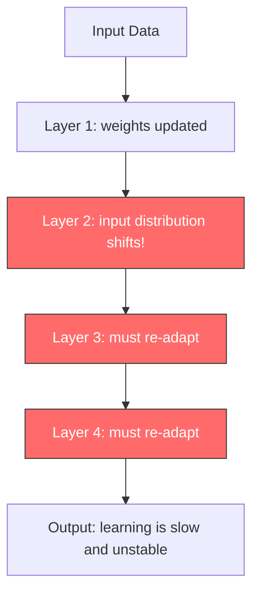
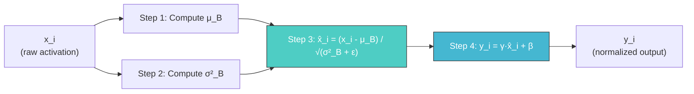
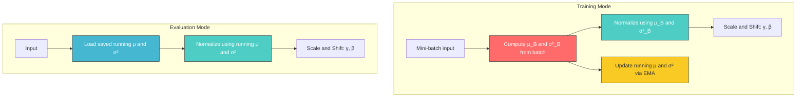
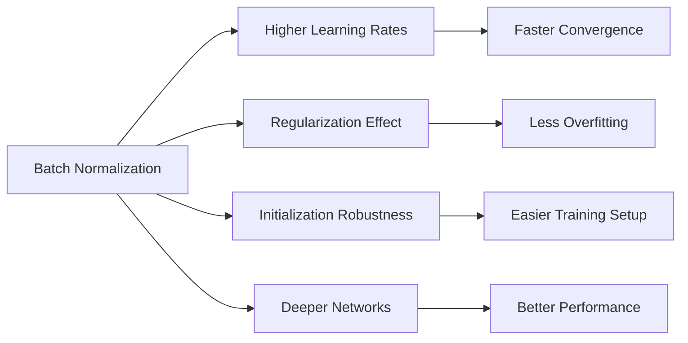
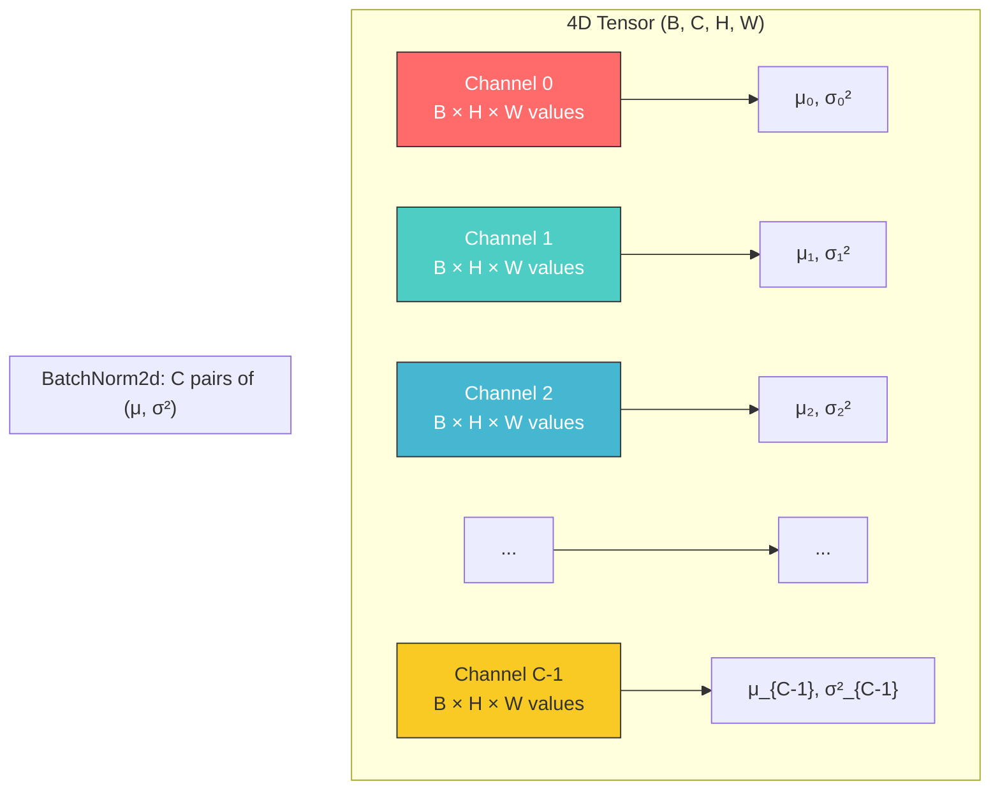
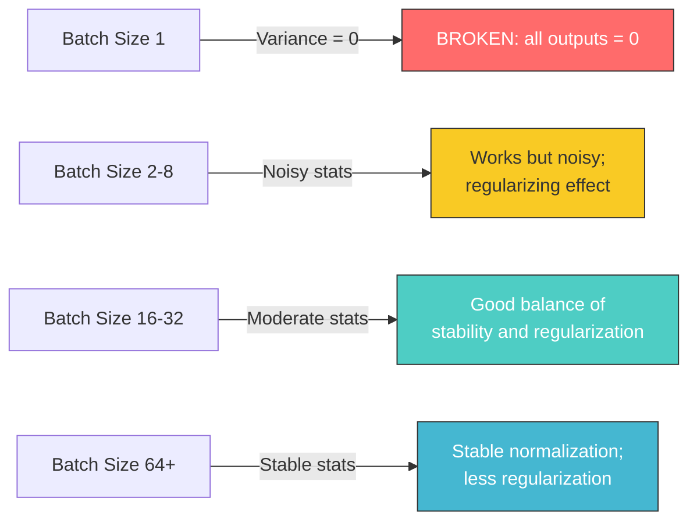
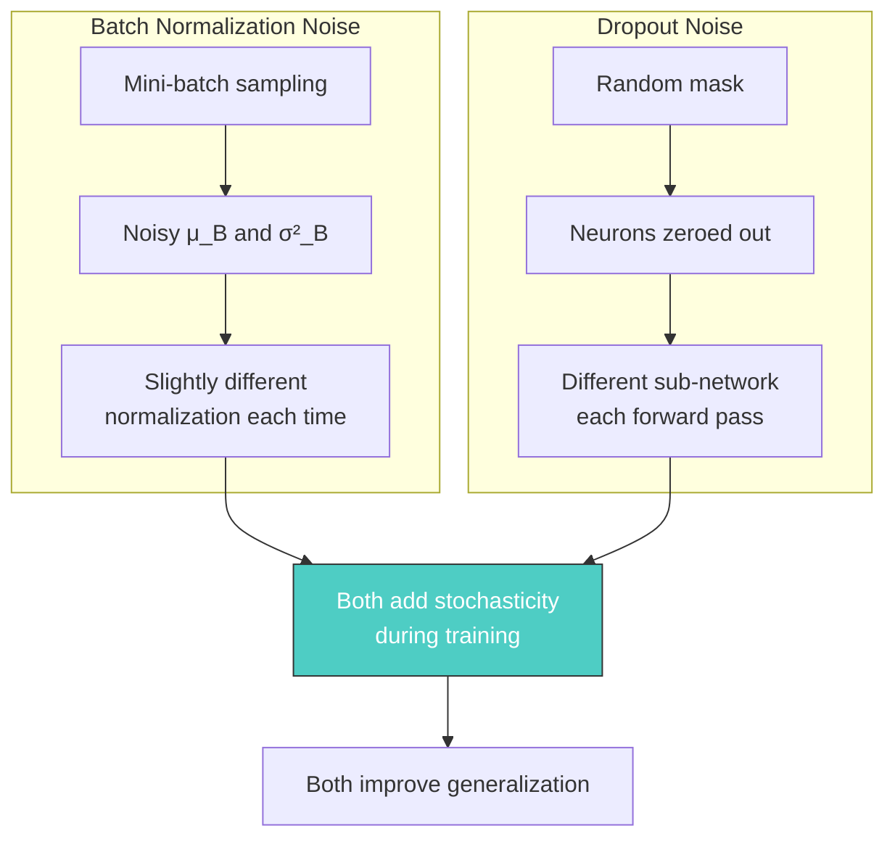
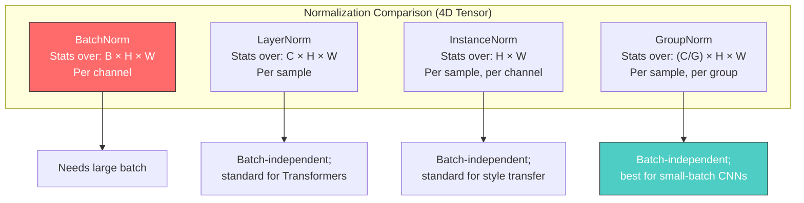

# 16. Batch Normalization

## Overview

Batch Normalization (BN) is one of the most impactful innovations in deep learning, introduced by Sergey Ioffe and Christian Szegedy in their 2015 paper *"Batch Normalization: Accelerating Deep Network Training by Reducing Internal Covariate Shift."* This technique addresses a fundamental problem that plagues the training of deep neural networks: the shifting distribution of activations between layers. Before Batch Normalization, training very deep networks was an exercise in frustration, requiring painstakingly careful initialization, tiny learning rates, and long convergence times. After Batch Normalization, practitioners could train networks an order of magnitude faster, use learning rates that would previously have caused divergence, and stack dozens more layers without encountering optimization instability. Understanding Batch Normalization thoroughly is essential for anyone working with modern convolutional architectures, as it is embedded in virtually every successful CNN from ResNet to EfficientNet.

---

## Internal Covariate Shift: The Problem Batch Normalization Solves

### The Core Issue

During training, every layer in a neural network receives input activations from the layer beneath it. As the weights of the earlier layers are updated via backpropagation, the distribution of these input activations changes. This phenomenon — where the distribution of inputs to each layer shifts continuously during training — is called **Internal Covariate Shift (ICS)**. To understand why this is problematic, consider the following chain of events that unfolds during every training step.

When we update the weights of layer $k$ via gradient descent, we are changing the function that layer $k$ computes. This means that the outputs of layer $k$ — which serve as the inputs to layer $k+1$ — now have a different distribution than they did before the update. Layer $k+1$ was previously adapted to the old distribution, so it must now readjust to this new distribution. But during the next training step, the weights of layer $k$ change again, shifting the distribution yet again. Layer $k+1$ is perpetually chasing a moving target.

### Why This Slows Learning

The practical consequence of Internal Covariate Shift is that each layer must constantly re-adapt to the changing input distribution, which dramatically slows down training. Consider a sigmoid activation function: if inputs drift into the saturated regime (very large or very small values), the gradient becomes vanishingly small, and learning effectively stops for that layer. Even with ReLU, which does not saturate for positive inputs, distribution shifts can push a large fraction of activations into the negative regime where ReLU outputs zero, causing the "dying ReLU" problem where neurons permanently stop updating.

Furthermore, when input distributions are unstable, we are forced to use very small learning rates to prevent updates from being too destructive. Small learning rates mean slow convergence. We also need to be extremely careful with weight initialization, because a poor initialization can cause the initial activation distributions to be so far from optimal that training never recovers. Batch Normalization was designed to eliminate — or at least substantially mitigate — all of these problems by normalizing the activations at each layer.

> [!note] Historical Context
> Before Batch Normalization (2015), training deep networks required techniques like careful initialization (Xavier, He), lower learning rates, and gradient clipping. BN made many of these workarounds less critical, though good initialization is still recommended practice.

### Formal Description of the Problem

Let $\mathbf{x} = (x_1, x_2, \ldots, x_m)$ be the activations of some layer over a mini-batch of size $m$. Each $x_i$ is a scalar activation value. The distribution of $\mathbf{x}$ depends on all the parameters of the preceding layers $\Theta = \{\theta_1, \theta_2, \ldots, \theta_{k-1}\}$. When we update any $\theta_j$, the distribution of $\mathbf{x}$ changes. The learning system thus needs to continuously adapt to the new distribution, which makes the optimization landscape effectively non-stationary from the perspective of each individual layer.



> [!warning] Common Misconception
> While the original BN paper framed the problem as "Internal Covariate Shift," subsequent research (Santurkar et al., 2018, "How Does Batch Normalization Help Optimization?") has shown that BN's benefits may not primarily come from reducing ICS per se, but rather from smoothing the optimization landscape. The practical benefits of BN are uncontested regardless of the theoretical explanation.

---

## The 4-Step BatchNorm Math

Batch Normalization operates as a differentiable transformation applied to each activation in a layer. Given a mini-batch of activations $\mathcal{B} = \{x_1, x_2, \ldots, x_m\}$, the Batch Normalization transform produces normalized outputs $\{y_1, y_2, \ldots, y_m\}$ through a precise four-step procedure. Each step has a clear mathematical motivation and purpose, which we derive and explain below.

### Step 1: Compute the Batch Mean

$$\mu_{\mathcal{B}} = \frac{1}{m} \sum_{i=1}^{m} x_i$$

The batch mean $\mu_{\mathcal{B}}$ is the empirical average of all activation values in the current mini-batch. This serves as our estimate of the true mean of the activation distribution at this layer. We use the mini-batch mean rather than the full dataset mean because computing the full dataset mean at every training step would be prohibitively expensive. The mini-batch mean is an unbiased estimator of the true mean, meaning that on average across many mini-batches, it converges to the true population mean. This is a direct consequence of the Law of Large Numbers: as the number of samples increases, the sample mean converges to the expected value.

Why do we compute the mean first? Because normalization requires us to center the distribution around zero, and we cannot center the data without knowing where the center currently is. The mean tells us the current "location" of the activation distribution, and we will subtract it in Step 3 to shift the distribution to be centered at zero.

### Step 2: Compute the Batch Variance

$$\sigma_{\mathcal{B}}^2 = \frac{1}{m} \sum_{i=1}^{m} (x_i - \mu_{\mathcal{B}})^2$$

The batch variance $\sigma_{\mathcal{B}}^2$ measures the spread of the activation values around the mean. A large variance indicates that activations are widely dispersed, while a small variance indicates they are tightly clustered. We need the variance because normalization requires us to rescale the distribution to have unit variance, and we cannot rescale without knowing the current scale. Note that this formula uses $\frac{1}{m}$ (the biased estimator) rather than $\frac{1}{m-1}$ (the unbiased estimator). This is a deliberate choice in the original Batch Normalization formulation: the biased estimator is used because the variance is not being used as a standalone statistical estimate but rather as one component of the normalization transformation, and the biased version provides more stable gradient computations during backpropagation.

The variance is computed from the squared deviations from the mean, which is why Step 1 must be completed before Step 2. Each term $(x_i - \mu_{\mathcal{B}})^2$ measures how far one particular activation deviates from the average, and the average of these squared deviations gives us a single number characterizing the overall spread.

### Step 3: Normalize

$$\hat{x}_i = \frac{x_i - \mu_{\mathcal{B}}}{\sqrt{\sigma_{\mathcal{B}}^2 + \epsilon}}$$

This is the core normalization step. Each activation $x_i$ is centered by subtracting the batch mean and then scaled by dividing by the square root of the batch variance (plus a small constant $\epsilon$). After this transformation, each $\hat{x}_i$ has approximately zero mean and unit variance across the mini-batch. The normalization ensures that, regardless of what the preceding layers did to the input distribution, the output of the Batch Normalization layer always has a consistent, well-behaved distribution.

> [!tip] Why $\epsilon$ Exists
> The constant $\epsilon$ (epsilon) is a small positive number, typically set to $10^{-5}$ in PyTorch. Its purpose is **numerical stability**: if the variance $\sigma_{\mathcal{B}}^2$ happens to be zero or extremely close to zero (which can occur if all activations in the mini-batch are identical), then dividing by $\sqrt{\sigma_{\mathcal{B}}^2}$ would involve division by zero, producing infinity or NaN values. Adding $\epsilon$ ensures the denominator is always strictly positive, preventing numerical catastrophe. The value $10^{-5}$ is small enough that it has no meaningful effect on the normalization when the variance is normal (e.g., $\sigma^2 = 1.0$), but large enough to prevent division by zero when the variance is vanishingly small.

### Step 4: Scale and Shift (the Learnable Parameters)

$$y_i = \gamma \hat{x}_i + \beta$$

This final step is absolutely critical and is what makes Batch Normalization a powerful, flexible transformation rather than a destructive one. After Step 3, all activations have been normalized to approximately zero mean and unit variance. However, this might not be the optimal distribution for the layer! There are several reasons why forcing zero mean and unit variance could be harmful:

1. **The optimal representation might have a non-zero mean.** For example, if the next layer is a ReLU, having the inputs centered at zero means roughly half the neurons will output zero (the negative half), which wastes representational capacity. It might be better for the inputs to be shifted positive.
2. **The optimal representation might have a variance different from 1.** A larger variance means more spread, which can help the network make sharper distinctions between different feature values.
3. **Forcing every layer to have the same distribution destroys representational power.** If the network could learn an optimal distribution for each layer, we should not prevent it from doing so.

The parameters $\gamma$ (gamma, the scale) and $\beta$ (beta, the shift) are **learnable parameters** — they are trained via backpropagation just like any other weight in the network. This means the network can, in principle, learn to completely undo the normalization by setting $\gamma = \sqrt{\sigma_{\mathcal{B}}^2 + \epsilon}$ and $\beta = \mu_{\mathcal{B}}$, which would recover the original, unnormalized activations. The fact that the network *can* undo normalization but *chooses not to* in practice is powerful evidence that normalization is beneficial — the network keeps the normalization because it helps, and uses $\gamma$ and $\beta$ only to make fine adjustments to the distribution shape.

> [!info] Key Insight
> The scale-and-shift step transforms Batch Normalization from a rigid constraint into a flexible tool. Without it, BN would force every layer into the same distribution, severely limiting what the network can represent. With it, BN provides a well-initialized, stable starting point (zero mean, unit variance) that the network can then adjust as needed.

### Summary of the Complete Transformation



| Step | Formula | Purpose | Learnable? |
|------|---------|---------|------------|
| 1 | $\mu_{\mathcal{B}} = \frac{1}{m}\sum x_i$ | Measure location of distribution | No |
| 2 | $\sigma_{\mathcal{B}}^2 = \frac{1}{m}\sum (x_i - \mu_{\mathcal{B}})^2$ | Measure spread of distribution | No |
| 3 | $\hat{x}_i = \frac{x_i - \mu_{\mathcal{B}}}{\sqrt{\sigma_{\mathcal{B}}^2 + \epsilon}}$ | Center and scale to unit variance | No |
| 4 | $y_i = \gamma \hat{x}_i + \beta$ | Restore representational flexibility | Yes |

---

## Training vs. Evaluation Mode (CRITICAL)

One of the most important and commonly misunderstood aspects of Batch Normalization is that it behaves **completely differently** during training and evaluation. Failure to understand and correctly handle this distinction will lead to silently broken models that produce nonsensical predictions.

### Training Mode

During training, Batch Normalization computes the mean $\mu_{\mathcal{B}}$ and variance $\sigma_{\mathcal{B}}^2$ from the current mini-batch. These batch statistics are used directly in Steps 1–4 of the normalization procedure described above. Additionally, and critically, the running (moving) mean and running variance are updated using an **exponential moving average** (EMA):

$$\mu_{\text{running}} \leftarrow (1 - \text{momentum}) \cdot \mu_{\text{running}} + \text{momentum} \cdot \mu_{\mathcal{B}}$$

$$\sigma^2_{\text{running}} \leftarrow (1 - \text{momentum}) \cdot \sigma^2_{\text{running}} + \text{momentum} \cdot \sigma^2_{\mathcal{B}}$$

The default `momentum` value in PyTorch is 0.1. This means that each new batch statistic contributes 10% to the running average, while the previous running average contributes 90%. Over the course of training, the running statistics gradually converge to a stable estimate of the true population mean and variance for each channel. The exponential moving average is preferred over a simple average because it gives more weight to recent batches, which is desirable because the network's activation distributions change as training progresses — we want our running statistics to reflect the most recent, most trained version of the network.

### Evaluation Mode

During evaluation (inference), Batch Normalization does **not** compute statistics from the current batch. Instead, it uses the **saved running mean** and **saved running variance** that were accumulated during training. The normalization formula becomes:

$$y_i = \gamma \cdot \frac{x_i - \mu_{\text{running}}}{\sqrt{\sigma^2_{\text{running}} + \epsilon}} + \beta$$

This is deterministic — the same input always produces the same output, which is essential for reliable evaluation and deployment. The running statistics represent the network's best estimate of the true population statistics for each channel, accumulated over the entire training process.

### Why Evaluation Mode Cannot Compute Batch Statistics

The most important reason we cannot compute batch statistics at inference time is that during deployment, we often process a **single sample** (batch size = 1). The variance of a single sample is undefined (zero by the biased formula), which would cause division by zero or nonsensical normalization. Even with batch sizes greater than 1, the batch at inference time might be small or unrepresentative, leading to unreliable statistics. Using the running averages ensures consistent, stable predictions regardless of batch size.

> [!warning] model.eval() is NON-NEGOTIABLE
> Forgetting to call `model.eval()` before inference is one of the most common and insidious bugs in deep learning code. If you forget it, BatchNorm layers will continue using mini-batch statistics during inference. With a small evaluation batch (say, batch_size=2), the computed mean and variance will be wildly different from the running statistics, producing completely wrong predictions. This bug is particularly dangerous because it does not raise any error — the model simply produces incorrect outputs silently. Always call `model.eval()` before running inference, and `model.train()` before resuming training.



### PyTorch Code for Mode Switching

```python
# Create a BatchNorm layer
# For a convolutional layer with 64 channels, we use BatchNorm2d(64)
bn_layer = nn.BatchNorm2d(num_features=64)

# --- TRAINING MODE ---
# model.train() is the DEFAULT state after model creation
# It tells BatchNorm to compute stats from the current batch
model.train()

# During training, BatchNorm:
# 1. Computes μ_B and σ²_B from the current mini-batch
# 2. Uses these to normalize the current batch
# 3. Updates running_mean and running_var via exponential moving average
output_train = model(inputs)  # BatchNorm uses batch statistics

# --- EVALUATION MODE ---
# model.eval() switches ALL layers to evaluation behavior
# For BatchNorm, this means using running statistics instead of batch statistics
model.eval()

# During evaluation, BatchNorm:
# 1. Ignores the current batch entirely for statistics
# 2. Uses the running_mean and running_var saved during training
# 3. Produces deterministic outputs (same input → same output)
output_eval = model(inputs)  # BatchNorm uses running statistics

# --- RESUMING TRAINING ---
# Don't forget to switch back to training mode!
model.train()
```

---

## Benefits of Batch Normalization

Batch Normalization provides a remarkable set of benefits that extend far beyond simply stabilizing activation distributions. Each benefit has a clear mechanistic explanation, which we explore in detail below.

### Benefit 1: Enables Higher Learning Rates

Without Batch Normalization, using a large learning rate is dangerous because it can cause the parameter updates to be so large that the activation distributions explode or collapse, pushing the network into saturated regimes where gradients vanish. With Batch Normalization, this risk is dramatically reduced because the normalization layer acts as a stabilizer: regardless of how large the updates to preceding layers are, the Batch Normalization layer will re-center and re-scale the activations to have approximately zero mean and unit variance. This means that even if a large learning rate causes dramatic changes to the weights of layer $k$, the inputs to layer $k+1$ will be re-normalized, preventing the catastrophic cascading effects that would otherwise occur.

In practice, this allows practitioners to use learning rates that are 5–10 times larger than what would be safe without Batch Normalization. Higher learning rates mean faster convergence, which means shorter training times. The combination of Batch Normalization with higher learning rates is one of the primary reasons modern deep networks can be trained in hours rather than days.

### Benefit 2: Acts as a Regularizer

Batch Normalization has a surprising and beneficial side effect: it acts as a regularizer, reducing overfitting even without explicit regularization techniques like Dropout. The mechanism is straightforward once you understand how BN uses mini-batch statistics. Each mini-batch computes its own mean and variance, which are noisy estimates of the true population statistics. This noise is injected into the normalization process — the same input will be normalized slightly differently depending on which other samples happen to be in the same mini-batch. This stochasticity is analogous to the noise injected by Dropout, and it has a similar regularizing effect: it prevents the network from relying too precisely on any specific activation value, forcing it to learn more robust features.

The regularizing effect of BN is not as strong as that of Dropout, which is why some practitioners still use both together. However, in many modern architectures, Batch Normalization alone provides sufficient regularization, and Dropout is omitted or used at a reduced rate.

### Benefit 3: Reduces Sensitivity to Weight Initialization

Weight initialization is critically important in deep networks without Batch Normalization. A poor initialization (e.g., weights too large or too small) can cause activation distributions to explode or vanish as they propagate through the layers, making training impossible. With Batch Normalization, this sensitivity is dramatically reduced because BN automatically corrects the distribution at each layer. If the weights of layer $k$ are initialized poorly, producing activations with a very large or very small mean and variance, the Batch Normalization layer after layer $k$ will simply re-center and re-scale these activations back to approximately zero mean and unit variance. Within a few training batches, the running statistics will adapt to the initialization, and the network will be in a stable training regime regardless of how the weights were initialized.

This does not mean initialization is irrelevant — good initialization still helps BN converge faster — but it means that the difference between a good initialization and a mediocre one is much smaller with BN than without it.

### Benefit 4: Allows Much Deeper Networks

Before Batch Normalization, training networks deeper than about 20–30 layers was extremely difficult. The vanishing gradient problem meant that gradients reaching the early layers were too small to produce meaningful updates, while the exploding gradient problem in other configurations caused instability. Batch Normalization mitigates both problems by ensuring that activations — and therefore gradients — remain in a reasonable range throughout the network. The normalization prevents activations from growing exponentially as they propagate forward, and it also prevents gradients from vanishing or exploding as they propagate backward. This property was essential for the success of very deep architectures like ResNet (152 layers), which would have been nearly impossible to train without Batch Normalization (or its architectural cousin, the residual connection).



---

## Where to Place Batch Normalization: Conv → BatchNorm → ReLU

The question of where to place Batch Normalization relative to other layers has been the subject of much experimentation and debate. The standard, widely-accepted order is:

$$\text{Convolution} \rightarrow \text{Batch Normalization} \rightarrow \text{ReLU}$$

### Why This Order?

The reasoning is as follows: Batch Normalization should operate on the full, un-clipped distribution of activations. ReLU clips all negative values to zero, which fundamentally distorts the distribution — after ReLU, approximately half the values are zero, and the mean is no longer zero. If we placed BN after ReLU, it would be normalizing a highly skewed, half-zeroed distribution, which defeats the purpose of centering the data. By placing BN before ReLU, we ensure that BN normalizes the complete, symmetric distribution produced by the convolution, and then ReLU can clip the normalized values.

The alternative order (Conv → ReLU → BN) has been tested and generally performs worse. When BN comes after ReLU, the running statistics it accumulates represent the ReLU-ed distribution, which is not what we want for stable inference — the running mean and variance would be biased by the zero-clipping, and the normalization would not properly center the activations for the next layer.

> [!note] The Original Paper's Suggestion
> The original Batch Normalization paper (Ioffe & Szegedy, 2015) actually suggested placing BN *before* the convolution (i.e., BN → ReLU → Conv), arguing that normalizing the inputs to the convolution is most aligned with the goal of reducing ICS. However, in practice, the Conv → BN → ReLU order has been found to work better and is the standard in virtually all modern architectures including ResNet, DenseNet, and their descendants.

### The Debate in Practice

While Conv → BN → ReLU is the dominant convention, it is worth noting that the ResNet paper (He et al., 2016) used BN → ReLU → Conv in the "pre-activation" variant and found it to work slightly better for very deep networks. The key takeaway is that the placement of BN matters, and Conv → BN → ReLU is a safe default that works well for most architectures. If you are designing a new architecture, you should experiment with the placement, but you should start with the standard order.

---

## PyTorch Implementation

### BatchNorm2d for Convolutional Layers

In PyTorch, `nn.BatchNorm2d` is used for 2D convolutional layers. The "2d" refers to the fact that it operates on 4D tensors of shape `(batch_size, channels, height, width)`. The only required argument is `num_features`, which must equal the number of channels in the input tensor.

```python
import torch
import torch.nn as nn

# Create a BatchNorm2d layer for a convolutional layer with 64 output channels
# num_features must match the number of channels in the input tensor
# eps: the epsilon added to the variance for numerical stability (default: 1e-5)
# momentum: the coefficient for the running mean/var update (default: 0.1)
# affine: whether γ and β are learnable parameters (default: True)
# track_running_stats: whether to track running mean and variance (default: True)
bn = nn.BatchNorm2d(
    num_features=64,       # Number of channels — must match conv output channels
    eps=1e-5,              # Small constant added to variance for stability
    momentum=0.1,          # EMA momentum for running stats update
    affine=True,           # If True, γ and β are learnable; if False, no scale/shift
    track_running_stats=True  # If True, tracks running mean/var for eval mode
)

# Create a random input tensor simulating a batch of feature maps
# Shape: (batch_size=32, channels=64, height=28, width=28)
# This represents 32 images, each with 64 feature channels, each of size 28×28
x = torch.randn(32, 64, 28, 28)

# Forward pass in TRAINING mode (default)
# BN will compute mean and variance from this batch of 32 samples
# It will also update running_mean and running_var
y = bn(x)  # Output shape: (32, 64, 28, 28) — same as input

# Inspect the running statistics (accumulated during training)
# These are updated after each forward pass in training mode
print(f"Running mean shape: {bn.running_mean.shape}")    # (64,) — one per channel
print(f"Running var shape: {bn.running_var.shape}")      # (64,) — one per channel
print(f"Gamma (weight) shape: {bn.weight.shape}")        # (64,) — one per channel
print(f"Beta (bias) shape: {bn.bias.shape}")             # (64,) — one per channel
```

### BatchNorm1d for Fully Connected Layers

`nn.BatchNorm1d` is used for fully connected layers where the input is a 2D tensor of shape `(batch_size, num_features)` or a 3D tensor of shape `(batch_size, num_features, length)`. For most standard feedforward networks, you will use the 2D form.

```python
# Create a BatchNorm1d layer for a fully connected layer with 512 features
# num_features must match the feature dimension of the input tensor
bn_fc = nn.BatchNorm1d(num_features=512)

# Create a random input tensor simulating a batch of FC layer outputs
# Shape: (batch_size=64, features=512)
x_fc = torch.randn(64, 512)

# Forward pass in training mode
# BN computes mean and variance over the batch dimension (dim=0)
# That is, for each feature j, it computes mean and variance across all 64 samples
y_fc = bn_fc(x_fc)  # Output shape: (64, 512) — same as input
```

### Complete CNN Block with Batch Normalization

```python
import torch
import torch.nn as nn
import torch.nn.functional as F


class ConvBlock(nn.Module):
    """
    A standard convolutional block: Conv → BatchNorm → ReLU.
    
    This is the fundamental building block of modern CNNs.
    The order Conv → BN → ReLU is critical:
    - Conv produces the raw feature maps
    - BatchNorm normalizes the distribution (zero mean, unit variance)
    - ReLU provides non-linearity, clipping negative values after normalization
    """
    
    def __init__(self, in_channels, out_channels, kernel_size=3, stride=1, padding=1):
        # Call the parent class (nn.Module) constructor
        # This is REQUIRED for all custom nn.Module subclasses
        super(ConvBlock, self).__init__()
        
        # Convolutional layer: extracts spatial features from input
        # in_channels: number of input feature channels
        # out_channels: number of output feature channels (number of filters)
        # kernel_size: size of the convolution kernel (3×3 is standard)
        # stride: step size of the convolution (1 preserves spatial dimensions with padding=1)
        # padding: zero-padding added to input (1 keeps 3×3 conv as same-size output)
        # bias=False: we OMIT bias because BatchNorm has a learnable β parameter
        #   that subsumes the role of the bias. Having both would be redundant.
        self.conv = nn.Conv2d(
            in_channels=in_channels,
            out_channels=out_channels,
            kernel_size=kernel_size,
            stride=stride,
            padding=padding,
            bias=False  # No bias! BatchNorm's β replaces it
        )
        
        # Batch Normalization: normalizes activations per channel
        # num_features must match out_channels of the preceding conv layer
        self.bn = nn.BatchNorm2d(num_features=out_channels)
        
        # ReLU activation: provides non-linearity
        # inplace=True saves memory by modifying the tensor in-place
        # CAUTION: inplace can sometimes cause issues with certain operations
        self.relu = nn.ReLU(inplace=True)
    
    def forward(self, x):
        """
        Forward pass: Conv → BN → ReLU
        
        Args:
            x: input tensor of shape (B, C_in, H, W)
        
        Returns:
            output tensor of shape (B, C_out, H, W)
        """
        # Step 1: Apply convolution to extract features
        x = self.conv(x)
        
        # Step 2: Apply Batch Normalization to stabilize the distribution
        # During training: uses batch statistics and updates running stats
        # During evaluation: uses saved running statistics
        x = self.bn(x)
        
        # Step 3: Apply ReLU to introduce non-linearity
        # After BN, approximately half the values will be negative and zeroed out
        x = self.relu(x)
        
        return x


# Example usage of the ConvBlock
block = ConvBlock(in_channels=3, out_channels=64)
dummy_input = torch.randn(16, 3, 32, 32)  # Batch of 16 RGB 32×32 images
output = block(dummy_input)  # Shape: (16, 64, 32, 32)

# Switch to evaluation mode before inference
block.eval()
test_output = block(torch.randn(1, 3, 32, 32))  # Single image inference
```

### Why bias=False with BatchNorm?

When using Batch Normalization after a convolutional layer, the bias term in the convolution is redundant. Here is the mathematical reason: the convolution computes $z = W * x + b$, and then Batch Normalization computes $\hat{z} = (z - \mu) / \sigma$. The bias $b$ will be subtracted out when we compute $z - \mu$, because $\mu$ absorbs the bias. Then the learnable $\beta$ in Step 4 effectively replaces the role of the bias. Having both $b$ and $\beta$ is wasteful (they would compete during optimization) and adds unnecessary parameters. Setting `bias=False` saves a small amount of memory and computation, and is standard practice.

---

## Spatial Batch Normalization: How BN Works on 4D Tensors

Understanding how Batch Normalization operates on 4D convolutional tensors is crucial for correctly implementing and debugging CNNs. A convolutional feature map has shape `(B, C, H, W)` where `B` is batch size, `C` is the number of channels, and `H × W` are the spatial dimensions. Batch Normalization computes one mean and one variance **per channel**, where each statistic is computed across all batch elements and all spatial locations.

### What This Means Concretely

For channel $c$, the mean is computed over all values in the batch and spatial dimensions:

$$\mu_c = \frac{1}{m \cdot H \cdot W} \sum_{i=1}^{m} \sum_{h=1}^{H} \sum_{w=1}^{W} x_{i,c,h,w}$$

The total number of elements contributing to each mean is $m \times H \times W$, where $m$ is the batch size. For a batch of 32 images with 64 channels and 28×28 spatial dimensions, each channel mean is computed from $32 \times 28 \times 28 = 25,088$ values. This is a much larger sample than what BatchNorm1d uses for FC layers, which typically only has $m$ values per feature.



### Why Per-Channel Normalization?

Normalizing per channel (rather than per-pixel or per-sample) makes sense because each channel represents a different feature detector. Channel 0 might detect horizontal edges, channel 1 might detect vertical edges, and so on. Each feature has its own natural scale and distribution, so each should be normalized independently. If we normalized across channels, we would be mixing fundamentally different quantities, which would destroy the feature-specific information.

> [!info] Contrast with BatchNorm1d
> For `BatchNorm1d` applied to FC layers, the input has shape `(B, F)` where `F` is the number of features. Each feature $f$ has its own mean and variance computed across the batch dimension only, giving $F$ pairs of statistics with $m$ elements each. This is analogous to the per-channel normalization in `BatchNorm2d`.

---

## Advanced BN Dynamics: Impact of Mini-Batch Size

The behavior and effectiveness of Batch Normalization are strongly influenced by the mini-batch size used during training. This is because the quality of the batch statistics (mean and variance) depends directly on the number of samples in the batch.

### Large Batch Sizes (e.g., 64–256+)

With a large batch size, the computed batch mean and variance are reliable estimates of the true population statistics. The normalization is accurate and stable, which provides the maximum benefit of BN in terms of optimization landscape smoothing. However, the regularizing effect (from noisy batch statistics) is reduced, because the statistics are less noisy. If you are using large batch sizes with BN, you may need to add explicit regularization (like Dropout or weight decay) to prevent overfitting.

### Small Batch Sizes (e.g., 2–8)

With small batch sizes, the computed batch statistics are noisy — the mean and variance fluctuate significantly from batch to batch. This noise acts as a regularizer (similar to Dropout), but it also makes the normalization less precise. The training may still converge, but the quality of the running statistics (accumulated via EMA) may be degraded because the individual batch statistics are so noisy. Some practitioners use a smaller momentum value (e.g., 0.01 instead of 0.1) with small batch sizes to make the running average more stable.

### Batch Size = 1: BROKEN

Batch Normalization **cannot work** with batch size 1. The reason is fundamental: with a single sample, the batch mean equals the sample value itself ($\mu_{\mathcal{B}} = x_1$), and the biased variance is exactly zero ($\sigma^2_{\mathcal{B}} = \frac{1}{1}(x_1 - x_1)^2 = 0$). The normalization step would compute $\hat{x}_1 = \frac{x_1 - x_1}{\sqrt{0 + \epsilon}} = \frac{0}{\sqrt{\epsilon}} = 0$ for every single activation. Every input would be mapped to zero, destroying all information. The epsilon constant prevents division by zero, but it cannot prevent the numerator from being zero. This is why you should never use batch_size=1 with BatchNorm.

> [!warning] Never Use Batch Size 1 with BatchNorm
> If your GPU memory forces you to use batch_size=1, you MUST replace BatchNorm with an alternative normalization method (see below). Using BN with batch_size=1 will produce zero activations during training, making learning impossible.



---

## BN vs Dropout Comparison

Batch Normalization and Dropout are both techniques that add noise during training to improve generalization, but they operate through fundamentally different mechanisms. Understanding their similarities and differences is essential for deciding when and how to use them together.

### Mechanism Comparison

| Aspect | Batch Normalization | Dropout |
|--------|-------------------|---------|
| **What it adds noise to** | Activation distributions (via noisy batch statistics) | Individual neuron outputs (via zeroing) |
| **Source of noise** | Sampling variance in mini-batch statistics | Random binary mask (Bernoulli) |
| **When noise is present** | Training only (eval uses running stats) | Training only (eval uses full network) |
| **Primary purpose** | Stabilize and accelerate training | Prevent overfitting / co-adaptation |
| **Regularization effect** | Mild (secondary benefit) | Strong (primary purpose) |
| **Learnable parameters** | Yes (γ and β) | No |
| **Interaction with batch size** | Strongly affected | Independent of batch size |



### Practical Tip: Reduce Dropout When Using BN

Because Batch Normalization already provides a regularizing effect, using full-strength Dropout alongside BN can result in over-regularization, where the model underfits because too much noise is injected during training. In practice, if you are using BN in a network, you should reduce the Dropout rate or remove Dropout entirely. For example, instead of using `p=0.5` for Dropout (the standard value without BN), you might use `p=0.2` or `p=0.3` when BN is present. In many modern architectures (ResNet, EfficientNet), Dropout is omitted entirely, with BN providing sufficient regularization. However, if your dataset is very small and overfitting is severe, combining BN with a low Dropout rate can still be beneficial.

---

## Alternatives When Batch Size Is Small

When the batch size is too small for Batch Normalization to work well, several alternative normalization techniques are available. Each computes statistics differently, avoiding the dependency on batch dimension.

### Group Normalization (GN)

Group Normalization, introduced by Wu and He in 2018, divides the channels into groups and computes normalization statistics within each group. It does not depend on the batch dimension at all, making it suitable for small batch sizes or even batch_size=1. For a tensor of shape `(B, C, H, W)`, if we divide the `C` channels into `G` groups (each containing `C/G` channels), the mean and variance are computed over the `(C/G) × H × W` elements within each group for each sample independently.

$$\mu_g = \frac{1}{(C/G) \cdot H \cdot W} \sum_{c \in g} \sum_{h,w} x_{c,h,w}$$

Group Normalization is the recommended alternative when batch sizes are small (e.g., in object detection or video processing where memory constraints limit batch size). With `G=32` groups (a common default), GN has been shown to match or exceed BN performance at small batch sizes.

### Layer Normalization (LN)

Layer Normalization computes statistics across all channels and spatial dimensions for each sample independently. For a tensor of shape `(B, C, H, W)`, the mean and variance are computed over the `C × H × W` elements of each sample. Layer Normalization is the standard choice for Transformer architectures and sequence models, where batch sizes may vary and the concept of "batch statistics" is less meaningful. It is also independent of batch size and produces deterministic normalization.

### Instance Normalization (IN)

Instance Normalization computes statistics across the spatial dimensions only, independently for each channel and each sample. For a tensor of shape `(B, C, H, W)`, the mean and variance are computed over the `H × W` elements of each channel-sample pair. Instance Normalization is primarily used in style transfer, where the goal is to normalize the style (captured by per-instance statistics) while preserving the content.



### PyTorch Implementations of Alternatives

```python
import torch.nn as nn

# Group Normalization: divide 64 channels into 32 groups (2 channels per group)
# num_groups must evenly divide num_channels
gn = nn.GroupNorm(num_groups=32, num_channels=64)

# Layer Normalization: normalize over C, H, W dimensions for each sample
# normalized_shape must match the shape of dimensions being normalized
ln = nn.LayerNorm(normalized_shape=[64, 28, 28])

# Instance Normalization: normalize over H, W for each sample and channel
# Similar to BatchNorm2d API but computes stats per instance
inn = nn.InstanceNorm2d(num_features=64)
```

---

## Summary

Batch Normalization is a transformative technique that addresses the problem of Internal Covariate Shift by normalizing the activations at each layer. The four-step process (compute mean, compute variance, normalize, scale and shift) ensures stable activation distributions while preserving the network's representational power through learnable parameters. The critical distinction between training mode (batch statistics) and evaluation mode (running statistics) must always be respected, with `model.eval()` being non-negotiable for inference. BN enables higher learning rates, acts as a mild regularizer, reduces initialization sensitivity, and allows training of much deeper networks. When batch sizes are too small for BN to be effective, Group Normalization provides a robust alternative. Understanding these dynamics is essential for designing and training modern convolutional architectures effectively.
