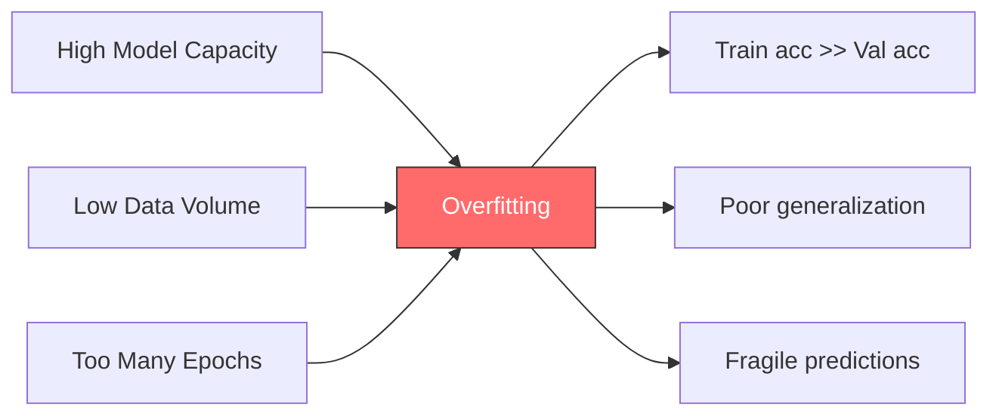
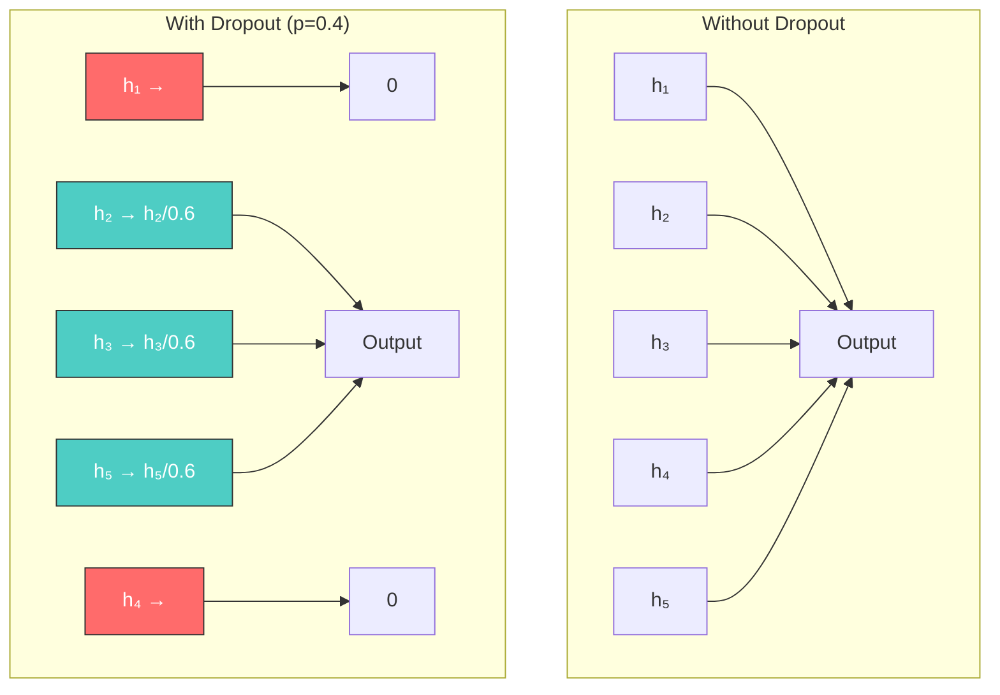
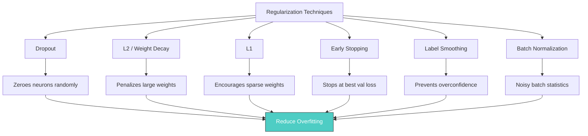

# 17. Dropout and Regularization

## Overview

Regularization is the set of techniques used to prevent a neural network from overfitting to the training data. Overfitting is the single most common failure mode in deep learning: the model memorizes the training examples so thoroughly that it fails to generalize to unseen data. Among all regularization techniques, Dropout — introduced by Nitish Srivastava, Geoffrey Hinton, and colleagues in their 2014 paper *"Dropout: A Simple Way to Prevent Neural Networks from Overfitting"* — stands out as one of the most elegant, effective, and widely-used methods. This section provides an exhaustive treatment of overfitting, Dropout, and the broader family of regularization techniques that every deep learning practitioner must understand.

---

## Overfitting: The Central Problem

### Definition

Overfitting occurs when a model learns patterns that are specific to the training data but do not generalize to unseen data. In other words, the model has memorized the training examples — including their noise and idiosyncrasies — rather than learning the underlying patterns that would allow it to make accurate predictions on new inputs. An overfit model performs exceptionally well on the training set but poorly on the validation and test sets. This gap between training performance and validation performance is the hallmark of overfitting and the primary diagnostic signal that regularization is needed.

### The Exam Memorization Analogy

Think of overfitting as a student who memorizes the exact answers to every question on a practice exam without understanding the underlying concepts. When the actual exam arrives with different questions (but testing the same concepts), this student fails catastrophically because they never learned the general principles — they only memorized specific input-output pairs. In contrast, a student who understands the concepts can answer new questions correctly because they have learned the underlying patterns, not just the specific examples. A neural network that overfits is like the memorizing student: it has stored the training data rather than extracting the generalizable features.

### How to Detect Overfitting

The most reliable way to detect overfitting is to monitor both the training loss (or accuracy) and the validation loss (or accuracy) during training. In a well-generalizing model, both training and validation metrics improve steadily and converge to similar values. In an overfitting model, the training metrics continue to improve while the validation metrics plateau and then begin to degrade. The point at which validation loss starts increasing while training loss continues decreasing is called the **divergence point**, and it marks the onset of overfitting.

Mathematically, overfitting is indicated when:

$$\text{Training Accuracy} \gg \text{Validation Accuracy}$$

For example, if your training accuracy is 99% but your validation accuracy is 75%, you are severely overfitting. A healthy gap might be 2–5 percentage points; a gap of 20+ points indicates serious overfitting that needs to be addressed.

### Why Overfitting Happens

Overfitting occurs due to a fundamental imbalance between model capacity and data availability. The three primary causes are:

1. **Too many parameters relative to training data**: A model with millions of parameters can easily memorize a dataset of only thousands of examples. The model has so many degrees of freedom that it can fit the training data perfectly without needing to learn generalizable features. This is the "death by capacity" problem — the model is powerful enough to memorize rather than generalize.
2. **Too little training data**: Even a moderately-sized model will overfit if the training dataset is too small. With insufficient examples, the model cannot learn the true data distribution; it can only learn the specific examples it has seen. The model's representation of the data is built on an inadequate sample, leading to poor generalization.
3. **Training for too many epochs**: Even with an appropriate model size and sufficient data, training for too long will eventually cause overfitting. As training progresses, the model transitions from learning generalizable features to fitting the noise in the training data. This is why early stopping (discussed later) is an effective regularization technique.



> [!warning] Overfitting is Not Always Obvious
> Overfitting can be subtle. A model that achieves 92% training accuracy and 88% validation accuracy may seem fine, but if a properly regularized version of the same model achieves 89% training accuracy and 89% validation accuracy, the regularized model is actually better — it generalizes more reliably even though its training accuracy is lower. Always compare validation metrics, not training metrics.

---

## Dropout: The Technique

### What Dropout Does

Dropout is a regularization technique that, during each forward pass in training, randomly "drops" (sets to zero) a fraction of neurons in a layer. Each neuron is independently dropped with probability $p$ (called the dropout rate), and the remaining neurons have their outputs scaled up by a factor of $\frac{1}{1-p}$. This scaling is critical and is called **inverted dropout** — it ensures that the expected value of each neuron's output remains the same whether or not dropout is applied, which simplifies the transition between training and evaluation modes.

### Mathematical Formulation

For a layer with activations $\mathbf{h} = (h_1, h_2, \ldots, h_n)$, dropout applies a random binary mask $\mathbf{r} = (r_1, r_2, \ldots, r_n)$ where each $r_i$ is drawn independently from a Bernoulli distribution:

$$r_i \sim \text{Bernoulli}(1 - p)$$

Each $r_i$ is 1 with probability $(1-p)$ and 0 with probability $p$. The dropout output is then:

$$\tilde{h}_i = \frac{r_i \cdot h_i}{1 - p}$$

When $r_i = 0$ (dropped), $\tilde{h}_i = 0$. When $r_i = 1$ (kept), $\tilde{h}_i = \frac{h_i}{1-p}$, which scales up the output to compensate for the missing neurons. The expected value is preserved:

$$E[\tilde{h}_i] = E\left[\frac{r_i \cdot h_i}{1-p}\right] = \frac{h_i}{1-p} \cdot E[r_i] = \frac{h_i}{1-p} \cdot (1-p) = h_i$$

This preservation of expected value is what makes dropout work seamlessly: at test time, we use all neurons with no scaling, and the expected output matches the expected output during training.



---

## WHY Dropping Neurons Helps (3 Reasons in Depth)

### Reason 1: Prevents Co-adaptation

In an unregularized network, neurons can develop **co-adaptations**: complex interdependencies where certain neurons only produce useful outputs when specific other neurons are also active. For example, neuron A might learn to detect "pointy ears" and neuron B might learn to detect "whiskers," but neuron C might only activate when both A and B are active, meaning C is essentially a "cat face" detector that relies on A and B being present. This co-adaptation is problematic because if A or B is somehow disrupted (by input noise, distribution shift, or simply being in a different context), C also fails, creating a fragile cascade of dependencies.

Dropout breaks these co-adaptations by making it impossible for any neuron to rely on any specific other neuron being present. Since each neuron has a probability $p$ of being dropped during any given forward pass, no neuron can afford to depend on a specific partner. Each neuron must learn features that are **individually useful** — features that contribute meaningfully to the output regardless of which other neurons are active. This makes the network more robust because the learned features are independently meaningful rather than only meaningful in specific combinations.

### Reason 2: Ensemble Effect

Dropout effectively trains an **ensemble** of neural networks during a single training run. Consider a fully connected layer with $n$ neurons. With dropout rate $p$, each neuron can be either present or absent, giving $2^n$ possible sub-network configurations (though in practice, most of these will never be explicitly visited during training). Each training forward pass uses a different random subset of neurons, which corresponds to training a different sub-network. The gradient update for each sub-network is applied only to the neurons that were active during that forward pass.

At test time, when all neurons are active, the full network can be interpreted as an **approximate ensemble average** of all the sub-networks seen during training. Ensemble averaging is a well-established technique in machine learning: the average prediction of many models is consistently more accurate and more robust than the prediction of any single model. This is because different models make different errors, and averaging tends to cancel out individual errors. Dropout provides this ensemble benefit at the cost of training only one model (with shared weights across sub-networks), which is far more efficient than training $2^n$ independent models.

### Reason 3: Adds Noise for Robustness

The random zeroing of neurons during training injects stochastic noise into the network's forward pass. This noise forces the network to learn **redundant representations** — multiple independent pathways for computing the same information. If there is only one pathway for detecting a particular feature, and the neurons in that pathway are dropped, the network has no alternative and produces a poor prediction. By contrast, if the network has learned multiple redundant pathways, dropping any subset of neurons merely degrades the prediction slightly rather than catastrophically failing.

This redundant representation is directly analogous to biological neural systems, where the brain maintains robustness despite the constant death of individual neurons. The stochasticity of dropout also has a Bayesian interpretation: dropout can be viewed as performing approximate Bayesian inference, where the random masks represent sampling from a distribution over model weights. This interpretation was formalized by Gal and Ghahramani (2016) in their work on "Dropout as a Bayesian Approximation."

> [!tip] All Three Reasons Work Together
> The three reasons are not independent — they are three perspectives on the same underlying mechanism. Preventing co-adaptation leads to individually useful features, which naturally form an ensemble, which is made robust by redundant representations. Dropout's effectiveness comes from this combined effect.

---

## Dropout in Training vs. Evaluation (CRITICAL)

Just like Batch Normalization, Dropout behaves completely differently during training and evaluation. Understanding this distinction is absolutely critical — getting it wrong will produce silently incorrect results.

### Training Mode

During training, Dropout is active. Each neuron is independently dropped with probability $p$, and the surviving neurons have their outputs scaled by $\frac{1}{1-p}$ (inverted dropout). The dropout mask is resampled for every forward pass, meaning the specific set of dropped neurons changes from one training step to the next. This constant variation is what provides the regularization benefit.

### Evaluation Mode

During evaluation (inference), Dropout is **completely disabled**. No neurons are dropped — every neuron is active and uses its full, unmodified output. No scaling is applied either, because the inverted dropout scaling during training already ensured that the expected output matches the full-network output. The network uses its full capacity at test time, which is essential because we want the most accurate predictions possible.

### Why model.eval() is Mandatory

If you forget to call `model.eval()` before inference, Dropout will continue dropping neurons during evaluation. This means your predictions will be stochastic (different runs produce different results) and suboptimal (you are throwing away information). For a single prediction, dropping neurons is catastrophic because you are intentionally degrading the model's capability. For ensemble predictions (averaging over multiple stochastic forward passes), this can actually be useful as a form of uncertainty estimation (Monte Carlo Dropout), but this is an advanced technique that must be done intentionally, not accidentally.

| Behavior | Training Mode | Evaluation Mode |
|----------|--------------|-----------------|
| Dropout active? | Yes | **No** |
| Neurons dropped? | Yes, with probability $p$ | **No, all active** |
| Scaling applied? | Yes, multiply by $\frac{1}{1-p}$ | **No scaling needed** |
| Output deterministic? | No (random each pass) | **Yes (same input → same output)** |
| Purpose | Regularization | **Best possible prediction** |

> [!warning] Forgetting model.eval() Before Inference
> This is one of the most common bugs in deep learning. If you forget `model.eval()`, Dropout will randomly zero out neurons during inference, making your predictions noisy and unreliable. The bug is particularly insidious because it does not raise any error — the model simply produces inconsistent outputs. Always, always call `model.eval()` before running inference, and `model.train()` before resuming training.

---

## PyTorch Implementation

### Basic Dropout Usage

```python
import torch
import torch.nn as nn

# Create a Dropout layer with dropout probability p=0.5
# This means each neuron has a 50% chance of being zeroed during training
# The remaining neurons are automatically scaled by 1/(1-0.5) = 2.0
dropout = nn.Dropout(p=0.5)

# Create a random input tensor simulating activations from a fully connected layer
# Shape: (batch_size=4, features=6) — 4 samples, each with 6 features
x = torch.tensor([
    [1.0, 2.0, 3.0, 4.0, 5.0, 6.0],
    [0.5, 1.5, 2.5, 3.5, 4.5, 5.5],
    [0.1, 0.2, 0.3, 0.4, 0.5, 0.6],
    [10.0, 20.0, 30.0, 40.0, 50.0, 60.0]
])

# --- Training Mode (default) ---
# Dropout is active: some elements will be zeroed, others scaled up
dropout.train()  # Explicitly set to training mode (this is the default)
y_train = dropout(x)
print("Training mode output:")
print(y_train)
# You will see approximately half the values zeroed out
# The non-zero values will be multiplied by 1/(1-0.5) = 2.0
# For example, if x[0,0] = 1.0 and it's kept, y_train[0,0] = 2.0
# If x[0,1] = 2.0 and it's dropped, y_train[0,1] = 0.0

# --- Evaluation Mode ---
# Dropout is disabled: all elements are kept, no scaling
dropout.eval()  # Switch to evaluation mode
y_eval = dropout(x)
print("\nEvaluation mode output:")
print(y_eval)
# Output will be identical to the input — no elements dropped, no scaling
# y_eval == x for all elements
```

### Dropout in a CNN Architecture

```python
import torch
import torch.nn as nn


class CNNWithDropout(nn.Module):
    """
    A CNN that demonstrates proper Dropout placement.
    
    Dropout is applied after the fully connected (FC) layers,
    which are the most parameter-heavy and overfitting-prone parts
    of the network. Convolutional layers typically use less aggressive
    dropout (or none) because weight sharing already provides
    implicit regularization.
    """
    
    def __init__(self, num_classes=10):
        # Call the parent class constructor — REQUIRED for nn.Module subclasses
        super(CNNWithDropout, self).__init__()
        
        # --- Feature Extraction (Convolutional) Layers ---
        # These layers extract spatial features from the input image
        # We use a standard Conv → BN → ReLU block pattern
        
        # Block 1: 3 input channels (RGB) → 32 output channels
        self.features = nn.Sequential(
            # Conv Block 1: 3 → 32 channels
            nn.Conv2d(3, 32, kernel_size=3, padding=1, bias=False),
            nn.BatchNorm2d(32),
            nn.ReLU(inplace=True),
            nn.MaxPool2d(2, 2),  # Downsample: 32×32 → 16×16
            
            # Conv Block 2: 32 → 64 channels
            nn.Conv2d(32, 64, kernel_size=3, padding=1, bias=False),
            nn.BatchNorm2d(64),
            nn.ReLU(inplace=True),
            nn.MaxPool2d(2, 2),  # Downsample: 16×16 → 8×8
            
            # Conv Block 3: 64 → 128 channels
            nn.Conv2d(64, 128, kernel_size=3, padding=1, bias=False),
            nn.BatchNorm2d(128),
            nn.ReLU(inplace=True),
            nn.MaxPool2d(2, 2),  # Downsample: 8×8 → 4×4
        )
        
        # --- Classifier (Fully Connected) Layers ---
        # These layers map extracted features to class predictions
        # This is where Dropout is MOST important because FC layers
        # have the most parameters and are most prone to overfitting
        
        self.classifier = nn.Sequential(
            # FC Layer 1: 128 * 4 * 4 = 2048 → 512
            # This is a large layer with 2048 × 512 = 1,048,576 parameters!
            # Definitely needs Dropout to prevent overfitting
            nn.Linear(128 * 4 * 4, 512),
            nn.ReLU(inplace=True),
            # Dropout with p=0.5: drop 50% of neurons in this FC layer
            # This is the classic VGG-style dropout rate for FC layers
            nn.Dropout(p=0.5),
            
            # FC Layer 2: 512 → 256
            nn.Linear(512, 256),
            nn.ReLU(inplace=True),
            # Dropout with p=0.5: again, aggressive dropout for FC layer
            nn.Dropout(p=0.5),
            
            # Output Layer: 256 → num_classes
            # NO DROPOUT HERE! The output layer must produce reliable logits
            # Applying Dropout here would randomly zero out predictions
            nn.Linear(256, num_classes),
        )
    
    def forward(self, x):
        """
        Forward pass through the network.
        
        Args:
            x: input images of shape (B, 3, 32, 32)
        
        Returns:
            logits of shape (B, num_classes)
        """
        # Extract features using convolutional layers
        # Output shape: (B, 128, 4, 4)
        x = self.features(x)
        
        # Flatten the feature maps for the FC classifier
        # (B, 128, 4, 4) → (B, 128*4*4) = (B, 2048)
        x = x.view(x.size(0), -1)
        
        # Classify using FC layers with Dropout
        # During training: Dropout is active
        # During evaluation: Dropout is disabled
        x = self.classifier(x)
        
        return x


# --- Example Usage ---
model = CNNWithDropout(num_classes=10)
dummy_input = torch.randn(32, 3, 32, 32)  # Batch of 32 RGB 32×32 images

# Training mode: Dropout is active
model.train()
train_output = model(dummy_input)  # Some neurons zeroed in FC layers

# Evaluation mode: Dropout is disabled
model.eval()
eval_output = model(dummy_input)  # All neurons active, no zeroing
```

### Dropout2d for Convolutional Layers

When applying Dropout to convolutional layers, we should use `nn.Dropout2d` instead of `nn.Dropout`. The difference is that `Dropout2d` drops entire **channels** (feature maps) rather than individual elements. This makes more sense for convolutional features because spatially adjacent elements within a channel are highly correlated — dropping individual elements would likely have little effect because neighboring elements would compensate. Dropping an entire channel forces the network to not rely on any single feature detector, which is the true intent of Dropout.

```python
# Dropout2d: drops entire feature channels
# Each channel (across all spatial locations) is either entirely kept or entirely zeroed
# p=0.2: each channel has a 20% chance of being dropped
# This is less aggressive than the p=0.5 used for FC layers
conv_dropout = nn.Dropout2d(p=0.2)

# Example: feature maps from a convolutional layer
# Shape: (B, C, H, W) = (32, 64, 28, 28)
feature_maps = torch.randn(32, 64, 28, 28)

# Training mode: some channels will be entirely zeroed
conv_dropout.train()
output = conv_dropout(feature_maps)
# If channel 5 is dropped, output[:, 5, :, :] will be all zeros
# Remaining channels are scaled by 1/(1-0.2) = 1.25
```

---

## Standard Dropout Values

Choosing the right dropout rate $p$ is important. Too little dropout provides insufficient regularization, while too much dropout destroys the network's capacity and prevents learning. The standard values have been established through extensive empirical research.

### For Fully Connected (FC) Layers: p = 0.5

The value $p = 0.5$ was the original recommendation from the Dropout paper and remains the standard default for FC layers. At $p = 0.5$, the maximum amount of information is destroyed during training (since half the neurons are dropped), which provides the strongest regularization. This is appropriate for FC layers because they typically have the most parameters and are most prone to overfitting. The classic VGG networks use Dropout with $p = 0.5$ on their FC layers, and this value has been validated across countless architectures and datasets.

### For Convolutional Layers: p = 0.2–0.3

Convolutional layers require less aggressive dropout than FC layers for several reasons. First, convolutional layers have far fewer parameters due to **weight sharing** — each filter's weights are shared across all spatial positions, which provides an implicit form of regularization. Second, the spatial structure of convolutional features means that adjacent pixels are highly correlated, so even without dropout, the network cannot easily memorize individual training examples. Third, Batch Normalization, which is almost always used with convolutional layers, already provides a regularizing effect. Therefore, a lighter dropout rate of $p = 0.2$ to $p = 0.3$ is typically sufficient for convolutional layers.

### Special Cases

- **p = 0**: Dropout is completely disabled. This is equivalent to not using Dropout at all. Some modern architectures (ResNet, EfficientNet) achieve sufficient regularization through Batch Normalization alone and use $p = 0$.
- **p > 0.5**: Very aggressive dropout that can prevent the network from learning effectively. Only used in extreme overfitting scenarios where the dataset is tiny relative to model size.
- **Increasing p with depth**: Some practitioners use progressively higher dropout rates in deeper FC layers, on the theory that deeper layers are more prone to overfitting because they receive more abstract, dataset-specific features.

| Layer Type | Recommended $p$ | Rationale |
|-----------|-----------------|-----------|
| FC (large, >512 units) | 0.5 | Most parameters, highest overfitting risk |
| FC (small, <512 units) | 0.3–0.5 | Moderate overfitting risk |
| Convolutional | 0.2–0.3 | Weight sharing provides implicit regularization |
| Output layer | 0.0 | Never apply dropout to output predictions |

---

## Where to Place Dropout

The placement of Dropout within a network architecture matters significantly. The key principle is: **apply Dropout where overfitting risk is highest**, which typically means the largest fully connected layers.

### Most Effective on Large FC Layers

Fully connected layers are the most overfitting-prone components of a CNN because they contain the vast majority of parameters. In a typical CNN, the FC layers might contain 90% or more of the total parameters. For example, in VGG-16, the first FC layer alone has $7 \times 7 \times 512 \times 4096 = 102,760,448$ parameters — over 100 million weights in a single layer! This massive parameter count makes FC layers extremely prone to memorizing training examples, and this is precisely where Dropout is most needed and most effective.

### Never After the Output Layer

Dropout should **never** be applied after the final output layer. The reason is straightforward: the output layer produces the network's predictions (logits or probabilities), and randomly zeroing out these predictions would make the output meaningless. For a 10-class classification problem, dropping output neurons would randomly remove class predictions, which is never desirable. The output layer must produce complete, reliable predictions, and Dropout has no role there.

### Between FC Layers, Not After Activation (Debatable)

The most common placement is: `Linear → ReLU → Dropout`. This applies Dropout after the activation function, which means the zeroed values are clean (ReLU outputs are non-negative). Some practitioners place Dropout before the activation (`Linear → Dropout → ReLU`), which is also valid but less common. The difference is subtle and rarely matters in practice, but the post-activation placement is the standard convention.

---

## Other Regularization Techniques

While Dropout is the most popular explicit regularization technique, it is part of a broader family of methods that combat overfitting. Understanding these alternatives and complements is essential for building robust models.

### L2 Regularization (Weight Decay)

L2 regularization, also called **weight decay**, adds a penalty term to the loss function that discourages large weights:

$$\mathcal{L}_{\text{total}} = \mathcal{L}_{\text{original}} + \lambda \sum_{j} w_j^2$$

where $\lambda$ is the regularization strength (a hyperparameter) and the sum runs over all weights in the network (biases are typically excluded from the penalty). The L2 penalty discourages large weights by making them costly in the loss function. Small weights produce smoother, less complex decision boundaries, which tend to generalize better.

**Why it works**: Large weights allow the network to make very sharp, confident predictions that fit the training data perfectly but fail on new data. Small weights force the network to make more conservative predictions that are less sensitive to individual training examples. The L2 penalty achieves this by adding the gradient term $2\lambda w_j$ to the weight update, which constantly "decays" each weight toward zero:

$$w_j \leftarrow w_j - \eta \frac{\partial \mathcal{L}_{\text{original}}}{\partial w_j} - 2\eta\lambda w_j = (1 - 2\eta\lambda)w_j - \eta \frac{\partial \mathcal{L}_{\text{original}}}{\partial w_j}$$

The factor $(1 - 2\eta\lambda)$ shrinks the weight slightly at every step, which is why the technique is called "weight decay."

**Implementation in PyTorch**: Weight decay is specified as a parameter in the optimizer, not as a modification to the loss function. This is because PyTorch implements weight decay as a decoupled weight update rather than adding a term to the loss gradient.

```python
import torch.optim as optim

# SGD optimizer with weight decay (L2 regularization)
# weight_decay = λ in the L2 penalty formula
# Common values: 1e-4 (mild) to 1e-2 (strong)
# For most CNN training, 1e-4 to 5e-4 is a good starting point
optimizer = optim.SGD(
    model.parameters(),
    lr=0.01,
    momentum=0.9,
    weight_decay=1e-4  # L2 regularization strength
)

# Adam optimizer with weight decay
# NOTE: For Adam, use AdamW instead of Adam + weight_decay
# AdamW implements decoupled weight decay, which is more effective
optimizer_adamw = optim.AdamW(
    model.parameters(),
    lr=0.001,
    weight_decay=1e-2  # AdamW typically uses larger weight_decay than SGD
)
```

> [!tip] AdamW vs Adam + weight_decay
> The standard Adam optimizer with weight_decay implements L2 regularization by adding the penalty to the gradient, which interacts badly with Adam's adaptive learning rates. AdamW (Loshchilov & Hutter, 2019) implements **decoupled weight decay**, applying the decay directly to the weights rather than through the gradient. This produces more consistent and effective regularization. Always prefer AdamW over Adam + weight_decay.

### L1 Regularization

L1 regularization adds a penalty proportional to the **absolute value** of the weights:

$$\mathcal{L}_{\text{total}} = \mathcal{L}_{\text{original}} + \lambda \sum_{j} |w_j|$$

The key difference from L2 regularization is that L1 encourages **exact zeros** in the weight matrix, producing **sparse** models where many weights are exactly zero. This happens because the gradient of $|w_j|$ is $\pm 1$ (for $w_j \neq 0$), which applies a constant force toward zero regardless of the current weight magnitude. In contrast, L2's gradient of $2w_j$ applies a force proportional to the weight, so it gets weaker as the weight approaches zero and never quite reaches it.

L1 regularization is less commonly used in deep learning than L2, primarily because the sparsity it induces can be too aggressive for the dense, distributed representations that neural networks typically rely on. However, L1 is useful in scenarios where model interpretability is important (sparse models are easier to understand) or where computational efficiency requires a smaller effective model size.

```python
# L1 regularization is NOT built into PyTorch optimizers
# It must be implemented manually by adding the penalty to the loss

def l1_penalty(model, lambda_l1):
    """
    Compute the L1 penalty for all weight parameters in the model.
    
    Args:
        model: the neural network
        lambda_l1: L1 regularization strength
    
    Returns:
        The L1 penalty: λ * Σ|w|
    """
    l1_sum = 0.0
    for name, param in model.named_parameters():
        # Only apply L1 to weight parameters, not biases
        if 'weight' in name:
            l1_sum += param.abs().sum()  # Sum of absolute values of all weights
    return lambda_l1 * l1_sum


# Usage during training loop
# for inputs, targets in dataloader:
#     outputs = model(inputs)
#     loss = criterion(outputs, targets)  # Original loss (e.g., CrossEntropy)
#     loss_total = loss + l1_penalty(model, lambda_l1=1e-5)  # Add L1 penalty
#     optimizer.zero_grad()
#     loss_total.backward()
#     optimizer.step()
```

### Early Stopping

Early stopping is perhaps the simplest and most intuitive regularization technique: monitor the validation loss during training, and stop training when the validation loss stops improving and starts increasing. The key insight is that the divergence point — where validation loss begins to increase while training loss continues to decrease — is exactly the point where the model begins to overfit. By stopping at this point, we prevent the model from memorizing the training data and preserve its ability to generalize.

In practice, early stopping is implemented with a **patience** parameter: training continues until the validation loss has failed to improve for `patience` consecutive epochs. This prevents premature stopping due to temporary fluctuations in validation loss. Common patience values range from 5 to 20 epochs, depending on the dataset and training dynamics.

```python
# Early stopping implementation
best_val_loss = float('inf')  # Initialize to infinity
patience = 10  # Number of epochs to wait for improvement
patience_counter = 0  # Counter for epochs without improvement

for epoch in range(num_epochs):
    # Training phase
    model.train()
    train_loss = train_one_epoch(model, train_loader, optimizer, criterion)
    
    # Validation phase
    model.eval()  # IMPORTANT: switch to eval mode for validation
    val_loss = evaluate(model, val_loader, criterion)
    
    # Check if validation loss improved
    if val_loss < best_val_loss:
        best_val_loss = val_loss
        patience_counter = 0
        # Save the best model weights
        torch.save(model.state_dict(), 'best_model.pth')
    else:
        patience_counter += 1
    
    # Early stopping condition
    if patience_counter >= patience:
        print(f"Early stopping at epoch {epoch}")
        print(f"Best validation loss: {best_val_loss:.4f}")
        break

# Load the best model weights (from the epoch with lowest validation loss)
model.load_state_dict(torch.load('best_model.pth'))
```

> [!info] Early Stopping Always Saves the Best Model
> When using early stopping, you should always save the model weights from the epoch with the best validation loss, not from the final epoch. The final epoch may have worse validation performance due to overfitting that occurred after the divergence point. The saved best model is the one with the best generalization ability.

### Label Smoothing

Label smoothing replaces hard 0/1 target labels with soft targets that distribute a small amount of probability mass across all classes. For a classification problem with $K$ classes, instead of the hard target vector $[0, 0, 1, 0, \ldots, 0]$ (which puts all probability on the correct class), label smoothing uses:

$$y_i^{\text{smooth}} = \begin{cases} 1 - \alpha + \frac{\alpha}{K} & \text{if } i \text{ is the correct class} \\ \frac{\alpha}{K} & \text{otherwise} \end{cases}$$

where $\alpha$ is the smoothing parameter (typically 0.1). For a 10-class problem with $\alpha = 0.1$, the correct class target becomes $0.9 + 0.01 = 0.91$ (wait, that's not right — let me recalculate). The correct class target is $1 - 0.1 = 0.9$, and each incorrect class target is $0.1 / 10 = 0.01$. So the smoothed label is $[0.01, 0.01, 0.9, 0.01, \ldots, 0.01]$ instead of $[0, 0, 1, 0, \ldots, 0]$.

**Why this helps**: Hard targets encourage the model to become extremely confident in its predictions, pushing logits to very large magnitudes. This overconfidence makes the model fragile — a small perturbation to the input can cause a large change in the prediction. Label smoothing prevents this by distributing some probability mass to incorrect classes, which prevents the logits from growing too large and encourages the model to maintain a small degree of uncertainty. This uncertainty is actually desirable because it makes the model more robust to input noise and distribution shift.

```python
import torch.nn as nn

# PyTorch's CrossEntropyLoss has a built-in label_smoothing parameter
# label_smoothing = α in the formula above (default: 0.0, no smoothing)
criterion_smooth = nn.CrossEntropyLoss(label_smoothing=0.1)

# Compare with standard (no smoothing) loss
criterion_hard = nn.CrossEntropyLoss(label_smoothing=0.0)

# Example: 3 samples, 5 classes
logits = torch.randn(3, 5)  # Raw model outputs (before softmax)
targets = torch.tensor([0, 2, 4])  # Correct class indices

loss_smooth = criterion_smooth(logits, targets)  # With label smoothing
loss_hard = criterion_hard(logits, targets)      # Without label smoothing

# The smoothed loss will typically be slightly larger because it penalizes
# overconfident predictions that put all probability on one class
```

---

## Comparison of Regularization Techniques

| Technique | How It Works | Where to Apply | Strength | Common Value |
|-----------|-------------|----------------|----------|-------------|
| **Dropout** | Randomly zeros neurons during training | FC layers (p=0.5), Conv layers (p=0.2) | Strong | p=0.5 (FC), p=0.2 (Conv) |
| **L2 (Weight Decay)** | Penalizes large weights in loss function | All weight layers (via optimizer) | Moderate | λ=1e-4 to 5e-4 |
| **L1** | Penalizes weights, encourages sparsity | All weight layers (manual) | Moderate | λ=1e-5 |
| **Early Stopping** | Stops training when val loss increases | Training loop | Strong | patience=10 |
| **Label Smoothing** | Softens hard 0/1 targets | Loss function | Mild | α=0.1 |
| **Batch Normalization** | Noisy batch stats add regularization | After conv/FC layers | Mild | (built into BN) |



---

## Summary

Dropout is a powerful regularization technique that prevents overfitting through three complementary mechanisms: preventing neuron co-adaptation, creating an implicit ensemble of sub-networks, and adding training noise that forces redundant representations. The critical distinction between training mode (neurons dropped and scaled) and evaluation mode (full network, no dropout) must always be respected by calling `model.eval()` before inference. Standard dropout rates are $p=0.5$ for FC layers and $p=0.2\text{–}0.3$ for convolutional layers. Beyond Dropout, the regularization toolkit includes L2 weight decay (penalizing large weights), L1 regularization (encouraging sparsity), early stopping (halting training at the optimal point), and label smoothing (preventing overconfidence). In practice, the best results typically come from combining multiple regularization techniques — for example, Batch Normalization + moderate Dropout + weight decay + early stopping is a common and effective combination used in most modern CNN training pipelines.
