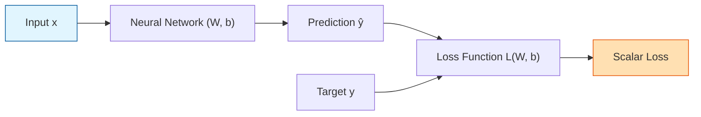
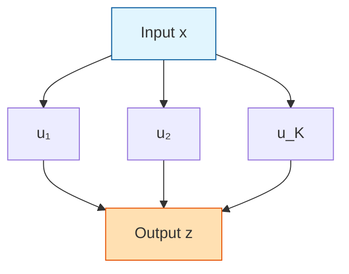
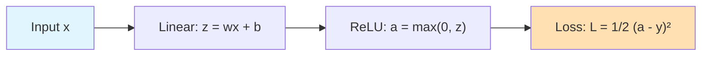
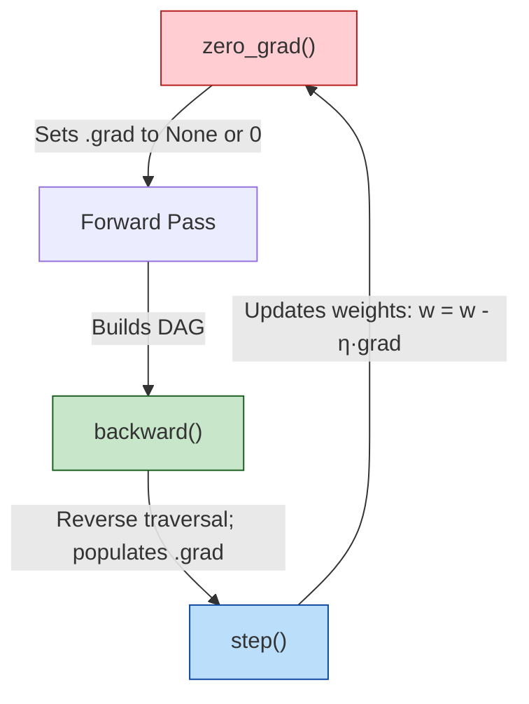
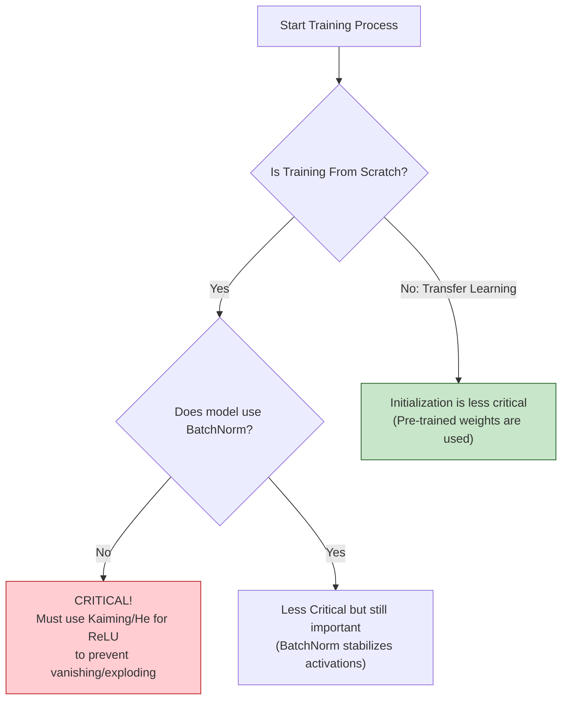
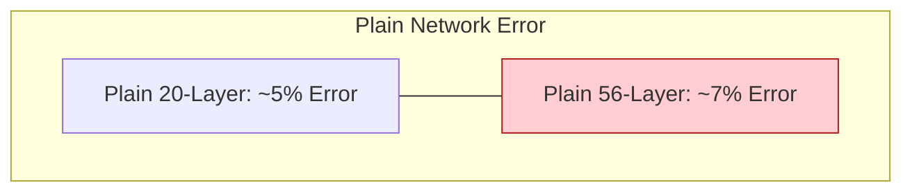
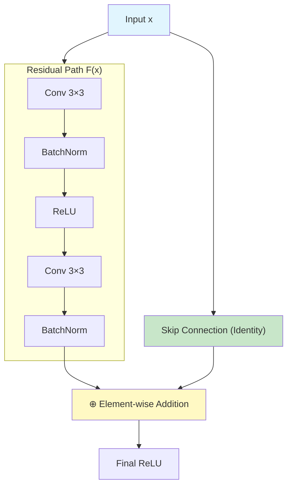
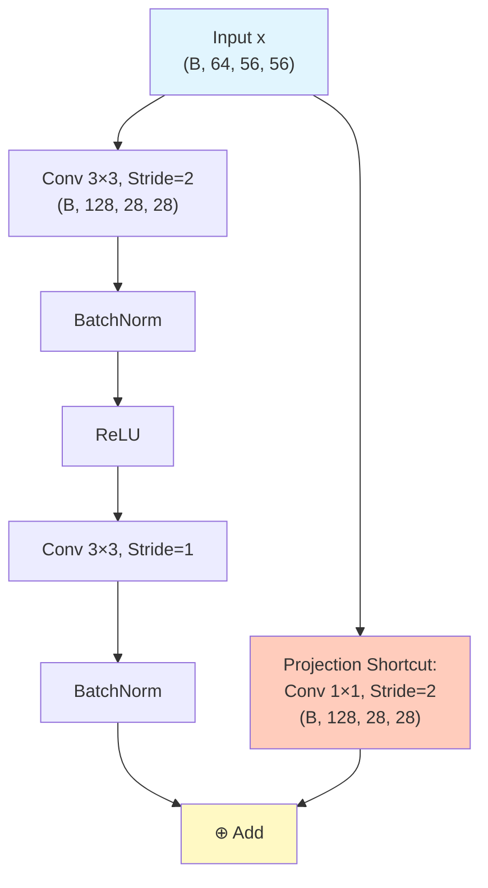

# 1. Deep Learning Optimization, Gradients, and Architectures

> [!info] Prerequisites
> Before studying this guide, you should be familiar with the fundamentals of supervised machine learning, linear algebra (matrices, vectors, and Jacobians), multivariate calculus (partial derivatives and the chain rule), and basic probability (mean, variance, and random distributions). You should also understand the structural components of Convolutional Neural Networks (CNNs), including convolutional layers, pooling operations, and basic activation functions.

---

# Part 1: The Foundations of Neural Network Optimization & Gradient Flow

## 1.1 The Goal of Training: Minimizing the Loss Function

At its most fundamental level, training a neural network is a high-dimensional, non-convex optimization problem. We parameterize our network using a set of weights $W = \{w_1, w_2, \dots, w_N\}$ and biases $b = \{b_1, b_2, \dots, b_M\}$. The performance of these parameters is evaluated using a scalar-valued **loss function** $\mathcal{L}(W, b)$, which quantifies the discrepancy between the network's predictions and the true ground-truth targets.



The mathematical objective is to find a parameter configuration $(W^*, b^*)$ that minimizes this loss over our training dataset:

$$(W^*, b^*) = \arg\min_{W, b} \mathcal{L}(W, b)$$

For regression tasks, the standard metric is the **Mean Squared Error (MSE)** loss:

$$\mathcal{L}_{\text{MSE}} = \frac{1}{2n} \sum_{i=1}^{n} \|y_i - \hat{y}_i\|^2$$

For multi-class classification tasks, the standard is the **Cross-Entropy Loss**, which measures the divergence between the predicted probability distribution $\hat{y}_i$ (typically obtained via a Softmax activation) and the true target distribution $y_i$ (often represented as a one-hot vector):

$$\mathcal{L}_{\text{CE}} = -\frac{1}{n} \sum_{i=1}^{n} \sum_{k=1}^{K} y_{i,k} \ln(\hat{y}_{i,k})$$

To navigate the parameter space, we rely on gradient-based optimization algorithms. The gradient $\nabla \mathcal{L}$ is a vector of partial derivatives pointing in the direction of the steepest rate of increase of the loss function. By updating our parameters in the opposite direction of the gradient, we iteratively move toward a local minimum:

$$W_{t+1} = W_t - \eta \nabla_{W} \mathcal{L}(W_t)$$

where $\eta > 0$ represents the learning rate.

---

## 1.2 Why We Need Calculus: The Chain of Compositions

A deep neural network does not map inputs directly to outputs through a single, simple function. Instead, it is a highly nested composition of mathematical operations. Let $\mathbf{x}$ be the input to an $L$-layer network. The forward pass is defined as:

$$\mathbf{a}^{(0)} = \mathbf{x}$$
$$\mathbf{z}^{(l)} = \mathbf{W}^{(l)} \mathbf{a}^{(l-1)} + \mathbf{b}^{(l)}, \quad \text{for } l = 1, 2, \dots, L$$
$$\mathbf{a}^{(l)} = f_l(\mathbf{z}^{(l)}), \quad \text{for } l = 1, 2, \dots, L$$
$$\mathcal{L} = \ell(\mathbf{a}^{(L)}, \mathbf{y})$$

where:
*   $\mathbf{W}^{(l)}$ and $\mathbf{b}^{(l)}$ are the weights and biases of layer $l$.
*   $\mathbf{z}^{(l)}$ is the pre-activation vector of layer $l$.
*   $f_l$ is the element-wise activation function.
*   $\mathbf{a}^{(l)}$ is the post-activation feature map vector of layer $l$.
*   $\ell$ is the final loss function comparing the network prediction $\mathbf{a}^{(L)}$ to the target $\mathbf{y}$.

Because the loss $\mathcal{L}$ is connected to the early weights (e.g., $\mathbf{W}^{(1)}$) through a sequence of intermediate representations, we cannot evaluate the derivative $\frac{\partial \mathcal{L}}{\partial \mathbf{W}^{(1)}}$ directly. We must instead compute how perturbations in the early weights propagate through every subsequent layer to change the final loss. The mathematical tool for this calculation is the multivariate chain rule.

---

## 1.3 The Chain Rule: The Mathematical Engine

### 1.3.1 Single Variable Chain Rule
If a scalar variable $z$ depends on $u$, which in turn depends on $x$ (i.e., $z = f(g(x))$ where $u = g(x)$), the rate of change of $z$ with respect to $x$ is the product of their local rates of change:

$$\frac{dz}{dx} = \frac{dz}{du} \cdot \frac{du}{dx}$$

### 1.3.2 Chain Rule for Three or More Composed Functions
For $z = f(g(h(x)))$, with intermediate variables $a = h(x)$ and $u = g(a)$, the derivative is:

$$\frac{dz}{dx} = \frac{dz}{du} \cdot \frac{du}{da} \cdot \frac{da}{dx}$$

This multiplicative formulation is highly systematic, but it also means that any extreme values (either very small or very large) in the local derivatives will compound exponentially over a deep chain of compositions.

### 1.3.3 Multivariable Chain Rule
In neural networks, layers are multidimensional: a single neuron's output can influence multiple downstream neurons. If a scalar $z$ depends on multiple intermediate variables $\mathbf{u} = [u_1, u_2, \dots, u_K]^T$, and each $u_k$ is a function of the input variable $x$, then a change in $x$ propagates along multiple parallel paths to affect $z$. The total derivative is the sum of the partial derivatives along all possible paths:

$$\frac{dz}{dx} = \sum_{k=1}^{K} \frac{\partial z}{\partial u_k} \frac{du_k}{dx} = \left( \nabla_{\mathbf{u}} z \right)^T \frac{d\mathbf{u}}{dx}$$



### 1.3.4 The General Backpropagation Principle
The backpropagation algorithm evaluates these multivariate chain-rule updates systematically by traversing the computational graph in reverse (from the output loss back to the input layers). 

At any given node representing an operation $\mathbf{y} = g(\mathbf{x})$, the node receives an incoming gradient vector $\frac{\partial \mathcal{L}}{\partial \mathbf{y}}$ from its downstream consumers. It then computes its local Jacobian matrix $\mathbf{J}_g(\mathbf{x}) = \frac{\partial \mathbf{y}}{\partial \mathbf{x}}$ and performs a vector-Jacobian product to propagate the gradient backward to its upstream inputs:

$$\frac{\partial \mathcal{L}}{\partial \mathbf{x}} = \left( \frac{\partial \mathbf{y}}{\partial \mathbf{x}} \right)^T \frac{\partial \mathcal{L}}{\partial \mathbf{y}}$$

This modular design allows each layer to compute its gradients using only its local inputs, local outputs, and the gradient propagated from the layer immediately ahead of it.

---

## 1.4 Step-by-Step Hand-Calculated Backpropagation Example

To understand the mechanics of backpropagation, we will work through a complete forward and backward pass with concrete numerical values.



### 1.4.1 Computational Setup
Our model consists of a single linear layer, a ReLU activation function, and a Mean Squared Error (MSE) loss:

$$z = w \cdot x + b$$
$$a = \text{ReLU}(z) = \max(0, z)$$
$$\mathcal{L} = \frac{1}{2}(a - y)^2$$

### 1.4.2 Initial Values
*   Input: $x = 2.0$
*   Target: $y = 8.0$
*   Weight: $w_0 = 3.0$
*   Bias: $b_0 = 1.0$
*   Learning Rate: $\eta = 0.1$

### 1.4.3 Forward Pass
We compute every intermediate activation value in order:

1.  **Linear Pre-activation ($z$):**
    $$z = w_0 \cdot x + b_0 = (3.0 \times 2.0) + 1.0 = 7.0$$

2.  **Activation ($a$):**
    $$a = \max(0, z) = \max(0, 7.0) = 7.0$$

3.  **Loss ($\mathcal{L}$):**
    $$\mathcal{L} = \frac{1}{2}(a - y)^2 = \frac{1}{2}(7.0 - 8.0)^2 = \frac{1}{2}(-1.0)^2 = 0.5$$

---

### 1.4.4 Backward Pass
We compute the local gradients in reverse order, starting from the loss and applying the chain rule at each step.

1.  **Gradient of the Loss with respect to the Activation ($\frac{\partial \mathcal{L}}{\partial a}$):**
    $$\frac{\partial \mathcal{L}}{\partial a} = \frac{\partial}{\partial a} \left[ \frac{1}{2}(a - y)^2 \right] = (a - y) = 7.0 - 8.0 = -1.0$$
    *Interpretation: A negative gradient indicates that increasing the activation $a$ will decrease the loss $\mathcal{L}$. This is correct, as our current prediction ($7.0$) is less than our target ($8.0$).*

2.  **Gradient of the Loss with respect to the Pre-activation ($\frac{\partial \mathcal{L}}{\partial z}$):**
    By the chain rule:
    $$\frac{\partial \mathcal{L}}{\partial z} = \frac{\partial \mathcal{L}}{\partial a} \cdot \frac{\partial a}{\partial z}$$
    The derivative of the ReLU function is:
    $$\frac{\partial a}{\partial z} = \begin{cases} 1 & \text{if } z > 0 \\ 0 & \text{if } z < 0 \\ \text{undefined} & \text{if } z = 0 \end{cases}$$
    Since $z = 7.0 > 0$, the derivative $\frac{\partial a}{\partial z} = 1.0$. Therefore:
    $$\frac{\partial \mathcal{L}}{\partial z} = (-1.0) \times 1.0 = -1.0$$

3.  **Gradient of the Loss with respect to the Weight ($\frac{\partial \mathcal{L}}{\partial w}$):**
    By the chain rule:
    $$\frac{\partial \mathcal{L}}{\partial w} = \frac{\partial \mathcal{L}}{\partial z} \cdot \frac{\partial z}{\partial w}$$
    Since $z = w \cdot x + b$, we have $\frac{\partial z}{\partial w} = x = 2.0$. Therefore:
    $$\frac{\partial \mathcal{L}}{\partial w} = (-1.0) \times 2.0 = -2.0$$

4.  **Gradient of the Loss with respect to the Bias ($\frac{\partial \mathcal{L}}{\partial b}$):**
    By the chain rule:
    $$\frac{\partial \mathcal{L}}{\partial b} = \frac{\partial \mathcal{L}}{\partial z} \cdot \frac{\partial z}{\partial b}$$
    Since $\frac{\partial z}{\partial b} = 1.0$, we have:
    $$\frac{\partial \mathcal{L}}{\partial b} = (-1.0) \times 1.0 = -1.0$$

---

### 1.4.5 Parameter Update (Gradient Descent)
Using our computed gradients, we apply the standard gradient descent update rule:

$$w_1 = w_0 - \eta \frac{\partial \mathcal{L}}{\partial w} = 3.0 - (0.1 \times -2.0) = 3.0 + 0.2 = 3.2$$
$$b_1 = b_0 - \eta \frac{\partial \mathcal{L}}{\partial b} = 1.0 - (0.1 \times -1.0) = 1.0 + 0.1 = 1.1$$

---

### 1.4.6 Validation of the Parameter Update
To confirm that the update successfully minimized the loss, we perform a second forward pass using the updated parameters $w_1 = 3.2$ and $b_1 = 1.1$:

1.  **New Pre-activation ($z_{\text{new}}$):**
    $$z_{\text{new}} = (3.2 \times 2.0) + 1.1 = 6.4 + 1.1 = 7.5$$
2.  **New Activation ($a_{\text{new}}$):**
    $$a_{\text{new}} = \max(0, 7.5) = 7.5$$
3.  **New Loss ($\mathcal{L}_{\text{new}}$):**
    $$\mathcal{L}_{\text{new}} = \frac{1}{2}(7.5 - 8.0)^2 = \frac{1}{2}(-0.5)^2 = 0.125$$

The loss has decreased from $0.5$ to $0.125$, confirming the mathematical correctness of our gradient updates.

---

## 1.5 PyTorch Autograd Mechanics

PyTorch uses a dynamic auto-differentiation engine called **Autograd**. This section details how it manages gradient computation under the hood.

### 1.5.1 Computational Graphs
Every time you perform an operation on a PyTorch tensor that has `requires_grad=True`, Autograd builds a directed acyclic graph (DAG) in memory. 

*   **Nodes** in this graph are functions represented by `torch.autograd.Function` objects (such as addition, multiplication, or convolution).
*   **Edges** represent the flow of tensors.
*   Every tensor that is the output of an operation contains a reference to its creator via its `.grad_fn` attribute. Leaf tensors (tensors created directly by the user, such as model weights) have `.grad_fn = None`.

```
[tensor: x] (Leaf) --------> [Multiply] <------- [tensor: w] (Leaf, requires_grad=True)
                                |
                                v
                           [tensor: z] (grad_fn=<MulBackward0>)
```

---

### 1.5.2 Dynamic Graph Construction (Define-by-Run)
Unlike frameworks that use static graphs (where the graph is defined and compiled once before execution), PyTorch uses a **define-by-run** design. The computational graph is built on the fly during the forward pass. 

Each time an operation is executed, PyTorch appends that operation and its input dependencies to the graph. This dynamic construction provides several practical advantages:
1.  **Dynamic Control Flow:** You can use standard Python conditionals (`if`, `while`, `for`) inside your model's forward pass. The graph will adapt dynamically to the executed path for each batch.
2.  **Intuitive Debugging:** Because execution is immediate, stack traces point directly to the line of Python code where an error occurred, allowing you to inspect intermediate tensor values using standard debugging tools.

---

### 1.5.3 Reverse-Mode Automatic Differentiation
When you invoke `loss.backward()`, PyTorch initiates a backward pass through the dynamic DAG:
1.  It performs a topological sort on the active computational graph to determine the correct order of derivative evaluations from the output node back to the leaf nodes.
2.  It initializes the backward pass with a seed gradient. For a scalar loss, this is $\frac{\partial \mathcal{L}}{\partial \mathcal{L}} = 1.0$.
3.  It traverses the graph in reverse order, executing the `.backward()` method of each node's `grad_fn` to compute vector-Jacobian products.
4.  It accumulates the resulting gradients directly into the `.grad` attribute of each leaf tensor that has `requires_grad=True`.

---

## 1.6 The Core Lines of a PyTorch Training Loop

Understanding how Autograd manages gradients is key to writing correct training loops. The standard optimization cycle relies on three critical steps:

```python
# Reset gradients from the previous iteration
optimizer.zero_grad()

# Compute the gradients via backpropagation
loss.backward()

# Update model parameters using the computed gradients
optimizer.step()
```

Here is what happens under the hood during each of these calls:



### 1.6.1 `optimizer.zero_grad()`
By default, PyTorch **accumulates** gradients in the `.grad` attributes of your parameters on each `.backward()` call, rather than overwriting them. This accumulation is useful for implementing techniques like virtual batch sizes (where you accumulate gradients over multiple forward passes before updating). 

However, in a standard training loop, you must clear the gradients from the previous batch before computing new ones. Failing to call `zero_grad()` will cause the gradients from the current batch to be added to those of previous batches, leading to incorrect parameter updates and optimization failure:

$$\mathbf{g}_{t} = \mathbf{g}_{t}^{\text{actual}} + \mathbf{g}_{t-1} \quad (\text{Incorrect Accumulation})$$

Calling `optimizer.zero_grad(set_to_none=True)` is generally preferred over setting gradients to zero, as it writes `None` directly to the `.grad` attributes. This reduces memory footprint and avoids executing zero-tensor allocation operations.

### 1.6.2 `loss.backward()`
This call triggers the reverse-mode auto-differentiation pass starting from the scalar `loss` tensor. It traverses the computational graph backward, evaluating local derivatives and accumulating them in the `.grad` attribute of each trainable parameter. 

Once this traversal is complete, the intermediate computational graph is automatically freed from memory to prepare for the next iteration. If you need to perform multiple backward passes on the same forward pass, you must pass `retain_graph=True` to the backward call: `loss.backward(retain_graph=True)`.

### 1.6.3 `optimizer.step()`
Once all parameters have accumulated their gradients in their respective `.grad` attributes, the optimizer applies its update rule. For basic Stochastic Gradient Descent (SGD), the update modifies the underlying tensor in-place:

$$\theta \leftarrow \theta - \eta \cdot \theta.\text{grad}$$

For advanced optimizers (such as Adam or RMSProp), `step()` also updates internal running estimates of the first and second moments of the gradients before modifying the parameter values.

---

## 1.7 Gradient Signs and Magnitudes

The gradient vector contains both direction (given by the signs of its elements) and magnitude (given by their values).

### 1.7.1 Positive Gradient ($\frac{\partial \mathcal{L}}{\partial w} > 0$)
*   **Mathematical Meaning:** The loss function and the weight are locally positively correlated. Increasing the weight's value will increase the loss.
*   **Optimizer Action:** The parameter update subtracts the gradient ($-\eta \frac{\partial \mathcal{L}}{\partial w}$), which **decreases** the parameter's value to reduce the loss.

### 1.7.2 Negative Gradient ($\frac{\partial \mathcal{L}}{\partial w} < 0$)
*   **Mathematical Meaning:** The loss function and the weight are locally negatively correlated. Increasing the weight's value will decrease the loss.
*   **Optimizer Action:** The parameter update subtracts the negative gradient, which **increases** the parameter's value to reduce the loss.

### 1.7.3 Zero Gradient ($\frac{\partial \mathcal{L}}{\partial w} = 0$)
*   **Mathematical Meaning:** The parameter is at a stationary point on the loss landscape (a local minimum, local maximum, saddle point, or within a completely flat plateau).
*   **Optimizer Action:** No change is made to the parameter ($w_{t+1} = w_t$).

### 1.7.4 Gradient Magnitude
*   **Large Gradient Magnitude:** The loss is highly sensitive to changes in this parameter. The optimizer takes a larger step, which is useful for moving quickly down steep slopes but can lead to instability if the step is too large.
*   **Small Gradient Magnitude:** The parameter has a negligible local effect on the loss, often indicating that the model is near a minimum or stuck on a flat plateau.

---

## 1.8 Inference vs. Training: `torch.no_grad()`

During the validation or deployment phase of a model, we only need to perform forward passes to make predictions. Since we are not updating the weights, we do not need to compute gradients. PyTorch provides the `torch.no_grad()` context manager to handle this efficiently:

```python
# Set the model to evaluation mode (disables dropout and uses running statistics for batch norm)
model.eval()

# Disable gradient tracking to save memory and speed up computation
with torch.no_grad():
    for images, labels in val_loader:
        outputs = model(images)
        loss = criterion(outputs, labels)
```

### 1.8.1 Computational Bookkeeping
When code is executed inside a `with torch.no_grad():` block, PyTorch disables its history-tracking machinery. It does not construct a computational graph, and tensors produced during the forward pass do not have a `grad_fn` attached.

### 1.8.2 Memory Footprint
During training, PyTorch must keep all intermediate activation tensors in GPU memory because they are required to compute local derivatives during the backward pass. This is often the primary driver of GPU memory consumption. 

By disabling gradient tracking, `torch.no_grad()` allows PyTorch to discard intermediate activation tensors as soon as the downstream layer has consumed them. This dramatically reduces memory consumption, allowing you to use much larger batch sizes during validation and inference.

### 1.8.3 Execution Speed
Without the overhead of allocating, updating, and maintaining the computational graph structures in memory, forward passes run significantly faster.

> [!warning] Silent Training Failure
> If you accidentally wrap your training loop's forward pass in a `torch.no_grad()` block, PyTorch will execute the code without throwing an error. However, because no computational graph is built, calling `loss.backward()` will raise an exception (since the loss tensor will not have a `grad_fn`), or the parameters' `.grad` attributes will remain empty, preventing any learning from taking place.

---

# Part 2: Layer-Specific Gradient Flow & The Vanishing/Exploding Gradient Problem

## 2.1 Gradient Flow in CNN Layers Specifically

Different layer types alter the magnitude and distribution of gradients during the backward pass in distinct ways.

### 2.1.1 Convolutional Layers
Let $\mathbf{X}$ be an input feature map and $\mathbf{K}$ be a convolutional kernel. The forward convolution is represented as:

$$\mathbf{Y} = \mathbf{X} * \mathbf{K}$$

For a single output element $Y_{c,i,j}$ (at channel $c$, row $i$, column $j$):

$$Y_{c,i,j} = \sum_{c_{\text{in}}} \sum_{m} \sum_{n} X_{c_{\text{in}}, i+m, j+n} \cdot K_{c, c_{\text{in}}, m, n}$$

During the backward pass, the incoming gradient is $\frac{\partial \mathcal{L}}{\partial \mathbf{Y}}$. Using the chain rule, we compute the gradient with respect to the kernel weights $\mathbf{K}$ and the input feature map $\mathbf{X}$:

1.  **Gradient with respect to the weights ($\frac{\partial \mathcal{L}}{\partial \mathbf{K}}$):**
    $$\frac{\partial \mathcal{L}}{\partial K_{c, c_{\text{in}}, m, n}} = \sum_{i} \sum_{j} \frac{\partial \mathcal{L}}{\partial Y_{c, i, j}} \cdot X_{c_{\text{in}}, i+m, j+n}$$
    This is a convolution operation between the input feature map $\mathbf{X}$ and the incoming gradient map $\frac{\partial \mathcal{L}}{\partial \mathbf{Y}}$. Because the kernel parameters are shared across all spatial locations, their final gradient is the sum of the gradient contributions from every receptive field across the entire spatial grid.

2.  **Gradient with respect to the input ($\frac{\partial \mathcal{L}}{\partial \mathbf{X}}$):**
    $$\frac{\partial \mathcal{L}}{\partial X_{c_{\text{in}}, u, v}} = \sum_{c} \sum_{m} \sum_{n} \frac{\partial \mathcal{L}}{\partial Y_{c, u-m, v-n}} \cdot K_{c, c_{\text{in}}, m, n}$$
    To propagate gradients back to previous layers, we perform a transposed convolution (or convolution with spatially flipped kernels) of the incoming gradient $\frac{\partial \mathcal{L}}{\partial \mathbf{Y}}$ with the kernel weights $\mathbf{K}$.

---

### 2.1.2 Max Pooling Layers
A max pooling layer extracts the maximum value within a spatial window:

$$Y_{i,j} = \max_{(m,n) \in \Omega(i,j)} X_{m,n}$$

where $\Omega(i,j)$ is the pooling window corresponding to output coordinates $(i,j)$.

The max operation is a non-linear selection routing function. During the forward pass, the index of the maximum element in each window is recorded:

$$\text{index}_{i,j} = \arg\max_{(m,n) \in \Omega(i,j)} X_{m,n}$$

During the backward pass, the gradient is routed using a "winner-take-all" scheme:

$$\frac{\partial \mathcal{L}}{\partial X_{m,n}} = \sum_{i,j} \frac{\partial \mathcal{L}}{\partial Y_{i,j}} \cdot \mathbb{1}\left[ (m,n) = \text{index}_{i,j} \right]$$

```
Forward Pass:                          Backward Pass:
[ 1.2   4.5 (Max) ]   ===>  [ 4.5 ]    [ 0.0   2.3 ]   <===   [ 2.3 ]
[ 0.3   2.1       ]                    [ 0.0   0.0 ]
```

The winning element receives the entire incoming gradient, while all other elements in the pooling window receive a gradient of zero. This results in sparse gradient propagation, focusing learning updates on the features that contributed most strongly to the forward activation.

---

### 2.1.3 ReLU Layers
The Rectified Linear Unit (ReLU) activation function is defined as:

$$a_i = \max(0, z_i)$$

Its local derivative is a simple step function:

$$\frac{\partial a_i}{\partial z_i} = \mathbb{1}[z_i > 0] = \begin{cases} 1 & \text{if } z_i > 0 \\ 0 & \text{if } z_i < 0 \end{cases}$$

During the backward pass, the gradient is propagated as:

$$\frac{\partial \mathcal{L}}{\partial z_i} = \frac{\partial \mathcal{L}}{\partial a_i} \cdot \mathbb{1}[z_i > 0]$$

```
Forward Pass (z):                     Backward Pass (dL/dz):
[ -3.2   5.1   -0.1 ]  ===>           [  0.0   1.8   0.0 ]  <===  dL/da = [ 1.2   1.8   0.9 ]
```

For positive activations ($z_i > 0$), the gradient passes through unchanged. For negative activations ($z_i < 0$), the gradient is completely blocked, preventing any updates to upstream parameters along that path.

---

## 2.2 The Core Phenomenon of Vanishing and Exploding Gradients

In deep neural networks, gradients are susceptible to two major failure modes: they can shrink exponentially as they flow backward (vanishing gradients), or they can grow exponentially, leading to numerical instability (exploding gradients).

### 2.2.1 Mathematical Formulation: Product of Jacobians
Consider a simplified deep network with $L$ layers where each layer has a single neuron (the scalar case). The forward pass is:

$$z^{(l)} = w^{(l)} a^{(l-1)} + b^{(l)}$$
$$a^{(l)} = f(z^{(l)})$$

The gradient of the loss $\mathcal{L}$ with respect to the pre-activation of the first layer $z^{(1)}$ is computed as:

$$\frac{\partial \mathcal{L}}{\partial z^{(1)}} = \frac{\partial \mathcal{L}}{\partial a^{(L)}} \cdot f'\left(z^{(L)}\right) \cdot \prod_{l=2}^{L} w^{(l)} f'\left(z^{(l-1)}\right)$$

In a multidimensional network with layer width $D$, the scalar products are replaced by a product of Jacobian matrices:

$$\frac{\partial \mathcal{L}}{\partial \mathbf{z}^{(1)}} = \left[ \prod_{l=2}^{L} \mathbf{W}^{(l)} \operatorname{diag}\left( f'\left(\mathbf{z}^{(l-1)}\right) \right) \right]^T \frac{\partial \mathcal{L}}{\partial \mathbf{z}^{(L)}}$$

---

### 2.2.2 The Exponential Nature of the Problem
To understand how these products behave over many layers, let us assume a simplified case where the product of the weight matrix and the activation derivative is roughly constant across layers, with an effective scaling factor of $\alpha$:

$$\left\| \mathbf{W}^{(l)} \operatorname{diag}\left( f'\left(\mathbf{z}^{(l-1)}\right) \right) \right\| \approx \alpha$$

The norm of the gradient at the first layer scales exponentially with the depth of the network:

$$\left\| \frac{\partial \mathcal{L}}{\partial \mathbf{z}^{(1)}} \right\| \propto \alpha^{L-1}$$

The table below illustrates how the gradient scale changes for different values of $\alpha$ as the network depth $L$ increases:

| $\alpha$ | $L=5$ | $L=10$ | $L=50$ | $L=100$ | Gradient Regime |
|---|---|---|---|---|---|
| **0.25** | $3.9 \times 10^{-3}$ | $1.5 \times 10^{-5}$ | $2.4 \times 10^{-24}$ | $1.4 \times 10^{-48}$ | **Severe Vanishing** (Gradients underflow to zero) |
| **0.90** | $0.65$ | $0.38$ | $5.7 \times 10^{-3}$ | $2.6 \times 10^{-5}$ | **Moderate Vanishing** (Slow learning in early layers) |
| **1.00** | $1.00$ | $1.00$ | $1.00$ | $1.00$ | **Stable Flow** (Optimal training regime) |
| **1.10** | $1.46$ | $2.35$ | $1.06 \times 10^{2}$ | $1.25 \times 10^{4}$ | **Moderate Explosion** (Requires low learning rate) |
| **2.00** | $16.0$ | $512.0$ | $5.6 \times 10^{14}$ | $6.3 \times 10^{29}$ | **Severe Explosion** (Numerical overflow to `NaN` or `inf`) |

This exponential relationship shows that unless $\alpha$ is kept extremely close to $1.0$, deep networks will quickly suffer from either vanishing gradients (if $\alpha < 1$) or exploding gradients (if $\alpha > 1$).

---

## 2.3 Vanishing Gradients in Detail

### 2.3.1 The Sigmoid Problem: A Derivative Ceiling of 0.25
The classic sigmoid activation function is defined as:

$$\sigma(x) = \frac{1}{1 + e^{-x}}$$

Its derivative is:

$$\sigma'(x) = \sigma(x)(1 - \sigma(x))$$

We can find the maximum value of this derivative by taking its second derivative and setting it to zero:

$$\frac{d}{dx}\sigma'(x) = \frac{d}{dx} \left[ \sigma(x) - \sigma(x)^2 \right] = \sigma'(x) - 2\sigma(x)\sigma'(x) = \sigma'(x)(1 - 2\sigma(x)) = 0$$

Since $\sigma'(x) \neq 0$ for finite $x$, this stationary point occurs when:

$$1 - 2\sigma(x) = 0 \implies \sigma(x) = 0.5 \implies x = 0$$

Evaluating the derivative at this point gives its maximum possible value:

$$\sigma'(0) = 0.5 \times (1 - 0.5) = 0.25$$

```
Sigmoid Function σ(x)                 Sigmoid Derivative σ'(x)
      1.0 |      .---                 0.25 |      .---.
          |     /                          |     /     \
      0.5 |    /                      0.12 |    /       \
          |   /                            |   /         \
      0.0 '---------                       0.0 '-----------
            -5   0   5                           -5   0   5
```

The local derivative of the sigmoid function is capped at $0.25$, meaning that even under ideal conditions, the gradient is scaled down by at least a factor of $4$ at each layer.

---

### 2.3.2 The Devastating Compounding Effect
In a 10-layer network where each layer uses a sigmoid activation, the gradient product includes ten derivative terms:

$$\prod_{l=1}^{10} f'\left(z^{(l)}\right) \le (0.25)^{10} \approx 9.53 \times 10^{-7}$$

By the time the gradient flows back to the first layer, it has shrunk by a factor of over one million. If any activations move away from $0$ into the saturated regions of the sigmoid curve (where $\sigma(x) \to 0$ or $\sigma(x) \to 1$), the derivative terms drop toward $0$, accelerating this vanishing effect.

---

### 2.3.3 The Tanh Variant: Better, but Still Problematic
The hyperbolic tangent (tanh) activation function is zero-centered and defined as:

$$\tanh(x) = \frac{e^x - e^{-x}}{e^x + e^{-x}}$$

Its derivative is:

$$\tanh'(x) = 1 - \tanh^2(x)$$

The maximum derivative of tanh is $\tanh'(0) = 1.0$. While this is four times larger than sigmoid's maximum, tanh still suffers from saturation. If the pre-activations $z$ deviate from $0$, the derivative terms drop quickly:

$$\tanh'(2) \approx 0.07, \quad \tanh'(3) \approx 0.01$$

Consequently, while tanh networks are more stable than sigmoid networks, they still suffer from vanishing gradients in deep architectures.

---

### 2.3.4 Consequence: Freezing of Early Layers
When gradients vanish, the parameters in the early layers of the network receive very small updates:

$$W^{(1)}_{t+1} \approx W^{(1)}_t$$

As a result, the early layers remain stuck near their random initial configurations. Because these early layers are responsible for extracting fundamental low-level features (such as edges and textures in images), the downstream layers are forced to learn from unoptimized, noisy inputs, severely limiting the network's final performance.

---

## 2.4 Exploding Gradients in Detail

### 2.4.1 Symptom Analysis
When the scaling factor $\alpha$ is greater than $1.0$, gradients grow exponentially with depth. This produces several characteristic failure modes during training:
1.  **NaN Loss:** The loss value suddenly becomes `NaN` (Not a Number). This happens when parameter values overflow the maximum range of 32-bit floating-point numbers ($\approx 3.4 \times 10^{38}$).
2.  **Wild Loss Oscillations:** The training loss changes by orders of magnitude from one iteration to the next, failing to converge toward a stable minimum.
3.  **Unstable Parameters:** Inspecting parameter norms reveals that the weights are growing exceptionally large, with weight updates $\Delta W$ that dwarf the current parameter values.

### 2.4.2 Root Causes
1.  **Poor Weight Initialization:** Initializing weight matrices with too high a variance (e.g., using a standard normal distribution $\mathcal{N}(0, 1)$ without scaling by layer width) leads to large singular values, causing activations and gradients to explode.
2.  **Excessively High Learning Rate:** A learning rate that is too large can cause the optimizer to overshoot local minima, pushing parameters into steep regions of the loss landscape and triggering a run-away gradient explosion.

---

## 2.5 The Concept of a "Gradient Highway"

To train deep networks successfully, we must design architectures that preserve gradient magnitude as it flows backward. This is known as establishing a **gradient highway**—an unobstructed pathway through the computational graph where the product of Jacobians remains close to the identity matrix:

$$\frac{\partial \mathbf{a}^{(l-1)}}{\partial \mathbf{a}^{(l)}} \approx \mathbf{I}$$

Modern architectures achieve this through several complementary design patterns:
*   **Non-saturating Activations:** Using functions like ReLU or Leaky ReLU, which have a constant derivative of $1.0$ for positive inputs.
*   **Residual Skip Connections:** Introducing additive identity paths that allow gradients to bypass parameter blocks entirely.
*   **Normalization Layers:** Restricting activation ranges to prevent layers from entering saturated regimes.
*   **Variance-Preserving Weight Initialization:** Carefully calibrating initial weight scales to match the width of each layer.

---

# Part 3: Solving Optimization Failures via Weight Initialization

## 3.1 Why Initialization Matters

At the start of training, we must choose an initial value for our weights and biases. Because the loss landscape of a deep network is highly non-convex, our starting point determines both how quickly the model will converge and whether it can avoid poor local minima or flat plateaus.

```
Poor Initialization:                   Optimal Initialization:
      Loss                                   Loss
       |   .---.                              |   \
       |  /     \ (Stuck in plateau)          |    \
       | /                                    |     \ (Smooth descent)
       |'---------                            |      '---------
       0        Parameters                    0        Parameters
```

A proper initialization strategy must:
1.  **Break Symmetry:** Ensure that different neurons in the same layer learn different features.
2.  **Preserve Activation Variance:** Keep the variance of activations stable across the forward pass to prevent signals from vanishing or exploding.
3.  **Preserve Gradient Variance:** Maintain a stable gradient scale during the backward pass to ensure consistent parameter updates across all layers.

---

## 3.2 Failure Modes of Poor Initialization

### 3.2.1 All-Zero and Constant Initialization (The Symmetry Problem)
If we initialize all weights in a fully connected layer to zero ($w_{ij} = 0$), or to any other constant value ($w_{ij} = c$), the network suffers from the **symmetry problem**.

Let us examine a single hidden layer with $H$ neurons. Each neuron computes:

$$z_j = \sum_{i=1}^{D} w_{ji} x_i + b_j$$

If $w_{ji} = c$ and $b_j = 0$ for all $j$, then:

$$z_1 = z_2 = \dots = z_H = c \sum_{i=1}^{D} x_i$$

Every neuron in the layer receives the exact same input signal and produces the identical activation value $a_j = f(z_j)$. 

During the backward pass, the gradient of the loss with respect to the weights is:

$$\frac{\partial \mathcal{L}}{\partial w_{ji}} = \frac{\partial \mathcal{L}}{\partial a_j} f'\left(z_j\right) x_i$$

Because all activations $a_j$ are identical, the downstream gradients $\frac{\partial \mathcal{L}}{\partial a_j}$ are also identical. Consequently, every weight $w_{ji}$ receives the exact same gradient update:

$$\Delta w_{1i} = \Delta w_{2i} = \dots = \Delta w_{Hi}$$

As a result, even after many gradient descent updates, all neurons in the layer continue to behave identically:

$$w_{1i}^{(t)} = w_{2i}^{(t)} = \dots = w_{Hi}^{(t)}$$

This symmetry prevents the network from learning diverse, complementary features. Regardless of how many neurons are added to the layer, its representational capacity is functionally reduced to that of a single neuron.

---

### 3.2.2 Large Constant Initialization (Activation/Gradient Explosion)
If we initialize weights to large values (e.g., a constant $c \gg 1$), the activations and gradients will explode exponentially with depth. For a network of depth $L$ and layer width $D$, the activation magnitude scales as $O((D \cdot c)^L)$, quickly leading to numerical overflow (`NaN` or `inf`).

---

### 3.2.3 Small Constant Initialization (Activation/Gradient Vanishing)
Conversely, if we initialize weights to very small values (e.g., $c \ll \frac{1}{D}$), the signal decays exponentially with depth, scaling as $O((D \cdot c)^L)$. By the time the forward pass reaches the output layer, the activation values have shrunk to zero, and the resulting gradients vanish, preventing the model from learning.

---

### 3.2.4 Random Uncalibrated Normal Initialization: $\mathcal{N}(0, 0.01)$ and $\mathcal{N}(0, 1)$
To break symmetry, we must use random initialization. However, if the variance of this random distribution is not calibrated to the layer's width, training will fail:
*   **Using $\mathcal{N}(0, 0.01)$:** In a wide layer (e.g., 512 neurons), a standard deviation of $0.01$ is too small. The variance of the pre-activations is:
    $$\operatorname{Var}(z_j) = \sum_{i=1}^{512} \operatorname{Var}(w_{ji}) \operatorname{Var}(x_i) = 512 \times (0.01)^2 \times 1.0 = 0.0512$$
    This causes the signal to shrink at each layer, leading to vanishing activations and gradients in deep networks.
*   **Using $\mathcal{N}(0, 1)$:** Here, the weight variance is too high. The variance of the pre-activations is:
    $$\operatorname{Var}(z_j) = 512 \times 1.0^2 \times 1.0 = 512$$
    This high variance causes the activations to explode, pushing non-linear functions (like sigmoid or tanh) deep into their saturated regions, which blocks gradient flow.

---

## 3.3 Xavier/Glorot Initialization (2010)

Designed for symmetric, active-at-zero activation functions (such as tanh or sigmoid), Xavier initialization calibrates the weight variance to keep the scale of activations and gradients stable across layers.

### 3.3.1 Derivation: Forward Pass Variance
Let us analyze a linear transition from layer $l-1$ to layer $l$:

$$z_j^{(l)} = \sum_{i=1}^{n_{\text{in}}} w_{ji}^{(l)} a_i^{(l-1)}$$

where $n_{\text{in}}$ is the number of input connections (fan-in). We assume:
1.  Weights $w_{ji}^{(l)}$ are independent and identically distributed (i.i.d.) with mean $\mathbb{E}[w] = 0$.
2.  Input activations $a_i^{(l-1)}$ are i.i.d. with mean $\mathbb{E}[a] = 0$.
3.  Weights and input activations are independent of each other.

The variance of the pre-activation $z_j^{(l)}$ is computed as:

$$\operatorname{Var}\left(z_j^{(l)}\right) = \operatorname{Var}\left( \sum_{i=1}^{n_{\text{in}}} w_{ji}^{(l)} a_i^{(l-1)} \right) = \sum_{i=1}^{n_{\text{in}}} \operatorname{Var}\left( w_{ji}^{(l)} a_i^{(l-1)} \right)$$

For two independent random variables $U$ and $V$ with zero mean, the variance of their product is:

$$\operatorname{Var}(UV) = \mathbb{E}[U^2 V^2] - \mathbb{E}[UV]^2 = \mathbb{E}[U^2]\mathbb{E}[V^2] - (\mathbb{E}[U]\mathbb{E}[V])^2 = \operatorname{Var}(U)\operatorname{Var}(V)$$

Applying this identity to our variance equation gives:

$$\operatorname{Var}\left(z_j^{(l)}\right) = \sum_{i=1}^{n_{\text{in}}} \operatorname{Var}\left(w^{(l)}\right) \operatorname{Var}\left(a^{(l-1)}\right) = n_{\text{in}} \cdot \operatorname{Var}\left(w^{(l)}\right) \operatorname{Var}\left(a^{(l-1)}\right)$$

Assuming the activation function is approximately linear near zero ($a_j^{(l)} \approx z_j^{(l)}$), we want to preserve the variance of the signal across layers:

$$\operatorname{Var}\left(a^{(l)}\right) = \operatorname{Var}\left(a^{(l-1)}\right)$$

Substituting this target into our variance equation:

$$\operatorname{Var}\left(a^{(l-1)}\right) = n_{\text{in}} \cdot \operatorname{Var}\left(w^{(l)}\right) \operatorname{Var}\left(a^{(l-1)}\right) \implies n_{\text{in}} \cdot \operatorname{Var}\left(w^{(l)}\right) = 1$$

This gives us our **forward pass condition**:

$$\operatorname{Var}\left(w^{(l)}\right) = \frac{1}{n_{\text{in}}}$$

---

### 3.3.2 Derivation: Backward Pass Variance
Applying the same variance analysis to the backward pass, where gradients flow from the output toward the input, we get our **backward pass condition**:

$$\operatorname{Var}\left(w^{(l)}\right) = \frac{1}{n_{\text{out}}}$$

where $n_{\text{out}}$ represents the number of output connections (fan-out).

---

### 3.3.3 The Xavier Compromise
Because $n_{\text{in}}$ and $n_{\text{out}}$ are rarely equal in practice, we cannot satisfy both conditions simultaneously. Xavier and Glorot proposed using the harmonic mean of these two constraints as a compromise:

$$\operatorname{Var}(w) = \frac{2}{n_{\text{in}} + n_{\text{out}}}$$

---

### 3.3.4 Xavier Uniform Distribution
For a continuous uniform distribution $U(-d, d)$, the variance is:

$$\operatorname{Var}(U) = \frac{(d - (-d))^2}{12} = \frac{4d^2}{12} = \frac{d^2}{3}$$

To match our target Xavier variance, we solve for $d$:

$$\frac{d^2}{3} = \frac{2}{n_{\text{in}} + n_{\text{out}}} \implies d = \sqrt{\frac{6}{n_{\text{in}} + n_{\text{out}}}}$$

This gives us the initialization range:

$$w \sim U\left( -\sqrt{\frac{6}{n_{\text{in}} + n_{\text{out}}}}, \;\; \sqrt{\frac{6}{n_{\text{in}} + n_{\text{out}}}} \right)$$

---

### 3.3.5 Xavier Normal Distribution
Using a zero-mean normal distribution, we set the variance to match our target value:

$$w \sim \mathcal{N}\left(0, \;\; \sigma^2 \right) \quad \text{where} \quad \sigma = \sqrt{\frac{2}{n_{\text{in}} + n_{\text{out}}}}$$

---

## 3.4 Kaiming/He Initialization (2015)

Xavier initialization assumes the activation function is linear near zero, which holds for tanh and sigmoid but fails for the Rectified Linear Unit (ReLU).

### 3.4.1 Why Xavier Fails on ReLU
Because ReLU maps all negative inputs to zero ($f(x) = \max(0, x)$), it discards roughly half of the incoming signal variance at each layer:

$$\mathbb{E}\left[ a^{(l-1)2} \right] = \frac{1}{2} \operatorname{Var}\left( z^{(l-1)} \right)$$

Using Xavier initialization with ReLU causes the variance of the activations to be halved at each layer, leading to vanishing signals in deep networks.

---

### 3.4.2 The He Correction Factor of 2
To compensate for this loss of signal variance, Kaiming He et al. introduced a correction factor of $2$ into the forward pass variance equation:

$$\operatorname{Var}\left(z^{(l)}\right) = n_{\text{in}} \cdot \operatorname{Var}\left(w^{(l)}\right) \cdot \mathbb{E}\left[ a^{(l-1)2} \right] = n_{\text{in}} \cdot \operatorname{Var}\left(w^{(l)}\right) \cdot \left( \frac{1}{2} \operatorname{Var}\left(z^{(l-1)}\right) \right)$$

To preserve variance across layers ($\operatorname{Var}(z^{(l)}) = \operatorname{Var}(z^{(l-1)})$), we require:

$$\frac{1}{2} n_{\text{in}} \operatorname{Var}\left(w^{(l)}\right) = 1 \implies \operatorname{Var}\left(w^{(l)}\right) = \frac{2}{n_{\text{in}}}$$

---

### 3.4.3 Kaiming Normal Distribution
The weights are initialized using a normal distribution with a variance calibrated to the layer's fan-in:

$$w \sim \mathcal{N}\left(0, \;\; \sigma^2\right) \quad \text{where} \quad \sigma = \sqrt{\frac{2}{n_{\text{in}}}}$$

---

### 3.4.4 Kaiming Uniform Distribution
Matching a uniform distribution $U(-d, d)$ to our target Kaiming variance:

$$\frac{d^2}{3} = \frac{2}{n_{\text{in}}} \implies d = \sqrt{\frac{6}{n_{\text{in}}}}$$

This gives the initialization range:

$$w \sim U\left( -\sqrt{\frac{6}{n_{\text{in}}}}, \;\; \sqrt{\frac{6}{n_{\text{in}}}} \right)$$

---

### 3.4.5 `fan_in` vs `fan_out` Mode
*   **`fan_in` Mode (Default):** Calibrates the weight variance using $n_{\text{in}}$ to preserve the scale of activations during the forward pass. This is the standard choice for most training scenarios.
*   **`fan_out` Mode:** Calibrates the weight variance using $n_{\text{out}}$ to preserve the scale of gradients during the backward pass. This can be useful when training exceptionally deep networks where stabilizing gradient flow is the primary concern.

---

## 3.5 PyTorch Default Initializations

It is important to know the default initialization schemes used by PyTorch's core layers, as these defaults will be applied unless you explicitly override them.

### 3.5.1 `nn.Conv2d` and `nn.Linear`
Both `nn.Conv2d` and `nn.Linear` layers are initialized by default using a modified Kaiming Uniform scheme with `fan_in` mode and a scaling parameter of $a = \sqrt{5}$:

$$w \sim U\left( -\sqrt{\frac{1}{n_{\text{in}}}}, \;\; \sqrt{\frac{1}{n_{\text{in}}}} \right)$$

Biases are initialized from a uniform distribution:

$$b \sim U\left( -\frac{1}{\sqrt{n_{\text{in}}}}, \;\; \frac{1}{\sqrt{n_{\text{in}}}} \right)$$

---

### 3.5.2 `nn.BatchNorm2d`
Batch normalization layers introduce learnable scale ($\gamma$) and shift ($\beta$) parameters. By default, PyTorch initializes these parameters to:
*   **Scale parameter ($\gamma$):** Initialized to $1.0$ (`init.ones_`), ensuring that the normalized activations are initially scaled by $1.0$.
*   **Shift parameter ($\beta$):** Initialized to $0.0$ (`init.zeros_`), ensuring that the normalized activations are initially shifted by $0.0$.

---

## 3.6 Practical PyTorch Weight Initialization

This section provides complete code examples for initializing model parameters and tracking activation variance during the forward pass.

### 3.6.1 Recursive Weight Initialization Function
The standard way to initialize an entire network in PyTorch is to write an initialization function and apply it recursively to all submodules using the `.apply()` method:

```python
import torch
import torch.nn as nn
import torch.nn.init as init

def initialize_model_weights(module):
    """
    Recursively applies custom initialization schemes to the layers of a model.
    """
    if isinstance(module, nn.Conv2d):
        # Apply Kaiming Normal initialization to convolutional layers
        init.kaiming_normal_(
            module.weight, 
            mode='fan_in', 
            nonlinearity='relu'
        )
        if module.bias is not None:
            # Initialize biases to zero
            init.zeros_(module.bias)
            
    elif isinstance(module, nn.Linear):
        # Apply Kaiming Normal initialization to fully connected layers
        init.kaiming_normal_(
            module.weight, 
            mode='fan_in', 
            nonlinearity='relu'
        )
        if module.bias is not None:
            init.zeros_(module.bias)
            
    elif isinstance(module, (nn.BatchNorm2d, nn.BatchNorm1d)):
        # Initialize Batch Normalization parameters
        init.ones_(module.weight)  # gamma = 1.0
        init.zeros_(module.bias)   # beta = 0.0

# Usage:
# model = MyCNNModel()
# model.apply(initialize_model_weights)
```

---

### 3.6.2 Orthogonal and Sparse Initialization
For specific architectures, you may want to use advanced initialization schemes like orthogonal or sparse initialization:

```python
def initialize_orthogonal_sparse(module):
    if isinstance(module, nn.Linear):
        # Orthogonal initialization: keeps the singular values of the weight matrix close to 1.0
        init.orthogonal_(module.weight, gain=1.0)
        if module.bias is not None:
            init.zeros_(module.bias)
            
    elif isinstance(module, nn.Conv2d):
        # Sparse initialization: sets only a fraction of the weights to non-zero values
        init.sparse_(module.weight, sparsity=0.1, std=0.01)
        if module.bias is not None:
            init.zeros_(module.bias)
```

---

### 3.6.3 Verification of Initialization via Variance Tracking (Forward Hooks)
We can verify if our weight initialization is correctly preserving variance by registering forward hooks to record the variance of activations at each layer during a forward pass:

```python
import torch
import torch.nn as nn

class ActivationVarianceTracker:
    """
    Tracks and prints the variance of activations at each layer during a forward pass.
    """
    def __init__(self, model):
        self.model = model
        self.hooks = []
        self.variances = {}
        
        # Register a forward hook on each layer with parameters
        for name, layer in model.named_modules():
            if idx_has_weights(layer):
                hook = layer.register_forward_hook(self._create_hook(name))
                self.hooks.append(hook)

    def _create_hook(self, name):
        def hook_function(module, input_tensor, output_tensor):
            # Compute the variance of the layer's output activations
            self.variances[name] = output_tensor.var().item()
        return hook_function

    def print_report(self, sample_input):
        self.variances.clear()
        # Perform a forward pass to trigger the hooks
        _ = self.model(sample_input)
        
        print("\n" + "="*50)
        print("          ACTIVATION VARIANCE REPORT")
        print("="*50)
        for name, var in self.variances.items():
            print(f"Layer: {name:<25} | Variance: {var:.6f}")
        print("="*50 + "\n")

    def remove_hooks(self):
        # Unregister all hooks to free memory
        for hook in self.hooks:
            hook.remove()

def idx_has_weights(layer):
    return hasattr(layer, 'weight') and layer.weight is not None
```

---

## 3.7 When Initialization Matters vs. When It Doesn't

The impact of your initialization strategy depends heavily on your model's architecture and how you are training it:



*   **Critical Scenarios (Training from Scratch without BatchNorm):** When training a deep network from scratch without normalization layers, you must match your initialization to your activation functions (e.g., Kaiming for ReLU, Xavier for Tanh). A poor initialization here will immediately lead to vanishing or exploding gradients.
*   **Less Critical Scenarios (With BatchNorm / Transfer Learning):** Normalization layers like BatchNorm automatically re-scale activations during the forward pass, making the network highly robust to initialization scale. Similarly, in transfer learning, we initialize the model with pre-trained feature extraction weights, meaning we only need to randomly initialize the final classification head.

---

## 3.8 Weight Initialization Reference Table

| Initialization Scheme | Distribution Formula | Target Activations | Preserves Variance | Key Use Cases |
|---|---|---|---|---|
| **Symmetric Constant** | $w_{ij} = c$ | None | No | Never use (causes the Symmetry Problem) |
| **Uncalibrated Normal** | $\mathcal{N}\left(0, \sigma^2\right), \sigma=0.01$ | None | No | Obsolete; leads to vanishing gradients in deep networks |
| **Xavier Normal** | $\mathcal{N}\left(0, \frac{2}{n_{\text{in}} + n_{\text{out}}}\right)$ | Tanh, Sigmoid | Yes (Both passes, on average) | Standard choice for shallow networks using symmetric activations |
| **Xavier Uniform** | $U\left(-\sqrt{\frac{6}{n_{\text{in}} + n_{\text{out}}}}, \sqrt{\frac{6}{n_{\text{in}} + n_{\text{out}}}}\right)$ | Tanh, Sigmoid | Yes (Both passes, on average) | Alternative to Xavier Normal with bounded weight ranges |
| **Kaiming Normal** | $\mathcal{N}\left(0, \frac{2}{n_{\text{in}}}\right)$ | ReLU, Leaky ReLU | Yes (Forward pass) | Recommended standard for deep CNNs and ResNets |
| **Kaiming Uniform** | $U\left(-\sqrt{\frac{6}{n_{\text{in}}}}, \sqrt{\frac{6}{n_{\text{in}}}}\right)$ | ReLU, Leaky ReLU | Yes (Forward pass) | Default initialization for PyTorch's linear and conv layers |

---

# Part 4: Solving Optimization Failures via Architecture — The Degradation Problem & ResNet

## 4.1 The Expectation: Deeper Should Be Better

From a representative capacity standpoint, a deeper network should always be able to match or outperform a shallower network. 

Consider a shallow network $S$ of depth $l$, and a deeper network $D$ of depth $l+k$. The first $l$ layers of $D$ can be set to match $S$ exactly, while the remaining $k$ layers are configured to perform an **identity mapping** ($f(x) = x$). Under this configuration, both networks will produce the identical output function, meaning the deeper network's training error should never be higher than that of the shallower network.

---

## 4.2 The Empirical Observation: The Degradation Problem

In 2015, Kaiming He et al. identified a counterintuitive phenomenon when training deep plain networks (networks that use standard convolutional layers, batch normalization, and ReLU activations, but no skip connections). Beyond a certain threshold, adding more layers to a plain network actually **increases both training and testing error**.



This performance drop is known as the **degradation problem**. It is fundamentally different from other common training issues:
*   **It is NOT Overfitting:** Overfitting is characterized by low training error paired with high test error. In the degradation problem, the 56-layer network performs worse on the *training* set than the 20-layer network.
*   **It is NOT Vanishing Gradients:** The plain networks used in these experiments included Batch Normalization layers, which keep activation and gradient scales stable across layers.

The degradation problem indicates that standard optimization algorithms (such as SGD) struggle to learn identity mappings when they are parameterized as a nested sequence of non-linear convolutional layers:

$$H(\mathbf{x}) = f_{l+k}( \dots f_{l+1}(\mathbf{x}) \dots ) \approx \mathbf{x}$$

Forcing multiple non-linear layers—which naturally modify and discard signal information—to coordinate their weights to pass a signal through unchanged is an extremely difficult optimization task. The optimizer gets trapped in suboptimal local minima, causing performance to degrade as depth increases.

---

## 4.3 The ResNet Solution: Residual Learning

To solve the degradation problem, ResNet reformulates the learning objective. Instead of forcing a stack of non-linear layers to learn the target mapping $H(\mathbf{x})$ directly, we configure them to learn a **residual mapping** $F(\mathbf{x})$:

$$F(\mathbf{x}) = H(\mathbf{x}) - \mathbf{x}$$

The final target mapping is reconstructed by adding the original input $\mathbf{x}$ back to the output of the parameter block:

$$H(\mathbf{x}) = F(\mathbf{x}) + \mathbf{x}$$



This simple architectural modification makes learning identity mappings trivial. If the optimal solution is an identity mapping, the network can simply drive the weights of the parameter block $F(\mathbf{x})$ toward zero. Standard regularization techniques (like L2 weight decay) naturally encourage weights to shrink toward zero, making the identity mapping the default starting state for the block.

---

## 4.4 Why Residual Learning Works: Mathematical Proofs

The effectiveness of residual networks can be explained through two key mathematical arguments.

### 4.4.1 Proof 1: Easy Identity Learning
In a standard plain network layer, learning an identity mapping requires the weights and biases to satisfy:

$$\sigma(\mathbf{W}\mathbf{x} + \mathbf{b}) = \mathbf{x}$$

For non-linear activations like ReLU, this is difficult to satisfy over the entire input domain because ReLU discards negative values. 

In a residual block, we have:

$$H(\mathbf{x}) = F(\mathbf{x}, \{\mathbf{W}_i\}) + \mathbf{x}$$

If we set the weights in the residual path to zero ($\mathbf{W}_i = \mathbf{0}$), then $F(\mathbf{x}, \{\mathbf{W}_i\}) = \mathbf{0}$, which gives:

$$H(\mathbf{x}) = \mathbf{0} + \mathbf{x} = \mathbf{x}$$

Because the network is initialized with weights near zero, it starts training in a state close to an identity mapping, and only needs to learn residual modifications as needed.

---

### 4.4.2 Proof 2: The Gradient Superhighway
Let us analyze a chain of $L$ sequential residual blocks:

$$\mathbf{x}_{l} = F_l(\mathbf{x}_{l-1}) + \mathbf{x}_{l-1}$$

By recursive substitution, we can express the activation of any deep layer $L$ directly as a function of an earlier layer $l$:

$$\mathbf{x}_L = \mathbf{x}_l + \sum_{i=l}^{L-1} F_i(\mathbf{x}_i)$$

During backpropagation, we compute the gradient of the loss $\mathcal{L}$ with respect to the activation of the early layer $\mathbf{x}_l$:

$$\frac{\partial \mathcal{L}}{\partial \mathbf{x}_l} = \frac{\partial \mathcal{L}}{\partial \mathbf{x}_L} \frac{\partial \mathbf{x}_L}{\partial \mathbf{x}_l} = \frac{\partial \mathcal{L}}{\partial \mathbf{x}_L} \left( \mathbf{I} + \frac{\partial}{\partial \mathbf{x}_l} \sum_{i=l}^{L-1} F_i(\mathbf{x}_i) \right)$$

This derivative is incredibly powerful. The term contains two main components:
1.  **The Residual Gradient ($\frac{\partial \mathcal{L}}{\partial \mathbf{x}_L} \left[ \frac{\partial}{\partial \mathbf{x}_l} \sum_{i=l}^{L-1} F_i \right]$):** This path propagates gradients through the parameterized convolutional layers.
2.  **The Unobstructed Gradient ($\frac{\partial \mathcal{L}}{\partial \mathbf{x}_L} \mathbf{I}$):** This path propagates the gradient $\frac{\partial \mathcal{L}}{\partial \mathbf{x}_L}$ directly to the early layer $l$ without scaling it by any weight matrices.

Even if all the parameter layers in the residual path suffer from vanishing gradients (i.e., their local derivatives approach zero), the identity term $\mathbf{I}$ guarantees that the full gradient signal from the output layer reaches the earliest layers in the network. This establishes a true gradient highway, enabling stable optimization in networks with hundreds of layers.

---

## 4.5 Basic Residual Block in Detail

The standard residual block (used in ResNet-18 and ResNet-34) consists of two convolutional layers, batch normalization layers, and an additive skip connection.

### 4.5.1 Step-by-Step Data Flow
Let $\mathbf{x}$ be an input tensor of shape $(B, C, H, W)$:
1.  **First Convolution:** Applies a $3 \times 3$ convolution with $C$ output channels, preserving spatial dimensions ($3 \times 3$ kernel, stride=1, padding=1).
2.  **First Batch Normalization:** Normalizes the feature maps across the batch and spatial dimensions.
3.  **ReLU Activation:** Applies an in-place element-wise rectified linear activation.
4.  **Second Convolution:** Applies a second $3 \times 3$ convolution with $C$ output channels and stride=1, preserving spatial dimensions.
5.  **Second Batch Normalization:** Normalizes the output feature maps.
6.  **Residual Skip Addition:** Adds the original input $\mathbf{x}$ directly to the normalized output of the second convolution:
    $$\mathbf{y} = F(\mathbf{x}) + \mathbf{x}$$
7.  **Final ReLU Activation:** Applies the final ReLU activation to the sum:
    $$\mathbf{out} = \text{ReLU}(\mathbf{y})$$

---

### 4.5.2 PyTorch Implementation of `BasicBlock`

```python
class BasicBlock(nn.Module):
    """
    Basic Residual Block used in ResNet-18 and ResNet-34.
    """
    expansion = 1

    def __init__(self, in_channels, out_channels, stride=1, downsample=None):
        super(BasicBlock, self).__init__()
        
        # First 3x3 convolution
        self.conv1 = nn.Conv2d(
            in_channels, out_channels, 
            kernel_size=3, stride=stride, padding=1, bias=False
        )
        self.bn1 = nn.BatchNorm2d(out_channels)
        self.relu = nn.ReLU(inplace=True)
        
        # Second 3x3 convolution
        self.conv2 = nn.Conv2d(
            out_channels, out_channels, 
            kernel_size=3, stride=1, padding=1, bias=False
        )
        self.bn2 = nn.BatchNorm2d(out_channels)
        
        self.downsample = downsample
        self.stride = stride

    def forward(self, x):
        identity = x

        # Main parameter path
        out = self.conv1(x)
        out = self.bn1(out)
        out = self.relu(out)

        out = self.conv2(out)
        out = self.bn2(out)

        # Apply projection shortcut if dimensions have changed
        if self.downsample is not None:
            identity = self.downsample(x)

        # Element-wise addition of the skip connection
        out += identity
        out = self.relu(out)

        return out
```

---

## 4.6 Why Addition? (vs. Concatenation)

When combining the skip connection with the main block output, we have two primary options: **addition** (used in ResNet) or **concatenation** (used in DenseNet). Addition is specifically chosen for ResNets because of its unique properties:

*   **Preserves Feature Representation Size:** Addition performs element-wise summation, meaning the output tensor has the exact same shape as the input tensor. This allows us to stack multiple residual blocks in sequence without changing the channel dimension.
*   **Enables the Gradient Highway (+1 Term):** Mathematically, addition is what produces the $+1$ term in the gradient equation:
    $$\frac{\partial (\mathbf{y} + \mathbf{x})}{\partial \mathbf{x}} = \frac{\partial \mathbf{y}}{\partial \mathbf{x}} + \mathbf{I}$$
    If we used concatenation instead, the derivative would act as a selection matrix rather than an additive identity, which does not provide the same guaranteed gradient propagation.

---

## 4.7 Projection Shortcuts

The identity skip connection ($\mathbf{y} = F(\mathbf{x}) + \mathbf{x}$) requires the output of the residual path $F(\mathbf{x})$ and the input $\mathbf{x}$ to have the exact same spatial dimensions and channel depth. However, there are two situations where these dimensions change:
1.  **Channel Depth Increase:** When transitioning between stages, the network increases the number of channels (e.g., from 64 to 128) to extract richer features.
2.  **Spatial Downsampling:** To reduce computational cost, the network downsamples the spatial grid (e.g., from $56 \times 56$ to $28 \times 28$) using a stride of 2 in the first convolution of a stage.

In these cases, we cannot perform direct element-wise addition. We must instead apply a **projection shortcut** to transform the input $\mathbf{x}$ to match the target dimensions of $F(\mathbf{x})$:

$$\mathbf{y} = F(\mathbf{x}) + \mathbf{W}_s \mathbf{x}$$

where $\mathbf{W}_s$ represents a projection operation.



### 4.7.1 Option A (Zero-Padding)
This option preserves the spatial size using strided sampling and pads the extra channel dimensions with zeros. While this option introduces zero new parameters, it does not learn any projection mapping.

### 4.7.2 Option B (1x1 Convolution Projection)
This option uses a $1 \times 1$ convolutional layer with a stride of 2 to project the channel depth and downsample the spatial dimensions, followed by a batch normalization layer. This is the standard method used in modern ResNet architectures.

---

### 4.7.3 PyTorch Implementation of a Downsample/Projection Module

```python
def make_projection_shortcut(in_channels, out_channels, stride=1):
    """
    Constructs a 1x1 convolution projection shortcut to match spatial and channel dimensions.
    """
    return nn.Sequential(
        nn.Conv2d(
            in_channels, out_channels, 
            kernel_size=1, stride=stride, bias=False
        ),
        nn.BatchNorm2d(out_channels)
    )
```

---

# Part 5: Scaling up Architectures — Bottleneck Blocks & ResNet Variants

## 5.1 The Two ResNet Block Types: Basic vs. Bottleneck

To scale residual networks to deeper architectures (such as ResNet-50, 101, and 152) without a massive increase in computational cost, we use two different types of residual blocks:

```
Basic Block (ResNet-18/34)               Bottleneck Block (ResNet-50/101/152)
      Input                                    Input
        |                                        |
    [Conv 3x3]                               [Conv 1x1] (Reduce)
        |                                        |
    [Conv 3x3]                               [Conv 3x3] (Spatial)
        |                                        |
      Add <--- Skip                          [Conv 1x1] (Expand)
        |                                        |
      Output                                   Add <--- Skip
                                                 |
                                               Output
```

*   **Basic Block (ResNet-18/34):** Consists of two sequential $3 \times 3$ convolutional layers. This is the standard choice for shallower models where channel counts are relatively small.
*   **Bottleneck Block (ResNet-50/101/152):** Consists of a three-layer sequence: a $1 \times 1$ convolution (to reduce channel depth), a $3 \times 3$ convolution (to perform spatial feature extraction), and a final $1 \times 1$ convolution (to expand the channel depth back to the target size). This design significantly reduces the computational load in wide, deep networks.

---

## 5.2 The Bottleneck Block in Detail

The Bottleneck Block uses a "reduce-operate-expand" pattern to optimize computational efficiency:

1.  **Layer 1 ($1 \times 1$ Convolution):** Projects the high-dimensional input channels down to a smaller bottleneck dimension, significantly reducing the number of input channels for the subsequent $3 \times 3$ convolution.
2.  **Layer 2 ($3 \times 3$ Convolution):** Performs spatial feature extraction on the compressed bottleneck representation, minimizing computational cost.
3.  **Layer 3 ($1 \times 1$ Convolution):** Projects the channels back up to the original high-dimensional representation, allowing the output to be added directly to the skip connection.

---

## 5.3 Parameter Count & Computational Savings Analysis

Let us compare the parameter counts of a Basic Block and a Bottleneck Block, assuming both map an input with 256 channels to an output with 256 channels.

### 5.3.1 Parameter Count of a 256-Channel Basic Block
A Basic Block uses two $3 \times 3$ convolutional layers with 256 input and output channels:

$$\text{Parameters} = 2 \times \left( 3 \times 3 \times 256 \times 256 \right) = 2 \times 589,824 = 1,179,648 \approx \mathbf{1.18\text{ Million}}$$

---

### 5.3.2 Parameter Count of a 256-Channel Bottleneck Block
A Bottleneck Block compresses the 256 input channels down to a bottleneck dimension of 64 channels before performing the spatial convolution:

1.  **First $1 \times 1$ Conv (256 to 64 channels):**
    $$\text{Params}_1 = 1 \times 1 \times 256 \times 64 = 16,384$$
2.  **Middle $3 \times 3$ Conv (64 to 64 channels):**
    $$\text{Params}_2 = 3 \times 3 \times 64 \times 64 = 36,864$$
3.  **Final $1 \times 1$ Conv (64 to 256 channels):**
    $$\text{Params}_3 = 1 \times 1 \times 64 \times 256 = 16,384$$

Summing these three layers gives:

$$\text{Total Params} = 16,384 + 36,864 + 16,384 = 69,632 \approx \mathbf{0.07\text{ Million}}$$

---

### 5.3.3 Computational Savings Summary
Comparing the two blocks:

$$\text{Parameter Ratio} = \frac{\text{Params}_{\text{Bottleneck}}}{\text{Params}_{\text{Basic}}} = \frac{69,632}{1,179,648} \approx 0.059$$

The Bottleneck Block achieves a **94.1% reduction in parameter count and computational complexity** compared to the equivalent Basic Block. This optimization is what makes training exceptionally deep models (like ResNet-152) computationally feasible.

---

## 5.4 Complete PyTorch Implementation of `BottleneckBlock`

```python
class BottleneckBlock(nn.Module):
    """
    Bottleneck Residual Block used in ResNet-50, ResNet-101, and ResNet-152.
    """
    expansion = 4

    def __init__(self, in_channels, base_channels, stride=1, downsample=None):
        super(BottleneckBlock, self).__init__()
        
        bottleneck_channels = base_channels

        # 1x1 channel compression
        self.conv1 = nn.Conv2d(
            in_channels, bottleneck_channels, 
            kernel_size=1, bias=False
        )
        self.bn1 = nn.BatchNorm2d(bottleneck_channels)
        
        # 3x3 spatial convolution
        self.conv2 = nn.Conv2d(
            bottleneck_channels, bottleneck_channels, 
            kernel_size=3, stride=stride, padding=1, bias=False
        )
        self.bn2 = nn.BatchNorm2d(bottleneck_channels)
        
        # 1x1 channel expansion
        self.conv3 = nn.Conv2d(
            bottleneck_channels, base_channels * self.expansion, 
            kernel_size=1, bias=False
        )
        self.bn3 = nn.BatchNorm2d(base_channels * self.expansion)
        
        self.relu = nn.ReLU(inplace=True)
        self.downsample = downsample
        self.stride = stride

    def forward(self, x):
        identity = x

        # Layer 1: Compress
        out = self.conv1(x)
        out = self.bn1(out)
        out = self.relu(out)

        # Layer 2: Spatial convolution
        out = self.conv2(out)
        out = self.bn2(out)
        out = self.relu(out)

        # Layer 3: Expand
        out = self.conv3(out)
        out = self.bn3(out)

        # Apply projection shortcut if dimensions have changed
        if self.downsample is not None:
            identity = self.downsample(x)

        # Summation
        out += identity
        out = self.relu(out)

        return out
```

---

## 5.5 ResNet Architectural Variants Comparison

ResNets are scaled by changing the block type and the number of blocks in each of the four main computational stages:

| Architectural Variant | Layer Count | Block Type | Stage 1 Configuration | Stage 2 Configuration | Stage 3 Configuration | Stage 4 Configuration | Parameter Count | Top-1 Accuracy (ImageNet) |
|---|---|---|---|---|---|---|---|---|
| **ResNet-18** | 18 | Basic | $2 \times \text{Block}(64)$ | $2 \times \text{Block}(128)$ | $2 \times \text{Block}(256)$ | $2 \times \text{Block}(512)$ | 11.7 M | 69.76% |
| **ResNet-34** | 34 | Basic | $3 \times \text{Block}(64)$ | $4 \times \text{Block}(128)$ | $6 \times \text{Block}(256)$ | $3 \times \text{Block}(512)$ | 21.8 M | 73.31% |
| **ResNet-50** | 50 | Bottleneck | $3 \times \text{Block}(64)$ | $4 \times \text{Block}(128)$ | $6 \times \text{Block}(256)$ | $3 \times \text{Block}(512)$ | 25.6 M | 76.13% |
| **ResNet-101** | 101 | Bottleneck | $3 \times \text{Block}(64)$ | $4 \times \text{Block}(128)$ | $23 \times \text{Block}(256)$ | $3 \times \text{Block}(512)$ | 44.5 M | 77.37% |
| **ResNet-152** | 152 | Bottleneck | $3 \times \text{Block}(64)$ | $8 \times \text{Block}(128)$ | $36 \times \text{Block}(256)$ | $3 \times \text{Block}(512)$ | 60.2 M | 78.31% |

### Choosing the Best Variant for Your Task
*   **ResNet-18 / ResNet-34:** Excellent choices for edge devices, mobile applications, or small custom datasets where keeping latency and model size low is critical.
*   **ResNet-50:** The standard benchmark for general transfer learning. It offers a great balance between accuracy and computational cost, making it the recommended starting point for most tasks.
*   **ResNet-101 / ResNet-152:** Best suited for complex computer vision tasks (such as high-resolution segmentation or fine-grained classification) where you have plenty of data and computational resources.

---

## 5.6 The Universal Bottleneck Pattern

The "reduce-operate-expand" bottleneck design is a highly general pattern that is used across many modern deep learning architectures:
*   **Inception Networks:** Use $1 \times 1$ convolutions to compress channel dimensions before applying expensive $3 \times 3$ or $5 \times 5$ convolutions.
*   **Transformer MLPs:** In networks like BERT or GPT, fully connected Feed-Forward Networks (FFNs) project token embeddings from a dimension $D$ up to $4D$ before projecting them back down to $D$.
*   **MobileNet Block (Inverted Bottleneck):** Rather than compressing channels first, MobileNet's inverted bottleneck *expands* the channel depth using $1 \times 1$ convolutions, performs a cheap depthwise separable convolution, and then compresses channels back down using a second $1 \times 1$ convolution.

---

# Part 6: Solutions for Optimization Instabilities — Gradient Clipping & Safe Training

## 6.1 Gradient Clipping

Gradient clipping is a standard technique used to stabilize training by placing a cap on gradient magnitudes, preventing the wild weight updates that cause exploding gradients.

```
Unclipped Gradient:                    Clipped Gradient (Threshold c):
      ^                                      ^
      |                                      |
      | (Exploding update)                   | - - - - - [c] (Capped magnitude)
      |                                      |==========>
      +------------>                         +------------>
```

### 6.1.1 Gradient Clipping by Norm
This method scales the entire gradient vector to ensure its total L2 norm does not exceed a user-defined threshold $c$:

$$\mathbf{g} \leftarrow \begin{cases} \mathbf{g} & \text{if } \|\mathbf{g}\|_2 \le c \\ c \frac{\mathbf{g}}{\|\mathbf{g}\|_2} & \text{if } \|\mathbf{g}\|_2 > c \end{cases}$$

This approach limits the step size of the parameter update while **preserving the direction** of the gradient vector in parameter space.

---

### 6.1.2 Gradient Clipping by Value
This method clips each element of the gradient vector independently to a flat range $[-c, c]$:

$$g_i \leftarrow \max(-c, \min(c, g_i))$$

While this method is simple, it can change the direction of the gradient vector, as larger elements are scaled down while smaller elements remain unchanged.

---

## 6.2 PyTorch Implementation of Gradient Clipping

In PyTorch, gradient clipping must be applied **after** computing the gradients with `loss.backward()`, but **before** updating the parameters with `optimizer.step()`.

```python
# Compute gradients
loss.backward()

# Option A: Clip the total gradient norm
torch.nn.utils.clip_grad_norm_(
    model.parameters(), 
    max_norm=1.0, 
    norm_type=2.0
)

# Option B: Clip gradient elements by value
torch.nn.utils.clip_grad_value_(
    model.parameters(), 
    clip_value=0.5
)

# Update parameters
optimizer.step()
```

---

## 6.3 Choosing the Clipping Threshold

The clipping threshold $c$ is an important hyperparameter:
*   **Setting $c$ too low (e.g., $< 0.1$):** This can severely limit the learning rate. Even when gradients are stable and informative, they are scaled down, slowing down training.
*   **Setting $c$ too high (e.g., $> 100.0$):** This makes the clipping ineffective, failing to protect the model from sudden gradient spikes.
*   **Optimal Range (typically $1.0$ to $5.0$):** This range allows the model to learn quickly during normal training while acting as a safety net against sudden gradient explosions.

---

## 6.4 Practical Diagnostic Dashboard

The following template sets up a training step with built-in gradient diagnostics and safety checks to handle `NaN` or exploding values:

```python
import math
import torch

def safe_training_step(model, inputs, targets, criterion, optimizer, max_norm=1.0):
    """
    Executes a single training step with gradient monitoring, NaN safeguards, and norm clipping.
    """
    optimizer.zero_grad()
    
    # Forward pass
    outputs = model(inputs)
    loss = criterion(outputs, targets)
    
    loss_value = loss.item()
    if math.isnan(loss_value) or math.isinf(loss_value):
        print(f"[Warning] Training stopped: Loss evaluated to {loss_value}")
        return None, "CORRUPTED_LOSS"
        
    # Backward pass
    loss.backward()
    
    # Check for NaN gradients
    contains_nan_gradients = False
    for param in model.parameters():
        if param.grad is not None:
            if torch.isnan(param.grad).any():
                contains_nan_gradients = True
                break
                
    if contains_nan_gradients:
        print("[Warning] NaN gradient detected. Step skipped.")
        model.zero_grad()
        return None, "CORRUPTED_GRADIENT"
        
    # Clip gradient norms
    total_gradient_norm = torch.nn.utils.clip_grad_norm_(
        model.parameters(), 
        max_norm=max_norm, 
        norm_type=2.0
    ).item()
    
    # Update parameters
    optimizer.step()
    
    return loss_value, total_gradient_norm
```

---

# Part 7: Practical Deployment and Adaptation — Transfer Learning & Fine-Tuning

## 7.1 What is Transfer Learning and Why Does It Exist?

Training deep models from scratch requires enormous amounts of labeled data and computational resources. **Transfer Learning** is a highly effective technique that addresses this bottleneck. Instead of starting from scratch with random weights, we initialize our model with weights pre-trained on a large, diverse dataset (such as ImageNet). 

Because the early layers of models trained on natural images learn general-purpose features (like edges, shapes, and textures), these representations are highly transferable to other computer vision tasks. Leveraging this pre-existing knowledge allows us to train accurate models on much smaller datasets using a fraction of the time and computational budget.

---

## 7.2 From Scratch vs. Transfer Learning

The table below contrasts the typical resource requirements and training characteristics of training a model from scratch versus using transfer learning:

| Dimension | Training From Scratch | Transfer Learning |
|---|---|---|
| **Dataset Size Requirement** | Massive ($10^5$ to $10^7$ labeled images) | Small to Medium ($10^2$ to $10^4$ images) |
| **GPU Compute Cost** | High (days to weeks on multiple GPUs) | Low (minutes to hours on a single GPU) |
| **Convergence Speed** | Slow (requires many epochs to initialize features) | Fast (features are already optimized) |
| **Risk of Overfitting** | High unless you have a very large dataset | Low, as most parameters are frozen or initialized with robust weights |
| **Hyperparameter Sensitivity** | Extremely sensitive to initialization and learning rate | Robust; standard configurations work well |

---

## 7.3 Hierarchical Feature Learning

As signals flow through a deep CNN, the model extracts features at increasing levels of abstraction:

```
Input Image ===> [Early Layers] ===> [Middle Layers] ===> [Deep Layers] ===> [Classifier]
                 Edges, Color        Simple Shapes,      Object Parts,     Class Logits
                 Gradients           Textures            Specific Details
```

*   **Early Layers (Blocks 1-2):** Learn generic visual features (such as Gabor filters, color transitions, and edges) that are universal to virtually all visual tasks. These layers should almost always be kept frozen.
*   **Middle Layers (Blocks 3-4):** Learn mid-level features (such as corners, repeating patterns, and simple shapes).
*   **Deep Layers (Block 5):** Learn high-level, class-specific features (such as eyes, wheels, or specific object parts). These features are highly specific to the pre-training dataset and may need to be fine-tuned for your target task.
*   **Classifier Head:** The final fully connected layer that maps these features to class probabilities. This layer must always be replaced and trained from scratch for your specific task.

---

## 7.4 Transfer Learning Strategies

How you configure transfer learning depends heavily on your target dataset size and its similarity to the pre-training dataset.

```
                            Similarity of Target Dataset to Source
                                    Low              High
                        +--------------------+--------------------+
                        |                    |                    |
                  Small |   Strategy 1-B     |    Strategy 1-A    |
                        | (Feature Extract   | (Feature Extract   |
                        |   + custom head)   |   + standard head) |
  Dataset Size          |                    |                    |
                        +--------------------+--------------------+
                        |                    |                    |
                  Large |    Strategy 2-B    |    Strategy 2-A    |
                        | (Deep Fine-Tune    | (Shallow Fine-Tune |
                        |   with low LR)     |   with low LR)     |
                        |                    |                    |
                        +--------------------+--------------------+
```

---

### 7.4.1 Strategy 1: Feature Extraction (Freeze Everything)
*   **Method:** We freeze all weights in the pre-trained convolutional base (`requires_grad = False`) and only replace and train the final classifier head.
*   **Best Used For:** Small target datasets ($< 1,000$ images per class) that are highly similar to the pre-training dataset.
*   **Pros:** Extremely fast to train, requires minimal GPU memory, and is highly resistant to overfitting.

---

### 7.4.2 Strategy 1 Code: Feature Extraction with VGG-16

```python
import torch
import torch.nn as nn
from torchvision import models

# Load pre-trained VGG-16
model = models.vgg16(weights=models.VGG16_Weights.IMAGENET1K_V1)

# Step 1: Freeze all parameters in the convolutional base
for param in model.features.parameters():
    param.requires_grad = False

# Step 2: Replace the final classification layer
# VGG-16's classifier is an nn.Sequential block; index 6 is the final linear layer
in_features = model.classifier[6].in_features
num_classes = 5  # Custom target classes
model.classifier[6] = nn.Linear(in_features, num_classes)

# Move model to device
device = torch.device("cuda" if torch.cuda.is_available() else "cpu")
model = model.to(device)

# Configure the optimizer to only update the classifier head
optimizer = torch.optim.Adam(model.classifier.parameters(), lr=1e-3)
```

---

### 7.4.3 Strategy 2: Fine-Tuning (Selectively Unfreeze)
*   **Method:** We unfreeze a portion of the pre-trained convolutional base (typically the last 1-2 blocks) and train them alongside our custom classifier head.
*   **Best Used For:** Medium to large target datasets that differ significantly from the pre-training dataset.
*   **Core Rule: Top-Down Unfreezing:** Always unfreeze layers from the top down (later layers first). The earlier layers should remain frozen, as their features are highly general and do not need to be adjusted.
*   **Core Rule: Differential Learning Rates:** Use a much smaller learning rate for the pre-trained layers than for the newly initialized classifier head:
    $$\eta_{\text{base}} \approx \frac{\eta_{\text{head}}}{100}$$
    This prevents the optimizer from making large updates that would destroy the pre-trained features.

---

### 7.4.4 Strategy 2 Code: Selective Fine-Tuning with ResNet-50

```python
import torch
import torch.nn as nn
from torchvision import models

# Load pre-trained ResNet-50
model = models.resnet50(weights=models.ResNet50_Weights.DEFAULT)

# Step 1: Replace the classifier head
in_features = model.fc.in_features
num_classes = 10
model.fc = nn.Linear(in_features, num_classes)

# Step 2: Freeze all parameters in the base
for param in model.parameters():
    param.requires_grad = False

# Step 3: Unfreeze the final block (layer4) and the classifier head
for param in model.layer4.parameters():
    param.requires_grad = True
for param in model.fc.parameters():
    param.requires_grad = True

# Step 4: Configure differential learning rates in the optimizer
optimizer = torch.optim.Adam([
    {'params': model.layer4.parameters(), 'lr': 1e-5}, # Low learning rate for pre-trained block
    {'params': model.fc.parameters(), 'lr': 1e-3}     # Normal learning rate for classifier head
])
```

---

### 7.4.5 Strategy 3: Training from Scratch
*   **Method:** Initialize all weights randomly and train the entire network.
*   **Best Used For:** Enormous target datasets (hundreds of thousands of images) in highly specialized domains (such as medical imaging or radar data) where natural image features are not useful.

---

## 7.5 Verifying Model Trainability

It is a good practice to verify that your freezing strategy is configured correctly before starting a long training run. You can print a summary of the trainable and frozen parameters using this helper function:

```python
def print_model_trainability_summary(model):
    """
    Prints a summary of the trainable and frozen parameters in a model.
    """
    total_parameters = 0
    trainable_parameters = 0
    
    print("\n" + "="*80)
    print(f"{'Module Name':<50} | {'Shape':<20} | Trainable")
    print("="*80)
    
    for name, param in model.named_parameters():
        num_elements = param.numel()
        total_parameters += num_elements
        
        if param.requires_grad:
            trainable_parameters += num_elements
            status = "YES"
        else:
            status = "NO"
            
        print(f"{name:<50} | {str(list(param.shape)):<20} | {status}")
        
    print("="*80)
    print(f"Total Parameters:     {total_parameters:,}")
    print(f"Trainable Parameters: {trainable_parameters:,} ({100 * trainable_parameters / total_parameters:.2f}%)")
    print(f"Frozen Parameters:    {total_parameters - trainable_parameters:,}")
    print("="*80 + "\n")
```

---

## 7.6 Batch Normalization Considerations When Freezing

Batch Normalization layers require special care during transfer learning. A BN layer maintains running statistics (`running_mean` and `running_var`) to track activation distributions. 

If you set a BN layer to training mode (`layer.train()`), these running statistics will continue to update using the statistics of the current batch, even if you have frozen the layer's learnable parameters (`requires_grad = False`). When working with small target datasets, these batch updates can corrupt the robust statistics learned from the pre-training dataset, leading to poor validation performance.

### Recommended BN Strategy for Feature Extraction
To prevent the running statistics in the frozen layers from being corrupted, set the entire convolutional base to evaluation mode (`.eval()`), while keeping only the classifier head in training mode:

```python
# Set the entire model to evaluation mode
model.eval()

# Unfreeze and set only the custom classifier head to training mode
for param in model.fc.parameters():
    param.requires_grad = True
model.fc.train()
```

---

## 7.7 Pre-Flight Transfer Learning Checklist

Before starting your training run, make sure to check off each of the following steps:

- [ ] **ImageNet Input Normalization:** Ensure your dataset transform normalizes inputs using the standard ImageNet statistics.
  ```python
  transforms.Normalize(
      mean=[0.485, 0.456, 0.406], 
      std=[0.229, 0.224, 0.225]
  )
  ```
- [ ] **Classifier Head Input Dimension:** Verify that the input dimension of your new fully connected layer matches the output dimension of the convolutional base.
- [ ] **Gradient Freezing Verification:** Run the `print_model_trainability_summary` function to confirm that only the intended layers are trainable.
- [ ] **Optimizer Configuration:** Confirm that the optimizer is only updating the parameters that have `requires_grad=True` to avoid wasted computation.
- [ ] **Differential Learning Rates:** If fine-tuning, make sure the pre-trained base layers use a learning rate that is 10x to 100x smaller than the classifier head's learning rate.
- [ ] **Batch Normalization Mode:** Confirm that frozen BN layers are set to `.eval()` mode during training to preserve their pre-trained running statistics.