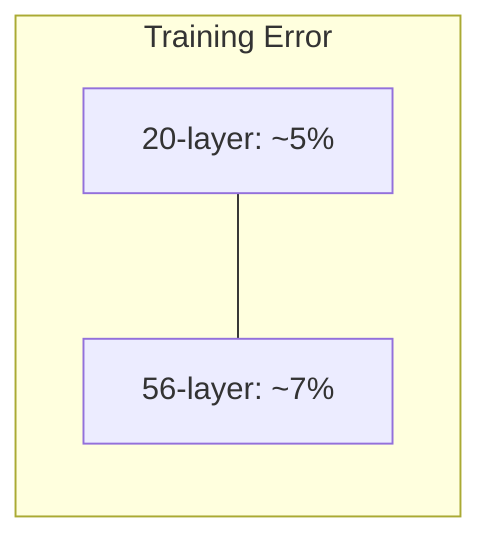
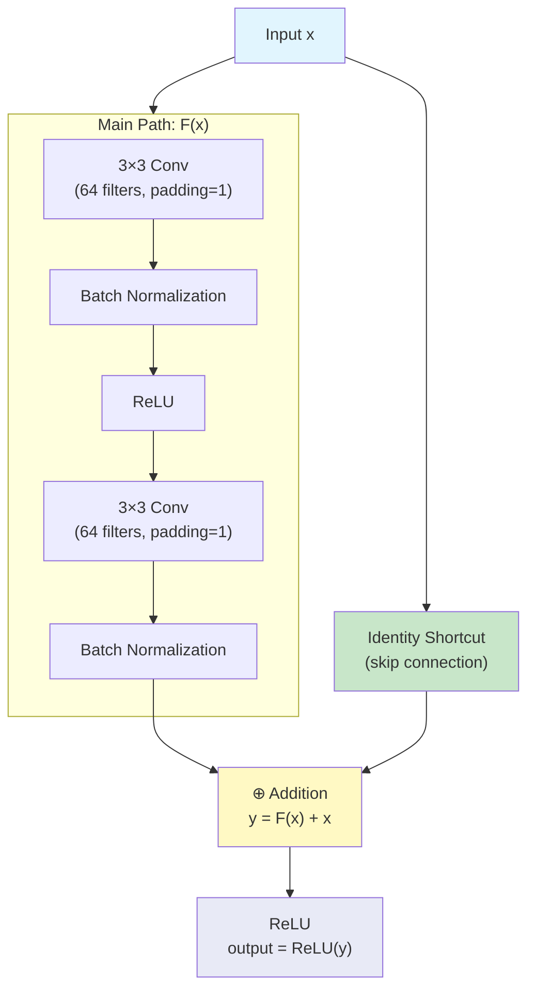
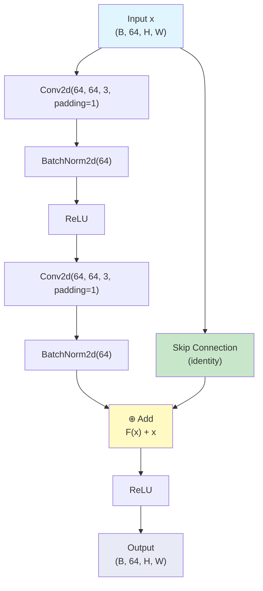
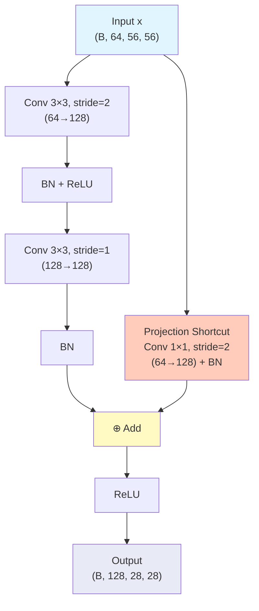

# 11. The Degradation Problem and Residual Connections

> [!info] Prerequisites
> Before reading this section, you should understand the basics of backpropagation and gradient computation through computational graphs. You should be familiar with the vanishing gradient problem and how batch normalization partially addresses it. You should also understand the basic convolutional neural network architectures we have studied so far (AlexNet, VGG, Inception) and how increasing depth has generally improved performance.

---

## The Expectation: Deeper Should Be Better

There is a compelling theoretical argument that a deeper network should perform at least as well as a shallower network. Consider two networks: a shallow network $S$ with $L$ layers, and a deeper network $D$ with $L + K$ layers, where the first $L$ layers of $D$ are identical to the layers of $S$. If the additional $K$ layers in $D$ were to simply learn the **identity mapping**—that is, if they learned to pass their input through unchanged—then network $D$ would produce exactly the same function as network $S$. The identity mapping is always a valid solution for the extra layers, so the deeper network can, in principle, always fall back to the shallower network's solution and never do worse.

This argument is intuitive and seems airtight: if adding more layers cannot hurt (because the extra layers can always learn to do nothing), then deeper networks should be at least as good as shallower ones. In practice, deeper networks also have larger hypothesis spaces—they can represent strictly more functions than shallower networks—so they should have the capacity to find solutions at least as good as, and potentially better than, what shallower networks can find. This reasoning led the deep learning community to expect that simply making networks deeper would lead to monotonically improving performance.

> [!note] The Identity Mapping Argument, Formally
> Let the shallow network compute $y = S(x)$. The deeper network computes $y = D_{L+K} \circ D_{L+K-1} \circ \cdots \circ D_{L+1} \circ S(x)$, where each $D_i$ is a layer function. If each additional layer $D_i$ learns the identity mapping $D_i(z) = z$, then the deeper network computes $y = S(x)$, which is exactly the same as the shallow network. Therefore, the minimum of the loss function over the deeper network's parameter space is at most equal to the minimum over the shallower network's parameter space, because the deeper network's hypothesis space includes the shallower network's hypothesis space as a subset.

---

## The Empirical Observation: Deeper Networks Perform Worse

In 2015, Kaiming He and his colleagues at Microsoft Research made a surprising and counterintuitive discovery. When they trained increasingly deep networks on ImageNet and CIFAR-10, they found that beyond a certain depth, adding more layers actually **increased** both training error and test error. This was not what the identity mapping argument predicted, and it demanded an explanation.

### The Key Experiment

He et al. compared two networks on CIFAR-10:

- A **20-layer** plain network (no skip connections, no special structure beyond BatchNorm + ReLU)
- A **56-layer** plain network (same architecture, just deeper)

The results were striking: the 56-layer network had **higher training error** than the 20-layer network. This is shown in the figure below:



The 56-layer network is strictly worse at fitting the training data than the 20-layer network, even though it has more parameters and a strictly larger hypothesis space. This is deeply counterintuitive.

### Why This Is NOT Overfitting

Overfitting occurs when a model fits the training data too well (low training error) but fails to generalize (high test error). The hallmark of overfitting is that training error continues to decrease while test error starts to increase—that is, there is a growing gap between training and test performance.

In the degradation problem, **training error itself is higher** for the deeper network. The 56-layer network cannot even fit the training data as well as the 20-layer network. This is the opposite of overfitting: the deeper network is **underfitting** relative to the shallower network. If this were overfitting, we would expect the deeper network to have lower training error and higher test error, but we observe higher training error and higher test error. Therefore, overfitting is not the explanation.

### Why This Is NOT (Just) Vanishing Gradients

The vanishing gradient problem occurs when the gradient signal diminishes as it propagates backwards through many layers, causing the early layers to receive very small updates and learn very slowly. In the pre-BatchNorm era, this was a major problem for deep networks, because the distribution of activations could shift dramatically from layer to layer (internal covariate shift), causing the gradients to shrink exponentially with depth.

However, He et al. used batch normalization in their plain networks, which largely mitigates the vanishing gradient problem. Batch normalization ensures that the activations at each layer have roughly unit variance, which in turn ensures that the gradients have roughly unit magnitude as they propagate backwards. With batch normalization, the forward and backward signals are well-conditioned, and the vanishing/exploding gradient problem is effectively solved. Yet the degradation problem persists even with batch normalization.

Furthermore, if vanishing gradients were the sole cause, we would expect the deeper network to converge more slowly but eventually reach the same training error as the shallower network (given enough training time). Instead, the deeper network converges to a **higher** training error, even after very long training runs. This suggests that the problem is not about gradient magnitude but about the optimization landscape itself—the optimizer is converging to a poorer local minimum in the deeper network's parameter space.

> [!warning] The Degradation Problem Is Subtle
> The degradation problem is one of the most misunderstood phenomena in deep learning. Many people confuse it with vanishing gradients or overfitting, but it is fundamentally different from both. The key diagnostic is: if training error is higher for a deeper network (not just test error), and batch normalization is already being used, then the problem is degradation, not overfitting or vanishing gradients. The deeper network's optimizer is converging to a suboptimal solution, not failing to receive gradient signals or memorizing noise.

---

## The Degradation Problem Defined

The degradation problem is the empirical observation that **deeper networks converge to solutions with higher training error than their shallower counterparts, even though the deeper networks have the capacity to represent the shallower networks' solutions**. The root cause is that it is fundamentally difficult for standard optimization algorithms (SGD and its variants) to learn identity mappings—or near-identity mappings—through many stacked nonlinear layers.

Consider what the extra 36 layers in the 56-layer network need to learn to match the 20-layer network's performance. They need to learn the identity mapping: $H(x) = x$, where $H(x)$ is the function computed by those 36 layers. But each layer consists of a convolution, batch normalization, and ReLU activation. The ReLU activation is $f(z) = \max(0, z)$, which zeroes out all negative values. This means that the identity mapping is not even representable by a single ReLU layer, because a ReLU layer cannot pass negative values through unchanged. To approximate the identity mapping with ReLU layers, the weights must be carefully tuned so that the combined effect of the convolution, batch normalization, and ReLU is approximately the identity function.

This requires the optimizer to find a very specific configuration of weights where multiple nonlinear transformations, each of which individually destroys information (ReLU kills negative values), somehow combine to approximately preserve information. This is a narrow, hard-to-find region in the parameter space, and standard optimizers initialized with random weights are unlikely to find it. Instead, the optimizer converges to some other local minimum that is easier to reach but represents a worse solution.

> [!tip] Intuitive Analogy
> Imagine you have 36 people standing in a line, and each person must pass a message to the next person without changing it. If each person is allowed to modify the message (apply a nonlinear transformation), it is very difficult for all 36 people to coordinate their modifications so that the final message is identical to the original. Even if each person tries their best to pass the message faithfully, small distortions accumulate and the message degrades. But if each person has the option to simply pass the message through unchanged (identity mapping), the task becomes trivial. Residual connections provide exactly this option.

---

## The ResNet Solution: Learning Residuals

He et al.'s elegant solution is to reformulate the learning problem. Instead of having the layers learn the desired mapping $H(x)$ directly, they have the layers learn the **residual** $F(x) = H(x) - x$. The output of the residual block is then $F(x) + x$, which equals $H(x)$.

This reformulation might seem trivial—after all, $F(x) + x = H(x)$ is just algebraic rearrangement—but it has profound implications for optimization. The key insight is that the residual parameterization makes it **easy for the network to learn identity mappings**, and this ease of learning identity mappings is what solves the degradation problem.

### The Residual Block

A residual block consists of:

1. The **main path** (also called the "residual path"): a sequence of layers that computes $F(x)$. In the basic residual block, this consists of two 3×3 convolutions, each followed by batch normalization and ReLU activation.

2. The **skip connection** (also called the "shortcut connection" or "identity mapping"): a direct connection from the input $x$ to the output, bypassing the main path.

3. The **addition**: the output of the main path $F(x)$ and the skip connection $x$ are added element-wise to produce the block's output: $y = F(x) + x$.

4. The **final activation**: a ReLU is applied after the addition: $\text{output} = \text{ReLU}(F(x) + x)$.



> [!note] Where is the ReLU After the Addition?
> Notice the placement of the final ReLU activation. It comes after the addition of $F(x)$ and $x$, not before. This is important because it allows the raw sum $F(x) + x$ to include negative values from the skip connection (since $x$ can be negative after batch normalization), which are then subjected to the ReLU nonlinearity. If the ReLU were placed before the addition, the skip connection would only carry non-negative values, which would limit the representational power of the identity mapping.

---

## Why Residual Learning Works: Two Mathematical Arguments

The residual parameterization solves the degradation problem through two complementary mechanisms, each of which we now analyze in detail.

### Argument 1: Easy Identity Learning

Recall the degradation problem: the optimizer struggles to learn identity mappings through many nonlinear layers. In the residual parameterization, if the layers in a block should learn the identity mapping (i.e., $H(x) = x$), the residual $F(x)$ needs to be zero:

$$H(x) = x \quad \Longrightarrow \quad F(x) = H(x) - x = x - x = 0$$

So the network just needs to push $F(x)$ toward zero. This is achieved by pushing the weights of the convolutions in the main path toward zero. If all the convolutional weights are zero, then $F(x) = 0$ regardless of the input $x$, and the block output is:

$$y = F(x) + x = 0 + x = x$$

**Pushing weights toward zero is trivial for standard optimizers.** Weight decay (L2 regularization) explicitly encourages weights to be small, and the gradient of the loss with respect to the weights naturally points in the direction that reduces their magnitude when the optimal solution involves small weights. The weight initialization schemes (e.g., He initialization) already start the weights near zero, so the optimizer begins in a regime where $F(x)$ is close to zero, and it only needs to make small adjustments to reach the exact identity mapping.

Contrast this with the non-residual parameterization, where learning the identity mapping requires the convolutions to produce exactly their input—which is a very specific, hard-to-find configuration of weights, especially through multiple nonlinear layers with ReLU activations that destroy negative information.

> [!tip] The Key Insight
> In the standard parameterization, identity mapping is a hard-to-find special case. In the residual parameterization, identity mapping is the trivial default that occurs when weights are zero. This is the fundamental reason why residual connections work: they make the "do nothing" option the easiest thing for the network to learn, rather than the hardest.

### Argument 2: The Gradient Superhighway

The second mechanism by which residual connections solve the degradation problem is through their effect on gradient flow during backpropagation. This is perhaps the more mathematically rigorous argument, and it directly addresses the concern about gradient signal propagation through very deep networks.

Consider a residual block that computes $y = F(x) + x$. During backpropagation, we need to compute the gradient of the loss $\mathcal{L}$ with respect to the input $x$. By the chain rule:

$$\frac{\partial \mathcal{L}}{\partial x} = \frac{\partial \mathcal{L}}{\partial y} \cdot \frac{\partial y}{\partial x}$$

Now, $y = F(x) + x$, so:

$$\frac{\partial y}{\partial x} = \frac{\partial F(x)}{\partial x} + \frac{\partial x}{\partial x} = \frac{\partial F(x)}{\partial x} + 1$$

Therefore:

$$\frac{\partial \mathcal{L}}{\partial x} = \frac{\partial \mathcal{L}}{\partial y} \cdot \left(\frac{\partial F(x)}{\partial x} + 1\right)$$

This equation is of profound importance. The gradient flowing back to the input $x$ consists of two terms:

1. $\frac{\partial \mathcal{L}}{\partial y} \cdot \frac{\partial F(x)}{\partial x}$: the gradient that flows through the main path $F(x)$. This term can be small (if the Jacobian $\frac{\partial F(x)}{\partial x}$ has small singular values) or even zero (if the ReLU activations have zeroed out certain pathways). This is the term that suffers from the vanishing gradient problem in very deep networks.

2. $\frac{\partial \mathcal{L}}{\partial y} \cdot 1$: the gradient that flows through the skip connection. This term is **always exactly $\frac{\partial \mathcal{L}}{\partial y}$**, regardless of the depth of the network, the values of the weights, or the behavior of the nonlinear activations. The "+1" from the derivative of $x$ with respect to $x$ provides a **direct, unimpeded path** for the gradient to flow from the output back to the input.

### The Gradient Flow Proof

Let us extend this analysis to a chain of residual blocks. Suppose we have $L$ residual blocks in sequence, where block $i$ computes:

$$x_{i+1} = F_i(x_i) + x_i$$

The gradient of the loss with respect to the input of the first block is:

$$\frac{\partial \mathcal{L}}{\partial x_1} = \frac{\partial \mathcal{L}}{\partial x_{L+1}} \cdot \prod_{i=1}^{L} \frac{\partial x_{i+1}}{\partial x_i}$$

For each block, $\frac{\partial x_{i+1}}{\partial x_i} = \frac{\partial F_i(x_i)}{\partial x_i} + 1$, so:

$$\frac{\partial \mathcal{L}}{\partial x_1} = \frac{\partial \mathcal{L}}{\partial x_{L+1}} \cdot \prod_{i=1}^{L} \left(\frac{\partial F_i(x_i)}{\partial x_i} + 1\right)$$

Now, let us expand this product. Each factor $\left(\frac{\partial F_i(x_i)}{\partial x_i} + 1\right)$ has a "+1" term, so the full product includes a term that is simply $\frac{\partial \mathcal{L}}{\partial x_{L+1}} \cdot 1 \cdot 1 \cdots 1 = \frac{\partial \mathcal{L}}{\partial x_{L+1}}$. This is the gradient that flows through **all the skip connections simultaneously**, bypassing every $F_i$. No matter how many layers the network has, this direct gradient path always exists and always carries the full gradient signal from the loss to the earliest layers.

Even if the Jacobians $\frac{\partial F_i(x_i)}{\partial x_i}$ are very small (causing the gradient through the main paths to vanish), the "+1" terms ensure that at least the gradient $\frac{\partial \mathcal{L}}{\partial x_{L+1}}$ always reaches the early layers. This is why residual connections are said to create a **gradient superhighway**: the skip connections provide a direct, low-resistance path for gradient information to flow backwards through the entire depth of the network.

> [!warning] The "+1" Is Critical, Not the Skip Connection Alone
> It is important to understand that the gradient benefit comes specifically from the **addition** in the skip connection, not from the existence of the skip connection itself. If the skip connection used concatenation instead of addition (as in DenseNet), the derivative would not have the "+1" term, and the gradient superhighway effect would not exist. The addition operation is what makes the derivative of $y = F(x) + x$ with respect to $x$ equal to $\frac{\partial F(x)}{\partial x} + 1$, where the "+1" is the key term that guarantees gradient flow. Concatenation would produce a derivative that is a selection matrix, not an additive "+1", and while it still provides gradient flow, it does not provide the same guaranteed additive boost.

---

## The Basic Residual Block in Detail

The basic residual block, used in ResNet-18 and ResNet-34, consists of two 3×3 convolutional layers, each followed by batch normalization and ReLU, with a skip connection that adds the input to the output of the second batch normalization before a final ReLU. Let us trace the data flow through this block step by step.

### Step-by-Step Data Flow

Given an input tensor $x$ of shape $(B, C, H, W)$ where $B$ is the batch size, $C$ is the number of channels, and $H, W$ are the spatial dimensions:

1. **First 3×3 Convolution**: Applies 64 3×3 filters with padding=1 and stride=1. The padding ensures the spatial dimensions are preserved: $H' = H$, $W' = W$. The output has shape $(B, 64, H, W)$. This convolution extracts local spatial features from the input.

2. **First Batch Normalization**: Normalizes the activations across the batch dimension for each channel independently. This stabilizes the distribution of activations and improves gradient flow.

3. **First ReLU**: Applies the rectified linear activation $\text{ReLU}(z) = \max(0, z)$, introducing nonlinearity and setting negative activations to zero.

4. **Second 3×3 Convolution**: Applies another 64 3×3 filters with padding=1 and stride=1. The output has shape $(B, 64, H, W)$. This convolution combines the features extracted by the first convolution into higher-level features.

5. **Second Batch Normalization**: Normalizes the activations again.

6. **Skip Connection Addition**: The original input $x$ is added to the output of the second batch normalization: $y = F(x) + x$, where $F(x)$ represents the output of steps 1-5. This is the core of the residual connection.

7. **Final ReLU**: Applies ReLU to the sum: $\text{output} = \text{ReLU}(F(x) + x)$. This is the output of the residual block.

### Mermaid Diagram of the Basic Residual Block



### PyTorch Implementation with Line-by-Line Comments

```python
import torch
import torch.nn as nn

class BasicBlock(nn.Module):
    """
    Basic residual block for ResNet-18 and ResNet-34.
    Contains two 3x3 convolutional layers with a skip connection.
    """
    
    def __init__(self, in_channels, out_channels, stride=1):
        # Call the parent class (nn.Module) constructor
        # This is required for all PyTorch modules to function properly
        super(BasicBlock, self).__init__()
        
        # First 3x3 convolution: takes in_channels input, produces out_channels output
        # stride controls spatial downsampling (stride=2 halves spatial dimensions)
        # padding=1 ensures spatial dimensions are preserved when stride=1
        # bias=False because BatchNorm will handle the bias term
        self.conv1 = nn.Conv2d(
            in_channels, out_channels, 
            kernel_size=3, stride=stride, padding=1, bias=False
        )
        
        # Batch normalization for the first convolution's output
        # num_features = out_channels (one normalization parameter per channel)
        self.bn1 = nn.BatchNorm2d(out_channels)
        
        # ReLU activation applied after the first batch normalization
        # inplace=True modifies the tensor in-place to save memory
        self.relu = nn.ReLU(inplace=True)
        
        # Second 3x3 convolution: takes out_channels input, produces out_channels output
        # stride is always 1 for the second convolution (downsampling only in conv1)
        # padding=1 preserves spatial dimensions
        # bias=False for the same reason as conv1
        self.conv2 = nn.Conv2d(
            out_channels, out_channels, 
            kernel_size=3, stride=1, padding=1, bias=False
        )
        
        # Batch normalization for the second convolution's output
        self.bn2 = nn.BatchNorm2d(out_channels)
        
        # The shortcut (skip) connection
        # If in_channels != out_channels or stride != 1, we need a projection
        # to match dimensions. Otherwise, use identity (no operation needed).
        self.shortcut = nn.Sequential()
        if stride != 1 or in_channels != out_channels:
            # 1x1 convolution to match channel count
            # stride matches the stride of conv1 for spatial dimension matching
            # bias=False because a subsequent BatchNorm will handle the bias
            self.shortcut = nn.Sequential(
                nn.Conv2d(in_channels, out_channels, kernel_size=1, stride=stride, bias=False),
                nn.BatchNorm2d(out_channels)
            )
    
    def forward(self, x):
        # Store the input for the skip connection
        # identity will either be x itself (if dimensions match) or the projected version
        identity = self.shortcut(x)
        
        # Main path: first convolution + batch normalization + ReLU
        # conv1 applies a 3x3 convolution to extract spatial features
        out = self.conv1(x)      # Shape: (B, out_channels, H/stride, W/stride)
        out = self.bn1(out)       # Normalize activations across the batch
        out = self.relu(out)      # Apply nonlinearity (sets negatives to zero)
        
        # Main path: second convolution + batch normalization
        # conv2 applies another 3x3 convolution to combine features
        out = self.conv2(out)     # Shape: (B, out_channels, H/stride, W/stride)
        out = self.bn2(out)       # Normalize activations (no ReLU yet!)
        
        # Add the skip connection to the main path output
        # This is the core of the residual connection: F(x) + x
        # The addition is element-wise and requires matching dimensions
        out += identity           # Shape: (B, out_channels, H/stride, W/stride)
        
        # Apply ReLU after the addition
        # This is important: the addition can produce negative values,
        # and we need nonlinearity to maintain representational power
        out = self.relu(out)      # Shape: (B, out_channels, H/stride, W/stride)
        
        return out
```

---

## Why Addition (Not Concatenation)?

A natural question is why ResNet uses addition for the skip connection rather than concatenation, which is used by DenseNet. The choice of addition is critical for two reasons.

### Reason 1: Preserves Dimensions for Identity Mapping

Addition preserves the spatial dimensions and channel count of the feature maps. If the input $x$ has shape $(B, C, H, W)$ and the main path $F(x)$ also has shape $(B, C, H, W)$, then $F(x) + x$ has shape $(B, C, H, W)$—the same as both inputs. This is essential for the identity mapping property: if $F(x) = 0$, the output is $0 + x = x$, which has exactly the same dimensions and values as the input. The residual block can be trivially inserted into any position in the network without changing the dimensions of the data flowing through it.

Concatenation, by contrast, would increase the channel count: $[F(x); x]$ would have shape $(B, 2C, H, W)$. This means the output of the block has a different channel count than the input, which makes it impossible for the block to represent a true identity mapping (since the output has twice as many channels as the input). It also means that subsequent layers must handle the increased channel count, which changes the architecture of the entire network.

### Reason 2: Enables the Gradient Superhighway

As we proved earlier, the addition operation creates a "+1" term in the gradient:

$$\frac{\partial y}{\partial x} = \frac{\partial F(x)}{\partial x} + 1$$

This "+1" ensures that at least the full gradient signal from the output always reaches the input through the skip connection, regardless of what happens in the main path. Concatenation would not produce this "+1" term; instead, the derivative of concatenation with respect to $x$ is a selection matrix that routes part of the gradient through the skip path. While this still provides gradient flow, it does not provide the same guaranteed additive boost to the gradient.

> [!info] DenseNet Uses Concatenation for a Different Purpose
> DenseNet (Huang et al., 2017) uses concatenation-based skip connections, but its goal is different from ResNet's. DenseNet aims to maximize feature reuse by making all previous features available to all subsequent layers, creating a dense connectivity pattern. The feature reuse comes at the cost of increased memory (because concatenated features must be stored) and does not provide the same gradient superhighway effect as ResNet's addition-based connections. Both architectures are effective, but they operate on different principles.

---

## What Happens When Dimensions Change: Projection Shortcuts

In the basic residual block, the skip connection is an identity mapping: $y = F(x) + x$. This works perfectly when the input and output have the same dimensions (same number of channels and same spatial size). However, there are two common situations where the dimensions change:

1. **Channel count changes**: When the block increases the number of channels (e.g., from 64 to 128 channels), the input $x$ and the main path output $F(x)$ have different channel counts, and addition is not possible.

2. **Spatial downsampling**: When the block reduces the spatial resolution (using stride=2 in the first convolution), the input $x$ has spatial dimensions $(H, W)$ while $F(x)$ has dimensions $(H/2, W/2)$, and addition is again not possible.

In both cases, a **projection shortcut** is used to transform the input $x$ so that it matches the dimensions of $F(x)$. The projection shortcut consists of a 1×1 convolution with batch normalization:

$$\text{shortcut}(x) = \text{BatchNorm}(\text{Conv}_{1\times1}(x))$$

The 1×1 convolution handles the channel dimension change by projecting from `in_channels` to `out_channels`. The stride parameter of the 1×1 convolution handles the spatial downsampling by using the same stride as the first 3×3 convolution in the main path.

### Two Types of Projection Shortcuts

The ResNet paper considers two types of projection shortcuts:

**Option A (Zero-padding shortcut)**: Pad the extra channels with zeros and use strided sampling for spatial downsampling. This adds no parameters and is simple to implement, but it does not learn any transformation for the shortcut path.

**Option B (1×1 convolution shortcut)**: Use a 1×1 convolution (with batch normalization) to project and downsample. This adds a small number of parameters but allows the shortcut path to learn an optimal linear projection for matching dimensions.

The paper found that Option B performs slightly better than Option A, and Option B is the standard choice used in most ResNet implementations today, including the official PyTorch implementation.



---

## Impact: Enabling Ultra-Deep Networks and Surpassing Human Performance

The introduction of residual connections had an immediate and transformative impact on the field of deep learning. Before ResNet, the deepest practical CNNs were around 20-30 layers (VGG-19, GoogLeNet at 22 layers). ResNet demonstrated that networks with 152 layers could be trained effectively, achieving dramatically better accuracy than any previous architecture.

### Key Results from the ResNet Paper

- **ResNet-152** achieved a **3.57% top-5 error rate** on the ILSVRC 2015 validation set, which was the first time a CNN surpassed the estimated human top-5 error rate on ImageNet (approximately 5.1%). This was a landmark moment in the history of computer vision, demonstrating that machines could classify images more accurately than humans on this benchmark.

- **ResNet won ILSVRC 2015** by a large margin, with 3.57% top-5 error compared to the second-place entry's 6.00%. The margin of victory was enormous by the standards of the competition.

- **Depth scaling worked**: ResNet-34 outperformed ResNet-18, ResNet-50 outperformed ResNet-34, ResNet-101 outperformed ResNet-50, and ResNet-152 outperformed ResNet-101. This was the first time that monotonically increasing depth led to monotonically improving accuracy in a CNN, confirming the theoretical expectation that deeper is better—when residual connections are used.

- **Without residual connections, deeper was worse**: He et al. confirmed that the plain (non-residual) 34-layer network had higher training error than the plain 18-layer network, while the residual 34-layer network had lower training error than the residual 18-layer network. This definitively showed that residual connections solve the degradation problem.

### The Broader Impact

The residual connection is now one of the most widely used architectural design patterns in deep learning. It appears not only in CNNs but also in Transformer architectures (where it is used to connect the self-attention and feed-forward blocks), in graph neural networks, in reinforcement learning architectures, and in many other domains. The principle is universal: whenever you have a deep computational graph, adding skip connections with addition makes it easier for the optimizer to find good solutions and for gradients to flow during backpropagation.

> [!tip] Residual Connections Are Everywhere
> The residual connection is arguably the single most important architectural innovation in deep learning since the invention of backpropagation itself. It appears in:
> - **ResNet** (2015): the original application
> - **Transformer** (2017): skip connections around self-attention and feed-forward blocks
> - **BERT** (2018): residual connections in the encoder stack
> - **GPT** (2018–present): residual connections in the decoder stack
> - **U-Net** (2015): skip connections between encoder and decoder (though these use concatenation)
> - **AlphaGo Zero** (2017): residual blocks in the policy and value networks
> 
> If you take away one design principle from this course, it should be this: **when in doubt, add a residual connection**.

---

## Summary

The degradation problem—the counterintuitive observation that deeper networks can have higher training error than shallower networks—is caused by the difficulty of learning identity mappings through many stacked nonlinear layers. Residual connections solve this problem by reformulating the learning objective: instead of learning $H(x)$ directly, the network learns the residual $F(x) = H(x) - x$, and the output is $F(x) + x$. This reformulation has two crucial benefits: (1) it makes identity mapping easy to learn (just push $F(x)$ toward zero by pushing weights toward zero), and (2) it creates a gradient superhighway through the "+1" term in the gradient $\frac{\partial \mathcal{L}}{\partial x} = \frac{\partial \mathcal{L}}{\partial y} \cdot \left(\frac{\partial F(x)}{\partial x} + 1\right)$, ensuring that gradient information always flows back to early layers regardless of depth. The basic residual block uses addition (not concatenation) for the skip connection because addition preserves dimensions and creates the critical "+1" gradient term. When dimensions change, projection shortcuts using 1×1 convolutions provide the necessary dimensional matching. Residual connections enabled 152-layer networks that achieved 3.57% top-5 error on ImageNet, surpassing human-level performance and establishing residual connections as one of the most fundamental design patterns in modern deep learning.