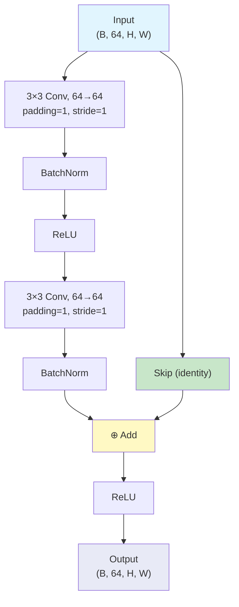
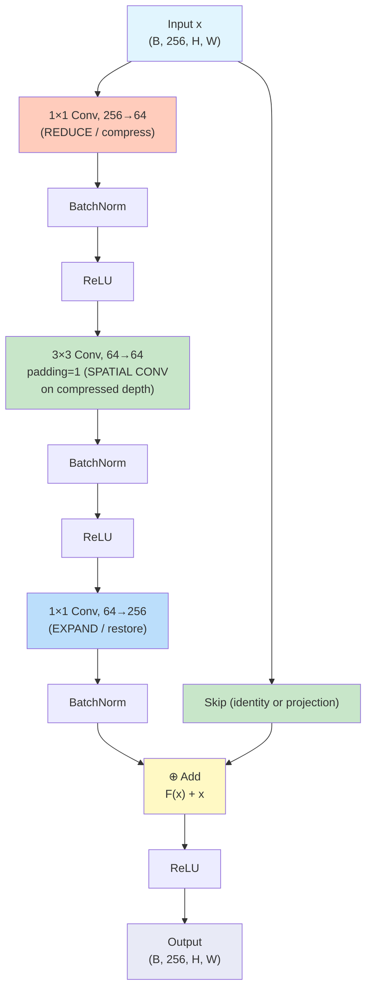
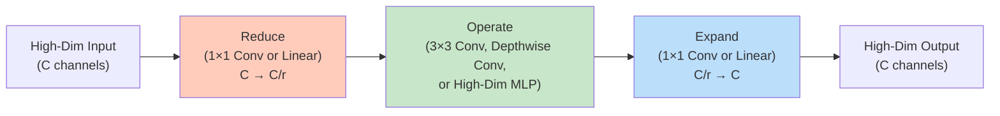

# 12. ResNet Bottleneck Blocks and Architectural Variants

> [!info] Prerequisites
> Before reading this section, you should have a thorough understanding of residual connections and the degradation problem (covered in Section 11). You should be comfortable with the basic residual block (two 3×3 convolutions with a skip connection), the gradient superhighway mechanism, and the use of projection shortcuts when dimensions change. You should also understand 1×1 convolutions as dimensionality reduction tools (covered in Section 10 on Inception) and be familiar with PyTorch's `nn.Module` API.

---

## The Two Block Types: An Overview

ResNet comes in five standard variants—ResNet-18, ResNet-34, ResNet-50, ResNet-101, and ResNet-152—where the number indicates the total count of weighted layers (convolutional and fully connected layers). These variants use **two different types of residual blocks**, and the choice of block type is the primary architectural difference that determines the depth-capacity trade-off for each variant.

The two block types are:

1. **Basic Block**: Used in ResNet-18 and ResNet-34. Each block contains two 3×3 convolutional layers with a skip connection. This is the simpler, more straightforward design that directly applies the residual learning principle without any channel compression or expansion.

2. **Bottleneck Block**: Used in ResNet-50, ResNet-101, and ResNet-152. Each block contains three layers arranged in a 1×1 → 3×3 → 1×1 pattern, inspired by the Inception module's bottleneck design. The first 1×1 convolution **reduces** the channel count (compression), the 3×3 convolution performs spatial feature extraction on the compressed representation, and the second 1×1 convolution **expands** the channel count back to the original size.

> [!note] Why Two Block Types?
> The Basic Block is simple and effective for shallow networks (18–34 layers), where the channel counts are relatively small and the computational cost of two 3×3 convolutions is manageable. However, for deeper networks (50–152 layers), the channel counts in each stage are much larger (up to 512 or 2048 channels), and using two 3×3 convolutions on these high-dimensional feature maps would be prohibitively expensive. The Bottleneck Block addresses this by compressing the channels before the expensive 3×3 convolution, dramatically reducing the computational cost while maintaining the same output dimensionality. This is the same "reduce-operate-expand" principle we saw in the Inception module.

---

## The Basic Block (ResNet-18 and ResNet-34)

The Basic Block is the residual block we studied in Section 11: two 3×3 convolutional layers, each followed by batch normalization and ReLU activation, with a skip connection that adds the input to the output. Let us revisit this block with a focus on its parameter count and computational cost, which will motivate the need for the Bottleneck Block in deeper networks.

### Architecture of the Basic Block

For a block operating on 64-channel feature maps (the first stage of ResNet-18/34), the architecture is:



### Parameter Count for the 64-Filter Basic Block

Each 3×3 convolution with 64 input channels and 64 output channels has:

$$\text{Parameters per 3×3 conv} = 3 \times 3 \times 64 \times 64 = 36{,}864$$

(We do not count bias parameters because batch normalization is used after each convolution, which includes a learnable bias term, making the convolution's bias redundant.)

With two such convolutions per block:

$$\text{Total parameters per Basic Block} = 2 \times 36{,}864 = 73{,}728$$

This is quite manageable for 64 channels. However, the problem arises in later stages where the channel counts increase to 128, 256, and 512. A Basic Block operating on 512 channels would require:

$$\text{Parameters per 3×3 conv} = 3 \times 3 \times 512 \times 512 = 2{,}359{,}296$$

$$\text{Total parameters per Basic Block (512 channels)} = 2 \times 2{,}359{,}296 = 4{,}718{,}592$$

This is over 4.7 million parameters per block—far too expensive for a network that needs dozens of such blocks. This is the motivation for the Bottleneck Block, which we introduce next.

---

## The Bottleneck Block (ResNet-50, ResNet-101, ResNet-152)

The Bottleneck Block replaces the two 3×3 convolutions of the Basic Block with a three-layer sequence: 1×1 convolution → 3×3 convolution → 1×1 convolution. The purpose of this arrangement is to perform the expensive spatial convolution (3×3) on a compressed (lower-dimensional) channel representation, significantly reducing the computational cost while maintaining the same input and output dimensions as the Basic Block.

### Architecture of the Bottleneck Block

For a block operating on 256-channel feature maps with a bottleneck size of 64 channels (the configuration used in the first bottleneck stage of ResNet-50/101/152), the architecture is:



### The Three Layers Explained

**Layer 1 — 1×1 Convolution (256 → 64): REDUCE**
The first 1×1 convolution reduces the channel count from 256 to 64. This is a learned linear projection (followed by batch normalization and ReLU) that compresses the high-dimensional feature representation into a lower-dimensional subspace. The 1×1 kernel means no spatial information is mixed—only cross-channel correlations are exploited. This is exactly the same bottleneck technique we studied in the Inception module: by reducing the channel count before the expensive operation, we dramatically reduce the computational cost of the subsequent 3×3 convolution. The reduction ratio is 256/64 = 4×, which is the standard ratio used in all ResNet bottleneck blocks.

**Layer 2 — 3×3 Convolution (64 → 64): SPATIAL CONVOLUTION**
The 3×3 convolution operates on the compressed 64-channel representation, extracting spatial features at a fraction of the cost of operating on the full 256-channel representation. This is where the actual spatial feature extraction happens—the 3×3 kernel mixes information from neighboring spatial locations, capturing local patterns and structures. Because the channel count is only 64 (rather than 256), this convolution is 16× cheaper in terms of parameter count and computational cost than a 3×3 convolution operating on 256 channels.

**Layer 3 — 1×1 Convolution (64 → 256): EXPAND**
The second 1×1 convolution expands the channel count from 64 back to 256, restoring the original dimensionality. This is another learned linear projection that maps the compressed representation back to the full-dimensional feature space. The expansion allows the block to output the same number of channels as the input, which is necessary for the skip connection addition to work (since we need $F(x)$ and $x$ to have the same dimensions for element-wise addition).

> [!tip] The Reduce-Operate-Expand Pattern
> The bottleneck block embodies a design pattern that is ubiquitous in modern deep learning: **reduce the dimensionality before an expensive operation, perform the operation on the reduced representation, then expand the dimensionality back**. This pattern appears in:
> - **Inception modules** (Section 10): 1×1 bottlenecks before 3×3 and 5×5 convolutions
> - **ResNet bottleneck blocks** (this section): 1×1 reduce → 3×3 spatial → 1×1 expand
> - **Transformer MLP blocks**: linear reduce → GELU activation → linear expand (the expansion factor is typically 4×)
> - **MobileNet**: depthwise conv → 1×1 pointwise expand
> - **EfficientNet**: squeeze-and-excitation blocks use a similar reduce-expand pattern
> 
> Whenever you encounter an expensive operation in a neural network, consider whether you can reduce the dimensionality first.

---

## Bottleneck Parameter Count: The Savings in Detail

Let us compute the exact parameter count for the Bottleneck Block and compare it with the hypothetical Basic Block that would be needed for the same 256-channel configuration. This comparison clearly demonstrates why the Bottleneck Block is essential for deeper ResNet variants.

### Bottleneck Block Parameters (256 channels, bottleneck = 64)

**Layer 1 — 1×1 Conv (256 → 64):**
$$P_1 = 1 \times 1 \times 256 \times 64 = 16{,}384$$

This layer has 16,384 parameters because each of the 64 output channels is a linear combination of all 256 input channels (with one coefficient per input channel per output channel, and the 1×1 kernel means there is only one spatial position).

**Layer 2 — 3×3 Conv (64 → 64):**
$$P_2 = 3 \times 3 \times 64 \times 64 = 36{,}864$$

This layer has 36,864 parameters because each of the 64 output channels is computed from a 3×3 spatial kernel applied across all 64 input channels. Notice that this is the same cost as a 3×3 convolution in the 64-channel Basic Block—exactly the benefit of compressing to 64 channels before the spatial convolution.

**Layer 3 — 1×1 Conv (64 → 256):**
$$P_3 = 1 \times 1 \times 64 \times 256 = 16{,}384$$

This layer has 16,384 parameters, symmetric with Layer 1 (the expansion mirrors the compression).

**Total Bottleneck Block parameters:**
$$P_{\text{bottleneck}} = P_1 + P_2 + P_3 = 16{,}384 + 36{,}864 + 16{,}384 = 69{,}632$$

### Hypothetical Basic Block Parameters (256 channels)

If we used a Basic Block (two 3×3 convolutions) with 256 channels instead of the Bottleneck Block:

$$P_{\text{basic}} = 2 \times (3 \times 3 \times 256 \times 256) = 2 \times 589{,}824 = 1{,}179{,}648$$

### The Savings

$$\text{Reduction} = 1 - \frac{P_{\text{bottleneck}}}{P_{\text{basic}}} = 1 - \frac{69{,}632}{1{,}179{,}648} = 1 - 0.059 = 0.941 = \mathbf{94.1\%}$$

The Bottleneck Block achieves a **94% reduction** in parameters compared to the equivalent Basic Block operating on 256 channels. This dramatic savings makes it feasible to build networks with 50, 101, or even 152 layers without exhausting GPU memory or computational budgets.

> [!warning] Don't Confuse the Bottleneck Size with the Block's Channel Width
> A common source of confusion is thinking that the Bottleneck Block "reduces" the network's capacity because it compresses to 64 channels. The key insight is that the block's **input and output** are still 256 channels—the same as the Basic Block. The 64-channel bottleneck is an internal, intermediate representation that exists only between the two 1×1 convolutions. The block's overall representational capacity is determined by its input and output dimensions (256 channels), not by the internal bottleneck size. Empirically, Bottleneck Blocks match or exceed the accuracy of equivalent-depth Basic Blocks while using far fewer parameters and FLOPs.

---

## The Projection Shortcut: Complete Implementation

When the channel count or spatial resolution changes between the input and the output of a residual block, a projection shortcut is needed to match the dimensions so that the addition $F(x) + x$ can be performed. The projection shortcut uses a 1×1 convolution (with batch normalization) to adjust both the channel count and the spatial resolution.

### When Are Projection Shortcuts Needed?

Projection shortcuts are needed in two specific situations in the ResNet architecture:

1. **At the beginning of each stage** (where the channel count doubles): For example, when transitioning from 64 channels to 128 channels, the skip connection must project the 64-channel input to 128 channels so it can be added to the 128-channel output of the main path.

2. **When stride=2 is used for spatial downsampling**: The first block of each stage (except the first stage) uses stride=2 in its first convolution to halve the spatial dimensions. The projection shortcut must also use stride=2 to match the spatial dimensions.

### Complete PyTorch Code for the Bottleneck Block

```python
import torch
import torch.nn as nn

class BottleneckBlock(nn.Module):
    """
    Bottleneck residual block for ResNet-50, ResNet-101, and ResNet-152.
    
    Uses the 1x1 -> 3x3 -> 1x1 pattern:
    - First 1x1 conv: REDUCE channels (compress)
    - 3x3 conv: SPATIAL convolution on compressed depth
    - Second 1x1 conv: EXPAND channels (restore)
    
    The expansion factor (ratio of output channels to bottleneck channels) is 4.
    For example, if out_channels=256, the bottleneck has 256/4 = 64 channels.
    """
    
    # The expansion factor determines the ratio between the output channels
    # and the bottleneck (middle) channels. For standard ResNet, this is 4.
    # So if the block outputs 256 channels, the bottleneck has 64 channels.
    expansion = 4
    
    def __init__(self, in_channels, out_channels, stride=1, downsample=None):
        """
        Args:
            in_channels: Number of channels in the input tensor
            out_channels: Number of channels in the base (pre-expansion) output
            stride: Stride for the 3x3 convolution (1 or 2)
            downsample: Optional module for the projection shortcut.
                        If None, use identity shortcut (when dimensions match).
        """
        # Initialize the parent nn.Module class
        # This is required for PyTorch's module system to track parameters
        super(BottleneckBlock, self).__init__()
        
        # Calculate the bottleneck (middle) channel count
        # For expansion=4 and out_channels=64, bottleneck=64/4... wait.
        # Actually, out_channels here refers to the BASE channels, and the
        # actual output of the block is out_channels * expansion.
        # Example: out_channels=64, expansion=4 → block output = 256 channels
        # bottleneck_channels = out_channels = 64
        bottleneck_channels = out_channels  # This is the compressed size
        
        # Layer 1: 1x1 convolution to REDUCE channels
        # Goes from in_channels to bottleneck_channels (the compressed size)
        # Example: 256 → 64
        # bias=False because BatchNorm will add its own bias
        self.conv1 = nn.Conv2d(
            in_channels, bottleneck_channels,
            kernel_size=1, stride=1, bias=False
        )
        # BatchNorm normalizes the compressed feature maps
        self.bn1 = nn.BatchNorm2d(bottleneck_channels)
        
        # Layer 2: 3x3 convolution for SPATIAL feature extraction
        # Operates on the compressed bottleneck_channels representation
        # stride can be 1 (same spatial size) or 2 (halve spatial dimensions)
        # padding=1 ensures spatial size is preserved when stride=1
        # This is the only layer that mixes spatial information
        self.conv2 = nn.Conv2d(
            bottleneck_channels, bottleneck_channels,
            kernel_size=3, stride=stride, padding=1, bias=False
        )
        # BatchNorm for the spatial convolution output
        self.bn2 = nn.BatchNorm2d(bottleneck_channels)
        
        # Layer 3: 1x1 convolution to EXPAND channels back
        # Goes from bottleneck_channels to out_channels * expansion
        # Example: 64 → 256
        # This restores the full channel dimension for the skip connection addition
        self.conv3 = nn.Conv2d(
            bottleneck_channels, out_channels * self.expansion,
            kernel_size=1, stride=1, bias=False
        )
        # BatchNorm for the expanded feature maps
        # Note: NO ReLU after this layer! ReLU comes after the skip addition
        self.bn3 = nn.BatchNorm2d(out_channels * self.expansion)
        
        # ReLU activation (shared across all three positions where it's used)
        # inplace=True saves memory by modifying tensors in-place
        self.relu = nn.ReLU(inplace=True)
        
        # The downsample module is the projection shortcut
        # If provided, it projects x to match the output dimensions
        # If None, the identity shortcut is used (x is added directly)
        self.downsample = downsample
    
    def forward(self, x):
        # Save the input for the skip connection
        identity = x
        
        # === MAIN PATH ===
        
        # Layer 1: 1x1 conv (reduce) + BN + ReLU
        # Compresses the channel dimension from in_channels to bottleneck_channels
        # Example: (B, 256, H, W) → (B, 64, H, W)
        out = self.conv1(x)        # 1x1 convolution: reduce channels
        out = self.bn1(out)        # Normalize compressed features
        out = self.relu(out)       # Apply nonlinearity
        
        # Layer 2: 3x3 conv (spatial) + BN + ReLU
        # Performs spatial feature extraction on compressed representation
        # If stride=2, spatial dimensions are halved
        # Example: (B, 64, H, W) → (B, 64, H/stride, W/stride)
        out = self.conv2(out)      # 3x3 convolution: spatial features
        out = self.bn2(out)        # Normalize spatial features
        out = self.relu(out)       # Apply nonlinearity
        
        # Layer 3: 1x1 conv (expand) + BN
        # Restores the channel dimension to out_channels * expansion
        # Example: (B, 64, H/stride, W/stride) → (B, 256, H/stride, W/stride)
        # IMPORTANT: No ReLU after this layer!
        out = self.conv3(out)      # 1x1 convolution: expand channels
        out = self.bn3(out)        # Normalize expanded features
        
        # === SKIP CONNECTION ===
        
        # If a downsample (projection) module is provided, apply it to the input
        # This projects x to match the output's channel count and spatial size
        # Example: (B, 256, H, W) → (B, 256, H/2, W/2) via 1x1 conv stride=2
        if self.downsample is not None:
            identity = self.downsample(x)
        
        # === ADDITION + ACTIVATION ===
        
        # Add the skip connection to the main path output
        # This is F(x) + identity, where F(x) is the residual
        # Both tensors must have the same shape for element-wise addition
        out += identity
        
        # Apply ReLU after the addition
        # This provides nonlinearity to the combined representation
        out = self.relu(out)
        
        return out
```

### Constructing the Downsample Module

The `downsample` module is constructed outside the block, typically in the ResNet class that assembles the full architecture. Here is how it is created:

```python
# This code is typically inside the ResNet class's _make_layer method

# Determine if we need a projection shortcut
# We need one when:
#   1. stride != 1 (spatial downsampling is happening)
#   2. in_channels != out_channels * expansion (channel count is changing)
downsample = None
if stride != 1 or in_channels != out_channels * BottleneckBlock.expansion:
    # Create a sequential module with:
    # 1. 1x1 conv to match channel count (with stride for spatial matching)
    # 2. BatchNorm after the projection
    downsample = nn.Sequential(
        nn.Conv2d(
            in_channels,                          # Input channel count
            out_channels * BottleneckBlock.expansion,  # Output channel count
            kernel_size=1,                        # 1x1 kernel (no spatial mixing)
            stride=stride,                        # Match the spatial downsampling
            bias=False                            # BatchNorm handles the bias
        ),
        nn.BatchNorm2d(out_channels * BottleneckBlock.expansion)
    )
```

> [!info] Why Does the Downsample Module Include BatchNorm?
> The projection shortcut includes batch normalization for consistency with the main path. Every convolution in ResNet is followed by batch normalization, and the projection shortcut is no exception. The batch normalization in the shortcut ensures that the projected features have a similar distribution to the main path features, which makes the addition $F(x) + x$ numerically well-conditioned. Without batch normalization in the shortcut, the projected features could have a very different scale from the main path features, causing the addition to be dominated by one term.

---

## ResNet Architecture Variants Table

The five standard ResNet variants differ in the number of blocks per stage and the type of block used (Basic or Bottleneck). All variants share the same stem (the initial convolutional layers that process the raw image) and the same classification head (global average pooling + fully connected layer). The following table summarizes the key properties of each variant.

| Variant | Block Type | Blocks per Stage | Total Layers | Parameters | Top-1 Accuracy (ImageNet) | Top-5 Accuracy (ImageNet) |
|---|---|---|---|---|---|---|
| ResNet-18 | Basic | [2, 2, 2, 2] | 18 | 11.7M | 69.76% | 89.08% |
| ResNet-34 | Basic | [3, 4, 6, 3] | 34 | 21.8M | 73.31% | 91.42% |
| ResNet-50 | Bottleneck | [3, 4, 6, 3] | 50 | 25.6M | 76.13% | 92.86% |
| ResNet-101 | Bottleneck | [3, 4, 23, 3] | 101 | 44.5M | 77.37% | 93.56% |
| ResNet-152 | Bottleneck | [3, 8, 36, 3] | 152 | 60.2M | 78.31% | 94.04% |

### Understanding the "Blocks per Stage" Notation

ResNet divides its layers into four stages, each operating at a different spatial resolution:

- **Stage 1**: Operates at 56×56 resolution, with 64 base channels (64 for Basic, 256 for Bottleneck after expansion). The stem network (7×7 conv + 3×3 max pool) has already reduced the 224×224 ImageNet input by a factor of 4.

- **Stage 2**: Operates at 28×28 resolution, with 128 base channels (128 for Basic, 512 for Bottleneck after expansion). The first block of this stage uses stride=2 to halve the spatial dimensions.

- **Stage 3**: Operates at 14×14 resolution, with 256 base channels (256 for Basic, 1024 for Bottleneck after expansion). The first block uses stride=2.

- **Stage 4**: Operates at 7×7 resolution, with 512 base channels (512 for Basic, 2048 for Bottleneck after expansion). The first block uses stride=2.

The "Blocks per Stage" column [2, 2, 2, 2] for ResNet-18 means there are 2 blocks in Stage 1, 2 blocks in Stage 2, 2 blocks in Stage 3, and 2 blocks in Stage 4.

### Why Does ResNet-50 Have More Parameters Than ResNet-34?

It might seem surprising that ResNet-50 (25.6M parameters) has only slightly more parameters than ResNet-34 (21.8M), even though it has 16 more layers. The reason is the Bottleneck Block's efficiency: each Bottleneck Block operating on 256 channels has 69,632 parameters, while a hypothetical Basic Block on 256 channels would have 1,179,648 parameters. The Bottleneck Block's 94% parameter savings allow ResNet-50 to add 16 more layers while only increasing the total parameter count by about 4M.

### The Accuracy-Depth Relationship

The table shows a clear trend: deeper networks achieve higher accuracy, from 69.76% top-1 for ResNet-18 to 78.31% for ResNet-152. However, the gains diminish with depth: going from ResNet-18 to ResNet-34 improves top-1 by 3.55 percentage points, while going from ResNet-101 to ResNet-152 improves it by only 0.94 percentage points. This diminishing-returns pattern is consistent with the theoretical expectation that deeper networks have more capacity but also become harder to optimize, even with residual connections.

> [!note] Why Doesn't ResNet-34 Use Bottleneck Blocks?
> ResNet-34 uses Basic Blocks because, at the channel counts used in ResNet-34 (64, 128, 256, 512), the Basic Block's parameter count is still manageable. The largest Basic Block in ResNet-34 operates on 512 channels and has $2 \times (3 \times 3 \times 512 \times 512) = 4{,}718{,}592$ parameters—expensive, but tolerable for a 34-layer network. If ResNet-34 used Bottleneck Blocks, it would actually have **fewer** parameters (because the Bottleneck Block is more parameter-efficient), but the standard practice is to use Basic Blocks for shallower variants and Bottleneck Blocks for deeper variants, as this was the configuration tested and validated in the original paper.

---

## Which Variant to Choose: Practical Guidance

Choosing the right ResNet variant depends on the specific constraints of your application—whether you are prioritizing accuracy, speed, memory efficiency, or a balance of all three. Here is practical guidance based on common use cases.

### ResNet-18: For Mobile and Edge Deployment

ResNet-18 is the smallest and fastest variant, with only 11.7M parameters and 1.8 GFLOPs of computation. It is the best choice when:

- **Latency is critical**: You need real-time inference on resource-constrained hardware (mobile phones, embedded devices, IoT sensors). ResNet-18's small model size and low FLOP count make it suitable for deployment on devices with limited computational power.

- **Memory is limited**: The model needs to fit in a small memory footprint, either for on-device storage or for fitting multiple models in GPU memory during training.

- **The dataset is small**: If you are fine-tuning on a small dataset (e.g., a few thousand images), a smaller model is less likely to overfit and may actually outperform a larger model.

- **You need a quick baseline**: ResNet-18 trains quickly and provides a reasonable accuracy baseline that you can use to validate your data pipeline and training setup before investing time in training larger models.

The trade-off is accuracy: ResNet-18 achieves 69.76% top-1 on ImageNet, which is about 8.5 percentage points below ResNet-152. For applications where accuracy is paramount, ResNet-18 is insufficient.

### ResNet-50: The Default Choice

ResNet-50 is the most commonly used ResNet variant and should be your **default choice** unless you have a specific reason to choose a different variant. It offers an excellent balance of accuracy (76.13% top-1) and efficiency (25.6M parameters, 4.1 GFLOPs). It is the right choice when:

- **You want strong accuracy with reasonable computational cost**: ResNet-50 provides substantially better accuracy than ResNet-18/34 while being far more efficient than ResNet-101/152. It hits the "sweet spot" in the accuracy-efficiency trade-off.

- **You are using transfer learning**: ResNet-50 is the most widely used backbone for transfer learning in computer vision. Most pre-trained model repositories (PyTorch Hub, TensorFlow Hub, timm) provide ResNet-50 weights trained on ImageNet, and these weights are well-tested and reliable.

- **You are building a feature extractor**: If you need to extract visual features for downstream tasks (object detection, segmentation, retrieval), ResNet-50 provides a good balance between feature quality and computational cost.

### ResNet-152: For Maximum Accuracy

ResNet-152 achieves the highest accuracy among the standard ResNet variants (78.31% top-1), making it the choice when accuracy is the top priority and computational cost is a secondary concern. It is appropriate when:

- **You need the best possible accuracy**: In applications like medical imaging or autonomous driving, even small accuracy improvements can have significant real-world consequences.

- **You are training on a large dataset**: ResNet-152's large capacity is best utilized when trained on large datasets. On small datasets, it may not outperform ResNet-50 due to overfitting.

- **You are doing inference in the cloud**: Where latency constraints are more relaxed and GPU resources are abundant, the extra computation of ResNet-152 is acceptable.

The trade-off is that ResNet-152 requires 60.2M parameters and 11.6 GFLOPs—nearly 3× the computation of ResNet-50. Training time is also significantly longer.

> [!tip] Practical Recommendation
> **Start with ResNet-50.** It is the workhorse of computer vision and provides the best accuracy-per-FLOP ratio among the ResNet variants. If ResNet-50 is too slow for your deployment scenario, downsize to ResNet-18. If you need more accuracy and can afford the compute, upgrade to ResNet-101 or ResNet-152. Always validate on your specific dataset, as the relative performance of different variants can vary depending on the task.

---

## Loading ResNet in PyTorch: Practical Code

PyTorch provides pre-trained ResNet models through the `torchvision.models` module. Loading a pre-trained ResNet and adapting it for a new task (transfer learning or fine-tuning) is one of the most common workflows in computer vision. Let us walk through the complete process with detailed explanations.

### Loading a Pre-Trained ResNet-50

```python
import torch
import torch.nn as nn
import torchvision.models as models

# Load a ResNet-50 model pre-trained on ImageNet
# The 'weights' parameter specifies which pre-trained weights to use
# models.ResNet50_Weights.IMAGENET1K_V1 loads the standard ImageNet weights
# Setting weights to None would give a randomly initialized model
model = models.resnet50(weights=models.ResNet50_Weights.IMAGENET1K_V1)

# Print the model architecture to see all layers
# This is useful for understanding which layers to modify
print(model)
```

### Understanding the Model Structure: `model.fc` vs `model.classifier`

Different PyTorch model families use different names for their classification head:

- **ResNet** uses `model.fc` (fully connected): The final layer is a single `nn.Linear(2048, 1000)` that maps the 2048-dimensional global-average-pooled feature vector to 1000 ImageNet classes.

- **VGG and AlexNet** use `model.classifier`: The classification head is a `nn.Sequential` module containing multiple fully connected layers (e.g., Linear → ReLU → Dropout → Linear → ReLU → Dropout → Linear).

- **Other models** (EfficientNet, DenseNet, etc.) may use different names. Always check `print(model)` to identify the correct attribute name before modifying the classification head.

This distinction is important because the code for replacing the classification head differs between model families. For ResNet, you replace `model.fc`; for VGG, you might replace `model.classifier[-1]` (the last layer in the Sequential) or the entire `model.classifier`.

### Replacing the Classification Head for Transfer Learning

```python
import torch
import torch.nn as nn
import torchvision.models as models

# Step 1: Load the pre-trained ResNet-50 model
# This loads all the convolutional layers with ImageNet-trained weights
model = models.resnet50(weights=models.ResNet50_Weights.IMAGENET1K_V1)

# Step 2: Get the number of input features to the final FC layer
# For ResNet-50, this is 2048 (the channel count after the last stage * expansion)
# We need this number because our new FC layer must accept the same input dimension
num_features = model.fc.in_features  # Returns 2048

# Step 3: Replace the final FC layer with a new one for our task
# The original FC layer: nn.Linear(2048, 1000) for 1000 ImageNet classes
# Our new FC layer: nn.Linear(2048, num_classes) for our specific number of classes
# For example, if we have 10 classes in our dataset:
num_classes = 10
model.fc = nn.Linear(num_features, num_classes)
# Now model.fc is nn.Linear(2048, 10)

# The new fc layer is randomly initialized, while all other layers
# retain their ImageNet pre-trained weights
```

### Freezing the Backbone for Feature Extraction

In some transfer learning scenarios, you want to **freeze** the convolutional layers (prevent them from being updated during training) and only train the new classification head. This is appropriate when your dataset is small and you want to use the pre-trained features as a fixed feature extractor.

```python
import torch
import torch.nn as nn
import torchvision.models as models

# Load pre-trained ResNet-50
model = models.resnet50(weights=models.ResNet50_Weights.IMAGENET1K_V1)

# Freeze all parameters in the model
# Setting requires_grad=False tells PyTorch not to compute gradients
# for these parameters during backpropagation, which saves memory and compute
for param in model.parameters():
    param.requires_grad = False

# Replace the classification head
# The new fc layer's parameters have requires_grad=True by default
# So only the fc layer will be updated during training
num_features = model.fc.in_features
num_classes = 10
model.fc = nn.Linear(num_features, num_classes)

# Verify which parameters are trainable
# This should only show the parameters of model.fc
trainable_params = [name for name, param in model.named_parameters() if param.requires_grad]
print(f"Trainable parameters: {trainable_params}")
# Output: ['fc.weight', 'fc.bias']
```

### Fine-Tuning the Entire Network

When your dataset is large enough to support fine-tuning the entire network, you keep all parameters trainable. However, you typically use a **lower learning rate for the pre-trained layers** and a **higher learning rate for the new classification head**, because the pre-trained layers already contain useful features and should only be gently adjusted, while the new head must be trained from scratch.

```python
import torch
import torch.nn as nn
import torchvision.models as models

# Load pre-trained ResNet-50
model = models.resnet50(weights=models.ResNet50_Weights.IMAGENET1K_V1)

# Replace the classification head
num_features = model.fc.in_features
num_classes = 10
model.fc = nn.Linear(num_features, num_classes)

# Create parameter groups with different learning rates
# Group 1: Pre-trained convolutional layers (low learning rate)
# Group 2: New classification head (high learning rate)
params_to_update = []
params_to_update_with_lr = []

# Iterate over all named parameters in the model
for name, param in model.named_parameters():
    if 'fc' not in name:
        # Pre-trained layer: use a low learning rate
        # We don't freeze these, but we will assign them a small LR
        params_to_update.append(param)
    else:
        # New fc layer: use a higher learning rate
        params_to_update_with_lr.append(param)

# Create the optimizer with two parameter groups
optimizer = torch.optim.SGD([
    {'params': params_to_update, 'lr': 1e-3},         # Pre-trained layers: LR = 0.001
    {'params': params_to_update_with_lr, 'lr': 1e-2},  # New head: LR = 0.01 (10x higher)
], momentum=0.9, weight_decay=1e-4)

# Now during training, the pre-trained layers will be slowly fine-tuned
# while the new classification head will learn more quickly
```

### Complete Transfer Learning Pipeline

```python
import torch
import torch.nn as nn
import torch.optim as optim
import torchvision.models as models
import torchvision.transforms as transforms
from torch.utils.data import DataLoader

# ============================================================
# Step 1: Define data transforms for training and validation
# ============================================================

# Training transforms include data augmentation to prevent overfitting
# RandomResizedCrop: randomly crop and resize the image (augmentation)
# RandomHorizontalFlip: randomly flip the image horizontally (augmentation)
# ToTensor: convert PIL image to PyTorch tensor (H,W,C) → (C,H,W), scale to [0,1]
# Normalize: standardize using ImageNet mean and std for each channel
train_transform = transforms.Compose([
    transforms.RandomResizedCrop(224),           # Crop to 224x224 with random position/scale
    transforms.RandomHorizontalFlip(),            # 50% chance of horizontal flip
    transforms.ToTensor(),                        # Convert to tensor, scale [0,255] → [0,1]
    transforms.Normalize(                         # Normalize with ImageNet statistics
        mean=[0.485, 0.456, 0.406],              # Mean for R, G, B channels
        std=[0.229, 0.224, 0.225]                # Std for R, G, B channels
    )
])

# Validation transforms do NOT include augmentation
# We want deterministic evaluation on the validation set
val_transform = transforms.Compose([
    transforms.Resize(256),                       # Resize shorter side to 256
    transforms.CenterCrop(224),                   # Crop center 224x224 region
    transforms.ToTensor(),                        # Convert to tensor
    transforms.Normalize(                         # Same normalization as training
        mean=[0.485, 0.456, 0.406],
        std=[0.229, 0.224, 0.225]
    )
])

# ============================================================
# Step 2: Load pre-trained ResNet-50 and modify the head
# ============================================================

model = models.resnet50(weights=models.ResNet50_Weights.IMAGENET1K_V1)
num_features = model.fc.in_features    # 2048 for ResNet-50
num_classes = 10                        # Replace with your number of classes
model.fc = nn.Linear(num_features, num_classes)

# ============================================================
# Step 3: Set up loss function and optimizer
# ============================================================

# CrossEntropyLoss combines LogSoftmax and NLLLoss
# It is the standard loss for multi-class classification
criterion = nn.CrossEntropyLoss()

# SGD with momentum is the optimizer used in the original ResNet paper
# weight_decay provides L2 regularization to prevent overfitting
optimizer = optim.SGD(model.parameters(), lr=0.001, momentum=0.9, weight_decay=1e-4)

# Learning rate scheduler reduces LR by factor of 0.1 every 7 epochs
# This is a common schedule for fine-tuning pre-trained models
scheduler = optim.lr_scheduler.StepLR(optimizer, step_size=7, gamma=0.1)

# ============================================================
# Step 4: Training loop (simplified)
# ============================================================

num_epochs = 20
device = torch.device('cuda' if torch.cuda.is_available() else 'cpu')
model = model.to(device)

for epoch in range(num_epochs):
    model.train()  # Set model to training mode (enables dropout, batchnorm updates)
    
    # (Assuming train_loader is defined)
    for batch_idx, (images, labels) in enumerate(train_loader):
        # Move data to the same device as the model
        images = images.to(device)    # Shape: (B, 3, 224, 224)
        labels = labels.to(device)    # Shape: (B,)
        
        # Forward pass: compute predictions
        outputs = model(images)       # Shape: (B, num_classes)
        
        # Compute loss
        loss = criterion(outputs, labels)
        
        # Backward pass: compute gradients
        optimizer.zero_grad()         # Clear previous gradients (essential!)
        loss.backward()               # Compute gradients via backpropagation
        
        # Update parameters
        optimizer.step()              # Apply gradients to update weights
    
    # Update learning rate
    scheduler.step()
    
    # Validation phase
    model.eval()  # Set model to evaluation mode (disables dropout, uses running BN stats)
    # ... validation code here ...
```

> [!warning] Don't Forget `model.eval()` and `model.train()`
> A very common bug in PyTorch is forgetting to call `model.eval()` before validation and `model.train()` before training. In training mode, batch normalization uses batch statistics (mean and variance of the current batch) and dropout randomly zeroes activations. In evaluation mode, batch normalization uses running statistics (accumulated during training) and dropout is disabled. If you validate in training mode, your batch normalization statistics will be noisy and dropout will randomly remove features, leading to incorrect and inconsistent validation results.

---

## The Deeper Insight: The Bottleneck Design Principle Is Universal

The bottleneck design pattern—reduce the dimensionality before an expensive operation, perform the operation, then expand the dimensionality back—is not unique to ResNet. It is one of the most fundamental and widely repeated design principles in modern deep learning, appearing across a diverse range of architectures and domains.

### Inception Modules (Section 10)

As we studied in Section 10, Inception modules use 1×1 bottleneck convolutions before the expensive 3×3 and 5×5 convolutions, and after the max pooling operation. The bottleneck reduces the number of channels that the large-kernel convolutions must process, achieving up to 87% parameter reduction. This is the direct predecessor of the ResNet bottleneck block, and the design principle is identical: compress, operate, expand.

### EfficientNet

EfficientNet (Tan and Le, 2019) uses mobile inverted bottleneck convolutions (MBConv), which follow the same reduce-operate-expand pattern. The MBConv block first expands the channel count (using a 1×1 convolution), then applies a depthwise 3×3 convolution (which is much cheaper than a standard 3×3 convolution because it operates on each channel independently), and finally projects back to the original channel count with another 1×1 convolution. The expansion-then-compression is the reverse of ResNet's compression-then-expansion, but the principle is the same: use cheap 1×1 convolutions to manage the channel dimension around an expensive spatial operation.

### Transformer MLP Blocks

In the Transformer architecture (Vaswani et al., 2017), each encoder and decoder layer contains a feed-forward (MLP) block that follows the bottleneck pattern. The MLP consists of two linear layers: the first **expands** the hidden dimension by a factor of 4 (e.g., from 768 to 3072 in BERT-Base), a GELU activation is applied, and the second linear layer **projects** back to the original dimension (768). This expansion-then-compression is analogous to the ResNet bottleneck, with the linear layers playing the role of the 1×1 convolutions and the GELU activation playing the role of the spatial convolution. The key insight is the same: the expensive operation (the high-dimensional intermediate representation) is bracketed by cheap dimension-changing operations that manage the computational cost.

### The Universal Pattern



This reduce-operate-expand pattern is one of the most powerful and versatile design principles in deep learning. It appears whenever designers need to perform an expensive operation (spatial convolution, high-dimensional transformation, attention computation) but want to control the computational cost. By bracketing the expensive operation with cheap dimension-changing operations, the pattern achieves the representational benefits of high-dimensional features while maintaining the efficiency of low-dimensional computation.

> [!tip] The Meta-Lesson
> The bottleneck design principle is a meta-lesson about architectural design in deep learning: **the most impactful innovations are not specific architectures, but design principles that can be applied across many different architectures and domains**. The ResNet bottleneck block, the Inception 1×1 reduction, the Transformer MLP expansion, and the MobileNet inverted bottleneck are all instances of the same abstract principle. Understanding the principle at this level of abstraction allows you to recognize it in new architectures, apply it to your own designs, and reason about when and where it will be beneficial.

---

## Summary

ResNet comes in five standard variants that use two types of residual blocks. The **Basic Block** (ResNet-18/34) uses two 3×3 convolutions with a skip connection and costs 73,728 parameters per 64-channel block. The **Bottleneck Block** (ResNet-50/101/152) uses a 1×1 → 3×3 → 1×1 pattern that compresses, operates, and expands, costing only 69,632 parameters per 256-channel block compared to 1,179,648 for the equivalent Basic Block—a 94% reduction. The projection shortcut (1×1 convolution + batch normalization) handles dimension mismatches when channel counts change or spatial downsampling occurs. ResNet-50 is the default choice for most applications, offering the best accuracy-efficiency trade-off at 76.13% top-1 ImageNet accuracy with 25.6M parameters. ResNet-18 is preferred for edge deployment, and ResNet-152 for maximum accuracy. The bottleneck design principle—reduce dimensionality before expensive operations and expand afterward—is universal, appearing in Inception modules, EfficientNet, Transformer MLP blocks, and many other architectures, making it one of the most important and widely applicable design patterns in modern deep learning.