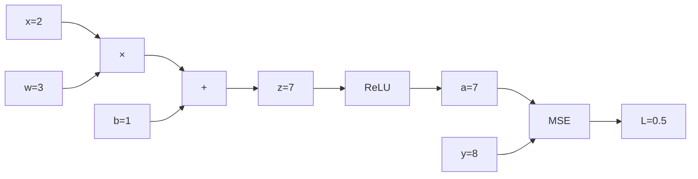
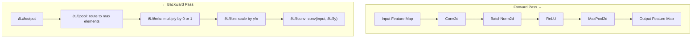
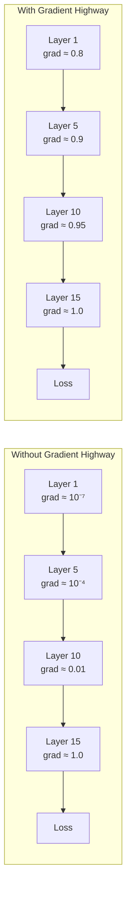

# 13. Backpropagation and Gradient Flow in CNNs

> [!info] Prerequisites
> Before reading this section, you should be comfortable with:
> - [[9. The Convolution Operation]] — how convolutions produce feature maps
> - [[10. Pooling Layers]] — how downsampling works
> - [[11. Activation Functions]] — especially ReLU and its properties
> - Basic multivariable calculus (partial derivatives)

---

## 13.1 The Goal of Training: Minimizing the Loss Function

At the most fundamental level, training a neural network is an **optimization problem**. We have a network parameterized by a set of weights $W = \{w_1, w_2, \dots, w_N\}$ and biases $b = \{b_1, b_2, \dots, b_M\}$, and we want to find the specific values of these parameters that make the network's predictions as accurate as possible. The way we quantify "how wrong" the network's predictions are is through a **loss function** $L(W)$, also sometimes called a cost function or objective function. The loss function takes the network's current parameters and returns a single scalar value that represents the total error across the training data. A higher loss means the network is making worse predictions; a lower loss means it is making better predictions. Therefore, the goal of training is to **minimize** $L(W)$ with respect to $W$.

Intuitively, you can think of the loss function as a vast, high-dimensional landscape. Each point in this landscape corresponds to a particular configuration of all the network's weights and biases, and the height at that point is the loss value. Training is the process of walking through this landscape, always trying to step downhill, until you reach a point where the loss is as low as possible — ideally a deep valley, though in practice often just a local minimum that is good enough. The most common loss function for regression tasks is **Mean Squared Error (MSE)**, defined as:

$$L = \frac{1}{n} \sum_{i=1}^{n} (y_i - \hat{y}_i)^2$$

where $y_i$ is the true target value, $\hat{y}_i$ is the network's predicted value, and $n$ is the number of samples. For classification tasks, the most common loss is **Cross-Entropy Loss**, which measures the divergence between the predicted probability distribution and the true distribution. In both cases, the fundamental question is the same: given the current weights, in which direction should we adjust each weight to reduce the loss?

> [!tip] Intuition for Loss
> Think of loss as a "penalty score." If your model predicts a house price of \$200,000 but the actual price is \$500,000, the MSE loss would be $(500000 - 200000)^2 = 9 \times 10^{10}$. The loss function assigns a single number that summarizes how badly the model is performing. Minimizing this number is the entire purpose of training.

---

## 13.2 Why We Need Calculus: The Chain of Compositions

A neural network is not a single function — it is a **composition** of hundreds or even thousands of individual operations. A single forward pass through a CNN might involve: a convolution, a bias addition, a ReLU activation, another convolution, another bias addition, another ReLU, a pooling operation, a fully-connected layer, a softmax, and finally a loss computation. Each of these operations transforms its input into an output, and the final loss depends on every single one of them.

When we want to know how a particular weight $w$ deep inside the network affects the final loss $L$, we cannot simply take a direct derivative $\frac{\partial L}{\partial w}$ because $L$ does not depend on $w$ directly — it depends on $w$ through a long chain of intermediate computations. This is precisely the situation where the **chain rule** of calculus becomes essential. The chain rule tells us how to decompose the derivative of a composition into a product of simpler derivatives, each of which we can compute locally using only the information available at that particular layer.

Without the chain rule, we would have no principled way to assign credit (or blame) to individual weights for the final loss. We would be effectively blind, making random adjustments instead of informed ones. The chain rule is the mathematical engine that makes learning in deep networks possible, and backpropagation is simply an efficient algorithm for applying the chain rule systematically across the entire network.

> [!warning] Common Misconception
> Backpropagation is NOT a learning algorithm — it is a method for computing gradients. The learning algorithm is gradient descent (or one of its variants like Adam, RMSProp, etc.), which uses the gradients computed by backpropagation to update the weights. Backpropagation tells you the slope; gradient descent decides how to step.

---

## 13.3 The Chain Rule: The Mathematical Engine

### 13.3.1 Single Variable Chain Rule

Let us start with the simplest possible case. Suppose we have a composition of two functions: $z = f(g(x))$. That is, we first compute $u = g(x)$, and then compute $z = f(u)$. The chain rule states:

$$\frac{dz}{dx} = \frac{dz}{du} \cdot \frac{du}{dx} = f'(u) \cdot g'(x)$$

The intuition here is powerful: the rate at which $z$ changes with respect to $x$ depends on two factors — (1) how sensitive $z$ is to changes in the intermediate variable $u$, and (2) how sensitive $u$ is to changes in $x$. These two sensitivities multiply together to give the total sensitivity. If $z$ barely responds to changes in $u$ (small $f'(u)$), then it doesn't matter how much $u$ changes with $x$ — the effect on $z$ will still be small. Similarly, if $u$ barely responds to changes in $x$ (small $g'(x)$), then even large sensitivities in $f$ won't propagate through.

### 13.3.2 Extending to Three Functions

Now suppose we have a three-layer composition: $z = f(g(h(x)))$. We introduce intermediate variables $a = h(x)$, $u = g(a)$, and $z = f(u)$. By applying the chain rule twice:

$$\frac{dz}{dx} = \frac{dz}{du} \cdot \frac{du}{da} \cdot \frac{da}{dx}$$

This pattern extends to arbitrarily deep compositions. For a network with $L$ layers, the gradient of the loss with respect to an input is the product of $L$ local derivatives. This multiplicative structure is both the power and the Achilles' heel of deep learning — when each derivative is less than 1, the product shrinks exponentially (vanishing gradients); when each derivative is greater than 1, the product grows exponentially (exploding gradients). We will explore these problems in detail in [[15. The Vanishing and Exploding Gradient Problems]].

### 13.3.3 Multivariable Chain Rule

In neural networks, each layer typically has multiple inputs and multiple outputs. Suppose $z = f(u_1, u_2)$, where $u_1 = g_1(x)$ and $u_2 = g_2(x)$. Then:

$$\frac{dz}{dx} = \frac{\partial z}{\partial u_1} \cdot \frac{du_1}{dx} + \frac{\partial z}{\partial u_2} \cdot \frac{du_2}{dx}$$

This is the **multivariable chain rule**, and it generalizes naturally: the total derivative is the sum over all paths from $x$ to $z$, where each path contributes a product of local derivatives. In the context of a neural network, when a neuron receives inputs from multiple upstream neurons, the gradient flowing back to any one upstream neuron is the sum of gradients arriving via all downstream connections.

### 13.3.4 The General Backpropagation Principle

Putting it all together, backpropagation computes $\frac{\partial L}{\partial w}$ for every parameter $w$ in the network by:

1. **Forward pass**: Compute and store all intermediate values (activations) layer by layer from input to output.
2. **Backward pass**: Starting from $\frac{\partial L}{\partial \hat{y}}$ (the gradient of loss with respect to the output), propagate gradients backward through each layer using the chain rule. At each layer, compute the local Jacobian and multiply it with the incoming gradient from the layer above.

The key insight is that each layer only needs to know its own local computation and the gradient arriving from above — it does not need to know anything about the rest of the network. This modularity is what makes backpropagation both elegant and efficient.

---

## 13.4 A COMPLETE Step-by-Step Worked Example

Let us work through every single step of backpropagation with concrete numbers. This example is small enough to compute by hand but captures all the essential ideas.

### 13.4.1 Network Definition

Our network is:

$$x \xrightarrow{\text{Linear}} z = wx + b \xrightarrow{\text{ReLU}} a = \text{ReLU}(z) \xrightarrow{\text{MSE}} L = \frac{1}{2}(a - y)^2$$

We use $\frac{1}{2}$ instead of $\frac{1}{n}$ to simplify the derivative (the factor of $\frac{1}{2}$ cancels with the power rule's factor of 2).

### 13.4.2 Specific Values

- Input: $x = 2$
- Weight: $w = 3$
- Bias: $b = 1$
- Target: $y = 8$
- Learning rate: $\eta = 0.1$

### 13.4.3 Forward Pass (Compute Every Intermediate Value)

**Step 1 — Linear transformation:**

$$z = wx + b = 3 \times 2 + 1 = 7$$

**Step 2 — ReLU activation:**

$$a = \text{ReLU}(z) = \max(0, z) = \max(0, 7) = 7$$

Since $z = 7 > 0$, the ReLU passes the value through unchanged.

**Step 3 — MSE Loss:**

$$L = \frac{1}{2}(a - y)^2 = \frac{1}{2}(7 - 8)^2 = \frac{1}{2}(1)^2 = 0.5$$

The loss is $0.5$. Our prediction was $7$, the target was $8$, so we're off by $1$.

### 13.4.4 Backward Pass (Compute Every Derivative)

We now compute gradients in reverse order, starting from the loss and working backward to the parameters.

**Step 1 — Gradient of loss with respect to the activation $a$:**

$$\frac{\partial L}{\partial a} = \frac{\partial}{\partial a}\left[\frac{1}{2}(a - y)^2\right] = (a - y) = 7 - 8 = -1$$

The negative sign tells us that increasing the activation $a$ would *decrease* the loss, which makes sense — our prediction of 7 is below the target of 8, so we want the activation to increase.

**Step 2 — Gradient of loss with respect to the pre-activation $z$:**

We need the chain rule: $\frac{\partial L}{\partial z} = \frac{\partial L}{\partial a} \cdot \frac{\partial a}{\partial z}$

The ReLU derivative is:
$$\frac{\partial a}{\partial z} = \begin{cases} 1 & \text{if } z > 0 \\ 0 & \text{if } z \leq 0 \end{cases}$$

Since $z = 7 > 0$:

$$\frac{\partial L}{\partial z} = (-1) \times 1 = -1$$

The gradient passes through the ReLU unchanged because the neuron is active ($z > 0$). If $z$ had been negative (inactive neuron), the gradient would have been zeroed out — this is the "dying ReLU" problem we will discuss later.

**Step 3 — Gradient of loss with respect to the weight $w$:**

Again, chain rule: $\frac{\partial L}{\partial w} = \frac{\partial L}{\partial z} \cdot \frac{\partial z}{\partial w}$

Since $z = wx + b$:

$$\frac{\partial z}{\partial w} = x = 2$$

Therefore:

$$\frac{\partial L}{\partial w} = (-1) \times 2 = -2$$

The gradient with respect to $w$ is $-2$. This means that increasing $w$ will decrease the loss. Since our prediction is below the target, increasing the weight (which increases $z = wx + b$) is exactly what we want.

**Step 4 — Gradient of loss with respect to the bias $b$:**

$$\frac{\partial z}{\partial b} = 1$$

$$\frac{\partial L}{\partial b} = \frac{\partial L}{\partial z} \cdot \frac{\partial z}{\partial b} = (-1) \times 1 = -1$$

**Step 5 — (Optional) Gradient of loss with respect to the input $x$:**

$$\frac{\partial z}{\partial x} = w = 3$$

$$\frac{\partial L}{\partial x} = \frac{\partial L}{\partial z} \cdot \frac{\partial z}{\partial x} = (-1) \times 3 = -3$$

This gradient is typically not needed for training (we don't update the input), but it is used in adversarial attacks and saliency map computation.

### 13.4.5 Weight Update (Gradient Descent)

Now we use the gradients to update the parameters. The standard gradient descent update rule is:

$$w_{\text{new}} = w_{\text{old}} - \eta \cdot \frac{\partial L}{\partial w}$$

The minus sign is crucial: we move in the **opposite** direction of the gradient, because the gradient points in the direction of *increasing* loss, and we want to *decrease* the loss.

**Updating the weight:**

$$w_{\text{new}} = 3 - 0.1 \times (-2) = 3 + 0.2 = 3.2$$

**Updating the bias:**

$$b_{\text{new}} = 1 - 0.1 \times (-1) = 1 + 0.1 = 1.1$$

### 13.4.6 Verify the Update

Let us run the forward pass again with the updated parameters:

$$z_{\text{new}} = 3.2 \times 2 + 1.1 = 7.5$$
$$a_{\text{new}} = \text{ReLU}(7.5) = 7.5$$
$$L_{\text{new}} = \frac{1}{2}(7.5 - 8)^2 = \frac{1}{2}(0.5)^2 = 0.125$$

The loss decreased from $0.5$ to $0.125$ — the update worked! The prediction moved from $7$ to $7.5$, closer to the target of $8$.

> [!tip] The Big Picture in One Example
> This tiny example contains the entire essence of deep learning: (1) forward pass computes the loss, (2) backward pass computes gradients via the chain rule, (3) gradient descent updates the weights. Everything else — convolutions, batch normalization, Adam optimizer — is just a more complex version of these same three steps.

---

## 13.5 How PyTorch's Autograd Implements Backpropagation

### 13.5.1 Computational Graphs

PyTorch represents every computation as a **directed acyclic graph (DAG)** called a computational graph. Each node in the graph represents an operation (addition, multiplication, convolution, ReLU, etc.), and the edges represent the flow of data (tensors). When you write Python code that operates on tensors with `requires_grad=True`, PyTorch automatically constructs this graph in the background as the forward pass executes.

For our worked example, the computational graph would look like this:



Each edge stores the gradient function (called a `grad_fn`) that will be needed during the backward pass. The `grad_fn` knows how to compute the local Jacobian for that specific operation. For example, the `AddBackward` function knows that the derivative of $z = a + b$ with respect to $a$ is 1, and with respect to $b$ is 1.

### 13.5.2 Dynamic Graph Construction

PyTorch uses **define-by-run** (also called eager mode), which means the computational graph is built on-the-fly as the forward pass executes. This is different from frameworks like TensorFlow 1.x, which used **define-then-run** (you first define the entire graph, then execute it). The dynamic approach has several important consequences:

1. **Flexibility**: You can use Python control flow (if statements, for loops, recursion) that depends on the data. The graph can change shape on every forward pass, which is essential for variable-length sequences, conditional computation, and many other patterns.

2. **Debugging**: Since the graph is built during execution, you can use standard Python debugging tools (print statements, pdb, etc.) to inspect intermediate values. If an operation fails, the error occurs at the exact line of Python code that caused it.

3. **Memory**: The graph is discarded after the backward pass, so memory is freed automatically. However, this also means the graph must be rebuilt on every forward pass, which adds some overhead.

### 13.5.3 Reverse-Mode Automatic Differentiation

When you call `loss.backward()`, PyTorch performs **reverse-mode automatic differentiation** on the computational graph. The algorithm works as follows:

1. **Topological sort**: The graph is sorted in reverse topological order (from output to input). This ensures that when we process a node, all of its consumers (downstream nodes) have already been processed, so their gradients are available.

2. **Seed gradient**: The gradient of the loss with respect to itself is set to 1: $\frac{\partial L}{\partial L} = 1$. This is the starting point for the backward pass.

3. **Reverse traversal**: The algorithm traverses the graph from output to input. At each node, it uses the chain rule to compute the gradient with respect to that node's inputs by multiplying the incoming gradient (from downstream) with the local Jacobian of the operation at that node.

4. **Accumulation**: If a tensor is used in multiple operations (i.e., it has multiple downstream consumers), the gradients from all consumers are **summed** together. This is the multivariable chain rule in action: $\frac{\partial L}{\partial x} = \sum_k \frac{\partial L}{\partial u_k} \cdot \frac{\partial u_k}{\partial x}$.

5. **Storage**: The computed gradients are stored in the `.grad` attribute of each tensor that has `requires_grad=True`.

The beauty of reverse-mode automatic differentiation is its efficiency: it computes the gradient of a scalar-valued function (the loss) with respect to **all** parameters in a single backward pass, regardless of how many parameters there are. The cost is approximately equal to the cost of one forward pass, which is remarkably efficient.

> [!note] Forward-Mode vs Reverse-Mode
> There are two modes of automatic differentiation. **Forward-mode** computes the derivative of all outputs with respect to a single input — useful when you have many outputs and few inputs. **Reverse-mode** computes the derivative of a single output with respect to all inputs — useful when you have one output (the loss) and many inputs (the weights). Since neural networks always have a scalar loss and millions of parameters, reverse-mode is the clear winner.

---

## 13.6 PyTorch Code: The Training Loop in Detail

Let us now examine the three critical lines of a PyTorch training loop and understand what each one does internally.

### 13.6.1 `optimizer.zero_grad()`

```python
# Reset all parameter gradients to zero
optimizer.zero_grad()
```

**What it does internally**: When you create an optimizer like `optimizer = torch.optim.SGD(model.parameters(), lr=0.1)`, the optimizer holds references to all the model's parameter tensors. Calling `zero_grad()` iterates through every parameter tensor and sets its `.grad` attribute to zero (or `None`, depending on the version). This is necessary because PyTorch **accumulates** gradients by default — every time you call `loss.backward()`, the new gradients are *added* to the existing `.grad` values rather than replacing them.

**Why accumulation is the default**: Gradient accumulation is useful when you want to simulate a larger batch size than your GPU memory allows. You can run multiple forward-backward passes with small batches, letting the gradients accumulate, and then call `optimizer.step()` once. This is equivalent to one update with a larger batch. However, in the standard training loop where you update after every batch, you must zero the gradients before each backward pass, otherwise the gradients from previous batches would contaminate the current update.

```python
# If you FORGOT zero_grad(), here's what would happen:
# Batch 1: grad = 0 + grad_batch_1 = grad_batch_1          (correct)
# Batch 2: grad = grad_batch_1 + grad_batch_2               (WRONG! Should be grad_batch_2)
# Batch 3: grad = grad_batch_1 + grad_batch_2 + grad_batch_3 (EVEN MORE WRONG!)
```

**Alternative syntax**: You may also see `model.zero_grad()` or manually setting each parameter's gradient to zero with a loop. `optimizer.zero_grad(set_to_none=True)` is the most efficient version in modern PyTorch — it sets gradients to `None` instead of zero, which avoids allocating a zero tensor and allows PyTorch to skip gradient accumulation logic entirely.

### 13.6.2 `loss.backward()`

```python
# Compute gradients for all parameters
loss.backward()
```

**What it does internally**: This single method call triggers the entire reverse-mode automatic differentiation process described in Section 13.5.3. Here is what happens step by step:

1. **Check that the loss is a scalar**: `loss` must be a single number (a tensor with zero dimensions). If it's not, PyTorch raises an error because you cannot compute gradients of a non-scalar without specifying which element's gradient you want.

2. **Traverse the computational graph in reverse**: Starting from the `loss` tensor, PyTorch follows the `grad_fn` references backward through the graph. Each `grad_fn` corresponds to the operation that created that tensor during the forward pass.

3. **Invoke each operation's backward function**: Each `grad_fn` has a corresponding backward function that computes the local Jacobian-vector product. Given the incoming gradient (from the output side), it computes the outgoing gradient (toward the input side) by multiplying with the local Jacobian. For example:
   - `AddBackward`: If $z = x + y$ and the incoming gradient is $\frac{\partial L}{\partial z}$, then the outgoing gradients are $\frac{\partial L}{\partial x} = \frac{\partial L}{\partial z}$ and $\frac{\partial L}{\partial y} = \frac{\partial L}{\partial z}$ (since the derivative of addition with respect to either operand is 1).
   - `MulBackward`: If $z = x \cdot y$ and the incoming gradient is $\frac{\partial L}{\partial z}$, then $\frac{\partial L}{\partial x} = \frac{\partial L}{\partial z} \cdot y$ and $\frac{\partial L}{\partial y} = \frac{\partial L}{\partial z} \cdot x$.
   - `ReluBackward`: If $z = \text{ReLU}(x)$ and the incoming gradient is $\frac{\partial L}{\partial z}$, then $\frac{\partial L}{\partial x} = \frac{\partial L}{\partial z} \cdot \mathbb{1}[x > 0]$.

4. **Accumulate gradients at leaf tensors**: When the backward pass reaches a leaf tensor (one created by the user, not by an operation), the computed gradient is added to its `.grad` attribute.

5. **Free the computational graph**: By default, PyTorch frees (deletes) the computational graph after the backward pass. This means you cannot call `loss.backward()` a second time on the same loss — you would need to set `retain_graph=True` if you needed to do so (which is rare and inefficient).

### 13.6.3 `optimizer.step()`

```python
# Update all parameters using their gradients
optimizer.step()
```

**What it does internally**: This method iterates through all the parameter tensors (which by now have their `.grad` attributes populated) and applies the optimizer's update rule. For SGD, the update rule is simply:

$$w_{\text{new}} = w_{\text{old}} - \eta \cdot \frac{\partial L}{\partial w}$$

For Adam, the update rule is more complex — it maintains running estimates of the first and second moments of the gradients and applies adaptive learning rates. But the principle is the same: read the gradient from `.grad`, compute an update, and modify the parameter tensor in-place.

**Critical detail**: `optimizer.step()` does NOT zero the gradients. This is why `optimizer.zero_grad()` must be called separately, and typically before the next `loss.backward()`. The order `zero_grad → forward → backward → step` is the standard training loop pattern.

### 13.6.4 Complete Training Loop Example

```python
import torch                                         # Import the PyTorch library
import torch.nn as nn                                # Import neural network modules

# --- Define a simple model ---
model = nn.Sequential(                               # Create a sequential container
    nn.Linear(1, 1),                                 # Single linear layer: 1 input, 1 output
    nn.ReLU(),                                       # ReLU activation function
)

# --- Define optimizer and loss ---
optimizer = torch.optim.SGD(model.parameters(), lr=0.1)  # SGD optimizer with lr=0.1
criterion = nn.MSELoss()                             # Mean Squared Error loss function

# --- Training data ---
x = torch.tensor([[2.0]])                           # Input tensor (1 sample, 1 feature)
y = torch.tensor([[8.0]])                           # Target tensor (1 sample, 1 feature)

# --- Training loop (100 iterations) ---
for epoch in range(100):                             # Loop 100 times over the same data
    optimizer.zero_grad()                            # STEP 1: Reset all gradients to zero
                                                      # Without this, gradients would accumulate
                                                      # from previous iterations, causing wrong updates

    output = model(x)                                # STEP 2: Forward pass
                                                      # PyTorch builds the computational graph
                                                      # and stores all intermediate activations

    loss = criterion(output, y)                      # STEP 3: Compute the loss
                                                      # This adds the loss node to the graph
                                                      # loss is a scalar tensor with grad_fn

    loss.backward()                                  # STEP 4: Backward pass (backpropagation)
                                                      # Traverses the graph in reverse
                                                      # Computes dL/dw for every parameter w
                                                      # Stores results in w.grad

    optimizer.step()                                 # STEP 5: Update parameters
                                                      # w_new = w_old - lr * w.grad
                                                      # This is the actual "learning" step

    if epoch % 20 == 0:                              # Print progress every 20 epochs
        print(f"Epoch {epoch}: Loss = {loss.item():.4f}, "
              f"Prediction = {output.item():.4f}")
```

> [!warning] Common Bug: Forgetting zero_grad()
> If you forget `optimizer.zero_grad()`, your model will still train — but incorrectly. The gradients from previous batches will be added to the current batch's gradients, effectively making the optimizer take steps based on a weighted average of past and present gradients. This can slow training, cause instability, or prevent convergence entirely. Always call `zero_grad()` before `loss.backward()`.

---

## 13.7 What Gradients Tell You: Interpreting Gradient Signs

The gradient $\frac{\partial L}{\partial w}$ is a rich source of information about the relationship between a weight and the loss. Understanding what the sign and magnitude of a gradient mean is essential for debugging and interpreting neural network training.

### 13.7.1 Positive Gradient: Increase Weight → Increase Loss

When $\frac{\partial L}{\partial w} > 0$, it means that **increasing** $w$ will **increase** the loss. Since gradient descent moves in the opposite direction ($w_{\text{new}} = w - \eta \cdot \frac{\partial L}{\partial w}$), a positive gradient causes the weight to decrease. This is the correct behavior — if increasing the weight makes things worse, we should decrease it.

For example, if a particular convolutional filter is producing features that are making the wrong class more likely, the gradient with respect to that filter's weights will be positive, and gradient descent will reduce those weights to weaken the unwanted features.

### 13.7.2 Negative Gradient: Increase Weight → Decrease Loss

When $\frac{\partial L}{\partial w} < 0$, it means that **increasing** $w$ will **decrease** the loss. Gradient descent will increase the weight (since subtracting a negative number is addition). This tells you that the current weight is not large enough — making it bigger would improve the model's performance.

For example, if a particular filter is detecting useful features but is not weighted strongly enough, the gradient will be negative, encouraging the optimizer to increase those weights.

### 13.7.3 Zero Gradient: Flat Region (No Learning Signal)

When $\frac{\partial L}{\partial w} = 0$, the weight has no effect on the loss (at least locally). This can happen for several reasons:

1. **The neuron is in a flat region of the loss landscape** — a saddle point or a local minimum. The optimizer cannot determine which direction to move.

2. **The neuron is "dead"** — a ReLU neuron whose pre-activation is always negative receives zero gradient because $\text{ReLU}'(z) = 0$ for $z < 0$. This neuron will never update and is permanently inactive.

3. **The weight is perfectly optimized** — in rare cases, a zero gradient means the weight is already at its optimal value. This almost never happens in practice during training.

4. **Gradient vanishing** — in very deep networks, the gradient can become so small through repeated multiplication that it rounds to zero in floating-point arithmetic. The weight technically has a gradient, but it is too small to be useful.

> [!tip] Gradient Magnitude Matters Too
> The sign tells you the direction; the magnitude tells you the confidence. A large gradient means a small change in the weight will have a large effect on the loss — the optimizer should take a big step. A small gradient means the weight is in a relatively flat region — the optimizer should take a small, cautious step. This is why adaptive optimizers like Adam scale the learning rate by the inverse of the gradient's running average — they take big steps in flat regions and small steps in steep regions.

---

## 13.8 The Computational Graph and `torch.no_grad()`

### 13.8.1 What `torch.no_grad()` Does

The `torch.no_grad()` context manager tells PyTorch to **stop building the computational graph** for any operations executed within its scope. This has two major effects:

1. **Memory savings**: The computational graph stores all intermediate activations (every tensor produced during the forward pass) because they are needed for the backward pass. For a large model with millions of parameters processing large batches, these activations can consume gigabytes of GPU memory. By not building the graph, we avoid storing these activations entirely.

2. **Speed**: Without the overhead of recording operations and storing metadata for backpropagation, the forward pass runs faster. The operations themselves are the same, but the bookkeeping is eliminated.

```python
# --- During training: graph is built ---
model.train()                                        # Set model to training mode
output = model(x)                                    # Graph is built, activations stored
loss = criterion(output, y)                          # Loss node added to graph
loss.backward()                                      # Backpropagation uses the graph

# --- During inference: no graph needed ---
model.eval()                                         # Set model to evaluation mode
with torch.no_grad():                                # Disable gradient computation
    output = model(x)                                # No graph built, no activations stored
    # loss.backward() would FAIL here — no graph exists!
    prediction = output.argmax(dim=1)                # Safe: just computing predictions
```

### 13.8.2 Why `torch.no_grad()` is Essential for Inference

During inference (evaluating the model on test data or deploying it in production), you never need to compute gradients because you are not updating the weights. Using `torch.no_grad()` is not optional best practice — it is essential for the following reasons:

- **Memory**: A single forward pass through ResNet-50 with a batch of 256 images would require storing millions of intermediate activations, consuming several gigabytes of GPU memory. With `torch.no_grad()`, only the final output needs to be kept.
- **Speed**: Eliminating the autograd overhead can speed up inference by 20-30%.
- **Correctness**: Without `torch.no_grad()`, every forward pass during evaluation would leak computational graphs that are never freed (since you never call `.backward()`), causing memory usage to grow monotonically until you run out of GPU memory.

### 13.8.3 What Goes Wrong If You Use `torch.no_grad()` During Training

If you accidentally wrap your training forward pass in `torch.no_grad()`, the following will happen:

1. **No computational graph is built** — PyTorch does not record any operations.
2. **`loss.backward()` will fail or produce no gradients** — since there is no graph to traverse, backpropagation has nothing to work with. Either PyTorch will raise an error, or all `.grad` attributes will remain at zero.
3. **No learning occurs** — `optimizer.step()` will either do nothing (if gradients are zero) or update weights by zero, which is equivalent to not updating at all.
4. **Your model will appear to train without error but will never improve** — this is one of the most insidious bugs because no exception is raised (in some cases), but the loss never decreases.

> [!warning] Critical Rule
> - **Training**: Always compute gradients. Do NOT use `torch.no_grad()`.
> - **Inference/Evaluation**: Always use `torch.no_grad()`. Do NOT compute gradients.
> Mixing these up will either waste memory (inference with gradients) or prevent learning (training without gradients).

---

## 13.9 Gradient Flow in CNNs Specifically

So far we have discussed backpropagation in general terms, using simple linear layers. But CNNs have specific layer types — convolutions, pooling, and activations — each of which has its own unique gradient flow behavior. Understanding how gradients flow through each of these layer types is essential for diagnosing training problems in CNNs.

### 13.9.1 Gradient Flow Through Convolution Layers

A convolution operation computes each element of the output feature map as a weighted sum of a local patch of the input. During backpropagation, the gradient of the loss with respect to the convolution weights is computed using a convolution of the input with the upstream gradient (the gradient flowing in from the next layer). The gradient with respect to the input is computed using a "full" convolution (also called transposed convolution or deconvolution) of the upstream gradient with the flipped weights.

Let us be more precise. Suppose we have a 1D convolution $y = w * x$, where $w$ is the kernel and $x$ is the input. The output element $y_i = \sum_k w_k \cdot x_{i+k}$. Then:

$$\frac{\partial L}{\partial w_k} = \sum_i \frac{\partial L}{\partial y_i} \cdot x_{i+k}$$

This is itself a convolution — specifically, it is the convolution of the input $x$ with the upstream gradient $\frac{\partial L}{\partial y}$. Similarly:

$$\frac{\partial L}{\partial x_j} = \sum_k \frac{\partial L}{\partial y_{j-k}} \cdot w_k$$

This is a transposed convolution of the upstream gradient with the weights. In 2D, the same principles apply but with two spatial dimensions instead of one.

The key insight is that convolution gradients are themselves convolutions, which means they can be computed efficiently using the same optimized convolution routines used in the forward pass. PyTorch leverages this fact internally — when you call `loss.backward()`, the gradient computation for `nn.Conv2d` uses optimized CUDA kernels.

> [!info] Shared Weights and Gradient Accumulation
> In a convolutional layer, the same kernel is applied at every spatial position. During backpropagation, the gradient contributions from all spatial positions are **summed** to produce a single gradient for each weight in the kernel. This is the multi-variable chain rule in action: since the weight is used many times (once per position), the total gradient is the sum of gradients from all uses. This is why convolution layers typically have much smaller gradient tensors than fully-connected layers — there are far fewer parameters, but each parameter's gradient aggregates information from the entire spatial extent of the input.

### 13.9.2 Gradient Flow Through Max Pooling

Max pooling is a non-linear operation that selects the maximum value within each pooling window. During the forward pass, the max operation routes one value through and discards all others. During the backward pass, the gradient flows **only to the element that was the maximum** — all other elements receive zero gradient.

This "winner-take-all" behavior has important consequences:

1. **Sparse gradients**: Only a fraction of the input elements (those that won the max competition) receive non-zero gradients. This means most input elements get no learning signal from the pooling layer.

2. **Gradient routing**: The gradient is not distributed — it is entirely concentrated on the maximum element. If the same element is consistently the maximum across many training examples, that element will receive a strong gradient signal while its neighbors receive nothing.

3. **Memory requirement**: To implement this correctly, the max pooling layer must **remember which element was the maximum** during the forward pass. PyTorch stores these "indices" (called `return_indices` in `nn.MaxPool2d`) so that during the backward pass, it knows exactly where to route the gradient.

```python
# --- How max pooling routes gradients ---
# Forward pass:
# Input:  [1, 5, 3, 2]    Pool size = 2
# Output: [5, 3]           (max of [1,5] is 5, max of [3,2] is 3)
# Indices: [1, 2]          (5 is at index 1, 3 is at index 2)

# Backward pass (upstream gradient = [1.0, 0.5]):
# Gradient for input: [0, 1.0, 0.5, 0]
# Only the "winners" (index 1 and index 2) receive gradient
# The "losers" (index 0 and index 3) get zero gradient
```

For **average pooling**, the situation is different: the gradient is distributed equally to all elements in the pooling window. If the pooling window has size $k \times k$, each element receives $\frac{1}{k^2}$ of the upstream gradient. This means average pooling produces denser but weaker gradients compared to max pooling.

### 13.9.3 Gradient Flow Through ReLU

The ReLU activation function, $a = \max(0, z)$, has a remarkably simple gradient:

$$\frac{\partial a}{\partial z} = \begin{cases} 1 & \text{if } z > 0 \\ 0 & \text{if } z \leq 0 \end{cases}$$

This binary gradient has profound implications for learning:

1. **Active neurons ($z > 0$)**: The gradient passes through unchanged. The ReLU acts as an identity function for the gradient — it neither amplifies nor attenuates the signal. This is the key reason ReLU enables training of very deep networks: unlike sigmoid or tanh, whose derivatives are always less than 1, ReLU's gradient is exactly 1, preventing the systematic decay that causes vanishing gradients.

2. **Inactive neurons ($z \leq 0$)**: The gradient is completely blocked. No learning signal reaches the weights connected to inactive neurons. This is the "dying ReLU" problem — if a neuron's weights are such that its pre-activation is always negative for all training examples, it will never receive a gradient and can never recover. The neuron is permanently dead.

3. **Undefined at $z = 0$**: Mathematically, the derivative of $\max(0, z)$ at $z = 0$ is undefined. In practice, PyTorch uses the subgradient $\frac{\partial a}{\partial z} = 0$ at $z = 0$, which means neurons exactly at the boundary receive no gradient. This rarely matters in practice because the probability of $z$ being exactly 0 in floating-point arithmetic is negligible.

```python
# --- Visualizing ReLU gradient flow ---
import torch                                        # Import PyTorch

z = torch.tensor([-3.0, -0.5, 0.0, 0.5, 3.0],     # Pre-activation values
                 requires_grad=True)                # Track gradients for z
a = torch.relu(z)                                   # Apply ReLU: [0, 0, 0, 0.5, 3.0]
a.sum().backward()                                  # Backward pass with upstream grad = [1,1,1,1,1]

print(z.grad)                                       # Gradient: [0, 0, 0, 1, 1]
# Notice: negative z values get zero gradient
# Positive z values get gradient of exactly 1
# z = 0 gets gradient of 0 (subgradient convention)
```

### 13.9.4 Gradient Flow Through a Complete CNN Block

Let us trace the gradient through a typical CNN block: Conv → BatchNorm → ReLU → MaxPool.



At each stage, the gradient is transformed in a specific way:
- **MaxPool**: Routes the entire gradient to the winning elements, zeros out the rest.
- **ReLU**: Multiplies the gradient by 1 (active neurons) or 0 (inactive neurons).
- **BatchNorm**: Scales the gradient by $\frac{\gamma}{\sigma}$ (the batch norm weight divided by the standard deviation), which can amplify or attenuate gradients.
- **Conv2d**: Computes gradient via convolution as described in Section 13.9.1.

---

## 13.10 The Concept of a "Gradient Highway"

### 13.10.1 The Problem: Gradient Obstruction in Deep Networks

In a very deep network, the gradient at layer 1 must pass through every intermediate layer to reach its destination. At each layer, the gradient is multiplied by the local Jacobian of that layer's operation. If every Jacobian has a norm less than 1, the gradient shrinks exponentially — after $L$ layers, the gradient is multiplied by a product of $L$ numbers each less than 1, giving a result that is exponentially close to zero. This is the vanishing gradient problem.

You can think of the gradient as a signal that must travel from the output of the network all the way back to the early layers. Each layer acts as a "gate" that can amplify, attenuate, or block the signal. In a well-behaved network, there should be a clear, unobstructed path — a **gradient highway** — that allows the signal to travel without significant attenuation.

### 13.10.2 What Creates a Gradient Highway

A gradient highway is a path through the network where the product of local Jacobians stays close to 1. This means the gradient at early layers is roughly the same magnitude as the gradient at later layers, ensuring that all layers learn at roughly the same rate. Several architectural choices create gradient highways:

1. **ReLU activations**: The gradient is exactly 1 for active neurons, neither amplifying nor attenuating the signal. This is much better than sigmoid (maximum gradient ~0.25) or tanh (maximum gradient 1.0, but typically much less).

2. **Residual connections**: The skip connection in a residual block adds a "shortcut" path where the gradient can flow without passing through the block's weights. Even if the block's gradient is zero (due to dead ReLUs or other issues), the skip connection ensures a gradient of at least 1.0 flows through. This is the single most important architectural innovation for training very deep networks.

3. **Batch normalization**: By keeping activations in a stable range, batch normalization prevents the activations (and therefore the local Jacobians) from reaching extreme values that would cause gradient vanishing or explosion.

4. **Proper weight initialization**: Initializing weights so that the variance of activations is preserved across layers (see [[14. Weight Initialization]]) ensures that the local Jacobians have the right scale, neither too small nor too large.

### 13.10.3 Why Gradient Highways Matter

Without gradient highways, deep networks exhibit a frustrating pathology: the last few layers learn quickly and effectively, while the early layers barely learn at all. This is because the gradient at early layers has been multiplied by so many small numbers that it is effectively zero. The early layers are responsible for detecting low-level features (edges, textures, colors), which are fundamental to visual understanding. If these layers cannot learn, the entire network's performance is limited.

The history of deep learning can be partially understood as a series of innovations that created better gradient highways: from sigmoid to ReLU (Section 11), from random initialization to Xavier/He initialization (Section 14), from plain networks to residual networks (Section 15), and from unnormalized to batch-normalized networks. Each innovation improved the flow of gradients through deep networks, enabling the training of increasingly deep and accurate models.



> [!tip] The Analogy
> Think of gradient flow like a highway system. Without residual connections and ReLU, the gradient must navigate winding mountain roads through every layer, losing speed (magnitude) at each turn. With gradient highways (residual connections, ReLU, batch norm), the gradient travels on a straight, fast highway from the loss all the way back to the early layers, arriving with most of its signal intact.

---

## 13.11 Summary

| Concept | Key Takeaway |
|---------|-------------|
| Training goal | Minimize loss $L(W)$ by adjusting weights $W$ |
| Chain rule | $\frac{\partial L}{\partial w} = \frac{\partial L}{\partial u} \cdot \frac{\partial u}{\partial w}$ — decompose complex derivatives into simple products |
| Backpropagation | Efficient algorithm for computing all gradients via reverse-mode automatic differentiation |
| PyTorch autograd | Builds computational graph dynamically, uses reverse-mode AD on `loss.backward()` |
| `zero_grad()` | Resets accumulated gradients; essential before each `backward()` |
| `backward()` | Traverses graph in reverse, computes all $\frac{\partial L}{\partial w}$ |
| `step()` | Updates weights using computed gradients |
| `torch.no_grad()` | Disables graph construction for inference; saves memory and speeds up computation |
| Conv gradients | Computed via convolution of input with upstream gradient |
| Max pool gradients | Routed entirely to the maximum element; others get zero |
| ReLU gradients | 1 for active neurons, 0 for inactive neurons |
| Gradient highway | Unobstructed path for gradients through deep networks; essential for training very deep models |

---

> [!note] Next Section
> Now that we understand how gradients flow through networks, we can appreciate why **weight initialization** is so critical — poor initialization can block gradient highways before training even begins. Continue to [[14. Weight Initialization]].
