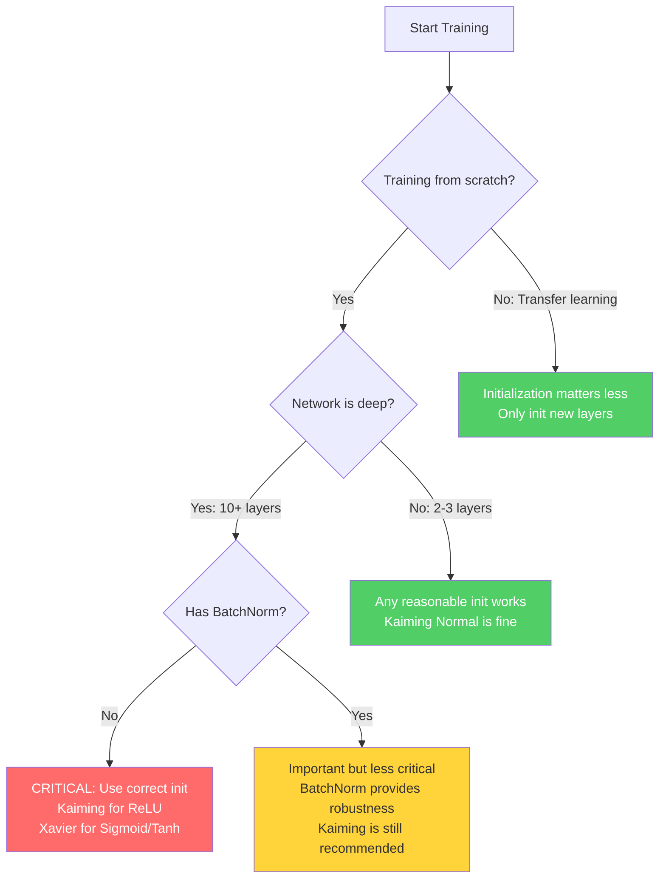

# 14. Weight Initialization

> [!info] Prerequisites
> Before reading this section, you should be comfortable with:
> - [[13. Backpropagation and Gradient Flow in CNNs]] — how gradients propagate through layers
> - [[5. Activation and Pooling Layers]] — properties of activation functions, especially ReLU, Sigmoid, and Tanh
> - Basic probability and statistics (mean, variance, normal distribution, uniform distribution)

---

## 14.1 Why Initialization Matters: The Starting Point on a Non-Convex Landscape

Training a deep neural network is an optimization problem over a loss landscape that is **non-convex**, meaning it contains many local minima, saddle points, and flat regions. Unlike convex optimization — where any local minimum is guaranteed to be the global minimum and gradient descent will always converge — non-convex optimization offers no such guarantees. The point where you start on this landscape, determined entirely by the initial values of the weights, profoundly influences which region of the landscape you will explore, how quickly you will converge, and whether you will converge at all.

To understand why initialization is so critical, consider the following analogy. Imagine you are parachuted onto a vast mountain range at night, and your goal is to reach the lowest valley. You can only feel the slope beneath your feet (the gradient) and take small steps downhill. If you land on a gentle slope near a deep valley, you will quickly find a good solution. If you land on a plateau, you will wander aimlessly with near-zero gradients. If you land on a steep cliff, your steps will be erratic and you may overshoot valleys entirely. The parachute landing point is your weight initialization, and the mountain range is the loss landscape.

There are three concrete reasons why initialization determines training outcomes. First, **convergence speed**: a good initialization places the network in a region where gradients are informative and well-scaled, allowing the optimizer to make rapid progress. A bad initialization may require thousands of additional epochs just to escape a flat or chaotic region. Second, **convergence at all**: some initializations lead to regions from which the optimizer cannot escape — for example, when all activations are saturated in the flat tails of sigmoid functions, producing near-zero gradients that make learning impossible. Third, **final performance**: even when the network converges from different initializations, the quality of the local minimum reached can vary dramatically. Well-initialized networks tend to find wider, more generalizable minima, while poorly initialized networks may converge to sharp, poorly generalizing minima.

> [!tip] The Non-Convex Reality
> A modern CNN with millions of parameters defines a loss landscape in a space of millions of dimensions. In such high-dimensional spaces, the landscape is overwhelmingly complex — it has been estimated that a network with $N$ parameters has roughly $2^N$ saddle points for every local minimum. Initialization is your only control over where you begin exploring this landscape, which makes it one of the most impactful design choices you can make.

---

## 14.2 All-Zero Initialization: The Symmetry Problem

The most naive approach to initialization is to set all weights to zero: $w_{ij} = 0$ for every weight in every layer. At first glance, this might seem reasonable — start from a neutral point and let gradient descent figure out the right values. However, this approach fails catastrophically due to the **symmetry problem**, which prevents the network from ever breaking out of a degenerate state where all neurons in a layer behave identically.

### 14.2.1 The Symmetry Problem in Detail

Consider a fully-connected layer with $n$ inputs and $m$ outputs. The $j$-th output neuron computes:

$$a_j = f\left(\sum_{i=1}^{n} w_{ij} x_i + b_j\right)$$

where $f$ is the activation function and $x_i$ are the inputs. If all weights are initialized to zero ($w_{ij} = 0$) and all biases are initialized to zero ($b_j = 0$), then every output neuron receives the exact same input:

$$a_j = f\left(\sum_{i=1}^{n} 0 \cdot x_i + 0\right) = f(0) \quad \text{for all } j$$

This means every neuron in the layer produces the **identical output**. Now consider what happens during backpropagation. The gradient of the loss with respect to weight $w_{ij}$ is:

$$\frac{\partial L}{\partial w_{ij}} = \frac{\partial L}{\partial a_j} \cdot f'(z_j) \cdot x_i$$

Since all neurons $j$ produce the same activation $a_j = f(0)$, and since the loss function processes all outputs symmetrically (at least initially), the upstream gradient $\frac{\partial L}{\partial a_j}$ is the same for all $j$. Similarly, $f'(z_j) = f'(0)$ is the same for all $j$. Therefore:

$$\frac{\partial L}{\partial w_{ij}} = \text{same value for all } j$$

This means that for a fixed input $i$, every weight $w_{ij}$ (across all neurons $j$) receives the **same gradient update**. Since they all started at zero and all receive the same update, they all move to the same new value. After the update, all neurons still produce identical outputs, receive identical gradients, and make identical updates. This cycle repeats forever — the network is permanently stuck in a symmetric state, and it might as well have a single neuron per layer.

### 14.2.2 Why This Effectively Reduces to a Single Neuron

The symmetry problem is not merely a theoretical curiosity — it fundamentally cripples the network. A layer with $m$ neurons that all produce identical outputs and receive identical updates is functionally equivalent to a layer with a single neuron that has been replicated $m$ times. The expressive power of the layer — its ability to learn diverse, complementary features — is completely wasted. The entire advantage of having multiple neurons, which is that they can learn to detect different patterns in the input, is negated by the fact that symmetry forces them all to learn the same pattern.

Even worse, this problem compounds across layers. If the first hidden layer produces identical outputs from all its neurons, then the second hidden layer receives identical inputs from all its connections to the first layer, and the same symmetry argument applies. The entire network collapses to a function no more expressive than a single-neuron-per-layer network, regardless of how wide or deep it actually is.

> [!warning] The Symmetry Problem Applies to Any Identical Initialization
> The symmetry problem is not unique to zero initialization. Any initialization where all weights in a layer are set to the same constant value (e.g., all weights = 0.5) produces the same problem. The key requirement for breaking symmetry is that different weights must start with different values — which is why random initialization is essential.

---

## 14.3 All-Large-Constant Initialization: The Explosion Problem

Now consider initializing all weights to a large constant value, say $w_{ij} = c$ where $c \gg 1$ (for example, $c = 10$). While this does break symmetry if the constant is applied uniformly (though, as noted above, identical values still cause the symmetry problem), the more fundamental issue is that large weights cause activations and gradients to **explode** exponentially as they propagate through the layers.

### 14.3.1 Activation Explosion

Consider a deep network with $L$ layers, each with $n$ neurons. For simplicity, assume linear activations (the problem is even worse with activations that don't saturate, like ReLU). The output of layer $l$ is:

$$\mathbf{a}^{(l)} = W^{(l)} \mathbf{a}^{(l-1)}$$

Each element of $\mathbf{a}^{(l)}$ is a sum of $n$ terms, each of which is a product of a weight (approximately $c$) and an activation from the previous layer. If the activations in layer $l-1$ have magnitude $O(m)$, then the activations in layer $l$ have magnitude $O(n \cdot c \cdot m)$. After $L$ layers, the magnitude of the activations grows as:

$$\|\mathbf{a}^{(L)}\| \sim O((n \cdot c)^L)$$

This is exponential growth in the depth of the network. For a network with 10 layers, $n = 1000$ neurons per layer, and $c = 10$, the activation magnitude would be on the order of $10{,}000^{10} = 10^{40}$, which is far beyond the range of 32-bit floating-point numbers (maximum $\approx 3.4 \times 10^{38}$). The activations will overflow to `inf` (infinity), and the loss will become `NaN` (Not a Number).

### 14.3.2 Gradient Explosion

The same exponential growth afflicts the gradients during backpropagation. The gradient of the loss with respect to the weights in layer $l$ involves a product of Jacobians from all subsequent layers:

$$\frac{\partial L}{\partial W^{(l)}} = \frac{\partial L}{\partial \mathbf{a}^{(L)}} \cdot \prod_{k=l+1}^{L} \frac{\partial \mathbf{a}^{(k)}}{\partial \mathbf{a}^{(k-1)}}$$

When the weights are large, each Jacobian $\frac{\partial \mathbf{a}^{(k)}}{\partial \mathbf{a}^{(k-1)}} = W^{(k)}$ has large entries, and the product grows exponentially. The result is that gradients are astronomically large, causing weight updates so massive that the parameters bounce wildly around the loss landscape without ever settling into a minimum. The loss curve will show violent oscillations, often diverging to infinity or collapsing to `NaN` within the first few training steps.

### 14.3.3 Why the Loss Oscillates Wildly

With exploding gradients, a single gradient descent step can change the weights by enormous amounts. The network's output after such a step bears no resemblance to its output before the step, and the loss can swing from one extreme to another. This oscillatory behavior prevents the optimizer from making steady progress downhill — it is like trying to walk down a mountain by taking million-mile leaps in random directions. The loss plot during training will show sharp spikes rather than a smooth decline, and the model will never converge.

> [!warning] NaN Loss Is Often a Weight Initialization Problem
> If your training loop produces `NaN` loss within the first few iterations, the most common cause is that the weights are too large, causing activation and gradient overflow. Before debugging your data pipeline or loss function, check your weight initialization.

---

## 14.4 All-Very-Small-Constant Initialization: The Vanishing Problem

At the other extreme, consider initializing all weights to a very small constant, say $w_{ij} = \epsilon$ where $\epsilon \ll 1$ (for example, $\epsilon = 0.001$). While this avoids the explosion problem, it introduces an equally devastating problem: activations and gradients **vanish** exponentially.

### 14.4.1 Activation Vanishing

Using the same analysis as before, the magnitude of the activations after $L$ layers is:

$$\|\mathbf{a}^{(L)}\| \sim O((n \cdot \epsilon)^L)$$

When $\epsilon$ is very small, this quantity shrinks exponentially with depth. For a 10-layer network with $n = 1000$ and $\epsilon = 0.001$, the activation magnitude would be on the order of $1^{10} = 1$ — but this is the magnitude at the output. The intermediate activations at earlier layers are even smaller relative to what they should be, and the gradient signal becomes astronomically tiny.

More precisely, with small weights, each layer essentially multiplies its input by a very small number. After several layers, the output of the network is approximately zero regardless of the input. The network has collapsed to a constant function — it predicts the same output for every input — and the loss is constant, providing no useful gradient signal for learning.

### 14.4.2 Gradient Vanishing

During backpropagation, the gradient with respect to the weights in the early layers involves a product of Jacobians, each of which has very small entries when the weights are tiny. The gradient decays exponentially:

$$\left\|\frac{\partial L}{\partial W^{(1)}}\right\| \sim O((n \cdot \epsilon)^{L-1})$$

For deep networks with small weights, this gradient is so close to zero that it provides essentially no learning signal. The weights in the early layers remain virtually unchanged by gradient descent, while the weights in the later layers (which receive stronger gradients because the chain of multiplications is shorter) may learn slowly. The result is a network where the early feature extraction layers are frozen at their (terrible) initial values, while only the later layers can adapt. This fundamentally undermines the purpose of depth — the whole point of deep networks is to learn hierarchical features, but if the early layers cannot learn, the hierarchy is broken.

### 14.4.3 The Goldilocks Principle

These two failure modes — explosion with large weights and vanishing with small weights — illustrate the **Goldilocks principle** of weight initialization: the weights must be **just right**. Too large, and the network explodes; too small, and it vanishes. The correct scale depends on the network architecture, the activation function, and the depth. Finding this correct scale is the central challenge of weight initialization, and the solutions we will discuss (Xavier and Kaiming initialization) are principled methods for determining the right scale.

> [!tip] Intuition: Weights Are Like Volume Knobs
> Think of each weight as a volume knob. If all knobs are turned up too high (large weights), the signal gets louder and louder through each layer until it becomes deafening noise (overflow). If all knobs are turned down too low (small weights), the signal gets quieter and quieter until it becomes silence (underflow). Good initialization sets the knobs so the signal maintains a consistent volume throughout the network.

---

## 14.5 Random but Uncalibrated Initialization: Why $\mathcal{N}(0, 0.01)$ and $\mathcal{N}(0, 1)$ Fail

The previous sections establish that identical initialization causes symmetry problems and extreme magnitudes cause explosion or vanishing. The natural next step is to initialize weights randomly — which breaks symmetry — but with a variance that is not carefully calibrated. Two common but problematic choices are $\mathcal{N}(0, 0.01)$ (standard deviation 0.01) and $\mathcal{N}(0, 1)$ (standard deviation 1.0). Both fail, but for opposite reasons.

### 14.5.1 Why $\mathcal{N}(0, 0.01)$ Is Too Small for Deep Networks

Using a normal distribution with standard deviation 0.01 means each weight is a tiny random number near zero. While this does break symmetry, it suffers from the same vanishing problem described in Section 14.4. Consider a layer with $n = 512$ inputs. The pre-activation for one neuron is:

$$z = \sum_{i=1}^{512} w_i x_i + b$$

If $w_i \sim \mathcal{N}(0, 0.01)$ and $x_i \sim \mathcal{N}(0, 1)$, then by the variance formula for sums of independent random variables:

$$\text{Var}(z) = \sum_{i=1}^{512} \text{Var}(w_i x_i) = \sum_{i=1}^{512} \text{Var}(w_i) \cdot \text{Var}(x_i) = 512 \times 0.0001 \times 1 = 0.0512$$

So $\text{Std}(z) \approx 0.23$. The pre-activation has a very small variance, meaning all neurons produce values near zero. After several layers, the variance shrinks further, and the network effectively computes the zero function. The gradients will be negligibly small, and learning will be extremely slow or nonexistent.

This initialization was common in the early days of deep learning (before 2010) and is one reason why deep networks were considered impossible to train — the weights were simply too small for gradients to propagate through many layers.

### 14.5.2 Why $\mathcal{N}(0, 1)$ Is Too Large for Deep Networks

At the other extreme, initializing with $\mathcal{N}(0, 1)$ means each weight has unit variance. Using the same analysis:

$$\text{Var}(z) = \sum_{i=1}^{512} \text{Var}(w_i) \cdot \text{Var}(x_i) = 512 \times 1 \times 1 = 512$$

So $\text{Std}(z) \approx 22.6$. The pre-activation has enormous variance, and after just a few layers the values will overflow. Even if they don't overflow numerically, they will push the activations into the saturated regions of sigmoid or tanh functions (where the gradient is nearly zero), effectively creating the vanishing gradient problem through saturation rather than through small weights.

### 14.5.3 The Root Cause: Variance Mismatch Across Layers

The fundamental problem with uncalibrated random initialization is that the **variance of the activations changes from layer to layer**. If the variance grows with each layer, we get explosion; if it shrinks, we get vanishing. The key insight that leads to principled initialization schemes is this: **we should initialize weights so that the variance of the activations remains approximately constant as signals propagate forward through the network, and the variance of the gradients remains approximately constant as they propagate backward**. This is the central idea behind Xavier/Glorot initialization and Kaiming/He initialization.

```mermaid
graph TB
    subgraph "Effect of Initialization on Activation Variance"
        A["Input<br/>Var = 1"] --> B["Layer 1"]
        B --> C["Layer 2"]
        C --> D["Layer 3"]
        D --> E["Layer 4"]
        E --> F["Output"]
    end

    subgraph "N(0, 0.01): Vanishing"
        A1["Var = 1"] --> B1["Var ≈ 0.05"]
        B1 --> C1["Var ≈ 0.003"]
        C1 --> D1["Var ≈ 0.0001"]
        D1 --> E1["Var ≈ 0"]
        E1 --> F1["≈ 0"]
    end

    subgraph "N(0, 1): Exploding"
        A2["Var = 1"] --> B2["Var ≈ 512"]
        B2 --> C2["Var ≈ 262,144"]
        C2 --> D2["Var ≈ 1.3×10⁸"]
        D2 --> E2["Var → ∞"]
        E2 --> F2["Overflow/NaN"]
    end

    subgraph "Xavier/He: Stable"
        A3["Var = 1"] --> B3["Var ≈ 1"]
        B3 --> C3["Var ≈ 1"]
        C3 --> D3["Var ≈ 1"]
        D3 --> E3["Var ≈ 1"]
        E3 --> F3["Var ≈ 1"]
    end
```



> [!warning] A Common Misconception
> Some practitioners believe that "any random initialization will work because symmetry is broken." While it is true that random initialization breaks symmetry, the magnitude of the random values critically determines whether the network can learn. Symmetry breaking is a necessary condition, but it is far from sufficient — the variance must also be calibrated to maintain signal flow through the network.

---

## 14.6 Xavier/Glorot Initialization (2010)

In their landmark 2010 paper "Understanding the Difficulty of Training Deep Feedforward Neural Networks," Xavier Glorot and Yoshua Bengio provided the first principled analysis of weight initialization. Their method, known as **Xavier initialization** or **Glorot initialization**, is derived from the requirement that the variance of activations and gradients should be preserved across layers.

### 14.6.1 Core Idea: Constant Variance Across Layers

The fundamental insight of Xavier initialization is that for effective training, the scale of the signals flowing through the network should be maintained. Specifically, we want two conditions to hold:

1. **Forward pass**: The variance of the activations should be the same at every layer: $\text{Var}(a^{(l)}) = \text{Var}(a^{(l-1)})$ for all layers $l$.
2. **Backward pass**: The variance of the gradients should be the same at every layer: $\text{Var}\left(\frac{\partial L}{\partial a^{(l)}}\right) = \text{Var}\left(\frac{\partial L}{\partial a^{(l-1)}}\right)$ for all layers $l$.

If these conditions are satisfied, neither the forward signal nor the backward gradient will grow or shrink exponentially with depth, and the network will be trainable regardless of how many layers it has.

### 14.6.2 Derivation: Forward Pass Variance

Consider a single neuron in layer $l$ that computes:

$$z^{(l)} = \sum_{i=1}^{n_{\text{in}}} w_i^{(l)} \cdot a_i^{(l-1)} + b^{(l)}$$

where $n_{\text{in}}$ is the number of inputs (fan-in), $w_i^{(l)}$ are the weights, $a_i^{(l-1)}$ are the activations from the previous layer, and $b^{(l)}$ is the bias. We make the following assumptions:

1. The weights $w_i$ are independent and identically distributed (i.i.d.).
2. The activations $a_i$ are independent and identically distributed (i.i.d.).
3. The weights and activations are independent of each other.
4. All weights have zero mean: $E[w_i] = 0$.
5. All activations have zero mean: $E[a_i] = 0$ (approximately true for symmetric activations like tanh).
6. Biases are initialized to zero: $b = 0$.

Under these assumptions, the variance of the pre-activation is:

$$\text{Var}(z^{(l)}) = \text{Var}\left(\sum_{i=1}^{n_{\text{in}}} w_i \cdot a_i\right)$$

Since $w_i$ and $a_i$ are independent and zero-mean, the variance of a product is $\text{Var}(w_i \cdot a_i) = \text{Var}(w_i) \cdot \text{Var}(a_i) + E[w_i]^2 \cdot \text{Var}(a_i) + E[a_i]^2 \cdot \text{Var}(w_i)$. Since $E[w_i] = E[a_i] = 0$, this simplifies to:

$$\text{Var}(w_i \cdot a_i) = \text{Var}(w_i) \cdot \text{Var}(a_i)$$

And since the terms in the sum are independent:

$$\text{Var}(z^{(l)}) = \sum_{i=1}^{n_{\text{in}}} \text{Var}(w_i) \cdot \text{Var}(a_i) = n_{\text{in}} \cdot \text{Var}(w) \cdot \text{Var}(a^{(l-1)})$$

For the activation to have the same variance as the input (assuming the activation function approximately preserves variance, which is true for linear activations and approximately true for tanh near zero), we want:

$$\text{Var}(a^{(l)}) = \text{Var}(z^{(l)}) = n_{\text{in}} \cdot \text{Var}(w) \cdot \text{Var}(a^{(l-1)})$$

Setting $\text{Var}(a^{(l)}) = \text{Var}(a^{(l-1)})$ and solving for $\text{Var}(w)$:

$$\boxed{\text{Var}(w) = \frac{1}{n_{\text{in}}}}$$

This is the **forward pass condition**: the variance of the weights should be the reciprocal of the fan-in to maintain activation variance during the forward pass.

### 14.6.3 Derivation: Backward Pass Variance

A symmetric argument applies to the backward pass. The gradient flowing backward through layer $l$ involves the output dimension $n_{\text{out}}$ (fan-out). By the same logic:

$$\boxed{\text{Var}(w) = \frac{1}{n_{\text{out}}}}$$

This is the **backward pass condition**: the variance of the weights should be the reciprocal of the fan-out to maintain gradient variance during the backward pass.

### 14.6.4 The Xavier Compromise

In general, $n_{\text{in}} \neq n_{\text{out}}$, so the forward and backward conditions cannot be satisfied simultaneously. Glorot and Bengio proposed a **compromise** that satisfies both conditions on average by taking the harmonic mean of the two constraints:

$$\boxed{\text{Var}(w) = \frac{2}{n_{\text{in}} + n_{\text{out}}}}$$

This is the celebrated **Xavier/Glorot initialization** formula. It ensures that the geometric mean of the forward and backward variance ratios is approximately 1, providing a balanced trade-off that works well in practice.

### 14.6.5 Xavier Uniform Initialization

One way to instantiate this variance is with a uniform distribution. For a uniform distribution $U(-a, a)$, the variance is $\frac{a^2}{3}$. Setting this equal to the Xavier variance:

$$\frac{a^2}{3} = \frac{2}{n_{\text{in}} + n_{\text{out}}}$$

Solving for $a$:

$$a = \sqrt{\frac{6}{n_{\text{in}} + n_{\text{out}}}}$$

Therefore, **Xavier Uniform** initialization samples each weight from:

$$\boxed{w \sim U\left(-\sqrt{\frac{6}{n_{\text{in}} + n_{\text{out}}}}, \;\; \sqrt{\frac{6}{n_{\text{in}} + n_{\text{out}}}}\right)}$$

The uniform distribution is sometimes preferred because it has a hard bound on the maximum weight value, which can provide a slight safety margin against outlier weights.

### 14.6.6 Xavier Normal Initialization

Alternatively, we can use a normal (Gaussian) distribution with the Xavier variance. The standard deviation is the square root of the variance:

$$\boxed{w \sim \mathcal{N}\left(0, \;\; \sqrt{\frac{2}{n_{\text{in}} + n_{\text{out}}}}\right)}$$

Note: The notation $\mathcal{N}(0, \sigma)$ means a normal distribution with mean 0 and standard deviation $\sigma$. Some references write $\mathcal{N}(0, \sigma^2)$ where the second parameter is the variance. We use the standard deviation convention here, consistent with PyTorch's `nn.init.xavier_normal_`.

### 14.6.7 When to Use Xavier Initialization

Xavier initialization is designed for **symmetric activation functions** that are approximately linear near zero, specifically:

- **Sigmoid**: $\sigma(x) = \frac{1}{1 + e^{-x}}$, which is approximately linear near $x = 0$ with $\sigma'(0) = 0.25$.
- **Tanh**: $\tanh(x)$, which is approximately linear near $x = 0$ with $\tanh'(0) = 1$.
- **Softsign**: $\frac{x}{1 + |x|}$, another symmetric activation.

The key property that makes Xavier initialization work with these activations is that they are **approximately variance-preserving** near zero. Tanh is particularly well-suited because it is zero-centered and its derivative at zero is 1, meaning it perfectly preserves the variance of small signals. Sigmoid is less well-suited because it is not zero-centered (its output is always positive, with $\sigma(0) = 0.5$), which violates assumption 5 in our derivation. Xavier initialization still works with sigmoid, but it is less effective than with tanh.

> [!info] Historical Significance
> Xavier initialization was one of the key breakthroughths that enabled training of deep feedforward networks. Before 2010, practitioners used ad-hoc initializations that often failed for networks deeper than 3-4 layers. Glorot and Bengio's analysis showed that the failure was not fundamental to deep learning — it was simply a matter of choosing the right initial scale for the weights. This insight opened the door to the very deep architectures (VGG, ResNet, etc.) that followed.

---

## 14.7 Kaiming/He Initialization (2015)

While Xavier initialization works beautifully with sigmoid and tanh, it is **suboptimal for ReLU** and its variants. The reason is that ReLU is not a symmetric, variance-preserving activation — it zeros out all negative values, which systematically reduces the variance of the signal. Kaiming He et al. addressed this in their 2015 paper "Delving Deep into Rectifiers: Surpassing Human-Level Performance on ImageNet Classification," proposing what is now known as **Kaiming initialization** or **He initialization**.

### 14.7.1 Why Xavier Is Suboptimal for ReLU

The ReLU activation function is defined as $a = \max(0, z)$. This is fundamentally asymmetric: positive inputs pass through unchanged, but negative inputs are set to zero. If the pre-activation $z$ has a symmetric distribution around zero (which it does, given our assumptions), then **roughly half the values are zeroed out** by ReLU.

To quantify this effect, consider the variance of the ReLU output. If $z$ is symmetric with zero mean, then:

$$E[\text{ReLU}(z)] = E[z \cdot \mathbb{1}(z > 0)] = \frac{1}{2}E[|z|] > 0$$

More importantly, the variance of the ReLU output is approximately half the variance of the input:

$$\text{Var}(\text{ReLU}(z)) \approx \frac{1}{2} \text{Var}(z)$$

This is because ReLU discards all negative values, effectively halving the "energy" of the signal. A more precise derivation: if $z \sim \mathcal{N}(0, \sigma^2)$, then:

$$E[\text{ReLU}(z)^2] = E[z^2 \cdot \mathbb{1}(z > 0)] = \frac{1}{2}E[z^2] = \frac{\sigma^2}{2}$$

since $z^2$ is symmetric and we're taking half the distribution. Therefore:

$$\text{Var}(\text{ReLU}(z)) = E[\text{ReLU}(z)^2] - E[\text{ReLU}(z)]^2 = \frac{\sigma^2}{2} - \left(\frac{\sigma}{\sqrt{2\pi}}\right)^2 = \frac{\sigma^2}{2}\left(1 - \frac{1}{\pi}\right) \approx \frac{\sigma^2}{2}$$

The dominant term is $\frac{\sigma^2}{2}$. This means that if we use Xavier initialization (which assumes the activation preserves variance), the actual variance of the activations will **shrink by a factor of 2 at each layer**. After 10 layers, the variance will be $\left(\frac{1}{2}\right)^{10} \approx 0.001$ of its original value — the signal has effectively vanished.

### 14.7.2 The Kaiming Correction: Factor of 2

To compensate for the halving of variance by ReLU, we need to double the variance of the weights. Recall the forward pass variance equation:

$$\text{Var}(z^{(l)}) = n_{\text{in}} \cdot \text{Var}(w) \cdot \text{Var}(a^{(l-1)})$$

After ReLU, the variance becomes approximately:

$$\text{Var}(a^{(l)}) \approx \frac{1}{2} \text{Var}(z^{(l)}) = \frac{1}{2} n_{\text{in}} \cdot \text{Var}(w) \cdot \text{Var}(a^{(l-1)})$$

For the variance to be preserved ($\text{Var}(a^{(l)}) = \text{Var}(a^{(l-1)})$), we need:

$$1 = \frac{1}{2} n_{\text{in}} \cdot \text{Var}(w)$$

Solving for $\text{Var}(w)$:

$$\boxed{\text{Var}(w) = \frac{2}{n_{\text{in}}}}$$

This is the **Kaiming/He initialization** formula. The extra factor of 2 in the numerator (compared to the forward-only Xavier condition $\text{Var}(w) = \frac{1}{n_{\text{in}}}$) compensates for the factor of $\frac{1}{2}$ introduced by ReLU.

### 14.7.3 Kaiming Normal Initialization

The most commonly used form of Kaiming initialization draws weights from a normal distribution with the appropriate variance:

$$\boxed{w \sim \mathcal{N}\left(0, \;\; \sqrt{\frac{2}{n_{\text{in}}}}\right)}$$

This is the default initialization for convolutional layers in PyTorch (with a slight modification for the uniform distribution, as discussed below).

### 14.7.4 Kaiming Uniform Initialization

We can also use a uniform distribution. For $U(-a, a)$ with variance $\frac{a^2}{3} = \frac{2}{n_{\text{in}}}$:

$$a = \sqrt{\frac{6}{n_{\text{in}}}}$$

$$\boxed{w \sim U\left(-\sqrt{\frac{6}{n_{\text{in}}}}, \;\; \sqrt{\frac{6}{n_{\text{in}}}}\right)}$$

### 14.7.5 `fan_in` vs `fan_out` Mode

Kaiming initialization can be computed using either the fan-in ($n_{\text{in}}$) or fan-out ($n_{\text{out}}$) of the layer. The choice affects whether the initialization preserves variance in the forward pass or the backward pass:

- **`fan_in` mode** (default in PyTorch): Uses $\text{Var}(w) = \frac{2}{n_{\text{in}}}$. This preserves variance in the **forward pass**. It is the recommended mode for most use cases because it ensures that activations have consistent magnitude across layers during inference, which is when the forward pass matters most.

- **`fan_out` mode**: Uses $\text{Var}(w) = \frac{2}{n_{\text{out}}}$. This preserves variance in the **backward pass**. It can be beneficial when you want to ensure that gradients have consistent magnitude, particularly for very deep networks where gradient vanishing is the primary concern.

For a convolutional layer with kernel size $k \times k$, input channels $C_{\text{in}}$, and output channels $C_{\text{out}}$:

$$n_{\text{in}} = C_{\text{in}} \times k \times k$$
$$n_{\text{out}} = C_{\text{out}} \times k \times k$$

For example, a `Conv2d(64, 128, kernel_size=3)` has $n_{\text{in}} = 64 \times 3 \times 3 = 576$ and $n_{\text{out}} = 128 \times 3 \times 3 = 1152$. The fan_in Kaiming initialization would use $\text{Var}(w) = \frac{2}{576} \approx 0.00347$, while the fan_out mode would use $\text{Var}(w) = \frac{2}{1152} \approx 0.00174$.

### 14.7.6 When to Use Kaiming Initialization

Kaiming initialization should be used with **ReLU and its variants**, which includes essentially all modern CNNs:

- **ReLU**: $a = \max(0, z)$ — the original and most common case.
- **Leaky ReLU**: $a = \max(\alpha z, z)$ where $\alpha$ is a small positive constant (typically 0.01 or 0.2). The derivation is slightly modified: $\text{Var}(w) = \frac{2}{(1 + \alpha^2) n_{\text{in}}}$, but since $\alpha^2 \ll 1$, the standard ReLU formula is often used in practice.
- **PReLU**: Parametric ReLU, where $\alpha$ is learned. Same formula as Leaky ReLU.
- **ELU, SELU**: These have different saturation properties, and specialized initializations exist (especially for SELU, which has its own self-normalizing initialization called LeCun normal).

If your network uses ReLU-family activations (which it almost certainly does if it's a modern CNN), you should use Kaiming initialization.

> [!tip] Quick Rule of Thumb
> - **Sigmoid or Tanh activations** → Xavier/Glorot initialization
> - **ReLU or Leaky ReLU activations** → Kaiming/He initialization
> - When in doubt, use Kaiming (since modern networks almost always use ReLU-family activations)

---

## 14.8 PyTorch Default Initializations

PyTorch uses specific default initializations for its layer types. Understanding these defaults is important because they determine the starting point of your network when you don't explicitly set the initialization.

### 14.8.1 `nn.Conv2d` Default: Kaiming Uniform

PyTorch initializes `Conv2d` weights using **Kaiming Uniform** with `fan_in` mode and `a = sqrt(5)` (where `a` is the negative slope of the Leaky ReLU, used to compute the gain). Specifically:

$$w \sim U\left(-\sqrt{\frac{6}{(1 + a^2) \cdot n_{\text{in}}}}, \;\; \sqrt{\frac{6}{(1 + a^2) \cdot n_{\text{in}}}}\right)$$

where $a = \sqrt{5}$ by default, giving $(1 + a^2) = 6$. This simplifies to:

$$w \sim U\left(-\sqrt{\frac{1}{n_{\text{in}}}}, \;\; \sqrt{\frac{1}{n_{\text{in}}}}\right)$$

This is actually a slightly more conservative initialization than the standard Kaiming Uniform (which would use $\sqrt{\frac{6}{n_{\text{in}}}}$ as the bound). The choice of $a = \sqrt{5}$ is a historical artifact of PyTorch's implementation, but it works well in practice. Biases are initialized to zero.

### 14.8.2 `nn.Linear` Default: Kaiming Uniform (Same as Conv2d)

Fully-connected (`Linear`) layers use the same initialization as `Conv2d`: Kaiming Uniform with $a = \sqrt{5}$. For a `Linear(m, n)` layer, $n_{\text{in}} = m$, so:

$$w \sim U\left(-\frac{1}{\sqrt{m}}, \;\; \frac{1}{\sqrt{m}}\right)$$

Biases are initialized using $U\left(-\frac{1}{\sqrt{m}}, \frac{1}{\sqrt{m}}\right)$.

### 14.8.3 `nn.BatchNorm2d` Default: gamma = 1, beta = 0

Batch normalization has two learnable parameters: $\gamma$ (weight/scale) and $\beta$ (bias/shift). The default initialization is:

- $\gamma = 1$: The scale parameter starts at 1, meaning the normalization initially has no scaling effect.
- $\beta = 0$: The shift parameter starts at 0, meaning the normalization initially has no shifting effect.

This is a deliberate and important choice. Since batch normalization already centers the activations to zero mean and unit variance, initializing $\gamma = 1$ and $\beta = 0$ means the batch norm layer initially just performs the standard normalization without any learnable modification. The network can then learn to adjust $\gamma$ and $\beta$ as needed during training, but the initial behavior is the well-understood normalization. This is far superior to random initialization of $\gamma$ and $\beta$, which would disrupt the carefully normalized distribution.

### 14.8.4 Verifying PyTorch Defaults

```python
import torch                                # Import PyTorch library
import torch.nn as nn                       # Import neural network module

# --- Create a Conv2d layer and check its initialization ---
conv = nn.Conv2d(in_channels=3,             # 3 input channels (RGB)
                 out_channels=64,           # 64 output channels
                 kernel_size=3,             # 3x3 kernel
                 padding=1)                 # Same padding

# Check weight statistics
print(f"Weight shape: {conv.weight.shape}")      # [64, 3, 3, 3]
print(f"Weight mean: {conv.weight.mean().item():.6f}")  # ≈ 0 (symmetric distribution)
print(f"Weight std: {conv.weight.std().item():.6f}")    # ≈ sqrt(1/n_in) ≈ 0.192

# Expected n_in for fan_in mode
n_in = 3 * 3 * 3  # = 27 (in_channels × kernel_h × kernel_w)
print(f"Expected std (Kaiming w/ a=sqrt(5)): {1/n_in**0.5:.6f}")  # ≈ 0.192

# Check bias
print(f"Bias: {conv.bias}")                       # Should be zeros or small uniform

# --- Create a BatchNorm2d layer and check its initialization ---
bn = nn.BatchNorm2d(num_features=64)        # 64 features (matches conv output)

print(f"BN gamma (weight): {bn.weight[:5]}")      # All 1s
print(f"BN beta (bias): {bn.bias[:5]}")            # All 0s
print(f"BN running_mean: {bn.running_mean[:5]}")   # All 0s
print(f"BN running_var: {bn.running_var[:5]}")     # All 1s
```

> [!info] Why PyTorch Uses Kaiming Uniform by Default
> PyTorch adopted Kaiming Uniform as the default because it works well for the majority of modern architectures that use ReLU-family activations. The choice of uniform over normal distribution is partly historical and partly practical — uniform distributions have bounded support, which means there are no extremely large outlier weights that could destabilize training. However, the difference between uniform and normal is typically negligible in practice.

---

## 14.9 Manual Initialization in PyTorch: Complete Examples

While PyTorch's defaults are reasonable, you will often need to override them — for example, when using a different initialization scheme, when implementing a custom architecture, or when reproducing results from a paper. PyTorch provides the `torch.nn.init` module with convenient functions for common initialization schemes.

### 14.9.1 Initializing a Single Layer

```python
import torch                                # Import PyTorch library
import torch.nn as nn                       # Import neural network module
import torch.nn.init as init                # Import initialization functions

# --- Create a linear layer ---
linear = nn.Linear(in_features=512,         # 512 input features
                   out_features=256)        # 256 output features

# --- Xavier Normal initialization ---
# Sets weights from N(0, sqrt(2 / (fan_in + fan_out)))
init.xavier_normal_(linear.weight)          # In-place operation on weight tensor
# After this call, linear.weight contains samples from N(0, sqrt(2/768))
# where 768 = 512 + 256 = fan_in + fan_out

# --- Xavier Uniform initialization ---
# Sets weights from U(-sqrt(6/(fan_in+fan_out)), sqrt(6/(fan_in+fan_out)))
init.xavier_uniform_(linear.weight)         # Overwrites previous initialization

# --- Kaiming Normal initialization (fan_in mode, for ReLU) ---
# Sets weights from N(0, sqrt(2 / fan_in))
init.kaiming_normal_(linear.weight,         # In-place operation on weight tensor
                     mode='fan_in',         # Use fan_in for forward pass stability
                     nonlinearity='relu')   # Specify ReLU activation (factor of 2)

# --- Kaiming Uniform initialization (fan_in mode, for ReLU) ---
# Sets weights from U(-sqrt(6/fan_in), sqrt(6/fan_in))
init.kaiming_uniform_(linear.weight,        # In-place operation on weight tensor
                      mode='fan_in',        # Use fan_in mode
                      nonlinearity='relu')  # Specify ReLU activation

# --- Initialize bias to zero ---
init.zeros_(linear.bias)                    # Set all bias values to exactly 0
```

### 14.9.2 Initializing an Entire Model

When you have a model with many layers, you need a systematic way to initialize all layers. The standard approach is to define an initialization function that recursively visits every module in the model and applies the appropriate initialization based on the module type.

```python
import torch                                # Import PyTorch library
import torch.nn as nn                       # Import neural network module
import torch.nn.init as init                # Import initialization functions


def init_weights(m):                        # m is a module (layer) in the model
    """
    Initialize weights for a model module-by-module.
    
    This function is designed to be passed to model.apply(),
    which recursively applies it to every submodule.
    
    Args:
        m: A PyTorch nn.Module (e.g., nn.Linear, nn.Conv2d, nn.BatchNorm2d)
    """
    if isinstance(m, nn.Linear):            # Check if module is a fully-connected layer
        init.kaiming_normal_(m.weight,      # Kaiming Normal for ReLU networks
                             mode='fan_in', # Preserve forward pass variance
                             nonlinearity='relu')  # Account for ReLU's variance halving
        if m.bias is not None:              # Check if the layer has a bias parameter
            init.zeros_(m.bias)             # Initialize bias to zero

    elif isinstance(m, nn.Conv2d):          # Check if module is a 2D convolution
        init.kaiming_normal_(m.weight,      # Kaiming Normal for ReLU networks
                             mode='fan_in', # Preserve forward pass variance
                             nonlinearity='relu')  # Account for ReLU's variance halving
        if m.bias is not None:              # Check if the convolution has a bias parameter
            init.zeros_(m.bias)             # Initialize bias to zero

    elif isinstance(m, nn.BatchNorm2d):     # Check if module is 2D batch normalization
        init.ones_(m.weight)                # gamma (scale) = 1 (identity scaling)
        init.zeros_(m.bias)                 # beta (shift) = 0 (identity shifting)

    elif isinstance(m, nn.BatchNorm1d):     # Check if module is 1D batch normalization
        init.ones_(m.weight)                # gamma (scale) = 1
        init.zeros_(m.bias)                 # beta (shift) = 0


# --- Create a model and apply initialization ---
model = nn.Sequential(                      # Simple sequential model
    nn.Conv2d(3, 64, 3, padding=1),         # Conv: 3→64 channels, 3×3 kernel
    nn.BatchNorm2d(64),                     # Batch norm: 64 features
    nn.ReLU(),                              # ReLU activation
    nn.Flatten(),                           # Flatten spatial dimensions
    nn.Linear(64 * 32 * 32, 128),           # FC: 65536→128 features
    nn.ReLU(),                              # ReLU activation
    nn.Linear(128, 10),                     # FC: 128→10 classes
)

model.apply(init_weights)                   # Apply init_weights to EVERY submodule
# model.apply() recursively traverses all modules in the model
# and calls init_weights() on each one
```

### 14.9.3 Initializing with Xavier for Sigmoid/Tanh Networks

If your network uses sigmoid or tanh activations (for example, in certain recurrent architectures or older CNN designs), you should use Xavier initialization instead:

```python
def init_weights_xavier(m):                # Initialization function for sigmoid/tanh
    """
    Initialize weights using Xavier/Glorot initialization.
    Use this for networks with Sigmoid or Tanh activations.
    """
    if isinstance(m, nn.Linear):            # Check if module is a fully-connected layer
        init.xavier_normal_(m.weight)       # Xavier Normal: N(0, sqrt(2/(fan_in+fan_out)))
        if m.bias is not None:              # Check for bias parameter
            init.zeros_(m.bias)             # Initialize bias to zero

    elif isinstance(m, nn.Conv2d):          # Check if module is a 2D convolution
        init.xavier_normal_(m.weight)       # Xavier Normal for convolution weights
        if m.bias is not None:              # Check for bias parameter
            init.zeros_(m.bias)             # Initialize bias to zero

    elif isinstance(m, (nn.BatchNorm2d,     # Check for any batch norm variant
                        nn.BatchNorm1d)):
        init.ones_(m.weight)                # gamma = 1
        init.zeros_(m.bias)                 # beta = 0
```

### 14.9.4 Custom Initialization: Orthogonal and Sparse

For specific architectures, other initialization schemes may be beneficial:

```python
def init_weights_advanced(m):               # Advanced initialization function
    """
    Advanced initialization schemes for specific use cases.
    """
    if isinstance(m, nn.Linear):            # Check if module is a fully-connected layer
        # Orthogonal initialization: rows of the weight matrix are orthogonal
        # Helps preserve gradient magnitude in very deep networks
        init.orthogonal_(m.weight,          # Sample from orthogonal matrix
                         gain=1.0)          # gain controls the overall scale
        if m.bias is not None:
            init.zeros_(m.bias)

    elif isinstance(m, nn.Conv2d):          # Check if module is a 2D convolution
        # Sparse initialization: only a fraction of weights are non-zero
        # Inspired by biological neural networks (sparse connectivity)
        init.kaiming_normal_(m.weight,      # Start with Kaiming Normal
                             mode='fan_in',
                             nonlinearity='relu')
        # Apply sparsity by zeroing out 90% of weights
        sparsity = 0.9                      # Fraction of weights to zero out
        mask = torch.rand_like(m.weight) > sparsity  # Boolean mask: True for kept weights
        m.weight.data *= mask.float()       # Zero out 90% of weights
        # Scale remaining weights to compensate for sparsity
        m.weight.data /= (1 - sparsity)     # Multiply by 1/0.1 = 10 to preserve variance
        if m.bias is not None:
            init.zeros_(m.bias)
```

### 14.9.5 Verifying Initialization with Variance Tracking

One of the best ways to verify that your initialization is correct is to track the variance of activations at each layer during a forward pass with random input. If the variance remains roughly constant across layers, the initialization is well-calibrated.

```python
import torch                                # Import PyTorch library
import torch.nn as nn                       # Import neural network module


class VarianceTracker(nn.Module):           # Module that tracks activation variance
    """
    A wrapper that records the variance of activations at each layer
    during a forward pass. Used to verify that initialization preserves
    variance across layers.
    """
    def __init__(self, model):              # Constructor
        super().__init__()                  # Call parent constructor
        self.model = model                  # Store the wrapped model
        self.variances = {}                 # Dictionary to store variances
        self.hooks = []                     # List to store hook handles

        # Register forward hooks on all layers that have weight parameters
        for name, module in model.named_modules():  # Iterate over all named modules
            if hasattr(module, 'weight'):   # Only track modules with weights
                # Create a hook that records the variance of the output
                hook = module.register_forward_hook(
                    self._make_hook(name)   # Create a closure that captures the name
                )
                self.hooks.append(hook)     # Store the hook handle for later removal

    def _make_hook(self, name):            # Factory function for creating hooks
        """Create a forward hook that records output variance."""
        def hook(module, input, output):    # Hook function signature
            self.variances[name] = output.var().item()  # Record variance of output
        return hook                         # Return the hook function

    def forward(self, x):                   # Forward pass
        self.variances = {}                 # Reset variance dictionary
        return self.model(x)                # Run the model and record variances

    def remove_hooks(self):                 # Clean up hooks
        for hook in self.hooks:             # Iterate over all hooks
            hook.remove()                   # Remove each hook


# --- Usage example ---
model = nn.Sequential(                      # Create a deep model to test
    nn.Linear(784, 512),                    # Layer 1: 784 → 512
    nn.ReLU(),                              # ReLU activation
    nn.Linear(512, 256),                    # Layer 2: 512 → 256
    nn.ReLU(),                              # ReLU activation
    nn.Linear(256, 128),                    # Layer 3: 256 → 128
    nn.ReLU(),                              # ReLU activation
    nn.Linear(128, 64),                     # Layer 4: 128 → 64
    nn.ReLU(),                              # ReLU activation
    nn.Linear(64, 10),                      # Layer 5: 64 → 10 (output)
)

# Apply Kaiming initialization
model.apply(init_weights)                   # Use the init_weights function from earlier

# Track variance across layers
tracker = VarianceTracker(model)            # Wrap model with variance tracker
x = torch.randn(32, 784)                   # Random input (batch=32, features=784)
output = tracker(x)                         # Forward pass with variance tracking

# Print results
print("Variance of activations across layers:")
print("=" * 50)
for name, var in tracker.variances.items(): # Iterate over all tracked layers
    print(f"  {name:30s}  Var = {var:.4f}") # Print layer name and variance
# With good initialization, all variances should be approximately 1.0
# If variances decrease → vanishing problem (weights too small)
# If variances increase → exploding problem (weights too large)

tracker.remove_hooks()                      # Clean up hooks to prevent memory leaks
```

> [!tip] Debugging Initialization with Variance Tracking
> If you notice that the variance systematically decreases across layers, your initialization is too conservative — try increasing the weight scale (e.g., switch from Xavier to Kaiming). If the variance systematically increases, your initialization is too aggressive — try decreasing the weight scale. The goal is to see approximately constant variance throughout the network.

---

## 14.10 When Initialization Matters vs. When It Doesn't

Not every training scenario requires careful attention to initialization. Understanding when it matters and when it doesn't can save you significant debugging time.

### 14.10.1 When Initialization Matters

1. **Training from scratch**: When you initialize a model with random weights and train it on a dataset from scratch, initialization is critical. The starting point on the loss landscape determines convergence speed and final performance. This is the most common scenario where you need to think carefully about initialization.

2. **Very deep networks**: The deeper the network, the more sensitive it is to initialization. In a 3-layer network, even a poor initialization may allow convergence (albeit slowly). In a 100-layer network, a poor initialization can make training completely impossible. The exponential nature of variance propagation means that initialization errors compound with depth.

3. **Networks without Batch Normalization**: Batch normalization acts as an "adaptive re-initialization" at every layer during training, which dramatically reduces the network's sensitivity to initialization (see [[16. Batch Normalization]]). Without batch normalization, the network relies entirely on the initial scale of the weights to maintain signal flow, making initialization critical.

4. **Specific activation functions**: The choice between Xavier and Kaiming initialization depends on the activation function. Using Xavier with ReLU will cause the activations to vanish over many layers, while using Kaiming with sigmoid may cause them to saturate. The initialization must be matched to the activation.

5. **Reproducing research results**: Different initializations can lead to different final accuracies, even when all other hyperparameters are identical. If you need to reproduce a specific result, you must use the same initialization scheme (and the same random seed).

### 14.10.2 When Initialization Matters Less

1. **Transfer learning / Fine-tuning**: When you start from pre-trained weights (e.g., a ResNet trained on ImageNet), the initialization is the pre-trained weights, which are already in a good region of the loss landscape. The random initialization of the weights being fine-tuned is irrelevant because those weights are never used. You only need to initialize the **new** layers that you add on top of the pre-trained model (e.g., a new classification head), and the initialization of these few layers is much less critical because the features from the pre-trained backbone are already well-scaled.

2. **Networks with Batch Normalization**: Batch normalization re-normalizes the activations at every layer during training, effectively correcting for any variance mismatch introduced by the initialization. While a poor initialization can still slow down the early stages of training, batch normalization makes the network far more robust to the specific initialization scheme used. In practice, with batch normalization, the difference between Xavier and Kaiming initialization is often negligible.

3. **Shallow networks**: For networks with only 2-3 layers, the exponential effects of initialization are minimal. Almost any reasonable random initialization will work, and the choice between schemes will have little impact on convergence speed or final performance.

4. **With learning rate warmup**: A learning rate warmup strategy (starting with a very small learning rate and gradually increasing it) can help the network adjust its weights from a poor initialization before full-speed training begins. This doesn't eliminate the need for good initialization, but it can mitigate some of its effects.



> [!warning] Don't Ignore Initialization Just Because You Have BatchNorm
> While batch normalization reduces the sensitivity to initialization, it does not eliminate it entirely. A very poor initialization (e.g., all zeros) will still cause problems even with batch normalization, because the symmetry problem prevents different neurons from learning different features. Batch normalization helps with the *scale* of the signal, but it does not break *symmetry* — only random initialization can do that.

---

## 14.11 Summary: A Comprehensive Comparison

| Initialization | Formula | For Activations | Preserves | Notes |
|---|---|---|---|---|
| Zero | $w = 0$ | None (broken) | Nothing | Symmetry problem: all neurons identical |
| Large constant | $w = c, c \gg 1$ | None (broken) | Nothing | Activations/gradients explode |
| Small constant | $w = \epsilon, \epsilon \ll 1$ | None (broken) | Nothing | Activations/gradients vanish |
| $\mathcal{N}(0, 0.01)$ | $w \sim \mathcal{N}(0, 0.01)$ | None (broken) | Nothing | Too small for deep networks |
| $\mathcal{N}(0, 1)$ | $w \sim \mathcal{N}(0, 1)$ | None (broken) | Nothing | Too large for deep networks |
| Xavier Normal | $w \sim \mathcal{N}(0, \sqrt{2/(n_{\text{in}}+n_{\text{out}})})$ | Sigmoid, Tanh | Forward + backward variance | Best for symmetric activations |
| Xavier Uniform | $w \sim U(-\sqrt{6/(n_{\text{in}}+n_{\text{out}})}, \sqrt{6/(n_{\text{in}}+n_{\text{out}})})$ | Sigmoid, Tanh | Forward + backward variance | Bounded weights, same principle |
| Kaiming Normal | $w \sim \mathcal{N}(0, \sqrt{2/n_{\text{in}}})$ | ReLU, Leaky ReLU | Forward variance (fan_in) | Default choice for modern CNNs |
| Kaiming Uniform | $w \sim U(-\sqrt{6/n_{\text{in}}}, \sqrt{6/n_{\text{in}}})$ | ReLU, Leaky ReLU | Forward variance (fan_in) | PyTorch Conv2d/Linear default |

> [!tip] The Takeaway
> Weight initialization is about **scale** and **symmetry breaking**. You need randomness to break symmetry (so neurons learn different features) and the right variance to maintain signal flow (so neither activations nor gradients vanish or explode). Xavier and Kaiming initialization provide principled formulas for choosing this variance based on the network architecture and activation function. When in doubt, use Kaiming Normal with `fan_in` mode for ReLU networks — it is the safest default for modern deep learning.

---

## 14.12 Key Takeaways

1. **Initialization determines your starting point** on the non-convex loss landscape, profoundly affecting convergence speed, convergence at all, and final performance.

2. **Zero initialization fails** because it creates perfect symmetry — all neurons in a layer produce identical outputs, receive identical gradients, and make identical updates, effectively reducing the network to a single neuron per layer.

3. **Large weights cause explosion** — activations and gradients grow exponentially with depth, leading to overflow, `NaN` loss, and violent oscillations.

4. **Small weights cause vanishing** — activations and gradients shrink exponentially with depth, leading to near-zero learning signal, especially in early layers.

5. **Uncalibrated random initialization** ($\mathcal{N}(0, 0.01)$ or $\mathcal{N}(0, 1)$) either vanishes or explodes because the variance is not matched to the network's architecture.

6. **Xavier/Glorot initialization** ($\text{Var}(w) = \frac{2}{n_{\text{in}} + n_{\text{out}}}$) preserves activation and gradient variance for symmetric activations like sigmoid and tanh.

7. **Kaiming/He initialization** ($\text{Var}(w) = \frac{2}{n_{\text{in}}}$) compensates for ReLU's variance-halving effect and is the correct choice for all ReLU-family activations.

8. **PyTorch defaults** are Kaiming Uniform for Conv2d and Linear, and $\gamma=1, \beta=0$ for BatchNorm — reasonable defaults for most modern architectures.

9. **Initialization matters most** when training from scratch, especially for deep networks without batch normalization. It matters less for transfer learning or shallow networks with batch normalization.

10. **Always verify** your initialization by tracking activation variance across layers — constant variance confirms correct scaling, while systematic drift indicates a mismatch between the initialization and the activation function.
