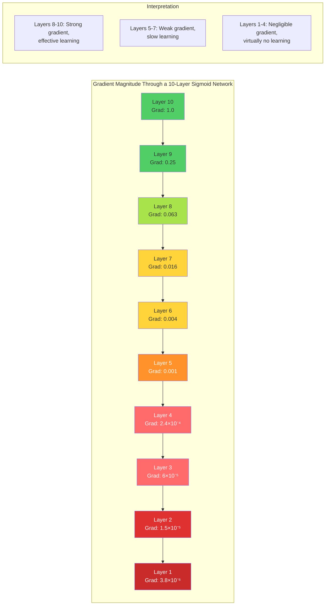
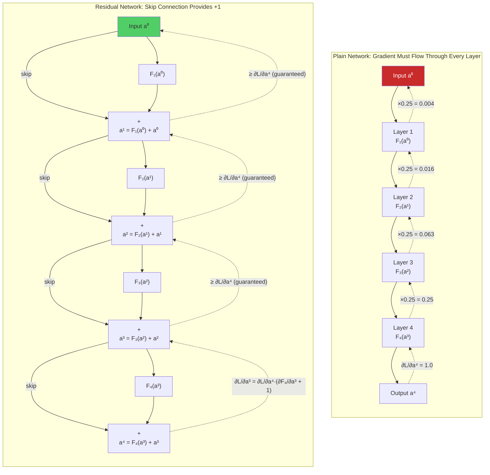
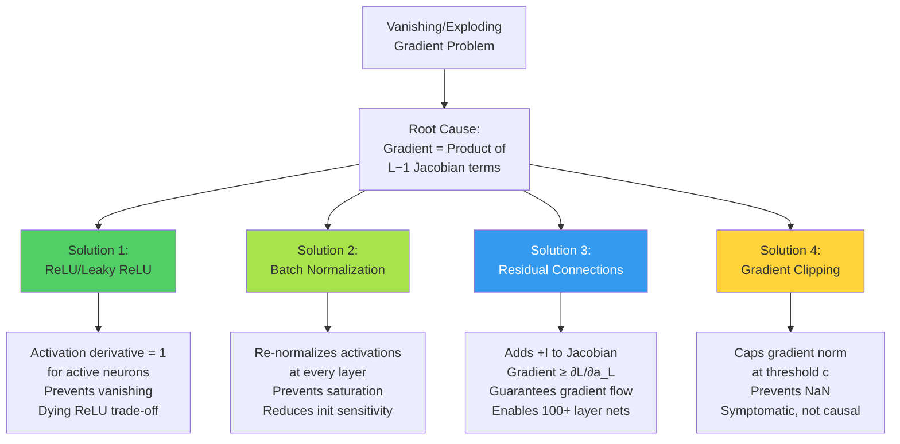

# 15. The Vanishing and Exploding Gradient Problems

> [!info] Prerequisites
> Before reading this section, you should be comfortable with:
> - [[13. Backpropagation and Gradient Flow in CNNs]] — the chain rule, gradient computation, how gradients propagate backward
> - [[14. Weight Initialization]] — Xavier/Glorot and Kaiming/He initialization and why they matter
> - [[5. Activation and Pooling Layers]] — properties of Sigmoid, Tanh, ReLU, and Leaky ReLU

---

## 15.1 The Core Mechanism: Gradients as Products

The vanishing and exploding gradient problems are the two most fundamental obstacles to training deep neural networks. Both arise from the same mathematical mechanism: during backpropagation, the gradient of the loss with respect to the weights in an early layer is computed as a **product of many terms**, one for each layer between the loss and the target weights. When each term in this product is less than one, the product shrinks exponentially toward zero (vanishing). When each term is greater than one, the product grows exponentially toward infinity (exploding). This seemingly simple observation has profound consequences for the trainability of deep networks.

To understand why this is such a pervasive problem, consider the analogy of a long telephone game. In the children's game "telephone," a message is whispered from person to person down a line. If each person slightly mishears or distorts the message (multiplying it by a factor slightly different from 1), the message at the end of the line bears little resemblance to the original. If each person consistently muffles the message (factor < 1), the last person hears nothing. If each person amplifies the message (factor > 1), the last person is deafened by noise. Backpropagation through a deep network is exactly this game — the "message" is the gradient, and each "person" is a layer that multiplies the gradient by its local derivative.

The deep learning revolution of the 2010s was largely driven by the development of techniques that address these two problems. Without ReLU, batch normalization, residual connections, and gradient clipping, training networks deeper than a few layers would remain essentially impossible. Understanding the vanishing and exploding gradient problems is therefore not just a theoretical exercise — it is the key to understanding why modern deep learning works at all.

---

## 15.2 Mathematical Formulation

### 15.2.1 The Gradient as a Product of Jacobians

Consider a deep feedforward network with $L$ layers. The forward pass computes:

$$\mathbf{a}^{(1)} = f_1\left(W^{(1)} \mathbf{x} + \mathbf{b}^{(1)}\right)$$
$$\mathbf{a}^{(2)} = f_2\left(W^{(2)} \mathbf{a}^{(1)} + \mathbf{b}^{(2)}\right)$$
$$\vdots$$
$$\mathbf{a}^{(L)} = f_L\left(W^{(L)} \mathbf{a}^{(L-1)} + \mathbf{b}^{(L)}\right)$$
$$\mathcal{L} = \ell\left(\mathbf{a}^{(L)}, \mathbf{y}\right)$$

where $f_l$ is the activation function at layer $l$, $W^{(l)}$ is the weight matrix, $\mathbf{b}^{(l)}$ is the bias vector, $\mathbf{a}^{(l)}$ is the activation vector, and $\mathcal{L}$ is the loss function.

During backpropagation, the gradient of the loss with respect to the activations at layer $l$ is:

$$\frac{\partial \mathcal{L}}{\partial \mathbf{a}^{(l)}} = \frac{\partial \mathcal{L}}{\partial \mathbf{a}^{(L)}} \cdot \prod_{k=l+1}^{L} \frac{\partial \mathbf{a}^{(k)}}{\partial \mathbf{a}^{(k-1)}}$$

This product of Jacobians is the source of both the vanishing and exploding gradient problems. Each Jacobian $\frac{\partial \mathbf{a}^{(k)}}{\partial \mathbf{a}^{(k-1)}}$ is a matrix that depends on the weight matrix $W^{(k)}$ and the derivative of the activation function $f_k'$ at the current activations.

### 15.2.2 Simplification: Scalar Case for Intuition

To build intuition, consider a simplified scalar network where each layer has a single neuron, and the activation function at each layer is some differentiable function $f$. The forward pass is:

$$a^{(l)} = f\left(w^{(l)} \cdot a^{(l-1)}\right)$$

The gradient of the loss with respect to the activation at layer $l$ is:

$$\frac{\partial \mathcal{L}}{\partial a^{(l)}} = \frac{\partial \mathcal{L}}{\partial a^{(L)}} \cdot \prod_{k=l+1}^{L} \frac{\partial a^{(k)}}{\partial a^{(k-1)}}$$

Each term in the product is:

$$\frac{\partial a^{(k)}}{\partial a^{(k-1)}} = f'\left(z^{(k)}\right) \cdot w^{(k)}$$

where $z^{(k)} = w^{(k)} \cdot a^{(k-1)}$ is the pre-activation. Therefore:

$$\boxed{\frac{\partial \mathcal{L}}{\partial a^{(l)}} = \frac{\partial \mathcal{L}}{\partial a^{(L)}} \cdot \prod_{k=l+1}^{L} f'\left(z^{(k)}\right) \cdot w^{(k)}}$$

This is the fundamental equation. The gradient is a product of $L - l$ terms, each of which is the product of an activation derivative and a weight. The behavior of this product determines whether gradients vanish or explode:

- If $\left|f'(z^{(k)}) \cdot w^{(k)}\right| < 1$ for most layers $k$, then the product **vanishes** as $L - l$ grows.
- If $\left|f'(z^{(k)}) \cdot w^{(k)}\right| > 1$ for most layers $k$, then the product **explodes** as $L - l$ grows.
- If $\left|f'(z^{(k)}) \cdot w^{(k)}\right| \approx 1$ for most layers $k$, then the product is **stable**.

This analysis reveals that the gradient behavior is determined by the interaction between the activation function and the weight magnitude — exactly the two factors addressed by proper initialization (see [[14. Weight Initialization]]).

### 15.2.3 The Exponential Nature of the Problem

The key word is **exponential**. If each term in the product has magnitude $\alpha$, then after $L - l$ layers:

$$\left|\frac{\partial \mathcal{L}}{\partial a^{(l)}}\right| \approx \alpha^{L-l}$$

This means:

| $\alpha$ | After 5 layers | After 10 layers | After 20 layers | After 50 layers |
|---|---|---|---|---|
| 0.9 | 0.59 | 0.35 | 0.12 | 0.005 |
| 0.5 | 0.03 | 0.001 | $10^{-6}$ | $10^{-15}$ |
| 0.25 | 0.001 | $10^{-6}$ | $10^{-12}$ | $10^{-30}$ |
| 1.1 | 1.61 | 2.59 | 6.73 | 117.4 |
| 1.5 | 7.59 | 57.67 | 3325 | $6.4 \times 10^8$ |
| 2.0 | 32 | 1024 | $10^6$ | $10^{15}$ |

The numbers are stark. Even a small deviation from $\alpha = 1$ compounds catastrophically over many layers. With $\alpha = 0.5$ (which is typical for sigmoid networks), the gradient after just 10 layers is $0.5^{10} \approx 0.001$ of its original value. After 50 layers, it is $0.5^{50} \approx 10^{-15}$, which is well below the resolution of 32-bit floating-point numbers (approximately $10^{-7}$). The gradient has effectively vanished to zero as far as the computer is concerned, and the early layers receive no learning signal whatsoever.

> [!warning] This Is Not a Theoretical Curiosity
> The vanishing and exploding gradient problems are not edge cases that only affect poorly designed networks. They are fundamental to the mathematics of backpropagation through deep compositions of functions. Every deep network must address these problems, either implicitly (through architectural choices like ReLU and batch normalization) or explicitly (through techniques like gradient clipping and residual connections). Ignoring them guarantees training failure.

---

## 15.3 Vanishing Gradients

### 15.3.1 The Sigmoid Problem: A Derivative Ceiling of 0.25

The sigmoid activation function, defined as $\sigma(x) = \frac{1}{1 + e^{-x}}$, was the default activation function in early neural networks. Unfortunately, it is also one of the primary causes of vanishing gradients. The derivative of the sigmoid function is:

$$\sigma'(x) = \sigma(x)(1 - \sigma(x))$$

This derivative has a **maximum value of 0.25**, which occurs at $x = 0$ where $\sigma(0) = 0.5$. For any other value of $x$, the derivative is even smaller. Let us verify this by finding the maximum:

$$\frac{d}{dx}\sigma'(x) = \frac{d}{dx}[\sigma(x)(1-\sigma(x))] = \sigma'(x)(1 - 2\sigma(x)) = 0$$

This is zero when $\sigma(x) = 0.5$, i.e., at $x = 0$. At this point:

$$\sigma'(0) = 0.5 \times 0.5 = 0.25$$

For all other values of $x$, the derivative is less than 0.25. Specifically:

- At $x = 1$: $\sigma(1) \approx 0.731$, $\sigma'(1) \approx 0.731 \times 0.269 \approx 0.197$
- At $x = 2$: $\sigma(2) \approx 0.881$, $\sigma'(2) \approx 0.881 \times 0.119 \approx 0.105$
- At $x = 5$: $\sigma(5) \approx 0.993$, $\sigma'(5) \approx 0.993 \times 0.007 \approx 0.007$
- At $x = -5$: $\sigma(-5) \approx 0.007$, $\sigma'(-5) \approx 0.007 \times 0.993 \approx 0.007$

In the saturation regions (where $|x|$ is large), the derivative is extremely close to zero. The sigmoid function "saturates" — it flattens out — and the gradient through the saturated region is negligible.

### 15.3.2 The Devastating Compounding Effect

The maximum derivative of 0.25 means that every time the gradient passes through a sigmoid activation, it is multiplied by at most 0.25 (and often much less). Consider a 10-layer network where each layer uses a sigmoid activation. Even in the best case — where every neuron is exactly at $x = 0$, giving the maximum derivative — the gradient after passing through 10 sigmoid layers is:

$$0.25^{10} = \left(\frac{1}{4}\right)^{10} = \frac{1}{4^{10}} = \frac{1}{1{,}048{,}576} \approx 9.5 \times 10^{-7}$$

The gradient is reduced to roughly one-millionth of its original value. In practice, the situation is even worse because neurons are rarely at $x = 0$ — they are often in the saturated tails, where the derivative is much smaller. A more realistic estimate, using an average derivative of about 0.1 (which is typical for initialized networks), gives:

$$0.1^{10} = 10^{-10}$$

This is far below the precision of 32-bit floating-point numbers (which have approximately 7 decimal digits of precision). The gradient has effectively been rounded to zero, and the weights in the early layers will never be updated.

### 15.3.3 The Tanh Variant: Better, but Still Problematic

The hyperbolic tangent activation function, $\tanh(x) = \frac{e^x - e^{-x}}{e^x + e^{-x}}$, is a zero-centered alternative to sigmoid. Its derivative is:

$$\tanh'(x) = 1 - \tanh^2(x)$$

The maximum derivative of tanh is 1.0 (at $x = 0$), which is four times better than sigmoid's maximum of 0.25. However, tanh still saturates for large $|x|$, and the derivative drops rapidly:

- At $x = 0$: $\tanh'(0) = 1.0$
- At $x = 1$: $\tanh'(1) \approx 0.42$
- At $x = 2$: $\tanh'(2) \approx 0.07$
- At $x = 3$: $\tanh'(3) \approx 0.01$

Even with tanh, the average derivative across all neurons in a typical network is well below 1, and the gradient still vanishes through many layers — just more slowly than with sigmoid.

### 15.3.4 Consequence: Early Layers Receive No Learning Signal

The practical consequence of vanishing gradients is that **early layers learn extremely slowly or not at all**. In a deep network with vanishing gradients, the following pattern emerges:

1. **Late layers** (close to the output) receive strong gradients and learn quickly. They can adjust their weights to reduce the loss effectively.
2. **Middle layers** receive moderate gradients and learn more slowly. Their updates are small but still meaningful.
3. **Early layers** (close to the input) receive negligible gradients and learn almost nothing. Their weights remain essentially at their random initial values.

This creates a pathological situation: the early layers, which are responsible for extracting low-level features (edges, textures, patterns), are stuck at their random initialization, while the late layers try to compensate by learning complex mappings from random features to the correct output. The network is fundamentally handicapped because it cannot learn a good feature hierarchy.

This problem is especially severe in CNNs, where the early convolutional layers are supposed to learn general feature detectors (edges, corners, textures) that are useful for all visual tasks. If these layers cannot learn, the entire network operates on essentially random features, and its performance is severely limited.

### 15.3.5 Mermaid Diagram: Gradient Decay Through Layers



> [!tip] Visualizing Vanishing Gradients
> The gradient at layer $l$ in a sigmoid network with $L$ total layers is approximately $0.25^{L-l}$ times the gradient at the output. After just 6 layers, the gradient is reduced by a factor of $0.25^6 = 2.4 \times 10^{-4}$. This means a gradient of 1.0 at the output becomes 0.00024 at layer $l = L-6$, which is far too small to produce meaningful weight updates with any reasonable learning rate.

---

## 15.4 Exploding Gradients

### 15.4.1 When Each Derivative Exceeds 1

Exploding gradients occur when the terms in the gradient product consistently have magnitude greater than 1. This happens when the weights are too large (poor initialization) or when the activation derivatives are consistently greater than 1 (which is rare for standard activations but can happen with certain configurations).

The most common cause of exploding gradients is **poor weight initialization** combined with **learning rates that are too high**. When the weights are initialized with a variance that is too large (e.g., $\mathcal{N}(0, 1)$ for a deep network), the product $|f'(z^{(k)}) \cdot w^{(k)}| > 1$ for many layers, and the gradient grows exponentially during backpropagation.

Even with good initialization, exploding gradients can emerge during training if the learning rate is too high. Large weight updates can push the weights into a regime where the gradients are even larger, creating a positive feedback loop: large gradients → large updates → even larger weights → even larger gradients. This self-reinforcing cycle can cause the network to diverge within a single training step.

### 15.4.2 Symptoms of Exploding Gradients

Exploding gradients produce several distinctive and unmistakable symptoms during training:

1. **NaN loss**: The loss function returns `NaN` (Not a Number), which occurs when the activations or gradients overflow beyond the range of floating-point numbers. This is the most dramatic symptom and the one most frequently encountered by practitioners. Once the loss becomes `NaN`, all subsequent weight updates are also `NaN`, and training is permanently stuck.

2. **NaN weights**: The weight values themselves become `NaN`, which can happen even before the loss becomes `NaN` if the gradient overflow occurs in a specific part of the network. Once any weight is `NaN`, every computation involving that weight produces `NaN`, and the corruption spreads to the entire network.

3. **Wildly oscillating loss**: Before the loss reaches `NaN`, it may exhibit violent oscillations — jumping from very small values to very large values and back, with no discernible downward trend. The loss curve looks like a seismograph reading during an earthquake rather than the smooth descent expected during training.

4. **Extremely large weight values**: Examining the model's parameters reveals that some weights have grown to values orders of magnitude larger than their initial values. This is a sign that the gradient updates have been consistently too large.

5. **Sudden spikes in the loss curve**: Even if the loss is generally decreasing, occasional massive spikes indicate that the gradient has temporarily exploded in some part of the network. These spikes are warning signs that the network is on the edge of instability.

### 15.4.3 Common Causes

Several specific conditions can lead to exploding gradients:

1. **Uncalibrated random initialization**: Using $\mathcal{N}(0, 1)$ or any initialization with too-large variance causes the gradient product to grow with depth. As derived in [[14. Weight Initialization]], the variance of the activations grows as $(n \cdot \text{Var}(w))^L$, where $n$ is the layer width and $L$ is the depth.

2. **Learning rate too high**: Even with good initialization, a learning rate that is too large causes weight updates that overshoot the minimum, pushing the weights into a region of the loss landscape with even steeper gradients. The positive feedback loop of large gradients → large updates → larger gradients can cause divergence within a few steps.

3. **Missing or incorrect normalization**: Without batch normalization or layer normalization, there is no mechanism to re-scale the activations and gradients at each layer. The network relies entirely on the initial weight scale to maintain signal flow, and any perturbation that increases the weights can trigger an explosion.

4. **Recurrent networks processing long sequences**: In RNNs, the same weight matrix is applied at every time step, so the gradient product involves the same matrix raised to a high power. If the largest singular value of this matrix is greater than 1, the gradient grows exponentially with the sequence length. This is the "vanishing/exploding gradient problem in RNNs," which is closely related to but distinct from the problem in feedforward networks.

> [!warning] Exploding Gradients Can Happen Suddenly
> Unlike vanishing gradients, which cause a slow, gradual deterioration of learning in the early layers, exploding gradients can occur suddenly and catastrophically. A network can be training normally for hundreds of epochs and then suddenly produce `NaN` loss in a single step. This makes exploding gradients harder to anticipate but easier to detect — the symptoms are unmistakable.

---

## 15.5 Four Solutions to the Vanishing and Exploding Gradient Problems

The deep learning community has developed four major solutions to these problems. Each addresses the issue from a different angle, and in practice, modern architectures use all four together for maximum effectiveness.

---

## 15.5.1 Solution 1: ReLU and Its Variants

### 15.5.1.1 How ReLU Solves Vanishing Gradients

The Rectified Linear Unit (ReLU), defined as $\text{ReLU}(z) = \max(0, z)$, has a derivative that is either 0 or 1:

$$\text{ReLU}'(z) = \begin{cases} 1 & \text{if } z > 0 \\ 0 & \text{if } z \leq 0 \end{cases}$$

For active neurons ($z > 0$), the derivative is exactly 1, which means the gradient passes through unchanged. Unlike sigmoid (maximum derivative 0.25) or tanh (maximum derivative 1.0 but typically much less), ReLU's derivative of 1 does not attenuate the gradient at all. Through a chain of active ReLU neurons, the gradient is preserved:

$$\prod_{k=1}^{L} \text{ReLU}'(z^{(k)}) = 1 \times 1 \times \cdots \times 1 = 1$$

This is the fundamental reason ReLU enables training of very deep networks. The gradient does not vanish through the activation functions — it is preserved exactly for all active neurons. Combined with proper initialization (Kaiming/He initialization, which accounts for the fact that roughly half the neurons are inactive), ReLU allows stable gradient flow through networks with hundreds of layers.

### 15.5.1.2 The Dying ReLU Problem

However, ReLU introduces a new problem: the **dying ReLU**. When a neuron's pre-activation $z$ is negative for all training examples, its gradient is zero for all examples, and the neuron can never recover. This happens when:

1. The weights are initialized or updated such that the pre-activation is always negative.
2. A large gradient update pushes the weights so far in the negative direction that the neuron's pre-activation becomes negative for all inputs, and it can never recover because the gradient is zero.

The probability of a neuron dying depends on the initialization and the data distribution. With Kaiming initialization and standard data, roughly 50% of neurons are active on average (since the pre-activations are approximately normally distributed around zero). However, in deep networks with many layers, a significant fraction of neurons can die during training, reducing the effective width of the network.

A neuron that has died is permanently useless — it contributes nothing to the network's computation and receives no gradient signal. If too many neurons die, the network's capacity is severely reduced, and its performance suffers. In extreme cases, entire layers can die, creating an effective "shortcut" through the network that bypasses important computations.

### 15.5.1.3 Leaky ReLU: The Solution to Dying ReLU

The **Leaky ReLU** activation function modifies ReLU to allow a small, non-zero gradient for negative inputs:

$$\text{LeakyReLU}(z) = \begin{cases} z & \text{if } z > 0 \\ \alpha z & \text{if } z \leq 0 \end{cases}$$

where $\alpha$ is a small positive constant, typically $\alpha = 0.01$ or $\alpha = 0.2$. The derivative is:

$$\text{LeakyReLU}'(z) = \begin{cases} 1 & \text{if } z > 0 \\ \alpha & \text{if } z \leq 0 \end{cases}$$

For negative inputs, the gradient is $\alpha$ instead of 0. This ensures that even neurons with negative pre-activations receive a small but non-zero gradient, allowing them to potentially recover from a bad configuration. The trade-off is that the gradient for negative inputs is small ($\alpha \ll 1$), so these neurons learn much more slowly than active neurons. But slow learning is infinitely better than no learning at all — a dead neuron learns nothing, while a "leaky" neuron at least has the possibility of recovery.

### 15.5.1.4 Parametric ReLU (PReLU)

**PReLU** takes Leaky ReLU one step further by making $\alpha$ a learnable parameter rather than a fixed hyperparameter:

$$\text{PReLU}(z) = \begin{cases} z & \text{if } z > 0 \\ \alpha z & \text{if } z \leq 0 \end{cases}$$

where $\alpha$ is learned via backpropagation along with the other weights. This allows the network to automatically determine the optimal negative slope for each neuron. PReLU was introduced in the same paper as Kaiming initialization (He et al., 2015) and was used to achieve human-level performance on ImageNet for the first time.

### 15.5.1.5 Code: Comparing Activation Functions and Their Gradients

```python
import torch                                    # Import PyTorch library
import torch.nn as nn                           # Import neural network module
import torch.nn.functional as F                 # Import functional interface

# --- Define a deep network with different activation functions ---
class DeepNetwork(nn.Module):                   # Custom module class
    def __init__(self, activation='relu',       # Activation function choice
                 num_layers=20,                 # Number of hidden layers
                 hidden_dim=256):               # Width of each hidden layer
        super().__init__()                      # Call parent constructor
        
        layers = []                             # List to hold layer components
        for _ in range(num_layers):             # Build each hidden layer
            layers.append(nn.Linear(hidden_dim, hidden_dim))  # Linear transformation
            # Choose activation function
            if activation == 'relu':            # Standard ReLU
                layers.append(nn.ReLU())
            elif activation == 'leaky_relu':    # Leaky ReLU with slope 0.01
                layers.append(nn.LeakyReLU(negative_slope=0.01))
            elif activation == 'sigmoid':       # Sigmoid (problematic)
                layers.append(nn.Sigmoid())
            elif activation == 'tanh':          # Tanh (less problematic)
                layers.append(nn.Tanh())
        
        layers.append(nn.Linear(hidden_dim, 10))  # Output layer: 10 classes
        
        self.network = nn.Sequential(*layers)   # Wrap all layers in Sequential

    def forward(self, x):                       # Forward pass
        return self.network(x)                  # Pass input through all layers


# --- Compare gradient norms across layers for different activations ---
def measure_gradient_norms(activation, num_layers=20):  # Function to measure gradients
    """
    Create a deep network with the specified activation function,
    run a forward and backward pass, and measure the gradient norm
    at each layer. This reveals whether gradients vanish or explode.
    """
    model = DeepNetwork(activation=activation,  # Create model with specified activation
                        num_layers=num_layers)  # Number of layers
    
    # Apply Kaiming initialization (appropriate for all activations tested)
    for m in model.modules():                   # Iterate over all modules
        if isinstance(m, nn.Linear):            # Only initialize Linear layers
            nn.init.kaiming_normal_(m.weight,   # Kaiming Normal initialization
                                     mode='fan_in',
                                     nonlinearity='relu')
            if m.bias is not None:
                nn.init.zeros_(m.bias)          # Zero bias

    # Forward pass with random input
    x = torch.randn(8, 256)                     # Random input (batch=8, features=256)
    output = model(x)                           # Forward pass through the network
    
    # Compute loss and backward pass
    target = torch.randint(0, 10, (8,))         # Random target labels
    loss = F.cross_entropy(output, target)      # Cross-entropy loss
    loss.backward()                             # Backward pass: compute all gradients

    # Measure gradient norm at each Linear layer
    gradient_norms = []                         # List to store gradient norms
    for i, m in enumerate(model.modules()):     # Iterate over all modules
        if isinstance(m, nn.Linear):            # Only check Linear layers
            if m.weight.grad is not None:       # Check if gradient exists
                grad_norm = m.weight.grad.norm().item()  # Compute L2 norm of gradient
                gradient_norms.append((i, grad_norm))     # Store (layer_index, norm)

    return gradient_norms                        # Return list of (layer, norm) pairs


# --- Run comparison ---
for act in ['sigmoid', 'tanh', 'relu', 'leaky_relu']:  # Test all four activations
    norms = measure_gradient_norms(act)          # Measure gradient norms
    print(f"\n{act.upper()} - Gradient norms by layer:")
    for layer_idx, norm in norms[:5]:            # Show first 5 layers
        print(f"  Layer {layer_idx}: {norm:.6f}")
    print("  ...")
    for layer_idx, norm in norms[-3:]:           # Show last 3 layers
        print(f"  Layer {layer_idx}: {norm:.6f}")
    
    # Check ratio of first to last layer gradient
    if len(norms) >= 2:                          # Need at least 2 layers
        first_norm = norms[0][1]                 # Gradient norm of first layer
        last_norm = norms[-1][1]                 # Gradient norm of last layer
        ratio = first_norm / (last_norm + 1e-10) # Ratio (small = vanishing)
        print(f"  First/Last ratio: {ratio:.2e}")
        if ratio < 1e-3:                         # Threshold for "vanishing"
            print(f"   VANISHING GRADIENTS detected!")
        elif ratio > 1e3:                        # Threshold for "exploding"
            print(f"   EXPLODING GRADIENTS detected!")
        else:
            print(f"   Gradient flow is healthy")
```

> [!tip] ReLU Is the Single Most Important Innovation for Deep Networks
> While Kaiming initialization, batch normalization, and residual connections all contribute to solving the vanishing gradient problem, ReLU is the foundational innovation that makes deep learning possible. Without ReLU's gradient-preserving property (derivative = 1 for active neurons), none of the other techniques would be sufficient to train very deep networks. If you take away only one lesson from this section, it should be: **always use ReLU or its variants for the hidden layers of deep networks**.

---

## 15.5.2 Solution 2: Batch Normalization

### 15.5.2.1 How Batch Normalization Prevents Saturation

Batch normalization (BatchNorm), introduced by Ioffe and Szegedy in 2015, addresses the vanishing and exploding gradient problems from a completely different angle than ReLU. Instead of modifying the activation function, BatchNorm **normalizes the pre-activations** at each layer to have zero mean and unit variance, preventing them from entering the saturated regions of the activation function where gradients are small.

The batch normalization operation for a single feature $z$ is:

$$\hat{z} = \frac{z - \mu_B}{\sqrt{\sigma_B^2 + \epsilon}}$$

where $\mu_B$ is the batch mean, $\sigma_B^2$ is the batch variance, and $\epsilon$ is a small constant (typically $10^{-5}$) added for numerical stability. The normalized value $\hat{z}$ is then scaled and shifted by learnable parameters:

$$y = \gamma \hat{z} + \beta$$

The key insight is that by centering the pre-activations around zero and scaling them to unit variance, BatchNorm ensures that the activations are always in the **linear region** of the activation function (for sigmoid/tanh) or in the **active region** (for ReLU, where $z > 0$). This prevents saturation, which is the primary mechanism of vanishing gradients.

### 15.5.2.2 How Batch Normalization Stabilizes Gradient Flow

Batch normalization stabilizes gradient flow through three mechanisms:

1. **Preventing saturation**: By keeping the pre-activations in a controlled range, BatchNorm prevents them from entering the saturated tails of sigmoid or tanh, where the gradient is near zero. Even though modern networks use ReLU (which doesn't saturate for positive inputs), BatchNorm still helps by ensuring that a consistent fraction of neurons are active (approximately 50%, since the pre-activations are centered at zero).

2. **Controlling the scale of the gradient**: The normalization step re-scales the pre-activations, which effectively re-scales the gradients flowing through them. If the weights in a particular layer grow large, the normalization automatically reduces the scale of the pre-activations, preventing the gradient from exploding. Conversely, if the weights shrink, the normalization amplifies the pre-activations, preventing the gradient from vanishing. This self-correcting behavior is the key to BatchNorm's effectiveness.

3. **Reducing dependence on initialization**: By re-normalizing the activations at every layer, BatchNorm makes the network far less sensitive to the initial weight scale. Even if the initialization is off by a significant factor, BatchNorm will correct the scale within the first few training iterations. This is why practitioners often report that "with BatchNorm, initialization doesn't matter much" — while not strictly true (the symmetry problem still requires random initialization), the scale of the initialization is much less critical.

### 15.5.2.3 The Mathematical Argument

To see why BatchNorm helps with gradient flow, consider the gradient of the loss with respect to the pre-activation $z$ at some layer. Without BatchNorm:

$$\frac{\partial \mathcal{L}}{\partial z} = \frac{\partial \mathcal{L}}{\partial a} \cdot f'(z) \cdot W$$

The scale of this gradient depends on the product of the weight scale $W$ and the activation derivative $f'(z)$. If $W$ is large, the gradient explodes; if $z$ is in the saturated region of $f$, the gradient vanishes.

With BatchNorm, the pre-activation is replaced by the normalized value $\hat{z}$, and the gradient becomes:

$$\frac{\partial \mathcal{L}}{\partial z} = \frac{\partial \mathcal{L}}{\partial y} \cdot \gamma \cdot \frac{1}{\sqrt{\sigma_B^2 + \epsilon}}$$

The scale of this gradient is controlled by $\gamma / \sqrt{\sigma_B^2 + \epsilon}$. If the variance $\sigma_B^2$ is large (indicating that the weights have grown), the denominator grows proportionally, keeping the gradient bounded. If $\sigma_B^2$ is small (indicating that the weights have shrunk), the denominator is small, amplifying the gradient. This automatic scaling ensures that gradients remain in a healthy range regardless of the weight magnitudes.

For a detailed treatment of batch normalization, see [[16. Batch Normalization]].

> [!info] BatchNorm and Initialization: Partners, Not Substitutes
> Batch normalization and proper initialization are complementary, not alternatives. BatchNorm reduces the network's sensitivity to the scale of initialization, but it does not break symmetry — only random initialization can do that. You still need Kaiming or Xavier initialization to ensure that different neurons start in different parts of the parameter space. Think of it this way: initialization determines *which* region of the loss landscape you start in, while BatchNorm ensures that you stay in a well-conditioned region as you train.

---

## 15.5.3 Solution 3: Residual Skip Connections

### 15.5.3.1 The Key Insight: Adding a +1 Term to the Gradient

Residual connections, introduced by He et al. in the seminal ResNet paper (2015), are perhaps the most elegant solution to the vanishing gradient problem. The idea is deceptively simple: instead of learning the direct mapping $\mathbf{a}^{(l)} = F(\mathbf{a}^{(l-1)})$, the network learns the **residual** mapping:

$$\mathbf{a}^{(l)} = F(\mathbf{a}^{(l-1)}) + \mathbf{a}^{(l-1)}$$

The $+\mathbf{a}^{(l-1)}$ term is the "skip connection" — it allows the input to bypass the transformation $F$ and be added directly to the output. This seemingly minor modification has a profound effect on gradient flow.

During backpropagation, the gradient of the loss with respect to the input $\mathbf{a}^{(l-1)}$ is:

$$\frac{\partial \mathcal{L}}{\partial \mathbf{a}^{(l-1)}} = \frac{\partial \mathcal{L}}{\partial \mathbf{a}^{(l)}} \cdot \frac{\partial \mathbf{a}^{(l)}}{\partial \mathbf{a}^{(l-1)}}$$

For the residual block, $\mathbf{a}^{(l)} = F(\mathbf{a}^{(l-1)}) + \mathbf{a}^{(l-1)}$, so:

$$\frac{\partial \mathbf{a}^{(l)}}{\partial \mathbf{a}^{(l-1)}} = \frac{\partial F(\mathbf{a}^{(l-1)})}{\partial \mathbf{a}^{(l-1)}} + \mathbf{I}$$

where $\mathbf{I}$ is the identity matrix (the derivative of $\mathbf{a}^{(l-1)}$ with respect to itself). Therefore:

$$\boxed{\frac{\partial \mathcal{L}}{\partial \mathbf{a}^{(l-1)}} = \frac{\partial \mathcal{L}}{\partial \mathbf{a}^{(l)}} \cdot \left(\frac{\partial F(\mathbf{a}^{(l-1)})}{\partial \mathbf{a}^{(l-1)}} + \mathbf{I}\right)}$$

The critical term is the **$+\mathbf{I}$** (the identity matrix). Even if the Jacobian $\frac{\partial F}{\partial \mathbf{a}^{(l-1)}}$ is very small (which would cause vanishing gradients in a plain network), the identity term ensures that the gradient is at least $\frac{\partial \mathcal{L}}{\partial \mathbf{a}^{(l)}}$, which is the gradient from the next layer. The gradient cannot vanish to zero because it always has the contribution from the skip connection.

### 15.5.3.2 Mathematical Proof: Gradient Cannot Vanish Through Residual Blocks

Let us prove rigorously that the gradient cannot vanish through a stack of residual blocks. Consider a network with $L$ residual blocks:

$$\mathbf{a}^{(l)} = F_l(\mathbf{a}^{(l-1)}) + \mathbf{a}^{(l-1)}, \quad l = 1, 2, \ldots, L$$

The gradient at the input is:

$$\frac{\partial \mathcal{L}}{\partial \mathbf{a}^{(0)}} = \frac{\partial \mathcal{L}}{\partial \mathbf{a}^{(L)}} \cdot \prod_{l=L}^{1} \left(\frac{\partial F_l}{\partial \mathbf{a}^{(l-1)}} + \mathbf{I}\right)$$

Let us denote $J_l = \frac{\partial F_l}{\partial \mathbf{a}^{(l-1)}}$ for brevity. The product expands to:

$$\prod_{l=L}^{1} (J_l + \mathbf{I}) = (J_L + \mathbf{I})(J_{L-1} + \mathbf{I}) \cdots (J_1 + \mathbf{I})$$

Even in the worst case where all $J_l = 0$ (meaning the residual functions $F_l$ are completely "flat" and provide no gradient), this product reduces to:

$$\prod_{l=L}^{1} \mathbf{I} = \mathbf{I}$$

So the gradient is simply:

$$\frac{\partial \mathcal{L}}{\partial \mathbf{a}^{(0)}} = \frac{\partial \mathcal{L}}{\partial \mathbf{a}^{(L)}}$$

The gradient from the output is transmitted **perfectly** to the input through the skip connections, regardless of how many layers the network has. This is the mathematical guarantee that makes ResNet possible — the skip connections provide a "gradient highway" that ensures the learning signal always reaches the early layers.

In practice, the Jacobians $J_l$ are not zero — they contribute additional gradient information from the residual function $F_l$. The total gradient is the sum of contributions from all possible paths through the network (direct paths through skip connections and indirect paths through the residual functions). The skip connection paths provide a strong baseline gradient, while the residual function paths add task-specific gradient information.

### 15.5.3.3 Mermaid Diagram: Gradient Flow in Residual vs. Plain Networks



### 15.5.3.4 Code: Implementing a Residual Block

```python
import torch                                    # Import PyTorch library
import torch.nn as nn                           # Import neural network module


class ResidualBlock(nn.Module):                 # Residual block module
    """
    A basic residual block with two convolutional layers and a skip connection.
    The skip connection ensures that the gradient always has a path
    that bypasses the convolutional layers, preventing vanishing gradients.
    """
    def __init__(self, channels):               # Constructor
        super().__init__()                      # Call parent constructor
        self.conv1 = nn.Conv2d(channels,        # First convolution: same in/out channels
                               channels,
                               kernel_size=3,   # 3×3 kernel
                               padding=1,       # Same padding (output size = input size)
                               bias=False)      # No bias (BatchNorm handles the shift)
        self.bn1 = nn.BatchNorm2d(channels)     # Batch normalization after first conv
        self.relu = nn.ReLU(inplace=True)       # ReLU activation (in-place saves memory)
        self.conv2 = nn.Conv2d(channels,        # Second convolution: same channels
                               channels,
                               kernel_size=3,
                               padding=1,
                               bias=False)
        self.bn2 = nn.BatchNorm2d(channels)     # Batch normalization after second conv

    def forward(self, x):                       # Forward pass
        """
        Compute: output = F(x) + x
        
        The '+ x' is the skip connection. Even if F(x) is zero
        (at initialization, this is approximately true with Kaiming init),
        the gradient can still flow through x, ensuring no vanishing.
        """
        identity = x                            # Save the input for the skip connection

        # Compute F(x): the residual function
        out = self.conv1(x)                     # First convolution
        out = self.bn1(out)                     # Batch normalization
        out = self.relu(out)                    # ReLU activation
        out = self.conv2(out)                   # Second convolution
        out = self.bn2(out)                     # Batch normalization

        # Add the skip connection: output = F(x) + x
        out = out + identity                    # This is the key line!
        # The gradient of (out + identity) w.r.t. identity is I + ∂F/∂x
        # The I term guarantees the gradient is at least 1

        out = self.relu(out)                    # Final ReLU after addition

        return out                              # Return the output


# --- Demonstrate gradient flow through a deep residual network ---
class DeepResNet(nn.Module):                    # Deep ResNet model
    """
    A deep network built from many residual blocks.
    Despite having many layers, the skip connections ensure
    that gradients flow all the way back to the input.
    """
    def __init__(self, num_blocks=20,           # Number of residual blocks
                 channels=64):                  # Number of channels
        super().__init__()                      # Call parent constructor
        self.input_conv = nn.Conv2d(3,          # Initial convolution: 3 → 64 channels
                                     channels,
                                     kernel_size=3,
                                     padding=1,
                                     bias=False)
        self.input_bn = nn.BatchNorm2d(channels)  # Batch norm for initial conv
        self.relu = nn.ReLU(inplace=True)       # ReLU activation

        # Stack of residual blocks
        self.blocks = nn.Sequential(            # Sequential container for blocks
            *[ResidualBlock(channels) for _ in range(num_blocks)]  # Create num_blocks blocks
        )

        self.output_conv = nn.Conv2d(channels,  # Final convolution: 64 → 10 channels
                                      10,
                                      kernel_size=1)

    def forward(self, x):                       # Forward pass
        x = self.input_conv(x)                  # Initial convolution
        x = self.input_bn(x)                    # Batch normalization
        x = self.relu(x)                        # ReLU activation
        x = self.blocks(x)                      # Pass through all residual blocks
        x = self.output_conv(x)                 # Final convolution
        x = x.mean(dim=[2, 3])                  # Global average pooling
        return x                                # Return logits (batch_size, 10)


# --- Compare gradient norms: ResNet vs. Plain network ---
def compare_gradient_flow():                    # Function to compare gradient flow
    """
    Compare the gradient norms at each layer between a deep ResNet
    and a deep plain network, demonstrating that skip connections
    prevent gradient vanishing.
    """
    # Create both networks
    resnet = DeepResNet(num_blocks=20)          # ResNet with 20 residual blocks (≈40 layers)
    
    # Count total parameters
    total_params = sum(p.numel() for p in resnet.parameters())  # Total number of parameters
    print(f"ResNet total parameters: {total_params:,}")        # Print parameter count

    # Forward pass
    x = torch.randn(4, 3, 32, 32)              # Random input (batch=4, RGB, 32×32)
    output = resnet(x)                          # Forward pass through ResNet
    target = torch.randint(0, 10, (4,))         # Random target labels
    loss = F.cross_entropy(output, target)      # Cross-entropy loss
    loss.backward()                             # Backward pass

    # Measure gradient norms for convolutional layers
    print("\nGradient norms by layer (ResNet):")
    for name, param in resnet.named_parameters():  # Iterate over all named parameters
        if param.grad is not None and 'conv' in name and 'weight' in name:
            grad_norm = param.grad.norm().item()    # Compute L2 norm of gradient
            print(f"  {name:40s}  grad_norm = {grad_norm:.6f}")


compare_gradient_flow()                         # Run the comparison
```

For more details on residual connections and the degradation problem they solve, see [[11. The Degradation Problem and Residual Connections]].

> [!tip] Why Skip Connections Are Called "Gradient Highways"
> The skip connection creates a direct path from the loss to every layer in the network, bypassing all intermediate computations. This path has a gradient of exactly 1 (the identity mapping), so the gradient signal is transmitted without any attenuation. The residual function $F$ can then add task-specific gradient information on top of this baseline. The skip connections are like highway lanes that allow fast, direct travel (gradient flow), while the residual functions are like local roads that provide access to specific destinations (feature learning).

---

## 15.5.4 Solution 4: Gradient Clipping

### 15.5.4.1 The Idea: Put a Ceiling on Gradient Magnitude

While ReLU, BatchNorm, and residual connections address the **root causes** of vanishing and exploding gradients, gradient clipping is a **symptomatic treatment** that directly prevents gradients from becoming too large. The idea is simple: after computing the gradients via backpropagation, but before applying the weight update, we check if the total gradient magnitude exceeds a threshold, and if it does, we scale it down to the threshold value.

Gradient clipping does not prevent gradients from being large — it merely limits their maximum magnitude. This is like installing a speed limiter on a car: the car can still go fast, but it cannot exceed the speed limit. In the context of deep learning, this prevents the catastrophic weight updates that cause `NaN` loss and training divergence.

There are two main variants of gradient clipping:

1. **Clip by value**: Clip each individual gradient element to a range $[-c, c]$. This prevents any single gradient component from being too large, but it can change the direction of the gradient vector.

2. **Clip by norm**: Scale the entire gradient vector so that its L2 norm does not exceed a threshold. This preserves the direction of the gradient while limiting its magnitude. This is the more commonly used variant and the one we will focus on.

### 15.5.4.2 How Gradient Clipping by Norm Works

Given the total gradient vector $\mathbf{g} = \nabla_\theta \mathcal{L}$ (which concatenates the gradients of all parameters into a single vector), gradient clipping by norm computes:

$$\mathbf{g}_{\text{clipped}} = \begin{cases} \mathbf{g} & \text{if } \|\mathbf{g}\| \leq c \\ \frac{c}{\|\mathbf{g}\|} \cdot \mathbf{g} & \text{if } \|\mathbf{g}\| > c \end{cases}$$

where $c$ is the clipping threshold (a hyperparameter) and $\|\mathbf{g}\| = \sqrt{\sum_i g_i^2}$ is the L2 norm of the gradient vector. When the gradient norm exceeds $c$, the gradient is scaled down so that its norm is exactly $c$. The direction of the gradient is preserved — only its magnitude is reduced.

This ensures that the maximum size of the weight update (in the L2 norm sense) is bounded by $\eta \cdot c$, where $\eta$ is the learning rate. Even if the gradients explode by a factor of 1000, the weight update will be no larger than $\eta \cdot c$, preventing the catastrophic divergence that would otherwise occur.

### 15.5.4.3 PyTorch Implementation: `torch.nn.utils.clip_grad_norm_`

PyTorch provides a built-in function for gradient clipping by norm. The function is called **after** `loss.backward()` and **before** `optimizer.step()`:

```python
import torch                                    # Import PyTorch library
import torch.nn as nn                           # Import neural network module
import torch.nn.utils as utils                  # Import utility functions


# --- Create a simple model and training setup ---
model = nn.Sequential(                          # Sequential model
    nn.Linear(784, 512),                        # First layer: 784 → 512
    nn.ReLU(),                                  # ReLU activation
    nn.Linear(512, 256),                        # Second layer: 512 → 256
    nn.ReLU(),                                  # ReLU activation
    nn.Linear(256, 10),                         # Output layer: 256 → 10
)

optimizer = torch.optim.SGD(model.parameters(), # SGD optimizer
                             lr=0.01)           # Learning rate
criterion = nn.CrossEntropyLoss()               # Cross-entropy loss

# --- Training loop with gradient clipping ---
max_grad_norm = 1.0                             # Maximum allowed gradient norm
# Typical values: 0.5, 1.0, 5.0, or 10.0
# Too small: training becomes very slow (gradients always clipped)
# Too large: clipping is ineffective (gradients rarely clipped)

for epoch in range(100):                        # Training loop
    optimizer.zero_grad()                       # Reset all gradients to zero

    x = torch.randn(32, 784)                   # Random input batch
    y = torch.randint(0, 10, (32,))            # Random target labels

    output = model(x)                           # Forward pass
    loss = criterion(output, y)                 # Compute loss

    loss.backward()                             # Backward pass: compute gradients
    # At this point, model.parameters() all have their .grad attributes set

    # --- GRADIENT CLIPPING: The critical step ---
    # clip_grad_norm_ clips the gradient norm in-place
    # It returns the total norm BEFORE clipping, which is useful for monitoring
    grad_norm = utils.clip_grad_norm_(           # Clip gradients by norm
        model.parameters(),                     # All model parameters
        max_norm=max_grad_norm,                 # Maximum allowed gradient norm
        norm_type=2.0                           # L2 norm (most common choice)
        # norm_type=2.0 means L2 norm: sqrt(sum(g_i^2))
        # norm_type=float('inf') means L-inf norm: max(|g_i|)
    )
    # After this call, if grad_norm > max_grad_norm, all gradients have been
    # scaled by (max_grad_norm / grad_norm), preserving direction but limiting magnitude

    # Monitor gradient norm for debugging
    if epoch % 10 == 0:                         # Print every 10 epochs
        print(f"Epoch {epoch}: Loss = {loss.item():.4f}, "
              f"Grad norm = {grad_norm:.4f}, "
              f"Clipped = {'YES' if grad_norm > max_grad_norm else 'no'}")

    optimizer.step()                            # Update weights using clipped gradients
    # The weight update is now bounded: ||Δθ|| ≤ lr × max_grad_norm
```

### 15.5.4.4 Choosing the Clipping Threshold

The clipping threshold $c$ is a hyperparameter that must be chosen carefully:

- **$c$ too small** (e.g., 0.01): Gradients are almost always clipped, which severely limits the learning speed. The optimizer takes tiny steps even when the loss landscape has steep, informative gradients. Training becomes unreasonably slow.

- **$c$ too large** (e.g., 1000.0): Gradients are rarely clipped, which means the clipping provides no protection against exploding gradients. The threshold is so high that even catastrophically large gradients pass through unmodified.

- **$c$ just right** (e.g., 1.0–5.0): Gradients are clipped only when they become unusually large, which typically happens during the occasional spikes that precede divergence. The clipping acts as a safety net that prevents catastrophic updates without interfering with normal training.

The best way to choose $c$ is to monitor the gradient norm during training (as shown in the code above) and set $c$ to be slightly larger than the typical gradient norm. If the gradient norm is usually around 1.0–5.0, setting $c = 5.0$ will rarely clip the gradient during normal training but will prevent occasional spikes from causing divergence.

### 15.5.4.5 Gradient Clipping by Value

PyTorch also provides `clip_grad_value_`, which clips each individual gradient element to the range $[-c, c]$:

```python
# Clip each gradient element to [-0.5, 0.5]
utils.clip_grad_value_(model.parameters(),     # All model parameters
                       clip_value=0.5)          # Clip value range: [-0.5, 0.5]
# After this call, every element g_i of every gradient tensor satisfies:
# -0.5 ≤ g_i ≤ 0.5
```

This is less commonly used than norm clipping because it can distort the direction of the gradient. If the gradient vector has one very large component and many small components, value clipping will reduce the large component while leaving the small components unchanged, changing the direction of the gradient. Norm clipping, by contrast, scales all components proportionally, preserving the direction. However, value clipping can be useful in specific situations, such as when training recurrent networks where individual gradient elements can become extremely large.

### 15.5.4.6 Gradient Clipping in the Context of Training

It is important to understand that gradient clipping is not a substitute for the other solutions discussed in this section. It does not address the root cause of exploding gradients (poor initialization, bad architecture, or excessively high learning rate) — it merely prevents the most catastrophic symptom (divergence to `NaN`). The recommended approach is to use all four solutions together:

1. **ReLU/Leaky ReLU**: Prevents vanishing gradients through the activation function.
2. **Batch Normalization**: Keeps activations and gradients in a healthy range.
3. **Residual Connections**: Provides a gradient highway that guarantees gradient flow.
4. **Gradient Clipping**: Provides a safety net against occasional gradient explosions.

With the first three solutions in place, gradient explosions are rare, and gradient clipping may never actually be triggered. But when it is triggered (e.g., due to an unusual batch of data, a temporary numerical instability, or a learning rate that is slightly too high), it prevents a single bad step from destroying the entire training run.

> [!warning] Gradient Clipping Is Not a Silver Bullet
> Some practitioners use gradient clipping as a crutch to mask the symptoms of deeper problems — a too-high learning rate, a poor initialization, or an unstable architecture. If you find that your gradients are frequently being clipped (more than 10% of the time), this is a sign that something else is wrong. Investigate the root cause before relying on clipping as a permanent solution.

---

## 15.6 Practical Diagnosis: Detecting Vanishing and Exploding Gradients

### 15.6.1 Monitoring Gradient Norms Per Layer

The most direct way to diagnose gradient flow problems is to monitor the norm of the gradients at each layer during training. This reveals whether gradients are vanishing (decreasing across layers from output to input) or exploding (increasing across layers from output to input).

```python
import torch                                    # Import PyTorch library
import torch.nn as nn                           # Import neural network module


def monitor_gradient_norms(model,               # The neural network model
                           dataloader,          # Data loader for training data
                           criterion,           # Loss function
                           num_batches=5):      # Number of batches to average over
    """
    Monitor the gradient norm at each layer of the model.
    This function runs a few forward-backward passes and reports
    the average gradient norm for each named parameter.
    
    Diagnostic guide:
    - Gradient norms decreasing by orders of magnitude from
      late layers to early layers → VANISHING GRADIENTS
    - Gradient norms increasing by orders of magnitude from
      late layers to early layers → EXPLODING GRADIENTS
    - Gradient norms approximately constant across layers → HEALTHY
    - Any gradient norm = NaN → CATASTROPHIC EXPLOSION
    """
    model.train()                               # Set model to training mode
    gradient_norms = {}                         # Dictionary: param_name → list of norms
    
    for i, (inputs, targets) in enumerate(dataloader):  # Iterate over batches
        if i >= num_batches:                    # Only process a few batches
            break
        
        model.zero_grad()                       # Reset all gradients
        outputs = model(inputs)                 # Forward pass
        loss = criterion(outputs, targets)      # Compute loss
        loss.backward()                         # Backward pass: compute gradients
        
        # Record gradient norm for each parameter
        for name, param in model.named_parameters():  # Iterate over all parameters
            if param.grad is not None:          # Check if gradient exists
                norm = param.grad.norm().item() # Compute L2 norm of gradient
                if name not in gradient_norms:  # Initialize list if first time
                    gradient_norms[name] = []
                gradient_norms[name].append(norm)  # Append norm to list

    # Print average gradient norms
    print("=" * 70)
    print(f"{'Layer Name':<45} {'Avg Grad Norm':>12} {'Status':>12}")
    print("=" * 70)
    
    for name, norms in gradient_norms.items():  # Iterate over all parameters
        avg_norm = sum(norms) / len(norms)      # Compute average norm
        
        # Determine status based on gradient magnitude
        if any(n != n for n in norms):          # Check for NaN (NaN ≠ NaN in Python)
            status = " NaN!"                   # Catastrophic explosion
        elif avg_norm < 1e-7:                   # Very small gradient
            status = " Vanishing"              # Gradient effectively zero
        elif avg_norm > 1e3:                    # Very large gradient
            status = " Exploding"              # Gradient dangerously large
        else:
            status = " OK"                     # Gradient in healthy range
        
        print(f"  {name:<43} {avg_norm:>12.6f} {status:>12}")
    
    print("=" * 70)
    
    return gradient_norms                        # Return norms for further analysis
```

### 15.6.2 Monitoring Loss for NaN

A simpler but equally important diagnostic is to monitor the loss value during training. If the loss becomes `NaN` at any point, it indicates that the gradients have exploded and corrupted the weights. This is a critical failure that requires immediate intervention.

```python
import torch                                    # Import PyTorch library
import math                                     # Import math module


def safe_train_step(model,                      # The neural network model
                    optimizer,                   # The optimizer
                    criterion,                   # Loss function
                    inputs,                      # Input data
                    targets,                     # Target labels
                    max_grad_norm=1.0,           # Gradient clipping threshold
                    nan_check=True):             # Whether to check for NaN
    """
    A single training step with built-in safeguards against
    vanishing and exploding gradients.
    
    Returns:
        loss_value: The loss value, or None if training failed
        grad_norm: The total gradient norm before clipping
        status: A string indicating the training step status
    """
    optimizer.zero_grad()                       # Reset all gradients
    
    # Forward pass
    outputs = model(inputs)                     # Forward pass
    loss = criterion(outputs, targets)          # Compute loss
    
    # Check for NaN loss
    loss_value = loss.item()                    # Get loss as Python float
    if nan_check and math.isnan(loss_value):    # Check if loss is NaN
        print(" NaN loss detected! Skipping this batch.")
        return None, 0.0, "NaN_LOSS"           # Return failure status
    
    # Check for infinite loss
    if math.isinf(loss_value):                  # Check if loss is infinite
        print(" Inf loss detected! Skipping this batch.")
        return None, 0.0, "INF_LOSS"           # Return failure status
    
    # Backward pass
    loss.backward()                             # Compute gradients
    
    # Check for NaN gradients
    grad_norm = 0.0                             # Initialize gradient norm
    has_nan_grad = False                        # Flag for NaN gradient detection
    for param in model.parameters():            # Iterate over all parameters
        if param.grad is not None:              # Check if gradient exists
            if torch.isnan(param.grad).any():   # Check for NaN in gradient
                has_nan_grad = True             # Set NaN flag
                break                           # No need to check further
            grad_norm += param.grad.norm().item() ** 2  # Accumulate squared norms
    
    if has_nan_grad:                            # If NaN gradient found
        print(" NaN gradient detected! Skipping this batch.")
        model.zero_grad()                       # Clear corrupted gradients
        return None, 0.0, "NaN_GRAD"           # Return failure status
    
    grad_norm = math.sqrt(grad_norm)            # Compute total gradient norm
    
    # Gradient clipping (safety net)
    torch.nn.utils.clip_grad_norm_(             # Clip gradients by norm
        model.parameters(),                     # All model parameters
        max_norm=max_grad_norm                  # Maximum allowed norm
    )
    
    # Weight update
    optimizer.step()                            # Update weights with clipped gradients
    
    # Determine status
    if grad_norm > max_grad_norm * 10:          # Gradient much larger than threshold
        status = "EXPLODING"                    # Gradient explosion warning
    elif grad_norm < 1e-7:                      # Gradient very small
        status = "VANISHING"                    # Gradient vanishing warning
    else:
        status = "OK"                           # Healthy gradient flow
    
    return loss_value, grad_norm, status        # Return diagnostics
```

### 15.6.3 Comprehensive Diagnostic Dashboard

```python
def diagnose_training(model,                    # The neural network model
                      dataloader,               # Training data loader
                      num_steps=20):            # Number of steps to diagnose
    """
    Run a comprehensive diagnostic of gradient flow through the model.
    This function produces a summary report that helps identify
    vanishing or exploding gradient problems.
    """
    import torch.nn.functional as F             # Import functional interface
    
    criterion = nn.CrossEntropyLoss()           # Loss function
    optimizer = torch.optim.SGD(model.parameters(), lr=0.01)  # Simple optimizer
    
    print("=" * 70)
    print("TRAINING DIAGNOSTICS REPORT")
    print("=" * 70)
    
    loss_history = []                           # Track loss over steps
    grad_norm_history = []                      # Track total gradient norm
    layer_grad_norms = {}                       # Track per-layer gradient norms
    
    for step, (inputs, targets) in enumerate(dataloader):
        if step >= num_steps:                   # Only run for num_steps
            break
        
        loss_val, grad_norm, status = safe_train_step(
            model, optimizer, criterion,
            inputs, targets,
            max_grad_norm=5.0                   # Moderate clipping threshold
        )
        
        if loss_val is not None:                # If step succeeded
            loss_history.append(loss_val)       # Record loss
            grad_norm_history.append(grad_norm) # Record gradient norm
            
            # Record per-layer gradient norms
            for name, param in model.named_parameters():
                if param.grad is not None:
                    if name not in layer_grad_norms:
                        layer_grad_norms[name] = []
                    layer_grad_norms[name].append(param.grad.norm().item())
    
    # --- Print summary ---
    print(f"\nSteps completed: {len(loss_history)}/{num_steps}")
    
    if len(loss_history) > 0:
        print(f"\nLoss statistics:")
        print(f"  Initial loss: {loss_history[0]:.4f}")
        print(f"  Final loss:   {loss_history[-1]:.4f}")
        print(f"  Min loss:     {min(loss_history):.4f}")
        print(f"  Max loss:     {max(loss_history):.4f}")
        
        print(f"\nGradient norm statistics:")
        print(f"  Mean:   {sum(grad_norm_history)/len(grad_norm_history):.4f}")
        print(f"  Min:    {min(grad_norm_history):.4f}")
        print(f"  Max:    {max(grad_norm_history):.4f}")
        
        print(f"\nPer-layer average gradient norms:")
        for name, norms in layer_grad_norms.items():
            avg = sum(norms) / len(norms)
            print(f"  {name:<40s} {avg:.6f}")
    
    print("=" * 70)
```

> [!tip] Early Detection Saves Training Runs
> The most common mistake practitioners make is not monitoring gradient norms and loss values during the first few epochs of training. By the time the loss becomes `NaN`, it is too late — the weights are corrupted and the model must be re-initialized. By monitoring gradient norms from the very first step, you can detect vanishing or exploding gradients early and adjust your initialization, learning rate, or architecture before wasting hours of training time.

---

## 15.7 Summary: The Four Solutions and How They Work Together

The vanishing and exploding gradient problems are two sides of the same coin: both arise from the multiplicative structure of backpropagation through deep networks. The four solutions address different aspects of these problems:



| Solution | Problem Addressed | Mechanism | Trade-off |
|---|---|---|---|
| ReLU/Leaky ReLU | Vanishing gradients | Derivative = 1 (active), α (inactive) | Dying ReLU (fixed by Leaky ReLU) |
| Batch Normalization | Both (primarily vanishing) | Re-normalizes activations to prevent saturation | Computational overhead, train/test discrepancy |
| Residual Connections | Vanishing gradients | +I in gradient ensures minimum gradient of 1 | Slight architectural complexity |
| Gradient Clipping | Exploding gradients | Caps gradient norm at threshold | Does not fix root cause; threshold must be tuned |

Modern deep learning architectures use **all four solutions together**:

1. **ReLU** (or Leaky ReLU/PReLU) as the activation function — ensures the activation derivative does not attenuate the gradient.
2. **Batch Normalization** after each convolution — keeps activations in a healthy range and reduces sensitivity to initialization.
3. **Residual connections** between blocks — provides a guaranteed gradient path from the loss to every layer.
4. **Gradient clipping** during training — provides a safety net against occasional gradient explosions.

This combination of techniques is what enables the training of networks with hundreds or even thousands of layers, such as ResNet-152, DenseNet-264, and the deep transformers used in modern NLP and computer vision models.

---

## 15.8 Key Takeaways

1. **Gradients are products of many terms** in deep networks. If each term is less than 1, the product vanishes exponentially. If each term is greater than 1, the product explodes exponentially. This is the fundamental mechanism behind both problems.

2. **Sigmoid's maximum derivative is 0.25**, which means the gradient shrinks by at least a factor of 4 at every sigmoid layer. Through 10 layers: $0.25^{10} \approx 10^{-7}$, effectively zero.

3. **Vanishing gradients cause early layers to learn nothing**, because the gradient signal reaching them is too small to produce meaningful weight updates. The network's feature extraction hierarchy breaks down.

4. **Exploding gradients cause NaN loss and training divergence**, because the gradient signal grows so large that the weight updates are catastrophically destructive. The loss oscillates wildly or becomes `NaN`.

5. **ReLU solves vanishing gradients** by having a derivative of exactly 1 for active neurons, but introduces the dying ReLU problem. **Leaky ReLU** fixes this by allowing a small gradient for inactive neurons.

6. **Batch normalization prevents saturation** by re-normalizing activations to have zero mean and unit variance at every layer, keeping them in the active region of the activation function.

7. **Residual connections add a +1 term** to the gradient at every layer, mathematically guaranteeing that the gradient cannot vanish below the value coming from the next layer.

8. **Gradient clipping caps the gradient norm** at a threshold, preventing catastrophic weight updates that cause divergence. It is a safety net, not a root cause solution.

9. **Diagnose problems by monitoring gradient norms** per layer and checking for NaN loss. Early detection allows you to adjust initialization, learning rate, or architecture before wasting training time.

10. **Modern architectures use all four solutions together**: ReLU + BatchNorm + Residual Connections + Gradient Clipping. This combination enables training of networks with hundreds or thousands of layers.
