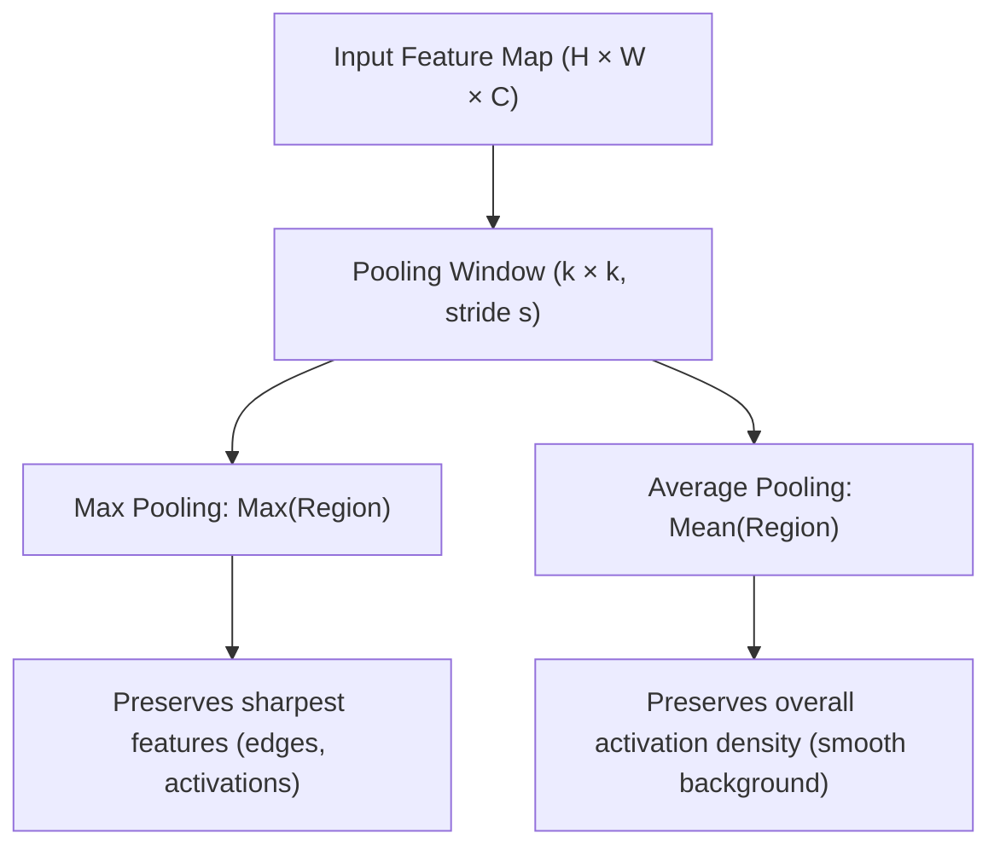
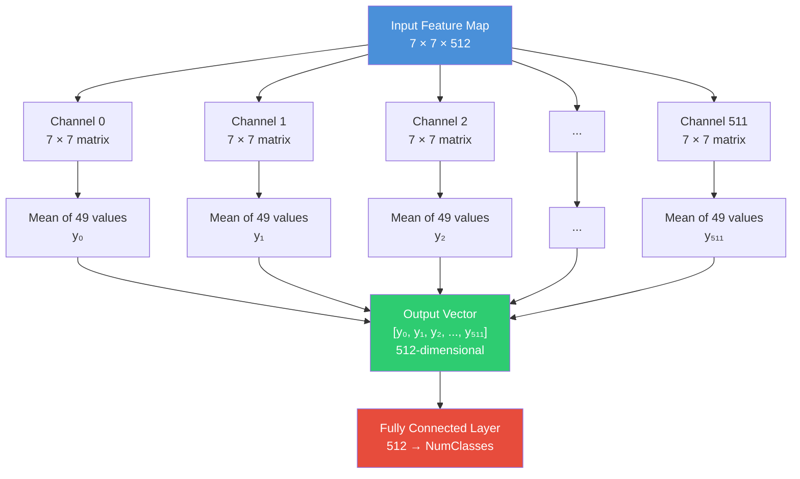
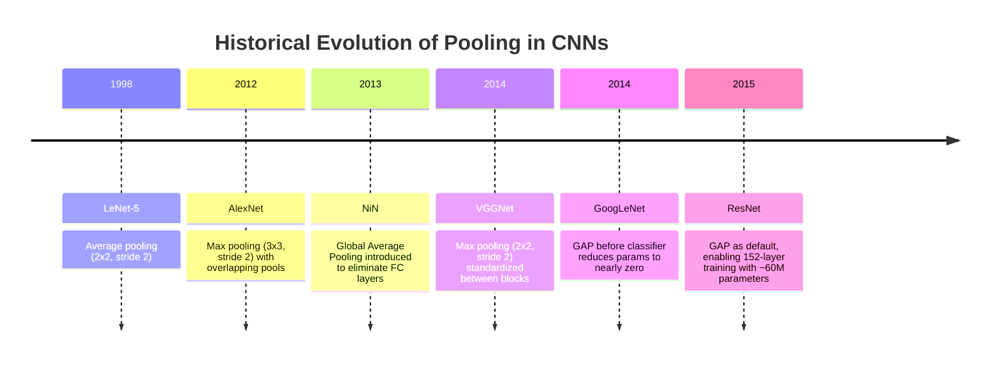
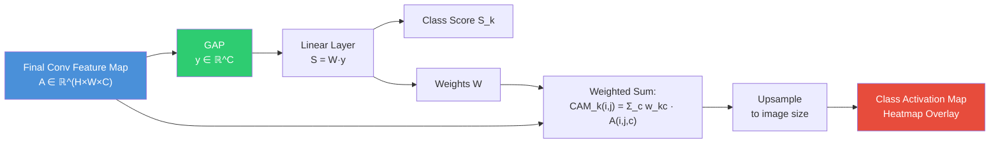
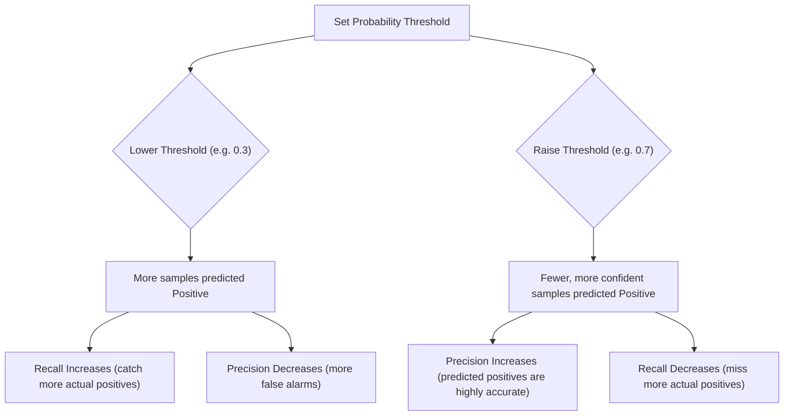
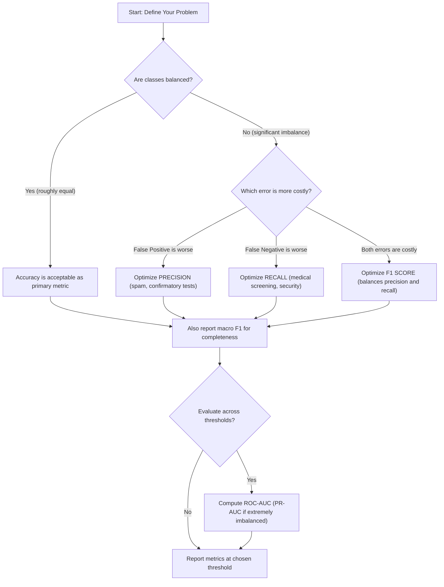
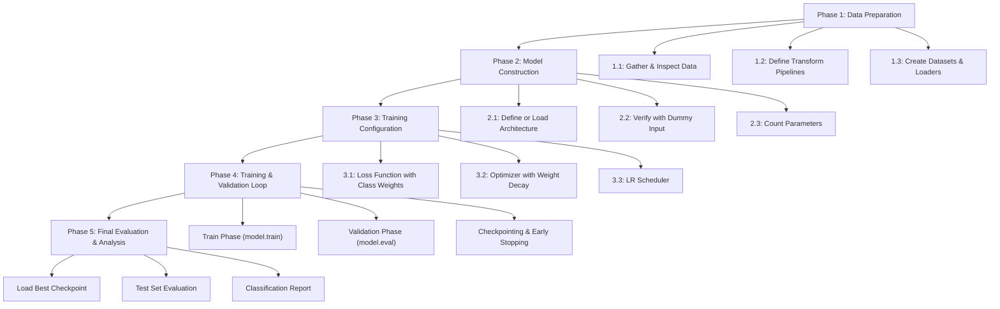
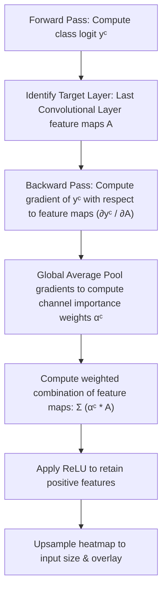
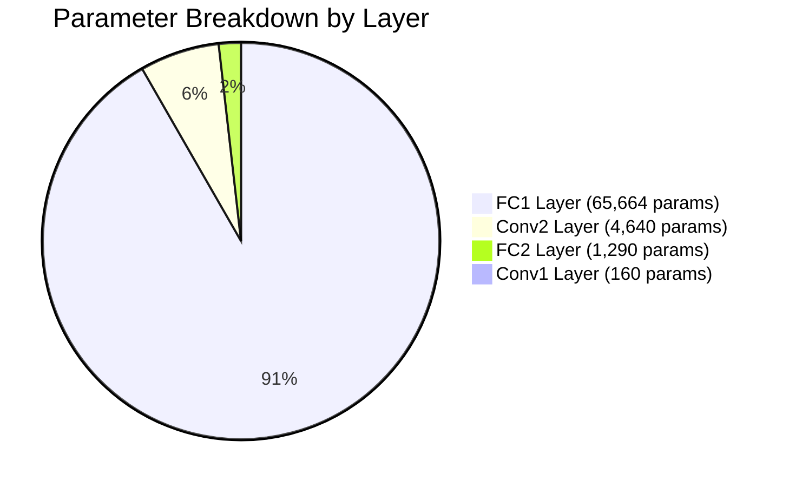
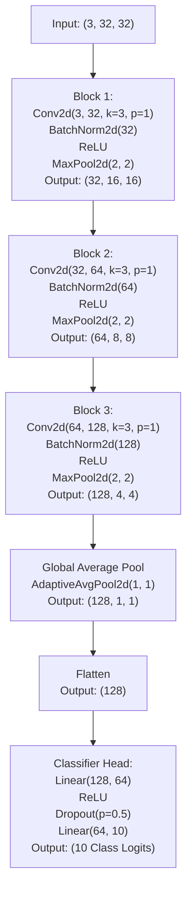

# 6. Advanced Pooling, Evaluation, Pipeline Design, and Interpretability in CNNs

---

## Section 1: Advanced Pooling Mechanisms and Global Average Pooling

### 1.1 Average Pooling vs. Max Pooling: First Principles

At its core, pooling is a form of **spatial aggregation**. Given a feature map of size $H \times W \times C$, a pooling operation with kernel size $k \times k$ and stride $s$ produces a downsampled feature map of size:

$$H' = \left\lfloor \frac{H - k}{s} \right\rfloor + 1, \quad W' = \left\lfloor \frac{W - k}{s} \right\rfloor + 1$$

The number of channels $C$ remains unchanged because pooling operates independently on each channel. The two fundamental aggregation functions are **max** (taking the maximum value in each pooling window) and **average** (taking the arithmetic mean of all values in each pooling window). Both reduce the spatial resolution, but they encode fundamentally different assumptions about what constitutes "important" information in a feature map.



### 1.2 Max Pooling: Worked Numerical Example

Consider a single-channel $4 \times 4$ feature map with the following values:

$$X = \begin{bmatrix} 1 & 3 & 2 & 4 \\ 5 & 6 & 1 & 2 \\ 3 & 2 & 8 & 7 \\ 4 & 1 & 3 & 5 \end{bmatrix}$$

We apply **Max Pooling** with a $2 \times 2$ kernel and stride 2. This partitions the input into four non-overlapping $2 \times 2$ windows:

| Window | Positions | Values | Max |
|:---|:---|:---|:---:|
| **Top-Left** | $(0,0),(0,1),(1,0),(1,1)$ | $1, 3, 5, 6$ | **6** |
| **Top-Right** | $(0,2),(0,3),(1,2),(1,3)$ | $2, 4, 1, 2$ | **4** |
| **Bottom-Left** | $(2,0),(2,1),(3,0),(3,1)$ | $3, 2, 4, 1$ | **4** |
| **Bottom-Right** | $(2,2),(2,3),(3,3),(3,3)$ | $8, 7, 3, 5$ | **8** |

The resulting $2 \times 2$ output is:

$$\text{MaxPool}(X) = \begin{bmatrix} 6 & 4 \\ 4 & 8 \end{bmatrix}$$

#### Gradient Flow in Max Pooling
During backpropagation, the gradient flows only through the position of the maximum value. If the upstream gradient at position $(0,0)$ of the output is $\delta_{0,0}$, then the downstream gradient for the input $X$ is:

$$\frac{\partial L}{\partial X_{i,j}} = \begin{cases} \delta_{0,0} & \text{if } (i,j) = (1,1) \\ 0 & \text{otherwise} \end{cases}$$

Only the neuron responsible for the maximum activation receives a gradient signal, making the backward pass sparse.

### 1.3 Average Pooling: Worked Numerical Example

Using the same $4 \times 4$ input matrix $X$, we now apply **Average Pooling** with a $2 \times 2$ kernel and stride 2:

| Window | Positions | Values | Average |
|:---|:---|:---|:---:|
| **Top-Left** | $(0,0),(0,1),(1,0),(1,1)$ | $1, 3, 5, 6$ | $(1+3+5+6)/4 = 3.75$ |
| **Top-Right** | $(0,2),(0,3),(1,2),(1,3)$ | $2, 4, 1, 2$ | $(2+4+1+2)/4 = 2.25$ |
| **Bottom-Left** | $(2,0),(2,1),(3,0),(3,1)$ | $3, 2, 4, 1$ | $(3+2+4+1)/4 = 2.50$ |
| **Bottom-Right** | $(2,2),(2,3),(3,2),(3,3)$ | $8, 7, 3, 5$ | $(8+7+3+5)/4 = 5.75$ |

The resulting $2 \times 2$ output is:

$$\text{AvgPool}(X) = \begin{bmatrix} 3.75 & 2.25 \\ 2.50 & 5.75 \end{bmatrix}$$

#### Gradient Flow in Average Pooling
During backpropagation, the gradient is distributed equally to all positions within the pooling window. If the upstream gradient at position $(0,0)$ of the output is $\delta_{0,0}$, each of the $k \times k$ positions in that window receives an equal fraction of the gradient:

$$\frac{\partial L}{\partial X_{i,j}} = \frac{1}{k^2} \delta_{0,0}$$

This creates a dense gradient flow back through all input units in the window.

### 1.4 Comparative Analysis

Notice that the max-pooled output has a wider dynamic range (values span 4 to 8) compared to the average-pooled output (values span 2.25 to 5.75). Max pooling amplifies the strongest activations, while average pooling dampens them toward the mean.

> [!TIP]
> Think of max pooling as asking **"Is there any evidence of this feature in this region?"** (a logical OR-like operation), while average pooling asks **"How much of this feature exists on average in this region?"** (a smoothed summary). For classification, where the mere presence of a feature is often more important than its spatial extent, max pooling tends to work better. For tasks requiring smooth spatial transitions (e.g., semantic segmentation, image generation), average pooling is often preferred.

### 1.5 When to Use Each

| Criterion | Max Pooling | Average Pooling |
|:---|:---|:---|
| **Preserves strongest activation** | Yes | No (dilutes peaks) |
| **Preserves spatial smoothness** | No (sharp transitions) | Yes (smooth output) |
| **Translation robustness** | Moderate (shift by $< s$ may change max position) | Higher (averaging is more stable under small shifts) |
| **Gradient flow** | Sparse (only max position receives gradient) | Dense (all positions receive gradient) |
| **Sensitivity to noise** | High (a noisy pixel can dominate the pool) | Low (noise is averaged out) |
| **Typical use in classification CNNs** | Intermediate layers | Global (final) layer |
| **Typical use in segmentation/generation** | Less common | Common (preserves spatial coherence) |
| **Computational cost** | Slightly cheaper (comparison only) | Slightly more (addition + division) |

> [!WARNING]
> A widespread misconception is that average pooling is "softer" and therefore always better. In practice, max pooling almost always outperforms average pooling in intermediate convolutional layers of classification networks. This is because intermediate features are **sparse**—most activations are near zero, and only a few locations carry meaningful signal. Averaging sparse features dilutes the signal with zeros, while max pooling selects the signal directly. Average pooling shines when features are **dense** and spatially smooth, which is typically the case in the final feature maps before the classifier.

---

### 1.6 Global Average Pooling (GAP): The Complete Mechanism

Traditional CNN architectures (AlexNet, VGG) ended their convolutional stacks with a feature map of spatial dimensions $7 \times 7$ (or similar) and then **flattened** this into a 1D vector, which was fed into one or more fully connected (FC) layers. For VGG-16, the final conv feature map is $7 \times 7 \times 512 = 25{,}088$ values, and the first FC layer has $25{,}088 \times 4{,}096 = 102{,}760{,}448$ parameters—over **103 million** parameters in this single layer. This creates three severe problems:
1. **Massive parameter count** leads to huge memory requirements, slow training, and severe overfitting risk.
2. **Loss of spatial structure**: Flattening destroys the 2D spatial arrangement of features, forcing the FC layer to relearn spatial relationships.
3. **Fixed input size**: The FC layer requires a specific input dimension, which means the network can only accept images of a fixed size (e.g., $224 \times 224$).

Global Average Pooling eliminates all three problems simultaneously with a single operation.

Given a feature map tensor of shape $H \times W \times C$, Global Average Pooling computes the **spatial average** of each channel independently, producing a $C$-dimensional vector. Formally, for channel $c$:

$$y_c = \frac{1}{H \times W} \sum_{i=1}^{H} \sum_{j=1}^{W} X_{i,j,c}$$

The output is a vector $\mathbf{y} \in \mathbb{R}^C$, where each element $y_c$ is the mean activation of channel $c$ across all spatial positions.



#### Worked Example: $7 \times 7 \times 512 \to 512$
1. **Input**: Tensor $X$ of shape $7 \times 7 \times 512$. There are 512 channels, each of spatial size $7 \times 7$.
2. **Step 1 — Extract a single channel**: Consider channel $c = 0$. This is a $7 \times 7$ matrix $X^{(0)}$.
3. **Step 2 — Compute the spatial average**: Sum all 49 values and divide by 49:
   $$y_0 = \frac{1}{49} \sum_{i=1}^{7} \sum_{j=1}^{7} x_{i,j}^{(0)}$$
4. **Step 3 — Repeat for all 512 channels**: Each channel $c \in \{0, 1, \ldots, 511\}$ produces a single scalar $y_c$, yielding a 512-dimensional vector:
   $$\mathbf{y} = [y_0, \, y_1, \, y_2, \, \ldots, \, y_{511}] \in \mathbb{R}^{512}$$

---

### 1.7 Why GAP Is Revolutionary

#### Zero Parameters vs. VGG16's 100M+ FC Parameters
GAP has **zero learnable parameters**. It is a fixed mathematical operation (mean computation) that requires no training, no weight matrices, and no bias vectors. 

| Layer | Input Dim | Output Dim | Parameters |
|:---|:---|:---|:---|
| **FC-1** | 25,088 | 4,096 | $25{,}088 \times 4{,}096 + 4{,}096 = 102{,}764{,}544$ |
| **FC-2** | 4,096 | 4,096 | $4{,}096 \times 4{,}096 + 4{,}096 = 16{,}781{,}312$ |
| **FC-3** | 4,096 | 1,000 | $4{,}096 \times 1{,}000 + 1{,}000 = 4{,}097{,}000$ |
| **Total VGG classifier** | | | **~123.6M** |

By replacing these FC layers with GAP followed by a single linear layer ($512 \times 1{,}000 + 1{,}000 = 513{,}000$ parameters), we reduce the classifier from 123.6M to 0.513M parameters—a reduction of over **99.5%**.

#### Spatial Translation Invariance
GAP enforces a strong form of **spatial translation invariance** by construction. Because the output of GAP is the average over all spatial positions, the exact location of a feature within the feature map does not matter—only its average strength matters. 

Suppose a feature pattern activates strongly at a single spatial location $(i^*, j^*)$ in channel $c$, with activation value $A$, and all other positions in that channel have near-zero activation. Then:

$$y_c = \frac{1}{H \times W} \cdot A + \frac{1}{H \times W} \sum_{(i,j) \neq (i^*,j^*)} x_{i,j,c} \approx \frac{A}{H \times W}$$

The output $y_c$ depends on the strength $A$ of the activation but **not** on the position $(i^*, j^*)$. Moving the feature to a different location does not change $y_c$.

#### Variable Input Sizes
Because GAP computes a spatial average over **whatever spatial dimensions are present**, it imposes no constraint on the input spatial size. An FC layer requires a fixed-size input because its weight matrix has a specific number of rows. GAP, however, handles variable spatial sizes seamlessly:
* Input $7 \times 7 \times 512 \to \text{GAP} \to 1 \times 1 \times 512 \to \text{512-d vector}$
* Input $14 \times 14 \times 512 \to \text{GAP} \to 1 \times 1 \times 512 \to \text{512-d vector}$
* Input $32 \times 32 \times 512 \to \text{GAP} \to 1 \times 1 \times 512 \to \text{512-d vector}$

---

### 1.8 Historical Context: From NiN to ResNet

#### Network in Network (NiN, 2013)
Global Average Pooling was proposed by Min Lin, Qiang Chen, and Shuicheng Yan in "Network In Network" (ICLR 2014). The key insight was that FC layers act as a black box prone to overfitting. Lin et al. argued that each channel of the final convolutional feature map should correspond to a particular category, and that the spatial average of that channel should directly serve as the confidence score for that category.

#### ResNet (2015) Adopts GAP
When Kaiming He et al. designed ResNet for the ILSVRC 2015 competition, they adopted GAP as the default pooling strategy before the final linear classifier. This decision enabled:
1. **Parameter efficiency**: ResNet-152 has hundreds of layers but only ~60M total parameters—far fewer than VGG-16's 138M.
2. **Training stability**: The reduced parameter count from GAP helped stabilize training.
3. **Variable resolution**: Enabling easy multi-scale evaluation in downstream detection and segmentation tasks.



---

### 1.9 GAP vs. Global Max Pooling (GMP)

#### Global Max Pooling Defined
Instead of averaging all spatial positions, Global Max Pooling (GMP) takes the maximum:

$$y_c^{\text{GMP}} = \max_{i,j} \, X_{i,j,c}$$

#### Detailed Comparison

| Property | Global Average Pooling | Global Max Pooling |
|:---|:---|:---|
| **Aggregation** | Mean over all positions | Maximum over all positions |
| **Output formula** | $y_c = \frac{1}{HW}\sum_{i,j} X_{i,j,c}$ | $y_c = \max_{i,j} X_{i,j,c}$ |
| **Sensitivity to outliers** | Low (averaging dilutes outliers) | High (single outlier dominates the pool) |
| **Gradient distribution** | Uniform: $\frac{\partial y_c}{\partial X_{i,j,c}} = \frac{1}{HW}$ for all $(i,j)$ | Sparse: $\frac{\partial y_c}{\partial X_{i,j,c}} = 1$ only at argmax, 0 elsewhere |
| **Feature interpretation** | Measures *overall presence* of a feature | Measures *peak presence* of a feature |
| **Noise robustness** | Better (noise averaged out) | Worse (noisy peak can dominate) |
| **Common usage** | Classification (ResNet, DenseNet, etc.) | Attention mechanisms, key-point detection |

---

### 1.10 How GAP Enables Class Activation Maps (CAM)

#### Mathematical Derivation
Consider a CNN that uses GAP followed by a linear layer. Let the final convolutional feature map be $A \in \mathbb{R}^{H \times W \times C}$ (before GAP), the GAP output be $\mathbf{y} \in \mathbb{R}^C$, and the final class score for class $k$ be:

$$S_k = \sum_{c=1}^{C} w_{k,c} \cdot y_c = \sum_{c=1}^{C} w_{k,c} \cdot \frac{1}{H \times W} \sum_{i=1}^{H} \sum_{j=1}^{W} A_{i,j,c}$$

Rearranging the order of summation:

$$S_k = \frac{1}{H \times W} \sum_{i=1}^{H} \sum_{j=1}^{W} \underbrace{\left( \sum_{c=1}^{C} w_{k,c} \cdot A_{i,j,c} \right)}_{\text{Class Activation Map at position } (i,j)}$$

The inner sum $\text{CAM}_k(i,j) = \sum_{c=1}^{C} w_{k,c} \cdot A_{i,j,c}$ defines a spatial map that tells us exactly how much each spatial position $(i,j)$ contributes to the class score $S_k$.

#### Why This Only Works with GAP
This derivation relies on the **linear** relationship between the spatial feature map values and the class scores. GAP provides this linearity because it is a simple average (a linear operation). If we used FC layers instead, the class score would involve products of weights with *specific positions* in the flattened feature map, making it impossible to map the contribution back to a coherent spatial location.



---

## Section 2: Model Evaluation Metrics Beyond Accuracy

### 2.1 The Problem with Accuracy: Why It Can Be Dangerously Misleading

While accuracy is adequate for balanced datasets, it becomes dangerously misleading when classes are imbalanced or when error costs are asymmetric.

Consider a dataset of 1,000 patients being screened for a rare but deadly disease:
* **990 healthy patients** (negative class)
* **10 diseased patients** (positive class)

Now consider a baseline classifier that simply predicts "healthy" for every patient, regardless of any features. Its accuracy is:

$$\text{Accuracy} = \frac{\text{Correct Predictions}}{\text{Total Predictions}} = \frac{990}{1000} = 99\%$$

This model is clinically worthless—it fails to detect a single case of the disease. In a real medical setting, this would mean 10 patients with a deadly disease are sent home without treatment. The high accuracy is driven entirely by the majority class, obscuring the model's failure on the minority class.

This applies directly to credit card fraud detection (99.8% legitimate), security intrusion detection (99.99% normal), and industrial defect detection (99.5% non-defective).

---

### 2.2 The Confusion Matrix: The Foundation of All Classification Metrics

The confusion matrix is a table comparing predicted labels against true labels.

| | **Predicted Positive** | **Predicted Negative** |
|:---|:---|:---|
| **Actual Positive** | True Positive (TP) | False Negative (FN) |
| **Actual Negative** | False Positive (FP) | True Negative (TN) |

* **True Positive (TP)**: The patient HAS the disease AND the model predicts "disease." (Correct detection)
* **False Negative (FN)**: The patient HAS the disease BUT the model predicts "healthy." (Missed positive; Type II Error)
* **False Positive (FP)**: The patient is HEALTHY BUT the model predicts "disease." (False alarm; Type I Error)
* **True Negative (TN)**: The patient is HEALTHY AND the model predicts "healthy." (Correct rejection)

> [!NOTE]
> The first word (True/False) tells you whether the prediction was correct or incorrect. The second word (Positive/Negative) tells you what the model predicted.
> * **False Positive** = the prediction was False (wrong) and the model predicted Positive.
> * **False Negative** = the prediction was False (wrong) and the model predicted Negative.

---

### 2.3 Type I Error (False Positive) vs. Type II Error (False Negative)

#### Type I Error (False Positive Rate)
A Type I Error occurs when the model incorrectly rejects the null hypothesis (predicts "positive" for an actually negative instance). The **False Positive Rate (FPR)** is defined as:

$$\text{Type I Error Rate (FPR)} = \frac{FP}{FP + TN} = \frac{FP}{\text{All Actual Negatives}}$$

* **Real-world implications**: In spam filtering, a Type I Error means a legitimate email is classified as spam (lost communication). In fraud detection, a legitimate transaction is flagged as fraud (unnecessary card freeze).

#### Type II Error (False Negative Rate)
A Type II Error occurs when the model fails to reject the null hypothesis (predicts "negative" for an actually positive instance). The **False Negative Rate (FNR)** is defined as:

$$\text{Type II Error Rate (FNR)} = \frac{FN}{FN + TP} = \frac{FN}{\text{All Actual Positives}}$$

This is also equal to $1 - \text{Recall}$.
* **Real-world implications**: In cancer detection, a Type II Error means a cancer patient is told they are cancer-free (untreated progression). In security, an intrusion is undetected.

---

### 2.4 Precision: "Of All Predicted Positives, How Many Were Actually Positive?"

Precision is defined as:

$$\text{Precision} = \frac{TP}{TP + FP}$$

Precision is the metric to optimize when the **cost of a False Positive is high** relative to the cost of a False Negative.

* **Spam Detection**: A false positive means a legitimate email is moved to the spam folder and missed. The cost of a false positive is higher than the cost of a false negative (spam in inbox). Spam filters must optimize for high precision.
* **Legal and Criminal Justice**: A false positive means an innocent person is flagged as high-risk or wrongfully detained. The cost of violating an innocent person's rights is considered higher than failing to flag a suspect.

---

### 2.5 Recall / Sensitivity: "Of All Actual Positives, How Many Did We Catch?"

Recall (also called Sensitivity or True Positive Rate) is defined as:

$$\text{Recall} = \frac{TP}{TP + FN}$$

Recall is the metric to optimize when the **cost of a False Negative is high** relative to the cost of a False Positive.

* **Cancer Detection / Medical Screening**: A false negative means a cancer patient goes untreated. A false positive leads to additional tests that can rule out cancer—unnecessary stress, but not loss of life. Medical screening systems must optimize for high recall.
* **Security and Intrusion Detection**: A false negative means an attacker remains inside the system. A false positive means a normal activity is investigated. Security systems must optimize for high recall.

---

### 2.6 Specificity: "Of All Actual Negatives, How Many Did We Correctly Identify?"

Specificity (also called True Negative Rate) is defined as:

$$\text{Specificity} = \frac{TN}{TN + FP}$$

* **Medical Rule-Out Tests**: Used to confidently determine that a patient does NOT have a disease. A high-specificity test ensures that when it says "negative," the patient is truly negative.
* **Drug Testing**: In workplace drug testing, a false positive means an employee who did not use drugs tests positive, facing disciplinary action. Drug tests should have high specificity to ensure that positive results are reliable.

---

### 2.7 The Precision-Recall Trade-off: Why You Cannot Maximize Both

Precision and recall are fundamentally in tension. This trade-off arises because the classification threshold—the probability above which the model predicts "positive"—affects precision and recall in opposite directions.



#### Worked Example: Sweeping Thresholds
Consider a model screening 200 patients for a disease, of which 50 actually have the disease (positive) and 150 are healthy (negative).

| Threshold | TP | FP | FN | TN | Precision | Recall |
|:---:|:---:|:---:|:---:|:---:|:---:|:---:|
| **0.3** | 48 | 45 | 2 | 105 | $48/(48+45) = 0.52$ | $48/(48+2) = 0.96$ |
| **0.5** | 42 | 15 | 8 | 135 | $42/(42+15) = 0.74$ | $42/(42+8) = 0.84$ |
| **0.7** | 35 | 5 | 15 | 145 | $35/(35+5) = 0.88$ | $35/(35+15) = 0.70$ |
| **0.9** | 20 | 1 | 30 | 149 | $20/(20+1) = 0.95$ | $20/(20+30) = 0.40$ |

---

### 2.8 F1 Score: The Harmonic Mean of Precision and Recall

The F1 Score combines precision and recall into a single metric using the harmonic mean:

$$F_1 = 2 \cdot \frac{\text{Precision} \cdot \text{Recall}}{\text{Precision} + \text{Recall}}$$

#### Why Harmonic Mean (Not Arithmetic Mean)?
The harmonic mean heavily penalizes extreme imbalance between precision and recall. If a model has high precision but catastrophically low recall, the arithmetic mean would hide this problem, while the harmonic mean exposes it.

Consider a model with $\text{Precision} = 1.0$ and $\text{Recall} = 0.01$:
* **Arithmetic Mean** = $(1.0 + 0.01) / 2 = 0.505$ — suggests the model is moderately good.
* **Harmonic Mean (F1)** = $2 \times (1.0 \times 0.01) / (1.0 + 0.01) = 0.02 / 1.01 \approx 0.0198$ — correctly indicates that the model is nearly useless.

Mathematically, for any $a, b > 0$:

$$\text{Harmonic Mean} = \frac{2ab}{a+b} \leq \min(a, b) \leq \frac{a+b}{2} = \text{Arithmetic Mean}$$

The harmonic mean is pulled toward the smaller value. A high F1 Score requires both high precision and high recall.

#### F-beta Scores
If your application values one metric more than the other, you can use the $F_\beta$ Score:

$$F_\beta = (1 + \beta^2) \cdot \frac{\text{Precision} \cdot \text{Recall}}{\beta^2 \cdot \text{Precision} + \text{Recall}}$$

* $\beta > 1$ weights recall more heavily (e.g., $F_2$ for medical screening).
* $\beta < 1$ weights precision more heavily (e.g., $F_{0.5}$ for spam detection).

---

### 2.9 Multi-Class Extensions: Macro, Micro, and Weighted Averaging

#### Macro-Averaging
Macro-averaging computes the metric independently for each class and then takes the unweighted average:

$$\text{Precision}_{\text{macro}} = \frac{1}{C}\sum_{i=1}^{C} \text{Precision}_i, \quad \text{Recall}_{\text{macro}} = \frac{1}{C}\sum_{i=1}^{C} \text{Recall}_i, \quad F_{1,\text{macro}} = \frac{1}{C}\sum_{i=1}^{C} F_{1,i}$$

Macro-averaging treats all classes equally, regardless of size. This is appropriate when you care about performance on all classes equally, including rare ones.

#### Micro-Averaging
Micro-averaging aggregates the TP, FP, and FN counts across all classes before computing the metric:

$$\text{Precision}_{\text{micro}} = \frac{\sum_{i=1}^{C} TP_i}{\sum_{i=1}^{C} TP_i + \sum_{i=1}^{C} FP_i}$$

For single-label multi-class classification, micro-averaged precision, recall, and F1 are all equal to the overall accuracy because every misclassification is simultaneously a False Positive for one class and a False Negative for another.

#### Weighted Averaging
Weighted averaging computes the metric for each class independently and then takes a weighted average, where each class's weight is proportional to its support (number of true instances):

$$\text{Precision}_{\text{weighted}} = \frac{\sum_{i=1}^{C} n_i \cdot \text{Precision}_i}{\sum_{i=1}^{C} n_i}$$

where $n_i$ is the number of true instances of class $i$. This is a compromise between macro-averaging and micro-averaging.

---

### 2.10 ROC Curve and AUC: Evaluating at All Thresholds

#### The ROC Curve
The Receiver Operating Characteristic (ROC) curve plots two quantities across all possible thresholds:
* **X-axis**: False Positive Rate (FPR) = $1 - \text{Specificity} = \frac{FP}{FP + TN}$
* **Y-axis**: True Positive Rate (TPR) = Recall = $\frac{TP}{TP + FN}$

#### AUC: Area Under the ROC Curve
The Area Under the ROC Curve (AUC-ROC) is a single scalar value.

**AUC = The probability that the model assigns a higher score to a randomly chosen positive example than to a randomly chosen negative example.**

* **AUC = 1.0**: Perfect classifier—the model always assigns higher scores to positives than negatives.
* **AUC = 0.5**: Random classifier—the model's scores are no better than random guessing.

#### ROC-AUC vs. PR-AUC for Imbalanced Data
For severely imbalanced datasets, the Precision-Recall (PR) curve is more informative than the ROC curve. The ROC curve's x-axis (FPR) is dominated by the large number of true negatives: even a large number of false positives produces a small FPR when there are many true negatives. The PR curve's x-axis (Recall) and y-axis (Precision) both focus on the positive class, making it sensitive to performance on the rare class. As a rule of thumb: if the positive class is less than 10% of the data, prefer PR-AUC over ROC-AUC.

---

### 2.11 Computing Metrics in PyTorch and Scikit-Learn

The following complete pipeline demonstrates how to collect model predictions on a test loader and compute all validation metrics.

```python
import torch
import torch.nn as nn
import numpy as np
import matplotlib.pyplot as plt
from sklearn.metrics import (
    accuracy_score,
    precision_score,
    recall_score,
    f1_score,
    confusion_matrix,
    classification_report,
    roc_auc_score,
    roc_curve,
    ConfusionMatrixDisplay
)

def evaluate_model_metrics(model, test_loader, device, class_names):
    """
    Runs inference on the test dataset and computes complete evaluation metrics.
    """
    model.eval()  # Switch to evaluation mode (disables dropout/batchnorm training)
    
    all_labels = []
    all_preds = []
    all_probs = []

    with torch.no_grad():  # Disable gradient tracking to save memory and speed up
        for images, labels in test_loader:
            images = images.to(device)
            labels = labels.to(device)
            
            logits = model(images)
            probs = torch.softmax(logits, dim=1)
            preds = torch.argmax(probs, dim=1)
            
            all_labels.extend(labels.cpu().numpy())
            all_preds.extend(preds.cpu().numpy())
            all_probs.extend(probs.cpu().numpy())

    # Convert lists to numpy arrays
    all_labels = np.array(all_labels)
    all_preds = np.array(all_preds)
    all_probs = np.array(all_probs)

    # 1. Confusion Matrix
    cm = confusion_matrix(all_labels, all_preds)
    print("Confusion Matrix:")
    print(cm)
    
    if len(class_names) == 2:
        tn, fp, fn, tp = cm.ravel()
        print(f"\nTP: {tp}, FN: {fn}, FP: {fp}, TN: {tn}")
        print(f"Precision: {tp/(tp+fp):.4f}")
        print(f"Recall:    {tp/(tp+fn):.4f}")
        print(f"Specificity: {tn/(tn+fp):.4f}")
        print(f"F1 Score:  {2*tp/(2*tp+fp+fn):.4f}")

    # 2. Detailed Classification Report
    print("\nDetailed Classification Report:")
    report = classification_report(
        all_labels, 
        all_preds, 
        target_names=class_names, 
        digits=4, 
        zero_division=0
    )
    print(report)

    # 3. Compute ROC-AUC
    num_classes = len(class_names)
    if num_classes == 2:
        # Use probability of positive class (column 1)
        roc_auc = roc_auc_score(all_labels, all_probs[:, 1])
        print(f"ROC-AUC: {roc_auc:.4f}")
        
        # Plot ROC Curve
        fpr, tpr, _ = roc_curve(all_labels, all_probs[:, 1])
        plt.figure(figsize=(6, 5))
        plt.plot(fpr, tpr, color='darkorange', lw=2, label=f'ROC curve (AUC = {roc_auc:.3f})')
        plt.plot([0, 1], [0, 1], color='navy', lw=2, linestyle='--')
        plt.xlim([0.0, 1.0])
        plt.ylim([0.0, 1.05])
        plt.xlabel('False Positive Rate (1 - Specificity)')
        plt.ylabel('True Positive Rate (Recall)')
        plt.title('Receiver Operating Characteristic (ROC) Curve')
        plt.legend(loc="lower right")
        plt.grid(True, alpha=0.3)
        plt.savefig('roc_curve_eval.png', dpi=150)
        plt.close()
    else:
        # One-vs-Rest ROC-AUC for multiclass
        roc_auc_ovr = roc_auc_score(
            all_labels, 
            all_probs, 
            multi_class='ovr', 
            average='macro'
        )
        print(f"Macro-averaged ROC-AUC (OvR): {roc_auc_ovr:.4f}")

    # Plot Confusion Matrix
    fig, ax = plt.subplots(figsize=(8, 6))
    ConfusionMatrixDisplay.from_predictions(
        all_labels,
        all_preds,
        display_labels=class_names,
        cmap='Blues',
        normalize='true',
        ax=ax,
        values_format='.2%'
    )
    plt.title('Normalized Confusion Matrix')
    plt.tight_layout()
    plt.savefig('confusion_matrix_eval.png', dpi=150)
    plt.close()

    return all_labels, all_preds, all_probs
```

---

### 2.12 Decision Framework by Problem Type

| Problem Type | Class Balance | Cost of FP vs. FN | Primary Metric | Threshold Strategy | Example |
|:---|:---|:---|:---|:---|:---|
| **Medical Screening** | Imbalanced | FN $\gg$ FP | **Recall** | Low threshold (catch all possible cases) | Cancer detection |
| **Confirmatory Diagnosis** | Imbalanced | FP $\gg$ FN | **Precision** | High threshold (only diagnose when sure) | Confirmatory biopsy |
| **Spam Detection** | Imbalanced | FP $\gg$ FN | **Precision** | High threshold | Email filter |
| **Fraud Detection** | Extremely Imbalanced | FN $\gt$ FP | **F1** or **PR-AUC** | Moderate threshold | Credit card fraud |
| **Security Intrusion** | Extremely Imbalanced | FN $\gg$ FP | **Recall** | Low threshold | Intrusion detection |
| **Manufacturing QC** | Imbalanced | Depends on product | **F1** or **Recall** | Low threshold if defects are dangerous | Airplane part inspection |
| **Image Classification** | Balanced | FP $\approx$ FN | **Accuracy** | Default (0.5) | ImageNet |



---

## Section 3: The Full Training Pipeline End-to-End Checklist

### 3.1 Pipeline Overview



---

### 3.2 Phase 1: Data Preparation

#### Step 1.1: Gather and Inspect the Dataset
Before training, analyze the dataset to detect class imbalance, size inconsistencies, and corrupted files.

```python
import os
from pathlib import Path
from PIL import Image
import numpy as np
from collections import Counter

def inspect_dataset(data_dir):
    """
    Scans a directory structured for ImageFolder and analyzes class distribution,
    corrupted files, and unique image sizes.
    """
    data_path = Path(data_dir)
    class_counts = {}
    
    print("=" * 60)
    print("CLASS DISTRIBUTION ANALYSIS")
    print("=" * 60)
    
    for class_dir in sorted(data_path.iterdir()):
        if class_dir.is_dir():
            class_name = class_dir.name
            num_images = len(list(class_dir.glob('*.*')))
            class_counts[class_name] = num_images
            print(f"  {class_name}: {num_images} images")
            
    total_images = sum(class_counts.values())
    print(f"\nTotal training images: {total_images}")
    
    if class_counts:
        max_count = max(class_counts.values())
        min_count = min(class_counts.values())
        imbalance_ratio = max_count / min_count
        print(f"Imbalance ratio (max/min): {imbalance_ratio:.2f}")
        if imbalance_ratio > 3:
            print("  WARNING: Significant class imbalance detected!")

    print("\n" + "=" * 60)
    print("IMAGE SIZE & INTEGRITY ANALYSIS")
    print("=" * 60)
    
    image_sizes = []
    corrupted_files = []
    
    for class_dir in data_path.iterdir():
        if not class_dir.is_dir():
            continue
        for img_path in class_dir.iterdir():
            try:
                img = Image.open(img_path)
                img.verify()  # Check structural integrity of headers without decoding
                img = Image.open(img_path)  # Re-open after verification
                image_sizes.append(img.size)  # (width, height)
            except Exception as e:
                corrupted_files.append((str(img_path), str(e)))

    if image_sizes:
        unique_sizes = set(image_sizes)
        print(f"Unique image sizes: {len(unique_sizes)}")
        if len(unique_sizes) <= 10:
            for size, count in Counter(image_sizes).most_common():
                print(f"  {size[0]}×{size[1]}: {count} images")
        else:
            widths, heights = zip(*image_sizes)
            print(f"  Width range: [{min(widths)}, {max(widths)}]")
            print(f"  Height range: [{min(heights)}, {max(heights)}]")
            
    if corrupted_files:
        print(f"\nCORRUPTED FILES FOUND: {len(corrupted_files)}")
        for path, err in corrupted_files[:10]:
            print(f"  {path}: {err}")
    else:
        print("\nNo corrupted files found.")

    return class_counts
```

#### Step 1.2: Define Transform Pipelines
Apply data augmentation to the training set to prevent overfitting, but keep the validation and test sets deterministic.

```python
from torchvision import transforms

# ImageNet statistics for pre-trained architectures
IMAGENET_MEAN = [0.485, 0.456, 0.406]
IMAGENET_STD  = [0.229, 0.224, 0.225]

train_transform = transforms.Compose([
    transforms.Resize(256),                  # Resize shorter edge to 256
    transforms.RandomResizedCrop(224),       # Crop randomly to 224x224 (adds scale variation)
    transforms.RandomHorizontalFlip(p=0.5),  # Random horizontal flip
    transforms.RandomRotation(degrees=15),   # Small rotation to simulate camera angles
    transforms.ColorJitter(
        brightness=0.2, contrast=0.2, saturation=0.2, hue=0.1
    ),                                       # Robustness to lighting variations
    transforms.ToTensor(),                   # Scales to [0, 1] and changes to CHW
    transforms.Normalize(mean=IMAGENET_MEAN, std=IMAGENET_STD)  # ImageNet normalization
])

val_transform = transforms.Compose([
    transforms.Resize(256),
    transforms.CenterCrop(224),              # Deterministic center crop (no randomness)
    transforms.ToTensor(),
    transforms.Normalize(mean=IMAGENET_MEAN, std=IMAGENET_STD)
])
```

#### Step 1.3: Create Datasets and DataLoaders

```python
from torchvision import datasets
from torch.utils.data import DataLoader

def create_dataloaders(data_dir, batch_size=32):
    train_dir = os.path.join(data_dir, 'train')
    val_dir = os.path.join(data_dir, 'val')
    test_dir = os.path.join(data_dir, 'test')
    
    train_dataset = datasets.ImageFolder(root=train_dir, transform=train_transform)
    val_dataset = datasets.ImageFolder(root=val_dir, transform=val_transform)
    test_dataset = datasets.ImageFolder(root=test_dir, transform=val_transform)
    
    train_loader = DataLoader(
        train_dataset, 
        batch_size=batch_size, 
        shuffle=True, 
        num_workers=4, 
        pin_memory=True
    )
    val_loader = DataLoader(
        val_dataset, 
        batch_size=batch_size, 
        shuffle=False, 
        num_workers=4, 
        pin_memory=True
    )
    test_loader = DataLoader(
        test_dataset, 
        batch_size=batch_size, 
        shuffle=False, 
        num_workers=4, 
        pin_memory=True
    )
    
    return train_loader, val_loader, test_loader, train_dataset.classes
```

---

### 3.3 Phase 2: Model Construction

```python
import torch
import torch.nn as nn
from torchvision import models

# 2.1 Load pre-trained model and replace classifier
def get_vgg16_transfer_model(num_classes):
    model = models.vgg16_bn(weights='DEFAULT')
    
    # Freeze VGG16 backbone feature extractor layers
    for param in model.features.parameters():
        param.requires_grad = False
        
    # Replace final linear layer of the classifier
    num_features = model.classifier[6].in_features
    model.classifier[6] = nn.Linear(num_features, num_classes)
    return model

# 2.2 Verify Architecture with Dummy Input
def verify_model_dimensions(model, num_classes, device):
    model = model.to(device)
    dummy_input = torch.randn(1, 3, 224, 224).to(device)
    
    try:
        dummy_output = model(dummy_input)
        print("Forward pass successful!")
        print(f"Input shape: {dummy_input.shape} -> Output shape: {dummy_output.shape}")
        assert dummy_output.shape == (1, num_classes)
    except Exception as e:
        print(f"Dimension verification failed: {e}")

# 2.3 Count Trainable Parameters
def print_parameter_counts(model):
    total_params = sum(p.numel() for p in model.parameters())
    trainable_params = sum(p.numel() for p in model.parameters() if p.requires_grad)
    frozen_params = total_params - trainable_params
    
    print(f"Total Parameters:     {total_params:>12,}")
    print(f"Trainable Parameters: {trainable_params:>12,}")
    print(f"Frozen Parameters:    {frozen_params:>12,}")
    print(f"Trainable Ratio:      {100*trainable_params/total_params:.2f}%")
```

---

### 3.4 Phase 3: Training Configuration

```python
import torch.optim as optim

def configure_training(model, class_counts, class_names, device):
    # 3.1 Loss Function with Inverse Frequency Class Weighting
    # Formula: w_i = N / (C * n_i)
    class_counts_list = [class_counts[cls] for cls in class_names]
    total_samples = sum(class_counts_list)
    num_classes = len(class_names)
    
    class_weights = [total_samples / (num_classes * count) for count in class_counts_list]
    weights_tensor = torch.FloatTensor(class_weights).to(device)
    criterion = nn.CrossEntropyLoss(weight=weights_tensor)
    print(f"Configured CrossEntropyLoss with class weights: {class_weights}")

    # 3.2 Optimizer with Weight Decay (only tracking parameters with requires_grad=True)
    trainable_params = filter(lambda p: p.requires_grad, model.parameters())
    optimizer = optim.Adam(trainable_params, lr=0.001, weight_decay=1e-4)

    # 3.3 Learning Rate Scheduler (Reduce LR on Plateau)
    scheduler = optim.lr_scheduler.ReduceLROnPlateau(
        optimizer, mode='max', factor=0.5, patience=3, verbose=True
    )
    
    return criterion, optimizer, scheduler
```

---

### 3.5 Phase 4: Training and Validation Loop

The following is a production-ready training and validation loop with gradient clipping, checkpointing, and early stopping.

```python
import time
import copy

def train_and_validate_model(model, train_loader, val_loader, criterion, optimizer, 
                             scheduler, num_epochs, device, save_path="best_checkpoint.pth"):
    best_val_acc = 0.0
    patience_counter = 0
    early_stop_patience = 7
    grad_clip_value = 1.0
    
    for epoch in range(num_epochs):
        start_time = time.time()
        
        # --- Training Phase ---
        model.train()  # Enable dropout & update BN running statistics
        train_loss = 0.0
        train_correct = 0
        train_total = 0
        
        for images, labels in train_loader:
            images = images.to(device, non_blocking=True)
            labels = labels.to(device, non_blocking=True)
            
            # Forward pass
            outputs = model(images)
            loss = criterion(outputs, labels)
            
            # Backward pass & optimization
            optimizer.zero_grad()
            loss.backward()
            
            # Gradient clipping to prevent gradient explosion
            nn.utils.clip_grad_norm_(model.parameters(), grad_clip_value)
            
            optimizer.step()
            
            # Accumulate statistics
            train_loss += loss.item() * images.size(0)
            _, preds = torch.max(outputs, 1)
            train_total += labels.size(0)
            train_correct += (preds == labels).sum().item()
            
        epoch_train_loss = train_loss / train_total
        epoch_train_acc = 100.0 * train_correct / train_total

        # --- Validation Phase ---
        model.eval()  # Disable dropout & lock BN statistics
        val_loss = 0.0
        val_correct = 0
        val_total = 0
        
        with torch.no_grad():  # Avoid computing gradients during evaluation
            for images, labels in val_loader:
                images = images.to(device, non_blocking=True)
                labels = labels.to(device, non_blocking=True)
                
                outputs = model(images)
                loss = criterion(outputs, labels)
                
                val_loss += loss.item() * images.size(0)
                _, preds = torch.max(outputs, 1)
                val_total += labels.size(0)
                val_correct += (preds == labels).sum().item()
                
        epoch_val_loss = val_loss / val_total
        epoch_val_acc = 100.0 * val_correct / val_total
        
        # Step the scheduler based on validation accuracy
        scheduler.step(epoch_val_acc)
        
        epoch_time = time.time() - start_time
        print(f"Epoch [{epoch+1}/{num_epochs}] ({epoch_time:.1f}s) | "
              f"Train Loss: {epoch_train_loss:.4f} Acc: {epoch_train_acc:.2f}% | "
              f"Val Loss: {epoch_val_loss:.4f} Acc: {epoch_val_acc:.2f}% | "
              f"LR: {optimizer.param_groups[0]['lr']:.2e}")

        # Checkpointing (Save weights if validation accuracy improves)
        if epoch_val_acc > best_val_acc:
            best_val_acc = epoch_val_acc
            patience_counter = 0
            
            # Save the full state dictionary
            checkpoint = {
                'epoch': epoch,
                'model_state_dict': model.state_dict(),
                'optimizer_state_dict': optimizer.state_dict(),
                'scheduler_state_dict': scheduler.state_dict(),
                'val_acc': epoch_val_acc
            }
            torch.save(checkpoint, save_path)
            print(f"  --> Checkpoint saved! Best Accuracy: {best_val_acc:.2f}%")
        else:
            patience_counter += 1
            if patience_counter >= early_stop_patience:
                print(f"  --> Early stopping triggered at epoch {epoch+1}!")
                break
                
    print(f"\nTraining Complete. Best Validation Accuracy: {best_val_acc:.2f}%")
```

#### Resuming Training from a Checkpoint
```python
def resume_training_from_checkpoint(checkpoint_path, model, optimizer, scheduler, device):
    checkpoint = torch.load(checkpoint_path, map_location=device)
    model.load_state_dict(checkpoint['model_state_dict'])
    optimizer.load_state_dict(checkpoint['optimizer_state_dict'])
    scheduler.load_state_dict(checkpoint['scheduler_state_dict'])
    start_epoch = checkpoint['epoch'] + 1
    best_val_acc = checkpoint['val_acc']
    print(f"Resumed from epoch {start_epoch} with previous best accuracy: {best_val_acc:.2f}%")
    return start_epoch, best_val_acc
```

---

## Section 4: Common Mistakes and How to Fix Them

### Mistake 1: Forgetting `optimizer.zero_grad()`
* **What Happens**: Gradients from previous iterations accumulate instead of being replaced. Updates are based on the sum of all past gradients.
* **Symptoms**: Training loss fluctuates wildly or spikes. Accuracy changes erratically.
* **The Fix**:
```python
# WRONG
for images, labels in train_loader:
    outputs = model(images)
    loss = criterion(outputs, labels)
    loss.backward()  # Accumulates with past gradients
    optimizer.step()

# CORRECT
for images, labels in train_loader:
    optimizer.zero_grad()  # Reset gradient storage before backward pass
    outputs = model(images)
    loss = criterion(outputs, labels)
    loss.backward()
    optimizer.step()
```

---

### Mistake 2: Forgetting `model.eval()` During Evaluation
* **What Happens**: Dropout remains active (randomly zeroing out feature activations), and BatchNorm uses mini-batch statistics rather than the accumulated running mean/variance.
* **Symptoms**: Evaluation accuracy is lower than expected (often a 1-5% performance drop) and inconsistent between identical runs.
* **The Fix**:
```python
# WRONG
with torch.no_grad():
    for images, labels in test_loader:
        outputs = model(images)  # Dropout is still active, causing stochastic outputs!

# CORRECT
model.eval()  # Set the model state to evaluation mode
with torch.no_grad():
    for images, labels in test_loader:
        outputs = model(images)
```

---

### Mistake 3: Double Softmax — Applying Softmax Before `CrossEntropyLoss`
* **What Happens**: Softmax is applied twice: once in the model's forward pass, and again inside `nn.CrossEntropyLoss`. This over-compresses the output probability distribution, causing the model to become overly confident while squashing gradients.
* **Symptoms**: High training loss that plateaus, and extremely small gradients (vanishing gradient effect).
* **The Fix**:
```python
# WRONG
class WrongModel(nn.Module):
    def forward(self, x):
        logits = self.fc(x)
        return torch.softmax(logits, dim=1)  # Softmax here is redundant and harmful!

# CORRECT
class CorrectModel(nn.Module):
    def forward(self, x):
        return self.fc(x)  # Return raw logits. CrossEntropyLoss handles softmax internally.
```

---

### Mistake 4: Data on Wrong Device
* **What Happens**: Model parameters are stored on the GPU, but the batch of images is on the CPU (or vice versa).
* **Symptoms**: `RuntimeError: Expected all tensors to be on the same device, but found at least two devices, cuda:0 and cpu!`
* **The Fix**:
```python
# CORRECT
device = torch.device('cuda' if torch.cuda.is_available() else 'cpu')
model = MyModel().to(device)

for images, labels in train_loader:
    images = images.to(device)  # Move input tensor to GPU
    labels = labels.to(device)  # Move target tensor to GPU
    outputs = model(images)
```

---

### Mistake 5: Not Using `.item()` When Accumulating Loss
* **What Happens**: Appending PyTorch loss tensors to a list retains their computational graph in memory. This prevents garbage collection and leaks memory.
* **Symptoms**: GPU memory usage grows steadily during training, leading to an Out of Memory (OOM) crash.
* **The Fix**:
```python
# WRONG
losses = []
for images, labels in train_loader:
    loss = criterion(model(images), labels)
    losses.append(loss)  # Retains the computational graph for every batch!

# CORRECT
losses = []
for images, labels in train_loader:
    loss = criterion(model(images), labels)
    losses.append(loss.item())  # Extracts the scalar float, freeing the graph
```

---

### Mistake 6: Not Setting the Random Seed (Irreproducible Results)
* **What Happens**: Random weight initializations and data shuffling orders change across runs, causing metrics to vary.
* **Symptoms**: The validation accuracy fluctuates by $\pm 1-3\%$ between runs.
* **The Fix**:
```python
import random
import numpy as np
import torch

def set_seed(seed=42):
    random.seed(seed)
    np.random.seed(seed)
    torch.manual_seed(seed)
    if torch.cuda.is_available():
        torch.cuda.manual_seed(seed)
        torch.cuda.manual_seed_all(seed)
    # Ensure deterministic CUDA algorithms
    torch.backends.cudnn.deterministic = True
    torch.backends.cudnn.benchmark = False

set_seed(42)
```

---

### Mistake 7: Applying Augmentation to the Validation Set
* **What Happens**: Random augmentations add noise to validation evaluation metrics.
* **Symptoms**: Validation accuracy fluctuates erratically between epochs, making it difficult to determine if the model is genuinely improving.
* **The Fix**: Ensure separate transforms are defined and used. Pass `val_transform` (which uses deterministic operations like `Resize` and `CenterCrop`) to the validation and test datasets.

---

### Mistake 8: Wrong Normalization for Pre-trained Models
* **What Happens**: The pre-trained model was trained with ImageNet statistics, but inputs are passed with custom or no normalization.
* **Symptoms**: Model performance is much lower than expected (often $<50\%$ on standard tasks).
* **The Fix**: Use the correct ImageNet statistics for normalization:
```python
normalize_transform = transforms.Normalize(
    mean=[0.485, 0.456, 0.406],
    std=[0.229, 0.224, 0.225]
)
```

---

### Mistake 9: Incorrect Input Size for the First Linear Layer (Dimension Mismatch)
* **What Happens**: The spatial feature dimensions after flattening do not match the expected `in_features` of the first linear layer.
* **Symptoms**: `RuntimeError: mat1 and mat2 shapes cannot be multiplied`
* **The Fix**: Use a dummy tensor to determine the output dimensions of the convolutional features before building the classifier:
```python
# Extract features from the convolutional layers with a dummy tensor
dummy_tensor = torch.randn(1, 3, 224, 224)
conv_features = model.features(dummy_tensor)
flattened_size = conv_features.view(1, -1).size(1)
print(f"Correct shape for linear layer: {flattened_size}")

# Initialize the linear layer with the correct input dimension
self.fc1 = nn.Linear(flattened_size, 512)
```

---

### Mistake 10: Freezing the Wrong Layers or Forgetting to Freeze
* **What Happens**: Either (1) the new classifier is frozen and cannot learn, or (2) the pre-trained feature extractor is left unfrozen, causing the large gradients from the new classifier to overwrite the learned features ("catastrophic forgetting").
* **Symptoms**: The model fails to converge, or validation accuracy remains low.
* **The Fix**:
```python
# Freeze feature extractor parameters
for param in model.features.parameters():
    param.requires_grad = False

# Ensure the new classifier parameters are trainable
for param in model.classifier.parameters():
    param.requires_grad = True
```

---

### Mistake 11: Using a Learning Rate Too High for Fine-Tuning
* **What Happens**: A high learning rate (e.g., $0.01$) updates pre-trained weights too drastically, destroying their learned features.
* **Symptoms**: Validation accuracy drops in the first few epochs.
* **The Fix**: Use a smaller learning rate, or use differential learning rates across different parts of the network:
```python
optimizer = optim.SGD([
    {'params': model.features.parameters(), 'lr': 1e-5},     # Very small LR for feature extractor
    {'params': model.classifier.parameters(), 'lr': 1e-3}    # Normal LR for new classifier
], momentum=0.9)
```

---

### Mistake 12: Forgetting `model.train()` After Evaluation
* **What Happens**: After switching to `model.eval()` to run validation at the end of an epoch, the model is not switched back to training mode for the next epoch.
* **Symptoms**: Dropout remains disabled, which can lead to overfitting, and training accuracy appears high.
* **The Fix**:
```python
for epoch in range(num_epochs):
    # --- TRAINING PHASE ---
    model.train()  # Switch back to training mode!
    for images, labels in train_loader:
        # Training steps...
        pass
        
    # --- VALIDATION PHASE ---
    model.eval()
    # Validation steps...
```

---

### Mistake 13: Forgetting to Move the Model to Device
* **What Happens**: The data tensors are moved to the GPU, but the model parameters remain on the CPU.
* **Symptoms**: `RuntimeError: Expected all tensors to be on the same device, but found at least two devices...`
* **The Fix**:
```python
device = torch.device('cuda' if torch.cuda.is_available() else 'cpu')
model = MyModel().to(device)  # Move the model to the target device
```

---

### Quick Reference Table

| # | Mistake | Typical Symptom | Corrective Action |
|:---|:---|:---|:---|
| **1** | Missing `zero_grad()` | Erratic training loss | Call `optimizer.zero_grad()` before `.backward()` |
| **2** | Missing `model.eval()` | Fluctuating, low test accuracy | Call `model.eval()` before starting evaluation |
| **3** | Redundant Softmax | Vanishing gradients / slow learning | Remove manual softmax from model's forward pass |
| **4** | Device Mismatch | `RuntimeError: Expected same device` | Apply `.to(device)` to both model and batch tensors |
| **5** | Missing `.item()` | GPU out of memory (OOM) | Accumulate loss using `loss.item()` |
| **6** | No Random Seed | Fluctuating validation accuracy | Set Python, Numpy, and PyTorch seeds at startup |
| **7** | Augmenting Val Data | Unstable validation accuracy | Apply deterministic transforms to validation data |
| **8** | Wrong Normalization | Poor pre-trained model performance | Normalize using ImageNet mean/std |
| **9** | Wrong Linear Size | `RuntimeError: shapes cannot be multiplied` | Trace features with a dummy tensor to get the correct shape |
| **10**| Incorrect Freezing | Training fails to converge | Set `requires_grad = False` only for features |
| **11**| Learning Rate Too High | Loss diverges during fine-tuning | Use $lr \le 10^{-4}$ for fine-tuning |
| **12**| Missing `model.train()` | Training overfits | Call `model.train()` at the start of each training epoch |
| **13**| Model Not on Device | GPU is idle / training is slow | Assign model to device with `model.to(device)` |

---

## Section 5: CNN Interpretability

### 5.1 Why Interpretability Matters
While accuracy is a useful metric, it does not guarantee that a model is making decisions based on correct clinical or logical features. Models can exploit shortcuts, such as training annotations, hospital-specific equipment watermarks, or background noise, to achieve high accuracy without learning the underlying patterns. This section explores how to use interpretability to verify model reasoning.

---

### 5.2 Grad-CAM: Gradient-Weighted Class Activation Mapping



#### Step 1: Forward Pass
Pass the input image through the network and extract the logit value $y^c$ for target class $c$:

$$y^c = \text{logits}[c]$$

#### Step 2: Target the Last Convolutional Layer
The final convolutional layer retains both spatial and semantic information. Let the output of this layer be a set of $K$ feature maps:

$$A = \{A^1, A^2, \ldots, A^K\}, \quad A^k \in \mathbb{R}^{h \times w}$$

#### Step 3: Compute Gradients
Compute the gradient of the class score $y^c$ with respect to the feature maps of the target layer:

$$\frac{\partial y^c}{\partial A^k_{ij}}$$

#### Step 4: Compute Channel Importance Weights ($\alpha^c_k$)
Apply Global Average Pooling (GAP) to the gradients to measure the importance of each feature map channel $k$ for class $c$:

$$\alpha^c_k = \frac{1}{Z} \sum_{i=1}^{h} \sum_{j=1}^{w} \frac{\partial y^c}{\partial A^k_{ij}}$$

where $Z = h \times w$ is the spatial area of the feature map.

#### Step 5: Weighted Linear Combination and ReLU
Compute the weighted sum of the feature maps, and apply the ReLU activation function to focus only on features that positively contribute to the target class:

$$L^c_{\text{Grad-CAM}} = \text{ReLU}\left( \sum_{k=1}^{K} \alpha^c_k \cdot A^k \right)$$

Applying ReLU filters out negative gradients, which correspond to features that reduce the score of the target class.

---

### 5.3 Case Study: COVID-19 Chest X-Ray Bias
During the COVID-19 pandemic, several models achieved high accuracy ($>99\%$) on classification tasks. However, Grad-CAM analyses revealed that these models were often leveraging training artifacts rather than clinical features:
1. **Hospital Watermarks**: The models learned to identify the unique text stamps or watermarks of the imaging facilities that provided the COVID-19 positive samples.
2. **Patient Positioning Markers**: Portable X-ray machines (used for bedridden, severe cases) introduced specific annotations that correlated with positive labels.
3. **Image Quality Differences**: Varying image resolutions across dataset sources allowed models to classify images based on resolution and contrast rather than clinical pathology.

These findings highlight why interpretability is critical for identifying dataset bias and ensuring models generalize to unseen real-world data.

---

### 5.4 Other Interpretability Methods

#### Saliency Maps
Saliency maps measure the absolute gradient of the output class score with respect to individual input image pixels:

$$S_{ij} = \left| \frac{\partial y^c}{\partial x_{ij}} \right|$$

Saliency maps are computed at pixel-level resolution, but they can be noisy and do not distinguish between positive and negative contributions.

#### Class Activation Mapping (CAM)
The predecessor to Grad-CAM. CAM requires replacing the model's fully connected layers with Global Average Pooling (GAP) followed by a single linear layer:

$$L^c_{\text{CAM}} = \sum_{k=1}^{K} w^c_k \cdot A^k$$

where $w^c_k$ is the classification weight for channel $k$. While effective, CAM requires a specific network architecture, whereas Grad-CAM can be applied to any CNN.

#### Guided Backpropagation
Guided Backpropagation modifies standard backpropagation by zeroing out negative gradients and gradients from negative neuron activations during the backward pass. This produces fine-grained pixel visualizations but is not class-discriminative on its own.

#### Feature Visualization
This approach generates synthetic images that maximize the activation of specific hidden units. It helps visualize what individual neurons or channels detect, rather than explaining specific predictions.

#### Interpretability Methods Comparison

| Method | Resolution | Class Discriminative? | Requires Architecture Changes? | Computational Cost |
|:---|:---|:---|:---|:---|
| **Saliency Maps** | Pixel-level | No | No | Low |
| **CAM** | Feature-map-level | Yes | Yes (GAP required) | Low |
| **Grad-CAM** | Feature-map-level | Yes | No | Low |
| **Guided Backprop** | Pixel-level | No | No | Medium |
| **Feature Visualization**| Pixel-level | Yes (per neuron) | No | High (requires optimization) |

---

### 5.5 PyTorch Grad-CAM Implementation

This implementation uses PyTorch forward and backward hooks to capture intermediate activations and gradients from a target convolutional layer.

```python
import torch
import torch.nn.functional as F
import numpy as np
from PIL import Image
import matplotlib.pyplot as plt

class GradCAM:
    """
    Computes Grad-CAM heatmaps for a specified model and target layer.
    """
    def __init__(self, model, target_layer):
        self.model = model
        self.target_layer = target_layer
        self.gradients = None
        self.activations = None
        self._register_hooks()

    def _register_hooks(self):
        def forward_hook(module, input, output):
            self.activations = output.detach()

        def backward_hook(module, grad_input, grad_output):
            # Capture the gradients with respect to the layer's output
            self.gradients = grad_output[0].detach()

        # Register hooks to capture activations and gradients
        self.target_layer.register_forward_hook(forward_hook)
        self.target_layer.register_full_backward_hook(backward_hook)

    def generate_heatmap(self, input_tensor, target_class=None):
        self.model.eval()
        
        # Ensure gradients are tracked during evaluation for Grad-CAM
        with torch.enable_grad():
            outputs = self.model(input_tensor)
            
        if target_class is None:
            target_class = torch.argmax(outputs, dim=1).item()

        # Clear any existing gradients
        self.model.zero_grad()
        
        # Create a one-hot tensor for the target class
        one_hot = torch.zeros_like(outputs)
        one_hot[0][target_class] = 1.0
        
        # Compute gradients during backward pass
        outputs.backward(gradient=one_hot)

        # Retrieve captured gradients and activations
        # Shapes: gradients (1, K, h, w), activations (1, K, h, w)
        gradients = self.gradients
        activations = self.activations

        # Compute importance weights using Global Average Pooling
        weights = gradients.mean(dim=(2, 3), keepdim=True)  # (1, K, 1, 1)

        # Compute weighted sum of feature maps
        heatmap = (weights * activations).sum(dim=1, keepdim=True)  # (1, 1, h, w)

        # Apply ReLU to focus on positive contributions
        heatmap = F.relu(heatmap)

        # Normalize heatmap values to [0, 1]
        heatmap = heatmap.squeeze().cpu().numpy()
        if heatmap.max() > 0:
            heatmap = (heatmap - heatmap.min()) / (heatmap.max() - heatmap.min())
            
        # Convert to uint8 for scaling and resizing
        heatmap_uint8 = np.uint8(heatmap * 255)
        
        # Resize to match the original input image dimensions
        _, _, H, W = input_tensor.shape
        resized_img = Image.fromarray(heatmap_uint8).resize((W, H), resample=Image.BILINEAR)
        normalized_heatmap = np.array(resized_img) / 255.0
        
        return normalized_heatmap, target_class

def plot_gradcam_overlay(model, target_layer, input_tensor, raw_image, target_class=None, alpha=0.5):
    """
    Generates and displays a Grad-CAM heatmap overlaid on the input image.
    """
    extractor = GradCAM(model, target_layer)
    heatmap, predicted_class = extractor.generate_heatmap(input_tensor, target_class)

    # Convert the PIL image to a numpy array normalized to [0, 1]
    raw_img_arr = np.array(raw_image).astype(np.float32) / 255.0
    
    # Generate the color heatmap using the jet colormap
    colormap = plt.cm.jet(heatmap)[:, :, :3]  # Strip alpha channel
    
    # Blend the raw image with the color colormap
    overlay = (1.0 - alpha) * raw_img_arr + alpha * colormap
    overlay = np.clip(overlay, 0.0, 1.0)

    # Display the results
    fig, axes = plt.subplots(1, 3, figsize=(15, 5))
    axes[0].imshow(raw_image)
    axes[0].set_title("Input Image")
    axes[0].axis("off")

    axes[1].imshow(heatmap, cmap="jet")
    axes[1].set_title(f"Heatmap (Class: {predicted_class})")
    axes[1].axis("off")

    axes[2].imshow(overlay)
    axes[2].set_title(f"Overlay (α={alpha})")
    axes[2].axis("off")
    
    plt.tight_layout()
    plt.savefig('gradcam_visualization.png', dpi=150)
    plt.close()
```

---

### 5.6 Interpretability as a Debugging Tool

When evaluating Grad-CAM overlays, look for indicators of dataset or model bias:

| Captured Activation Pattern | Likely Cause | Recommended Mitigation |
|:---|:---|:---|
| **High activation in background areas** | Background features correlate with labels in the training set | Augment datasets with varying backgrounds or crop closer to objects |
| **High activation on text, labels, or margins** | Spurious watermark correlations | Crop out watermarks or use data sources without annotations |
| **High activation localized at image borders** | Padding or framing artifacts | Adjust padding strategies or inspect preprocessing pipelines |
| **Broad, diffuse activation across the image** | The model relies on global statistics (e.g., color, brightness) | Increase training epochs or use a deeper model architecture |

---

## Section 6: Exercises Solved and Explained

### Exercise 1: Calculating CNN Output Dimensions

#### 1.1 Problem Statement
Given an input tensor of shape $128 \times 128 \times 3$ ($H=128$, $W=128$, $C=3$), compute the spatial dimensions and channel depth after it passes through the following sequence of layers:
1. **Conv1**: 32 filters, kernel size $5 \times 5$, stride $s = 1$, padding $p = 2$
2. **MaxPool1**: pool size $2 \times 2$, stride $s = 2$, padding $p = 0$
3. **Conv2**: 64 filters, kernel size $3 \times 3$, stride $s = 1$, padding $p = 1$
4. **MaxPool2**: pool size $2 \times 2$, stride $s = 2$, padding $p = 0$

#### 1.2 Mathematical Formula Derivation
The output dimension $O$ along a given spatial axis (width or height) is defined as:

$$O = \left\lfloor \frac{W - F + 2P}{S} \right\rfloor + 1$$

where $W$ is the input size, $F$ is the filter (kernel) size, $P$ is the padding, and $S$ is the stride. The floor function $\lfloor \cdot \rfloor$ drops any remaining boundary pixels if the stride does not align with the input size.

#### 1.3 Step-by-Step Calculations

##### Step 1: Conv1
* **Input Size**: $128 \times 128 \times 3$
* **Layer parameters**: $F = 5$, $S = 1$, $P = 2$, $C_{\text{out}} = 32$
* **Calculation**:
  $$O_H = \left\lfloor \frac{128 - 5 + 2(2)}{1} \right\rfloor + 1 = \left\lfloor \frac{128 - 5 + 4}{1} \right\rfloor + 1 = 127 + 1 = 128$$
* **Resulting Output**: $128 \times 128 \times 32$

> [!TIP] Same-Padding Rule
> For any convolution with stride $S=1$, using padding $P = \lfloor F/2 \rfloor$ preserves the input's spatial dimensions. Here, $P = \lfloor 5/2 \rfloor = 2$ keeps the output at $128 \times 128$.

##### Step 2: MaxPool1
* **Input Size**: $128 \times 128 \times 32$
* **Layer parameters**: $F = 2$, $S = 2$, $P = 0$
* **Calculation**:
  $$O_H = \left\lfloor \frac{128 - 2 + 2(0)}{2} \right\rfloor + 1 = \left\lfloor \frac{126}{2} \right\rfloor + 1 = 63 + 1 = 64$$
* **Resulting Output**: $64 \times 64 \times 32$

##### Step 3: Conv2
* **Input Size**: $64 \times 64 \times 32$
* **Layer parameters**: $F = 3$, $S = 1$, $P = 1$, $C_{\text{out}} = 64$
* **Calculation**:
  $$O_H = \left\lfloor \frac{64 - 3 + 2(1)}{1} \right\rfloor + 1 = \left\lfloor \frac{63}{1} \right\rfloor + 1 = 64$$
* **Resulting Output**: $64 \times 64 \times 64$

##### Step 4: MaxPool2
* **Input Size**: $64 \times 64 \times 64$
* **Layer parameters**: $F = 2$, $S = 2$, $P = 0$
* **Calculation**:
  $$O_H = \left\lfloor \frac{64 - 2 + 0}{2} \right\rfloor + 1 = \left\lfloor \frac{62}{2} \right\rfloor + 1 = 31 + 1 = 32$$
* **Resulting Output**: $32 \times 32 \times 64$

#### 1.4 Output Dimension Summary

| Layer | Type | Input Shape | Kernel | Stride | Padding | Calculation | Output Shape |
|:---|:---|:---|:---:|:---:|:---:|:---|:---|
| **0** | Input | — | — | — | — | — | $128 \times 128 \times 3$ |
| **1** | Conv1 | $128 \times 128 \times 3$ | $5 \times 5$ | $1$ | $2$ | $\lfloor(128 - 5 + 4)/1\rfloor + 1 = 128$ | $128 \times 128 \times 32$ |
| **2** | MaxPool1| $128 \times 128 \times 32$| $2 \times 2$ | $2$ | $0$ | $\lfloor(128 - 2 + 0)/2\rfloor + 1 = 64$ | $64 \times 64 \times 32$ |
| **3** | Conv2 | $64 \times 64 \times 32$ | $3 \times 3$ | $1$ | $1$ | $\lfloor(64 - 3 + 2)/1\rfloor + 1 = 64$ | $64 \times 64 \times 64$ |
| **4** | MaxPool2| $64 \times 64 \times 64$ | $2 \times 2$ | $2$ | $0$ | $\lfloor(64 - 2 + 0)/2\rfloor + 1 = 32$ | $32 \times 32 \times 64$ |

#### 1.5 Verification Code
```python
import torch
import torch.nn as nn

x = torch.randn(1, 3, 128, 128)

layers = nn.Sequential(
    nn.Conv2d(in_channels=3, out_channels=32, kernel_size=5, stride=1, padding=2),
    nn.MaxPool2d(kernel_size=2, stride=2),
    nn.Conv2d(in_channels=32, out_channels=64, kernel_size=3, stride=1, padding=1),
    nn.MaxPool2d(kernel_size=2, stride=2)
)

for i, layer in enumerate(layers):
    x = layer(x)
    print(f"Layer {i+1} Output Shape: {x.shape}")
```

---

### Exercise 2: Parameter Counting

#### 2.1 Problem Statement
Verify the parameter counts for each layer of the following network architecture:
1. **Conv1**: 16 filters, $3 \times 3$ kernel, 1 input channel, with bias.
2. **Conv2**: 32 filters, $3 \times 3$ kernel, 16 input channels, with bias.
3. **FC1**: 512 inputs $\to$ 128 outputs, with bias.
4. **FC2**: 128 inputs $\to$ 10 outputs, with bias.

Verify that the total parameter count is **71,754**.

#### 2.2 Mathematical Formulas

##### Convolutional Layer Parameters
A convolutional layer's parameters consist of weights and biases. Each of the $K$ filters has a size of $F_H \times F_W \times C_{\text{in}}$. With one bias per filter, the formula is:

$$P_{\text{conv}} = (F_H \times F_W \times C_{\text{in}} + 1) \times K$$

##### Fully Connected Layer Parameters
A fully connected layer maps $N_{\text{in}}$ features to $N_{\text{out}}$ features. With one bias per output unit, the formula is:

$$P_{\text{fc}} = (N_{\text{in}} + 1) \times N_{\text{out}}$$

#### 2.3 Step-by-Step Parameter Calculations

##### Layer 1: Conv1
* Parameters: $F = 3$, $C_{\text{in}} = 1$, $K = 16$
* Calculation:
  $$P_{\text{conv1}} = (3 \times 3 \times 1 + 1) \times 16 = (9 + 1) \times 16 = 160$$

##### Layer 2: Conv2
* Parameters: $F = 3$, $C_{\text{in}} = 16$, $K = 32$
* Calculation:
  $$P_{\text{conv2}} = (3 \times 3 \times 16 + 1) \times 32 = (144 + 1) \times 32 = 145 \times 32 = 4{,}640$$

##### Layer 3: FC1
* Parameters: $N_{\text{in}} = 512$, $N_{\text{out}} = 128$
* Calculation:
  $$P_{\text{fc1}} = (512 + 1) \times 128 = 513 \times 128 = 65{,}664$$

##### Layer 4: FC2 (Output)
* Parameters: $N_{\text{in}} = 128$, $N_{\text{out}} = 10$
* Calculation:
  $$P_{\text{fc2}} = (128 + 1) \times 10 = 129 \times 10 = 1{,}290$$

#### 2.4 Summing Total Parameters
$$\text{Total Parameters} = P_{\text{conv1}} + P_{\text{conv2}} + P_{\text{fc1}} + P_{\text{fc2}}$$

$$\text{Total Parameters} = 160 + 4{,}640 + 65{,}664 + 1{,}290 = \mathbf{71{,}754}$$

This matches the expected target of **71,754** parameters.



#### 2.5 Verification Code
```python
import torch
import torch.nn as nn

class SmallCNN(nn.Module):
    def __init__(self):
        super().__init__()
        self.conv1 = nn.Conv2d(in_channels=1, out_channels=16, kernel_size=3, bias=True)
        self.conv2 = nn.Conv2d(in_channels=16, out_channels=32, kernel_size=3, bias=True)
        self.fc1 = nn.Linear(512, 128, bias=True)
        self.fc2 = nn.Linear(128, 10, bias=True)

model = SmallCNN()
for name, param in model.named_parameters():
    print(f"{name:15s} | Shape: {str(list(param.shape)):15s} | Count: {param.numel():,}")
    
total_params = sum(p.numel() for p in model.parameters())
print(f"Total Params: {total_params:,}")
```

---

### Exercise 3: CIFAR-10 CNN Complete End-to-End

#### 3.1 Problem Statement
Build, train, and evaluate a CNN on the CIFAR-10 dataset from scratch. The network must include three convolutional blocks ($32 \to 64 \to 128$ channels), batch normalization, dropout, and a fully connected classifier.

#### 3.2 Architecture Overview


#### 3.3 Implementation Code
```python
import torch
import torch.nn as nn
import torch.optim as optim
import torchvision
import torchvision.transforms as transforms
from torch.utils.data import DataLoader

# Device Config
device = torch.device("cuda" if torch.cuda.is_available() else "cpu")

# Dataset Preprocessing
train_transform = transforms.Compose([
    transforms.RandomCrop(32, padding=4),
    transforms.RandomHorizontalFlip(p=0.5),
    transforms.ToTensor(),
    transforms.Normalize(mean=[0.4914, 0.4822, 0.4465], std=[0.2470, 0.2435, 0.2616])
])

test_transform = transforms.Compose([
    transforms.ToTensor(),
    transforms.Normalize(mean=[0.4914, 0.4822, 0.4465], std=[0.2470, 0.2435, 0.2616])
])

train_dataset = torchvision.datasets.CIFAR10(root="./data", train=True, download=True, transform=train_transform)
test_dataset = torchvision.datasets.CIFAR10(root="./data", train=False, download=True, transform=test_transform)

train_loader = DataLoader(train_dataset, batch_size=128, shuffle=True, num_workers=2, pin_memory=True)
test_loader = DataLoader(test_dataset, batch_size=128, shuffle=False, num_workers=2, pin_memory=True)

class CIFAR10CNN(nn.Module):
    def __init__(self):
        super().__init__()
        
        # Conv Block 1
        self.conv1 = nn.Conv2d(3, 32, kernel_size=3, padding=1)
        self.bn1 = nn.BatchNorm2d(32)
        self.pool1 = nn.MaxPool2d(kernel_size=2, stride=2)
        
        # Conv Block 2
        self.conv2 = nn.Conv2d(32, 64, kernel_size=3, padding=1)
        self.bn2 = nn.BatchNorm2d(64)
        self.pool2 = nn.MaxPool2d(kernel_size=2, stride=2)
        
        # Conv Block 3
        self.conv3 = nn.Conv2d(64, 128, kernel_size=3, padding=1)
        self.bn3 = nn.BatchNorm2d(128)
        self.pool3 = nn.MaxPool2d(kernel_size=2, stride=2)
        
        # Global Pooling
        self.global_pool = nn.AdaptiveAvgPool2d((1, 1))
        
        # Classifier
        self.fc1 = nn.Linear(128, 64)
        self.dropout = nn.Dropout(p=0.5)
        self.fc2 = nn.Linear(64, 10)

    def forward(self, x):
        x = self.pool1(torch.relu(self.bn1(self.conv1(x))))
        x = self.pool2(torch.relu(self.bn2(self.conv2(x))))
        x = self.pool3(torch.relu(self.bn3(self.conv3(x))))
        x = self.global_pool(x)
        x = torch.flatten(x, 1)
        x = torch.relu(self.fc1(x))
        x = self.dropout(x)
        x = self.fc2(x)
        return x

model = CIFAR10CNN().to(device)
criterion = nn.CrossEntropyLoss()
optimizer = optim.Adam(model.parameters(), lr=0.001)

# Training Loop
num_epochs = 15
for epoch in range(num_epochs):
    model.train()
    running_loss = 0.0
    correct = 0
    total = 0
    
    for images, labels in train_loader:
        images = images.to(device)
        labels = labels.to(device)
        
        optimizer.zero_grad()
        outputs = model(images)
        loss = criterion(outputs, labels)
        loss.backward()
        optimizer.step()
        
        running_loss += loss.item() * images.size(0)
        _, preds = torch.max(outputs, 1)
        total += labels.size(0)
        correct += (preds == labels).sum().item()
        
    epoch_loss = running_loss / total
    epoch_acc = 100.0 * correct / total
    print(f"Epoch [{epoch+1}/{num_epochs}] Train Loss: {epoch_loss:.4f} Acc: {epoch_acc:.2f}%")

# Final Evaluation
model.eval()
correct = 0
total = 0
with torch.no_grad():
    for images, labels in test_loader:
        images = images.to(device)
        labels = labels.to(device)
        outputs = model(images)
        _, preds = torch.max(outputs, 1)
        total += labels.size(0)
        correct += (preds == labels).sum().item()

print(f"\nFinal Test Accuracy: {100.0 * correct / total:.2f}%")
```

---

### Exercise 4: Transfer Learning on Custom Dataset

#### 4.1 Problem Statement
Implement a complete transfer learning pipeline using a pre-trained VGG16 model. Freeze the feature extractor, replace the final classification layer, train on a target dataset, and save the best model checkpoint.

#### 4.2 Implementation Code
```python
import torch
import torch.nn as nn
import torch.optim as optim
import torchvision.models as models
import torchvision.transforms as transforms
import torchvision.datasets as datasets
from torch.utils.data import DataLoader
import copy

device = torch.device("cuda" if torch.cuda.is_available() else "cpu")

# ImageNet normalization stats
train_transform = transforms.Compose([
    transforms.Resize(256),
    transforms.RandomCrop(224),
    transforms.ToTensor(),
    transforms.Normalize(mean=[0.485, 0.456, 0.406], std=[0.229, 0.224, 0.225])
])

val_transform = transforms.Compose([
    transforms.Resize(256),
    transforms.CenterCrop(224),
    transforms.ToTensor(),
    transforms.Normalize(mean=[0.485, 0.456, 0.406], std=[0.229, 0.224, 0.225])
])

# For demonstration, we assume a local dataset directory structure
# root/train/class_names... and root/val/class_names...
# In this mock-up code, we substitute with CIFAR-10 upsampled to 224x224
train_dataset = datasets.CIFAR10(root="./data", train=True, download=True, transform=train_transform)
val_dataset = datasets.CIFAR10(root="./data", train=False, download=True, transform=val_transform)

train_loader = DataLoader(train_dataset, batch_size=32, shuffle=True, num_workers=2)
val_loader = DataLoader(val_dataset, batch_size=32, shuffle=False, num_workers=2)

# Load pre-trained weights
model = models.vgg16(weights=models.VGG16_Weights.DEFAULT)

# Freeze feature extraction backbone
for param in model.features.parameters():
    param.requires_grad = False

# Modify final linear layer of VGG16 classifier to match target output dimension (e.g., 10)
num_features = model.classifier[6].in_features
model.classifier[6] = nn.Linear(num_features, 10)
model = model.to(device)

criterion = nn.CrossEntropyLoss()
# Pass only parameters with requires_grad=True to the optimizer
optimizer = optim.Adam(filter(lambda p: p.requires_grad, model.parameters()), lr=0.001)

best_acc = 0.0
best_model_weights = copy.deepcopy(model.state_dict())

for epoch in range(5):
    # Train
    model.train()
    for images, labels in train_loader:
        images = images.to(device)
        labels = labels.to(device)
        
        optimizer.zero_grad()
        outputs = model(images)
        loss = criterion(outputs, labels)
        loss.backward()
        optimizer.step()
        
    # Validate
    model.eval()
    correct = 0
    total = 0
    with torch.no_grad():
        for images, labels in val_loader:
            images = images.to(device)
            labels = labels.to(device)
            outputs = model(images)
            _, preds = torch.max(outputs, 1)
            total += labels.size(0)
            correct += (preds == labels).sum().item()
            
    val_acc = correct / total
    print(f"Epoch [{epoch+1}] Val Acc: {100.0 * val_acc:.2f}%")
    
    if val_acc > best_acc:
        best_acc = val_acc
        best_model_weights = copy.deepcopy(model.state_dict())
        torch.save(best_model_weights, "vgg16_best_weights.pth")

print(f"Best Validation Accuracy: {100.0 * best_acc:.2f}%")
```

---

### Exercise 5: Debugging Dimension Mismatch

#### 5.1 Problem Statement
The following network architecture is designed for $28 \times 28$ grayscale images but crashes with a runtime dimension error. Identify the cause, trace the spatial dimensions step-by-step, and implement a fix.

#### 5.2 The Buggy Code
```python
import torch
import torch.nn as nn

class BuggyCNN(nn.Module):
    def __init__(self):
        super().__init__()
        self.conv1 = nn.Conv2d(in_channels=1, out_channels=32, kernel_size=3, padding=0)
        self.pool1 = nn.MaxPool2d(kernel_size=2, stride=2)
        
        self.conv2 = nn.Conv2d(in_channels=32, out_channels=64, kernel_size=3, padding=0)
        self.pool2 = nn.MaxPool2d(kernel_size=2, stride=2)
        
        # BUG: The student assumed the output feature dimensions would flatten to 64 * 7 * 7
        self.fc1 = nn.Linear(in_features=64 * 7 * 7, out_features=128)
        self.fc2 = nn.Linear(in_features=128, out_features=10)

    def forward(self, x):
        x = self.pool1(torch.relu(self.conv1(x)))
        x = self.pool2(torch.relu(self.conv2(x)))
        x = torch.flatten(x, 1)
        x = torch.relu(self.fc1(x))
        return self.fc2(x)
```

#### 5.3 Diagnostic Dimension Trace
Using the output dimension formula:

$$O = \left\lfloor \frac{W - F + 2P}{S} \right\rfloor + 1$$

* **Input Size**: $28 \times 28 \times 1$
* **After Conv1** ($F=3, S=1, P=0$):
  $$O = \left\lfloor \frac{28 - 3 + 0}{1} \right\rfloor + 1 = 26 \implies 26 \times 26 \times 32$$
* **After Pool1** ($F=2, S=2, P=0$):
  $$O = \left\lfloor \frac{26 - 2 + 0}{2} \right\rfloor + 1 = 13 \implies 13 \times 13 \times 32$$
* **After Conv2** ($F=3, S=1, P=0$):
  $$O = \left\lfloor \frac{13 - 3 + 0}{1} \right\rfloor + 1 = 11 \implies 11 \times 11 \times 64$$
* **After Pool2** ($F=2, S=2, P=0$):
  $$O = \left\lfloor \frac{11 - 2 + 0}{2} \right\rfloor + 1 = \lfloor 4.5 \rfloor + 1 = 5 \implies 5 \times 5 \times 64$$

The actual spatial dimension of the final feature map is $5 \times 5$, yielding a flattened size of $64 \times 5 \times 5 = \mathbf{1{,}600}$ values. 

The fully connected layer was initialized with `in_features = 3,136` ($64 \times 7 \times 7$), leading to the following dimension mismatch error:

```
RuntimeError: mat1 and mat2 shapes cannot be multiplied (1x1600 and 3136x128)
```

---

#### 5.4 Fix A: Correcting Linear Layer Input Size
Update `in_features` of `self.fc1` to match the actual flattened dimension of **1,600**:

```python
class CorrectedCNN_A(nn.Module):
    def __init__(self):
        super().__init__()
        self.conv1 = nn.Conv2d(in_channels=1, out_channels=32, kernel_size=3, padding=0)
        self.pool1 = nn.MaxPool2d(kernel_size=2, stride=2)
        self.conv2 = nn.Conv2d(in_channels=32, out_channels=64, kernel_size=3, padding=0)
        self.pool2 = nn.MaxPool2d(kernel_size=2, stride=2)
        
        # FIX A: Correct input shape from 3136 to 1600
        self.fc1 = nn.Linear(in_features=64 * 5 * 5, out_features=128)
        self.fc2 = nn.Linear(in_features=128, out_features=10)

    def forward(self, x):
        x = self.pool1(torch.relu(self.conv1(x)))
        x = self.pool2(torch.relu(self.conv2(x)))
        x = torch.flatten(x, 1)
        x = torch.relu(self.fc1(x))
        return self.fc2(x)
```

---

#### 5.5 Fix B: Adding Convolutional Padding
Add `padding=1` to both convolutional layers to preserve spatial dimensions through each convolution, bringing the final post-pooling dimension to $7 \times 7$.

* **Input Size**: $28 \times 28 \times 1$
* **After Conv1** ($P=1$): Shape is $28 \times 28 \times 32$
* **After Pool1** ($F=2, S=2$): Shape is $14 \times 14 \times 32$
* **After Conv2** ($P=1$): Shape is $14 \times 14 \times 64$
* **After Pool2** ($F=2, S=2$): Shape is $7 \times 7 \times 64$

This matches the expected spatial output shape of **3,136** ($64 \times 7 \times 7$):

```python
class CorrectedCNN_B(nn.Module):
    def __init__(self):
        super().__init__()
        # FIX B: Add padding=1 to both convolutional layers
        self.conv1 = nn.Conv2d(in_channels=1, out_channels=32, kernel_size=3, padding=1)
        self.pool1 = nn.MaxPool2d(kernel_size=2, stride=2)
        self.conv2 = nn.Conv2d(in_channels=32, out_channels=64, kernel_size=3, padding=1)
        self.pool2 = nn.MaxPool2d(kernel_size=2, stride=2)
        
        # The flattened shape is now 64 * 7 * 7 = 3136
        self.fc1 = nn.Linear(in_features=64 * 7 * 7, out_features=128)
        self.fc2 = nn.Linear(in_features=128, out_features=10)

    def forward(self, x):
        x = self.pool1(torch.relu(self.conv1(x)))
        x = self.pool2(torch.relu(self.conv2(x)))
        x = torch.flatten(x, 1)
        x = torch.relu(self.fc1(x))
        return self.fc2(x)
```

---

#### 5.6 Diagnostic Code: The Dummy Tensor Technique
You can trace dimension changes through the network using a dummy tensor to identify where spatial dimensions mismatch:

```python
def trace_network_shapes(model, input_dims):
    x = torch.randn(input_dims)
    print(f"Start Input Shape: {x.shape}")
    print("-" * 50)
    
    for name, layer in model.named_children():
        try:
            if isinstance(layer, nn.Linear) and len(x.shape) > 2:
                # Flatten the tensor before passing to the linear layer
                x = torch.flatten(x, 1)
            x = layer(x)
            print(f"Layer: {name:12s} | Output Shape: {str(list(x.shape)):20s}")
        except Exception as e:
            print(f"FAILED at layer: {name}")
            print(f"Current tensor shape: {x.shape}")
            print(f"Exception: {e}")
            break

# Instantiate buggy model and trace shapes
model = BuggyCNN()
trace_network_shapes(model, (1, 1, 28, 28))
```