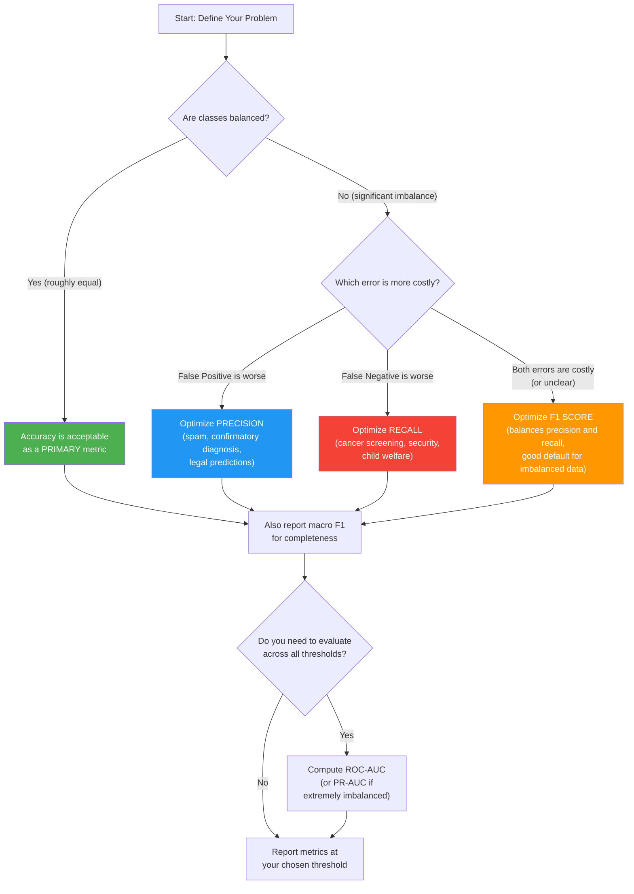

# 21. Model Evaluation Metrics Beyond Accuracy

## The Problem with Accuracy: Why It Can Be Dangerously Misleading

Accuracy is the most intuitive and commonly reported evaluation metric: it is simply the fraction of predictions that are correct. While accuracy is perfectly adequate for balanced datasets where every class is equally represented and all types of errors are equally costly, it becomes dangerously misleading—sometimes to the point of uselessness—when these conditions are not met. The fundamental problem is that accuracy treats every correct prediction as equally valuable and every incorrect prediction as equally costly, which is rarely true in real-world applications.

Consider the following medical diagnosis scenario that illustrates the problem vividly. Imagine a dataset of 1,000 patients being screened for a rare but deadly disease. The dataset contains 990 healthy patients and only 10 diseased patients. Now consider a "model" that simply predicts "healthy" for every single patient, regardless of any input features. This model correctly identifies all 990 healthy patients and misses all 10 diseased patients. Its accuracy is:

$$\text{Accuracy} = \frac{\text{Correct Predictions}}{\text{Total Predictions}} = \frac{990}{1000} = 99\%$$

Ninety-nine percent accuracy sounds impressive, but this model is clinically worthless—it fails to detect a single case of the disease. In a real medical setting, this would mean 10 patients with a deadly disease are sent home without treatment. The high accuracy is entirely driven by the overwhelming majority class (healthy patients), and it completely obscures the model's catastrophic failure on the minority class (diseased patients) that actually matters.

This example is not contrived—it reflects a common reality in many domains. Credit card fraud detection (99.8% legitimate transactions), rare disease screening (99.9% healthy), security intrusion detection (99.99% normal traffic), and manufacturing defect detection (99.5% non-defective) all exhibit extreme class imbalance where accuracy is a meaningless metric. In all these cases, a model that always predicts the majority class achieves deceptively high accuracy while being completely useless for its intended purpose.

> [!warning] The Accuracy Trap
> Whenever you encounter a dataset with imbalanced classes—and most real-world datasets are imbalanced—accuracy alone cannot tell you whether your model is actually performing well. A model with 99% accuracy on a dataset that is 99% one class tells you NOTHING about the model's ability to detect the important minority class. Always look beyond accuracy to metrics that account for class imbalance and the relative costs of different types of errors.

---

## The Confusion Matrix: The Foundation of All Classification Metrics

The confusion matrix is a table that provides a complete breakdown of a classifier's performance by comparing predicted labels against true labels. For a binary classification problem (positive vs. negative), the confusion matrix is a 2×2 table with four cells, each representing a different type of prediction outcome. Every other classification metric—precision, recall, F1, specificity, and more—is derived from these four counts. Understanding the confusion matrix is therefore the prerequisite for understanding all other metrics.

### The 2×2 Confusion Matrix

|  | **Predicted Positive** | **Predicted Negative** |
|---|---|---|
| **Actual Positive** | True Positive (TP) | False Negative (FN) |
| **Actual Negative** | False Positive (FP) | True Negative (TN) |

Each cell has a precise definition and a clear interpretation in the medical analogy:

**True Positive (TP)**: The patient HAS the disease AND the model predicts "disease." This is the ideal outcome for a diseased patient—the disease is correctly detected, and the patient can receive treatment. In the context of any classification task, a true positive represents a correctly identified instance of the positive class.

**False Negative (FN)**: The patient HAS the disease BUT the model predicts "healthy." This is the most dangerous type of error in medical diagnosis—a sick patient is incorrectly told they are healthy. The disease goes untreated, potentially with life-threatening consequences. In general terms, a false negative means the model missed a positive instance.

**False Positive (FP)**: The patient is HEALTHY BUT the model predicts "disease." This is a "false alarm"—a healthy patient is incorrectly told they might be sick. The consequences include unnecessary stress, additional invasive tests, wasted medical resources, and potential harm from unnecessary treatment. In general terms, a false positive means the model incorrectly flagged a negative instance as positive.

**True Negative (TN)**: The patient is HEALTHY AND the model predicts "healthy." This is the ideal outcome for a healthy patient—no unnecessary worry or treatment. In general terms, a true negative represents a correctly identified instance of the negative class.

> [!note] Memory Trick for TP, TN, FP, FN
> The first word (True/False) tells you whether the prediction was correct or incorrect. The second word (Positive/Negative) tells you what the model PREDICTED. So: "False Positive" = the prediction was FALSE (wrong) and the model predicted POSITIVE. "False Negative" = the prediction was FALSE (wrong) and the model predicted NEGATIVE.

---

## Type I Error (False Positive) vs. Type II Error (False Negative)

The two types of classification errors—False Positives and False Negatives—correspond to two classical statistical concepts that have important real-world implications beyond machine learning.

### Type I Error (False Positive Rate)

A Type I Error occurs when the model incorrectly rejects the null hypothesis—in classification terms, when the model predicts "positive" for an actually negative instance. The Type I Error Rate is defined as:

$$\text{Type I Error Rate} = \frac{FP}{FP + TN} = \frac{FP}{\text{All Actual Negatives}}$$

This is also called the **False Positive Rate (FPR)**. It measures the fraction of actual negatives that are incorrectly classified as positives. In the medical analogy, this is the fraction of healthy patients who are incorrectly diagnosed as diseased.

**Real-world implications**: In spam detection, a Type I Error means a legitimate email is classified as spam—the user loses an important message. In fraud detection, it means a legitimate transaction is flagged as fraudulent—the customer's card is unnecessarily frozen, causing frustration and potential financial harm. In security screening, it means an innocent person is flagged as a threat—resulting in unnecessary investigation and violation of privacy.

### Type II Error (False Negative Rate)

A Type II Error occurs when the model fails to reject the null hypothesis when it should—in classification terms, when the model predicts "negative" for an actually positive instance. The Type II Error Rate is defined as:

$$\text{Type II Error Rate} = \frac{FN}{FN + TP} = \frac{FN}{\text{All Actual Positives}}$$

This is also called the **False Negative Rate (FNR)**. It measures the fraction of actual positives that are incorrectly classified as negatives. In the medical analogy, this is the fraction of diseased patients who are incorrectly diagnosed as healthy.

**Real-world implications**: In cancer detection, a Type II Error means a cancer patient is told they are cancer-free—the cancer goes untreated and may become terminal. In security, it means an intrusion is not detected—the attacker remains inside the system. In quality control, it means a defective product passes inspection and reaches the consumer. In all these cases, the cost of a missed positive far exceeds the cost of a false alarm.

> [!info] The Asymmetry of Error Costs
> In most real-world applications, the cost of Type I and Type II errors is NOT symmetric. Medical diagnosis heavily penalizes Type II errors (missed disease), while spam detection heavily penalizes Type I errors (legitimate email lost). This asymmetry is the fundamental reason why we need metrics beyond accuracy—accuracy treats all errors equally, but real applications do not.

---

## Precision: "Of All Predicted Positives, How Many Were Actually Positive?"

Precision is defined as:

$$\text{Precision} = \frac{TP}{TP + FP}$$

Precision answers the question: "When the model says 'positive,' how often is it right?" It is the fraction of predicted positives that are actually positive. A precision of 0.90 means that 90% of the time the model predicts "positive," it is correct, and 10% of positive predictions are false alarms.

### When Precision Matters

Precision is the metric to optimize when the **cost of a False Positive is high** relative to the cost of a False Negative. In these scenarios, you want to be very confident that a positive prediction is correct, even if it means missing some actual positives.

**Spam Detection**: When your email filter classifies a message as spam, that message is typically moved to a spam folder that the user rarely checks. If a legitimate email from your boss, a client, or a university is incorrectly classified as spam (FP), you might miss critical information. The cost of a false positive (lost legitimate email) is much higher than the cost of a false negative (spam in your inbox, which you can simply delete). Therefore, spam filters should optimize for high precision—only classify as spam when very confident.

**Fraud Detection in Financial Services**: When a credit card transaction is flagged as fraudulent, the card is typically frozen and the customer must call to verify. A false positive means a legitimate purchase is blocked, causing embarrassment at checkout, potential financial hardship, and customer dissatisfaction. While fraud that goes undetected (FN) is also costly, the cost of inconveniencing many honest customers can be even higher in terms of customer churn and reputation damage. Banks therefore tune their fraud detection systems for high precision.

**Legal and Criminal Justice**: In predictive policing or recidivism prediction, a false positive means an innocent person is flagged as high-risk, potentially leading to unjust surveillance, denial of parole, or wrongful detention. The cost of violating an innocent person's rights is considered (in most legal frameworks) to be far higher than the cost of failing to flag a potentially dangerous individual. High precision is essential.

---

## Recall / Sensitivity: "Of All Actual Positives, How Many Did We Catch?"

Recall (also called Sensitivity or True Positive Rate) is defined as:

$$\text{Recall} = \frac{TP}{TP + FN}$$

Recall answers the question: "Of all the actual positives, what fraction did the model correctly identify?" A recall of 0.90 means the model catches 90% of all actual positive cases, but misses 10%. The complement of recall is the False Negative Rate: $\text{FNR} = 1 - \text{Recall}$.

### When Recall Matters

Recall is the metric to optimize when the **cost of a False Negative is high** relative to the cost of a False Positive. In these scenarios, you want to catch as many actual positives as possible, even if it means generating some false alarms.

**Cancer Detection / Medical Screening**: A false negative in cancer screening means a patient with cancer is told they are cancer-free. The cancer continues to grow untreated, potentially becoming terminal by the time it is detected. The cost of a missed cancer diagnosis is literally life-threatening. A false positive, while stressful, leads to additional tests that can rule out cancer—the cost is emotional distress and additional medical expenses, but not loss of life. Cancer screening systems should optimize for high recall—even if it means some healthy patients undergo unnecessary follow-up tests.

**Security and Intrusion Detection**: A false negative in security means an intrusion or attack goes undetected. The attacker remains inside the system, potentially exfiltrating data, planting malware, or causing damage for days or weeks. A false positive means a normal activity is flagged as suspicious, leading to an investigation that finds nothing. The cost of a false alarm is analyst time and temporary heightened alertness; the cost of a missed intrusion is a data breach. Security systems should optimize for high recall—better to investigate a few false alarms than to miss a real attack.

**Child Welfare Screening**: A false negative means an at-risk child is not flagged for intervention, potentially leaving them in a dangerous situation. A false positive means a family is unnecessarily investigated, which is stressful and intrusive but includes safeguards. Child welfare systems prioritize recall to avoid missing children in genuine danger.

---

## Specificity: "Of All Actual Negatives, How Many Did We Correctly Identify?"

Specificity (also called True Negative Rate) is defined as:

$$\text{Specificity} = \frac{TN}{TN + FP}$$

Specificity answers the question: "Of all the actual negatives, what fraction did the model correctly identify as negative?" A specificity of 0.95 means that 95% of actual negatives are correctly classified, and 5% are false positives. The complement of specificity is the False Positive Rate: $\text{FPR} = 1 - \text{Specificity}$.

### When Specificity Matters

Specificity is important when the **cost of a False Positive is high**—similar to precision, but from the perspective of the negative class. Specificity and precision are related but not identical: specificity measures performance on actual negatives, while precision measures performance on predicted positives.

**Medical Rule-Out Tests**: Some medical tests are designed to "rule out" a condition—they are used to confidently determine that a patient does NOT have a disease. For example, D-dimer tests are used to rule out blood clots. A high-specificity test ensures that when it says "negative," the patient truly is negative, avoiding unnecessary follow-up procedures. A low-specificity test would generate too many false positives, leading to unnecessary invasive and expensive follow-up tests.

**Drug Testing**: In workplace drug testing, a false positive means an employee who did not use drugs tests positive, potentially losing their job or facing disciplinary action. The cost of a false positive (wrongful punishment) is very high. Drug tests should have high specificity to ensure that negative results are reliable. Confirmatory tests (like GC-MS) are used specifically because they have very high specificity (>99.99%), even if their sensitivity is slightly lower.

---

## The Precision-Recall Trade-off: Why You Cannot Maximize Both

Precision and recall are fundamentally in tension: improving one usually comes at the expense of the other. This trade-off arises because the classification threshold—the probability above which the model predicts "positive"—affects precision and recall in opposite directions.

### How the Threshold Works

A binary classifier typically outputs a probability $p$ that the input belongs to the positive class. The model predicts "positive" if $p > \text{threshold}$ and "negative" if $p \leq \text{threshold}$. The default threshold is 0.5, but you can adjust it to trade off precision and recall.

**Lowering the threshold** (e.g., from 0.5 to 0.3):
- More samples are classified as positive (because a lower probability is needed to trigger a positive prediction)
- TP increases (we catch more actual positives that had probabilities between 0.3 and 0.5)
- FP also increases (we also incorrectly classify some actual negatives with probabilities between 0.3 and 0.5)
- **Recall increases** (more actual positives are caught)
- **Precision decreases** (the positive predictions are diluted with more false positives)

**Raising the threshold** (e.g., from 0.5 to 0.7):
- Fewer samples are classified as positive (only the most confident predictions remain)
- TP decreases (we miss some actual positives with probabilities between 0.5 and 0.7)
- FP also decreases (fewer actual negatives have probabilities above 0.7)
- **Recall decreases** (fewer actual positives are caught)
- **Precision increases** (the remaining positive predictions are more likely to be correct)

### Concrete Example with Numbers

Consider a model screening 200 patients for a disease, of which 50 actually have the disease and 150 are healthy. The model outputs probabilities for each patient.

| Threshold | TP | FP | FN | TN | Precision | Recall |
|---|---|---|---|---|---|---|
| 0.3 | 48 | 45 | 2 | 105 | 48/(48+45) = 0.52 | 48/(48+2) = 0.96 |
| 0.5 | 42 | 15 | 8 | 135 | 42/(42+15) = 0.74 | 42/(42+8) = 0.84 |
| 0.7 | 35 | 5 | 15 | 145 | 35/(35+5) = 0.88 | 35/(35+15) = 0.70 |
| 0.9 | 20 | 1 | 30 | 149 | 20/(20+1) = 0.95 | 20/(20+30) = 0.40 |

At threshold 0.3, the model catches nearly all diseased patients (recall=0.96) but at the cost of many false alarms (precision=0.52—almost half of positive predictions are wrong). At threshold 0.9, the model is very confident when it predicts disease (precision=0.95—95% of positive predictions are correct), but it misses 60% of actual disease cases (recall=0.40). The choice of threshold depends entirely on the relative costs of false positives vs. false negatives in your specific application.

> [!tip] Choosing the Right Threshold
> There is no universally "correct" threshold—the right choice depends on your application. For cancer screening, use a LOW threshold (high recall, accept some false positives). For spam detection, use a HIGH threshold (high precision, accept some spam in the inbox). The threshold is a business decision, not a machine learning decision, and it should be made in consultation with domain experts who understand the costs of different error types.

---

## F1 Score: The Harmonic Mean of Precision and Recall

The F1 Score is a single metric that combines precision and recall into one number using the harmonic mean:

$$F_1 = 2 \cdot \frac{\text{Precision} \cdot \text{Recall}}{\text{Precision} + \text{Recall}}$$

The F1 Score ranges from 0 to 1, where 1 indicates perfect precision and recall, and 0 indicates that either precision or recall is zero.

### Why Harmonic Mean (Not Arithmetic Mean)?

The harmonic mean is used instead of the arithmetic mean because it heavily penalizes extreme imbalance between precision and recall. This is a crucial property: if a model has high precision but catastrophically low recall (or vice versa), the arithmetic mean would hide this problem, but the harmonic mean would expose it.

**Example demonstrating the difference**:

Consider a model with Precision = 1.0 and Recall = 0.01. This model is extremely precise—every positive prediction is correct—but it only catches 1% of actual positives. In other words, it almost never makes a positive prediction, and when it does, it is always right, but it misses 99% of the positive cases. This is clearly a terrible model for most applications.

- **Arithmetic Mean** = $(1.0 + 0.01) / 2 = 0.505$ — suggests the model is "about 50% good," which is completely misleading for a model that misses 99% of positive cases.
- **Harmonic Mean (F1)** = $2 \times (1.0 \times 0.01) / (1.0 + 0.01) = 0.02 / 1.01 \approx 0.0198$ — correctly indicates that the model is nearly useless, because the harmonic mean is dominated by the smaller value.

The mathematical reason for this behavior is that the harmonic mean of two numbers is always closer to the smaller of the two. Formally, for $a, b > 0$:

$$\text{Harmonic Mean} = \frac{2ab}{a+b} \leq \min(a, b) \leq \frac{a+b}{2} = \text{Arithmetic Mean}$$

This means the F1 Score can never exceed either precision or recall, and it is pulled toward whichever is smaller. A high F1 Score therefore requires BOTH high precision AND high recall—you cannot achieve a good F1 by excelling at one while neglecting the other.

> [!note] F1 vs. Fβ Scores
> The F1 Score gives equal weight to precision and recall. If your application values one more than the other, you can use the more general $F_\beta$ Score:

> $$F_\beta = (1 + \beta^2) \cdot \frac{\text{Precision} \cdot \text{Recall}}{\beta^2 \cdot \text{Precision} + \text{Recall}}$$

> The parameter $\beta$ controls the relative weight: $\beta > 1$ weights recall more heavily (use when false negatives are more costly), $\beta < 1$ weights precision more heavily (use when false positives are more costly), and $\beta = 1$ reduces to the standard F1 Score. Common choices are $F_2$ (weights recall 2× more than precision, used in medical screening) and $F_{0.5}$ (weights precision 2× more than recall, used in information retrieval).

---

## Multi-Class Extensions: Macro, Micro, and Weighted Averaging

All the metrics defined above (precision, recall, F1) are inherently binary—they measure performance for a single positive/negative distinction. For multi-class problems with $C$ classes, we need to extend these metrics. There are three standard approaches, each with a different interpretation and appropriate use case.

### Macro-Averaging

Macro-averaging computes the metric independently for each class and then takes the unweighted average:

$$\text{Precision}_{\text{macro}} = \frac{1}{C}\sum_{i=1}^{C} \text{Precision}_i$$

$$\text{Recall}_{\text{macro}} = \frac{1}{C}\sum_{i=1}^{C} \text{Recall}_i$$

$$F_{1,\text{macro}} = \frac{1}{C}\sum_{i=1}^{C} F_{1,i}$$

Macro-averaging treats all classes equally, regardless of their size. This means that the performance on a rare class (e.g., a disease affecting 1% of patients) has the same influence on the macro-average as the performance on a common class (e.g., healthy patients making up 90% of the data). Macro-averaging is appropriate when you care about performance on ALL classes equally, including rare ones—such as in medical diagnosis where every disease category matters, or in a balanced evaluation where you do not want majority classes to dominate the metric.

### Micro-Averaging

Micro-averaging aggregates the TP, FP, and FN counts across ALL classes before computing the metric:

$$\text{Precision}_{\text{micro}} = \frac{\sum_{i=1}^{C} TP_i}{\sum_{i=1}^{C} TP_i + \sum_{i=1}^{C} FP_i}$$

$$\text{Recall}_{\text{micro}} = \frac{\sum_{i=1}^{C} TP_i}{\sum_{i=1}^{C} TP_i + \sum_{i=1}^{C} FN_i}$$

For multi-class classification (where each sample belongs to exactly one class), micro-averaged precision, recall, and F1 are all equal to the overall accuracy. This is because every misclassification contributes exactly one FP (to the predicted class) and one FN (to the true class), and every correct classification contributes one TP. Micro-averaging is therefore not very informative for multi-class problems—it essentially reduces to accuracy and is dominated by the majority class.

### Weighted Averaging

Weighted averaging computes the metric for each class independently and then takes a weighted average, where each class's weight is proportional to its support (number of true instances):

$$\text{Precision}_{\text{weighted}} = \frac{\sum_{i=1}^{C} n_i \cdot \text{Precision}_i}{\sum_{i=1}^{C} n_i}$$

where $n_i$ is the number of true instances of class $i$. Weighted averaging gives more influence to larger classes while still considering all classes. This is a compromise between macro-averaging (which ignores class size) and micro-averaging (which is dominated by class size). Weighted averaging is appropriate when you want an overall metric that reflects the class distribution of your data and gives proportionally more weight to classes that appear more frequently.

### Comparison Table

| Averaging Method | How It Works | When to Use | Sensitive to Class Imbalance? |
|---|---|---|---|
| **Macro** | Average metric across classes, unweighted | When every class matters equally (medical, rare event detection) | Yes—rare classes have equal influence |
| **Micro** | Aggregate TP/FP/FN before computing metric | When overall performance matters more than per-class performance | No—dominated by majority class |
| **Weighted** | Average metric across classes, weighted by support | When you want an overall metric that reflects class distribution | Partially—larger classes have more influence |

---

## ROC Curve and AUC: Evaluating at All Thresholds Simultaneously

### The ROC Curve

The Receiver Operating Characteristic (ROC) curve is a graphical method for evaluating a binary classifier's performance across ALL possible classification thresholds simultaneously. Rather than choosing a single threshold and computing precision/recall at that threshold, the ROC curve sweeps the threshold from its maximum value (where no samples are classified as positive) to its minimum value (where all samples are classified as positive), and plots two quantities at each threshold:

- **X-axis**: False Positive Rate (FPR) = $1 - \text{Specificity} = \frac{FP}{FP + TN}$
- **Y-axis**: True Positive Rate (TPR) = Recall = $\frac{TP}{TP + FN}$

Each point on the ROC curve represents the (FPR, TPR) pair at a specific threshold. The curve starts at the origin (0, 0), which corresponds to a threshold so high that no sample is classified as positive (TP=0, FP=0, so TPR=0 and FPR=0). The curve ends at (1, 1), which corresponds to a threshold so low that every sample is classified as positive (all actual positives are TP, all actual negatives are FP, so TPR=1 and FPR=1).


### AUC: Area Under the ROC Curve

The Area Under the ROC Curve (AUC-ROC) is a single scalar value that summarizes the ROC curve. It has a clean probabilistic interpretation:

**AUC = The probability that the model assigns a higher score to a randomly chosen positive example than to a randomly chosen negative example.**

- **AUC = 1.0**: Perfect classifier—the model always assigns higher scores to positives than negatives. The ROC curve reaches the top-left corner (0, 1), meaning TPR=1 at FPR=0 (perfect recall with zero false positives).
- **AUC = 0.5**: Random classifier—the model's scores are no better than random guessing. The ROC curve follows the diagonal from (0,0) to (1,1), meaning TPR = FPR at every threshold (catching more positives always incurs proportionally more false positives).
- **AUC < 0.5**: Worse than random—the model's scores are inversely correlated with the true labels. This is rare and usually indicates a bug in the model or the evaluation code.

### When to Use ROC-AUC

ROC-AUC is most useful when:

1. **You want to evaluate the model's ranking ability** (does it assign higher scores to positives than negatives?) rather than its performance at a specific threshold.
2. **The class distribution may change at deployment time** (e.g., disease prevalence varies across populations), because AUC is insensitive to class imbalance.
3. **You are comparing multiple models** and want a single number that summarizes overall discriminative ability.

ROC-AUC is less useful when:

1. **The dataset is extremely imbalanced** (e.g., 99.9% negative), because the FPR axis is compressed. In this case, the Precision-Recall curve and PR-AUC are more informative, because they focus on the positive class.
2. **You need calibrated probabilities** (e.g., for cost-sensitive decision-making), because AUC only measures ranking, not the absolute values of the predicted probabilities.

> [!info] ROC-AUC vs. PR-AUC for Imbalanced Data
> For severely imbalanced datasets, the Precision-Recall curve is often more informative than the ROC curve. The reason is that the ROC curve's x-axis (FPR) is dominated by the large number of true negatives: even a large number of false positives produces a small FPR when there are many true negatives. The PR curve's x-axis (Recall) and y-axis (Precision) both focus on the positive class, making it more sensitive to performance on the rare class. As a rule of thumb: if the positive class is less than 10% of the data, prefer PR-AUC over ROC-AUC.

---

## Computing Metrics in PyTorch: Complete Code

The following code demonstrates how to compute all the metrics discussed in this section using PyTorch for model inference and scikit-learn for metric computation. This is the standard workflow for evaluating classification models in practice.

```python
# =============================================================================
# COMPLETE EVALUATION PIPELINE: COMPUTING ALL METRICS
# =============================================================================

import torch                                       # Core PyTorch library
import torch.nn as nn                              # Neural network module
import numpy as np                                 # NumPy for array operations
from sklearn.metrics import (                      # Import all metric functions from sklearn
    accuracy_score,                                # Overall accuracy: fraction of correct predictions
    precision_score,                               # Precision for each class or averaged
    recall_score,                                  # Recall for each class or averaged
    f1_score,                                      # F1 score for each class or averaged
    confusion_matrix,                              # Full confusion matrix
    classification_report,                         # Comprehensive text report with all metrics
    roc_auc_score,                                 # Area under the ROC curve
    roc_curve,                                     # Points on the ROC curve for plotting
)

# --- Step 1: Set up the model for evaluation ---
model.eval()                                        # Set model to evaluation mode
                                                    # This disables Dropout and makes BatchNorm use running stats
                                                    # CRITICAL: always call model.eval() before evaluation!

device = torch.device("cuda" if torch.cuda.is_available() else "cpu")

# --- Step 2: Run inference on the validation/test set ---
all_labels = []                                     # List to collect all true labels
all_preds = []                                      # List to collect all predicted class indices
all_probs = []                                      # List to collect all predicted probabilities (for ROC-AUC)

with torch.no_grad():                               # Disable gradient computation (saves memory, speeds up)
                                                    # No gradients needed because we are only doing inference
    
    for images, labels in test_loader:              # Loop over all batches in the test set
        images = images.to(device)                  # Move images to GPU/CPU
        labels = labels.to(device)                  # Move labels to GPU/CPU
        
        logits = model(images)                      # Forward pass: get raw logits from the model
                                                    # Shape: (batch_size, num_classes)
        
        probs = torch.softmax(logits, dim=1)        # Convert logits to probabilities using Softmax
                                                    # dim=1: apply Softmax along the class dimension
                                                    # Shape: (batch_size, num_classes), each row sums to 1
        
        preds = torch.argmax(probs, dim=1)          # Get the class with highest probability
                                                    # dim=1: find the argmax along the class dimension
                                                    # Shape: (batch_size,), integer class indices
        
        all_labels.extend(labels.cpu().numpy())     # Move labels to CPU and convert to NumPy, add to list
        all_preds.extend(preds.cpu().numpy())       # Move predictions to CPU and convert to NumPy, add to list
        all_probs.extend(probs.cpu().numpy())       # Move probabilities to CPU and convert to NumPy, add to list

# Convert lists to NumPy arrays for sklearn
all_labels = np.array(all_labels)                   # Shape: (N,), integer class indices
all_preds = np.array(all_preds)                     # Shape: (N,), integer class indices
all_probs = np.array(all_probs)                     # Shape: (N, num_classes), float probabilities

# --- Step 3: Compute the confusion matrix ---
cm = confusion_matrix(all_labels, all_preds)        # Compute the C×C confusion matrix
                                                    # cm[i][j] = number of samples with true class i predicted as class j
print("Confusion Matrix:")
print(cm)                                           # Print the raw confusion matrix

# For binary classification, extract TP, TN, FP, FN from the 2x2 matrix
if cm.shape == (2, 2):                              # Check if this is a binary classification problem
    tn, fp, fn, tp = cm.ravel()                     # Unpack the 2x2 matrix into 4 scalars
                                                    # cm.ravel() returns [TN, FP, FN, TP] in this order
    print(f"\nTrue Positives (TP):  {tp}")
    print(f"True Negatives (TN):  {tn}")
    print(f"False Positives (FP): {fp}")
    print(f"False Negatives (FN): {fn}")
    print(f"Precision:  {tp/(tp+fp):.4f}")
    print(f"Recall:     {tp/(tp+fn):.4f}")
    print(f"Specificity:{tn/(tn+fp):.4f}")
    print(f"F1 Score:   {2*tp/(2*tp+fp+fn):.4f}")

# --- Step 4: Compute all metrics using sklearn ---
print("\n" + "="*60)
print("DETAILED CLASSIFICATION REPORT")
print("="*60)

# classification_report provides a comprehensive summary with per-class and averaged metrics
report = classification_report(
    all_labels,                                     # True labels
    all_preds,                                      # Predicted labels
    target_names=['Cat', 'Dog', 'Bird'],           # Human-readable class names (replace with your classes)
    digits=4,                                       # Number of decimal places in the output
    zero_division=0                                 # What to return when a metric is undefined (e.g., precision when TP+FP=0)
                                                    # zero_division=0 returns 0 instead of raising a warning
)
print(report)                                       # Print the full classification report

# --- Step 5: Compute specific averaged metrics ---
# Macro-averaged: treats all classes equally
precision_macro = precision_score(all_labels, all_preds, average='macro', zero_division=0)
recall_macro = recall_score(all_labels, all_preds, average='macro', zero_division=0)
f1_macro = f1_score(all_labels, all_preds, average='macro', zero_division=0)

# Weighted-averaged: weights by class support
precision_weighted = precision_score(all_labels, all_preds, average='weighted', zero_division=0)
recall_weighted = recall_score(all_labels, all_preds, average='weighted', zero_division=0)
f1_weighted = f1_score(all_labels, all_preds, average='weighted', zero_division=0)

print(f"\nMacro    — Precision: {precision_macro:.4f}, Recall: {recall_macro:.4f}, F1: {f1_macro:.4f}")
print(f"Weighted — Precision: {precision_weighted:.4f}, Recall: {recall_weighted:.4f}, F1: {f1_weighted:.4f}")

# --- Step 6: Compute ROC-AUC (for binary or multi-class) ---
num_classes = all_probs.shape[1]                    # Get the number of classes from the probability matrix

if num_classes == 2:                                # Binary classification: one ROC-AUC score
    # For binary classification, use the probability of the positive class (class 1)
    roc_auc = roc_auc_score(all_labels, all_probs[:, 1])  # Use the second column (positive class probability)
    print(f"\nROC-AUC: {roc_auc:.4f}")
    
    # Compute ROC curve points for plotting
    fpr, tpr, thresholds = roc_curve(all_labels, all_probs[:, 1])  # Compute FPR, TPR at all thresholds
    print(f"ROC curve computed: {len(thresholds)} threshold points")
    
else:                                               # Multi-class: one ROC-AUC per class (One-vs-Rest)
    # For multi-class, compute ROC-AUC using the One-vs-Rest strategy
    roc_auc_ovr = roc_auc_score(
        all_labels,                                 # True labels (integer class indices)
        all_probs,                                  # Probability matrix: shape (N, C)
        multi_class='ovr',                          # One-vs-Rest: treat each class as a binary problem
        average='macro'                             # Average across classes (macro-averaged AUC)
    )
    print(f"\nMacro-averaged ROC-AUC (OvR): {roc_auc_ovr:.4f}")
```

### Visualization: Plotting the Confusion Matrix and ROC Curve

```python
# =============================================================================
# VISUALIZATION: CONFUSION MATRIX AND ROC CURVE
# =============================================================================

import matplotlib.pyplot as plt                     # Plotting library
from sklearn.metrics import ConfusionMatrixDisplay  # Built-in confusion matrix plotter

# --- Plot 1: Confusion Matrix ---
fig, ax = plt.subplots(figsize=(8, 6))             # Create a figure and axes for the plot
ConfusionMatrixDisplay.from_predictions(
    all_labels,                                    # True labels
    all_preds,                                     # Predicted labels
    display_labels=['Cat', 'Dog', 'Bird'],         # Class names for axis labels
    cmap='Blues',                                  # Color map: blue shades (darker = more samples)
    normalize='true',                              # Normalize by true class (rows sum to 1)
                                                   # This shows percentages, making it easier to compare
                                                   # classes with different sizes
    ax=ax,                                         # Plot on the axes we created
    values_format='.2%',                           # Display values as percentages with 2 decimal places
)
plt.title('Normalized Confusion Matrix')           # Add a title
plt.tight_layout()                                 # Adjust layout to prevent label overlap
plt.savefig('confusion_matrix.png', dpi=150)       # Save the figure to a file
plt.show()                                         # Display the figure

# --- Plot 2: ROC Curve (binary classification) ---
if num_classes == 2:
    fig, ax = plt.subplots(figsize=(8, 6))         # Create a figure for the ROC curve
    
    # Plot the ROC curve
    ax.plot(fpr, tpr, color='darkorange', lw=2,    # Plot FPR vs TPR with orange line, width 2
            label=f'ROC curve (AUC = {roc_auc:.3f})')  # Label with AUC value
    
    # Plot the diagonal (random classifier baseline)
    ax.plot([0, 1], [0, 1], color='navy', lw=2,    # Diagonal from (0,0) to (1,1)
            linestyle='--',                         # Dashed line style
            label='Random classifier (AUC = 0.5)') # Label for the baseline
    
    ax.set_xlim([0.0, 1.0])                        # X-axis range: FPR from 0 to 1
    ax.set_ylim([0.0, 1.05])                       # Y-axis range: TPR from 0 to 1.05 (slight padding)
    ax.set_xlabel('False Positive Rate (1 - Specificity)')  # X-axis label
    ax.set_ylabel('True Positive Rate (Recall)')   # Y-axis label
    ax.set_title('Receiver Operating Characteristic (ROC) Curve')  # Title
    ax.legend(loc='lower right')                   # Place legend in the lower-right corner
    ax.grid(True, alpha=0.3)                       # Add a light grid for readability
    plt.tight_layout()
    plt.savefig('roc_curve.png', dpi=150)
    plt.show()
```

---

## Which Metric to Optimize For: A Decision Framework

Choosing the right metric is a decision that should be driven by the business context and the relative costs of different types of errors, not by convention or convenience. The following decision framework maps common problem types to the recommended primary metric.

### Decision Framework by Problem Type

| Problem Type | Class Balance | Cost of FP vs. FN | Primary Metric | Threshold Strategy | Example |
|---|---|---|---|---|---|
| **Medical Screening** | Imbalanced (few diseased) | FN >> FP (missed disease is catastrophic) | **Recall** (or $F_2$) | Low threshold (catch as many as possible) | Cancer detection, HIV screening |
| **Medical Diagnosis** (confirmatory) | Imbalanced | FP >> FN (unnecessary treatment is harmful) | **Precision** (or $F_{0.5}$) | High threshold (only diagnose when confident) | Biopsy confirmation, confirmatory lab test |
| **Spam Detection** | Imbalanced (most emails are not spam) | FP >> FN (lost legitimate email is worse than spam in inbox) | **Precision** | High threshold (only flag when very confident) | Email spam filter |
| **Fraud Detection** | Extremely imbalanced (99.8% legitimate) | FN > FP (missed fraud is costly, but FP is also costly) | **F1** or **PR-AUC** | Moderate threshold (balance catching fraud with customer experience) | Credit card fraud detection |
| **Security Intrusion** | Extremely imbalanced | FN >> FP (missed intrusion is catastrophic) | **Recall** | Low threshold (catch every possible intrusion) | Network intrusion detection |
| **Manufacturing QC** | Imbalanced (few defects) | Depends on product | **F1** or **Recall** | Low threshold if defects are dangerous | Automotive part inspection |
| **Image Classification** (balanced) | Balanced | FP ≈ FN (all errors equally costly) | **Accuracy** (or macro F1) | Default (0.5) | CIFAR-10, ImageNet |
| **Information Retrieval** | Imbalanced (few relevant docs) | FP > FN (showing irrelevant docs is annoying) | **Precision@K** or **mAP** | Varies by rank | Search engine, recommendation system |

### Step-by-Step Decision Process



> [!tip] The One-Paragraph Metric Selection Guide
> If your classes are balanced and all errors cost the same, use accuracy. If your classes are imbalanced and false negatives are worse (you cannot afford to miss positives), optimize recall. If false positives are worse (you cannot afford false alarms), optimize precision. If both error types matter, optimize F1. Always compute and report the full confusion matrix and classification report—no single number tells the whole story. For imbalanced datasets (>10:1 ratio), supplement with PR-AUC instead of ROC-AUC. For multi-class problems, report macro-averaged metrics alongside weighted-averaged metrics to reveal performance on rare classes.

---

## Summary

Accuracy is a necessary but insufficient metric for model evaluation. It fails catastrophically on imbalanced datasets, where it can be high even when the model is completely useless for the task at hand. The confusion matrix provides the complete picture of a classifier's behavior, breaking down predictions into True Positives, True Negatives, False Positives, and False Negatives. From these four counts, we derive precision (how many predicted positives are correct), recall/sensitivity (how many actual positives are caught), specificity (how many actual negatives are correctly identified), and the F1 score (the harmonic mean of precision and recall, which penalizes extreme imbalance between them). The choice of which metric to optimize is fundamentally a business decision driven by the relative costs of different error types—false positives vs. false negatives—and should be made in consultation with domain experts. For multi-class problems, macro-averaging treats all classes equally while weighted averaging reflects class distribution. ROC-AUC evaluates ranking quality across all thresholds and is useful for model comparison, but PR-AUC is preferred for extremely imbalanced datasets. The most important practice is to always look beyond accuracy and report a comprehensive set of metrics that reflects the true performance characteristics of your model.
