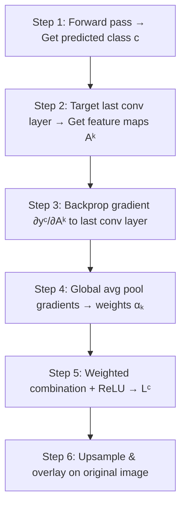

# 26. Demystifying the Black Box - CNN Interpretability

> [!note] Prerequisites
> This section assumes you understand CNN architectures ([[21. The Complete CNN Architecture]]), PyTorch basics ([[22. PyTorch Implementation Basics]]), and gradient computation. The Grad-CAM implementation uses PyTorch hooks, which are introduced here from first principles.

Convolutional Neural Networks are often criticized as "black boxes" — they make predictions, but we don't know *why*. This section explores CNN interpretability, with a deep focus on Grad-CAM (Gradient-weighted Class Activation Mapping), one of the most powerful and practical techniques for understanding what a CNN is actually looking at. We will cover the complete mathematical derivation, a step-by-step implementation, and real-world case studies that demonstrate why interpretability is not optional — it is essential.

---

## 1. Why Interpretability Matters

### 1.1 The Black Box Problem

A CNN trained for medical diagnosis might achieve 99% accuracy on chest X-rays, but without interpretability, we cannot answer a fundamental question: **Is the model making predictions for the right reasons?** High accuracy alone does not guarantee that the model has learned meaningful patterns. It might have learned to exploit shortcuts — irrelevant features that happen to correlate with the labels in the training data but don't generalize to the real world.

### 1.2 Four Domains Where Interpretability is Critical

**Autonomous Driving**: A self-driving car's vision system must reliably detect pedestrians, traffic signs, and lane markings. If the model detects stop signs by looking at the surrounding trees (which happen to be present in most stop sign images in the training data) rather than the sign itself, it will fail catastrophically in environments with different scenery. Interpretability allows engineers to verify that the model is attending to the correct visual features before deploying it in safety-critical situations.

**Medical Diagnosis**: A CNN that detects cancer from radiology images must be explainable to doctors, patients, and regulatory agencies. The FDA requires evidence that AI-based diagnostic tools are making decisions based on clinically relevant features, not spurious correlations. A model that achieves 99% accuracy by looking at hospital watermarks instead of the actual pathology is worse than useless — it is dangerous, because it gives a false sense of confidence in incorrect predictions.

**Legal Compliance**: The European Union's General Data Protection Regulation (GDPR) includes a "right to explanation" — individuals have the right to understand why an automated system made a decision about them. Without interpretability, deploying AI systems in regulated industries (finance, hiring, criminal justice) may be illegal. The EU AI Act, passed in 2024, further strengthens these requirements for high-risk AI systems.

**Debugging and Model Improvement**: Even outside of safety-critical applications, interpretability is an invaluable debugging tool. When a model makes errors, understanding *what* it was looking at when it made the wrong prediction can reveal data quality issues (mislabeled samples, dataset bias), architectural problems (insufficient receptive field, vanishing gradients), or training failures (overfitting to spurious features). This insight directly informs how to improve the model.

---

## 2. Grad-CAM: Gradient-weighted Class Activation Mapping

### 2.1 What is Grad-CAM?

Grad-CAM (Gradient-weighted Class Activation Mapping) is a technique introduced by Selvaraju et al. in 2017 that produces a coarse heatmap highlighting the regions of an input image that are most important for a CNN's prediction of a particular class. Unlike simpler methods that only show *where* the model looks, Grad-CAM shows *where the model looks for a specific class*, making it class-discriminative.

### 2.2 The Key Insight

The key insight behind Grad-CAM is that the final convolutional layer of a CNN produces feature maps that retain spatial information about the input image. Earlier layers capture low-level features (edges, textures) and later layers capture high-level semantic features (object parts, whole objects). The last convolutional layer represents a sweet spot: it has both spatial resolution (knowing *where* features are) and semantic richness (knowing *what* features mean). By combining these feature maps with gradient information, Grad-CAM identifies which spatial locations most influence the model's prediction for a given class.

### 2.3 Step-by-Step Explanation



**Step 1: Forward Pass — Get the Predicted Class**

First, we pass the input image through the CNN and obtain the model's output logits. We identify the predicted class $c$ (the class with the highest logit). This is the class we want to explain — we want to know "what did the model see that made it predict class $c$?"

$$y^c = \text{logits}[c]$$

where $y^c$ is the score (logit) for class $c$.

**Step 2: Target the Last Convolutional Layer**

We select the output of the last convolutional layer as our target. This layer produces a set of feature maps $\{A^1, A^2, \ldots, A^k, \ldots, A^K\}$ where each $A^k$ is a 2D spatial map of shape $h \times w$. These feature maps encode spatial information about where different features appear in the input image. The last conv layer is chosen because it has the highest-level semantic understanding while still preserving spatial information (unlike fully connected layers, which destroy spatial structure).

**Step 3: Backpropagate the Gradient to the Target Layer**

We compute the gradient of the class score $y^c$ with respect to each feature map $A^k$ of the target layer:

$$\frac{\partial y^c}{\partial A^k_{ij}}$$

This gradient tells us how much a small change in the activation at spatial position $(i, j)$ of feature map $k$ would affect the class score. A large gradient means that position is important for the prediction of class $c$.

**Step 4: Compute the Weights via Global Average Pooling of Gradients**

We compute the importance weight $\alpha^c_k$ for each feature map $k$ by globally average-pooling the gradients:

$$\alpha^c_k = \frac{1}{Z} \sum_i \sum_j \frac{\partial y^c}{\partial A^k_{ij}}$$

where $Z = h \times w$ is the number of spatial positions (the area of the feature map). This weight $\alpha^c_k$ represents the overall importance of feature map $k$ for predicting class $c$. A feature map with a large average gradient is one that, when its activations change, has a big impact on the class score. In other words, the model is "listening" to that feature map when making its prediction for class $c$.

**Step 5: Combine Weighted Feature Maps and Apply ReLU**

We compute the Grad-CAM heatmap $L^c$ as a weighted combination of the feature maps, followed by a ReLU:

$$L^c = \text{ReLU}\left(\sum_k \alpha^c_k \cdot A^k\right)$$

The weighted sum $\sum_k \alpha^c_k \cdot A^k$ combines the feature maps, emphasizing those that are important for class $c$. The ReLU is applied because we only care about features that have a **positive** influence on the class of interest — features that increase the score for class $c$. Negative values in the weighted sum correspond to features that decrease the score for class $c$ (i.e., evidence *against* class $c$), which are not relevant for explaining why the model predicted class $c$.

**Step 6: Resize and Overlay on the Original Image**

The Grad-CAM heatmap $L^c$ has the spatial resolution of the last convolutional feature map (e.g., $7 \times 7$ for VGG16 with 224×224 input). We upsample it to the size of the input image using bilinear interpolation, then overlay it as a semi-transparent colored heatmap on the original image. Red regions indicate high importance (the model is strongly attending to these areas), blue regions indicate low importance, and green/yellow regions indicate moderate importance.

---

## 3. The COVID-19 X-Ray Example: A Cautionary Tale

### 3.1 The Setup

In 2020, during the COVID-19 pandemic, numerous research groups published papers claiming that CNNs could detect COVID-19 from chest X-rays with near-perfect accuracy (some reporting >99%). These results were widely celebrated and raised hopes for rapid, automated COVID screening.

### 3.2 What Grad-CAM Revealed

When researchers applied Grad-CAM to these models, they discovered something alarming: the models were **not looking at the lungs at all**. Instead, the heatmaps lit up on:

1. **Hospital watermarks and markers**: COVID-positive X-rays often came from specific hospitals that stamped their X-rays with distinctive markers. The model learned to detect the hospital watermark rather than the disease. This was possible because different hospitals had different X-ray machines and different watermark styles, and the datasets were not properly balanced across hospitals.

2. **Patient positioning markers**: COVID patients were often imaged in different positions (e.g., portable AP views while lying down) compared to healthy patients (standard PA views while standing). The model learned to detect the imaging setup rather than the pathology.

3. **Image quality artifacts**: COVID X-rays from certain sources had different contrast, brightness, or resolution characteristics, and the model exploited these technical differences rather than learning the actual radiological signs of COVID-19.

### 3.3 The Lesson

This case study demonstrates that **high accuracy does not imply correct reasoning**. A model that achieves 99% accuracy by exploiting dataset biases is worse than a model that achieves 85% accuracy by looking at the right features, because the biased model will fail catastrophically on new data from a different distribution. Grad-CAM was essential for uncovering this problem — without it, the model's flaw would have remained hidden behind the impressive accuracy number.

> [!warning] Dataset Bias is the Silent Killer
> The COVID-19 X-Ray example illustrates a broader problem called "dataset bias" or "shortcut learning." Whenever a spurious correlation exists in the training data (watermarks, positioning, image quality), the model will tend to exploit it because it's easier than learning the true underlying pattern. Interpretability techniques like Grad-CAM are your best defense against deploying biased models.

---

## 4. Other Interpretability Methods (Brief Overview)

### 4.1 Saliency Maps

Saliency maps compute the gradient of the output class score with respect to the input image pixels. This tells us which pixels, if changed, would most affect the prediction. Unlike Grad-CAM, which produces a coarse heatmap, saliency maps have the same resolution as the input image. However, they tend to be noisy and less class-discriminative than Grad-CAM.

$$S_{ij} = \left|\frac{\partial y^c}{\partial x_{ij}}\right|$$

where $x_{ij}$ is the pixel at position $(i, j)$ in the input image.

### 4.2 CAM (Class Activation Mapping)

CAM is the predecessor of Grad-CAM. It requires modifying the architecture by replacing the fully connected layers with global average pooling (GAP) followed by a single linear layer. The heatmap is computed as:

$$L^c = \sum_k w^c_k \cdot A^k$$

where $w^c_k$ are the weights of the final linear layer. The main limitation is that CAM requires a specific architecture with GAP, while Grad-CAM works with any CNN architecture without modification.

### 4.3 Guided Backpropagation

Guided Backpropagation modifies the standard backpropagation by zeroing out not only the negative gradients but also the gradients that correspond to negative neuron activations during the forward pass. This produces much sharper and more visually interpretable attributions than vanilla saliency maps, but it can be unstable for some architectures and is not class-discriminative on its own.

### 4.4 Feature Visualization

Feature visualization generates synthetic images that maximally activate specific neurons or channels. By optimizing a random input image to maximally activate a chosen neuron, we can see what pattern that neuron has learned to detect. Early layers learn simple patterns (edges, colors, textures), while deeper layers learn complex patterns (faces, objects, scenes). This technique provides insight into the hierarchical feature learning of CNNs but doesn't explain specific predictions.

### 4.5 Comparison Table

| Method | Resolution | Class-Discriminative | Architecture Change | Computational Cost |
|--------|-----------|---------------------|-------------------|-------------------|
| Saliency Maps | Pixel-level | No | None | Low |
| CAM | Feature map level | Yes | Requires GAP | Low |
| Grad-CAM | Feature map level | Yes | None | Low |
| Guided Backprop | Pixel-level | No | None | Medium |
| Feature Visualization | Pixel-level | Yes (per neuron) | None | High |

---

## 5. Practical Grad-CAM Implementation in PyTorch

### 5.1 Understanding PyTorch Hooks

Before implementing Grad-CAM, we need to understand PyTorch's hook mechanism. Hooks are functions that can be attached to any `nn.Module` and are called when the module's `forward` or `backward` method is executed. They allow us to intercept intermediate activations and gradients without modifying the model's code.

There are two types of hooks:

- **Forward hooks**: Called during the forward pass. They receive the module's input and output. We use a forward hook to capture the feature maps from the last convolutional layer.
- **Backward hooks**: Called during the backward pass. They receive the module's input and output gradients. We use a backward hook to capture the gradients flowing back to the last convolutional layer.

### 5.2 Complete Grad-CAM Implementation

```python
# ============================================================
# GRAD-CAM IMPLEMENTATION — Complete, step-by-step
# ============================================================

import torch
import torch.nn.functional as F         # For interpolation (upsampling)
import numpy as np
from PIL import Image
import matplotlib.pyplot as plt

class GradCAM:
    """
    Gradient-weighted Class Activation Mapping (Grad-CAM).

    This implementation uses PyTorch forward and backward hooks to capture
    the intermediate activations and gradients from the target convolutional
    layer, then computes the Grad-CAM heatmap.

    Reference: Selvaraju et al., "Grad-CAM: Visual Explanations from
    Deep Networks via Gradient-based Localization", ICCV 2017.
    """

    def __init__(self, model, target_layer):
        """
        Initialize the Grad-CAM extractor.

        Args:
            model: The PyTorch model to interpret.
            target_layer: The specific convolutional layer to target.
                          Should be the last conv layer for best results.
                          Example: model.features[-1] for VGG
        """
        self.model = model               # Store reference to the model.
        self.target_layer = target_layer # Store reference to the target layer.

        # Storage for captured activations and gradients
        self.gradients = None            # Will store the gradients captured by the backward hook.
        self.activations = None          # Will store the activations captured by the forward hook.

        # Register hooks on the target layer
        self._register_hooks()           # Set up the hooks during initialization.

    def _register_hooks(self):
        """
        Register forward and backward hooks on the target layer.

        Forward hook: captures the layer's output (activations) during forward pass.
        Backward hook: captures the gradients flowing into the layer during backward pass.
        """

        def forward_hook(module, input, output):
            """
            Forward hook function.

            Called automatically during the forward pass.
            Saves the layer's output tensor (the feature maps).

            Args:
                module: The nn.Module this hook is attached to.
                input: Tuple of input tensors to the module.
                output: The output tensor from the module.
            """
            self.activations = output.detach()
                                       # .detach() disconnects the tensor from the
                                       # computation graph. We only need the values,
                                       # not the graph (saves memory).

        def backward_hook(module, grad_input, grad_output):
            """
            Backward hook function.

            Called automatically during the backward pass.
            Saves the gradients flowing into the layer.

            Args:
                module: The nn.Module this hook is attached to.
                grad_input: Tuple of input gradients to the module.
                grad_output: Tuple of output gradients from the module.
            """
            self.gradients = grad_output[0].detach()
                                       # grad_output is a tuple. The first element
                                       # is the gradient of the loss with respect to
                                       # the layer's output. This is exactly what we need:
                                       # ∂y^c / ∂A^k for each spatial position.
                                       # .detach() for the same reason as above.

        # Register the hooks
        self.target_layer.register_forward_hook(forward_hook)
                                       # register_forward_hook attaches our forward_hook
                                       # function to the target layer. It will be called
                                       # every time the layer's forward method is called.

        self.target_layer.register_full_backward_hook(backward_hook)
                                       # register_full_backward_hook attaches our backward_hook.
                                       # "full" means we get both grad_input and grad_output.
                                       # (The older register_backward_hook is deprecated.)

    def generate(self, input_tensor, target_class=None):
        """
        Generate the Grad-CAM heatmap for a given input image.

        Args:
            input_tensor: Preprocessed input tensor of shape (1, 3, H, W).
                          Must include batch dimension and be on the same
                          device as the model.
            target_class: The class index to generate the heatmap for.
                          If None, uses the predicted class (argmax of logits).

        Returns:
            heatmap: A numpy array of shape (H, W) with values in [0, 1],
                     where H and W match the input image dimensions.
            predicted_class: The class index that the model predicted.
        """
        # ---- Step 1: Forward pass to get the predicted class ----
        self.model.eval()               # Set to evaluation mode (important for Dropout/BN).

        with torch.enable_grad():       # We NEED gradients (unlike normal eval).
                                       # Even though we're in eval mode, we need the
                                       # computation graph for backpropagation.
            output = self.model(input_tensor)
                                       # Forward pass through the entire model.
                                       # The forward hook captures the target layer's activations.
                                       # output shape: (1, num_classes)

        if target_class is None:
            target_class = output.argmax(dim=1).item()
                                       # If no target class specified, use the predicted class.
                                       # .argmax(dim=1) finds the class with the highest logit.
                                       # .item() converts from 0-d tensor to Python int.

        # ---- Step 3: Backward pass to get gradients ----
        self.model.zero_grad()          # Clear any existing gradients.

        one_hot = torch.zeros_like(output)
                                       # Create a zero tensor with the same shape as output.
        one_hot[0][target_class] = 1    # Set the target class position to 1.
                                       # This creates a one-hot vector that selects
                                       # the gradient for our target class.

        output.backward(gradient=one_hot)
                                       # Backward pass with the one-hot gradient.
                                       # This computes ∂y^c/∂(all parameters and activations)
                                       # for the specific class c = target_class.
                                       # The backward hook captures the gradients at the target layer.

        # ---- Step 4: Compute weights via global average pooling ----
        # self.gradients shape: (1, K, h, w) where K = number of channels, h/w = spatial dims
        weights = self.gradients.mean(dim=(2, 3), keepdim=True)
                                       # Global average pooling over spatial dimensions.
                                       # For each channel k, compute:
                                       #   α^c_k = (1/Z) * Σ_i Σ_j ∂y^c/∂A^k_ij
                                       # where Z = h × w.
                                       # .mean(dim=(2,3)) computes this average.
                                       # keepdim=True preserves the shape as (1, K, 1, 1)
                                       # for broadcasting in the next step.

        # ---- Step 5: Weighted combination + ReLU ----
        # self.activations shape: (1, K, h, w)
        weighted_activations = weights * self.activations
                                       # Element-wise multiplication using broadcasting.
                                       # weights shape: (1, K, 1, 1) × activations shape: (1, K, h, w)
                                       # Each channel's feature map is multiplied by its weight.

        heatmap = weighted_activations.sum(dim=1, keepdim=True)
                                       # Sum across all channels:
                                       # L^c = Σ_k α^c_k * A^k
                                       # Result shape: (1, 1, h, w)

        heatmap = F.relu(heatmap)       # Apply ReLU: only keep positive contributions.
                                       # L^c = ReLU(Σ_k α^c_k * A^k)
                                       # Negative values mean the feature map is evidence
                                       # AGAINST class c, which we don't want to visualize.

        # ---- Step 6: Normalize and resize ----
        heatmap = heatmap.squeeze().cpu().numpy()
                                       # Remove batch and channel dims: (1,1,h,w) → (h,w).
                                       # .cpu() moves to CPU (needed for numpy conversion).
                                       # .numpy() converts to NumPy array.

        # Normalize to [0, 1]
        if heatmap.max() > 0:          # Avoid division by zero.
            heatmap = (heatmap - heatmap.min()) / (heatmap.max() - heatmap.min())
                                       # Min-max normalization to [0, 1].

        # Resize to input image dimensions
        heatmap = np.uint8(heatmap * 255)
                                       # Scale to [0, 255] and convert to uint8.
                                       # This is needed for cv2.resize or PIL resizing.

        heatmap_img = Image.fromarray(heatmap).resize(
            (input_tensor.shape[3], input_tensor.shape[2]),  # (width, height)
            Image.BILINEAR               # Bilinear interpolation for smooth resizing.
        )
        heatmap = np.array(heatmap_img) / 255.0
                                       # Convert back to [0, 1] range.

        return heatmap, target_class


def visualize_gradcam(model, input_tensor, original_image, target_layer,
                      target_class=None, alpha=0.5):
    """
    Generate and visualize a Grad-CAM heatmap overlaid on the original image.

    Args:
        model: The CNN model.
        input_tensor: Preprocessed input tensor (1, 3, H, W).
        original_image: The original unprocessed image (PIL Image or numpy array).
        target_layer: The convolutional layer to target.
        target_class: Optional class index. If None, uses predicted class.
        alpha: Transparency for the heatmap overlay (0 = only image, 1 = only heatmap).
    """
    # ---- Generate Grad-CAM heatmap ----
    grad_cam = GradCAM(model, target_layer)
    heatmap, pred_class = grad_cam.generate(input_tensor, target_class)

    # ---- Create the visualization ----
    fig, axes = plt.subplots(1, 3, figsize=(15, 5))

    # Panel 1: Original image
    if isinstance(original_image, Image.Image):
        axes[0].imshow(original_image)
    else:
        axes[0].imshow(original_image)
    axes[0].set_title('Original Image')
    axes[0].axis('off')

    # Panel 2: Heatmap
    axes[1].imshow(heatmap, cmap='jet')
    axes[1].set_title(f'Grad-CAM Heatmap (Class {pred_class})')
    axes[1].axis('off')

    # Panel 3: Overlay
    if isinstance(original_image, Image.Image):
        img_np = np.array(original_image)
    else:
        img_np = original_image

    # Resize heatmap to match image dimensions
    heatmap_resized = np.array(Image.fromarray(np.uint8(heatmap * 255)).resize(
        (img_np.shape[1], img_np.shape[0]), Image.BILINEAR)) / 255.0

    # Create colored heatmap using jet colormap
    colored_heatmap = plt.cm.jet(heatmap_resized)[:, :, :3]
                                       # Apply jet colormap, take only RGB channels (drop alpha).

    # Blend the original image with the heatmap
    if img_np.max() > 1:
        img_np = img_np / 255.0        # Normalize to [0, 1] if needed.

    overlay = (1 - alpha) * img_np + alpha * colored_heatmap
                                       # Weighted blend: original and heatmap.
    overlay = np.clip(overlay, 0, 1)   # Ensure values stay in [0, 1].

    axes[2].imshow(overlay)
    axes[2].set_title(f'Overlay (α={alpha})')
    axes[2].axis('off')

    plt.tight_layout()
    plt.show()

    return heatmap, pred_class
```

### 5.3 Using Grad-CAM with Pre-trained Models

```python
# ============================================================
# USAGE EXAMPLE: Grad-CAM with VGG16-BN
# ============================================================

from torchvision import models, transforms

# ---- Load a pre-trained model ----
model = models.vgg16_bn(weights='DEFAULT')
model.eval()

# ---- Identify the target layer ----
# For VGG16-BN, the last convolutional layer is:
# model.features[-1] — the last BatchNorm2d in features
# But we actually want the last Conv2d, which is features[-3]
# (because the last three elements are Conv2d, BatchNorm2d, ReLU)

# Let's print the features to find the right layer
print("Last 5 feature layers:")
for i, layer in enumerate(list(model.features.children())[-5:]):
    print(f"  features[{len(model.features)-5+i}]: {layer}")

# For VGG16-BN, the last Conv2d is at features[52] (index may vary)
# A reliable way: find the last Conv2d
target_layer = None
for layer in reversed(list(model.features.children())):
    if isinstance(layer, torch.nn.Conv2d):
        target_layer = layer
        break
print(f"\nTarget layer: {target_layer}")

# ---- Prepare the input image ----
preprocess = transforms.Compose([
    transforms.Resize(256),
    transforms.CenterCrop(224),
    transforms.ToTensor(),
    transforms.Normalize(mean=[0.485, 0.456, 0.406], std=[0.229, 0.224, 0.225]),
])

image = Image.open('example.jpg').convert('RGB')
input_tensor = preprocess(image).unsqueeze(0)
                                       # unsqueeze(0) adds batch dimension: (3,224,224) → (1,3,224,224)

# ---- Generate Grad-CAM visualization ----
heatmap, pred_class = visualize_gradcam(
    model=model,
    input_tensor=input_tensor,
    original_image=image,
    target_layer=target_layer,
    target_class=None,                 # Use predicted class
    alpha=0.5                          # 50% transparency
)

print(f"Predicted class: {pred_class}")
```

---

## 6. Using Interpretability for Debugging

### 6.1 What to Look For in Grad-CAM Visualizations

When examining Grad-CAM heatmaps, there are several patterns that indicate problems with your model or dataset:

**Model focusing on the background**: If the heatmap highlights the background (sky, floor, table) rather than the object of interest, the model has likely learned a spurious correlation between the background and the class labels. This commonly occurs when certain classes are consistently photographed in specific settings (e.g., all beach photos in a "ocean" class, all kitchen photos in a "food" class).

**Model focusing on watermarks or text**: As in the COVID-19 X-Ray example, the heatmap may reveal that the model is relying on embedded text, hospital stamps, or other annotations in the images. This is a serious form of dataset bias that completely invalidates the model's predictions.

**Model focusing on image borders or corners**: Sometimes the model learns to detect the edge of the image or a specific corner pattern that is an artifact of the image capture or preprocessing pipeline. This is a sign that your data preprocessing is leaking information.

**Diffuse, non-specific activation**: If the heatmap is spread evenly across the entire image without clear focus, it may indicate that the model hasn't learned discriminative features and is relying on global statistics (average brightness, overall color distribution) rather than specific object features.

**No activation at all**: If the heatmap is entirely dark, it may indicate that the model's decision is based on features that are not spatially localized in the last conv layer, or that there is a bug in the Grad-CAM implementation.

### 6.2 Common Patterns and Their Interpretations

| Grad-CAM Pattern | Likely Cause | Fix |
|-----------------|-------------|-----|
| Focus on background | Background correlates with class in training data | Collect more diverse data, use augmentation |
| Focus on watermarks/text | Dataset bias from image source | Remove watermarks, balance across sources |
| Focus on borders/corners | Preprocessing artifacts | Fix preprocessing pipeline |
| Diffuse, unfocused | Model using global statistics | Deeper architecture, more training data |
| No activation | Bug or non-spatial features | Debug implementation, try earlier layer |
| Correct focus on object | Model is working properly! | No fix needed |

### 6.3 A Debugging Workflow

```python
# ============================================================
# INTERPRETABILITY-DRIVEN DEBUGGING WORKFLOW
# ============================================================

def debug_model_with_gradcam(model, test_loader, target_layer, class_names, num_samples=10):
    """
    Generate Grad-CAM visualizations for correctly and incorrectly classified
    samples to identify systematic problems.

    Args:
        model: Trained CNN model.
        test_loader: DataLoader for the test/validation set.
        target_layer: Last convolutional layer.
        class_names: List of class name strings.
        num_samples: Number of samples to visualize per category.
    """
    grad_cam = GradCAM(model, target_layer)
    model.eval()

    correct_samples = []               # (image, heatmap, true_label, pred_label)
    incorrect_samples = []             # Same structure

    with torch.no_grad():
        for images, labels in test_loader:
            images_device = images.to(device)
            outputs = model(images_device)
            _, predicted = torch.max(outputs, 1)

            for i in range(images.size(0)):
                true_label = labels[i].item()
                pred_label = predicted[i].item()

                # Generate Grad-CAM for this sample
                input_tensor = images_device[i:i+1]  # Keep batch dim
                heatmap, _ = grad_cam.generate(input_tensor, target_class=pred_label)

                sample = (images[i], heatmap, true_label, pred_label)

                if true_label == pred_label:
                    correct_samples.append(sample)
                else:
                    incorrect_samples.append(sample)

                if len(correct_samples) >= num_samples and len(incorrect_samples) >= num_samples:
                    break
            if len(correct_samples) >= num_samples and len(incorrect_samples) >= num_samples:
                break

    # Visualize
    print("=== CORRECTLY CLASSIFIED SAMPLES ===")
    for img, hm, true, pred in correct_samples[:num_samples]:
        print(f"  True: {class_names[true]}, Predicted: {class_names[pred]}")
        # Display heatmap overlay here (see visualize_gradcam)

    print("\n=== INCORRECTLY CLASSIFIED SAMPLES ===")
    for img, hm, true, pred in incorrect_samples[:num_samples]:
        print(f"  True: {class_names[true]}, Predicted: {class_names[pred]}")
        # Display heatmap overlay here — look for what the model is focusing on!

    return correct_samples, incorrect_samples
```

> [!tip] Focus on the Errors
> The most valuable insights come from examining **incorrectly classified** samples. When the model makes a wrong prediction, the Grad-CAM heatmap will show you *what it was looking at* when it made the mistake. This directly reveals the cause of the error — whether it's dataset bias, insufficient training data for a specific class, or an architectural limitation.

---

## Summary

| Concept | Key Point |
|---------|-----------|
| Why interpretability matters | Safety, compliance, debugging, trust |
| Grad-CAM | Uses gradients + last conv feature maps to show where model looks |
| Last conv layer | Best target — has both spatial info and semantic understanding |
| Gradient weighting | $\alpha^c_k = \frac{1}{Z}\sum_i\sum_j \frac{\partial y^c}{\partial A^k_{ij}}$ |
| ReLU in Grad-CAM | Only show features that support (not oppose) the predicted class |
| COVID-19 X-Ray case | Model looked at watermarks, not lungs — high accuracy, wrong reasoning |
| PyTorch hooks | Forward hook → activations, Backward hook → gradients |
| Debugging patterns | Background focus, watermark focus, diffuse activation → specific fixes |

> [!note] Next Steps
> In [[27. Exercises Solved and Explained]], you will practice all the concepts from this chapter through five comprehensive exercises with complete worked solutions.
