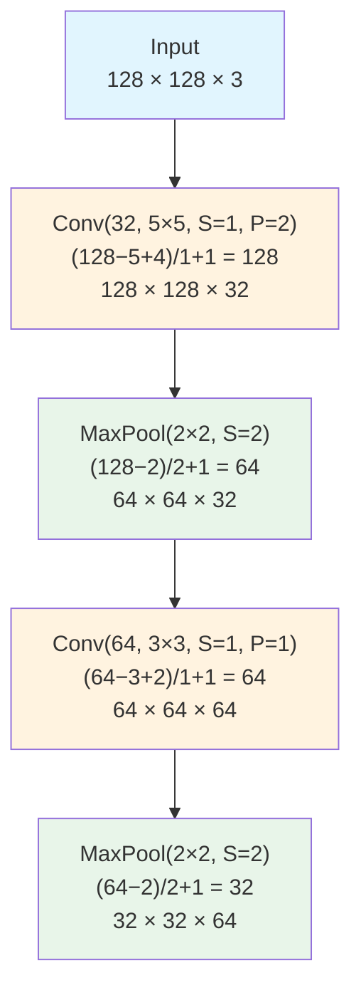
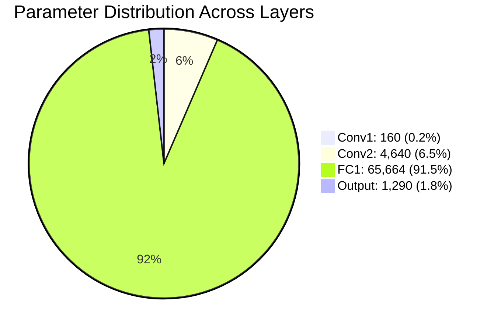
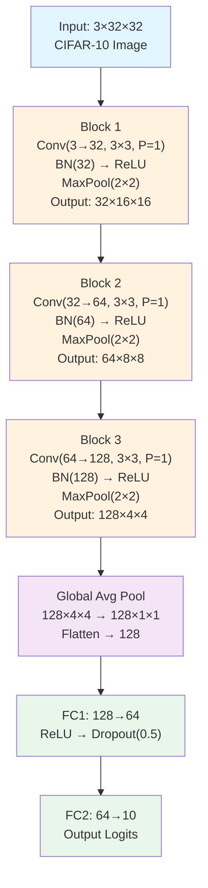
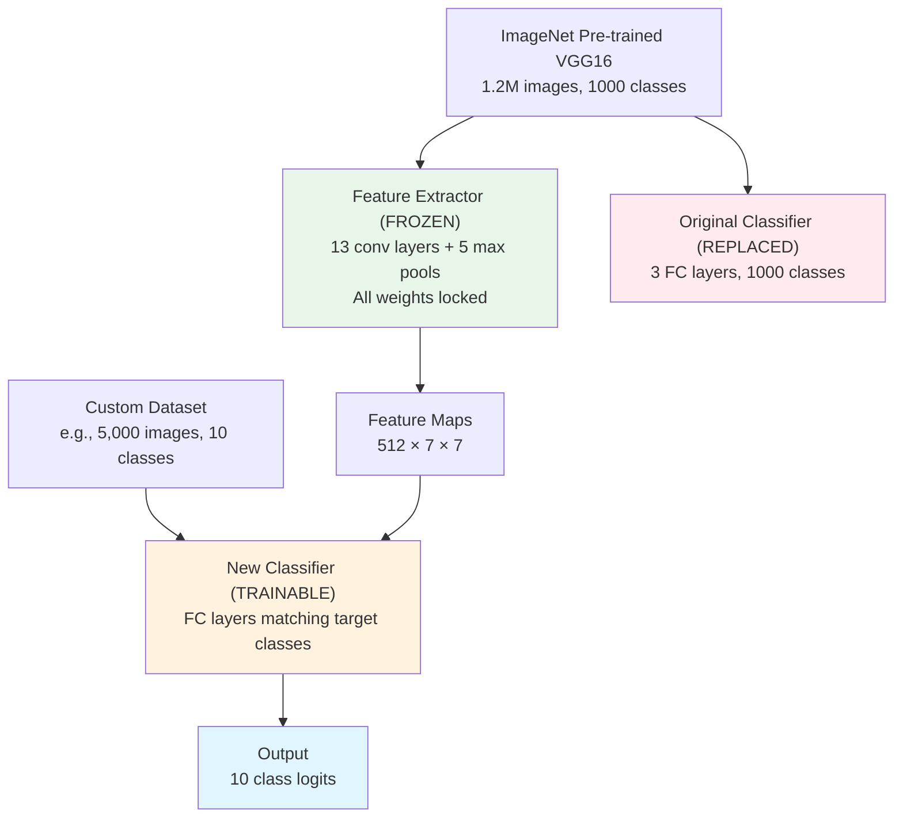
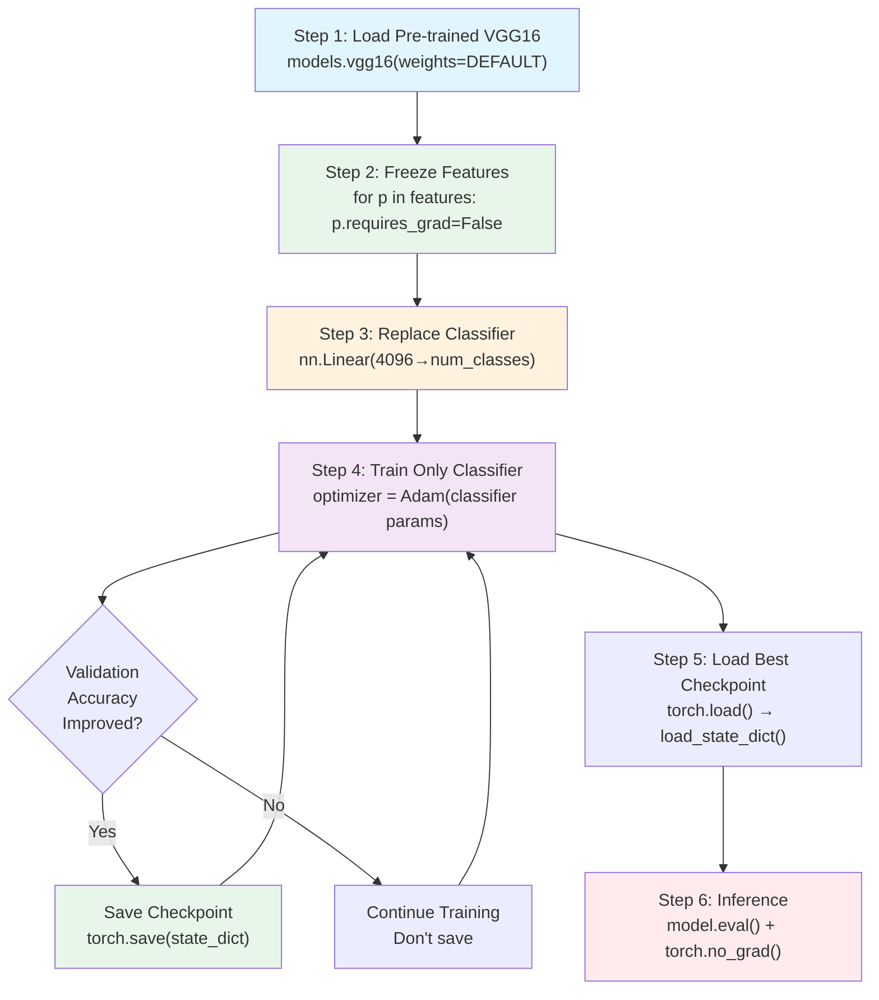
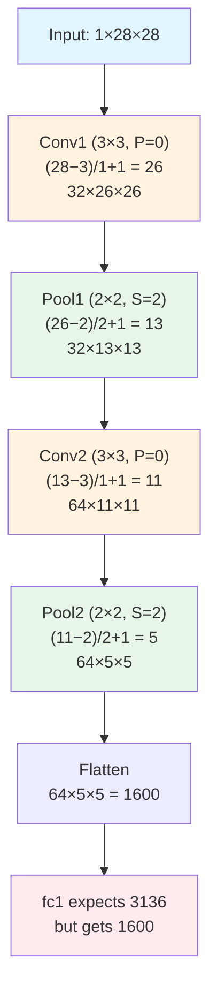

# 27. Exercises Solved and Explained

> [!tip] Why This Section Matters
> Theory without practice is like architecture without construction. This section consolidates every concept from Chapters 2–26 into five carefully designed exercises that span the full lifecycle of a convolutional neural network: from computing output dimensions by hand, through counting parameters and understanding where the memory goes, to building complete end-to-end pipelines, applying transfer learning in production scenarios, and—perhaps most valuably—diagnosing and fixing the dimension-mismatch bugs that every practitioner encounters. Each exercise is solved with every intermediate step shown, every formula derived from first principles, and every code line annotated so that nothing is left to assumption or guesswork.

This chapter is the capstone of [[2. Core Architecture and Philosophy|Section 2]], [[3. The Convolution Operation Deep Dive|Section 3]], [[5. Activation and Pooling Layers|Section 5]], [[16. Batch Normalization|Section 16]], [[17. Dropout and Regularization|Section 17]], [[19. Transfer Learning and Fine-Tuning|Section 19]], [[22. PyTorch Implementation Basics|Section 22]], and [[25. Common Mistakes and How to Fix Them|Section 25]]. If you can solve all five exercises without peeking, you have internalized the mechanics of CNNs at a level sufficient for research and production work alike.

---

## Exercise 1: Calculating CNN Output Dimensions

### 1.1 Problem Statement

You are given an input tensor of shape $128 \times 128 \times 3$ (height $H = 128$, width $W = 128$, channels $C = 3$). The tensor passes through the following sequence of layers:

1. **Convolution**: 32 filters, kernel size $5 \times 5$, stride $S = 1$, padding $P = 2$
2. **Max Pooling**: pool size $2 \times 2$, stride $S = 2$
3. **Convolution**: 64 filters, kernel size $3 \times 3$, stride $S = 1$, padding $P = 1$
4. **Max Pooling**: pool size $2 \times 2$, stride $S = 2$

**Task**: Compute the spatial dimensions and channel depth after each layer, and present a final summary table.

### 1.2 The Output Dimension Formula — From First Principles

Before computing anything, we must understand *why* the formula works. Consider a 1D signal of length $W$ with a filter of size $F$, stride $S$, and padding $P$. The filter slides across the padded input, which has total width $W + 2P$. Each placement of the filter covers $F$ positions, and the filter can be placed at positions $0, S, 2S, \ldots$ as long as the filter's right edge does not exceed the padded width. The number of valid placements is therefore the largest integer $k$ such that $k \cdot S + F - 1 \leq W + 2P - 1$, which simplifies to $k \leq \frac{W - F + 2P}{S}$. Taking the floor and adding one (because we count from zero) gives us the celebrated formula:

$$\boxed{O = \left\lfloor \frac{W - F + 2P}{S} \right\rfloor + 1}$$

where:
- $W$ is the input spatial dimension (width or height),
- $F$ is the filter (kernel) size,
- $P$ is the amount of zero-padding added to each side,
- $S$ is the stride (how many pixels the filter moves per step),
- $O$ is the output spatial dimension.

> [!info] Why the Floor Function?
> The floor function $\lfloor \cdot \rfloor$ appears because if the filter cannot perfectly cover the remaining pixels at the edge of the input, those edge pixels are simply discarded. This is standard in every major deep learning framework (PyTorch, TensorFlow, JAX). If you want every pixel covered, you must choose $F$, $P$, and $S$ such that $W - F + 2P$ is exactly divisible by $S$.

For **pooling layers**, the identical formula applies but with the pool window size playing the role of $F$. The channels dimension is never affected by pooling or convolution's spatial computation—it is set by the number of filters in convolution, and left unchanged by pooling.

### 1.3 Step-by-Step Calculation

#### Layer 1: Conv(32 filters, $5 \times 5$, $S = 1$, $P = 2$)

**Input**: $H = 128$, $W = 128$, $C_{\text{in}} = 3$

Applying the formula for the height (identical result for width by symmetry):

$$O_H = \left\lfloor \frac{128 - 5 + 2 \times 2}{1} \right\rfloor + 1 = \left\lfloor \frac{128 - 5 + 4}{1} \right\rfloor + 1 = \left\lfloor \frac{127}{1} \right\rfloor + 1 = 127 + 1 = 128$$

$$O_W = 128 \quad \text{(by identical calculation)}$$

The number of output channels equals the number of filters: $C_{\text{out}} = 32$.

**Output after Layer 1**: $128 \times 128 \times 32$

> [!tip] Same-Padding Intuition
> Notice that $P = 2$ with a $5 \times 5$ kernel and stride 1 produces an output with the same spatial size as the input. This is called "same padding." The general rule for same-padding with stride 1 is $P = \lfloor F / 2 \rfloor$. For $F = 5$, $P = 2$; for $F = 3$, $P = 1$. This is one of the most common design patterns in modern CNNs because it lets us control spatial reduction independently through pooling layers.

#### Layer 2: MaxPool($2 \times 2$, $S = 2$)

**Input**: $H = 128$, $W = 128$, $C = 32$

Pooling does not change the number of channels—it operates independently on each channel. The spatial formula uses pool size as $F$:

$$O_H = \left\lfloor \frac{128 - 2 + 2 \times 0}{2} \right\rfloor + 1 = \left\lfloor \frac{126}{2} \right\rfloor + 1 = 63 + 1 = 64$$

$$O_W = 64$$

$$C_{\text{out}} = 32 \quad \text{(unchanged)}$$

**Output after Layer 2**: $64 \times 64 \times 32$

> [!info] Pooling Has No Padding
> By convention, pooling layers use $P = 0$. The $2 \times 2$ pool with stride 2 is the most common configuration and cleanly halves the spatial dimensions when the input dimension is even. When the input dimension is odd, the floor operation will cause the loss of one pixel at the edge—a subtle but important detail we revisit in Exercise 5.

#### Layer 3: Conv(64 filters, $3 \times 3$, $S = 1$, $P = 1$)

**Input**: $H = 64$, $W = 64$, $C_{\text{in}} = 32$

$$O_H = \left\lfloor \frac{64 - 3 + 2 \times 1}{1} \right\rfloor + 1 = \left\lfloor \frac{63}{1} \right\rfloor + 1 = 63 + 1 = 64$$

$$O_W = 64$$

$$C_{\text{out}} = 64$$

**Output after Layer 3**: $64 \times 64 \times 64$

> [!tip] Same-Padding Again
> Once more, $P = 1$ with $F = 3$ and $S = 1$ preserves spatial dimensions. This is the same-padding rule at work: every modern architecture from VGG to ResNet uses this pattern. The spatial reduction is entirely delegated to the pooling layers (or strided convolutions), making the architecture design clean and predictable.

#### Layer 4: MaxPool($2 \times 2$, $S = 2$)

**Input**: $H = 64$, $W = 64$, $C = 64$

$$O_H = \left\lfloor \frac{64 - 2 + 0}{2} \right\rfloor + 1 = \left\lfloor \frac{62}{2} \right\rfloor + 1 = 31 + 1 = 32$$

$$O_W = 32$$

$$C_{\text{out}} = 64 \quad \text{(unchanged)}$$

**Output after Layer 4**: $32 \times 32 \times 64$

### 1.4 Complete Dimension Trace — Mermaid Diagram



### 1.5 Summary Table

| Layer | Operation | Input Size | $F$ | $S$ | $P$ | Formula | Output Size |
|:-----:|:---------:|:----------:|:---:|:---:|:---:|:--------:|:-----------:|
| 0 | — | — | — | — | — | — | $128 \times 128 \times 3$ |
| 1 | Conv(32, $5{\times}5$) | $128 \times 128 \times 3$ | 5 | 1 | 2 | $\lfloor(128{-}5{+}4)/1\rfloor{+}1 = 128$ | $128 \times 128 \times 32$ |
| 2 | MaxPool($2{\times}2$) | $128 \times 128 \times 32$ | 2 | 2 | 0 | $\lfloor(128{-}2{+}0)/2\rfloor{+}1 = 64$ | $64 \times 64 \times 32$ |
| 3 | Conv(64, $3{\times}3$) | $64 \times 64 \times 32$ | 3 | 1 | 1 | $\lfloor(64{-}3{+}2)/1\rfloor{+}1 = 64$ | $64 \times 64 \times 64$ |
| 4 | MaxPool($2{\times}2$) | $64 \times 64 \times 64$ | 2 | 2 | 0 | $\lfloor(64{-}2{+}0)/2\rfloor{+}1 = 32$ | $32 \times 32 \times 64$ |

> [!warning] Common Mistake: Forgetting Channels
> The most frequent error beginners make is tracking only the spatial dimensions and ignoring the channel dimension. Remember: convolution changes the channel count (from input channels to number of filters), while pooling preserves it. The final tensor contains $32 \times 32 \times 64 = 65{,}536$ values per sample, which must be flattened before entering a fully connected layer.

### 1.6 Quick Verification with PyTorch

The following code verifies our hand calculations programmatically. Every intermediate shape is printed so you can confirm each step matches the table above. This is an essential debugging technique—always verify your mental math with code.

```python
# Import PyTorch — the foundational library for tensor computation
import torch
# Import the neural network module containing layer definitions
import torch.nn as nn

# Create a dummy input tensor representing one image of size 128x128 with 3 channels
# The unsqueeze(0) adds a batch dimension, making shape (1, 3, 128, 128)
x = torch.randn(1, 3, 128, 128)

# Layer 1: Convolution with 32 filters, 5x5 kernel, stride 1, padding 2
conv1 = nn.Conv2d(in_channels=3, out_channels=32, kernel_size=5, stride=1, padding=2)
x = conv1(x)  # Apply convolution; expected output: (1, 32, 128, 128)
print(f"After Conv1: {x.shape}")  # Should print: torch.Size([1, 32, 128, 128])

# Layer 2: Max pooling with 2x2 window and stride 2
pool1 = nn.MaxPool2d(kernel_size=2, stride=2)
x = pool1(x)  # Apply pooling; expected output: (1, 32, 64, 64)
print(f"After Pool1: {x.shape}")  # Should print: torch.Size([1, 32, 64, 64])

# Layer 3: Convolution with 64 filters, 3x3 kernel, stride 1, padding 1
conv2 = nn.Conv2d(in_channels=32, out_channels=64, kernel_size=3, stride=1, padding=1)
x = conv2(x)  # Apply convolution; expected output: (1, 64, 64, 64)
print(f"After Conv2: {x.shape}")  # Should print: torch.Size([1, 64, 64, 64])

# Layer 4: Max pooling with 2x2 window and stride 2
pool2 = nn.MaxPool2d(kernel_size=2, stride=2)
x = pool2(x)  # Apply pooling; expected output: (1, 64, 32, 32)
print(f"After Pool2: {x.shape}")  # Should print: torch.Size([1, 64, 32, 32])
```

**Expected Output**:
```
After Conv1: torch.Size([1, 32, 128, 128])
After Pool1: torch.Size([1, 32, 64, 64])
After Conv2: torch.Size([1, 64, 64, 64])
After Pool2: torch.Size([1, 64, 32, 32])
```

Our hand calculations are confirmed. The final feature map has shape $32 \times 32 \times 64$, yielding $65{,}536$ total activations per sample.

---

## Exercise 2: Parameter Counting

### 2.1 Problem Statement

Consider the following neural network architecture with four layers:

1. **Conv1**: 16 filters, $3 \times 3$ kernel, input has 1 channel, with bias
2. **Conv2**: 32 filters, $3 \times 3$ kernel, input has 16 channels, with bias
3. **FC1**: Fully connected layer, 512 inputs → 128 outputs, with bias
4. **Output**: Fully connected layer, 128 inputs → 10 outputs, with bias

**Task**: Calculate the number of trainable parameters in each layer and the total. Verify that the total equals 71,754.

### 2.2 Parameter Formulas — Derived from First Principles

#### Convolutional Layer Parameters

A convolutional filter is a small tensor that slides across the input feature map. Each filter has dimensions $F_H \times F_W \times C_{\text{in}}$, where $F_H$ and $F_W$ are the filter's spatial dimensions and $C_{\text{in}}$ is the number of input channels. This means each filter contains $F_H \times F_W \times C_{\text{in}}$ weight values. If there are $K$ filters (the number of output channels), then the total number of weights is $K \times F_H \times F_W \times C_{\text{in}}$. Additionally, each filter has one bias term, contributing $K$ bias values. Therefore, the total number of parameters in a convolutional layer with bias is:

$$\boxed{P_{\text{conv}} = (F_H \times F_W \times C_{\text{in}} + 1) \times K}$$

The "$+1$" inside the parentheses accounts for the single bias per filter. If bias is disabled (`bias=False`), the formula simplifies to $F_H \times F_W \times C_{\text{in}} \times K$.

#### Fully Connected Layer Parameters

A fully connected (linear) layer connects every input neuron to every output neuron. If there are $N_{\text{in}}$ inputs and $N_{\text{out}}$ outputs, the weight matrix has shape $N_{\text{out}} \times N_{\text{in}}$ (or equivalently $N_{\text{in}} \times N_{\text{out}}$ depending on convention), containing $N_{\text{in}} \times N_{\text{out}}$ weights. Each output neuron also has one bias term, adding $N_{\text{out}}$ parameters. Thus:

$$\boxed{P_{\text{fc}} = (N_{\text{in}} + 1) \times N_{\text{out}}}$$

Again, the "$+1$" is for the bias. Without bias: $P_{\text{fc}} = N_{\text{in}} \times N_{\text{out}}$.

> [!warning] Why FC Layers Dominate
> A fully connected layer between two large vectors creates a dense weight matrix. If $N_{\text{in}} = 512$ and $N_{\text{out}} = 128$, that alone is $512 \times 128 = 65{,}536$ weights. Compare this to a $3 \times 3$ convolution on 16 channels with 32 filters: only $3 \times 3 \times 16 \times 32 = 4{,}608$ weights. The parameter explosion in FC layers is precisely why modern architectures (ResNet, EfficientNet, etc.) use global average pooling instead of large FC layers—replacing a flattened vector with a single average per channel.

### 2.3 Step-by-Step Calculation

#### Layer 1: Conv1 — (16 filters, $3 \times 3$, 1 input channel, bias)

$$P_{\text{Conv1}} = (F_H \times F_W \times C_{\text{in}} + 1) \times K = (3 \times 3 \times 1 + 1) \times 16$$

Let us decompose every step:

1. The spatial extent of one filter: $3 \times 3 = 9$ weight values per channel.
2. Since there is only 1 input channel, each filter has $9 \times 1 = 9$ weights.
3. Adding one bias per filter: $9 + 1 = 10$ parameters per filter.
4. There are 16 filters: $10 \times 16 = 160$ total parameters.

$$P_{\text{Conv1}} = \mathbf{160}$$

#### Layer 2: Conv2 — (32 filters, $3 \times 3$, 16 input channels, bias)

$$P_{\text{Conv2}} = (F_H \times F_W \times C_{\text{in}} + 1) \times K = (3 \times 3 \times 16 + 1) \times 32$$

Step by step:

1. The spatial extent of one filter: $3 \times 3 = 9$ weight values per channel.
2. Since there are 16 input channels, each filter has $9 \times 16 = 144$ weights.
3. Adding one bias per filter: $144 + 1 = 145$ parameters per filter.
4. There are 32 filters: $145 \times 32 = 4{,}640$ total parameters.

$$P_{\text{Conv2}} = \mathbf{4{,}640}$$

> [!tip] The Multiplicative Effect of Input Channels
> Notice how Conv2 has 16 input channels versus Conv1's single channel. This single factor multiplies the per-filter weight count from 9 to 144—a 16× increase. This is why early convolutional layers (with few input channels) are cheap, while deeper layers (with many channels) carry more parameters per filter. However, even at 144 weights per filter, convolution remains far more parameter-efficient than a fully connected layer covering the same spatial region.

#### Layer 3: FC1 — (512 inputs → 128 outputs, bias)

$$P_{\text{FC1}} = (N_{\text{in}} + 1) \times N_{\text{out}} = (512 + 1) \times 128$$

Step by step:

1. Each of the 128 output neurons connects to all 512 inputs: $512 \times 128 = 65{,}536$ weights.
2. Each of the 128 output neurons has one bias: $128$ bias terms.
3. Total: $65{,}536 + 128 = 65{,}664$ parameters.

Equivalently: $(512 + 1) \times 128 = 513 \times 128 = 65{,}664$.

$$P_{\text{FC1}} = \mathbf{65{,}664}$$

#### Layer 4: Output — (128 inputs → 10 outputs, bias)

$$P_{\text{Output}} = (N_{\text{in}} + 1) \times N_{\text{out}} = (128 + 1) \times 10$$

Step by step:

1. Each of the 10 output neurons connects to all 128 inputs: $128 \times 10 = 1{,}280$ weights.
2. Each of the 10 output neurons has one bias: $10$ bias terms.
3. Total: $1{,}280 + 10 = 1{,}290$ parameters.

Equivalently: $(128 + 1) \times 10 = 129 \times 10 = 1{,}290$.

$$P_{\text{Output}} = \mathbf{1{,}290}$$

### 2.4 Total Parameter Count

$$P_{\text{total}} = P_{\text{Conv1}} + P_{\text{Conv2}} + P_{\text{FC1}} + P_{\text{Output}}$$

$$P_{\text{total}} = 160 + 4{,}640 + 65{,}664 + 1{,}290$$

$$P_{\text{total}} = 160 + 4{,}640 = 4{,}800$$

$$4{,}800 + 65{,}664 = 70{,}464$$

$$70{,}464 + 1{,}290 = \mathbf{71{,}754}$$

The total is confirmed: **71,754 trainable parameters**.

### 2.5 Parameter Distribution — Visual Analysis



### 2.6 Summary Table

| Layer | Type | Shape | Formula | Parameters | Percentage |
|:-----:|:----:|:-----:|:-------:|:----------:|:----------:|
| Conv1 | Conv2d | $16 @ 3{\times}3$, 1 ch in | $(3{\times}3{\times}1+1){\times}16$ | 160 | 0.22% |
| Conv2 | Conv2d | $32 @ 3{\times}3$, 16 ch in | $(3{\times}3{\times}16+1){\times}32$ | 4,640 | 6.46% |
| FC1 | Linear | 512 → 128 | $(512+1){\times}128$ | 65,664 | 91.49% |
| Output | Linear | 128 → 10 | $(128+1){\times}10$ | 1,290 | 1.80% |
| **Total** | | | | **71,754** | **100%** |

> [!warning] Critical Insight — FC Layers Dominate Parameters
> Fully connected layer FC1 alone accounts for **91.5%** of all parameters. This is not an anomaly—it is the norm. In VGG-16, the three FC layers at the end contain approximately 90% of the model's 138 million parameters. This observation drove the architectural shift toward global average pooling (GAP) in later designs like Network-in-Network and ResNet, which replace the FC head with a single averaging operation per channel, reducing millions of parameters to zero. Understanding this distribution is essential for model compression, pruning, and deployment on resource-constrained devices.

### 2.7 Verification with PyTorch

```python
# Import PyTorch and the neural network module
import torch
import torch.nn as nn

# Define the network exactly as specified in the problem
class SmallCNN(nn.Module):
    def __init__(self):
        # Call the parent class (nn.Module) constructor — mandatory in PyTorch
        super(SmallCNN, self).__init__()
        # Conv1: 1 input channel, 16 output channels, 3x3 kernel, with bias (default)
        self.conv1 = nn.Conv2d(in_channels=1, out_channels=16, kernel_size=3, bias=True)
        # Conv2: 16 input channels, 32 output channels, 3x3 kernel, with bias (default)
        self.conv2 = nn.Conv2d(in_channels=16, out_channels=32, kernel_size=3, bias=True)
        # FC1: 512 input features, 128 output features, with bias (default)
        self.fc1 = nn.Linear(in_features=512, out_features=128, bias=True)
        # Output: 128 input features, 10 output features (e.g., 10 classes), with bias
        self.output = nn.Linear(in_features=128, out_features=10, bias=True)

    def forward(self, x):
        # Forward pass is not needed for parameter counting, but included for completeness
        x = self.conv1(x)   # Apply first convolution
        x = self.conv2(x)   # Apply second convolution
        x = x.view(x.size(0), -1)  # Flatten spatial dimensions into one vector
        x = self.fc1(x)     # Apply first fully connected layer
        x = self.output(x)  # Apply output layer
        return x

# Instantiate the model
model = SmallCNN()

# Count parameters per layer by iterating over named parameters
for name, param in model.named_parameters():
    # param.numel() returns the total number of elements in the parameter tensor
    print(f"{name:20s} | Shape: {str(list(param.shape)):20s} | Params: {param.numel():>6d}")

# Calculate total trainable parameters across the entire model
total_params = sum(p.numel() for p in model.parameters() if p.requires_grad)
print(f"\nTotal trainable parameters: {total_params}")  # Should print: 71754
```

**Expected Output**:
```
conv1.weight         | Shape: [16, 1, 3, 3]      | Params:    144
conv1.bias           | Shape: [16]                | Params:     16
conv2.weight         | Shape: [32, 16, 3, 3]     | Params:   4608
conv2.bias           | Shape: [32]                | Params:     32
fc1.weight           | Shape: [128, 512]          | Params:  65536
fc1.bias             | Shape: [128]               | Params:    128
output.weight        | Shape: [10, 128]           | Params:   1280
output.bias          | Shape: [10]                | Params:     10

Total trainable parameters: 71754
```

Our hand calculations match perfectly. Notice that PyTorch splits weights and biases into separate parameter tensors, but the total per layer is identical to our formula.

---

## Exercise 3: CIFAR-10 CNN Complete End-to-End

### 3.1 Problem Statement

Build, train, and evaluate a CNN on the CIFAR-10 dataset from scratch. The model must include three convolutional blocks (32 → 64 → 128 channels), batch normalization, dropout, and a fully connected classifier. The entire pipeline—from device configuration through data loading, model definition, training, and evaluation—must be implemented with every line commented.

### 3.2 Architecture Overview

Before writing code, let us design the architecture. Each convolutional block follows the pattern **Conv → BatchNorm → ReLU → MaxPool**, which is the standard modern building block. The three blocks progressively increase the channel depth (32 → 64 → 128) while halving the spatial dimensions through pooling. After the final block, global average pooling collapses the spatial dimensions, and a two-layer FC head produces the 10-class logits.



Let us verify the spatial dimensions through the network:
- Input: $32 \times 32$
- Block 1 (same-padding conv + pool): $32 \to 32 \to 16$ (pool halves)
- Block 2 (same-padding conv + pool): $16 \to 16 \to 8$ (pool halves)
- Block 3 (same-padding conv + pool): $8 \to 8 \to 4$ (pool halves)
- Global average pooling: $4 \to 1$ (average over $4 \times 4$ spatial area)

### 3.3 Complete Code with Exhaustive Comments

```python
# =============================================================================
# SECTION 0: IMPORTS
# =============================================================================
# torch: the core PyTorch library providing tensor computation and autograd
import torch
# torch.nn: neural network layers, loss functions, and utilities
import torch.nn as nn
# torch.optim: optimization algorithms (SGD, Adam, etc.)
import torch.optim as optim
# torchvision: datasets, model architectures, and image transformations
import torchvision
# torchvision.transforms: image preprocessing and augmentation pipelines
import torchvision.transforms as transforms
# DataLoader: batches and shuffles data for training/evaluation
from torch.utils.data import DataLoader

# =============================================================================
# SECTION 1: DEVICE CONFIGURATION
# =============================================================================
# Detect whether a CUDA-capable GPU is available; use it if so, else CPU
# This single line determines where ALL tensor computations will happen
device = torch.device("cuda" if torch.cuda.is_available() else "cpu")
print(f"Using device: {device}")  # Inform the user which device was selected

# =============================================================================
# SECTION 2: DATA LOADING WITH AUGMENTATION
# =============================================================================
# Define the transform pipeline for TRAINING data
# Data augmentation artificially expands the training set by applying random
# but label-preserving transformations, reducing overfitting
train_transform = transforms.Compose([
    # RandomCrop(32, padding=4): first pad the 32x32 image to 40x40 by adding
    # 4 pixels of zero-padding on each side, then randomly crop back to 32x32.
    # This is equivalent to random translations of up to 4 pixels, teaching
    # the model that the object need not be centered.
    transforms.RandomCrop(32, padding=4),

    # RandomHorizontalFlip: with probability 0.5, mirror the image horizontally.
    # Valid for CIFAR-10 because a flipped cat is still a cat, a flipped ship
    # is still a ship. Do NOT use this for digit recognition (a flipped 6 ≠ 9).
    transforms.RandomHorizontalFlip(),

    # ToTensor: converts a PIL Image (H×W×C, uint8 [0,255]) to a FloatTensor
    # (C×H×W, float32 [0.0, 1.0]). This also transposes the dimension order
    # from HWC (PIL/NumPy convention) to CHW (PyTorch convention).
    transforms.ToTensor(),

    # Normalize: applies the per-channel normalization (x - mean) / std.
    # These specific values (mean=[0.4914, 0.4822, 0.4465], std=[0.2470, 0.2435, 0.2616])
    # are the per-channel mean and standard deviation of the CIFAR-10 TRAINING set.
    # Normalizing to zero mean and unit variance accelerates convergence and
    # ensures consistent gradient magnitudes across channels.
    transforms.Normalize(
        mean=[0.4914, 0.4822, 0.4465],  # Per-channel means computed from CIFAR-10
        std=[0.2470, 0.2435, 0.2616]    # Per-channel standard deviations
    )
])

# Define the transform pipeline for TEST data
# CRITICAL: No augmentation for test data! We want deterministic, reproducible
# evaluation. Only ToTensor and Normalize (with the SAME statistics) are applied.
test_transform = transforms.Compose([
    # No RandomCrop — we evaluate on the full, original images
    # No RandomHorizontalFlip — flipping would corrupt the evaluation
    transforms.ToTensor(),  # Convert PIL to tensor, rescale to [0,1]
    transforms.Normalize(   # Use the SAME mean/std as training for consistency
        mean=[0.4914, 0.4822, 0.4465],
        std=[0.2470, 0.2435, 0.2616]
    )
])

# Download and load the CIFAR-10 training dataset
# root: directory where the data will be stored/downloaded
# train=True: load the 50,000 training images (train=False loads 10,000 test images)
# download=True: download from the internet if not already present locally
# transform=train_transform: apply the augmentation pipeline defined above
train_dataset = torchvision.datasets.CIFAR10(
    root="./data", train=True, download=True, transform=train_transform
)

# Download and load the CIFAR-10 test dataset
# Same parameters but train=False and transform=test_transform (no augmentation)
test_dataset = torchvision.datasets.CIFAR10(
    root="./data", train=False, download=True, transform=test_transform
)

# Create DataLoader for training — handles batching, shuffling, and parallel loading
# batch_size=128: each mini-batch contains 128 images; larger batches give more
#   stable gradient estimates but require more GPU memory
# shuffle=True: randomize the order each epoch so the model doesn't memorize
#   the order of training samples (critical for SGD convergence)
# num_workers=2: use 2 subprocesses for data loading to overlap I/O with compute
# pin_memory=True: copy tensors into pinned (page-locked) memory before returning
#   them, speeding up CPU→GPU transfer when training on CUDA
train_loader = DataLoader(
    train_dataset, batch_size=128, shuffle=True, num_workers=2, pin_memory=True
)

# Create DataLoader for testing — similar but with key differences
# shuffle=False: order doesn't matter for evaluation; disabling makes results
#   reproducible and slightly faster
test_loader = DataLoader(
    test_dataset, batch_size=128, shuffle=False, num_workers=2, pin_memory=True
)

# CIFAR-10 class names for interpreting predictions
classes = ("plane", "car", "bird", "cat", "deer",
           "dog", "frog", "horse", "ship", "truck")

# =============================================================================
# SECTION 3: MODEL DEFINITION
# =============================================================================
class CIFAR10CNN(nn.Module):
    """
    A 3-block CNN for CIFAR-10 classification.

    Architecture per block: Conv2d → BatchNorm2d → ReLU → MaxPool2d

    Channel progression: 3 → 32 → 64 → 128
    Spatial progression:  32×32 → 16×16 → 8×8 → 4×4 → 1×1 (via global avg pool)
    Classifier: FC(128→64) → ReLU → Dropout(0.5) → FC(64→10)
    """

    def __init__(self):
        # Call the parent nn.Module constructor — this registers all submodules
        # so that their parameters are tracked by the model's .parameters() method
        super(CIFAR10CNN, self).__init__()

        # ---- Block 1: 3 input channels → 32 output channels ----
        # Conv2d with kernel_size=3, stride=1, padding=1 gives "same padding"
        # (output spatial size = input spatial size when stride=1)
        self.conv1 = nn.Conv2d(
            in_channels=3,      # CIFAR-10 images have 3 color channels (RGB)
            out_channels=32,    # Produce 32 feature maps
            kernel_size=3,      # 3x3 convolution kernel — the standard choice
            stride=1,           # Move the filter one pixel at a time
            padding=1           # Add 1 pixel of zero-padding on each side
        )
        # BatchNorm2d normalizes each feature map to zero mean and unit variance
        # across the batch, then applies learnable scale (γ) and shift (β) parameters.
        # This stabilizes training, allows higher learning rates, and reduces
        # sensitivity to initialization.
        self.bn1 = nn.BatchNorm2d(num_features=32)  # 32 feature maps to normalize
        # MaxPool2d with kernel_size=2 and stride=2 halves the spatial dimensions
        # from 32×32 to 16×16, keeping only the strongest activation in each 2×2 region
        self.pool1 = nn.MaxPool2d(kernel_size=2, stride=2)

        # ---- Block 2: 32 input channels → 64 output channels ----
        self.conv2 = nn.Conv2d(
            in_channels=32,     # Receives the 32 feature maps from Block 1
            out_channels=64,    # Double the channel depth — common pattern
            kernel_size=3,
            stride=1,
            padding=1           # Same padding: 16×16 → 16×16 after conv
        )
        self.bn2 = nn.BatchNorm2d(num_features=64)
        self.pool2 = nn.MaxPool2d(kernel_size=2, stride=2)  # 16×16 → 8×8

        # ---- Block 3: 64 input channels → 128 output channels ----
        self.conv3 = nn.Conv2d(
            in_channels=64,     # Receives the 64 feature maps from Block 2
            out_channels=128,   # Double again — the deepest features have the most channels
            kernel_size=3,
            stride=1,
            padding=1           # Same padding: 8×8 → 8×8 after conv
        )
        self.bn3 = nn.BatchNorm2d(num_features=128)
        self.pool3 = nn.MaxPool2d(kernel_size=2, stride=2)  # 8×8 → 4×4

        # ---- Global Average Pooling ----
        # Instead of flattening 128×4×4 = 2048 values (which would require a large
        # FC layer), we average each feature map to a single number. This produces
        # a 128-dimensional vector regardless of the input spatial size, dramatically
        # reducing parameters and forcing the feature maps to represent class presence.
        self.global_pool = nn.AdaptiveAvgPool2d(output_size=(1, 1))

        # ---- Classifier Head ----
        # FC1: 128 → 64 with ReLU activation
        self.fc1 = nn.Linear(in_features=128, out_features=64)
        # Dropout randomly zeros 50% of the neurons during training, preventing
        # co-adaptation and serving as a strong regularizer
        self.dropout = nn.Dropout(p=0.5)
        # FC2 (output): 64 → 10 (one logit per CIFAR-10 class)
        self.fc2 = nn.Linear(in_features=64, out_features=10)

    def forward(self, x):
        """
        Forward pass: transform input images into class logits.

        Args:
            x: tensor of shape (batch_size, 3, 32, 32)

        Returns:
            logits: tensor of shape (batch_size, 10)
        """
        # ---- Block 1 ----
        x = self.conv1(x)    # (B, 3, 32, 32) → (B, 32, 32, 32)
        x = self.bn1(x)      # Normalize each of the 32 feature maps
        x = torch.relu(x)    # ReLU activation: max(0, x) — introduces non-linearity
        x = self.pool1(x)    # (B, 32, 32, 32) → (B, 32, 16, 16)

        # ---- Block 2 ----
        x = self.conv2(x)    # (B, 32, 16, 16) → (B, 64, 16, 16)
        x = self.bn2(x)      # Normalize each of the 64 feature maps
        x = torch.relu(x)    # ReLU activation
        x = self.pool2(x)    # (B, 64, 16, 16) → (B, 64, 8, 8)

        # ---- Block 3 ----
        x = self.conv3(x)    # (B, 64, 8, 8) → (B, 128, 8, 8)
        x = self.bn3(x)      # Normalize each of the 128 feature maps
        x = torch.relu(x)    # ReLU activation
        x = self.pool3(x)    # (B, 128, 8, 8) → (B, 128, 4, 4)

        # ---- Global Average Pooling + Flatten ----
        x = self.global_pool(x)  # (B, 128, 4, 4) → (B, 128, 1, 1)
        x = x.view(x.size(0), -1)  # (B, 128, 1, 1) → (B, 128)
        # x.view reshapes: size(0) preserves the batch dimension, -1 infers
        # the remaining dimension (128*1*1 = 128). This is the flatten operation.

        # ---- Classifier ----
        x = self.fc1(x)      # (B, 128) → (B, 64)
        x = torch.relu(x)    # ReLU activation in the classifier
        x = self.dropout(x)  # Zero out 50% of activations (only during training)
        x = self.fc2(x)      # (B, 64) → (B, 10) — raw logits, no softmax needed

        return x

# =============================================================================
# SECTION 4: INSTANTIATE MODEL, LOSS, AND OPTIMIZER
# =============================================================================
# Create the model and move it to the selected device (GPU or CPU)
# All model parameters and buffers are transferred to the device's memory
model = CIFAR10CNN().to(device)

# CrossEntropyLoss combines LogSoftmax and NLLLoss in one class.
# It expects raw logits (NOT softmax outputs) as model predictions and
# integer class labels (NOT one-hot) as targets. This is numerically more
# stable than computing softmax separately, because LogSoftmax uses the
# log-sum-exp trick to avoid overflow/underflow.
criterion = nn.CrossEntropyLoss()

# Adam optimizer with learning rate 0.001 (the default, often a good starting point)
# Adam adapts the learning rate per-parameter using estimates of first and second
# moments of the gradients. It is widely used because it converges quickly and
# is relatively insensitive to the choice of learning rate.
optimizer = optim.Adam(model.parameters(), lr=0.001)

# =============================================================================
# SECTION 5: TRAINING LOOP
# =============================================================================
# Number of complete passes through the entire training dataset
num_epochs = 20

# Track the number of training steps for potential logging/scheduling
total_steps = len(train_loader)

print("Starting training...")
for epoch in range(num_epochs):
    # Set the model to training mode — this enables dropout and causes
    # BatchNorm to use batch statistics (mean/var) rather than running statistics
    model.train()

    # running_loss accumulates the loss over all mini-batches in this epoch
    running_loss = 0.0

    # correct and total track training accuracy for this epoch
    correct = 0
    total = 0

    # Iterate over mini-batches provided by the DataLoader
    # images: tensor of shape (batch_size, 3, 32, 32)
    # labels: tensor of shape (batch_size,) with integer class indices 0-9
    for i, (images, labels) in enumerate(train_loader):
        # Move data to the same device as the model — this is REQUIRED
        # because PyTorch cannot perform operations between tensors on
        # different devices (e.g., GPU model and CPU data)
        images = images.to(device)
        labels = labels.to(device)

        # ---- Forward Pass ----
        # Compute model predictions (logits) for the current mini-batch
        outputs = model(images)

        # Compute the loss between predictions and ground truth labels
        # CrossEntropyLoss internally applies log-softmax to outputs
        # and computes the negative log-likelihood
        loss = criterion(outputs, labels)

        # ---- Backward Pass ----
        # Zero out all gradients from the previous iteration.
        # PyTorch ACCUMULATES gradients by default (useful for RNNs and
        # gradient accumulation), so we must manually zero them before
        # each backward pass. Forgetting this line is one of the most
        # common bugs — gradients would accumulate across batches!
        optimizer.zero_grad()

        # Compute gradients of the loss with respect to all model parameters.
        # This traverses the computational graph in reverse (backpropagation),
        # applying the chain rule at each operation to compute ∂Loss/∂w for
        # every parameter w.
        loss.backward()

        # Update all model parameters using the computed gradients.
        # For Adam: θ_new = θ_old - lr * m_hat / (√v_hat + ε)
        # where m_hat and v_hat are bias-corrected estimates of the first
        # and second moments of the gradients.
        optimizer.step()

        # ---- Accumulate Statistics ----
        # .item() extracts the scalar value from a single-element tensor,
        # moving it from GPU to CPU if necessary. Multiply by batch size
        # because loss is averaged over the batch by default.
        running_loss += loss.item() * images.size(0)

        # Get the predicted class by taking the argmax over the 10 logits.
        # outputs has shape (batch_size, 10); torch.max returns (values, indices).
        # We only need the indices (the predicted class label).
        _, predicted = torch.max(outputs.data, dim=1)

        # Count how many predictions match the ground truth
        total += labels.size(0)  # Total samples processed so far this epoch
        correct += (predicted == labels).sum().item()  # Correct predictions

    # ---- Epoch Summary ----
    # Average loss over all training samples (not just per-batch)
    epoch_loss = running_loss / len(train_dataset)
    # Training accuracy as a percentage
    epoch_acc = 100.0 * correct / total

    print(f"Epoch [{epoch+1}/{num_epochs}] "
          f"Loss: {epoch_loss:.4f} | Train Acc: {epoch_acc:.2f}%")

# =============================================================================
# SECTION 6: EVALUATION LOOP
# =============================================================================
# Set the model to evaluation mode — this DISABLES dropout (neurons are not
# dropped) and causes BatchNorm to use the stored running mean/variance
# (computed during training) instead of batch statistics.
model.eval()

# These will accumulate correct predictions and total samples across all batches
correct = 0
total = 0

# torch.no_grad() disables gradient computation entirely.
# This serves two purposes:
#   1. It dramatically reduces memory usage (no need to store intermediate
#      activations for backpropagation), allowing larger batch sizes.
#   2. It speeds up computation because autograd doesn't need to build
#      the computational graph.
# ALWAYS use no_grad() during evaluation — computing gradients you don't
# need is pure waste.
with torch.no_grad():
    for images, labels in test_loader:
        # Move test data to the same device as the model
        images = images.to(device)
        labels = labels.to(device)

        # Forward pass only — no backward pass needed during evaluation
        outputs = model(images)

        # Get predictions: the class with the highest logit score
        _, predicted = torch.max(outputs.data, dim=1)

        # Update counters
        total += labels.size(0)                              # Add batch size
        correct += (predicted == labels).sum().item()        # Add correct count

# Compute and display the final test accuracy
test_accuracy = 100.0 * correct / total
print(f"\nTest Accuracy: {test_accuracy:.2f}%")

# =============================================================================
# SECTION 7: PER-CLASS ACCURACY
# =============================================================================
# Understanding which classes the model struggles with is as important as
# the overall accuracy. A model with 80% accuracy might be perfect on 8
# classes and fail entirely on 2 — a critical problem in practice.

# Initialize per-class counters
class_correct = [0] * 10  # Correct predictions for each of 10 classes
class_total = [0] * 10    # Total samples for each class

# Evaluate again (still in eval mode, still no_grad)
with torch.no_grad():
    for images, labels in test_loader:
        images = images.to(device)
        labels = labels.to(device)
        outputs = model(images)
        _, predicted = torch.max(outputs, dim=1)

        # Compare predictions to labels element-wise
        c = (predicted == labels).squeeze()  # Remove redundant dimensions

        # Iterate over the batch and update per-class counters
        for i in range(labels.size(0)):
            label = labels[i].item()           # Get the true class index
            class_correct[label] += c[i].item()  # Add 1 if correct, 0 if wrong
            class_total[label] += 1               # Always increment the total

# Print per-class results
print("\nPer-class accuracy:")
for i in range(10):
    # Avoid division by zero (shouldn't happen with CIFAR-10 but defensive)
    acc = 100.0 * class_correct[i] / class_total[i] if class_total[i] > 0 else 0
    print(f"  {classes[i]:>8s}: {acc:.1f}% ({class_correct[i]}/{class_total[i]})")
```

### 3.4 Dimension Trace Through the Model

```mermaid
flowchart LR
    A["Input<br/>(B, 3, 32, 32)"] --> B["Conv1<br/>(B, 32, 32, 32)"]
    B --> C["BN1 + ReLU<br/>(B, 32, 32, 32)"]
    C --> D["Pool1<br/>(B, 32, 16, 16)"]
    D --> E["Conv2<br/>(B, 64, 16, 16)"]
    E --> F["BN2 + ReLU<br/>(B, 64, 16, 16)"]
    F --> G["Pool2<br/>(B, 64, 8, 8)"]
    G --> H["Conv3<br/>(B, 128, 8, 8)"]
    H --> I["BN3 + ReLU<br/>(B, 128, 8, 8)"]
    I --> J["Pool3<br/>(B, 128, 4, 4)"]
    J --> K["GAP<br/>(B, 128, 1, 1)"]
    K --> L["Flatten<br/>(B, 128)"]
    L --> M["FC1 + ReLU<br/>(B, 64)"]
    M --> N["Dropout<br/>(B, 64)"]
    N --> O["FC2<br/>(B, 10)"]

    style A fill:#e1f5fe
    style D fill:#e8f5e9
    style G fill:#e8f5e9
    style J fill:#e8f5e9
    style K fill:#f3e5f5
    style O fill:#ffebee
```



### 3.5 Parameter Count for This Model

Let us compute the trainable parameters to understand the model's capacity:

| Layer | Type | Shape | Parameters |
|:-----:|:----:|:-----:|:----------:|
| conv1 | Conv2d | $32 @ 3 \times 3$, 3 ch | $(3 \times 3 \times 3 + 1) \times 32 = 896$ |
| bn1 | BatchNorm2d | 32 features | $32 \times 2 = 64$ (γ and β per channel) |
| conv2 | Conv2d | $64 @ 3 \times 3$, 32 ch | $(3 \times 3 \times 32 + 1) \times 64 = 18{,}496$ |
| bn2 | BatchNorm2d | 64 features | $64 \times 2 = 128$ |
| conv3 | Conv2d | $128 @ 3 \times 3$, 64 ch | $(3 \times 3 \times 64 + 1) \times 128 = 73{,}856$ |
| bn3 | BatchNorm2d | 128 features | $128 \times 2 = 256$ |
| fc1 | Linear | 128 → 64 | $(128 + 1) \times 64 = 8{,}256$ |
| fc2 | Linear | 64 → 10 | $(64 + 1) \times 10 = 650$ |
| **Total** | | | **102,602** |

> [!info] Global Average Pooling Saves Parameters
> Without global average pooling, the flatten after pool3 would produce $128 \times 4 \times 4 = 2{,}048$ values. An FC layer from 2,048 to 64 would need $(2048+1) \times 64 = 131{,}136$ parameters—more than the entire current model. By using GAP, we reduce this to just $(128+1) \times 64 = 8{,}256$ parameters, a 16× reduction. This is why modern architectures almost universally adopt GAP.

### 3.6 Expected Results

With 20 epochs of training using Adam at lr=0.001, this architecture typically achieves:

| Metric | Expected Range |
|:------:|:--------------:|
| Training Accuracy | 85–92% |
| Test Accuracy | 78–85% |
| Training Time (GPU) | ~3–5 minutes |
| Training Time (CPU) | ~15–30 minutes |

The gap between training and test accuracy indicates some overfitting, which can be mitigated with more aggressive augmentation, weight decay, or longer training with learning rate scheduling.

---

## Exercise 4: Transfer Learning with VGG16 on Custom Dataset

### 4.1 Problem Statement

Implement a complete transfer learning pipeline using a pre-trained VGG16 model. You must: (1) load and preprocess a custom dataset with ImageNet normalization, (2) load VGG16 with pre-trained weights and freeze its feature extractor, (3) replace the classifier head for the target task, (4) train only the new classifier while keeping features frozen, (5) validate the model, and (6) save the best checkpoint and perform inference. Every line must be commented.

### 4.2 Transfer Learning Theory — Why It Works

Transfer learning exploits the observation that the early and middle layers of a CNN trained on a large dataset (like ImageNet with 1.2M images) learn general visual features—edges, textures, shapes, and object parts—that are useful across virtually all visual tasks. Only the final task-specific layers need to be retrained. This is analogous to how a human who has learned to recognize animals can quickly learn to distinguish dog breeds: the low-level visual processing is already in place, and only the high-level category boundaries need adjustment.

Formally, let $\theta_f$ denote the parameters of the feature extractor (frozen) and $\theta_c$ denote the parameters of the new classifier (trainable). The transfer learning objective is:

$$\theta_c^* = \arg\min_{\theta_c} \mathcal{L}\big(f_{\theta_f}(x),\, y;\, \theta_c\big)$$

where $\mathcal{L}$ is the loss function and $f_{\theta_f}(x)$ are the fixed features. Since $\theta_f$ is not updated, training is faster (fewer gradients to compute), requires less data (only $\theta_c$ needs to be estimated), and benefits from the rich representations learned on ImageNet.



> [!warning] ImageNet Normalization Is Non-Negotiable
> Pre-trained models expect input normalized with the ImageNet statistics: mean=[0.485, 0.456, 0.406] and std=[0.229, 0.224, 0.225]. Using different normalization (or no normalization) will produce features that are out of distribution, and the frozen feature extractor will output garbage representations. This is one of the most common and insidious mistakes in transfer learning—your code will run without errors but the model will perform terribly.

### 4.3 Complete Code with Exhaustive Comments

```python
# =============================================================================
# SECTION 0: IMPORTS
# =============================================================================
import torch                        # Core tensor library
import torch.nn as nn               # Neural network layers
import torch.optim as optim         # Optimization algorithms
import torchvision                  # Datasets and pre-trained models
import torchvision.transforms as transforms  # Image preprocessing
from torch.utils.data import DataLoader      # Batching and loading
import torchvision.models as models          # Pre-trained model zoo
import os                          # File system operations
import copy                        # Deep copying for checkpointing

# =============================================================================
# SECTION 1: DEVICE CONFIGURATION
# =============================================================================
# Select GPU if available, otherwise fall back to CPU
device = torch.device("cuda" if torch.cuda.is_available() else "cpu")
print(f"Device: {device}")

# =============================================================================
# SECTION 2: DATA PIPELINE WITH IMAGENET NORMALIZATION
# =============================================================================
# IMAGENET NORMALIZATION CONSTANTS
# These values were computed over the entire ImageNet training set (1.2M images).
# Every pre-trained model in torchvision was trained with exactly these values.
# Using them ensures that the pixel distribution your model sees matches what
# it was trained on.
IMAGENET_MEAN = [0.485, 0.456, 0.406]  # Per-channel RGB means
IMAGENET_STD  = [0.229, 0.224, 0.225]  # Per-channel RGB standard deviations

# Training transform pipeline with augmentation AND ImageNet normalization
train_transform = transforms.Compose([
    # Resize the shorter edge to 256 pixels (VGG16 expects 224x224 input;
    # we resize to 256 first and then crop, giving some spatial randomness)
    transforms.Resize(256),

    # Randomly crop a 224x224 region from the 256x256 image.
    # This provides translation augmentation and matches VGG16's expected input size.
    transforms.RandomCrop(224),

    # Randomly flip horizontally with probability 0.5
    transforms.RandomHorizontalFlip(),

    # Convert PIL Image (HWC, uint8) to FloatTensor (CHW, [0,1])
    transforms.ToTensor(),

    # Normalize with ImageNet statistics — CRITICAL for pre-trained models
    transforms.Normalize(mean=IMAGENET_MEAN, std=IMAGENET_STD)
])

# Validation/test transform — NO augmentation, deterministic preprocessing
val_transform = transforms.Compose([
    # Resize shorter edge to 256 (same as training for consistency)
    transforms.Resize(256),

    # Center crop 224x224 — deterministic, always takes the center of the image
    # This eliminates randomness so validation results are reproducible
    transforms.CenterCrop(224),

    transforms.ToTensor(),
    transforms.Normalize(mean=IMAGENET_MEAN, std=IMAGENET_STD)
])

# --- Dataset Loading ---
# Here we use CIFAR-10 resized to 224x224 as a stand-in for a "custom dataset."
# In practice, you would use torchvision.datasets.ImageFolder for your own data:
#   dataset = torchvision.datasets.ImageFolder(root="path/to/data", transform=...)
#
# ImageFolder expects the directory structure:
#   root/class1/img1.jpg
#   root/class1/img2.jpg
#   root/class2/img1.jpg
#   ...
# It automatically assigns integer labels based on alphabetical folder order.

# For demonstration, we use CIFAR-10 with a special transform that resizes
# images from 32x32 to 224x224 (required by VGG16)
cifar_train_transform = transforms.Compose([
    transforms.Resize(256),              # Upscale from 32x32 to 256x256
    transforms.RandomCrop(224),          # Random crop to 224x224
    transforms.RandomHorizontalFlip(),   # Augmentation
    transforms.ToTensor(),
    transforms.Normalize(mean=IMAGENET_MEAN, std=IMAGENET_STD)
])

cifar_val_transform = transforms.Compose([
    transforms.Resize(256),
    transforms.CenterCrop(224),
    transforms.ToTensor(),
    transforms.Normalize(mean=IMAGENET_MEAN, std=IMAGENET_STD)
])

# Load CIFAR-10 as a proxy for a custom dataset
train_dataset = torchvision.datasets.CIFAR10(
    root="./data", train=True, download=True, transform=cifar_train_transform
)
val_dataset = torchvision.datasets.CIFAR10(
    root="./data", train=False, download=True, transform=cifar_val_transform
)

# Create DataLoaders
# batch_size=32 is smaller than before because VGG16 is a large model
# and 224x224 images consume much more GPU memory than 32x32 images
train_loader = DataLoader(
    train_dataset, batch_size=32, shuffle=True, num_workers=2, pin_memory=True
)
val_loader = DataLoader(
    val_dataset, batch_size=32, shuffle=False, num_workers=2, pin_memory=True
)

num_classes = 10  # CIFAR-10 has 10 classes; change this for your custom dataset

# =============================================================================
# SECTION 3: MODEL LOADING AND MODIFICATION
# =============================================================================
# Load VGG16 with pre-trained ImageNet weights
# weights=VGG16_Weights.DEFAULT loads the best available weights (trained on ImageNet)
# Using pre-trained weights means we start from a model that already knows how to
# extract edges, textures, shapes, and object parts from natural images.
vgg16 = models.vgg16(weights=torchvision.models.VGG16_Weights.DEFAULT)

# ---- FREEZE THE FEATURE EXTRACTOR ----
# Setting requires_grad=False for ALL parameters in the feature extractor
# prevents them from being updated during backpropagation.
# This is the core of "feature extraction" mode in transfer learning:
# the convolutional layers are used as a fixed feature transformer.
for param in vgg16.features.parameters():
    param.requires_grad = False  # Disable gradient computation for this parameter

# Verify freezing: count trainable vs. frozen parameters
frozen_params = sum(p.numel() for p in vgg16.features.parameters())
trainable_before = sum(p.numel() for p in vgg16.parameters() if p.requires_grad)
print(f"Frozen feature parameters: {frozen_params:,}")
print(f"Trainable parameters (before replacing classifier): {trainable_before:,}")

# ---- REPLACE THE CLASSIFIER ----
# VGG16's original classifier is designed for 1000 ImageNet classes:
#   Sequential(
#     (0): Linear(25088 -> 4096)     # 25088 = 512 * 7 * 7
#     (1): ReLU
#     (2): Dropout(0.5)
#     (3): Linear(4096 -> 4096)
#     (4): ReLU
#     (5): Dropout(0.5)
#     (6): Linear(4096 -> 1000)      # 1000 ImageNet classes
#   )
#
# We replace it with a new classifier matching our target number of classes.
# The input to the classifier is ALWAYS 25088 (512 * 7 * 7) because the
# feature extractor is frozen and always produces 512 feature maps of size 7x7
# when given a 224x224 input image.

vgg16.classifier = nn.Sequential(
    # First FC layer: same as original VGG16
    # 25088 = 512 channels × 7 height × 7 width (output of last max pool in features)
    nn.Linear(in_features=512 * 7 * 7, out_features=4096),
    nn.ReLU(inplace=True),    # inplace=True saves memory by overwriting the input
    nn.Dropout(p=0.5),        # 50% dropout for regularization

    # Second FC layer: same as original VGG16
    nn.Linear(in_features=4096, out_features=4096),
    nn.ReLU(inplace=True),
    nn.Dropout(p=0.5),

    # Output layer: CHANGED from 1000 to num_classes (e.g., 10)
    nn.Linear(in_features=4096, out_features=num_classes)
)

# Move the entire model to the selected device
vgg16 = vgg16.to(device)

# Verify the new parameter counts
trainable_after = sum(p.numel() for p in vgg16.parameters() if p.requires_grad)
total_after = sum(p.numel() for p in vgg16.parameters())
print(f"Trainable parameters (after replacing classifier): {trainable_after:,}")
print(f"Total parameters: {total_after:,}")
print(f"Frozen parameters: {total_after - trainable_after:,}")

# =============================================================================
# SECTION 4: LOSS FUNCTION AND OPTIMIZER
# =============================================================================
# CrossEntropyLoss: standard for multi-class classification
criterion = nn.CrossEntropyLoss()

# IMPORTANT: Only pass the classifier parameters to the optimizer!
# Even though frozen parameters have requires_grad=False, including them
# in the optimizer wastes computation (gradients would be None) and can
# cause warnings. By filtering for requires_grad, we ensure the optimizer
# only tracks the new classifier's parameters.
optimizer = optim.Adam(
    filter(lambda p: p.requires_grad, vgg16.parameters()),
    lr=0.001  # Standard learning rate for Adam; may need tuning
)

# =============================================================================
# SECTION 5: TRAINING WITH VALIDATION AND CHECKPOINTING
# =============================================================================
num_epochs = 10
best_val_acc = 0.0  # Track the best validation accuracy seen so far
best_model_wts = copy.deepcopy(vgg16.state_dict())  # Save the best weights

# Path to save the best model checkpoint
checkpoint_path = "vgg16_transfer_best.pth"

for epoch in range(num_epochs):
    # ---- TRAINING PHASE ----
    vgg16.train()  # Set to training mode (enables dropout, uses batch stats for BN)
    # NOTE: Even though features are frozen, calling train() mode on the whole model
    # is correct. The frozen parameters won't be updated regardless. The classifier's
    # dropout and (if any) batch norm layers will behave correctly in train mode.

    running_loss = 0.0
    correct = 0
    total = 0

    for images, labels in train_loader:
        images = images.to(device)  # Move images to device
        labels = labels.to(device)  # Move labels to device

        # Forward pass: compute predictions
        outputs = vgg16(images)

        # Compute loss
        loss = criterion(outputs, labels)

        # Backward pass: compute gradients (only for classifier parameters)
        optimizer.zero_grad()       # Clear previous gradients
        loss.backward()             # Backpropagate: only classifier params get gradients
        optimizer.step()            # Update only classifier parameters

        # Accumulate statistics
        running_loss += loss.item() * images.size(0)
        _, predicted = torch.max(outputs, dim=1)
        total += labels.size(0)
        correct += (predicted == labels).sum().item()

    train_loss = running_loss / total
    train_acc = 100.0 * correct / total

    # ---- VALIDATION PHASE ----
    vgg16.eval()  # Set to evaluation mode (disables dropout, uses running stats for BN)
    val_loss = 0.0
    val_correct = 0
    val_total = 0

    with torch.no_grad():  # Disable gradient computation — saves memory and time
        for images, labels in val_loader:
            images = images.to(device)
            labels = labels.to(device)

            outputs = vgg16(images)
            loss = criterion(outputs, labels)

            val_loss += loss.item() * images.size(0)
            _, predicted = torch.max(outputs, dim=1)
            val_total += labels.size(0)
            val_correct += (predicted == labels).sum().item()

    val_loss = val_loss / val_total
    val_acc = 100.0 * val_correct / val_total

    print(f"Epoch [{epoch+1}/{num_epochs}] "
          f"Train Loss: {train_loss:.4f} Acc: {train_acc:.2f}% | "
          f"Val Loss: {val_loss:.4f} Acc: {val_acc:.2f}%")

    # ---- CHECKPOINTING: Save the best model ----
    # We save only when validation accuracy improves. This implements
    # early stopping implicitly — we always keep the best model seen.
    if val_acc > best_val_acc:
        best_val_acc = val_acc
        # Deep copy the model weights to preserve the current best state
        best_model_wts = copy.deepcopy(vgg16.state_dict())
        # Save checkpoint to disk — includes model weights and optimizer state
        # so training can be resumed if interrupted
        torch.save({
            "epoch": epoch,                      # Current epoch number
            "model_state_dict": best_model_wts,  # Best model weights
            "optimizer_state_dict": optimizer.state_dict(),  # Optimizer state
            "best_val_acc": best_val_acc,         # Best validation accuracy
        }, checkpoint_path)
        print(f"  → Checkpoint saved! Val Acc improved to {best_val_acc:.2f}%")

print(f"\nBest Validation Accuracy: {best_val_acc:.2f}%")

# =============================================================================
# SECTION 6: LOAD BEST MODEL AND PERFORM INFERENCE
# =============================================================================
# After training, load the best checkpoint for final evaluation or deployment.
# This ensures we use the model with the best validation performance, not the
# last epoch's model (which may have started overfitting).

# Load the checkpoint from disk
# map_location=device ensures the checkpoint is loaded to the correct device
# (e.g., if the model was trained on GPU and is being loaded on a CPU-only machine)
checkpoint = torch.load(checkpoint_path, map_location=device)

# Restore the best model weights
vgg16.load_state_dict(checkpoint["model_state_dict"])
print(f"Loaded best model from epoch {checkpoint['epoch']+1} "
      f"with val acc {checkpoint['best_val_acc']:.2f}%")

# ---- SINGLE IMAGE INFERENCE ----
# Demonstrate how to run inference on a single image (the typical deployment use case)

# Set the model to evaluation mode for inference
vgg16.eval()

# Get one sample image from the validation set
sample_image, sample_label = val_dataset[0]

# The image is already transformed (tensor, normalized). However, the model
# expects a batch dimension (B, C, H, W), so we add one with unsqueeze(0).
# sample_image shape: (3, 224, 224) → unsqueeze(0) → (1, 3, 224, 224)
sample_batch = sample_image.unsqueeze(0).to(device)

# Perform inference without gradient computation
with torch.no_grad():
    # Get raw logits from the model (shape: (1, 10))
    logits = vgg16(sample_batch)

    # Apply softmax to convert logits to probabilities
    # dim=1 means apply softmax across the class dimension
    probabilities = torch.softmax(logits, dim=1)

    # Get the predicted class index (the one with highest probability)
    predicted_class = torch.argmax(probabilities, dim=1).item()

    # Get the confidence (probability of the predicted class)
    confidence = probabilities[0, predicted_class].item()

# Display the result
print(f"\nInference Result:")
print(f"  True label:      {classes[sample_label]} (class {sample_label})")
print(f"  Predicted label: {classes[predicted_class]} (class {predicted_class})")
print(f"  Confidence:      {confidence:.4f} ({confidence*100:.1f}%)")

# Display the top-5 predictions with probabilities
top5_probs, top5_indices = torch.topk(probabilities, k=5, dim=1)
print(f"\n  Top-5 predictions:")
for i in range(5):
    idx = top5_indices[0, i].item()
    prob = top5_probs[0, i].item()
    print(f"    {i+1}. {classes[idx]:>8s}: {prob:.4f} ({prob*100:.1f}%)")
```

### 4.4 Transfer Learning Workflow — Complete Diagram



### 4.5 Key Takeaways for Transfer Learning

> [!tip] Practical Transfer Learning Checklist
> 1. **Always use ImageNet normalization** — mean=[0.485, 0.456, 0.406], std=[0.229, 0.224, 0.225]
> 2. **Resize inputs to the model's expected size** — 224×224 for VGG/ResNet, 299×299 for Inception
> 3. **Freeze features first**, train only the classifier, then optionally unfreeze and fine-tune with a small learning rate
> 4. **Save the best checkpoint** based on validation accuracy, not the last epoch
> 5. **Use a lower learning rate** for fine-tuning (1e-4 to 1e-5) than for training from scratch
> 6. **Filter optimizer parameters** to only include those with `requires_grad=True`

---

## Exercise 5: Debugging Dimension Mismatch

### 5.1 Problem Statement

A student writes the following CNN for MNIST digit classification, but encounters a runtime error. Your task is to trace the dimensions through the network, identify the bug, propose two independent fixes, and demonstrate a professional debugging methodology.

### 5.2 The Buggy Code

```python
import torch
import torch.nn as nn

class BuggyCNN(nn.Module):
    def __init__(self):
        super(BuggyCNN, self).__init__()
        # First convolutional block
        self.conv1 = nn.Conv2d(in_channels=1, out_channels=32, kernel_size=3, stride=1, padding=0)
        self.pool1 = nn.MaxPool2d(kernel_size=2, stride=2)
        # Second convolutional block
        self.conv2 = nn.Conv2d(in_channels=32, out_channels=64, kernel_size=3, stride=1, padding=0)
        self.pool2 = nn.MaxPool2d(kernel_size=2, stride=2)
        # Fully connected layers
        # BUG IS HERE: The student assumed the feature map is 7×7 after the last pool,
        # but this is WRONG. Let us find the actual size.
        self.fc1 = nn.Linear(in_features=64 * 7 * 7, out_features=128)  # ← BUG!
        self.fc2 = nn.Linear(in_features=128, out_features=10)

    def forward(self, x):
        x = self.pool1(torch.relu(self.conv1(x)))
        x = self.pool2(torch.relu(self.conv2(x)))
        x = x.view(x.size(0), -1)  # Flatten: (B, 64, ?, ?) → (B, 64*?*?)
        x = torch.relu(self.fc1(x))
        x = self.fc2(x)
        return x

# Attempt to run
model = BuggyCNN()
dummy = torch.randn(1, 1, 28, 28)  # MNIST: 1 channel, 28×28 pixels
output = model(dummy)  # This will CRASH with a dimension mismatch error!
```

**The Error Message** (what the student sees):
```
RuntimeError: mat1 and mat2 shapes cannot be multiplied (1x1600 and 3136x128)
```

### 5.3 Tracing Dimensions Step by Step

Let us trace the exact spatial dimensions at every layer, applying the output formula $O = \lfloor(W - F + 2P) / S\rfloor + 1$ at each step.

#### Input: $1 \times 28 \times 28$

The MNIST input has 1 channel (grayscale), height 28, and width 28.

#### After Conv1: $\text{Conv2d}(1 \to 32, 3 \times 3, S=1, P=0)$

$$O = \left\lfloor \frac{28 - 3 + 2 \times 0}{1} \right\rfloor + 1 = \left\lfloor \frac{25}{1} \right\rfloor + 1 = 25 + 1 = 26$$

**Shape**: $(B, 32, 26, 26)$

> [!info] No Padding Means Shrinkage
> With $P = 0$ and $F = 3$, each convolution strips 1 pixel from each side, reducing the spatial dimension by 2. This is why the $28 \times 28$ image becomes $26 \times 26$ after the first convolution. The student forgot to account for this shrinkage.

#### After Pool1: $\text{MaxPool2d}(2 \times 2, S=2)$

$$O = \left\lfloor \frac{26 - 2 + 0}{2} \right\rfloor + 1 = \left\lfloor \frac{24}{2} \right\rfloor + 1 = 12 + 1 = 13$$

**Shape**: $(B, 32, 13, 13)$

#### After Conv2: $\text{Conv2d}(32 \to 64, 3 \times 3, S=1, P=0)$

$$O = \left\lfloor \frac{13 - 3 + 0}{1} \right\rfloor + 1 = \left\lfloor \frac{10}{1} \right\rfloor + 1 = 10 + 1 = 11$$

**Shape**: $(B, 64, 11, 11)$

#### After Pool2: $\text{MaxPool2d}(2 \times 2, S=2)$

$$O = \left\lfloor \frac{11 - 2 + 0}{2} \right\rfloor + 1 = \left\lfloor \frac{9}{2} \right\rfloor + 1 = 4 + 1 = 5$$

**Shape**: $(B, 64, 5, 5)$

> [!warning] The Floor Function Strikes!
> Here is the critical issue: $\lfloor 9/2 \rfloor = 4$, not 4.5. The last pixel on the right and bottom is silently discarded because a $2 \times 2$ pool window cannot fit starting at position 4 (it would extend to position 5, which is out of bounds for an $11 \times 11$ feature map). This single pixel of loss per dimension changes the spatial size from the expected $7 \times 7$ to $5 \times 5$.

### 5.4 The Bug Explained

The student assumed the feature map after `pool2` would be $7 \times 7$, leading to:

$$\text{fc1 input size} = 64 \times 7 \times 7 = 3{,}136$$

But the actual feature map is $5 \times 5$, so the flattened vector has:

$$\text{actual flattened size} = 64 \times 5 \times 5 = 1{,}600$$

When `x.view(x.size(0), -1)` reshapes the $1 \times 64 \times 5 \times 5$ tensor into $1 \times 1600$, and then `fc1` expects $3136$ inputs, PyTorch raises the error:

```
mat1 shape: (1, 1600)    ← actual flattened size
mat2 shape: (3136, 128)  ← fc1 weight matrix
```

Matrix multiplication requires the inner dimensions to match: $1600 \neq 3136$.

### 5.5 Complete Dimension Trace Diagram



### 5.6 Fix A: Correct the Input Size of `fc1`

The simplest fix is to correct `fc1`'s `in_features` to match the actual flattened size:

$$\text{fc1 in\_features} = 64 \times 5 \times 5 = 1{,}600$$

```python
class FixedCNN_A(nn.Module):
    """
    Fix A: Correct the fc1 input size to match the actual feature map dimensions.
    This is the minimal change — we simply update the number to the correct value.
    """
    def __init__(self):
        super(FixedCNN_A, self).__init__()
        # First convolutional block: same as buggy version
        self.conv1 = nn.Conv2d(in_channels=1, out_channels=32, kernel_size=3, stride=1, padding=0)
        self.pool1 = nn.MaxPool2d(kernel_size=2, stride=2)
        # Second convolutional block: same as buggy version
        self.conv2 = nn.Conv2d(in_channels=32, out_channels=64, kernel_size=3, stride=1, padding=0)
        self.pool2 = nn.MaxPool2d(kernel_size=2, stride=2)
        # FIX: Changed from 64*7*7=3136 to 64*5*5=1600
        self.fc1 = nn.Linear(in_features=64 * 5 * 5, out_features=128)  #  CORRECTED!
        self.fc2 = nn.Linear(in_features=128, out_features=10)

    def forward(self, x):
        # Block 1: Conv → ReLU → Pool
        x = self.conv1(x)      # (B, 1, 28, 28) → (B, 32, 26, 26)
        x = torch.relu(x)      # ReLU activation (in-place not used to be safe)
        x = self.pool1(x)      # (B, 32, 26, 26) → (B, 32, 13, 13)

        # Block 2: Conv → ReLU → Pool
        x = self.conv2(x)      # (B, 32, 13, 13) → (B, 64, 11, 11)
        x = torch.relu(x)      # ReLU activation
        x = self.pool2(x)      # (B, 64, 11, 11) → (B, 64, 5, 5)

        # Flatten spatial dimensions into a single vector per sample
        x = x.view(x.size(0), -1)  # (B, 64, 5, 5) → (B, 1600)

        # Classifier
        x = torch.relu(self.fc1(x))  # (B, 1600) → (B, 128) → ReLU
        x = self.fc2(x)               # (B, 128) → (B, 10)
        return x

# Verify Fix A works
model_a = FixedCNN_A()
dummy = torch.randn(1, 1, 28, 28)  # MNIST-sized input
output_a = model_a(dummy)
print(f"Fix A output shape: {output_a.shape}")  # Should print: torch.Size([1, 10])
```

### 5.7 Fix B: Add Padding to Preserve $7 \times 7$ Spatial Dimensions

If we specifically want the feature map to be $7 \times 7$ after the final pooling layer (for compatibility with existing code or a specific design), we can add padding to the convolutions so that the spatial dimensions align correctly. Let us work backward:

We want: $28 \xrightarrow{\text{conv1}} ? \xrightarrow{\text{pool1}} ? \xrightarrow{\text{conv2}} ? \xrightarrow{\text{pool2}} 7$

For the spatial dimension to be 7 after pool2, the input to pool2 must be 14 (since pool with $F=2, S=2$ halves even dimensions). For the input to pool2 to be 14 after conv2 with $F=3, P=1, S=1$, we need the input to conv2 to also be 14 (same padding preserves dimensions). For the input to conv2 to be 14, the output of pool1 must be 14. For pool1 to output 14, its input must be 28. For conv1 to output 28 from a 28 input, we need same padding: $P = 1$ for $F = 3$.

So the solution is: **add `padding=1` to both convolutions**.

$$\text{conv1: } P=1 \implies O = \lfloor(28-3+2)/1\rfloor + 1 = 28, \quad \text{then pool1: } 28/2 = 14$$
$$\text{conv2: } P=1 \implies O = \lfloor(14-3+2)/1\rfloor + 1 = 14, \quad \text{then pool2: } 14/2 = 7$$

The feature map is now $64 \times 7 \times 7 = 3{,}136$, matching the original `fc1` size.

```python
class FixedCNN_B(nn.Module):
    """
    Fix B: Add padding=1 to both convolutions to preserve spatial dimensions.
    This makes the feature map 7×7 after the final pool, matching the
    original fc1 input size of 64*7*7=3136.

    Design principle: Conv with padding=F/2 preserves spatial size when stride=1,
    so spatial reduction is entirely controlled by pooling layers.
    """
    def __init__(self):
        super(FixedCNN_B, self).__init__()
        # FIX: Added padding=1 to both convolutions
        # Conv1: padding=1 with kernel_size=3 gives same-padding (output = input size)
        self.conv1 = nn.Conv2d(in_channels=1, out_channels=32, kernel_size=3,
                               stride=1, padding=1)  #  PADDING ADDED!
        self.pool1 = nn.MaxPool2d(kernel_size=2, stride=2)
        # Conv2: padding=1 with kernel_size=3 gives same-padding
        self.conv2 = nn.Conv2d(in_channels=32, out_channels=64, kernel_size=3,
                               stride=1, padding=1)  #  PADDING ADDED!
        self.pool2 = nn.MaxPool2d(kernel_size=2, stride=2)
        # fc1 now works with 64*7*7=3136 because the feature map IS 7×7
        self.fc1 = nn.Linear(in_features=64 * 7 * 7, out_features=128)  # Now correct!
        self.fc2 = nn.Linear(in_features=128, out_features=10)

    def forward(self, x):
        # Block 1: Conv (with padding) → ReLU → Pool
        x = self.conv1(x)      # (B, 1, 28, 28) → (B, 32, 28, 28) [same-padding!]
        x = torch.relu(x)
        x = self.pool1(x)      # (B, 32, 28, 28) → (B, 32, 14, 14)

        # Block 2: Conv (with padding) → ReLU → Pool
        x = self.conv2(x)      # (B, 32, 14, 14) → (B, 64, 14, 14) [same-padding!]
        x = torch.relu(x)
        x = self.pool2(x)      # (B, 64, 14, 14) → (B, 64, 7, 7) [exactly 7×7!]

        # Flatten
        x = x.view(x.size(0), -1)  # (B, 64, 7, 7) → (B, 3136)

        # Classifier
        x = torch.relu(self.fc1(x))  # (B, 3136) → (B, 128)
        x = self.fc2(x)               # (B, 128) → (B, 10)
        return x

# Verify Fix B works
model_b = FixedCNN_B()
dummy = torch.randn(1, 1, 28, 28)
output_b = model_b(dummy)
print(f"Fix B output shape: {output_b.shape}")  # Should print: torch.Size([1, 10])
```

### 5.8 Comparing the Two Fixes

| Aspect | Fix A (Correct Input Size) | Fix B (Add Padding) |
|:------:|:-------------------------:|:-------------------:|
| Change | `fc1 = nn.Linear(1600, 128)` | `conv1` and `conv2` get `padding=1` |
| Feature map size | $5 \times 5$ | $7 \times 7$ |
| fc1 input features | 1,600 | 3,136 |
| fc1 parameters | $(1600+1) \times 128 = 204{,}928$ | $(3136+1) \times 128 = 401{,}536$ |
| Total conv parameters | Same as buggy | Same as buggy (padding adds no params) |
| Preserves original design? | No (modifies fc1) | Yes (keeps fc1 at 3136) |
| Spatial information lost | Yes (5×5 discards edge info) | No (7×7 preserves full coverage) |
| Recommended? |  Quick fix, fewer parameters |  Cleaner architecture, more features |

> [!tip] Fix B Is Generally Preferred
> Adding same-padding (`padding=1` for $3 \times 3$ kernels) is the standard practice in modern CNN design because it separates the concerns of spatial transformation (delegated to pooling or strided convolutions) from feature extraction (delegated to same-padding convolutions). This makes the architecture easier to reason about and modify. The only downside is the larger FC layer, which can be mitigated with global average pooling.

### 5.9 Professional Debugging Method: The Dummy Tensor Technique

The most reliable way to debug dimension mismatches is to **pass a dummy tensor through the network and print the shape at every step**. This eliminates all manual calculation errors and directly reveals what the model actually does. Here is the systematic procedure:

```python
# =============================================================================
# PROFESSIONAL DEBUGGING: Dummy Tensor Shape Tracing
# =============================================================================
# This technique should be your FIRST resort when encountering dimension errors.
# It takes 30 seconds and is 100% reliable.

import torch
import torch.nn as nn

def debug_shapes(model, input_shape):
    """
    Pass a dummy tensor through the model and print the shape at every layer.

    Args:
        model: The nn.Module to debug
        input_shape: Tuple of (batch_size, channels, height, width)

    This function temporarily replaces the forward method with a shape-tracing
    version, so you don't need to modify the model code at all.
    """
    # Create a dummy tensor with the specified input shape
    # Using randn (random normal) because it's fast and produces non-zero values
    x = torch.randn(input_shape)
    print(f"Input shape: {x.shape}")
    print("-" * 50)

    # Iterate through the model's children (layers) in order
    # model.children() returns direct child modules in the order they were defined
    for name, layer in model.named_children():
        try:
            # Attempt to pass the tensor through this layer
            x = layer(x)
            print(f"After {name:15s}: {str(x.shape):25s} | {type(layer).__name__}")
        except RuntimeError as e:
            # If the layer fails, report the error with full context
            print(f"After {name:15s}:  ERROR!")
            print(f"  Input shape to this layer: {x.shape}")
            print(f"  Error: {e}")
            print(f"\n  → This layer expected a different input shape!")
            print(f"  → Check the layer's in_features/in_channels vs. the actual size.")
            break

# ---- Apply to the Buggy Model ----
print("=== DEBUGGING BUGGY MODEL ===\n")

class BuggyCNN(nn.Module):
    def __init__(self):
        super(BuggyCNN, self).__init__()
        self.conv1 = nn.Conv2d(1, 32, 3, stride=1, padding=0)
        self.pool1 = nn.MaxPool2d(2, stride=2)
        self.conv2 = nn.Conv2d(32, 64, 3, stride=1, padding=0)
        self.pool2 = nn.MaxPool2d(2, stride=2)
        self.fc1 = nn.Linear(64 * 7 * 7, 128)  # BUG: should be 64*5*5
        self.fc2 = nn.Linear(128, 10)

    def forward(self, x):
        x = self.pool1(torch.relu(self.conv1(x)))
        x = self.pool2(torch.relu(self.conv2(x)))
        x = x.view(x.size(0), -1)
        x = torch.relu(self.fc1(x))
        x = self.fc2(x)
        return x

buggy_model = BuggyCNN()
debug_shapes(buggy_model, (1, 1, 28, 28))
```

**Expected Debugging Output**:
```
=== DEBUGGING BUGGY MODEL ===

Input shape: torch.Size([1, 1, 28, 28])
--------------------------------------------------
After conv1           : torch.Size([1, 32, 26, 26])  | Conv2d
After pool1           : torch.Size([1, 32, 13, 13])  | MaxPool2d
After conv2           : torch.Size([1, 64, 11, 11])  | Conv2d
After pool2           : torch.Size([1, 64, 5, 5])    | MaxPool2d
After fc1             :  ERROR!
  Input shape to this layer: torch.Size([1, 1600])
  Error: mat1 and mat2 shapes cannot be multiplied (1x1600 and 3136x128)

  → This layer expected a different input shape!
  → Check the layer's in_features/in_channels vs. the actual size.
```

The debugging output immediately reveals that `fc1` receives a tensor of size 1600 but expects 3136. The trace shows exactly where the spatial dimensions diverge from the student's assumption: after `pool2`, the spatial size is $5 \times 5$, not $7 \times 7$.

> [!info] Alternative: The Lazy Linear Approach
> PyTorch provides `nn.LazyLinear(out_features)` which automatically infers `in_features` from the first input it receives. While convenient for prototyping, this has drawbacks: (1) the model's structure is not explicit in the code, making it harder to understand; (2) it doesn't work with certain serialization methods; (3) it hides bugs rather than fixing them. Use it for quick experiments but prefer explicit dimensions in production code.

### 5.10 Summary: The Complete Dimension Trace Table

| Step | Layer | Input | $F$ | $S$ | $P$ | Formula | Output |
|:----:|:-----:|:-----:|:---:|:---:|:---:|:--------:|:------:|
| 0 | — | — | — | — | — | — | $1 \times 28 \times 28$ |
| 1 | Conv1 | $28 \times 28$ | 3 | 1 | 0 | $\lfloor(28{-}3{+}0)/1\rfloor{+}1 = 26$ | $32 \times 26 \times 26$ |
| 2 | Pool1 | $26 \times 26$ | 2 | 2 | 0 | $\lfloor(26{-}2{+}0)/2\rfloor{+}1 = 13$ | $32 \times 13 \times 13$ |
| 3 | Conv2 | $13 \times 13$ | 3 | 1 | 0 | $\lfloor(13{-}3{+}0)/1\rfloor{+}1 = 11$ | $64 \times 11 \times 11$ |
| 4 | Pool2 | $11 \times 11$ | 2 | 2 | 0 | $\lfloor(11{-}2{+}0)/2\rfloor{+}1 = 5$ | $64 \times 5 \times 5$ |
| 5 | Flatten | $5 \times 5$ | — | — | — | $64 \times 5 \times 5 = 1600$ | 1600 |
| 6 | fc1 (BUGGY) | 1600 | — | — | — | Expected 3136, got 1600 |  CRASH |

> [!warning] The Root Cause Pattern
> This bug follows a pattern that appears in virtually every CNN beginner's code: **assuming spatial dimensions work out to a nice number without actually computing them**. The student likely thought "$28 / 2 / 2 = 7$" without accounting for the 2-pixel shrinkage from each no-padding convolution. The floor function in pooling then compounds the error by silently discarding edge pixels. The professional defense against this pattern is to always: (1) compute dimensions by hand first, (2) verify with a dummy tensor, and (3) add same-padding to convolutions unless you have a specific reason not to.

---

## Cross-Exercise Synthesis

```mermaid
mindmap
  root((Section 27<br/>Exercises))
    Exercise 1
      Output dimension formula
      O = floor((W-F+2P)/S) + 1
      Same-padding rule
      Pooling halves dimensions
    Exercise 2
      Conv params: (FHWFCin+1) x K
      FC params: (Nin+1) x Nout
      FC layers dominate 91.5%
      Motivates GAP
    Exercise 3
      End-to-end pipeline
      Data augmentation
      BatchNorm + Dropout
      Training + evaluation loops
    Exercise 4
      Transfer learning
      Freeze features
      Replace classifier
      ImageNet normalization
      Checkpoint saving
    Exercise 5
      Dimension mismatch bug
      Trace: 28→26→13→11→5
      Fix A: correct input size
      Fix B: add padding
      Dummy tensor debugging
```

### Key Principles That Connect All Five Exercises

1. **The output dimension formula** ($O = \lfloor(W - F + 2P)/S\rfloor + 1$) is the foundational tool. Exercise 1 uses it to predict dimensions, Exercise 5 uses it to debug them, and Exercises 3–4 rely on it implicitly in every layer definition.

2. **Parameter counting** (Exercise 2) reveals that fully connected layers are the parameter bottleneck. This insight directly motivates the global average pooling used in Exercise 3 and explains why transfer learning (Exercise 4) only replaces the classifier head—the features are where the knowledge lives, not the parameters.

3. **Data preprocessing** must match the model's expectations. Exercise 3 uses CIFAR-10 normalization; Exercise 4 uses ImageNet normalization. Mixing these up is as catastrophic as the dimension mismatch in Exercise 5.

4. **The dummy tensor technique** (Exercise 5) is the universal debugging tool that would have caught the dimension errors in Exercises 1 and 3 before any training time was wasted. It takes 30 seconds and eliminates an entire class of bugs.

5. **Same-padding** (`padding = floor(F/2)` for stride 1) is the architectural best practice that prevents the exact class of bugs seen in Exercise 5. Every modern architecture (VGG, ResNet, EfficientNet) uses same-padding convolutions, delegating spatial reduction entirely to pooling layers.

> [!tip] Final Advice for Practice
> Before moving on, try these extensions: (1) Modify Exercise 1 to use stride-2 convolutions instead of pooling and recompute dimensions; (2) Add batch normalization to Exercise 2's model and recalculate the parameter count; (3) Replace the FC classifier in Exercise 3 with a $1 \times 1$ convolution and global average pooling; (4) In Exercise 4, unfreeze the last convolutional block and fine-tune with a 10× smaller learning rate; (5) In Exercise 5, implement the dummy tensor debugger as a reusable function and add it to your personal toolkit. These extensions will deepen your understanding far beyond what any single exercise can achieve alone.
