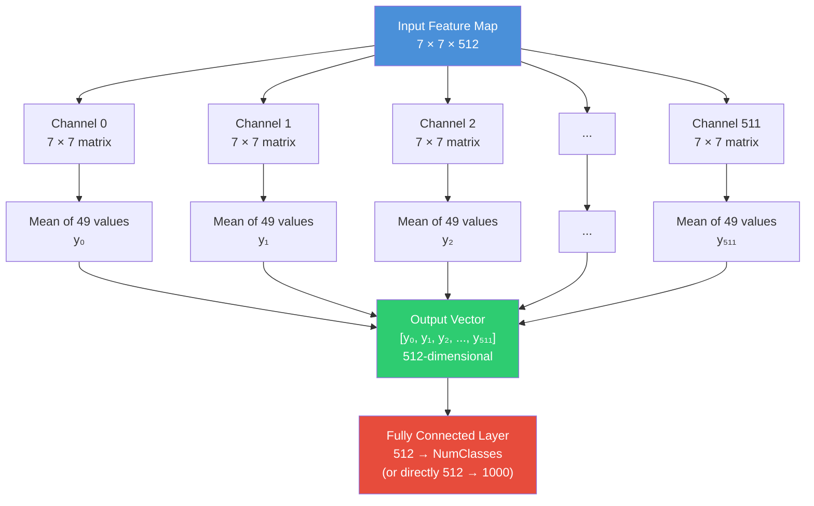
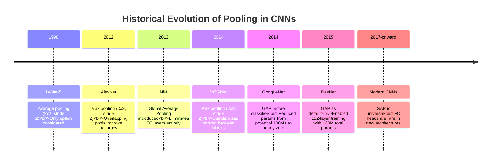
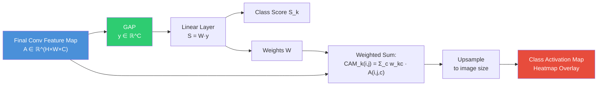

# 6. Advanced Pooling Mechanisms and Global Average Pooling

## Introduction

Pooling layers are among the most philosophically important components in convolutional neural networks, yet they are often glossed over as a simple "downsampling step." In reality, the choice of pooling mechanism profoundly influences the network's inductive bias, its parameter efficiency, its sensitivity to spatial transformations, and even its interpretability. In this section, we will dissect every pooling variant from first principles, work through detailed numerical examples, trace the historical arc from max pooling to Global Average Pooling (GAP), and demonstrate how GAP fundamentally changed the way modern CNNs are designed. By the end of this section, you will understand not just *how* each pooling operation works, but *why* each was invented and *when* to prefer one over another.

---

## 1. Average Pooling vs. Max Pooling: A Detailed Comparison

### 1.1 First Principles: What Is Pooling?

At its core, pooling is a form of **spatial aggregation**. Given a feature map of size $H \times W \times C$, a pooling operation with kernel size $k \times k$ and stride $s$ produces a downsampled feature map of size:

$$H' = \left\lfloor \frac{H - k}{s} \right\rfloor + 1, \quad W' = \left\lfloor \frac{W - k}{s} \right\rfloor + 1$$

The number of channels $C$ remains unchanged because pooling operates independently on each channel. The two fundamental aggregation functions are **max** (taking the maximum value in each pooling window) and **average** (taking the arithmetic mean of all values in each pooling window). Both reduce the spatial resolution, but they encode fundamentally different assumptions about what constitutes "important" information in a feature map.

### 1.2 Max Pooling: Worked Numerical Example

Consider a single-channel $4 \times 4$ feature map with the following values:

$$
X = \begin{bmatrix}
1 & 3 & 2 & 4 \\
5 & 6 & 1 & 2 \\
3 & 2 & 8 & 7 \\
4 & 1 & 3 & 5
\end{bmatrix}
$$

We apply **Max Pooling** with a $2 \times 2$ kernel and stride 2. This partitions the input into four non-overlapping $2 \times 2$ windows:

| Window | Positions | Values | Max |
|--------|-----------|--------|-----|
| Top-Left | (0,0),(0,1),(1,0),(1,1) | 1, 3, 5, 6 | **6** |
| Top-Right | (0,2),(0,3),(1,2),(1,3) | 2, 4, 1, 2 | **4** |
| Bottom-Left | (2,0),(2,1),(3,0),(3,1) | 3, 2, 4, 1 | **4** |
| Bottom-Right | (2,2),(2,3),(3,2),(3,3) | 8, 7, 3, 5 | **8** |

The resulting $2 \times 2$ output is:

$$
\text{MaxPool}(X) = \begin{bmatrix} 6 & 4 \\ 4 & 8 \end{bmatrix}
$$

**Key observation**: Max pooling selects the single most activated neuron in each pooling region. This means it preserves the *sharpest* features — edges, corners, and highly activated patterns — while discarding all surrounding context. The gradient during backpropagation flows only through the position of the maximum value, which means that only the neuron responsible for the maximum activation receives a gradient signal.

### 1.3 Average Pooling: Worked Numerical Example

Using the same $4 \times 4$ input matrix $X$, we now apply **Average Pooling** with a $2 \times 2$ kernel and stride 2:

| Window | Positions | Values | Average |
|--------|-----------|--------|---------|
| Top-Left | (0,0),(0,1),(1,0),(1,1) | 1, 3, 5, 6 | $(1+3+5+6)/4 = 3.75$ |
| Top-Right | (0,2),(0,3),(1,2),(1,3) | 2, 4, 1, 2 | $(2+4+1+2)/4 = 2.25$ |
| Bottom-Left | (2,0),(2,1),(3,0),(3,1) | 3, 2, 4, 1 | $(3+2+4+1)/4 = 2.50$ |
| Bottom-Right | (2,2),(2,3),(3,2),(3,3) | 8, 7, 3, 5 | $(8+7+3+5)/4 = 5.75$ |

The resulting $2 \times 2$ output is:

$$
\text{AvgPool}(X) = \begin{bmatrix} 3.75 & 2.25 \\ 2.50 & 5.75 \end{bmatrix}
$$

**Key observation**: Average pooling computes a smoothed summary of each region. It retains information about the *overall level of activation* across the entire pooling window rather than focusing on a single peak. During backpropagation, the gradient is distributed equally to all positions within the pooling window — each of the $k \times k$ positions receives $\frac{1}{k^2}$ of the upstream gradient.

### 1.4 Comparative Analysis

The difference between the two outputs is illuminating. Max pooling produced $\begin{bmatrix} 6 & 4 \\ 4 & 8 \end{bmatrix}$ while average pooling produced $\begin{bmatrix} 3.75 & 2.25 \\ 2.50 & 5.75 \end{bmatrix}$. Notice that the max-pooled output has a much wider dynamic range (values span 4 to 8) compared to the average-pooled output (values span 2.25 to 5.75). This is because max pooling amplifies the strongest activations, while average pooling dampens them toward the mean.

> [!tip] Intuition for Choosing
> Think of max pooling as asking "Is there *any* evidence of this feature in this region?" (a logical OR-like operation), while average pooling asks "How much of this feature exists on *average* in this region?" (a smoothed summary). For classification, where the mere *presence* of a feature is often more important than its spatial extent, max pooling tends to work better. For tasks requiring smooth spatial transitions (e.g., semantic segmentation, image generation), average pooling is often preferred.

### 1.5 When to Use Each

| Criterion | Max Pooling | Average Pooling |
|-----------|-------------|-----------------|
| **Preserves strongest activation** |  Yes |  No (dilutes peaks) |
| **Preserves spatial smoothness** |  No (sharp transitions) |  Yes (smooth output) |
| **Translation robustness** | Moderate (shift by < stride may change max position) | Higher (averaging is more stable under small shifts) |
| **Gradient flow** | Sparse (only max position receives gradient) | Dense (all positions receive gradient) |
| **Sensitivity to noise** | High (a noisy pixel can dominate the pool) | Low (noise is averaged out) |
| **Typical use in classification CNNs** | Intermediate layers | Global (final) layer |
| **Typical use in segmentation/generation** | Less common | Common (preserves spatial coherence) |
| **Computational cost** | Slightly cheaper (comparison only) | Slightly more (addition + division) |

> [!warning] Common Misconception
> A widespread misconception is that average pooling is "softer" and therefore always better. In practice, max pooling almost always outperforms average pooling in intermediate convolutional layers of classification networks. The reason is subtle but crucial: intermediate features tend to be **sparse** — most activations are near zero, and only a few locations carry meaningful signal. Averaging sparse features dilutes the signal with zeros, while max pooling selects the signal directly. Average pooling shines when features are **dense** and spatially smooth, which is typically the case in the final feature maps before the classifier.

---

## 2. Global Average Pooling (GAP): The Complete Mechanism

### 2.1 The Problem GAP Solves

Traditional CNN architectures (AlexNet, VGG) ended their convolutional stacks with a feature map of spatial dimensions $7 \times 7$ (or similar) and then **flattened** this into a 1D vector, which was fed into one or more fully connected (FC) layers. For VGG-16, the final conv feature map is $7 \times 7 \times 512 = 25{,}088$ values, and the first FC layer has $25{,}088 \times 4{,}096 = 102{,}760{,}448$ parameters — over **103 million** parameters just in this single layer. This creates three severe problems:

1. **Massive parameter count** leads to huge memory requirements, slow training, and severe overfitting risk.
2. **Loss of spatial structure**: Flattening destroys the 2D spatial arrangement of features, forcing the FC layer to relearn spatial relationships.
3. **Fixed input size**: The FC layer requires a specific input dimension, which means the network can only accept images of a fixed size (e.g., $224 \times 224$).

Global Average Pooling eliminates all three problems simultaneously with a single, elegant operation.

### 2.2 The GAP Operation: Step by Step

Given a feature map tensor of shape $H \times W \times C$ (height $\times$ width $\times$ channels), Global Average Pooling computes the **spatial average** of each channel independently, producing a $C$-dimensional vector. Formally, for channel $c$:

$$y_c = \frac{1}{H \times W} \sum_{i=1}^{H} \sum_{j=1}^{W} X_{i,j,c}$$

The output is a vector $\mathbf{y} \in \mathbb{R}^C$, where each element $y_c$ is the mean activation of channel $c$ across all spatial positions.

### 2.3 Worked Example: 7×7×512 → 512

Let us trace GAP through a concrete, step-by-step example with a $7 \times 7 \times 512$ tensor (the final convolutional output of VGG-16, ResNet, etc.):

**Input**: Tensor $X$ of shape $7 \times 7 \times 512$. This means there are 512 channels, each of spatial size $7 \times 7$.

**Step 1 — Extract a single channel**: Consider channel $c = 0$. This is a $7 \times 7$ matrix:

$$
X^{(0)} = \begin{bmatrix}
x_{1,1}^{(0)} & x_{1,2}^{(0)} & \cdots & x_{1,7}^{(0)} \\
x_{2,1}^{(0)} & x_{2,2}^{(0)} & \cdots & x_{2,7}^{(0)} \\
\vdots & \vdots & \ddots & \vdots \\
x_{7,1}^{(0)} & x_{7,2}^{(0)} & \cdots & x_{7,7}^{(0)}
\end{bmatrix}
$$

**Step 2 — Compute the spatial average**: Sum all 49 values and divide by 49:

$$y_0 = \frac{1}{49} \sum_{i=1}^{7} \sum_{j=1}^{7} x_{i,j}^{(0)}$$

**Step 3 — Repeat for all 512 channels**: Each channel $c \in \{0, 1, \ldots, 511\}$ produces a single scalar $y_c$, yielding a 512-dimensional vector:

$$\mathbf{y} = [y_0, \, y_1, \, y_2, \, \ldots, \, y_{511}] \in \mathbb{R}^{512}$$

**Output**: A 512-dimensional vector that summarizes the presence of each of the 512 feature patterns across the entire spatial extent of the input.

### 2.4 Mermaid Diagram: GAP Data Flow



---

## 3. Why GAP Is Revolutionary

### 3.1 Zero Parameters vs. VGG16's 100M+ FC Parameters

The most immediately striking property of GAP is that it has **zero learnable parameters**. It is a fixed mathematical operation (mean computation) that requires no training, no weight matrices, and no bias vectors. To appreciate the magnitude of this, consider the parameter counts in VGG-16's classifier:

| Layer | Input Dim | Output Dim | Parameters |
|-------|-----------|------------|------------|
| FC-1 | 25,088 | 4,096 | $25{,}088 \times 4{,}096 + 4{,}096 = 102{,}764{,}544$ |
| FC-2 | 4,096 | 4,096 | $4{,}096 \times 4{,}096 + 4{,}096 = 16{,}781{,}312$ |
| FC-3 | 4,096 | 1,000 | $4{,}096 \times 1{,}000 + 1{,}000 = 4{,}097{,}000$ |
| **Total classifier** | | | **~123.6M** |

The classifier alone contains over **123 million parameters** — roughly 90% of VGG-16's total 138M parameters. By replacing the three FC layers with GAP followed by a single linear layer ($512 \times 1{,}000 + 1{,}000 = 513{,}000$ parameters), we reduce the classifier from 123.6M to 0.513M parameters — a reduction of over **99.5%**.

> [!info] Parameter Reduction Impact
> This isn't merely an academic exercise in parameter counting. Fewer parameters means: (1) dramatically less GPU memory for storing weights and their gradients, (2) much faster forward and backward passes, (3) significantly reduced overfitting risk, especially on small datasets, and (4) the possibility of training effective models on resource-constrained hardware (mobile phones, embedded systems).

### 3.2 Spatial Translation Invariance

GAP enforces a strong form of **spatial translation invariance** by construction. Because the output of GAP is the average over all spatial positions, the exact location of a feature within the feature map does not matter — only its average strength matters. This is a desirable property for image classification, where a cat is a cat regardless of whether it appears in the top-left or bottom-right corner of the image.

To see this formally, suppose a feature pattern activates strongly at a single spatial location $(i^*, j^*)$ in channel $c$, with activation value $A$, and all other positions in that channel have near-zero activation. Then:

$$y_c = \frac{1}{H \times W} \cdot A + \frac{1}{H \times W} \sum_{(i,j) \neq (i^*,j^*)} x_{i,j,c} \approx \frac{A}{H \times W}$$

The output $y_c$ depends on the strength $A$ of the activation but **not** on the position $(i^*, j^*)$. Moving the feature to a different location does not change $y_c$ at all (assuming the rest of the map stays near zero). This is in stark contrast to FC layers, where moving a feature to a different position completely changes which weights it multiplies, often leading to a completely different output.

### 3.3 Variable Input Sizes

Because GAP computes a spatial average over **whatever spatial dimensions are present**, it imposes no constraint on the input spatial size. An FC layer requires a fixed-size input because its weight matrix has a specific number of rows. GAP, however, happily accepts any spatial size:

- Input $7 \times 7 \times 512$ → GAP → $1 \times 1 \times 512$ → 512-d vector
- Input $14 \times 14 \times 512$ → GAP → $1 \times 1 \times 512$ → 512-d vector
- Input $32 \times 32 \times 512$ → GAP → $1 \times 1 \times 512$ → 512-d vector
- Input $N \times N \times 512$ → GAP → $1 \times 1 \times 512$ → 512-d vector

The output is always the same 512-dimensional vector regardless of the spatial resolution. This enables **multi-scale inference**: the same network can process images of different sizes without modification. This property is invaluable for object detection frameworks like Faster R-CNN and YOLO, where feature maps from different resolution levels are pooled to a fixed size using ROI pooling (a variant of adaptive average pooling).

> [!tip] Practical Multi-Scale Inference
> If you feed a higher-resolution image into a GAP-based network, the convolutional feature maps will be larger, but GAP will still produce a 512-d vector. The higher-resolution feature maps actually contain **more spatial detail**, so the averaged result tends to be more informative. This is why many practitioners evaluate their models at multiple resolutions and ensemble the predictions — it costs nothing architecturally when using GAP.

---

## 4. Historical Context: From NiN to ResNet

### 4.1 Network in Network (NiN, 2013)

Global Average Pooling was first proposed by Min Lin, Qiang Chen, and Shuicheng Yan in their 2013 paper **"Network In Network"** (ICLR 2014). The key insight of NiN was that fully connected layers at the end of a CNN act as a black box that is prone to overfitting and difficult to interpret. Lin et al. argued that each channel of the final convolutional feature map should correspond to a particular category, and that the spatial average of that channel should directly serve as the confidence score for that category.

In NiN's design, the final convolutional layer produces $C$ feature maps (where $C$ is the number of classes), and GAP directly produces the $C$-dimensional logit vector — no FC layer is needed at all. This was a radical departure from the AlexNet paradigm and introduced the philosophical principle that **feature maps should be interpretable as category detectors**.

### 4.2 ResNet (2015) Adopts GAP

When Kaiming He et al. designed ResNet for the ILSVRC 2015 competition, they adopted GAP as the default pooling strategy before the final linear classifier. This was a critical design decision for several reasons:

1. **Parameter efficiency**: ResNet-152 has hundreds of layers but only ~60M total parameters — far fewer than VGG-16's 138M — largely because GAP eliminates the massive FC layers.
2. **Training stability**: With skip connections enabling very deep networks, the reduced parameter count from GAP helped stabilize training by reducing the number of parameters that needed to be carefully initialized and regularized.
3. **Variable resolution**: The ability to handle variable input sizes was useful for ResNet's role as a feature extractor in downstream tasks like detection and segmentation.



---

## 5. GAP vs. Global Max Pooling

### 5.1 Global Max Pooling Defined

Global Max Pooling (GMP) is the natural counterpart to GAP: instead of averaging all spatial positions, it takes the maximum. For channel $c$:

$$y_c^{\text{GMP}} = \max_{i,j} \, X_{i,j,c}$$

### 5.2 Detailed Comparison

| Property | Global Average Pooling | Global Max Pooling |
|----------|----------------------|-------------------|
| **Aggregation** | Mean over all positions | Maximum over all positions |
| **Output formula** | $y_c = \frac{1}{HW}\sum_{i,j} X_{i,j,c}$ | $y_c = \max_{i,j} X_{i,j,c}$ |
| **Sensitivity to outliers** | Low (averaging dilutes) | High (single outlier dominates) |
| **Gradient distribution** | Uniform: $\frac{\partial y_c}{\partial X_{i,j,c}} = \frac{1}{HW}$ for all $(i,j)$ | Sparse: $\frac{\partial y_c}{\partial X_{i,j,c}} = 1$ only at argmax, 0 elsewhere |
| **Feature interpretation** | Measures *overall presence* of a feature | Measures *peak presence* of a feature |
| **Noise robustness** | Better (noise averaged out) | Worse (noisy peak can dominate) |
| **Common usage** | Classification (ResNet, DenseNet, etc.) | Sometimes used in attention mechanisms, key-point detection |

### 5.3 When GMP Might Be Preferred

GMP is preferred in scenarios where the **most prominent instance** of a feature matters more than its average prevalence. For example, in object detection, if a feature map channel detects "wheel," we care whether there exists *any* wheel in the image — the single strongest detection — rather than the average wheel-ness across the image. Similarly, in attention mechanisms, GMP is sometimes used to extract the most salient spatial location for each channel.

> [!warning] GMP's Gradient Problem
> Because GMP routes the gradient only to the position of the maximum, it can lead to extremely sparse gradient flow during backpropagation. In deep networks, this sparsity can slow down or destabilize training, especially when multiple channels all attend to the same spatial location. GAP, by distributing gradients uniformly, provides a more stable training signal across all spatial positions.

---

## 6. How GAP Enables Class Activation Maps (CAM)

### 6.1 The Core Idea

One of the most impactful consequences of GAP is that it makes CNNs **interpretable**. In the paper "Learning Deep Features for Discriminative Localization" (Zhou et al., CVPR 2016), the authors showed that the combination of GAP + a linear classifier directly enables the generation of **Class Activation Maps (CAM)** — spatial heatmaps showing which regions of the input image are most important for a given classification decision.

### 6.2 Mathematical Derivation

Consider a CNN that uses GAP followed by a linear (softmax) layer. Let the final convolutional feature map be $A \in \mathbb{R}^{H \times W \times C}$ (before GAP), the GAP output be $\mathbf{y} \in \mathbb{R}^C$, and the final class score for class $k$ be:

$$S_k = \sum_{c=1}^{C} w_{k,c} \cdot y_c = \sum_{c=1}^{C} w_{k,c} \cdot \frac{1}{H \times W} \sum_{i=1}^{H} \sum_{j=1}^{W} A_{i,j,c}$$

Rearranging the order of summation:

$$S_k = \frac{1}{H \times W} \sum_{i=1}^{H} \sum_{j=1}^{W} \underbrace{\left( \sum_{c=1}^{C} w_{k,c} \cdot A_{i,j,c} \right)}_{\text{Class Activation Map at position } (i,j)}$$

The inner sum $\text{CAM}_k(i,j) = \sum_{c=1}^{C} w_{k,c} \cdot A_{i,j,c}$ defines a spatial map that tells us exactly how much each spatial position $(i,j)$ contributes to the class score $S_k$. Upsampling this $H \times W$ map to the original image resolution and overlaying it produces the class activation heatmap.

### 6.3 Why This Only Works with GAP

This derivation critically relies on the **linear** relationship between the spatial feature map values and the class scores. GAP provides this linearity because it is a simple average (a linear operation). If we used FC layers instead, the class score would involve products of weights with *specific positions* in the flattened feature map, making it impossible to map the contribution back to a coherent spatial location. The spatial structure destroyed by flattening cannot be recovered.



> [!tip] From CAM to Grad-CAM
> The original CAM approach requires modifying the network architecture (GAP + linear). Grad-CAM (Selvaraju et al., 2017) generalized this to **any** architecture by using the gradients flowing into the final convolutional layer as weights: $\alpha_k^c = \frac{1}{Z}\sum_i\sum_j \frac{\partial S_k}{\partial A_{i,j,c}}$. This is essentially computing the importance of each channel for class $k$ via gradient averaging — which is itself a form of global average pooling on the gradient map.

---

## 7. Complete PyTorch Implementation

### 7.1 Basic GAP Usage

```python
import torch
import torch.nn as nn

# ============================================================
# Global Average Pooling using nn.AdaptiveAvgPool2d
# ============================================================
# nn.AdaptiveAvgPool2d(output_size) automatically computes
# the kernel size and stride needed to produce the desired
# output spatial dimensions, regardless of input size.
# output_size=(1,1) means we want a 1x1 spatial output,
# which is equivalent to global average pooling.
# ============================================================

gap = nn.AdaptiveAvgPool2d(1)  # Output will be (N, C, 1, 1)

# --- Example 1: Standard 7x7x512 input (like ResNet) ---
x1 = torch.randn(1, 512, 7, 7)       # Batch of 1, 512 channels, 7x7 spatial
out1 = gap(x1)                         # Shape: (1, 512, 1, 1)
print(f"Input shape: {x1.shape}")      # torch.Size([1, 512, 7, 7])
print(f"Output shape: {out1.shape}")   # torch.Size([1, 512, 1, 1])

# --- Example 2: Variable input size (14x14) ---
x2 = torch.randn(1, 512, 14, 14)      # Different spatial size
out2 = gap(x2)                          # Still (1, 512, 1, 1)
print(f"Input shape: {x2.shape}")      # torch.Size([1, 512, 14, 14])
print(f"Output shape: {out2.shape}")   # torch.Size([1, 512, 1, 1])

# --- Remove spatial dimensions: (N, C, 1, 1) → (N, C) ---
# We use squeeze or flatten to go from (N, C, 1, 1) to (N, C)
flat1 = out1.squeeze(-1).squeeze(-1)   # Shape: (1, 512)
flat2 = torch.flatten(out1, 1)          # Equivalent: (1, 512)
```

### 7.2 Replacing Flatten + FC with GAP + Linear

```python
import torch
import torch.nn as nn

# ============================================================
# OLD APPROACH: Flatten + FC (VGG-style)
# ============================================================
class VGGStyleClassifier(nn.Module):
    """VGG-style classifier with Flatten + 3 FC layers.
    
    This approach has ~123.6M parameters in the classifier alone
    and requires a fixed 7x7 spatial input.
    """
    def __init__(self, num_classes=1000):
        super().__init__()
        # Convolutional feature extractor (simplified)
        # Produces feature maps of shape (N, 512, 7, 7)
        self.features = nn.Sequential(
            nn.Conv2d(3, 64, 3, padding=1),
            nn.ReLU(inplace=True),
            nn.MaxPool2d(2, 2),
            nn.Conv2d(64, 128, 3, padding=1),
            nn.ReLU(inplace=True),
            nn.MaxPool2d(2, 2),
            nn.Conv2d(128, 256, 3, padding=1),
            nn.ReLU(inplace=True),
            nn.MaxPool2d(2, 2),
            nn.Conv2d(256, 512, 3, padding=1),
            nn.ReLU(inplace=True),
            nn.MaxPool2d(2, 2),
            # Output: (N, 512, 14, 14) for 224x224 input
        )
        
        # PROBLEM: Flatten destroys spatial structure
        # and requires fixed input size (7*7*512 = 25088)
        self.classifier = nn.Sequential(
            nn.Flatten(),                  # (N, 512, H, W) → (N, 512*H*W)
            nn.Linear(512 * 7 * 7, 4096), # 25,088 * 4,096 = 102.7M params!
            nn.ReLU(inplace=True),
            nn.Dropout(0.5),
            nn.Linear(4096, 4096),         # 4,096 * 4,096 = 16.8M params
            nn.ReLU(inplace=True),
            nn.Dropout(0.5),
            nn.Linear(4096, num_classes),  # 4,096 * 1,000 = 4.1M params
        )
    
    def forward(self, x):
        x = self.features(x)      # (N, 512, 7, 7)
        x = self.classifier(x)    # (N, 1000)
        return x


# ============================================================
# NEW APPROACH: GAP + Single Linear (ResNet-style)
# ============================================================
class GAPClassifier(nn.Module):
    """Modern classifier with GAP + single linear layer.
    
    This approach has only ~513K parameters in the classifier
    and accepts VARIABLE input spatial sizes.
    """
    def __init__(self, num_classes=1000):
        super().__init__()
        # Same convolutional feature extractor
        self.features = nn.Sequential(
            nn.Conv2d(3, 64, 3, padding=1),
            nn.ReLU(inplace=True),
            nn.MaxPool2d(2, 2),
            nn.Conv2d(64, 128, 3, padding=1),
            nn.ReLU(inplace=True),
            nn.MaxPool2d(2, 2),
            nn.Conv2d(128, 256, 3, padding=1),
            nn.ReLU(inplace=True),
            nn.MaxPool2d(2, 2),
            nn.Conv2d(256, 512, 3, padding=1),
            nn.ReLU(inplace=True),
            nn.MaxPool2d(2, 2),
        )
        
        # SOLUTION: GAP replaces Flatten + all FC layers
        self.gap = nn.AdaptiveAvgPool2d(1)  # (N, 512, H, W) → (N, 512, 1, 1)
        self.fc = nn.Linear(512, num_classes)  # Only 512 * 1000 + 1000 = 513K params
    
    def forward(self, x):
        x = self.features(x)   # (N, 512, H, W) — H,W can vary!
        x = self.gap(x)        # (N, 512, 1, 1) — always same output
        x = torch.flatten(x, 1)  # (N, 512)
        x = self.fc(x)         # (N, num_classes)
        return x


# ============================================================
# Compare parameter counts
# ============================================================
vgg_model = VGGStyleClassifier()
gap_model = GAPClassifier()

vgg_params = sum(p.numel() for p in vgg_model.classifier.parameters())
gap_params = sum(p.numel() for p in gap_model.fc.parameters())

print(f"VGG-style classifier params: {vgg_params:,}")  # ~123.6M
print(f"GAP-style classifier params:  {gap_params:,}")  # ~513K
print(f"Reduction factor: {vgg_params / gap_params:.0f}x")  # ~241x fewer!

# ============================================================
# Demonstrate variable input size capability
# ============================================================
gap_model.eval()
with torch.no_grad():
    # Standard 224x224 input
    out_224 = gap_model(torch.randn(1, 3, 224, 224))
    print(f"224x224 → {out_224.shape}")  # (1, 1000)
    
    # Larger 448x448 input — same model, no modification needed!
    out_448 = gap_model(torch.randn(1, 3, 448, 448))
    print(f"448x448 → {out_448.shape}")  # (1, 1000)
    
    # Smaller 112x112 input — still works!
    out_112 = gap_model(torch.randn(1, 3, 112, 112))
    print(f"112x112 → {out_112.shape}")  # (1, 1000)
```

### 7.3 Implementing Class Activation Maps in PyTorch

```python
import torch
import torch.nn as nn
import torch.nn.functional as F

class CAMModel(nn.Module):
    """CNN with GAP that supports Class Activation Map generation.
    
    The GAP layer is essential for CAM because it maintains a linear
    relationship between spatial features and class scores, allowing
    us to project class-specific weights back onto the spatial
    feature map.
    """
    def __init__(self, num_classes=10):
        super().__init__()
        # Feature extractor: outputs (N, 512, H, W)
        self.features = nn.Sequential(
            nn.Conv2d(3, 64, 3, padding=1), nn.ReLU(),
            nn.MaxPool2d(2, 2),
            nn.Conv2d(64, 128, 3, padding=1), nn.ReLU(),
            nn.MaxPool2d(2, 2),
            nn.Conv2d(128, 256, 3, padding=1), nn.ReLU(),
            nn.MaxPool2d(2, 2),
            nn.Conv2d(256, 512, 3, padding=1), nn.ReLU(),
            nn.MaxPool2d(2, 2),
        )
        
        # GAP + Linear classifier
        self.gap = nn.AdaptiveAvgPool2d(1)
        self.fc = nn.Linear(512, num_classes)
    
    def forward(self, x):
        # Store the final conv feature map for CAM computation
        self.feature_maps = self.features(x)   # (N, 512, H, W)
        gap_out = self.gap(self.feature_maps)  # (N, 512, 1, 1)
        gap_flat = torch.flatten(gap_out, 1)   # (N, 512)
        logits = self.fc(gap_flat)              # (N, num_classes)
        return logits
    
    def get_cam(self, class_idx):
        """Generate Class Activation Map for a specific class.
        
        CAM_k(i,j) = Σ_c w_{k,c} * A(i,j,c)
        
        where w_{k,c} are the FC weights for class k and channel c,
        and A(i,j,c) are the final conv feature map activations.
        
        Args:
            class_idx: Index of the target class (int)
        
        Returns:
            cam: Class activation map of shape (H, W), normalized to [0,1]
        """
        # Get FC weights for the target class: shape (512,)
        weights = self.fc.weight[class_idx]  # (512,)
        
        # Get stored feature maps: shape (512, H, W)
        feature_maps = self.feature_maps.squeeze(0)  # Remove batch dim
        
        # Compute weighted sum: CAM(i,j) = Σ_c w_c * A(i,j,c)
        # weights: (512,), feature_maps: (512, H, W)
        # We use einsum for clarity: multiply each channel by its weight
        cam = torch.einsum('c,chw->hw', weights, feature_maps)
        
        # Apply ReLU (only positive contributions indicate presence)
        cam = F.relu(cam)
        
        # Normalize to [0, 1] for visualization
        if cam.max() > 0:
            cam = cam / cam.max()
        
        return cam.detach().cpu().numpy()


# ============================================================
# Usage example
# ============================================================
model = CAMModel(num_classes=10)
model.eval()

# Forward pass on a sample image
sample_input = torch.randn(1, 3, 224, 224)
logits = model(sample_input)

# Generate CAM for the predicted class
predicted_class = logits.argmax(dim=1).item()
cam = model.get_cam(predicted_class)
print(f"CAM shape: {cam.shape}")  # (14, 14) — depends on feature map spatial size
print(f"CAM range: [{cam.min():.3f}, {cam.max():.3f}]")
```

---

## 8. Summary and Key Takeaways

> [!tip] The Three Pillars of GAP's Importance
> 1. **Parameter Efficiency**: GAP has zero learnable parameters, eliminating the massive FC layers that dominated early CNNs (VGG's classifier had 123M+ parameters; GAP + linear reduces this to ~500K).
> 2. **Spatial Invariance**: By averaging over all spatial positions, GAP makes the network inherently robust to the exact location of features, which is precisely the inductive bias needed for image classification.
> 3. **Variable Resolution**: GAP accepts any spatial input size, enabling multi-scale inference and freeing the network from the fixed-input-size constraint of FC layers.

> [!info] When to Use Each Pooling Type
> - **Max Pooling**: Use in intermediate convolutional blocks where features are sparse and you want to preserve the sharpest activations. This is the default choice for most classification CNNs between conv blocks.
> - **Average Pooling**: Use when you need smooth spatial downsampling, such as in segmentation decoders or when transitioning between resolution levels in U-Net-style architectures.
> - **Global Average Pooling**: Use at the end of the network, replacing the FC classifier head. This is the modern standard adopted by ResNet, DenseNet, EfficientNet, ConvNeXt, and nearly every CNN designed after 2015.
> - **Global Max Pooling**: Use sparingly, typically in attention mechanisms or when you need to detect the *strongest* instance of a feature rather than its average presence.

> [!warning] GAP Is Not a Panacea
> While GAP is excellent for classification, it has limitations. Because it averages away all spatial information, it cannot distinguish between "one large cat" and "many small cats" — both produce similar GAP outputs. For tasks requiring spatial understanding (detection, segmentation), spatial information must be preserved, and GAP should only be applied after region-wise pooling (as in ROI Align) or not at all.

---

**Related Sections**: [[5. Activation and Pooling Layers]] | [[7. Hyperparameters and Network Configuration]] | [[8. Evolution of CNN Architectures]] | [[9. VGG16 Architecture Deep Dive]]
