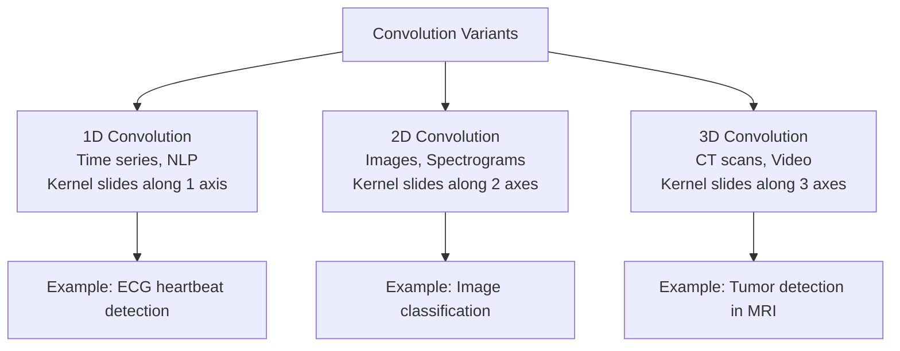
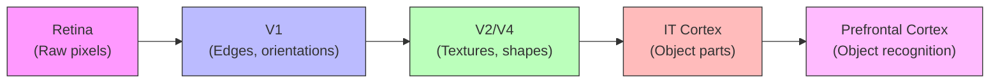
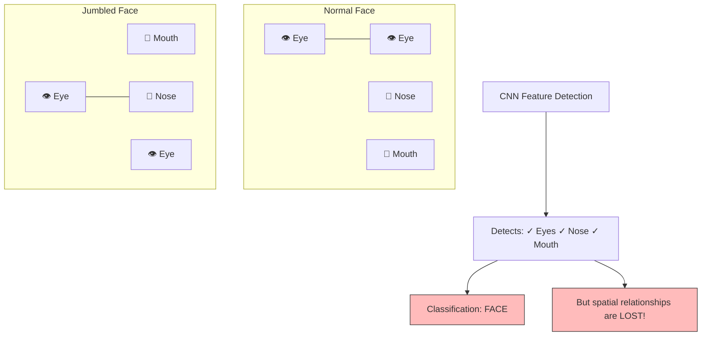

# 1. Introduction and Foundations of CNNs

## What Are Neural Networks? A Complete Foundation

Before we can understand Convolutional Neural Networks, we must first build a solid understanding of what neural networks are from the ground up. A neural network is a computational model loosely inspired by the way biological neurons in the human brain process information. At its core, a neural network is a function approximator: it takes some input, passes it through a series of mathematical transformations, and produces an output. The power of neural networks lies in their ability to learn the parameters of these transformations from data, rather than requiring a human to manually specify the rules.

### The Artificial Neuron: The Atomic Unit

The fundamental building block of every neural network is the artificial neuron, sometimes called a perceptron or a unit. An artificial neuron performs a very specific computation: it takes one or more numerical inputs, multiplies each input by a corresponding weight, sums all of these products together, adds a special number called a bias, and then passes the result through a function called an activation function. Formally, if a neuron receives inputs $x_1, x_2, \ldots, x_n$, has weights $w_1, w_2, \ldots, w_n$, and a bias $b$, its output $y$ is:

$$y = f\left(\sum_{i=1}^{n} w_i x_i + b\right) = f(\mathbf{w}^\top \mathbf{x} + b)$$

where $f$ is the activation function. Let us unpack every term here, because nothing should be left to assumption.

**Weights** ($w_i$) are learnable parameters that determine how much influence each input has on the neuron's output. A large positive weight means the corresponding input strongly excites the neuron; a large negative weight means the input strongly inhibits it; a weight near zero means the input is essentially ignored. During training, the learning algorithm adjusts these weights so that the network produces better outputs.

**Biases** ($b$) are also learnable parameters, but they serve a different role than weights. The bias shifts the entire weighted sum up or down before the activation function is applied. This is crucial because, without a bias, a neuron would always output $f(0) = 0$ when all inputs are zero, regardless of the weights. The bias gives the neuron the freedom to activate even when the inputs are zero, effectively shifting the decision boundary of the neuron. You can think of the bias as being equivalent to the intercept $b$ in the equation of a line $y = mx + b$.

**Activation functions** ($f$) introduce non-linearity into the network. Without an activation function, the neuron would simply compute a linear combination of its inputs ($\mathbf{w}^\top \mathbf{x} + b$), and no matter how many such neurons you stack, the entire network would collapse into a single linear transformation. This is a profoundly important point that we will return to in detail in Section 5, but for now understand this: non-linearity is what gives neural networks their expressive power. Common activation functions include ReLU ($f(z) = \max(0, z)$), Sigmoid ($f(z) = \frac{1}{1+e^{-z}}$), and Tanh ($f(z) = \tanh(z)$).

```python
# A single artificial neuron implemented from scratch
import numpy as np

# Define the inputs, weights, and bias
inputs = np.array([0.5, -0.3, 0.8])   # Three input values (x1, x2, x3)
weights = np.array([0.4, 0.7, -0.2])  # Three corresponding weights (w1, w2, w3)
bias = 0.1                             # A single bias term (b)

# Step 1: Compute the weighted sum: sum of (wi * xi) for all i
weighted_sum = np.dot(weights, inputs)  # This computes w1*x1 + w2*x2 + w3*x3
# weighted_sum = 0.4*0.5 + 0.7*(-0.3) + (-0.2)*0.8 = 0.20 - 0.21 - 0.16 = -0.17

# Step 2: Add the bias
z = weighted_sum + bias  # z = -0.17 + 0.1 = -0.07

# Step 3: Apply the activation function (ReLU in this case)
output = np.maximum(0, z)  # ReLU: max(0, z) = max(0, -0.07) = 0.0
print(f"Neuron output: {output}")  # Output is 0.0 because z < 0
```

### Layers: Organizing Neurons into Groups

A single neuron by itself can only learn a very simple function. To learn complex patterns, we organize neurons into layers. A layer is simply a collection of neurons that all receive the same inputs (or the outputs from the previous layer) but each have their own independent weights and biases. The most common type of layer is the fully connected layer (also called a dense layer), where every neuron in the layer is connected to every neuron in the previous layer.

A typical neural network has three types of layers:
1. **Input layer**: This is not really a "layer" of neurons; it is simply the raw input data fed into the network. If your data is a vector of 784 numbers (like a flattened 28×28 image), then your input layer has 784 "units."
2. **Hidden layers**: These are the layers between the input and the output. They are called "hidden" because their values are not directly observed — they are internal representations that the network learns. A network can have one or many hidden layers.
3. **Output layer**: The final layer that produces the network's prediction. For a binary classification problem, this might be a single neuron with a sigmoid activation (outputting a probability between 0 and 1). For a 10-class classification problem, this would be 10 neurons with a softmax activation.

### The Forward Pass

The forward pass is the process of propagating input data through the network, layer by layer, to produce an output. For a network with $L$ layers, the forward pass computes:

$$\mathbf{a}^{(0)} = \mathbf{x} \quad \text{(input)}$$
$$\mathbf{z}^{(l)} = \mathbf{W}^{(l)} \mathbf{a}^{(l-1)} + \mathbf{b}^{(l)} \quad \text{(pre-activation at layer } l\text{)}$$
$$\mathbf{a}^{(l)} = f^{(l)}(\mathbf{z}^{(l)}) \quad \text{(activation at layer } l\text{)}$$

where $\mathbf{W}^{(l)}$ is the weight matrix of layer $l$, $\mathbf{b}^{(l)}$ is the bias vector, and $f^{(l)}$ is the activation function. The output of the final layer $\mathbf{a}^{(L)}$ is the network's prediction.

### Learning via Backpropagation

A neural network's weights and biases are initially set to small random values, so the network's initial predictions are essentially random. Learning means adjusting these parameters so that the predictions improve. This is achieved through a process called backpropagation, combined with gradient descent.

The process works as follows. First, we define a loss function $\mathcal{L}$ that measures how bad the network's predictions are (for example, cross-entropy loss for classification or mean squared error for regression). Then, using the chain rule from calculus, backpropagation computes the gradient of the loss with respect to every single parameter in the network — every weight and every bias. The gradient tells us the direction and magnitude of change for each parameter that would increase the loss. By taking a small step in the opposite direction (the negative gradient), we decrease the loss:

$$\theta \leftarrow \theta - \eta \frac{\partial \mathcal{L}}{\partial \theta}$$

where $\theta$ is any parameter (weight or bias), $\eta$ is the learning rate (a small positive number like 0.001 that controls the step size), and $\frac{\partial \mathcal{L}}{\partial \theta}$ is the gradient. This process is repeated thousands or millions of times over the training data, gradually improving the network's performance.

> [!note] Why "Back"propagation?
> The name comes from the fact that the gradients are computed backwards: starting from the output layer (where the loss is computed), the error signal is propagated back through each hidden layer toward the input. This is an application of the chain rule: to compute $\frac{\partial \mathcal{L}}{\partial w_1}$, we first compute $\frac{\partial \mathcal{L}}{\partial a^{(L)}}$, then $\frac{\partial \mathcal{L}}{\partial z^{(L)}}$, then $\frac{\partial \mathcal{L}}{\partial a^{(L-1)}}$, and so on, working backward through the layers.

---

## Structured Grid Data and Why Images Are Grids of Pixels

Not all data is created equal. Some data has an inherent spatial structure — a regular, repeating arrangement where the position of each element carries meaning relative to its neighbors. This is what we call **structured grid data**. A grid is a data structure where elements are arranged in a regular pattern, typically along one or more axes, and where the relationship between neighboring elements is meaningful and consistent.

An image is the quintessential example of structured grid data. A digital image is represented as a 2D grid (for grayscale) or a 3D grid (for color) of numerical values called pixels. Each pixel stores one or more numbers representing the intensity of light at that particular location. For a grayscale image of size $H \times W$ (height × width), each pixel is a single number typically between 0 (black) and 255 (white). For a color image, each pixel is a triplet $(R, G, B)$ representing the red, green, and blue color channels, making the full image a 3D tensor of size $H \times W \times 3$.

The crucial property of image data is that pixels are not independent — a pixel at position $(i, j)$ is highly correlated with its neighbors at positions $(i\pm1, j)$, $(i, j\pm1)$, and so on. This is because natural images contain smooth regions, edges, and textures that create local statistical dependencies. A pixel in the middle of a blue sky is very likely to be surrounded by other blue pixels; a pixel on an edge is likely to have very different neighbors on one side compared to the other. This local correlation is the fundamental property that CNNs exploit.

> [!tip] The Grid Assumption
> The key assumption that makes CNNs appropriate for grid-structured data is the **locality principle**: information at one location is most relevant to information at nearby locations, and the nature of this relationship is approximately the same everywhere in the grid. This is why a single learned filter (like an edge detector) can be applied across all positions in an image — edges look like edges regardless of where they appear.

---

## The Three Dimensionalities of CNNs

Convolutional Neural Networks are not limited to 2D image data. The convolution operation can be generalized to data with different dimensional structures. The three main variants are:

### 1D Convolutions

1D convolutions operate on data arranged along a single spatial axis. The most common applications are in time-series analysis and natural language processing. In a time series, data points are arranged chronologically, and local patterns (trends, oscillations, spikes) occur along the time axis. A 1D convolution slides a 1D kernel along this time axis, detecting local temporal patterns. Similarly, in NLP, after embedding a sequence of words into vectors, a 1D convolution slides along the sequence dimension, detecting local patterns like phrases or n-grams.

**Concrete example**: Consider an electrocardiogram (ECG) signal sampled at 360 Hz. A 10-second recording is a 1D array of 3,600 values. A 1D CNN with a kernel size of 5 (covering about 14 milliseconds) can learn to detect the characteristic QRS complex waveform of a heartbeat by sliding along the time axis. The model would learn what the QRS shape looks like and detect it regardless of where in the signal it occurs — this is translation equivariance in one dimension.

### 2D Convolutions

2D convolutions are what most people think of when they hear "CNN." They operate on data arranged along two spatial axes, which is the natural structure of images. A 2D convolution slides a 2D kernel (typically 3×3 or 5×5) across both the height and width of the input, producing a 2D feature map as output. The two spatial dimensions correspond to the vertical and horizontal directions in the image.

**Concrete example**: A 224×224 RGB image (a 224×224×3 tensor) is processed by a 2D CNN. A 3×3 convolutional kernel slides across the 224×224 spatial grid, computing dot products with 3×3×3 patches of the image. This produces a 222×222 feature map (assuming stride 1, no padding) that highlights where certain local patterns (edges, corners, textures) appear in the image.

### 3D Convolutions

3D convolutions operate on data with three spatial dimensions. This is used for volumetric data such as medical imaging scans (CT, MRI), video data (where the third dimension is time), or 3D object representations. A 3D convolution slides a 3D kernel along all three axes simultaneously, detecting volumetric patterns.

**Concrete example**: A chest CT scan might be represented as a volumetric grid of size 512×512×300 (512×512 pixels per slice, 300 slices). A 3D CNN with a 3×3×3 kernel can detect 3D structures like nodules, blood vessels, or tumors that have a characteristic shape across all three spatial dimensions. Unlike processing each 2D slice independently, a 3D convolution captures the continuity of anatomical structures across slices, which is essential for accurate diagnosis.



---

## Historical Context: Hubel & Wiesel (1959)

The intellectual ancestry of Convolutional Neural Networks traces back to one of the most important experiments in neuroscience, conducted by David Hubel and Torsten Wiesel in 1959. Their work, which earned them the Nobel Prize in Physiology or Medicine in 1981, revealed fundamental principles about how the visual cortex processes information — principles that would directly inspire the architecture of CNNs decades later.

### The Experiment

Hubel and Wiesel inserted microelectrodes into the primary visual cortex (area V1) of anesthetized cats. They then projected various visual stimuli — spots of light, bars, edges, and complex patterns — onto a screen in front of the cat and recorded the electrical activity of individual neurons. The key question was: what visual stimuli cause a given neuron to fire?

### What They Found

The results were surprising and groundbreaking. They discovered that neurons in V1 do not respond to simple spots of light (as was the prevailing hypothesis). Instead, individual neurons responded selectively to specific oriented edges or bars of light at precise locations in the visual field. They identified two distinct types of neurons:

**Simple cells** respond to specific oriented edges or bars at specific positions in the visual field. A simple cell might fire strongly when a vertical bar appears in the upper-left portion of the visual field, but remain silent when the same bar appears elsewhere or when a horizontal bar appears in the same location. Simple cells have clearly defined excitatory and inhibitory regions — they are essentially performing edge detection at specific orientations and positions. If you think of them mathematically, simple cells are approximately computing a dot product between their receptive field (a small patch of the visual field) and a template pattern (an oriented edge).

**Complex cells** also respond to oriented edges and bars, but unlike simple cells, they are less sensitive to the exact position of the stimulus within their receptive field. A complex cell that responds to vertical edges will fire when a vertical edge appears anywhere within a region of the visual field, not just at one precise location. This position tolerance is a primitive form of translation invariance — the same feature is recognized regardless of where it appears, which is exactly what pooling layers in CNNs aim to achieve.

### Receptive Fields

The concept of a **receptive field** was central to Hubel and Wiesel's findings. A neuron's receptive field is the specific region of the sensory input (the visual field, in this case) that can influence that neuron's activity. Neurons in V1 have small receptive fields — they only "see" a small patch of the entire visual scene. Neurons in higher visual areas (V2, V4, IT) have progressively larger receptive fields, meaning they integrate information from increasingly large portions of the visual field.

### Hierarchical Processing

Perhaps the most profound insight from Hubel and Wiesel's work was the discovery of hierarchical processing in the visual cortex. They found that the visual system processes information in stages: early stages (V1) detect simple features like edges; intermediate stages (V2, V4) combine these edges into more complex patterns like textures, shapes, and contours; and later stages (inferotemporal cortex, IT) combine these patterns into even more complex representations like object parts and whole objects. This hierarchy — from simple, local features to complex, global features — is directly mirrored in the architecture of CNNs, where early layers learn edge detectors, middle layers learn texture and pattern detectors, and later layers learn object-part and whole-object detectors.



> [!info] From Biology to Architecture
> The direct mapping from Hubel & Wiesel's findings to CNN architecture is remarkable. Simple cells → convolutional filters (local, oriented feature detectors). Complex cells → pooling operations (position-tolerant feature detection). Hierarchical processing → deep stacks of conv+pool layers (progressively more abstract features). Kunihiko Fukushima explicitly designed his Neocognitron (1980) based on these principles, and Yann LeCun's LeNet (1989/1998) further refined this into the modern CNN architecture we use today.

---

## Why MLPs Fail for Images

Before CNNs became dominant, researchers tried to process images using standard Multi-Layer Perceptrons (MLPs) — networks composed entirely of fully connected layers. This approach failed catastrophically for several deeply interconnected reasons, each of which we will examine in detail.

### The Spatial Hierarchy Problem

Images have a natural spatial hierarchy: pixels form edges, edges form shapes, shapes form object parts, and object parts form whole objects. This hierarchical structure is critical for efficient and effective recognition. An MLP, by its very design, flattens the 2D image into a 1D vector before processing it, thereby destroying all spatial information. When you flatten a 28×28 image into a 784-dimensional vector, the network no longer "knows" that pixel (5, 10) is adjacent to pixel (5, 11) — it treats every pair of input dimensions as equally related. The MLP must then attempt to rediscover spatial relationships from scratch through its weights, which is extraordinarily wasteful and difficult.

### The Local Correlation Problem

As we discussed earlier, pixels in natural images are locally correlated — a pixel is most strongly related to its immediate neighbors, and the strength of the relationship decreases rapidly with distance. An MLP with a fully connected layer connects every input pixel to every neuron, giving equal importance to nearby pixels and distant pixels. This means the network has no built-in bias toward focusing on local patterns first. In principle, an MLP with enough neurons and training data could learn to focus on local patterns by setting the weights for distant connections to zero, but this requires the network to learn something that should be a structural prior, wasting capacity and training time.

### The Parameter Explosion Problem

This is the most devastating practical problem. Consider a modestly sized image of 224×224 pixels with 3 color channels. The total number of input values is $224 \times 224 \times 3 = 150{,}528$. If the first hidden layer has just 1,000 neurons (a very small layer by modern standards), the number of weights in just this one layer is:

$$150{,}528 \times 1{,}000 = 150{,}528{,}000 \quad \text{(over 150 million parameters!)}$$

And this is just the first layer. Add a second hidden layer of 1,000 neurons, and you need another $1{,}000 \times 1{,}000 = 1{,}000{,}000$ parameters. A deeper network with larger layers quickly balloons into billions of parameters. This has several catastrophic consequences:

1. **Memory**: Storing 150 million parameters at 32-bit precision requires about 600 MB of memory for just one layer. Training requires storing not only the parameters but also gradients, momentum terms, and activations — easily multiplying memory requirements by 4× or more.
2. **Computation**: Each forward pass through the first layer requires 150 million multiply-add operations. For training with backpropagation, the cost is even higher.
3. **Overfitting**: With 150 million free parameters and a finite training set (even a large one like ImageNet with 1.2 million images), the network has an enormous capacity to memorize the training data rather than learning generalizable patterns. This leads to poor performance on unseen data.

Now compare this to a convolutional layer. A single 3×3 convolutional filter applied to the same 224×224×3 image has only $3 \times 3 \times 3 = 27$ parameters (plus 1 bias = 28). If we use 64 such filters, the total is $64 \times 28 = 1{,}792$ parameters — **over 83,000 times fewer** than the fully connected layer! This dramatic reduction is possible because of weight sharing: each filter is applied across all spatial positions, reusing the same 27 parameters everywhere.

> [!warning] The Parameter Explosion in Numbers
> | Architecture | Layer | Parameters |
> |---|---|---|
> | MLP | FC layer: 150,528 → 1,000 | 150,528,000 |
> | CNN | Conv: 3×3, 64 filters, 3 input channels | 1,792 |
> | Ratio | — | **84,096× reduction** |
>
> This is not a minor optimization — it is the difference between a model that is tractable and one that is not.

---

## End-to-End Learning

### What It Means

End-to-end learning is a paradigm in which a single model learns to map directly from raw input data to the final desired output, without any intermediate hand-crafted processing stages. In the context of computer vision, this means the model takes raw pixels as input and directly produces class labels (or bounding boxes, or segmentation masks) as output. All the intermediate representations — edges, textures, shapes, object parts — are learned automatically from data, not designed by a human engineer.

### What It Replaces

Before end-to-end learning became practical, the standard computer vision pipeline consisted of two distinct stages:

1. **Feature engineering**: A human expert would manually design algorithms to extract meaningful features from images. These features were intended to capture the essential information while discarding irrelevant variability. Popular hand-crafted feature descriptors included:
   - **SIFT** (Scale-Invariant Feature Transform, Lowe 1999/2004): Detected keypoints in an image and computed a 128-dimensional descriptor for each keypoint that was invariant to scale, rotation, and partially invariant to illumination changes. SIFT worked by building a scale-space pyramid (using Gaussian blurs at multiple scales), detecting local extrema as keypoints, and computing orientation histograms in the local neighborhood of each keypoint.
   - **HOG** (Histogram of Oriented Gradients, Dalal & Trigggs 2005): Divided the image into small cells, computed a histogram of gradient orientations in each cell, and concatenated these histograms into a feature vector. HOG was particularly successful for pedestrian detection.
   - **SURF** (Speeded Up Robust Features, Bay et al. 2006): A faster approximation of SIFT that used Haar wavelet responses and integral images for efficient computation.

2. **Classification**: A standard machine learning classifier (SVM, Random Forest, k-NN) would then be trained on the extracted features to perform the final classification.

### Why End-to-End Is Better

The fundamental problem with the two-stage pipeline is that the feature engineering step creates a bottleneck. If the hand-crafted features do not capture the information necessary for the task, no amount of classifier tuning can compensate. The features are designed based on human intuition about what is important, but human intuition often misses the features that are truly optimal for the task. End-to-end learning eliminates this bottleneck by allowing the model to discover its own optimal features. The features learned by deep CNNs are often completely unlike anything a human would design — they might combine color, texture, and shape information in ways that are mathematically optimal for the task but unintelligible to a human observer.

Furthermore, hand-crafted features are typically designed for a specific domain (e.g., SIFT for interest point matching, HOG for pedestrian detection) and do not generalize well to other tasks. End-to-end learned features, by contrast, are automatically tailored to the specific task and dataset, and they can be transferred to related tasks through fine-tuning (a concept we will explore in the context of transfer learning).

> [!tip] The Performance Gap
> The watershed moment for end-to-end learning was the ImageNet Large Scale Visual Recognition Challenge (ILSVRC) 2012. AlexNet, a deep CNN trained end-to-end, achieved a top-5 error rate of 15.3%, compared to 26.2% for the best non-deep-learning method (which used SIFT features with Fisher Vector encoding). This 10.9 percentage point gap stunned the computer vision community and catalyzed the rapid adoption of deep learning.

---

## Advantages and Limitations of CNNs

| Advantage | Detailed Explanation |
|---|---|
| **Translation Equivariance** | A CNN produces the same feature response regardless of where a pattern appears in the image. If an edge appears in the top-left corner, the same filter will detect it as if it appeared in the bottom-right corner. This is not translation *invariance* (that comes from pooling), but translation *equivariance*: if the input shifts, the output shifts correspondingly. This property dramatically reduces the number of training examples needed, because the network does not need to see each pattern at every possible location. |
| **Parameter Efficiency** | Due to weight sharing and local connectivity, CNNs use orders of magnitude fewer parameters than equivalent MLPs. As we computed above, a single convolutional layer might use 1,792 parameters where an equivalent fully connected layer would need 150 million. This efficiency enables training on large images with limited computational resources and reduces overfitting. |
| **Hierarchical Feature Learning** | CNNs automatically learn a hierarchy of features from low-level (edges, corners) to mid-level (textures, patterns) to high-level (object parts, objects). This mirrors the hierarchical processing observed in the human visual cortex and is highly effective for visual recognition. Each layer builds upon the features extracted by the previous layer, creating increasingly abstract and powerful representations. |
| **End-to-End Training** | CNNs can be trained directly from raw pixels to final predictions, eliminating the need for manual feature engineering. This not only saves development time but also allows the model to discover features that are optimal for the specific task — features that a human engineer might never think to design. |
| **Transferability** | Features learned by CNNs on large datasets (especially early layers that detect edges and textures) transfer well to other visual tasks. A model pre-trained on ImageNet can be fine-tuned on a much smaller medical imaging dataset with excellent results, leveraging the general-purpose visual features learned from the large dataset. |

| Limitation | Detailed Explanation |
|---|---|
| **Loss of Spatial Precision** | Pooling layers and strided convolutions progressively reduce the spatial resolution of feature maps, discarding precise location information. While this provides translation invariance, it makes it difficult for the network to determine exactly where a feature is located. This is particularly problematic for tasks requiring precise localization, such as object detection and semantic segmentation. |
| **The Spatial Context Problem** | CNNs are excellent at detecting the *presence* of features but poor at understanding the *spatial relationships* between features. A CNN can detect two eyes, a nose, and a mouth, but it cannot easily verify that the eyes are above the nose and the nose is above the mouth. This means a CNN might classify a jumbled face (with features rearranged) the same as a normal face. We discuss this in more detail below. |
| **Sensitivity to Rotation and Scale** | Standard CNNs are not inherently invariant to rotation or scale changes. An object photographed from a different angle or at a different distance may not be recognized. While data augmentation (randomly rotating and scaling training images) partially addresses this, it is a workaround rather than a fundamental solution. Specialized architectures like Group Equivariant CNNs and Spatial Transformer Networks attempt to build in these invariances more directly. |
| **Fixed Receptive Field Size** | The receptive field of a standard CNN is determined by its architecture (number of layers, kernel sizes, strides) and is fixed once the architecture is set. This means the network cannot dynamically adjust its receptive field based on the content of the image — it cannot "zoom in" on fine details or "zoom out" for global context as needed. This is in contrast to attention mechanisms, which can dynamically focus on different parts of the input. |
| **Computational Cost** | Despite their parameter efficiency, CNNs can be computationally expensive due to the sheer number of arithmetic operations involved in convolution, especially on high-resolution images. A single forward pass through a modern CNN like ResNet-152 requires billions of floating-point operations, making real-time inference on edge devices challenging without optimization techniques like quantization, pruning, or knowledge distillation. |

---

## The Spatial Context Problem

One of the most significant limitations of standard CNNs is their difficulty in capturing spatial relationships between detected features. To understand this problem concretely, consider the task of face recognition. A face consists of several key features: two eyes, a nose, and a mouth. A CNN will learn to detect each of these features independently through its convolutional filters and pooling layers. However, the pooling and fully connected layers that aggregate these features do not explicitly encode the spatial relationships between them.

Consider a thought experiment: take a photograph of a face and rearrange the features so that the mouth is at the top, the eyes are at the bottom, and the nose is sideways. A human would immediately recognize this as not a face — the spatial relationships are wrong. But a standard CNN, having detected the presence of "eye-like" features, "nose-like" features, and "mouth-like" features, might still classify the rearranged image as a face, because the spatial arrangement information has been progressively discarded through pooling operations.

This problem arises because pooling layers provide translation invariance by discarding precise positional information. Max pooling, for instance, tells you that a feature was present somewhere within a pooling region, but not exactly where. After several pooling layers, the network knows *what* features are present but has only a rough idea of *where* they are relative to each other.



---

## Modern Solutions to the Spatial Context Problem

### Data Augmentation

Data augmentation is the simplest and most widely used technique for addressing the spatial context problem (and many other limitations of CNNs). The idea is to artificially expand the training dataset by applying random transformations to the training images, including random crops, rotations, flips, color jittering, and elastic deformations. By training on augmented data, the CNN sees objects in many different configurations, positions, and scales, and learns to be more robust to these variations.

While data augmentation does not fundamentally solve the spatial context problem — the network still cannot explicitly reason about spatial relationships — it does help by ensuring that the network sees enough variation in spatial arrangements during training that it learns more robust feature combinations. For example, by randomly cropping different parts of the face during training, the network learns that the exact position of the eyes relative to the edge of the image is not important, but the relative position of the eyes to the nose is.

### Attention Mechanisms and Vision Transformers (ViT)

Attention mechanisms provide a more fundamental solution to the spatial context problem. The key idea is to allow the network to dynamically focus on different parts of the input and to model relationships between different spatial locations explicitly. In the context of vision, the Vision Transformer (ViT, Dosovitskiy et al. 2020) divides an image into a grid of non-overlapping patches (e.g., 16×16 pixels), embeds each patch into a vector, and then applies the standard Transformer self-attention mechanism to allow every patch to attend to every other patch.

Self-attention computes, for each pair of patches $(i, j)$, an attention weight $\alpha_{ij}$ that determines how much patch $j$ influences the representation of patch $i$. This means that if the network needs to verify that the eyes are above the nose, it can assign high attention weights between the eye patches and the nose patch, explicitly encoding their spatial relationship. Unlike CNNs, where the receptive field is determined by the architecture, attention allows the network to dynamically decide which long-range dependencies are important for each input.

However, ViTs have their own limitations: they require very large training datasets (typically hundreds of millions of images) to match CNN performance, they are computationally expensive (self-attention has quadratic complexity in the number of patches), and they lack the translation equivariance inductive bias that makes CNNs so data-efficient. Hybrid architectures that combine CNN backbones with attention layers aim to get the best of both worlds.

### Capsule Networks

Capsule Networks (CapsNets), proposed by Geoffrey Hinton in 2017, were designed specifically to address the spatial context problem. The core innovation is the **capsule**, a group of neurons whose output is not a scalar (as in a traditional neuron) but a vector. The length of the vector represents the probability that the entity (feature, object part) exists, and the direction of the vector encodes the entity's instantiation parameters — its pose, deformation, velocity, and other properties that define its precise state.

In a Capsule Network, lower-level capsules (detecting simple features) use a mechanism called **routing by agreement** to send their outputs to higher-level capsules (detecting complex features). The key idea is that if a lower-level capsule (e.g., detecting an eye) makes a prediction about the pose of a higher-level entity (e.g., a face), and this prediction agrees with the predictions from other lower-level capsules (e.g., the nose capsule and mouth capsule), then the lower-level capsules should send their outputs to the corresponding higher-level capsule. This routing by agreement mechanism naturally enforces spatial consistency: if the predicted poses of the eyes, nose, and mouth all agree on the pose of the face, the face capsule activates strongly. If they disagree (as in a jumbled face), the face capsule does not activate.

While Capsule Networks are theoretically elegant and directly address the spatial context problem, they have not yet achieved the widespread practical success of CNNs and Vision Transformers, primarily due to computational cost and difficulty in scaling to very deep architectures and large datasets.

> [!note] Summary of Solutions
> - **Data Augmentation**: Simple, practical, but does not fundamentally solve the problem.
> - **Attention/ViT**: Powerful, explicitly models all pairwise spatial relationships, but computationally expensive and data-hungry.
> - **Capsule Networks**: Theoretically principled, directly encodes spatial relationships via routing by agreement, but not yet practical at scale.
