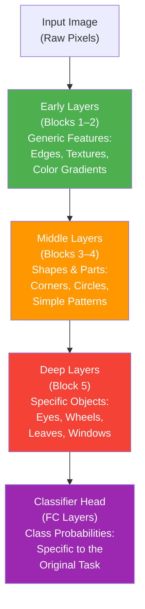
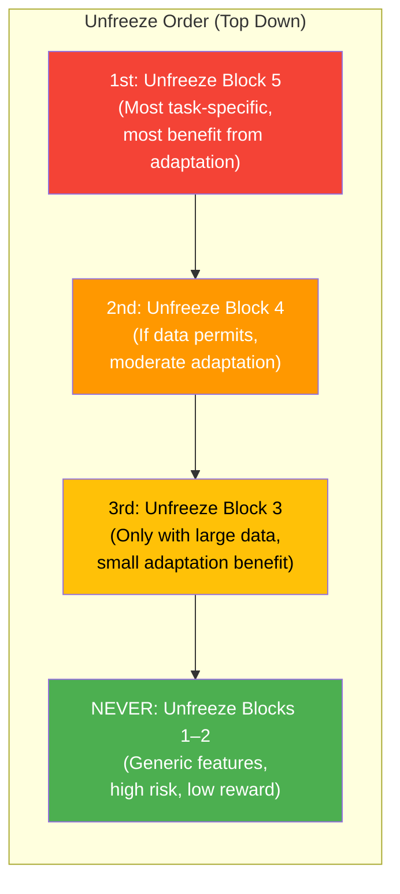

# 19. Transfer Learning and Fine-Tuning

## What Is Transfer Learning and Why Does It Exist?

Training a deep convolutional neural network from scratch is an enormously expensive endeavor. Consider the canonical example: a ResNet-50 model trained on the ImageNet dataset, which contains over 14 million images spanning 1,000 classes, requires roughly 8–10 days of continuous training on a modern GPU such as an NVIDIA V100. The computational cost involves processing billions of forward and backward passes, and the data requirements demand that you possess a labeled dataset of comparable scale and diversity. For the vast majority of practitioners—whether academic researchers, startup engineers, or hobbyists—neither the data nor the compute is available to train a competitive CNN from random initialization.

Transfer Learning is the practical solution to this fundamental bottleneck. The core idea is deceptively simple yet profoundly powerful: instead of starting from a blank slate, you begin with a model that has already learned useful representations from a large dataset (typically ImageNet), and you adapt those learned representations to your specific target task. The pre-trained model already knows how to detect edges, textures, shapes, and even complex object parts—knowledge that is broadly applicable far beyond the original ImageNet classification task. By leveraging this pre-existing knowledge, you can achieve strong performance on your target task with orders of magnitude less data and compute.

> [!tip] The Driving Analogy
> "Learning to drive a truck is faster if you already know how to drive a car." You do not need to relearn the rules of the road, the concept of a steering wheel, or the meaning of traffic lights. You only need to learn the differences—the larger turning radius, the different gear shifting, and the heavier braking distance. Transfer Learning works the same way: the network has already learned the "rules of visual recognition" (edges, textures, shapes); it only needs to learn what is specific to your new task.

---

## From Scratch vs. Transfer Learning: A Detailed Comparison

The following table lays out the practical differences between training a CNN from scratch and employing Transfer Learning. Every entry is chosen to highlight a dimension where the two approaches diverge meaningfully, so that you can make an informed decision for your own projects.

| Dimension | Training From Scratch | Transfer Learning |
|---|---|---|
| **Data Required** | Millions of labeled images (hundreds of thousands minimum per class for good generalization) | Hundreds to tens of thousands of images (sometimes as few as 100 per class) |
| **Compute Required** | Weeks on multi-GPU setups; total cost can reach thousands of dollars in cloud compute | Hours to a day on a single GPU; total cost is often under $10 in cloud compute |
| **Training Time** | Days to weeks (ResNet-50 on ImageNet: ~8 days on a V100) | Minutes to hours (fine-tuning ResNet-50 on a small dataset: ~30 minutes on a V100) |
| **Risk of Overfitting** | Lower (if data is truly massive), but hyperparameter sensitivity is high | Higher if you unfreeze too many layers with too little data, but manageable with freezing strategies |
| **Final Performance** | Can be optimal if you have unlimited data and compute | Often matches or exceeds from-scratch training when data is limited, because pre-trained features are so strong |
| **Hyperparameter Tuning** | Extensive: learning rate schedules, weight decay, augmentation, and architecture choices all need careful optimization | Minimal: usually just learning rate for the new head and optionally for fine-tuned layers |
| **Domain Specificity** | Can learn domain-specific features from the ground up (e.g., radar signatures, astronomical images) | Relies on overlap between source and target domains; performance degrades if domains are radically different |
| **Accessibility** | Requires institutional-scale resources | Accessible to anyone with a laptop and a few hundred images |

> [!warning] When Transfer Learning Can Fail
> Transfer Learning assumes that the source domain (e.g., ImageNet natural images) shares useful features with the target domain. If your target domain is radically different—such as satellite imagery, medical X-rays, spectrograms, or astronomical data—the low-level features learned from natural images may not transfer well. In such cases, you may need to unfreeze more layers (Strategy 2) or even train from scratch (Strategy 3). However, even in these scenarios, Transfer Learning often still provides a better initialization than random weights, so it is almost always worth trying first.

---

## Hierarchical Feature Learning: Why Transfer Learning Works

The reason Transfer Learning is so effective lies in the hierarchical nature of feature learning in convolutional neural networks. As data flows through successive convolutional blocks, each block extracts features of increasing abstraction and specificity. This hierarchy is not an accident—it emerges naturally from the combination of the network architecture (increasing receptive fields) and the training objective (classification loss). Understanding this hierarchy is essential for deciding which layers to freeze and which to fine-tune.

### The Four-Level Hierarchy



| Level | Layers | What They Learn | Transferability |
|---|---|---|---|
| **Level 1: Generic Features** | Early convolutional blocks (Blocks 1–2) | Edges (horizontal, vertical, diagonal), color gradients, simple textures (smooth, rough, striped) | **Extremely high** — these features are fundamental to virtually all visual recognition tasks, regardless of domain |
| **Level 2: Shapes & Parts** | Middle convolutional blocks (Blocks 3–4) | Corners, junctions, simple shapes (circles, rectangles), and mid-level patterns (repeating textures, part combinations) | **High** — most visual domains contain objects that are composed of similar mid-level shapes |
| **Level 3: Specific Objects** | Deep convolutional blocks (Block 5) | Object parts specific to the training domain (e.g., dog snouts, car wheels, bird wings on ImageNet) | **Moderate** — useful if your domain shares object categories with ImageNet; less useful for medical imaging or spectrograms |
| **Level 4: Class Probabilities** | Fully connected classifier layers | Linear combinations that map deep features to the 1,000 ImageNet class probabilities | **Zero** — entirely specific to the ImageNet classification task; must always be replaced |

> [!info] Mathematical Intuition: What Do Pre-Trained Filters Actually Detect?
> When a CNN is trained on ImageNet, its convolutional filters converge to detect specific patterns in the input image. The first-layer filters resemble Gabor filters and color blobs—they detect oriented edges and color transitions. These are fundamental properties of ALL natural images, not just ImageNet images. A vertical edge is a vertical edge whether it appears in a photograph of a dog, a satellite image of a building, or a medical scan of a bone. This is why early layers transfer so well: the statistics of natural images (the distribution of edges, textures, and gradients) are remarkably consistent across domains. Mathematically, if we denote the feature map at layer $l$ as $\mathbf{F}^{(l)}$, then:
> $$\mathbf{F}^{(l)} = \sigma\left(\mathbf{W}^{(l)} * \mathbf{F}^{(l-1)} + \mathbf{b}^{(l)}\right)$$
> The weight matrix $\mathbf{W}^{(1)}$ for early layers converges to something close to a set of Gabor filters, regardless of the specific classification task, because these filters capture the most informative low-level statistics of any natural image distribution.

---

## Strategy 1: Feature Extraction (Freeze Everything)

### The Approach

Feature Extraction is the simplest and most conservative form of Transfer Learning. You take the pre-trained convolutional base (all the convolutional and pooling layers) and treat it as a completely fixed, untrainable feature extractor. You then replace the original classifier head with a new, randomly initialized classifier that is appropriate for your target task, and you train ONLY this new classifier while keeping every parameter in the convolutional base frozen.

The key operation is "freezing": setting `requires_grad = False` for every parameter in the convolutional base. This tells PyTorch's autograd engine not to compute gradients for these parameters, which has two important consequences. First, the parameter values remain exactly as they were in the pre-trained model—they are never updated by the optimizer. Second, the training is dramatically faster and uses far less memory, because no gradients need to be stored for the frozen layers and no backward pass computation is needed through them.

### When to Use This Strategy

Feature Extraction is the right choice when all of the following conditions hold:

1. **Your target dataset is small** (typically fewer than ~1,000 images per class). With a small dataset, any attempt to update the convolutional base risks catastrophic overfitting, because you have millions of parameters and very few examples to constrain them.
2. **Your target domain is similar to ImageNet** (natural images of objects, animals, scenes). The pre-trained features are already well-suited to your task, so there is little benefit to adapting them.
3. **You have limited GPU resources**. Feature Extraction is computationally cheap because you only train a small classifier head.

> [!warning] The Risk of NOT Freezing
> If you fail to freeze the convolutional base with a small dataset, you expose millions of pre-trained parameters to gradient updates computed from just a handful of images. The optimizer will quickly overfit these parameters to the training set, destroying the useful representations that were learned from ImageNet. The result is often a model that achieves near-perfect training accuracy but catastrophically fails on validation data. This is not a subtle effect—with a dataset of a few hundred images and millions of unfrozen parameters, overfitting can happen within the first few epochs.

### Complete PyTorch Code: Feature Extraction with VGG-16

```python
# =============================================================================
# STRATEGY 1: FEATURE EXTRACTION (FREEZE EVERYTHING)
# Using VGG-16 pre-trained on ImageNet, adapting for a 5-class flower dataset
# =============================================================================

import torch                                    # Import the core PyTorch library, which provides tensor operations and automatic differentiation
import torch.nn as nn                           # Import the neural network module, which contains layer definitions (Linear, Conv2d, etc.)
import torch.optim as optim                     # Import the optimizer module, which contains SGD, Adam, and other optimizers
from torchvision import models, datasets, transforms  # Import torchvision: models for pre-trained networks, datasets for standard datasets, transforms for data augmentation

# --- Step 1: Load the pre-trained VGG-16 model ---
model = models.vgg16(pretrained=True)           # Load VGG-16 with weights pre-trained on ImageNet (1.4M images, 1000 classes)
                                                # 'pretrained=True' downloads the weights from the PyTorch Hub if not cached locally
                                                # The model has two parts: .features (convolutional base) and .classifier (FC layers)

# --- Step 2: Freeze ALL parameters in the convolutional base ---
for param in model.features.parameters():       # Iterate over every parameter tensor in model.features (the conv base)
    param.requires_grad = False                 # Set requires_grad=False so autograd does NOT compute gradients for these parameters
                                                # This means they will NOT be updated by the optimizer during training
                                                # Their values stay exactly as they were in the pre-trained model

# --- Step 3: Replace the classifier head ---
# First, let's understand the VGG-16 classifier structure:
# model.classifier is an nn.Sequential containing:
#   [0] Linear(25088, 4096)    — first fully-connected layer
#   [1] ReLU()                 — activation
#   [2] Dropout(0.5)           — regularization
#   [3] Linear(4096, 4096)     — second fully-connected layer
#   [4] ReLU()                 — activation
#   [5] Dropout(0.5)           — regularization
#   [6] Linear(4096, 1000)     — final layer: maps 4096 features to 1000 ImageNet classes
#
# We ONLY replace index [6] because:
# - Layers [0] through [5] are general-purpose feature transformation layers
#   (they convert the 25088-dimensional conv output into a 4096-dimensional embedding)
# - Layer [6] is the ONLY layer that is specific to the ImageNet 1000-class task
# - Replacing just this layer preserves the useful learned representations in layers [0]-[5]
# - If we replaced the entire classifier, we would lose the trained weights in [0] and [3]

num_classes = 5                                 # Our flower dataset has 5 classes (rose, daisy, tulip, sunflower, dandelion)
model.classifier[6] = nn.Linear(4096, num_classes)  # Replace the final Linear layer: input=4096 (from previous layer), output=5 (our classes)
                                                # This new layer has RANDOMLY INITIALIZED weights (Xavier initialization by default)
                                                # Only this layer (and layers [0]-[5] of the classifier) will be trained

# --- Step 4: Define the loss function and optimizer ---
criterion = nn.CrossEntropyLoss()               # Cross-entropy loss for multi-class classification
                                                # Combines LogSoftmax + NLLLoss internally (do NOT apply Softmax manually)

# CRITICAL: Only pass the classifier parameters to the optimizer, not the frozen features!
optimizer = optim.Adam(                         # Adam optimizer: adaptive learning rate, good default choice
    model.classifier.parameters(),              # Only the classifier parameters (including our new layer) will be updated
    lr=0.001                                    # Learning rate of 0.001 (Adam's default, works well for classifier training)
)
                                                # Note: even if we passed model.parameters(), the frozen parameters
                                                # (requires_grad=False) would not be updated, but it's cleaner and
                                                # more explicit to only pass the trainable parameters

# --- Step 5: Training loop (only the classifier head is trained) ---
device = torch.device("cuda" if torch.cuda.is_available() else "cpu")  # Use GPU if available, otherwise CPU
model = model.to(device)                        # Move the entire model (frozen features + trainable classifier) to the device

num_epochs = 10                                 # Number of passes through the entire training dataset
for epoch in range(num_epochs):                 # Loop over epochs
    model.train()                               # Set the model to training mode (affects Dropout and BatchNorm behavior)
    running_loss = 0.0                          # Accumulate the loss for this epoch for reporting
    
    for images, labels in train_loader:         # Loop over mini-batches from the training DataLoader
        images = images.to(device)              # Move input images to the same device as the model (GPU or CPU)
        labels = labels.to(device)              # Move ground-truth labels to the same device
        
        optimizer.zero_grad()                   # Clear any previously computed gradients from the last iteration
                                                # Without this, gradients would accumulate across iterations (wrong!)
        
        outputs = model(images)                 # Forward pass: images go through frozen conv base + trainable classifier
                                                # The conv base produces a 25088-dim feature vector (computed but NOT differentiated through)
                                                # The classifier maps 25088 → 4096 → 4096 → 5 (our class logits)
        
        loss = criterion(outputs, labels)       # Compute cross-entropy loss between predicted logits and true labels
        
        loss.backward()                         # Backward pass: compute gradients of loss w.r.t. all parameters with requires_grad=True
                                                # Gradients are computed ONLY for classifier parameters (features are frozen)
        
        optimizer.step()                        # Update only the classifier parameters using the computed gradients
                                                # The frozen conv base parameters remain completely unchanged
        
        running_loss += loss.item()             # Add this batch's loss to the running total (detached from computation graph)
    
    avg_loss = running_loss / len(train_loader) # Compute average loss per batch for this epoch
    print(f"Epoch {epoch+1}/{num_epochs}, Loss: {avg_loss:.4f}")  # Print epoch summary
```

> [!note] Why Replace Only Index 6 in VGG's Classifier?
> VGG-16's `classifier` attribute is an `nn.Sequential` object, which is essentially a list of layers executed in order. The structure is `[Linear(25088→4096), ReLU, Dropout, Linear(4096→4096), ReLU, Dropout, Linear(4096→1000)]`. The first two `Linear` layers (`[0]` and `[3]`) learn general-purpose feature transformations—they compress the 25,088-dimensional convolutional output into a progressively more abstract 4,096-dimensional embedding. These transformations are useful regardless of the specific classification task. Only the final `Linear` layer (`[6]`) maps the 4,096-dimensional embedding to the 1,000 ImageNet classes, which is the part that is entirely task-specific. By replacing only this layer, we retain the trained feature compression while adapting the output to our new task.

---

## Strategy 2: Fine-Tuning (Unfreeze Selectively)

### The Approach

Fine-Tuning is the middle-ground strategy: you start with the pre-trained model, replace the classifier head, and then selectively unfreeze some of the later convolutional blocks so that they can be updated during training. The key insight is that you do NOT unfreeze all layers at once or with the same learning rate. Instead, you unfreeze from the top down (later layers first) and use a much smaller learning rate for the pre-trained layers than for the newly initialized classifier head. This careful, controlled adaptation allows the model to adjust its higher-level features to your specific domain without destroying the useful low-level representations.

### When to Use This Strategy

Fine-Tuning is the right choice when:

1. **Your target dataset is medium-sized** (roughly 1,000–10,000 images per class). You have enough data to safely update some of the pre-trained parameters without severe overfitting.
2. **Your target domain is somewhat different from ImageNet** (e.g., medical imaging, satellite imagery, artwork). The pre-trained features are a good starting point, but the later layers need to adapt to the new domain.
3. **You have moderate GPU resources**. Fine-tuning is more expensive than feature extraction but far cheaper than training from scratch.

### The Critical Rule: Unfreeze From Top Down

When you decide to unfreeze layers for fine-tuning, you must always unfreeze from the top down—meaning you unfreeze the LAST convolutional block first, and only consider unfreezing earlier blocks if you have sufficient data. The reasoning is based directly on the hierarchical feature learning principle:

- **Early blocks (Blocks 1–2)** learn generic features (edges, textures, color gradients) that are useful for virtually ANY visual task. These features are robust, well-learned, and rarely need adjustment. Unfreezing them risks destabilizing the entire feature hierarchy for minimal gain.
- **Late blocks (Block 5)** learn the most task-specific features (object parts, domain-specific patterns). These are the features most likely to be mismatched between ImageNet and your target domain. They benefit the most from fine-tuning because they need to adapt to your specific data distribution.



### The Critical Learning Rate Rule: Differential Learning Rates

When fine-tuning, you must use different learning rates for different parts of the model. This technique is called **Differential Learning Rates** (or discriminative learning rates in the fast.ai community). The principle is simple but essential:

- **New classifier head**: Use a normal learning rate (e.g., $\eta = 10^{-3}$). These layers are randomly initialized and need large updates to converge.
- **Unfrozen pre-trained layers**: Use a learning rate that is 10× to 100× smaller (e.g., $\eta = 10^{-4}$ to $10^{-5}$). These layers already have good parameter values; large updates would destroy the learned representations.

The mathematical justification is straightforward. If the pre-trained weights are denoted $\mathbf{W}^*$ and they already provide a good feature representation, then the optimal update $\Delta\mathbf{W}$ should satisfy $\|\Delta\mathbf{W}\| \ll \|\mathbf{W}^*\|$ so that the useful learned structure is preserved. With a learning rate $\eta$, the update magnitude is approximately $\eta \cdot \|\nabla_{\mathbf{W}} L\|$. By using $\eta_{\text{pretrained}} = \frac{\eta_{\text{head}}}{10}$, we ensure that the updates to pre-trained layers are an order of magnitude smaller, preserving the learned features while still allowing adaptation.

> [!warning] Why Large Updates Destroy Pre-Trained Representations
> If you apply a large learning rate (e.g., $\eta = 10^{-3}$) to the pre-trained layers, the optimizer can make updates that are so large relative to the existing parameter values that the learned feature detectors are effectively destroyed. For example, if a filter has learned to detect a horizontal edge with a specific orientation tolerance, a large gradient update could rotate it to detect something completely different, losing the original useful feature. This phenomenon is sometimes called "catastrophic forgetting" of the source task, and it is the primary reason why differential learning rates are essential for successful fine-tuning.

### The Two-Step Training Trick

The most robust fine-tuning workflow uses a two-step process that separates the training of the new head from the adaptation of the pre-trained layers:

**Step 1: Freeze Everything, Train the Head**
- Freeze all pre-trained layers
- Train only the new classifier head until it converges (typically 5–10 epochs)
- This gives the classifier head a reasonable initialization before any fine-tuning begins
- Without this step, the randomly initialized head would produce large, noisy gradients that could destabilize the pre-trained layers if they were unfrozen

**Step 2: Unfreeze Top Blocks with Low LR**
- Selectively unfreeze the last 1–2 convolutional blocks
- Use differential learning rates (10×–100× smaller for pre-trained layers)
- Train for additional epochs with a low learning rate
- Optionally use a learning rate scheduler (cosine annealing or reduce-on-plateau) to gradually decrease the learning rate

### Complete PyTorch Code: Fine-Tuning with ResNet-50

```python
# =============================================================================
# STRATEGY 2: FINE-TUNING (UNFREEZE SELECTIVELY)
# Using ResNet-50 pre-trained on ImageNet, adapting for a 10-class medical dataset
# =============================================================================

import torch                                    # Core PyTorch library for tensor operations and autograd
import torch.nn as nn                           # Neural network module with layer definitions
import torch.optim as optim                     # Optimizer module (SGD, Adam, etc.)
from torchvision import models                  # Pre-trained model zoo

# --- Step 1: Load the pre-trained ResNet-50 model ---
model = models.resnet50(pretrained=True)        # Load ResNet-50 with ImageNet weights
                                                # ResNet-50 has ~25.6M parameters organized in:
                                                # - conv1 (7x7, stride 2) + bn1 + relu + maxpool
                                                # - layer1 (Bottleneck x3)  → "Block 1"
                                                # - layer2 (Bottleneck x4)  → "Block 2"  
                                                # - layer3 (Bottleneck x6)  → "Block 3"
                                                # - layer4 (Bottleneck x3)  → "Block 4" (most abstract features)
                                                # - avgpool + fc (1000 classes)

# --- Step 2: Replace the final fully-connected layer ---
num_features = model.fc.in_features             # Get the input dimension of the final FC layer (2048 for ResNet-50)
num_classes = 10                                # Our medical dataset has 10 classes
model.fc = nn.Linear(num_features, num_classes) # Replace the 1000-class FC with a 10-class FC
                                                # This new layer has randomly initialized weights

# --- Step 3: PHASE 1 — Freeze everything, train only the head ---
print("=== PHASE 1: Training classifier head only ===")

# Freeze ALL parameters in the entire model
for param in model.parameters():                # Iterate over every parameter in the entire model
    param.requires_grad = False                 # Freeze: no gradients will be computed for any parameter

# Unfreeze ONLY the new classifier head
for param in model.fc.parameters():             # Iterate over parameters in the new FC layer only
    param.requires_grad = True                  # Unfreeze: gradients WILL be computed for these parameters

# Set up optimizer with ONLY the head parameters
optimizer_phase1 = optim.Adam(                  # Adam optimizer for the head
    model.fc.parameters(),                      # Only the FC layer parameters will be updated
    lr=0.001                                    # Standard learning rate for training a new head from scratch
)

criterion = nn.CrossEntropyLoss()               # Cross-entropy loss for multi-class classification
device = torch.device("cuda" if torch.cuda.is_available() else "cpu")
model = model.to(device)

# Train Phase 1 for 10 epochs
for epoch in range(10):
    model.train()                               # Training mode (important for Dropout/BatchNorm)
    for images, labels in train_loader:
        images, labels = images.to(device), labels.to(device)  # Move data to GPU
        optimizer_phase1.zero_grad()            # Clear previous gradients
        outputs = model(images)                 # Forward pass through entire model
        loss = criterion(outputs, labels)       # Compute loss
        loss.backward()                         # Backward pass (only FC gradients computed)
        optimizer_phase1.step()                 # Update only FC parameters

print("=== PHASE 1 complete. Head is now reasonably trained. ===")

# --- Step 4: PHASE 2 — Selectively unfreeze later blocks with low LR ---
print("=== PHASE 2: Fine-tuning with unfrozen later blocks ===")

# Unfreeze layer4 (the last residual block, analogous to "Block 5" in VGG)
for param in model.layer4.parameters():         # Iterate over parameters in the last residual block
    param.requires_grad = True                  # Unfreeze: allow gradient computation and updates

# Also keep the FC layer trainable (it was unfrozen in Phase 1)
# model.fc parameters already have requires_grad=True from Phase 1

# Set up optimizer with DIFFERENTIAL LEARNING RATES using parameter groups
optimizer_phase2 = optim.Adam([                 # Adam optimizer with multiple parameter groups
    {                                           # Group 1: The new classifier head
        'params': model.fc.parameters(),        # The FC layer parameters
        'lr': 1e-3,                             # Learning rate: 0.001 (standard, same as Phase 1)
    },
    {                                           # Group 2: The unfrozen pre-trained block
        'params': model.layer4.parameters(),    # The last residual block parameters
        'lr': 1e-5,                             # Learning rate: 0.00001 (100x smaller than head!)
                                                # This ensures updates to pre-trained layers are tiny
                                                # and do not destroy the learned representations
    },
])

# Train Phase 2 for 10 more epochs with the differential LR
for epoch in range(10):
    model.train()
    for images, labels in train_loader:
        images, labels = images.to(device), labels.to(device)
        optimizer_phase2.zero_grad()
        outputs = model(images)
        loss = criterion(outputs, labels)
        loss.backward()                         # Gradients computed for both FC and layer4
        optimizer_phase2.step()                 # FC updated with lr=1e-3, layer4 updated with lr=1e-5

print("=== PHASE 2 complete. Model fine-tuned. ===")
```

---

## Strategy 3: Training From Scratch

### The Approach

Training from scratch means initializing all model parameters randomly (typically using Xavier or Kaiming initialization) and training the entire model on your target dataset without any pre-trained weights. This is the most expensive and data-hungry approach, but it is sometimes necessary when the source and target domains are so different that pre-trained features provide little or no benefit.

### When to Use This Strategy

Training from scratch is the right choice only when ALL of the following conditions hold:

1. **Your target dataset is enormous** (hundreds of thousands to millions of labeled images). Without pre-trained features, you need a massive dataset to learn all visual features from scratch, from edges up to objects.
2. **Your target domain is radically different from natural images**. Examples include radar returns, radio telescope data, seismic waveform images, or any domain where the fundamental image statistics differ drastically from photographs.
3. **You have significant compute resources** (multiple GPUs, weeks of training time).
4. **You are prepared for extensive hyperparameter tuning**. Training from scratch is far more sensitive to learning rate, weight decay, augmentation strategy, and training schedule than Transfer Learning.

> [!note] Even Radically Different Domains May Benefit From Transfer Learning
> Recent research has shown that even for domains as different as medical imaging and satellite imagery, Transfer Learning from ImageNet still provides a better initialization than random weights, even if the benefit is smaller than for natural image tasks. The reason is that even in medical images, the concept of edges, boundaries, and texture gradients still applies—the specific features are different, but the computational primitives are similar. Therefore, Strategy 3 should be a last resort, attempted only after Strategies 1 and 2 have been tried and failed.

---

## The Decision Matrix: Which Strategy to Choose

The following 4-cell matrix maps the two key variables—dataset size and domain similarity—to the recommended strategy. This is the most important practical decision guide in this entire section.

|  | **Similar to ImageNet** (Natural Images) | **Different from ImageNet** (Medical, Satellite, etc.) |
|---|---|---|
| **Small Dataset** (< 1K images/class) | **Strategy 1: Feature Extraction**. Freeze everything. The pre-trained features are already well-suited; just train a new classifier. | **Strategy 1 → Strategy 2 (gradual)**. Start with Feature Extraction. If performance is unsatisfactory, try selectively unfreezing Block 5 with a very low learning rate. |
| **Large Dataset** (> 1K images/class) | **Strategy 2: Fine-Tuning**. Unfreeze later blocks (Block 5, maybe Block 4) with differential learning rates. You have enough data to safely adapt the features. | **Strategy 2 → Strategy 3 (if needed)**. Fine-tune with multiple blocks unfrozen. If you have truly massive data (>100K images) and the domain is radically different, consider training from scratch. |

---

## Choosing Which Blocks to Unfreeze

The following table provides specific guidance on which convolutional blocks to unfreeze, based on your dataset size and domain similarity. This table applies to architectures like VGG and ResNet where the convolutional base is divided into sequential blocks of increasing abstraction.

| Block | Content | When to Unfreeze | Risk Level | Rationale |
|---|---|---|---|---|
| **Blocks 1–2** | Generic features: edges, textures, color gradients | **Almost never** | Very High | These layers learn the most fundamental visual features that are universal across domains. Unfreezing them almost always does more harm than good, because (a) the pre-trained features are already excellent, (b) the small dataset cannot provide enough signal to improve them, and (c) destabilizing these layers cascades through all subsequent layers. |
| **Blocks 3–4** | Mid-level features: shapes, parts, patterns | **Only if you have a large dataset** (> 5K images per class) | Moderate | These layers learn domain-relevant mid-level features. If your domain differs significantly from ImageNet AND you have enough data, fine-tuning these layers can improve performance. Use a very low learning rate ($\eta \leq 10^{-5}$). |
| **Block 5** | High-level features: object parts, domain-specific patterns | **Often, especially if domain differs** | Low–Moderate | These are the most task-specific layers and benefit the most from adaptation. Even with a medium-sized dataset (1K–5K images per class), fine-tuning Block 5 usually improves performance. Use a low learning rate ($\eta \approx 10^{-5}$ to $10^{-4}$). |

---

## Checking What Is Trainable: Diagnostic Code

It is critical to verify that your freezing strategy has been implemented correctly before training begins. A common bug is to accidentally freeze or unfreeze the wrong layers, leading to wasted training time. The following diagnostic code prints a summary of every parameter in the model, indicating whether it is frozen or trainable and how many parameters are in each category.

```python
# =============================================================================
# DIAGNOSTIC: CHECK WHICH PARAMETERS ARE TRAINABLE
# =============================================================================

def print_trainable_parameters(model):
    """
    Print a summary of all parameters in the model, showing which are
    frozen (requires_grad=False) and which are trainable (requires_grad=True).
    Also report the total count and percentage of trainable parameters.
    """
    trainable_params = 0                         # Counter for parameters that will be updated
    frozen_params = 0                            # Counter for parameters that are frozen
    trainable_names = []                         # List of names of trainable parameters
    frozen_names = []                            # List of names of frozen parameters
    
    for name, param in model.named_parameters(): # Iterate over ALL parameters with their names
        if param.requires_grad:                  # If this parameter requires gradient computation
            trainable_params += param.numel()    # Add the number of elements in this parameter tensor
            trainable_names.append(name)         # Record the name of this trainable parameter
        else:                                    # If this parameter is frozen
            frozen_params += param.numel()       # Add the number of elements in this parameter tensor
            frozen_names.append(name)            # Record the name of this frozen parameter
    
    total_params = trainable_params + frozen_params  # Total number of parameters in the entire model
    
    print(f"Total parameters:     {total_params:>12,}")     # Print total parameter count with comma formatting
    print(f"Trainable parameters: {trainable_params:>12,} ({100*trainable_params/total_params:.2f}%)")
    print(f"Frozen parameters:    {frozen_params:>12,} ({100*frozen_params/total_params:.2f}%)")
    
    print("\n--- Trainable parameter names (first 20) ---")
    for name in trainable_names[:20]:           # Print first 20 trainable parameter names (to avoid wall of text)
        print(f"  ✓ {name}")
    if len(trainable_names) > 20:
        print(f"  ... and {len(trainable_names) - 20} more")
    
    print("\n--- Frozen parameter names (first 10) ---")
    for name in frozen_names[:10]:              # Print first 10 frozen parameter names
        print(f"  ✗ {name}")
    if len(frozen_names) > 10:
        print(f"  ... and {len(frozen_names) - 10} more")

# Call the diagnostic function on your model BEFORE training
print_trainable_parameters(model)
```

> [!tip] Always Run This Diagnostic
> Before starting any Transfer Learning training run, always call this diagnostic function. It takes 5 seconds and can save you hours of wasted training time. The most common bugs it catches are: (1) forgetting to freeze the conv base, (2) accidentally freezing the new classifier head, and (3) unfreezing more layers than intended.

---

## Batch Normalization Considerations When Freezing

Batch Normalization (BN) layers introduce a subtle but important complication when freezing convolutional blocks. A BN layer has two types of parameters:

1. **Learnable parameters**: `weight` (gamma) and `bias` (beta), which are learned via gradient descent, just like convolutional weights.
2. **Running statistics**: `running_mean` and `running_var`, which are exponential moving averages of the batch statistics computed during training. These are NOT learned via gradient descent—they are updated by a separate mechanism during the forward pass.

When you freeze a BN layer by setting `requires_grad = False` on its weight and bias, you prevent the learnable parameters from being updated by the optimizer. However, the running statistics are NOT controlled by `requires_grad`—they are updated automatically during every forward pass in training mode. This means that even with frozen BN parameters, the running statistics will continue to be updated based on your (potentially small) target dataset, which can corrupt the well-estimated ImageNet statistics.

The solution is to set the entire model (or at least the frozen parts) to **eval mode** when you want to use the running statistics without updating them. In eval mode, BN layers use their stored `running_mean` and `running_var` for normalization AND do not update these statistics from the current batch. However, you must be careful because eval mode also disables Dropout, which you may still want active in the classifier head.

```python
# =============================================================================
# HANDLING BATCH NORMALIZATION DURING FINE-TUNING
# =============================================================================

# Option A: If you are doing Feature Extraction (Strategy 1), where the entire
# conv base is frozen and you only train the classifier head:
model.eval()                                    # Set the ENTIRE model to eval mode
                                                # This freezes BN running statistics AND disables Dropout
model.fc.train()                                # Set ONLY the classifier head back to train mode
                                                # This re-enables Dropout in the head (important for regularization)
                                                # BN in the head (if any) will also be in train mode

# Option B: If you are doing Fine-Tuning (Strategy 2), where some blocks are unfrozen:
# You need to be more surgical. Set unfrozen blocks to train mode and frozen blocks to eval mode.

# First, set everything to train mode (default after model.train())
model.train()                                   # All layers in training mode

# Then, set specific frozen modules to eval mode to prevent BN stat updates
model.eval()                                    # Start by setting everything to eval mode

# Re-enable training mode for unfrozen layers
model.fc.train()                                # Classifier head: train mode (Dropout active, BN updates stats)
model.layer4.train()                            # Unfrozen block: train mode (BN updates stats, learnable params update)

# Frozen layers (conv1, bn1, layer1, layer2, layer3) remain in eval mode
# → Their BN layers use stored running_mean/running_var and do NOT update them
# → This preserves the well-estimated ImageNet statistics in frozen blocks

# Alternative: explicitly set requires_grad for BN running statistics (PyTorch 2.x+)
# In newer PyTorch versions, you can control BN running stat tracking directly:
for module in model.modules():                  # Iterate over all modules in the model
    if isinstance(module, nn.BatchNorm2d):       # Check if this module is a BatchNorm2d layer
        if not any(p.requires_grad for p in module.parameters()):  # If ALL BN params are frozen
            module.track_running_stats = False   # Do NOT update running_mean and running_var
            module.eval()                        # Use stored statistics for normalization
```

> [!warning] The BN Trap
> If you freeze convolutional layers but forget to handle BN correctly, the BN running statistics in frozen layers will be corrupted by updates computed from your (likely small) target dataset. This can silently degrade model performance because the normalization will be incorrect—it will normalize features using statistics estimated from a few hundred images instead of the 1.4 million images used to compute the original ImageNet statistics. Always verify BN behavior when freezing layers!

---

## Complete Transfer Learning Checklist

Before starting any Transfer Learning project, work through this checklist systematically. Each item addresses a common source of error or suboptimal performance.

```markdown
### Transfer Learning Pre-Flight Checklist

1. [ ] **Choose your strategy** using the Decision Matrix above
   - Small data + similar domain → Strategy 1 (Feature Extraction)
   - Medium data + different domain → Strategy 2 (Fine-Tuning)
   - Huge data + radically different domain → Strategy 3 (From Scratch)

2. [ ] **Load the pre-trained model** with the correct weights
   - Use `models.xxx(pretrained=True)` or `models.xxx(weights=models.XXX_Weights.DEFAULT)`
   - Verify the model architecture matches what you expect (print the model)

3. [ ] **Replace the classifier head** with one matching your number of classes
   - Identify the correct layer to replace (e.g., `model.fc` for ResNet, `model.classifier[6]` for VGG)
   - Verify the input dimension matches the output of the previous layer

4. [ ] **Freeze the appropriate layers** based on your strategy
   - Strategy 1: Freeze all conv base parameters
   - Strategy 2: Freeze early blocks, unfreeze later blocks

5. [ ] **Handle Batch Normalization** in frozen layers
   - Set frozen BN layers to eval mode or disable running stat tracking
   - Keep unfrozen BN layers in train mode

6. [ ] **Run the diagnostic** to verify trainable vs. frozen parameters
   - Call `print_trainable_parameters(model)`
   - Verify the counts match your expectations

7. [ ] **Set up the optimizer** with the correct parameter groups
   - Strategy 1: Only classifier parameters
   - Strategy 2: Differential learning rates (head: 1e-3, pre-trained: 1e-5)

8. [ ] **Use the Two-Step Training Trick** for Strategy 2
   - Phase 1: Train head only (5-10 epochs)
   - Phase 2: Unfreeze later blocks with low LR (additional 5-10 epochs)

9. [ ] **Use a learning rate scheduler** (especially for fine-tuning)
   - CosineAnnealingLR or ReduceLROnPlateau recommended
   - Apply the scheduler to ALL parameter groups

10. [ ] **Monitor validation metrics** to detect overfitting
    - Track both training and validation loss/accuracy
    - If validation loss increases while training loss decreases → overfitting
    - Early stopping is your friend

11. [ ] **Use appropriate data augmentation**
    - For small datasets: aggressive augmentation (random crop, flip, color jitter)
    - For large datasets: moderate augmentation
    - Always normalize using ImageNet statistics (mean=[0.485, 0.456, 0.406], std=[0.229, 0.224, 0.225])
      when using ImageNet pre-trained models
```

> [!info] ImageNet Normalization Is Non-Negotiable
> When you use a model pre-trained on ImageNet, you MUST normalize your input images using the ImageNet mean and standard deviation: `mean = [0.485, 0.456, 0.406]` and `std = [0.229, 0.224, 0.225]`. These values were used during the original training, and the model's weights are calibrated to expect inputs with this normalization. If you use different normalization (or no normalization), the input distribution will be shifted, and the pre-trained features will not function correctly. This is one of the most common and most damaging mistakes in Transfer Learning.

```python
# Correct data transforms for ImageNet pre-trained models
data_transforms = transforms.Compose([
    transforms.RandomResizedCrop(224),           # Randomly crop and resize to 224x224 (standard ImageNet size)
    transforms.RandomHorizontalFlip(),            # 50% chance of horizontal flip (simple augmentation)
    transforms.ToTensor(),                        # Convert PIL Image to tensor, scaling pixels to [0, 1]
    transforms.Normalize(                         # Normalize using ImageNet statistics
        mean=[0.485, 0.456, 0.406],              # ImageNet mean for R, G, B channels
        std=[0.229, 0.224, 0.225]                # ImageNet std for R, G, B channels
    )
])
```

---

## Summary

Transfer Learning is not merely a convenience—it is the practical foundation of modern deep learning for computer vision. The vast majority of state-of-the-art results on domain-specific tasks are achieved by starting from ImageNet pre-trained weights and adapting them, not by training from scratch. The three strategies—Feature Extraction, Fine-Tuning, and Training From Scratch—form a continuum of adaptation intensity, and choosing the right strategy depends primarily on your dataset size and domain similarity. The most common mistakes are failing to freeze layers when you should (leading to overfitting), using the wrong learning rate for pre-trained layers (destroying representations), and mishandling Batch Normalization in frozen layers (corrupting statistics). By following the Decision Matrix, using the Two-Step Training Trick, and checking the diagnostic before training, you can avoid these pitfalls and reliably achieve strong performance on your target task.
