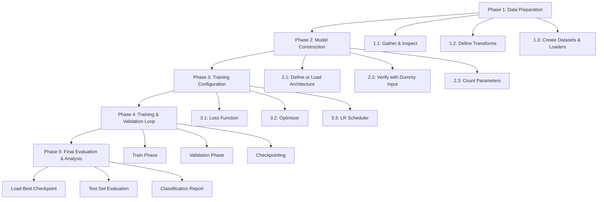

# 24. The Full Training Pipeline End-to-End Checklist

> [!note] Prerequisites
> This section synthesizes everything from [[22. PyTorch Implementation Basics]] and [[23. PyTorch Advanced - VGG16 and Pre-trained Models]]. You should be comfortable with PyTorch basics before reading this comprehensive pipeline guide.

This section provides a complete, production-ready training pipeline with exhaustive code and commentary. Every phase is explained from first principles, every line of code is commented, and every design decision is motivated. This is the checklist you should follow for every CNN training project — from data inspection to final evaluation.

---

## Pipeline Overview



---

## Phase 1: Data Preparation

### Step 1.1: Gather and Inspect the Dataset

Before writing any model code, you must thoroughly inspect your dataset. Many training failures are caused by data problems that could have been caught early. The inspection should cover four critical areas: class distribution, image size consistency, corrupted files, and visual inspection of sample images.

```python
# ============================================================
# STEP 1.1: DATASET INSPECTION
# ============================================================

import os                              # For file system operations.
from pathlib import Path               # Modern path handling (preferred over os.path).
from PIL import Image                  # Python Imaging Library — for opening and checking images.
import numpy as np                     # For numerical operations and statistics.
from collections import Counter        # For counting class occurrences.

# ---- Define the data directory ----
data_dir = Path('data')                # Use Path for cross-platform compatibility.
train_dir = data_dir / 'train'         # Training directory.
val_dir = data_dir / 'val'             # Validation directory.
test_dir = data_dir / 'test'           # Test directory.

# ---- 1. Check class distribution (class imbalance) ----
print("=" * 60)
print("CLASS DISTRIBUTION ANALYSIS")
print("=" * 60)

class_counts = {}                      # Dictionary to store {class_name: count}.
for class_dir in sorted(train_dir.iterdir()):
                                       # iterdir() yields all items in the directory.
                                       # sorted() ensures consistent alphabetical order.
    if class_dir.is_dir():             # Only process directories (skip any stray files).
        class_name = class_dir.name    # The directory name IS the class label (ImageFolder convention).
        num_images = len(list(class_dir.glob('*.*')))
                                       # glob('*.*') finds all files in the directory.
                                       # list() converts the generator to a list.
                                       # len() counts the files.
        class_counts[class_name] = num_images
        print(f"  {class_name}: {num_images} images")

total_images = sum(class_counts.values())
print(f"\nTotal training images: {total_images}")
print(f"Number of classes: {len(class_counts)}")

# ---- Check for class imbalance ----
if class_counts:
    max_count = max(class_counts.values())
    min_count = min(class_counts.values())
    imbalance_ratio = max_count / min_count
    print(f"Imbalance ratio (max/min): {imbalance_ratio:.2f}")
    if imbalance_ratio > 3:
        print("  ⚠ WARNING: Significant class imbalance detected!")
        print("  Consider using class weights in the loss function.")
        print("  See Phase 3, Step 3.1 for class weights implementation.")

# ---- 2. Check image size consistency ----
print("\n" + "=" * 60)
print("IMAGE SIZE ANALYSIS")
print("=" * 60)

image_sizes = []                       # List to collect (width, height) tuples.
corrupted_files = []                   # List to collect paths of corrupted files.

for class_dir in train_dir.iterdir():
    if not class_dir.is_dir():
        continue
    for img_path in class_dir.iterdir():
        try:                           # Use try/except because some files might be corrupted.
            img = Image.open(img_path) # Open the image file.
            img.verify()               # Verify the image data is valid.
                                       # verify() checks the file integrity without fully
                                       # decoding the image. It detects truncated files,
                                       # corrupt headers, and other format errors.
            img = Image.open(img_path) # Re-open (verify() may close the file).
            image_sizes.append(img.size)  # img.size returns (width, height) tuple.
        except Exception as e:
            corrupted_files.append((str(img_path), str(e)))
                                       # Record the corrupted file and its error message.

# Analyze the collected sizes
if image_sizes:
    unique_sizes = set(image_sizes)    # Find all unique sizes.
    print(f"Unique image sizes: {len(unique_sizes)}")
    if len(unique_sizes) <= 10:
        for size, count in Counter(image_sizes).most_common():
            print(f"  {size[0]}×{size[1]}: {count} images")
    else:
        print("  Too many unique sizes to display individually.")
        widths, heights = zip(*image_sizes)
        print(f"  Width range: [{min(widths)}, {max(widths)}]")
        print(f"  Height range: [{min(heights)}, {max(heights)}]")

# ---- 3. Report corrupted files ----
if corrupted_files:
    print(f"\n⚠ CORRUPTED FILES: {len(corrupted_files)}")
    for path, error in corrupted_files[:10]:  # Show first 10
        print(f"  {path}: {error}")
else:
    print("\n✓ No corrupted files found.")
```

> [!warning] Why Dataset Inspection Matters
> Skipping dataset inspection is one of the most costly mistakes you can make. Class imbalance will bias your model toward majority classes. Inconsistent image sizes will cause crashes or subtle bugs. Corrupted files will cause DataLoader errors that are hard to debug. Spending 10 minutes on inspection can save hours of debugging later.

### Step 1.2: Define TWO Separate Transform Pipelines

A critical principle in deep learning is that data augmentation should be applied to the training set but NOT to the validation or test sets. Augmenting validation data adds noise to your metrics, making it harder to track true model improvement. You need two separate transform pipelines: one with augmentation for training, and one without for evaluation.

```python
# ============================================================
# STEP 1.2: TRANSFORM PIPELINES
# ============================================================

from torchvision import transforms

# ---- Training transform pipeline (WITH augmentation) ----
train_transform = transforms.Compose([
    # --- Resizing ---
    transforms.Resize(256),            # Resize the shorter edge to 256 pixels.
                                       # This ensures images are large enough for the
                                       # subsequent crop. The aspect ratio is preserved.

    # --- Data Augmentation ---
    transforms.RandomResizedCrop(224), # Randomly crop a region and resize to 224×224.
                                       # This is the MOST IMPORTANT augmentation for image
                                       # classification. It provides:
                                       #   - Scale augmentation (zoom in/out)
                                       #   - Translation augmentation (shift object)
                                       #   - Aspect ratio variation
                                       # Parameters: scale=(0.08, 1.0), ratio=(0.75, 1.333)
                                       # by default, which are good for most datasets.

    transforms.RandomHorizontalFlip(p=0.5),
                                       # Randomly flip horizontally with 50% probability.
                                       # Only use this if horizontal flipping preserves
                                       # the semantic meaning (e.g., cats are still cats
                                       # when flipped, but digits '6' and '9' are not).

    transforms.RandomRotation(degrees=15),
                                       # Randomly rotate by up to ±15 degrees.
                                       # Small rotations are safe for most objects.
                                       # Use larger angles with caution — a 90° rotation
                                       # would make a standing person appear lying down.

    transforms.ColorJitter(
        brightness=0.2,                # Randomly change brightness by ±20%.
        contrast=0.2,                  # Randomly change contrast by ±20%.
        saturation=0.2,                # Randomly change saturation by ±20%.
        hue=0.1                        # Randomly change hue by ±10%.
                                       # ColorJitter helps the model become invariant
                                       # to lighting and color variations, which are
                                       # common in real-world images.
    ),

    # --- Conversion and Normalization ---
    transforms.ToTensor(),             # Convert to tensor, scale [0,255]→[0,1], HWC→CHW.
    transforms.Normalize(              # Normalize with ImageNet statistics.
        mean=[0.485, 0.456, 0.406],    # These are REQUIRED when using pre-trained models!
        std=[0.229, 0.224, 0.225]      # The model was trained with this exact normalization.
    ),
])

# ---- Validation/Test transform pipeline (WITHOUT augmentation) ----
val_transform = transforms.Compose([
    # --- Deterministic resizing and cropping ---
    transforms.Resize(256),            # Same resize as training.
    transforms.CenterCrop(224),        # Deterministic center crop to 224×224.
                                       # NO randomness — we want reproducible evaluation.
                                       # CenterCrop is the standard choice for validation.

    # --- Conversion and Normalization (SAME as training) ---
    transforms.ToTensor(),
    transforms.Normalize(              # MUST use the SAME normalization as training!
        mean=[0.485, 0.456, 0.406],    # Different normalization would mean the model
        std=[0.229, 0.224, 0.225]      # sees fundamentally different data at test time.
    ),
])
```

> [!danger] Never Apply Augmentation to Validation Data
> Data augmentation adds randomness. If you apply it to validation data, your validation metrics will fluctuate randomly between epochs, making it impossible to tell whether the model is actually improving or just getting lucky with different augmentations. This defeats the entire purpose of having a validation set — which is to get a reliable, unbiased estimate of model performance.

### Step 1.3: Create Datasets and DataLoaders

```python
# ============================================================
# STEP 1.3: DATASETS AND DATALOADERS
# ============================================================

from torchvision import datasets
from torch.utils.data import DataLoader

# ---- Create datasets using ImageFolder ----
# ImageFolder expects the directory structure:
#   root/class_0/img_a.jpg
#   root/class_0/img_b.jpg
#   root/class_1/img_c.jpg
#   ...
# It automatically assigns class indices based on alphabetical
# ordering of the subdirectory names.

train_dataset = datasets.ImageFolder(
    root=str(train_dir),               # Path to the training directory.
    transform=train_transform          # Training transform (with augmentation).
)

val_dataset = datasets.ImageFolder(
    root=str(val_dir),                 # Path to the validation directory.
    transform=val_transform            # Validation transform (no augmentation).
)

test_dataset = datasets.ImageFolder(
    root=str(test_dir),                # Path to the test directory.
    transform=val_transform            # Same as validation — no augmentation.
)

# ---- Print dataset info ----
print(f"Training samples:   {len(train_dataset)}")
print(f"Validation samples: {len(val_dataset)}")
print(f"Test samples:       {len(test_dataset)}")
print(f"Class names:        {train_dataset.classes}")
print(f"Class-to-idx:       {train_dataset.class_to_idx}")
                                       # class_to_idx maps class names to integer indices.
                                       # E.g., {'cats': 0, 'dogs': 1}

# ---- Create DataLoaders ----
batch_size = 32                        # 32 is a good default for most GPUs.
                                       # Adjust based on GPU memory and model size.
                                       # Larger batch sizes give more stable gradients
                                       # but require more GPU memory.

train_loader = DataLoader(
    dataset=train_dataset,
    batch_size=batch_size,
    shuffle=True,                      # MUST shuffle training data!
    num_workers=4,                     # Number of parallel data loading processes.
                                       # Rule of thumb: num_workers = 4 * number of GPUs.
                                       # More workers = faster loading, but more RAM usage.
    pin_memory=True,                   # Speeds up CPU→GPU transfer.
                                       # Only useful when using a GPU.
    drop_last=False,                   # Whether to drop the last incomplete batch.
                                       # False means we use all samples, even if the last
                                       # batch is smaller than batch_size.
)

val_loader = DataLoader(
    dataset=val_dataset,
    batch_size=batch_size,
    shuffle=False,                     # Do NOT shuffle validation data!
    num_workers=4,
    pin_memory=True,
)

test_loader = DataLoader(
    dataset=test_dataset,
    batch_size=batch_size,
    shuffle=False,                     # Do NOT shuffle test data!
    num_workers=4,
    pin_memory=True,
)
```

---

## Phase 2: Model Construction

### Step 2.1: Define or Load the Architecture

```python
# ============================================================
# STEP 2.1: MODEL ARCHITECTURE
# ============================================================

import torch
import torch.nn as nn
from torchvision import models

# Option A: Use a pre-trained model (recommended for most cases)
model = models.vgg16_bn(weights='DEFAULT')  # Load VGG16-BN with ImageNet weights.

# Replace the final classifier layer for our number of classes
num_features = model.classifier[6].in_features  # 4096 for VGG16
num_classes = len(train_dataset.classes)         # Determined by our dataset
model.classifier[6] = nn.Linear(num_features, num_classes)

# Option B: Define a custom architecture from scratch
class CustomCNN(nn.Module):
    def __init__(self, num_classes):
        super(CustomCNN, self).__init__()
        self.features = nn.Sequential(
            nn.Conv2d(3, 64, 3, padding=1), nn.ReLU(), nn.MaxPool2d(2, 2),
            nn.Conv2d(64, 128, 3, padding=1), nn.ReLU(), nn.MaxPool2d(2, 2),
            nn.Conv2d(128, 256, 3, padding=1), nn.ReLU(), nn.MaxPool2d(2, 2),
            nn.Conv2d(256, 512, 3, padding=1), nn.ReLU(), nn.MaxPool2d(2, 2),
        )
        self.classifier = nn.Sequential(
            nn.Flatten(),
            nn.Linear(512 * 14 * 14, 512),   # Size depends on input dimensions!
            nn.ReLU(),
            nn.Dropout(0.5),
            nn.Linear(512, num_classes),
        )

    def forward(self, x):
        x = self.features(x)
        x = self.classifier(x)
        return x
```

### Step 2.2: Verify Architecture with Dummy Input

This is an essential debugging step that catches dimension mismatch errors before you spend hours training. The idea is simple: create a fake input tensor of the correct shape and pass it through the model to verify the dimensions work at every layer.

```python
# ============================================================
# STEP 2.2: VERIFY WITH DUMMY INPUT
# ============================================================

device = torch.device('cuda' if torch.cuda.is_available() else 'cpu')
model = model.to(device)               # Move model to the target device.

# Create a dummy input tensor with the same shape as real data
dummy_input = torch.randn(1, 3, 224, 224).to(device)
                                       # Shape: (batch_size=1, channels=3, height=224, width=224)
                                       # This matches the expected input size for VGG16.
                                       # We use random values (randn) because the actual
                                       # values don't matter — we only care about dimensions.

# Forward pass with the dummy input
try:
    dummy_output = model(dummy_input)  # Try to pass the dummy input through the model.
    print(f"✓ Forward pass successful!")
    print(f"  Input shape:  {dummy_input.shape}")
    print(f"  Output shape: {dummy_output.shape}")
                                       # Expected output: (1, num_classes)
    assert dummy_output.shape == (1, num_classes), \
        f"Expected shape (1, {num_classes}), got {dummy_output.shape}"
    print(f"  Output shape is correct: (1, {num_classes})")
except RuntimeError as e:
    print(f"✗ Forward pass FAILED with error:")
    print(f"  {e}")
    print(f"  This is likely a dimension mismatch in a Linear layer.")
    print(f"  See Step 2.2 debugging approach below.")
```

> [!tip] Debugging Dimension Mismatches with Dummy Tensors
> If the dummy forward pass fails, insert `print(x.shape)` statements in the `forward()` method to trace the tensor shape through each layer. This will reveal exactly where the dimension mismatch occurs and what the correct size for the first Linear layer should be.

### Step 2.3: Count Parameters

```python
# ============================================================
# STEP 2.3: PARAMETER COUNTING
# ============================================================

def count_parameters(model):
    """
    Count and display the total, trainable, and frozen parameters in a model.
    """
    total_params = sum(p.numel() for p in model.parameters())
                                       # numel() = number of elements in the tensor.
                                       # For a weight matrix of shape (4096, 4096),
                                       # numel() = 16,777,216.

    trainable_params = sum(p.numel() for p in model.parameters() if p.requires_grad)
                                       # Only count parameters that require gradients
                                       # (i.e., will be updated by the optimizer).

    frozen_params = total_params - trainable_params
                                       # Frozen parameters won't be updated.

    print(f"Total parameters:     {total_params:>12,}")
    print(f"Trainable parameters: {trainable_params:>12,}")
    print(f"Frozen parameters:    {frozen_params:>12,}")
    print(f"Trainable ratio:      {100*trainable_params/total_params:.2f}%")

    return total_params, trainable_params, frozen_params

count_parameters(model)
```

---

## Phase 3: Training Configuration

### Step 3.1: Loss Function (with Class Weights Option)

```python
# ============================================================
# STEP 3.1: LOSS FUNCTION
# ============================================================

# Option A: Standard CrossEntropyLoss (balanced classes)
criterion = nn.CrossEntropyLoss()

# Option B: Weighted CrossEntropyLoss (imbalanced classes)
# If your dataset has class imbalance (e.g., 90% cats, 10% dogs),
# the model will be biased toward the majority class. Class weights
# compensate by giving more importance to minority class samples.

# Calculate class weights: inverse frequency weighting
class_counts_list = [class_counts[cls] for cls in train_dataset.classes]
                                       # Get the count for each class in alphabetical order
                                       # (matching ImageFolder's class ordering).

total_samples = sum(class_counts_list) # Total number of training samples.
class_weights = [total_samples / (len(class_counts_list) * count)
                 for count in class_counts_list]
                                       # Weight formula: w_i = N / (C * n_i)
                                       # where N = total samples, C = number of classes,
                                       # n_i = count of class i.
                                       # This gives higher weight to rare classes.

class_weights_tensor = torch.FloatTensor(class_weights).to(device)
                                       # Convert to a PyTorch tensor on the correct device.

criterion_weighted = nn.CrossEntropyLoss(weight=class_weights_tensor)
                                       # Pass the weights to CrossEntropyLoss.
                                       # The loss for each sample is multiplied by the
                                       # weight of its class, so minority class samples
                                       # contribute more to the total loss.
```

### Step 3.2: Optimizer

```python
# ============================================================
# STEP 3.2: OPTIMIZER
# ============================================================

# Filter to only trainable parameters (important when some layers are frozen)
trainable_params = filter(lambda p: p.requires_grad, model.parameters())
                                       # This ensures the optimizer only tracks parameters
                                       # that will be updated. If frozen parameters are
                                       # included, the optimizer wastes memory storing
                                       # momentum/variance states for them.

optimizer = optim.Adam(
    trainable_params,
    lr=0.001,                          # Learning rate — the most important hyperparameter.
                                       # For training a new classifier head: 0.001 is good.
                                       # For fine-tuning pre-trained layers: 0.0001 or smaller.
    weight_decay=1e-4,                 # L2 regularization (also called weight decay).
                                       # Adds a penalty term λ * Σ(w²) to the loss.
                                       # This discourages large weights, preventing overfitting.
                                       # 1e-4 is a common default. Increase to 1e-3 for
                                       # very overparameterized models.
)
```

### Step 3.3: Learning Rate Scheduler

```python
# ============================================================
# STEP 3.3: LEARNING RATE SCHEDULER
# ============================================================

# ReduceLROnPlateau is the most practical scheduler for most tasks.
# It monitors a metric (typically validation loss) and reduces the
# learning rate when the metric stops improving.

scheduler = optim.lr_scheduler.ReduceLROnPlateau(
    optimizer,
    mode='max',                        # 'max' because we monitor accuracy (higher is better).
                                       # Use 'min' if monitoring loss (lower is better).
    factor=0.5,                        # Multiply LR by this factor when triggered.
                                       # factor=0.5 means the LR is halved.
    patience=3,                        # Number of epochs with no improvement before reducing LR.
                                       # If val_acc doesn't improve for 3 consecutive epochs,
                                       # the LR is reduced. This gives the model time to
                                       # potentially improve before reducing the LR.
    min_lr=1e-7,                       # Minimum LR — don't reduce below this.
                                       # Prevents the LR from becoming so small that
                                       # training effectively stops.
    verbose=True                       # Print a message when the LR is reduced.
                                       # Helpful for monitoring training progress.
)
```

> [!info] Why ReduceLROnPlateau?
> In the early stages of training, a relatively large learning rate helps the model converge quickly. But as training progresses and the model approaches a good solution, the same large learning rate causes oscillations — the model overshoots the minimum and bounces back and forth. Reducing the learning rate when progress stalls allows the model to "fine-tune" its position in the loss landscape, settling into a deeper, better minimum. This is one of the most reliable techniques for squeezing out the last few percent of accuracy.

---

## Phase 4: Training and Validation Loop

This is the complete training loop with all best practices: train/validation phases, logging, gradient clipping, checkpointing, and LR scheduling. Every line is commented.

```python
# ============================================================
# PHASE 4: COMPLETE TRAINING AND VALIDATION LOOP
# ============================================================

import time                            # For timing epochs.
from sklearn.metrics import classification_report, confusion_matrix
                                       # For final evaluation (Phase 5).

num_epochs = 30                        # Maximum number of epochs to train.
best_val_acc = 0.0                     # Track the best validation accuracy seen so far.
patience_counter = 0                   # Counter for early stopping.
early_stop_patience = 7               # Stop if no improvement for 7 epochs.
grad_clip_value = 1.0                  # Maximum gradient norm for gradient clipping.

# Create directory for checkpoints
os.makedirs('checkpoints', exist_ok=True)

for epoch in range(num_epochs):
    epoch_start_time = time.time()     # Record the start time for timing.

    # ============================================================
    # TRAINING PHASE
    # ============================================================
    model.train()                      # Set model to training mode.
                                       # Activates Dropout and makes BatchNorm use batch stats.

    train_loss = 0.0                   # Accumulate training loss.
    train_correct = 0                  # Count correct predictions.
    train_total = 0                    # Count total samples.

    for batch_idx, (images, labels) in enumerate(train_loader):
                                       # Iterate over mini-batches from the training DataLoader.

        images = images.to(device, non_blocking=True)
                                       # Move images to GPU. non_blocking=True allows the
                                       # data transfer to overlap with computation if
                                       # pin_memory=True was set in the DataLoader.
        labels = labels.to(device, non_blocking=True)
                                       # Move labels to GPU.

        # ---- Step 1: Forward pass ----
        outputs = model(images)        # Compute model predictions (raw logits).
                                       # Shape: (batch_size, num_classes)

        # ---- Step 2: Compute loss ----
        loss = criterion(outputs, labels)
                                       # CrossEntropyLoss between logits and integer labels.

        # ---- Step 3: Zero gradients ----
        optimizer.zero_grad()          # Clear accumulated gradients from previous iteration.

        # ---- Step 4: Backward pass ----
        loss.backward()                # Compute gradients via backpropagation.

        # ---- Step 5: Gradient clipping ----
        torch.nn.utils.clip_grad_norm_(model.parameters(), grad_clip_value)
                                       # Clip gradient norm to prevent exploding gradients.
                                       # If the total gradient norm exceeds grad_clip_value,
                                       # all gradients are scaled down proportionally.
                                       # This is especially important for:
                                       #   - Deep networks (many layers)
                                       #   - RNNs and Transformers
                                       #   - Training with large learning rates
                                       # The underscore suffix means in-place operation.

        # ---- Step 6: Optimizer step ----
        optimizer.step()               # Update model parameters using the computed gradients.

        # ---- Accumulate metrics ----
        train_loss += loss.item()      # .item() extracts the scalar value, releasing the
                                       # computation graph (prevents memory leak).

        _, predicted = torch.max(outputs, dim=1)
                                       # Get the predicted class (index of max logit).
        train_total += labels.size(0)  # Add batch size to total count.
        train_correct += (predicted == labels).sum().item()
                                       # Count correct predictions in this batch.

    # ---- Compute epoch training metrics ----
    avg_train_loss = train_loss / len(train_loader)
                                       # Average loss over all batches.
    train_accuracy = 100.0 * train_correct / train_total
                                       # Training accuracy as a percentage.

    # ============================================================
    # VALIDATION PHASE
    # ============================================================
    model.eval()                       # Set model to evaluation mode.
                                       # Deactivates Dropout and makes BatchNorm use running stats.

    val_loss = 0.0                     # Accumulate validation loss.
    val_correct = 0                    # Count correct predictions.
    val_total = 0                      # Count total samples.

    with torch.no_grad():              # Disable gradient computation for efficiency.
                                       # No gradients needed because we're not updating weights.
                                       # Saves ~50% of GPU memory and speeds up forward passes.

        for images, labels in val_loader:
            images = images.to(device, non_blocking=True)
            labels = labels.to(device, non_blocking=True)

            outputs = model(images)    # Forward pass only.
            loss = criterion(outputs, labels)

            val_loss += loss.item()    # Accumulate loss.

            _, predicted = torch.max(outputs, dim=1)
            val_total += labels.size(0)
            val_correct += (predicted == labels).sum().item()

    # ---- Compute epoch validation metrics ----
    avg_val_loss = val_loss / len(val_loader)
    val_accuracy = 100.0 * val_correct / val_total

    # ---- Compute epoch time ----
    epoch_time = time.time() - epoch_start_time

    # ---- Print epoch summary ----
    print(f'Epoch [{epoch+1}/{num_epochs}] ({epoch_time:.1f}s) | '
          f'Train Loss: {avg_train_loss:.4f} | Train Acc: {train_accuracy:.2f}% | '
          f'Val Loss: {avg_val_loss:.4f} | Val Acc: {val_accuracy:.2f}% | '
          f'LR: {optimizer.param_groups[0]["lr"]:.2e}')

    # ============================================================
    # LEARNING RATE SCHEDULING
    # ============================================================
    scheduler.step(val_accuracy)       # Update the LR based on validation accuracy.
                                       # ReduceLROnPlateau monitors val_accuracy.
                                       # If no improvement for 'patience' epochs, LR is reduced.

    # ============================================================
    # CHECKPOINTING — Save the best model
    # ============================================================
    if val_accuracy > best_val_acc:    # If this is the best validation accuracy so far...
        best_val_acc = val_accuracy    # Update the best accuracy.
        patience_counter = 0           # Reset the early stopping counter.

        torch.save({                   # Save a checkpoint dictionary.
            'epoch': epoch,            # Current epoch number (for resuming).
            'model_state_dict': model.state_dict(),
                                       # All model parameters and buffers.
            'optimizer_state_dict': optimizer.state_dict(),
                                       # Optimizer state (momentum buffers, etc.).
                                       # Needed for exact resumption of training.
            'scheduler_state_dict': scheduler.state_dict(),
                                       # Scheduler state (step count, best metric, etc.).
            'val_acc': val_accuracy,    # Best validation accuracy.
            'train_acc': train_accuracy,
            'train_loss': avg_train_loss,
            'val_loss': avg_val_loss,
        }, 'checkpoints/best_model.pth')
                                       # Save to a file. Overwrites the previous best.
        print(f'  ✓ New best model saved! Val Acc: {val_accuracy:.2f}%')
    else:
        patience_counter += 1          # No improvement — increment patience counter.
        if patience_counter >= early_stop_patience:
            print(f'  Early stopping triggered! No improvement for '
                  f'{early_stop_patience} epochs.')
            break                      # Exit the training loop.

    # ============================================================
    # PERIODIC CHECKPOINT — Save every 5 epochs for safety
    # ============================================================
    if (epoch + 1) % 5 == 0:
        torch.save({
            'epoch': epoch,
            'model_state_dict': model.state_dict(),
            'optimizer_state_dict': optimizer.state_dict(),
            'scheduler_state_dict': scheduler.state_dict(),
            'val_acc': val_accuracy,
        }, f'checkpoints/epoch_{epoch+1}.pth')
        print(f'  Periodic checkpoint saved: epoch_{epoch+1}.pth')

print(f'\nTraining complete! Best validation accuracy: {best_val_acc:.2f}%')
```

### Resuming Training from a Checkpoint

```python
# ============================================================
# RESUMING TRAINING FROM A CHECKPOINT
# ============================================================

def resume_training(checkpoint_path, model, optimizer, scheduler):
    """
    Resume training from a saved checkpoint.

    Args:
        checkpoint_path: Path to the checkpoint file.
        model: The model (must have the same architecture).
        optimizer: The optimizer (will have its state restored).
        scheduler: The LR scheduler (will have its state restored).

    Returns:
        start_epoch: The epoch to resume from.
        best_val_acc: The best validation accuracy seen so far.
    """
    checkpoint = torch.load(checkpoint_path, map_location=device)
                                       # Load the checkpoint dictionary.
                                       # map_location ensures tensors go to the right device.

    model.load_state_dict(checkpoint['model_state_dict'])
                                       # Restore model parameters.

    optimizer.load_state_dict(checkpoint['optimizer_state_dict'])
                                       # Restore optimizer state (momentum, adaptive LR estimates).
                                       # IMPORTANT: The optimizer must have been created with
                                       # the same parameter groups as during the original training.

    scheduler.load_state_dict(checkpoint['scheduler_state_dict'])
                                       # Restore scheduler state (step count, best metric).

    start_epoch = checkpoint['epoch'] + 1
                                       # Resume from the next epoch after the saved one.
    best_val_acc = checkpoint.get('val_acc', 0.0)
                                       # Restore the best validation accuracy.

    print(f'Resumed from epoch {start_epoch}, best val acc: {best_val_acc:.2f}%')
    return start_epoch, best_val_acc

# Usage:
# start_epoch, best_val_acc = resume_training('checkpoints/best_model.pth', model, optimizer, scheduler)
# Then modify the training loop to start from start_epoch instead of 0.
```

---

## Phase 5: Final Evaluation and Analysis

### Load Best Checkpoint

```python
# ============================================================
# STEP 5.1: LOAD BEST CHECKPOINT
# ============================================================

checkpoint = torch.load('checkpoints/best_model.pth', map_location=device)
model.load_state_dict(checkpoint['model_state_dict'])
                                       # Load the best model parameters.
model.eval()                           # Set to evaluation mode!
print(f'Loaded best model from epoch {checkpoint["epoch"]+1} '
      f'with val acc: {checkpoint["val_acc"]:.2f}%')
```

### Run on Test Set

```python
# ============================================================
# STEP 5.2: TEST SET EVALUATION
# ============================================================

all_preds = []                         # List to collect all predictions.
all_labels = []                        # List to collect all true labels.
test_correct = 0
test_total = 0

with torch.no_grad():
    for images, labels in test_loader:
        images = images.to(device)
        labels = labels.to(device)

        outputs = model(images)
        _, predicted = torch.max(outputs, dim=1)

        test_total += labels.size(0)
        test_correct += (predicted == labels).sum().item()

        all_preds.extend(predicted.cpu().numpy())
                                       # Move predictions to CPU and convert to NumPy.
                                       # We need CPU because sklearn doesn't work with GPU tensors.
        all_labels.extend(labels.cpu().numpy())
                                       # Same for labels.

test_accuracy = 100.0 * test_correct / test_total
print(f'\nTest Accuracy: {test_accuracy:.2f}%')
```

### Classification Report and Confusion Matrix

```python
# ============================================================
# STEP 5.3: DETAILED ANALYSIS
# ============================================================

from sklearn.metrics import classification_report, confusion_matrix
import matplotlib.pyplot as plt
import seaborn as sns

# ---- Classification report ----
print("\nClassification Report:")
print(classification_report(
    all_labels,                        # True labels.
    all_preds,                         # Predicted labels.
    target_names=train_dataset.classes, # Human-readable class names.
    digits=4                           # 4 decimal places for precision/recall.
))
# The classification report shows:
#   - Precision: Of all samples predicted as class X, how many were correct?
#   - Recall: Of all actual class X samples, how many were detected?
#   - F1-score: Harmonic mean of precision and recall.
#   - Support: Number of actual samples in each class.

# ---- Confusion matrix ----
cm = confusion_matrix(all_labels, all_preds)
                                       # Shape: (num_classes, num_classes).
                                       # cm[i][j] = number of samples with true label i
                                       # that were predicted as label j.

plt.figure(figsize=(10, 8))
sns.heatmap(cm, annot=True, fmt='d', cmap='Blues',
            xticklabels=train_dataset.classes,
            yticklabels=train_dataset.classes)
plt.xlabel('Predicted Label')
plt.ylabel('True Label')
plt.title('Confusion Matrix')
plt.tight_layout()
plt.savefig('confusion_matrix.png', dpi=150)
plt.show()
print("Confusion matrix saved to confusion_matrix.png")
```

### (Optional) Grad-CAM Visualizations

```python
# ============================================================
# STEP 5.4 (OPTIONAL): GRAD-CAM VISUALIZATIONS
# ============================================================
# See [[26. Demystifying the Black Box - CNN Interpretability]] for the
# complete Grad-CAM implementation. Here's a quick outline:

# The idea: visualize which parts of the image the model is looking at
# when making its prediction. This helps you:
#   1. Verify the model is looking at the right features
#   2. Detect if the model is using shortcuts (watermarks, borders, etc.)
#   3. Build trust in the model's predictions

# A brief sketch (full implementation in Section 26):
# 1. Hook into the last convolutional layer to capture activations and gradients
# 2. Compute the Grad-CAM heatmap
# 3. Overlay it on the original image
# 4. Display or save the visualization
```

> [!tip] The Test Set is Sacred
> The test set should only be used ONCE — at the very end, after all hyperparameter tuning is done. If you evaluate on the test set multiple times and use the results to make decisions (like choosing between models), you're effectively optimizing on the test set, which gives an overly optimistic estimate of real-world performance. Use the validation set for all intermediate decisions.

---

## Complete Pipeline Summary Checklist

| Phase | Step | Key Action | Common Pitfall |
|-------|------|-----------|---------------|
| 1. Data | 1.1 | Inspect class balance, sizes, corrupted files | Skipping inspection → hours of debugging |
| 1. Data | 1.2 | Separate train/val transforms | Augmenting validation data |
| 1. Data | 1.3 | Create DataLoaders with correct settings | shuffle=False for training |
| 2. Model | 2.1 | Define or load architecture | Wrong number of classes |
| 2. Model | 2.2 | Verify with dummy input | Skipping this → dimension crash during training |
| 2. Model | 2.3 | Count parameters | Not noticing 90% are frozen |
| 3. Config | 3.1 | Choose loss (with weights if imbalanced) | Ignoring class imbalance |
| 3. Config | 3.2 | Optimizer with weight_decay | Including frozen params in optimizer |
| 3. Config | 3.3 | LR scheduler (ReduceLROnPlateau) | Not using a scheduler at all |
| 4. Train | — | Full loop with checkpointing | Forgetting model.train()/eval() |
| 5. Eval | — | Load best model, test, analyze | Using test set during development |

> [!note] Next Steps
> In [[25. Common Mistakes and How to Fix Them]], we catalog the most frequent bugs in PyTorch CNN training and provide detailed diagnosis and fixes for each one.
