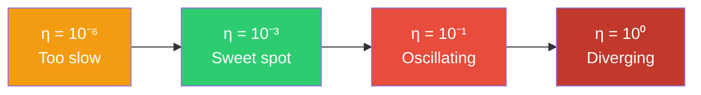
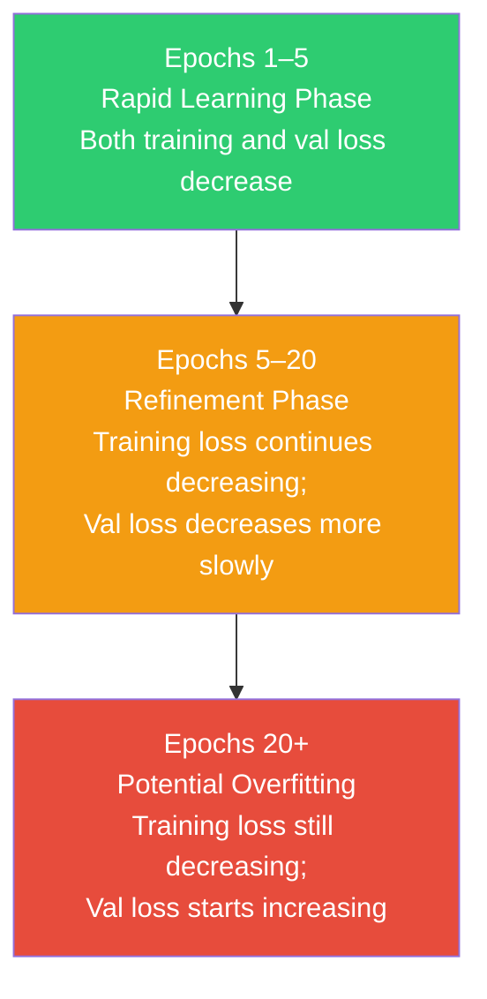
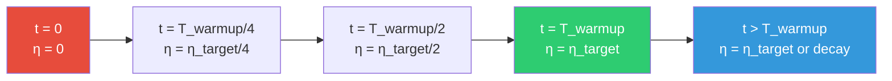
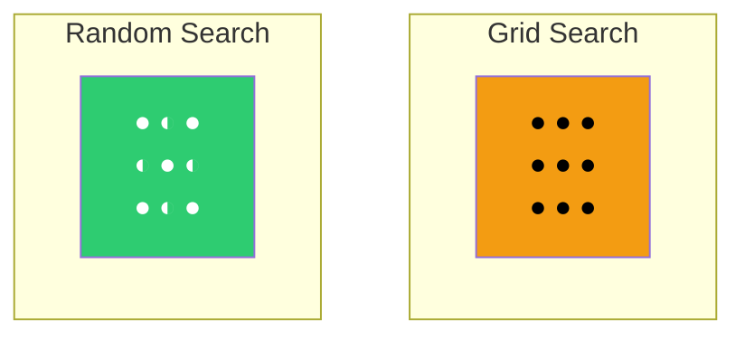

# 7. Hyperparameters and Network Configuration

## Introduction

A convolutional neural network is defined by two distinct categories of design choices: the **architecture** (how many layers, what types, how they connect) and the **training procedure** (how the network learns from data). Each of these categories involves hyperparameters — values set by the practitioner before training begins, as opposed to parameters (weights and biases) learned during training. The distinction is critical: hyperparameters determine the *capacity* and *learning dynamics* of the model, and poor hyperparameter choices can render even the most elegant architecture useless. In this section, we will exhaustively cover every major hyperparameter, derive the intuitions behind them from first principles, provide practical guidance grounded in empirical research, and equip you with systematic strategies for hyperparameter tuning.

---

## 1. Architectural Hyperparameters

### 1.1 Number of Filters (Channels per Layer)

#### The Fundamental Tradeoff

The number of filters in a convolutional layer directly determines the **representational capacity** of that layer. Each filter learns to detect a different pattern — edges, textures, object parts, or semantic concepts — and the more filters available, the more distinct patterns can be simultaneously represented. However, this capacity comes at a cost: each additional filter introduces $k \times k \times C_{\text{in}} + 1$ new parameters (where $k$ is the kernel size and $C_{\text{in}}$ is the number of input channels) and requires proportional additional computation during both forward and backward passes.

**Too few filters (Underfitting)**: If a layer has insufficient filters, it cannot learn enough distinct feature detectors to capture the richness of the input. Concretely, if an early layer has only 8 filters, it can detect at most 8 different edge orientations or color patterns. Any information not captured by these 8 detectors is irreversibly lost — subsequent layers cannot recover what was never extracted. The symptom is **high training loss** that plateaus above zero, indicating the model lacks the capacity to fit even the training data.

**Too many filters (Overfitting + Computational Waste)**: If a layer has far more filters than needed, the network has the capacity to memorize training examples rather than learning generalizable features. Additionally, redundant filters may learn near-identical patterns, wasting computation. The symptom is a **large gap between training accuracy and validation accuracy** — the model fits training data perfectly but fails to generalize. Computationally, doubling the number of filters in a layer roughly doubles the FLOPs for that layer and doubles the memory required to store the activations.

#### Typical Progression: Increasing Filters Across Depth

Almost all successful CNN architectures **increase the number of filters** as spatial resolution decreases. The standard pattern is:

| Block | Spatial Size | Typical Filters |
|-------|-------------|-----------------|
| Block 1 | 112×112 | 64 |
| Block 2 | 56×56 | 128 |
| Block 3 | 28×28 | 256 |
| Block 4 | 14×14 | 512 |
| Block 5 | 7×7 | 512 |

The rationale is twofold. First, as spatial resolution decreases (due to pooling or strided convolutions), each spatial position represents a larger receptive field of the original image and thus requires more feature channels to encode the richer, more abstract information. Second, this progression approximately **preserves the total number of activations** across layers: halving the spatial dimensions while doubling the channels keeps the total activation count roughly constant, which helps maintain computational balance across the network.

> [!tip] Practical Guidance
> A good starting point for a simple CNN on ImageNet-scale data is 64→128→256→512 filters. For smaller datasets (CIFAR-10), start with 32→64→128. The doubling pattern is not arbitrary — it follows the principle that each halving of spatial resolution should be accompanied by a doubling of channels, maintaining approximately equal computational cost per layer. If you observe underfitting, increase the number of filters; if you observe overfitting, add regularization (dropout, weight decay) before reducing filters.

### 1.2 Filter Size: Why 3×3 Dominates

#### The Receptive Field Argument

The **receptive field** of a neuron is the region in the input image that can influence that neuron's activation. For a single convolutional layer with kernel size $k$, the receptive field is exactly $k \times k$. However, when convolutional layers are **stacked** (with no pooling between them), the receptive field grows. Specifically, two consecutive $3 \times 3$ convolutions have a receptive field of $5 \times 5$, and three consecutive $3 \times 3$ convolutions have a receptive field of $7 \times 7$.

Let us prove this formally. Consider a stack of $n$ convolutional layers, each with kernel size $k$ and stride 1. The receptive field $r_n$ after $n$ layers satisfies the recurrence:

$$r_n = r_{n-1} + (k - 1) \cdot \prod_{i=1}^{n-1} s_i$$

where $s_i$ is the stride of layer $i$. For stride-1 convolutions, this simplifies to:

$$r_n = r_{n-1} + (k - 1) = 1 + n \cdot (k - 1)$$

For $k = 3$: $r_2 = 1 + 2 \times 2 = 5$, $r_3 = 1 + 3 \times 2 = 7$.

For $k = 5$: $r_1 = 5$, $r_2 = 1 + 2 \times 4 = 9$.

For $k = 7$: $r_1 = 7$.

#### The Parameter Efficiency Argument

Now compare the parameter counts:

- **One 7×7 convolution** with $C$ input and $C$ output channels: $7 \times 7 \times C \times C = 49C^2$ parameters.
- **Three 3×3 convolutions** (same $C$ input/output channels): $3 \times (3 \times 3 \times C \times C) = 27C^2$ parameters.

Three 3×3 convolutions achieve the **same 7×7 receptive field** with only $\frac{27}{49} \approx 55\%$ of the parameters. The savings are even more significant when you consider that each 3×3 convolution is followed by a ReLU activation, introducing additional non-linearity between each layer. So three 3×3 convolutions give you the same receptive field with fewer parameters *and* more non-linear transformations, enabling the network to learn more complex functions.

| Configuration | Receptive Field | Parameters (C→C) | Non-linearities |
|--------------|----------------|-------------------|-----------------|
| 1 × 7×7 conv | 7×7 | $49C^2$ | 1 ReLU |
| 3 × 3×3 conv | 7×7 | $27C^2$ | 3 ReLUs |
| 1 × 5×5 conv | 5×5 | $25C^2$ | 1 ReLU |
| 2 × 3×3 conv | 5×5 | $18C^2$ | 2 ReLUs |

This argument, first articulated in the VGGNet paper (Simonyan & Zisserman, 2014), is the reason 3×3 has become the universal default filter size in modern CNNs. Larger filters (5×5, 7×7) are occasionally used in the first layer (to quickly expand the receptive field at full resolution) or in specialized architectures (Inception's parallel branches), but the vast majority of convolutions in modern networks are 3×3.

> [!info] When Larger Filters Are Justified
> The one situation where larger filters are commonly preferred is the **very first convolutional layer**, where the input has only 3 channels (RGB). Here, a 7×7 convolution with 3 input channels costs only $7 \times 7 \times 3 \times 64 = 9{,}408$ parameters — negligible compared to the billions of FLOPs in deeper layers. The larger receptive field in the first layer allows the network to immediately capture low-frequency spatial structure (broad color gradients, large edges) without needing multiple layers to build up the receptive field slowly.

### 1.3 Stride and Padding

#### Stride

The **stride** $s$ of a convolution determines how much the filter shifts between applications. A stride of 1 (the default) applies the filter at every spatial position, producing an output of the same size as the input (with appropriate padding). A stride of 2 shifts the filter by 2 positions at each step, halving the spatial dimensions of the output:

$$W' = \left\lfloor \frac{W - k + 2p}{s} \right\rfloor + 1$$

where $W$ is the input width, $k$ is the kernel size, $p$ is the padding, and $s$ is the stride.

**Stride-2 convolutions as an alternative to pooling**: When a convolution uses stride 2, it naturally downsamples the feature map, serving the same function as a pooling layer. In fact, stride-2 convolutions are increasingly preferred over max pooling in modern architectures because: (1) the downsampling operation is *learned* rather than fixed (max or average), allowing the network to decide *how* to reduce resolution, and (2) stride-2 convolutions can be integrated into the convolutional layer itself, eliminating a separate pooling operation and simplifying the architecture.

#### Padding

**Padding** refers to adding extra pixels (typically zeros, called "zero padding") around the border of the input before applying the convolution. Padding serves two purposes:

1. **Preserving spatial dimensions**: Without padding, each convolution reduces the spatial size by $(k-1)$ pixels. For a 3×3 convolution, the output is 2 pixels smaller than the input. After many layers, this shrinkage becomes significant. Padding with $p = \lfloor k/2 \rfloor$ ensures the output has the same spatial size as the input — this is called **"same" padding**.

2. **Presving border information**: Without padding, the pixels at the border of the input are processed by fewer filter applications than the pixels in the center, effectively marginalizing border information. Padding ensures all pixels are treated equally.

For a 3×3 convolution, the standard choice is $p = 1$ (same padding), which preserves the input spatial dimensions. For a 7×7 convolution with stride 2, padding $p = 3$ is used, producing an output of size $\lfloor (W + 6 - 7)/2 \rfloor + 1 = \lfloor (W-1)/2 \rfloor + 1 \approx W/2$.

> [!warning] The "Valid" vs. "Same" Confusion
> In TensorFlow, "same" padding means the output size is $\lceil W/s \rceil$, while "valid" padding means no padding at all. In PyTorch, there is no built-in "same" mode for `nn.Conv2d` (though it exists for `nn.functional.conv2d` via `padding='same'`). You must manually compute `padding = (kernel_size - 1) // 2` for odd kernel sizes. This is a common source of bugs when translating architectures between frameworks.

---

## 2. Training Hyperparameters

### 2.1 Learning Rate: The Most Critical Hyperparameter

#### Definition and Intuition

The learning rate $\eta$ controls the **step size** of each parameter update during gradient descent:

$$\theta_{t+1} = \theta_t - \eta \cdot \nabla_\theta \mathcal{L}(\theta_t)$$

The gradient $\nabla_\theta \mathcal{L}$ tells us the *direction* of steepest descent, but the learning rate determines *how far* we step in that direction. This single scalar has an outsized influence on training dynamics because it must balance two competing objectives: making progress toward a minimum (requiring large steps) and avoiding overshooting or instability (requiring small steps).

#### Learning Rate Too High

When $\eta$ is too large, each update overshoots the minimum, causing the loss to **oscillate** wildly or even **diverge** (increase without bound). Mathematically, for a quadratic loss surface $\mathcal{L} = \frac{1}{2}\lambda\theta^2$, gradient descent converges only when $\eta < \frac{2}{\lambda}$ (where $\lambda$ is the curvature). If $\eta > \frac{2}{\lambda}$, the iterates diverge. In deep networks with complex, non-convex loss surfaces, the effective curvature varies dramatically across parameter space, making the choice of $\eta$ extremely sensitive.

**Symptoms of too-high learning rate**:
- Loss oscillates wildly between iterations without decreasing
- Loss becomes NaN or Inf (numerical overflow)
- Accuracy fluctuates randomly instead of improving
- Gradient norms may explode

#### Learning Rate Too Low

When $\eta$ is too small, each update makes negligible progress, causing **excruciatingly slow convergence**. Worse, the optimizer may become trapped in a **poor local minimum** or a **saddle point** because it lacks the momentum to escape shallow basins in the loss landscape. In high-dimensional spaces, saddle points (where the gradient is zero in some directions but not all) are far more common than local minima, and a tiny learning rate causes the optimizer to crawl through these flat regions.

**Symptoms of too-low learning rate**:
- Loss decreases extremely slowly, barely changing over many epochs
- Training accuracy plateaus well below 100%, even on small datasets
- Validation accuracy is comparable to training accuracy (no overfitting, but both are poor)
- Gradient norms are reasonable but parameter changes are imperceptible

#### Practical Guidance

The learning rate is so important that it deserves dedicated tuning effort. A well-established practical approach is the **learning rate range test** (Smith, 2017): start with a very small learning rate (e.g., $10^{-7}$) and exponentially increase it over a few iterations, plotting the loss. The optimal learning rate is typically near the steepest point of the loss curve — just before the loss starts to increase or oscillate.



Typical learning rate ranges for different optimizers:

| Optimizer | Typical LR Range | Default Starting Point |
|-----------|-----------------|----------------------|
| SGD | $10^{-3}$ to $10^{-1}$ | $0.1$ |
| SGD + Momentum | $10^{-3}$ to $10^{-1}$ | $0.01$ |
| Adam | $10^{-5}$ to $10^{-3}$ | $0.001$ |
| AdamW | $10^{-5}$ to $10^{-3}$ | $0.001$ |

> [!warning] Adam Needs a Much Smaller LR Than SGD
> Because Adam adaptively scales the learning rate per-parameter based on the historical gradient magnitudes, its effective step size is already normalized. Using the same learning rate as SGD (e.g., 0.1) with Adam would cause catastrophic divergence. A common mistake is to copy the learning rate from a SGD recipe when switching to Adam — always start with $10\times$ to $100\times$ smaller.

### 2.2 Batch Size: Small vs. Large Trade-offs

#### Definition

The **batch size** $B$ is the number of training examples used to compute the gradient in a single parameter update. The gradient estimate based on a batch of size $B$ is:

$$\hat{g}_t = \frac{1}{B} \sum_{i=1}^{B} \nabla_\theta \mathcal{L}(x_i, y_i; \theta_t)$$

This is an unbiased estimate of the true gradient: $\mathbb{E}[\hat{g}_t] = \nabla_\theta \mathcal{L}(\theta_t)$, but its variance decreases as $B$ increases: $\text{Var}[\hat{g}_t] \propto \frac{1}{B}$.

#### Small Batch Sizes (B = 1 to 32)

**Advantages**:
- **Gradient noise acts as implicit regularization**: The stochasticity in the gradient estimate helps the optimizer escape sharp minima and saddle points, leading to solutions that generalize better. Keskar et al. (2016) showed that small batches tend to converge to **flat minima** (where the loss varies slowly in all directions), while large batches converge to **sharp minima** (where the loss changes rapidly in some directions). Flat minima generalize better because they are robust to small perturbations in the parameters.
- **More parameter updates per epoch**: With $N$ training samples and batch size $B$, there are $N/B$ updates per epoch. Smaller $B$ means more updates, which can accelerate early training.
- **Lower GPU memory**: Each batch requires storing all intermediate activations for backpropagation. Smaller batches fit more easily into GPU memory.

**Disadvantages**:
- **Slower convergence per wall-clock time**: Each update is based on a noisy gradient estimate, so more total updates (and thus more total computation) may be needed to reach the same loss.
- **Poor GPU utilization**: Modern GPUs are optimized for large matrix multiplications; very small batches leave GPU compute units idle.
- **Gradient noise can be excessive**: For very small batches (B=1 or B=2), the gradient estimate may be so noisy that it is essentially uninformative, causing the optimizer to make essentially random steps.

#### Large Batch Sizes (B = 256 to 8192+)

**Advantages**:
- **Accurate gradient estimates**: Larger batches produce gradient estimates closer to the true gradient, enabling more consistent and predictable convergence.
- **Better GPU utilization**: Large batches fully utilize GPU parallelism, maximizing throughput (samples processed per second).
- **Enables larger effective learning rates**: The linear scaling rule (discussed below) allows larger batches to use proportionally larger learning rates, potentially maintaining convergence speed.

**Disadvantages**:
- **Generalization gap**: Large-batch training tends to find sharp minima that generalize worse than the flat minima found by small-batch training. This "generalization gap" was extensively documented by Keskar et al. (2016) and remains an active research topic.
- **Higher memory requirements**: Large batches require proportionally more GPU memory for storing activations.
- **Fewer updates per epoch**: With B=4096 and N=1.28M (ImageNet), there are only ~312 updates per epoch, compared to ~10,000 updates with B=128.

#### Practical Recommendations

| Scenario | Recommended Batch Size | Rationale |
|----------|----------------------|-----------|
| Research / small datasets | 32–64 | Good generalization, sufficient gradient quality |
| Standard ImageNet training | 128–256 | Balance of speed, generalization, and GPU utilization |
| Large-scale distributed training | 1024–8192 | Maximize throughput across multiple GPUs/TPUs |
| Memory-constrained (e.g., 1080 Ti 8GB) | 16–32 | Fit the model + activations in available memory |

> [!tip] The "Batch Size 32" Heuristic
> Yann LeCun famously tweeted "Friends don't let friends use mini-batches larger than 32." While this is somewhat tongue-in-cheek, it reflects a genuine empirical finding: batch sizes around 32 tend to offer an excellent tradeoff between gradient quality, generalization, and training speed for single-GPU training. However, for large-scale distributed training with careful learning rate tuning, large batches can match the generalization of small batches.

### 2.3 Epochs and Early Stopping

#### Definition

An **epoch** is one complete pass through the entire training dataset. If the dataset has $N$ samples and the batch size is $B$, one epoch consists of $\lceil N/B \rceil$ parameter updates (iterations). Training for $E$ epochs means the model sees each training example $E$ times.

#### The Training Dynamics Across Epochs

Training a neural network typically follows a characteristic trajectory:



**Phase 1 — Rapid Learning**: The network quickly learns the most prominent patterns in the data. Training loss drops sharply, and validation loss follows. This phase typically lasts a few epochs.

**Phase 2 — Refinement**: The network fine-tunes its representations, learning more subtle patterns. Training loss continues to decrease, but validation loss decreases more slowly and may plateau.

**Phase 3 — Overfitting**: The network begins memorizing training-specific details that do not generalize. Training loss continues to decrease, but validation loss **increases** — this is the hallmark of overfitting. The model is getting better at predicting training data but worse at predicting unseen data.

#### Early Stopping

**Early stopping** is a regularization technique that halts training when validation performance stops improving. The algorithm is:

1. Track the validation loss after each epoch.
2. If the validation loss has not improved for $P$ consecutive epochs (the **patience** parameter), stop training.
3. Restore the model to the checkpoint with the best validation loss.

The patience parameter $P$ controls how long we tolerate degradation before giving up. Typical values are $P = 5$ to $P = 20$ epochs, depending on how noisy the validation loss curve is.

> [!info] Why Early Stopping Works as Regularization
> Early stopping is equivalent to constraining the optimization to a region of parameter space near the initialization point. By stopping before the optimizer reaches the bottom of the loss landscape, we limit the effective complexity of the model. This is analogous to L2 regularization (weight decay), which also pulls parameters toward zero. In fact, for linear models, early stopping with gradient descent is provably equivalent to L2 regularization, with the number of epochs playing the role of the regularization strength. Fewer epochs = stronger regularization.

### 2.4 Optimizers

#### SGD (Stochastic Gradient Descent)

The most basic optimizer updates parameters in the direction of the negative gradient:

$$\theta_{t+1} = \theta_t - \eta \cdot \hat{g}_t$$

where $\hat{g}_t = \frac{1}{B}\sum_{i=1}^{B} \nabla_\theta \mathcal{L}(x_i, y_i; \theta_t)$ is the mini-batch gradient estimate.

**Limitations of vanilla SGD**:
1. **Same learning rate for all parameters**: In deep networks, different parameters may have very different gradient magnitudes. A single global learning rate cannot be optimal for all parameters simultaneously.
2. **Slow in ravines**: A ravine is a region of the loss surface where the curvature is much higher in one direction than another. SGD oscillates across the narrow dimension while making slow progress along the flat dimension.
3. **Saddle points**: At saddle points, the gradient is near zero, so SGD makes negligible progress. In high-dimensional spaces, saddle points are exponentially more common than local minima.

#### SGD + Momentum

Momentum accelerates SGD by accumulating a **velocity vector** that smooths out oscillations and amplifies consistent gradient directions:

$$v_{t+1} = \beta \cdot v_t + \hat{g}_t$$
$$\theta_{t+1} = \theta_t - \eta \cdot v_{t+1}$$

where $\beta \in [0, 1)$ is the momentum coefficient (typically $\beta = 0.9$) and $v_t$ is the velocity at time $t$.

**How momentum solves the ravine problem**: In a ravine, the gradient oscillates in the high-curvature direction (sign changes each step) but is consistently negative in the low-curvature direction. The velocity accumulates the consistent component (it grows in the direction of consistent descent) while the oscillating component is partially canceled out. With $\beta = 0.9$, the velocity effectively averages the last $\frac{1}{1-\beta} = 10$ gradients, dampening oscillations and amplifying the signal.

**Interpretation**: The velocity $v_t$ can be seen as an exponentially weighted moving average of past gradients. This provides a form of "inertia" — the optimizer tends to continue moving in directions where the gradient has been consistently pointing, while resisting changes in direction where the gradient has been oscillating. This is analogous to a ball rolling down a hill: it builds up speed in consistent downhill directions and its momentum carries it through small bumps and valleys.

> [!tip] Choosing β
> The standard value $\beta = 0.9$ works well for most applications. This means the effective averaging window is $\frac{1}{1-0.9} = 10$ iterations. Some practitioners use $\beta = 0.99$ for very noisy gradients, which averages over ~100 iterations and provides stronger smoothing. Values below 0.9 are rarely used because they provide insufficient smoothing.

#### Adam (Adaptive Moment Estimation)

Adam combines the ideas of momentum and adaptive learning rates. It maintains two running averages for each parameter:

**First moment** (mean of gradients, like momentum):

$$m_t = \beta_1 \cdot m_{t-1} + (1 - \beta_1) \cdot \hat{g}_t$$

**Second moment** (mean of squared gradients, like RMSProp):

$$v_t = \beta_2 \cdot v_{t-1} + (1 - \beta_2) \cdot \hat{g}_t^2$$

where $\hat{g}_t^2$ denotes the element-wise square of the gradient vector, $\beta_1 = 0.9$, and $\beta_2 = 0.999$.

**Bias correction**: Because $m_t$ and $v_t$ are initialized at zero, they are biased toward zero in the early iterations (especially $v_t$ with $\beta_2 = 0.999$, which takes a very long time to "warm up"). Adam corrects this bias:

$$\hat{m}_t = \frac{m_t}{1 - \beta_1^t}, \quad \hat{v}_t = \frac{v_t}{1 - \beta_2^t}$$

where $\beta_1^t$ and $\beta_2^t$ are $\beta_1$ and $\beta_2$ raised to the power $t$. At $t = 1$, $\hat{m}_1 = \frac{m_1}{1 - 0.9} = 10 \cdot m_1$, which compensates for the initial zero bias. As $t \to \infty$, the correction factors approach 1 and become negligible.

**The Adam update rule**:

$$\theta_{t+1} = \theta_t - \eta \cdot \frac{\hat{m}_t}{\sqrt{\hat{v}_t} + \epsilon}$$

where $\epsilon = 10^{-8}$ prevents division by zero.

**What this achieves**: For each parameter, the effective learning rate is $\frac{\eta}{\sqrt{\hat{v}_t} + \epsilon}$. Parameters with large historical gradients (large $\sqrt{\hat{v}_t}$) get a smaller effective step size, while parameters with small historical gradients get a larger effective step size. This automatically normalizes the step size across parameters, making Adam much less sensitive to the choice of $\eta$ than vanilla SGD.

#### Comprehensive Optimizer Comparison

| Feature | SGD | SGD + Momentum | Adam |
|---------|-----|---------------|------|
| **Update formula** | $\theta \leftarrow \theta - \eta \hat{g}$ | $\theta \leftarrow \theta - \eta v$ | $\theta \leftarrow \theta - \eta \frac{\hat{m}}{\sqrt{\hat{v}} + \epsilon}$ |
| **Per-parameter LR** | No | No | Yes (adaptive) |
| **Handles ravines** | ❌ Poor | ✅ Good (momentum) | ✅ Excellent (adaptive) |
| **Handles saddle points** | ❌ Poor | ✅ Moderate | ✅ Good |
| **Sensitivity to LR** | High | Moderate | Low |
| **Typical LR** | 0.1 | 0.01 | 0.001 |
| **Memory overhead** | None | 1× params (velocity) | 2× params (m and v) |
| **Best validation performance** | ✅ Best (with tuning) | ✅ Best (with tuning) | ✅ Good (slightly worse in some cases) |
| **Convergence speed** | Slow | Moderate | Fast (early training) |
| **Default choice for** | Not recommended | Production/classification | Quick prototyping, NLP, GANs |

> [!warning] The SGD vs. Adam Generalization Debate
> There is a well-documented phenomenon where Adam (and adaptive optimizers in general) can achieve faster training but slightly worse final generalization compared to well-tuned SGD + Momentum. Wilson et al. (2017) showed this across multiple tasks. The reason is that Adam's adaptive learning rates can cause the optimizer to converge to different (sharper) minima. However, this gap has been largely closed by AdamW (Loshchilov & Hutter, 2017), which decouples weight decay from the adaptive learning rate, and by properly tuning Adam's hyperparameters. For most practitioners today, Adam/AdamW is the default choice, with SGD+Momentum reserved for cases where every last percentage point of accuracy matters.

---

## 3. Learning Rate and Batch Size: The Linear Scaling Rule

### 3.1 The Rule

The **linear scaling rule** states that when you increase the batch size by a factor $k$, you should also increase the learning rate by a factor $k$ (assuming you are using SGD). Formally, if a batch size $B$ works well with learning rate $\eta$, then batch size $k \cdot B$ should use learning rate $k \cdot \eta$.

### 3.2 Intuition

Consider the gradient estimate $\hat{g}_B = \frac{1}{B}\sum_{i=1}^{B} \nabla_\theta \mathcal{L}(x_i, y_i)$. The variance of this estimate is $\text{Var}[\hat{g}_B] = \frac{\sigma^2}{B}$, where $\sigma^2$ is the variance of the per-sample gradient. When we scale the batch size by $k$, the gradient estimate becomes $k$ times more precise (variance decreases by $k$). Because the gradient is more accurate, we can safely take a proportionally larger step without overshooting. The effective "signal-to-noise ratio" of the update remains constant:

$$\text{SNR} \propto \frac{\eta \cdot \mathbb{E}[\hat{g}]}{\eta \cdot \text{Std}[\hat{g}]} = \frac{\eta \cdot \mu}{\eta \cdot \sigma / \sqrt{B}} = \frac{\mu\sqrt{B}}{\sigma}$$

If we scale both $\eta$ and $B$ by $k$, the SNR becomes $\frac{\mu\sqrt{kB}}{\sigma} \cdot \frac{k}{\sqrt{k}} = \frac{\mu\sqrt{kB}}{\sigma} \cdot \sqrt{k}$, which is not exactly constant — this is why the linear scaling rule is an approximation that works well in practice for moderate scaling factors (up to ~8×) but breaks down for very large batch sizes.

### 3.3 Limitations

The linear scaling rule assumes that the loss surface is approximately linear in the region between the old and new update positions. This assumption breaks down for large learning rates or very large batch sizes, where the step size may be large enough to cross nonlinear regions of the loss landscape. In practice, the rule works well for scaling factors up to about 8–16×, but for larger scaling, **warmup** is necessary (see below).

> [!info] The Linear Scaling Rule Does NOT Apply to Adam
> The linear scaling rule was derived for SGD, where the update is simply $\eta \cdot \hat{g}$. For Adam, the update is $\eta \cdot \frac{\hat{m}}{\sqrt{\hat{v}} + \epsilon}$, which already normalizes by gradient magnitude. Increasing the batch size makes $\hat{m}$ and $\hat{v}$ more accurate but does not change their scale (since Adam already normalizes by $\sqrt{\hat{v}}$). Therefore, the learning rate for Adam should generally NOT be scaled linearly with batch size. A sublinear scaling (e.g., $\eta \propto \sqrt{k}$) may work better, or the learning rate may not need to change at all.

---

## 4. Warmup: Stabilizing Early Training

### 4.1 The Problem

When training with large batch sizes or high learning rates, the initial iterations can be extremely unstable. At the beginning of training, the parameters are randomly initialized, and the gradient estimates can be large and poorly conditioned. Applying a large learning rate to these noisy gradients can push the parameters into regions of the loss landscape from which recovery is difficult (or impossible, if the loss explodes to infinity).

### 4.2 The Warmup Solution

**Warmup** gradually increases the learning rate from a small value to the target value over the first $T_{\text{warmup}}$ iterations:

$$\eta_t = \eta_{\text{target}} \cdot \frac{t}{T_{\text{warmup}}}, \quad t = 1, 2, \ldots, T_{\text{warmup}}$$

After warmup, the learning rate is held at $\eta_{\text{target}}$ (or decayed according to a schedule). The idea is that during the warmup phase, the small learning rate allows the optimizer to find a reasonable region of parameter space before committing to large steps. Once the gradient estimates become more reliable (after seeing enough data), the full learning rate can be safely applied.

**Typical warmup durations**:
- For standard training: 5 epochs (or ~1–5% of total training)
- For large-batch training (B > 1024): 5–10 epochs
- For Transformer training (BERT, GPT): 10K steps (~2% of total training)



> [!tip] Warmup Is Essential for Adam
> Adam's bias correction partially addresses the cold-start problem, but warmup is still recommended for Adam when using large learning rates or large batch sizes. The reason is that in the very first iterations, the second moment estimate $v_t$ is based on very few samples and can be unreliable, leading to overly large effective step sizes for some parameters. A few hundred steps of warmup gives $v_t$ time to accumulate reliable statistics before applying the full learning rate.

---

## 5. Practical Tuning Strategies

### 5.1 Grid Search

**Grid search** evaluates every combination of hyperparameters from a predefined set. For example, searching over $\eta \in \{10^{-4}, 10^{-3}, 10^{-2}\}$ and $B \in \{32, 64, 128\}$ requires $3 \times 3 = 9$ training runs.

**Advantages**: Simple, embarrassingly parallel, guaranteed to find the best combination in the search space.
**Disadvantages**: Exponential cost in the number of hyperparameters ($k^n$ for $n$ hyperparameters with $k$ values each). Inefficient because it wastes evaluations on unpromising regions and equally samples all dimensions regardless of their importance.

### 5.2 Random Search

**Random search** samples hyperparameter combinations uniformly at random from the search space. Bergstra & Bengio (2012) showed that random search is almost always more efficient than grid search because: (1) not all hyperparameters are equally important, and random search explores more distinct values of the important ones; (2) the "star" of sampled points covers a larger effective volume than the grid.



**Advantages**: More efficient than grid search, easy to implement, trivially parallelizable, can be stopped at any time and still provide useful results.
**Disadvantages**: Still requires many evaluations; no principled way to decide where to sample next.

### 5.3 Bayesian Optimization

**Bayesian optimization** builds a probabilistic surrogate model (typically a Gaussian Process) of the objective function $f(\text{hyperparameters}) \to \text{validation loss}$ and uses it to intelligently select the next hyperparameter configuration to evaluate. The key idea is to balance **exploration** (trying regions with high uncertainty) and **exploitation** (trying regions that are predicted to be good).

The algorithm proceeds iteratively:
1. **Observe**: Train the model with the current hyperparameters and record the validation loss.
2. **Update**: Update the surrogate model with the new observation.
3. **Acquire**: Use an acquisition function (e.g., Expected Improvement) to select the next hyperparameters to try.
4. **Repeat** until the budget is exhausted.

**Advantages**: Much more sample-efficient than grid or random search (typically 5–10× fewer evaluations needed). Provides uncertainty estimates and can naturally handle noisy objectives.
**Disadvantages**: More complex to implement; Gaussian Processes scale poorly with the number of observations ($O(n^3)$ for $n$ observations). Modern libraries (Optuna, Ray Tune, Weights & Biases Sweeps) make Bayesian optimization accessible.

> [!tip] Recommended Tuning Strategy
> For most practitioners, the best strategy is a **hybrid approach**:
> 1. Start with a **learning rate range test** to find the approximate scale of the optimal LR.
> 2. Use **random search** for coarse exploration of 2–3 hyperparameters (LR, weight decay, batch size) with 20–50 trials.
> 3. Refine the best region with **Bayesian optimization** (using Optuna or similar) with 50–100 trials.
> 4. Always use **early stopping** during tuning to avoid wasting time on clearly bad configurations.

### 5.4 Hyperparameter Priority

Not all hyperparameters deserve equal tuning effort. Based on extensive empirical evidence, here is the priority ranking:

| Priority | Hyperparameter | Impact | Tuning Effort |
|----------|---------------|--------|---------------|
| 1 | Learning rate | ⭐⭐⭐⭐⭐ | High — always tune this first |
| 2 | Learning rate schedule | ⭐⭐⭐⭐ | Medium — cosine annealing is a good default |
| 3 | Weight decay | ⭐⭐⭐⭐ | Medium — 1e-4 for Adam, 1e-2 for SGD |
| 4 | Batch size | ⭐⭐⭐ | Low — constrained by GPU memory |
| 5 | Momentum (β) | ⭐⭐ | Very low — 0.9 almost always works |
| 6 | Adam β₁, β₂ | ⭐ | Almost never — use defaults (0.9, 0.999) |
| 7 | Adam ε | ⭐ | Almost never — use default (1e-8) |

---

## 6. Complete PyTorch Training Configuration Example

```python
import torch
import torch.nn as nn
import torch.optim as optim
from torch.optim.lr_scheduler import CosineAnnealingLR, LinearWarmup

# ============================================================
# Example: Well-configured training setup for a CNN on CIFAR-10
# ============================================================

# --- Hyperparameters (carefully chosen) ---
CONFIG = {
    # Architectural
    'num_filters': [64, 128, 256, 512],   # Doubles each block
    'kernel_size': 3,                       # 3x3 everywhere
    'padding': 1,                           # Same padding for 3x3
    
    # Training
    'batch_size': 128,          # Good balance for single GPU
    'learning_rate': 0.1,       # Standard for SGD+Momentum
    'momentum': 0.9,            # Standard momentum
    'weight_decay': 5e-4,       # L2 regularization strength
    'epochs': 200,              # With early stopping (patience=20)
    
    # LR Schedule
    'warmup_epochs': 5,         # Linear warmup over 5 epochs
    'scheduler': 'cosine',      # Cosine annealing after warmup
    
    # Optimizer
    'optimizer': 'sgd_momentum', # SGD + Momentum (best generalization)
}

# --- Model Definition (simplified) ---
class SimpleCNN(nn.Module):
    def __init__(self, num_filters, num_classes=10):
        super().__init__()
        layers = []
        in_channels = 3
        
        # Build conv blocks: each block has Conv -> BN -> ReLU -> MaxPool
        for filters in num_filters:
            # Convolutional layer with 3x3 kernel and same padding
            layers.append(nn.Conv2d(in_channels, filters, 
                                    kernel_size=3, padding=1))
            # Batch normalization stabilizes training
            layers.append(nn.BatchNorm2d(filters))
            # ReLU activation
            layers.append(nn.ReLU(inplace=True))
            # Max pooling reduces spatial dimensions by 2x
            layers.append(nn.MaxPool2d(2, 2))
            in_channels = filters
        
        self.features = nn.Sequential(*layers)
        
        # GAP + Linear classifier (modern approach)
        self.gap = nn.AdaptiveAvgPool2d(1)      # (N, 512, H, W) → (N, 512, 1, 1)
        self.classifier = nn.Linear(512, num_classes)  # 512 → 10
    
    def forward(self, x):
        x = self.features(x)       # (N, 512, 2, 2) for CIFAR-10 32x32 input
        x = self.gap(x)            # (N, 512, 1, 1)
        x = torch.flatten(x, 1)    # (N, 512)
        x = self.classifier(x)     # (N, 10)
        return x

# --- Optimizer Setup ---
model = SimpleCNN(CONFIG['num_filters'])

# SGD with momentum and weight decay
optimizer = optim.SGD(
    model.parameters(),
    lr=CONFIG['learning_rate'],          # 0.1
    momentum=CONFIG['momentum'],          # 0.9
    weight_decay=CONFIG['weight_decay'],  # 5e-4
)

# --- Learning Rate Schedule: Linear Warmup + Cosine Annealing ---
def get_lr_scheduler(optimizer, warmup_epochs, total_epochs):
    """Create a combined warmup + cosine annealing scheduler.
    
    Warmup: linearly increase LR from 0 to target over warmup_epochs.
    Cosine: smoothly decrease LR from target to near-zero over remaining epochs.
    
    The cosine schedule is: η_t = η_min + 0.5 * (η_max - η_min) * (1 + cos(πt/T))
    """
    def lr_lambda(epoch):
        if epoch < warmup_epochs:
            # Linear warmup: LR goes from 0 to 1 * base_lr
            return (epoch + 1) / warmup_epochs
        else:
            # Cosine annealing: LR goes from 1 to ~0
            progress = (epoch - warmup_epochs) / (total_epochs - warmup_epochs)
            return 0.5 * (1 + torch.cos(torch.tensor(progress * 3.14159)))
    
    return optim.lr_scheduler.LambdaLR(optimizer, lr_lambda)

scheduler = get_lr_scheduler(
    optimizer, 
    warmup_epochs=CONFIG['warmup_epochs'],
    total_epochs=CONFIG['epochs']
)

# --- Loss Function ---
criterion = nn.CrossEntropyLoss()

# --- Early Stopping ---
class EarlyStopping:
    """Early stopping with patience and model checkpointing."""
    def __init__(self, patience=20, min_delta=0):
        self.patience = patience       # How many epochs to wait
        self.min_delta = min_delta     # Minimum improvement to count
        self.counter = 0               # Epochs without improvement
        self.best_loss = float('inf')
        self.should_stop = False
    
    def __call__(self, val_loss, model):
        if val_loss < self.best_loss - self.min_delta:
            # Improvement found — reset counter and save model
            self.best_loss = val_loss
            self.counter = 0
            torch.save(model.state_dict(), 'best_model.pth')
        else:
            # No improvement — increment counter
            self.counter += 1
            if self.counter >= self.patience:
                self.should_stop = True

early_stopping = EarlyStopping(patience=20)

# --- Training Loop ---
for epoch in range(CONFIG['epochs']):
    model.train()
    for batch_idx, (data, target) in enumerate(train_loader):
        optimizer.zero_grad()         # Clear accumulated gradients
        output = model(data)          # Forward pass
        loss = criterion(output, target)  # Compute loss
        loss.backward()               # Backward pass (compute gradients)
        optimizer.step()              # Update parameters
    
    # Update learning rate
    scheduler.step()
    
    # Validation
    model.eval()
    val_loss = 0
    with torch.no_grad():
        for data, target in val_loader:
            output = model(data)
            val_loss += criterion(output, target).item()
    val_loss /= len(val_loader)
    
    # Early stopping check
    early_stopping(val_loss, model)
    if early_stopping.should_stop:
        print(f"Early stopping at epoch {epoch}")
        break

# Load best model
model.load_state_dict(torch.load('best_model.pth'))
```

---

## 7. Summary

> [!tip] Key Takeaways
> 1. **Architectural hyperparameters** (filters, kernel size, stride, padding) define the model's capacity. The 3×3 kernel dominates due to its parameter efficiency and the receptive field argument. Filters should increase with depth.
> 2. **Learning rate** is the single most important hyperparameter. Too high → divergence; too low → stagnation. Always tune this first.
> 3. **Batch size** affects gradient noise, generalization, and GPU utilization. Batch size 32–128 is a good starting point for single-GPU training.
> 4. **SGD + Momentum** tends to achieve the best final generalization; **Adam** converges faster in early training and is less sensitive to LR choice.
> 5. **Linear scaling rule**: when increasing batch size by $k$, increase learning rate by $k$ (for SGD only, and with warmup).
> 6. **Warmup** is essential for stable training with large batch sizes or high learning rates.
> 7. **Random search > Grid search** for hyperparameter exploration; **Bayesian optimization** for efficient refinement.

> [!warning] The Most Common Mistake
> The most common mistake in hyperparameter tuning is spending time optimizing minor hyperparameters (dropout rate, Adam's β₁) before finding a good learning rate. Always start with the learning rate — it alone can account for a 10–50% difference in final accuracy, while most other hyperparameters contribute 1–5%.

---

**Related Sections**: [[6. Advanced Pooling Mechanisms and Global Average Pooling]] | [[8. Evolution of CNN Architectures]] | [[16. Batch Normalization]] | [[17. Dropout and Regularization]] | [[20. Loss Functions and Optimizers Deep Dive]]
