# 9. VGG16 Architecture Deep Dive

## Introduction

VGG-16 stands as one of the most influential architectures in the history of deep learning, not because it is the most efficient or the most accurate network ever designed, but because it demonstrated a principle of fundamental importance: **architectural uniformity and depth, combined with small filters, can achieve results that ad-hoc, heterogeneous designs cannot**. The "VGG" in VGG-16 refers to the Visual Geometry Group at the University of Oxford, where Karen Simonyan and Andrew Zisserman designed this architecture for the ILSVRC 2014 competition. In this section, we will dissect every aspect of VGG-16 with exhaustive rigor: its philosophical motivation, the mathematical proof that justifies its 3×3 standardization, a complete layer-by-layer walkthrough with exact tensor shapes and parameter counts, an analysis of why its FC layers became a bottleneck, and a complete PyTorch implementation from scratch with every line commented.

---

## 1. Philosophy: "Simple is Beautiful"

### 1.1 The Heterogeneity Problem in AlexNet

AlexNet (2012) used a mixture of filter sizes across its five convolutional layers: 11×11 in the first layer, 5×5 in the second, and 3×3 in the remaining three. This design was pragmatic — large filters in early layers were intended to quickly build up a large receptive field — but it was not principled. There was no theoretical justification for why 11×11 should be used in the first layer rather than 7×7 or 5×5, and the heterogeneous design made it difficult to systematically analyze how depth and filter size interact to affect performance.

### 1.2 VGG's Radical Simplification

Simonyan and Zisserman proposed a radically different approach: **use only 3×3 convolutions throughout the entire network**. This uniformity is not merely an aesthetic preference; it is grounded in a rigorous mathematical argument about receptive fields and parameter efficiency (which we will prove in Section 2). By standardizing on a single filter size, VGG eliminates an entire dimension of hyperparameter search (filter size per layer) and allows the practitioner to focus on two remaining design choices: the number of layers (depth) and the number of channels per layer (width).

The VGG philosophy can be summarized as: **given a fixed computational budget, it is better to have more layers with small filters than fewer layers with large filters**. This is because each additional layer introduces an additional non-linear transformation (ReLU), increasing the network's ability to represent complex functions, while small filters keep the parameter count manageable.

### 1.3 The Systematic Evaluation

A key contribution of the VGG paper was its **systematic evaluation** of network depth. Rather than proposing a single architecture, Simonyan and Zisseran trained and evaluated a family of configurations:

| Configuration | Conv Layers | Key Feature |
|---|---|---|
| VGG-11 | 8 conv + 3 FC | Baseline, LRN in Conv1 |
| VGG-11 (no LRN) | 8 conv + 3 FC | Without Local Response Norm |
| VGG-13 | 10 conv + 3 FC | Extra conv in Blocks 3, 4 |
| VGG-16 (Conv1 config) | 13 conv + 3 FC | Extra conv in Blocks 3, 4, 5 |
| **VGG-16** | **13 conv + 3 FC** | **Extra conv in Blocks 3, 4, 5 + 1×1 conv** |
| VGG-19 | 16 conv + 3 FC | Deepest configuration evaluated |

The results were unambiguous: deeper networks consistently outperformed shallower ones, with VGG-16 and VGG-19 achieving the best results. This was the first rigorous empirical demonstration that **depth alone**, with all other factors held constant, was a reliable driver of performance improvement.

> [!tip] The "Simple is Beautiful" Principle in Practice
> VGG's design philosophy extends beyond CNNs. In software engineering, the principle of "worse is better" argues that simple, consistent designs outperform complex, feature-rich ones because they are easier to understand, debug, and extend. VGG-16 is the architectural embodiment of this principle: its uniform structure makes it trivial to implement, modify, and analyze, which is a major reason it remains widely used a decade after its introduction.

---

## 2. The Receptive Field Proof: Why Two 3×3 = One 5×5

### 2.1 Receptive Field: Formal Definition

The **receptive field** of a neuron at layer $l$ is the set of neurons in the input layer (layer 0) whose activations can influence the activation of that neuron. The size of the receptive field — often simply called "the receptive field" — is the spatial extent of this set, measured as the side length of the square region in the input that is "seen" by the neuron.

For a single convolutional layer with kernel size $k$ and stride 1, the receptive field is exactly $k$. For a stack of $n$ such layers, the receptive field grows according to a recurrence relation that we will now derive from first principles.

### 2.2 Derivation of the Receptive Field Recurrence

Let $r_l$ denote the receptive field size of a neuron at layer $l$ (measured in units of the input layer). Consider a single neuron at layer $l$. It is connected to a $k \times k$ patch of neurons at layer $l-1$. Each of those $k \times k$ neurons at layer $l-1$ has its own receptive field of size $r_{l-1}$ in the input layer. However, these receptive fields are **not** disjoint — they overlap significantly. The total receptive field is:

$$r_l = r_{l-1} + (k - 1) \cdot j_{l-1}$$

where $j_{l-1}$ is the **jump** (also called the "effective stride") at layer $l-1$, defined as the number of input pixels that correspond to a shift of 1 pixel at layer $l-1$. For the input layer, $j_0 = 1$. For each stride-1 convolution, $j_l = j_{l-1}$ (the jump does not change). For a stride-2 layer (or max pool with stride 2), $j_l = 2 \cdot j_{l-1}$.

For a stack of stride-1 convolutions (as in VGG's blocks between pooling layers), all jumps are 1, so the recurrence simplifies to:

$$r_l = r_{l-1} + (k - 1)$$

Starting from $r_0 = 1$ (a single pixel in the input has a receptive field of 1), we get:

$$r_l = 1 + l \cdot (k - 1)$$

### 2.3 Proof: Two 3×3 Convolutions = One 5×5 Receptive Field

**Claim**: Two consecutive 3×3 convolutions with stride 1 have the same receptive field as one 5×5 convolution with stride 1.

**Proof**: Using the recurrence with $k = 3$:

- After 1 layer: $r_1 = 1 + 1 \cdot (3 - 1) = 3$
- After 2 layers: $r_2 = 3 + (3 - 1) = 5$

A single 5×5 convolution has receptive field: $r = 5$.

Therefore, two 3×3 convolutions and one 5×5 convolution have **identical receptive fields** of size 5. $\blacksquare$

### 2.4 Parameter Comparison: 18 vs. 25

Now compare the parameter counts for both configurations, assuming $C$ input channels and $C$ output channels:

**One 5×5 convolution**:
$$\text{Params} = 5 \times 5 \times C \times C + C = 25C^2 + C$$

**Two 3×3 convolutions** (the first maps $C \to C$, the second maps $C \to C$):
$$\text{Params} = (3 \times 3 \times C \times C + C) + (3 \times 3 \times C \times C + C) = 18C^2 + 2C$$

The ratio is $\frac{18C^2 + 2C}{25C^2 + C} \approx \frac{18}{25} = 0.72$ for large $C$. **Two 3×3 convolutions use only 72% of the parameters** of one 5×5 convolution while achieving the same receptive field.

Furthermore, two 3×3 convolutions include **two ReLU activations** instead of one, providing an additional non-linear transformation that increases the network's representational power. A network with two 3×3 + ReLU blocks can represent functions that a single 5×5 + ReLU block cannot (for example, the two-layer network can learn piecewise linear functions with more "pieces").

### 2.5 Proof: Three 3×3 Convolutions = One 7×7 Receptive Field

**Claim**: Three consecutive 3×3 convolutions with stride 1 have the same receptive field as one 7×7 convolution with stride 1.

**Proof**: Using the recurrence with $k = 3$:

- After 1 layer: $r_1 = 3$
- After 2 layers: $r_2 = 5$
- After 3 layers: $r_3 = 7$

A single 7×7 convolution has receptive field: $r = 7$. $\blacksquare$

**Parameter comparison**:

| Configuration | Receptive Field | Parameters (C→C) | ReLU Count | Savings |
|---|---|---|---|---|
| 1 × 7×7 conv | 7×7 | $49C^2 + C$ | 1 | Baseline |
| 3 × 3×3 conv | 7×7 | $27C^2 + 3C$ | 3 | **45% fewer params** |

Three 3×3 convolutions use only $\frac{27}{49} \approx 55\%$ of the parameters of one 7×7 convolution — a **45% parameter reduction** — while providing the same receptive field and **two additional non-linearities**.

### 2.6 Concrete Numerical Example

Let us compute the actual parameter savings for $C = 64$ channels:

- **One 7×7 conv (64→64)**: $7 \times 7 \times 64 \times 64 + 64 = 200{,}768$ parameters
- **Three 3×3 convs (64→64→64→64)**: $3 \times (3 \times 3 \times 64 \times 64 + 64) = 3 \times 36{,}928 = 110{,}784$ parameters

Savings: $200{,}768 - 110{,}784 = 89{,}984$ parameters, a **44.8% reduction**. This is the mathematical foundation of VGG's design philosophy.

> [!info] Why This Matters Beyond Parameters
> The parameter savings are important, but the additional ReLU activations matter even more. Each ReLU introduces a piecewise-linear partition of the feature space. With one 7×7 + ReLU, the feature space is partitioned once; with three 3×3 + ReLU, it is partitioned three times, allowing the network to represent more complex decision boundaries. In practice, this increased non-linearity translates to better feature learning, not just parameter efficiency.

---

## 3. Complete Layer-by-Layer Breakdown

### 3.1 Input

VGG-16 accepts RGB images of size $224 \times 224 \times 3$. The images are preprocessed by subtracting the mean RGB value computed over the ImageNet training set from each pixel.

**Input tensor shape**: $(N, 3, 224, 224)$ where $N$ is the batch size.

### 3.2 Block 1: Two Conv3-64 + MaxPool

| Layer | Operation | Input Shape | Output Shape | Parameters |
|---|---|---|---|---|
| Conv1-1 | Conv 3×3, 64 filters, pad 1, stride 1 | $(N, 3, 224, 224)$ | $(N, 64, 224, 224)$ | $3 \times 3 \times 3 \times 64 + 64 = 1{,}792$ |
| ReLU1-1 | ReLU | $(N, 64, 224, 224)$ | $(N, 64, 224, 224)$ | 0 |
| Conv1-2 | Conv 3×3, 64 filters, pad 1, stride 1 | $(N, 64, 224, 224)$ | $(N, 64, 224, 224)$ | $3 \times 3 \times 64 \times 64 + 64 = 36{,}928$ |
| ReLU1-2 | ReLU | $(N, 64, 224, 224)$ | $(N, 64, 224, 224)$ | 0 |
| Pool1 | MaxPool 2×2, stride 2 | $(N, 64, 224, 224)$ | $(N, 64, 112, 112)$ | 0 |

**Block 1 total parameters**: $1{,}792 + 36{,}928 = 38{,}720$

**Receptive field after Block 1**: Two 3×3 convolutions give $r = 5$ at the conv output. The MaxPool (stride 2) doubles the effective stride, but does not change the receptive field of neurons at the output (it only subsamples them). A neuron at the output of Pool1 "sees" a $5 \times 5$ region in the original input image (but downsampled by 2×).

### 3.3 Block 2: Two Conv3-128 + MaxPool

| Layer | Operation | Input Shape | Output Shape | Parameters |
|---|---|---|---|---|
| Conv2-1 | Conv 3×3, 128 filters, pad 1, stride 1 | $(N, 64, 112, 112)$ | $(N, 128, 112, 112)$ | $3 \times 3 \times 64 \times 128 + 128 = 73{,}856$ |
| ReLU2-1 | ReLU | $(N, 128, 112, 112)$ | $(N, 128, 112, 112)$ | 0 |
| Conv2-2 | Conv 3×3, 128 filters, pad 1, stride 1 | $(N, 128, 112, 112)$ | $(N, 128, 112, 112)$ | $3 \times 3 \times 128 \times 128 + 128 = 147{,}584$ |
| ReLU2-2 | ReLU | $(N, 128, 112, 112)$ | $(N, 128, 112, 112)$ | 0 |
| Pool2 | MaxPool 2×2, stride 2 | $(N, 128, 112, 112)$ | $(N, 128, 56, 56)$ | 0 |

**Block 2 total parameters**: $73{,}856 + 147{,}584 = 221{,}440$

### 3.4 Block 3: Three Conv3-256 + MaxPool

| Layer | Operation | Input Shape | Output Shape | Parameters |
|---|---|---|---|---|
| Conv3-1 | Conv 3×3, 256 filters, pad 1, stride 1 | $(N, 128, 56, 56)$ | $(N, 256, 56, 56)$ | $3 \times 3 \times 128 \times 256 + 256 = 295{,}168$ |
| ReLU3-1 | ReLU | $(N, 256, 56, 56)$ | $(N, 256, 56, 56)$ | 0 |
| Conv3-2 | Conv 3×3, 256 filters, pad 1, stride 1 | $(N, 256, 56, 56)$ | $(N, 256, 56, 56)$ | $3 \times 3 \times 256 \times 256 + 256 = 590{,}080$ |
| ReLU3-2 | ReLU | $(N, 256, 56, 56)$ | $(N, 256, 56, 56)$ | 0 |
| Conv3-3 | Conv 3×3, 256 filters, pad 1, stride 1 | $(N, 256, 56, 56)$ | $(N, 256, 56, 56)$ | $3 \times 3 \times 256 \times 256 + 256 = 590{,}080$ |
| ReLU3-3 | ReLU | $(N, 256, 56, 56)$ | $(N, 256, 56, 56)$ | 0 |
| Pool3 | MaxPool 2×2, stride 2 | $(N, 256, 56, 56)$ | $(N, 256, 28, 28)$ | 0 |

**Block 3 total parameters**: $295{,}168 + 590{,}080 + 590{,}080 = 1{,}475{,}328$

> [!info] The 1×1 Convolution in VGG-16
> In VGG-16's Block 3, the third convolution is a standard 3×3 convolution, not a 1×1. However, in the VGG-16 "Conv1 config" variant, Conv3-3 is replaced with a 1×1 convolution. The 1×1 convolution serves as a channel mixer without affecting the spatial dimensions. In the standard VGG-16, all convolutions are 3×3.

### 3.5 Block 4: Three Conv3-512 + MaxPool

| Layer | Operation | Input Shape | Output Shape | Parameters |
|---|---|---|---|---|
| Conv4-1 | Conv 3×3, 512 filters, pad 1, stride 1 | $(N, 256, 28, 28)$ | $(N, 512, 28, 28)$ | $3 \times 3 \times 256 \times 512 + 512 = 1{,}180{,}160$ |
| ReLU4-1 | ReLU | $(N, 512, 28, 28)$ | $(N, 512, 28, 28)$ | 0 |
| Conv4-2 | Conv 3×3, 512 filters, pad 1, stride 1 | $(N, 512, 28, 28)$ | $(N, 512, 28, 28)$ | $3 \times 3 \times 512 \times 512 + 512 = 2{,}359{,}808$ |
| ReLU4-2 | ReLU | $(N, 512, 28, 28)$ | $(N, 512, 28, 28)$ | 0 |
| Conv4-3 | Conv 3×3, 512 filters, pad 1, stride 1 | $(N, 512, 28, 28)$ | $(N, 512, 28, 28)$ | $3 \times 3 \times 512 \times 512 + 512 = 2{,}359{,}808$ |
| ReLU4-3 | ReLU | $(N, 512, 28, 28)$ | $(N, 512, 28, 28)$ | 0 |
| Pool4 | MaxPool 2×2, stride 2 | $(N, 512, 28, 28)$ | $(N, 512, 14, 14)$ | 0 |

**Block 4 total parameters**: $1{,}180{,}160 + 2{,}359{,}808 + 2{,}359{,}808 = 5{,}899{,}776$

### 3.6 Block 5: Three Conv3-512 + MaxPool

| Layer | Operation | Input Shape | Output Shape | Parameters |
|---|---|---|---|---|
| Conv5-1 | Conv 3×3, 512 filters, pad 1, stride 1 | $(N, 512, 14, 14)$ | $(N, 512, 14, 14)$ | $3 \times 3 \times 512 \times 512 + 512 = 2{,}359{,}808$ |
| ReLU5-1 | ReLU | $(N, 512, 14, 14)$ | $(N, 512, 14, 14)$ | 0 |
| Conv5-2 | Conv 3×3, 512 filters, pad 1, stride 1 | $(N, 512, 14, 14)$ | $(N, 512, 14, 14)$ | $3 \times 3 \times 512 \times 512 + 512 = 2{,}359{,}808$ |
| ReLU5-2 | ReLU | $(N, 512, 14, 14)$ | $(N, 512, 14, 14)$ | 0 |
| Conv5-3 | Conv 3×3, 512 filters, pad 1, stride 1 | $(N, 512, 14, 14)$ | $(N, 512, 14, 14)$ | $3 \times 3 \times 512 \times 512 + 512 = 2{,}359{,}808$ |
| ReLU5-3 | ReLU | $(N, 512, 14, 14)$ | $(N, 512, 14, 14)$ | 0 |
| Pool5 | MaxPool 2×2, stride 2 | $(N, 512, 14, 14)$ | $(N, 512, 7, 7)$ | 0 |

**Block 5 total parameters**: $2{,}359{,}808 \times 3 = 7{,}079{,}424$

### 3.7 Classifier: FC-4096, FC-4096, FC-1000

| Layer | Operation | Input Shape | Output Shape | Parameters |
|---|---|---|---|---|
| Flatten | Reshape | $(N, 512, 7, 7)$ | $(N, 25088)$ | 0 |
| FC6 | Linear + ReLU + Dropout | $(N, 25088)$ | $(N, 4096)$ | $25088 \times 4096 + 4096 = 102{,}764{,}544$ |
| FC7 | Linear + ReLU + Dropout | $(N, 4096)$ | $(N, 4096)$ | $4096 \times 4096 + 4096 = 16{,}781{,}312$ |
| FC8 | Linear | $(N, 4096)$ | $(N, 1000)$ | $4096 \times 1000 + 1000 = 4{,}097{,}000$ |

**Classifier total parameters**: $102{,}764{,}544 + 16{,}781{,}312 + 4{,}097{,}000 = 123{,}642{,}856$

### 3.8 Complete Architecture Visualization

```mermaid
flowchart TD
    INPUT["Input<br/>224×224×3"] --> B1
    
    subgraph B1["Block 1"]
        C11["Conv3-64<br/>224×224×64<br/>1,792 params"]
        C12["Conv3-64<br/>224×224×64<br/>36,928 params"]
        P1["MaxPool 2×2<br/>112×112×64"]
    end
    
    B1 --> B2
    
    subgraph B2["Block 2"]
        C21["Conv3-128<br/>112×112×128<br/>73,856 params"]
        C22["Conv3-128<br/>112×112×128<br/>147,584 params"]
        P2["MaxPool 2×2<br/>56×56×128"]
    end
    
    B2 --> B3
    
    subgraph B3["Block 3"]
        C31["Conv3-256<br/>56×56×256<br/>295,168 params"]
        C32["Conv3-256<br/>56×56×256<br/>590,080 params"]
        C33["Conv3-256<br/>56×56×256<br/>590,080 params"]
        P3["MaxPool 2×2<br/>28×28×256"]
    end
    
    B3 --> B4
    
    subgraph B4["Block 4"]
        C41["Conv3-512<br/>28×28×512<br/>1,180,160 params"]
        C42["Conv3-512<br/>28×28×512<br/>2,359,808 params"]
        C43["Conv3-512<br/>28×28×512<br/>2,359,808 params"]
        P4["MaxPool 2×2<br/>14×14×512"]
    end
    
    B4 --> B5
    
    subgraph B5["Block 5"]
        C51["Conv3-512<br/>14×14×512<br/>2,359,808 params"]
        C52["Conv3-512<br/>14×14×512<br/>2,359,808 params"]
        C53["Conv3-512<br/>14×14×512<br/>2,359,808 params"]
        P5["MaxPool 2×2<br/>7×7×512"]
    end
    
    B5 --> CLF
    
    subgraph CLF["Classifier"]
        FL["Flatten<br/>25,088"]
        FC6["FC-4096<br/>102,764,544 params ⚠️"]
        FC7["FC-4096<br/>16,781,312 params"]
        FC8["FC-1000<br/>4,097,000 params"]
    end
    
    CLF --> OUT["Output<br/>1000 classes"]
    
    style FC6 fill:#e74c3c,color:#fff
    style INPUT fill:#4a90d9,color:#fff
    style OUT fill:#2ecc71,color:#fff
```



---

## 4. Parameter Count Analysis

### 4.1 Complete Parameter Breakdown

| Component | Parameters | Percentage |
|---|---|---|
| Block 1 (Conv) | 38,720 | 0.03% |
| Block 2 (Conv) | 221,440 | 0.16% |
| Block 3 (Conv) | 1,475,328 | 1.07% |
| Block 4 (Conv) | 5,899,776 | 4.27% |
| Block 5 (Conv) | 7,079,424 | 5.12% |
| **Total Conv** | **14,714,688** | **10.65%** |
| FC6 | 102,764,544 | 74.37% |
| FC7 | 16,781,312 | 12.14% |
| FC8 | 4,097,000 | 2.96% |
| **Total FC** | **123,642,856** | **89.47%** |
| **Grand Total** | **138,357,544** | **100%** |

### 4.2 The FC Bottleneck: 103M in a Single Layer

The most striking feature of VGG-16's parameter distribution is that **FC6 alone contains 102,764,544 parameters — 74.4% of the total**. This single layer has more parameters than the rest of the network combined. The reason is purely dimensional: the flatten operation produces a 25,088-dimensional vector ($512 \times 7 \times 7 = 25{,}088$), and mapping this to 4,096 dimensions requires a weight matrix of $25{,}088 \times 4{,}096 = 102{,}760{,}448$ elements (plus 4,096 biases).

To put this in perspective: if you printed the FC6 weight matrix on paper at 10 characters per inch, it would stretch approximately **161 miles** — nearly the distance from New York to Philadelphia. This is a single layer in a single network. The vast majority of these parameters are effectively wasted; the actual rank of the learned weight matrix is typically much lower than 4,096, meaning that most of the 25,088 input dimensions are redundant for the 4,096 output dimensions.

> [!warning] Why This Is a Problem
> The FC parameter bloat creates three practical problems: (1) the model file is ~528 MB (most of it FC weights), making it expensive to store and transmit; (2) the FC layers are prone to severe overfitting, requiring heavy dropout ($p=0.5$) during training; and (3) the FC layers fix the input size at $7 \times 7 \times 512$, preventing the network from accepting variable-resolution inputs. These problems are the primary motivation for replacing FC heads with Global Average Pooling (see [[6. Advanced Pooling Mechanisms and Global Average Pooling]]).

---

## 5. VGG16 vs. VGG16_BN

### 5.1 What Changes with Batch Normalization

VGG16_BN adds Batch Normalization after every convolutional layer (before ReLU). This introduces two learnable parameters per channel ($\gamma$ and $\beta$) and two running statistics per channel (running mean and running variance). For a convolutional layer with $C$ output channels, BN adds $4C$ parameters (2 learnable + 2 non-learnable buffers).

| Layer | Extra BN Parameters |
|---|---|
| Conv1-1 (64 channels) | $4 \times 64 = 256$ |
| Conv1-2 (64 channels) | $4 \times 64 = 256$ |
| Conv2-1 (128 channels) | $4 \times 128 = 512$ |
| Conv2-2 (128 channels) | $4 \times 128 = 512$ |
| Conv3-1,2,3 (256 channels) | $3 \times 4 \times 256 = 3{,}072$ |
| Conv4-1,2,3 (512 channels) | $3 \times 4 \times 512 = 6{,}144$ |
| Conv5-1,2,3 (512 channels) | $3 \times 4 \times 512 = 6{,}144$ |
| **Total extra** | **16,896** |

### 5.2 Impact of Batch Normalization

Despite adding only ~17K parameters (a negligible 0.01% increase), Batch Normalization profoundly improves VGG-16's training dynamics:

1. **Faster convergence**: BN allows the use of higher learning rates (typically 10× higher) because the normalized activations prevent gradient explosion. VGG16_BN typically converges in 50–60% of the epochs needed by vanilla VGG16.

2. **Reduced sensitivity to initialization**: Without BN, the initial weights must be carefully scaled (He initialization) to prevent activation magnitudes from growing or shrinking through the layers. With BN, the activations are re-normalized at each layer, making the network much more robust to the initialization scheme.

3. **Implicit regularization**: The noise introduced by BN's mini-batch statistics acts as a regularizer, reducing the need for dropout. Some practitioners disable dropout entirely in BN networks and achieve similar or better generalization.

4. **Smoother loss landscape**: Santurkar et al. (2018) showed that BN reparametrizes the optimization problem so that the loss landscape is significantly smoother (both in terms of Lipschitz continuity and the "effective" β-smoothness), making gradient descent more stable.

> [!tip] Always Use VGG16_BN
> There is no practical reason to use vanilla VGG16 over VGG16_BN. The BN version trains faster, converges to better solutions, and is more robust. If you are using a pre-trained VGG16 model, always choose the BN variant if available (e.g., `vgg16_bn` in torchvision).

---

## 6. Why FC Layers Are a Bottleneck: The Transition to GAP

### 6.1 The FC Problem in Context

The FC layers in VGG-16 constitute 89.5% of the total parameters but contribute disproportionately little to the network's representational power. The convolutional layers learn the spatial feature detectors that actually understand the image; the FC layers merely learn how to combine these features into class scores. This creates an extreme parameter imbalance: most of the memory and compute is spent on the least important component of the network.

### 6.2 The Historical Transition

The transition from FC heads to GAP heads was not instantaneous but occurred over several years:

| Year | Architecture | Classifier | Parameters in Classifier |
|---|---|---|---|
| 2012 | AlexNet | 3 FC layers | ~59M |
| 2014 | VGG-16 | 3 FC layers | ~123M |
| 2014 | GoogLeNet | GAP + 1 FC | ~0.5M |
| 2015 | ResNet | GAP + 1 FC | ~2M |
| 2017 | DenseNet | GAP + 1 FC | ~0.5M |
| 2022 | ConvNeXt | GAP + 1 Linear | ~1M |

The pattern is clear: every major architecture after VGG-16 abandoned the FC head in favor of GAP. This transition eliminated the FC parameter bloat, enabled variable input sizes, and improved generalization — all while maintaining or improving accuracy.

### 6.3 What VGG-16 Loses by Using FC

1. **Variable input size**: The FC6 layer requires exactly 25,088 inputs. If the image size changes from 224×224 to 448×448, the final feature map changes from 7×7×512 to 14×14×512, and the flattened vector changes from 25,088 to 100,352 — which is incompatible with the FC6 weight matrix. The network simply cannot process images of a different size without modifying the FC layers.

2. **Spatial awareness**: The FC layers treat each position in the flattened feature map as an independent feature, losing the 2D spatial structure. Two features that are spatially adjacent in the feature map may end up far apart in the flattened vector, and the FC layer must relearn these spatial relationships through its weights.

3. **Overfitting**: With 123M parameters in the classifier alone, VGG-16 requires heavy regularization (dropout with $p=0.5$ in both FC6 and FC7) to prevent overfitting. Even with dropout, VGG-16 shows a significant gap between training and validation accuracy on smaller datasets.

---

## 7. Legacy: Feature Extraction, Style Transfer, and Perceptual Loss

### 7.1 VGG-16 as a Feature Extractor

Despite being superseded as a classification architecture, VGG-16 remains one of the most widely used networks for **feature extraction** — the practice of using a pre-trained network's intermediate activations as features for downstream tasks. The reasons for VGG-16's enduring popularity as a feature extractor are:

1. **Uniform architecture**: Because all convolutions are 3×3 with the same padding and stride pattern, it is trivial to extract features from any intermediate layer. You simply register a forward hook at the desired layer and capture the output.

2. **Smooth feature hierarchy**: The progressive doubling of channels (64→128→256→512) and halving of spatial resolution (224→112→56→28→14→7) creates a natural hierarchy from low-level features (edges, textures) to high-level features (object parts, semantic concepts). Each level is well-suited for different downstream tasks.

3. **Pre-trained availability**: VGG-16 was one of the first architectures to be widely distributed as pre-trained weights (via PyTorch's torchvision and TensorFlow's Keras Applications). This made it the default feature extractor for years.

### 7.2 Style Transfer

VGG-16 is the backbone of **Neural Style Transfer** (Gatys et al., 2015), which separates the *content* and *style* of an image using different layers of a pre-trained VGG-16:

- **Content features** are extracted from higher layers (Conv4-2), which capture the semantic structure of the image but not the pixel-level details.
- **Style features** are extracted from lower layers (Conv1-1, Conv2-1, Conv3-1, Conv4-1, Conv5-1) using **Gram matrices**: for a feature map of shape $C \times H \times W$, the Gram matrix $G \in \mathbb{R}^{C \times C}$ is computed as:

$$G_{ij} = \frac{1}{H \cdot W} \sum_{h=1}^{H} \sum_{w=1}^{W} F_{i,h,w} \cdot F_{j,h,w}$$

The Gram matrix captures the **correlations between feature channels** — which features tend to activate together — and this correlation structure encodes the texture/style of the image. By optimizing an image to match the content features of one image and the Gram matrices of another, we can generate images that combine the content of one image with the style of another.

### 7.3 Perceptual Loss

VGG-16's feature activations are also used to compute **perceptual loss** (Johnson et al., 2016), which measures the visual similarity of two images not at the pixel level (L2 loss) but at the feature level:

$$\mathcal{L}_{\text{perceptual}} = \sum_{l} \frac{1}{C_l H_l W_l} \| \phi_l(x) - \phi_l(\hat{x}) \|_2^2$$

where $\phi_l(x)$ denotes the activations of VGG-16 at layer $l$ for input $x$. Perceptual loss is widely used in image super-resolution, image-to-image translation, and generative models because it correlates much better with human perception of image quality than pixel-level L2 loss. Two images that differ by a 1-pixel shift may have enormous L2 distance but nearly identical perceptual features.

> [!info] Why VGG-16 (Not ResNet) for Style Transfer?
> VGG-16 is preferred over ResNet for style transfer and perceptual loss for a subtle but important reason: ResNet's skip connections create a "short-circuit" that allows low-level features to bypass intermediate layers and reach the output directly. This means that the features at each ResNet layer are a mixture of different levels of abstraction, making it harder to cleanly separate content and style. VGG-16, with its purely sequential architecture, has a much cleaner hierarchy where each layer's features are at a single, well-defined level of abstraction.

---

## 8. Complete PyTorch Implementation from Scratch

### 8.1 Configuration List Approach

The VGG paper specifies configurations using a compact notation: each configuration is a list of layer specifications. We can replicate this directly in code using a configuration list that defines the number of convolutions and output channels for each block:

```python
import torch
import torch.nn as nn
from typing import List

# ============================================================
# VGG Configuration Dictionary
# ============================================================
# Each configuration is a list of values. The letter 'M' denotes
# a MaxPool2d layer, while integers denote the number of output
# channels for a Conv2d layer. This compact notation directly
# mirrors the configuration tables in the original VGG paper
# (Simonyan & Zisserman, 2014, Table 1).
# ============================================================
vgg_cfgs = {
    # VGG-11: 8 conv layers + 3 FC layers
    'VGG11': [64, 'M', 128, 'M', 256, 256, 'M', 512, 512, 'M', 512, 512, 'M'],
    
    # VGG-13: 10 conv layers + 3 FC layers
    'VGG13': [64, 64, 'M', 128, 128, 'M', 256, 256, 'M', 512, 512, 'M', 512, 512, 'M'],
    
    # VGG-16: 13 conv layers + 3 FC layers (the most popular variant)
    'VGG16': [64, 64, 'M', 128, 128, 'M', 256, 256, 256, 'M', 512, 512, 512, 'M', 512, 512, 512, 'M'],
    
    # VGG-19: 16 conv layers + 3 FC layers (the deepest variant)
    'VGG19': [64, 64, 'M', 128, 128, 'M', 256, 256, 256, 256, 'M', 512, 512, 512, 512, 'M', 512, 512, 512, 512, 'M'],
}
```

### 8.2 Feature Extractor Builder

```python
def make_layers(cfg: List, batch_norm: bool = False) -> nn.Sequential:
    """Build the convolutional feature extractor from a VGG configuration.
    
    This function iterates through the configuration list and creates
    the appropriate PyTorch layer for each entry:
    - Integer: Conv2d(in_channels, out_channels, 3, padding=1) + [BN] + ReLU
    - 'M': MaxPool2d(kernel_size=2, stride=2)
    
    Args:
        cfg: Configuration list (e.g., [64, 64, 'M', 128, 128, 'M', ...])
        batch_norm: If True, add BatchNorm2d after each Conv2d (VGG_BN variant)
    
    Returns:
        nn.Sequential containing all feature extraction layers
    """
    layers = []           # List to accumulate all layers
    in_channels = 3       # RGB input: 3 channels
    
    for v in cfg:
        if v == 'M':
            # MaxPool2d: reduces spatial dimensions by 2x
            # kernel_size=2, stride=2 means non-overlapping 2x2 pooling
            layers.append(nn.MaxPool2d(kernel_size=2, stride=2))
        else:
            # Conv2d: 3x3 convolution with padding=1 (same padding)
            # padding=1 ensures output spatial size equals input spatial size
            # when kernel_size=3 and stride=1
            conv2d = nn.Conv2d(in_channels, v, kernel_size=3, padding=1)
            
            if batch_norm:
                # BatchNorm2d: normalizes activations across the batch
                # for each channel independently. Has 2 learnable params
                # per channel (gamma, beta) and 2 running statistics
                # (running_mean, running_var).
                layers.append(conv2d)
                layers.append(nn.BatchNorm2d(v))
                layers.append(nn.ReLU(inplace=True))
            else:
                # Standard VGG: Conv2d + ReLU (no BatchNorm)
                layers.append(conv2d)
                layers.append(nn.ReLU(inplace=True))
            
            # Update in_channels for the next convolution
            in_channels = v
    
    return nn.Sequential(*layers)
```

### 8.3 Complete VGG Class

```python
class VGG(nn.Module):
    """Complete VGG network implementation.
    
    The VGG architecture consists of two parts:
    1. features: Convolutional feature extractor (all 3x3 convs + maxpool)
    2. classifier: Three fully connected layers with dropout
    
    The forward pass processes the input through features, flattens
    the output, and passes it through the classifier.
    
    Args:
        features: The convolutional feature extractor (nn.Sequential)
        num_classes: Number of output classes (default: 1000 for ImageNet)
        init_weights: If True, initialize weights using He initialization
    """
    
    def __init__(self, features: nn.Sequential, num_classes: int = 1000, 
                 init_weights: bool = True):
        super().__init__()
        
        # Store the feature extractor
        self.features = features
        
        # Build the classifier head
        # VGG uses 3 FC layers with dropout between them:
        # FC6: 25088 → 4096 (the massive layer with ~103M params)
        # FC7: 4096 → 4096
        # FC8: 4096 → num_classes
        self.classifier = nn.Sequential(
            # FC6: The largest layer — maps 7*7*512=25088 → 4096
            # This single layer contains ~102.7M parameters!
            nn.Linear(512 * 7 * 7, 4096),
            nn.ReLU(inplace=True),
            # Dropout with p=0.5: randomly zeros 50% of neurons during
            # training to prevent co-adaptation and reduce overfitting.
            # Disabled automatically during eval mode.
            nn.Dropout(p=0.5),
            
            # FC7: 4096 → 4096 (second FC layer)
            # Contains ~16.8M parameters
            nn.Linear(4096, 4096),
            nn.ReLU(inplace=True),
            nn.Dropout(p=0.5),
            
            # FC8: 4096 → num_classes (output layer)
            # Contains ~4.1M parameters for 1000 classes
            nn.Linear(4096, num_classes),
        )
        
        # Initialize weights if requested
        if init_weights:
            self._initialize_weights()
    
    def forward(self, x: torch.Tensor) -> torch.Tensor:
        """Forward pass through VGG.
        
        Args:
            x: Input image tensor of shape (N, 3, 224, 224)
        
        Returns:
            Class scores of shape (N, num_classes)
        """
        # Pass through convolutional feature extractor
        # Output shape: (N, 512, 7, 7) for 224x224 input
        x = self.features(x)
        
        # Flatten spatial dimensions into a single vector
        # (N, 512, 7, 7) → (N, 512*7*7) = (N, 25088)
        x = torch.flatten(x, 1)
        
        # Pass through classifier
        # (N, 25088) → (N, 4096) → (N, 4096) → (N, num_classes)
        x = self.classifier(x)
        
        return x
    
    def _initialize_weights(self):
        """Initialize weights using He (Kaiming) initialization.
        
        He initialization sets weights to N(0, sqrt(2/fan_in)),
        which is optimal for ReLU activations because it maintains
        the variance of activations across layers.
        
        - Conv2d layers: Kaiming normal with mode='fan_out'
        - Linear layers: Kaiming normal with mode='fan_in'  
        - BatchNorm gamma (weight): initialized to 1
        - BatchNorm beta (bias): initialized to 0
        - All biases: initialized to 0
        """
        for m in self.modules():
            if isinstance(m, nn.Conv2d):
                # He initialization for conv layers
                # fan_out mode: considers the number of output connections
                # This is the standard for Conv2d in PyTorch's official VGG
                nn.init.kaiming_normal_(m.weight, mode='fan_out', 
                                        nonlinearity='relu')
                if m.bias is not None:
                    nn.init.constant_(m.bias, 0)
            elif isinstance(m, nn.BatchNorm2d):
                # BN gamma = 1, beta = 0 (identity initialization)
                nn.init.constant_(m.weight, 1)
                nn.init.constant_(m.bias, 0)
            elif isinstance(m, nn.Linear):
                # He initialization for FC layers
                # fan_in mode: considers the number of input connections
                nn.init.kaiming_normal_(m.weight, mode='fan_in',
                                        nonlinearity='relu')
                if m.bias is not None:
                    nn.init.constant_(m.bias, 0)
```

### 8.4 Convenience Factory Functions

```python
def vgg16(num_classes: int = 1000, batch_norm: bool = False, 
          pretrained: bool = False) -> VGG:
    """Create a VGG-16 model.
    
    Args:
        num_classes: Number of output classes (default: 1000 for ImageNet)
        batch_norm: If True, use VGG16_BN variant (with BatchNorm)
        pretrained: If True, load ImageNet pre-trained weights
    
    Returns:
        VGG-16 model instance
    """
    # Build feature extractor from the VGG16 configuration
    # The configuration [64, 64, 'M', 128, 128, 'M', 256, 256, 256, 'M',
    # 512, 512, 512, 'M', 512, 512, 512, 'M'] defines the full conv stack
    model = VGG(
        make_layers(vgg_cfgs['VGG16'], batch_norm=batch_norm),
        num_classes=num_classes
    )
    
    if pretrained:
        # Load pre-trained weights from PyTorch's model zoo
        # The state_dict keys must match our model's structure exactly
        if batch_norm:
            state_dict = torch.hub.load_state_dict_from_url(
                'https://download.pytorch.org/models/vgg16_bn-6c64b313.pth'
            )
        else:
            state_dict = torch.hub.load_state_dict_from_url(
                'https://download.pytorch.org/models/vgg16-397923af.pth'
            )
        model.load_state_dict(state_dict)
    
    return model


def vgg16_with_gap(num_classes: int = 1000) -> nn.Module:
    """Create a VGG-16 variant that replaces FC layers with GAP.
    
    This modernized version uses Global Average Pooling instead of
    the three FC layers, reducing classifier parameters from ~123.6M
    to ~0.513M while enabling variable input sizes.
    
    Returns:
        VGG-16 model with GAP classifier
    """
    class VGG16GAP(nn.Module):
        def __init__(self, num_classes):
            super().__init__()
            # Same convolutional feature extractor as standard VGG-16
            self.features = make_layers(vgg_cfgs['VGG16'], batch_norm=True)
            
            # GAP replaces the massive Flatten + 3 FC layers
            # AdaptiveAvgPool2d(1) computes the mean over all spatial
            # positions for each channel, producing a 512-d vector
            # regardless of the input spatial size
            self.gap = nn.AdaptiveAvgPool2d(1)
            
            # Single linear layer: 512 → num_classes
            # Only 512*1000 + 1000 = 513,000 parameters (vs. 123.6M!)
            self.classifier = nn.Linear(512, num_classes)
        
        def forward(self, x):
            # Feature extraction: (N, 3, H, W) → (N, 512, H/32, W/32)
            x = self.features(x)
            # GAP: (N, 512, H', W') → (N, 512, 1, 1)
            x = self.gap(x)
            # Flatten: (N, 512, 1, 1) → (N, 512)
            x = torch.flatten(x, 1)
            # Classify: (N, 512) → (N, num_classes)
            x = self.classifier(x)
            return x
    
    return VGG16GAP(num_classes)
```

### 8.5 Feature Extraction at Multiple Levels

```python
class VGG16FeatureExtractor(nn.Module):
    """Extract features from multiple VGG-16 layers.
    
    This is useful for style transfer, perceptual loss, and other
    applications that need features at different levels of abstraction.
    The extracted layers correspond to the standard choices in the
    neural style transfer literature:
    - relu1_2: Low-level features (edges, colors)
    - relu2_2: Low-medium features (textures, simple patterns)
    - relu3_3: Medium features (complex textures, simple shapes)
    - relu4_3: High-medium features (object parts)
    - relu5_3: High-level features (semantic content)
    
    Note: We use the output after the LAST conv+ReLU in each block
    (e.g., Conv1-2, not Conv1-1), as these contain the most refined
    features at each resolution level.
    """
    
    def __init__(self, batch_norm: bool = False):
        super().__init__()
        
        # Build the full VGG-16 feature extractor
        self.features = make_layers(vgg_cfgs['VGG16'], batch_norm=batch_norm)
        
        # Define which layers to extract features from
        # These are the indices within self.features that correspond
        # to the outputs of specific conv+ReLU pairs
        # In the Sequential, each conv is at index i, followed by
        # [optional BN] and ReLU. The ReLU output is what we want.
        # For VGG16 without BN, the pattern is:
        # Conv(0), ReLU(1), Conv(2), ReLU(3), Pool(4),  # Block 1
        # Conv(5), ReLU(6), Conv(7), ReLU(8), Pool(9),  # Block 2
        # Conv(10), ReLU(11), Conv(12), ReLU(13), Conv(14), ReLU(15), Pool(16),  # Block 3
        # Conv(17), ReLU(18), Conv(19), ReLU(20), Conv(21), ReLU(22), Pool(23),  # Block 4
        # Conv(24), ReLU(25), Conv(26), ReLU(27), Conv(28), ReLU(29), Pool(30)   # Block 5
        
        # Indices of ReLU outputs we want to capture
        self.feature_indices = {
            'relu1_2': 3,    # After Conv1-2 + ReLU
            'relu2_2': 8,    # After Conv2-2 + ReLU
            'relu3_3': 15,   # After Conv3-3 + ReLU
            'relu4_3': 22,   # After Conv4-3 + ReLU
            'relu5_3': 29,   # After Conv5-3 + ReLU
        }
    
    def forward(self, x: torch.Tensor) -> dict:
        """Extract features from multiple layers.
        
        Args:
            x: Input image tensor (N, 3, 224, 224)
        
        Returns:
            Dictionary mapping layer names to feature tensors:
            - 'relu1_2': (N, 64, 224, 224)
            - 'relu2_2': (N, 128, 112, 112)
            - 'relu3_3': (N, 256, 56, 56)
            - 'relu4_3': (N, 512, 28, 28)
            - 'relu5_3': (N, 512, 14, 14)
        """
        features = {}
        
        # Iterate through all layers, capturing features at specified indices
        for name, idx in self.feature_indices.items():
            # Run the input through layers up to and including idx
            # We must run from the beginning each time because we need
            # intermediate activations at different depths.
            # (A more efficient implementation would use forward hooks.)
            x_out = x
            for i in range(idx + 1):
                x_out = self.features[i](x_out)
            features[name] = x_out
        
        return features


# ============================================================
# Efficient implementation using forward hooks
# ============================================================
class VGG16FeatureExtractorHooked(nn.Module):
    """Efficient multi-layer feature extractor using PyTorch hooks.
    
    This version registers forward hooks on the target layers, allowing
    us to capture intermediate activations in a single forward pass
    without re-running earlier layers multiple times. This is much
    more memory-efficient and faster than the naive approach above.
    """
    
    def __init__(self, batch_norm: bool = False):
        super().__init__()
        self.features = make_layers(vgg_cfgs['VGG16'], batch_norm=batch_norm)
        self.feature_indices = {
            'relu1_2': 3,
            'relu2_2': 8,
            'relu3_3': 15,
            'relu4_3': 22,
            'relu5_3': 29,
        }
        
        # Storage for captured features
        self._features = {}
        
        # Register forward hooks on target layers
        # A forward hook is called every time the module's forward
        # method is invoked. It receives (module, input, output)
        # and can store or modify the output.
        for name, idx in self.feature_indices.items():
            # Use a closure to capture the layer name
            def make_hook(layer_name):
                def hook(module, input, output):
                    self._features[layer_name] = output
                return hook
            
            self.features[idx].register_forward_hook(make_hook(name))
    
    def forward(self, x: torch.Tensor) -> dict:
        """Extract features from multiple layers in a single forward pass.
        
        Args:
            x: Input image tensor (N, 3, 224, 224)
        
        Returns:
            Dictionary of feature tensors at each target layer.
        """
        # Clear previously stored features
        self._features = {}
        
        # Single forward pass — hooks capture intermediate outputs
        _ = self.features(x)
        
        return self._features


# ============================================================
# Verification: Count parameters and check shapes
# ============================================================
if __name__ == '__main__':
    # Create VGG-16 models
    model_vanilla = vgg16(batch_norm=False)
    model_bn = vgg16(batch_norm=True)
    model_gap = vgg16_with_gap()
    
    # Count total parameters
    def count_params(model):
        return sum(p.numel() for p in model.parameters())
    
    print(f"VGG-16 parameters: {count_params(model_vanilla):,}")
    # Expected: ~138,357,544
    print(f"VGG-16_BN parameters: {count_params(model_bn):,}")
    # Expected: ~138,374,440 (extra ~17K for BN params)
    print(f"VGG-16_GAP parameters: {count_params(model_gap):,}")
    # Expected: ~15,227,608 (GAP eliminates ~123M FC params)
    
    # Test forward pass with standard input
    x = torch.randn(1, 3, 224, 224)
    
    with torch.no_grad():
        out_vanilla = model_vanilla(x)
        out_bn = model_bn(x)
        out_gap = model_gap(x)
    
    print(f"\nVGG-16 output shape: {out_vanilla.shape}")  # (1, 1000)
    print(f"VGG-16_BN output shape: {out_bn.shape}")     # (1, 1000)
    print(f"VGG-16_GAP output shape: {out_gap.shape}")   # (1, 1000)
    
    # Test variable input size with GAP model
    with torch.no_grad():
        x_large = torch.randn(1, 3, 448, 448)
        out_large = model_gap(x_large)
    print(f"\nVGG-16_GAP with 448×448 input: {out_large.shape}")  # (1, 1000)
    
    # Test feature extractor
    extractor = VGG16FeatureExtractorHooked(batch_norm=True)
    with torch.no_grad():
        features = extractor(x)
    
    print("\nFeature shapes at each level:")
    for name, feat in features.items():
        print(f"  {name}: {feat.shape}")
    # relu1_2: (1, 64, 224, 224)
    # relu2_2: (1, 128, 112, 112)
    # relu3_3: (1, 256, 56, 56)
    # relu4_3: (1, 512, 28, 28)
    # relu5_3: (1, 512, 14, 14)
```

---

## 9. Summary

> [!tip] VGG-16's Five Key Contributions
> 1. **3×3 standardization**: Demonstrated that small, uniform filter sizes with sufficient depth outperform heterogeneous filter sizes. The receptive field proof (Section 2) provides the mathematical foundation.
> 2. **Depth as a design principle**: Systematically showed that deeper is better, provided training stability is maintained. This motivated all subsequent work on enabling deeper networks.
> 3. **Architectural simplicity**: VGG-16's uniform design is trivially implementable and modifiable. The configuration list approach (Section 8.1) makes it possible to define the entire architecture in a single line of code.
> 4. **Feature extraction utility**: VGG-16's clean hierarchical features make it the default choice for style transfer, perceptual loss, and other feature-based applications, despite being obsolete as a classifier.
> 5. **The FC bottleneck lesson**: VGG-16's most important negative contribution was demonstrating that massive FC layers are wasteful. This directly motivated the shift to GAP that defines all modern CNN architectures.

> [!warning] VGG-16 Is Obsolete for Classification
> For image classification, VGG-16 has been thoroughly superseded by ResNet, EfficientNet, and ConvNeXt. It trains slowly (many epochs needed), uses excessive memory (138M parameters, mostly in FC layers), and achieves lower accuracy than much smaller modern architectures. Use VGG-16 only for feature extraction (style transfer, perceptual loss) or pedagogical purposes. For any new classification project, start with ResNet-50 or EfficientNet-B3.

> [!info] The Parameter Count Paradox
> VGG-16 has 138M parameters but only ~15M in convolutional layers. The GAP variant (VGG-16_GAP) has only 15.2M total parameters but achieves comparable accuracy. This means that 89% of VGG-16's parameters contribute almost nothing to its representational power. This paradox — that a model can have 10× more parameters than necessary without significantly better accuracy — is one of the most important lessons from the VGG era and directly motivated the parameter-efficient designs of ResNet, MobileNet, and EfficientNet.

---

**Related Sections**: [[6. Advanced Pooling Mechanisms and Global Average Pooling]] | [[7. Hyperparameters and Network Configuration]] | [[8. Evolution of CNN Architectures]] | [[10. Inception Architecture Deep Dive]] | [[23. PyTorch Advanced - VGG16 and Pre-trained Models]]
