# 1. Deep Learning Definition and Context

**Deep Learning (Apprentissage profond)** is a specialized sub-domain of Machine Learning, which itself is a sub-domain of Artificial Intelligence (AI). The defining characteristic of Deep Learning is its use of Artificial Neural Networks (ANNs) that possess multiple hidden layers—referred to as "deep" architectures. These deep architectures enable the model to learn highly complex, hierarchical representations directly from raw, unstructured data.

## The AI Hierarchy

Deep Learning is not an isolated concept; it is a highly specialized subset within the broader field of computer science. To understand where Deep Learning fits, it is crucial to visualize the containment hierarchy of AI:

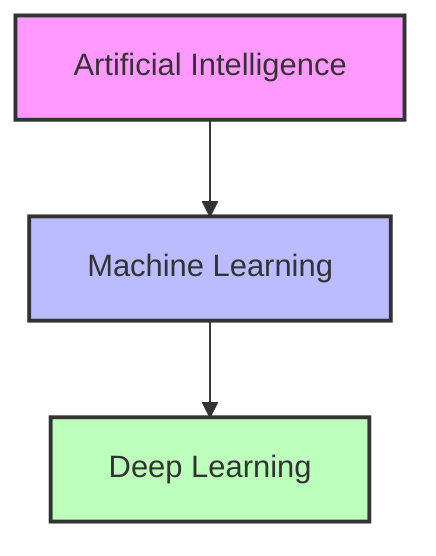

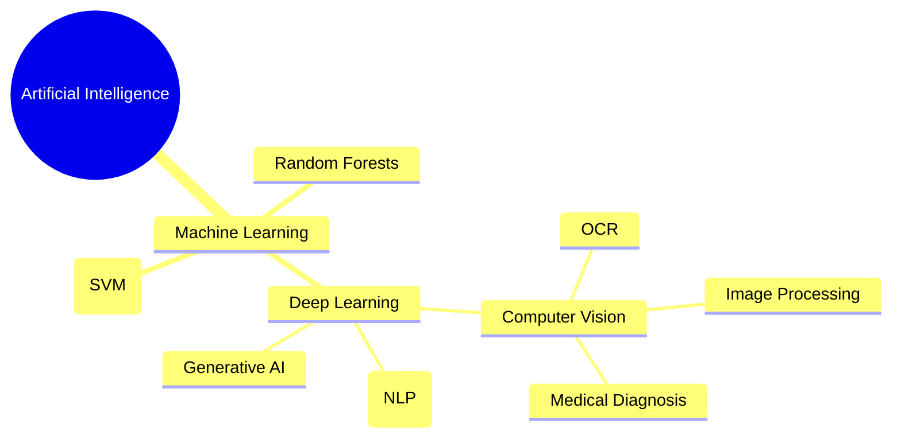

**Artificial Intelligence:** The broadest concept. It encompasses any technique that enables computers to mimic human intelligence, using logic, if-then rules, decision trees, and machine learning. Any technique that enables computers to mimic human intelligence falls under this umbrella.

**Machine Learning:** A subset of AI that includes statistical algorithms (like Support Vector Machines, Random Forests, Linear Regression) that allow computers to learn from data without being explicitly programmed for every scenario. It uses statistical methods to enable machines to improve with experience. Includes algorithms like Random Forests and SVMs.

**Deep Learning:** A subset of Machine Learning that exclusively uses deep neural networks. A subset of ML composed of Artificial Neural Networks (ANNs) with multiple "deep" layers. It learns complex representations directly from **raw data** (pixels, audio waves) without human intervention. The "deep" does not refer to a profound understanding, but rather to the number of successive layers of representation. The model learns through these layers, progressively extracting higher-level features from the raw input.

### Key Distinctions at a Glance

| Concept | Scope | Key Characteristic | Examples |
| :--- | :--- | :--- | :--- |
| **AI** | Broadest | Any technique mimicking human intelligence | Logic rules, decision trees, expert systems |
| **ML** | Subset of AI | Statistical learning from data | SVMs, Random Forests, Linear Regression |
| **DL** | Subset of ML | Deep neural networks learning from raw data | CNNs, RNNs, Transformers |

## How Deep Learning Learns Representations

In traditional Machine Learning, humans must manually engineer features (e.g., extracting edges from an image to detect a face). In Deep Learning, the network performs **Representation Learning** — it automatically discovers the representations needed for feature detection or classification from raw data.

The power of deep learning comes from its layered architecture, where each layer transforms the representation of the data into something slightly more abstract and composite:

- **Layer 1** might learn to detect raw edges (simple gradients, lines).
- **Layer 2** might combine edges to detect shapes (like eyes, noses, or corners).
- **Layer 3** might combine shapes to detect whole objects (like faces, cars, or animals).

This automated, hierarchical feature extraction is what makes Deep Learning so powerful for unstructured data like images, audio, and text. Instead of relying on a human domain expert to manually define which features matter, the network discovers the optimal feature hierarchy on its own through the training process.

> **Important Reminder:** Deep Learning is not a completely new paradigm separate from Machine Learning; it is a specific technique *within* Machine Learning. All Deep Learning is Machine Learning, but not all Machine Learning is Deep Learning. This distinction is critical: the mathematical foundations (gradient descent, loss functions, optimization) are shared across both, but Deep Learning's architectural depth enables it to tackle problems that are intractable for traditional ML methods.


Chapter 1 - Introduction to Deep Learning/10. Activation Functions in Deep Learning.md
   Language: markdown

# 10. Activation Functions in Deep Learning

Activation functions are the heart of neural networks. They introduce the non-linearity that allows networks to learn complex patterns — without them, no amount of layer stacking could produce anything beyond a simple linear model. Below is a comprehensive, exhaustive reference of all activation functions covered in the course, with full mathematical definitions, properties, usage guidelines, and practical considerations.

## Quick Reference Table

| Function       | Formula                           | Range | Characteristics & Usage                                                                                                     |
| :------------- | :-------------------------------- | :---- | :-------------------------------------------------------------------------------------------------------------------------- |
| **Sigmoid**    | $1 / (1 + e^{-x})$                | (0,1) | Squashes to [0,1]. Used **only** in the Output layer for binary classification. Causes Vanishing Gradient in hidden layers. |
| **Tanh**       | $(e^x - e^{-x}) / (e^x + e^{-x})$ | (-1,1)| Squashes to [-1, 1]. Better than sigmoid for hidden layers as it centers data around zero, aiding convergence.              |
| **Softmax**    | $e^{z_i} / \sum e^{z_j}$          | (0,1) | Used **only** in the Output layer for multi-class classification. Turns outputs into probabilities that sum to 1.           |
| **ReLU**       | $\max(0, x)$                      | [0,∞) | **The Industry Standard for Hidden Layers.** Extremely fast to compute. Solves the vanishing gradient problem.              |
| **Leaky ReLU** | $\max(0.01x, x)$                  | (-∞,∞)| Fixes the "Dying ReLU" problem (where neurons get stuck at 0) by allowing a slight negative slope.                          |
| **GELU**       | $x \cdot \Phi(x)$                 | (-∞,∞)| Used heavily in Transformers (BERT, GPT). A smoother, probabilistic version of ReLU.                                        |

## Exhaustive List with Full Details

### 1. Sigmoid (Logistic Function)
$$ \sigma(x) = \frac{1}{1 + e^{-x}} $$
- **Range:** $(0, 1)$ — output is always between 0 and 1, making it a natural probability.
- **Usage:** Binary Classification Output Layer.
- **Advantage:** Smooth, differentiable everywhere. Output can be directly interpreted as a probability.
- **Problem — Vanishing Gradient:** The derivative of sigmoid is $\sigma'(x) = \sigma(x)(1-\sigma(x))$, which has a maximum value of only $0.25$ (at $x=0$). This means every time we multiply backward through a layer during backpropagation, we multiply by a number smaller than $0.25$. By the time the gradient reaches the first layer of a deep network, it is effectively zero, and the first layer never learns.
- **Problem — Not Zero-Centered:** The sigmoid outputs are always positive (between 0 and 1). This causes the gradients for weights to always be the same sign during backpropagation, leading to inefficient zigzagging during optimization.

### 2. Tanh (Hyperbolic Tangent)
$$ \tanh(x) = \frac{e^x - e^{-x}}{e^x + e^{-x}} $$
- **Range:** $(-1, 1)$ — output is centered around zero.
- **Usage:** Hidden layers (historically). Similar to Sigmoid but centered at 0 (range -1 to 1), which facilitates faster convergence.
- **Advantage over Sigmoid:** Zero-centered — negative inputs produce negative outputs, and positive inputs produce positive outputs. This means the gradients for weights can be both positive and negative, leading to more efficient optimization paths.
- **Problem:** Still suffers from vanishing gradients (derivative maximum is 1.0 at $x=0$, but drops rapidly for large $|x|$). Not as severe as Sigmoid, but still problematic for very deep networks.

### 3. Softmax
$$ Softmax(z_i) = \frac{e^{z_i}}{\sum_{j} e^{z_j}} $$
- **Range:** $(0, 1)$ for each output, and all outputs sum to exactly 1.
- **Usage:** Multi-class Classification Output Layer. Transforms scores into a valid probability distribution (all outputs sum to 1).
- **Key Property:** The softmax amplifies differences — the largest input gets a disproportionately large share of the output probability. If one $z_i$ is significantly larger than the others, its softmax output will be close to 1 while the others are close to 0.
- **Always paired with:** Categorical Cross-Entropy loss.

### 4. ReLU (Rectified Linear Unit)
$$ f(x) = \max(0, x) $$
- **Range:** $[0, \infty)$ — zero for negative inputs, identity for positive inputs.
- **Usage:** **The Standard for Hidden Layers.** Extremely fast to calculate. Solves the vanishing gradient problem.
- **Advantage — No Vanishing Gradient:** The gradient is exactly 1 for all positive inputs. This means the gradient passes through unchanged during backpropagation, even in very deep networks. This single property revolutionized deep learning.
- **Advantage — Computational Simplicity:** ReLU requires only a comparison and a max operation — no exponentials or divisions. This makes it orders of magnitude faster to compute than Sigmoid or Tanh.
- **Advantage — Sparsity:** For any input $\le 0$, the output is exactly 0. This creates sparse activations (many neurons outputting zero), which is computationally efficient and acts as a natural regularizer.
- **Problem — "Dying ReLU":** Neurons can output 0 permanently and "die" because the gradient is 0 for all negative inputs. If a neuron's weights are updated such that it always receives negative inputs, it will output 0 forever, and its gradient will be 0, so it will never recover. With a high learning rate, up to 40% of neurons can "die" during training.

### 5. Leaky ReLU
$$ f(x) = \max(\alpha x, x) $$ where $\alpha$ is a small constant (e.g., 0.01).
- **Range:** $(-\infty, \infty)$ — slight negative slope for negative inputs.
- **Usage:** Fixes the "Dying ReLU" problem by allowing a slight negative slope, so neurons never have a gradient of exactly zero. Even when the input is negative, there is still a small but non-zero gradient flowing through, allowing the neuron to recover.
- **The constant $\alpha$:** Typically set to 0.01. This means negative inputs produce outputs that are 1% of the input value — small enough not to dominate, but large enough to keep the gradient alive.

### 6. PReLU (Parametric ReLU)
$$ f(x) = \max(\alpha x, x) $$ where $\alpha$ is a **learned parameter**.
- Same formula as Leaky ReLU, but $\alpha$ is not a fixed constant; it is a parameter learned by the network during training through backpropagation.
- **Advantage:** The network learns the optimal negative slope for each neuron, rather than requiring the practitioner to guess a good value. This makes PReLU more flexible and often more effective than Leaky ReLU.
- **Disadvantage:** Adds a small number of additional parameters to the model.

### 7. ELU (Exponential Linear Unit)
$$ f(x) = \begin{cases} x & \text{if } x > 0 \\ \alpha(e^x - 1) & \text{if } x \le 0 \end{cases} $$
- **Range:** $(-\alpha, \infty)$ — smooth transition to negative values.
- **Usage:** Tends to converge faster and produces activations closer to zero.
- **Advantage over ReLU:** The negative portion is smooth (not a sharp corner like ReLU/Leaky ReLU), which can help gradient-based optimization. Also pushes the mean activation closer to zero, which speeds up learning.
- **Disadvantage:** Requires computing an exponential for negative inputs, which is slower than ReLU.

### 8. Swish
$$ f(x) = x \cdot \sigma(x) $$
- **Range:** Approximately $(-0.28, \infty)$ — slightly negative for some inputs.
- **Usage:** Discovered by Google through automated search. Often outperforms ReLU in extremely deep networks (40+ layers).
- **Key Property:** Unlike ReLU which is a hard threshold, Swish is a smooth, non-monotonic function. It dips slightly below zero for inputs around -1.25 before rising again. This smoothness appears to help optimization in very deep networks.
- **Self-gating:** The sigmoid $\sigma(x)$ acts as a gate that controls how much of $x$ passes through — the network learns to automatically modulate the flow of information.

### 9. GELU (Gaussian Error Linear Unit)
$$ f(x) = x \cdot \Phi(x) $$
where $\Phi(x)$ is the cumulative distribution function of the standard normal distribution.
- **Range:** Approximately $(-0.17, \infty)$.
- **Usage:** Massively used in **Transformer architectures** (BERT, GPT, Gemini) due to its probabilistic nature. A smoother, probabilistic version of ReLU.
- **Intuition:** GELU can be interpreted as: "How likely is $x$ to be greater than a random value drawn from a standard normal distribution?" If $x$ is very large, $\Phi(x) \approx 1$ and the output is approximately $x$. If $x$ is very negative, $\Phi(x) \approx 0$ and the output is approximately 0. In between, the transition is smooth and probabilistic.
- **Approximation:** In practice, GELU is often approximated as $0.5x(1 + \tanh[\sqrt{2/\pi}(x + 0.044715x^3)])$ for computational efficiency.

## Cheatsheet for Activation Functions

> [!TIP] Quick Decision Guide
>
> - **Hidden Layers:** Always start with **ReLU**. If you have dead neurons (many neurons outputting 0 consistently), switch to Leaky ReLU. If you are building Transformers, use GELU.
> - **Output Layer (Binary Classification):** Sigmoid — outputs a single probability.
> - **Output Layer (Multi-class Classification):** Softmax — outputs a probability distribution over all classes.
> - **Output Layer (Regression):** Linear (no activation) — output can be any real number.

## The Vanishing Gradient Problem — In Depth

If we use the Sigmoid activation function, every time we multiply backward through a layer during backpropagation, we multiply by a number smaller than $0.25$. After just 10 layers, the gradient is multiplied by $0.25^{10} \approx 0.00000095$ — effectively zero. The first layer of the network receives almost no gradient signal and cannot learn.

This is why **ReLU** was such a revolutionary invention: its gradient is either 0 or 1 for positive inputs. For the positive pathway (which is the active portion of the network), the gradient passes through completely unchanged, even through hundreds of layers. This single change enabled the training of deep networks with dozens or even hundreds of layers, unlocking the era of modern deep learning.


# Chapter 1 - Introduction to Deep Learning/11. Multi-Layer Perceptron and Backpropagation.md
   Language: markdown

# 11. Multi-Layer Perceptron and Backpropagation

A Multi-Layer Perceptron (MLP), also known as an Artificial Neural Network (ANN), is a feedforward neural network capable of solving non-linearly separable problems by utilizing multiple layers of neurons via dense connections. The MLP overcomes the fundamental limitation of the single Perceptron — while a single Perceptron can only separate linearly separable data (like AND/OR), an MLP with at least one hidden layer can approximate any continuous function, including non-linear ones like XOR.

## Architecture of an MLP

1.  **Input Layer:** Receives the raw data (flattened into a 1D array). No math happens here; it just passes the values forward. No computation happens here — the input layer is simply a 1D array representing features.
2.  **Hidden Layers:** The "brain" of the network. Each neuron connects to all neurons in the previous layer (Dense/Fully Connected). They apply weights, biases, and non-linear activation functions to learn complex patterns. Each neuron applies $W^T X + b$ followed by an activation function. The number of layers and neurons are **Hyperparameters** (settings you choose before training) — they are not learned from data but must be chosen by the practitioner.
3.  **Output Layer:** Produces the final prediction. Its shape depends on your problem (1 neuron for binary, $N$ neurons for multi-class). Size depends on the task (1 for binary, $N$ for multi-class). Returns the prediction.

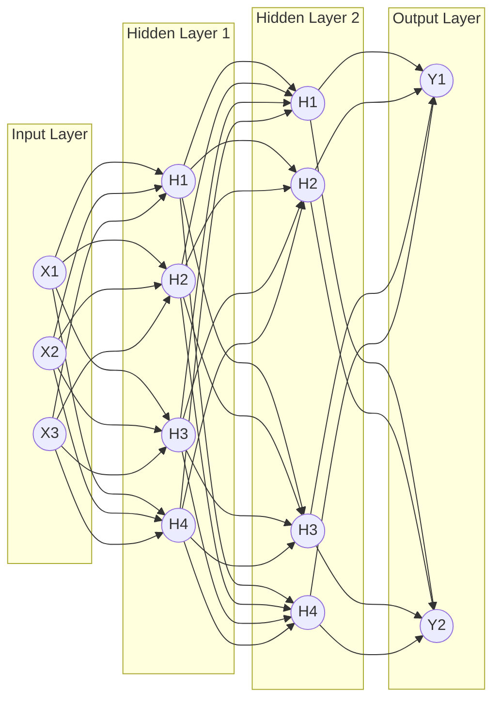

**Dense/Fully Connected:** Every neuron in one layer connects to every neuron in the next layer. This means if Layer 1 has 100 neurons and Layer 2 has 50 neurons, there are $100 \times 50 = 5,000$ weight connections (plus 50 bias terms) between just these two layers. This dense connectivity allows the network to learn any combination of features from the previous layer.

## The 4 Steps of Training: Backpropagation

Training a neural network is an iterative process governed by an algorithm called **Backpropagation**. The term "backpropagation" specifically refers to the efficient computation of gradients using the chain rule, not the entire training loop. _This process is repeated for thousands of **Epochs** until the loss is minimized._

1.  **Forward Pass:** Data flows from input to output. The network makes a prediction based on its current, random weights. Data flows through the network to generate a prediction (Actual Outputs vs Desired Outputs). Each layer computes its output and passes it to the next layer.

2.  **Calculate Loss:** We compare the prediction to the true target using a Loss Function (e.g., Cross-Entropy, MSE, BCE, CCE). This single number quantifies how wrong the entire network is on the current batch of data.

3.  **Backward Pass (Backpropagation):** The core algorithm of Deep Learning. The network calculates the **Gradient** (the derivative of the loss) for every single weight and bias in the network, starting from the output and moving backward to the input using the _Chain Rule of Calculus_. It utilizes the **Chain Rule of Calculus** to calculate the gradient (partial derivative) of the Loss Function with respect to _every single weight and bias_ in the network. This is the computationally brilliant part — instead of computing each gradient independently, backpropagation reuses intermediate results, making the entire gradient computation roughly the same cost as the forward pass.

4.  **Update Weights:** The optimizer (like SGD or Adam) uses the gradients to adjust the weights slightly to reduce the error. Using SGD or Adam on mini-batches, the weights are shifted slightly to decrease the error. The direction and magnitude of each update are determined by the gradient and the learning rate.

## MLP Notation (Advanced)

When dealing with a Multi-Layer Perceptron (MLP), the notation becomes more complex because we are tracking hundreds of weights across multiple layers. Having a consistent notation system is essential for understanding and implementing backpropagation correctly.

### Understanding the Notation

The slides provide a specific visual representation of an ANN with specific mathematical annotations:

- **Inputs:** $x_1, x_2$
- **Hidden Layer Activations:** $a_1^{(h)}, a_2^{(h)}, a_3^{(h)}$
  - The superscript $(h)$ denotes this belongs to the **H**idden layer.
  - The subscript denotes which neuron in that layer (neuron 1, 2, or 3).
- **Output Layer Activations:** $a_1^{(out)}, a_2^{(out)}$
  - The superscript $(out)$ denotes this belongs to the **Out**put layer.
- **Weights:** $w_{1,2}^{(h)}$
  - This is the weight connecting input $x_2$ to hidden neuron $a_1^{(h)}$.
  - Format: $w_{\text{destination\_neuron}, \text{source\_input}}^{(\text{layer})}$.
  - The first subscript is the destination (which neuron receives this signal).
  - The second subscript is the source (which neuron or input sends this signal).

This notation allows us to precisely identify every single connection in the network, which is essential for computing gradients during backpropagation.

### Backpropagating Through Multiple Layers

The Chain Rule applies exactly as it did in the Perceptron, but now it extends backward across multiple layers. This is where backpropagation gets its name — the errors "propagate backward" from the output through each hidden layer to the input.

If we want to update the weight connecting the first hidden neuron to the first output neuron ($w_{1,1}^{(out)}$), we calculate:

$$ \frac{\partial \mathcal{L}}{\partial w_{1,1}^{(out)}} = \frac{\partial \mathcal{L}}{\partial a_1^{(out)}} \times \frac{\partial a_1^{(out)}}{\partial w_{1,1}^{(out)}} $$

This is relatively simple — only two factors because the output layer is directly connected to the loss.

However, if we want to update a weight deep inside the network (e.g., in the very first hidden layer), the chain rule must multiply backward through the _entire_ network, accumulating gradients from every path that weight influenced. For a weight $w$ in the first hidden layer, the gradient depends on:
1. The loss gradient with respect to the output.
2. The output gradient with respect to the last hidden layer.
3. The last hidden layer gradient with respect to the second-to-last hidden layer.
4. ... and so on back to the first hidden layer.
5. The first hidden layer gradient with respect to the weight $w$.

Each layer in between contributes a multiplication factor to the chain.

### The Vanishing Gradient in Deep Networks

This is where the **Vanishing Gradient** problem occurs. If we use the Sigmoid activation function, every time we multiply backward through a layer, we multiply by a number smaller than $0.25$ (the maximum derivative of the sigmoid). By the time the gradient reaches the first layer of a deep network, it is effectively zero, and the first layer never learns. This is why **ReLU** was invented — its gradient is either 0 or 1 for positive inputs, so the gradient doesn't shrink as it passes through layers.

**Concrete example:** Consider a 10-layer network using Sigmoid activation. The gradient for a weight in Layer 1 would be multiplied by at most $0.25^{10} \approx 0.00000095$ as it propagates through the 10 layers. This means Layer 1 receives a gradient that is less than one-millionth of the original signal — far too small to produce meaningful weight updates. The network effectively stops learning in its early layers.


# Chapter 1 - Introduction to Deep Learning/12. Data Preparation and MLP Implementation.md
   Language: markdown

# 12. Data Preparation and MLP Implementation

This section covers the practical guidelines for implementing an MLP, from data preparation to preventing overfitting.

## 1. Data Preparation

- **Missing Values:** Must be imputed or dropped. Handle missing values by imputing or deleting them.
- **Categorical Variables:** Must be numericized using **One-Hot Encoding**. Use One-Hot Encoding for categorical text data.
- **Scaling:** You **MUST** scale data (Min-Max or Z-Score). Unscaled data will cause gradient descent to explode or stall. Scaling is crucial for convergence.
  - Use **Standardization (Z-score)** usually paired with **ReLU**.
  - Use **Min-Max** paired with **Sigmoid/Tanh**.

## 2. Data Structuring

Never train and test on the same data. Split your data:

- **Train Set (70%):** Used to update the weights. To learn the weights.
- **Validation Set (15%):** Used to evaluate hyperparameter choices (number of layers, learning rate) and prevent overfitting during training. To tune hyperparameters and trigger Early Stopping.
- **Test Set (15%):** Kept strictly isolated. Used only once at the very end to evaluate final real-world performance. Untouched data for final evaluation.
- **Data Augmentation:** Rotating, flipping, or zooming images artificially creates more data to improve model generalization.

## 3. Architectural Strategy

- **Incremental Approach:** Always start with a very simple model (1 hidden layer). Only add complexity if the model fails to capture the data relationships or if the simple model underfits.
- **Weight Initialization:** _Never initialize weights to zero_ (this causes symmetrical calculations where neurons learn the exact same things).
  - Use **Xavier (Glorot)** initialization for **Tanh/Sigmoid**.
  - Use **He** initialization for **ReLU**.

## 4. Preventing Overfitting (Surapprentissage)

Deep learning models are so powerful they can easily memorize the training data, failing on new data. Overfitting occurs when a model memorizes the training data but fails on new data.

- **Regularization (L1/L2):** Adds a penalty to the loss function for having overly large weights. Penalizes large weights.
- **Dropout:** Randomly deactivates a percentage of neurons during training. This prevents the network from becoming overly reliant on any specific feature or neuron. It randomly turns off a percentage of neurons during training, forcing the network to not rely on any single neuron.
- **Early Stopping (Arrêt précoce):** Continuously monitor the Validation Loss. If the Training Loss continues to drop, but the Validation Loss suddenly starts to rise, the model is beginning to overfit. Stop training immediately.

> [!TIP] Dataset Splitting
> Never train and test on the same data. Split your data:
>
> - **Train (70%):** To learn the weights.
> - **Validation (15%):** To tune hyperparameters (number of layers, learning rate) and trigger Early Stopping.
> - **Test (15%):** Untouched data for final evaluation.

---

## Feature Scaling Mathematics

Neural Networks are highly sensitive to the scale and distribution of input data. If Feature A ranges from 0-1 and Feature B ranges from 0-1,000,000, the gradient descent will create elongated contour plots, oscillating wildly and converging extremely slowly. Scaling creates circular contours, allowing GD to take a direct path to the minimum. Preprocessing is not optional; it is mandatory for convergence.

### Standardization (Z-Score Normalization)

Transforms the data to have a mean of 0 and a standard deviation of 1:

$$ x' = \frac{x - \mu}{\sigma} $$

- $\mu$ is the mean of the feature.
- $\sigma$ is the standard deviation of the feature.
- **When to use:** Always preferred when using **ReLU** activation. It centers the data around zero, which helps Gradient Descent navigate efficiently. It also handles outliers better than Min-Max because it doesn't bound the data to a specific range — an outlier at 1000 will be mapped to a high z-score but won't compress all other values into a tiny range.
- **Intuition:** After standardization, approximately 68% of values fall within $[-1, 1]$, 95% within $[-2, 2]$, and 99.7% within $[-3, 3]$.

### Normalization (Min-Max Scaling)

Squeezes the data into a fixed range, typically $[0, 1]$:

$$ x' = \frac{x - x_{min}}{x_{max} - x_{min}} $$

- **When to use:** Preferred when using **Sigmoid** or **Tanh** activations, as their active, non-saturating regions are explicitly bounded between 0 and 1 (or -1 and 1).
- **Vulnerability:** A single extreme outlier will compress all other values into a tiny range. For example, if one house costs $10,000,000 while all others are under $500,000, Min-Max scaling would map 99% of the data to values between 0 and 0.05, losing most of the discriminative information.

> [!WARNING] Critical Pitfall: Data Leakage
> You must fit the scaler (calculate $\mu, \sigma, x_{min}, x_{max}$) on the **Training Set only**. Then, use those exact parameters to transform the Validation and Test sets. If you calculate the min/max or mean/std on the entire dataset, you commit "data leakage" — giving the model hints about the test data during training. This results in artificially high performance that will not hold in production. The test set must remain completely unseen during all preprocessing decisions.

## Regularization Mathematics (Preventing Overfitting)

When an MLP has too many parameters relative to the data, it memorizes the training set (Overfitting). The model achieves near-zero training loss but performs poorly on new, unseen data. Regularization adds a penalty to the cost function to force the network to keep weights small and simple, preventing it from fitting the noise in the training data.

### L2 Regularization (Ridge / Weight Decay)

We add the squared magnitude of the weights to the loss function:

$$ J_{regularized} = J_{original} + \lambda \sum_{j=1}^{m} w_j^2 $$

- $\lambda$ (lambda) is the regularization strength hyperparameter. A larger $\lambda$ forces the weights to be smaller; a smaller $\lambda$ allows them to grow freely.
- **Effect:** Forces weights to be small but rarely exactly zero. It smooths the model by preventing any single weight from becoming too large and dominating the prediction. This is the most common form of regularization in Deep Learning, where it is often called **Weight Decay**.
- **Why it works:** Large weights indicate that the model is relying heavily on specific features, which is a sign of overfitting. By penalizing large weights, L2 regularization forces the model to spread importance across many features, leading to more robust predictions.
- **Gradient:** The gradient of the regularization term is $2\lambda w_j$, which is added to the gradient of the original loss. This means the regularization effect is proportional to the current weight value — larger weights are penalized more.

### L1 Regularization (Lasso)

We add the absolute magnitude of the weights to the loss function:

$$ J_{regularized} = J_{original} + \lambda \sum_{j=1}^{m} |w_j| $$

- **Effect:** The absolute value derivative is constant (either +1 or -1), which causes many weights to be pushed exactly to zero. This creates a **sparse** model, effectively performing feature selection — the network learns to ignore useless features by setting their weights to exactly 0.
- **Why it works:** Unlike L2 where the penalty decreases as the weight approaches zero (proportional to $w$), L1 applies a constant force toward zero regardless of the weight's current value. This means even very small weights are pushed all the way to zero.
- **Use case:** When you suspect many features are irrelevant and want the model to automatically identify and discard them. L1 is popular in interpretability-critical applications where you need to know which features matter.

### Choosing Between L1 and L2

- **L2 (Ridge):** Use when you believe all features contribute somewhat and you want to prevent any one from dominating. This is the default choice in most deep learning applications.
- **L1 (Lasso):** Use when you want feature selection — a sparse model where many weights are exactly zero. Useful when interpretability is important.
- **Elastic Net (L1 + L2):** Combines both penalties: $J_{reg} = J_{original} + \lambda_1 \sum |w_j| + \lambda_2 \sum w_j^2$. Gets the sparsity of L1 with the stability of L2.

## Weight Initialization Mathematics

If all weights start at 0, every neuron in a layer computes the same output, receives the same gradient, and updates identically. The layer acts as a single neuron — a phenomenon called **symmetry breaking failure**. We must initialize weights randomly, but carefully. The initialization must ensure that the variance of activations and gradients remains stable as they pass through the network.

### The Problem with Naive Random Initialization

If weights are initialized with too-large values, activations grow exponentially through the layers (exploding gradients). If weights are initialized with too-small values, activations shrink to zero through the layers (vanishing gradients). Both scenarios prevent the network from learning.

### Xavier Initialization (Glorot)

Designed for Sigmoid and Tanh activations. It ensures the variance of the outputs of a layer is roughly equal to the variance of its inputs:

$$ W \sim \mathcal{N}\left(0, \sqrt{\frac{1}{n_{in}}}\right) $$

Or using a uniform distribution:

$$ W \sim \mathcal{U}\left(-\sqrt{\frac{6}{n_{in} + n_{out}}}, +\sqrt{\frac{6}{n_{in} + n_{out}}}\right) $$

- $n_{in}$: Number of input neurons to the layer.
- $n_{out}$: Number of output neurons from the layer.
- **Effect:** By scaling the initial weights inversely with the number of inputs, the variance of each neuron's output is approximately equal to the variance of its input. This prevents activations from growing or shrinking as they pass through the network, maintaining a stable signal throughout the forward pass.

### He Initialization

Designed specifically for ReLU and its variants. Since ReLU zeros out half of the inputs (negative ones), the variance of the output is effectively halved compared to the input. He initialization compensates by doubling the variance:

$$ W \sim \mathcal{N}\left(0, \sqrt{\frac{2}{n_{in}}}\right) $$

- **Effect:** Prevents the signal from dying out (vanishing) or exploding (exploding gradients) as it passes through dozens of deep layers. The factor of 2 compensates for the fact that ReLU discards approximately half of the activations.
- **Rule of thumb:** Always use He initialization with ReLU/Leaky ReLU/PReLU/ELU. Always use Xavier initialization with Sigmoid/Tanh. Using the wrong initialization can cause the network to fail to converge entirely.

> [!WARNING] Never Initialize Weights to Zero
> If all weights start at 0, every neuron in a layer computes the same output $z = 0 \cdot x_1 + 0 \cdot x_2 + \dots + b = b$, receives the same gradient during backpropagation (because the gradient depends on the same inputs and same errors), and updates by the same amount. After one update, all neurons still have identical weights. The layer effectively acts as a single neuron regardless of how many neurons it contains. This symmetry must be broken by random initialization.

## MLP Implementation Strategy

Building an effective MLP requires a disciplined, iterative approach. Throwing a massive network at a problem and hoping for the best is a recipe for wasted time and poor results.

### 1. Start Simple

Build a network with just 1 hidden layer. See how it performs before adding complexity. A simple model that works is always preferable to a complex model that might work. If a single hidden layer achieves 95% accuracy, adding more layers might only improve it to 95.5% while making training slower and more prone to overfitting.

### 2. Adapt to Task

Complex tasks (high-dimensional images, natural language) need deeper/wider networks. Simple tabular data might only need 1-2 layers. The architecture should be proportional to the complexity of the problem:
- **Simple problems** (tabular data with few features): 1-2 hidden layers with 32-128 neurons each.
- **Medium problems** (small images, short text): 2-4 hidden layers with 128-512 neurons each.
- **Complex problems** (large images, long sequences): Deep architectures (CNNs, RNNs, Transformers) rather than simple MLPs — raw MLPs are rarely used for these tasks.

### 3. Track Metrics

Always plot Training Loss and Validation Loss together. The relationship between these two curves tells you exactly what is happening:

- **If both are high:** The model is **underfitting** — it hasn't learned the patterns in the data. Solution: increase model capacity (more layers, more neurons), train longer, or reduce regularization.
- **If Training Loss is low but Validation Loss is high:** The model is **overfitting** — it has memorized the training data but can't generalize. Solution: add regularization (L2, Dropout), get more data, use data augmentation, or reduce model capacity.
- **If both are low and close together:** The model is well-fit — it has learned the patterns without memorizing the noise. This is the ideal scenario.

### 4. Iterate: Change One Hyperparameter at a Time

Deep Learning is highly empirical. If you change the learning rate, batch size, and number of layers all at once and the model improves, you won't know which change caused the improvement. Follow a systematic approach:

1. Start with a baseline architecture and default hyperparameters.
2. Change ONE hyperparameter (e.g., learning rate from 0.01 to 0.001).
3. Train and evaluate.
4. If improvement, keep the change; if worse, revert.
5. Move to the next hyperparameter.

**Hyperparameter search order (by importance):**
1. **Learning rate** — the most impactful. Start with 0.001 (Adam default) and try log-scale variations.
2. **Batch size** — affects generalization and training speed. Try 32, 64, 128, 256.
3. **Number of hidden layers and neurons** — determines model capacity. Start small and grow.
4. **Regularization strength** ($\lambda$, dropout rate) — prevents overfitting. Add only if overfitting is observed.
5. **Activation function** — ReLU is the default; try Leaky ReLU or GELU only if ReLU underperforms.


# Chapter 1 - Introduction to Deep Learning/2. Machine Learning vs Deep Learning.md
   Language: markdown

# 2. Machine Learning vs Deep Learning

Understanding when to use standard Machine Learning versus Deep Learning is a critical skill for any Data Scientist or AI Engineer. Understanding the differences between classical Machine Learning (ML) and Deep Learning (DL) is critical for choosing the right tool for a given problem. The differences span data requirements, human intervention, hardware, and performance scaling.

## Feature Engineering: The Core Difference

The most fundamental difference lies in **Feature Extraction**.

- **Machine Learning (Traditional):** Requires **Feature Engineering**. A human expert must manually extract relevant features from the raw data. A human expert must manually identify and extract features from raw data to feed into the model. _Example: For a self-driving car, a human writes code to find edges, circles (wheels), and colors. For a spam detector, a human might manually create features like "contains the word 'FREE'" or "number of exclamation marks."_
- **Deep Learning:** Features are learned automatically. The network is fed raw data (pixels) and learns on its own what features (edges, shapes, objects) are important to make the final decision. The neural network figures out which combinations of pixels form edges, which edges form shapes, and which shapes form objects. No human intervention is needed for feature design — the model performs **end-to-end learning** directly from raw input to final output.

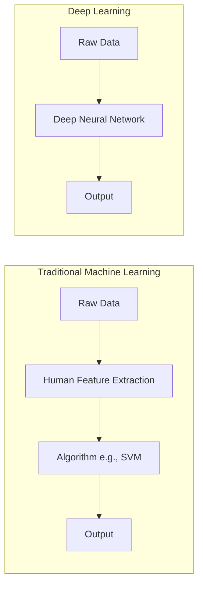

## Data Volume and Performance Scaling

The performance of ML and DL scales differently with the amount of data. This is one of the most important practical distinctions:

- **ML:** Performance plateaus early. After a certain amount of data, traditional algorithms (like SVMs or Random Forests) stop improving significantly. No matter how much more data you feed them, their accuracy stays roughly the same.
- **DL:** Performance continues to scale with more data. Given massive datasets (Big Data), Deep Learning models will continuously improve, eventually far surpassing classical ML models. This is why the era of Big Data has been so beneficial to Deep Learning — the more data, the better the model.

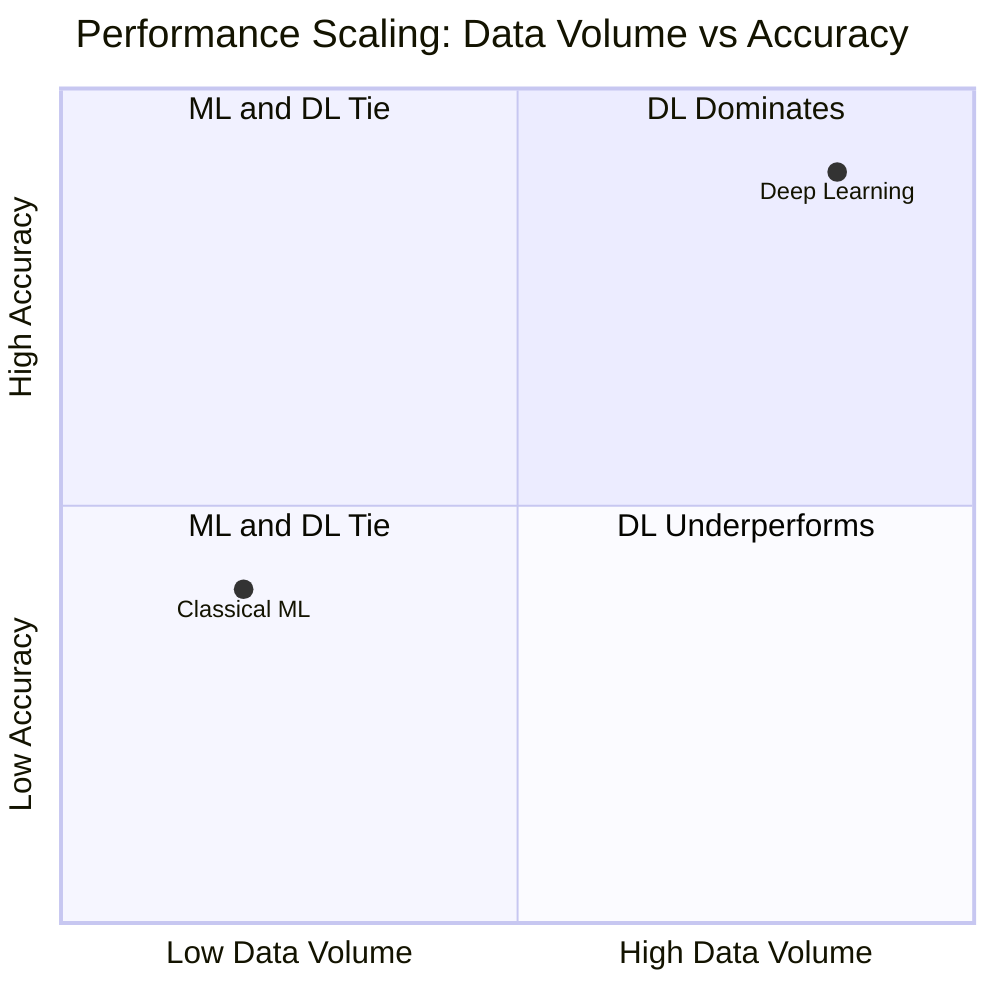

What this means in practice: if you have a small dataset (hundreds or a few thousand examples), classical ML may match or even outperform DL. But as your dataset grows into the millions, DL will pull ahead dramatically.

## Hardware and Computational Complexity

- **ML:** Can often be trained efficiently on standard CPUs (Central Processing Units). Training times range from seconds to hours. The computational demands are modest because the models have relatively few parameters and the mathematical operations are straightforward.
- **DL:** Involves millions or billions of matrix multiplications. Training on a CPU would take months or years. DL requires GPUs (Graphics Processing Units) or TPUs (Tensor Processing Units) to parallelize these calculations. A GPU can perform thousands of matrix operations simultaneously, which is exactly what neural network training demands. While training is extremely slow and computationally expensive, **inference** (making predictions on new data) is very fast — a trained neural network can classify an image in milliseconds.

## Detailed Comparison Table

Understanding the exact logistical differences is crucial for project planning. Below is a comprehensive comparison covering all major dimensions:

| Characteristic              | Machine Learning (Traditional)                    | Deep Learning                                   |
| :-------------------------- | :------------------------------------------------ | :---------------------------------------------- |
| **Type of Learning**        | Supervised or Unsupervised                        | Supervised, Semi-supervised, Reinforcement      |
| **Human Intervention**      | **High to Medium** (Feature Engineering required) | **Low** (Features learned automatically)        |
| **Input Data Type**         | Structured or Unstructured (Tabular)              | **Strictly Unstructured** (Pixels, Audio, Text) |
| **Output Data Type**        | Numerical Values                                  | Numerical, Text, Image, Voice, Video            |
| **Data Volume Needed**      | Low to Medium (Thousands)                         | **Extremely High** (Millions/Billions)          |
| **Data Quality Importance** | **Very High** (Garbage in = Garbage out)          | High                                            |
| **Training Duration**       | Short (Minutes/Hours)                             | **Long** (Days/Weeks/Months)                    |
| **Compute Power**           | Low to Medium (**CPUs**)                          | Strong (**GPUs/TPUs**)                          |
| **Interpretability**        | High (White-box, e.g., Decision Trees)            | Low (Black-box, hard to explain decisions)      |
| **Best Use Case**           | Structured/Tabular data                           | Unstructured data (Image, Text, Audio)          |

### Important Nuances in the Comparison

- **Learning Type:** DL uniquely benefits from **Semi-supervised learning** (using a small amount of labeled data with a large amount of unlabeled data) and **Reinforcement learning** (learning through rewards and penalties), which are far less common in traditional ML.
- **Input Data Type:** While ML can technically handle unstructured data, it requires extensive human preprocessing first. DL excels precisely because it processes raw, unstructured data directly — pixels, audio waveforms, or raw text characters — without any manual feature extraction step.
- **Data Quality Importance:** ML is extremely sensitive to data quality because the features are human-defined — if the features are poorly chosen, the model will fail regardless of algorithm choice ("Garbage in, Garbage out"). DL is somewhat more tolerant because it learns its own features, but it still requires clean, representative training data.
- **Interpretability:** This is a major concern. A Decision Tree in ML can tell you exactly *why* it made a decision (you can trace the path through the tree). A deep neural network with 100 million parameters is essentially a "black box" — it gives you the right answer, but explaining *why* is extremely difficult. This matters in domains like medicine or finance where explainability is legally required.

> [!WARNING] Common Pitfall
> Students often think Deep Learning is always better. It is **not**. If you have tabular data (like an Excel sheet with house prices), algorithms like Random Forest or XGBoost will often beat Deep Learning, train much faster, and be much easier to explain. Save Deep Learning for Images, Text, and Audio. DL shines when data is raw, unstructured, and massive.

## Framework Dominance

To build these applications, we rely on two dominant software frameworks:

- **PyTorch (Facebook/Meta):** Currently dominates academic research. It is highly flexible, dynamic, and Pythonic. The paper implementations graph shows PyTorch holding ~60% of code repositories. It is the undisputed standard in **Research** and academia.
- **TensorFlow (Google):** Highly robust, with comprehensive deployment tools. Historically the standard in **Production/Industry**, though its research share has dropped to ~2%. PyTorch is rapidly catching up in the production space as well.


# Chapter 1 - Introduction to Deep Learning/3. Evolution and History of Deep Learning.md
   Language: markdown

# 3. Evolution and History of Deep Learning

Deep Learning seems like an overnight success, but its evolution spans over 80 years, marked by "AI Winters" and explosive revivals. Understanding this history is important because it explains why certain techniques exist and why the field developed the way it did.

## The Timeline of Neural Networks

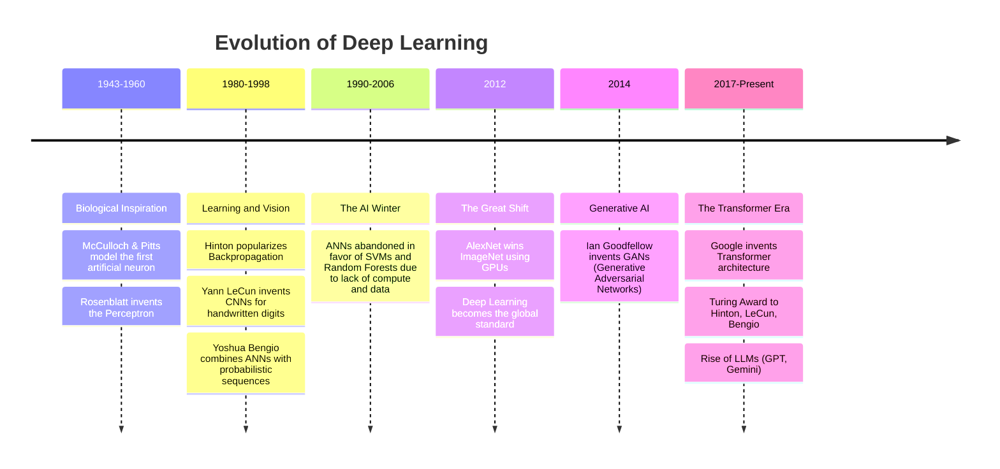

## Key Historical Milestones Explained

### 1. The Origins (1943-1960): Biological Inspiration

The initial goal was to mimic the human brain. Warren McCulloch and Walter Pitts created the first mathematical model of a neuron — a simplified computational unit that could perform logical operations. This was purely theoretical, but it proved that simple computational units could be combined to perform complex reasoning.

Frank Rosenblatt later invented the **Perceptron** (1958), the first algorithmic neural network that could actually learn weights from data. The Perceptron was a breakthrough: it was a machine that could improve its own performance through experience, adapting its internal parameters based on the data it saw.

### 2. The First AI Winter (1970s): The XOR Problem

Researchers realized the Perceptron could only solve **linearly separable** problems (like AND/OR functions) but failed on non-linear ones (like the XOR problem). Marvin Minsky and Seymour Papert published a book in 1969 proving that a single-layer Perceptron was fundamentally incapable of solving XOR. This mathematical proof caused funding and interest to collapse entirely. The field entered its first "AI Winter" — a period of stagnation, reduced funding, and skepticism about neural networks.

The irony is that multi-layer networks (which we now call MLPs) _could_ solve XOR, but at the time there was no efficient algorithm to train them. The technology simply wasn't ready.

### 3. The Backpropagation Revival (1986): Learning Returns

Geoffrey Hinton and colleagues popularized the **Backpropagation** algorithm in 1986, allowing multi-layered networks (MLPs) to learn by propagating errors backward through the network's layers. This was a monumental breakthrough — it provided the missing training algorithm that made deep networks feasible.

Yann LeCun later used backpropagation to build **Convolutional Neural Networks (CNNs)** for reading handwritten zip codes at the US Postal Service. This was one of the first real-world, commercial applications of neural networks. Yoshua Bengio advanced sequence models and attention mechanisms, laying groundwork for the NLP revolution that would come decades later.

### 4. The Second AI Winter (1990s-2006): Compute Wasn't Ready

Despite backpropagation being theoretically sound, computers were too slow and datasets too small for deep networks to show their potential. Training a network with more than 2-3 layers could take weeks on the hardware of the era, and the results were often no better than simpler methods.

Simpler, mathematically grounded algorithms like Support Vector Machines (SVMs) and Random Forests dominated because they were faster to train, more reliable on small data, and had strong theoretical guarantees. Neural networks were largely abandoned by the mainstream AI community during this period.

### 5. The ImageNet Revolution (2012): The Turning Point

The ILSVRC (ImageNet Large Scale Visual Recognition Challenge) required classifying 1.4 million images into 1000 categories. This was an enormous, unprecedented dataset that traditional methods struggled with.

Alex Krizhevsky, Ilya Sutskever, and Geoffrey Hinton created **AlexNet**, a deep CNN that crushed the competition, reducing the error rate by nearly half compared to the previous year's winner. This was the watershed moment that convinced the entire AI community that deep learning was the future.

**The Secret Weapons:**
1. **Big Data:** The massive ImageNet dataset provided enough examples for deep networks to learn meaningful representations. Without sufficient data, deep networks simply overfit.
2. **GPUs:** Hinton's brilliant idea to use graphics cards (originally designed for rendering video games) to parallelize the massive matrix multiplications required by neural networks. A single GPU could perform thousands of operations simultaneously, reducing training time from months to days.

### 6. The Generative Era (2014-Present): From Recognition to Creation

- **2014:** Ian Goodfellow creates GANs (Generative Adversarial Networks), allowing AI to generate realistic images for the first time. GANs pit two networks against each other — a generator that creates fake data and a discriminator that tries to detect it — resulting in increasingly convincing synthetic outputs.
- **2017:** Google publishes "Attention is All You Need", introducing the **Transformer** architecture, which eschews recurrence for attention mechanisms. This architecture would revolutionize NLP and eventually become the foundation for all modern language models.
- **2018:** Hinton, LeCun, and Bengio win the Turing Award (the "Nobel of Computing") for their foundational contributions to deep learning.
- **2020+:** The era of Large Language Models (LLMs) like GPT-3, ChatGPT, and Gemini, bringing deep learning into everyday life and demonstrating that scaled-up Transformer models can achieve remarkable general-purpose intelligence.

> **Key Takeaway:** Deep Learning did not emerge from a vacuum. It required three simultaneous breakthroughs: **Big Data** (the internet created massive datasets), **Compute** (GPUs provided the necessary processing power), and **Algorithms** (backpropagation, ReLU, and later Transformers provided the mathematical framework). Missing any one of these three pillars, deep learning would not exist as we know it today.


# Chapter 1 - Introduction to Deep Learning/4. Applications of Deep Learning.md
   Language: markdown

# 4. Applications of Deep Learning

Deep Learning has achieved superhuman performance in domains where data is unstructured and highly complex. Deep learning is preferred because it demonstrates unparalleled performance in image recognition, speech recognition, and natural language processing. It has transformed entire industries by enabling machines to perceive, understand, and generate content in ways that were previously impossible.

## Computer Vision (Image / Video)

This is the domain where DL first proved its dominance (via AlexNet in 2012). While "Computer Vision" is a broad umbrella term, Deep Learning breaks it down into highly specific, distinct tasks. A model built for one task usually cannot perform the other without architectural changes. Understanding these distinct tasks is essential because each requires a different network architecture and training approach.

### The 4 Pillars of Image Analysis

#### 1. Classification
- **Goal:** Assign a single label to an entire image.
- **How it works:** The network processes the entire image and outputs a single category label. It answers the question "What is in this image?" with one answer.
- **Example:** Looking at an image and outputting "Grille" (Grill), "Mushroom", or "Madagascar Cat". This was the primary focus of the 2012 ImageNet challenge, where AlexNet classified images into 1000 categories.
- **Architecture:** Typically uses CNNs with a final fully-connected layer outputting a probability distribution over all classes via Softmax.

#### 2. Retrieval (Content Association)
- **Goal:** Given a reference image, search a massive database to find visually or semantically similar images.
- **How it works:** The network encodes images into compact feature vectors (embeddings). Similar images will have similar embeddings, allowing fast similarity search across millions of images.
- **Example:** Uploading a picture of a specific flower and having the system return 10 images of the exact same flower species from different angles.
- **Applications:** Reverse image search (Google Images), product recommendation (find similar products from a photo).

#### 3. Detection (Object Detection)
- **Goal:** Locate specific objects within an image and draw a **Bounding Box** around them. This goes beyond classification — it not only identifies *what* objects are present but *where* they are.
- **How it works:** The network outputs both a class label and a set of coordinates (x, y, width, height) for each detected object. Multiple objects can be detected in a single image.
- **Example:** Identifying a person, a horse, and a dog in the same image, drawing a colored rectangle around each, and labeling them (e.g., using the _Faster R-CNN_ architecture). Used heavily in **Autonomous Vehicles** to detect pedestrians, roads, and other cars simultaneously.
- **Architecture:** Uses specialized detection architectures like YOLO (You Only Look Once), SSD, or Faster R-CNN that combine region proposal with classification.

#### 4. Segmentation (Semantic Segmentation)
- **Goal:** The most complex task. It classifies _every single pixel_ in the image, creating a precise, color-coded mask of the objects. Instead of a box around an object, you get the exact pixel-level outline.
- **How it works:** The network outputs a class prediction for every pixel in the input image, producing a dense prediction map rather than a single label or bounding box.
- **Example:** Instead of a box around a car, the exact outline of the car, the road, the sky, and pedestrians are highlighted pixel-by-pixel (e.g., _Farabet et al._). Used in **Medical Imaging** to precisely outline tumors or pneumothorax in X-rays.
- **Architecture:** Uses encoder-decoder architectures like cU-Net, DeepLab, or FCN (Fully Convolutional Networks).

Additional CV applications include **Facial Recognition** for security, authentication, and social media tagging.

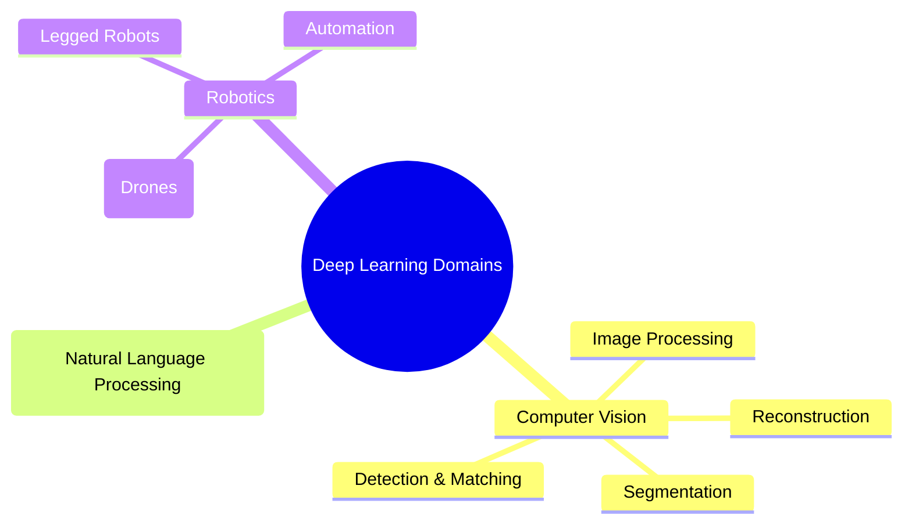

_Note: As shown in the slide's Venn diagram, Computer Vision often intersects heavily with Robotics (for navigation) and NLP (for generating image captions). A self-driving car, for instance, uses CV to perceive the world, NLP to understand voice commands, and Robotics to control the vehicle._

## Natural Language Processing (Text / Audio)

- **Machine Translation:** Translating languages contextually (Google Translate). Modern translation systems use Transformer architectures that can understand the full context of a sentence, not just translate word-by-word.
- **Sentiment Analysis:** Determining if a review is positive or negative (Marketing). This has enormous commercial value for brands monitoring social media and customer feedback.
- **Chatbots & LLMs:** ChatGPT, Gemini, summarizing documents, generating code. These models can engage in multi-turn conversations, answer questions, write essays, and even write functional software code.
- **Speech Recognition & Synthesis:** Converting voice to text (Siri, Alexa) and text to realistic speech. Modern systems can handle multiple languages, accents, and even emotional intonation.

## Industry-Specific Applications

### 1. Transport
- **Autonomous Vehicles:** DL identifies elements in the physical environment with precision (roads, sidewalks, pedestrians, other cars). This is perhaps the most demanding CV application because it requires real-time processing with extremely high reliability — a missed pedestrian can be fatal.
- **Sensor Fusion:** Navigation relies on fusing multi-source data: camera images, GPS, and LiDAR point clouds to ensure safety and civil liability. No single sensor type is sufficient; the power comes from combining them intelligently.

### 2. Agri-Food (Agroalimentaire)
- **Quality Control:** Visual recognition technologies identify potential debris or contaminants in food during production. The high accuracy of deep networks provides reliability that QA professionals depend on. This replaces slow, error-prone manual inspection on fast-moving production lines.

### 3. Security
- **Surveillance:** Object recognition is widely used to secure public spaces (airports, subways, concert halls). Modern systems can track multiple individuals across multiple camera feeds simultaneously.
- **Risk Detection:** Cameras detect risky situations such as stampedes, fights, crowd movements, or the presence of dangerous objects (weapons). These systems can alert security personnel in real-time before situations escalate.

### 4. Marketing and Commerce
- **Contextualization:** Social networks use DL to identify objects, locations, people, logos, and the context of shared images. This allows platforms to understand what content users are posting and consuming.
- **Targeting:** This visual analysis allows networks to contextualize users to optimize targeted advertising. If a user frequently posts images of hiking gear, the system can infer their interests and serve relevant ads.

### 5. Banking and Finance
- **Document Processing:** Automating document handling (e.g., automated check deposits via mobile apps or ATMs). This eliminates the need for manual data entry and reduces processing time from days to seconds.
- **OCR (Optical Character Recognition):** DL reads handwritten text on checks, extracting the content to determine deposit parameters without human operator intervention. Handwriting recognition is a particularly challenging CV task because handwriting varies enormously between individuals.
- **Fraud Detection & Algorithmic Trading:** Automated pattern recognition in financial data can detect anomalous transactions that may indicate fraud, and high-frequency trading algorithms use deep learning to predict short-term price movements.

### 6. Manufacturing Industry
- **Robotics & Logistics:** Autonomous navigation of robots in warehouses significantly accelerates the supply chain and production volume. Amazon warehouses use thousands of DL-powered robots to move inventory.
- **Quality Assurance:** Automated visual inspection of manufactured parts. DL models can detect microscopic defects that human inspectors would miss, operating 24/7 without fatigue.

### 7. Medicine
- **Non-Invasive Diagnostics:** Automated analysis of medical images (X-rays, MRIs, regular photos) to diagnose pathologies like skin diseases without invasive procedures. In some studies, DL models have matched or exceeded the diagnostic accuracy of specialist physicians, particularly in dermatology and radiology.


# Chapter 1 - Introduction to Deep Learning/5. Gradient Descent Optimization.md
   Language: markdown

# 5. Gradient Descent Optimization

Gradient Descent (Descente de Gradient) is the absolute backbone of Deep Learning. It is an iterative optimization algorithm used to find the minimum of a differentiable function—specifically, the Loss Function (Cost Function). Every neural network, from the simplest Perceptron to the largest Transformer, relies on gradient descent (or a variant of it) to learn.

## Essential Background Knowledge

In machine learning, we want our model to make accurate predictions. To achieve this, we define a **Loss Function** $J(\theta)$, which measures how "wrong" our model is. The goal of training is to find the parameters (weights and biases) that minimize this loss function. Gradient descent is the mechanism by which we systematically search for those optimal parameters.

## The Concept of Optimization

Optimization is the process of minimizing a **differentiable and convex** function. In DL, this function is the **Loss Function** (how wrong our model is).

Imagine a blindfolded person trying to walk down to the bottom of a valley. They feel the slope of the ground under their feet and take a step in the direction where the slope goes downward the steepest. The slope is the **Gradient**, and the size of the step is the **Learning Rate**.

### The Mathematical Problem: Why We Can't Just Solve It Directly

Imagine we want to minimize a simple function $f(x) = x^2 - x + 1$.

- **Analytical Solution:** We calculate the derivative, set it to 0 ($f'(x) = 0$), and ensure the second derivative is positive ($f''(x) > 0$).
  - $f'(x) = 2x - 1 = 0 \Rightarrow x^* = 1/2$.
  - $f''(x) = 2 > 0$, so this is indeed a minimum.
  - This gives us the exact answer in one step.

- **The DL Reality:** In Deep Learning, our function has millions of parameters ($x$). An analytical solution is impossible because:
  1. Setting the gradient to zero gives us a system of millions of equations with millions of unknowns.
  2. The equations are highly non-linear (due to activation functions and nested compositions).
  3. The computation is too expensive to solve directly even if it were possible.
  
  We must use an **iterative approximation**: Gradient Descent.

## What is Gradient Descent?

### The Algorithm

1.  **Initialize** parameters randomly (e.g., $x_0$). The starting point is arbitrary — we simply begin somewhere and move toward better values.
2.  **Calculate the Gradient:** Find the derivative of the function at the current point, $f'(x_t)$. The gradient points in the direction of the steepest ascent. This tells us which direction makes the function increase the fastest.
3.  **Update Parameters:** Move in the **opposite** direction of the gradient. Since the gradient points uphill, going the opposite direction takes us downhill — toward the minimum.
4.  **Repeat** until convergence (when the gradient is zero or very close to zero). At the minimum, the slope is flat, so there's no direction to move.

**The Update Rule:**
$$ x_{t+1} = x_t - \alpha \nabla f(x_t) $$

- $x_0$: The starting point (initialized randomly).
- $x$: The parameter we are trying to optimize.
- $\alpha$ (Alpha / Learning Rate, formerly called $\eta$ 'eta'): The step size. It is a hyperparameter that modulates the size of the correction.
- $\nabla f(x_t)$: The gradient (slope/derivative) evaluated at the current point.

> [!TIP] Understanding the Learning Rate ($\alpha$)
>
> The learning rate is arguably the most important hyperparameter in deep learning. Choosing it correctly is critical:
> - **Too small:** The algorithm will take tiny steps. It will eventually find the minimum, but it will take an eternity. The convergence is agonizingly slow and may get stuck in local minima because the steps are too small to escape them.
> - **Too large:** The algorithm will take giant steps, overshooting the minimum entirely. It might bounce back and forth across the valley and even diverge (the loss increases to infinity). The loss will bounce wildly or even diverge to infinity.

**Stopping Criterion:** We stop when we reach convergence. This happens when the number of iterations reaches a fixed limit, or when the difference between successive values $|| \nabla f(x_t) ||$ or $|f(x_i) - f(x_{i+1})|$ is infinitesimally small. In practice, we often set a maximum number of epochs and monitor the loss curve for plateau behavior.

## Convexity vs. Non-Convexity

The behavior of gradient descent depends fundamentally on the shape of the loss landscape.

### Convex Functions

- **Convex Function:** Looks like a single, smooth bowl (a U-shape). It has only one global minimum. Linear regression loss (MSE) is convex.
- A function $f$ is convex on an interval $I$ if its derivative $f'$ is **strictly increasing** on $I$.
- _Reminder:_ A function itself is increasing when its derivative is positive.
- On a convex landscape, gradient descent is guaranteed to find the global minimum regardless of the starting point. It will roll straight to the bottom of the bowl.

### Non-Convex Functions

- **Non-Convex Function:** Looks like a mountain range with multiple valleys. It has **Local Minima** (a small valley) and a **Global Minimum** (the deepest valley). Neural Network loss functions are highly non-convex.
- **Concave Function:** A function $f$ is concave on an interval $I$ if its derivative $f'$ is **strictly decreasing** on $I$.

> [!WARNING] The Danger of Non-Convexity
> If you use MSE (a convex function) on a Linear model, you get a convex landscape. If you use MSE on a Logistic (Sigmoid) model, the resulting landscape is non-convex.
> 
> A non-convex function has multiple "valleys." The algorithm will follow the slope down into the _nearest_ valley (Minimum local) and stop, completely missing the true lowest point (Minimum global). In non-convex landscapes, Gradient Descent can get stuck in a **Local Minimum**—a valley that is low, but not the lowest possible valley. It converges prematurely.
> 
> This is why the choice of loss function matters so much: using MSE for classification results in a non-convex landscape with many local minima, making training nearly impossible. Using Cross-Entropy instead restores convexity.

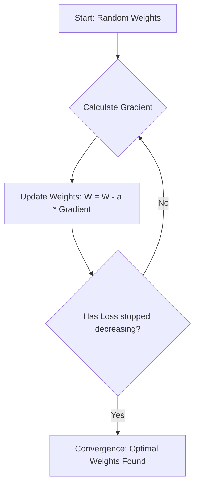

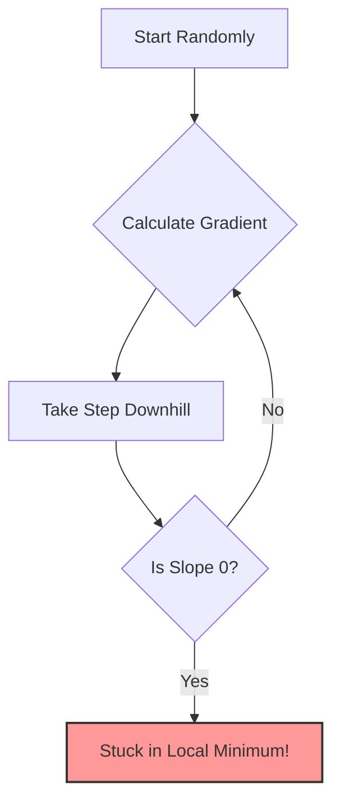

## High-Dimensional Optimization: The Saddle Point Reality

In 1D or 2D calculus, a point where the gradient is zero is usually a minimum or a maximum. However, the course notes a critical phenomenon in Deep Learning: **"The local minima in one dimension is not shared with the other dimensions."**

Because Neural Networks have millions of dimensions (parameters):
- A point might be a local minimum in Dimension A.
- But in Dimension B, it is still a downward slope.
- This creates a **Saddle Point** (Point de selle) — a point that is a minimum in some directions but a maximum in others.

A local minimum in 1 dimension is rarely a local minimum in a 1,000-dimension space; it is usually a **Saddle Point**. This mathematical reality explains why Neural Networks actually work on highly complex problems: true, inescapable local minima are mathematically exceedingly rare in multi-million dimensional spaces. There is almost always a path downwards in _some_ dimension. This is why neural networks can actually succeed in complex problems—there is almost always a path downwards in _some_ dimension.

## Variations of Gradient Descent

Because calculating the gradient across an entire massive dataset (millions of images) is impossible due to RAM limits, we use variations of the algorithm:

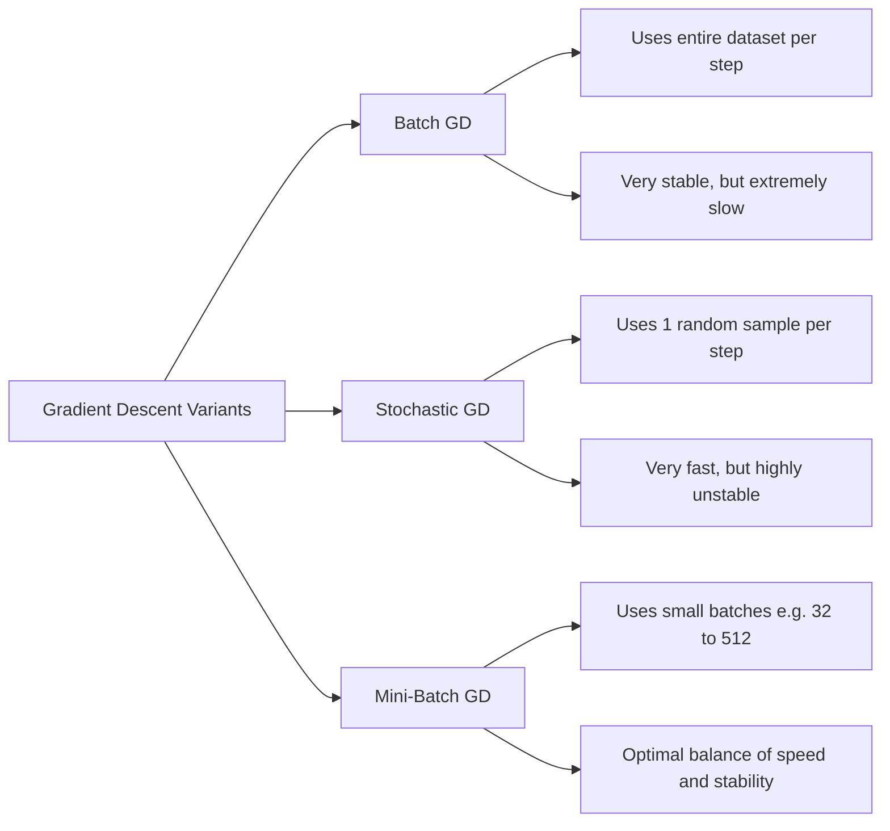

### 1. Batch Gradient Descent (Standard)

Uses the _entire dataset_ for one update. It calculates the true gradient by averaging over all training examples, then takes one step.

- **Advantage:** The gradient is exact and stable. The path to the minimum is smooth and direct.
- **Disadvantage:** Extremely slow and memory-heavy. Computing the gradient over millions of images at once is impossible for GPU VRAM. One single update can take hours.

### 2. Stochastic Gradient Descent (SGD)

Uses a _single data point_ for one update. It picks one random training example, computes the gradient based on that single example, and updates immediately.

- **Advantage:** Very fast — weights are updated after every single example. The model starts learning immediately.
- **Disadvantage:** Highly chaotic and erratic. The gradient based on one example is very noisy — the loss curve will look like a seismograph reading, bouncing wildly, even though the overall trend is downward.

### 3. Mini-Batch Gradient Descent

The gold standard. Uses a small chunk of data (e.g., 32, 64, or 512 samples) for each update. It perfectly balances speed, memory usage, and stability.

| Characteristic         | Batch GD (Standard) | Stochastic GD (SGD) | Mini-batch GD                    |
| :--------------------- | :------------------ | :------------------ | :------------------------------- |
| **Data per Iteration** | All data            | A single sample     | A small group (e.g., 32 to 512)  |
| **Speed**              | Slow                | Very Fast           | Fast                             |
| **Stability**          | Very Stable         | Noisy / Chaotic     | Medium (Stable enough)           |
| **Memory (RAM) Usage** | Very High           | Low                 | Medium                           |
| **Primary Usage**      | Small datasets      | Massive datasets    | **The Industry Standard for DL** |

### The Magic of Mini-Batches

Mini-batches introduce a slight "noise" or "stochasticity" to the gradient. This noise is actually a good thing in deep learning! It acts like a slight earthquake that can shake the algorithm out of a shallow **local minimum** so it can continue rolling down into the true **global minimum**.

> [!NOTE] The 3 Hidden Benefits of Mini-Batches
>
> 1.  **Stagnation Prevention (Escape from Local Minima):** Because it uses a subset of data, it introduces _stochastic noise_. This noise causes slight oscillations that help the algorithm "jump" out of shallow local minima or saddle points. Pure Batch GD would get permanently stuck in these shallow valleys.
> 2.  **RAM Management (Memory Efficiency):** Calculating gradients on millions of images simultaneously is impossible for GPU VRAM. Mini-batches allow processing massive datasets on standard hardware by only loading a small chunk at a time. Cannot fit millions of images in RAM/GPU memory at once — mini-batches fit nicely in VRAM.
> 3.  **Update Latency (Faster Convergence):** In Batch GD, weights are updated only _once_ per epoch (after seeing all data). Mini-batches allow weights to be updated thousands of times per epoch, drastically accelerating global convergence. The model starts learning immediately rather than waiting to process the whole dataset.

## Solutions to the Learning Rate Problem

Because picking the perfect $\alpha$ is incredibly difficult, we use:

1.  **Learning Rate Schedulers:** Start with a high rate to encourage exploration and escape local minima, then gradually reduce it to fine-tune convergence. This mimics the behavior of a ball that bounces around at first but gradually settles to the bottom of the valley as it loses energy.
2.  **Adaptive Optimizers:** Instead of a fixed learning rate $\alpha$, modern Deep Learning uses algorithms like **Adam, RMSProp, or Adagrad** that automatically adjust the learning rate independently for _every single parameter_, navigating complex landscapes effortlessly. These algorithms track historical gradient information for each parameter and use it to determine appropriate step sizes — parameters with large, consistent gradients get smaller steps, while parameters with small or infrequent gradients get larger steps.

## Python Implementation of Gradient Descent (2D Example)

The slides provide a concrete mathematical example that demonstrates gradient descent in action: Minimize $f(x,y) = (x-2)^2 + 2(y-3)^2$.

This is a convex quadratic function with its minimum at the point (2, 3). Let's work through the complete implementation step by step.

**1. Calculate the Gradients (Derivatives):**

We need the partial derivatives with respect to each variable:
- $\frac{\partial f}{\partial x} = 2(x-2) = 2x - 4$
- $\frac{\partial f}{\partial y} = 2 \cdot 2(y-3) = 4y - 12$

The gradient vector combines these:
- Gradient Vector $\nabla f(X) = \begin{bmatrix} 2x - 4 \\ 4y - 12 \end{bmatrix}$

**2. The Python Code (Vectorized):**

```python
import numpy as np

# 1. Define the gradient function
def gradient(X):
    return np.array([2*X[0]-4, 4*X[1]-12])

# 2. Starting Point (x_0 = 30, y_0 = 20)
# We start far from the minimum to demonstrate convergence
X = np.array([30, 20])

# 3. Step size (Learning Rate)
# 0.05 is small enough for stable convergence
alpha = 0.05

# 4. Iterative Gradient Descent Loop
for x in range(0, 200):
    X = X - alpha * gradient(X)

print("Result:", X)
# Expected output converges exactly to [2.0, 3.0]
```

_Visual Proof:_ The contour maps provided in the slides show the algorithm taking curved, gradually shrinking steps perpendicular to the contour lines, spiraling directly into the exact center (2, 3). The path is not a straight line — it curves because the function is steeper in the y-direction (coefficient 2) than in the x-direction (coefficient 1), creating an elongated elliptical contour pattern. This is exactly why feature scaling matters in practice: unscaled features create these elongated bowls that make gradient descent inefficient.

---

## Extension to Multiple Parameters: Partial Derivatives and the Gradient Vector

In practice, machine learning models never have just one parameter. Consider minimizing a function $f(w, b)$ with two parameters (e.g., weight and bias). We cannot use a simple derivative; we must use **Partial Derivatives**.

- The partial derivative with respect to $w$, denoted $\frac{\partial f}{\partial w}$, measures the steepness in the $w$-direction (keeping $b$ constant). It tells us how much the function changes when we nudge $w$ slightly while holding $b$ fixed.
- The partial derivative with respect to $b$, denoted $\frac{\partial f}{\partial b}$, measures the steepness in the $b$-direction (keeping $w$ constant). It tells us how much the function changes when we nudge $b$ slightly while holding $w$ fixed.

The **Gradient** $\nabla f$ is the vector of these partial derivatives: $\nabla f = \left[ \frac{\partial f}{\partial w}, \frac{\partial f}{\partial b} \right]^T$. The gradient always points in the direction of steepest ascent. By moving in the opposite direction, we descend toward the minimum.

The update rules become:
$$w_{i+1} = w_i - \alpha \cdot \frac{\partial f}{\partial w}$$
$$b_{i+1} = b_i - \alpha \cdot \frac{\partial f}{\partial b}$$

**Why subtract?** 
1. If $f'(x_i) > 0$, the function is increasing at $x_i$. To find the minimum, we must move left (decrease $x$). 
2. Subtracting a positive number decreases $x$. 
3. If $f'(x_i) < 0$, the function is decreasing. We must move right (increase $x$).
4. Subtracting a negative number increases $x$.
5. This elegant mathematical rule ensures we always move downhill regardless of which side of the minimum we are on.

### Detailed Stopping Criteria

How does the algorithm know when to stop? We do not run it forever. We stop when one of the following conditions is met:

1. **The gradient is near zero:** $|f'(x_i)| < \epsilon$ where $\epsilon$ is a small threshold (e.g., $10^{-6}$). At the bottom of the valley, the slope is flat, so the gradient is essentially zero. This means we have reached a stationary point — either a minimum, maximum, or saddle point.
2. **The step size is infinitesimal:** $|f(x_i) - f(x_{i+1})| < \epsilon$. If moving further does not significantly change the loss, the algorithm has converged and further iterations would be wasted computation.
3. **Maximum iterations reached:** A practical safeguard. We set a maximum number of iterations (e.g., 10,000) to prevent infinite loops, even if convergence has not been achieved.

The choice of $\epsilon$ matters: too large and we stop prematurely (before reaching the minimum), too small and we waste computation on negligible improvements.

## The Shift in Notation: Alpha ($\alpha$) to Eta ($\eta$)

In classical optimization, the step size is denoted $\alpha$ (alpha). In the context of Neural Networks and Deep Learning, this parameter is referred to as the **Learning Rate** and is denoted by $\eta$ (eta). It is the most critical **hyperparameter** in Deep Learning. This shift in notation reflects the conceptual difference: in optimization, $\alpha$ is simply a step size, but in deep learning, $\eta$ controls the entire dynamics of learning — too fast and the model becomes unstable, too slow and it never converges.

## The Deep Mechanics of Mini-Batch Gradient Descent

When training neural networks on millions of images, standard Batch Gradient Descent (using the entire dataset) is impossible. Mini-Batch GD (using subsets of 32 to 512 samples) is the default. Here is the exhaustive breakdown of the deep mechanics behind why mini-batch gradient descent works so well:

### 1. Escaping Local Minima via Stochastic Noise

Batch GD calculates the exact, true gradient of the entire dataset. The path is smooth and deterministic. If it enters a shallow local minimum, the gradient is exactly zero, and it gets stuck forever — there is no force to push it out.

Mini-Batch GD calculates an *approximation* of the true gradient using only a small subset of data. This introduces **stochastic noise** (variance) into the gradient estimate. The trajectory is bumpy and irregular. This bumpiness is a feature, not a bug: the oscillations allow the algorithm to "jump" over the walls of shallow local minima or escape saddle points, continuing the search for the global minimum. The noise acts as an implicit regularizer that prevents the algorithm from settling into suboptimal solutions.

### 2. RAM and VRAM Constraints

To compute the gradient over 1 million images, the computation graph and activations for all 1 million images must be held in memory simultaneously. This vastly exceeds the RAM of any CPU or the VRAM of any GPU. Even with 128GB of RAM, the memory requirements for large models and datasets can be prohibitive.

Mini-batches (e.g., 64 images) easily fit into GPU VRAM, allowing for massive parallelization via matrix multiplication. A single GPU with 24GB of VRAM can comfortably process a batch of 64 images through a ResNet-50 model. This is why mini-batches are not just a theoretical optimization — they are a practical necessity imposed by hardware constraints.

### 3. Latency and Update Frequency

In Batch GD, you must process all 1,000,000 samples before making a *single* update to the weights. That is a long wait before the model learns anything. If each epoch takes 1 hour, the model only gets one weight update per hour.

In Mini-Batch GD with batch size 64, the model updates its weights after every 64 samples. It makes roughly 15,625 updates in the same time Batch GD makes 1. Learning begins instantly, leading to much faster empirical convergence. The model starts improving from the very first mini-batch rather than waiting to see the entire dataset.

## The Critical Batch Size Trade-off

The choice of batch size has profound implications for both training speed and model quality:

- **Small Batch Sizes (e.g., 16-32):** More noise, better generalization (prevents overfitting), excellent at escaping local minima. The stochastic noise acts as an implicit regularizer, preventing the model from converging to sharp minima that don't generalize well to unseen data. However, they cannot fully utilize GPU parallel architecture, making the computation per epoch slower because the GPU is often idle waiting for the next batch.

- **Large Batch Sizes (e.g., 512-2048):** Less noise, very stable gradient estimates, highly efficient GPU utilization (faster computation per epoch). However, they tend to converge to "sharp" minima that generalize poorly to unseen test data, and they are more likely to get stuck in local minima because the gradient estimates are too smooth to escape them. The stable gradient means less exploration of the loss landscape.

> [!WARNING] Student Pitfall: Bigger Batch Size ≠ Better Model
> Students often think a larger batch size is always better because it uses the GPU fully and reduces epoch time. While epoch time decreases, the model often converges to a worse minimum that generalizes poorly. The "noise" of small batches acts as an implicit regularizer that helps the model find flatter, more robust minima. In practice, batch sizes of 32-128 tend to produce the best generalization performance, even though larger batches are computationally faster per epoch.


# Chapter 1 - Introduction to Deep Learning/6. Loss Functions and Cost Optimization.md
   Language: markdown

# 6. Loss Functions and Cost Optimization

The Loss Function (or Cost Function) is the mathematical formula that calculates how far off our predictions ($\hat{y}$) are from the actual ground truth ($y$). The goal of training is to minimize this function. The choice of Loss Function dictates how your network learns — it determines the shape of the optimization landscape, the stability of training, and ultimately whether the model can converge to a good solution at all.

## 1. Regression Loss Functions

Used when predicting continuous values (e.g., house prices, temperature). These measure the distance between the predicted number and the true number.

### A. Mean Squared Error (MSE)

Calculates the average of the squared differences between predicted and actual values. We use the Method of Least Squares, formulated as MSE. It is the standard loss function for linear regression.

$$ MSE = \frac{1}{n} \sum_{i=1}^{n} (y_i - \hat{y}_i)^2 $$

- **Pros:** Punishes large errors heavily (because of the square). An error of 10 contributes 100 to the loss, while an error of 1 contributes only 1. This makes the model strongly motivated to avoid large mistakes.
- **Cons:** Very sensitive to outliers. A single extreme outlier (e.g., a data point that is 100x larger than expected) will dominate the loss and pull the entire model toward it.

> [!WARNING] The 1/2m Trick
> Some formulations use $\frac{1}{2m}$ instead of just $\frac{1}{m}$:
> $$ J(\theta_0, \theta_1) = \frac{1}{2m} \sum_{i=1}^{m} (h_\theta(x^{(i)}) - y^{(i)})^2 $$
> This is a deliberate mathematical convenience, not a change in the optimization problem. When we calculate the derivative of this function (to find the gradient), the exponent $2$ from the square drops down. The $2$ cancels out the $1/2$, leaving a very clean, simple equation without lingering constants. The minimizer is identical either way.

### B. Mean Absolute Error (MAE)

Calculates the average of the absolute differences.

$$ MAE = \frac{1}{n} \sum_{i=1}^{n} |y_i - \hat{y}_i| $$

- **Pros:** Robust to outliers. An error of 10 contributes exactly 10 to the loss, not 100. Outliers have a proportional (not squared) influence.
- **Cons:** The gradient is constant (either +1 or -1) regardless of the magnitude of the error. This means the model takes steps of equal size whether it's very close to the optimum or far away, which can cause instability near convergence — the model oscillates around the minimum rather than settling into it.

### C. Huber Loss (Robust Regression)

MSE is heavily skewed by outliers (because errors are squared). MAE ignores outliers but has a gradient that doesn't decrease as it approaches zero, causing instability at the end of training. **Huber Loss** combines the best of both: it acts like MSE when the error is small (smooth convergence near the minimum), and acts like MAE when the error is large (ignoring extreme outliers). It is controlled by a threshold parameter $\delta$.

$$ L_\delta(y, \hat{y}) = \begin{cases} \frac{1}{2}(y - \hat{y})^2 & \text{si } |y - \hat{y}| \le \delta \\ \delta(|y - \hat{y}| - \frac{1}{2}\delta) & \text{sinon} \end{cases} $$

**How to read this formula:**
- When the error $|y - \hat{y}|$ is small (below the threshold $\delta$), we use the quadratic (MSE-like) formula $\frac{1}{2}(y - \hat{y})^2$. This gives a smooth, well-behaved gradient that decreases as we approach zero — perfect for fine-tuning near the optimum.
- When the error is large (above $\delta$), we switch to the linear (MAE-like) formula $\delta(|y - \hat{y}| - \frac{1}{2}\delta)$. This prevents outliers from exerting disproportionate influence.
- The parameter $\delta$ controls the transition point. A small $\delta$ makes the model more robust to outliers (switches to linear sooner), while a large $\delta$ makes it behave more like MSE.

## 2. Classification Loss Functions

Used when predicting discrete categories (e.g., Cat vs. Dog). These are fundamentally different from regression losses because they must handle probabilities, not raw distances.

### Why use Logarithms in Classification?

In classification, our model outputs a probability between 0 and 1. Predictions $\hat{y}$ are probabilities. This is a critical distinction from regression:

- If $y=1$ (True) and the model predicts $\hat{y} = 0.99$, $-\log(0.99) \approx 0.01$ (very low loss). The model is confident and correct — minimal penalty.
- If $y=1$ (True) and the model predicts $\hat{y} = 0.01$, $-\log(0.01) \approx 4.6$ (huge penalty!). The log of 0.01 approaches $-\infty$. We add a negative sign to the formula to make this a massive positive penalty (high loss). The model is confidently wrong — it deserves severe punishment.

The log function punishes being confidently wrong with an exponentially increasing penalty. A model that predicts 0.001 when the truth is 1 gets punished far more than a model that predicts 0.4 when the truth is 1. This creates a strong incentive for the model to be both correct *and* confident, not just barely correct.

### A. Binary Cross-Entropy (BCE) / Log Loss

Used for Binary Classification (2 classes). This is the standard loss function whenever your model must distinguish between two categories.

$$ BCE = -\frac{1}{n} \sum_{i=1}^{n} [y_i \log(\hat{y}_i) + (1 - y_i) \log(1 - \hat{y}_i)] $$

**Breaking down the formula:**
- When $y_i = 1$: The term $(1 - y_i) \log(1 - \hat{y}_i)$ becomes 0, and we're left with $-\log(\hat{y}_i)$. We want $\hat{y}_i$ to be close to 1, making $-\log(\hat{y}_i)$ close to 0.
- When $y_i = 0$: The term $y_i \log(\hat{y}_i)$ becomes 0, and we're left with $-\log(1 - \hat{y}_i)$. We want $\hat{y}_i$ to be close to 0, making $-\log(1 - \hat{y}_i)$ close to 0.

### Log Loss Asymptotic Behavior (Piecewise Definition)

For Binary Cross Entropy (Log Loss), the cost can be defined piecewise to understand its behavior:

$$ Cost(h(x), y) = \begin{cases} -\log(h(x)) & \text{if } y = 1 \\ -\log(1 - h(x)) & \text{if } y = 0 \end{cases} $$

- **When y = 1:** The graph shows a curve starting high at $x=0$ and plunging to $0$ as $x \to 1$. If the model predicts $0$ (completely wrong), the penalty approaches $+\infty$. If the model predicts $1$ (correct), the penalty is $0$.
- **When y = 0:** The graph is mirrored. The penalty is $0$ at $x=0$, and approaches $+\infty$ as the model's prediction approaches $1$ (confidently wrong).

This mathematical property guarantees that the cost function strongly punishes confident, incorrect predictions. The loss goes to infinity when the model is absolutely certain about the wrong answer, creating a powerful gradient signal that pulls the model back toward the correct prediction.

### B. Categorical Cross-Entropy (CCE)

Used for Multi-class classification (3+ classes). This extends BCE to handle multiple categories simultaneously.

$$ CCE = -\frac{1}{n} \sum_{i=1}^{n} \sum_{j=1}^{C} y_{i,j} \log(\hat{y}_{i,j}) $$

**Breaking down the formula:**
- $n$ is the number of training examples.
- $C$ is the number of classes.
- $y_{i,j}$ is 1 if example $i$ belongs to class $j$, and 0 otherwise (one-hot encoding).
- $\hat{y}_{i,j}$ is the predicted probability that example $i$ belongs to class $j$.
- Only the term for the true class contributes to the loss (because all other $y_{i,j}$ are 0).

### C. Hinge Loss

Used primarily for Support Vector Machines (SVMs) and some neural networks to force a strict, clear margin of separation between classes, rather than just getting the classification right. Unlike cross-entropy which is satisfied with correct predictions, hinge loss wants the predictions to be correct *by a margin*.

$$ Hinge = \sum \max(0, 1 - y_i \cdot \hat{y}_i) $$
*(Where $y \in \{-1, 1\}$)*

**How it works:** The loss is zero only when $y_i \cdot \hat{y}_i \ge 1$, meaning the prediction is on the correct side of the margin. If the prediction is correct but too close to the decision boundary (between 0 and 1), the loss is still positive, encouraging the model to push the prediction further from the boundary.

> [!WARNING] MSE for Classification — Never Do This!
> Using MSE for classification results in a non-convex landscape with many local minima, making training nearly impossible. When you plug a sigmoid activation into MSE, the resulting loss surface has hills and valleys — gradient descent will get trapped in local minima and fail to find the optimal solution. Always use Cross-Entropy for classification!

---

## Deep Dive: Properties of Regression Loss Functions

### Mean Squared Error (MSE) — Detailed Properties

Because the error is squared, large errors are penalized disproportionately. An error of 4 is penalized $4^2 = 16$ times more than an error of 1, which is penalized $1^2 = 1$. This quadratic penalty means the model will prioritize fixing the largest errors first, which is desirable when all data points are reliable. However, a single extreme outlier (e.g., a data point that is 100x larger than expected) will contribute $100^2 = 10,000$ to the loss, completely dominating the optimization and pulling the entire model toward fitting that one outlier at the expense of all other data points.

**When to use MSE:** Standard for regression, provided there are no severe outliers. MSE is the optimal loss function when the noise in your data follows a Gaussian (normal) distribution, which is a common assumption in many real-world scenarios.

### Mean Absolute Error (MAE) — Detailed Properties

The gradient magnitude of MAE is constant (either -1 or +1), regardless of how large or small the error is. This means the model takes steps of equal size whether it is very close to the optimum or far away. Near the minimum, this causes the model to oscillate back and forth rather than settling precisely — the step size does not decrease as the error decreases, so the model overshoots repeatedly. This is fundamentally different from MSE, where the gradient naturally decreases as the model approaches the optimum (because the error itself decreases).

**When to use MAE:** When the dataset contains many outliers. MSE would force the model to overcompensate for outliers; MAE remains robust because each outlier contributes only linearly (not quadratically) to the total loss.

### Huber Loss — The Best of Both Worlds

The Huber Loss is a piecewise function that transitions between MSE and MAE at a threshold $\delta$:

$$ L_\delta(y, \hat{y}) = \begin{cases} \frac{1}{2}(y - \hat{y})^2 & \text{for } |y - \hat{y}| \le \delta \\ \delta |y - \hat{y}| - \frac{1}{2}\delta^2 & \text{otherwise} \end{cases} $$

Below the threshold $\delta$ (often set to 1.0), it acts like MSE: smooth, differentiable at zero, with a gradient that naturally decreases as the error shrinks — perfect for fine-tuning near the optimum. Above the threshold, it acts like MAE: linear penalty that does not let outliers dominate. The $-\frac{1}{2}\delta^2$ term ensures the function is continuous and differentiable at the transition point $\delta$.

**When to use Huber Loss:** When you have a regression problem with occasional outliers and need both robustness (from MAE) and smooth convergence (from MSE). It is particularly useful in robotics and control systems where sensor noise can produce occasional extreme readings.

## Deep Dive: The Absolute Importance of the Logarithm in Classification

Why not just use MSE for classification? Because predictions $\hat{y}$ are probabilities (between 0 and 1, output by a Sigmoid). If the true label is $y=1$:

- If the model predicts $\hat{y} = 0.99$, the error is small. $-\log(0.99) \approx 0.01$ (minimal penalty).
- If the model predicts $\hat{y} = 0.01$, the model is confidently wrong. $-\log(0.01) \approx 4.6$ (huge penalty — over 400 times larger!).
- If the model predicts $\hat{y} \to 0$, $-\log(0) \to +\infty$ (infinite penalty — the model is absolutely certain about the wrong answer).

The logarithm creates an **exponentially increasing** penalty for being confidently wrong. This is far more aggressive than MSE, where a prediction of 0.01 when the truth is 1 gives a penalty of $(1-0.01)^2 = 0.98$ — a mild slap on the wrist compared to the 4.6 penalty from log loss.

Furthermore, using MSE on a sigmoid output creates a non-convex landscape riddled with local minima. Log Loss guarantees a convex landscape for logistic models, ensuring gradient descent can find the global minimum.

### Categorical Cross-Entropy — Detailed Breakdown

Used for multi-class classification where $y$ belongs to one of $k$ classes ($k > 2$):

$$ CCE = -\sum_{i=1}^{n} \sum_{j=1}^{k} y_{ij} \log(\hat{y}_{ij}) $$

Where:
- $n$ is the number of training examples.
- $k$ is the number of classes.
- $y_{ij}$ is 1 if sample $i$ belongs to class $j$, and 0 otherwise (one-hot encoding). Only the true class has $y_{ij} = 1$; all others are 0.
- $\hat{y}_{ij}$ is the predicted probability that sample $i$ belongs to class $j$.
- Because only the term for the true class contributes to the loss (all other $y_{ij}$ are 0), the formula effectively reduces to $-\log(\hat{y}_{true\_class})$ for each sample.
- The **Softmax** activation ensures all $\hat{y}_{ij}$ sum to 1, creating a valid probability distribution over the $k$ classes.

**Practical note:** In PyTorch, use `nn.CrossEntropyLoss()` which combines LogSoftmax and NLLLoss in a single, numerically stable operation. Never apply Softmax before CrossEntropyLoss in PyTorch — the loss function expects raw logits.

### Hinge Loss — Forcing a Margin of Separation

$$ \text{Hinge Loss} = \max(0, 1 - y \cdot \hat{y}) $$

Used primarily in Support Vector Machines (SVMs). Predictions are expected to be -1 or +1, not probabilities. The key insight is that Hinge Loss forces the model not just to classify correctly, but to create a **margin** of separation between classes:

- If $y \cdot \hat{y} \ge 1$: The prediction is correct AND far enough from the boundary. Loss = 0.
- If $0 < y \cdot \hat{y} < 1$: The prediction is correct but too close to the decision boundary. Loss > 0, pushing the prediction further from the boundary.
- If $y \cdot \hat{y} < 0$: The prediction is wrong. Loss > 1, a significant penalty.

This margin-based approach produces models that generalize better because they don't just barely classify correctly — they classify with confidence and distance from the decision boundary.


# Chapter 1 - Introduction to Deep Learning/7. Linear Regression.md
   Language: markdown

# 7. Linear Regression

Before building neural networks, we must understand the fundamental statistical models they are built upon. Linear regression is a supervised predictive method. We are establishing a line of best fit to determine the relationship (correlation/causality) between an Exogenous variable $X$ (independent) and an Endogenous variable $Y$ (dependent). It is the simplest form of predictive modeling and serves as the foundation upon which all neural network concepts are built.

## The Hypothesis Function

Linear regression tries to fit a straight line through a cloud of data points. It predicts a continuous output $Y$ based on input $X$.

- **Simple Linear Regression:** 1 independent variable. $Y = wX + b$ (slope/weight + intercept/bias).
- **Multiple Linear Regression:** Multiple independent variables.

$$ h(x) = \theta_0 + \theta_1 x_1 + \theta_2 x_2 ... \theta_n x_n $$

- $\theta_0$: The y-intercept (Bias). This is the predicted value when all inputs are zero. It shifts the line up or down.
- $\theta_1, \theta_2, ...$: The slopes (Weights). Each weight represents how much the output changes for a one-unit change in the corresponding input, holding all other inputs constant.
- Vectorized form: $h(x) = \theta^T x$ (where $x_0 = 1$, the bias term).

**Key Concepts:**
- **Endogenous Variable (Y):** The dependent variable determined inside the model. This is what we are trying to predict.
- **Exogenous Variable (X):** The independent variable determined outside the model. This is the information we use to make predictions.
- **Assumptions:** Requires linear correlation and causality between X and Y. If the true relationship is highly non-linear, linear regression will produce poor predictions regardless of how much data you have.

## The Cost Function (MSE)

We use the Method of Least Squares, formulated as the Mean Squared Error (MSE). The goal is to find the values of $\theta$ (weights/slope and bias/intercept) that minimize the MSE.

$$ J(\theta_0, \theta_1) = \frac{1}{2m} \sum_{i=1}^{m} (h_\theta(x^{(i)}) - y^{(i)})^2 $$

> [!WARNING] The 1/2m Trick
> Notice the $\frac{1}{2m}$ instead of just $\frac{1}{m}$? This is a deliberate mathematical convenience. When we calculate the derivative of this function (to find the gradient), the exponent $2$ from the square drops down as a coefficient. The $2$ cancels out the $1/2$, leaving a very clean, simple equation without lingering constants. This does not change the optimization problem — the minimum is at the same point regardless. It purely simplifies the gradient computation.

## Applying Gradient Descent

To minimize $J(\theta)$, we calculate the partial derivatives with respect to $\theta_0$ and $\theta_1$:

1.  **Derivative for $\theta_0$ ($j=0$):**
    $$ \frac{\partial}{\partial \theta_0} J(\theta_0, \theta_1) = \frac{1}{m} \sum_{i=1}^{m} (h_\theta(x_i) - y_i) $$
    This is the average error — how much the predictions deviate from the true values, without weighting by the input. This makes sense because $\theta_0$ is the bias, which shifts all predictions equally regardless of input values.

2.  **Derivative for $\theta_1$ ($j=1$):**
    $$ \frac{\partial}{\partial \theta_1} J(\theta_0, \theta_1) = \frac{1}{m} \sum_{i=1}^{m} (h_\theta(x_i) - y_i) \cdot x_i $$
    This weights each error by the corresponding input value. This makes sense because $\theta_1$ scales with $x$ — errors on data points with larger $x$ values have a proportionally larger effect on the gradient.

The general gradient update rule (which applies to all parameters):
$$ \frac{\partial J(\theta)}{\partial \theta_j} = \frac{1}{m} \sum_{i=1}^{m} (h_\theta(x^{(i)}) - y^{(i)}) x_j^{(i)} $$

## The "Simultaneous Update" Rule

**The Golden Rule of Updates:** You **must** update $\theta_0$ and $\theta_1$ _simultaneously_. When translating mathematical formulas into code for Linear and Logistic regression, students often make a critical algorithmic error regarding weight updates.

The Gradient Descent algorithm for Linear Regression calculates the derivatives for $\theta_0$ (bias) and $\theta_1$ (weight).

$$ \theta_j := \theta_j - \alpha \frac{\partial}{\partial \theta_j} J(\theta_0, \theta_1) $$

**The Correct Implementation (Simultaneous):**
You must calculate all new values based on the _old_ values before assigning any of them.

```text
temp_0 := old_theta_0 - alpha * Gradient(old_theta_0, old_theta_1)
temp_1 := old_theta_1 - alpha * Gradient(old_theta_0, old_theta_1)

theta_0 := temp_0
theta_1 := temp_1
```

> [!WARNING] The Sequential Update Error
> If you update $\theta_0$ directly, and then use that _newly updated_ $\theta_0$ to calculate the gradient for $\theta_1$, you are calculating the gradient for a point that does not exist in the current iteration step. The algorithm will follow an incorrect trajectory and fail to find the global minimum.
>
> **Concrete example:** Suppose $\theta_0 = 1, \theta_1 = 2$, and the gradient at this point is $(\frac{\partial J}{\partial \theta_0}, \frac{\partial J}{\partial \theta_1}) = (0.5, 0.5)$.
> - **Correct (simultaneous):** New $\theta_0 = 1 - \alpha(0.5)$, New $\theta_1 = 2 - \alpha(0.5)$. Both use the same gradient computed at the original point.
> - **Incorrect (sequential):** New $\theta_0 = 1 - \alpha(0.5) = 0.5$ (if $\alpha = 1$). Then you compute the gradient at $(0.5, 2)$ — a _different point_ — and use that to update $\theta_1$. This is wrong because you've moved to a different location on the loss surface before completing the update step.

## Vectorization: Ditching the Summation Sign

In Deep Learning, looping over $m$ training examples using `for` loops is far too slow. We use **Vectorization** (Linear Algebra) to calculate everything simultaneously. This is not just a coding convenience — it is a fundamental requirement for making deep learning computationally feasible.

Instead of writing $h(x) = \theta_0 x_0 + \theta_1 x_1 + \theta_2 x_2 ...$, we define them as vectors:
$$ \theta = \begin{bmatrix} \theta_0 \\ \theta_1 \\ \theta_2 \\ \dots \\ \theta_n \end{bmatrix}, \quad x = \begin{bmatrix} x_0 \\ x_1 \\ x_2 \\ \dots \\ x_n \end{bmatrix} $$

Thus, the entire hypothesis function collapses into a single dot product:
$$ h(x) = \theta^T \cdot x $$
This allows GPUs to calculate predictions for millions of parameters in a fraction of a second. A single matrix multiplication replaces millions of individual additions and multiplications, and modern hardware is specifically optimized for these operations.

## Feature Scaling for Optimization

To make Gradient Descent converge faster, we must scale our features so they are on a similar playing field. If variables are on completely different scales (e.g., Number of Bedrooms [1-5] vs. Square Footage [500-5000]), gradient descent will create an elongated, elliptical bowl, causing the algorithm to bounce inefficiently back and forth across the narrow dimension rather than moving directly toward the minimum.

1.  **Min-Max Normalization:** Scales data strictly between 0 and 1.
    $$ x_{scaled} = \frac{x - x_{min}}{x_{max} - x_{min}} $$
    Equivalent notation: $x_{ij} = \frac{x_{ij} - Min_j}{Max_j - Min_j}$ (Forces values between $[0, 1]$).
    - Best used when you know the data has a fixed range and no significant outliers.
    - Sensitive to outliers — a single extreme value will compress all other values into a tiny range.

2.  **Standardization (Z-score):** Centers data around a mean of 0 with a standard deviation of 1.
    $$ x_{scaled} = \frac{x - \mu}{\sigma} $$
    Equivalent notation: $x_{ij} = \frac{x_{ij} - \mu_j}{\sigma_j}$ (Centers around 0. Approximates values between $[-3\sigma, +3\sigma]$).
    - More robust to outliers than Min-Max because it doesn't compress the range.
    - Preserves the shape of the distribution, just shifts and scales it.
    - Generally preferred for deep learning, especially when paired with ReLU activation.

---

## Matrix Formulation for Batch Processing

For a dataset of $n$ samples with $m$ features, we represent the features as an $n \times m$ matrix $X$, the weights as an $m \times 1$ vector $W$, and the bias as a scalar $b$ broadcasted across $n$ samples:

$$ \hat{Y} = XW + b $$

This is how frameworks like PyTorch compute predictions in parallel for entire batches. Instead of processing one sample at a time through a `for` loop, the entire batch of predictions is computed in a single matrix multiplication. This is not merely a coding convenience — it is a fundamental requirement for deep learning. Modern GPUs are specifically designed to perform matrix multiplications at massive scale, and this formulation allows us to leverage that hardware fully.

**Concrete example:** If you have 1,000 samples, each with 10 features, $X$ is a $1000 \times 10$ matrix, $W$ is a $10 \times 1$ vector, and $\hat{Y}$ is a $1000 \times 1$ vector. The single operation $XW$ replaces 1,000 separate dot products, each involving 10 multiplications and 9 additions — 10,000 multiplications and 9,000 additions computed simultaneously in microseconds on a GPU.

## Solving the Model: OLS vs. Gradient Descent

There are two fundamentally different approaches to finding the optimal weights $W$:

### Ordinary Least Squares (OLS) — The Analytical Solution

We set the derivative of the MSE loss to zero and solve for $W$ algebraically using linear algebra:

$$ W = (X^T X)^{-1} X^T Y $$

This is the **Normal Equation**. It gives the exact, optimal solution in one step — no iteration required. For small datasets (hundreds or low thousands of samples), this is fast and elegant. However:

- Computing the inverse of $X^T X$ has $O(m^3)$ complexity (where $m$ is the number of features). For a model with 10,000 features, this means roughly $10^{12}$ operations — prohibitively expensive.
- The matrix $X^T X$ may be singular (non-invertible) when features are highly correlated (multicollinearity), causing numerical instability.
- The entire dataset must fit in memory simultaneously, which is impossible for datasets with millions of samples.

### Gradient Descent — The Iterative Solution

We use the update rule $W = W - \eta \cdot \nabla MSE$ to iteratively approach the optimal solution. This is preferred in Deep Learning because:

- It scales beautifully to arbitrarily large datasets — you never need to load all data at once (use mini-batches).
- It works with any number of features, even millions.
- It generalizes to non-linear models (neural networks) where no analytical solution exists.
- Each iteration is computationally cheap — just matrix multiplications and additions.

**The trade-off:** OLS gives the exact answer immediately (when feasible), while Gradient Descent gives an approximation that improves over time. In practice, Gradient Descent converges close enough to the optimum for all practical purposes, and its scalability makes it the only viable choice for large-scale deep learning.

> [!TIP] When to use which?
> - **Small dataset, few features:** OLS is faster and gives the exact answer.
> - **Large dataset or many features:** Gradient Descent is the only practical choice.
> - **Non-linear model (any neural network):** Gradient Descent is mandatory — no closed-form solution exists for neural networks.


# Chapter 1 - Introduction to Deep Learning/8. Logistic Regression.md
   Language: markdown

# 8. Logistic Regression

Despite the name "regression," Logistic Regression is strictly a **Classification** algorithm. It predicts the probability that an instance belongs to a class (e.g., Fraud vs. Not Fraud, Pneumothorax vs. Healthy, Spam/Not Spam, Malignant/Benign tumor). It is one of the most widely used algorithms in both machine learning and deep learning, and understanding it deeply is essential because neural networks are essentially stacked logistic regression units.

- Binary Classification: $y \in \{0, 1\}$ (e.g., Spam/Not Spam, Malignant/Benign tumor).
- Multi-class: $y \in \{0, 1, 2, 3\}$.

## The Problem with Linear Regression for Classification

If we try to fit a straight line to binary data (0s and 1s), we face three fundamental problems:

1. **Invalid predictions:** The line will eventually output values below 0 and above 1, which are invalid probabilities. A prediction of -0.3 or 1.7 makes no sense for a binary outcome.
2. **Poor fit:** Binary data forms two distinct clusters (at 0 and 1), and a straight line is a poor representation of this step-like pattern.
3. **Non-convex loss:** Using MSE on classification creates a non-convex loss curve, trapping gradient descent in local minima. The optimization landscape becomes treacherous.

## The Solution: The Sigmoid Function

We need our hypothesis to output a value between 0 and 1 (a probability). We do this by passing our linear equation ($\theta^T x$) through the Sigmoid (logistic) function:

$$ g(z) = \frac{1}{1 + e^{-z}} $$
$$ h(x) = g(\theta^T x) = \frac{1}{1 + e^{-\theta^T x}} $$

This "squashes" any linear output into a probability between 0 and 1. No matter how large or small $z$ is, the sigmoid output is always in the range $(0, 1)$.

**Key properties of the Sigmoid:**
- If $z \to +\infty$, $g(z) \to 1$ (confident positive prediction).
- If $z \to -\infty$, $g(z) \to 0$ (confident negative prediction).
- If $z = 0$, $g(z) = 0.5$ (uncertain — on the decision boundary).
- The function is monotonically increasing — larger inputs always produce larger outputs.
- The derivative of the sigmoid has a beautiful property: $g'(z) = g(z)(1 - g(z))$. This will become crucially important in the chain rule derivation.

## The Decision Boundary

The parameters $\theta$ define a line (or hyperplane) that separates the classes. The model predicts Class 1 if the probability is $\ge 0.5$.

Looking at the sigmoid curve, $g(z) \ge 0.5$ whenever $z \ge 0$. Therefore, the decision boundary is the line where **$\theta^T x = 0$**.

- If $h(x) \ge 0.5$ (which means $z \ge 0$), predict Class 1.
- If $h(x) < 0.5$ (which means $z < 0$), predict Class 0.

_Note: The decision boundary can be linear, or if we use polynomial features (like $x_1^2 + x_2^2$), the boundary can be a complex curve (like a circle). This is a powerful technique: by transforming the input features, we can create non-linear decision boundaries while still using the same logistic regression algorithm._

### Decision Boundary Example

The slides provide a concrete example of how parameters define a boundary. Suppose the model learned the parameters: $\theta_0 = -3$, $\theta_1 = 1$, $\theta_2 = 1$. The hypothesis predicts $y=1$ if $\theta^T x \ge 0$.

Substitute the parameters:
$$ -3 + x_1 + x_2 \ge 0 $$
$$ x_1 + x_2 \ge 3 $$

This equation ($x_1 + x_2 = 3$) represents a straight, diagonal line on a 2D graph. Any data point falling above this line is classified as Class 1; anything below is Class 0. The bias term $\theta_0 = -3$ shifts the boundary away from the origin — without it, the boundary would pass through $(0,0)$.

## Why MSE Fails for Logistic Regression

If we substitute $h(x) = \frac{1}{1 + e^{-\theta^T x}}$ into the standard MSE cost function:
$$ J(\theta) = \frac{1}{2m} \sum \left(\frac{1}{1 + e^{-\theta^T x}} - y\right)^2 $$

This creates a **Non-Convex** function. The combination of the sigmoid's non-linearity with the squared error produces a loss surface with numerous hills and valleys (local minima). Gradient Descent cannot be trusted on this landscape — it will likely converge to a suboptimal point that is not the best possible solution.

This is a deep mathematical problem, not just an implementation detail. The squared error function was designed for linear relationships, and plugging a non-linear sigmoid into it breaks the convexity guarantee.

## The Log Loss (Binary Cross-Entropy)

To restore a perfect, convex "bowl" shape, we redefine the cost function using logarithms. We define the cost piecewise to force convexity:

- Cost if $y=1$: $-\log(h(x))$
- Cost if $y=0$: $-\log(1 - h(x))$

We combine these into a single, elegant vectorized equation — the Binary Cross-Entropy:

$$ J(\theta) = -\frac{1}{m} \sum_{i=1}^{m} [y^{(i)} \log(h_\theta(x^{(i)})) + (1 - y^{(i)}) \log(1 - h_\theta(x^{(i)}))] $$

**Why this works:** The logarithm is a strictly concave function, and the negative log of the sigmoid output is convex. This combination guarantees that the overall loss surface is a smooth, convex bowl with a single global minimum — exactly what gradient descent needs to find the optimal solution reliably.

This is why we _must_ use **Binary Cross-Entropy (Log Loss)** for logistic regression, which mathematically guarantees a perfect, convex, single-minimum bowl.

## The Beautiful Math Coincidence

When you take the derivative of this Log Loss function, the complex derivative of the Sigmoid mathematically cancels out elements of the log derivative. When you calculate the partial derivative of the Cost Function for Linear Regression, and the partial derivative of the Cost Function for Logistic Regression, the final resulting formulas look **exactly the same**:

$$ \frac{\partial J(\theta)}{\partial \theta_j} = \frac{1}{m} \sum_{i=1}^{m} (h_\theta(x^{(i)}) - y^{(i)}) x_j^{(i)} $$

**Why does this happen?** Because the derivative of the Log Loss with respect to the sigmoid output produces a term $\frac{1}{h_\theta(x)}$ or $\frac{1}{1-h_\theta(x)}$, and the derivative of the sigmoid itself produces a term $h_\theta(x)(1-h_\theta(x))$. These perfectly cancel each other, leaving the highly elegant, simple update rule.

**This is the EXACT SAME formula as Linear Regression.** However, remember that $h_\theta(x)$ is different (Sigmoid vs. Linear). The algorithms are not the same; their loss landscapes are fundamentally different. The identical gradient formula is a beautiful mathematical coincidence, not a sign that the algorithms are equivalent.

> [!WARNING] Important Reminder
> Even though the formula looks the same, $h_\theta(x)$ is entirely different (linear vs. sigmoid). In linear regression, $h_\theta(x) = \theta^T x$ (a straight line). In logistic regression, $h_\theta(x) = \frac{1}{1+e^{-\theta^T x}}$ (an S-curve squashed between 0 and 1). The algorithms are not the same; their loss landscapes are fundamentally different. Linear regression with MSE gives a convex bowl; Logistic regression with Log Loss also gives a convex bowl, but the shape and interpretation are completely different.

---

## The Odds and Log-Odds (Logit)

Understanding the mathematical foundation of logistic regression requires understanding the concepts of odds and log-odds, which provide the theoretical bridge between linear regression and logistic regression.

### Odds

The **Odds** of an event is the ratio of the probability of the event happening to the probability of it not happening:

$$ \text{Odds} = \frac{p}{1 - p} $$

For example:
- If $p = 0.5$, the odds are $\frac{0.5}{0.5} = 1$ (even odds — the event is equally likely to happen or not).
- If $p = 0.9$, the odds are $\frac{0.9}{0.1} = 9$ (9-to-1 odds — the event is 9 times more likely to happen than not).
- If $p = 0.01$, the odds are $\frac{0.01}{0.99} \approx 0.01$ (1-to-99 odds — the event is very unlikely).

Odds range from 0 to $+\infty$, making them useful for representing relative likelihoods but difficult to model directly with a linear equation.

### Log-Odds (Logit)

The **Logit** is the natural logarithm of the odds:

$$ \text{Logit}(p) = \log\left(\frac{p}{1 - p}\right) $$

The logit transforms the probability $p \in (0, 1)$ into a value that ranges from $-\infty$ to $+\infty$. This is crucial because it maps the bounded probability space onto the entire real number line, making it compatible with linear models.

### The Key Insight: Logistic Regression Models Linear Log-Odds

If we substitute $p = \sigma(z) = \frac{1}{1 + e^{-z}}$ into the Logit equation and simplify:

$$ \text{Logit}(p) = \log\left(\frac{\sigma(z)}{1 - \sigma(z)}\right) = \log\left(\frac{\frac{1}{1+e^{-z}}}{\frac{e^{-z}}{1+e^{-z}}}\right) = \log\left(\frac{1}{e^{-z}}\right) = \log(e^z) = z $$

Therefore, Logistic Regression is actually modeling the **linear relationship between the features and the log-odds of the target class**, not the probabilities directly. The probability interpretation comes from applying the sigmoid function to this linear log-odds relationship.

This means: $\text{Logit}(P(Y=1|X)) = w_1 x_1 + w_2 x_2 + \dots + w_m x_m + b = \theta^T x$

**Why this matters:** Each weight $w_j$ in logistic regression represents the change in log-odds associated with a one-unit increase in feature $x_j$, holding all other features constant. A positive weight increases the log-odds (making the positive class more likely), while a negative weight decreases the log-odds. This provides a direct, interpretable relationship between features and the outcome — one of the reasons logistic regression remains popular in domains where interpretability is important (medicine, finance, social sciences).

## Detailed Derivation of the Log Loss (Binary Cross-Entropy)

To understand why Log Loss is the correct cost function for logistic regression, we must derive it from first principles.

### The Non-Convexity Problem of MSE

If we apply the MSE cost function $J = \frac{1}{n} \sum (y - \hat{y})^2$ to a Logistic Regression model, substituting $\hat{y} = \sigma(wX + b)$, the resulting function is **highly non-convex**. It is full of bumps, local minima, and plateaus. The non-linear sigmoid function combined with the quadratic penalty creates a complex landscape that is treacherous for gradient descent — the algorithm will almost certainly get stuck in a suboptimal local minimum.

### Deriving the Piecewise Loss

To fix this, we define a piecewise loss function that is guaranteed to be convex:

**If $y = 1$:** We want $\hat{y}$ to be close to 1. We define the loss as $-\log(\hat{y})$.
- As $\hat{y} \to 1$, loss $\to 0$ (correct prediction, no penalty).
- As $\hat{y} \to 0$, loss $\to \infty$ (confidently wrong, infinite penalty).

**If $y = 0$:** We want $\hat{y}$ to be close to 0. We define the loss as $-\log(1 - \hat{y})$.
- As $\hat{y} \to 0$, loss $\to 0$ (correct prediction, no penalty).
- As $\hat{y} \to 1$, loss $\to \infty$ (confidently wrong, infinite penalty).

We combine these into a single, elegant equation by using the indicator function trick — multiplying each branch by $y$ or $(1-y)$ ensures only the correct branch contributes:

$$ \text{Loss} = -[y \log(\hat{y}) + (1-y) \log(1-\hat{y})] $$

Averaging over $n$ samples gives the full Binary Cross-Entropy formula. This function is **strictly convex** for logistic models, guaranteeing that gradient descent will find the single global minimum regardless of the starting point.

### Are the Gradient Formulas Identical? A Deeper Look

A fascinating mathematical coincidence: The gradient calculation for updating the weights in Linear Regression (using MSE) and Logistic Regression (using Log Loss) yields the **exact same final formulaic structure**:

$$ \frac{\partial J}{\partial w_j} = \frac{1}{n} \sum_{i=1}^{n} (\hat{y}_i - y_i) x_{ij} $$

**However, they are NOT the same algorithm!** The definition of $\hat{y}$ is fundamentally different. In Linear Regression, $\hat{y} = wX + b$ (a straight line). In Logistic Regression, $\hat{y} = \sigma(wX + b)$ (an S-curve squashed between 0 and 1). The non-linear squashing of the sigmoid changes the loss landscape entirely, even though the final derivative formula looks similar.

The identical formula arises because the derivative of the Log Loss with respect to the sigmoid output produces terms that perfectly cancel the derivative of the sigmoid function itself. This mathematical cancellation is not accidental — it is the reason why cross-entropy loss is the natural pairing for sigmoid activation. The two functions were mathematically designed to simplify each other's derivatives.


# Chapter 1 - Introduction to Deep Learning/9. The Perceptron and the Chain Rule.md
   Language: markdown

# 9. The Perceptron and the Chain Rule

The Perceptron is the most simplistic Neural Network: a single layer with a single neuron. It forms the foundational building block of Deep Learning. It separates linearly separable data. Understanding the Perceptron in depth is non-negotiable — every deep neural network, no matter how complex, is ultimately a stack of Perceptron-like units connected together.

## Architecture of the Perceptron

The perceptron is a mathematical model inspired by a biological neuron. It takes multiple inputs, multiplies them by weights, adds a bias, and passes the result through an activation function to get a prediction. The biological analogy is powerful: just as a biological neuron receives signals through dendrites, processes them in the cell body, and fires an output through the axon, the artificial perceptron receives inputs, computes a weighted sum, and produces an output through an activation function.

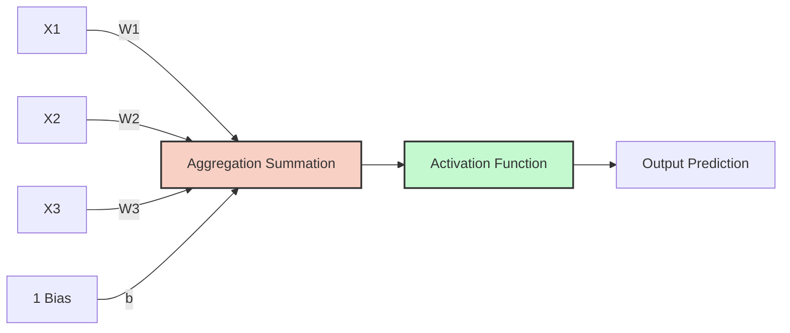

```mermaid
flowchart LR
    X1((X1)) -- w1 --> Sum((Z = Wx + b))
    X2((X2)) -- w2 --> Sum
    X3((X3)) -- w3 --> Sum
    Bias((Bias b)) --> Sum
    Sum --> Act[Activation Function f(z)]
    Act --> Out((Output y))
```

### The Two Steps of a Neuron

**1. Aggregation (Linear Step):**

The neuron receives multiple inputs $x_j$ (features). Each connection has a weight $w_j$ representing its importance. The neuron calculates the weighted sum, plus a bias $b$. This equation defines a linear decision boundary.

$$ z = \sum_{j=1}^{m} w_j x_j + b = W^T X + b $$

- $x$: Inputs (features). These are the raw data values fed into the neuron.
- $w$: Weights (importance of each feature). These are the learnable parameters that determine how much each input influences the output. A large positive weight means the corresponding input strongly pushes the output toward class 1; a large negative weight pushes toward class 0.
- $b$: Bias (shifts the activation threshold, allows the boundary to shift away from the origin). Without the bias, the decision boundary would always pass through the origin, severely limiting what the model can represent.

**2. Activation (Non-Linear Step):**

The raw sum $z$ is just a number. We need to convert this into a classification decision. The activation function $a(z)$ applies a threshold. The aggregated sum $z$ is passed through an activation function $f()$ to produce the final output $a$.

$$ a = f(z) $$

For the basic Perceptron, this is a Step Function (e.g., if $z \ge 0$, output 1; if $z < 0$, output 0). In modern neural networks, we use smoother activation functions (Sigmoid, ReLU, etc.) that are differentiable, enabling gradient-based training.

## The Crucial Role of Non-Linearity

Without activation functions, stacking 100 hidden layers is mathematically identical to having 1 hidden layer. The network would only be capable of linear transformations. If we only used linear aggregation ($Wx + b$) and stacked 100 layers on top of each other, mathematically, it would collapse down to a single linear equation. The network could only ever learn straight lines.

**Proof:** If each layer performs a linear transformation $z = Wx + b$, then composing two layers gives $z_2 = W_2(W_1 x + b_1) + b_2 = (W_2 W_1)x + (W_2 b_1 + b_2)$. This is still a linear transformation — it can be rewritten as $z = W'x + b'$ where $W' = W_2 W_1$ and $b' = W_2 b_1 + b_2$. No matter how many linear layers you stack, the result is always equivalent to a single linear layer. The network could only ever learn straight-line decision boundaries.

**Activation functions introduce Non-Linearity.** Non-linear activation functions multiply the geometric complexity of the model, allowing it to warp a flat plane into a highly complex sculpted surface capable of separating intricate data patterns. This allows the neural network to warp, bend, and sculpt decision boundaries into incredibly complex shapes, enabling it to learn anything (images, languages, audio). The Universal Approximation Theorem states that a neural network with a single hidden layer and a non-linear activation function can approximate any continuous function to arbitrary precision — but only if the activation function is non-linear.

---

## The Chain Rule: Mathematical Derivation of the Perceptron

This is the most critical mathematical concept in the course. To train a Perceptron using Gradient Descent, we must find the derivative of the Loss function ($\mathcal{L}$) with respect to the weights ($W$). Because the Loss function relies on the Activation ($a$), and the Activation relies on the Summation ($z$), we must use the **Chain Rule of Calculus** to decompose this derivative into manageable pieces.

Understanding this derivation is essential because the exact same chain rule mechanism is what powers backpropagation through deep neural networks with hundreds of layers. If you understand this single-neuron case, you understand the core mechanism of all deep learning.

### 1. The Core Equations

The Perceptron computes its output through three sequential steps, each depending on the previous:

1.  **Aggregation:** $z = W X + b$ — the weighted sum of inputs.
2.  **Activation (Sigmoid):** $a = \frac{1}{1 + e^{-z}}$ — the non-linear transformation.
3.  **Loss (Log Loss):** $\mathcal{L} = -\frac{1}{n} \sum [y \log(a) + (1 - y) \log(1 - a)]$ — the error measurement.

### 2. Applying the Chain Rule

To find how much a change in a weight ($w_1$) affects the final loss ($\mathcal{L}$), we multiply the partial derivatives backward through the network. This is the chain rule: the derivative of a composition of functions equals the product of the derivatives of each function.

$$ \frac{\partial \mathcal{L}}{\partial w_1} = \frac{\partial \mathcal{L}}{\partial a} \times \frac{\partial a}{\partial z} \times \frac{\partial z}{\partial w_1} $$

Let's break down the three parts in detail:

**Part A: Derivative of Loss with respect to Activation**

We need to differentiate $\mathcal{L} = -[y \log(a) + (1 - y) \log(1 - a)]$ with respect to $a$:

$$ \frac{\partial \mathcal{L}}{\partial a} = -\frac{y}{a} + \frac{1 - y}{1 - a} = \frac{-(y)(1-a) + (1-y)(a)}{a(1-a)} = \frac{-y + ya + a - ya}{a(1-a)} = \frac{a - y}{a(1 - a)} $$

This result makes intuitive sense: the gradient of the loss with respect to the activation is proportional to the error $(a - y)$ — how far the prediction is from the truth. The denominator $a(1-a)$ is a scaling factor that adjusts the gradient based on the confidence of the prediction.

**Part B: Derivative of Activation (Sigmoid) with respect to Z**

The derivative of the Sigmoid function has a beautiful, well-known property:

$$ \frac{\partial a}{\partial z} = a(1 - a) $$

This can be derived by differentiating $a = \frac{1}{1+e^{-z}}$:
- $\frac{da}{dz} = \frac{e^{-z}}{(1+e^{-z})^2} = \frac{1}{1+e^{-z}} \cdot \frac{e^{-z}}{1+e^{-z}} = a \cdot (1-a)$

This elegant result means the sigmoid derivative can be computed directly from the sigmoid output itself — no need to recalculate the exponential.

**Part C: Derivative of Z with respect to Weight**

Since $z = w_1 x_1 + w_2 x_2 + b$, the derivative with respect to $w_1$ simply leaves the constant attached to it:

$$ \frac{\partial z}{\partial w_1} = x_1 $$

This is the most straightforward part: increasing $w_1$ by a small amount increases $z$ by $x_1$ times that amount.

### 3. The Magical Cancellation

Now, we multiply the three parts together:

$$ \frac{\partial \mathcal{L}}{\partial w_1} = \left[ \frac{a - y}{a(1 - a)} \right] \times \left[ a(1 - a) \right] \times [x_1] $$

Notice how the complex denominator $a(1-a)$ perfectly cancels out the sigmoid derivative $a(1-a)$! This is not a coincidence — it's the reason why cross-entropy loss is paired with sigmoid activation. The two are mathematically designed to simplify each other.

We are left with the final, elegant gradient formula for a single weight:

$$ \frac{\partial \mathcal{L}}{\partial w_1} = (a - y)x_1 $$

This is remarkably simple: the gradient for a weight is just the prediction error $(a - y)$ multiplied by the corresponding input $x_1$. When summed over all $n$ samples in the dataset:

$$ \frac{\partial \mathcal{L}}{\partial w_1} = \frac{1}{n} \sum_{i=1}^{n} (a_i - y_i)x_{i1} $$

### 4. The Ultimate Vectorized Jacobian Form

Writing out loops to calculate this for every weight is inefficient. The course provides the ultimate vectorized form of this system using the **Jacobian** matrix ($\nabla \mathcal{L}$).

Let $A$ be the vector of all predictions, $Y$ be the true labels, and $X$ be the matrix of inputs.

$$ \nabla \mathcal{L} = \frac{1}{n} X^T \cdot (A - Y) $$
$$ W_{new} = W_{old} - \alpha \cdot \nabla \mathcal{L} $$

This single matrix operation computes the gradient for **all** weights simultaneously — no loops required. This is the computational foundation that makes neural network training feasible on modern hardware.

> [!TIP] Why this matters
> This mathematical proof demonstrates exactly why neural networks are computationally feasible. Despite the complexity of logarithms and exponentials in the loss and activation functions, the final gradient calculation boils down to a simple subtraction ($A-Y$) and a matrix multiplication ($X^T$). Without this cancellation, training deep networks would require computing and propagating enormously complex expressions through millions of parameters — an intractable problem. The chain rule + cross-entropy + sigmoid combination ensures that gradient computation remains simple and efficient regardless of network depth.

---

## Gradient Descent on the Perceptron: Specific Update Rules

Having derived the gradient using the chain rule, we can now write the explicit update rules for training the Perceptron. If using the Log Loss (BCE) and Sigmoid activation, the partial derivatives simplify to:

$$ \frac{\partial \text{Loss}}{\partial w_j} = (\hat{y} - y) x_j $$
$$ \frac{\partial \text{Loss}}{\partial b} = (\hat{y} - y) $$

The derivative with respect to the bias $b$ is just the error $(\hat{y} - y)$ without the input multiplier, because $\frac{\partial z}{\partial b} = 1$ (the bias has a constant coefficient of 1 in the aggregation step).

The update rules at iteration $h$ are:
$$ w_j^{(h+1)} = w_j^{(h)} - \alpha (\hat{y} - y) x_j $$
$$ b^{(h+1)} = b^{(h)} - \alpha (\hat{y} - y) $$

**Intuitive interpretation:**
- If $\hat{y} = y$ (the prediction is correct), the error is 0, and the weights are not updated. The neuron has already learned the correct response for this input.
- If $\hat{y} > y$ (the prediction is too high), the error is positive, and the weights are decreased. This pulls the prediction down toward the correct value.
- If $\hat{y} < y$ (the prediction is too low), the error is negative, and subtracting a negative number increases the weights. This pushes the prediction up toward the correct value.
- The magnitude of the update is proportional to the input $x_j$: features with larger values cause larger weight adjustments, which is appropriate because they have more influence on the output.

> [!TIP] Why is the derivative so simple?
> The mathematical beauty of combining the Sigmoid activation with the Log Loss derivative cancels out all complex terms, leaving just the error term $(\hat{y} - y)$. The sigmoid derivative $a(1-a)$ perfectly cancels the denominator from the log loss derivative $\frac{a-y}{a(1-a)}$. This is why Cross-Entropy is the natural pairing for Sigmoid outputs — they are mathematically designed to simplify each other. Without this cancellation, the gradient would involve complex logarithmic and exponential terms that would make training significantly more computationally expensive.

## Vectorization of the Aggregation Step: From Loops to Matrix Operations

In Python, calculating $z = \sum_{j=1}^{m} w_j x_j + b$ with a `for` loop over $m$ features is computationally tragic. A Python `for` loop executes roughly 100 times slower than the equivalent C code because of Python's dynamic typing and interpretation overhead. In deep learning, where we must compute millions of such operations per training step, this performance difference is the difference between training in minutes versus training in days.

We use **Vectorization** via NumPy (which runs in optimized C/Fortran code under the hood). We define $W$ as a column vector of shape $(m, 1)$ and $X$ as a column vector of shape $(m, 1)$:

$$ z = W^T X + b $$

Where $W^T X$ is the dot product (a single matrix operation that replaces $m$ multiplications and $m-1$ additions). For a batch of $n$ samples, $X$ becomes a matrix of shape $(n, m)$, and:

$$ Z = XW + b $$

computes all $n$ aggregations simultaneously in microseconds. This is the fundamental operation that makes deep learning computationally feasible — instead of processing one sample at a time through a Python loop, we process an entire batch at once through a single optimized matrix multiplication.

**Performance comparison (approximate):**
- Python `for` loop over 1 million samples: ~10 seconds
- Vectorized NumPy operation: ~0.01 seconds (1,000x faster)
- GPU-accelerated operation (PyTorch on CUDA): ~0.0001 seconds (100,000x faster)

This is why vectorization is not optional in deep learning — it is the difference between a model that trains in hours and one that would take years.


# Chapter 2 - CNN/1. Introduction and Foundations of CNNs.md
   Language: markdown

# 1. Introduction and Foundations of CNNs

## What Are Neural Networks? A Complete Foundation

Before we can understand Convolutional Neural Networks, we must first build a solid understanding of what neural networks are from the ground up. A neural network is a computational model loosely inspired by the way biological neurons in the human brain process information. At its core, a neural network is a function approximator: it takes some input, passes it through a series of mathematical transformations, and produces an output. The power of neural networks lies in their ability to learn the parameters of these transformations from data, rather than requiring a human to manually specify the rules.

### The Artificial Neuron: The Atomic Unit

The fundamental building block of every neural network is the artificial neuron, sometimes called a perceptron or a unit. An artificial neuron performs a very specific computation: it takes one or more numerical inputs, multiplies each input by a corresponding weight, sums all of these products together, adds a special number called a bias, and then passes the result through a function called an activation function. Formally, if a neuron receives inputs $x_1, x_2, \ldots, x_n$, has weights $w_1, w_2, \ldots, w_n$, and a bias $b$, its output $y$ is:

$$y = f\left(\sum_{i=1}^{n} w_i x_i + b\right) = f(\mathbf{w}^\top \mathbf{x} + b)$$

where $f$ is the activation function. Let us unpack every term here, because nothing should be left to assumption.

**Weights** ($w_i$) are learnable parameters that determine how much influence each input has on the neuron's output. A large positive weight means the corresponding input strongly excites the neuron; a large negative weight means the input strongly inhibits it; a weight near zero means the input is essentially ignored. During training, the learning algorithm adjusts these weights so that the network produces better outputs.

**Biases** ($b$) are also learnable parameters, but they serve a different role than weights. The bias shifts the entire weighted sum up or down before the activation function is applied. This is crucial because, without a bias, a neuron would always output $f(0) = 0$ when all inputs are zero, regardless of the weights. The bias gives the neuron the freedom to activate even when the inputs are zero, effectively shifting the decision boundary of the neuron. You can think of the bias as being equivalent to the intercept $b$ in the equation of a line $y = mx + b$.

**Activation functions** ($f$) introduce non-linearity into the network. Without an activation function, the neuron would simply compute a linear combination of its inputs ($\mathbf{w}^\top \mathbf{x} + b$), and no matter how many such neurons you stack, the entire network would collapse into a single linear transformation. This is a profoundly important point that we will return to in detail in Section 5, but for now understand this: non-linearity is what gives neural networks their expressive power. Common activation functions include ReLU ($f(z) = \max(0, z)$), Sigmoid ($f(z) = \frac{1}{1+e^{-z}}$), and Tanh ($f(z) = \tanh(z)$).

```python
# A single artificial neuron implemented from scratch
import numpy as np

# Define the inputs, weights, and bias
inputs = np.array([0.5, -0.3, 0.8])   # Three input values (x1, x2, x3)
weights = np.array([0.4, 0.7, -0.2])  # Three corresponding weights (w1, w2, w3)
bias = 0.1                             # A single bias term (b)

# Step 1: Compute the weighted sum: sum of (wi * xi) for all i
weighted_sum = np.dot(weights, inputs)  # This computes w1*x1 + w2*x2 + w3*x3
# weighted_sum = 0.4*0.5 + 0.7*(-0.3) + (-0.2)*0.8 = 0.20 - 0.21 - 0.16 = -0.17

# Step 2: Add the bias
z = weighted_sum + bias  # z = -0.17 + 0.1 = -0.07

# Step 3: Apply the activation function (ReLU in this case)
output = np.maximum(0, z)  # ReLU: max(0, z) = max(0, -0.07) = 0.0
print(f"Neuron output: {output}")  # Output is 0.0 because z < 0
```

### Layers: Organizing Neurons into Groups

A single neuron by itself can only learn a very simple function. To learn complex patterns, we organize neurons into layers. A layer is simply a collection of neurons that all receive the same inputs (or the outputs from the previous layer) but each have their own independent weights and biases. The most common type of layer is the fully connected layer (also called a dense layer), where every neuron in the layer is connected to every neuron in the previous layer.

A typical neural network has three types of layers:
1. **Input layer**: This is not really a "layer" of neurons; it is simply the raw input data fed into the network. If your data is a vector of 784 numbers (like a flattened 28×28 image), then your input layer has 784 "units."
2. **Hidden layers**: These are the layers between the input and the output. They are called "hidden" because their values are not directly observed — they are internal representations that the network learns. A network can have one or many hidden layers.
3. **Output layer**: The final layer that produces the network's prediction. For a binary classification problem, this might be a single neuron with a sigmoid activation (outputting a probability between 0 and 1). For a 10-class classification problem, this would be 10 neurons with a softmax activation.

### The Forward Pass

The forward pass is the process of propagating input data through the network, layer by layer, to produce an output. For a network with $L$ layers, the forward pass computes:

$$\mathbf{a}^{(0)} = \mathbf{x} \quad \text{(input)}$$
$$\mathbf{z}^{(l)} = \mathbf{W}^{(l)} \mathbf{a}^{(l-1)} + \mathbf{b}^{(l)} \quad \text{(pre-activation at layer } l\text{)}$$
$$\mathbf{a}^{(l)} = f^{(l)}(\mathbf{z}^{(l)}) \quad \text{(activation at layer } l\text{)}$$

where $\mathbf{W}^{(l)}$ is the weight matrix of layer $l$, $\mathbf{b}^{(l)}$ is the bias vector, and $f^{(l)}$ is the activation function. The output of the final layer $\mathbf{a}^{(L)}$ is the network's prediction.

### Learning via Backpropagation

A neural network's weights and biases are initially set to small random values, so the network's initial predictions are essentially random. Learning means adjusting these parameters so that the predictions improve. This is achieved through a process called backpropagation, combined with gradient descent.

The process works as follows. First, we define a loss function $\mathcal{L}$ that measures how bad the network's predictions are (for example, cross-entropy loss for classification or mean squared error for regression). Then, using the chain rule from calculus, backpropagation computes the gradient of the loss with respect to every single parameter in the network — every weight and every bias. The gradient tells us the direction and magnitude of change for each parameter that would increase the loss. By taking a small step in the opposite direction (the negative gradient), we decrease the loss:

$$\theta \leftarrow \theta - \eta \frac{\partial \mathcal{L}}{\partial \theta}$$

where $\theta$ is any parameter (weight or bias), $\eta$ is the learning rate (a small positive number like 0.001 that controls the step size), and $\frac{\partial \mathcal{L}}{\partial \theta}$ is the gradient. This process is repeated thousands or millions of times over the training data, gradually improving the network's performance.

> [!note] Why "Back"propagation?
> The name comes from the fact that the gradients are computed backwards: starting from the output layer (where the loss is computed), the error signal is propagated back through each hidden layer toward the input. This is an application of the chain rule: to compute $\frac{\partial \mathcal{L}}{\partial w_1}$, we first compute $\frac{\partial \mathcal{L}}{\partial a^{(L)}}$, then $\frac{\partial \mathcal{L}}{\partial z^{(L)}}$, then $\frac{\partial \mathcal{L}}{\partial a^{(L-1)}}$, and so on, working backward through the layers.

---

## Structured Grid Data and Why Images Are Grids of Pixels

Not all data is created equal. Some data has an inherent spatial structure — a regular, repeating arrangement where the position of each element carries meaning relative to its neighbors. This is what we call **structured grid data**. A grid is a data structure where elements are arranged in a regular pattern, typically along one or more axes, and where the relationship between neighboring elements is meaningful and consistent.

An image is the quintessential example of structured grid data. A digital image is represented as a 2D grid (for grayscale) or a 3D grid (for color) of numerical values called pixels. Each pixel stores one or more numbers representing the intensity of light at that particular location. For a grayscale image of size $H \times W$ (height × width), each pixel is a single number typically between 0 (black) and 255 (white). For a color image, each pixel is a triplet $(R, G, B)$ representing the red, green, and blue color channels, making the full image a 3D tensor of size $H \times W \times 3$.

The crucial property of image data is that pixels are not independent — a pixel at position $(i, j)$ is highly correlated with its neighbors at positions $(i\pm1, j)$, $(i, j\pm1)$, and so on. This is because natural images contain smooth regions, edges, and textures that create local statistical dependencies. A pixel in the middle of a blue sky is very likely to be surrounded by other blue pixels; a pixel on an edge is likely to have very different neighbors on one side compared to the other. This local correlation is the fundamental property that CNNs exploit.

> [!tip] The Grid Assumption
> The key assumption that makes CNNs appropriate for grid-structured data is the **locality principle**: information at one location is most relevant to information at nearby locations, and the nature of this relationship is approximately the same everywhere in the grid. This is why a single learned filter (like an edge detector) can be applied across all positions in an image — edges look like edges regardless of where they appear.

---

## The Three Dimensionalities of CNNs

Convolutional Neural Networks are not limited to 2D image data. The convolution operation can be generalized to data with different dimensional structures. The three main variants are:

### 1D Convolutions

1D convolutions operate on data arranged along a single spatial axis. The most common applications are in time-series analysis and natural language processing. In a time series, data points are arranged chronologically, and local patterns (trends, oscillations, spikes) occur along the time axis. A 1D convolution slides a 1D kernel along this time axis, detecting local temporal patterns. Similarly, in NLP, after embedding a sequence of words into vectors, a 1D convolution slides along the sequence dimension, detecting local patterns like phrases or n-grams.

**Concrete example**: Consider an electrocardiogram (ECG) signal sampled at 360 Hz. A 10-second recording is a 1D array of 3,600 values. A 1D CNN with a kernel size of 5 (covering about 14 milliseconds) can learn to detect the characteristic QRS complex waveform of a heartbeat by sliding along the time axis. The model would learn what the QRS shape looks like and detect it regardless of where in the signal it occurs — this is translation equivariance in one dimension.

### 2D Convolutions

2D convolutions are what most people think of when they hear "CNN." They operate on data arranged along two spatial axes, which is the natural structure of images. A 2D convolution slides a 2D kernel (typically 3×3 or 5×5) across both the height and width of the input, producing a 2D feature map as output. The two spatial dimensions correspond to the vertical and horizontal directions in the image.

**Concrete example**: A 224×224 RGB image (a 224×224×3 tensor) is processed by a 2D CNN. A 3×3 convolutional kernel slides across the 224×224 spatial grid, computing dot products with 3×3×3 patches of the image. This produces a 222×222 feature map (assuming stride 1, no padding) that highlights where certain local patterns (edges, corners, textures) appear in the image.

### 3D Convolutions

3D convolutions operate on data with three spatial dimensions. This is used for volumetric data such as medical imaging scans (CT, MRI), video data (where the third dimension is time), or 3D object representations. A 3D convolution slides a 3D kernel along all three axes simultaneously, detecting volumetric patterns.

**Concrete example**: A chest CT scan might be represented as a volumetric grid of size 512×512×300 (512×512 pixels per slice, 300 slices). A 3D CNN with a 3×3×3 kernel can detect 3D structures like nodules, blood vessels, or tumors that have a characteristic shape across all three spatial dimensions. Unlike processing each 2D slice independently, a 3D convolution captures the continuity of anatomical structures across slices, which is essential for accurate diagnosis.

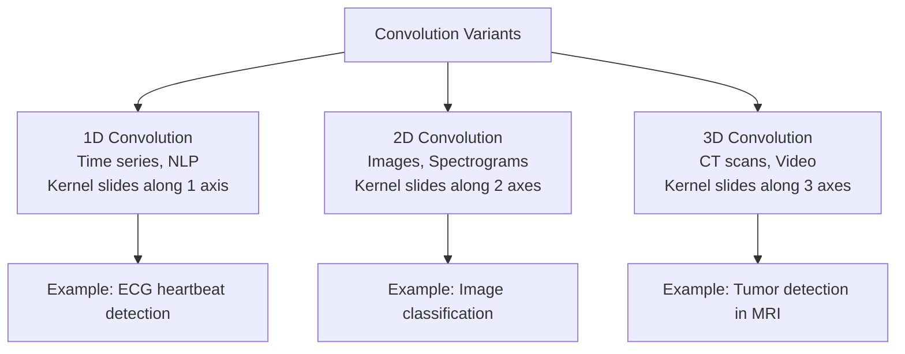

---

## Historical Context: Hubel & Wiesel (1959)

The intellectual ancestry of Convolutional Neural Networks traces back to one of the most important experiments in neuroscience, conducted by David Hubel and Torsten Wiesel in 1959. Their work, which earned them the Nobel Prize in Physiology or Medicine in 1981, revealed fundamental principles about how the visual cortex processes information — principles that would directly inspire the architecture of CNNs decades later.

### The Experiment

Hubel and Wiesel inserted microelectrodes into the primary visual cortex (area V1) of anesthetized cats. They then projected various visual stimuli — spots of light, bars, edges, and complex patterns — onto a screen in front of the cat and recorded the electrical activity of individual neurons. The key question was: what visual stimuli cause a given neuron to fire?

### What They Found

The results were surprising and groundbreaking. They discovered that neurons in V1 do not respond to simple spots of light (as was the prevailing hypothesis). Instead, individual neurons responded selectively to specific oriented edges or bars of light at precise locations in the visual field. They identified two distinct types of neurons:

**Simple cells** respond to specific oriented edges or bars at specific positions in the visual field. A simple cell might fire strongly when a vertical bar appears in the upper-left portion of the visual field, but remain silent when the same bar appears elsewhere or when a horizontal bar appears in the same location. Simple cells have clearly defined excitatory and inhibitory regions — they are essentially performing edge detection at specific orientations and positions. If you think of them mathematically, simple cells are approximately computing a dot product between their receptive field (a small patch of the visual field) and a template pattern (an oriented edge).

**Complex cells** also respond to oriented edges and bars, but unlike simple cells, they are less sensitive to the exact position of the stimulus within their receptive field. A complex cell that responds to vertical edges will fire when a vertical edge appears anywhere within a region of the visual field, not just at one precise location. This position tolerance is a primitive form of translation invariance — the same feature is recognized regardless of where it appears, which is exactly what pooling layers in CNNs aim to achieve.

### Receptive Fields

The concept of a **receptive field** was central to Hubel and Wiesel's findings. A neuron's receptive field is the specific region of the sensory input (the visual field, in this case) that can influence that neuron's activity. Neurons in V1 have small receptive fields — they only "see" a small patch of the entire visual scene. Neurons in higher visual areas (V2, V4, IT) have progressively larger receptive fields, meaning they integrate information from increasingly large portions of the visual field.

### Hierarchical Processing

Perhaps the most profound insight from Hubel and Wiesel's work was the discovery of hierarchical processing in the visual cortex. They found that the visual system processes information in stages: early stages (V1) detect simple features like edges; intermediate stages (V2, V4) combine these edges into more complex patterns like textures, shapes, and contours; and later stages (inferotemporal cortex, IT) combine these patterns into even more complex representations like object parts and whole objects. This hierarchy — from simple, local features to complex, global features — is directly mirrored in the architecture of CNNs, where early layers learn edge detectors, middle layers learn texture and pattern detectors, and later layers learn object-part and whole-object detectors.

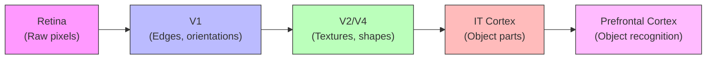

> [!info] From Biology to Architecture
> The direct mapping from Hubel & Wiesel's findings to CNN architecture is remarkable. Simple cells → convolutional filters (local, oriented feature detectors). Complex cells → pooling operations (position-tolerant feature detection). Hierarchical processing → deep stacks of conv+pool layers (progressively more abstract features). Kunihiko Fukushima explicitly designed his Neocognitron (1980) based on these principles, and Yann LeCun's LeNet (1989/1998) further refined this into the modern CNN architecture we use today.

---

## Why MLPs Fail for Images

Before CNNs became dominant, researchers tried to process images using standard Multi-Layer Perceptrons (MLPs) — networks composed entirely of fully connected layers. This approach failed catastrophically for several deeply interconnected reasons, each of which we will examine in detail.

### The Spatial Hierarchy Problem

Images have a natural spatial hierarchy: pixels form edges, edges form shapes, shapes form object parts, and object parts form whole objects. This hierarchical structure is critical for efficient and effective recognition. An MLP, by its very design, flattens the 2D image into a 1D vector before processing it, thereby destroying all spatial information. When you flatten a 28×28 image into a 784-dimensional vector, the network no longer "knows" that pixel (5, 10) is adjacent to pixel (5, 11) — it treats every pair of input dimensions as equally related. The MLP must then attempt to rediscover spatial relationships from scratch through its weights, which is extraordinarily wasteful and difficult.

### The Local Correlation Problem

As we discussed earlier, pixels in natural images are locally correlated — a pixel is most strongly related to its immediate neighbors, and the strength of the relationship decreases rapidly with distance. An MLP with a fully connected layer connects every input pixel to every neuron, giving equal importance to nearby pixels and distant pixels. This means the network has no built-in bias toward focusing on local patterns first. In principle, an MLP with enough neurons and training data could learn to focus on local patterns by setting the weights for distant connections to zero, but this requires the network to learn something that should be a structural prior, wasting capacity and training time.

### The Parameter Explosion Problem

This is the most devastating practical problem. Consider a modestly sized image of 224×224 pixels with 3 color channels. The total number of input values is $224 \times 224 \times 3 = 150{,}528$. If the first hidden layer has just 1,000 neurons (a very small layer by modern standards), the number of weights in just this one layer is:

$$150{,}528 \times 1{,}000 = 150{,}528{,}000 \quad \text{(over 150 million parameters!)}$$

And this is just the first layer. Add a second hidden layer of 1,000 neurons, and you need another $1{,}000 \times 1{,}000 = 1{,}000{,}000$ parameters. A deeper network with larger layers quickly balloons into billions of parameters. This has several catastrophic consequences:

1. **Memory**: Storing 150 million parameters at 32-bit precision requires about 600 MB of memory for just one layer. Training requires storing not only the parameters but also gradients, momentum terms, and activations — easily multiplying memory requirements by 4× or more.
2. **Computation**: Each forward pass through the first layer requires 150 million multiply-add operations. For training with backpropagation, the cost is even higher.
3. **Overfitting**: With 150 million free parameters and a finite training set (even a large one like ImageNet with 1.2 million images), the network has an enormous capacity to memorize the training data rather than learning generalizable patterns. This leads to poor performance on unseen data.

Now compare this to a convolutional layer. A single 3×3 convolutional filter applied to the same 224×224×3 image has only $3 \times 3 \times 3 = 27$ parameters (plus 1 bias = 28). If we use 64 such filters, the total is $64 \times 28 = 1{,}792$ parameters — **over 83,000 times fewer** than the fully connected layer! This dramatic reduction is possible because of weight sharing: each filter is applied across all spatial positions, reusing the same 27 parameters everywhere.

> [!warning] The Parameter Explosion in Numbers
> | Architecture | Layer | Parameters |
> |---|---|---|
> | MLP | FC layer: 150,528 → 1,000 | 150,528,000 |
> | CNN | Conv: 3×3, 64 filters, 3 input channels | 1,792 |
> | Ratio | — | **84,096× reduction** |
>
> This is not a minor optimization — it is the difference between a model that is tractable and one that is not.

---

## End-to-End Learning

### What It Means

End-to-end learning is a paradigm in which a single model learns to map directly from raw input data to the final desired output, without any intermediate hand-crafted processing stages. In the context of computer vision, this means the model takes raw pixels as input and directly produces class labels (or bounding boxes, or segmentation masks) as output. All the intermediate representations — edges, textures, shapes, object parts — are learned automatically from data, not designed by a human engineer.

### What It Replaces

Before end-to-end learning became practical, the standard computer vision pipeline consisted of two distinct stages:

1. **Feature engineering**: A human expert would manually design algorithms to extract meaningful features from images. These features were intended to capture the essential information while discarding irrelevant variability. Popular hand-crafted feature descriptors included:
   - **SIFT** (Scale-Invariant Feature Transform, Lowe 1999/2004): Detected keypoints in an image and computed a 128-dimensional descriptor for each keypoint that was invariant to scale, rotation, and partially invariant to illumination changes. SIFT worked by building a scale-space pyramid (using Gaussian blurs at multiple scales), detecting local extrema as keypoints, and computing orientation histograms in the local neighborhood of each keypoint.
   - **HOG** (Histogram of Oriented Gradients, Dalal & Trigggs 2005): Divided the image into small cells, computed a histogram of gradient orientations in each cell, and concatenated these histograms into a feature vector. HOG was particularly successful for pedestrian detection.
   - **SURF** (Speeded Up Robust Features, Bay et al. 2006): A faster approximation of SIFT that used Haar wavelet responses and integral images for efficient computation.

2. **Classification**: A standard machine learning classifier (SVM, Random Forest, k-NN) would then be trained on the extracted features to perform the final classification.

### Why End-to-End Is Better

The fundamental problem with the two-stage pipeline is that the feature engineering step creates a bottleneck. If the hand-crafted features do not capture the information necessary for the task, no amount of classifier tuning can compensate. The features are designed based on human intuition about what is important, but human intuition often misses the features that are truly optimal for the task. End-to-end learning eliminates this bottleneck by allowing the model to discover its own optimal features. The features learned by deep CNNs are often completely unlike anything a human would design — they might combine color, texture, and shape information in ways that are mathematically optimal for the task but unintelligible to a human observer.

Furthermore, hand-crafted features are typically designed for a specific domain (e.g., SIFT for interest point matching, HOG for pedestrian detection) and do not generalize well to other tasks. End-to-end learned features, by contrast, are automatically tailored to the specific task and dataset, and they can be transferred to related tasks through fine-tuning (a concept we will explore in the context of transfer learning).

> [!tip] The Performance Gap
> The watershed moment for end-to-end learning was the ImageNet Large Scale Visual Recognition Challenge (ILSVRC) 2012. AlexNet, a deep CNN trained end-to-end, achieved a top-5 error rate of 15.3%, compared to 26.2% for the best non-deep-learning method (which used SIFT features with Fisher Vector encoding). This 10.9 percentage point gap stunned the computer vision community and catalyzed the rapid adoption of deep learning.

---

## Advantages and Limitations of CNNs

| Advantage | Detailed Explanation |
|---|---|
| **Translation Equivariance** | A CNN produces the same feature response regardless of where a pattern appears in the image. If an edge appears in the top-left corner, the same filter will detect it as if it appeared in the bottom-right corner. This is not translation *invariance* (that comes from pooling), but translation *equivariance*: if the input shifts, the output shifts correspondingly. This property dramatically reduces the number of training examples needed, because the network does not need to see each pattern at every possible location. |
| **Parameter Efficiency** | Due to weight sharing and local connectivity, CNNs use orders of magnitude fewer parameters than equivalent MLPs. As we computed above, a single convolutional layer might use 1,792 parameters where an equivalent fully connected layer would need 150 million. This efficiency enables training on large images with limited computational resources and reduces overfitting. |
| **Hierarchical Feature Learning** | CNNs automatically learn a hierarchy of features from low-level (edges, corners) to mid-level (textures, patterns) to high-level (object parts, objects). This mirrors the hierarchical processing observed in the human visual cortex and is highly effective for visual recognition. Each layer builds upon the features extracted by the previous layer, creating increasingly abstract and powerful representations. |
| **End-to-End Training** | CNNs can be trained directly from raw pixels to final predictions, eliminating the need for manual feature engineering. This not only saves development time but also allows the model to discover features that are optimal for the specific task — features that a human engineer might never think to design. |
| **Transferability** | Features learned by CNNs on large datasets (especially early layers that detect edges and textures) transfer well to other visual tasks. A model pre-trained on ImageNet can be fine-tuned on a much smaller medical imaging dataset with excellent results, leveraging the general-purpose visual features learned from the large dataset. |

| Limitation | Detailed Explanation |
|---|---|
| **Loss of Spatial Precision** | Pooling layers and strided convolutions progressively reduce the spatial resolution of feature maps, discarding precise location information. While this provides translation invariance, it makes it difficult for the network to determine exactly where a feature is located. This is particularly problematic for tasks requiring precise localization, such as object detection and semantic segmentation. |
| **The Spatial Context Problem** | CNNs are excellent at detecting the *presence* of features but poor at understanding the *spatial relationships* between features. A CNN can detect two eyes, a nose, and a mouth, but it cannot easily verify that the eyes are above the nose and the nose is above the mouth. This means a CNN might classify a jumbled face (with features rearranged) the same as a normal face. We discuss this in more detail below. |
| **Sensitivity to Rotation and Scale** | Standard CNNs are not inherently invariant to rotation or scale changes. An object photographed from a different angle or at a different distance may not be recognized. While data augmentation (randomly rotating and scaling training images) partially addresses this, it is a workaround rather than a fundamental solution. Specialized architectures like Group Equivariant CNNs and Spatial Transformer Networks attempt to build in these invariances more directly. |
| **Fixed Receptive Field Size** | The receptive field of a standard CNN is determined by its architecture (number of layers, kernel sizes, strides) and is fixed once the architecture is set. This means the network cannot dynamically adjust its receptive field based on the content of the image — it cannot "zoom in" on fine details or "zoom out" for global context as needed. This is in contrast to attention mechanisms, which can dynamically focus on different parts of the input. |
| **Computational Cost** | Despite their parameter efficiency, CNNs can be computationally expensive due to the sheer number of arithmetic operations involved in convolution, especially on high-resolution images. A single forward pass through a modern CNN like ResNet-152 requires billions of floating-point operations, making real-time inference on edge devices challenging without optimization techniques like quantization, pruning, or knowledge distillation. |

---

## The Spatial Context Problem

One of the most significant limitations of standard CNNs is their difficulty in capturing spatial relationships between detected features. To understand this problem concretely, consider the task of face recognition. A face consists of several key features: two eyes, a nose, and a mouth. A CNN will learn to detect each of these features independently through its convolutional filters and pooling layers. However, the pooling and fully connected layers that aggregate these features do not explicitly encode the spatial relationships between them.

Consider a thought experiment: take a photograph of a face and rearrange the features so that the mouth is at the top, the eyes are at the bottom, and the nose is sideways. A human would immediately recognize this as not a face — the spatial relationships are wrong. But a standard CNN, having detected the presence of "eye-like" features, "nose-like" features, and "mouth-like" features, might still classify the rearranged image as a face, because the spatial arrangement information has been progressively discarded through pooling operations.

This problem arises because pooling layers provide translation invariance by discarding precise positional information. Max pooling, for instance, tells you that a feature was present somewhere within a pooling region, but not exactly where. After several pooling layers, the network knows *what* features are present but has only a rough idea of *where* they are relative to each other.

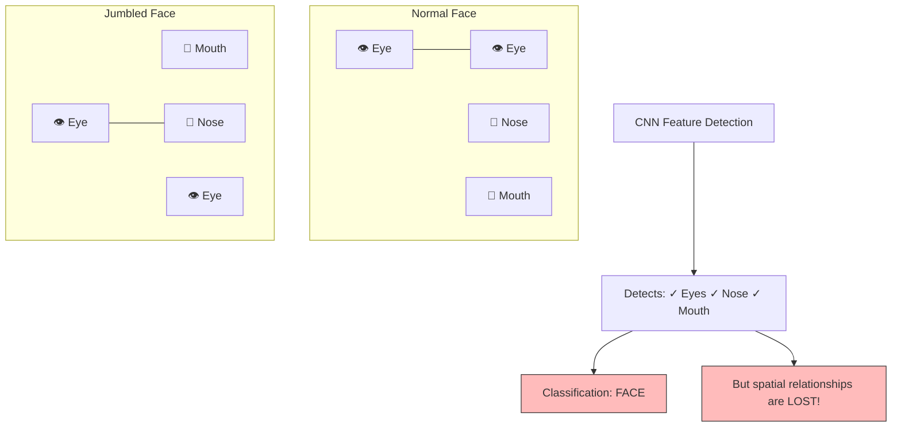

---

## Modern Solutions to the Spatial Context Problem

### Data Augmentation

Data augmentation is the simplest and most widely used technique for addressing the spatial context problem (and many other limitations of CNNs). The idea is to artificially expand the training dataset by applying random transformations to the training images, including random crops, rotations, flips, color jittering, and elastic deformations. By training on augmented data, the CNN sees objects in many different configurations, positions, and scales, and learns to be more robust to these variations.

While data augmentation does not fundamentally solve the spatial context problem — the network still cannot explicitly reason about spatial relationships — it does help by ensuring that the network sees enough variation in spatial arrangements during training that it learns more robust feature combinations. For example, by randomly cropping different parts of the face during training, the network learns that the exact position of the eyes relative to the edge of the image is not important, but the relative position of the eyes to the nose is.

### Attention Mechanisms and Vision Transformers (ViT)

Attention mechanisms provide a more fundamental solution to the spatial context problem. The key idea is to allow the network to dynamically focus on different parts of the input and to model relationships between different spatial locations explicitly. In the context of vision, the Vision Transformer (ViT, Dosovitskiy et al. 2020) divides an image into a grid of non-overlapping patches (e.g., 16×16 pixels), embeds each patch into a vector, and then applies the standard Transformer self-attention mechanism to allow every patch to attend to every other patch.

Self-attention computes, for each pair of patches $(i, j)$, an attention weight $\alpha_{ij}$ that determines how much patch $j$ influences the representation of patch $i$. This means that if the network needs to verify that the eyes are above the nose, it can assign high attention weights between the eye patches and the nose patch, explicitly encoding their spatial relationship. Unlike CNNs, where the receptive field is determined by the architecture, attention allows the network to dynamically decide which long-range dependencies are important for each input.

However, ViTs have their own limitations: they require very large training datasets (typically hundreds of millions of images) to match CNN performance, they are computationally expensive (self-attention has quadratic complexity in the number of patches), and they lack the translation equivariance inductive bias that makes CNNs so data-efficient. Hybrid architectures that combine CNN backbones with attention layers aim to get the best of both worlds.

### Capsule Networks

Capsule Networks (CapsNets), proposed by Geoffrey Hinton in 2017, were designed specifically to address the spatial context problem. The core innovation is the **capsule**, a group of neurons whose output is not a scalar (as in a traditional neuron) but a vector. The length of the vector represents the probability that the entity (feature, object part) exists, and the direction of the vector encodes the entity's instantiation parameters — its pose, deformation, velocity, and other properties that define its precise state.

In a Capsule Network, lower-level capsules (detecting simple features) use a mechanism called **routing by agreement** to send their outputs to higher-level capsules (detecting complex features). The key idea is that if a lower-level capsule (e.g., detecting an eye) makes a prediction about the pose of a higher-level entity (e.g., a face), and this prediction agrees with the predictions from other lower-level capsules (e.g., the nose capsule and mouth capsule), then the lower-level capsules should send their outputs to the corresponding higher-level capsule. This routing by agreement mechanism naturally enforces spatial consistency: if the predicted poses of the eyes, nose, and mouth all agree on the pose of the face, the face capsule activates strongly. If they disagree (as in a jumbled face), the face capsule does not activate.

While Capsule Networks are theoretically elegant and directly address the spatial context problem, they have not yet achieved the widespread practical success of CNNs and Vision Transformers, primarily due to computational cost and difficulty in scaling to very deep architectures and large datasets.

> [!note] Summary of Solutions
> - **Data Augmentation**: Simple, practical, but does not fundamentally solve the problem.
> - **Attention/ViT**: Powerful, explicitly models all pairwise spatial relationships, but computationally expensive and data-hungry.
> - **Capsule Networks**: Theoretically principled, directly encodes spatial relationships via routing by agreement, but not yet practical at scale.


# Chapter 2 - CNN/10. Inception Architecture Deep Dive.md
   Language: markdown

# 10. Inception Architecture Deep Dive

> [!info] Prerequisites
> Before reading this section, you should be comfortable with the fundamentals of convolutional neural networks, including how convolutional filters operate, how padding and stride affect spatial dimensions, and how pooling layers reduce resolution. You should also understand the concept of receptive fields and how deeper layers in a CNN accumulate increasingly large receptive fields from earlier layers.

---

## The Core Design Question: Why Commit to a Single Filter Size?

When we design a convolutional layer, we must choose a filter size—most commonly 3×3, but sometimes 5×5 or even 7×7. This choice implicitly commits the entire layer to looking at the input through a single spatial window. But this commitment creates a fundamental tension, because different types of visual information in an image exist at fundamentally different spatial scales, and no single filter size is optimal for capturing all of them simultaneously.

Consider what a CNN "sees" at intermediate layers of a network trained on ImageNet. At these layers, the network has already learned to detect a variety of features. **Textures**—such as the fine grain of sand, the rippled pattern of water, or the stippled surface of an orange peel—are highly localized patterns that only span a few pixels. A 1×1 or 3×3 filter is ideal for capturing these fine-grained details because the relevant information is concentrated in a tiny spatial neighborhood, and using a larger filter would dilute the signal with irrelevant surrounding pixels while simultaneously wasting computation on regions that contribute nothing to the texture detection. **Object parts and local structures**—such as an eye on a face, a wheel on a car, or a window on a building—span a moderate spatial extent, typically requiring a 3×3 or 5×5 receptive field to capture the full structure of the part in question. A filter that is too small will only see a fragment of the eye or wheel, missing the holistic shape; a filter that is too large will waste computation and introduce noise from surrounding context. **Global context and scene-level information**—such as the overall layout of a room, the horizon line in a landscape, or the spatial relationship between a person and the objects around them—requires a large receptive field, often 5×5 or larger, because the meaningful relationships span a significant portion of the feature map.

> [!tip] Concrete Example
> Imagine an image of a dog sitting on a couch in a living room. A 1×1 convolution can detect the texture of the dog's fur (small-scale pattern). A 3×3 convolution can detect the dog's eye or ear (medium-scale object part). A 5×5 convolution can capture the relationship between the dog and the couch cushion beneath it (large-scale context). Each scale provides complementary information that is valuable for classification, and choosing only one filter size means deliberately discarding the information at other scales.

The Inception module, introduced by Szegedy et al. in their 2014 paper "Going Deeper with Convolutions," asks a radical question: **what if we don't choose at all?** What if, instead of committing to a single filter size, we run multiple filter sizes in parallel and let the network learn which ones to use for each feature? This is the core insight of the Inception architecture: multi-scale parallel processing within a single layer, followed by aggregation of the multi-scale results.

---

## The Naive Inception Module

The simplest realization of the multi-scale parallel processing idea is what the original paper calls the "naive" Inception module. In this design, the input feature map is processed by four independent parallel branches, each looking at the data through a different spatial window, and the results of all four branches are concatenated along the depth (channel) dimension to form the output. This concatenation is critical: it preserves all the information from all scales, and subsequent layers can learn to weight the different-scale features as appropriate for the task at hand.

The four branches of the naive Inception module are as follows:

1. **1×1 Convolution Branch**: This branch uses a single 1×1 filter that looks at one pixel at a time, computing a linear combination of the input channels at each spatial location. This branch is responsible for capturing pixel-level patterns and cross-channel correlations without any spatial context. It essentially acts as a learned pointwise feature transformation, similar to applying a fully connected layer independently at each spatial position.

2. **3×3 Convolution Branch**: This branch uses 3×3 filters that look at a 3×3 neighborhood around each pixel. This branch captures local spatial structures and medium-scale patterns. It is the workhorse of modern CNNs and represents the standard convolutional window size that balances spatial context with computational efficiency.

3. **5×5 Convolution Branch**: This branch uses 5×5 filters that look at a 5×5 neighborhood around each pixel. This branch captures larger-scale spatial structures and broader context. The larger receptive field allows it to detect patterns that span a wider area, such as the relationship between adjacent object parts or extended edge structures.

4. **3×3 Max Pooling Branch**: This branch applies 3×3 max pooling with stride 1 and same padding (so the spatial dimensions are preserved). Max pooling selects the maximum activation within each 3×3 window, which provides a form of local translation invariance and picks out the most salient features in each local region. Including pooling in the module ensures that the multi-scale representation also captures the most activated features, not just linear combinations of them.

All four branches produce output feature maps with the **same spatial dimensions** as the input (achieved through appropriate padding), which is essential because the outputs must be concatenated along the channel dimension. If the spatial dimensions did not match, concatenation would be impossible.

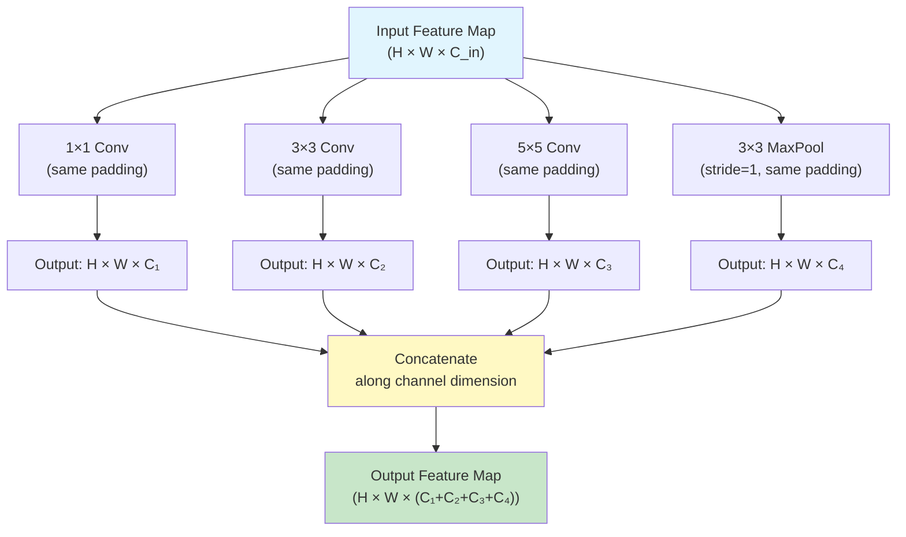

> [!note] Why Concatenation Along Channels?
> Concatenation along the channel dimension is the natural choice because it preserves all spatial information while stacking the different-scale feature maps as separate "slices" of the output tensor. Subsequent convolutional layers can then learn to combine information across channels, effectively learning which scales are most relevant for each spatial location. This is analogous to how the human visual cortex processes information through multiple parallel pathways that are later integrated in higher cortical areas.

---

## The Computational Cost Problem

The naive Inception module looks elegant, but it harbors a devastating computational problem. As we increase the number of filters in each branch to give the network sufficient representational capacity, the computational cost explodes—especially in the 5×5 convolution branch and the 3×3 convolution branch. Let us work through a concrete numerical example to see exactly how bad this problem is.

### Worked Example: Cost of the 5×5 Branch

Suppose the input to an Inception module has spatial dimensions 28×28 and 256 channels (a realistic size for an intermediate layer in a CNN processing ImageNet images). Suppose the 5×5 convolution branch uses 64 filters. We need to compute the total number of multiply-add operations required for this single branch.

A 5×5 convolution filter, applied to an input with 256 channels, has:
- **Filter dimensions**: 5 × 5 × 256 (height × width × input channels)
- **Parameters per filter**: 5 × 5 × 256 = 6,400
- **Number of filters**: 64
- **Total parameters**: 64 × 6,400 = 409,600

But we need to count multiply-add **operations**, not just parameters. Each filter is applied at every spatial position of the output feature map. With same padding, the output spatial dimensions equal the input spatial dimensions (28×28). At each output position, the filter performs 5 × 5 × 256 = 6,400 multiply-adds. With 64 filters and 28 × 28 spatial positions:

$$\text{Total multiply-adds} = \text{output\_H} \times \text{output\_W} \times \text{filters} \times \text{kernel\_H} \times \text{kernel\_W} \times \text{input\_channels}$$

$$= 28 \times 28 \times 64 \times 5 \times 5 \times 256$$

Let us compute this step by step:

1. $28 \times 28 = 784$ (number of spatial positions in the output)
2. $5 \times 5 = 25$ (number of spatial positions in the kernel)
3. $784 \times 25 = 19,600$ (multiply-adds per filter across all spatial positions)
4. $19,600 \times 256 = 5,017,600$ (multiply-adds per filter, accounting for input channels)
5. $5,017,600 \times 64 = 321,126,400$ (multiply-adds across all 64 filters)

So the 5×5 branch alone requires approximately **321 million multiply-add operations**. And this is just one branch of the module! The 3×3 branch (with 128 filters, say) would add another substantial chunk:

$$3\times3\text{ branch}: 28 \times 28 \times 128 \times 3 \times 3 \times 256 = 241,172,480 \text{ multiply-adds}$$

Even the 1×1 branch with 64 filters costs:

$$1\times1\text{ branch}: 28 \times 28 \times 64 \times 1 \times 1 \times 256 = 12,845,056 \text{ multiply-adds}$$

The total for the naive module is enormous, and it gets progressively worse in deeper layers where channel counts are higher. This computational explosion makes the naive Inception module impractical for real-world use, especially on the hardware available in 2014.

> [!warning] The Scaling Problem
> The computational cost of convolutions scales with the product of input channels, output channels, and the square of the kernel size. As networks get deeper and wider, channel counts grow, and the cost grows quadratically with kernel size. A 5×5 convolution costs $(5/3)^2 \approx 2.78\times$ more than a 3×3 convolution with the same channel counts, and a naive Inception module uses both—plus pooling and 1×1 convolutions—creating a multiplicative cost blowup.

---

## The Improved Module with 1×1 Bottleneck Layers

The key insight that makes Inception practical is the use of **1×1 convolutions as dimensionality reduction bottlenecks**. A 1×1 convolution with fewer output channels than input channels acts as a learned projection that compresses the channel dimension while preserving the spatial dimensions. By inserting these bottleneck layers before the expensive 3×3 and 5×5 convolutions (and after the pooling layer), we dramatically reduce the number of input channels that the large kernels must process, which in turn dramatically reduces the total computational cost.

The improved Inception module works as follows:

1. **1×1 Convolution Branch**: Remains unchanged—it already uses 1×1 convolutions, so there is no need for additional dimensionality reduction.

2. **3×3 Convolution Branch**: A 1×1 convolution is applied first to reduce the channel count from (say) 256 to 64. Then the 3×3 convolution operates on the reduced 64-channel feature map, producing 64 output channels. The 1×1 bottleneck reduces the number of input channels that the expensive 3×3 convolution must process from 256 to just 64.

3. **5×5 Convolution Branch**: A 1×1 convolution is applied first to reduce the channel count from 256 to (say) 32. Then the 5×5 convolution operates on the reduced 32-channel feature map, producing 64 output channels. The bottleneck here is even more aggressive because the 5×5 convolution is the most expensive operation in the module.

4. **3×3 Max Pooling Branch**: The pooling layer is applied first (it does not change the channel count). Then a 1×1 convolution reduces the channel count from 256 to 64 for the output. This is necessary because without the 1×1 convolution after pooling, the full 256 channels would be passed to the concatenation, inflating the output channel count and the cost of all subsequent layers.

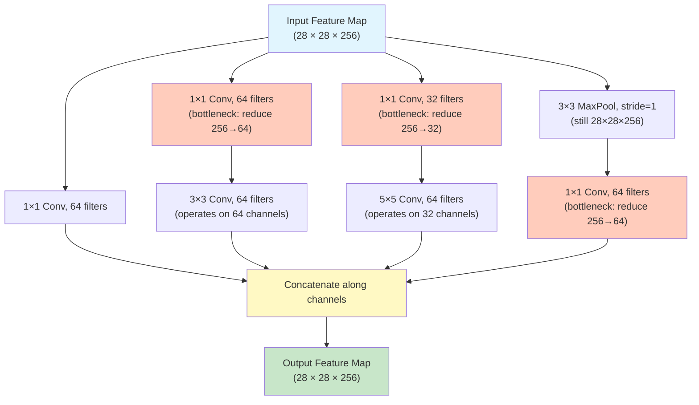

> [!tip] Why 1×1 Convolutions Work as Bottlenecks
> A 1×1 convolution is essentially a learned linear combination of the input channels at each spatial position. When the number of output channels is smaller than the number of input channels, the 1×1 convolution learns to project the high-dimensional channel space into a lower-dimensional subspace that preserves the most important information. This is analogous to Principal Component Analysis (PCA), but the projection is learned end-to-end through backpropagation rather than computed analytically. The key property is that this projection is cheap (1×1 convolutions have minimal computational cost) yet it can dramatically reduce the input channel count for the expensive convolutions that follow.

---

## Cost Savings Calculation: The Bottleneck in Numbers

Let us now compute the exact parameter count and computational savings achieved by the 1×1 bottleneck layers. We will compare the naive module (no bottlenecks) with the improved module (with bottlenecks) using the same input dimensions and output specifications.

### Without Bottleneck (Naive Module)

Assume the input is 28×28×256. The output channel counts for each branch are: 1×1 branch = 64, 3×3 branch = 128, 5×5 branch = 32, MaxPool branch = 64. Total output channels = 64 + 128 + 32 + 64 = 288.

**Parameter count for each branch:**

1. **1×1 branch**: The 1×1 conv takes 256 input channels and produces 64 output channels.
   $$P_{1\times1} = 1 \times 1 \times 256 \times 64 = 16{,}384$$

2. **3×3 branch**: The 3×3 conv takes 256 input channels and produces 128 output channels.
   $$P_{3\times3} = 3 \times 3 \times 256 \times 128 = 294{,}912$$

3. **5×5 branch**: The 5×5 conv takes 256 input channels and produces 32 output channels.
   $$P_{5\times5} = 5 \times 5 \times 256 \times 32 = 204{,}800$$

4. **MaxPool branch**: No learnable parameters in max pooling itself. However, the pooling output has 256 channels that are passed directly to concatenation. We will count 0 parameters here since we are comparing the conv-only costs.
   $$P_{\text{pool}} = 0$$

**Total parameters (naive):**
$$P_{\text{naive}} = 16{,}384 + 294{,}912 + 204{,}800 + 0 = 516{,}096$$

### With Bottleneck (Improved Module)

Now we insert 1×1 bottleneck layers. The output channel counts remain the same for the final convolutions in each branch, but the expensive convolutions now operate on reduced channel counts.

1. **1×1 branch**: Unchanged.
   $$P_{1\times1} = 1 \times 1 \times 256 \times 64 = 16{,}384$$

2. **3×3 branch**: 1×1 bottleneck (256→64) + 3×3 conv (64→128).
   $$P_{\text{bottleneck\_3\times3}} = (1 \times 1 \times 256 \times 64) + (3 \times 3 \times 64 \times 128) = 16{,}384 + 73{,}728 = 90{,}112$$

3. **5×5 branch**: 1×1 bottleneck (256→24) + 5×5 conv (24→32).
   $$P_{\text{bottleneck\_5\times5}} = (1 \times 1 \times 256 \times 24) + (5 \times 5 \times 24 \times 32) = 6{,}144 + 19{,}200 = 25{,}344$$

4. **MaxPool branch**: 1×1 projection after pooling (256→64).
   $$P_{\text{pool\_proj}} = 1 \times 1 \times 256 \times 64 = 16{,}384$$

**Total parameters (with bottlenecks):**
$$P_{\text{bottleneck}} = 16{,}384 + 90{,}112 + 25{,}344 + 16{,}384 = 148{,}224$$

### The Savings

$$\text{Reduction} = 1 - \frac{P_{\text{bottleneck}}}{P_{\text{naive}}} = 1 - \frac{148{,}224}{516{,}096} \approx 1 - 0.287 \approx 71.3\%$$

The bottleneck design reduces the parameter count by approximately **71%**. In other configurations (with different channel counts), the savings can be even more dramatic—the original paper reports cases with **87% reduction** when the channel counts are higher.

> [!note] The Canonical Inception Cost Comparison
> The most commonly cited comparison uses these specific numbers: without bottleneck, the 5×5 branch alone would need $5 \times 5 \times 256 \times 32 = 204{,}800$ parameters, while with the bottleneck, it needs $(1 \times 1 \times 256 \times 24) + (5 \times 5 \times 24 \times 32) = 6{,}144 + 19{,}200 = 25{,}344$ parameters—a reduction of 87.6% for this branch alone. The savings are most dramatic for the branches with the largest kernels, which is precisely where the cost problem is most severe.

---

## Auxiliary Classifiers: Fighting Vanishing Gradients in Very Deep Networks

GoogLeNet (the practical instantiation of the Inception architecture) is 22 layers deep, which was extraordinarily deep for its time. Such depth creates a serious optimization challenge: the gradient signal from the loss function must propagate backwards through many layers, and with each layer, the gradient can become smaller (the vanishing gradient problem). By the time the gradient reaches the early layers of the network, it may be so small that those layers receive virtually no learning signal, effectively stalling their training.

### The Problem

During backpropagation, the gradient of the loss with respect to the weights in layer $l$ depends on the chain of Jacobians from the output layer back to layer $l$:

$$\frac{\partial \mathcal{L}}{\partial W_l} = \frac{\partial \mathcal{L}}{\partial a_L} \cdot \frac{\partial a_L}{\partial a_{L-1}} \cdot \frac{\partial a_{L-1}}{\partial a_{L-2}} \cdots \frac{\partial a_{l+1}}{\partial a_l} \cdot \frac{\partial a_l}{\partial W_l}$$

If each Jacobian $\frac{\partial a_{k+1}}{\partial a_k}$ has eigenvalues less than 1, then the product of many such Jacobians shrinks exponentially with depth. This means the gradient reaching the early layers can be vanishingly small, providing almost no update signal for those layers' weights.

### The Solution: Auxiliary Classification Heads

The Inception paper introduces **auxiliary classifiers**—additional classification heads attached to intermediate layers of the network. These auxiliary heads take the feature maps from intermediate Inception modules, apply a few processing layers (average pooling, 1×1 convolution, fully connected layers), and produce their own classification predictions with their own cross-entropy losses. The total loss is a weighted combination of the main classifier's loss and the auxiliary classifiers' losses.

During training, the auxiliary classifiers inject fresh gradient signals into the intermediate layers. The gradient from the auxiliary loss only needs to propagate backwards through the layers above the auxiliary head, not through the entire depth of the network. This means that even if the gradient from the main classifier has vanished by the time it reaches an intermediate layer, the gradient from the auxiliary classifier at that layer is still strong and informative, providing a reliable learning signal for the layers below it.

### How Auxiliary Classifiers Work in GoogLeNet

GoogLeNet uses two auxiliary classifiers, attached after the Inception modules at layers 4a and 4d (roughly in the middle of the network). Each auxiliary classifier consists of:

1. **Average pooling**: A 5×5 average pooling layer with stride 3 that reduces the spatial dimensions of the feature map. This serves to condense the spatial information and reduce the computational cost of the subsequent fully connected layers.

2. **1×1 Convolution**: A 1×1 convolution with 128 filters that reduces the channel dimension and adds a learned projection. This serves as a bottleneck to keep the parameter count of the auxiliary head manageable.

3. **Fully connected layer**: A fully connected layer with 1024 units that transforms the pooled, projected features into a rich representation suitable for classification.

4. **ReLU activation**: A ReLU nonlinearity applied after the fully connected layer to introduce the capacity for nonlinear decision boundaries.

5. **Dropout**: A dropout layer with 70% keep probability that prevents the auxiliary head from overfitting to its limited view of the network's features.

6. **Fully connected layer + Softmax**: A final fully connected layer that projects to the 1000 ImageNet classes, followed by softmax to produce a probability distribution.

### The Weighted Loss

During training, the total loss is computed as a weighted sum:

$$\mathcal{L}_{\text{total}} = \mathcal{L}_{\text{main}} + 0.3 \cdot \mathcal{L}_{\text{aux1}} + 0.3 \cdot \mathcal{L}_{\text{aux2}}$$

The main classifier's loss receives full weight (1.0), while each auxiliary classifier's loss receives a weight of 0.3 (30%). The lower weight for auxiliary losses reflects the fact that the auxiliary classifiers are primarily optimization aids rather than independent classifiers—their purpose is to provide gradient signals to intermediate layers, not to make accurate predictions in their own right.

### What Happens at Test Time

At test time (inference), the auxiliary classifiers are **completely discarded**. They serve no purpose during inference because we only need the final prediction from the main classification head. The auxiliary heads were solely a training trick to improve gradient flow and help the intermediate layers learn better features. Removing them at test time also reduces the model's memory footprint and computational cost during deployment.

> [!warning] Common Misconception
> A common misconception is that the auxiliary classifiers improve accuracy by "providing additional predictions" that are ensembled with the main prediction. This is not the case—the auxiliary predictions are discarded at test time. Their sole purpose is to improve the gradient flow during training, which indirectly improves the quality of the features learned by the intermediate layers, which in turn improves the main classifier's accuracy.

---

## GoogLeNet Architecture Overview

GoogLeNet is the specific network architecture presented in the 2014 paper that uses Inception modules as its building blocks. It was named in homage to LeNet, the pioneering CNN architecture by Yann LeCun, while the "Google" prefix reflects its origin at Google Research. GoogLeNet won the ILSVRC 2014 classification competition with a top-5 error rate of 6.67%, a dramatic improvement over the 2013 winner (Clarifai, 11.7%) and the 2012 winner (AlexNet, 15.3%).

### Architecture Summary

The GoogLeNet architecture consists of the following components, listed in order from input to output:

1. **Stem network**: A series of conventional convolutional and pooling layers that reduce the spatial resolution and increase the channel depth of the input image. The stem includes a 7×7 convolution (stride 2), a 3×3 max pool (stride 2), a 1×1 convolution, a 3×3 convolution, and another 3×3 max pool (stride 2). By the end of the stem, the spatial dimensions have been reduced by a factor of 4, and the channel depth is sufficient for the Inception modules to operate on.

2. **9 Inception modules**: The core of the network consists of 9 Inception modules arranged in three groups. The first group (modules 3a, 3b) operates at 28×28 resolution. The second group (modules 4a through 4e) operates at 14×14 resolution, with stride-2 max pooling between the groups to reduce spatial dimensions. The third group (modules 5a, 5b) operates at 7×7 resolution.

3. **Global average pooling**: Instead of the traditional approach of flattening the feature map and passing it through large fully connected layers (as in AlexNet and VGG), GoogLeNet applies global average pooling across the entire 7×7 spatial extent, producing a single vector of 1024 values. This dramatically reduces the parameter count because it eliminates the need for fully connected layers with millions of parameters.

4. **Dropout + Linear classifier**: A dropout layer (40% dropout rate) is applied after global average pooling, followed by a single linear layer that projects the 1024-dimensional feature vector to the 1000 ImageNet classes.

### Parameter Count: GoogLeNet vs. VGG16

One of the most remarkable properties of GoogLeNet is its extreme parameter efficiency:

| Architecture | Parameters | Top-5 Error (ILSVRC) |
|---|---|---|
| AlexNet (2012) | ~60M | 15.3% |
| VGG16 (2014) | ~138M | 7.3% |
| **GoogLeNet (2014)** | **~6.8M** | **6.67%** |

GoogLeNet achieves better accuracy than VGG16 with approximately **20× fewer parameters**. This efficiency is primarily due to two design choices: (1) the 1×1 bottleneck layers that dramatically reduce the cost of the Inception modules, and (2) the global average pooling layer that eliminates the massive fully connected layers that dominate VGG's parameter count (VGG16's three fully connected layers alone account for over 120M parameters).

> [!info] Why Global Average Pooling is So Efficient
> In traditional CNNs like AlexNet and VGG, the final convolutional feature map is flattened into a long vector and passed through fully connected layers. If the final feature map has spatial dimensions 7×7 and 512 channels, the flattened vector has 7×7×512 = 25,088 elements. A fully connected layer mapping 25,088 inputs to 4096 outputs requires 25,088 × 4,096 = 102,760,448 parameters—over 100 million parameters in a single layer! Global average pooling replaces this by simply averaging each channel across the spatial dimensions, producing a 512-dimensional vector (one value per channel). This reduces the input to the final classification layer from 25,088 to 512, saving over 100M parameters in the first fully connected layer alone.

---

## Inception-V2 and V3 Improvements

The original Inception architecture was so successful that it spawned several improved versions. Inception-V2 and V3, described in the 2016 paper "Rethinking the Inception Architecture for Computer Vision," introduced several important refinements that improved both accuracy and efficiency.

### Batch Normalization

Inception-V2 incorporates batch normalization into the architecture. Batch normalization (discussed in detail in a later chapter) normalizes the activations of each layer to have zero mean and unit variance across the training batch, which dramatically stabilizes and accelerates training. In the context of Inception, batch normalization is applied to every convolutional layer (both the 1×1 bottlenecks and the larger spatial convolutions), and the network can be trained without the need for careful learning rate warmup or other training tricks. The addition of batch normalization alone improved GoogLeNet's top-5 error from 6.67% to approximately 4.8%, which is a substantial gain from what is essentially a simple normalization operation.

### Factorization of Convolutions: nxn → 1×n + n×1

One of the most elegant improvements in Inception-V3 is the factorization of large spatial convolutions into pairs of smaller, asymmetric convolutions. The key insight is that a single n×n convolution can be decomposed into two sequential convolutions: a 1×n convolution followed by an n×1 convolution. This factorization is exact when the filters are linear, and it remains a very good approximation even with nonlinear activations (ReLU) inserted between the two factorized convolutions.

For a 5×5 convolution, the factorization is:
$$5\times5 \text{ conv} \rightarrow 1\times5 \text{ conv} + 5\times1 \text{ conv}$$

The computational savings are significant. A 5×5 convolution with $C_{\text{in}}$ input channels and $C_{\text{out}}$ output channels requires:

$$\text{Cost}_{5\times5} = 5 \times 5 \times C_{\text{in}} \times C_{\text{out}} = 25 \cdot C_{\text{in}} \cdot C_{\text{out}}$$

The factorized version requires:

$$\text{Cost}_{\text{factored}} = (1 \times 5 \times C_{\text{in}} \times C_{\text{mid}}) + (5 \times 1 \times C_{\text{mid}} \times C_{\text{out}}) = 5 \cdot C_{\text{in}} \cdot C_{\text{mid}} + 5 \cdot C_{\text{mid}} \cdot C_{\text{out}}$$

When $C_{\text{mid}} = C_{\text{in}} = C_{\text{out}}$:

$$\text{Cost}_{\text{factored}} = 10 \cdot C_{\text{in}}^2 \quad \text{vs.} \quad \text{Cost}_{5\times5} = 25 \cdot C_{\text{in}}^2$$

This is a **60% reduction** in computational cost for the same effective receptive field, with the added benefit that the two smaller convolutions with a ReLU between them provide more representational power than a single 5×5 convolution (because the intermediate nonlinearity allows the factorized version to represent a richer set of functions).

Similarly, 3×3 convolutions can be factored into 1×3 + 3×1 pairs:

$$3\times3 \text{ conv} \rightarrow 1\times3 \text{ conv} + 3\times1 \text{ conv}$$

$$\text{Cost}_{3\times3} = 9 \cdot C_{\text{in}} \cdot C_{\text{out}} \quad \text{vs.} \quad \text{Cost}_{\text{factored}} = 6 \cdot C_{\text{in}} \cdot C_{\text{out}}$$

This is a **33% reduction** in computational cost.

### Additional V3 Improvements

Inception-V3 also introduced several other refinements:

- **RMSProp optimizer** instead of SGD with momentum, which provided more stable training for very deep networks.
- **Label smoothing** regularization, which replaces hard one-hot labels with soft labels (e.g., 0.9 for the correct class and 0.1/999 for all others). This prevents the network from becoming overconfident and improves generalization.
- **Factorized 7×7 stem**: The initial 7×7 convolution in the stem is replaced with three 3×3 convolutions, reducing computational cost while maintaining the same effective receptive field.

The combination of all these improvements brought Inception-V3's top-5 error down to approximately 3.5%, a significant improvement over the original GoogLeNet.

---

## The Legacy: Multi-Scale Processing and Dimensionality Reduction

The Inception architecture introduced two design principles that have had a lasting impact on deep learning architecture design, far beyond the specific Inception family of models.

### Multi-Scale Processing

The idea of processing features at multiple scales in parallel and then aggregating the results is now a standard technique in modern architectures. Feature Pyramid Networks (FPNs) use multi-scale feature maps for object detection. The U-Net architecture for image segmentation connects features at multiple resolutions through skip connections. Transformer architectures use multi-head attention, where each "head" can attend to different patterns at different scales. The common thread across all these architectures is the recognition that no single scale is sufficient for all tasks, and that combining multi-scale information leads to richer, more robust feature representations.

### Dimensionality Reduction via 1×1 Convolutions

The 1×1 bottleneck design has become one of the most widely used techniques in deep learning. It appears in ResNet bottleneck blocks (which we will study next), in MobileNet's depthwise separable convolutions (which use 1×1 pointwise convolutions to combine channel information), in EfficientNet's compound scaling strategy, and in Transformer architectures (where the MLP blocks use expansion and contraction with linear layers that serve the same purpose as 1×1 bottlenecks). The principle is always the same: compress the channel dimension before expensive operations, then expand it afterward, to reduce computational cost without sacrificing representational capacity.

> [!tip] The Design Principle
> **If an expensive operation (large kernel, many channels) must be performed, first reduce the channel dimension with a cheap 1×1 convolution, perform the expensive operation on the reduced-dimension representation, then expand back with another 1×1 convolution.** This "reduce-operate-expand" pattern is one of the most important architectural design principles in modern deep learning.

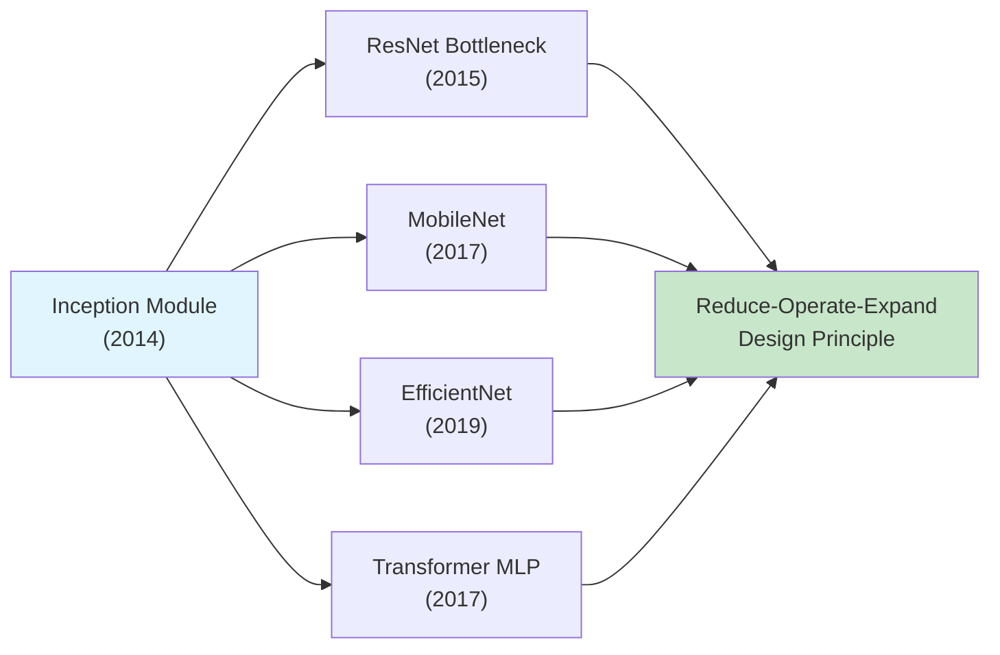

---

## Summary

The Inception architecture challenged the assumption that a convolutional layer must use a single filter size, proposing instead that multiple filter sizes should operate in parallel and their outputs should be concatenated. The naive version of this idea was computationally infeasible, but the introduction of 1×1 bottleneck layers for dimensionality reduction made it practical, achieving dramatic computational savings (70-87% parameter reduction). GoogLeNet demonstrated the power of this approach by achieving state-of-the-art ImageNet accuracy with only 6.8M parameters—20× fewer than VGG16. The auxiliary classifiers addressed the vanishing gradient problem in very deep networks, and subsequent versions (V2, V3) introduced batch normalization and convolution factorization for further improvements. The two core principles—multi-scale processing and dimensionality reduction via bottlenecks—have become foundational design patterns that appear throughout modern deep learning architectures.

# Chapter 2 - CNN/11. The Degradation Problem and Residual Connections.md
   Language: markdown

# 11. The Degradation Problem and Residual Connections

> [!info] Prerequisites
> Before reading this section, you should understand the basics of backpropagation and gradient computation through computational graphs. You should be familiar with the vanishing gradient problem and how batch normalization partially addresses it. You should also understand the basic convolutional neural network architectures we have studied so far (AlexNet, VGG, Inception) and how increasing depth has generally improved performance.

---

## The Expectation: Deeper Should Be Better

There is a compelling theoretical argument that a deeper network should perform at least as well as a shallower network. Consider two networks: a shallow network $S$ with $L$ layers, and a deeper network $D$ with $L + K$ layers, where the first $L$ layers of $D$ are identical to the layers of $S$. If the additional $K$ layers in $D$ were to simply learn the **identity mapping**—that is, if they learned to pass their input through unchanged—then network $D$ would produce exactly the same function as network $S$. The identity mapping is always a valid solution for the extra layers, so the deeper network can, in principle, always fall back to the shallower network's solution and never do worse.

This argument is intuitive and seems airtight: if adding more layers cannot hurt (because the extra layers can always learn to do nothing), then deeper networks should be at least as good as shallower ones. In practice, deeper networks also have larger hypothesis spaces—they can represent strictly more functions than shallower networks—so they should have the capacity to find solutions at least as good as, and potentially better than, what shallower networks can find. This reasoning led the deep learning community to expect that simply making networks deeper would lead to monotonically improving performance.

> [!note] The Identity Mapping Argument, Formally
> Let the shallow network compute $y = S(x)$. The deeper network computes $y = D_{L+K} \circ D_{L+K-1} \circ \cdots \circ D_{L+1} \circ S(x)$, where each $D_i$ is a layer function. If each additional layer $D_i$ learns the identity mapping $D_i(z) = z$, then the deeper network computes $y = S(x)$, which is exactly the same as the shallow network. Therefore, the minimum of the loss function over the deeper network's parameter space is at most equal to the minimum over the shallower network's parameter space, because the deeper network's hypothesis space includes the shallower network's hypothesis space as a subset.

---

## The Empirical Observation: Deeper Networks Perform Worse

In 2015, Kaiming He and his colleagues at Microsoft Research made a surprising and counterintuitive discovery. When they trained increasingly deep networks on ImageNet and CIFAR-10, they found that beyond a certain depth, adding more layers actually **increased** both training error and test error. This was not what the identity mapping argument predicted, and it demanded an explanation.

### The Key Experiment

He et al. compared two networks on CIFAR-10:

- A **20-layer** plain network (no skip connections, no special structure beyond BatchNorm + ReLU)
- A **56-layer** plain network (same architecture, just deeper)

The results were striking: the 56-layer network had **higher training error** than the 20-layer network. This is shown in the figure below:

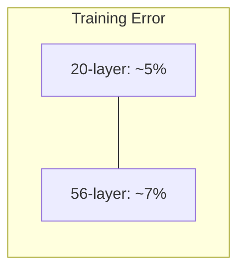

The 56-layer network is strictly worse at fitting the training data than the 20-layer network, even though it has more parameters and a strictly larger hypothesis space. This is deeply counterintuitive.

### Why This Is NOT Overfitting

Overfitting occurs when a model fits the training data too well (low training error) but fails to generalize (high test error). The hallmark of overfitting is that training error continues to decrease while test error starts to increase—that is, there is a growing gap between training and test performance.

In the degradation problem, **training error itself is higher** for the deeper network. The 56-layer network cannot even fit the training data as well as the 20-layer network. This is the opposite of overfitting: the deeper network is **underfitting** relative to the shallower network. If this were overfitting, we would expect the deeper network to have lower training error and higher test error, but we observe higher training error and higher test error. Therefore, overfitting is not the explanation.

### Why This Is NOT (Just) Vanishing Gradients

The vanishing gradient problem occurs when the gradient signal diminishes as it propagates backwards through many layers, causing the early layers to receive very small updates and learn very slowly. In the pre-BatchNorm era, this was a major problem for deep networks, because the distribution of activations could shift dramatically from layer to layer (internal covariate shift), causing the gradients to shrink exponentially with depth.

However, He et al. used batch normalization in their plain networks, which largely mitigates the vanishing gradient problem. Batch normalization ensures that the activations at each layer have roughly unit variance, which in turn ensures that the gradients have roughly unit magnitude as they propagate backwards. With batch normalization, the forward and backward signals are well-conditioned, and the vanishing/exploding gradient problem is effectively solved. Yet the degradation problem persists even with batch normalization.

Furthermore, if vanishing gradients were the sole cause, we would expect the deeper network to converge more slowly but eventually reach the same training error as the shallower network (given enough training time). Instead, the deeper network converges to a **higher** training error, even after very long training runs. This suggests that the problem is not about gradient magnitude but about the optimization landscape itself—the optimizer is converging to a poorer local minimum in the deeper network's parameter space.

> [!warning] The Degradation Problem Is Subtle
> The degradation problem is one of the most misunderstood phenomena in deep learning. Many people confuse it with vanishing gradients or overfitting, but it is fundamentally different from both. The key diagnostic is: if training error is higher for a deeper network (not just test error), and batch normalization is already being used, then the problem is degradation, not overfitting or vanishing gradients. The deeper network's optimizer is converging to a suboptimal solution, not failing to receive gradient signals or memorizing noise.

---

## The Degradation Problem Defined

The degradation problem is the empirical observation that **deeper networks converge to solutions with higher training error than their shallower counterparts, even though the deeper networks have the capacity to represent the shallower networks' solutions**. The root cause is that it is fundamentally difficult for standard optimization algorithms (SGD and its variants) to learn identity mappings—or near-identity mappings—through many stacked nonlinear layers.

Consider what the extra 36 layers in the 56-layer network need to learn to match the 20-layer network's performance. They need to learn the identity mapping: $H(x) = x$, where $H(x)$ is the function computed by those 36 layers. But each layer consists of a convolution, batch normalization, and ReLU activation. The ReLU activation is $f(z) = \max(0, z)$, which zeroes out all negative values. This means that the identity mapping is not even representable by a single ReLU layer, because a ReLU layer cannot pass negative values through unchanged. To approximate the identity mapping with ReLU layers, the weights must be carefully tuned so that the combined effect of the convolution, batch normalization, and ReLU is approximately the identity function.

This requires the optimizer to find a very specific configuration of weights where multiple nonlinear transformations, each of which individually destroys information (ReLU kills negative values), somehow combine to approximately preserve information. This is a narrow, hard-to-find region in the parameter space, and standard optimizers initialized with random weights are unlikely to find it. Instead, the optimizer converges to some other local minimum that is easier to reach but represents a worse solution.

> [!tip] Intuitive Analogy
> Imagine you have 36 people standing in a line, and each person must pass a message to the next person without changing it. If each person is allowed to modify the message (apply a nonlinear transformation), it is very difficult for all 36 people to coordinate their modifications so that the final message is identical to the original. Even if each person tries their best to pass the message faithfully, small distortions accumulate and the message degrades. But if each person has the option to simply pass the message through unchanged (identity mapping), the task becomes trivial. Residual connections provide exactly this option.

---

## The ResNet Solution: Learning Residuals

He et al.'s elegant solution is to reformulate the learning problem. Instead of having the layers learn the desired mapping $H(x)$ directly, they have the layers learn the **residual** $F(x) = H(x) - x$. The output of the residual block is then $F(x) + x$, which equals $H(x)$.

This reformulation might seem trivial—after all, $F(x) + x = H(x)$ is just algebraic rearrangement—but it has profound implications for optimization. The key insight is that the residual parameterization makes it **easy for the network to learn identity mappings**, and this ease of learning identity mappings is what solves the degradation problem.

### The Residual Block

A residual block consists of:

1. The **main path** (also called the "residual path"): a sequence of layers that computes $F(x)$. In the basic residual block, this consists of two 3×3 convolutions, each followed by batch normalization and ReLU activation.

2. The **skip connection** (also called the "shortcut connection" or "identity mapping"): a direct connection from the input $x$ to the output, bypassing the main path.

3. The **addition**: the output of the main path $F(x)$ and the skip connection $x$ are added element-wise to produce the block's output: $y = F(x) + x$.

4. The **final activation**: a ReLU is applied after the addition: $\text{output} = \text{ReLU}(F(x) + x)$.

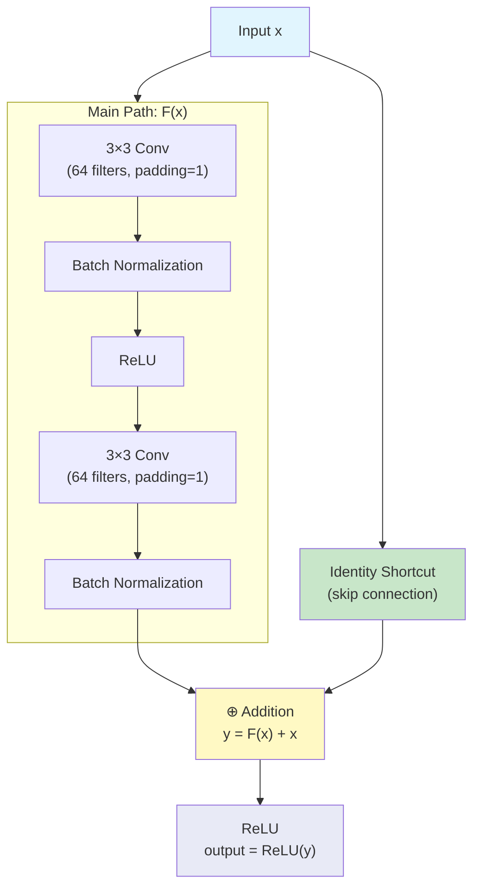

> [!note] Where is the ReLU After the Addition?
> Notice the placement of the final ReLU activation. It comes after the addition of $F(x)$ and $x$, not before. This is important because it allows the raw sum $F(x) + x$ to include negative values from the skip connection (since $x$ can be negative after batch normalization), which are then subjected to the ReLU nonlinearity. If the ReLU were placed before the addition, the skip connection would only carry non-negative values, which would limit the representational power of the identity mapping.

---

## Why Residual Learning Works: Two Mathematical Arguments

The residual parameterization solves the degradation problem through two complementary mechanisms, each of which we now analyze in detail.

### Argument 1: Easy Identity Learning

Recall the degradation problem: the optimizer struggles to learn identity mappings through many nonlinear layers. In the residual parameterization, if the layers in a block should learn the identity mapping (i.e., $H(x) = x$), the residual $F(x)$ needs to be zero:

$$H(x) = x \quad \Longrightarrow \quad F(x) = H(x) - x = x - x = 0$$

So the network just needs to push $F(x)$ toward zero. This is achieved by pushing the weights of the convolutions in the main path toward zero. If all the convolutional weights are zero, then $F(x) = 0$ regardless of the input $x$, and the block output is:

$$y = F(x) + x = 0 + x = x$$

**Pushing weights toward zero is trivial for standard optimizers.** Weight decay (L2 regularization) explicitly encourages weights to be small, and the gradient of the loss with respect to the weights naturally points in the direction that reduces their magnitude when the optimal solution involves small weights. The weight initialization schemes (e.g., He initialization) already start the weights near zero, so the optimizer begins in a regime where $F(x)$ is close to zero, and it only needs to make small adjustments to reach the exact identity mapping.

Contrast this with the non-residual parameterization, where learning the identity mapping requires the convolutions to produce exactly their input—which is a very specific, hard-to-find configuration of weights, especially through multiple nonlinear layers with ReLU activations that destroy negative information.

> [!tip] The Key Insight
> In the standard parameterization, identity mapping is a hard-to-find special case. In the residual parameterization, identity mapping is the trivial default that occurs when weights are zero. This is the fundamental reason why residual connections work: they make the "do nothing" option the easiest thing for the network to learn, rather than the hardest.

### Argument 2: The Gradient Superhighway

The second mechanism by which residual connections solve the degradation problem is through their effect on gradient flow during backpropagation. This is perhaps the more mathematically rigorous argument, and it directly addresses the concern about gradient signal propagation through very deep networks.

Consider a residual block that computes $y = F(x) + x$. During backpropagation, we need to compute the gradient of the loss $\mathcal{L}$ with respect to the input $x$. By the chain rule:

$$\frac{\partial \mathcal{L}}{\partial x} = \frac{\partial \mathcal{L}}{\partial y} \cdot \frac{\partial y}{\partial x}$$

Now, $y = F(x) + x$, so:

$$\frac{\partial y}{\partial x} = \frac{\partial F(x)}{\partial x} + \frac{\partial x}{\partial x} = \frac{\partial F(x)}{\partial x} + 1$$

Therefore:

$$\frac{\partial \mathcal{L}}{\partial x} = \frac{\partial \mathcal{L}}{\partial y} \cdot \left(\frac{\partial F(x)}{\partial x} + 1\right)$$

This equation is of profound importance. The gradient flowing back to the input $x$ consists of two terms:

1. $\frac{\partial \mathcal{L}}{\partial y} \cdot \frac{\partial F(x)}{\partial x}$: the gradient that flows through the main path $F(x)$. This term can be small (if the Jacobian $\frac{\partial F(x)}{\partial x}$ has small singular values) or even zero (if the ReLU activations have zeroed out certain pathways). This is the term that suffers from the vanishing gradient problem in very deep networks.

2. $\frac{\partial \mathcal{L}}{\partial y} \cdot 1$: the gradient that flows through the skip connection. This term is **always exactly $\frac{\partial \mathcal{L}}{\partial y}$**, regardless of the depth of the network, the values of the weights, or the behavior of the nonlinear activations. The "+1" from the derivative of $x$ with respect to $x$ provides a **direct, unimpeded path** for the gradient to flow from the output back to the input.

### The Gradient Flow Proof

Let us extend this analysis to a chain of residual blocks. Suppose we have $L$ residual blocks in sequence, where block $i$ computes:

$$x_{i+1} = F_i(x_i) + x_i$$

The gradient of the loss with respect to the input of the first block is:

$$\frac{\partial \mathcal{L}}{\partial x_1} = \frac{\partial \mathcal{L}}{\partial x_{L+1}} \cdot \prod_{i=1}^{L} \frac{\partial x_{i+1}}{\partial x_i}$$

For each block, $\frac{\partial x_{i+1}}{\partial x_i} = \frac{\partial F_i(x_i)}{\partial x_i} + 1$, so:

$$\frac{\partial \mathcal{L}}{\partial x_1} = \frac{\partial \mathcal{L}}{\partial x_{L+1}} \cdot \prod_{i=1}^{L} \left(\frac{\partial F_i(x_i)}{\partial x_i} + 1\right)$$

Now, let us expand this product. Each factor $\left(\frac{\partial F_i(x_i)}{\partial x_i} + 1\right)$ has a "+1" term, so the full product includes a term that is simply $\frac{\partial \mathcal{L}}{\partial x_{L+1}} \cdot 1 \cdot 1 \cdots 1 = \frac{\partial \mathcal{L}}{\partial x_{L+1}}$. This is the gradient that flows through **all the skip connections simultaneously**, bypassing every $F_i$. No matter how many layers the network has, this direct gradient path always exists and always carries the full gradient signal from the loss to the earliest layers.

Even if the Jacobians $\frac{\partial F_i(x_i)}{\partial x_i}$ are very small (causing the gradient through the main paths to vanish), the "+1" terms ensure that at least the gradient $\frac{\partial \mathcal{L}}{\partial x_{L+1}}$ always reaches the early layers. This is why residual connections are said to create a **gradient superhighway**: the skip connections provide a direct, low-resistance path for gradient information to flow backwards through the entire depth of the network.

> [!warning] The "+1" Is Critical, Not the Skip Connection Alone
> It is important to understand that the gradient benefit comes specifically from the **addition** in the skip connection, not from the existence of the skip connection itself. If the skip connection used concatenation instead of addition (as in DenseNet), the derivative would not have the "+1" term, and the gradient superhighway effect would not exist. The addition operation is what makes the derivative of $y = F(x) + x$ with respect to $x$ equal to $\frac{\partial F(x)}{\partial x} + 1$, where the "+1" is the key term that guarantees gradient flow. Concatenation would produce a derivative that is a selection matrix, not an additive "+1", and while it still provides gradient flow, it does not provide the same guaranteed additive boost.

---

## The Basic Residual Block in Detail

The basic residual block, used in ResNet-18 and ResNet-34, consists of two 3×3 convolutional layers, each followed by batch normalization and ReLU, with a skip connection that adds the input to the output of the second batch normalization before a final ReLU. Let us trace the data flow through this block step by step.

### Step-by-Step Data Flow

Given an input tensor $x$ of shape $(B, C, H, W)$ where $B$ is the batch size, $C$ is the number of channels, and $H, W$ are the spatial dimensions:

1. **First 3×3 Convolution**: Applies 64 3×3 filters with padding=1 and stride=1. The padding ensures the spatial dimensions are preserved: $H' = H$, $W' = W$. The output has shape $(B, 64, H, W)$. This convolution extracts local spatial features from the input.

2. **First Batch Normalization**: Normalizes the activations across the batch dimension for each channel independently. This stabilizes the distribution of activations and improves gradient flow.

3. **First ReLU**: Applies the rectified linear activation $\text{ReLU}(z) = \max(0, z)$, introducing nonlinearity and setting negative activations to zero.

4. **Second 3×3 Convolution**: Applies another 64 3×3 filters with padding=1 and stride=1. The output has shape $(B, 64, H, W)$. This convolution combines the features extracted by the first convolution into higher-level features.

5. **Second Batch Normalization**: Normalizes the activations again.

6. **Skip Connection Addition**: The original input $x$ is added to the output of the second batch normalization: $y = F(x) + x$, where $F(x)$ represents the output of steps 1-5. This is the core of the residual connection.

7. **Final ReLU**: Applies ReLU to the sum: $\text{output} = \text{ReLU}(F(x) + x)$. This is the output of the residual block.

### Mermaid Diagram of the Basic Residual Block

```mermaid
graph TD
    Input["Input x<br/>(B, 64, H, W)"] --> Conv1["Conv2d(64, 64, 3, padding=1)"]
    Input --> Skip["Skip Connection<br/>(identity)"]
    
    Conv1 --> BN1["BatchNorm2d(64)"]
    BN1 --> ReLU1["ReLU"]
    ReLU1 --> Conv2["Conv2d(64, 64, 3, padding=1)"]
    Conv2 --> BN2["BatchNorm2d(64)"]
    
    BN2 --> Add["⊕ Add<br/>F(x) + x"]
    Skip --> Add
    
    Add --> ReLU2["ReLU"]
    ReLU2 --> Output["Output<br/>(B, 64, H, W)"]
    
    style Input fill:#e1f5fe
    style Skip fill:#c8e6c9
    style Add fill:#fff9c4
    style Output fill:#e8eaf6
```

### PyTorch Implementation with Line-by-Line Comments

```python
import torch
import torch.nn as nn

class BasicBlock(nn.Module):
    """
    Basic residual block for ResNet-18 and ResNet-34.
    Contains two 3x3 convolutional layers with a skip connection.
    """
    
    def __init__(self, in_channels, out_channels, stride=1):
        # Call the parent class (nn.Module) constructor
        # This is required for all PyTorch modules to function properly
        super(BasicBlock, self).__init__()
        
        # First 3x3 convolution: takes in_channels input, produces out_channels output
        # stride controls spatial downsampling (stride=2 halves spatial dimensions)
        # padding=1 ensures spatial dimensions are preserved when stride=1
        # bias=False because BatchNorm will handle the bias term
        self.conv1 = nn.Conv2d(
            in_channels, out_channels, 
            kernel_size=3, stride=stride, padding=1, bias=False
        )
        
        # Batch normalization for the first convolution's output
        # num_features = out_channels (one normalization parameter per channel)
        self.bn1 = nn.BatchNorm2d(out_channels)
        
        # ReLU activation applied after the first batch normalization
        # inplace=True modifies the tensor in-place to save memory
        self.relu = nn.ReLU(inplace=True)
        
        # Second 3x3 convolution: takes out_channels input, produces out_channels output
        # stride is always 1 for the second convolution (downsampling only in conv1)
        # padding=1 preserves spatial dimensions
        # bias=False for the same reason as conv1
        self.conv2 = nn.Conv2d(
            out_channels, out_channels, 
            kernel_size=3, stride=1, padding=1, bias=False
        )
        
        # Batch normalization for the second convolution's output
        self.bn2 = nn.BatchNorm2d(out_channels)
        
        # The shortcut (skip) connection
        # If in_channels != out_channels or stride != 1, we need a projection
        # to match dimensions. Otherwise, use identity (no operation needed).
        self.shortcut = nn.Sequential()
        if stride != 1 or in_channels != out_channels:
            # 1x1 convolution to match channel count
            # stride matches the stride of conv1 for spatial dimension matching
            # bias=False because a subsequent BatchNorm will handle the bias
            self.shortcut = nn.Sequential(
                nn.Conv2d(in_channels, out_channels, kernel_size=1, stride=stride, bias=False),
                nn.BatchNorm2d(out_channels)
            )
    
    def forward(self, x):
        # Store the input for the skip connection
        # identity will either be x itself (if dimensions match) or the projected version
        identity = self.shortcut(x)
        
        # Main path: first convolution + batch normalization + ReLU
        # conv1 applies a 3x3 convolution to extract spatial features
        out = self.conv1(x)      # Shape: (B, out_channels, H/stride, W/stride)
        out = self.bn1(out)       # Normalize activations across the batch
        out = self.relu(out)      # Apply nonlinearity (sets negatives to zero)
        
        # Main path: second convolution + batch normalization
        # conv2 applies another 3x3 convolution to combine features
        out = self.conv2(out)     # Shape: (B, out_channels, H/stride, W/stride)
        out = self.bn2(out)       # Normalize activations (no ReLU yet!)
        
        # Add the skip connection to the main path output
        # This is the core of the residual connection: F(x) + x
        # The addition is element-wise and requires matching dimensions
        out += identity           # Shape: (B, out_channels, H/stride, W/stride)
        
        # Apply ReLU after the addition
        # This is important: the addition can produce negative values,
        # and we need nonlinearity to maintain representational power
        out = self.relu(out)      # Shape: (B, out_channels, H/stride, W/stride)
        
        return out
```

---

## Why Addition (Not Concatenation)?

A natural question is why ResNet uses addition for the skip connection rather than concatenation, which is used by DenseNet. The choice of addition is critical for two reasons.

### Reason 1: Preserves Dimensions for Identity Mapping

Addition preserves the spatial dimensions and channel count of the feature maps. If the input $x$ has shape $(B, C, H, W)$ and the main path $F(x)$ also has shape $(B, C, H, W)$, then $F(x) + x$ has shape $(B, C, H, W)$—the same as both inputs. This is essential for the identity mapping property: if $F(x) = 0$, the output is $0 + x = x$, which has exactly the same dimensions and values as the input. The residual block can be trivially inserted into any position in the network without changing the dimensions of the data flowing through it.

Concatenation, by contrast, would increase the channel count: $[F(x); x]$ would have shape $(B, 2C, H, W)$. This means the output of the block has a different channel count than the input, which makes it impossible for the block to represent a true identity mapping (since the output has twice as many channels as the input). It also means that subsequent layers must handle the increased channel count, which changes the architecture of the entire network.

### Reason 2: Enables the Gradient Superhighway

As we proved earlier, the addition operation creates a "+1" term in the gradient:

$$\frac{\partial y}{\partial x} = \frac{\partial F(x)}{\partial x} + 1$$

This "+1" ensures that at least the full gradient signal from the output always reaches the input through the skip connection, regardless of what happens in the main path. Concatenation would not produce this "+1" term; instead, the derivative of concatenation with respect to $x$ is a selection matrix that routes part of the gradient through the skip path. While this still provides gradient flow, it does not provide the same guaranteed additive boost to the gradient.

> [!info] DenseNet Uses Concatenation for a Different Purpose
> DenseNet (Huang et al., 2017) uses concatenation-based skip connections, but its goal is different from ResNet's. DenseNet aims to maximize feature reuse by making all previous features available to all subsequent layers, creating a dense connectivity pattern. The feature reuse comes at the cost of increased memory (because concatenated features must be stored) and does not provide the same gradient superhighway effect as ResNet's addition-based connections. Both architectures are effective, but they operate on different principles.

---

## What Happens When Dimensions Change: Projection Shortcuts

In the basic residual block, the skip connection is an identity mapping: $y = F(x) + x$. This works perfectly when the input and output have the same dimensions (same number of channels and same spatial size). However, there are two common situations where the dimensions change:

1. **Channel count changes**: When the block increases the number of channels (e.g., from 64 to 128 channels), the input $x$ and the main path output $F(x)$ have different channel counts, and addition is not possible.

2. **Spatial downsampling**: When the block reduces the spatial resolution (using stride=2 in the first convolution), the input $x$ has spatial dimensions $(H, W)$ while $F(x)$ has dimensions $(H/2, W/2)$, and addition is again not possible.

In both cases, a **projection shortcut** is used to transform the input $x$ so that it matches the dimensions of $F(x)$. The projection shortcut consists of a 1×1 convolution with batch normalization:

$$\text{shortcut}(x) = \text{BatchNorm}(\text{Conv}_{1\times1}(x))$$

The 1×1 convolution handles the channel dimension change by projecting from `in_channels` to `out_channels`. The stride parameter of the 1×1 convolution handles the spatial downsampling by using the same stride as the first 3×3 convolution in the main path.

### Two Types of Projection Shortcuts

The ResNet paper considers two types of projection shortcuts:

**Option A (Zero-padding shortcut)**: Pad the extra channels with zeros and use strided sampling for spatial downsampling. This adds no parameters and is simple to implement, but it does not learn any transformation for the shortcut path.

**Option B (1×1 convolution shortcut)**: Use a 1×1 convolution (with batch normalization) to project and downsample. This adds a small number of parameters but allows the shortcut path to learn an optimal linear projection for matching dimensions.

The paper found that Option B performs slightly better than Option A, and Option B is the standard choice used in most ResNet implementations today, including the official PyTorch implementation.

```mermaid
graph TD
    Input["Input x<br/>(B, 64, 56, 56)"] --> Conv1["Conv 3×3, stride=2<br/>(64→128)"]
    Input --> Proj["Projection Shortcut<br/>Conv 1×1, stride=2<br/>(64→128) + BN"]
    
    Conv1 --> BN1["BN + ReLU"]
    BN1 --> Conv2["Conv 3×3, stride=1<br/>(128→128)"]
    Conv2 --> BN2["BN"]
    
    BN2 --> Add["⊕ Add"]
    Proj --> Add
    
    Add --> ReLU2["ReLU"]
    ReLU2 --> Output["Output<br/>(B, 128, 28, 28)"]
    
    style Input fill:#e1f5fe
    style Proj fill:#ffccbc
    style Add fill:#fff9c4
    style Output fill:#e8eaf6
```

---

## Impact: Enabling Ultra-Deep Networks and Surpassing Human Performance

The introduction of residual connections had an immediate and transformative impact on the field of deep learning. Before ResNet, the deepest practical CNNs were around 20-30 layers (VGG-19, GoogLeNet at 22 layers). ResNet demonstrated that networks with 152 layers could be trained effectively, achieving dramatically better accuracy than any previous architecture.

### Key Results from the ResNet Paper

- **ResNet-152** achieved a **3.57% top-5 error rate** on the ILSVRC 2015 validation set, which was the first time a CNN surpassed the estimated human top-5 error rate on ImageNet (approximately 5.1%). This was a landmark moment in the history of computer vision, demonstrating that machines could classify images more accurately than humans on this benchmark.

- **ResNet won ILSVRC 2015** by a large margin, with 3.57% top-5 error compared to the second-place entry's 6.00%. The margin of victory was enormous by the standards of the competition.

- **Depth scaling worked**: ResNet-34 outperformed ResNet-18, ResNet-50 outperformed ResNet-34, ResNet-101 outperformed ResNet-50, and ResNet-152 outperformed ResNet-101. This was the first time that monotonically increasing depth led to monotonically improving accuracy in a CNN, confirming the theoretical expectation that deeper is better—when residual connections are used.

- **Without residual connections, deeper was worse**: He et al. confirmed that the plain (non-residual) 34-layer network had higher training error than the plain 18-layer network, while the residual 34-layer network had lower training error than the residual 18-layer network. This definitively showed that residual connections solve the degradation problem.

### The Broader Impact

The residual connection is now one of the most widely used architectural design patterns in deep learning. It appears not only in CNNs but also in Transformer architectures (where it is used to connect the self-attention and feed-forward blocks), in graph neural networks, in reinforcement learning architectures, and in many other domains. The principle is universal: whenever you have a deep computational graph, adding skip connections with addition makes it easier for the optimizer to find good solutions and for gradients to flow during backpropagation.

> [!tip] Residual Connections Are Everywhere
> The residual connection is arguably the single most important architectural innovation in deep learning since the invention of backpropagation itself. It appears in:
> - **ResNet** (2015): the original application
> - **Transformer** (2017): skip connections around self-attention and feed-forward blocks
> - **BERT** (2018): residual connections in the encoder stack
> - **GPT** (2018–present): residual connections in the decoder stack
> - **U-Net** (2015): skip connections between encoder and decoder (though these use concatenation)
> - **AlphaGo Zero** (2017): residual blocks in the policy and value networks
> 
> If you take away one design principle from this course, it should be this: **when in doubt, add a residual connection**.

---

## Summary

The degradation problem—the counterintuitive observation that deeper networks can have higher training error than shallower networks—is caused by the difficulty of learning identity mappings through many stacked nonlinear layers. Residual connections solve this problem by reformulating the learning objective: instead of learning $H(x)$ directly, the network learns the residual $F(x) = H(x) - x$, and the output is $F(x) + x$. This reformulation has two crucial benefits: (1) it makes identity mapping easy to learn (just push $F(x)$ toward zero by pushing weights toward zero), and (2) it creates a gradient superhighway through the "+1" term in the gradient $\frac{\partial \mathcal{L}}{\partial x} = \frac{\partial \mathcal{L}}{\partial y} \cdot \left(\frac{\partial F(x)}{\partial x} + 1\right)$, ensuring that gradient information always flows back to early layers regardless of depth. The basic residual block uses addition (not concatenation) for the skip connection because addition preserves dimensions and creates the critical "+1" gradient term. When dimensions change, projection shortcuts using 1×1 convolutions provide the necessary dimensional matching. Residual connections enabled 152-layer networks that achieved 3.57% top-5 error on ImageNet, surpassing human-level performance and establishing residual connections as one of the most fundamental design patterns in modern deep learning.

# Chapter 2 - CNN/12. ResNet Bottleneck Blocks and Architectural Variants.md
   Language: markdown

# 12. ResNet Bottleneck Blocks and Architectural Variants

> [!info] Prerequisites
> Before reading this section, you should have a thorough understanding of residual connections and the degradation problem (covered in Section 11). You should be comfortable with the basic residual block (two 3×3 convolutions with a skip connection), the gradient superhighway mechanism, and the use of projection shortcuts when dimensions change. You should also understand 1×1 convolutions as dimensionality reduction tools (covered in Section 10 on Inception) and be familiar with PyTorch's `nn.Module` API.

---

## The Two Block Types: An Overview

ResNet comes in five standard variants—ResNet-18, ResNet-34, ResNet-50, ResNet-101, and ResNet-152—where the number indicates the total count of weighted layers (convolutional and fully connected layers). These variants use **two different types of residual blocks**, and the choice of block type is the primary architectural difference that determines the depth-capacity trade-off for each variant.

The two block types are:

1. **Basic Block**: Used in ResNet-18 and ResNet-34. Each block contains two 3×3 convolutional layers with a skip connection. This is the simpler, more straightforward design that directly applies the residual learning principle without any channel compression or expansion.

2. **Bottleneck Block**: Used in ResNet-50, ResNet-101, and ResNet-152. Each block contains three layers arranged in a 1×1 → 3×3 → 1×1 pattern, inspired by the Inception module's bottleneck design. The first 1×1 convolution **reduces** the channel count (compression), the 3×3 convolution performs spatial feature extraction on the compressed representation, and the second 1×1 convolution **expands** the channel count back to the original size.

> [!note] Why Two Block Types?
> The Basic Block is simple and effective for shallow networks (18–34 layers), where the channel counts are relatively small and the computational cost of two 3×3 convolutions is manageable. However, for deeper networks (50–152 layers), the channel counts in each stage are much larger (up to 512 or 2048 channels), and using two 3×3 convolutions on these high-dimensional feature maps would be prohibitively expensive. The Bottleneck Block addresses this by compressing the channels before the expensive 3×3 convolution, dramatically reducing the computational cost while maintaining the same output dimensionality. This is the same "reduce-operate-expand" principle we saw in the Inception module.

---

## The Basic Block (ResNet-18 and ResNet-34)

The Basic Block is the residual block we studied in Section 11: two 3×3 convolutional layers, each followed by batch normalization and ReLU activation, with a skip connection that adds the input to the output. Let us revisit this block with a focus on its parameter count and computational cost, which will motivate the need for the Bottleneck Block in deeper networks.

### Architecture of the Basic Block

For a block operating on 64-channel feature maps (the first stage of ResNet-18/34), the architecture is:

```mermaid
graph TD
    Input["Input<br/>(B, 64, H, W)"] --> Conv1["3×3 Conv, 64→64<br/>padding=1, stride=1"]
    Input --> Skip["Skip (identity)"]
    
    Conv1 --> BN1["BatchNorm"]
    BN1 --> ReLU1["ReLU"]
    ReLU1 --> Conv2["3×3 Conv, 64→64<br/>padding=1, stride=1"]
    Conv2 --> BN2["BatchNorm"]
    
    BN2 --> Add["⊕ Add"]
    Skip --> Add
    
    Add --> ReLU2["ReLU"]
    ReLU2 --> Output["Output<br/>(B, 64, H, W)"]
    
    style Input fill:#e1f5fe
    style Skip fill:#c8e6c9
    style Add fill:#fff9c4
    style Output fill:#e8eaf6
```

### Parameter Count for the 64-Filter Basic Block

Each 3×3 convolution with 64 input channels and 64 output channels has:

$$\text{Parameters per 3×3 conv} = 3 \times 3 \times 64 \times 64 = 36{,}864$$

(We do not count bias parameters because batch normalization is used after each convolution, which includes a learnable bias term, making the convolution's bias redundant.)

With two such convolutions per block:

$$\text{Total parameters per Basic Block} = 2 \times 36{,}864 = 73{,}728$$

This is quite manageable for 64 channels. However, the problem arises in later stages where the channel counts increase to 128, 256, and 512. A Basic Block operating on 512 channels would require:

$$\text{Parameters per 3×3 conv} = 3 \times 3 \times 512 \times 512 = 2{,}359{,}296$$

$$\text{Total parameters per Basic Block (512 channels)} = 2 \times 2{,}359{,}296 = 4{,}718{,}592$$

This is over 4.7 million parameters per block—far too expensive for a network that needs dozens of such blocks. This is the motivation for the Bottleneck Block, which we introduce next.

---

## The Bottleneck Block (ResNet-50, ResNet-101, ResNet-152)

The Bottleneck Block replaces the two 3×3 convolutions of the Basic Block with a three-layer sequence: 1×1 convolution → 3×3 convolution → 1×1 convolution. The purpose of this arrangement is to perform the expensive spatial convolution (3×3) on a compressed (lower-dimensional) channel representation, significantly reducing the computational cost while maintaining the same input and output dimensions as the Basic Block.

### Architecture of the Bottleneck Block

For a block operating on 256-channel feature maps with a bottleneck size of 64 channels (the configuration used in the first bottleneck stage of ResNet-50/101/152), the architecture is:

```mermaid
graph TD
    Input["Input x<br/>(B, 256, H, W)"] --> Conv1["1×1 Conv, 256→64<br/>(REDUCE / compress)"]
    Input --> Skip["Skip (identity or projection)"]
    
    Conv1 --> BN1["BatchNorm"]
    BN1 --> ReLU1["ReLU"]
    ReLU1 --> Conv2["3×3 Conv, 64→64<br/>padding=1 (SPATIAL CONV<br/>on compressed depth)"]
    Conv2 --> BN2["BatchNorm"]
    BN2 --> ReLU2["ReLU"]
    ReLU2 --> Conv3["1×1 Conv, 64→256<br/>(EXPAND / restore)"]
    Conv3 --> BN3["BatchNorm"]
    
    BN3 --> Add["⊕ Add<br/>F(x) + x"]
    Skip --> Add
    
    Add --> ReLU3["ReLU"]
    ReLU3 --> Output["Output<br/>(B, 256, H, W)"]
    
    style Input fill:#e1f5fe
    style Skip fill:#c8e6c9
    style Conv1 fill:#ffccbc
    style Conv2 fill:#c8e6c9
    style Conv3 fill:#bbdefb
    style Add fill:#fff9c4
    style Output fill:#e8eaf6
```

### The Three Layers Explained

**Layer 1 — 1×1 Convolution (256 → 64): REDUCE**
The first 1×1 convolution reduces the channel count from 256 to 64. This is a learned linear projection (followed by batch normalization and ReLU) that compresses the high-dimensional feature representation into a lower-dimensional subspace. The 1×1 kernel means no spatial information is mixed—only cross-channel correlations are exploited. This is exactly the same bottleneck technique we studied in the Inception module: by reducing the channel count before the expensive operation, we dramatically reduce the computational cost of the subsequent 3×3 convolution. The reduction ratio is 256/64 = 4×, which is the standard ratio used in all ResNet bottleneck blocks.

**Layer 2 — 3×3 Convolution (64 → 64): SPATIAL CONVOLUTION**
The 3×3 convolution operates on the compressed 64-channel representation, extracting spatial features at a fraction of the cost of operating on the full 256-channel representation. This is where the actual spatial feature extraction happens—the 3×3 kernel mixes information from neighboring spatial locations, capturing local patterns and structures. Because the channel count is only 64 (rather than 256), this convolution is 16× cheaper in terms of parameter count and computational cost than a 3×3 convolution operating on 256 channels.

**Layer 3 — 1×1 Convolution (64 → 256): EXPAND**
The second 1×1 convolution expands the channel count from 64 back to 256, restoring the original dimensionality. This is another learned linear projection that maps the compressed representation back to the full-dimensional feature space. The expansion allows the block to output the same number of channels as the input, which is necessary for the skip connection addition to work (since we need $F(x)$ and $x$ to have the same dimensions for element-wise addition).

> [!tip] The Reduce-Operate-Expand Pattern
> The bottleneck block embodies a design pattern that is ubiquitous in modern deep learning: **reduce the dimensionality before an expensive operation, perform the operation on the reduced representation, then expand the dimensionality back**. This pattern appears in:
> - **Inception modules** (Section 10): 1×1 bottlenecks before 3×3 and 5×5 convolutions
> - **ResNet bottleneck blocks** (this section): 1×1 reduce → 3×3 spatial → 1×1 expand
> - **Transformer MLP blocks**: linear reduce → GELU activation → linear expand (the expansion factor is typically 4×)
> - **MobileNet**: depthwise conv → 1×1 pointwise expand
> - **EfficientNet**: squeeze-and-excitation blocks use a similar reduce-expand pattern
> 
> Whenever you encounter an expensive operation in a neural network, consider whether you can reduce the dimensionality first.

---

## Bottleneck Parameter Count: The Savings in Detail

Let us compute the exact parameter count for the Bottleneck Block and compare it with the hypothetical Basic Block that would be needed for the same 256-channel configuration. This comparison clearly demonstrates why the Bottleneck Block is essential for deeper ResNet variants.

### Bottleneck Block Parameters (256 channels, bottleneck = 64)

**Layer 1 — 1×1 Conv (256 → 64):**
$$P_1 = 1 \times 1 \times 256 \times 64 = 16{,}384$$

This layer has 16,384 parameters because each of the 64 output channels is a linear combination of all 256 input channels (with one coefficient per input channel per output channel, and the 1×1 kernel means there is only one spatial position).

**Layer 2 — 3×3 Conv (64 → 64):**
$$P_2 = 3 \times 3 \times 64 \times 64 = 36{,}864$$

This layer has 36,864 parameters because each of the 64 output channels is computed from a 3×3 spatial kernel applied across all 64 input channels. Notice that this is the same cost as a 3×3 convolution in the 64-channel Basic Block—exactly the benefit of compressing to 64 channels before the spatial convolution.

**Layer 3 — 1×1 Conv (64 → 256):**
$$P_3 = 1 \times 1 \times 64 \times 256 = 16{,}384$$

This layer has 16,384 parameters, symmetric with Layer 1 (the expansion mirrors the compression).

**Total Bottleneck Block parameters:**
$$P_{\text{bottleneck}} = P_1 + P_2 + P_3 = 16{,}384 + 36{,}864 + 16{,}384 = 69{,}632$$

### Hypothetical Basic Block Parameters (256 channels)

If we used a Basic Block (two 3×3 convolutions) with 256 channels instead of the Bottleneck Block:

$$P_{\text{basic}} = 2 \times (3 \times 3 \times 256 \times 256) = 2 \times 589{,}824 = 1{,}179{,}648$$

### The Savings

$$\text{Reduction} = 1 - \frac{P_{\text{bottleneck}}}{P_{\text{basic}}} = 1 - \frac{69{,}632}{1{,}179{,}648} = 1 - 0.059 = 0.941 = \mathbf{94.1\%}$$

The Bottleneck Block achieves a **94% reduction** in parameters compared to the equivalent Basic Block operating on 256 channels. This dramatic savings makes it feasible to build networks with 50, 101, or even 152 layers without exhausting GPU memory or computational budgets.

> [!warning] Don't Confuse the Bottleneck Size with the Block's Channel Width
> A common source of confusion is thinking that the Bottleneck Block "reduces" the network's capacity because it compresses to 64 channels. The key insight is that the block's **input and output** are still 256 channels—the same as the Basic Block. The 64-channel bottleneck is an internal, intermediate representation that exists only between the two 1×1 convolutions. The block's overall representational capacity is determined by its input and output dimensions (256 channels), not by the internal bottleneck size. Empirically, Bottleneck Blocks match or exceed the accuracy of equivalent-depth Basic Blocks while using far fewer parameters and FLOPs.

---

## The Projection Shortcut: Complete Implementation

When the channel count or spatial resolution changes between the input and the output of a residual block, a projection shortcut is needed to match the dimensions so that the addition $F(x) + x$ can be performed. The projection shortcut uses a 1×1 convolution (with batch normalization) to adjust both the channel count and the spatial resolution.

### When Are Projection Shortcuts Needed?

Projection shortcuts are needed in two specific situations in the ResNet architecture:

1. **At the beginning of each stage** (where the channel count doubles): For example, when transitioning from 64 channels to 128 channels, the skip connection must project the 64-channel input to 128 channels so it can be added to the 128-channel output of the main path.

2. **When stride=2 is used for spatial downsampling**: The first block of each stage (except the first stage) uses stride=2 in its first convolution to halve the spatial dimensions. The projection shortcut must also use stride=2 to match the spatial dimensions.

### Complete PyTorch Code for the Bottleneck Block

```python
import torch
import torch.nn as nn

class BottleneckBlock(nn.Module):
    """
    Bottleneck residual block for ResNet-50, ResNet-101, and ResNet-152.
    
    Uses the 1x1 -> 3x3 -> 1x1 pattern:
    - First 1x1 conv: REDUCE channels (compress)
    - 3x3 conv: SPATIAL convolution on compressed depth
    - Second 1x1 conv: EXPAND channels (restore)
    
    The expansion factor (ratio of output channels to bottleneck channels) is 4.
    For example, if out_channels=256, the bottleneck has 256/4 = 64 channels.
    """
    
    # The expansion factor determines the ratio between the output channels
    # and the bottleneck (middle) channels. For standard ResNet, this is 4.
    # So if the block outputs 256 channels, the bottleneck has 64 channels.
    expansion = 4
    
    def __init__(self, in_channels, out_channels, stride=1, downsample=None):
        """
        Args:
            in_channels: Number of channels in the input tensor
            out_channels: Number of channels in the base (pre-expansion) output
            stride: Stride for the 3x3 convolution (1 or 2)
            downsample: Optional module for the projection shortcut.
                        If None, use identity shortcut (when dimensions match).
        """
        # Initialize the parent nn.Module class
        # This is required for PyTorch's module system to track parameters
        super(BottleneckBlock, self).__init__()
        
        # Calculate the bottleneck (middle) channel count
        # For expansion=4 and out_channels=64, bottleneck=64/4... wait.
        # Actually, out_channels here refers to the BASE channels, and the
        # actual output of the block is out_channels * expansion.
        # Example: out_channels=64, expansion=4 → block output = 256 channels
        # bottleneck_channels = out_channels = 64
        bottleneck_channels = out_channels  # This is the compressed size
        
        # Layer 1: 1x1 convolution to REDUCE channels
        # Goes from in_channels to bottleneck_channels (the compressed size)
        # Example: 256 → 64
        # bias=False because BatchNorm will add its own bias
        self.conv1 = nn.Conv2d(
            in_channels, bottleneck_channels,
            kernel_size=1, stride=1, bias=False
        )
        # BatchNorm normalizes the compressed feature maps
        self.bn1 = nn.BatchNorm2d(bottleneck_channels)
        
        # Layer 2: 3x3 convolution for SPATIAL feature extraction
        # Operates on the compressed bottleneck_channels representation
        # stride can be 1 (same spatial size) or 2 (halve spatial dimensions)
        # padding=1 ensures spatial size is preserved when stride=1
        # This is the only layer that mixes spatial information
        self.conv2 = nn.Conv2d(
            bottleneck_channels, bottleneck_channels,
            kernel_size=3, stride=stride, padding=1, bias=False
        )
        # BatchNorm for the spatial convolution output
        self.bn2 = nn.BatchNorm2d(bottleneck_channels)
        
        # Layer 3: 1x1 convolution to EXPAND channels back
        # Goes from bottleneck_channels to out_channels * expansion
        # Example: 64 → 256
        # This restores the full channel dimension for the skip connection addition
        self.conv3 = nn.Conv2d(
            bottleneck_channels, out_channels * self.expansion,
            kernel_size=1, stride=1, bias=False
        )
        # BatchNorm for the expanded feature maps
        # Note: NO ReLU after this layer! ReLU comes after the skip addition
        self.bn3 = nn.BatchNorm2d(out_channels * self.expansion)
        
        # ReLU activation (shared across all three positions where it's used)
        # inplace=True saves memory by modifying tensors in-place
        self.relu = nn.ReLU(inplace=True)
        
        # The downsample module is the projection shortcut
        # If provided, it projects x to match the output dimensions
        # If None, the identity shortcut is used (x is added directly)
        self.downsample = downsample
    
    def forward(self, x):
        # Save the input for the skip connection
        identity = x
        
        # === MAIN PATH ===
        
        # Layer 1: 1x1 conv (reduce) + BN + ReLU
        # Compresses the channel dimension from in_channels to bottleneck_channels
        # Example: (B, 256, H, W) → (B, 64, H, W)
        out = self.conv1(x)        # 1x1 convolution: reduce channels
        out = self.bn1(out)        # Normalize compressed features
        out = self.relu(out)       # Apply nonlinearity
        
        # Layer 2: 3x3 conv (spatial) + BN + ReLU
        # Performs spatial feature extraction on compressed representation
        # If stride=2, spatial dimensions are halved
        # Example: (B, 64, H, W) → (B, 64, H/stride, W/stride)
        out = self.conv2(out)      # 3x3 convolution: spatial features
        out = self.bn2(out)        # Normalize spatial features
        out = self.relu(out)       # Apply nonlinearity
        
        # Layer 3: 1x1 conv (expand) + BN
        # Restores the channel dimension to out_channels * expansion
        # Example: (B, 64, H/stride, W/stride) → (B, 256, H/stride, W/stride)
        # IMPORTANT: No ReLU after this layer!
        out = self.conv3(out)      # 1x1 convolution: expand channels
        out = self.bn3(out)        # Normalize expanded features
        
        # === SKIP CONNECTION ===
        
        # If a downsample (projection) module is provided, apply it to the input
        # This projects x to match the output's channel count and spatial size
        # Example: (B, 256, H, W) → (B, 256, H/2, W/2) via 1x1 conv stride=2
        if self.downsample is not None:
            identity = self.downsample(x)
        
        # === ADDITION + ACTIVATION ===
        
        # Add the skip connection to the main path output
        # This is F(x) + identity, where F(x) is the residual
        # Both tensors must have the same shape for element-wise addition
        out += identity
        
        # Apply ReLU after the addition
        # This provides nonlinearity to the combined representation
        out = self.relu(out)
        
        return out
```

### Constructing the Downsample Module

The `downsample` module is constructed outside the block, typically in the ResNet class that assembles the full architecture. Here is how it is created:

```python
# This code is typically inside the ResNet class's _make_layer method

# Determine if we need a projection shortcut
# We need one when:
#   1. stride != 1 (spatial downsampling is happening)
#   2. in_channels != out_channels * expansion (channel count is changing)
downsample = None
if stride != 1 or in_channels != out_channels * BottleneckBlock.expansion:
    # Create a sequential module with:
    # 1. 1x1 conv to match channel count (with stride for spatial matching)
    # 2. BatchNorm after the projection
    downsample = nn.Sequential(
        nn.Conv2d(
            in_channels,                          # Input channel count
            out_channels * BottleneckBlock.expansion,  # Output channel count
            kernel_size=1,                        # 1x1 kernel (no spatial mixing)
            stride=stride,                        # Match the spatial downsampling
            bias=False                            # BatchNorm handles the bias
        ),
        nn.BatchNorm2d(out_channels * BottleneckBlock.expansion)
    )
```

> [!info] Why Does the Downsample Module Include BatchNorm?
> The projection shortcut includes batch normalization for consistency with the main path. Every convolution in ResNet is followed by batch normalization, and the projection shortcut is no exception. The batch normalization in the shortcut ensures that the projected features have a similar distribution to the main path features, which makes the addition $F(x) + x$ numerically well-conditioned. Without batch normalization in the shortcut, the projected features could have a very different scale from the main path features, causing the addition to be dominated by one term.

---

## ResNet Architecture Variants Table

The five standard ResNet variants differ in the number of blocks per stage and the type of block used (Basic or Bottleneck). All variants share the same stem (the initial convolutional layers that process the raw image) and the same classification head (global average pooling + fully connected layer). The following table summarizes the key properties of each variant.

| Variant | Block Type | Blocks per Stage | Total Layers | Parameters | Top-1 Accuracy (ImageNet) | Top-5 Accuracy (ImageNet) |
|---|---|---|---|---|---|---|
| ResNet-18 | Basic | [2, 2, 2, 2] | 18 | 11.7M | 69.76% | 89.08% |
| ResNet-34 | Basic | [3, 4, 6, 3] | 34 | 21.8M | 73.31% | 91.42% |
| ResNet-50 | Bottleneck | [3, 4, 6, 3] | 50 | 25.6M | 76.13% | 92.86% |
| ResNet-101 | Bottleneck | [3, 4, 23, 3] | 101 | 44.5M | 77.37% | 93.56% |
| ResNet-152 | Bottleneck | [3, 8, 36, 3] | 152 | 60.2M | 78.31% | 94.04% |

### Understanding the "Blocks per Stage" Notation

ResNet divides its layers into four stages, each operating at a different spatial resolution:

- **Stage 1**: Operates at 56×56 resolution, with 64 base channels (64 for Basic, 256 for Bottleneck after expansion). The stem network (7×7 conv + 3×3 max pool) has already reduced the 224×224 ImageNet input by a factor of 4.

- **Stage 2**: Operates at 28×28 resolution, with 128 base channels (128 for Basic, 512 for Bottleneck after expansion). The first block of this stage uses stride=2 to halve the spatial dimensions.

- **Stage 3**: Operates at 14×14 resolution, with 256 base channels (256 for Basic, 1024 for Bottleneck after expansion). The first block uses stride=2.

- **Stage 4**: Operates at 7×7 resolution, with 512 base channels (512 for Basic, 2048 for Bottleneck after expansion). The first block uses stride=2.

The "Blocks per Stage" column [2, 2, 2, 2] for ResNet-18 means there are 2 blocks in Stage 1, 2 blocks in Stage 2, 2 blocks in Stage 3, and 2 blocks in Stage 4.

### Why Does ResNet-50 Have More Parameters Than ResNet-34?

It might seem surprising that ResNet-50 (25.6M parameters) has only slightly more parameters than ResNet-34 (21.8M), even though it has 16 more layers. The reason is the Bottleneck Block's efficiency: each Bottleneck Block operating on 256 channels has 69,632 parameters, while a hypothetical Basic Block on 256 channels would have 1,179,648 parameters. The Bottleneck Block's 94% parameter savings allow ResNet-50 to add 16 more layers while only increasing the total parameter count by about 4M.

### The Accuracy-Depth Relationship

The table shows a clear trend: deeper networks achieve higher accuracy, from 69.76% top-1 for ResNet-18 to 78.31% for ResNet-152. However, the gains diminish with depth: going from ResNet-18 to ResNet-34 improves top-1 by 3.55 percentage points, while going from ResNet-101 to ResNet-152 improves it by only 0.94 percentage points. This diminishing-returns pattern is consistent with the theoretical expectation that deeper networks have more capacity but also become harder to optimize, even with residual connections.

> [!note] Why Doesn't ResNet-34 Use Bottleneck Blocks?
> ResNet-34 uses Basic Blocks because, at the channel counts used in ResNet-34 (64, 128, 256, 512), the Basic Block's parameter count is still manageable. The largest Basic Block in ResNet-34 operates on 512 channels and has $2 \times (3 \times 3 \times 512 \times 512) = 4{,}718{,}592$ parameters—expensive, but tolerable for a 34-layer network. If ResNet-34 used Bottleneck Blocks, it would actually have **fewer** parameters (because the Bottleneck Block is more parameter-efficient), but the standard practice is to use Basic Blocks for shallower variants and Bottleneck Blocks for deeper variants, as this was the configuration tested and validated in the original paper.

---

## Which Variant to Choose: Practical Guidance

Choosing the right ResNet variant depends on the specific constraints of your application—whether you are prioritizing accuracy, speed, memory efficiency, or a balance of all three. Here is practical guidance based on common use cases.

### ResNet-18: For Mobile and Edge Deployment

ResNet-18 is the smallest and fastest variant, with only 11.7M parameters and 1.8 GFLOPs of computation. It is the best choice when:

- **Latency is critical**: You need real-time inference on resource-constrained hardware (mobile phones, embedded devices, IoT sensors). ResNet-18's small model size and low FLOP count make it suitable for deployment on devices with limited computational power.

- **Memory is limited**: The model needs to fit in a small memory footprint, either for on-device storage or for fitting multiple models in GPU memory during training.

- **The dataset is small**: If you are fine-tuning on a small dataset (e.g., a few thousand images), a smaller model is less likely to overfit and may actually outperform a larger model.

- **You need a quick baseline**: ResNet-18 trains quickly and provides a reasonable accuracy baseline that you can use to validate your data pipeline and training setup before investing time in training larger models.

The trade-off is accuracy: ResNet-18 achieves 69.76% top-1 on ImageNet, which is about 8.5 percentage points below ResNet-152. For applications where accuracy is paramount, ResNet-18 is insufficient.

### ResNet-50: The Default Choice

ResNet-50 is the most commonly used ResNet variant and should be your **default choice** unless you have a specific reason to choose a different variant. It offers an excellent balance of accuracy (76.13% top-1) and efficiency (25.6M parameters, 4.1 GFLOPs). It is the right choice when:

- **You want strong accuracy with reasonable computational cost**: ResNet-50 provides substantially better accuracy than ResNet-18/34 while being far more efficient than ResNet-101/152. It hits the "sweet spot" in the accuracy-efficiency trade-off.

- **You are using transfer learning**: ResNet-50 is the most widely used backbone for transfer learning in computer vision. Most pre-trained model repositories (PyTorch Hub, TensorFlow Hub, timm) provide ResNet-50 weights trained on ImageNet, and these weights are well-tested and reliable.

- **You are building a feature extractor**: If you need to extract visual features for downstream tasks (object detection, segmentation, retrieval), ResNet-50 provides a good balance between feature quality and computational cost.

### ResNet-152: For Maximum Accuracy

ResNet-152 achieves the highest accuracy among the standard ResNet variants (78.31% top-1), making it the choice when accuracy is the top priority and computational cost is a secondary concern. It is appropriate when:

- **You need the best possible accuracy**: In applications like medical imaging or autonomous driving, even small accuracy improvements can have significant real-world consequences.

- **You are training on a large dataset**: ResNet-152's large capacity is best utilized when trained on large datasets. On small datasets, it may not outperform ResNet-50 due to overfitting.

- **You are doing inference in the cloud**: Where latency constraints are more relaxed and GPU resources are abundant, the extra computation of ResNet-152 is acceptable.

The trade-off is that ResNet-152 requires 60.2M parameters and 11.6 GFLOPs—nearly 3× the computation of ResNet-50. Training time is also significantly longer.

> [!tip] Practical Recommendation
> **Start with ResNet-50.** It is the workhorse of computer vision and provides the best accuracy-per-FLOP ratio among the ResNet variants. If ResNet-50 is too slow for your deployment scenario, downsize to ResNet-18. If you need more accuracy and can afford the compute, upgrade to ResNet-101 or ResNet-152. Always validate on your specific dataset, as the relative performance of different variants can vary depending on the task.

---

## Loading ResNet in PyTorch: Practical Code

PyTorch provides pre-trained ResNet models through the `torchvision.models` module. Loading a pre-trained ResNet and adapting it for a new task (transfer learning or fine-tuning) is one of the most common workflows in computer vision. Let us walk through the complete process with detailed explanations.

### Loading a Pre-Trained ResNet-50

```python
import torch
import torch.nn as nn
import torchvision.models as models

# Load a ResNet-50 model pre-trained on ImageNet
# The 'weights' parameter specifies which pre-trained weights to use
# models.ResNet50_Weights.IMAGENET1K_V1 loads the standard ImageNet weights
# Setting weights to None would give a randomly initialized model
model = models.resnet50(weights=models.ResNet50_Weights.IMAGENET1K_V1)

# Print the model architecture to see all layers
# This is useful for understanding which layers to modify
print(model)
```

### Understanding the Model Structure: `model.fc` vs `model.classifier`

Different PyTorch model families use different names for their classification head:

- **ResNet** uses `model.fc` (fully connected): The final layer is a single `nn.Linear(2048, 1000)` that maps the 2048-dimensional global-average-pooled feature vector to 1000 ImageNet classes.

- **VGG and AlexNet** use `model.classifier`: The classification head is a `nn.Sequential` module containing multiple fully connected layers (e.g., Linear → ReLU → Dropout → Linear → ReLU → Dropout → Linear).

- **Other models** (EfficientNet, DenseNet, etc.) may use different names. Always check `print(model)` to identify the correct attribute name before modifying the classification head.

This distinction is important because the code for replacing the classification head differs between model families. For ResNet, you replace `model.fc`; for VGG, you might replace `model.classifier[-1]` (the last layer in the Sequential) or the entire `model.classifier`.

### Replacing the Classification Head for Transfer Learning

```python
import torch
import torch.nn as nn
import torchvision.models as models

# Step 1: Load the pre-trained ResNet-50 model
# This loads all the convolutional layers with ImageNet-trained weights
model = models.resnet50(weights=models.ResNet50_Weights.IMAGENET1K_V1)

# Step 2: Get the number of input features to the final FC layer
# For ResNet-50, this is 2048 (the channel count after the last stage * expansion)
# We need this number because our new FC layer must accept the same input dimension
num_features = model.fc.in_features  # Returns 2048

# Step 3: Replace the final FC layer with a new one for our task
# The original FC layer: nn.Linear(2048, 1000) for 1000 ImageNet classes
# Our new FC layer: nn.Linear(2048, num_classes) for our specific number of classes
# For example, if we have 10 classes in our dataset:
num_classes = 10
model.fc = nn.Linear(num_features, num_classes)
# Now model.fc is nn.Linear(2048, 10)

# The new fc layer is randomly initialized, while all other layers
# retain their ImageNet pre-trained weights
```

### Freezing the Backbone for Feature Extraction

In some transfer learning scenarios, you want to **freeze** the convolutional layers (prevent them from being updated during training) and only train the new classification head. This is appropriate when your dataset is small and you want to use the pre-trained features as a fixed feature extractor.

```python
import torch
import torch.nn as nn
import torchvision.models as models

# Load pre-trained ResNet-50
model = models.resnet50(weights=models.ResNet50_Weights.IMAGENET1K_V1)

# Freeze all parameters in the model
# Setting requires_grad=False tells PyTorch not to compute gradients
# for these parameters during backpropagation, which saves memory and compute
for param in model.parameters():
    param.requires_grad = False

# Replace the classification head
# The new fc layer's parameters have requires_grad=True by default
# So only the fc layer will be updated during training
num_features = model.fc.in_features
num_classes = 10
model.fc = nn.Linear(num_features, num_classes)

# Verify which parameters are trainable
# This should only show the parameters of model.fc
trainable_params = [name for name, param in model.named_parameters() if param.requires_grad]
print(f"Trainable parameters: {trainable_params}")
# Output: ['fc.weight', 'fc.bias']
```

### Fine-Tuning the Entire Network

When your dataset is large enough to support fine-tuning the entire network, you keep all parameters trainable. However, you typically use a **lower learning rate for the pre-trained layers** and a **higher learning rate for the new classification head**, because the pre-trained layers already contain useful features and should only be gently adjusted, while the new head must be trained from scratch.

```python
import torch
import torch.nn as nn
import torchvision.models as models

# Load pre-trained ResNet-50
model = models.resnet50(weights=models.ResNet50_Weights.IMAGENET1K_V1)

# Replace the classification head
num_features = model.fc.in_features
num_classes = 10
model.fc = nn.Linear(num_features, num_classes)

# Create parameter groups with different learning rates
# Group 1: Pre-trained convolutional layers (low learning rate)
# Group 2: New classification head (high learning rate)
params_to_update = []
params_to_update_with_lr = []

# Iterate over all named parameters in the model
for name, param in model.named_parameters():
    if 'fc' not in name:
        # Pre-trained layer: use a low learning rate
        # We don't freeze these, but we will assign them a small LR
        params_to_update.append(param)
    else:
        # New fc layer: use a higher learning rate
        params_to_update_with_lr.append(param)

# Create the optimizer with two parameter groups
optimizer = torch.optim.SGD([
    {'params': params_to_update, 'lr': 1e-3},         # Pre-trained layers: LR = 0.001
    {'params': params_to_update_with_lr, 'lr': 1e-2},  # New head: LR = 0.01 (10x higher)
], momentum=0.9, weight_decay=1e-4)

# Now during training, the pre-trained layers will be slowly fine-tuned
# while the new classification head will learn more quickly
```

### Complete Transfer Learning Pipeline

```python
import torch
import torch.nn as nn
import torch.optim as optim
import torchvision.models as models
import torchvision.transforms as transforms
from torch.utils.data import DataLoader

# ============================================================
# Step 1: Define data transforms for training and validation
# ============================================================

# Training transforms include data augmentation to prevent overfitting
# RandomResizedCrop: randomly crop and resize the image (augmentation)
# RandomHorizontalFlip: randomly flip the image horizontally (augmentation)
# ToTensor: convert PIL image to PyTorch tensor (H,W,C) → (C,H,W), scale to [0,1]
# Normalize: standardize using ImageNet mean and std for each channel
train_transform = transforms.Compose([
    transforms.RandomResizedCrop(224),           # Crop to 224x224 with random position/scale
    transforms.RandomHorizontalFlip(),            # 50% chance of horizontal flip
    transforms.ToTensor(),                        # Convert to tensor, scale [0,255] → [0,1]
    transforms.Normalize(                         # Normalize with ImageNet statistics
        mean=[0.485, 0.456, 0.406],              # Mean for R, G, B channels
        std=[0.229, 0.224, 0.225]                # Std for R, G, B channels
    )
])

# Validation transforms do NOT include augmentation
# We want deterministic evaluation on the validation set
val_transform = transforms.Compose([
    transforms.Resize(256),                       # Resize shorter side to 256
    transforms.CenterCrop(224),                   # Crop center 224x224 region
    transforms.ToTensor(),                        # Convert to tensor
    transforms.Normalize(                         # Same normalization as training
        mean=[0.485, 0.456, 0.406],
        std=[0.229, 0.224, 0.225]
    )
])

# ============================================================
# Step 2: Load pre-trained ResNet-50 and modify the head
# ============================================================

model = models.resnet50(weights=models.ResNet50_Weights.IMAGENET1K_V1)
num_features = model.fc.in_features    # 2048 for ResNet-50
num_classes = 10                        # Replace with your number of classes
model.fc = nn.Linear(num_features, num_classes)

# ============================================================
# Step 3: Set up loss function and optimizer
# ============================================================

# CrossEntropyLoss combines LogSoftmax and NLLLoss
# It is the standard loss for multi-class classification
criterion = nn.CrossEntropyLoss()

# SGD with momentum is the optimizer used in the original ResNet paper
# weight_decay provides L2 regularization to prevent overfitting
optimizer = optim.SGD(model.parameters(), lr=0.001, momentum=0.9, weight_decay=1e-4)

# Learning rate scheduler reduces LR by factor of 0.1 every 7 epochs
# This is a common schedule for fine-tuning pre-trained models
scheduler = optim.lr_scheduler.StepLR(optimizer, step_size=7, gamma=0.1)

# ============================================================
# Step 4: Training loop (simplified)
# ============================================================

num_epochs = 20
device = torch.device('cuda' if torch.cuda.is_available() else 'cpu')
model = model.to(device)

for epoch in range(num_epochs):
    model.train()  # Set model to training mode (enables dropout, batchnorm updates)
    
    # (Assuming train_loader is defined)
    for batch_idx, (images, labels) in enumerate(train_loader):
        # Move data to the same device as the model
        images = images.to(device)    # Shape: (B, 3, 224, 224)
        labels = labels.to(device)    # Shape: (B,)
        
        # Forward pass: compute predictions
        outputs = model(images)       # Shape: (B, num_classes)
        
        # Compute loss
        loss = criterion(outputs, labels)
        
        # Backward pass: compute gradients
        optimizer.zero_grad()         # Clear previous gradients (essential!)
        loss.backward()               # Compute gradients via backpropagation
        
        # Update parameters
        optimizer.step()              # Apply gradients to update weights
    
    # Update learning rate
    scheduler.step()
    
    # Validation phase
    model.eval()  # Set model to evaluation mode (disables dropout, uses running BN stats)
    # ... validation code here ...
```

> [!warning] Don't Forget `model.eval()` and `model.train()`
> A very common bug in PyTorch is forgetting to call `model.eval()` before validation and `model.train()` before training. In training mode, batch normalization uses batch statistics (mean and variance of the current batch) and dropout randomly zeroes activations. In evaluation mode, batch normalization uses running statistics (accumulated during training) and dropout is disabled. If you validate in training mode, your batch normalization statistics will be noisy and dropout will randomly remove features, leading to incorrect and inconsistent validation results.

---

## The Deeper Insight: The Bottleneck Design Principle Is Universal

The bottleneck design pattern—reduce the dimensionality before an expensive operation, perform the operation, then expand the dimensionality back—is not unique to ResNet. It is one of the most fundamental and widely repeated design principles in modern deep learning, appearing across a diverse range of architectures and domains.

### Inception Modules (Section 10)

As we studied in Section 10, Inception modules use 1×1 bottleneck convolutions before the expensive 3×3 and 5×5 convolutions, and after the max pooling operation. The bottleneck reduces the number of channels that the large-kernel convolutions must process, achieving up to 87% parameter reduction. This is the direct predecessor of the ResNet bottleneck block, and the design principle is identical: compress, operate, expand.

### EfficientNet

EfficientNet (Tan and Le, 2019) uses mobile inverted bottleneck convolutions (MBConv), which follow the same reduce-operate-expand pattern. The MBConv block first expands the channel count (using a 1×1 convolution), then applies a depthwise 3×3 convolution (which is much cheaper than a standard 3×3 convolution because it operates on each channel independently), and finally projects back to the original channel count with another 1×1 convolution. The expansion-then-compression is the reverse of ResNet's compression-then-expansion, but the principle is the same: use cheap 1×1 convolutions to manage the channel dimension around an expensive spatial operation.

### Transformer MLP Blocks

In the Transformer architecture (Vaswani et al., 2017), each encoder and decoder layer contains a feed-forward (MLP) block that follows the bottleneck pattern. The MLP consists of two linear layers: the first **expands** the hidden dimension by a factor of 4 (e.g., from 768 to 3072 in BERT-Base), a GELU activation is applied, and the second linear layer **projects** back to the original dimension (768). This expansion-then-compression is analogous to the ResNet bottleneck, with the linear layers playing the role of the 1×1 convolutions and the GELU activation playing the role of the spatial convolution. The key insight is the same: the expensive operation (the high-dimensional intermediate representation) is bracketed by cheap dimension-changing operations that manage the computational cost.

### The Universal Pattern

```mermaid
graph LR
    Input["High-Dim Input<br/>(C channels)"] --> Reduce["Reduce<br/>(1×1 Conv or Linear)<br/>C → C/r"]
    Reduce --> Operate["Operate<br/>(3×3 Conv, Depthwise Conv,<br/>or High-Dim MLP)"]
    Operate --> Expand["Expand<br/>(1×1 Conv or Linear)<br/>C/r → C"]
    Expand --> Output["High-Dim Output<br/>(C channels)"]
    
    style Reduce fill:#ffccbc
    style Operate fill:#c8e6c9
    style Expand fill:#bbdefb
```

This reduce-operate-expand pattern is one of the most powerful and versatile design principles in deep learning. It appears whenever designers need to perform an expensive operation (spatial convolution, high-dimensional transformation, attention computation) but want to control the computational cost. By bracketing the expensive operation with cheap dimension-changing operations, the pattern achieves the representational benefits of high-dimensional features while maintaining the efficiency of low-dimensional computation.

> [!tip] The Meta-Lesson
> The bottleneck design principle is a meta-lesson about architectural design in deep learning: **the most impactful innovations are not specific architectures, but design principles that can be applied across many different architectures and domains**. The ResNet bottleneck block, the Inception 1×1 reduction, the Transformer MLP expansion, and the MobileNet inverted bottleneck are all instances of the same abstract principle. Understanding the principle at this level of abstraction allows you to recognize it in new architectures, apply it to your own designs, and reason about when and where it will be beneficial.

---

## Summary

ResNet comes in five standard variants that use two types of residual blocks. The **Basic Block** (ResNet-18/34) uses two 3×3 convolutions with a skip connection and costs 73,728 parameters per 64-channel block. The **Bottleneck Block** (ResNet-50/101/152) uses a 1×1 → 3×3 → 1×1 pattern that compresses, operates, and expands, costing only 69,632 parameters per 256-channel block compared to 1,179,648 for the equivalent Basic Block—a 94% reduction. The projection shortcut (1×1 convolution + batch normalization) handles dimension mismatches when channel counts change or spatial downsampling occurs. ResNet-50 is the default choice for most applications, offering the best accuracy-efficiency trade-off at 76.13% top-1 ImageNet accuracy with 25.6M parameters. ResNet-18 is preferred for edge deployment, and ResNet-152 for maximum accuracy. The bottleneck design principle—reduce dimensionality before expensive operations and expand afterward—is universal, appearing in Inception modules, EfficientNet, Transformer MLP blocks, and many other architectures, making it one of the most important and widely applicable design patterns in modern deep learning.

# Chapter 2 - CNN/13. Backpropagation and Gradient Flow in CNNs.md
   Language: markdown

# 13. Backpropagation and Gradient Flow in CNNs

> [!info] Prerequisites
> Before reading this section, you should be comfortable with:
> - [[9. The Convolution Operation]] — how convolutions produce feature maps
> - [[10. Pooling Layers]] — how downsampling works
> - [[11. Activation Functions]] — especially ReLU and its properties
> - Basic multivariable calculus (partial derivatives)

---

## 13.1 The Goal of Training: Minimizing the Loss Function

At the most fundamental level, training a neural network is an **optimization problem**. We have a network parameterized by a set of weights $W = \{w_1, w_2, \dots, w_N\}$ and biases $b = \{b_1, b_2, \dots, b_M\}$, and we want to find the specific values of these parameters that make the network's predictions as accurate as possible. The way we quantify "how wrong" the network's predictions are is through a **loss function** $L(W)$, also sometimes called a cost function or objective function. The loss function takes the network's current parameters and returns a single scalar value that represents the total error across the training data. A higher loss means the network is making worse predictions; a lower loss means it is making better predictions. Therefore, the goal of training is to **minimize** $L(W)$ with respect to $W$.

Intuitively, you can think of the loss function as a vast, high-dimensional landscape. Each point in this landscape corresponds to a particular configuration of all the network's weights and biases, and the height at that point is the loss value. Training is the process of walking through this landscape, always trying to step downhill, until you reach a point where the loss is as low as possible — ideally a deep valley, though in practice often just a local minimum that is good enough. The most common loss function for regression tasks is **Mean Squared Error (MSE)**, defined as:

$$L = \frac{1}{n} \sum_{i=1}^{n} (y_i - \hat{y}_i)^2$$

where $y_i$ is the true target value, $\hat{y}_i$ is the network's predicted value, and $n$ is the number of samples. For classification tasks, the most common loss is **Cross-Entropy Loss**, which measures the divergence between the predicted probability distribution and the true distribution. In both cases, the fundamental question is the same: given the current weights, in which direction should we adjust each weight to reduce the loss?

> [!tip] Intuition for Loss
> Think of loss as a "penalty score." If your model predicts a house price of \$200,000 but the actual price is \$500,000, the MSE loss would be $(500000 - 200000)^2 = 9 \times 10^{10}$. The loss function assigns a single number that summarizes how badly the model is performing. Minimizing this number is the entire purpose of training.

---

## 13.2 Why We Need Calculus: The Chain of Compositions

A neural network is not a single function — it is a **composition** of hundreds or even thousands of individual operations. A single forward pass through a CNN might involve: a convolution, a bias addition, a ReLU activation, another convolution, another bias addition, another ReLU, a pooling operation, a fully-connected layer, a softmax, and finally a loss computation. Each of these operations transforms its input into an output, and the final loss depends on every single one of them.

When we want to know how a particular weight $w$ deep inside the network affects the final loss $L$, we cannot simply take a direct derivative $\frac{\partial L}{\partial w}$ because $L$ does not depend on $w$ directly — it depends on $w$ through a long chain of intermediate computations. This is precisely the situation where the **chain rule** of calculus becomes essential. The chain rule tells us how to decompose the derivative of a composition into a product of simpler derivatives, each of which we can compute locally using only the information available at that particular layer.

Without the chain rule, we would have no principled way to assign credit (or blame) to individual weights for the final loss. We would be effectively blind, making random adjustments instead of informed ones. The chain rule is the mathematical engine that makes learning in deep networks possible, and backpropagation is simply an efficient algorithm for applying the chain rule systematically across the entire network.

> [!warning] Common Misconception
> Backpropagation is NOT a learning algorithm — it is a method for computing gradients. The learning algorithm is gradient descent (or one of its variants like Adam, RMSProp, etc.), which uses the gradients computed by backpropagation to update the weights. Backpropagation tells you the slope; gradient descent decides how to step.

---

## 13.3 The Chain Rule: The Mathematical Engine

### 13.3.1 Single Variable Chain Rule

Let us start with the simplest possible case. Suppose we have a composition of two functions: $z = f(g(x))$. That is, we first compute $u = g(x)$, and then compute $z = f(u)$. The chain rule states:

$$\frac{dz}{dx} = \frac{dz}{du} \cdot \frac{du}{dx} = f'(u) \cdot g'(x)$$

The intuition here is powerful: the rate at which $z$ changes with respect to $x$ depends on two factors — (1) how sensitive $z$ is to changes in the intermediate variable $u$, and (2) how sensitive $u$ is to changes in $x$. These two sensitivities multiply together to give the total sensitivity. If $z$ barely responds to changes in $u$ (small $f'(u)$), then it doesn't matter how much $u$ changes with $x$ — the effect on $z$ will still be small. Similarly, if $u$ barely responds to changes in $x$ (small $g'(x)$), then even large sensitivities in $f$ won't propagate through.

### 13.3.2 Extending to Three Functions

Now suppose we have a three-layer composition: $z = f(g(h(x)))$. We introduce intermediate variables $a = h(x)$, $u = g(a)$, and $z = f(u)$. By applying the chain rule twice:

$$\frac{dz}{dx} = \frac{dz}{du} \cdot \frac{du}{da} \cdot \frac{da}{dx}$$

This pattern extends to arbitrarily deep compositions. For a network with $L$ layers, the gradient of the loss with respect to an input is the product of $L$ local derivatives. This multiplicative structure is both the power and the Achilles' heel of deep learning — when each derivative is less than 1, the product shrinks exponentially (vanishing gradients); when each derivative is greater than 1, the product grows exponentially (exploding gradients). We will explore these problems in detail in [[15. The Vanishing and Exploding Gradient Problems]].

### 13.3.3 Multivariable Chain Rule

In neural networks, each layer typically has multiple inputs and multiple outputs. Suppose $z = f(u_1, u_2)$, where $u_1 = g_1(x)$ and $u_2 = g_2(x)$. Then:

$$\frac{dz}{dx} = \frac{\partial z}{\partial u_1} \cdot \frac{du_1}{dx} + \frac{\partial z}{\partial u_2} \cdot \frac{du_2}{dx}$$

This is the **multivariable chain rule**, and it generalizes naturally: the total derivative is the sum over all paths from $x$ to $z$, where each path contributes a product of local derivatives. In the context of a neural network, when a neuron receives inputs from multiple upstream neurons, the gradient flowing back to any one upstream neuron is the sum of gradients arriving via all downstream connections.

### 13.3.4 The General Backpropagation Principle

Putting it all together, backpropagation computes $\frac{\partial L}{\partial w}$ for every parameter $w$ in the network by:

1. **Forward pass**: Compute and store all intermediate values (activations) layer by layer from input to output.
2. **Backward pass**: Starting from $\frac{\partial L}{\partial \hat{y}}$ (the gradient of loss with respect to the output), propagate gradients backward through each layer using the chain rule. At each layer, compute the local Jacobian and multiply it with the incoming gradient from the layer above.

The key insight is that each layer only needs to know its own local computation and the gradient arriving from above — it does not need to know anything about the rest of the network. This modularity is what makes backpropagation both elegant and efficient.

---

## 13.4 A COMPLETE Step-by-Step Worked Example

Let us work through every single step of backpropagation with concrete numbers. This example is small enough to compute by hand but captures all the essential ideas.

### 13.4.1 Network Definition

Our network is:

$$x \xrightarrow{\text{Linear}} z = wx + b \xrightarrow{\text{ReLU}} a = \text{ReLU}(z) \xrightarrow{\text{MSE}} L = \frac{1}{2}(a - y)^2$$

We use $\frac{1}{2}$ instead of $\frac{1}{n}$ to simplify the derivative (the factor of $\frac{1}{2}$ cancels with the power rule's factor of 2).

### 13.4.2 Specific Values

- Input: $x = 2$
- Weight: $w = 3$
- Bias: $b = 1$
- Target: $y = 8$
- Learning rate: $\eta = 0.1$

### 13.4.3 Forward Pass (Compute Every Intermediate Value)

**Step 1 — Linear transformation:**

$$z = wx + b = 3 \times 2 + 1 = 7$$

**Step 2 — ReLU activation:**

$$a = \text{ReLU}(z) = \max(0, z) = \max(0, 7) = 7$$

Since $z = 7 > 0$, the ReLU passes the value through unchanged.

**Step 3 — MSE Loss:**

$$L = \frac{1}{2}(a - y)^2 = \frac{1}{2}(7 - 8)^2 = \frac{1}{2}(1)^2 = 0.5$$

The loss is $0.5$. Our prediction was $7$, the target was $8$, so we're off by $1$.

### 13.4.4 Backward Pass (Compute Every Derivative)

We now compute gradients in reverse order, starting from the loss and working backward to the parameters.

**Step 1 — Gradient of loss with respect to the activation $a$:**

$$\frac{\partial L}{\partial a} = \frac{\partial}{\partial a}\left[\frac{1}{2}(a - y)^2\right] = (a - y) = 7 - 8 = -1$$

The negative sign tells us that increasing the activation $a$ would *decrease* the loss, which makes sense — our prediction of 7 is below the target of 8, so we want the activation to increase.

**Step 2 — Gradient of loss with respect to the pre-activation $z$:**

We need the chain rule: $\frac{\partial L}{\partial z} = \frac{\partial L}{\partial a} \cdot \frac{\partial a}{\partial z}$

The ReLU derivative is:
$$\frac{\partial a}{\partial z} = \begin{cases} 1 & \text{if } z > 0 \\ 0 & \text{if } z \leq 0 \end{cases}$$

Since $z = 7 > 0$:

$$\frac{\partial L}{\partial z} = (-1) \times 1 = -1$$

The gradient passes through the ReLU unchanged because the neuron is active ($z > 0$). If $z$ had been negative (inactive neuron), the gradient would have been zeroed out — this is the "dying ReLU" problem we will discuss later.

**Step 3 — Gradient of loss with respect to the weight $w$:**

Again, chain rule: $\frac{\partial L}{\partial w} = \frac{\partial L}{\partial z} \cdot \frac{\partial z}{\partial w}$

Since $z = wx + b$:

$$\frac{\partial z}{\partial w} = x = 2$$

Therefore:

$$\frac{\partial L}{\partial w} = (-1) \times 2 = -2$$

The gradient with respect to $w$ is $-2$. This means that increasing $w$ will decrease the loss. Since our prediction is below the target, increasing the weight (which increases $z = wx + b$) is exactly what we want.

**Step 4 — Gradient of loss with respect to the bias $b$:**

$$\frac{\partial z}{\partial b} = 1$$

$$\frac{\partial L}{\partial b} = \frac{\partial L}{\partial z} \cdot \frac{\partial z}{\partial b} = (-1) \times 1 = -1$$

**Step 5 — (Optional) Gradient of loss with respect to the input $x$:**

$$\frac{\partial z}{\partial x} = w = 3$$

$$\frac{\partial L}{\partial x} = \frac{\partial L}{\partial z} \cdot \frac{\partial z}{\partial x} = (-1) \times 3 = -3$$

This gradient is typically not needed for training (we don't update the input), but it is used in adversarial attacks and saliency map computation.

### 13.4.5 Weight Update (Gradient Descent)

Now we use the gradients to update the parameters. The standard gradient descent update rule is:

$$w_{\text{new}} = w_{\text{old}} - \eta \cdot \frac{\partial L}{\partial w}$$

The minus sign is crucial: we move in the **opposite** direction of the gradient, because the gradient points in the direction of *increasing* loss, and we want to *decrease* the loss.

**Updating the weight:**

$$w_{\text{new}} = 3 - 0.1 \times (-2) = 3 + 0.2 = 3.2$$

**Updating the bias:**

$$b_{\text{new}} = 1 - 0.1 \times (-1) = 1 + 0.1 = 1.1$$

### 13.4.6 Verify the Update

Let us run the forward pass again with the updated parameters:

$$z_{\text{new}} = 3.2 \times 2 + 1.1 = 7.5$$
$$a_{\text{new}} = \text{ReLU}(7.5) = 7.5$$
$$L_{\text{new}} = \frac{1}{2}(7.5 - 8)^2 = \frac{1}{2}(0.5)^2 = 0.125$$

The loss decreased from $0.5$ to $0.125$ — the update worked! The prediction moved from $7$ to $7.5$, closer to the target of $8$.

> [!tip] The Big Picture in One Example
> This tiny example contains the entire essence of deep learning: (1) forward pass computes the loss, (2) backward pass computes gradients via the chain rule, (3) gradient descent updates the weights. Everything else — convolutions, batch normalization, Adam optimizer — is just a more complex version of these same three steps.

---

## 13.5 How PyTorch's Autograd Implements Backpropagation

### 13.5.1 Computational Graphs

PyTorch represents every computation as a **directed acyclic graph (DAG)** called a computational graph. Each node in the graph represents an operation (addition, multiplication, convolution, ReLU, etc.), and the edges represent the flow of data (tensors). When you write Python code that operates on tensors with `requires_grad=True`, PyTorch automatically constructs this graph in the background as the forward pass executes.

For our worked example, the computational graph would look like this:

```mermaid
graph LR
    X["x=2"] --> MUL["×"]
    W["w=3"] --> MUL
    MUL --> ADD["+"]
    B["b=1"] --> ADD
    ADD --> Z["z=7"]
    Z --> RELU["ReLU"]
    RELU --> A["a=7"]
    A --> LOSS["MSE"]
    Y["y=8"] --> LOSS
    LOSS --> L["L=0.5"]
```

Each edge stores the gradient function (called a `grad_fn`) that will be needed during the backward pass. The `grad_fn` knows how to compute the local Jacobian for that specific operation. For example, the `AddBackward` function knows that the derivative of $z = a + b$ with respect to $a$ is 1, and with respect to $b$ is 1.

### 13.5.2 Dynamic Graph Construction

PyTorch uses **define-by-run** (also called eager mode), which means the computational graph is built on-the-fly as the forward pass executes. This is different from frameworks like TensorFlow 1.x, which used **define-then-run** (you first define the entire graph, then execute it). The dynamic approach has several important consequences:

1. **Flexibility**: You can use Python control flow (if statements, for loops, recursion) that depends on the data. The graph can change shape on every forward pass, which is essential for variable-length sequences, conditional computation, and many other patterns.

2. **Debugging**: Since the graph is built during execution, you can use standard Python debugging tools (print statements, pdb, etc.) to inspect intermediate values. If an operation fails, the error occurs at the exact line of Python code that caused it.

3. **Memory**: The graph is discarded after the backward pass, so memory is freed automatically. However, this also means the graph must be rebuilt on every forward pass, which adds some overhead.

### 13.5.3 Reverse-Mode Automatic Differentiation

When you call `loss.backward()`, PyTorch performs **reverse-mode automatic differentiation** on the computational graph. The algorithm works as follows:

1. **Topological sort**: The graph is sorted in reverse topological order (from output to input). This ensures that when we process a node, all of its consumers (downstream nodes) have already been processed, so their gradients are available.

2. **Seed gradient**: The gradient of the loss with respect to itself is set to 1: $\frac{\partial L}{\partial L} = 1$. This is the starting point for the backward pass.

3. **Reverse traversal**: The algorithm traverses the graph from output to input. At each node, it uses the chain rule to compute the gradient with respect to that node's inputs by multiplying the incoming gradient (from downstream) with the local Jacobian of the operation at that node.

4. **Accumulation**: If a tensor is used in multiple operations (i.e., it has multiple downstream consumers), the gradients from all consumers are **summed** together. This is the multivariable chain rule in action: $\frac{\partial L}{\partial x} = \sum_k \frac{\partial L}{\partial u_k} \cdot \frac{\partial u_k}{\partial x}$.

5. **Storage**: The computed gradients are stored in the `.grad` attribute of each tensor that has `requires_grad=True`.

The beauty of reverse-mode automatic differentiation is its efficiency: it computes the gradient of a scalar-valued function (the loss) with respect to **all** parameters in a single backward pass, regardless of how many parameters there are. The cost is approximately equal to the cost of one forward pass, which is remarkably efficient.

> [!note] Forward-Mode vs Reverse-Mode
> There are two modes of automatic differentiation. **Forward-mode** computes the derivative of all outputs with respect to a single input — useful when you have many outputs and few inputs. **Reverse-mode** computes the derivative of a single output with respect to all inputs — useful when you have one output (the loss) and many inputs (the weights). Since neural networks always have a scalar loss and millions of parameters, reverse-mode is the clear winner.

---

## 13.6 PyTorch Code: The Training Loop in Detail

Let us now examine the three critical lines of a PyTorch training loop and understand what each one does internally.

### 13.6.1 `optimizer.zero_grad()`

```python
# Reset all parameter gradients to zero
optimizer.zero_grad()
```

**What it does internally**: When you create an optimizer like `optimizer = torch.optim.SGD(model.parameters(), lr=0.1)`, the optimizer holds references to all the model's parameter tensors. Calling `zero_grad()` iterates through every parameter tensor and sets its `.grad` attribute to zero (or `None`, depending on the version). This is necessary because PyTorch **accumulates** gradients by default — every time you call `loss.backward()`, the new gradients are *added* to the existing `.grad` values rather than replacing them.

**Why accumulation is the default**: Gradient accumulation is useful when you want to simulate a larger batch size than your GPU memory allows. You can run multiple forward-backward passes with small batches, letting the gradients accumulate, and then call `optimizer.step()` once. This is equivalent to one update with a larger batch. However, in the standard training loop where you update after every batch, you must zero the gradients before each backward pass, otherwise the gradients from previous batches would contaminate the current update.

```python
# If you FORGOT zero_grad(), here's what would happen:
# Batch 1: grad = 0 + grad_batch_1 = grad_batch_1          (correct)
# Batch 2: grad = grad_batch_1 + grad_batch_2               (WRONG! Should be grad_batch_2)
# Batch 3: grad = grad_batch_1 + grad_batch_2 + grad_batch_3 (EVEN MORE WRONG!)
```

**Alternative syntax**: You may also see `model.zero_grad()` or manually setting each parameter's gradient to zero with a loop. `optimizer.zero_grad(set_to_none=True)` is the most efficient version in modern PyTorch — it sets gradients to `None` instead of zero, which avoids allocating a zero tensor and allows PyTorch to skip gradient accumulation logic entirely.

### 13.6.2 `loss.backward()`

```python
# Compute gradients for all parameters
loss.backward()
```

**What it does internally**: This single method call triggers the entire reverse-mode automatic differentiation process described in Section 13.5.3. Here is what happens step by step:

1. **Check that the loss is a scalar**: `loss` must be a single number (a tensor with zero dimensions). If it's not, PyTorch raises an error because you cannot compute gradients of a non-scalar without specifying which element's gradient you want.

2. **Traverse the computational graph in reverse**: Starting from the `loss` tensor, PyTorch follows the `grad_fn` references backward through the graph. Each `grad_fn` corresponds to the operation that created that tensor during the forward pass.

3. **Invoke each operation's backward function**: Each `grad_fn` has a corresponding backward function that computes the local Jacobian-vector product. Given the incoming gradient (from the output side), it computes the outgoing gradient (toward the input side) by multiplying with the local Jacobian. For example:
   - `AddBackward`: If $z = x + y$ and the incoming gradient is $\frac{\partial L}{\partial z}$, then the outgoing gradients are $\frac{\partial L}{\partial x} = \frac{\partial L}{\partial z}$ and $\frac{\partial L}{\partial y} = \frac{\partial L}{\partial z}$ (since the derivative of addition with respect to either operand is 1).
   - `MulBackward`: If $z = x \cdot y$ and the incoming gradient is $\frac{\partial L}{\partial z}$, then $\frac{\partial L}{\partial x} = \frac{\partial L}{\partial z} \cdot y$ and $\frac{\partial L}{\partial y} = \frac{\partial L}{\partial z} \cdot x$.
   - `ReluBackward`: If $z = \text{ReLU}(x)$ and the incoming gradient is $\frac{\partial L}{\partial z}$, then $\frac{\partial L}{\partial x} = \frac{\partial L}{\partial z} \cdot \mathbb{1}[x > 0]$.

4. **Accumulate gradients at leaf tensors**: When the backward pass reaches a leaf tensor (one created by the user, not by an operation), the computed gradient is added to its `.grad` attribute.

5. **Free the computational graph**: By default, PyTorch frees (deletes) the computational graph after the backward pass. This means you cannot call `loss.backward()` a second time on the same loss — you would need to set `retain_graph=True` if you needed to do so (which is rare and inefficient).

### 13.6.3 `optimizer.step()`

```python
# Update all parameters using their gradients
optimizer.step()
```

**What it does internally**: This method iterates through all the parameter tensors (which by now have their `.grad` attributes populated) and applies the optimizer's update rule. For SGD, the update rule is simply:

$$w_{\text{new}} = w_{\text{old}} - \eta \cdot \frac{\partial L}{\partial w}$$

For Adam, the update rule is more complex — it maintains running estimates of the first and second moments of the gradients and applies adaptive learning rates. But the principle is the same: read the gradient from `.grad`, compute an update, and modify the parameter tensor in-place.

**Critical detail**: `optimizer.step()` does NOT zero the gradients. This is why `optimizer.zero_grad()` must be called separately, and typically before the next `loss.backward()`. The order `zero_grad → forward → backward → step` is the standard training loop pattern.

### 13.6.4 Complete Training Loop Example

```python
import torch                                         # Import the PyTorch library
import torch.nn as nn                                # Import neural network modules

# --- Define a simple model ---
model = nn.Sequential(                               # Create a sequential container
    nn.Linear(1, 1),                                 # Single linear layer: 1 input, 1 output
    nn.ReLU(),                                       # ReLU activation function
)

# --- Define optimizer and loss ---
optimizer = torch.optim.SGD(model.parameters(), lr=0.1)  # SGD optimizer with lr=0.1
criterion = nn.MSELoss()                             # Mean Squared Error loss function

# --- Training data ---
x = torch.tensor([[2.0]])                           # Input tensor (1 sample, 1 feature)
y = torch.tensor([[8.0]])                           # Target tensor (1 sample, 1 feature)

# --- Training loop (100 iterations) ---
for epoch in range(100):                             # Loop 100 times over the same data
    optimizer.zero_grad()                            # STEP 1: Reset all gradients to zero
                                                      # Without this, gradients would accumulate
                                                      # from previous iterations, causing wrong updates

    output = model(x)                                # STEP 2: Forward pass
                                                      # PyTorch builds the computational graph
                                                      # and stores all intermediate activations

    loss = criterion(output, y)                      # STEP 3: Compute the loss
                                                      # This adds the loss node to the graph
                                                      # loss is a scalar tensor with grad_fn

    loss.backward()                                  # STEP 4: Backward pass (backpropagation)
                                                      # Traverses the graph in reverse
                                                      # Computes dL/dw for every parameter w
                                                      # Stores results in w.grad

    optimizer.step()                                 # STEP 5: Update parameters
                                                      # w_new = w_old - lr * w.grad
                                                      # This is the actual "learning" step

    if epoch % 20 == 0:                              # Print progress every 20 epochs
        print(f"Epoch {epoch}: Loss = {loss.item():.4f}, "
              f"Prediction = {output.item():.4f}")
```

> [!warning] Common Bug: Forgetting zero_grad()
> If you forget `optimizer.zero_grad()`, your model will still train — but incorrectly. The gradients from previous batches will be added to the current batch's gradients, effectively making the optimizer take steps based on a weighted average of past and present gradients. This can slow training, cause instability, or prevent convergence entirely. Always call `zero_grad()` before `loss.backward()`.

---

## 13.7 What Gradients Tell You: Interpreting Gradient Signs

The gradient $\frac{\partial L}{\partial w}$ is a rich source of information about the relationship between a weight and the loss. Understanding what the sign and magnitude of a gradient mean is essential for debugging and interpreting neural network training.

### 13.7.1 Positive Gradient: Increase Weight → Increase Loss

When $\frac{\partial L}{\partial w} > 0$, it means that **increasing** $w$ will **increase** the loss. Since gradient descent moves in the opposite direction ($w_{\text{new}} = w - \eta \cdot \frac{\partial L}{\partial w}$), a positive gradient causes the weight to decrease. This is the correct behavior — if increasing the weight makes things worse, we should decrease it.

For example, if a particular convolutional filter is producing features that are making the wrong class more likely, the gradient with respect to that filter's weights will be positive, and gradient descent will reduce those weights to weaken the unwanted features.

### 13.7.2 Negative Gradient: Increase Weight → Decrease Loss

When $\frac{\partial L}{\partial w} < 0$, it means that **increasing** $w$ will **decrease** the loss. Gradient descent will increase the weight (since subtracting a negative number is addition). This tells you that the current weight is not large enough — making it bigger would improve the model's performance.

For example, if a particular filter is detecting useful features but is not weighted strongly enough, the gradient will be negative, encouraging the optimizer to increase those weights.

### 13.7.3 Zero Gradient: Flat Region (No Learning Signal)

When $\frac{\partial L}{\partial w} = 0$, the weight has no effect on the loss (at least locally). This can happen for several reasons:

1. **The neuron is in a flat region of the loss landscape** — a saddle point or a local minimum. The optimizer cannot determine which direction to move.

2. **The neuron is "dead"** — a ReLU neuron whose pre-activation is always negative receives zero gradient because $\text{ReLU}'(z) = 0$ for $z < 0$. This neuron will never update and is permanently inactive.

3. **The weight is perfectly optimized** — in rare cases, a zero gradient means the weight is already at its optimal value. This almost never happens in practice during training.

4. **Gradient vanishing** — in very deep networks, the gradient can become so small through repeated multiplication that it rounds to zero in floating-point arithmetic. The weight technically has a gradient, but it is too small to be useful.

> [!tip] Gradient Magnitude Matters Too
> The sign tells you the direction; the magnitude tells you the confidence. A large gradient means a small change in the weight will have a large effect on the loss — the optimizer should take a big step. A small gradient means the weight is in a relatively flat region — the optimizer should take a small, cautious step. This is why adaptive optimizers like Adam scale the learning rate by the inverse of the gradient's running average — they take big steps in flat regions and small steps in steep regions.

---

## 13.8 The Computational Graph and `torch.no_grad()`

### 13.8.1 What `torch.no_grad()` Does

The `torch.no_grad()` context manager tells PyTorch to **stop building the computational graph** for any operations executed within its scope. This has two major effects:

1. **Memory savings**: The computational graph stores all intermediate activations (every tensor produced during the forward pass) because they are needed for the backward pass. For a large model with millions of parameters processing large batches, these activations can consume gigabytes of GPU memory. By not building the graph, we avoid storing these activations entirely.

2. **Speed**: Without the overhead of recording operations and storing metadata for backpropagation, the forward pass runs faster. The operations themselves are the same, but the bookkeeping is eliminated.

```python
# --- During training: graph is built ---
model.train()                                        # Set model to training mode
output = model(x)                                    # Graph is built, activations stored
loss = criterion(output, y)                          # Loss node added to graph
loss.backward()                                      # Backpropagation uses the graph

# --- During inference: no graph needed ---
model.eval()                                         # Set model to evaluation mode
with torch.no_grad():                                # Disable gradient computation
    output = model(x)                                # No graph built, no activations stored
    # loss.backward() would FAIL here — no graph exists!
    prediction = output.argmax(dim=1)                # Safe: just computing predictions
```

### 13.8.2 Why `torch.no_grad()` is Essential for Inference

During inference (evaluating the model on test data or deploying it in production), you never need to compute gradients because you are not updating the weights. Using `torch.no_grad()` is not optional best practice — it is essential for the following reasons:

- **Memory**: A single forward pass through ResNet-50 with a batch of 256 images would require storing millions of intermediate activations, consuming several gigabytes of GPU memory. With `torch.no_grad()`, only the final output needs to be kept.
- **Speed**: Eliminating the autograd overhead can speed up inference by 20-30%.
- **Correctness**: Without `torch.no_grad()`, every forward pass during evaluation would leak computational graphs that are never freed (since you never call `.backward()`), causing memory usage to grow monotonically until you run out of GPU memory.

### 13.8.3 What Goes Wrong If You Use `torch.no_grad()` During Training

If you accidentally wrap your training forward pass in `torch.no_grad()`, the following will happen:

1. **No computational graph is built** — PyTorch does not record any operations.
2. **`loss.backward()` will fail or produce no gradients** — since there is no graph to traverse, backpropagation has nothing to work with. Either PyTorch will raise an error, or all `.grad` attributes will remain at zero.
3. **No learning occurs** — `optimizer.step()` will either do nothing (if gradients are zero) or update weights by zero, which is equivalent to not updating at all.
4. **Your model will appear to train without error but will never improve** — this is one of the most insidious bugs because no exception is raised (in some cases), but the loss never decreases.

> [!warning] Critical Rule
> - **Training**: Always compute gradients. Do NOT use `torch.no_grad()`.
> - **Inference/Evaluation**: Always use `torch.no_grad()`. Do NOT compute gradients.
> Mixing these up will either waste memory (inference with gradients) or prevent learning (training without gradients).

---

## 13.9 Gradient Flow in CNNs Specifically

So far we have discussed backpropagation in general terms, using simple linear layers. But CNNs have specific layer types — convolutions, pooling, and activations — each of which has its own unique gradient flow behavior. Understanding how gradients flow through each of these layer types is essential for diagnosing training problems in CNNs.

### 13.9.1 Gradient Flow Through Convolution Layers

A convolution operation computes each element of the output feature map as a weighted sum of a local patch of the input. During backpropagation, the gradient of the loss with respect to the convolution weights is computed using a convolution of the input with the upstream gradient (the gradient flowing in from the next layer). The gradient with respect to the input is computed using a "full" convolution (also called transposed convolution or deconvolution) of the upstream gradient with the flipped weights.

Let us be more precise. Suppose we have a 1D convolution $y = w * x$, where $w$ is the kernel and $x$ is the input. The output element $y_i = \sum_k w_k \cdot x_{i+k}$. Then:

$$\frac{\partial L}{\partial w_k} = \sum_i \frac{\partial L}{\partial y_i} \cdot x_{i+k}$$

This is itself a convolution — specifically, it is the convolution of the input $x$ with the upstream gradient $\frac{\partial L}{\partial y}$. Similarly:

$$\frac{\partial L}{\partial x_j} = \sum_k \frac{\partial L}{\partial y_{j-k}} \cdot w_k$$

This is a transposed convolution of the upstream gradient with the weights. In 2D, the same principles apply but with two spatial dimensions instead of one.

The key insight is that convolution gradients are themselves convolutions, which means they can be computed efficiently using the same optimized convolution routines used in the forward pass. PyTorch leverages this fact internally — when you call `loss.backward()`, the gradient computation for `nn.Conv2d` uses optimized CUDA kernels.

> [!info] Shared Weights and Gradient Accumulation
> In a convolutional layer, the same kernel is applied at every spatial position. During backpropagation, the gradient contributions from all spatial positions are **summed** to produce a single gradient for each weight in the kernel. This is the multi-variable chain rule in action: since the weight is used many times (once per position), the total gradient is the sum of gradients from all uses. This is why convolution layers typically have much smaller gradient tensors than fully-connected layers — there are far fewer parameters, but each parameter's gradient aggregates information from the entire spatial extent of the input.

### 13.9.2 Gradient Flow Through Max Pooling

Max pooling is a non-linear operation that selects the maximum value within each pooling window. During the forward pass, the max operation routes one value through and discards all others. During the backward pass, the gradient flows **only to the element that was the maximum** — all other elements receive zero gradient.

This "winner-take-all" behavior has important consequences:

1. **Sparse gradients**: Only a fraction of the input elements (those that won the max competition) receive non-zero gradients. This means most input elements get no learning signal from the pooling layer.

2. **Gradient routing**: The gradient is not distributed — it is entirely concentrated on the maximum element. If the same element is consistently the maximum across many training examples, that element will receive a strong gradient signal while its neighbors receive nothing.

3. **Memory requirement**: To implement this correctly, the max pooling layer must **remember which element was the maximum** during the forward pass. PyTorch stores these "indices" (called `return_indices` in `nn.MaxPool2d`) so that during the backward pass, it knows exactly where to route the gradient.

```python
# --- How max pooling routes gradients ---
# Forward pass:
# Input:  [1, 5, 3, 2]    Pool size = 2
# Output: [5, 3]           (max of [1,5] is 5, max of [3,2] is 3)
# Indices: [1, 2]          (5 is at index 1, 3 is at index 2)

# Backward pass (upstream gradient = [1.0, 0.5]):
# Gradient for input: [0, 1.0, 0.5, 0]
# Only the "winners" (index 1 and index 2) receive gradient
# The "losers" (index 0 and index 3) get zero gradient
```

For **average pooling**, the situation is different: the gradient is distributed equally to all elements in the pooling window. If the pooling window has size $k \times k$, each element receives $\frac{1}{k^2}$ of the upstream gradient. This means average pooling produces denser but weaker gradients compared to max pooling.

### 13.9.3 Gradient Flow Through ReLU

The ReLU activation function, $a = \max(0, z)$, has a remarkably simple gradient:

$$\frac{\partial a}{\partial z} = \begin{cases} 1 & \text{if } z > 0 \\ 0 & \text{if } z \leq 0 \end{cases}$$

This binary gradient has profound implications for learning:

1. **Active neurons ($z > 0$)**: The gradient passes through unchanged. The ReLU acts as an identity function for the gradient — it neither amplifies nor attenuates the signal. This is the key reason ReLU enables training of very deep networks: unlike sigmoid or tanh, whose derivatives are always less than 1, ReLU's gradient is exactly 1, preventing the systematic decay that causes vanishing gradients.

2. **Inactive neurons ($z \leq 0$)**: The gradient is completely blocked. No learning signal reaches the weights connected to inactive neurons. This is the "dying ReLU" problem — if a neuron's weights are such that its pre-activation is always negative for all training examples, it will never receive a gradient and can never recover. The neuron is permanently dead.

3. **Undefined at $z = 0$**: Mathematically, the derivative of $\max(0, z)$ at $z = 0$ is undefined. In practice, PyTorch uses the subgradient $\frac{\partial a}{\partial z} = 0$ at $z = 0$, which means neurons exactly at the boundary receive no gradient. This rarely matters in practice because the probability of $z$ being exactly 0 in floating-point arithmetic is negligible.

```python
# --- Visualizing ReLU gradient flow ---
import torch                                        # Import PyTorch

z = torch.tensor([-3.0, -0.5, 0.0, 0.5, 3.0],     # Pre-activation values
                 requires_grad=True)                # Track gradients for z
a = torch.relu(z)                                   # Apply ReLU: [0, 0, 0, 0.5, 3.0]
a.sum().backward()                                  # Backward pass with upstream grad = [1,1,1,1,1]

print(z.grad)                                       # Gradient: [0, 0, 0, 1, 1]
# Notice: negative z values get zero gradient
# Positive z values get gradient of exactly 1
# z = 0 gets gradient of 0 (subgradient convention)
```

### 13.9.4 Gradient Flow Through a Complete CNN Block

Let us trace the gradient through a typical CNN block: Conv → BatchNorm → ReLU → MaxPool.

```mermaid
graph TB
    subgraph "Forward Pass →"
        A["Input Feature Map"] --> B["Conv2d"]
        B --> C["BatchNorm2d"]
        C --> D["ReLU"]
        D --> E["MaxPool2d"]
        E --> F["Output Feature Map"]
    end

    subgraph "← Backward Pass"
        F2["∂L/∂output"] --> E2["∂L/∂pool: route to max elements"]
        E2 --> D2["∂L/∂relu: multiply by 0 or 1"]
        D2 --> C2["∂L/∂bn: scale by γ/σ"]
        C2 --> B2["∂L/∂conv: conv(input, ∂L/∂y)"]
    end
```

At each stage, the gradient is transformed in a specific way:
- **MaxPool**: Routes the entire gradient to the winning elements, zeros out the rest.
- **ReLU**: Multiplies the gradient by 1 (active neurons) or 0 (inactive neurons).
- **BatchNorm**: Scales the gradient by $\frac{\gamma}{\sigma}$ (the batch norm weight divided by the standard deviation), which can amplify or attenuate gradients.
- **Conv2d**: Computes gradient via convolution as described in Section 13.9.1.

---

## 13.10 The Concept of a "Gradient Highway"

### 13.10.1 The Problem: Gradient Obstruction in Deep Networks

In a very deep network, the gradient at layer 1 must pass through every intermediate layer to reach its destination. At each layer, the gradient is multiplied by the local Jacobian of that layer's operation. If every Jacobian has a norm less than 1, the gradient shrinks exponentially — after $L$ layers, the gradient is multiplied by a product of $L$ numbers each less than 1, giving a result that is exponentially close to zero. This is the vanishing gradient problem.

You can think of the gradient as a signal that must travel from the output of the network all the way back to the early layers. Each layer acts as a "gate" that can amplify, attenuate, or block the signal. In a well-behaved network, there should be a clear, unobstructed path — a **gradient highway** — that allows the signal to travel without significant attenuation.

### 13.10.2 What Creates a Gradient Highway

A gradient highway is a path through the network where the product of local Jacobians stays close to 1. This means the gradient at early layers is roughly the same magnitude as the gradient at later layers, ensuring that all layers learn at roughly the same rate. Several architectural choices create gradient highways:

1. **ReLU activations**: The gradient is exactly 1 for active neurons, neither amplifying nor attenuating the signal. This is much better than sigmoid (maximum gradient ~0.25) or tanh (maximum gradient 1.0, but typically much less).

2. **Residual connections**: The skip connection in a residual block adds a "shortcut" path where the gradient can flow without passing through the block's weights. Even if the block's gradient is zero (due to dead ReLUs or other issues), the skip connection ensures a gradient of at least 1.0 flows through. This is the single most important architectural innovation for training very deep networks.

3. **Batch normalization**: By keeping activations in a stable range, batch normalization prevents the activations (and therefore the local Jacobians) from reaching extreme values that would cause gradient vanishing or explosion.

4. **Proper weight initialization**: Initializing weights so that the variance of activations is preserved across layers (see [[14. Weight Initialization]]) ensures that the local Jacobians have the right scale, neither too small nor too large.

### 13.10.3 Why Gradient Highways Matter

Without gradient highways, deep networks exhibit a frustrating pathology: the last few layers learn quickly and effectively, while the early layers barely learn at all. This is because the gradient at early layers has been multiplied by so many small numbers that it is effectively zero. The early layers are responsible for detecting low-level features (edges, textures, colors), which are fundamental to visual understanding. If these layers cannot learn, the entire network's performance is limited.

The history of deep learning can be partially understood as a series of innovations that created better gradient highways: from sigmoid to ReLU (Section 11), from random initialization to Xavier/He initialization (Section 14), from plain networks to residual networks (Section 15), and from unnormalized to batch-normalized networks. Each innovation improved the flow of gradients through deep networks, enabling the training of increasingly deep and accurate models.

```mermaid
graph LR
    subgraph "Without Gradient Highway"
        A1["Layer 1<br/>grad ≈ 10⁻⁷"] --> A2["Layer 5<br/>grad ≈ 10⁻⁴"]
        A2 --> A3["Layer 10<br/>grad ≈ 0.01"]
        A3 --> A4["Layer 15<br/>grad ≈ 1.0"]
        A4 --> A5["Loss"]
    end

    subgraph "With Gradient Highway"
        B1["Layer 1<br/>grad ≈ 0.8"] --> B2["Layer 5<br/>grad ≈ 0.9"]
        B2 --> B3["Layer 10<br/>grad ≈ 0.95"]
        B3 --> B4["Layer 15<br/>grad ≈ 1.0"]
        B4 --> B5["Loss"]
    end
```

> [!tip] The Analogy
> Think of gradient flow like a highway system. Without residual connections and ReLU, the gradient must navigate winding mountain roads through every layer, losing speed (magnitude) at each turn. With gradient highways (residual connections, ReLU, batch norm), the gradient travels on a straight, fast highway from the loss all the way back to the early layers, arriving with most of its signal intact.

---

## 13.11 Summary

| Concept | Key Takeaway |
|---------|-------------|
| Training goal | Minimize loss $L(W)$ by adjusting weights $W$ |
| Chain rule | $\frac{\partial L}{\partial w} = \frac{\partial L}{\partial u} \cdot \frac{\partial u}{\partial w}$ — decompose complex derivatives into simple products |
| Backpropagation | Efficient algorithm for computing all gradients via reverse-mode automatic differentiation |
| PyTorch autograd | Builds computational graph dynamically, uses reverse-mode AD on `loss.backward()` |
| `zero_grad()` | Resets accumulated gradients; essential before each `backward()` |
| `backward()` | Traverses graph in reverse, computes all $\frac{\partial L}{\partial w}$ |
| `step()` | Updates weights using computed gradients |
| `torch.no_grad()` | Disables graph construction for inference; saves memory and speeds up computation |
| Conv gradients | Computed via convolution of input with upstream gradient |
| Max pool gradients | Routed entirely to the maximum element; others get zero |
| ReLU gradients | 1 for active neurons, 0 for inactive neurons |
| Gradient highway | Unobstructed path for gradients through deep networks; essential for training very deep models |

---

> [!note] Next Section
> Now that we understand how gradients flow through networks, we can appreciate why **weight initialization** is so critical — poor initialization can block gradient highways before training even begins. Continue to [[14. Weight Initialization]].


# Chapter 2 - CNN/14. Weight Initialization.md
   Language: markdown

# 14. Weight Initialization

> [!info] Prerequisites
> Before reading this section, you should be comfortable with:
> - [[13. Backpropagation and Gradient Flow in CNNs]] — how gradients propagate through layers
> - [[5. Activation and Pooling Layers]] — properties of activation functions, especially ReLU, Sigmoid, and Tanh
> - Basic probability and statistics (mean, variance, normal distribution, uniform distribution)

---

## 14.1 Why Initialization Matters: The Starting Point on a Non-Convex Landscape

Training a deep neural network is an optimization problem over a loss landscape that is **non-convex**, meaning it contains many local minima, saddle points, and flat regions. Unlike convex optimization — where any local minimum is guaranteed to be the global minimum and gradient descent will always converge — non-convex optimization offers no such guarantees. The point where you start on this landscape, determined entirely by the initial values of the weights, profoundly influences which region of the landscape you will explore, how quickly you will converge, and whether you will converge at all.

To understand why initialization is so critical, consider the following analogy. Imagine you are parachuted onto a vast mountain range at night, and your goal is to reach the lowest valley. You can only feel the slope beneath your feet (the gradient) and take small steps downhill. If you land on a gentle slope near a deep valley, you will quickly find a good solution. If you land on a plateau, you will wander aimlessly with near-zero gradients. If you land on a steep cliff, your steps will be erratic and you may overshoot valleys entirely. The parachute landing point is your weight initialization, and the mountain range is the loss landscape.

There are three concrete reasons why initialization determines training outcomes. First, **convergence speed**: a good initialization places the network in a region where gradients are informative and well-scaled, allowing the optimizer to make rapid progress. A bad initialization may require thousands of additional epochs just to escape a flat or chaotic region. Second, **convergence at all**: some initializations lead to regions from which the optimizer cannot escape — for example, when all activations are saturated in the flat tails of sigmoid functions, producing near-zero gradients that make learning impossible. Third, **final performance**: even when the network converges from different initializations, the quality of the local minimum reached can vary dramatically. Well-initialized networks tend to find wider, more generalizable minima, while poorly initialized networks may converge to sharp, poorly generalizing minima.

> [!tip] The Non-Convex Reality
> A modern CNN with millions of parameters defines a loss landscape in a space of millions of dimensions. In such high-dimensional spaces, the landscape is overwhelmingly complex — it has been estimated that a network with $N$ parameters has roughly $2^N$ saddle points for every local minimum. Initialization is your only control over where you begin exploring this landscape, which makes it one of the most impactful design choices you can make.

---

## 14.2 All-Zero Initialization: The Symmetry Problem

The most naive approach to initialization is to set all weights to zero: $w_{ij} = 0$ for every weight in every layer. At first glance, this might seem reasonable — start from a neutral point and let gradient descent figure out the right values. However, this approach fails catastrophically due to the **symmetry problem**, which prevents the network from ever breaking out of a degenerate state where all neurons in a layer behave identically.

### 14.2.1 The Symmetry Problem in Detail

Consider a fully-connected layer with $n$ inputs and $m$ outputs. The $j$-th output neuron computes:

$$a_j = f\left(\sum_{i=1}^{n} w_{ij} x_i + b_j\right)$$

where $f$ is the activation function and $x_i$ are the inputs. If all weights are initialized to zero ($w_{ij} = 0$) and all biases are initialized to zero ($b_j = 0$), then every output neuron receives the exact same input:

$$a_j = f\left(\sum_{i=1}^{n} 0 \cdot x_i + 0\right) = f(0) \quad \text{for all } j$$

This means every neuron in the layer produces the **identical output**. Now consider what happens during backpropagation. The gradient of the loss with respect to weight $w_{ij}$ is:

$$\frac{\partial L}{\partial w_{ij}} = \frac{\partial L}{\partial a_j} \cdot f'(z_j) \cdot x_i$$

Since all neurons $j$ produce the same activation $a_j = f(0)$, and since the loss function processes all outputs symmetrically (at least initially), the upstream gradient $\frac{\partial L}{\partial a_j}$ is the same for all $j$. Similarly, $f'(z_j) = f'(0)$ is the same for all $j$. Therefore:

$$\frac{\partial L}{\partial w_{ij}} = \text{same value for all } j$$

This means that for a fixed input $i$, every weight $w_{ij}$ (across all neurons $j$) receives the **same gradient update**. Since they all started at zero and all receive the same update, they all move to the same new value. After the update, all neurons still produce identical outputs, receive identical gradients, and make identical updates. This cycle repeats forever — the network is permanently stuck in a symmetric state, and it might as well have a single neuron per layer.

### 14.2.2 Why This Effectively Reduces to a Single Neuron

The symmetry problem is not merely a theoretical curiosity — it fundamentally cripples the network. A layer with $m$ neurons that all produce identical outputs and receive identical updates is functionally equivalent to a layer with a single neuron that has been replicated $m$ times. The expressive power of the layer — its ability to learn diverse, complementary features — is completely wasted. The entire advantage of having multiple neurons, which is that they can learn to detect different patterns in the input, is negated by the fact that symmetry forces them all to learn the same pattern.

Even worse, this problem compounds across layers. If the first hidden layer produces identical outputs from all its neurons, then the second hidden layer receives identical inputs from all its connections to the first layer, and the same symmetry argument applies. The entire network collapses to a function no more expressive than a single-neuron-per-layer network, regardless of how wide or deep it actually is.

> [!warning] The Symmetry Problem Applies to Any Identical Initialization
> The symmetry problem is not unique to zero initialization. Any initialization where all weights in a layer are set to the same constant value (e.g., all weights = 0.5) produces the same problem. The key requirement for breaking symmetry is that different weights must start with different values — which is why random initialization is essential.

---

## 14.3 All-Large-Constant Initialization: The Explosion Problem

Now consider initializing all weights to a large constant value, say $w_{ij} = c$ where $c \gg 1$ (for example, $c = 10$). While this does break symmetry if the constant is applied uniformly (though, as noted above, identical values still cause the symmetry problem), the more fundamental issue is that large weights cause activations and gradients to **explode** exponentially as they propagate through the layers.

### 14.3.1 Activation Explosion

Consider a deep network with $L$ layers, each with $n$ neurons. For simplicity, assume linear activations (the problem is even worse with activations that don't saturate, like ReLU). The output of layer $l$ is:

$$\mathbf{a}^{(l)} = W^{(l)} \mathbf{a}^{(l-1)}$$

Each element of $\mathbf{a}^{(l)}$ is a sum of $n$ terms, each of which is a product of a weight (approximately $c$) and an activation from the previous layer. If the activations in layer $l-1$ have magnitude $O(m)$, then the activations in layer $l$ have magnitude $O(n \cdot c \cdot m)$. After $L$ layers, the magnitude of the activations grows as:

$$\|\mathbf{a}^{(L)}\| \sim O((n \cdot c)^L)$$

This is exponential growth in the depth of the network. For a network with 10 layers, $n = 1000$ neurons per layer, and $c = 10$, the activation magnitude would be on the order of $10{,}000^{10} = 10^{40}$, which is far beyond the range of 32-bit floating-point numbers (maximum $\approx 3.4 \times 10^{38}$). The activations will overflow to `inf` (infinity), and the loss will become `NaN` (Not a Number).

### 14.3.2 Gradient Explosion

The same exponential growth afflicts the gradients during backpropagation. The gradient of the loss with respect to the weights in layer $l$ involves a product of Jacobians from all subsequent layers:

$$\frac{\partial L}{\partial W^{(l)}} = \frac{\partial L}{\partial \mathbf{a}^{(L)}} \cdot \prod_{k=l+1}^{L} \frac{\partial \mathbf{a}^{(k)}}{\partial \mathbf{a}^{(k-1)}}$$

When the weights are large, each Jacobian $\frac{\partial \mathbf{a}^{(k)}}{\partial \mathbf{a}^{(k-1)}} = W^{(k)}$ has large entries, and the product grows exponentially. The result is that gradients are astronomically large, causing weight updates so massive that the parameters bounce wildly around the loss landscape without ever settling into a minimum. The loss curve will show violent oscillations, often diverging to infinity or collapsing to `NaN` within the first few training steps.

### 14.3.3 Why the Loss Oscillates Wildly

With exploding gradients, a single gradient descent step can change the weights by enormous amounts. The network's output after such a step bears no resemblance to its output before the step, and the loss can swing from one extreme to another. This oscillatory behavior prevents the optimizer from making steady progress downhill — it is like trying to walk down a mountain by taking million-mile leaps in random directions. The loss plot during training will show sharp spikes rather than a smooth decline, and the model will never converge.

> [!warning] NaN Loss Is Often a Weight Initialization Problem
> If your training loop produces `NaN` loss within the first few iterations, the most common cause is that the weights are too large, causing activation and gradient overflow. Before debugging your data pipeline or loss function, check your weight initialization.

---

## 14.4 All-Very-Small-Constant Initialization: The Vanishing Problem

At the other extreme, consider initializing all weights to a very small constant, say $w_{ij} = \epsilon$ where $\epsilon \ll 1$ (for example, $\epsilon = 0.001$). While this avoids the explosion problem, it introduces an equally devastating problem: activations and gradients **vanish** exponentially.

### 14.4.1 Activation Vanishing

Using the same analysis as before, the magnitude of the activations after $L$ layers is:

$$\|\mathbf{a}^{(L)}\| \sim O((n \cdot \epsilon)^L)$$

When $\epsilon$ is very small, this quantity shrinks exponentially with depth. For a 10-layer network with $n = 1000$ and $\epsilon = 0.001$, the activation magnitude would be on the order of $1^{10} = 1$ — but this is the magnitude at the output. The intermediate activations at earlier layers are even smaller relative to what they should be, and the gradient signal becomes astronomically tiny.

More precisely, with small weights, each layer essentially multiplies its input by a very small number. After several layers, the output of the network is approximately zero regardless of the input. The network has collapsed to a constant function — it predicts the same output for every input — and the loss is constant, providing no useful gradient signal for learning.

### 14.4.2 Gradient Vanishing

During backpropagation, the gradient with respect to the weights in the early layers involves a product of Jacobians, each of which has very small entries when the weights are tiny. The gradient decays exponentially:

$$\left\|\frac{\partial L}{\partial W^{(1)}}\right\| \sim O((n \cdot \epsilon)^{L-1})$$

For deep networks with small weights, this gradient is so close to zero that it provides essentially no learning signal. The weights in the early layers remain virtually unchanged by gradient descent, while the weights in the later layers (which receive stronger gradients because the chain of multiplications is shorter) may learn slowly. The result is a network where the early feature extraction layers are frozen at their (terrible) initial values, while only the later layers can adapt. This fundamentally undermines the purpose of depth — the whole point of deep networks is to learn hierarchical features, but if the early layers cannot learn, the hierarchy is broken.

### 14.4.3 The Goldilocks Principle

These two failure modes — explosion with large weights and vanishing with small weights — illustrate the **Goldilocks principle** of weight initialization: the weights must be **just right**. Too large, and the network explodes; too small, and it vanishes. The correct scale depends on the network architecture, the activation function, and the depth. Finding this correct scale is the central challenge of weight initialization, and the solutions we will discuss (Xavier and Kaiming initialization) are principled methods for determining the right scale.

> [!tip] Intuition: Weights Are Like Volume Knobs
> Think of each weight as a volume knob. If all knobs are turned up too high (large weights), the signal gets louder and louder through each layer until it becomes deafening noise (overflow). If all knobs are turned down too low (small weights), the signal gets quieter and quieter until it becomes silence (underflow). Good initialization sets the knobs so the signal maintains a consistent volume throughout the network.

---

## 14.5 Random but Uncalibrated Initialization: Why $\mathcal{N}(0, 0.01)$ and $\mathcal{N}(0, 1)$ Fail

The previous sections establish that identical initialization causes symmetry problems and extreme magnitudes cause explosion or vanishing. The natural next step is to initialize weights randomly — which breaks symmetry — but with a variance that is not carefully calibrated. Two common but problematic choices are $\mathcal{N}(0, 0.01)$ (standard deviation 0.01) and $\mathcal{N}(0, 1)$ (standard deviation 1.0). Both fail, but for opposite reasons.

### 14.5.1 Why $\mathcal{N}(0, 0.01)$ Is Too Small for Deep Networks

Using a normal distribution with standard deviation 0.01 means each weight is a tiny random number near zero. While this does break symmetry, it suffers from the same vanishing problem described in Section 14.4. Consider a layer with $n = 512$ inputs. The pre-activation for one neuron is:

$$z = \sum_{i=1}^{512} w_i x_i + b$$

If $w_i \sim \mathcal{N}(0, 0.01)$ and $x_i \sim \mathcal{N}(0, 1)$, then by the variance formula for sums of independent random variables:

$$\text{Var}(z) = \sum_{i=1}^{512} \text{Var}(w_i x_i) = \sum_{i=1}^{512} \text{Var}(w_i) \cdot \text{Var}(x_i) = 512 \times 0.0001 \times 1 = 0.0512$$

So $\text{Std}(z) \approx 0.23$. The pre-activation has a very small variance, meaning all neurons produce values near zero. After several layers, the variance shrinks further, and the network effectively computes the zero function. The gradients will be negligibly small, and learning will be extremely slow or nonexistent.

This initialization was common in the early days of deep learning (before 2010) and is one reason why deep networks were considered impossible to train — the weights were simply too small for gradients to propagate through many layers.

### 14.5.2 Why $\mathcal{N}(0, 1)$ Is Too Large for Deep Networks

At the other extreme, initializing with $\mathcal{N}(0, 1)$ means each weight has unit variance. Using the same analysis:

$$\text{Var}(z) = \sum_{i=1}^{512} \text{Var}(w_i) \cdot \text{Var}(x_i) = 512 \times 1 \times 1 = 512$$

So $\text{Std}(z) \approx 22.6$. The pre-activation has enormous variance, and after just a few layers the values will overflow. Even if they don't overflow numerically, they will push the activations into the saturated regions of sigmoid or tanh functions (where the gradient is nearly zero), effectively creating the vanishing gradient problem through saturation rather than through small weights.

### 14.5.3 The Root Cause: Variance Mismatch Across Layers

The fundamental problem with uncalibrated random initialization is that the **variance of the activations changes from layer to layer**. If the variance grows with each layer, we get explosion; if it shrinks, we get vanishing. The key insight that leads to principled initialization schemes is this: **we should initialize weights so that the variance of the activations remains approximately constant as signals propagate forward through the network, and the variance of the gradients remains approximately constant as they propagate backward**. This is the central idea behind Xavier/Glorot initialization and Kaiming/He initialization.

```mermaid
graph TB
    subgraph "Effect of Initialization on Activation Variance"
        A["Input<br/>Var = 1"] --> B["Layer 1"]
        B --> C["Layer 2"]
        C --> D["Layer 3"]
        D --> E["Layer 4"]
        E --> F["Output"]
    end

    subgraph "N(0, 0.01): Vanishing"
        A1["Var = 1"] --> B1["Var ≈ 0.05"]
        B1 --> C1["Var ≈ 0.003"]
        C1 --> D1["Var ≈ 0.0001"]
        D1 --> E1["Var ≈ 0"]
        E1 --> F1["≈ 0"]
    end

    subgraph "N(0, 1): Exploding"
        A2["Var = 1"] --> B2["Var ≈ 512"]
        B2 --> C2["Var ≈ 262,144"]
        C2 --> D2["Var ≈ 1.3×10⁸"]
        D2 --> E2["Var → ∞"]
        E2 --> F2["Overflow/NaN"]
    end

    subgraph "Xavier/He: Stable"
        A3["Var = 1"] --> B3["Var ≈ 1"]
        B3 --> C3["Var ≈ 1"]
        C3 --> D3["Var ≈ 1"]
        D3 --> E3["Var ≈ 1"]
        E3 --> F3["Var ≈ 1"]
    end
```

> [!warning] A Common Misconception
> Some practitioners believe that "any random initialization will work because symmetry is broken." While it is true that random initialization breaks symmetry, the magnitude of the random values critically determines whether the network can learn. Symmetry breaking is a necessary condition, but it is far from sufficient — the variance must also be calibrated to maintain signal flow through the network.

---

## 14.6 Xavier/Glorot Initialization (2010)

In their landmark 2010 paper "Understanding the Difficulty of Training Deep Feedforward Neural Networks," Xavier Glorot and Yoshua Bengio provided the first principled analysis of weight initialization. Their method, known as **Xavier initialization** or **Glorot initialization**, is derived from the requirement that the variance of activations and gradients should be preserved across layers.

### 14.6.1 Core Idea: Constant Variance Across Layers

The fundamental insight of Xavier initialization is that for effective training, the scale of the signals flowing through the network should be maintained. Specifically, we want two conditions to hold:

1. **Forward pass**: The variance of the activations should be the same at every layer: $\text{Var}(a^{(l)}) = \text{Var}(a^{(l-1)})$ for all layers $l$.
2. **Backward pass**: The variance of the gradients should be the same at every layer: $\text{Var}\left(\frac{\partial L}{\partial a^{(l)}}\right) = \text{Var}\left(\frac{\partial L}{\partial a^{(l-1)}}\right)$ for all layers $l$.

If these conditions are satisfied, neither the forward signal nor the backward gradient will grow or shrink exponentially with depth, and the network will be trainable regardless of how many layers it has.

### 14.6.2 Derivation: Forward Pass Variance

Consider a single neuron in layer $l$ that computes:

$$z^{(l)} = \sum_{i=1}^{n_{\text{in}}} w_i^{(l)} \cdot a_i^{(l-1)} + b^{(l)}$$

where $n_{\text{in}}$ is the number of inputs (fan-in), $w_i^{(l)}$ are the weights, $a_i^{(l-1)}$ are the activations from the previous layer, and $b^{(l)}$ is the bias. We make the following assumptions:

1. The weights $w_i$ are independent and identically distributed (i.i.d.).
2. The activations $a_i$ are independent and identically distributed (i.i.d.).
3. The weights and activations are independent of each other.
4. All weights have zero mean: $E[w_i] = 0$.
5. All activations have zero mean: $E[a_i] = 0$ (approximately true for symmetric activations like tanh).
6. Biases are initialized to zero: $b = 0$.

Under these assumptions, the variance of the pre-activation is:

$$\text{Var}(z^{(l)}) = \text{Var}\left(\sum_{i=1}^{n_{\text{in}}} w_i \cdot a_i\right)$$

Since $w_i$ and $a_i$ are independent and zero-mean, the variance of a product is $\text{Var}(w_i \cdot a_i) = \text{Var}(w_i) \cdot \text{Var}(a_i) + E[w_i]^2 \cdot \text{Var}(a_i) + E[a_i]^2 \cdot \text{Var}(w_i)$. Since $E[w_i] = E[a_i] = 0$, this simplifies to:

$$\text{Var}(w_i \cdot a_i) = \text{Var}(w_i) \cdot \text{Var}(a_i)$$

And since the terms in the sum are independent:

$$\text{Var}(z^{(l)}) = \sum_{i=1}^{n_{\text{in}}} \text{Var}(w_i) \cdot \text{Var}(a_i) = n_{\text{in}} \cdot \text{Var}(w) \cdot \text{Var}(a^{(l-1)})$$

For the activation to have the same variance as the input (assuming the activation function approximately preserves variance, which is true for linear activations and approximately true for tanh near zero), we want:

$$\text{Var}(a^{(l)}) = \text{Var}(z^{(l)}) = n_{\text{in}} \cdot \text{Var}(w) \cdot \text{Var}(a^{(l-1)})$$

Setting $\text{Var}(a^{(l)}) = \text{Var}(a^{(l-1)})$ and solving for $\text{Var}(w)$:

$$\boxed{\text{Var}(w) = \frac{1}{n_{\text{in}}}}$$

This is the **forward pass condition**: the variance of the weights should be the reciprocal of the fan-in to maintain activation variance during the forward pass.

### 14.6.3 Derivation: Backward Pass Variance

A symmetric argument applies to the backward pass. The gradient flowing backward through layer $l$ involves the output dimension $n_{\text{out}}$ (fan-out). By the same logic:

$$\boxed{\text{Var}(w) = \frac{1}{n_{\text{out}}}}$$

This is the **backward pass condition**: the variance of the weights should be the reciprocal of the fan-out to maintain gradient variance during the backward pass.

### 14.6.4 The Xavier Compromise

In general, $n_{\text{in}} \neq n_{\text{out}}$, so the forward and backward conditions cannot be satisfied simultaneously. Glorot and Bengio proposed a **compromise** that satisfies both conditions on average by taking the harmonic mean of the two constraints:

$$\boxed{\text{Var}(w) = \frac{2}{n_{\text{in}} + n_{\text{out}}}}$$

This is the celebrated **Xavier/Glorot initialization** formula. It ensures that the geometric mean of the forward and backward variance ratios is approximately 1, providing a balanced trade-off that works well in practice.

### 14.6.5 Xavier Uniform Initialization

One way to instantiate this variance is with a uniform distribution. For a uniform distribution $U(-a, a)$, the variance is $\frac{a^2}{3}$. Setting this equal to the Xavier variance:

$$\frac{a^2}{3} = \frac{2}{n_{\text{in}} + n_{\text{out}}}$$

Solving for $a$:

$$a = \sqrt{\frac{6}{n_{\text{in}} + n_{\text{out}}}}$$

Therefore, **Xavier Uniform** initialization samples each weight from:

$$\boxed{w \sim U\left(-\sqrt{\frac{6}{n_{\text{in}} + n_{\text{out}}}}, \;\; \sqrt{\frac{6}{n_{\text{in}} + n_{\text{out}}}}\right)}$$

The uniform distribution is sometimes preferred because it has a hard bound on the maximum weight value, which can provide a slight safety margin against outlier weights.

### 14.6.6 Xavier Normal Initialization

Alternatively, we can use a normal (Gaussian) distribution with the Xavier variance. The standard deviation is the square root of the variance:

$$\boxed{w \sim \mathcal{N}\left(0, \;\; \sqrt{\frac{2}{n_{\text{in}} + n_{\text{out}}}}\right)}$$

Note: The notation $\mathcal{N}(0, \sigma)$ means a normal distribution with mean 0 and standard deviation $\sigma$. Some references write $\mathcal{N}(0, \sigma^2)$ where the second parameter is the variance. We use the standard deviation convention here, consistent with PyTorch's `nn.init.xavier_normal_`.

### 14.6.7 When to Use Xavier Initialization

Xavier initialization is designed for **symmetric activation functions** that are approximately linear near zero, specifically:

- **Sigmoid**: $\sigma(x) = \frac{1}{1 + e^{-x}}$, which is approximately linear near $x = 0$ with $\sigma'(0) = 0.25$.
- **Tanh**: $\tanh(x)$, which is approximately linear near $x = 0$ with $\tanh'(0) = 1$.
- **Softsign**: $\frac{x}{1 + |x|}$, another symmetric activation.

The key property that makes Xavier initialization work with these activations is that they are **approximately variance-preserving** near zero. Tanh is particularly well-suited because it is zero-centered and its derivative at zero is 1, meaning it perfectly preserves the variance of small signals. Sigmoid is less well-suited because it is not zero-centered (its output is always positive, with $\sigma(0) = 0.5$), which violates assumption 5 in our derivation. Xavier initialization still works with sigmoid, but it is less effective than with tanh.

> [!info] Historical Significance
> Xavier initialization was one of the key breakthroughths that enabled training of deep feedforward networks. Before 2010, practitioners used ad-hoc initializations that often failed for networks deeper than 3-4 layers. Glorot and Bengio's analysis showed that the failure was not fundamental to deep learning — it was simply a matter of choosing the right initial scale for the weights. This insight opened the door to the very deep architectures (VGG, ResNet, etc.) that followed.

---

## 14.7 Kaiming/He Initialization (2015)

While Xavier initialization works beautifully with sigmoid and tanh, it is **suboptimal for ReLU** and its variants. The reason is that ReLU is not a symmetric, variance-preserving activation — it zeros out all negative values, which systematically reduces the variance of the signal. Kaiming He et al. addressed this in their 2015 paper "Delving Deep into Rectifiers: Surpassing Human-Level Performance on ImageNet Classification," proposing what is now known as **Kaiming initialization** or **He initialization**.

### 14.7.1 Why Xavier Is Suboptimal for ReLU

The ReLU activation function is defined as $a = \max(0, z)$. This is fundamentally asymmetric: positive inputs pass through unchanged, but negative inputs are set to zero. If the pre-activation $z$ has a symmetric distribution around zero (which it does, given our assumptions), then **roughly half the values are zeroed out** by ReLU.

To quantify this effect, consider the variance of the ReLU output. If $z$ is symmetric with zero mean, then:

$$E[\text{ReLU}(z)] = E[z \cdot \mathbb{1}(z > 0)] = \frac{1}{2}E[|z|] > 0$$

More importantly, the variance of the ReLU output is approximately half the variance of the input:

$$\text{Var}(\text{ReLU}(z)) \approx \frac{1}{2} \text{Var}(z)$$

This is because ReLU discards all negative values, effectively halving the "energy" of the signal. A more precise derivation: if $z \sim \mathcal{N}(0, \sigma^2)$, then:

$$E[\text{ReLU}(z)^2] = E[z^2 \cdot \mathbb{1}(z > 0)] = \frac{1}{2}E[z^2] = \frac{\sigma^2}{2}$$

since $z^2$ is symmetric and we're taking half the distribution. Therefore:

$$\text{Var}(\text{ReLU}(z)) = E[\text{ReLU}(z)^2] - E[\text{ReLU}(z)]^2 = \frac{\sigma^2}{2} - \left(\frac{\sigma}{\sqrt{2\pi}}\right)^2 = \frac{\sigma^2}{2}\left(1 - \frac{1}{\pi}\right) \approx \frac{\sigma^2}{2}$$

The dominant term is $\frac{\sigma^2}{2}$. This means that if we use Xavier initialization (which assumes the activation preserves variance), the actual variance of the activations will **shrink by a factor of 2 at each layer**. After 10 layers, the variance will be $\left(\frac{1}{2}\right)^{10} \approx 0.001$ of its original value — the signal has effectively vanished.

### 14.7.2 The Kaiming Correction: Factor of 2

To compensate for the halving of variance by ReLU, we need to double the variance of the weights. Recall the forward pass variance equation:

$$\text{Var}(z^{(l)}) = n_{\text{in}} \cdot \text{Var}(w) \cdot \text{Var}(a^{(l-1)})$$

After ReLU, the variance becomes approximately:

$$\text{Var}(a^{(l)}) \approx \frac{1}{2} \text{Var}(z^{(l)}) = \frac{1}{2} n_{\text{in}} \cdot \text{Var}(w) \cdot \text{Var}(a^{(l-1)})$$

For the variance to be preserved ($\text{Var}(a^{(l)}) = \text{Var}(a^{(l-1)})$), we need:

$$1 = \frac{1}{2} n_{\text{in}} \cdot \text{Var}(w)$$

Solving for $\text{Var}(w)$:

$$\boxed{\text{Var}(w) = \frac{2}{n_{\text{in}}}}$$

This is the **Kaiming/He initialization** formula. The extra factor of 2 in the numerator (compared to the forward-only Xavier condition $\text{Var}(w) = \frac{1}{n_{\text{in}}}$) compensates for the factor of $\frac{1}{2}$ introduced by ReLU.

### 14.7.3 Kaiming Normal Initialization

The most commonly used form of Kaiming initialization draws weights from a normal distribution with the appropriate variance:

$$\boxed{w \sim \mathcal{N}\left(0, \;\; \sqrt{\frac{2}{n_{\text{in}}}}\right)}$$

This is the default initialization for convolutional layers in PyTorch (with a slight modification for the uniform distribution, as discussed below).

### 14.7.4 Kaiming Uniform Initialization

We can also use a uniform distribution. For $U(-a, a)$ with variance $\frac{a^2}{3} = \frac{2}{n_{\text{in}}}$:

$$a = \sqrt{\frac{6}{n_{\text{in}}}}$$

$$\boxed{w \sim U\left(-\sqrt{\frac{6}{n_{\text{in}}}}, \;\; \sqrt{\frac{6}{n_{\text{in}}}}\right)}$$

### 14.7.5 `fan_in` vs `fan_out` Mode

Kaiming initialization can be computed using either the fan-in ($n_{\text{in}}$) or fan-out ($n_{\text{out}}$) of the layer. The choice affects whether the initialization preserves variance in the forward pass or the backward pass:

- **`fan_in` mode** (default in PyTorch): Uses $\text{Var}(w) = \frac{2}{n_{\text{in}}}$. This preserves variance in the **forward pass**. It is the recommended mode for most use cases because it ensures that activations have consistent magnitude across layers during inference, which is when the forward pass matters most.

- **`fan_out` mode**: Uses $\text{Var}(w) = \frac{2}{n_{\text{out}}}$. This preserves variance in the **backward pass**. It can be beneficial when you want to ensure that gradients have consistent magnitude, particularly for very deep networks where gradient vanishing is the primary concern.

For a convolutional layer with kernel size $k \times k$, input channels $C_{\text{in}}$, and output channels $C_{\text{out}}$:

$$n_{\text{in}} = C_{\text{in}} \times k \times k$$
$$n_{\text{out}} = C_{\text{out}} \times k \times k$$

For example, a `Conv2d(64, 128, kernel_size=3)` has $n_{\text{in}} = 64 \times 3 \times 3 = 576$ and $n_{\text{out}} = 128 \times 3 \times 3 = 1152$. The fan_in Kaiming initialization would use $\text{Var}(w) = \frac{2}{576} \approx 0.00347$, while the fan_out mode would use $\text{Var}(w) = \frac{2}{1152} \approx 0.00174$.

### 14.7.6 When to Use Kaiming Initialization

Kaiming initialization should be used with **ReLU and its variants**, which includes essentially all modern CNNs:

- **ReLU**: $a = \max(0, z)$ — the original and most common case.
- **Leaky ReLU**: $a = \max(\alpha z, z)$ where $\alpha$ is a small positive constant (typically 0.01 or 0.2). The derivation is slightly modified: $\text{Var}(w) = \frac{2}{(1 + \alpha^2) n_{\text{in}}}$, but since $\alpha^2 \ll 1$, the standard ReLU formula is often used in practice.
- **PReLU**: Parametric ReLU, where $\alpha$ is learned. Same formula as Leaky ReLU.
- **ELU, SELU**: These have different saturation properties, and specialized initializations exist (especially for SELU, which has its own self-normalizing initialization called LeCun normal).

If your network uses ReLU-family activations (which it almost certainly does if it's a modern CNN), you should use Kaiming initialization.

> [!tip] Quick Rule of Thumb
> - **Sigmoid or Tanh activations** → Xavier/Glorot initialization
> - **ReLU or Leaky ReLU activations** → Kaiming/He initialization
> - When in doubt, use Kaiming (since modern networks almost always use ReLU-family activations)

---

## 14.8 PyTorch Default Initializations

PyTorch uses specific default initializations for its layer types. Understanding these defaults is important because they determine the starting point of your network when you don't explicitly set the initialization.

### 14.8.1 `nn.Conv2d` Default: Kaiming Uniform

PyTorch initializes `Conv2d` weights using **Kaiming Uniform** with `fan_in` mode and `a = sqrt(5)` (where `a` is the negative slope of the Leaky ReLU, used to compute the gain). Specifically:

$$w \sim U\left(-\sqrt{\frac{6}{(1 + a^2) \cdot n_{\text{in}}}}, \;\; \sqrt{\frac{6}{(1 + a^2) \cdot n_{\text{in}}}}\right)$$

where $a = \sqrt{5}$ by default, giving $(1 + a^2) = 6$. This simplifies to:

$$w \sim U\left(-\sqrt{\frac{1}{n_{\text{in}}}}, \;\; \sqrt{\frac{1}{n_{\text{in}}}}\right)$$

This is actually a slightly more conservative initialization than the standard Kaiming Uniform (which would use $\sqrt{\frac{6}{n_{\text{in}}}}$ as the bound). The choice of $a = \sqrt{5}$ is a historical artifact of PyTorch's implementation, but it works well in practice. Biases are initialized to zero.

### 14.8.2 `nn.Linear` Default: Kaiming Uniform (Same as Conv2d)

Fully-connected (`Linear`) layers use the same initialization as `Conv2d`: Kaiming Uniform with $a = \sqrt{5}$. For a `Linear(m, n)` layer, $n_{\text{in}} = m$, so:

$$w \sim U\left(-\frac{1}{\sqrt{m}}, \;\; \frac{1}{\sqrt{m}}\right)$$

Biases are initialized using $U\left(-\frac{1}{\sqrt{m}}, \frac{1}{\sqrt{m}}\right)$.

### 14.8.3 `nn.BatchNorm2d` Default: gamma = 1, beta = 0

Batch normalization has two learnable parameters: $\gamma$ (weight/scale) and $\beta$ (bias/shift). The default initialization is:

- $\gamma = 1$: The scale parameter starts at 1, meaning the normalization initially has no scaling effect.
- $\beta = 0$: The shift parameter starts at 0, meaning the normalization initially has no shifting effect.

This is a deliberate and important choice. Since batch normalization already centers the activations to zero mean and unit variance, initializing $\gamma = 1$ and $\beta = 0$ means the batch norm layer initially just performs the standard normalization without any learnable modification. The network can then learn to adjust $\gamma$ and $\beta$ as needed during training, but the initial behavior is the well-understood normalization. This is far superior to random initialization of $\gamma$ and $\beta$, which would disrupt the carefully normalized distribution.

### 14.8.4 Verifying PyTorch Defaults

```python
import torch                                # Import PyTorch library
import torch.nn as nn                       # Import neural network module

# --- Create a Conv2d layer and check its initialization ---
conv = nn.Conv2d(in_channels=3,             # 3 input channels (RGB)
                 out_channels=64,           # 64 output channels
                 kernel_size=3,             # 3x3 kernel
                 padding=1)                 # Same padding

# Check weight statistics
print(f"Weight shape: {conv.weight.shape}")      # [64, 3, 3, 3]
print(f"Weight mean: {conv.weight.mean().item():.6f}")  # ≈ 0 (symmetric distribution)
print(f"Weight std: {conv.weight.std().item():.6f}")    # ≈ sqrt(1/n_in) ≈ 0.192

# Expected n_in for fan_in mode
n_in = 3 * 3 * 3  # = 27 (in_channels × kernel_h × kernel_w)
print(f"Expected std (Kaiming w/ a=sqrt(5)): {1/n_in**0.5:.6f}")  # ≈ 0.192

# Check bias
print(f"Bias: {conv.bias}")                       # Should be zeros or small uniform

# --- Create a BatchNorm2d layer and check its initialization ---
bn = nn.BatchNorm2d(num_features=64)        # 64 features (matches conv output)

print(f"BN gamma (weight): {bn.weight[:5]}")      # All 1s
print(f"BN beta (bias): {bn.bias[:5]}")            # All 0s
print(f"BN running_mean: {bn.running_mean[:5]}")   # All 0s
print(f"BN running_var: {bn.running_var[:5]}")     # All 1s
```

> [!info] Why PyTorch Uses Kaiming Uniform by Default
> PyTorch adopted Kaiming Uniform as the default because it works well for the majority of modern architectures that use ReLU-family activations. The choice of uniform over normal distribution is partly historical and partly practical — uniform distributions have bounded support, which means there are no extremely large outlier weights that could destabilize training. However, the difference between uniform and normal is typically negligible in practice.

---

## 14.9 Manual Initialization in PyTorch: Complete Examples

While PyTorch's defaults are reasonable, you will often need to override them — for example, when using a different initialization scheme, when implementing a custom architecture, or when reproducing results from a paper. PyTorch provides the `torch.nn.init` module with convenient functions for common initialization schemes.

### 14.9.1 Initializing a Single Layer

```python
import torch                                # Import PyTorch library
import torch.nn as nn                       # Import neural network module
import torch.nn.init as init                # Import initialization functions

# --- Create a linear layer ---
linear = nn.Linear(in_features=512,         # 512 input features
                   out_features=256)        # 256 output features

# --- Xavier Normal initialization ---
# Sets weights from N(0, sqrt(2 / (fan_in + fan_out)))
init.xavier_normal_(linear.weight)          # In-place operation on weight tensor
# After this call, linear.weight contains samples from N(0, sqrt(2/768))
# where 768 = 512 + 256 = fan_in + fan_out

# --- Xavier Uniform initialization ---
# Sets weights from U(-sqrt(6/(fan_in+fan_out)), sqrt(6/(fan_in+fan_out)))
init.xavier_uniform_(linear.weight)         # Overwrites previous initialization

# --- Kaiming Normal initialization (fan_in mode, for ReLU) ---
# Sets weights from N(0, sqrt(2 / fan_in))
init.kaiming_normal_(linear.weight,         # In-place operation on weight tensor
                     mode='fan_in',         # Use fan_in for forward pass stability
                     nonlinearity='relu')   # Specify ReLU activation (factor of 2)

# --- Kaiming Uniform initialization (fan_in mode, for ReLU) ---
# Sets weights from U(-sqrt(6/fan_in), sqrt(6/fan_in))
init.kaiming_uniform_(linear.weight,        # In-place operation on weight tensor
                      mode='fan_in',        # Use fan_in mode
                      nonlinearity='relu')  # Specify ReLU activation

# --- Initialize bias to zero ---
init.zeros_(linear.bias)                    # Set all bias values to exactly 0
```

### 14.9.2 Initializing an Entire Model

When you have a model with many layers, you need a systematic way to initialize all layers. The standard approach is to define an initialization function that recursively visits every module in the model and applies the appropriate initialization based on the module type.

```python
import torch                                # Import PyTorch library
import torch.nn as nn                       # Import neural network module
import torch.nn.init as init                # Import initialization functions


def init_weights(m):                        # m is a module (layer) in the model
    """
    Initialize weights for a model module-by-module.
    
    This function is designed to be passed to model.apply(),
    which recursively applies it to every submodule.
    
    Args:
        m: A PyTorch nn.Module (e.g., nn.Linear, nn.Conv2d, nn.BatchNorm2d)
    """
    if isinstance(m, nn.Linear):            # Check if module is a fully-connected layer
        init.kaiming_normal_(m.weight,      # Kaiming Normal for ReLU networks
                             mode='fan_in', # Preserve forward pass variance
                             nonlinearity='relu')  # Account for ReLU's variance halving
        if m.bias is not None:              # Check if the layer has a bias parameter
            init.zeros_(m.bias)             # Initialize bias to zero

    elif isinstance(m, nn.Conv2d):          # Check if module is a 2D convolution
        init.kaiming_normal_(m.weight,      # Kaiming Normal for ReLU networks
                             mode='fan_in', # Preserve forward pass variance
                             nonlinearity='relu')  # Account for ReLU's variance halving
        if m.bias is not None:              # Check if the convolution has a bias parameter
            init.zeros_(m.bias)             # Initialize bias to zero

    elif isinstance(m, nn.BatchNorm2d):     # Check if module is 2D batch normalization
        init.ones_(m.weight)                # gamma (scale) = 1 (identity scaling)
        init.zeros_(m.bias)                 # beta (shift) = 0 (identity shifting)

    elif isinstance(m, nn.BatchNorm1d):     # Check if module is 1D batch normalization
        init.ones_(m.weight)                # gamma (scale) = 1
        init.zeros_(m.bias)                 # beta (shift) = 0


# --- Create a model and apply initialization ---
model = nn.Sequential(                      # Simple sequential model
    nn.Conv2d(3, 64, 3, padding=1),         # Conv: 3→64 channels, 3×3 kernel
    nn.BatchNorm2d(64),                     # Batch norm: 64 features
    nn.ReLU(),                              # ReLU activation
    nn.Flatten(),                           # Flatten spatial dimensions
    nn.Linear(64 * 32 * 32, 128),           # FC: 65536→128 features
    nn.ReLU(),                              # ReLU activation
    nn.Linear(128, 10),                     # FC: 128→10 classes
)

model.apply(init_weights)                   # Apply init_weights to EVERY submodule
# model.apply() recursively traverses all modules in the model
# and calls init_weights() on each one
```

### 14.9.3 Initializing with Xavier for Sigmoid/Tanh Networks

If your network uses sigmoid or tanh activations (for example, in certain recurrent architectures or older CNN designs), you should use Xavier initialization instead:

```python
def init_weights_xavier(m):                # Initialization function for sigmoid/tanh
    """
    Initialize weights using Xavier/Glorot initialization.
    Use this for networks with Sigmoid or Tanh activations.
    """
    if isinstance(m, nn.Linear):            # Check if module is a fully-connected layer
        init.xavier_normal_(m.weight)       # Xavier Normal: N(0, sqrt(2/(fan_in+fan_out)))
        if m.bias is not None:              # Check for bias parameter
            init.zeros_(m.bias)             # Initialize bias to zero

    elif isinstance(m, nn.Conv2d):          # Check if module is a 2D convolution
        init.xavier_normal_(m.weight)       # Xavier Normal for convolution weights
        if m.bias is not None:              # Check for bias parameter
            init.zeros_(m.bias)             # Initialize bias to zero

    elif isinstance(m, (nn.BatchNorm2d,     # Check for any batch norm variant
                        nn.BatchNorm1d)):
        init.ones_(m.weight)                # gamma = 1
        init.zeros_(m.bias)                 # beta = 0
```

### 14.9.4 Custom Initialization: Orthogonal and Sparse

For specific architectures, other initialization schemes may be beneficial:

```python
def init_weights_advanced(m):               # Advanced initialization function
    """
    Advanced initialization schemes for specific use cases.
    """
    if isinstance(m, nn.Linear):            # Check if module is a fully-connected layer
        # Orthogonal initialization: rows of the weight matrix are orthogonal
        # Helps preserve gradient magnitude in very deep networks
        init.orthogonal_(m.weight,          # Sample from orthogonal matrix
                         gain=1.0)          # gain controls the overall scale
        if m.bias is not None:
            init.zeros_(m.bias)

    elif isinstance(m, nn.Conv2d):          # Check if module is a 2D convolution
        # Sparse initialization: only a fraction of weights are non-zero
        # Inspired by biological neural networks (sparse connectivity)
        init.kaiming_normal_(m.weight,      # Start with Kaiming Normal
                             mode='fan_in',
                             nonlinearity='relu')
        # Apply sparsity by zeroing out 90% of weights
        sparsity = 0.9                      # Fraction of weights to zero out
        mask = torch.rand_like(m.weight) > sparsity  # Boolean mask: True for kept weights
        m.weight.data *= mask.float()       # Zero out 90% of weights
        # Scale remaining weights to compensate for sparsity
        m.weight.data /= (1 - sparsity)     # Multiply by 1/0.1 = 10 to preserve variance
        if m.bias is not None:
            init.zeros_(m.bias)
```

### 14.9.5 Verifying Initialization with Variance Tracking

One of the best ways to verify that your initialization is correct is to track the variance of activations at each layer during a forward pass with random input. If the variance remains roughly constant across layers, the initialization is well-calibrated.

```python
import torch                                # Import PyTorch library
import torch.nn as nn                       # Import neural network module


class VarianceTracker(nn.Module):           # Module that tracks activation variance
    """
    A wrapper that records the variance of activations at each layer
    during a forward pass. Used to verify that initialization preserves
    variance across layers.
    """
    def __init__(self, model):              # Constructor
        super().__init__()                  # Call parent constructor
        self.model = model                  # Store the wrapped model
        self.variances = {}                 # Dictionary to store variances
        self.hooks = []                     # List to store hook handles

        # Register forward hooks on all layers that have weight parameters
        for name, module in model.named_modules():  # Iterate over all named modules
            if hasattr(module, 'weight'):   # Only track modules with weights
                # Create a hook that records the variance of the output
                hook = module.register_forward_hook(
                    self._make_hook(name)   # Create a closure that captures the name
                )
                self.hooks.append(hook)     # Store the hook handle for later removal

    def _make_hook(self, name):            # Factory function for creating hooks
        """Create a forward hook that records output variance."""
        def hook(module, input, output):    # Hook function signature
            self.variances[name] = output.var().item()  # Record variance of output
        return hook                         # Return the hook function

    def forward(self, x):                   # Forward pass
        self.variances = {}                 # Reset variance dictionary
        return self.model(x)                # Run the model and record variances

    def remove_hooks(self):                 # Clean up hooks
        for hook in self.hooks:             # Iterate over all hooks
            hook.remove()                   # Remove each hook


# --- Usage example ---
model = nn.Sequential(                      # Create a deep model to test
    nn.Linear(784, 512),                    # Layer 1: 784 → 512
    nn.ReLU(),                              # ReLU activation
    nn.Linear(512, 256),                    # Layer 2: 512 → 256
    nn.ReLU(),                              # ReLU activation
    nn.Linear(256, 128),                    # Layer 3: 256 → 128
    nn.ReLU(),                              # ReLU activation
    nn.Linear(128, 64),                     # Layer 4: 128 → 64
    nn.ReLU(),                              # ReLU activation
    nn.Linear(64, 10),                      # Layer 5: 64 → 10 (output)
)

# Apply Kaiming initialization
model.apply(init_weights)                   # Use the init_weights function from earlier

# Track variance across layers
tracker = VarianceTracker(model)            # Wrap model with variance tracker
x = torch.randn(32, 784)                   # Random input (batch=32, features=784)
output = tracker(x)                         # Forward pass with variance tracking

# Print results
print("Variance of activations across layers:")
print("=" * 50)
for name, var in tracker.variances.items(): # Iterate over all tracked layers
    print(f"  {name:30s}  Var = {var:.4f}") # Print layer name and variance
# With good initialization, all variances should be approximately 1.0
# If variances decrease → vanishing problem (weights too small)
# If variances increase → exploding problem (weights too large)

tracker.remove_hooks()                      # Clean up hooks to prevent memory leaks
```

> [!tip] Debugging Initialization with Variance Tracking
> If you notice that the variance systematically decreases across layers, your initialization is too conservative — try increasing the weight scale (e.g., switch from Xavier to Kaiming). If the variance systematically increases, your initialization is too aggressive — try decreasing the weight scale. The goal is to see approximately constant variance throughout the network.

---

## 14.10 When Initialization Matters vs. When It Doesn't

Not every training scenario requires careful attention to initialization. Understanding when it matters and when it doesn't can save you significant debugging time.

### 14.10.1 When Initialization Matters

1. **Training from scratch**: When you initialize a model with random weights and train it on a dataset from scratch, initialization is critical. The starting point on the loss landscape determines convergence speed and final performance. This is the most common scenario where you need to think carefully about initialization.

2. **Very deep networks**: The deeper the network, the more sensitive it is to initialization. In a 3-layer network, even a poor initialization may allow convergence (albeit slowly). In a 100-layer network, a poor initialization can make training completely impossible. The exponential nature of variance propagation means that initialization errors compound with depth.

3. **Networks without Batch Normalization**: Batch normalization acts as an "adaptive re-initialization" at every layer during training, which dramatically reduces the network's sensitivity to initialization (see [[16. Batch Normalization]]). Without batch normalization, the network relies entirely on the initial scale of the weights to maintain signal flow, making initialization critical.

4. **Specific activation functions**: The choice between Xavier and Kaiming initialization depends on the activation function. Using Xavier with ReLU will cause the activations to vanish over many layers, while using Kaiming with sigmoid may cause them to saturate. The initialization must be matched to the activation.

5. **Reproducing research results**: Different initializations can lead to different final accuracies, even when all other hyperparameters are identical. If you need to reproduce a specific result, you must use the same initialization scheme (and the same random seed).

### 14.10.2 When Initialization Matters Less

1. **Transfer learning / Fine-tuning**: When you start from pre-trained weights (e.g., a ResNet trained on ImageNet), the initialization is the pre-trained weights, which are already in a good region of the loss landscape. The random initialization of the weights being fine-tuned is irrelevant because those weights are never used. You only need to initialize the **new** layers that you add on top of the pre-trained model (e.g., a new classification head), and the initialization of these few layers is much less critical because the features from the pre-trained backbone are already well-scaled.

2. **Networks with Batch Normalization**: Batch normalization re-normalizes the activations at every layer during training, effectively correcting for any variance mismatch introduced by the initialization. While a poor initialization can still slow down the early stages of training, batch normalization makes the network far more robust to the specific initialization scheme used. In practice, with batch normalization, the difference between Xavier and Kaiming initialization is often negligible.

3. **Shallow networks**: For networks with only 2-3 layers, the exponential effects of initialization are minimal. Almost any reasonable random initialization will work, and the choice between schemes will have little impact on convergence speed or final performance.

4. **With learning rate warmup**: A learning rate warmup strategy (starting with a very small learning rate and gradually increasing it) can help the network adjust its weights from a poor initialization before full-speed training begins. This doesn't eliminate the need for good initialization, but it can mitigate some of its effects.

```mermaid
graph TD
    A["Start Training"] --> B{"Training from scratch?"}
    B -->|Yes| C{"Network is deep?"}
    B -->|No: Transfer learning| D["Initialization matters less<br/>Only init new layers"]
    C -->|Yes: 10+ layers| E{"Has BatchNorm?"}
    C -->|No: 2-3 layers| F["Any reasonable init works<br/>Kaiming Normal is fine"]
    E -->|No| G["CRITICAL: Use correct init<br/>Kaiming for ReLU<br/>Xavier for Sigmoid/Tanh"]
    E -->|Yes| H["Important but less critical<br/>BatchNorm provides robustness<br/>Kaiming is still recommended"]
    
    style G fill:#ff6b6b,color:#fff
    style D fill:#51cf66,color:#fff
    style F fill:#51cf66,color:#fff
    style H fill:#ffd43b,color:#333
```

> [!warning] Don't Ignore Initialization Just Because You Have BatchNorm
> While batch normalization reduces the sensitivity to initialization, it does not eliminate it entirely. A very poor initialization (e.g., all zeros) will still cause problems even with batch normalization, because the symmetry problem prevents different neurons from learning different features. Batch normalization helps with the *scale* of the signal, but it does not break *symmetry* — only random initialization can do that.

---

## 14.11 Summary: A Comprehensive Comparison

| Initialization | Formula | For Activations | Preserves | Notes |
|---|---|---|---|---|
| Zero | $w = 0$ | None (broken) | Nothing | Symmetry problem: all neurons identical |
| Large constant | $w = c, c \gg 1$ | None (broken) | Nothing | Activations/gradients explode |
| Small constant | $w = \epsilon, \epsilon \ll 1$ | None (broken) | Nothing | Activations/gradients vanish |
| $\mathcal{N}(0, 0.01)$ | $w \sim \mathcal{N}(0, 0.01)$ | None (broken) | Nothing | Too small for deep networks |
| $\mathcal{N}(0, 1)$ | $w \sim \mathcal{N}(0, 1)$ | None (broken) | Nothing | Too large for deep networks |
| Xavier Normal | $w \sim \mathcal{N}(0, \sqrt{2/(n_{\text{in}}+n_{\text{out}})})$ | Sigmoid, Tanh | Forward + backward variance | Best for symmetric activations |
| Xavier Uniform | $w \sim U(-\sqrt{6/(n_{\text{in}}+n_{\text{out}})}, \sqrt{6/(n_{\text{in}}+n_{\text{out}})})$ | Sigmoid, Tanh | Forward + backward variance | Bounded weights, same principle |
| Kaiming Normal | $w \sim \mathcal{N}(0, \sqrt{2/n_{\text{in}}})$ | ReLU, Leaky ReLU | Forward variance (fan_in) | Default choice for modern CNNs |
| Kaiming Uniform | $w \sim U(-\sqrt{6/n_{\text{in}}}, \sqrt{6/n_{\text{in}}})$ | ReLU, Leaky ReLU | Forward variance (fan_in) | PyTorch Conv2d/Linear default |

> [!tip] The Takeaway
> Weight initialization is about **scale** and **symmetry breaking**. You need randomness to break symmetry (so neurons learn different features) and the right variance to maintain signal flow (so neither activations nor gradients vanish or explode). Xavier and Kaiming initialization provide principled formulas for choosing this variance based on the network architecture and activation function. When in doubt, use Kaiming Normal with `fan_in` mode for ReLU networks — it is the safest default for modern deep learning.

---

## 14.12 Key Takeaways

1. **Initialization determines your starting point** on the non-convex loss landscape, profoundly affecting convergence speed, convergence at all, and final performance.

2. **Zero initialization fails** because it creates perfect symmetry — all neurons in a layer produce identical outputs, receive identical gradients, and make identical updates, effectively reducing the network to a single neuron per layer.

3. **Large weights cause explosion** — activations and gradients grow exponentially with depth, leading to overflow, `NaN` loss, and violent oscillations.

4. **Small weights cause vanishing** — activations and gradients shrink exponentially with depth, leading to near-zero learning signal, especially in early layers.

5. **Uncalibrated random initialization** ($\mathcal{N}(0, 0.01)$ or $\mathcal{N}(0, 1)$) either vanishes or explodes because the variance is not matched to the network's architecture.

6. **Xavier/Glorot initialization** ($\text{Var}(w) = \frac{2}{n_{\text{in}} + n_{\text{out}}}$) preserves activation and gradient variance for symmetric activations like sigmoid and tanh.

7. **Kaiming/He initialization** ($\text{Var}(w) = \frac{2}{n_{\text{in}}}$) compensates for ReLU's variance-halving effect and is the correct choice for all ReLU-family activations.

8. **PyTorch defaults** are Kaiming Uniform for Conv2d and Linear, and $\gamma=1, \beta=0$ for BatchNorm — reasonable defaults for most modern architectures.

9. **Initialization matters most** when training from scratch, especially for deep networks without batch normalization. It matters less for transfer learning or shallow networks with batch normalization.

10. **Always verify** your initialization by tracking activation variance across layers — constant variance confirms correct scaling, while systematic drift indicates a mismatch between the initialization and the activation function.


# Chapter 2 - CNN/15. The Vanishing and Exploding Gradient Problems.md
   Language: markdown

# 15. The Vanishing and Exploding Gradient Problems

> [!info] Prerequisites
> Before reading this section, you should be comfortable with:
> - [[13. Backpropagation and Gradient Flow in CNNs]] — the chain rule, gradient computation, how gradients propagate backward
> - [[14. Weight Initialization]] — Xavier/Glorot and Kaiming/He initialization and why they matter
> - [[5. Activation and Pooling Layers]] — properties of Sigmoid, Tanh, ReLU, and Leaky ReLU

---

## 15.1 The Core Mechanism: Gradients as Products

The vanishing and exploding gradient problems are the two most fundamental obstacles to training deep neural networks. Both arise from the same mathematical mechanism: during backpropagation, the gradient of the loss with respect to the weights in an early layer is computed as a **product of many terms**, one for each layer between the loss and the target weights. When each term in this product is less than one, the product shrinks exponentially toward zero (vanishing). When each term is greater than one, the product grows exponentially toward infinity (exploding). This seemingly simple observation has profound consequences for the trainability of deep networks.

To understand why this is such a pervasive problem, consider the analogy of a long telephone game. In the children's game "telephone," a message is whispered from person to person down a line. If each person slightly mishears or distorts the message (multiplying it by a factor slightly different from 1), the message at the end of the line bears little resemblance to the original. If each person consistently muffles the message (factor < 1), the last person hears nothing. If each person amplifies the message (factor > 1), the last person is deafened by noise. Backpropagation through a deep network is exactly this game — the "message" is the gradient, and each "person" is a layer that multiplies the gradient by its local derivative.

The deep learning revolution of the 2010s was largely driven by the development of techniques that address these two problems. Without ReLU, batch normalization, residual connections, and gradient clipping, training networks deeper than a few layers would remain essentially impossible. Understanding the vanishing and exploding gradient problems is therefore not just a theoretical exercise — it is the key to understanding why modern deep learning works at all.

---

## 15.2 Mathematical Formulation

### 15.2.1 The Gradient as a Product of Jacobians

Consider a deep feedforward network with $L$ layers. The forward pass computes:

$$\mathbf{a}^{(1)} = f_1\left(W^{(1)} \mathbf{x} + \mathbf{b}^{(1)}\right)$$
$$\mathbf{a}^{(2)} = f_2\left(W^{(2)} \mathbf{a}^{(1)} + \mathbf{b}^{(2)}\right)$$
$$\vdots$$
$$\mathbf{a}^{(L)} = f_L\left(W^{(L)} \mathbf{a}^{(L-1)} + \mathbf{b}^{(L)}\right)$$
$$\mathcal{L} = \ell\left(\mathbf{a}^{(L)}, \mathbf{y}\right)$$

where $f_l$ is the activation function at layer $l$, $W^{(l)}$ is the weight matrix, $\mathbf{b}^{(l)}$ is the bias vector, $\mathbf{a}^{(l)}$ is the activation vector, and $\mathcal{L}$ is the loss function.

During backpropagation, the gradient of the loss with respect to the activations at layer $l$ is:

$$\frac{\partial \mathcal{L}}{\partial \mathbf{a}^{(l)}} = \frac{\partial \mathcal{L}}{\partial \mathbf{a}^{(L)}} \cdot \prod_{k=l+1}^{L} \frac{\partial \mathbf{a}^{(k)}}{\partial \mathbf{a}^{(k-1)}}$$

This product of Jacobians is the source of both the vanishing and exploding gradient problems. Each Jacobian $\frac{\partial \mathbf{a}^{(k)}}{\partial \mathbf{a}^{(k-1)}}$ is a matrix that depends on the weight matrix $W^{(k)}$ and the derivative of the activation function $f_k'$ at the current activations.

### 15.2.2 Simplification: Scalar Case for Intuition

To build intuition, consider a simplified scalar network where each layer has a single neuron, and the activation function at each layer is some differentiable function $f$. The forward pass is:

$$a^{(l)} = f\left(w^{(l)} \cdot a^{(l-1)}\right)$$

The gradient of the loss with respect to the activation at layer $l$ is:

$$\frac{\partial \mathcal{L}}{\partial a^{(l)}} = \frac{\partial \mathcal{L}}{\partial a^{(L)}} \cdot \prod_{k=l+1}^{L} \frac{\partial a^{(k)}}{\partial a^{(k-1)}}$$

Each term in the product is:

$$\frac{\partial a^{(k)}}{\partial a^{(k-1)}} = f'\left(z^{(k)}\right) \cdot w^{(k)}$$

where $z^{(k)} = w^{(k)} \cdot a^{(k-1)}$ is the pre-activation. Therefore:

$$\boxed{\frac{\partial \mathcal{L}}{\partial a^{(l)}} = \frac{\partial \mathcal{L}}{\partial a^{(L)}} \cdot \prod_{k=l+1}^{L} f'\left(z^{(k)}\right) \cdot w^{(k)}}$$

This is the fundamental equation. The gradient is a product of $L - l$ terms, each of which is the product of an activation derivative and a weight. The behavior of this product determines whether gradients vanish or explode:

- If $\left|f'(z^{(k)}) \cdot w^{(k)}\right| < 1$ for most layers $k$, then the product **vanishes** as $L - l$ grows.
- If $\left|f'(z^{(k)}) \cdot w^{(k)}\right| > 1$ for most layers $k$, then the product **explodes** as $L - l$ grows.
- If $\left|f'(z^{(k)}) \cdot w^{(k)}\right| \approx 1$ for most layers $k$, then the product is **stable**.

This analysis reveals that the gradient behavior is determined by the interaction between the activation function and the weight magnitude — exactly the two factors addressed by proper initialization (see [[14. Weight Initialization]]).

### 15.2.3 The Exponential Nature of the Problem

The key word is **exponential**. If each term in the product has magnitude $\alpha$, then after $L - l$ layers:

$$\left|\frac{\partial \mathcal{L}}{\partial a^{(l)}}\right| \approx \alpha^{L-l}$$

This means:

| $\alpha$ | After 5 layers | After 10 layers | After 20 layers | After 50 layers |
|---|---|---|---|---|
| 0.9 | 0.59 | 0.35 | 0.12 | 0.005 |
| 0.5 | 0.03 | 0.001 | $10^{-6}$ | $10^{-15}$ |
| 0.25 | 0.001 | $10^{-6}$ | $10^{-12}$ | $10^{-30}$ |
| 1.1 | 1.61 | 2.59 | 6.73 | 117.4 |
| 1.5 | 7.59 | 57.67 | 3325 | $6.4 \times 10^8$ |
| 2.0 | 32 | 1024 | $10^6$ | $10^{15}$ |

The numbers are stark. Even a small deviation from $\alpha = 1$ compounds catastrophically over many layers. With $\alpha = 0.5$ (which is typical for sigmoid networks), the gradient after just 10 layers is $0.5^{10} \approx 0.001$ of its original value. After 50 layers, it is $0.5^{50} \approx 10^{-15}$, which is well below the resolution of 32-bit floating-point numbers (approximately $10^{-7}$). The gradient has effectively vanished to zero as far as the computer is concerned, and the early layers receive no learning signal whatsoever.

> [!warning] This Is Not a Theoretical Curiosity
> The vanishing and exploding gradient problems are not edge cases that only affect poorly designed networks. They are fundamental to the mathematics of backpropagation through deep compositions of functions. Every deep network must address these problems, either implicitly (through architectural choices like ReLU and batch normalization) or explicitly (through techniques like gradient clipping and residual connections). Ignoring them guarantees training failure.

---

## 15.3 Vanishing Gradients

### 15.3.1 The Sigmoid Problem: A Derivative Ceiling of 0.25

The sigmoid activation function, defined as $\sigma(x) = \frac{1}{1 + e^{-x}}$, was the default activation function in early neural networks. Unfortunately, it is also one of the primary causes of vanishing gradients. The derivative of the sigmoid function is:

$$\sigma'(x) = \sigma(x)(1 - \sigma(x))$$

This derivative has a **maximum value of 0.25**, which occurs at $x = 0$ where $\sigma(0) = 0.5$. For any other value of $x$, the derivative is even smaller. Let us verify this by finding the maximum:

$$\frac{d}{dx}\sigma'(x) = \frac{d}{dx}[\sigma(x)(1-\sigma(x))] = \sigma'(x)(1 - 2\sigma(x)) = 0$$

This is zero when $\sigma(x) = 0.5$, i.e., at $x = 0$. At this point:

$$\sigma'(0) = 0.5 \times 0.5 = 0.25$$

For all other values of $x$, the derivative is less than 0.25. Specifically:

- At $x = 1$: $\sigma(1) \approx 0.731$, $\sigma'(1) \approx 0.731 \times 0.269 \approx 0.197$
- At $x = 2$: $\sigma(2) \approx 0.881$, $\sigma'(2) \approx 0.881 \times 0.119 \approx 0.105$
- At $x = 5$: $\sigma(5) \approx 0.993$, $\sigma'(5) \approx 0.993 \times 0.007 \approx 0.007$
- At $x = -5$: $\sigma(-5) \approx 0.007$, $\sigma'(-5) \approx 0.007 \times 0.993 \approx 0.007$

In the saturation regions (where $|x|$ is large), the derivative is extremely close to zero. The sigmoid function "saturates" — it flattens out — and the gradient through the saturated region is negligible.

### 15.3.2 The Devastating Compounding Effect

The maximum derivative of 0.25 means that every time the gradient passes through a sigmoid activation, it is multiplied by at most 0.25 (and often much less). Consider a 10-layer network where each layer uses a sigmoid activation. Even in the best case — where every neuron is exactly at $x = 0$, giving the maximum derivative — the gradient after passing through 10 sigmoid layers is:

$$0.25^{10} = \left(\frac{1}{4}\right)^{10} = \frac{1}{4^{10}} = \frac{1}{1{,}048{,}576} \approx 9.5 \times 10^{-7}$$

The gradient is reduced to roughly one-millionth of its original value. In practice, the situation is even worse because neurons are rarely at $x = 0$ — they are often in the saturated tails, where the derivative is much smaller. A more realistic estimate, using an average derivative of about 0.1 (which is typical for initialized networks), gives:

$$0.1^{10} = 10^{-10}$$

This is far below the precision of 32-bit floating-point numbers (which have approximately 7 decimal digits of precision). The gradient has effectively been rounded to zero, and the weights in the early layers will never be updated.

### 15.3.3 The Tanh Variant: Better, but Still Problematic

The hyperbolic tangent activation function, $\tanh(x) = \frac{e^x - e^{-x}}{e^x + e^{-x}}$, is a zero-centered alternative to sigmoid. Its derivative is:

$$\tanh'(x) = 1 - \tanh^2(x)$$

The maximum derivative of tanh is 1.0 (at $x = 0$), which is four times better than sigmoid's maximum of 0.25. However, tanh still saturates for large $|x|$, and the derivative drops rapidly:

- At $x = 0$: $\tanh'(0) = 1.0$
- At $x = 1$: $\tanh'(1) \approx 0.42$
- At $x = 2$: $\tanh'(2) \approx 0.07$
- At $x = 3$: $\tanh'(3) \approx 0.01$

Even with tanh, the average derivative across all neurons in a typical network is well below 1, and the gradient still vanishes through many layers — just more slowly than with sigmoid.

### 15.3.4 Consequence: Early Layers Receive No Learning Signal

The practical consequence of vanishing gradients is that **early layers learn extremely slowly or not at all**. In a deep network with vanishing gradients, the following pattern emerges:

1. **Late layers** (close to the output) receive strong gradients and learn quickly. They can adjust their weights to reduce the loss effectively.
2. **Middle layers** receive moderate gradients and learn more slowly. Their updates are small but still meaningful.
3. **Early layers** (close to the input) receive negligible gradients and learn almost nothing. Their weights remain essentially at their random initial values.

This creates a pathological situation: the early layers, which are responsible for extracting low-level features (edges, textures, patterns), are stuck at their random initialization, while the late layers try to compensate by learning complex mappings from random features to the correct output. The network is fundamentally handicapped because it cannot learn a good feature hierarchy.

This problem is especially severe in CNNs, where the early convolutional layers are supposed to learn general feature detectors (edges, corners, textures) that are useful for all visual tasks. If these layers cannot learn, the entire network operates on essentially random features, and its performance is severely limited.

### 15.3.5 Mermaid Diagram: Gradient Decay Through Layers

```mermaid
graph LR
    subgraph "Gradient Magnitude Through a 10-Layer Sigmoid Network"
        L10["Layer 10<br/>Grad: 1.0"] --> L9["Layer 9<br/>Grad: 0.25"]
        L9 --> L8["Layer 8<br/>Grad: 0.063"]
        L8 --> L7["Layer 7<br/>Grad: 0.016"]
        L7 --> L6["Layer 6<br/>Grad: 0.004"]
        L6 --> L5["Layer 5<br/>Grad: 0.001"]
        L5 --> L4["Layer 4<br/>Grad: 2.4×10⁻⁴"]
        L4 --> L3["Layer 3<br/>Grad: 6×10⁻⁵"]
        L3 --> L2["Layer 2<br/>Grad: 1.5×10⁻⁵"]
        L2 --> L1["Layer 1<br/>Grad: 3.8×10⁻⁶"]
    end

    subgraph "Interpretation"
        G["✅ Layers 8-10: Strong gradient,<br/>effective learning"]
        Y["⚠️ Layers 5-7: Weak gradient,<br/>slow learning"]
        R["❌ Layers 1-4: Negligible gradient,<br/>virtually no learning"]
    end

    style L10 fill:#51cf66,color:#333
    style L9 fill:#51cf66,color:#333
    style L8 fill:#a9e34b,color:#333
    style L7 fill:#ffd43b,color:#333
    style L6 fill:#ffd43b,color:#333
    style L5 fill:#ff922b,color:#fff
    style L4 fill:#ff6b6b,color:#fff
    style L3 fill:#ff6b6b,color:#fff
    style L2 fill:#e03131,color:#fff
    style L1 fill:#c92a2a,color:#fff
```

> [!tip] Visualizing Vanishing Gradients
> The gradient at layer $l$ in a sigmoid network with $L$ total layers is approximately $0.25^{L-l}$ times the gradient at the output. After just 6 layers, the gradient is reduced by a factor of $0.25^6 = 2.4 \times 10^{-4}$. This means a gradient of 1.0 at the output becomes 0.00024 at layer $l = L-6$, which is far too small to produce meaningful weight updates with any reasonable learning rate.

---

## 15.4 Exploding Gradients

### 15.4.1 When Each Derivative Exceeds 1

Exploding gradients occur when the terms in the gradient product consistently have magnitude greater than 1. This happens when the weights are too large (poor initialization) or when the activation derivatives are consistently greater than 1 (which is rare for standard activations but can happen with certain configurations).

The most common cause of exploding gradients is **poor weight initialization** combined with **learning rates that are too high**. When the weights are initialized with a variance that is too large (e.g., $\mathcal{N}(0, 1)$ for a deep network), the product $|f'(z^{(k)}) \cdot w^{(k)}| > 1$ for many layers, and the gradient grows exponentially during backpropagation.

Even with good initialization, exploding gradients can emerge during training if the learning rate is too high. Large weight updates can push the weights into a regime where the gradients are even larger, creating a positive feedback loop: large gradients → large updates → even larger weights → even larger gradients. This self-reinforcing cycle can cause the network to diverge within a single training step.

### 15.4.2 Symptoms of Exploding Gradients

Exploding gradients produce several distinctive and unmistakable symptoms during training:

1. **NaN loss**: The loss function returns `NaN` (Not a Number), which occurs when the activations or gradients overflow beyond the range of floating-point numbers. This is the most dramatic symptom and the one most frequently encountered by practitioners. Once the loss becomes `NaN`, all subsequent weight updates are also `NaN`, and training is permanently stuck.

2. **NaN weights**: The weight values themselves become `NaN`, which can happen even before the loss becomes `NaN` if the gradient overflow occurs in a specific part of the network. Once any weight is `NaN`, every computation involving that weight produces `NaN`, and the corruption spreads to the entire network.

3. **Wildly oscillating loss**: Before the loss reaches `NaN`, it may exhibit violent oscillations — jumping from very small values to very large values and back, with no discernible downward trend. The loss curve looks like a seismograph reading during an earthquake rather than the smooth descent expected during training.

4. **Extremely large weight values**: Examining the model's parameters reveals that some weights have grown to values orders of magnitude larger than their initial values. This is a sign that the gradient updates have been consistently too large.

5. **Sudden spikes in the loss curve**: Even if the loss is generally decreasing, occasional massive spikes indicate that the gradient has temporarily exploded in some part of the network. These spikes are warning signs that the network is on the edge of instability.

### 15.4.3 Common Causes

Several specific conditions can lead to exploding gradients:

1. **Uncalibrated random initialization**: Using $\mathcal{N}(0, 1)$ or any initialization with too-large variance causes the gradient product to grow with depth. As derived in [[14. Weight Initialization]], the variance of the activations grows as $(n \cdot \text{Var}(w))^L$, where $n$ is the layer width and $L$ is the depth.

2. **Learning rate too high**: Even with good initialization, a learning rate that is too large causes weight updates that overshoot the minimum, pushing the weights into a region of the loss landscape with even steeper gradients. The positive feedback loop of large gradients → large updates → larger gradients can cause divergence within a few steps.

3. **Missing or incorrect normalization**: Without batch normalization or layer normalization, there is no mechanism to re-scale the activations and gradients at each layer. The network relies entirely on the initial weight scale to maintain signal flow, and any perturbation that increases the weights can trigger an explosion.

4. **Recurrent networks processing long sequences**: In RNNs, the same weight matrix is applied at every time step, so the gradient product involves the same matrix raised to a high power. If the largest singular value of this matrix is greater than 1, the gradient grows exponentially with the sequence length. This is the "vanishing/exploding gradient problem in RNNs," which is closely related to but distinct from the problem in feedforward networks.

> [!warning] Exploding Gradients Can Happen Suddenly
> Unlike vanishing gradients, which cause a slow, gradual deterioration of learning in the early layers, exploding gradients can occur suddenly and catastrophically. A network can be training normally for hundreds of epochs and then suddenly produce `NaN` loss in a single step. This makes exploding gradients harder to anticipate but easier to detect — the symptoms are unmistakable.

---

## 15.5 Four Solutions to the Vanishing and Exploding Gradient Problems

The deep learning community has developed four major solutions to these problems. Each addresses the issue from a different angle, and in practice, modern architectures use all four together for maximum effectiveness.

---

## 15.5.1 Solution 1: ReLU and Its Variants

### 15.5.1.1 How ReLU Solves Vanishing Gradients

The Rectified Linear Unit (ReLU), defined as $\text{ReLU}(z) = \max(0, z)$, has a derivative that is either 0 or 1:

$$\text{ReLU}'(z) = \begin{cases} 1 & \text{if } z > 0 \\ 0 & \text{if } z \leq 0 \end{cases}$$

For active neurons ($z > 0$), the derivative is exactly 1, which means the gradient passes through unchanged. Unlike sigmoid (maximum derivative 0.25) or tanh (maximum derivative 1.0 but typically much less), ReLU's derivative of 1 does not attenuate the gradient at all. Through a chain of active ReLU neurons, the gradient is preserved:

$$\prod_{k=1}^{L} \text{ReLU}'(z^{(k)}) = 1 \times 1 \times \cdots \times 1 = 1$$

This is the fundamental reason ReLU enables training of very deep networks. The gradient does not vanish through the activation functions — it is preserved exactly for all active neurons. Combined with proper initialization (Kaiming/He initialization, which accounts for the fact that roughly half the neurons are inactive), ReLU allows stable gradient flow through networks with hundreds of layers.

### 15.5.1.2 The Dying ReLU Problem

However, ReLU introduces a new problem: the **dying ReLU**. When a neuron's pre-activation $z$ is negative for all training examples, its gradient is zero for all examples, and the neuron can never recover. This happens when:

1. The weights are initialized or updated such that the pre-activation is always negative.
2. A large gradient update pushes the weights so far in the negative direction that the neuron's pre-activation becomes negative for all inputs, and it can never recover because the gradient is zero.

The probability of a neuron dying depends on the initialization and the data distribution. With Kaiming initialization and standard data, roughly 50% of neurons are active on average (since the pre-activations are approximately normally distributed around zero). However, in deep networks with many layers, a significant fraction of neurons can die during training, reducing the effective width of the network.

A neuron that has died is permanently useless — it contributes nothing to the network's computation and receives no gradient signal. If too many neurons die, the network's capacity is severely reduced, and its performance suffers. In extreme cases, entire layers can die, creating an effective "shortcut" through the network that bypasses important computations.

### 15.5.1.3 Leaky ReLU: The Solution to Dying ReLU

The **Leaky ReLU** activation function modifies ReLU to allow a small, non-zero gradient for negative inputs:

$$\text{LeakyReLU}(z) = \begin{cases} z & \text{if } z > 0 \\ \alpha z & \text{if } z \leq 0 \end{cases}$$

where $\alpha$ is a small positive constant, typically $\alpha = 0.01$ or $\alpha = 0.2$. The derivative is:

$$\text{LeakyReLU}'(z) = \begin{cases} 1 & \text{if } z > 0 \\ \alpha & \text{if } z \leq 0 \end{cases}$$

For negative inputs, the gradient is $\alpha$ instead of 0. This ensures that even neurons with negative pre-activations receive a small but non-zero gradient, allowing them to potentially recover from a bad configuration. The trade-off is that the gradient for negative inputs is small ($\alpha \ll 1$), so these neurons learn much more slowly than active neurons. But slow learning is infinitely better than no learning at all — a dead neuron learns nothing, while a "leaky" neuron at least has the possibility of recovery.

### 15.5.1.4 Parametric ReLU (PReLU)

**PReLU** takes Leaky ReLU one step further by making $\alpha$ a learnable parameter rather than a fixed hyperparameter:

$$\text{PReLU}(z) = \begin{cases} z & \text{if } z > 0 \\ \alpha z & \text{if } z \leq 0 \end{cases}$$

where $\alpha$ is learned via backpropagation along with the other weights. This allows the network to automatically determine the optimal negative slope for each neuron. PReLU was introduced in the same paper as Kaiming initialization (He et al., 2015) and was used to achieve human-level performance on ImageNet for the first time.

### 15.5.1.5 Code: Comparing Activation Functions and Their Gradients

```python
import torch                                    # Import PyTorch library
import torch.nn as nn                           # Import neural network module
import torch.nn.functional as F                 # Import functional interface

# --- Define a deep network with different activation functions ---
class DeepNetwork(nn.Module):                   # Custom module class
    def __init__(self, activation='relu',       # Activation function choice
                 num_layers=20,                 # Number of hidden layers
                 hidden_dim=256):               # Width of each hidden layer
        super().__init__()                      # Call parent constructor
        
        layers = []                             # List to hold layer components
        for _ in range(num_layers):             # Build each hidden layer
            layers.append(nn.Linear(hidden_dim, hidden_dim))  # Linear transformation
            # Choose activation function
            if activation == 'relu':            # Standard ReLU
                layers.append(nn.ReLU())
            elif activation == 'leaky_relu':    # Leaky ReLU with slope 0.01
                layers.append(nn.LeakyReLU(negative_slope=0.01))
            elif activation == 'sigmoid':       # Sigmoid (problematic)
                layers.append(nn.Sigmoid())
            elif activation == 'tanh':          # Tanh (less problematic)
                layers.append(nn.Tanh())
        
        layers.append(nn.Linear(hidden_dim, 10))  # Output layer: 10 classes
        
        self.network = nn.Sequential(*layers)   # Wrap all layers in Sequential

    def forward(self, x):                       # Forward pass
        return self.network(x)                  # Pass input through all layers


# --- Compare gradient norms across layers for different activations ---
def measure_gradient_norms(activation, num_layers=20):  # Function to measure gradients
    """
    Create a deep network with the specified activation function,
    run a forward and backward pass, and measure the gradient norm
    at each layer. This reveals whether gradients vanish or explode.
    """
    model = DeepNetwork(activation=activation,  # Create model with specified activation
                        num_layers=num_layers)  # Number of layers
    
    # Apply Kaiming initialization (appropriate for all activations tested)
    for m in model.modules():                   # Iterate over all modules
        if isinstance(m, nn.Linear):            # Only initialize Linear layers
            nn.init.kaiming_normal_(m.weight,   # Kaiming Normal initialization
                                     mode='fan_in',
                                     nonlinearity='relu')
            if m.bias is not None:
                nn.init.zeros_(m.bias)          # Zero bias

    # Forward pass with random input
    x = torch.randn(8, 256)                     # Random input (batch=8, features=256)
    output = model(x)                           # Forward pass through the network
    
    # Compute loss and backward pass
    target = torch.randint(0, 10, (8,))         # Random target labels
    loss = F.cross_entropy(output, target)      # Cross-entropy loss
    loss.backward()                             # Backward pass: compute all gradients

    # Measure gradient norm at each Linear layer
    gradient_norms = []                         # List to store gradient norms
    for i, m in enumerate(model.modules()):     # Iterate over all modules
        if isinstance(m, nn.Linear):            # Only check Linear layers
            if m.weight.grad is not None:       # Check if gradient exists
                grad_norm = m.weight.grad.norm().item()  # Compute L2 norm of gradient
                gradient_norms.append((i, grad_norm))     # Store (layer_index, norm)

    return gradient_norms                        # Return list of (layer, norm) pairs


# --- Run comparison ---
for act in ['sigmoid', 'tanh', 'relu', 'leaky_relu']:  # Test all four activations
    norms = measure_gradient_norms(act)          # Measure gradient norms
    print(f"\n{act.upper()} - Gradient norms by layer:")
    for layer_idx, norm in norms[:5]:            # Show first 5 layers
        print(f"  Layer {layer_idx}: {norm:.6f}")
    print("  ...")
    for layer_idx, norm in norms[-3:]:           # Show last 3 layers
        print(f"  Layer {layer_idx}: {norm:.6f}")
    
    # Check ratio of first to last layer gradient
    if len(norms) >= 2:                          # Need at least 2 layers
        first_norm = norms[0][1]                 # Gradient norm of first layer
        last_norm = norms[-1][1]                 # Gradient norm of last layer
        ratio = first_norm / (last_norm + 1e-10) # Ratio (small = vanishing)
        print(f"  First/Last ratio: {ratio:.2e}")
        if ratio < 1e-3:                         # Threshold for "vanishing"
            print(f"  ⚠️ VANISHING GRADIENTS detected!")
        elif ratio > 1e3:                        # Threshold for "exploding"
            print(f"  ⚠️ EXPLODING GRADIENTS detected!")
        else:
            print(f"  ✅ Gradient flow is healthy")
```

> [!tip] ReLU Is the Single Most Important Innovation for Deep Networks
> While Kaiming initialization, batch normalization, and residual connections all contribute to solving the vanishing gradient problem, ReLU is the foundational innovation that makes deep learning possible. Without ReLU's gradient-preserving property (derivative = 1 for active neurons), none of the other techniques would be sufficient to train very deep networks. If you take away only one lesson from this section, it should be: **always use ReLU or its variants for the hidden layers of deep networks**.

---

## 15.5.2 Solution 2: Batch Normalization

### 15.5.2.1 How Batch Normalization Prevents Saturation

Batch normalization (BatchNorm), introduced by Ioffe and Szegedy in 2015, addresses the vanishing and exploding gradient problems from a completely different angle than ReLU. Instead of modifying the activation function, BatchNorm **normalizes the pre-activations** at each layer to have zero mean and unit variance, preventing them from entering the saturated regions of the activation function where gradients are small.

The batch normalization operation for a single feature $z$ is:

$$\hat{z} = \frac{z - \mu_B}{\sqrt{\sigma_B^2 + \epsilon}}$$

where $\mu_B$ is the batch mean, $\sigma_B^2$ is the batch variance, and $\epsilon$ is a small constant (typically $10^{-5}$) added for numerical stability. The normalized value $\hat{z}$ is then scaled and shifted by learnable parameters:

$$y = \gamma \hat{z} + \beta$$

The key insight is that by centering the pre-activations around zero and scaling them to unit variance, BatchNorm ensures that the activations are always in the **linear region** of the activation function (for sigmoid/tanh) or in the **active region** (for ReLU, where $z > 0$). This prevents saturation, which is the primary mechanism of vanishing gradients.

### 15.5.2.2 How Batch Normalization Stabilizes Gradient Flow

Batch normalization stabilizes gradient flow through three mechanisms:

1. **Preventing saturation**: By keeping the pre-activations in a controlled range, BatchNorm prevents them from entering the saturated tails of sigmoid or tanh, where the gradient is near zero. Even though modern networks use ReLU (which doesn't saturate for positive inputs), BatchNorm still helps by ensuring that a consistent fraction of neurons are active (approximately 50%, since the pre-activations are centered at zero).

2. **Controlling the scale of the gradient**: The normalization step re-scales the pre-activations, which effectively re-scales the gradients flowing through them. If the weights in a particular layer grow large, the normalization automatically reduces the scale of the pre-activations, preventing the gradient from exploding. Conversely, if the weights shrink, the normalization amplifies the pre-activations, preventing the gradient from vanishing. This self-correcting behavior is the key to BatchNorm's effectiveness.

3. **Reducing dependence on initialization**: By re-normalizing the activations at every layer, BatchNorm makes the network far less sensitive to the initial weight scale. Even if the initialization is off by a significant factor, BatchNorm will correct the scale within the first few training iterations. This is why practitioners often report that "with BatchNorm, initialization doesn't matter much" — while not strictly true (the symmetry problem still requires random initialization), the scale of the initialization is much less critical.

### 15.5.2.3 The Mathematical Argument

To see why BatchNorm helps with gradient flow, consider the gradient of the loss with respect to the pre-activation $z$ at some layer. Without BatchNorm:

$$\frac{\partial \mathcal{L}}{\partial z} = \frac{\partial \mathcal{L}}{\partial a} \cdot f'(z) \cdot W$$

The scale of this gradient depends on the product of the weight scale $W$ and the activation derivative $f'(z)$. If $W$ is large, the gradient explodes; if $z$ is in the saturated region of $f$, the gradient vanishes.

With BatchNorm, the pre-activation is replaced by the normalized value $\hat{z}$, and the gradient becomes:

$$\frac{\partial \mathcal{L}}{\partial z} = \frac{\partial \mathcal{L}}{\partial y} \cdot \gamma \cdot \frac{1}{\sqrt{\sigma_B^2 + \epsilon}}$$

The scale of this gradient is controlled by $\gamma / \sqrt{\sigma_B^2 + \epsilon}$. If the variance $\sigma_B^2$ is large (indicating that the weights have grown), the denominator grows proportionally, keeping the gradient bounded. If $\sigma_B^2$ is small (indicating that the weights have shrunk), the denominator is small, amplifying the gradient. This automatic scaling ensures that gradients remain in a healthy range regardless of the weight magnitudes.

For a detailed treatment of batch normalization, see [[16. Batch Normalization]].

> [!info] BatchNorm and Initialization: Partners, Not Substitutes
> Batch normalization and proper initialization are complementary, not alternatives. BatchNorm reduces the network's sensitivity to the scale of initialization, but it does not break symmetry — only random initialization can do that. You still need Kaiming or Xavier initialization to ensure that different neurons start in different parts of the parameter space. Think of it this way: initialization determines *which* region of the loss landscape you start in, while BatchNorm ensures that you stay in a well-conditioned region as you train.

---

## 15.5.3 Solution 3: Residual Skip Connections

### 15.5.3.1 The Key Insight: Adding a +1 Term to the Gradient

Residual connections, introduced by He et al. in the seminal ResNet paper (2015), are perhaps the most elegant solution to the vanishing gradient problem. The idea is deceptively simple: instead of learning the direct mapping $\mathbf{a}^{(l)} = F(\mathbf{a}^{(l-1)})$, the network learns the **residual** mapping:

$$\mathbf{a}^{(l)} = F(\mathbf{a}^{(l-1)}) + \mathbf{a}^{(l-1)}$$

The $+\mathbf{a}^{(l-1)}$ term is the "skip connection" — it allows the input to bypass the transformation $F$ and be added directly to the output. This seemingly minor modification has a profound effect on gradient flow.

During backpropagation, the gradient of the loss with respect to the input $\mathbf{a}^{(l-1)}$ is:

$$\frac{\partial \mathcal{L}}{\partial \mathbf{a}^{(l-1)}} = \frac{\partial \mathcal{L}}{\partial \mathbf{a}^{(l)}} \cdot \frac{\partial \mathbf{a}^{(l)}}{\partial \mathbf{a}^{(l-1)}}$$

For the residual block, $\mathbf{a}^{(l)} = F(\mathbf{a}^{(l-1)}) + \mathbf{a}^{(l-1)}$, so:

$$\frac{\partial \mathbf{a}^{(l)}}{\partial \mathbf{a}^{(l-1)}} = \frac{\partial F(\mathbf{a}^{(l-1)})}{\partial \mathbf{a}^{(l-1)}} + \mathbf{I}$$

where $\mathbf{I}$ is the identity matrix (the derivative of $\mathbf{a}^{(l-1)}$ with respect to itself). Therefore:

$$\boxed{\frac{\partial \mathcal{L}}{\partial \mathbf{a}^{(l-1)}} = \frac{\partial \mathcal{L}}{\partial \mathbf{a}^{(l)}} \cdot \left(\frac{\partial F(\mathbf{a}^{(l-1)})}{\partial \mathbf{a}^{(l-1)}} + \mathbf{I}\right)}$$

The critical term is the **$+\mathbf{I}$** (the identity matrix). Even if the Jacobian $\frac{\partial F}{\partial \mathbf{a}^{(l-1)}}$ is very small (which would cause vanishing gradients in a plain network), the identity term ensures that the gradient is at least $\frac{\partial \mathcal{L}}{\partial \mathbf{a}^{(l)}}$, which is the gradient from the next layer. The gradient cannot vanish to zero because it always has the contribution from the skip connection.

### 15.5.3.2 Mathematical Proof: Gradient Cannot Vanish Through Residual Blocks

Let us prove rigorously that the gradient cannot vanish through a stack of residual blocks. Consider a network with $L$ residual blocks:

$$\mathbf{a}^{(l)} = F_l(\mathbf{a}^{(l-1)}) + \mathbf{a}^{(l-1)}, \quad l = 1, 2, \ldots, L$$

The gradient at the input is:

$$\frac{\partial \mathcal{L}}{\partial \mathbf{a}^{(0)}} = \frac{\partial \mathcal{L}}{\partial \mathbf{a}^{(L)}} \cdot \prod_{l=L}^{1} \left(\frac{\partial F_l}{\partial \mathbf{a}^{(l-1)}} + \mathbf{I}\right)$$

Let us denote $J_l = \frac{\partial F_l}{\partial \mathbf{a}^{(l-1)}}$ for brevity. The product expands to:

$$\prod_{l=L}^{1} (J_l + \mathbf{I}) = (J_L + \mathbf{I})(J_{L-1} + \mathbf{I}) \cdots (J_1 + \mathbf{I})$$

Even in the worst case where all $J_l = 0$ (meaning the residual functions $F_l$ are completely "flat" and provide no gradient), this product reduces to:

$$\prod_{l=L}^{1} \mathbf{I} = \mathbf{I}$$

So the gradient is simply:

$$\frac{\partial \mathcal{L}}{\partial \mathbf{a}^{(0)}} = \frac{\partial \mathcal{L}}{\partial \mathbf{a}^{(L)}}$$

The gradient from the output is transmitted **perfectly** to the input through the skip connections, regardless of how many layers the network has. This is the mathematical guarantee that makes ResNet possible — the skip connections provide a "gradient highway" that ensures the learning signal always reaches the early layers.

In practice, the Jacobians $J_l$ are not zero — they contribute additional gradient information from the residual function $F_l$. The total gradient is the sum of contributions from all possible paths through the network (direct paths through skip connections and indirect paths through the residual functions). The skip connection paths provide a strong baseline gradient, while the residual function paths add task-specific gradient information.

### 15.5.3.3 Mermaid Diagram: Gradient Flow in Residual vs. Plain Networks

```mermaid
graph TB
    subgraph "Plain Network: Gradient Must Flow Through Every Layer"
        direction TB
        P0["Input a⁰"] --> P1["Layer 1<br/>F₁(a⁰)"]
        P1 --> P2["Layer 2<br/>F₂(a¹)"]
        P2 --> P3["Layer 3<br/>F₃(a²)"]
        P3 --> P4["Layer 4<br/>F₄(a³)"]
        P4 --> P5["Output a⁴"]
        
        P5 -.->|"∂L/∂a⁴ = 1.0"| P4
        P4 -.->|"×0.25 = 0.25"| P3
        P3 -.->|"×0.25 = 0.063"| P2
        P2 -.->|"×0.25 = 0.016"| P1
        P1 -.->|"×0.25 = 0.004"| P0
    end

    subgraph "Residual Network: Skip Connection Provides +1"
        direction TB
        R0["Input a⁰"] --> R1F["F₁(a⁰)"]
        R0 -->|"skip"| R1A["+<br/>a¹ = F₁(a⁰) + a⁰"]
        R1F --> R1A
        R1A --> R2F["F₂(a¹)"]
        R1A -->|"skip"| R2A["+<br/>a² = F₂(a¹) + a¹"]
        R2F --> R2A
        R2A --> R3F["F₃(a²)"]
        R2A -->|"skip"| R3A["+<br/>a³ = F₃(a²) + a²"]
        R3F --> R3A
        R3A --> R4F["F₄(a³)"]
        R3A -->|"skip"| R4A["+<br/>a⁴ = F₄(a³) + a³"]
        R4F --> R4A
        
        R4A -.->|"∂L/∂a³ = ∂L/∂a⁴·(∂F₄/∂a³ + 1)"| R3A
        R3A -.->|"≥ ∂L/∂a⁴ (guaranteed)"| R2A
        R2A -.->|"≥ ∂L/∂a⁴ (guaranteed)"| R1A
        R1A -.->|"≥ ∂L/∂a⁴ (guaranteed)"| R0
    end

    style P0 fill:#c92a2a,color:#fff
    style R0 fill:#51cf66,color:#333
```

### 15.5.3.4 Code: Implementing a Residual Block

```python
import torch                                    # Import PyTorch library
import torch.nn as nn                           # Import neural network module


class ResidualBlock(nn.Module):                 # Residual block module
    """
    A basic residual block with two convolutional layers and a skip connection.
    The skip connection ensures that the gradient always has a path
    that bypasses the convolutional layers, preventing vanishing gradients.
    """
    def __init__(self, channels):               # Constructor
        super().__init__()                      # Call parent constructor
        self.conv1 = nn.Conv2d(channels,        # First convolution: same in/out channels
                               channels,
                               kernel_size=3,   # 3×3 kernel
                               padding=1,       # Same padding (output size = input size)
                               bias=False)      # No bias (BatchNorm handles the shift)
        self.bn1 = nn.BatchNorm2d(channels)     # Batch normalization after first conv
        self.relu = nn.ReLU(inplace=True)       # ReLU activation (in-place saves memory)
        self.conv2 = nn.Conv2d(channels,        # Second convolution: same channels
                               channels,
                               kernel_size=3,
                               padding=1,
                               bias=False)
        self.bn2 = nn.BatchNorm2d(channels)     # Batch normalization after second conv

    def forward(self, x):                       # Forward pass
        """
        Compute: output = F(x) + x
        
        The '+ x' is the skip connection. Even if F(x) is zero
        (at initialization, this is approximately true with Kaiming init),
        the gradient can still flow through x, ensuring no vanishing.
        """
        identity = x                            # Save the input for the skip connection

        # Compute F(x): the residual function
        out = self.conv1(x)                     # First convolution
        out = self.bn1(out)                     # Batch normalization
        out = self.relu(out)                    # ReLU activation
        out = self.conv2(out)                   # Second convolution
        out = self.bn2(out)                     # Batch normalization

        # Add the skip connection: output = F(x) + x
        out = out + identity                    # This is the key line!
        # The gradient of (out + identity) w.r.t. identity is I + ∂F/∂x
        # The I term guarantees the gradient is at least 1

        out = self.relu(out)                    # Final ReLU after addition

        return out                              # Return the output


# --- Demonstrate gradient flow through a deep residual network ---
class DeepResNet(nn.Module):                    # Deep ResNet model
    """
    A deep network built from many residual blocks.
    Despite having many layers, the skip connections ensure
    that gradients flow all the way back to the input.
    """
    def __init__(self, num_blocks=20,           # Number of residual blocks
                 channels=64):                  # Number of channels
        super().__init__()                      # Call parent constructor
        self.input_conv = nn.Conv2d(3,          # Initial convolution: 3 → 64 channels
                                     channels,
                                     kernel_size=3,
                                     padding=1,
                                     bias=False)
        self.input_bn = nn.BatchNorm2d(channels)  # Batch norm for initial conv
        self.relu = nn.ReLU(inplace=True)       # ReLU activation

        # Stack of residual blocks
        self.blocks = nn.Sequential(            # Sequential container for blocks
            *[ResidualBlock(channels) for _ in range(num_blocks)]  # Create num_blocks blocks
        )

        self.output_conv = nn.Conv2d(channels,  # Final convolution: 64 → 10 channels
                                      10,
                                      kernel_size=1)

    def forward(self, x):                       # Forward pass
        x = self.input_conv(x)                  # Initial convolution
        x = self.input_bn(x)                    # Batch normalization
        x = self.relu(x)                        # ReLU activation
        x = self.blocks(x)                      # Pass through all residual blocks
        x = self.output_conv(x)                 # Final convolution
        x = x.mean(dim=[2, 3])                  # Global average pooling
        return x                                # Return logits (batch_size, 10)


# --- Compare gradient norms: ResNet vs. Plain network ---
def compare_gradient_flow():                    # Function to compare gradient flow
    """
    Compare the gradient norms at each layer between a deep ResNet
    and a deep plain network, demonstrating that skip connections
    prevent gradient vanishing.
    """
    # Create both networks
    resnet = DeepResNet(num_blocks=20)          # ResNet with 20 residual blocks (≈40 layers)
    
    # Count total parameters
    total_params = sum(p.numel() for p in resnet.parameters())  # Total number of parameters
    print(f"ResNet total parameters: {total_params:,}")        # Print parameter count

    # Forward pass
    x = torch.randn(4, 3, 32, 32)              # Random input (batch=4, RGB, 32×32)
    output = resnet(x)                          # Forward pass through ResNet
    target = torch.randint(0, 10, (4,))         # Random target labels
    loss = F.cross_entropy(output, target)      # Cross-entropy loss
    loss.backward()                             # Backward pass

    # Measure gradient norms for convolutional layers
    print("\nGradient norms by layer (ResNet):")
    for name, param in resnet.named_parameters():  # Iterate over all named parameters
        if param.grad is not None and 'conv' in name and 'weight' in name:
            grad_norm = param.grad.norm().item()    # Compute L2 norm of gradient
            print(f"  {name:40s}  grad_norm = {grad_norm:.6f}")


compare_gradient_flow()                         # Run the comparison
```

For more details on residual connections and the degradation problem they solve, see [[11. The Degradation Problem and Residual Connections]].

> [!tip] Why Skip Connections Are Called "Gradient Highways"
> The skip connection creates a direct path from the loss to every layer in the network, bypassing all intermediate computations. This path has a gradient of exactly 1 (the identity mapping), so the gradient signal is transmitted without any attenuation. The residual function $F$ can then add task-specific gradient information on top of this baseline. The skip connections are like highway lanes that allow fast, direct travel (gradient flow), while the residual functions are like local roads that provide access to specific destinations (feature learning).

---

## 15.5.4 Solution 4: Gradient Clipping

### 15.5.4.1 The Idea: Put a Ceiling on Gradient Magnitude

While ReLU, BatchNorm, and residual connections address the **root causes** of vanishing and exploding gradients, gradient clipping is a **symptomatic treatment** that directly prevents gradients from becoming too large. The idea is simple: after computing the gradients via backpropagation, but before applying the weight update, we check if the total gradient magnitude exceeds a threshold, and if it does, we scale it down to the threshold value.

Gradient clipping does not prevent gradients from being large — it merely limits their maximum magnitude. This is like installing a speed limiter on a car: the car can still go fast, but it cannot exceed the speed limit. In the context of deep learning, this prevents the catastrophic weight updates that cause `NaN` loss and training divergence.

There are two main variants of gradient clipping:

1. **Clip by value**: Clip each individual gradient element to a range $[-c, c]$. This prevents any single gradient component from being too large, but it can change the direction of the gradient vector.

2. **Clip by norm**: Scale the entire gradient vector so that its L2 norm does not exceed a threshold. This preserves the direction of the gradient while limiting its magnitude. This is the more commonly used variant and the one we will focus on.

### 15.5.4.2 How Gradient Clipping by Norm Works

Given the total gradient vector $\mathbf{g} = \nabla_\theta \mathcal{L}$ (which concatenates the gradients of all parameters into a single vector), gradient clipping by norm computes:

$$\mathbf{g}_{\text{clipped}} = \begin{cases} \mathbf{g} & \text{if } \|\mathbf{g}\| \leq c \\ \frac{c}{\|\mathbf{g}\|} \cdot \mathbf{g} & \text{if } \|\mathbf{g}\| > c \end{cases}$$

where $c$ is the clipping threshold (a hyperparameter) and $\|\mathbf{g}\| = \sqrt{\sum_i g_i^2}$ is the L2 norm of the gradient vector. When the gradient norm exceeds $c$, the gradient is scaled down so that its norm is exactly $c$. The direction of the gradient is preserved — only its magnitude is reduced.

This ensures that the maximum size of the weight update (in the L2 norm sense) is bounded by $\eta \cdot c$, where $\eta$ is the learning rate. Even if the gradients explode by a factor of 1000, the weight update will be no larger than $\eta \cdot c$, preventing the catastrophic divergence that would otherwise occur.

### 15.5.4.3 PyTorch Implementation: `torch.nn.utils.clip_grad_norm_`

PyTorch provides a built-in function for gradient clipping by norm. The function is called **after** `loss.backward()` and **before** `optimizer.step()`:

```python
import torch                                    # Import PyTorch library
import torch.nn as nn                           # Import neural network module
import torch.nn.utils as utils                  # Import utility functions


# --- Create a simple model and training setup ---
model = nn.Sequential(                          # Sequential model
    nn.Linear(784, 512),                        # First layer: 784 → 512
    nn.ReLU(),                                  # ReLU activation
    nn.Linear(512, 256),                        # Second layer: 512 → 256
    nn.ReLU(),                                  # ReLU activation
    nn.Linear(256, 10),                         # Output layer: 256 → 10
)

optimizer = torch.optim.SGD(model.parameters(), # SGD optimizer
                             lr=0.01)           # Learning rate
criterion = nn.CrossEntropyLoss()               # Cross-entropy loss

# --- Training loop with gradient clipping ---
max_grad_norm = 1.0                             # Maximum allowed gradient norm
# Typical values: 0.5, 1.0, 5.0, or 10.0
# Too small: training becomes very slow (gradients always clipped)
# Too large: clipping is ineffective (gradients rarely clipped)

for epoch in range(100):                        # Training loop
    optimizer.zero_grad()                       # Reset all gradients to zero

    x = torch.randn(32, 784)                   # Random input batch
    y = torch.randint(0, 10, (32,))            # Random target labels

    output = model(x)                           # Forward pass
    loss = criterion(output, y)                 # Compute loss

    loss.backward()                             # Backward pass: compute gradients
    # At this point, model.parameters() all have their .grad attributes set

    # --- GRADIENT CLIPPING: The critical step ---
    # clip_grad_norm_ clips the gradient norm in-place
    # It returns the total norm BEFORE clipping, which is useful for monitoring
    grad_norm = utils.clip_grad_norm_(           # Clip gradients by norm
        model.parameters(),                     # All model parameters
        max_norm=max_grad_norm,                 # Maximum allowed gradient norm
        norm_type=2.0                           # L2 norm (most common choice)
        # norm_type=2.0 means L2 norm: sqrt(sum(g_i^2))
        # norm_type=float('inf') means L-inf norm: max(|g_i|)
    )
    # After this call, if grad_norm > max_grad_norm, all gradients have been
    # scaled by (max_grad_norm / grad_norm), preserving direction but limiting magnitude

    # Monitor gradient norm for debugging
    if epoch % 10 == 0:                         # Print every 10 epochs
        print(f"Epoch {epoch}: Loss = {loss.item():.4f}, "
              f"Grad norm = {grad_norm:.4f}, "
              f"Clipped = {'YES' if grad_norm > max_grad_norm else 'no'}")

    optimizer.step()                            # Update weights using clipped gradients
    # The weight update is now bounded: ||Δθ|| ≤ lr × max_grad_norm
```

### 15.5.4.4 Choosing the Clipping Threshold

The clipping threshold $c$ is a hyperparameter that must be chosen carefully:

- **$c$ too small** (e.g., 0.01): Gradients are almost always clipped, which severely limits the learning speed. The optimizer takes tiny steps even when the loss landscape has steep, informative gradients. Training becomes unreasonably slow.

- **$c$ too large** (e.g., 1000.0): Gradients are rarely clipped, which means the clipping provides no protection against exploding gradients. The threshold is so high that even catastrophically large gradients pass through unmodified.

- **$c$ just right** (e.g., 1.0–5.0): Gradients are clipped only when they become unusually large, which typically happens during the occasional spikes that precede divergence. The clipping acts as a safety net that prevents catastrophic updates without interfering with normal training.

The best way to choose $c$ is to monitor the gradient norm during training (as shown in the code above) and set $c$ to be slightly larger than the typical gradient norm. If the gradient norm is usually around 1.0–5.0, setting $c = 5.0$ will rarely clip the gradient during normal training but will prevent occasional spikes from causing divergence.

### 15.5.4.5 Gradient Clipping by Value

PyTorch also provides `clip_grad_value_`, which clips each individual gradient element to the range $[-c, c]$:

```python
# Clip each gradient element to [-0.5, 0.5]
utils.clip_grad_value_(model.parameters(),     # All model parameters
                       clip_value=0.5)          # Clip value range: [-0.5, 0.5]
# After this call, every element g_i of every gradient tensor satisfies:
# -0.5 ≤ g_i ≤ 0.5
```

This is less commonly used than norm clipping because it can distort the direction of the gradient. If the gradient vector has one very large component and many small components, value clipping will reduce the large component while leaving the small components unchanged, changing the direction of the gradient. Norm clipping, by contrast, scales all components proportionally, preserving the direction. However, value clipping can be useful in specific situations, such as when training recurrent networks where individual gradient elements can become extremely large.

### 15.5.4.6 Gradient Clipping in the Context of Training

It is important to understand that gradient clipping is not a substitute for the other solutions discussed in this section. It does not address the root cause of exploding gradients (poor initialization, bad architecture, or excessively high learning rate) — it merely prevents the most catastrophic symptom (divergence to `NaN`). The recommended approach is to use all four solutions together:

1. **ReLU/Leaky ReLU**: Prevents vanishing gradients through the activation function.
2. **Batch Normalization**: Keeps activations and gradients in a healthy range.
3. **Residual Connections**: Provides a gradient highway that guarantees gradient flow.
4. **Gradient Clipping**: Provides a safety net against occasional gradient explosions.

With the first three solutions in place, gradient explosions are rare, and gradient clipping may never actually be triggered. But when it is triggered (e.g., due to an unusual batch of data, a temporary numerical instability, or a learning rate that is slightly too high), it prevents a single bad step from destroying the entire training run.

> [!warning] Gradient Clipping Is Not a Silver Bullet
> Some practitioners use gradient clipping as a crutch to mask the symptoms of deeper problems — a too-high learning rate, a poor initialization, or an unstable architecture. If you find that your gradients are frequently being clipped (more than 10% of the time), this is a sign that something else is wrong. Investigate the root cause before relying on clipping as a permanent solution.

---

## 15.6 Practical Diagnosis: Detecting Vanishing and Exploding Gradients

### 15.6.1 Monitoring Gradient Norms Per Layer

The most direct way to diagnose gradient flow problems is to monitor the norm of the gradients at each layer during training. This reveals whether gradients are vanishing (decreasing across layers from output to input) or exploding (increasing across layers from output to input).

```python
import torch                                    # Import PyTorch library
import torch.nn as nn                           # Import neural network module


def monitor_gradient_norms(model,               # The neural network model
                           dataloader,          # Data loader for training data
                           criterion,           # Loss function
                           num_batches=5):      # Number of batches to average over
    """
    Monitor the gradient norm at each layer of the model.
    This function runs a few forward-backward passes and reports
    the average gradient norm for each named parameter.
    
    Diagnostic guide:
    - Gradient norms decreasing by orders of magnitude from
      late layers to early layers → VANISHING GRADIENTS
    - Gradient norms increasing by orders of magnitude from
      late layers to early layers → EXPLODING GRADIENTS
    - Gradient norms approximately constant across layers → HEALTHY
    - Any gradient norm = NaN → CATASTROPHIC EXPLOSION
    """
    model.train()                               # Set model to training mode
    gradient_norms = {}                         # Dictionary: param_name → list of norms
    
    for i, (inputs, targets) in enumerate(dataloader):  # Iterate over batches
        if i >= num_batches:                    # Only process a few batches
            break
        
        model.zero_grad()                       # Reset all gradients
        outputs = model(inputs)                 # Forward pass
        loss = criterion(outputs, targets)      # Compute loss
        loss.backward()                         # Backward pass: compute gradients
        
        # Record gradient norm for each parameter
        for name, param in model.named_parameters():  # Iterate over all parameters
            if param.grad is not None:          # Check if gradient exists
                norm = param.grad.norm().item() # Compute L2 norm of gradient
                if name not in gradient_norms:  # Initialize list if first time
                    gradient_norms[name] = []
                gradient_norms[name].append(norm)  # Append norm to list

    # Print average gradient norms
    print("=" * 70)
    print(f"{'Layer Name':<45} {'Avg Grad Norm':>12} {'Status':>12}")
    print("=" * 70)
    
    for name, norms in gradient_norms.items():  # Iterate over all parameters
        avg_norm = sum(norms) / len(norms)      # Compute average norm
        
        # Determine status based on gradient magnitude
        if any(n != n for n in norms):          # Check for NaN (NaN ≠ NaN in Python)
            status = "❌ NaN!"                   # Catastrophic explosion
        elif avg_norm < 1e-7:                   # Very small gradient
            status = "⚠️ Vanishing"              # Gradient effectively zero
        elif avg_norm > 1e3:                    # Very large gradient
            status = "⚠️ Exploding"              # Gradient dangerously large
        else:
            status = "✅ OK"                     # Gradient in healthy range
        
        print(f"  {name:<43} {avg_norm:>12.6f} {status:>12}")
    
    print("=" * 70)
    
    return gradient_norms                        # Return norms for further analysis
```

### 15.6.2 Monitoring Loss for NaN

A simpler but equally important diagnostic is to monitor the loss value during training. If the loss becomes `NaN` at any point, it indicates that the gradients have exploded and corrupted the weights. This is a critical failure that requires immediate intervention.

```python
import torch                                    # Import PyTorch library
import math                                     # Import math module


def safe_train_step(model,                      # The neural network model
                    optimizer,                   # The optimizer
                    criterion,                   # Loss function
                    inputs,                      # Input data
                    targets,                     # Target labels
                    max_grad_norm=1.0,           # Gradient clipping threshold
                    nan_check=True):             # Whether to check for NaN
    """
    A single training step with built-in safeguards against
    vanishing and exploding gradients.
    
    Returns:
        loss_value: The loss value, or None if training failed
        grad_norm: The total gradient norm before clipping
        status: A string indicating the training step status
    """
    optimizer.zero_grad()                       # Reset all gradients
    
    # Forward pass
    outputs = model(inputs)                     # Forward pass
    loss = criterion(outputs, targets)          # Compute loss
    
    # Check for NaN loss
    loss_value = loss.item()                    # Get loss as Python float
    if nan_check and math.isnan(loss_value):    # Check if loss is NaN
        print("⚠️ NaN loss detected! Skipping this batch.")
        return None, 0.0, "NaN_LOSS"           # Return failure status
    
    # Check for infinite loss
    if math.isinf(loss_value):                  # Check if loss is infinite
        print("⚠️ Inf loss detected! Skipping this batch.")
        return None, 0.0, "INF_LOSS"           # Return failure status
    
    # Backward pass
    loss.backward()                             # Compute gradients
    
    # Check for NaN gradients
    grad_norm = 0.0                             # Initialize gradient norm
    has_nan_grad = False                        # Flag for NaN gradient detection
    for param in model.parameters():            # Iterate over all parameters
        if param.grad is not None:              # Check if gradient exists
            if torch.isnan(param.grad).any():   # Check for NaN in gradient
                has_nan_grad = True             # Set NaN flag
                break                           # No need to check further
            grad_norm += param.grad.norm().item() ** 2  # Accumulate squared norms
    
    if has_nan_grad:                            # If NaN gradient found
        print("⚠️ NaN gradient detected! Skipping this batch.")
        model.zero_grad()                       # Clear corrupted gradients
        return None, 0.0, "NaN_GRAD"           # Return failure status
    
    grad_norm = math.sqrt(grad_norm)            # Compute total gradient norm
    
    # Gradient clipping (safety net)
    torch.nn.utils.clip_grad_norm_(             # Clip gradients by norm
        model.parameters(),                     # All model parameters
        max_norm=max_grad_norm                  # Maximum allowed norm
    )
    
    # Weight update
    optimizer.step()                            # Update weights with clipped gradients
    
    # Determine status
    if grad_norm > max_grad_norm * 10:          # Gradient much larger than threshold
        status = "EXPLODING"                    # Gradient explosion warning
    elif grad_norm < 1e-7:                      # Gradient very small
        status = "VANISHING"                    # Gradient vanishing warning
    else:
        status = "OK"                           # Healthy gradient flow
    
    return loss_value, grad_norm, status        # Return diagnostics
```

### 15.6.3 Comprehensive Diagnostic Dashboard

```python
def diagnose_training(model,                    # The neural network model
                      dataloader,               # Training data loader
                      num_steps=20):            # Number of steps to diagnose
    """
    Run a comprehensive diagnostic of gradient flow through the model.
    This function produces a summary report that helps identify
    vanishing or exploding gradient problems.
    """
    import torch.nn.functional as F             # Import functional interface
    
    criterion = nn.CrossEntropyLoss()           # Loss function
    optimizer = torch.optim.SGD(model.parameters(), lr=0.01)  # Simple optimizer
    
    print("=" * 70)
    print("TRAINING DIAGNOSTICS REPORT")
    print("=" * 70)
    
    loss_history = []                           # Track loss over steps
    grad_norm_history = []                      # Track total gradient norm
    layer_grad_norms = {}                       # Track per-layer gradient norms
    
    for step, (inputs, targets) in enumerate(dataloader):
        if step >= num_steps:                   # Only run for num_steps
            break
        
        loss_val, grad_norm, status = safe_train_step(
            model, optimizer, criterion,
            inputs, targets,
            max_grad_norm=5.0                   # Moderate clipping threshold
        )
        
        if loss_val is not None:                # If step succeeded
            loss_history.append(loss_val)       # Record loss
            grad_norm_history.append(grad_norm) # Record gradient norm
            
            # Record per-layer gradient norms
            for name, param in model.named_parameters():
                if param.grad is not None:
                    if name not in layer_grad_norms:
                        layer_grad_norms[name] = []
                    layer_grad_norms[name].append(param.grad.norm().item())
    
    # --- Print summary ---
    print(f"\nSteps completed: {len(loss_history)}/{num_steps}")
    
    if len(loss_history) > 0:
        print(f"\nLoss statistics:")
        print(f"  Initial loss: {loss_history[0]:.4f}")
        print(f"  Final loss:   {loss_history[-1]:.4f}")
        print(f"  Min loss:     {min(loss_history):.4f}")
        print(f"  Max loss:     {max(loss_history):.4f}")
        
        print(f"\nGradient norm statistics:")
        print(f"  Mean:   {sum(grad_norm_history)/len(grad_norm_history):.4f}")
        print(f"  Min:    {min(grad_norm_history):.4f}")
        print(f"  Max:    {max(grad_norm_history):.4f}")
        
        print(f"\nPer-layer average gradient norms:")
        for name, norms in layer_grad_norms.items():
            avg = sum(norms) / len(norms)
            print(f"  {name:<40s} {avg:.6f}")
    
    print("=" * 70)
```

> [!tip] Early Detection Saves Training Runs
> The most common mistake practitioners make is not monitoring gradient norms and loss values during the first few epochs of training. By the time the loss becomes `NaN`, it is too late — the weights are corrupted and the model must be re-initialized. By monitoring gradient norms from the very first step, you can detect vanishing or exploding gradients early and adjust your initialization, learning rate, or architecture before wasting hours of training time.

---

## 15.7 Summary: The Four Solutions and How They Work Together

The vanishing and exploding gradient problems are two sides of the same coin: both arise from the multiplicative structure of backpropagation through deep networks. The four solutions address different aspects of these problems:

```mermaid
graph TD
    A["Vanishing/Exploding<br/>Gradient Problem"] --> B["Root Cause:<br/>Gradient = Product of<br/>L−1 Jacobian terms"]
    
    B --> C["Solution 1:<br/>ReLU/Leaky ReLU"]
    B --> D["Solution 2:<br/>Batch Normalization"]
    B --> E["Solution 3:<br/>Residual Connections"]
    B --> F["Solution 4:<br/>Gradient Clipping"]
    
    C --> C1["Activation derivative = 1<br/>for active neurons<br/>✅ Prevents vanishing<br/>⚠️ Dying ReLU trade-off"]
    D --> D1["Re-normalizes activations<br/>at every layer<br/>✅ Prevents saturation<br/>✅ Reduces init sensitivity"]
    E --> E1["Adds +I to Jacobian<br/>Gradient ≥ ∂L/∂a_L<br/>✅ Guarantees gradient flow<br/>✅ Enables 100+ layer nets"]
    F --> F1["Caps gradient norm<br/>at threshold c<br/>✅ Prevents NaN<br/>⚠️ Symptomatic, not causal"]
    
    style C fill:#51cf66,color:#333
    style D fill:#a9e34b,color:#333
    style E fill:#339af0,color:#fff
    style F fill:#ffd43b,color:#333
```

| Solution | Problem Addressed | Mechanism | Trade-off |
|---|---|---|---|
| ReLU/Leaky ReLU | Vanishing gradients | Derivative = 1 (active), α (inactive) | Dying ReLU (fixed by Leaky ReLU) |
| Batch Normalization | Both (primarily vanishing) | Re-normalizes activations to prevent saturation | Computational overhead, train/test discrepancy |
| Residual Connections | Vanishing gradients | +I in gradient ensures minimum gradient of 1 | Slight architectural complexity |
| Gradient Clipping | Exploding gradients | Caps gradient norm at threshold | Does not fix root cause; threshold must be tuned |

Modern deep learning architectures use **all four solutions together**:

1. **ReLU** (or Leaky ReLU/PReLU) as the activation function — ensures the activation derivative does not attenuate the gradient.
2. **Batch Normalization** after each convolution — keeps activations in a healthy range and reduces sensitivity to initialization.
3. **Residual connections** between blocks — provides a guaranteed gradient path from the loss to every layer.
4. **Gradient clipping** during training — provides a safety net against occasional gradient explosions.

This combination of techniques is what enables the training of networks with hundreds or even thousands of layers, such as ResNet-152, DenseNet-264, and the deep transformers used in modern NLP and computer vision models.

---

## 15.8 Key Takeaways

1. **Gradients are products of many terms** in deep networks. If each term is less than 1, the product vanishes exponentially. If each term is greater than 1, the product explodes exponentially. This is the fundamental mechanism behind both problems.

2. **Sigmoid's maximum derivative is 0.25**, which means the gradient shrinks by at least a factor of 4 at every sigmoid layer. Through 10 layers: $0.25^{10} \approx 10^{-7}$, effectively zero.

3. **Vanishing gradients cause early layers to learn nothing**, because the gradient signal reaching them is too small to produce meaningful weight updates. The network's feature extraction hierarchy breaks down.

4. **Exploding gradients cause NaN loss and training divergence**, because the gradient signal grows so large that the weight updates are catastrophically destructive. The loss oscillates wildly or becomes `NaN`.

5. **ReLU solves vanishing gradients** by having a derivative of exactly 1 for active neurons, but introduces the dying ReLU problem. **Leaky ReLU** fixes this by allowing a small gradient for inactive neurons.

6. **Batch normalization prevents saturation** by re-normalizing activations to have zero mean and unit variance at every layer, keeping them in the active region of the activation function.

7. **Residual connections add a +1 term** to the gradient at every layer, mathematically guaranteeing that the gradient cannot vanish below the value coming from the next layer.

8. **Gradient clipping caps the gradient norm** at a threshold, preventing catastrophic weight updates that cause divergence. It is a safety net, not a root cause solution.

9. **Diagnose problems by monitoring gradient norms** per layer and checking for NaN loss. Early detection allows you to adjust initialization, learning rate, or architecture before wasting training time.

10. **Modern architectures use all four solutions together**: ReLU + BatchNorm + Residual Connections + Gradient Clipping. This combination enables training of networks with hundreds or thousands of layers.


# Chapter 2 - CNN/16. Batch Normalization.md
   Language: markdown

# 16. Batch Normalization

## Overview

Batch Normalization (BN) is one of the most impactful innovations in deep learning, introduced by Sergey Ioffe and Christian Szegedy in their 2015 paper *"Batch Normalization: Accelerating Deep Network Training by Reducing Internal Covariate Shift."* This technique addresses a fundamental problem that plagues the training of deep neural networks: the shifting distribution of activations between layers. Before Batch Normalization, training very deep networks was an exercise in frustration, requiring painstakingly careful initialization, tiny learning rates, and long convergence times. After Batch Normalization, practitioners could train networks an order of magnitude faster, use learning rates that would previously have caused divergence, and stack dozens more layers without encountering optimization instability. Understanding Batch Normalization thoroughly is essential for anyone working with modern convolutional architectures, as it is embedded in virtually every successful CNN from ResNet to EfficientNet.

---

## Internal Covariate Shift: The Problem Batch Normalization Solves

### The Core Issue

During training, every layer in a neural network receives input activations from the layer beneath it. As the weights of the earlier layers are updated via backpropagation, the distribution of these input activations changes. This phenomenon — where the distribution of inputs to each layer shifts continuously during training — is called **Internal Covariate Shift (ICS)**. To understand why this is problematic, consider the following chain of events that unfolds during every training step.

When we update the weights of layer $k$ via gradient descent, we are changing the function that layer $k$ computes. This means that the outputs of layer $k$ — which serve as the inputs to layer $k+1$ — now have a different distribution than they did before the update. Layer $k+1$ was previously adapted to the old distribution, so it must now readjust to this new distribution. But during the next training step, the weights of layer $k$ change again, shifting the distribution yet again. Layer $k+1$ is perpetually chasing a moving target.

### Why This Slows Learning

The practical consequence of Internal Covariate Shift is that each layer must constantly re-adapt to the changing input distribution, which dramatically slows down training. Consider a sigmoid activation function: if inputs drift into the saturated regime (very large or very small values), the gradient becomes vanishingly small, and learning effectively stops for that layer. Even with ReLU, which does not saturate for positive inputs, distribution shifts can push a large fraction of activations into the negative regime where ReLU outputs zero, causing the "dying ReLU" problem where neurons permanently stop updating.

Furthermore, when input distributions are unstable, we are forced to use very small learning rates to prevent updates from being too destructive. Small learning rates mean slow convergence. We also need to be extremely careful with weight initialization, because a poor initialization can cause the initial activation distributions to be so far from optimal that training never recovers. Batch Normalization was designed to eliminate — or at least substantially mitigate — all of these problems by normalizing the activations at each layer.

> [!note] Historical Context
> Before Batch Normalization (2015), training deep networks required techniques like careful initialization (Xavier, He), lower learning rates, and gradient clipping. BN made many of these workarounds less critical, though good initialization is still recommended practice.

### Formal Description of the Problem

Let $\mathbf{x} = (x_1, x_2, \ldots, x_m)$ be the activations of some layer over a mini-batch of size $m$. Each $x_i$ is a scalar activation value. The distribution of $\mathbf{x}$ depends on all the parameters of the preceding layers $\Theta = \{\theta_1, \theta_2, \ldots, \theta_{k-1}\}$. When we update any $\theta_j$, the distribution of $\mathbf{x}$ changes. The learning system thus needs to continuously adapt to the new distribution, which makes the optimization landscape effectively non-stationary from the perspective of each individual layer.

```mermaid
graph TD
    A[Input Data] --> B[Layer 1: weights updated]
    B --> C[Layer 2: input distribution shifts!]
    C --> D[Layer 3: must re-adapt]
    D --> E[Layer 4: must re-adapt]
    E --> F[Output: learning is slow and unstable]
    
    style C fill:#ff6b6b,stroke:#333,color:#fff
    style D fill:#ff6b6b,stroke:#333,color:#fff
    style E fill:#ff6b6b,stroke:#333,color:#fff
```

> [!warning] Common Misconception
> While the original BN paper framed the problem as "Internal Covariate Shift," subsequent research (Santurkar et al., 2018, "How Does Batch Normalization Help Optimization?") has shown that BN's benefits may not primarily come from reducing ICS per se, but rather from smoothing the optimization landscape. The practical benefits of BN are uncontested regardless of the theoretical explanation.

---

## The 4-Step BatchNorm Math

Batch Normalization operates as a differentiable transformation applied to each activation in a layer. Given a mini-batch of activations $\mathcal{B} = \{x_1, x_2, \ldots, x_m\}$, the Batch Normalization transform produces normalized outputs $\{y_1, y_2, \ldots, y_m\}$ through a precise four-step procedure. Each step has a clear mathematical motivation and purpose, which we derive and explain below.

### Step 1: Compute the Batch Mean

$$\mu_{\mathcal{B}} = \frac{1}{m} \sum_{i=1}^{m} x_i$$

The batch mean $\mu_{\mathcal{B}}$ is the empirical average of all activation values in the current mini-batch. This serves as our estimate of the true mean of the activation distribution at this layer. We use the mini-batch mean rather than the full dataset mean because computing the full dataset mean at every training step would be prohibitively expensive. The mini-batch mean is an unbiased estimator of the true mean, meaning that on average across many mini-batches, it converges to the true population mean. This is a direct consequence of the Law of Large Numbers: as the number of samples increases, the sample mean converges to the expected value.

Why do we compute the mean first? Because normalization requires us to center the distribution around zero, and we cannot center the data without knowing where the center currently is. The mean tells us the current "location" of the activation distribution, and we will subtract it in Step 3 to shift the distribution to be centered at zero.

### Step 2: Compute the Batch Variance

$$\sigma_{\mathcal{B}}^2 = \frac{1}{m} \sum_{i=1}^{m} (x_i - \mu_{\mathcal{B}})^2$$

The batch variance $\sigma_{\mathcal{B}}^2$ measures the spread of the activation values around the mean. A large variance indicates that activations are widely dispersed, while a small variance indicates they are tightly clustered. We need the variance because normalization requires us to rescale the distribution to have unit variance, and we cannot rescale without knowing the current scale. Note that this formula uses $\frac{1}{m}$ (the biased estimator) rather than $\frac{1}{m-1}$ (the unbiased estimator). This is a deliberate choice in the original Batch Normalization formulation: the biased estimator is used because the variance is not being used as a standalone statistical estimate but rather as one component of the normalization transformation, and the biased version provides more stable gradient computations during backpropagation.

The variance is computed from the squared deviations from the mean, which is why Step 1 must be completed before Step 2. Each term $(x_i - \mu_{\mathcal{B}})^2$ measures how far one particular activation deviates from the average, and the average of these squared deviations gives us a single number characterizing the overall spread.

### Step 3: Normalize

$$\hat{x}_i = \frac{x_i - \mu_{\mathcal{B}}}{\sqrt{\sigma_{\mathcal{B}}^2 + \epsilon}}$$

This is the core normalization step. Each activation $x_i$ is centered by subtracting the batch mean and then scaled by dividing by the square root of the batch variance (plus a small constant $\epsilon$). After this transformation, each $\hat{x}_i$ has approximately zero mean and unit variance across the mini-batch. The normalization ensures that, regardless of what the preceding layers did to the input distribution, the output of the Batch Normalization layer always has a consistent, well-behaved distribution.

> [!tip] Why $\epsilon$ Exists
> The constant $\epsilon$ (epsilon) is a small positive number, typically set to $10^{-5}$ in PyTorch. Its purpose is **numerical stability**: if the variance $\sigma_{\mathcal{B}}^2$ happens to be zero or extremely close to zero (which can occur if all activations in the mini-batch are identical), then dividing by $\sqrt{\sigma_{\mathcal{B}}^2}$ would involve division by zero, producing infinity or NaN values. Adding $\epsilon$ ensures the denominator is always strictly positive, preventing numerical catastrophe. The value $10^{-5}$ is small enough that it has no meaningful effect on the normalization when the variance is normal (e.g., $\sigma^2 = 1.0$), but large enough to prevent division by zero when the variance is vanishingly small.

### Step 4: Scale and Shift (the Learnable Parameters)

$$y_i = \gamma \hat{x}_i + \beta$$

This final step is absolutely critical and is what makes Batch Normalization a powerful, flexible transformation rather than a destructive one. After Step 3, all activations have been normalized to approximately zero mean and unit variance. However, this might not be the optimal distribution for the layer! There are several reasons why forcing zero mean and unit variance could be harmful:

1. **The optimal representation might have a non-zero mean.** For example, if the next layer is a ReLU, having the inputs centered at zero means roughly half the neurons will output zero (the negative half), which wastes representational capacity. It might be better for the inputs to be shifted positive.
2. **The optimal representation might have a variance different from 1.** A larger variance means more spread, which can help the network make sharper distinctions between different feature values.
3. **Forcing every layer to have the same distribution destroys representational power.** If the network could learn an optimal distribution for each layer, we should not prevent it from doing so.

The parameters $\gamma$ (gamma, the scale) and $\beta$ (beta, the shift) are **learnable parameters** — they are trained via backpropagation just like any other weight in the network. This means the network can, in principle, learn to completely undo the normalization by setting $\gamma = \sqrt{\sigma_{\mathcal{B}}^2 + \epsilon}$ and $\beta = \mu_{\mathcal{B}}$, which would recover the original, unnormalized activations. The fact that the network *can* undo normalization but *chooses not to* in practice is powerful evidence that normalization is beneficial — the network keeps the normalization because it helps, and uses $\gamma$ and $\beta$ only to make fine adjustments to the distribution shape.

> [!info] Key Insight
> The scale-and-shift step transforms Batch Normalization from a rigid constraint into a flexible tool. Without it, BN would force every layer into the same distribution, severely limiting what the network can represent. With it, BN provides a well-initialized, stable starting point (zero mean, unit variance) that the network can then adjust as needed.

### Summary of the Complete Transformation

```mermaid
graph LR
    A["x_i<br/>(raw activation)"] --> B["Step 1: Compute μ_B"]
    A --> C["Step 2: Compute σ²_B"]
    B --> D["Step 3: x̂_i = (x_i - μ_B) / √(σ²_B + ε)"]
    C --> D
    D --> E["Step 4: y_i = γ·x̂_i + β"]
    E --> F["y_i<br/>(normalized output)"]
    
    style D fill:#4ecdc4,stroke:#333,color:#fff
    style E fill:#45b7d1,stroke:#333,color:#fff
```

| Step | Formula | Purpose | Learnable? |
|------|---------|---------|------------|
| 1 | $\mu_{\mathcal{B}} = \frac{1}{m}\sum x_i$ | Measure location of distribution | No |
| 2 | $\sigma_{\mathcal{B}}^2 = \frac{1}{m}\sum (x_i - \mu_{\mathcal{B}})^2$ | Measure spread of distribution | No |
| 3 | $\hat{x}_i = \frac{x_i - \mu_{\mathcal{B}}}{\sqrt{\sigma_{\mathcal{B}}^2 + \epsilon}}$ | Center and scale to unit variance | No |
| 4 | $y_i = \gamma \hat{x}_i + \beta$ | Restore representational flexibility | Yes |

---

## Training vs. Evaluation Mode (CRITICAL)

One of the most important and commonly misunderstood aspects of Batch Normalization is that it behaves **completely differently** during training and evaluation. Failure to understand and correctly handle this distinction will lead to silently broken models that produce nonsensical predictions.

### Training Mode

During training, Batch Normalization computes the mean $\mu_{\mathcal{B}}$ and variance $\sigma_{\mathcal{B}}^2$ from the current mini-batch. These batch statistics are used directly in Steps 1–4 of the normalization procedure described above. Additionally, and critically, the running (moving) mean and running variance are updated using an **exponential moving average** (EMA):

$$\mu_{\text{running}} \leftarrow (1 - \text{momentum}) \cdot \mu_{\text{running}} + \text{momentum} \cdot \mu_{\mathcal{B}}$$

$$\sigma^2_{\text{running}} \leftarrow (1 - \text{momentum}) \cdot \sigma^2_{\text{running}} + \text{momentum} \cdot \sigma^2_{\mathcal{B}}$$

The default `momentum` value in PyTorch is 0.1. This means that each new batch statistic contributes 10% to the running average, while the previous running average contributes 90%. Over the course of training, the running statistics gradually converge to a stable estimate of the true population mean and variance for each channel. The exponential moving average is preferred over a simple average because it gives more weight to recent batches, which is desirable because the network's activation distributions change as training progresses — we want our running statistics to reflect the most recent, most trained version of the network.

### Evaluation Mode

During evaluation (inference), Batch Normalization does **not** compute statistics from the current batch. Instead, it uses the **saved running mean** and **saved running variance** that were accumulated during training. The normalization formula becomes:

$$y_i = \gamma \cdot \frac{x_i - \mu_{\text{running}}}{\sqrt{\sigma^2_{\text{running}} + \epsilon}} + \beta$$

This is deterministic — the same input always produces the same output, which is essential for reliable evaluation and deployment. The running statistics represent the network's best estimate of the true population statistics for each channel, accumulated over the entire training process.

### Why Evaluation Mode Cannot Compute Batch Statistics

The most important reason we cannot compute batch statistics at inference time is that during deployment, we often process a **single sample** (batch size = 1). The variance of a single sample is undefined (zero by the biased formula), which would cause division by zero or nonsensical normalization. Even with batch sizes greater than 1, the batch at inference time might be small or unrepresentative, leading to unreliable statistics. Using the running averages ensures consistent, stable predictions regardless of batch size.

> [!warning] model.eval() is NON-NEGOTIABLE
> Forgetting to call `model.eval()` before inference is one of the most common and insidious bugs in deep learning code. If you forget it, BatchNorm layers will continue using mini-batch statistics during inference. With a small evaluation batch (say, batch_size=2), the computed mean and variance will be wildly different from the running statistics, producing completely wrong predictions. This bug is particularly dangerous because it does not raise any error — the model simply produces incorrect outputs silently. Always call `model.eval()` before running inference, and `model.train()` before resuming training.

```mermaid
graph TD
    subgraph Training Mode
        A1[Mini-batch input] --> B1[Compute μ_B and σ²_B from batch]
        B1 --> C1[Normalize using μ_B and σ²_B]
        C1 --> D1[Scale and Shift: γ, β]
        B1 --> E1[Update running μ and σ² via EMA]
    end
    
    subgraph Evaluation Mode
        A2[Input] --> B2[Load saved running μ and σ²]
        B2 --> C2[Normalize using running μ and σ²]
        C2 --> D2[Scale and Shift: γ, β]
    end
    
    style B1 fill:#ff6b6b,stroke:#333,color:#fff
    style C1 fill:#4ecdc4,stroke:#333,color:#fff
    style B2 fill:#45b7d1,stroke:#333,color:#fff
    style C2 fill:#4ecdc4,stroke:#333,color:#fff
    style E1 fill:#f9ca24,stroke:#333
```

### PyTorch Code for Mode Switching

```python
# Create a BatchNorm layer
# For a convolutional layer with 64 channels, we use BatchNorm2d(64)
bn_layer = nn.BatchNorm2d(num_features=64)

# --- TRAINING MODE ---
# model.train() is the DEFAULT state after model creation
# It tells BatchNorm to compute stats from the current batch
model.train()

# During training, BatchNorm:
# 1. Computes μ_B and σ²_B from the current mini-batch
# 2. Uses these to normalize the current batch
# 3. Updates running_mean and running_var via exponential moving average
output_train = model(inputs)  # BatchNorm uses batch statistics

# --- EVALUATION MODE ---
# model.eval() switches ALL layers to evaluation behavior
# For BatchNorm, this means using running statistics instead of batch statistics
model.eval()

# During evaluation, BatchNorm:
# 1. Ignores the current batch entirely for statistics
# 2. Uses the running_mean and running_var saved during training
# 3. Produces deterministic outputs (same input → same output)
output_eval = model(inputs)  # BatchNorm uses running statistics

# --- RESUMING TRAINING ---
# Don't forget to switch back to training mode!
model.train()
```

---

## Benefits of Batch Normalization

Batch Normalization provides a remarkable set of benefits that extend far beyond simply stabilizing activation distributions. Each benefit has a clear mechanistic explanation, which we explore in detail below.

### Benefit 1: Enables Higher Learning Rates

Without Batch Normalization, using a large learning rate is dangerous because it can cause the parameter updates to be so large that the activation distributions explode or collapse, pushing the network into saturated regimes where gradients vanish. With Batch Normalization, this risk is dramatically reduced because the normalization layer acts as a stabilizer: regardless of how large the updates to preceding layers are, the Batch Normalization layer will re-center and re-scale the activations to have approximately zero mean and unit variance. This means that even if a large learning rate causes dramatic changes to the weights of layer $k$, the inputs to layer $k+1$ will be re-normalized, preventing the catastrophic cascading effects that would otherwise occur.

In practice, this allows practitioners to use learning rates that are 5–10 times larger than what would be safe without Batch Normalization. Higher learning rates mean faster convergence, which means shorter training times. The combination of Batch Normalization with higher learning rates is one of the primary reasons modern deep networks can be trained in hours rather than days.

### Benefit 2: Acts as a Regularizer

Batch Normalization has a surprising and beneficial side effect: it acts as a regularizer, reducing overfitting even without explicit regularization techniques like Dropout. The mechanism is straightforward once you understand how BN uses mini-batch statistics. Each mini-batch computes its own mean and variance, which are noisy estimates of the true population statistics. This noise is injected into the normalization process — the same input will be normalized slightly differently depending on which other samples happen to be in the same mini-batch. This stochasticity is analogous to the noise injected by Dropout, and it has a similar regularizing effect: it prevents the network from relying too precisely on any specific activation value, forcing it to learn more robust features.

The regularizing effect of BN is not as strong as that of Dropout, which is why some practitioners still use both together. However, in many modern architectures, Batch Normalization alone provides sufficient regularization, and Dropout is omitted or used at a reduced rate.

### Benefit 3: Reduces Sensitivity to Weight Initialization

Weight initialization is critically important in deep networks without Batch Normalization. A poor initialization (e.g., weights too large or too small) can cause activation distributions to explode or vanish as they propagate through the layers, making training impossible. With Batch Normalization, this sensitivity is dramatically reduced because BN automatically corrects the distribution at each layer. If the weights of layer $k$ are initialized poorly, producing activations with a very large or very small mean and variance, the Batch Normalization layer after layer $k$ will simply re-center and re-scale these activations back to approximately zero mean and unit variance. Within a few training batches, the running statistics will adapt to the initialization, and the network will be in a stable training regime regardless of how the weights were initialized.

This does not mean initialization is irrelevant — good initialization still helps BN converge faster — but it means that the difference between a good initialization and a mediocre one is much smaller with BN than without it.

### Benefit 4: Allows Much Deeper Networks

Before Batch Normalization, training networks deeper than about 20–30 layers was extremely difficult. The vanishing gradient problem meant that gradients reaching the early layers were too small to produce meaningful updates, while the exploding gradient problem in other configurations caused instability. Batch Normalization mitigates both problems by ensuring that activations — and therefore gradients — remain in a reasonable range throughout the network. The normalization prevents activations from growing exponentially as they propagate forward, and it also prevents gradients from vanishing or exploding as they propagate backward. This property was essential for the success of very deep architectures like ResNet (152 layers), which would have been nearly impossible to train without Batch Normalization (or its architectural cousin, the residual connection).

```mermaid
graph LR
    A[Batch Normalization] --> B[Higher Learning Rates]
    A --> C[Regularization Effect]
    A --> D[Initialization Robustness]
    A --> E[Deeper Networks]
    
    B --> F[Faster Convergence]
    C --> G[Less Overfitting]
    D --> H[Easier Training Setup]
    E --> I[Better Performance]
```

---

## Where to Place Batch Normalization: Conv → BatchNorm → ReLU

The question of where to place Batch Normalization relative to other layers has been the subject of much experimentation and debate. The standard, widely-accepted order is:

$$\text{Convolution} \rightarrow \text{Batch Normalization} \rightarrow \text{ReLU}$$

### Why This Order?

The reasoning is as follows: Batch Normalization should operate on the full, un-clipped distribution of activations. ReLU clips all negative values to zero, which fundamentally distorts the distribution — after ReLU, approximately half the values are zero, and the mean is no longer zero. If we placed BN after ReLU, it would be normalizing a highly skewed, half-zeroed distribution, which defeats the purpose of centering the data. By placing BN before ReLU, we ensure that BN normalizes the complete, symmetric distribution produced by the convolution, and then ReLU can clip the normalized values.

The alternative order (Conv → ReLU → BN) has been tested and generally performs worse. When BN comes after ReLU, the running statistics it accumulates represent the ReLU-ed distribution, which is not what we want for stable inference — the running mean and variance would be biased by the zero-clipping, and the normalization would not properly center the activations for the next layer.

> [!note] The Original Paper's Suggestion
> The original Batch Normalization paper (Ioffe & Szegedy, 2015) actually suggested placing BN *before* the convolution (i.e., BN → ReLU → Conv), arguing that normalizing the inputs to the convolution is most aligned with the goal of reducing ICS. However, in practice, the Conv → BN → ReLU order has been found to work better and is the standard in virtually all modern architectures including ResNet, DenseNet, and their descendants.

### The Debate in Practice

While Conv → BN → ReLU is the dominant convention, it is worth noting that the ResNet paper (He et al., 2016) used BN → ReLU → Conv in the "pre-activation" variant and found it to work slightly better for very deep networks. The key takeaway is that the placement of BN matters, and Conv → BN → ReLU is a safe default that works well for most architectures. If you are designing a new architecture, you should experiment with the placement, but you should start with the standard order.

---

## PyTorch Implementation

### BatchNorm2d for Convolutional Layers

In PyTorch, `nn.BatchNorm2d` is used for 2D convolutional layers. The "2d" refers to the fact that it operates on 4D tensors of shape `(batch_size, channels, height, width)`. The only required argument is `num_features`, which must equal the number of channels in the input tensor.

```python
import torch
import torch.nn as nn

# Create a BatchNorm2d layer for a convolutional layer with 64 output channels
# num_features must match the number of channels in the input tensor
# eps: the epsilon added to the variance for numerical stability (default: 1e-5)
# momentum: the coefficient for the running mean/var update (default: 0.1)
# affine: whether γ and β are learnable parameters (default: True)
# track_running_stats: whether to track running mean and variance (default: True)
bn = nn.BatchNorm2d(
    num_features=64,       # Number of channels — must match conv output channels
    eps=1e-5,              # Small constant added to variance for stability
    momentum=0.1,          # EMA momentum for running stats update
    affine=True,           # If True, γ and β are learnable; if False, no scale/shift
    track_running_stats=True  # If True, tracks running mean/var for eval mode
)

# Create a random input tensor simulating a batch of feature maps
# Shape: (batch_size=32, channels=64, height=28, width=28)
# This represents 32 images, each with 64 feature channels, each of size 28×28
x = torch.randn(32, 64, 28, 28)

# Forward pass in TRAINING mode (default)
# BN will compute mean and variance from this batch of 32 samples
# It will also update running_mean and running_var
y = bn(x)  # Output shape: (32, 64, 28, 28) — same as input

# Inspect the running statistics (accumulated during training)
# These are updated after each forward pass in training mode
print(f"Running mean shape: {bn.running_mean.shape}")    # (64,) — one per channel
print(f"Running var shape: {bn.running_var.shape}")      # (64,) — one per channel
print(f"Gamma (weight) shape: {bn.weight.shape}")        # (64,) — one per channel
print(f"Beta (bias) shape: {bn.bias.shape}")             # (64,) — one per channel
```

### BatchNorm1d for Fully Connected Layers

`nn.BatchNorm1d` is used for fully connected layers where the input is a 2D tensor of shape `(batch_size, num_features)` or a 3D tensor of shape `(batch_size, num_features, length)`. For most standard feedforward networks, you will use the 2D form.

```python
# Create a BatchNorm1d layer for a fully connected layer with 512 features
# num_features must match the feature dimension of the input tensor
bn_fc = nn.BatchNorm1d(num_features=512)

# Create a random input tensor simulating a batch of FC layer outputs
# Shape: (batch_size=64, features=512)
x_fc = torch.randn(64, 512)

# Forward pass in training mode
# BN computes mean and variance over the batch dimension (dim=0)
# That is, for each feature j, it computes mean and variance across all 64 samples
y_fc = bn_fc(x_fc)  # Output shape: (64, 512) — same as input
```

### Complete CNN Block with Batch Normalization

```python
import torch
import torch.nn as nn
import torch.nn.functional as F


class ConvBlock(nn.Module):
    """
    A standard convolutional block: Conv → BatchNorm → ReLU.
    
    This is the fundamental building block of modern CNNs.
    The order Conv → BN → ReLU is critical:
    - Conv produces the raw feature maps
    - BatchNorm normalizes the distribution (zero mean, unit variance)
    - ReLU provides non-linearity, clipping negative values after normalization
    """
    
    def __init__(self, in_channels, out_channels, kernel_size=3, stride=1, padding=1):
        # Call the parent class (nn.Module) constructor
        # This is REQUIRED for all custom nn.Module subclasses
        super(ConvBlock, self).__init__()
        
        # Convolutional layer: extracts spatial features from input
        # in_channels: number of input feature channels
        # out_channels: number of output feature channels (number of filters)
        # kernel_size: size of the convolution kernel (3×3 is standard)
        # stride: step size of the convolution (1 preserves spatial dimensions with padding=1)
        # padding: zero-padding added to input (1 keeps 3×3 conv as same-size output)
        # bias=False: we OMIT bias because BatchNorm has a learnable β parameter
        #   that subsumes the role of the bias. Having both would be redundant.
        self.conv = nn.Conv2d(
            in_channels=in_channels,
            out_channels=out_channels,
            kernel_size=kernel_size,
            stride=stride,
            padding=padding,
            bias=False  # No bias! BatchNorm's β replaces it
        )
        
        # Batch Normalization: normalizes activations per channel
        # num_features must match out_channels of the preceding conv layer
        self.bn = nn.BatchNorm2d(num_features=out_channels)
        
        # ReLU activation: provides non-linearity
        # inplace=True saves memory by modifying the tensor in-place
        # CAUTION: inplace can sometimes cause issues with certain operations
        self.relu = nn.ReLU(inplace=True)
    
    def forward(self, x):
        """
        Forward pass: Conv → BN → ReLU
        
        Args:
            x: input tensor of shape (B, C_in, H, W)
        
        Returns:
            output tensor of shape (B, C_out, H, W)
        """
        # Step 1: Apply convolution to extract features
        x = self.conv(x)
        
        # Step 2: Apply Batch Normalization to stabilize the distribution
        # During training: uses batch statistics and updates running stats
        # During evaluation: uses saved running statistics
        x = self.bn(x)
        
        # Step 3: Apply ReLU to introduce non-linearity
        # After BN, approximately half the values will be negative and zeroed out
        x = self.relu(x)
        
        return x


# Example usage of the ConvBlock
block = ConvBlock(in_channels=3, out_channels=64)
dummy_input = torch.randn(16, 3, 32, 32)  # Batch of 16 RGB 32×32 images
output = block(dummy_input)  # Shape: (16, 64, 32, 32)

# Switch to evaluation mode before inference
block.eval()
test_output = block(torch.randn(1, 3, 32, 32))  # Single image inference
```

### Why bias=False with BatchNorm?

When using Batch Normalization after a convolutional layer, the bias term in the convolution is redundant. Here is the mathematical reason: the convolution computes $z = W * x + b$, and then Batch Normalization computes $\hat{z} = (z - \mu) / \sigma$. The bias $b$ will be subtracted out when we compute $z - \mu$, because $\mu$ absorbs the bias. Then the learnable $\beta$ in Step 4 effectively replaces the role of the bias. Having both $b$ and $\beta$ is wasteful (they would compete during optimization) and adds unnecessary parameters. Setting `bias=False` saves a small amount of memory and computation, and is standard practice.

---

## Spatial Batch Normalization: How BN Works on 4D Tensors

Understanding how Batch Normalization operates on 4D convolutional tensors is crucial for correctly implementing and debugging CNNs. A convolutional feature map has shape `(B, C, H, W)` where `B` is batch size, `C` is the number of channels, and `H × W` are the spatial dimensions. Batch Normalization computes one mean and one variance **per channel**, where each statistic is computed across all batch elements and all spatial locations.

### What This Means Concretely

For channel $c$, the mean is computed over all values in the batch and spatial dimensions:

$$\mu_c = \frac{1}{m \cdot H \cdot W} \sum_{i=1}^{m} \sum_{h=1}^{H} \sum_{w=1}^{W} x_{i,c,h,w}$$

The total number of elements contributing to each mean is $m \times H \times W$, where $m$ is the batch size. For a batch of 32 images with 64 channels and 28×28 spatial dimensions, each channel mean is computed from $32 \times 28 \times 28 = 25,088$ values. This is a much larger sample than what BatchNorm1d uses for FC layers, which typically only has $m$ values per feature.

```mermaid
graph TD
    subgraph "4D Tensor (B, C, H, W)"
        A["Channel 0<br/>B × H × W values"] --> M0["μ₀, σ₀²"]
        B["Channel 1<br/>B × H × W values"] --> M1["μ₁, σ₁²"]
        C["Channel 2<br/>B × H × W values"] --> M2["μ₂, σ₂²"]
        D["..."] --> M3["..."]
        E["Channel C-1<br/>B × H × W values"] --> MC["μ_{C-1}, σ²_{C-1}"]
    end
    
    subgraph "BatchNorm2d: C pairs of (μ, σ²)"
        M0
        M1
        M2
        M3
        MC
    end
    
    style A fill:#ff6b6b,stroke:#333,color:#fff
    style B fill:#4ecdc4,stroke:#333,color:#fff
    style C fill:#45b7d1,stroke:#333,color:#fff
    style E fill:#f9ca24,stroke:#333
```

### Why Per-Channel Normalization?

Normalizing per channel (rather than per-pixel or per-sample) makes sense because each channel represents a different feature detector. Channel 0 might detect horizontal edges, channel 1 might detect vertical edges, and so on. Each feature has its own natural scale and distribution, so each should be normalized independently. If we normalized across channels, we would be mixing fundamentally different quantities, which would destroy the feature-specific information.

> [!info] Contrast with BatchNorm1d
> For `BatchNorm1d` applied to FC layers, the input has shape `(B, F)` where `F` is the number of features. Each feature $f$ has its own mean and variance computed across the batch dimension only, giving $F$ pairs of statistics with $m$ elements each. This is analogous to the per-channel normalization in `BatchNorm2d`.

---

## Advanced BN Dynamics: Impact of Mini-Batch Size

The behavior and effectiveness of Batch Normalization are strongly influenced by the mini-batch size used during training. This is because the quality of the batch statistics (mean and variance) depends directly on the number of samples in the batch.

### Large Batch Sizes (e.g., 64–256+)

With a large batch size, the computed batch mean and variance are reliable estimates of the true population statistics. The normalization is accurate and stable, which provides the maximum benefit of BN in terms of optimization landscape smoothing. However, the regularizing effect (from noisy batch statistics) is reduced, because the statistics are less noisy. If you are using large batch sizes with BN, you may need to add explicit regularization (like Dropout or weight decay) to prevent overfitting.

### Small Batch Sizes (e.g., 2–8)

With small batch sizes, the computed batch statistics are noisy — the mean and variance fluctuate significantly from batch to batch. This noise acts as a regularizer (similar to Dropout), but it also makes the normalization less precise. The training may still converge, but the quality of the running statistics (accumulated via EMA) may be degraded because the individual batch statistics are so noisy. Some practitioners use a smaller momentum value (e.g., 0.01 instead of 0.1) with small batch sizes to make the running average more stable.

### Batch Size = 1: BROKEN

Batch Normalization **cannot work** with batch size 1. The reason is fundamental: with a single sample, the batch mean equals the sample value itself ($\mu_{\mathcal{B}} = x_1$), and the biased variance is exactly zero ($\sigma^2_{\mathcal{B}} = \frac{1}{1}(x_1 - x_1)^2 = 0$). The normalization step would compute $\hat{x}_1 = \frac{x_1 - x_1}{\sqrt{0 + \epsilon}} = \frac{0}{\sqrt{\epsilon}} = 0$ for every single activation. Every input would be mapped to zero, destroying all information. The epsilon constant prevents division by zero, but it cannot prevent the numerator from being zero. This is why you should never use batch_size=1 with BatchNorm.

> [!warning] Never Use Batch Size 1 with BatchNorm
> If your GPU memory forces you to use batch_size=1, you MUST replace BatchNorm with an alternative normalization method (see below). Using BN with batch_size=1 will produce zero activations during training, making learning impossible.

```mermaid
graph LR
    A[Batch Size 1] -->|Variance = 0| B[BROKEN: all outputs = 0]
    C[Batch Size 2-8] -->|Noisy stats| D[Works but noisy;<br/>regularizing effect]
    E[Batch Size 16-32] -->|Moderate stats| F[Good balance of<br/>stability and regularization]
    G[Batch Size 64+] -->|Stable stats| H[Stable normalization;<br/>less regularization]
    
    style B fill:#ff6b6b,stroke:#333,color:#fff
    style D fill:#f9ca24,stroke:#333
    style F fill:#4ecdc4,stroke:#333,color:#fff
    style H fill:#45b7d1,stroke:#333,color:#fff
```

---

## BN vs Dropout Comparison

Batch Normalization and Dropout are both techniques that add noise during training to improve generalization, but they operate through fundamentally different mechanisms. Understanding their similarities and differences is essential for deciding when and how to use them together.

### Mechanism Comparison

| Aspect | Batch Normalization | Dropout |
|--------|-------------------|---------|
| **What it adds noise to** | Activation distributions (via noisy batch statistics) | Individual neuron outputs (via zeroing) |
| **Source of noise** | Sampling variance in mini-batch statistics | Random binary mask (Bernoulli) |
| **When noise is present** | Training only (eval uses running stats) | Training only (eval uses full network) |
| **Primary purpose** | Stabilize and accelerate training | Prevent overfitting / co-adaptation |
| **Regularization effect** | Mild (secondary benefit) | Strong (primary purpose) |
| **Learnable parameters** | Yes (γ and β) | No |
| **Interaction with batch size** | Strongly affected | Independent of batch size |

```mermaid
graph TD
    subgraph "Batch Normalization Noise"
        A1[Mini-batch sampling] --> B1[Noisy μ_B and σ²_B]
        B1 --> C1[Slightly different<br/>normalization each time]
    end
    
    subgraph "Dropout Noise"
        A2[Random mask] --> B2[Neurons zeroed out]
        B2 --> C2[Different sub-network<br/>each forward pass]
    end
    
    C1 --> D[Both add stochasticity<br/>during training]
    C2 --> D
    D --> E[Both improve generalization]
    
    style D fill:#4ecdc4,stroke:#333,color:#fff
```

### Practical Tip: Reduce Dropout When Using BN

Because Batch Normalization already provides a regularizing effect, using full-strength Dropout alongside BN can result in over-regularization, where the model underfits because too much noise is injected during training. In practice, if you are using BN in a network, you should reduce the Dropout rate or remove Dropout entirely. For example, instead of using `p=0.5` for Dropout (the standard value without BN), you might use `p=0.2` or `p=0.3` when BN is present. In many modern architectures (ResNet, EfficientNet), Dropout is omitted entirely, with BN providing sufficient regularization. However, if your dataset is very small and overfitting is severe, combining BN with a low Dropout rate can still be beneficial.

---

## Alternatives When Batch Size Is Small

When the batch size is too small for Batch Normalization to work well, several alternative normalization techniques are available. Each computes statistics differently, avoiding the dependency on batch dimension.

### Group Normalization (GN)

Group Normalization, introduced by Wu and He in 2018, divides the channels into groups and computes normalization statistics within each group. It does not depend on the batch dimension at all, making it suitable for small batch sizes or even batch_size=1. For a tensor of shape `(B, C, H, W)`, if we divide the `C` channels into `G` groups (each containing `C/G` channels), the mean and variance are computed over the `(C/G) × H × W` elements within each group for each sample independently.

$$\mu_g = \frac{1}{(C/G) \cdot H \cdot W} \sum_{c \in g} \sum_{h,w} x_{c,h,w}$$

Group Normalization is the recommended alternative when batch sizes are small (e.g., in object detection or video processing where memory constraints limit batch size). With `G=32` groups (a common default), GN has been shown to match or exceed BN performance at small batch sizes.

### Layer Normalization (LN)

Layer Normalization computes statistics across all channels and spatial dimensions for each sample independently. For a tensor of shape `(B, C, H, W)`, the mean and variance are computed over the `C × H × W` elements of each sample. Layer Normalization is the standard choice for Transformer architectures and sequence models, where batch sizes may vary and the concept of "batch statistics" is less meaningful. It is also independent of batch size and produces deterministic normalization.

### Instance Normalization (IN)

Instance Normalization computes statistics across the spatial dimensions only, independently for each channel and each sample. For a tensor of shape `(B, C, H, W)`, the mean and variance are computed over the `H × W` elements of each channel-sample pair. Instance Normalization is primarily used in style transfer, where the goal is to normalize the style (captured by per-instance statistics) while preserving the content.

```mermaid
graph TD
    subgraph "Normalization Comparison (4D Tensor)"
        A["BatchNorm<br/>Stats over: B × H × W<br/>Per channel"]
        B["LayerNorm<br/>Stats over: C × H × W<br/>Per sample"]
        C["InstanceNorm<br/>Stats over: H × W<br/>Per sample, per channel"]
        D["GroupNorm<br/>Stats over: (C/G) × H × W<br/>Per sample, per group"]
    end
    
    A --> E[Needs large batch]
    B --> F[Batch-independent;<br/>standard for Transformers]
    C --> G[Batch-independent;<br/>standard for style transfer]
    D --> H[Batch-independent;<br/>best for small-batch CNNs]
    
    style A fill:#ff6b6b,stroke:#333,color:#fff
    style H fill:#4ecdc4,stroke:#333,color:#fff
```

### PyTorch Implementations of Alternatives

```python
import torch.nn as nn

# Group Normalization: divide 64 channels into 32 groups (2 channels per group)
# num_groups must evenly divide num_channels
gn = nn.GroupNorm(num_groups=32, num_channels=64)

# Layer Normalization: normalize over C, H, W dimensions for each sample
# normalized_shape must match the shape of dimensions being normalized
ln = nn.LayerNorm(normalized_shape=[64, 28, 28])

# Instance Normalization: normalize over H, W for each sample and channel
# Similar to BatchNorm2d API but computes stats per instance
inn = nn.InstanceNorm2d(num_features=64)
```

---

## Summary

Batch Normalization is a transformative technique that addresses the problem of Internal Covariate Shift by normalizing the activations at each layer. The four-step process (compute mean, compute variance, normalize, scale and shift) ensures stable activation distributions while preserving the network's representational power through learnable parameters. The critical distinction between training mode (batch statistics) and evaluation mode (running statistics) must always be respected, with `model.eval()` being non-negotiable for inference. BN enables higher learning rates, acts as a mild regularizer, reduces initialization sensitivity, and allows training of much deeper networks. When batch sizes are too small for BN to be effective, Group Normalization provides a robust alternative. Understanding these dynamics is essential for designing and training modern convolutional architectures effectively.


# Chapter 2 - CNN/17. Dropout and Regularization.md
   Language: markdown

# 17. Dropout and Regularization

## Overview

Regularization is the set of techniques used to prevent a neural network from overfitting to the training data. Overfitting is the single most common failure mode in deep learning: the model memorizes the training examples so thoroughly that it fails to generalize to unseen data. Among all regularization techniques, Dropout — introduced by Nitish Srivastava, Geoffrey Hinton, and colleagues in their 2014 paper *"Dropout: A Simple Way to Prevent Neural Networks from Overfitting"* — stands out as one of the most elegant, effective, and widely-used methods. This section provides an exhaustive treatment of overfitting, Dropout, and the broader family of regularization techniques that every deep learning practitioner must understand.

---

## Overfitting: The Central Problem

### Definition

Overfitting occurs when a model learns patterns that are specific to the training data but do not generalize to unseen data. In other words, the model has memorized the training examples — including their noise and idiosyncrasies — rather than learning the underlying patterns that would allow it to make accurate predictions on new inputs. An overfit model performs exceptionally well on the training set but poorly on the validation and test sets. This gap between training performance and validation performance is the hallmark of overfitting and the primary diagnostic signal that regularization is needed.

### The Exam Memorization Analogy

Think of overfitting as a student who memorizes the exact answers to every question on a practice exam without understanding the underlying concepts. When the actual exam arrives with different questions (but testing the same concepts), this student fails catastrophically because they never learned the general principles — they only memorized specific input-output pairs. In contrast, a student who understands the concepts can answer new questions correctly because they have learned the underlying patterns, not just the specific examples. A neural network that overfits is like the memorizing student: it has stored the training data rather than extracting the generalizable features.

### How to Detect Overfitting

The most reliable way to detect overfitting is to monitor both the training loss (or accuracy) and the validation loss (or accuracy) during training. In a well-generalizing model, both training and validation metrics improve steadily and converge to similar values. In an overfitting model, the training metrics continue to improve while the validation metrics plateau and then begin to degrade. The point at which validation loss starts increasing while training loss continues decreasing is called the **divergence point**, and it marks the onset of overfitting.

Mathematically, overfitting is indicated when:

$$\text{Training Accuracy} \gg \text{Validation Accuracy}$$

For example, if your training accuracy is 99% but your validation accuracy is 75%, you are severely overfitting. A healthy gap might be 2–5 percentage points; a gap of 20+ points indicates serious overfitting that needs to be addressed.

### Why Overfitting Happens

Overfitting occurs due to a fundamental imbalance between model capacity and data availability. The three primary causes are:

1. **Too many parameters relative to training data**: A model with millions of parameters can easily memorize a dataset of only thousands of examples. The model has so many degrees of freedom that it can fit the training data perfectly without needing to learn generalizable features. This is the "death by capacity" problem — the model is powerful enough to memorize rather than generalize.
2. **Too little training data**: Even a moderately-sized model will overfit if the training dataset is too small. With insufficient examples, the model cannot learn the true data distribution; it can only learn the specific examples it has seen. The model's representation of the data is built on an inadequate sample, leading to poor generalization.
3. **Training for too many epochs**: Even with an appropriate model size and sufficient data, training for too long will eventually cause overfitting. As training progresses, the model transitions from learning generalizable features to fitting the noise in the training data. This is why early stopping (discussed later) is an effective regularization technique.

```mermaid
graph LR
    A[High Model Capacity] --> D[Overfitting]
    B[Low Data Volume] --> D
    C[Too Many Epochs] --> D
    D --> E[Train acc >> Val acc]
    D --> F[Poor generalization]
    D --> G[Fragile predictions]
    
    style D fill:#ff6b6b,stroke:#333,color:#fff
```

> [!warning] Overfitting is Not Always Obvious
> Overfitting can be subtle. A model that achieves 92% training accuracy and 88% validation accuracy may seem fine, but if a properly regularized version of the same model achieves 89% training accuracy and 89% validation accuracy, the regularized model is actually better — it generalizes more reliably even though its training accuracy is lower. Always compare validation metrics, not training metrics.

---

## Dropout: The Technique

### What Dropout Does

Dropout is a regularization technique that, during each forward pass in training, randomly "drops" (sets to zero) a fraction of neurons in a layer. Each neuron is independently dropped with probability $p$ (called the dropout rate), and the remaining neurons have their outputs scaled up by a factor of $\frac{1}{1-p}$. This scaling is critical and is called **inverted dropout** — it ensures that the expected value of each neuron's output remains the same whether or not dropout is applied, which simplifies the transition between training and evaluation modes.

### Mathematical Formulation

For a layer with activations $\mathbf{h} = (h_1, h_2, \ldots, h_n)$, dropout applies a random binary mask $\mathbf{r} = (r_1, r_2, \ldots, r_n)$ where each $r_i$ is drawn independently from a Bernoulli distribution:

$$r_i \sim \text{Bernoulli}(1 - p)$$

Each $r_i$ is 1 with probability $(1-p)$ and 0 with probability $p$. The dropout output is then:

$$\tilde{h}_i = \frac{r_i \cdot h_i}{1 - p}$$

When $r_i = 0$ (dropped), $\tilde{h}_i = 0$. When $r_i = 1$ (kept), $\tilde{h}_i = \frac{h_i}{1-p}$, which scales up the output to compensate for the missing neurons. The expected value is preserved:

$$E[\tilde{h}_i] = E\left[\frac{r_i \cdot h_i}{1-p}\right] = \frac{h_i}{1-p} \cdot E[r_i] = \frac{h_i}{1-p} \cdot (1-p) = h_i$$

This preservation of expected value is what makes dropout work seamlessly: at test time, we use all neurons with no scaling, and the expected output matches the expected output during training.

```mermaid
graph TD
    subgraph "Without Dropout"
        A1[h₁] --> C1[Output]
        A2[h₂] --> C1
        A3[h₃] --> C1
        A4[h₄] --> C1
        A5[h₅] --> C1
    end
    
    subgraph "With Dropout (p=0.4)"
        B1[h₁ → ✗] --> D1[0]
        B2[h₂ → h₂/0.6] --> D2[Output]
        B3[h₃ → h₃/0.6] --> D2
        B4[h₄ → ✗] --> D4[0]
        B5[h₅ → h₅/0.6] --> D2
    end
    
    style B1 fill:#ff6b6b,stroke:#333,color:#fff
    style B4 fill:#ff6b6b,stroke:#333,color:#fff
    style B2 fill:#4ecdc4,stroke:#333,color:#fff
    style B3 fill:#4ecdc4,stroke:#333,color:#fff
    style B5 fill:#4ecdc4,stroke:#333,color:#fff
```

---

## WHY Dropping Neurons Helps (3 Reasons in Depth)

### Reason 1: Prevents Co-adaptation

In an unregularized network, neurons can develop **co-adaptations**: complex interdependencies where certain neurons only produce useful outputs when specific other neurons are also active. For example, neuron A might learn to detect "pointy ears" and neuron B might learn to detect "whiskers," but neuron C might only activate when both A and B are active, meaning C is essentially a "cat face" detector that relies on A and B being present. This co-adaptation is problematic because if A or B is somehow disrupted (by input noise, distribution shift, or simply being in a different context), C also fails, creating a fragile cascade of dependencies.

Dropout breaks these co-adaptations by making it impossible for any neuron to rely on any specific other neuron being present. Since each neuron has a probability $p$ of being dropped during any given forward pass, no neuron can afford to depend on a specific partner. Each neuron must learn features that are **individually useful** — features that contribute meaningfully to the output regardless of which other neurons are active. This makes the network more robust because the learned features are independently meaningful rather than only meaningful in specific combinations.

### Reason 2: Ensemble Effect

Dropout effectively trains an **ensemble** of neural networks during a single training run. Consider a fully connected layer with $n$ neurons. With dropout rate $p$, each neuron can be either present or absent, giving $2^n$ possible sub-network configurations (though in practice, most of these will never be explicitly visited during training). Each training forward pass uses a different random subset of neurons, which corresponds to training a different sub-network. The gradient update for each sub-network is applied only to the neurons that were active during that forward pass.

At test time, when all neurons are active, the full network can be interpreted as an **approximate ensemble average** of all the sub-networks seen during training. Ensemble averaging is a well-established technique in machine learning: the average prediction of many models is consistently more accurate and more robust than the prediction of any single model. This is because different models make different errors, and averaging tends to cancel out individual errors. Dropout provides this ensemble benefit at the cost of training only one model (with shared weights across sub-networks), which is far more efficient than training $2^n$ independent models.

### Reason 3: Adds Noise for Robustness

The random zeroing of neurons during training injects stochastic noise into the network's forward pass. This noise forces the network to learn **redundant representations** — multiple independent pathways for computing the same information. If there is only one pathway for detecting a particular feature, and the neurons in that pathway are dropped, the network has no alternative and produces a poor prediction. By contrast, if the network has learned multiple redundant pathways, dropping any subset of neurons merely degrades the prediction slightly rather than catastrophically failing.

This redundant representation is directly analogous to biological neural systems, where the brain maintains robustness despite the constant death of individual neurons. The stochasticity of dropout also has a Bayesian interpretation: dropout can be viewed as performing approximate Bayesian inference, where the random masks represent sampling from a distribution over model weights. This interpretation was formalized by Gal and Ghahramani (2016) in their work on "Dropout as a Bayesian Approximation."

> [!tip] All Three Reasons Work Together
> The three reasons are not independent — they are three perspectives on the same underlying mechanism. Preventing co-adaptation leads to individually useful features, which naturally form an ensemble, which is made robust by redundant representations. Dropout's effectiveness comes from this combined effect.

---

## Dropout in Training vs. Evaluation (CRITICAL)

Just like Batch Normalization, Dropout behaves completely differently during training and evaluation. Understanding this distinction is absolutely critical — getting it wrong will produce silently incorrect results.

### Training Mode

During training, Dropout is active. Each neuron is independently dropped with probability $p$, and the surviving neurons have their outputs scaled by $\frac{1}{1-p}$ (inverted dropout). The dropout mask is resampled for every forward pass, meaning the specific set of dropped neurons changes from one training step to the next. This constant variation is what provides the regularization benefit.

### Evaluation Mode

During evaluation (inference), Dropout is **completely disabled**. No neurons are dropped — every neuron is active and uses its full, unmodified output. No scaling is applied either, because the inverted dropout scaling during training already ensured that the expected output matches the full-network output. The network uses its full capacity at test time, which is essential because we want the most accurate predictions possible.

### Why model.eval() is Mandatory

If you forget to call `model.eval()` before inference, Dropout will continue dropping neurons during evaluation. This means your predictions will be stochastic (different runs produce different results) and suboptimal (you are throwing away information). For a single prediction, dropping neurons is catastrophic because you are intentionally degrading the model's capability. For ensemble predictions (averaging over multiple stochastic forward passes), this can actually be useful as a form of uncertainty estimation (Monte Carlo Dropout), but this is an advanced technique that must be done intentionally, not accidentally.

| Behavior | Training Mode | Evaluation Mode |
|----------|--------------|-----------------|
| Dropout active? | Yes | **No** |
| Neurons dropped? | Yes, with probability $p$ | **No, all active** |
| Scaling applied? | Yes, multiply by $\frac{1}{1-p}$ | **No scaling needed** |
| Output deterministic? | No (random each pass) | **Yes (same input → same output)** |
| Purpose | Regularization | **Best possible prediction** |

> [!warning] Forgetting model.eval() Before Inference
> This is one of the most common bugs in deep learning. If you forget `model.eval()`, Dropout will randomly zero out neurons during inference, making your predictions noisy and unreliable. The bug is particularly insidious because it does not raise any error — the model simply produces inconsistent outputs. Always, always call `model.eval()` before running inference, and `model.train()` before resuming training.

---

## PyTorch Implementation

### Basic Dropout Usage

```python
import torch
import torch.nn as nn

# Create a Dropout layer with dropout probability p=0.5
# This means each neuron has a 50% chance of being zeroed during training
# The remaining neurons are automatically scaled by 1/(1-0.5) = 2.0
dropout = nn.Dropout(p=0.5)

# Create a random input tensor simulating activations from a fully connected layer
# Shape: (batch_size=4, features=6) — 4 samples, each with 6 features
x = torch.tensor([
    [1.0, 2.0, 3.0, 4.0, 5.0, 6.0],
    [0.5, 1.5, 2.5, 3.5, 4.5, 5.5],
    [0.1, 0.2, 0.3, 0.4, 0.5, 0.6],
    [10.0, 20.0, 30.0, 40.0, 50.0, 60.0]
])

# --- Training Mode (default) ---
# Dropout is active: some elements will be zeroed, others scaled up
dropout.train()  # Explicitly set to training mode (this is the default)
y_train = dropout(x)
print("Training mode output:")
print(y_train)
# You will see approximately half the values zeroed out
# The non-zero values will be multiplied by 1/(1-0.5) = 2.0
# For example, if x[0,0] = 1.0 and it's kept, y_train[0,0] = 2.0
# If x[0,1] = 2.0 and it's dropped, y_train[0,1] = 0.0

# --- Evaluation Mode ---
# Dropout is disabled: all elements are kept, no scaling
dropout.eval()  # Switch to evaluation mode
y_eval = dropout(x)
print("\nEvaluation mode output:")
print(y_eval)
# Output will be identical to the input — no elements dropped, no scaling
# y_eval == x for all elements
```

### Dropout in a CNN Architecture

```python
import torch
import torch.nn as nn


class CNNWithDropout(nn.Module):
    """
    A CNN that demonstrates proper Dropout placement.
    
    Dropout is applied after the fully connected (FC) layers,
    which are the most parameter-heavy and overfitting-prone parts
    of the network. Convolutional layers typically use less aggressive
    dropout (or none) because weight sharing already provides
    implicit regularization.
    """
    
    def __init__(self, num_classes=10):
        # Call the parent class constructor — REQUIRED for nn.Module subclasses
        super(CNNWithDropout, self).__init__()
        
        # --- Feature Extraction (Convolutional) Layers ---
        # These layers extract spatial features from the input image
        # We use a standard Conv → BN → ReLU block pattern
        
        # Block 1: 3 input channels (RGB) → 32 output channels
        self.features = nn.Sequential(
            # Conv Block 1: 3 → 32 channels
            nn.Conv2d(3, 32, kernel_size=3, padding=1, bias=False),
            nn.BatchNorm2d(32),
            nn.ReLU(inplace=True),
            nn.MaxPool2d(2, 2),  # Downsample: 32×32 → 16×16
            
            # Conv Block 2: 32 → 64 channels
            nn.Conv2d(32, 64, kernel_size=3, padding=1, bias=False),
            nn.BatchNorm2d(64),
            nn.ReLU(inplace=True),
            nn.MaxPool2d(2, 2),  # Downsample: 16×16 → 8×8
            
            # Conv Block 3: 64 → 128 channels
            nn.Conv2d(64, 128, kernel_size=3, padding=1, bias=False),
            nn.BatchNorm2d(128),
            nn.ReLU(inplace=True),
            nn.MaxPool2d(2, 2),  # Downsample: 8×8 → 4×4
        )
        
        # --- Classifier (Fully Connected) Layers ---
        # These layers map extracted features to class predictions
        # This is where Dropout is MOST important because FC layers
        # have the most parameters and are most prone to overfitting
        
        self.classifier = nn.Sequential(
            # FC Layer 1: 128 * 4 * 4 = 2048 → 512
            # This is a large layer with 2048 × 512 = 1,048,576 parameters!
            # Definitely needs Dropout to prevent overfitting
            nn.Linear(128 * 4 * 4, 512),
            nn.ReLU(inplace=True),
            # Dropout with p=0.5: drop 50% of neurons in this FC layer
            # This is the classic VGG-style dropout rate for FC layers
            nn.Dropout(p=0.5),
            
            # FC Layer 2: 512 → 256
            nn.Linear(512, 256),
            nn.ReLU(inplace=True),
            # Dropout with p=0.5: again, aggressive dropout for FC layer
            nn.Dropout(p=0.5),
            
            # Output Layer: 256 → num_classes
            # NO DROPOUT HERE! The output layer must produce reliable logits
            # Applying Dropout here would randomly zero out predictions
            nn.Linear(256, num_classes),
        )
    
    def forward(self, x):
        """
        Forward pass through the network.
        
        Args:
            x: input images of shape (B, 3, 32, 32)
        
        Returns:
            logits of shape (B, num_classes)
        """
        # Extract features using convolutional layers
        # Output shape: (B, 128, 4, 4)
        x = self.features(x)
        
        # Flatten the feature maps for the FC classifier
        # (B, 128, 4, 4) → (B, 128*4*4) = (B, 2048)
        x = x.view(x.size(0), -1)
        
        # Classify using FC layers with Dropout
        # During training: Dropout is active
        # During evaluation: Dropout is disabled
        x = self.classifier(x)
        
        return x


# --- Example Usage ---
model = CNNWithDropout(num_classes=10)
dummy_input = torch.randn(32, 3, 32, 32)  # Batch of 32 RGB 32×32 images

# Training mode: Dropout is active
model.train()
train_output = model(dummy_input)  # Some neurons zeroed in FC layers

# Evaluation mode: Dropout is disabled
model.eval()
eval_output = model(dummy_input)  # All neurons active, no zeroing
```

### Dropout2d for Convolutional Layers

When applying Dropout to convolutional layers, we should use `nn.Dropout2d` instead of `nn.Dropout`. The difference is that `Dropout2d` drops entire **channels** (feature maps) rather than individual elements. This makes more sense for convolutional features because spatially adjacent elements within a channel are highly correlated — dropping individual elements would likely have little effect because neighboring elements would compensate. Dropping an entire channel forces the network to not rely on any single feature detector, which is the true intent of Dropout.

```python
# Dropout2d: drops entire feature channels
# Each channel (across all spatial locations) is either entirely kept or entirely zeroed
# p=0.2: each channel has a 20% chance of being dropped
# This is less aggressive than the p=0.5 used for FC layers
conv_dropout = nn.Dropout2d(p=0.2)

# Example: feature maps from a convolutional layer
# Shape: (B, C, H, W) = (32, 64, 28, 28)
feature_maps = torch.randn(32, 64, 28, 28)

# Training mode: some channels will be entirely zeroed
conv_dropout.train()
output = conv_dropout(feature_maps)
# If channel 5 is dropped, output[:, 5, :, :] will be all zeros
# Remaining channels are scaled by 1/(1-0.2) = 1.25
```

---

## Standard Dropout Values

Choosing the right dropout rate $p$ is important. Too little dropout provides insufficient regularization, while too much dropout destroys the network's capacity and prevents learning. The standard values have been established through extensive empirical research.

### For Fully Connected (FC) Layers: p = 0.5

The value $p = 0.5$ was the original recommendation from the Dropout paper and remains the standard default for FC layers. At $p = 0.5$, the maximum amount of information is destroyed during training (since half the neurons are dropped), which provides the strongest regularization. This is appropriate for FC layers because they typically have the most parameters and are most prone to overfitting. The classic VGG networks use Dropout with $p = 0.5$ on their FC layers, and this value has been validated across countless architectures and datasets.

### For Convolutional Layers: p = 0.2–0.3

Convolutional layers require less aggressive dropout than FC layers for several reasons. First, convolutional layers have far fewer parameters due to **weight sharing** — each filter's weights are shared across all spatial positions, which provides an implicit form of regularization. Second, the spatial structure of convolutional features means that adjacent pixels are highly correlated, so even without dropout, the network cannot easily memorize individual training examples. Third, Batch Normalization, which is almost always used with convolutional layers, already provides a regularizing effect. Therefore, a lighter dropout rate of $p = 0.2$ to $p = 0.3$ is typically sufficient for convolutional layers.

### Special Cases

- **p = 0**: Dropout is completely disabled. This is equivalent to not using Dropout at all. Some modern architectures (ResNet, EfficientNet) achieve sufficient regularization through Batch Normalization alone and use $p = 0$.
- **p > 0.5**: Very aggressive dropout that can prevent the network from learning effectively. Only used in extreme overfitting scenarios where the dataset is tiny relative to model size.
- **Increasing p with depth**: Some practitioners use progressively higher dropout rates in deeper FC layers, on the theory that deeper layers are more prone to overfitting because they receive more abstract, dataset-specific features.

| Layer Type | Recommended $p$ | Rationale |
|-----------|-----------------|-----------|
| FC (large, >512 units) | 0.5 | Most parameters, highest overfitting risk |
| FC (small, <512 units) | 0.3–0.5 | Moderate overfitting risk |
| Convolutional | 0.2–0.3 | Weight sharing provides implicit regularization |
| Output layer | 0.0 | Never apply dropout to output predictions |

---

## Where to Place Dropout

The placement of Dropout within a network architecture matters significantly. The key principle is: **apply Dropout where overfitting risk is highest**, which typically means the largest fully connected layers.

### Most Effective on Large FC Layers

Fully connected layers are the most overfitting-prone components of a CNN because they contain the vast majority of parameters. In a typical CNN, the FC layers might contain 90% or more of the total parameters. For example, in VGG-16, the first FC layer alone has $7 \times 7 \times 512 \times 4096 = 102,760,448$ parameters — over 100 million weights in a single layer! This massive parameter count makes FC layers extremely prone to memorizing training examples, and this is precisely where Dropout is most needed and most effective.

### Never After the Output Layer

Dropout should **never** be applied after the final output layer. The reason is straightforward: the output layer produces the network's predictions (logits or probabilities), and randomly zeroing out these predictions would make the output meaningless. For a 10-class classification problem, dropping output neurons would randomly remove class predictions, which is never desirable. The output layer must produce complete, reliable predictions, and Dropout has no role there.

### Between FC Layers, Not After Activation (Debatable)

The most common placement is: `Linear → ReLU → Dropout`. This applies Dropout after the activation function, which means the zeroed values are clean (ReLU outputs are non-negative). Some practitioners place Dropout before the activation (`Linear → Dropout → ReLU`), which is also valid but less common. The difference is subtle and rarely matters in practice, but the post-activation placement is the standard convention.

---

## Other Regularization Techniques

While Dropout is the most popular explicit regularization technique, it is part of a broader family of methods that combat overfitting. Understanding these alternatives and complements is essential for building robust models.

### L2 Regularization (Weight Decay)

L2 regularization, also called **weight decay**, adds a penalty term to the loss function that discourages large weights:

$$\mathcal{L}_{\text{total}} = \mathcal{L}_{\text{original}} + \lambda \sum_{j} w_j^2$$

where $\lambda$ is the regularization strength (a hyperparameter) and the sum runs over all weights in the network (biases are typically excluded from the penalty). The L2 penalty discourages large weights by making them costly in the loss function. Small weights produce smoother, less complex decision boundaries, which tend to generalize better.

**Why it works**: Large weights allow the network to make very sharp, confident predictions that fit the training data perfectly but fail on new data. Small weights force the network to make more conservative predictions that are less sensitive to individual training examples. The L2 penalty achieves this by adding the gradient term $2\lambda w_j$ to the weight update, which constantly "decays" each weight toward zero:

$$w_j \leftarrow w_j - \eta \frac{\partial \mathcal{L}_{\text{original}}}{\partial w_j} - 2\eta\lambda w_j = (1 - 2\eta\lambda)w_j - \eta \frac{\partial \mathcal{L}_{\text{original}}}{\partial w_j}$$

The factor $(1 - 2\eta\lambda)$ shrinks the weight slightly at every step, which is why the technique is called "weight decay."

**Implementation in PyTorch**: Weight decay is specified as a parameter in the optimizer, not as a modification to the loss function. This is because PyTorch implements weight decay as a decoupled weight update rather than adding a term to the loss gradient.

```python
import torch.optim as optim

# SGD optimizer with weight decay (L2 regularization)
# weight_decay = λ in the L2 penalty formula
# Common values: 1e-4 (mild) to 1e-2 (strong)
# For most CNN training, 1e-4 to 5e-4 is a good starting point
optimizer = optim.SGD(
    model.parameters(),
    lr=0.01,
    momentum=0.9,
    weight_decay=1e-4  # L2 regularization strength
)

# Adam optimizer with weight decay
# NOTE: For Adam, use AdamW instead of Adam + weight_decay
# AdamW implements decoupled weight decay, which is more effective
optimizer_adamw = optim.AdamW(
    model.parameters(),
    lr=0.001,
    weight_decay=1e-2  # AdamW typically uses larger weight_decay than SGD
)
```

> [!tip] AdamW vs Adam + weight_decay
> The standard Adam optimizer with weight_decay implements L2 regularization by adding the penalty to the gradient, which interacts badly with Adam's adaptive learning rates. AdamW (Loshchilov & Hutter, 2019) implements **decoupled weight decay**, applying the decay directly to the weights rather than through the gradient. This produces more consistent and effective regularization. Always prefer AdamW over Adam + weight_decay.

### L1 Regularization

L1 regularization adds a penalty proportional to the **absolute value** of the weights:

$$\mathcal{L}_{\text{total}} = \mathcal{L}_{\text{original}} + \lambda \sum_{j} |w_j|$$

The key difference from L2 regularization is that L1 encourages **exact zeros** in the weight matrix, producing **sparse** models where many weights are exactly zero. This happens because the gradient of $|w_j|$ is $\pm 1$ (for $w_j \neq 0$), which applies a constant force toward zero regardless of the current weight magnitude. In contrast, L2's gradient of $2w_j$ applies a force proportional to the weight, so it gets weaker as the weight approaches zero and never quite reaches it.

L1 regularization is less commonly used in deep learning than L2, primarily because the sparsity it induces can be too aggressive for the dense, distributed representations that neural networks typically rely on. However, L1 is useful in scenarios where model interpretability is important (sparse models are easier to understand) or where computational efficiency requires a smaller effective model size.

```python
# L1 regularization is NOT built into PyTorch optimizers
# It must be implemented manually by adding the penalty to the loss

def l1_penalty(model, lambda_l1):
    """
    Compute the L1 penalty for all weight parameters in the model.
    
    Args:
        model: the neural network
        lambda_l1: L1 regularization strength
    
    Returns:
        The L1 penalty: λ * Σ|w|
    """
    l1_sum = 0.0
    for name, param in model.named_parameters():
        # Only apply L1 to weight parameters, not biases
        if 'weight' in name:
            l1_sum += param.abs().sum()  # Sum of absolute values of all weights
    return lambda_l1 * l1_sum


# Usage during training loop
# for inputs, targets in dataloader:
#     outputs = model(inputs)
#     loss = criterion(outputs, targets)  # Original loss (e.g., CrossEntropy)
#     loss_total = loss + l1_penalty(model, lambda_l1=1e-5)  # Add L1 penalty
#     optimizer.zero_grad()
#     loss_total.backward()
#     optimizer.step()
```

### Early Stopping

Early stopping is perhaps the simplest and most intuitive regularization technique: monitor the validation loss during training, and stop training when the validation loss stops improving and starts increasing. The key insight is that the divergence point — where validation loss begins to increase while training loss continues to decrease — is exactly the point where the model begins to overfit. By stopping at this point, we prevent the model from memorizing the training data and preserve its ability to generalize.

In practice, early stopping is implemented with a **patience** parameter: training continues until the validation loss has failed to improve for `patience` consecutive epochs. This prevents premature stopping due to temporary fluctuations in validation loss. Common patience values range from 5 to 20 epochs, depending on the dataset and training dynamics.

```python
# Early stopping implementation
best_val_loss = float('inf')  # Initialize to infinity
patience = 10  # Number of epochs to wait for improvement
patience_counter = 0  # Counter for epochs without improvement

for epoch in range(num_epochs):
    # Training phase
    model.train()
    train_loss = train_one_epoch(model, train_loader, optimizer, criterion)
    
    # Validation phase
    model.eval()  # IMPORTANT: switch to eval mode for validation
    val_loss = evaluate(model, val_loader, criterion)
    
    # Check if validation loss improved
    if val_loss < best_val_loss:
        best_val_loss = val_loss
        patience_counter = 0
        # Save the best model weights
        torch.save(model.state_dict(), 'best_model.pth')
    else:
        patience_counter += 1
    
    # Early stopping condition
    if patience_counter >= patience:
        print(f"Early stopping at epoch {epoch}")
        print(f"Best validation loss: {best_val_loss:.4f}")
        break

# Load the best model weights (from the epoch with lowest validation loss)
model.load_state_dict(torch.load('best_model.pth'))
```

> [!info] Early Stopping Always Saves the Best Model
> When using early stopping, you should always save the model weights from the epoch with the best validation loss, not from the final epoch. The final epoch may have worse validation performance due to overfitting that occurred after the divergence point. The saved best model is the one with the best generalization ability.

### Label Smoothing

Label smoothing replaces hard 0/1 target labels with soft targets that distribute a small amount of probability mass across all classes. For a classification problem with $K$ classes, instead of the hard target vector $[0, 0, 1, 0, \ldots, 0]$ (which puts all probability on the correct class), label smoothing uses:

$$y_i^{\text{smooth}} = \begin{cases} 1 - \alpha + \frac{\alpha}{K} & \text{if } i \text{ is the correct class} \\ \frac{\alpha}{K} & \text{otherwise} \end{cases}$$

where $\alpha$ is the smoothing parameter (typically 0.1). For a 10-class problem with $\alpha = 0.1$, the correct class target becomes $0.9 + 0.01 = 0.91$ (wait, that's not right — let me recalculate). The correct class target is $1 - 0.1 = 0.9$, and each incorrect class target is $0.1 / 10 = 0.01$. So the smoothed label is $[0.01, 0.01, 0.9, 0.01, \ldots, 0.01]$ instead of $[0, 0, 1, 0, \ldots, 0]$.

**Why this helps**: Hard targets encourage the model to become extremely confident in its predictions, pushing logits to very large magnitudes. This overconfidence makes the model fragile — a small perturbation to the input can cause a large change in the prediction. Label smoothing prevents this by distributing some probability mass to incorrect classes, which prevents the logits from growing too large and encourages the model to maintain a small degree of uncertainty. This uncertainty is actually desirable because it makes the model more robust to input noise and distribution shift.

```python
import torch.nn as nn

# PyTorch's CrossEntropyLoss has a built-in label_smoothing parameter
# label_smoothing = α in the formula above (default: 0.0, no smoothing)
criterion_smooth = nn.CrossEntropyLoss(label_smoothing=0.1)

# Compare with standard (no smoothing) loss
criterion_hard = nn.CrossEntropyLoss(label_smoothing=0.0)

# Example: 3 samples, 5 classes
logits = torch.randn(3, 5)  # Raw model outputs (before softmax)
targets = torch.tensor([0, 2, 4])  # Correct class indices

loss_smooth = criterion_smooth(logits, targets)  # With label smoothing
loss_hard = criterion_hard(logits, targets)      # Without label smoothing

# The smoothed loss will typically be slightly larger because it penalizes
# overconfident predictions that put all probability on one class
```

---

## Comparison of Regularization Techniques

| Technique | How It Works | Where to Apply | Strength | Common Value |
|-----------|-------------|----------------|----------|-------------|
| **Dropout** | Randomly zeros neurons during training | FC layers (p=0.5), Conv layers (p=0.2) | Strong | p=0.5 (FC), p=0.2 (Conv) |
| **L2 (Weight Decay)** | Penalizes large weights in loss function | All weight layers (via optimizer) | Moderate | λ=1e-4 to 5e-4 |
| **L1** | Penalizes weights, encourages sparsity | All weight layers (manual) | Moderate | λ=1e-5 |
| **Early Stopping** | Stops training when val loss increases | Training loop | Strong | patience=10 |
| **Label Smoothing** | Softens hard 0/1 targets | Loss function | Mild | α=0.1 |
| **Batch Normalization** | Noisy batch stats add regularization | After conv/FC layers | Mild | (built into BN) |

```mermaid
graph TD
    A[Regularization Techniques] --> B[Dropout]
    A --> C[L2 / Weight Decay]
    A --> D[L1]
    A --> E[Early Stopping]
    A --> F[Label Smoothing]
    A --> G[Batch Normalization]
    
    B --> B1[Zeroes neurons randomly]
    C --> C1[Penalizes large weights]
    D --> D1[Encourages sparse weights]
    E --> E1[Stops at best val loss]
    F --> F1[Prevents overconfidence]
    G --> G1[Noisy batch statistics]
    
    B1 --> Z[Reduce Overfitting]
    C1 --> Z
    D1 --> Z
    E1 --> Z
    F1 --> Z
    G1 --> Z
    
    style Z fill:#4ecdc4,stroke:#333,color:#fff
```

---

## Summary

Dropout is a powerful regularization technique that prevents overfitting through three complementary mechanisms: preventing neuron co-adaptation, creating an implicit ensemble of sub-networks, and adding training noise that forces redundant representations. The critical distinction between training mode (neurons dropped and scaled) and evaluation mode (full network, no dropout) must always be respected by calling `model.eval()` before inference. Standard dropout rates are $p=0.5$ for FC layers and $p=0.2\text{–}0.3$ for convolutional layers. Beyond Dropout, the regularization toolkit includes L2 weight decay (penalizing large weights), L1 regularization (encouraging sparsity), early stopping (halting training at the optimal point), and label smoothing (preventing overconfidence). In practice, the best results typically come from combining multiple regularization techniques — for example, Batch Normalization + moderate Dropout + weight decay + early stopping is a common and effective combination used in most modern CNN training pipelines.


# Chapter 2 - CNN/18. Data Augmentation.md
   Language: markdown

# 18. Data Augmentation

## Overview

Data augmentation is the practice of artificially expanding a training dataset by applying transformations to existing training images. It is one of the most effective and accessible techniques for improving a convolutional neural network's generalization performance, often providing gains comparable to collecting substantially more training data — at essentially zero cost. The core insight behind data augmentation is elegant: a CNN has no innate understanding of the physical world. It does not know that a cat is still a cat when viewed from a slightly different angle, when the lighting changes, or when part of it is occluded. If the network has only ever seen upright, well-lit, fully visible cats during training, it will fail to recognize a tilted, dimly lit, or partially hidden cat at test time. Data augmentation teaches the network these invariances by presenting transformed versions of each training image, forcing it to learn features that are robust to the transformations it will encounter in the real world.

---

## The Philosophy of Data Augmentation

### A CNN Has No Concept of Physical Reality

A convolutional neural network processes images as arrays of pixel values. It has no concept of three-dimensional space, no understanding of gravity, no notion of object permanence, and no common sense about how objects behave in the real world. To a CNN, an upright cat and a horizontally flipped cat are two completely different pixel patterns — the network has no way of knowing they represent the same semantic category unless it has seen both patterns labeled as "cat" during training. This is fundamentally different from human vision: a human knows that flipping an image horizontally does not change what object is depicted, because humans have a lifetime of experience with the physical world. A CNN must learn this from data alone.

This philosophical point has profound practical implications. It means that every transformation we apply during data augmentation is not just "adding variety" — it is teaching the network a specific invariance property. Horizontal flip augmentation teaches horizontal invariance (the object category is preserved under left-right reflection). Random crop augmentation teaches translation invariance (the object category is preserved when the object is not centered). Color jitter augmentation teaches photometric invariance (the object category is preserved under changes in brightness, contrast, and color). Each augmentation technique encodes a specific piece of prior knowledge about the physical world into the training process.

### Why Augmentation Is Necessary

There are three compelling reasons why data augmentation is virtually always necessary in practice:

1. **CNNs are data-hungry**: Modern convolutional architectures have millions or tens of millions of parameters. Training these models effectively requires large datasets — often hundreds of thousands or millions of images. When the available dataset is smaller than what the model's capacity demands, the model will overfit unless we either reduce model capacity or increase effective data size. Data augmentation is the most practical way to increase effective data size.

2. **Collecting more data is expensive**: Labeling images requires human annotators, which costs money and time. Collecting images in specialized domains (medical imaging, satellite imagery, industrial inspection) requires expensive equipment and domain expertise. Data augmentation provides the benefit of additional training examples without the cost and effort of collecting and labeling new data.

3. **Real-world data is diverse**: Even with a large training set, the real world will present variations that the training data does not cover. Objects appear at different scales, under different lighting conditions, from different angles, and with different levels of occlusion. Data augmentation simulates this diversity, making the trained model more robust to the variations it will encounter during deployment.

> [!tip] Data Augmentation is Essentially Free Data
> Compared to the cost of collecting and labeling new images, data augmentation is essentially free. It requires only a few lines of code and a small amount of additional computation during training (the transformations are applied on-the-fly, so no additional disk storage is needed). The return on investment is enormous: data augmentation often improves validation accuracy by 2–5 percentage points with virtually no downside.

---

## Geometric Transformations

Geometric transformations modify the spatial arrangement of pixels in an image. These are the most commonly used augmentations because they simulate the natural variations in how an object might appear in different photographs: at different positions, orientations, and scales.

### Horizontal Flip

A horizontal flip mirrors the image left-to-right. Every pixel at position $(x, y)$ moves to position $(W - 1 - x, y)$, where $W$ is the image width. This is the simplest and most universally applicable geometric augmentation — for natural images of objects like cats, dogs, cars, and buildings, a horizontally flipped image depicts the same object and should have the same label.

Horizontal flip effectively **doubles** the size of the training dataset because every image and its flipped version are both valid training examples. This is a significant expansion at zero cost. For most natural image classification tasks, horizontal flip is always included in the augmentation pipeline.

**When NOT to use horizontal flip**: There are important domains where horizontal flipping is inappropriate because it changes the semantic meaning of the image. For digit recognition (MNIST, SVHN), a horizontally flipped "6" can look like a "9" and vice versa, which would corrupt the training labels. For medical scans, left-right asymmetry may be diagnostically important (e.g., the heart is typically on the left side of the chest). For text recognition, horizontal flipping produces unreadable mirror text. Always consider whether horizontal flipping preserves the label in your specific domain.

```python
import torchvision.transforms as T

# Horizontal flip with a fixed probability (commonly 50%)
# Each training image has a 50% chance of being flipped
horizontal_flip = T.RandomHorizontalFlip(p=0.5)
```

### Random Crop

Random crop extracts a random rectangular patch from the image. This teaches the network that objects need not be centered in the frame — they can appear at any spatial location. Without random cropping, a network trained on centered objects may fail when presented with off-center objects at test time, because the spatial distribution of features would be different from what it learned during training.

Random cropping also has a secondary benefit: by extracting slightly different patches from the same image on different training epochs, it provides subtle variation that acts as a regularizer. Two different crops of the same image may emphasize different parts of the object, forcing the network to learn from partial views.

The typical implementation first resizes the image to a slightly larger size (e.g., 256×256) and then takes a random crop of the target size (e.g., 224×224). This ensures that the crop always contains a substantial portion of the image content while providing positional variation.

```python
# Random crop: resize to 256, then crop to 224×224
# This gives 32 pixels of positional variation in each dimension
random_crop = T.RandomCrop(size=224)

# More commonly, resize then crop in sequence:
resize_then_crop = T.Compose([
    T.Resize(256),            # Resize shorter side to 256, maintain aspect ratio
    T.RandomCrop(224),        # Randomly crop 224×224 from the 256×256 area
])
```

### Random Resized Crop

Random Resized Crop combines cropping with resizing, and is one of the most powerful single augmentations available. It extracts a random rectangular region from the image (with random area and aspect ratio) and then resizes it to the target dimensions. This single operation simulates multiple variations simultaneously: the object appears at different positions (from the random crop), at different scales (from the random area), and with slight aspect ratio distortion (from the random aspect ratio).

The `scale` parameter controls the range of the cropped area as a fraction of the original image area. A scale of `(0.08, 1.0)` means the crop can be as small as 8% of the original area (a very tight zoom-in) or as large as 100% (the entire image). The `ratio` parameter controls the aspect ratio range of the crop. These parameters were established by the ImageNet training protocols and have been validated across countless experiments.

```python
# Random Resized Crop: the most important single augmentation
# size: output dimensions (224×224 is standard for most CNNs)
# scale: range of cropped area as fraction of original (0.08 to 1.0)
# ratio: range of aspect ratios for the crop (3/4 to 4/3)
random_resized_crop = T.RandomResizedCrop(
    size=224,                  # Output size: 224×224
    scale=(0.08, 1.0),        # Crop can be 8% to 100% of original area
    ratio=(0.75, 1.333),      # Aspect ratio range (3:4 to 4:3)
)
# This single transform teaches the network:
# 1. Objects can appear at any position (from random crop location)
# 2. Objects can appear at any scale (from random crop size)
# 3. Objects can have slightly different proportions (from random aspect ratio)
```

### Random Rotation

Random rotation rotates the image by a randomly selected angle. Small rotations (e.g., ±15°) are generally safe for most object categories because a slightly tilted object is still clearly recognizable. Large rotations (e.g., ±90° or ±180°) can be problematic: a dog rotated 90° might look like an abstract pattern rather than a dog, and the rotated image might not meaningfully represent the same category. Furthermore, rotating an image by an arbitrary angle introduces blank regions at the corners (where no original pixel data exists), which must be filled with some default value (typically black or the image mean).

The choice of rotation range depends on the domain. For natural images of objects, ±15° is a safe default. For aerial/satellite imagery, where there is no preferred orientation, full 360° rotation is appropriate. For handwritten digits, even small rotations can change the label (a "7" rotated too far clockwise looks like a "1").

```python
# Random rotation by up to ±15 degrees
# degrees: range of rotation angles in degrees
# For most natural images, ±15° is safe; larger angles risk corrupting labels
random_rotation = T.RandomRotation(degrees=15)

# For aerial/satellite imagery where orientation is arbitrary:
# random_rotation_360 = T.RandomRotation(degrees=180)
```

### Vertical Flip

Vertical flip mirrors the image top-to-bottom. This is rarely used for natural images because upside-down objects are usually invalid — an upside-down dog or car is not a natural occurrence. However, vertical flip is appropriate for domains where top-bottom symmetry exists, such as microscopy images, certain types of satellite imagery, and abstract textures. As a general rule, if a vertically flipped image in your domain would still have the same label, then vertical flip augmentation is valid; otherwise, it should be omitted.

```python
# Vertical flip with 50% probability
# ONLY use this if vertical orientation is not meaningful in your domain
vertical_flip = T.RandomVerticalFlip(p=0.5)
```

> [!warning] Domain Awareness is Critical for Geometric Augmentations
> Every geometric transformation should be evaluated for your specific domain. The question to ask is always: "If I apply this transformation, does the resulting image still have the same label?" If the answer is not a clear yes, do not use that transformation. Incorrect augmentations that change the label add noise to the training data and can hurt performance more than the augmentation helps.

---

## Pixel-Level Transformations

Pixel-level transformations modify the color or intensity values of individual pixels without changing the spatial arrangement. These augmentations simulate variations in imaging conditions: different lighting, different camera sensors, different weather conditions, and partial occlusions.

### Color Jitter

Color jitter randomly adjusts the brightness, contrast, saturation, and hue of an image. Each of these parameters addresses a different type of photometric variation:

- **Brightness**: Multiplies all pixel values by a random factor. A brightness factor of 1.5 makes the image 50% brighter; a factor of 0.5 makes it 50% darker. This simulates different lighting conditions — the same object photographed in bright sunlight versus shade will have very different pixel intensities.
- **Contrast**: Adjusts the range between the darkest and lightest pixels. High contrast exaggerates color differences; low contrast makes the image washed out. This simulates different camera settings and atmospheric conditions (e.g., fog reduces contrast).
- **Saturation**: Adjusts the intensity of colors. High saturation makes colors vivid; low saturation moves toward grayscale. This simulates different color profiles and rendering conditions.
- **Hue**: Shifts all colors by a random amount on the color wheel. A small hue shift (e.g., ±0.1) can make a red object appear slightly orange or slightly purple. This is the most aggressive color transformation and should be used with caution — large hue shifts can make a green frog look blue, which might confuse the network if "blue" and "green" are separate classes.

Color jitter prevents the network from memorizing specific lighting conditions, color profiles, or camera characteristics. Instead, the network must learn to recognize objects based on shape and texture, which are more stable across imaging conditions than exact pixel values.

```python
# Color Jitter: random adjustments to brightness, contrast, saturation, and hue
# Each parameter specifies the range of random variation
# brightness=0.2: multiply brightness by a random factor in [0.8, 1.2]
# contrast=0.2: multiply contrast by a random factor in [0.8, 1.2]
# saturation=0.2: multiply saturation by a random factor in [0.8, 1.2]
# hue=0.1: shift hue by a random value in [-0.1, 0.1]
#   (hue range is [0, 1] on a circular scale, so 0.1 = 36° shift)
color_jitter = T.ColorJitter(
    brightness=0.2,   # ±20% brightness variation
    contrast=0.2,     # ±20% contrast variation
    saturation=0.2,   # ±20% saturation variation
    hue=0.1           # ±10% hue variation (use conservatively!)
)
```

### Gaussian Noise

Adding Gaussian noise to an image simulates sensor noise, which is present in all real-world photographs to some degree. The noise is added element-wise: each pixel value is perturbed by a random value drawn from a Gaussian distribution $\mathcal{N}(0, \sigma^2)$. The standard deviation $\sigma$ controls the noise intensity.

Gaussian noise augmentation improves the network's robustness to noisy inputs, which is particularly important for applications in low-light photography, medical imaging (where noise is common due to low radiation doses), and surveillance (where cameras may have poor sensors). By training on noisy images, the network learns to extract useful signals from noisy observations rather than overfitting to the clean, noise-free patterns of the training data.

PyTorch does not have a built-in Gaussian noise transform, so it must be implemented as a custom transform:

```python
class GaussianNoise:
    """
    Custom transform that adds Gaussian noise to a tensor.
    
    This must be applied AFTER transforms.ToTensor() because it operates
    on tensor data, not PIL images.
    
    Args:
        mean: mean of the Gaussian noise (typically 0)
        std: standard deviation of the noise (controls intensity)
    """
    def __init__(self, mean=0.0, std=0.1):
        self.mean = mean  # Mean of the Gaussian noise distribution
        self.std = std    # Standard deviation — larger values = more noise
    
    def __call__(self, tensor):
        """
        Add Gaussian noise to the input tensor.
        
        Args:
            tensor: input tensor (expected range [0, 1] after ToTensor)
        
        Returns:
            noisy tensor, clamped to [0, 1] to stay in valid range
        """
        # Generate random noise with the same shape as the input tensor
        # The noise is drawn from N(mean, std²) for each element
        noise = torch.randn_like(tensor) * self.std + self.mean
        
        # Add noise to the tensor
        noisy_tensor = tensor + noise
        
        # Clamp values to [0, 1] to prevent invalid pixel values
        # Without clamping, adding noise could produce negative values or values > 1
        return torch.clamp(noisy_tensor, 0.0, 1.0)


# Usage: add to transform pipeline AFTER ToTensor
# gaussian_noise = GaussianNoise(mean=0.0, std=0.05)
```

### Random Erasing / Cutout

Random Erasing (Zhong et al., 2017) and Cutout (DeVries & Taylor, 2017) are closely related techniques that remove a random rectangular patch from the image by replacing it with random noise or a constant value (typically gray or the image mean). The key idea is to simulate **occlusion** — real-world objects are often partially hidden by other objects, and a robust vision system should be able to recognize objects from partial information alone.

When a network is trained with random erasing, it cannot rely on any specific region of the image always being present. If the network's "cat" detector depends heavily on seeing the cat's ears, and the ears happen to be in the erased region, the network must also learn to detect cats using other features like the body shape, fur texture, or tail. This forces the network to develop multiple, complementary feature detectors for each category, which improves both robustness to occlusion and overall generalization.

```python
# Random Erasing: removes a random rectangular region
# p: probability of applying the transform (0.5 = apply to 50% of images)
# scale: range of erased area as fraction of image area (0.02 to 0.33)
# ratio: range of aspect ratios for the erased rectangle
# value: fill value for the erased region
#   'random' fills with random pixel values (most common)
#   a number (e.g., 0.5) fills with a constant gray value
random_erasing = T.RandomErasing(
    p=0.5,                    # 50% chance of applying
    scale=(0.02, 0.33),      # Erase 2% to 33% of image area
    ratio=(0.3, 3.3),        # Aspect ratio range for erased rectangle
    value='random'            # Fill with random noise (not zeros!)
)
# NOTE: RandomErasing operates on tensors, so it must come AFTER ToTensor()
```

> [!info] Random Erasing vs. Cutout
> Random Erasing and Cutout are conceptually identical — both remove a random rectangular patch. The difference is implementation: Cutout always removes a fixed-size square patch from the center region, while Random Erasing selects a random rectangle with random size and position. In practice, Random Erasing is more commonly used because its randomness provides greater diversity and better regularization.

---

## Advanced Augmentation Techniques

Beyond the standard geometric and pixel-level transformations, several advanced augmentation strategies have been developed that produce even greater generalization improvements. These techniques go beyond simple transformations of individual images, instead combining multiple images or using learned augmentation policies.

### Mixup

Mixup (Zhang et al., 2018) creates virtual training examples by linearly interpolating between two real training images and their labels:

$$\tilde{x} = \lambda x_i + (1 - \lambda) x_j$$
$$\tilde{y} = \lambda y_i + (1 - \lambda) y_j$$

where $x_i$ and $x_j$ are two images, $y_i$ and $y_j$ are their one-hot encoded labels, and $\lambda \sim \text{Beta}(\alpha, \alpha)$ with $\alpha$ typically set to 0.2 or 1.0. The resulting training sample $\tilde{x}$ is a blended image, and the target $\tilde{y}$ is a blended label (e.g., 70% cat + 30% dog). Mixup encourages the model to produce linear transitions between training examples, which smooths the decision boundaries and reduces overconfident predictions. It is particularly effective for reducing the gap between training and validation accuracy.

### CutMix

CutMix (Yun et al., 2019) combines the ideas of Cutout and Mixup. Instead of blending two images globally (like Mixup) or removing a patch entirely (like Cutout), CutMix cuts a rectangular patch from one image and pastes it onto another. The label is adjusted proportionally to the area of the pasted region. For example, if 30% of image B's area is pasted onto image A, the resulting label is 0.7 × label_A + 0.3 × label_B. CutMix preserves more spatial information than Mixup (the pasted patch is a real, unmodified image region) while still providing the label-smoothing benefit of mixed labels.

### AutoAugment and RandAugment

AutoAugment (Cubuk et al., 2019) uses reinforcement learning to automatically discover the optimal augmentation policy for a given dataset. The policy specifies which transformations to apply, in what order, and with what magnitudes and probabilities. While AutoAugment can discover highly effective policies, the search process is extremely expensive (requiring thousands of GPU-hours). RandAugment (Cubuk et al., 2020) simplifies this by reducing the policy to just two parameters: the number of transformations to apply (N) and the magnitude of each transformation (M). Despite its simplicity, RandAugment achieves comparable performance to AutoAugment at a fraction of the computational cost, making it the preferred choice for practical applications.

> [!note] Advanced Augmentations for Later Chapters
> Mixup, CutMix, AutoAugment, and RandAugment are powerful techniques that are widely used in state-of-the-art training pipelines. We provide brief introductions here for awareness; detailed implementations and analysis are deferred to the advanced training techniques chapter.

---

## PyTorch Implementation: Complete Transform Pipelines

The `torchvision.transforms` module provides a comprehensive set of augmentation transformations. These are composed into pipelines using `transforms.Compose`, which applies each transform sequentially. The most critical rule of data augmentation is that **random augmentations must only be applied to training data**, never to validation or test data.

### Training Transform Pipeline

```python
import torchvision.transforms as T

# Training transform pipeline: includes BOTH deterministic and random transforms
# The order of transforms matters! Follow this sequence:
# 1. Geometric transforms (resize, crop, flip, rotate)
# 2. Color/pixel transforms (color jitter, etc.)
# 3. ToTensor (converts PIL to tensor)
# 4. Normalize (standardizes pixel values)
# 5. Tensor-only transforms (random erasing, Gaussian noise)

train_transform = T.Compose([
    # --- Geometric Augmentations ---
    
    # Random Resized Crop: the single most important augmentation
    # Crops a random region and resizes to 224×224
    # Simulates variation in object position, scale, and aspect ratio
    T.RandomResizedCrop(
        size=224,              # Output dimensions (standard for most CNNs)
        scale=(0.08, 1.0),    # Crop area: 8% to 100% of original
        ratio=(0.75, 1.333),  # Aspect ratio: 3:4 to 4:3
    ),
    
    # Random Horizontal Flip: mirrors the image left-to-right with 50% probability
    # Teaches the network that objects can face either direction
    # DO NOT USE for digits, text, or medical scans where left-right matters
    T.RandomHorizontalFlip(p=0.5),
    
    # --- Pixel-Level Augmentations ---
    
    # Color Jitter: random adjustments to photometric properties
    # Prevents memorization of specific lighting/color conditions
    T.ColorJitter(
        brightness=0.2,       # ±20% brightness variation
        contrast=0.2,         # ±20% contrast variation
        saturation=0.2,       # ±20% saturation variation
        hue=0.1,             # ±10% hue variation (use conservatively)
    ),
    
    # --- Conversion and Normalization (DETERMINISTIC) ---
    
    # ToTensor: converts PIL Image to PyTorch Tensor
    # This performs THREE critical operations simultaneously:
    # 1. Converts from PIL Image to torch.Tensor
    # 2. Scales pixel values from [0, 255] (uint8) to [0.0, 1.0] (float32)
    # 3. Changes dimension order from HWC (Height, Width, Channels)
    #    to CHW (Channels, Height, Width) — the format PyTorch expects
    T.ToTensor(),
    
    # Normalize: standardizes each channel to zero mean and unit variance
    # Uses ImageNet statistics (REQUIRED for pre-trained models!)
    # Formula: output = (input - mean) / std
    # For ImageNet: mean=[0.485, 0.456, 0.406], std=[0.229, 0.224, 0.225]
    # These values were computed from the ImageNet training set
    T.Normalize(
        mean=[0.485, 0.456, 0.406],  # ImageNet per-channel means
        std=[0.229, 0.224, 0.225],   # ImageNet per-channel stds
    ),
    
    # --- Tensor-Only Augmentations (must come AFTER ToTensor) ---
    
    # Random Erasing: removes a random rectangular patch
    # Simulates occlusion and forces use of partial information
    T.RandomErasing(
        p=0.5,                    # 50% chance of applying
        scale=(0.02, 0.33),      # Erase 2% to 33% of image area
        ratio=(0.3, 3.3),        # Aspect ratio of erased rectangle
        value='random',           # Fill with random pixel values
    ),
])
```

### Validation/Test Transform Pipeline

```python
# Validation/Test transform pipeline: NO random augmentations!
# Only deterministic operations that ensure consistent evaluation
# This is CRITICAL: applying random augmentations to validation data
# makes evaluation metrics noisy and unreliable

val_transform = T.Compose([
    # Resize the shorter side to 256 pixels
    # This is deterministic — every image is resized the same way
    # We resize to a size slightly larger than the final crop to allow
    # a center crop that captures the most informative central region
    T.Resize(256),
    
    # Center Crop: extract the central 224×224 region
    # This is deterministic — always takes the center of the image
    # Why center crop? For evaluation, we want a consistent, representative
    # view of each image. The center typically contains the main subject.
    T.CenterCrop(224),
    
    # ToTensor: same conversion as training pipeline
    # PIL → Tensor, [0,255] → [0,1], HWC → CHW
    T.ToTensor(),
    
    # Normalize: MUST use the SAME statistics as training
    # If the model was trained with ImageNet normalization,
    # it MUST receive ImageNet-normalized inputs during evaluation
    T.Normalize(
        mean=[0.485, 0.456, 0.406],
        std=[0.229, 0.224, 0.225],
    ),
    
    # NOTE: NO RandomErasing, NO ColorJitter, NO random flips or crops!
    # Every image is processed identically, ensuring that validation
    # metrics are deterministic and comparable across runs
])
```

> [!warning] The Critical Rule: NEVER Apply Random Augmentations to Validation/Test Data
> This rule is absolute and non-negotiable. Random augmentations make the validation loss and accuracy stochastic — the same model evaluated twice on the same data could produce different results. This defeats the purpose of validation, which is to obtain a reliable, reproducible estimate of generalization performance. If you apply random augmentations to validation data, you cannot trust your validation metrics, which means you cannot detect overfitting, cannot compare models, and cannot select the best checkpoint. Always use deterministic transforms for validation and test data.

---

## The transforms.Compose Mechanism

`transforms.Compose` is a simple but essential utility that chains multiple transforms together. It takes a list of transform objects and applies them sequentially, passing the output of each transform as the input to the next:

```python
class Compose:
    """Simplified implementation of transforms.Compose for understanding."""
    def __init__(self, transforms):
        self.transforms = transforms  # List of transform objects
    
    def __call__(self, img):
        # Apply each transform in sequence
        for t in self.transforms:
            img = t(img)  # Output of one becomes input of next
        return img
```

The sequential nature of Compose means that the **order of transforms matters**. For example, `T.ToTensor()` must come before `T.Normalize()` because Normalize operates on tensors, not PIL Images. Similarly, `T.RandomErasing()` must come after `T.ToTensor()` because it operates on tensors. Placing transforms in the wrong order will produce runtime errors or silently incorrect behavior.

```mermaid
graph LR
    A[PIL Image<br/>HWC, uint8<br/>[0, 255]] --> B["RandomResizedCrop<br/>(PIL → PIL)"]
    B --> C["RandomHorizontalFlip<br/>(PIL → PIL)"]
    C --> D["ColorJitter<br/>(PIL → PIL)"]
    D --> E["ToTensor<br/>(PIL → Tensor)<br/>HWC→CHW<br/>[0,255]→[0,1]"]
    E --> F["Normalize<br/>(Tensor → Tensor)<br/>(x-μ)/σ"]
    F --> G["RandomErasing<br/>(Tensor → Tensor)"]
    G --> H["Output Tensor<br/>CHW, float32<br/>normalized"]
    
    style E fill:#ff6b6b,stroke:#333,color:#fff
    style F fill:#4ecdc4,stroke:#333,color:#fff
```

---

## transforms.ToTensor(): What It Does

`transforms.ToTensor()` is one of the most important transforms and performs three critical conversions simultaneously. Understanding each one is essential for avoiding common bugs.

### 1. PIL Image → PyTorch Tensor

The input to `ToTensor()` is a PIL (Python Imaging Library) Image object, which is the standard format returned by image loading libraries. The output is a `torch.FloatTensor`. This conversion is necessary because PyTorch models operate on tensors, not PIL Images.

### 2. [0, 255] → [0.0, 1.0]

PIL Images store pixel values as unsigned 8-bit integers (`uint8`) in the range [0, 255]. `ToTensor()` converts these to 32-bit floating point numbers and scales them to the range [0.0, 1.0] by dividing by 255:

$$\text{output} = \frac{\text{input}}{255.0}$$

This scaling is important because neural networks work best with small, normalized input values. Large values like 255 can cause numerical instability and slow convergence.

### 3. HWC → CHW

PIL Images and NumPy arrays store images in **HWC format**: (Height, Width, Channels). PyTorch tensors use **CHW format**: (Channels, Height, Width). `ToTensor()` automatically transposes the dimensions from HWC to CHW. For a 224×224 RGB image, the input is shape `(224, 224, 3)` and the output is shape `(3, 224, 224)`.

```python
from PIL import Image
import torchvision.transforms as T
import numpy as np

# Create a simple test image
pil_image = Image.fromarray(np.random.randint(0, 256, (100, 200, 3), dtype=np.uint8))
print(f"PIL image size: {pil_image.size}")    # (200, 100) — (width, height) in PIL convention
print(f"PIL image mode: {pil_image.mode}")    # 'RGB'

# Apply ToTensor
to_tensor = T.ToTensor()
tensor = to_tensor(pil_image)
print(f"Tensor shape: {tensor.shape}")         # torch.Size([3, 100, 200]) — CHW format
print(f"Tensor dtype: {tensor.dtype}")         # torch.float32
print(f"Tensor min: {tensor.min():.4f}")       # 0.0000
print(f"Tensor max: {tensor.max():.4f}")       # 1.0000 (approximately)
```

---

## transforms.Normalize(): Formula and Why ImageNet Stats Are Mandatory

### The Normalization Formula

`transforms.Normalize(mean, std)` applies per-channel standardization to a tensor:

$$\text{output}[c] = \frac{\text{input}[c] - \text{mean}[c]}{\text{std}[c]}$$

where $c$ is the channel index. For a 3-channel RGB image, this means three separate normalization operations, one per channel. After normalization, each channel has approximately zero mean and unit variance.

### Why ImageNet Statistics Are Mandatory for Pre-Trained Models

When you use a model pre-trained on ImageNet (such as ResNet, VGG, or EfficientNet from `torchvision.models`), the model's weights were trained with inputs normalized using specific ImageNet statistics:

- **Mean**: `[0.485, 0.456, 0.406]` (R, G, B channels)
- **Standard Deviation**: `[0.229, 0.224, 0.225]` (R, G, B channels)

These values were computed by averaging over the entire ImageNet training set (1.28 million images). They represent the average color distribution of ImageNet images. The pre-trained model's weights — every convolutional filter, every batch normalization parameter — were optimized under the assumption that inputs are normalized with these exact values. If you provide inputs normalized with different statistics, the activations flowing through the network will be systematically different from what the weights expect, producing incorrect feature maps and, ultimately, incorrect predictions.

This is not a minor detail — using the wrong normalization can reduce a pre-trained model's accuracy from 76% to below 10% (essentially random chance for ImageNet's 1000 classes). The effect is catastrophic because the error compounds through the network: each layer receives slightly wrong inputs, which produces slightly wrong outputs, which become the slightly wrong inputs to the next layer, and so on. After dozens of layers, the accumulated error completely overwhelms the useful signal.

> [!warning] Wrong Normalization = Broken Pre-Trained Model
> If you are using a pre-trained model, you MUST normalize your inputs with the same statistics that were used during pre-training. For all torchvision pre-trained models, this means ImageNet statistics: `mean=[0.485, 0.456, 0.406]`, `std=[0.229, 0.224, 0.225]`. Using your own dataset statistics with a pre-trained model will produce severely degraded performance.

### When to Compute Your Own Normalization Statistics

If you are training a model **from scratch** (random initialization, no pre-trained weights) on a dataset that is significantly different from ImageNet (e.g., medical images, satellite imagery, microscopy), you should compute your own normalization statistics. The procedure is straightforward:

```python
import torch
from torch.utils.data import DataLoader
import torchvision.transforms as T
from torchvision.datasets import ImageFolder

# Step 1: Load the dataset WITHOUT normalization (only ToTensor)
# We need the raw pixel values in [0, 1] range to compute accurate statistics
compute_transform = T.Compose([
    T.Resize(256),           # Resize to a consistent size
    T.CenterCrop(224),       # Crop to the target size
    T.ToTensor(),            # Convert to tensor, scale to [0, 1]
    # NO Normalize here — we need the raw values!
])

dataset = ImageFolder(root='path/to/your/dataset', transform=compute_transform)
loader = DataLoader(dataset, batch_size=64, shuffle=False, num_workers=4)

# Step 2: Compute the per-channel mean over the entire dataset
# Initialize accumulators for the sum and sum of squares
channel_sum = torch.zeros(3)       # Running sum of pixel values per channel
channel_sum_sq = torch.zeros(3)    # Running sum of squared pixel values per channel
num_pixels = 0                      # Total number of pixels counted

# Iterate over all batches in the dataset
for images, _ in loader:
    # images shape: (B, 3, H, W)
    # Sum over batch, height, and width dimensions → get per-channel sums
    channel_sum += images.sum(dim=[0, 2, 3])      # Shape: (3,)
    channel_sum_sq += (images ** 2).sum(dim=[0, 2, 3])  # Shape: (3,)
    num_pixels += images.numel() // 3              # Total pixels per channel

# Step 3: Compute mean and standard deviation
# Mean = sum / count
dataset_mean = channel_sum / num_pixels

# Variance = E[X²] - (E[X])²
# Std = sqrt(variance)
dataset_std = torch.sqrt(channel_sum_sq / num_pixels - dataset_mean ** 2)

print(f"Dataset mean: {dataset_mean.tolist()}")
print(f"Dataset std: {dataset_std.tolist()}")

# Step 4: Use these values in your Normalize transform
# custom_transform = T.Compose([
#     T.RandomResizedCrop(224),
#     T.RandomHorizontalFlip(),
#     T.ToTensor(),
#     T.Normalize(mean=dataset_mean.tolist(), std=dataset_std.tolist()),
# ])
```

> [!tip] Why Compute Statistics Over the Entire Dataset?
> Computing normalization statistics over the entire dataset ensures that the normalized values truly have zero mean and unit variance across the training distribution. If you compute statistics from a small subset, the normalization will be biased, and the model will receive inputs that are not properly centered, which can slow convergence and reduce final accuracy. Always compute statistics from the full training set (or at least a large, representative subset).

---

## Putting It All Together: Complete Training Script

```python
import torch
import torch.nn as nn
import torch.optim as optim
import torchvision.transforms as T
import torchvision.models as models
from torch.utils.data import DataLoader
from torchvision.datasets import ImageFolder

# ============================================================
# STEP 1: Define Transform Pipelines
# ============================================================

# Training transforms: include ALL augmentations
train_transform = T.Compose([
    # Geometric augmentations
    T.RandomResizedCrop(224, scale=(0.08, 1.0), ratio=(0.75, 1.333)),
    T.RandomHorizontalFlip(p=0.5),
    
    # Pixel-level augmentations
    T.ColorJitter(brightness=0.2, contrast=0.2, saturation=0.2, hue=0.1),
    
    # Conversion and normalization
    T.ToTensor(),
    T.Normalize(mean=[0.485, 0.456, 0.406], std=[0.229, 0.224, 0.225]),
    
    # Tensor-only augmentations (after ToTensor!)
    T.RandomErasing(p=0.5, scale=(0.02, 0.33), ratio=(0.3, 3.3), value='random'),
])

# Validation transforms: ONLY deterministic operations
val_transform = T.Compose([
    T.Resize(256),
    T.CenterCrop(224),
    T.ToTensor(),
    T.Normalize(mean=[0.485, 0.456, 0.406], std=[0.229, 0.224, 0.225]),
    # NO random augmentations!
])

# ============================================================
# STEP 2: Create Datasets and DataLoaders
# ============================================================

# Training dataset: uses training transforms with augmentations
train_dataset = ImageFolder(
    root='data/train',        # Path to training images
    transform=train_transform  # Augmented transforms for training
)

# Validation dataset: uses deterministic transforms
val_dataset = ImageFolder(
    root='data/val',          # Path to validation images
    transform=val_transform    # NO augmentations for validation
)

# DataLoaders: batch and shuffle the data
train_loader = DataLoader(
    train_dataset,
    batch_size=32,           # Number of images per batch
    shuffle=True,            # Shuffle training data each epoch
    num_workers=4,           # Parallel data loading processes
    pin_memory=True,         # Faster data transfer to GPU
)

val_loader = DataLoader(
    val_dataset,
    batch_size=32,
    shuffle=False,           # DO NOT shuffle validation data
    num_workers=4,
    pin_memory=True,
)

# ============================================================
# STEP 3: Create Model, Loss, and Optimizer
# ============================================================

# Load a pre-trained ResNet-18 model
model = models.resnet18(pretrained=True)

# Replace the final FC layer for our number of classes
num_classes = len(train_dataset.classes)
model.fc = nn.Linear(model.fc.in_features, num_classes)

# Cross-entropy loss with optional label smoothing
criterion = nn.CrossEntropyLoss(label_smoothing=0.1)

# SGD optimizer with weight decay (L2 regularization)
optimizer = optim.SGD(
    model.parameters(),
    lr=0.01,
    momentum=0.9,
    weight_decay=1e-4
)

# Learning rate scheduler: reduce LR by factor 0.1 every 7 epochs
scheduler = optim.lr_scheduler.StepLR(optimizer, step_size=7, gamma=0.1)

# ============================================================
# STEP 4: Training Loop
# ============================================================

num_epochs = 25
best_val_acc = 0.0

for epoch in range(num_epochs):
    # --- Training Phase ---
    model.train()  # IMPORTANT: set model to training mode
    # This activates Dropout and BatchNorm training behavior
    running_loss = 0.0
    correct = 0
    total = 0
    
    for images, labels in train_loader:
        # Each iteration provides a new batch with fresh random augmentations
        # Even the same image will be augmented differently each epoch!
        
        # Forward pass
        outputs = model(images)
        loss = criterion(outputs, labels)
        
        # Backward pass and optimization
        optimizer.zero_grad()  # Clear gradients from previous step
        loss.backward()        # Compute gradients via backpropagation
        optimizer.step()       # Update weights using computed gradients
        
        # Track statistics
        running_loss += loss.item() * images.size(0)
        _, predicted = outputs.max(1)
        total += labels.size(0)
        correct += predicted.eq(labels).sum().item()
    
    train_loss = running_loss / total
    train_acc = 100.0 * correct / total
    
    # --- Validation Phase ---
    model.eval()  # IMPORTANT: set model to evaluation mode
    # This disables Dropout and switches BatchNorm to running statistics
    val_loss = 0.0
    correct = 0
    total = 0
    
    with torch.no_grad():  # Disable gradient computation for efficiency
        for images, labels in val_loader:
            # Validation images are NOT augmented — only resized and normalized
            outputs = model(images)
            loss = criterion(outputs, labels)
            
            val_loss += loss.item() * images.size(0)
            _, predicted = outputs.max(1)
            total += labels.size(0)
            correct += predicted.eq(labels).sum().item()
    
    val_loss = val_loss / total
    val_acc = 100.0 * correct / total
    
    # Save best model
    if val_acc > best_val_acc:
        best_val_acc = val_acc
        torch.save(model.state_dict(), 'best_model.pth')
    
    # Update learning rate
    scheduler.step()
    
    print(f"Epoch {epoch+1}/{num_epochs} | "
          f"Train Loss: {train_loss:.4f} Acc: {train_acc:.2f}% | "
          f"Val Loss: {val_loss:.4f} Acc: {val_acc:.2f}%")
```

---

## Summary Table: Augmentation Techniques

| Technique | Type | Training Only? | Key Benefit | Domain Caution |
|-----------|------|---------------|-------------|----------------|
| Horizontal Flip | Geometric | Yes | Doubles effective data | Not for digits/text |
| Random Crop | Geometric | Yes | Translation invariance | Ensure crop contains object |
| Random Resized Crop | Geometric | Yes | Position + scale invariance | Standard for ImageNet training |
| Random Rotation | Geometric | Yes | Rotation invariance | Use small angles for natural images |
| Vertical Flip | Geometric | Yes | Top-bottom symmetry | Rarely appropriate for natural images |
| Color Jitter | Pixel | Yes | Lighting robustness | Use small hue shifts |
| Gaussian Noise | Pixel | Yes | Sensor noise robustness | Custom implementation needed |
| Random Erasing | Pixel | Yes | Occlusion robustness | Must come after ToTensor |
| Mixup | Advanced | Yes | Smooth decision boundaries | Soft labels required |
| CutMix | Advanced | Yes | Occlusion + label smoothing | Soft labels required |

---

## Summary

Data augmentation is the practice of applying transformations to training images to expand the effective dataset size and teach the network transformation-invariant features. The philosophy is rooted in the fact that a CNN has no innate understanding of the physical world — it must learn from data alone that a cat is still a cat regardless of position, orientation, scale, lighting, or partial occlusion. Geometric transformations (flips, crops, rotations) modify the spatial arrangement of pixels, while pixel-level transformations (color jitter, Gaussian noise, random erasing) modify intensity values. The critical rule is that random augmentations must NEVER be applied to validation or test data, as this would make evaluation metrics unreliable. When using pre-trained models, normalization must use the ImageNet statistics that the model was trained with. When training from scratch on a non-ImageNet dataset, computing custom normalization statistics over the full training set ensures proper input centering. Advanced augmentation techniques like Mixup, CutMix, and RandAugment provide further gains by combining images or using learned augmentation policies. Together, these techniques form a comprehensive augmentation strategy that is essential for achieving state-of-the-art performance with modern CNNs.


# Chapter 2 - CNN/19. Transfer Learning and Fine-Tuning.md
   Language: markdown

# 19. Transfer Learning and Fine-Tuning

## What Is Transfer Learning and Why Does It Exist?

Training a deep convolutional neural network from scratch is an enormously expensive endeavor. Consider the canonical example: a ResNet-50 model trained on the ImageNet dataset, which contains over 14 million images spanning 1,000 classes, requires roughly 8–10 days of continuous training on a modern GPU such as an NVIDIA V100. The computational cost involves processing billions of forward and backward passes, and the data requirements demand that you possess a labeled dataset of comparable scale and diversity. For the vast majority of practitioners—whether academic researchers, startup engineers, or hobbyists—neither the data nor the compute is available to train a competitive CNN from random initialization.

Transfer Learning is the practical solution to this fundamental bottleneck. The core idea is deceptively simple yet profoundly powerful: instead of starting from a blank slate, you begin with a model that has already learned useful representations from a large dataset (typically ImageNet), and you adapt those learned representations to your specific target task. The pre-trained model already knows how to detect edges, textures, shapes, and even complex object parts—knowledge that is broadly applicable far beyond the original ImageNet classification task. By leveraging this pre-existing knowledge, you can achieve strong performance on your target task with orders of magnitude less data and compute.

> [!tip] The Driving Analogy
> "Learning to drive a truck is faster if you already know how to drive a car." You do not need to relearn the rules of the road, the concept of a steering wheel, or the meaning of traffic lights. You only need to learn the differences—the larger turning radius, the different gear shifting, and the heavier braking distance. Transfer Learning works the same way: the network has already learned the "rules of visual recognition" (edges, textures, shapes); it only needs to learn what is specific to your new task.

---

## From Scratch vs. Transfer Learning: A Detailed Comparison

The following table lays out the practical differences between training a CNN from scratch and employing Transfer Learning. Every entry is chosen to highlight a dimension where the two approaches diverge meaningfully, so that you can make an informed decision for your own projects.

| Dimension | Training From Scratch | Transfer Learning |
|---|---|---|
| **Data Required** | Millions of labeled images (hundreds of thousands minimum per class for good generalization) | Hundreds to tens of thousands of images (sometimes as few as 100 per class) |
| **Compute Required** | Weeks on multi-GPU setups; total cost can reach thousands of dollars in cloud compute | Hours to a day on a single GPU; total cost is often under $10 in cloud compute |
| **Training Time** | Days to weeks (ResNet-50 on ImageNet: ~8 days on a V100) | Minutes to hours (fine-tuning ResNet-50 on a small dataset: ~30 minutes on a V100) |
| **Risk of Overfitting** | Lower (if data is truly massive), but hyperparameter sensitivity is high | Higher if you unfreeze too many layers with too little data, but manageable with freezing strategies |
| **Final Performance** | Can be optimal if you have unlimited data and compute | Often matches or exceeds from-scratch training when data is limited, because pre-trained features are so strong |
| **Hyperparameter Tuning** | Extensive: learning rate schedules, weight decay, augmentation, and architecture choices all need careful optimization | Minimal: usually just learning rate for the new head and optionally for fine-tuned layers |
| **Domain Specificity** | Can learn domain-specific features from the ground up (e.g., radar signatures, astronomical images) | Relies on overlap between source and target domains; performance degrades if domains are radically different |
| **Accessibility** | Requires institutional-scale resources | Accessible to anyone with a laptop and a few hundred images |

> [!warning] When Transfer Learning Can Fail
> Transfer Learning assumes that the source domain (e.g., ImageNet natural images) shares useful features with the target domain. If your target domain is radically different—such as satellite imagery, medical X-rays, spectrograms, or astronomical data—the low-level features learned from natural images may not transfer well. In such cases, you may need to unfreeze more layers (Strategy 2) or even train from scratch (Strategy 3). However, even in these scenarios, Transfer Learning often still provides a better initialization than random weights, so it is almost always worth trying first.

---

## Hierarchical Feature Learning: Why Transfer Learning Works

The reason Transfer Learning is so effective lies in the hierarchical nature of feature learning in convolutional neural networks. As data flows through successive convolutional blocks, each block extracts features of increasing abstraction and specificity. This hierarchy is not an accident—it emerges naturally from the combination of the network architecture (increasing receptive fields) and the training objective (classification loss). Understanding this hierarchy is essential for deciding which layers to freeze and which to fine-tune.

### The Four-Level Hierarchy

```mermaid
graph TD
    A["Input Image<br/>(Raw Pixels)"] --> B["Early Layers<br/>(Blocks 1–2)<br/>Generic Features:<br/>Edges, Textures,<br/>Color Gradients"]
    B --> C["Middle Layers<br/>(Blocks 3–4)<br/>Shapes & Parts:<br/>Corners, Circles,<br/>Simple Patterns"]
    C --> D["Deep Layers<br/>(Block 5)<br/>Specific Objects:<br/>Eyes, Wheels,<br/>Leaves, Windows"]
    D --> E["Classifier Head<br/>(FC Layers)<br/>Class Probabilities:<br/>Specific to the<br/>Original Task"]
    
    style B fill:#4CAF50,color:#fff
    style C fill:#FF9800,color:#fff
    style D fill:#f44336,color:#fff
    style E fill:#9C27B0,color:#fff
```

| Level | Layers | What They Learn | Transferability |
|---|---|---|---|
| **Level 1: Generic Features** | Early convolutional blocks (Blocks 1–2) | Edges (horizontal, vertical, diagonal), color gradients, simple textures (smooth, rough, striped) | **Extremely high** — these features are fundamental to virtually all visual recognition tasks, regardless of domain |
| **Level 2: Shapes & Parts** | Middle convolutional blocks (Blocks 3–4) | Corners, junctions, simple shapes (circles, rectangles), and mid-level patterns (repeating textures, part combinations) | **High** — most visual domains contain objects that are composed of similar mid-level shapes |
| **Level 3: Specific Objects** | Deep convolutional blocks (Block 5) | Object parts specific to the training domain (e.g., dog snouts, car wheels, bird wings on ImageNet) | **Moderate** — useful if your domain shares object categories with ImageNet; less useful for medical imaging or spectrograms |
| **Level 4: Class Probabilities** | Fully connected classifier layers | Linear combinations that map deep features to the 1,000 ImageNet class probabilities | **Zero** — entirely specific to the ImageNet classification task; must always be replaced |

> [!info] Mathematical Intuition: What Do Pre-Trained Filters Actually Detect?
> When a CNN is trained on ImageNet, its convolutional filters converge to detect specific patterns in the input image. The first-layer filters resemble Gabor filters and color blobs—they detect oriented edges and color transitions. These are fundamental properties of ALL natural images, not just ImageNet images. A vertical edge is a vertical edge whether it appears in a photograph of a dog, a satellite image of a building, or a medical scan of a bone. This is why early layers transfer so well: the statistics of natural images (the distribution of edges, textures, and gradients) are remarkably consistent across domains. Mathematically, if we denote the feature map at layer $l$ as $\mathbf{F}^{(l)}$, then:
> $$\mathbf{F}^{(l)} = \sigma\left(\mathbf{W}^{(l)} * \mathbf{F}^{(l-1)} + \mathbf{b}^{(l)}\right)$$
> The weight matrix $\mathbf{W}^{(1)}$ for early layers converges to something close to a set of Gabor filters, regardless of the specific classification task, because these filters capture the most informative low-level statistics of any natural image distribution.

---

## Strategy 1: Feature Extraction (Freeze Everything)

### The Approach

Feature Extraction is the simplest and most conservative form of Transfer Learning. You take the pre-trained convolutional base (all the convolutional and pooling layers) and treat it as a completely fixed, untrainable feature extractor. You then replace the original classifier head with a new, randomly initialized classifier that is appropriate for your target task, and you train ONLY this new classifier while keeping every parameter in the convolutional base frozen.

The key operation is "freezing": setting `requires_grad = False` for every parameter in the convolutional base. This tells PyTorch's autograd engine not to compute gradients for these parameters, which has two important consequences. First, the parameter values remain exactly as they were in the pre-trained model—they are never updated by the optimizer. Second, the training is dramatically faster and uses far less memory, because no gradients need to be stored for the frozen layers and no backward pass computation is needed through them.

### When to Use This Strategy

Feature Extraction is the right choice when all of the following conditions hold:

1. **Your target dataset is small** (typically fewer than ~1,000 images per class). With a small dataset, any attempt to update the convolutional base risks catastrophic overfitting, because you have millions of parameters and very few examples to constrain them.
2. **Your target domain is similar to ImageNet** (natural images of objects, animals, scenes). The pre-trained features are already well-suited to your task, so there is little benefit to adapting them.
3. **You have limited GPU resources**. Feature Extraction is computationally cheap because you only train a small classifier head.

> [!warning] The Risk of NOT Freezing
> If you fail to freeze the convolutional base with a small dataset, you expose millions of pre-trained parameters to gradient updates computed from just a handful of images. The optimizer will quickly overfit these parameters to the training set, destroying the useful representations that were learned from ImageNet. The result is often a model that achieves near-perfect training accuracy but catastrophically fails on validation data. This is not a subtle effect—with a dataset of a few hundred images and millions of unfrozen parameters, overfitting can happen within the first few epochs.

### Complete PyTorch Code: Feature Extraction with VGG-16

```python
# =============================================================================
# STRATEGY 1: FEATURE EXTRACTION (FREEZE EVERYTHING)
# Using VGG-16 pre-trained on ImageNet, adapting for a 5-class flower dataset
# =============================================================================

import torch                                    # Import the core PyTorch library, which provides tensor operations and automatic differentiation
import torch.nn as nn                           # Import the neural network module, which contains layer definitions (Linear, Conv2d, etc.)
import torch.optim as optim                     # Import the optimizer module, which contains SGD, Adam, and other optimizers
from torchvision import models, datasets, transforms  # Import torchvision: models for pre-trained networks, datasets for standard datasets, transforms for data augmentation

# --- Step 1: Load the pre-trained VGG-16 model ---
model = models.vgg16(pretrained=True)           # Load VGG-16 with weights pre-trained on ImageNet (1.4M images, 1000 classes)
                                                # 'pretrained=True' downloads the weights from the PyTorch Hub if not cached locally
                                                # The model has two parts: .features (convolutional base) and .classifier (FC layers)

# --- Step 2: Freeze ALL parameters in the convolutional base ---
for param in model.features.parameters():       # Iterate over every parameter tensor in model.features (the conv base)
    param.requires_grad = False                 # Set requires_grad=False so autograd does NOT compute gradients for these parameters
                                                # This means they will NOT be updated by the optimizer during training
                                                # Their values stay exactly as they were in the pre-trained model

# --- Step 3: Replace the classifier head ---
# First, let's understand the VGG-16 classifier structure:
# model.classifier is an nn.Sequential containing:
#   [0] Linear(25088, 4096)    — first fully-connected layer
#   [1] ReLU()                 — activation
#   [2] Dropout(0.5)           — regularization
#   [3] Linear(4096, 4096)     — second fully-connected layer
#   [4] ReLU()                 — activation
#   [5] Dropout(0.5)           — regularization
#   [6] Linear(4096, 1000)     — final layer: maps 4096 features to 1000 ImageNet classes
#
# We ONLY replace index [6] because:
# - Layers [0] through [5] are general-purpose feature transformation layers
#   (they convert the 25088-dimensional conv output into a 4096-dimensional embedding)
# - Layer [6] is the ONLY layer that is specific to the ImageNet 1000-class task
# - Replacing just this layer preserves the useful learned representations in layers [0]-[5]
# - If we replaced the entire classifier, we would lose the trained weights in [0] and [3]

num_classes = 5                                 # Our flower dataset has 5 classes (rose, daisy, tulip, sunflower, dandelion)
model.classifier[6] = nn.Linear(4096, num_classes)  # Replace the final Linear layer: input=4096 (from previous layer), output=5 (our classes)
                                                # This new layer has RANDOMLY INITIALIZED weights (Xavier initialization by default)
                                                # Only this layer (and layers [0]-[5] of the classifier) will be trained

# --- Step 4: Define the loss function and optimizer ---
criterion = nn.CrossEntropyLoss()               # Cross-entropy loss for multi-class classification
                                                # Combines LogSoftmax + NLLLoss internally (do NOT apply Softmax manually)

# CRITICAL: Only pass the classifier parameters to the optimizer, not the frozen features!
optimizer = optim.Adam(                         # Adam optimizer: adaptive learning rate, good default choice
    model.classifier.parameters(),              # Only the classifier parameters (including our new layer) will be updated
    lr=0.001                                    # Learning rate of 0.001 (Adam's default, works well for classifier training)
)
                                                # Note: even if we passed model.parameters(), the frozen parameters
                                                # (requires_grad=False) would not be updated, but it's cleaner and
                                                # more explicit to only pass the trainable parameters

# --- Step 5: Training loop (only the classifier head is trained) ---
device = torch.device("cuda" if torch.cuda.is_available() else "cpu")  # Use GPU if available, otherwise CPU
model = model.to(device)                        # Move the entire model (frozen features + trainable classifier) to the device

num_epochs = 10                                 # Number of passes through the entire training dataset
for epoch in range(num_epochs):                 # Loop over epochs
    model.train()                               # Set the model to training mode (affects Dropout and BatchNorm behavior)
    running_loss = 0.0                          # Accumulate the loss for this epoch for reporting
    
    for images, labels in train_loader:         # Loop over mini-batches from the training DataLoader
        images = images.to(device)              # Move input images to the same device as the model (GPU or CPU)
        labels = labels.to(device)              # Move ground-truth labels to the same device
        
        optimizer.zero_grad()                   # Clear any previously computed gradients from the last iteration
                                                # Without this, gradients would accumulate across iterations (wrong!)
        
        outputs = model(images)                 # Forward pass: images go through frozen conv base + trainable classifier
                                                # The conv base produces a 25088-dim feature vector (computed but NOT differentiated through)
                                                # The classifier maps 25088 → 4096 → 4096 → 5 (our class logits)
        
        loss = criterion(outputs, labels)       # Compute cross-entropy loss between predicted logits and true labels
        
        loss.backward()                         # Backward pass: compute gradients of loss w.r.t. all parameters with requires_grad=True
                                                # Gradients are computed ONLY for classifier parameters (features are frozen)
        
        optimizer.step()                        # Update only the classifier parameters using the computed gradients
                                                # The frozen conv base parameters remain completely unchanged
        
        running_loss += loss.item()             # Add this batch's loss to the running total (detached from computation graph)
    
    avg_loss = running_loss / len(train_loader) # Compute average loss per batch for this epoch
    print(f"Epoch {epoch+1}/{num_epochs}, Loss: {avg_loss:.4f}")  # Print epoch summary
```

> [!note] Why Replace Only Index 6 in VGG's Classifier?
> VGG-16's `classifier` attribute is an `nn.Sequential` object, which is essentially a list of layers executed in order. The structure is `[Linear(25088→4096), ReLU, Dropout, Linear(4096→4096), ReLU, Dropout, Linear(4096→1000)]`. The first two `Linear` layers (`[0]` and `[3]`) learn general-purpose feature transformations—they compress the 25,088-dimensional convolutional output into a progressively more abstract 4,096-dimensional embedding. These transformations are useful regardless of the specific classification task. Only the final `Linear` layer (`[6]`) maps the 4,096-dimensional embedding to the 1,000 ImageNet classes, which is the part that is entirely task-specific. By replacing only this layer, we retain the trained feature compression while adapting the output to our new task.

---

## Strategy 2: Fine-Tuning (Unfreeze Selectively)

### The Approach

Fine-Tuning is the middle-ground strategy: you start with the pre-trained model, replace the classifier head, and then selectively unfreeze some of the later convolutional blocks so that they can be updated during training. The key insight is that you do NOT unfreeze all layers at once or with the same learning rate. Instead, you unfreeze from the top down (later layers first) and use a much smaller learning rate for the pre-trained layers than for the newly initialized classifier head. This careful, controlled adaptation allows the model to adjust its higher-level features to your specific domain without destroying the useful low-level representations.

### When to Use This Strategy

Fine-Tuning is the right choice when:

1. **Your target dataset is medium-sized** (roughly 1,000–10,000 images per class). You have enough data to safely update some of the pre-trained parameters without severe overfitting.
2. **Your target domain is somewhat different from ImageNet** (e.g., medical imaging, satellite imagery, artwork). The pre-trained features are a good starting point, but the later layers need to adapt to the new domain.
3. **You have moderate GPU resources**. Fine-tuning is more expensive than feature extraction but far cheaper than training from scratch.

### The Critical Rule: Unfreeze From Top Down

When you decide to unfreeze layers for fine-tuning, you must always unfreeze from the top down—meaning you unfreeze the LAST convolutional block first, and only consider unfreezing earlier blocks if you have sufficient data. The reasoning is based directly on the hierarchical feature learning principle:

- **Early blocks (Blocks 1–2)** learn generic features (edges, textures, color gradients) that are useful for virtually ANY visual task. These features are robust, well-learned, and rarely need adjustment. Unfreezing them risks destabilizing the entire feature hierarchy for minimal gain.
- **Late blocks (Block 5)** learn the most task-specific features (object parts, domain-specific patterns). These are the features most likely to be mismatched between ImageNet and your target domain. They benefit the most from fine-tuning because they need to adapt to your specific data distribution.

```mermaid
graph LR
    subgraph "Unfreeze Order (Top Down)"
        direction TB
        U1["1st: Unfreeze Block 5<br/>(Most task-specific,<br/>most benefit from adaptation)"]
        U2["2nd: Unfreeze Block 4<br/>(If data permits,<br/>moderate adaptation)"]
        U3["3rd: Unfreeze Block 3<br/>(Only with large data,<br/>small adaptation benefit)"]
        U4["NEVER: Unfreeze Blocks 1–2<br/>(Generic features,<br/>high risk, low reward)"]
    end
    U1 --> U2 --> U3 --> U4
    
    style U1 fill:#f44336,color:#fff
    style U2 fill:#FF9800,color:#fff
    style U3 fill:#FFC107,color:#000
    style U4 fill:#4CAF50,color:#fff
```

### The Critical Learning Rate Rule: Differential Learning Rates

When fine-tuning, you must use different learning rates for different parts of the model. This technique is called **Differential Learning Rates** (or discriminative learning rates in the fast.ai community). The principle is simple but essential:

- **New classifier head**: Use a normal learning rate (e.g., $\eta = 10^{-3}$). These layers are randomly initialized and need large updates to converge.
- **Unfrozen pre-trained layers**: Use a learning rate that is 10× to 100× smaller (e.g., $\eta = 10^{-4}$ to $10^{-5}$). These layers already have good parameter values; large updates would destroy the learned representations.

The mathematical justification is straightforward. If the pre-trained weights are denoted $\mathbf{W}^*$ and they already provide a good feature representation, then the optimal update $\Delta\mathbf{W}$ should satisfy $\|\Delta\mathbf{W}\| \ll \|\mathbf{W}^*\|$ so that the useful learned structure is preserved. With a learning rate $\eta$, the update magnitude is approximately $\eta \cdot \|\nabla_{\mathbf{W}} L\|$. By using $\eta_{\text{pretrained}} = \frac{\eta_{\text{head}}}{10}$, we ensure that the updates to pre-trained layers are an order of magnitude smaller, preserving the learned features while still allowing adaptation.

> [!warning] Why Large Updates Destroy Pre-Trained Representations
> If you apply a large learning rate (e.g., $\eta = 10^{-3}$) to the pre-trained layers, the optimizer can make updates that are so large relative to the existing parameter values that the learned feature detectors are effectively destroyed. For example, if a filter has learned to detect a horizontal edge with a specific orientation tolerance, a large gradient update could rotate it to detect something completely different, losing the original useful feature. This phenomenon is sometimes called "catastrophic forgetting" of the source task, and it is the primary reason why differential learning rates are essential for successful fine-tuning.

### The Two-Step Training Trick

The most robust fine-tuning workflow uses a two-step process that separates the training of the new head from the adaptation of the pre-trained layers:

**Step 1: Freeze Everything, Train the Head**
- Freeze all pre-trained layers
- Train only the new classifier head until it converges (typically 5–10 epochs)
- This gives the classifier head a reasonable initialization before any fine-tuning begins
- Without this step, the randomly initialized head would produce large, noisy gradients that could destabilize the pre-trained layers if they were unfrozen

**Step 2: Unfreeze Top Blocks with Low LR**
- Selectively unfreeze the last 1–2 convolutional blocks
- Use differential learning rates (10×–100× smaller for pre-trained layers)
- Train for additional epochs with a low learning rate
- Optionally use a learning rate scheduler (cosine annealing or reduce-on-plateau) to gradually decrease the learning rate

### Complete PyTorch Code: Fine-Tuning with ResNet-50

```python
# =============================================================================
# STRATEGY 2: FINE-TUNING (UNFREEZE SELECTIVELY)
# Using ResNet-50 pre-trained on ImageNet, adapting for a 10-class medical dataset
# =============================================================================

import torch                                    # Core PyTorch library for tensor operations and autograd
import torch.nn as nn                           # Neural network module with layer definitions
import torch.optim as optim                     # Optimizer module (SGD, Adam, etc.)
from torchvision import models                  # Pre-trained model zoo

# --- Step 1: Load the pre-trained ResNet-50 model ---
model = models.resnet50(pretrained=True)        # Load ResNet-50 with ImageNet weights
                                                # ResNet-50 has ~25.6M parameters organized in:
                                                # - conv1 (7x7, stride 2) + bn1 + relu + maxpool
                                                # - layer1 (Bottleneck x3)  → "Block 1"
                                                # - layer2 (Bottleneck x4)  → "Block 2"  
                                                # - layer3 (Bottleneck x6)  → "Block 3"
                                                # - layer4 (Bottleneck x3)  → "Block 4" (most abstract features)
                                                # - avgpool + fc (1000 classes)

# --- Step 2: Replace the final fully-connected layer ---
num_features = model.fc.in_features             # Get the input dimension of the final FC layer (2048 for ResNet-50)
num_classes = 10                                # Our medical dataset has 10 classes
model.fc = nn.Linear(num_features, num_classes) # Replace the 1000-class FC with a 10-class FC
                                                # This new layer has randomly initialized weights

# --- Step 3: PHASE 1 — Freeze everything, train only the head ---
print("=== PHASE 1: Training classifier head only ===")

# Freeze ALL parameters in the entire model
for param in model.parameters():                # Iterate over every parameter in the entire model
    param.requires_grad = False                 # Freeze: no gradients will be computed for any parameter

# Unfreeze ONLY the new classifier head
for param in model.fc.parameters():             # Iterate over parameters in the new FC layer only
    param.requires_grad = True                  # Unfreeze: gradients WILL be computed for these parameters

# Set up optimizer with ONLY the head parameters
optimizer_phase1 = optim.Adam(                  # Adam optimizer for the head
    model.fc.parameters(),                      # Only the FC layer parameters will be updated
    lr=0.001                                    # Standard learning rate for training a new head from scratch
)

criterion = nn.CrossEntropyLoss()               # Cross-entropy loss for multi-class classification
device = torch.device("cuda" if torch.cuda.is_available() else "cpu")
model = model.to(device)

# Train Phase 1 for 10 epochs
for epoch in range(10):
    model.train()                               # Training mode (important for Dropout/BatchNorm)
    for images, labels in train_loader:
        images, labels = images.to(device), labels.to(device)  # Move data to GPU
        optimizer_phase1.zero_grad()            # Clear previous gradients
        outputs = model(images)                 # Forward pass through entire model
        loss = criterion(outputs, labels)       # Compute loss
        loss.backward()                         # Backward pass (only FC gradients computed)
        optimizer_phase1.step()                 # Update only FC parameters

print("=== PHASE 1 complete. Head is now reasonably trained. ===")

# --- Step 4: PHASE 2 — Selectively unfreeze later blocks with low LR ---
print("=== PHASE 2: Fine-tuning with unfrozen later blocks ===")

# Unfreeze layer4 (the last residual block, analogous to "Block 5" in VGG)
for param in model.layer4.parameters():         # Iterate over parameters in the last residual block
    param.requires_grad = True                  # Unfreeze: allow gradient computation and updates

# Also keep the FC layer trainable (it was unfrozen in Phase 1)
# model.fc parameters already have requires_grad=True from Phase 1

# Set up optimizer with DIFFERENTIAL LEARNING RATES using parameter groups
optimizer_phase2 = optim.Adam([                 # Adam optimizer with multiple parameter groups
    {                                           # Group 1: The new classifier head
        'params': model.fc.parameters(),        # The FC layer parameters
        'lr': 1e-3,                             # Learning rate: 0.001 (standard, same as Phase 1)
    },
    {                                           # Group 2: The unfrozen pre-trained block
        'params': model.layer4.parameters(),    # The last residual block parameters
        'lr': 1e-5,                             # Learning rate: 0.00001 (100x smaller than head!)
                                                # This ensures updates to pre-trained layers are tiny
                                                # and do not destroy the learned representations
    },
])

# Train Phase 2 for 10 more epochs with the differential LR
for epoch in range(10):
    model.train()
    for images, labels in train_loader:
        images, labels = images.to(device), labels.to(device)
        optimizer_phase2.zero_grad()
        outputs = model(images)
        loss = criterion(outputs, labels)
        loss.backward()                         # Gradients computed for both FC and layer4
        optimizer_phase2.step()                 # FC updated with lr=1e-3, layer4 updated with lr=1e-5

print("=== PHASE 2 complete. Model fine-tuned. ===")
```

---

## Strategy 3: Training From Scratch

### The Approach

Training from scratch means initializing all model parameters randomly (typically using Xavier or Kaiming initialization) and training the entire model on your target dataset without any pre-trained weights. This is the most expensive and data-hungry approach, but it is sometimes necessary when the source and target domains are so different that pre-trained features provide little or no benefit.

### When to Use This Strategy

Training from scratch is the right choice only when ALL of the following conditions hold:

1. **Your target dataset is enormous** (hundreds of thousands to millions of labeled images). Without pre-trained features, you need a massive dataset to learn all visual features from scratch, from edges up to objects.
2. **Your target domain is radically different from natural images**. Examples include radar returns, radio telescope data, seismic waveform images, or any domain where the fundamental image statistics differ drastically from photographs.
3. **You have significant compute resources** (multiple GPUs, weeks of training time).
4. **You are prepared for extensive hyperparameter tuning**. Training from scratch is far more sensitive to learning rate, weight decay, augmentation strategy, and training schedule than Transfer Learning.

> [!note] Even Radically Different Domains May Benefit From Transfer Learning
> Recent research has shown that even for domains as different as medical imaging and satellite imagery, Transfer Learning from ImageNet still provides a better initialization than random weights, even if the benefit is smaller than for natural image tasks. The reason is that even in medical images, the concept of edges, boundaries, and texture gradients still applies—the specific features are different, but the computational primitives are similar. Therefore, Strategy 3 should be a last resort, attempted only after Strategies 1 and 2 have been tried and failed.

---

## The Decision Matrix: Which Strategy to Choose

The following 4-cell matrix maps the two key variables—dataset size and domain similarity—to the recommended strategy. This is the most important practical decision guide in this entire section.

|  | **Similar to ImageNet** (Natural Images) | **Different from ImageNet** (Medical, Satellite, etc.) |
|---|---|---|
| **Small Dataset** (< 1K images/class) | **Strategy 1: Feature Extraction**. Freeze everything. The pre-trained features are already well-suited; just train a new classifier. | **Strategy 1 → Strategy 2 (gradual)**. Start with Feature Extraction. If performance is unsatisfactory, try selectively unfreezing Block 5 with a very low learning rate. |
| **Large Dataset** (> 1K images/class) | **Strategy 2: Fine-Tuning**. Unfreeze later blocks (Block 5, maybe Block 4) with differential learning rates. You have enough data to safely adapt the features. | **Strategy 2 → Strategy 3 (if needed)**. Fine-tune with multiple blocks unfrozen. If you have truly massive data (>100K images) and the domain is radically different, consider training from scratch. |

---

## Choosing Which Blocks to Unfreeze

The following table provides specific guidance on which convolutional blocks to unfreeze, based on your dataset size and domain similarity. This table applies to architectures like VGG and ResNet where the convolutional base is divided into sequential blocks of increasing abstraction.

| Block | Content | When to Unfreeze | Risk Level | Rationale |
|---|---|---|---|---|
| **Blocks 1–2** | Generic features: edges, textures, color gradients | **Almost never** | Very High | These layers learn the most fundamental visual features that are universal across domains. Unfreezing them almost always does more harm than good, because (a) the pre-trained features are already excellent, (b) the small dataset cannot provide enough signal to improve them, and (c) destabilizing these layers cascades through all subsequent layers. |
| **Blocks 3–4** | Mid-level features: shapes, parts, patterns | **Only if you have a large dataset** (> 5K images per class) | Moderate | These layers learn domain-relevant mid-level features. If your domain differs significantly from ImageNet AND you have enough data, fine-tuning these layers can improve performance. Use a very low learning rate ($\eta \leq 10^{-5}$). |
| **Block 5** | High-level features: object parts, domain-specific patterns | **Often, especially if domain differs** | Low–Moderate | These are the most task-specific layers and benefit the most from adaptation. Even with a medium-sized dataset (1K–5K images per class), fine-tuning Block 5 usually improves performance. Use a low learning rate ($\eta \approx 10^{-5}$ to $10^{-4}$). |

---

## Checking What Is Trainable: Diagnostic Code

It is critical to verify that your freezing strategy has been implemented correctly before training begins. A common bug is to accidentally freeze or unfreeze the wrong layers, leading to wasted training time. The following diagnostic code prints a summary of every parameter in the model, indicating whether it is frozen or trainable and how many parameters are in each category.

```python
# =============================================================================
# DIAGNOSTIC: CHECK WHICH PARAMETERS ARE TRAINABLE
# =============================================================================

def print_trainable_parameters(model):
    """
    Print a summary of all parameters in the model, showing which are
    frozen (requires_grad=False) and which are trainable (requires_grad=True).
    Also report the total count and percentage of trainable parameters.
    """
    trainable_params = 0                         # Counter for parameters that will be updated
    frozen_params = 0                            # Counter for parameters that are frozen
    trainable_names = []                         # List of names of trainable parameters
    frozen_names = []                            # List of names of frozen parameters
    
    for name, param in model.named_parameters(): # Iterate over ALL parameters with their names
        if param.requires_grad:                  # If this parameter requires gradient computation
            trainable_params += param.numel()    # Add the number of elements in this parameter tensor
            trainable_names.append(name)         # Record the name of this trainable parameter
        else:                                    # If this parameter is frozen
            frozen_params += param.numel()       # Add the number of elements in this parameter tensor
            frozen_names.append(name)            # Record the name of this frozen parameter
    
    total_params = trainable_params + frozen_params  # Total number of parameters in the entire model
    
    print(f"Total parameters:     {total_params:>12,}")     # Print total parameter count with comma formatting
    print(f"Trainable parameters: {trainable_params:>12,} ({100*trainable_params/total_params:.2f}%)")
    print(f"Frozen parameters:    {frozen_params:>12,} ({100*frozen_params/total_params:.2f}%)")
    
    print("\n--- Trainable parameter names (first 20) ---")
    for name in trainable_names[:20]:           # Print first 20 trainable parameter names (to avoid wall of text)
        print(f"  ✓ {name}")
    if len(trainable_names) > 20:
        print(f"  ... and {len(trainable_names) - 20} more")
    
    print("\n--- Frozen parameter names (first 10) ---")
    for name in frozen_names[:10]:              # Print first 10 frozen parameter names
        print(f"  ✗ {name}")
    if len(frozen_names) > 10:
        print(f"  ... and {len(frozen_names) - 10} more")

# Call the diagnostic function on your model BEFORE training
print_trainable_parameters(model)
```

> [!tip] Always Run This Diagnostic
> Before starting any Transfer Learning training run, always call this diagnostic function. It takes 5 seconds and can save you hours of wasted training time. The most common bugs it catches are: (1) forgetting to freeze the conv base, (2) accidentally freezing the new classifier head, and (3) unfreezing more layers than intended.

---

## Batch Normalization Considerations When Freezing

Batch Normalization (BN) layers introduce a subtle but important complication when freezing convolutional blocks. A BN layer has two types of parameters:

1. **Learnable parameters**: `weight` (gamma) and `bias` (beta), which are learned via gradient descent, just like convolutional weights.
2. **Running statistics**: `running_mean` and `running_var`, which are exponential moving averages of the batch statistics computed during training. These are NOT learned via gradient descent—they are updated by a separate mechanism during the forward pass.

When you freeze a BN layer by setting `requires_grad = False` on its weight and bias, you prevent the learnable parameters from being updated by the optimizer. However, the running statistics are NOT controlled by `requires_grad`—they are updated automatically during every forward pass in training mode. This means that even with frozen BN parameters, the running statistics will continue to be updated based on your (potentially small) target dataset, which can corrupt the well-estimated ImageNet statistics.

The solution is to set the entire model (or at least the frozen parts) to **eval mode** when you want to use the running statistics without updating them. In eval mode, BN layers use their stored `running_mean` and `running_var` for normalization AND do not update these statistics from the current batch. However, you must be careful because eval mode also disables Dropout, which you may still want active in the classifier head.

```python
# =============================================================================
# HANDLING BATCH NORMALIZATION DURING FINE-TUNING
# =============================================================================

# Option A: If you are doing Feature Extraction (Strategy 1), where the entire
# conv base is frozen and you only train the classifier head:
model.eval()                                    # Set the ENTIRE model to eval mode
                                                # This freezes BN running statistics AND disables Dropout
model.fc.train()                                # Set ONLY the classifier head back to train mode
                                                # This re-enables Dropout in the head (important for regularization)
                                                # BN in the head (if any) will also be in train mode

# Option B: If you are doing Fine-Tuning (Strategy 2), where some blocks are unfrozen:
# You need to be more surgical. Set unfrozen blocks to train mode and frozen blocks to eval mode.

# First, set everything to train mode (default after model.train())
model.train()                                   # All layers in training mode

# Then, set specific frozen modules to eval mode to prevent BN stat updates
model.eval()                                    # Start by setting everything to eval mode

# Re-enable training mode for unfrozen layers
model.fc.train()                                # Classifier head: train mode (Dropout active, BN updates stats)
model.layer4.train()                            # Unfrozen block: train mode (BN updates stats, learnable params update)

# Frozen layers (conv1, bn1, layer1, layer2, layer3) remain in eval mode
# → Their BN layers use stored running_mean/running_var and do NOT update them
# → This preserves the well-estimated ImageNet statistics in frozen blocks

# Alternative: explicitly set requires_grad for BN running statistics (PyTorch 2.x+)
# In newer PyTorch versions, you can control BN running stat tracking directly:
for module in model.modules():                  # Iterate over all modules in the model
    if isinstance(module, nn.BatchNorm2d):       # Check if this module is a BatchNorm2d layer
        if not any(p.requires_grad for p in module.parameters()):  # If ALL BN params are frozen
            module.track_running_stats = False   # Do NOT update running_mean and running_var
            module.eval()                        # Use stored statistics for normalization
```

> [!warning] The BN Trap
> If you freeze convolutional layers but forget to handle BN correctly, the BN running statistics in frozen layers will be corrupted by updates computed from your (likely small) target dataset. This can silently degrade model performance because the normalization will be incorrect—it will normalize features using statistics estimated from a few hundred images instead of the 1.4 million images used to compute the original ImageNet statistics. Always verify BN behavior when freezing layers!

---

## Complete Transfer Learning Checklist

Before starting any Transfer Learning project, work through this checklist systematically. Each item addresses a common source of error or suboptimal performance.

```markdown
### Transfer Learning Pre-Flight Checklist

1. [ ] **Choose your strategy** using the Decision Matrix above
   - Small data + similar domain → Strategy 1 (Feature Extraction)
   - Medium data + different domain → Strategy 2 (Fine-Tuning)
   - Huge data + radically different domain → Strategy 3 (From Scratch)

2. [ ] **Load the pre-trained model** with the correct weights
   - Use `models.xxx(pretrained=True)` or `models.xxx(weights=models.XXX_Weights.DEFAULT)`
   - Verify the model architecture matches what you expect (print the model)

3. [ ] **Replace the classifier head** with one matching your number of classes
   - Identify the correct layer to replace (e.g., `model.fc` for ResNet, `model.classifier[6]` for VGG)
   - Verify the input dimension matches the output of the previous layer

4. [ ] **Freeze the appropriate layers** based on your strategy
   - Strategy 1: Freeze all conv base parameters
   - Strategy 2: Freeze early blocks, unfreeze later blocks

5. [ ] **Handle Batch Normalization** in frozen layers
   - Set frozen BN layers to eval mode or disable running stat tracking
   - Keep unfrozen BN layers in train mode

6. [ ] **Run the diagnostic** to verify trainable vs. frozen parameters
   - Call `print_trainable_parameters(model)`
   - Verify the counts match your expectations

7. [ ] **Set up the optimizer** with the correct parameter groups
   - Strategy 1: Only classifier parameters
   - Strategy 2: Differential learning rates (head: 1e-3, pre-trained: 1e-5)

8. [ ] **Use the Two-Step Training Trick** for Strategy 2
   - Phase 1: Train head only (5-10 epochs)
   - Phase 2: Unfreeze later blocks with low LR (additional 5-10 epochs)

9. [ ] **Use a learning rate scheduler** (especially for fine-tuning)
   - CosineAnnealingLR or ReduceLROnPlateau recommended
   - Apply the scheduler to ALL parameter groups

10. [ ] **Monitor validation metrics** to detect overfitting
    - Track both training and validation loss/accuracy
    - If validation loss increases while training loss decreases → overfitting
    - Early stopping is your friend

11. [ ] **Use appropriate data augmentation**
    - For small datasets: aggressive augmentation (random crop, flip, color jitter)
    - For large datasets: moderate augmentation
    - Always normalize using ImageNet statistics (mean=[0.485, 0.456, 0.406], std=[0.229, 0.224, 0.225])
      when using ImageNet pre-trained models
```

> [!info] ImageNet Normalization Is Non-Negotiable
> When you use a model pre-trained on ImageNet, you MUST normalize your input images using the ImageNet mean and standard deviation: `mean = [0.485, 0.456, 0.406]` and `std = [0.229, 0.224, 0.225]`. These values were used during the original training, and the model's weights are calibrated to expect inputs with this normalization. If you use different normalization (or no normalization), the input distribution will be shifted, and the pre-trained features will not function correctly. This is one of the most common and most damaging mistakes in Transfer Learning.

```python
# Correct data transforms for ImageNet pre-trained models
data_transforms = transforms.Compose([
    transforms.RandomResizedCrop(224),           # Randomly crop and resize to 224x224 (standard ImageNet size)
    transforms.RandomHorizontalFlip(),            # 50% chance of horizontal flip (simple augmentation)
    transforms.ToTensor(),                        # Convert PIL Image to tensor, scaling pixels to [0, 1]
    transforms.Normalize(                         # Normalize using ImageNet statistics
        mean=[0.485, 0.456, 0.406],              # ImageNet mean for R, G, B channels
        std=[0.229, 0.224, 0.225]                # ImageNet std for R, G, B channels
    )
])
```

---

## Summary

Transfer Learning is not merely a convenience—it is the practical foundation of modern deep learning for computer vision. The vast majority of state-of-the-art results on domain-specific tasks are achieved by starting from ImageNet pre-trained weights and adapting them, not by training from scratch. The three strategies—Feature Extraction, Fine-Tuning, and Training From Scratch—form a continuum of adaptation intensity, and choosing the right strategy depends primarily on your dataset size and domain similarity. The most common mistakes are failing to freeze layers when you should (leading to overfitting), using the wrong learning rate for pre-trained layers (destroying representations), and mishandling Batch Normalization in frozen layers (corrupting statistics). By following the Decision Matrix, using the Two-Step Training Trick, and checking the diagnostic before training, you can avoid these pitfalls and reliably achieve strong performance on your target task.


# Chapter 2 - CNN/2. Core Architecture and Philosophy.md
   Language: markdown

# 2. Core Architecture and Philosophy

## The Two-Part Architecture: Front-End and Back-End

Every Convolutional Neural Network, regardless of its specific design details, is organized into two fundamentally distinct functional parts: the **Front-End** (also called the Feature Extractor or the convolutional base) and the **Back-End** (also called the Classifier or the head). This two-part design is not merely a convention — it reflects a deep architectural principle that has profound implications for how CNNs are designed, trained, and deployed. Understanding this dichotomy is essential for everything that follows, including transfer learning, model fine-tuning, and architecture design.

The fundamental insight behind this two-part design is that visual recognition can be decomposed into two sub-problems: (1) transforming raw pixels into a representation that makes the classification task easy, and (2) performing the actual classification in that learned representation space. The front-end solves problem (1) by progressively transforming the pixel-level input into increasingly abstract and semantically meaningful features. The back-end solves problem (2) by taking these high-level features and mapping them to the desired output categories. This separation of concerns is analogous to how humans process visual information: our visual cortex extracts features (edges, shapes, textures), and our higher cognitive centers use those features to recognize objects and make decisions.

```mermaid
graph LR
    subgraph "Front-End (Feature Extractor)"
        A["Raw Pixels<br/>224×224×3"] --> B["Conv + ReLU + Pool<br/>Low-level features"]
        B --> C["Conv + ReLU + Pool<br/>Mid-level features"]
        C --> D["Conv + ReLU + Pool<br/>High-level features"]
    end

    subgraph "Back-End (Classifier)"
        D --> E["Flatten"]
        E --> F["Fully Connected"]
        F --> G["Fully Connected"]
        G --> H["Softmax<br/>Class probabilities"]
    end

    style A fill:#fdd,stroke:#333
    style B fill:#fdb,stroke:#333
    style C fill:#fdb,stroke:#333
    style D fill:#fdb,stroke:#333
    style E fill:#ddf,stroke:#333
    style F fill:#bbf,stroke:#333
    style G fill:#bbf,stroke:#333
    style H fill:#bfb,stroke:#333
```

---

## The Front-End: Feature Extractor

The front-end of a CNN is composed of repeated blocks of three operations: **convolution**, **activation** (typically ReLU), and **pooling**. These blocks are stacked one after another, forming a deep hierarchy that progressively transforms the raw pixel input into increasingly abstract feature representations. Each block takes the output of the previous block as its input, applies convolution to extract features, applies ReLU to introduce non-linearity, and applies pooling to reduce spatial dimensions. The result is a progressive transformation from low-level features to mid-level features to high-level features.

### The Hierarchy of Features

One of the most beautiful and well-documented properties of CNNs is that the features they learn form a natural hierarchy across layers. This hierarchy was not designed by hand — it emerges automatically from the training process and the architectural constraints imposed by convolution, ReLU, and pooling. The hierarchical nature of learned features has been demonstrated through visualization techniques (such as deconvolutional networks and gradient-based saliency maps) and through systematic studies of what different layers encode.

**Low-level features (early layers)**: The first convolutional layers of a CNN learn to detect simple, local features that are analogous to the simple cells discovered by Hubel and Wiesel. These include oriented edges (vertical, horizontal, diagonal), color gradients, and simple textures. These features are highly generic — they are useful for virtually any visual task — and they are very local, meaning each neuron's receptive field covers only a small portion of the input image. Typical low-level features include:
- Gabor-like filters at various orientations (detecting edges)
- Color-opponent filters (detecting transitions from red to green, or blue to yellow)
- Simple texture patterns (detecting periodic intensity variations)

These features are so universal that they are nearly identical across CNNs trained on completely different datasets, and they closely resemble the filters learned by sparse coding algorithms applied to natural image statistics. This universality is a key reason why transfer learning works so well: the low-level features learned on ImageNet are just as useful for medical imaging or satellite imagery.

**Mid-level features (middle layers)**: As we move deeper into the network, the features become more complex and specialized. Mid-level features combine low-level edges and textures into larger patterns that represent object parts, simple shapes, and more complex textures. Typical mid-level features include:
- Corners and junctions (where multiple edges meet)
- Simple shapes (circles, rectangles, triangles)
- Motifs and patterns (repeated texture elements, such as brick patterns, fabric weaves, or fur textures)
- Object parts (wheels, eyes, leaves, windows)

Mid-level features are less universal than low-level features — a model trained on natural images might learn different mid-level features than one trained on medical images — but they still share significant commonality across related domains.

**High-level features (late layers)**: The deepest convolutional layers learn features that are highly abstract and semantically meaningful. These features combine mid-level patterns into representations that encode entire object parts, object categories, and even semantic attributes. Typical high-level features include:
- Complex object parts (a dog's snout, a car's wheel assembly, a person's torso)
- Whole objects in a localized region (a face, a car silhouette)
- Semantic attributes (furry, metallic, outdoor, indoor)

High-level features are the most task-specific — they are heavily influenced by the training dataset and the specific classes the model was trained to recognize. A model trained on ImageNet (1000 object categories) will learn very different high-level features than one trained on a medical imaging dataset.

```mermaid
graph TD
    A["Layer 1-2<br/>Edges, Colors<br/>Gabor-like filters"] --> B["Layer 3-4<br/>Textures, Corners<br/>Simple patterns"]
    B --> C["Layer 5-7<br/>Object Parts<br/>Motifs, Shapes"]
    C --> D["Layer 8+<br/>Objects, Semantics<br/>Abstract concepts"]

    style A fill:#fdd,stroke:#333
    style B fill:#fdb,stroke:#333
    style C fill:#dfd,stroke:#333
    style D fill:#ddf,stroke:#333
```

### How Convolution, ReLU, and Pooling Work Together

Each block in the front-end consists of three operations that serve complementary roles:

1. **Convolution** extracts local patterns from the input feature maps. It is the primary feature detection mechanism — it scans the input with learned filters and produces feature maps that indicate where each pattern was detected. Convolution preserves spatial information (the feature map is still a 2D grid) and introduces weight sharing (the same filter is applied at every location).

2. **ReLU** (Rectified Linear Unit) applies the function $f(x) = \max(0, x)$ element-wise to the feature map. This has two critical effects. First, it introduces non-linearity, which is necessary for the network to learn complex, non-linear mappings (without ReLU, stacking convolutions would be equivalent to a single linear convolution). Second, it sparsifies the feature map by setting all negative values to zero, which means that only the features that are actually detected (positive activations) are passed forward. This sparsity is both computationally efficient and helps prevent the network from learning redundant, overlapping features.

3. **Pooling** reduces the spatial dimensions of the feature map by summarizing local regions (typically taking the maximum value in each 2×2 region). This serves three purposes: it reduces the computational cost for subsequent layers, it provides a degree of translation invariance (a feature detected in slightly different positions will produce the same pooled output), and it increases the effective receptive field of subsequent layers (by reducing the spatial resolution, each neuron in the next layer "sees" a larger portion of the original input).

The interplay between these three operations is crucial. Convolution detects features at precise locations; ReLU ensures only meaningful detections are kept; pooling provides robustness to small spatial shifts and reduces resolution so that deeper layers can "see" larger contexts. This cycle of detect → activate → summarize is repeated many times, each time building a more abstract representation from the previous one.

> [!tip] Why This Particular Order?
> The order Conv → ReLU → Pool is nearly universal, and for good reason. Applying ReLU before pooling ensures that the pooling operation (especially max pooling) selects from non-negative activations, which are meaningful feature detections. Applying convolution before ReLU ensures that we have a linear feature detection step followed by a non-linear activation, which is the standard neuron model. Applying pooling last in the block ensures that we reduce spatial resolution only after feature detection is complete, preserving the maximum amount of spatial information for the convolution operation.

---

## The Back-End: Classifier

After the front-end has extracted high-level features from the input image, the back-end takes these features and maps them to the final output categories. The back-end is essentially a standard Multi-Layer Perceptron (MLP) composed of one or more fully connected (dense) layers, terminated by an appropriate output activation function.

### Why Fully Connected Layers?

Fully connected layers are used in the classifier because, at this stage of the network, we no longer need to preserve spatial structure. The front-end has already reduced the spatial dimensions through repeated pooling and increased the semantic level of the features. By the time we reach the end of the front-end, the feature maps encode high-level information about what is present in the image, and we simply need to combine this information to make a final decision.

A fully connected layer connects every feature value from the previous layer to every neuron in the current layer, allowing the network to learn arbitrary combinations of all the high-level features. This is appropriate for the classification task, where the decision might depend on the presence or absence of any combination of high-level features — for example, "is there a wheel AND a windshield AND a door?" to classify a car. Unlike the feature extraction stage, where we want to preserve spatial locality, the classification stage needs to integrate information from across the entire feature representation.

### What Flattening Does Mathematically

The output of the front-end is a 3D tensor of shape $(H', W', C')$, where $H'$ and $W'$ are the reduced spatial dimensions (after all the pooling operations) and $C'$ is the number of channels (feature maps) produced by the final convolutional layer. Before we can feed this tensor into a fully connected layer, we must convert it into a 1D vector. This operation is called **flattening**, and it works exactly as the name suggests: it takes the 3D tensor and rearranges all its elements into a single 1D vector of length $H' \times W' \times C'$.

Mathematically, flattening takes a tensor $\mathbf{T} \in \mathbb{R}^{H' \times W' \times C'}$ and produces a vector $\mathbf{v} \in \mathbb{R}^{H' \cdot W' \cdot C'}$. The ordering of elements in the flattened vector follows a consistent convention — typically row-major (C-style) order, meaning we iterate over the spatial dimensions first (height, then width) for each channel, and then move to the next channel. For a tensor element $\mathbf{T}[h, w, c]$, its position in the flattened vector is:

$$\text{index} = c \cdot (H' \cdot W') + h \cdot W' + w$$

This flattening operation discards the explicit spatial structure of the feature maps (the 2D arrangement is lost), but all the information is preserved — the same values are present, just in a different arrangement. The fully connected layers that follow will learn to use whichever features are relevant for classification, regardless of their original spatial position.

#### Worked Numerical Example of Flattening

Consider a simple 3D tensor output from the front-end with shape $(2, 2, 3)$ — that is, 2 rows, 2 columns, and 3 channels. Let the tensor be:

**Channel 0:**
$$\mathbf{T}[:,:,0] = \begin{pmatrix} 1 & 2 \\ 3 & 4 \end{pmatrix}$$

**Channel 1:**
$$\mathbf{T}[:,:,1] = \begin{pmatrix} 5 & 6 \\ 7 & 8 \end{pmatrix}$$

**Channel 2:**
$$\mathbf{T}[:,:,2] = \begin{pmatrix} 9 & 10 \\ 11 & 12 \end{pmatrix}$$

Flattening this in row-major order (iterating over channels last) gives:

$$\mathbf{v} = [1, 2, 3, 4, 5, 6, 7, 8, 9, 10, 11, 12]$$

The total length is $2 \times 2 \times 3 = 12$, and every element from the 3D tensor is present exactly once in the 1D vector. In practice, different deep learning frameworks may use different ordering conventions (PyTorch typically uses channel-first ordering and flattens channels, height, then width), but the principle is the same.

```python
import numpy as np

# Create a 3D tensor of shape (2, 2, 3) — (H, W, C)
tensor_3d = np.array([
    [[1, 5, 9],   [2, 6, 10]],   # Row 0
    [[3, 7, 11],  [4, 8, 12]]    # Row 1
])  # Shape: (2, 2, 3)

print(f"Original shape: {tensor_3d.shape}")  # Prints: (2, 2, 3)

# Flatten the 3D tensor into a 1D vector
# reshape(-1) tells NumPy to infer the length of the flattened dimension
vector_1d = tensor_3d.reshape(-1)

print(f"Flattened shape: {vector_1d.shape}")  # Prints: (12,)
print(f"Flattened values: {vector_1d}")        # Prints: [ 1  5  9  2  6 10  3  7 11  4  8 12]
# Note: NumPy's default reshape order is C-style (row-major), which iterates
# over the last axis fastest. So for shape (H, W, C), it iterates C first,
# then W, then H.
```

### The Role of the Final Activation Function

The last layer of the back-end uses a specialized activation function that produces the network's final output in a form appropriate for the task:

- **Binary classification**: A single neuron with a **sigmoid** activation, which outputs a value between 0 and 1 representing the probability of the positive class. The sigmoid function is $\sigma(z) = \frac{1}{1 + e^{-z}}$, and its output can be interpreted as $P(\text{class} = 1 | \mathbf{x})$.

- **Multi-class classification** (mutually exclusive classes): $K$ neurons with a **softmax** activation, which converts the $K$ raw output values (called logits) into a probability distribution over $K$ classes. The softmax function is:

$$\text{softmax}(z_i) = \frac{e^{z_i}}{\sum_{j=1}^{K} e^{z_j}}$$

This ensures that all outputs are non-negative and sum to 1, making them valid probabilities.

- **Multi-label classification** (non-exclusive classes): $K$ neurons, each with its own **sigmoid** activation. Each output independently represents the probability of the corresponding class being present, and they need not sum to 1.

- **Regression**: A single neuron with **no activation function** (linear output), allowing the network to predict any real-valued number.

The choice of final activation function is tightly coupled with the choice of loss function: sigmoid with binary cross-entropy loss, softmax with categorical cross-entropy loss, and linear output with mean squared error loss. This pairing ensures that the gradient of the loss with respect to the network's parameters provides a well-conditioned learning signal.

---

## The Flattening Operation in Complete Detail

Let us revisit the flattening operation with an even more detailed treatment, because it is a common source of confusion for students and its mechanics have important implications for the classifier that follows.

### From 3D Tensor to 1D Vector: The Full Picture

After the last convolutional (or pooling) layer in the front-end, the network produces a 3D output tensor. Let us say this tensor has dimensions $H' \times W' \times C'$, where $H'$ is the height (number of rows), $W'$ is the width (number of columns), and $C'$ is the depth (number of channels/feature maps). For a typical CNN processing 224×224 images with several pooling layers that halve the resolution each time, the output of the front-end might be $7 \times 7 \times 512$ — meaning 512 feature maps, each of size 7×7.

Flattening converts this $7 \times 7 \times 512 = 25{,}088$-element tensor into a single vector of length 25,088. This vector is then fed into the first fully connected layer. If that layer has 4,096 neurons (a common choice in architectures like VGG and AlexNet), the weight matrix for this layer has dimensions $25{,}088 \times 4{,}096$, containing approximately 102.7 million parameters. This is why the first fully connected layer is typically the most parameter-heavy layer in a CNN — it connects every element of the flattened feature vector to every neuron in the dense layer.

### The Information Content: What Is Preserved and What Is Lost

Flattening preserves all the numerical values from the 3D tensor — no information is discarded. However, the explicit spatial arrangement (which feature map a value came from, and where within that feature map it was located) is lost in the sense that the fully connected layer does not "know" the original 3D structure. It treats every element of the flattened vector as an independent input. The fully connected layer must learn, through its weights, which combinations of features (and which spatial positions within feature maps) are relevant for the classification task. In practice, this works well because the front-end has already reduced spatial resolution significantly and learned semantically meaningful features, so the classifier's job is primarily to learn the right combinations.

> [!warning] A Note on Global Average Pooling as an Alternative
> Modern architectures (starting with Network-in-Network and popularized by ResNet) often replace the flatten + fully connected approach with **Global Average Pooling (GAP)**. Instead of flattening the $7 \times 7 \times 512$ tensor into a 25,088-element vector, GAP computes the average of each $7 \times 7$ feature map, producing a 512-element vector (one value per channel). This dramatically reduces the number of parameters and acts as a regularizer. We will discuss GAP in detail in Section 5.

---

## The Modularity Principle

One of the most powerful consequences of the two-part architecture is the **modularity principle**: the front-end and back-end can be separated, modified, and recombined independently. This modularity is what makes transfer learning possible and is the foundation of many practical applications of CNNs.

### Chopping Off the Classifier

Because the front-end produces general-purpose visual features and the back-end is simply a classifier that operates on those features, we can remove the back-end and replace it with an entirely different classifier. The front-end's output — the flattened (or pooled) feature vector — serves as a powerful, learned feature representation that can be fed into any standard machine learning algorithm.

**Example 1: SVM on CNN Features**
A Support Vector Machine is a classical machine learning algorithm that finds the optimal hyperplane separating classes in feature space. We can train a CNN on a large dataset (like ImageNet), remove the classifier, use the front-end to extract features from our target dataset, and then train an SVM on these extracted features. This approach often outperforms training an SVM on hand-crafted features, because the CNN features are more semantically meaningful. The procedure is:

1. Pre-train a CNN on ImageNet (or use a pre-trained model).
2. Remove the fully connected layers (the back-end).
3. Pass all images from your target dataset through the front-end, saving the feature vectors.
4. Train an SVM on these feature vectors with the target dataset's labels.
5. At test time, extract features using the front-end, then classify using the trained SVM.

**Example 2: Random Forest on CNN Features**
Similarly, we can use a Random Forest — an ensemble of decision trees — as the classifier on top of CNN features. Random Forests are particularly effective when the feature space is high-dimensional and the decision boundaries are non-linear. They also provide feature importance scores, which can give insight into which CNN features are most discriminative for the target task. The procedure is identical to the SVM case, except step 4 uses a Random Forest instead of an SVM.

```python
# Example: Using a pre-trained CNN front-end with an SVM classifier
from sklearn.svm import SVC               # Import Support Vector Classifier
from sklearn.ensemble import RandomForestClassifier  # Import Random Forest
import torch
import torchvision.models as models
import numpy as np

# Step 1: Load a pre-trained CNN (ResNet-18 trained on ImageNet)
model = models.resnet18(pretrained=True)  # Load the model with pre-trained weights

# Step 2: Remove the classifier (the final fully connected layer)
# In ResNet-18, the classifier is the 'fc' layer
# We replace it with an identity function to get the feature vector
feature_extractor = torch.nn.Sequential(*list(model.children())[:-1])
# This removes the last layer, leaving the convolutional base
# The output will be a 512-dimensional feature vector (for ResNet-18)

# Set the model to evaluation mode (disables dropout, batch norm uses running stats)
feature_extractor.eval()

# Step 3: Extract features from your dataset
# (Assuming 'dataloader' yields batches of images)
features_list = []   # Will store the feature vectors
labels_list = []     # Will store the corresponding labels

with torch.no_grad():  # Disable gradient computation (saves memory, faster)
    for images, labels in dataloader:
        # Pass images through the feature extractor
        feats = feature_extractor(images)    # Shape: (batch_size, 512, 1, 1)
        feats = feats.view(feats.size(0), -1)  # Flatten to (batch_size, 512)
        features_list.append(feats.numpy())   # Convert to NumPy array and store
        labels_list.append(labels.numpy())    # Store labels

# Concatenate all batches into single arrays
X_features = np.concatenate(features_list, axis=0)  # Shape: (N, 512)
y_labels = np.concatenate(labels_list, axis=0)       # Shape: (N,)

# Step 4: Train an SVM (or Random Forest) on the extracted features
svm_classifier = SVC(kernel='rbf', C=1.0)        # Create an SVM with RBF kernel
svm_classifier.fit(X_features, y_labels)          # Train the SVM on CNN features

# Alternatively, train a Random Forest
rf_classifier = RandomForestClassifier(n_estimators=100)  # 100 trees
rf_classifier.fit(X_features, y_labels)          # Train on CNN features

# Step 5: At test time, extract features and classify
# test_feats = feature_extractor(test_images)
# predictions = svm_classifier.predict(test_feats)
```

---

## Why This Two-Part Design Is Fundamental to Transfer Learning

Transfer learning is the practice of applying knowledge learned from one task (the source task) to a different but related task (the target task). In the context of CNNs, transfer learning typically involves taking a model that was pre-trained on a large dataset (like ImageNet, with 1.2 million images and 1000 categories) and adapting it to a new, typically smaller dataset. The two-part architecture makes this remarkably straightforward.

### The Key Insight: Features Are Transferable, Classifiers Are Not

The reason transfer learning works so well for CNNs is directly tied to the two-part architecture. Recall that the front-end learns a hierarchy of features: low-level features (edges, colors) are universal across virtually all visual tasks, mid-level features (textures, shapes) transfer well within related domains, and only the highest-level features are truly task-specific. This means that the front-end of a CNN trained on ImageNet contains useful knowledge for almost any visual recognition task.

The back-end (classifier), however, is specific to the exact set of classes the model was trained on. A classifier with 1000 output neurons trained to distinguish 1000 ImageNet categories is useless if your task has only 5 categories. But the features that feed into that classifier — the output of the front-end — are highly valuable.

### The Standard Transfer Learning Recipe

1. **Take a pre-trained model**: Start with a CNN trained on ImageNet (or another large dataset).
2. **Remove the back-end**: Chop off the fully connected classifier layers.
3. **Freeze the front-end** (optional): Set `requires_grad = False` for all parameters in the front-end so they are not updated during training. This prevents the pre-trained features from being destroyed by large gradient updates on the small target dataset.
4. **Add a new back-end**: Attach a new fully connected classifier with the appropriate number of output neurons for the target task (e.g., 5 neurons for 5 classes).
5. **Train on the target dataset**: Train only the new classifier (with the front-end frozen) or fine-tune the entire network with a small learning rate.

### Three Transfer Learning Strategies

**Strategy 1: Feature Extraction (Front-end frozen, new classifier)**
- Freeze all front-end parameters.
- Train only the new classifier.
- Best when: the target dataset is small and similar to the source dataset.
- Risk: None — the pre-trained features are preserved perfectly.

**Strategy 2: Fine-tuning (Front-end partially unfrozen)**
- Freeze the early layers (which contain universal low-level features).
- Unfreeze the later layers (which can be adapted to the target domain).
- Train with a small learning rate (typically 1/10th of the default).
- Best when: the target dataset is medium-sized and somewhat different from the source dataset.

**Strategy 3: Full Fine-tuning (All layers unfrozen)**
- Unfreeze all parameters.
- Train the entire network with a small learning rate.
- Best when: the target dataset is large and significantly different from the source dataset.
- Risk: Catastrophic forgetting — if the learning rate is too large, the pre-trained features can be destroyed before the network has a chance to adapt them.

```mermaid
graph TD
    A["Pre-trained CNN on ImageNet"] --> B{"Size of target dataset?"}
    B -->|"Small (< 1000 samples)"| C["Strategy 1: Freeze front-end<br/>Train new classifier only"]
    B -->|"Medium (1000-10000)"| D["Strategy 2: Partial fine-tuning<br/>Freeze early, train late layers"]
    B -->|"Large (> 10000)"| E["Strategy 3: Full fine-tuning<br/>Train all layers with small LR"]

    C --> F{"Similar to source?"}
    D --> G{"Similar to source?"}
    E --> H["Works regardless of similarity"]

    F -->|"Yes"| I["Best results"]
    F -->|"No"| J["May struggle; try Strategy 2"]
    G -->|"Yes"| K["Good results"]
    G -->|"No"| L["Reasonable results"]

    style I fill:#bfb,stroke:#333
    style K fill:#bfb,stroke:#333
    style L fill:#fdb,stroke:#333
    style J fill:#fbb,stroke:#333
```

> [!info] The Practical Impact
> Transfer learning has democratized deep learning. Without it, training a CNN from scratch would require millions of labeled images and weeks of GPU time — resources available only to the largest tech companies. With transfer learning, you can achieve state-of-the-art results on a new task with just a few hundred labeled images and a few hours of training on a single GPU. The two-part architecture is what makes this possible: because the front-end produces transferable features, you only need to train the lightweight classifier, which requires far less data and computation.


# Chapter 2 - CNN/20. Loss Functions and Optimizers Deep Dive.md
   Language: markdown

# 20. Loss Functions and Optimizers Deep Dive

## The Loss Function: Measuring How Wrong Predictions Are

At the heart of every machine learning model lies a loss function (also called a cost function or objective function). The loss function takes the model's predictions and the true labels, and it produces a single scalar value that quantifies how wrong the predictions are. Training a neural network is, at its core, the process of iteratively adjusting the model's parameters to minimize this loss value. If the loss function is poorly chosen, the model will optimize for the wrong objective and produce useless predictions, no matter how sophisticated the architecture or how abundant the data. Understanding loss functions deeply is therefore not optional—it is foundational.

The loss function serves several critical roles in the training process. First, it provides the gradient signal that drives parameter updates: the partial derivatives $\frac{\partial L}{\partial w_i}$ tell each weight $w_i$ which direction and how much to change. Second, it defines what "good" means for your specific problem—classification accuracy, regression precision, ranking quality, or any other objective. Third, it provides a monitoring signal during training: a decreasing training loss indicates that the model is fitting the data, while a diverging loss indicates a problem with the learning rate, data, or architecture.

> [!note] Loss vs. Metric: They Are Not the Same Thing
> The loss function is different from the evaluation metric. The loss function must be differentiable (so that gradients can be computed) and is used to drive training. The evaluation metric (e.g., accuracy, F1 score) measures real-world performance but may not be differentiable. For example, accuracy is not differentiable because a small change in a weight may not change any prediction, making the gradient zero everywhere except at decision boundaries. We train using a surrogate loss (like cross-entropy) that is differentiable and correlates well with our true metric (like accuracy), but we evaluate using the metric that actually matters for our application.

---

## Cross-Entropy Loss: The Standard for Classification

Cross-Entropy Loss is by far the most commonly used loss function for multi-class classification problems. It is the default choice whenever your task involves assigning an input to one of $C$ mutually exclusive classes. Understanding what it computes internally, why it works, and how to use it correctly is essential for any practitioner.

### What Cross-Entropy Loss Computes Internally

PyTorch's `nn.CrossEntropyLoss` combines two operations into a single, numerically stable function:

1. **Softmax**: Converts the raw logits (unnormalized scores) output by the model into a probability distribution over the $C$ classes. For a vector of logits $\mathbf{z} = [z_1, z_2, \ldots, z_C]$, the Softmax function computes:

$$\text{Softmax}(z_i) = \frac{e^{z_i}}{\sum_{j=1}^{C} e^{z_j}} = p_i$$

The key properties of Softmax are: (a) every output $p_i$ is in the range $(0, 1)$, (b) the outputs sum to 1 ($\sum_{i=1}^{C} p_i = 1$), and (c) the outputs are monotonic in the logits—if $z_i > z_j$, then $p_i > p_j$. These properties make the Softmax output a valid probability distribution that preserves the ranking of the logits.

2. **Negative Log-Likelihood (NLLLoss)**: Given the predicted probabilities $\mathbf{p}$ and the true class $c$, NLLLoss computes:

$$\text{NLLLoss}(\mathbf{p}, c) = -\log(p_c)$$

where $p_c$ is the predicted probability for the correct class $c$. This is the negative log of the probability assigned to the true label. The negative sign ensures that the loss is positive (since $p_c \in (0, 1)$ means $\log(p_c) < 0$), and minimizing the loss is equivalent to maximizing the probability assigned to the correct class.

### The Combined Formula

When we combine Softmax and NLLLoss into a single expression, we get the Cross-Entropy Loss formula. For a single sample with logits $\mathbf{z}$ and true class $c$:

$$L_{\text{CE}} = -\log\left(\frac{e^{z_c}}{\sum_{j=1}^{C} e^{z_j}}\right)$$

This can be expanded and simplified using the logarithm:

$$L_{\text{CE}} = -z_c + \log\left(\sum_{j=1}^{C} e^{z_j}\right)$$

The second form is computationally more stable because it avoids explicitly computing the exponential ratio, which can lead to numerical overflow or underflow for extreme logit values. PyTorch's implementation uses the LogSumExp trick to compute $\log\left(\sum_{j=1}^{C} e^{z_j}\right)$ in a numerically stable way by subtracting the maximum logit before exponentiating:

$$\log\left(\sum_{j=1}^{C} e^{z_j}\right) = z_{\max} + \log\left(\sum_{j=1}^{C} e^{z_j - z_{\max}}\right)$$

This ensures that the exponentials $e^{z_j - z_{\max}}$ are all $\leq 1$, preventing overflow, and since at least one term equals $e^0 = 1$, the sum is at least 1, preventing underflow in the logarithm.

### Intuition: How Cross-Entropy Behaves

The behavior of Cross-Entropy Loss is best understood by considering what happens at the extremes:

- **When the model is confident and correct** ($p_c \approx 1$): The loss approaches $-\log(1) = 0$. The model is assigning nearly all probability mass to the correct class, so the loss is near zero. This is the desired outcome.
- **When the model is confident and wrong** ($p_c \approx 0$): The loss approaches $-\log(0) = +\infty$. The model is assigning nearly zero probability to the correct class, so the loss is extremely high. This provides a strong gradient signal to correct the error.
- **When the model is uncertain** ($p_c = 1/C$ for all classes): The loss is $-\log(1/C) = \log(C)$. For 10 classes, this is $\log(10) \approx 2.30$. This is the baseline loss for a model that has not learned anything useful.

```mermaid
graph LR
    A["Model Output: Logits z"] --> B["Softmax<br/>Converts to probabilities"]
    B --> C["Probabilities p"]
    C --> D["NLLLoss<br/>-log(p_correct)"]
    D --> E["Scalar Loss Value"]
    
    style A fill:#2196F3,color:#fff
    style B fill:#FF9800,color:#fff
    style C fill:#4CAF50,color:#fff
    style D fill:#f44336,color:#fff
    style E fill:#9C27B0,color:#fff
```

### CRITICAL WARNING: The Double Softmax Bug

This is one of the most common and most damaging mistakes in deep learning with PyTorch. Because `nn.CrossEntropyLoss` internally applies Softmax before computing the loss, you must NOT apply Softmax to your model's output before passing it to the loss function. If you apply Softmax twice (once manually, once inside the loss), the resulting probabilities will be distorted and the gradients will be incorrect.

**Why it fails**: If you apply Softmax to logits $\mathbf{z}$ to get probabilities $\mathbf{p}$, and then pass $\mathbf{p}$ to `CrossEntropyLoss` (which applies Softmax again), you are computing:

$$L = -\log\left(\frac{e^{p_c}}{\sum_{j} e^{p_j}}\right)$$

Since the probabilities $p_j$ are already in $(0, 1)$ and sum to 1, applying Softmax again compresses the distribution further toward uniform. For example, if the original probabilities are $[0.7, 0.2, 0.1]$, applying Softmax again might produce $[0.42, 0.32, 0.26]$—the confident prediction has been turned into an uncertain one. The gradients computed from this distorted loss will push the model in the wrong direction, leading to slower convergence, lower final accuracy, or even divergence.

```python
# =============================================================================
# CORRECT vs. WRONG: Cross-Entropy Loss Usage
# =============================================================================

import torch                                    # Core PyTorch library
import torch.nn as nn                           # Neural network module

# Simulate a model's output: 3 samples, 5 classes
logits = torch.randn(3, 5)                      # Raw unnormalized scores from the model's final linear layer
                                                # Shape: (batch_size=3, num_classes=5)
                                                # These can be any real number (positive, negative, large, small)
labels = torch.tensor([0, 2, 4])                # True class indices for each sample in the batch
                                                # Must be integer class indices (NOT one-hot encoded)

# --- CORRECT: Pass logits directly to CrossEntropyLoss ---
criterion = nn.CrossEntropyLoss()               # This combines Softmax + NLLLoss internally
loss_correct = criterion(logits, labels)        # Pass raw logits directly — the loss function handles Softmax
print(f"Correct loss: {loss_correct.item():.4f}")  # This produces the correct loss value and correct gradients

# --- WRONG: Apply Softmax manually before CrossEntropyLoss ---
softmax = nn.Softmax(dim=1)                     # Softmax along the class dimension
probs_wrong = softmax(logits)                   # Apply Softmax to convert logits to probabilities
loss_wrong = criterion(probs_wrong, labels)     # BUG: CrossEntropyLoss applies Softmax AGAIN internally
print(f"Wrong loss:   {loss_wrong.item():.4f}")  # This produces an INCORRECT loss value and WRONG gradients
                                                # The model will learn slower or not at all

# --- CORRECT (alternative): Use LogSoftmax + NLLLoss separately ---
log_softmax = nn.LogSoftmax(dim=1)              # Compute log-softmax: log(Softmax(z)) in a numerically stable way
log_probs = log_softmax(logits)                 # Apply log-softmax to get log-probabilities
nll_loss = nn.NLLLoss()                         # Negative log-likelihood loss (expects log-probabilities as input)
loss_alt = nll_loss(log_probs, labels)          # This is mathematically identical to CrossEntropyLoss(logits, labels)
print(f"Alternative loss: {loss_alt.item():.4f}")  # Should match loss_correct exactly
```

> [!warning] The Double Softmax Bug Is Silent
> The double Softmax bug does NOT raise an error or a warning. PyTorch will happily compute the loss and gradients—they will just be wrong. The model may still appear to learn (because the gradients have the right sign), but convergence will be slower and the final accuracy will be lower. This makes the bug particularly insidious, because you might not notice it unless you compare with a correct implementation. Always remember: **raw logits go into `CrossEntropyLoss`, probabilities go into `NLLLoss` after `LogSoftmax`**.

---

## Binary Cross-Entropy Loss: For Two-Class Problems

When your classification problem has exactly two classes (e.g., spam vs. not spam, malignant vs. benign, defective vs. normal), you have two options: use `CrossEntropyLoss` with 2 output units, or use `BinaryCrossEntropyLoss` with a single output unit. The binary version is often preferred because it is simpler, uses fewer parameters, and is numerically more efficient.

### BCEWithLogitsLoss: The Safe Choice

Just as `CrossEntropyLoss` combines Softmax + NLLLoss for multi-class problems, `BCEWithLogitsLoss` combines **Sigmoid** + **Binary Cross-Entropy** for binary problems. The Sigmoid function converts a single logit into a probability:

$$\sigma(z) = \frac{1}{1 + e^{-z}} = p$$

The Binary Cross-Entropy loss for a single sample is:

$$L_{\text{BCE}} = -\left[y \cdot \log(p) + (1 - y) \cdot \log(1 - p)\right]$$

where $y \in \{0, 1\}$ is the true label and $p = \sigma(z)$ is the predicted probability for the positive class. When $y = 1$, the first term is active and the loss reduces to $-\log(p)$ (we want $p$ to be close to 1). When $y = 0$, the second term is active and the loss reduces to $-\log(1 - p)$ (we want $p$ to be close to 0).

```python
# =============================================================================
# BINARY CROSS-ENTROPY LOSS: COMPLETE CODE
# =============================================================================

import torch                                    # Core PyTorch library
import torch.nn as nn                           # Neural network module

# Simulate model output for a binary classification task
logits = torch.randn(8)                         # Raw logits from a model with 1 output unit
                                                # Shape: (batch_size=8,) — one logit per sample
                                                # Can be any real number
labels = torch.tensor([1., 0., 1., 0., 1., 1., 0., 0.])  # True labels: 1.0 for positive, 0.0 for negative
                                                # Must be float type (not long/int) for BCEWithLogitsLoss

# --- CORRECT: Use BCEWithLogitsLoss (combines Sigmoid + BCE) ---
criterion = nn.BCEWithLogitsLoss()              # Combines Sigmoid and BCE internally (numerically stable)
loss = criterion(logits, labels)                # Pass raw logits and float labels — Sigmoid is applied internally
print(f"BCEWithLogitsLoss: {loss.item():.4f}")  # Correct loss value and gradients

# --- WRONG: Apply Sigmoid manually before BCEWithLogitsLoss ---
sigmoid = nn.Sigmoid()                          # Sigmoid activation function
probs_wrong = sigmoid(logits)                   # Apply Sigmoid to get probabilities
loss_wrong = criterion(probs_wrong, labels)     # BUG: Sigmoid is applied TWICE (once manually, once internally)
print(f"Wrong (double sigmoid): {loss_wrong.item():.4f}")  # Incorrect loss and gradients

# --- CORRECT (alternative): Use Sigmoid + BCELoss separately ---
bce_loss = nn.BCELoss()                         # Binary cross-entropy loss (expects probabilities, NOT logits)
probs_correct = sigmoid(logits)                 # Apply Sigmoid to convert logits to probabilities
loss_alt = bce_loss(probs_correct, labels)      # Pass probabilities to BCELoss
print(f"BCELoss (with manual Sigmoid): {loss_alt.item():.4f}")  # Same as BCEWithLogitsLoss (but less numerically stable)

# --- Building a binary classifier model ---
class BinaryClassifier(nn.Module):              # Define a binary classifier module
    def __init__(self, input_dim):              # Constructor: takes the input feature dimension
        super().__init__()                      # Call the parent class constructor
        self.network = nn.Sequential(           # Define the network as a sequence of layers
            nn.Linear(input_dim, 64),           # First FC layer: input_dim → 64 hidden units
            nn.ReLU(),                          # ReLU activation (introduces non-linearity)
            nn.Dropout(0.3),                    # Dropout with p=0.3 (regularization, prevents overfitting)
            nn.Linear(64, 1),                   # Output layer: 64 → 1 (single logit for binary classification)
        )
    
    def forward(self, x):                       # Forward pass: define how input flows through the network
        return self.network(x)                  # Return raw logit (do NOT apply Sigmoid here!)
                                                # BCEWithLogitsLoss handles the Sigmoid internally

model = BinaryClassifier(input_dim=20)          # Instantiate the model with 20-dimensional input
criterion = nn.BCEWithLogitsLoss()              # Use BCEWithLogitsLoss (always preferred over Sigmoid+BCELoss)
optimizer = torch.optim.Adam(model.parameters(), lr=0.001)  # Adam optimizer with standard learning rate

# Training step
x_batch = torch.randn(16, 20)                   # Simulated input batch: 16 samples, 20 features each
y_batch = torch.randint(0, 2, (16,)).float()    # Simulated binary labels: 0 or 1, converted to float

optimizer.zero_grad()                           # Clear previous gradients
logits = model(x_batch)                         # Forward pass: get raw logits (shape: (16, 1))
logits = logits.squeeze(-1)                     # Remove the last dimension: (16, 1) → (16,)
                                                # BCEWithLogitsLoss expects matching shapes
loss = criterion(logits, y_batch)               # Compute loss (Sigmoid applied internally)
loss.backward()                                 # Backward pass: compute gradients
optimizer.step()                                # Update model parameters

# Getting predictions at inference time
with torch.no_grad():                           # Disable gradient computation for inference
    test_logits = model(x_batch)                # Forward pass on test data
    test_probs = torch.sigmoid(test_logits)     # Apply Sigmoid to get probabilities (only at inference!)
    predictions = (test_probs > 0.5).float()    # Threshold at 0.5: probability > 0.5 → class 1, else class 0
```

> [!tip] Why BCEWithLogitsLoss Is Preferred Over Sigmoid + BCELoss
> `BCEWithLogitsLoss` is numerically more stable than applying `nn.Sigmoid()` followed by `nn.BCELoss()`. The reason is that the combined implementation can use the LogSumExp trick to avoid computing $\log(\sigma(z))$ and $\log(1 - \sigma(z))$ explicitly, which can lead to numerical instability for extreme logit values. When $z$ is very large and positive, $\sigma(z) \approx 1$ and $\log(\sigma(z)) \approx 0$, but computing it naively as $\log(1/(1 + e^{-z}))$ can cause overflow in $e^{-z}$. The combined implementation avoids this by reformulating the computation algebraically. Always use `BCEWithLogitsLoss` for binary classification.

---

## Other Loss Functions (Brief Overview)

While Cross-Entropy and Binary Cross-Entropy cover the vast majority of classification tasks, other loss functions are important for specific scenarios. Here we provide brief overviews of three commonly encountered alternatives.

### Mean Squared Error (MSE) Loss for Regression

When the target is a continuous value rather than a discrete class (e.g., predicting house prices, temperature, or age), MSE is the standard loss function. For a batch of $N$ samples with predictions $\hat{y}_i$ and targets $y_i$:

$$L_{\text{MSE}} = \frac{1}{N}\sum_{i=1}^{N}(\hat{y}_i - y_i)^2$$

MSE penalizes larger errors more heavily than smaller ones due to the squaring operation, which makes it sensitive to outliers. If robustness to outliers is needed, Mean Absolute Error (MAE) or Huber Loss may be preferred. In PyTorch, use `nn.MSELoss()`.

### Focal Loss for Extreme Class Imbalance

Focal Loss was introduced by Lin et al. (2017) in the RetinaNet paper to address extreme class imbalance in object detection, where background (negative) examples vastly outnumber foreground (positive) examples. It modifies the standard Cross-Entropy Loss by adding a modulating factor $(1 - p_t)^\gamma$ that down-weights well-classified examples:

$$L_{\text{Focal}} = -(1 - p_t)^\gamma \cdot \log(p_t)$$

where $p_t$ is the predicted probability for the correct class, and $\gamma \geq 0$ is the focusing parameter. When $\gamma = 0$, Focal Loss reduces to standard Cross-Entropy. When $\gamma > 0$, the modulating factor reduces the loss contribution from easy examples (where $p_t \approx 1$) while preserving the loss from hard examples (where $p_t$ is small). This allows the model to focus its learning capacity on the difficult, rare examples rather than being overwhelmed by the easy, abundant ones. Typical values are $\gamma = 2$ (used in the original paper) and $\gamma = 0.5$ for less extreme imbalance.

> [!info] When to Consider Focal Loss
> Consider Focal Loss when the class imbalance ratio exceeds 10:1 and standard techniques (oversampling, class weighting in Cross-Entropy) are insufficient. For most image classification tasks with moderate imbalance (up to ~10:1), using class-weighted Cross-Entropy (`nn.CrossEntropyLoss(weight=class_weights)`) is simpler and often equally effective.

---

## Optimizers: The Mechanics of Learning

While the loss function defines the objective (what to minimize), the optimizer defines the method (how to minimize it). The optimizer takes the gradients computed by backpropagation and uses them to update the model's parameters. The choice of optimizer, its hyperparameters, and its interaction with the learning rate schedule can have a dramatic impact on training speed, stability, and final model performance.

### Gradient Descent Foundation

All optimizers are built on the foundation of Gradient Descent. The core update rule is:

$$w_{\text{new}} = w_{\text{old}} - \eta \cdot \frac{\partial L}{\partial w}$$

where $w$ is a model parameter, $\eta$ is the learning rate (step size), and $\frac{\partial L}{\partial w}$ is the gradient of the loss with respect to the parameter. The gradient points in the direction of steepest ascent, so subtracting it moves the parameter in the direction of steepest descent—toward a lower loss. The learning rate $\eta$ controls the step size: too large and the updates overshoot minima (causing oscillation or divergence), too small and convergence is unacceptably slow.

### SGD (Stochastic Gradient Descent)

SGD applies the basic gradient descent update rule after computing the gradient on a mini-batch of training data (rather than the full dataset). The update rule is identical to vanilla Gradient Descent:

$$w_{t+1} = w_t - \eta \cdot g_t$$

where $g_t = \frac{\partial L}{\partial w}\bigg|_{w=w_t}$ is the gradient computed on the current mini-batch. The term "stochastic" refers to the noise introduced by using a mini-batch approximation rather than the exact full-dataset gradient.

**Problems with vanilla SGD**:

1. **Same learning rate for all parameters**: Every parameter is updated with the same step size $\eta$, regardless of whether the gradient is consistently large (indicating a steep direction that might benefit from smaller steps) or consistently small (indicating a flat direction that might benefit from larger steps). This is particularly problematic for deep networks where different layers can have gradient magnitudes that differ by orders of magnitude (the "vanishing/exploding gradient" problem).

2. **No memory of past gradients**: Each update depends only on the current mini-batch gradient, which is noisy. The optimizer cannot distinguish between a consistent gradient direction (indicating a reliable slope) and a noisy fluctuation (indicating a flat region with measurement noise). This leads to slow convergence in ravines (narrow valleys in the loss landscape where the gradient oscillates across the valley while making slow progress along it).

### SGD with Momentum

Momentum addresses SGD's lack of gradient memory by introducing a velocity term that accumulates past gradients. The update rules are:

$$v_t = \beta \cdot v_{t-1} + g_t$$

$$w_{t+1} = w_t - \eta \cdot v_t$$

where $v_t$ is the velocity (accumulated gradient), $\beta$ is the momentum coefficient (typically $\beta = 0.9$), and $g_t$ is the current gradient. The velocity is an exponential moving average of past gradients, giving the optimizer "inertia" that helps it in two important ways.

**How Momentum helps**:

1. **Smooths oscillations**: In a ravine (a region where the loss surface curves much more steeply in one direction than another), the gradient oscillates back and forth across the narrow dimension. With momentum, these oscillating gradients partially cancel out in the velocity, reducing the oscillation amplitude. The standard hyperparameter $\beta = 0.9$ means that the velocity retains approximately the last 10 gradients' worth of information, which is usually sufficient to smooth out mini-batch noise and ravine oscillations.

2. **Accelerates through flat regions**: In a flat region where gradients are consistently small and in the same direction, the velocity accumulates over multiple steps, effectively increasing the step size. This allows the optimizer to make faster progress through flat regions of the loss landscape where vanilla SGD would crawl.

```mermaid
graph LR
    A["Gradient g_t"] --> B["Velocity Update<br/>v_t = β·v_{t-1} + g_t"]
    B --> C["Parameter Update<br/>w_{t+1} = w_t - η·v_t"]
    
    D["Previous Velocity v_{t-1}"] --> B
    
    style A fill:#2196F3,color:#fff
    style B fill:#FF9800,color:#fff
    style C fill:#4CAF50,color:#fff
    style D fill:#9C27B0,color:#fff
```

> [!note] Standard Momentum Value: β = 0.9
> The value $\beta = 0.9$ is overwhelmingly the standard choice and should be your default. It means that the current gradient contributes 10% of the velocity, while past gradients contribute 90%. This provides strong smoothing without being so heavy that the optimizer cannot respond to changes in gradient direction. Values of $\beta$ in the range [0.8, 0.99] are sometimes used, but values below 0.8 provide too little smoothing and values above 0.99 make the optimizer too sluggish to respond to the current gradient.

### Adam: The Modern Default Optimizer

Adam (Adaptive Moment Estimation), introduced by Kingma and Ba in 2015, combines the best ideas from two earlier optimizers: Momentum (which accumulates past gradients) and RMSProp (which accumulates past squared gradients to adapt the learning rate per-parameter). The result is an optimizer that is adaptive, fast-converging, and robust to the choice of hyperparameters—making it the default choice for most deep learning practitioners.

#### Full Update Rules

Adam maintains two moving averages for each parameter:

1. **First moment (mean of gradients)** — analogous to Momentum:
$$m_t = \beta_1 \cdot m_{t-1} + (1 - \beta_1) \cdot g_t$$

2. **Second moment (mean of squared gradients)** — analogous to RMSProp:
$$v_t = \beta_2 \cdot v_{t-1} + (1 - \beta_2) \cdot g_t^2$$

Both moments are initialized to zero ($m_0 = 0$, $v_0 = 0$), which causes them to be biased toward zero in the early steps of training. Adam applies **bias correction** to compensate:

3. **Bias-corrected first moment**:
$$\hat{m}_t = \frac{m_t}{1 - \beta_1^t}$$

4. **Bias-corrected second moment**:
$$\hat{v}_t = \frac{v_t}{1 - \beta_2^t}$$

where $t$ is the current time step. The bias correction is most significant in the early steps (when $t$ is small) and becomes negligible as $t \to \infty$ (since $\beta^t \to 0$). For example, with $\beta_1 = 0.9$ and $t = 1$, the correction factor is $1/(1 - 0.9) = 10$, which inflates the moment to compensate for the initial zero bias.

5. **Parameter update**:
$$w_{t+1} = w_t - \eta \cdot \frac{\hat{m}_t}{\sqrt{\hat{v}_t} + \epsilon}$$

The update is effectively: learning rate × (direction from first moment) / (scale from second moment). The division by $\sqrt{\hat{v}_t}$ adapts the effective learning rate for each parameter individually. Parameters with large past gradients (large $\hat{v}_t$) get smaller updates, while parameters with small past gradients (small $\hat{v}_t$) get larger updates. This is the key insight behind Adam's adaptive behavior.

#### Why Adam Is Powerful: Adaptive Per-Parameter Learning Rates

Adam's greatest strength is that it automatically adapts the learning rate for each parameter based on the history of gradients for that specific parameter. This has several important practical benefits:

1. **No manual learning rate tuning for different layers**: In a deep network, the gradient magnitude can vary enormously across layers—early layers may have gradients that are 100× or 1000× smaller than later layers (due to vanishing gradients). Adam automatically scales the effective learning rate for each parameter, so you do not need to manually set different learning rates for different layers (unlike SGD).

2. **Robust to sparse gradients**: For parameters that receive infrequent updates (e.g., word embeddings in NLP, or features that are rare in the current batch), Adam accumulates the gradient information in the first moment and uses the second moment to appropriately scale the update. SGD with a fixed learning rate would either make updates that are too small for sparse parameters or too large for dense parameters.

3. **Fast initial convergence**: Adam typically converges much faster than SGD in the early stages of training because the adaptive learning rates allow it to take appropriately sized steps in all directions from the very beginning. This is particularly valuable during prototyping and experimentation, when you want to quickly test whether a model architecture or training setup is working.

#### Default Hyperparameter Values

| Hyperparameter | Symbol | Default Value | Meaning |
|---|---|---|---|
| Learning Rate | $\eta$ | 0.001 | The global step size; controls the overall scale of updates. Unlike SGD, Adam is relatively robust to this value—0.001 works well for most tasks. |
| Beta 1 | $\beta_1$ | 0.9 | Exponential decay rate for the first moment (gradient mean). Controls how much past gradients influence the current direction. |
| Beta 2 | $\beta_2$ | 0.999 | Exponential decay rate for the second moment (squared gradient mean). Controls how much past gradient magnitudes influence the current scale. |
| Epsilon | $\epsilon$ | $10^{-8}$ | Small constant added to the denominator for numerical stability. Prevents division by zero when $\hat{v}_t$ is very small. |

> [!tip] When to Use Adam vs. SGD
> **Use Adam** for: prototyping, NLP tasks, models with sparse gradients, when you want fast convergence, when you do not want to spend time tuning the learning rate. **Use SGD with Momentum** for: production CV models where you need the absolute best generalization, when you have time to carefully tune the learning rate schedule, when training on ImageNet-scale datasets. The research literature consistently shows that SGD with a well-tuned learning rate schedule can achieve slightly better generalization (1–2% higher accuracy) than Adam on large-scale image classification, but the tuning effort is substantial.

---

## SGD vs. Adam: Detailed Comparison

| Property | SGD + Momentum | Adam |
|---|---|---|
| **Learning Rate** | Same $\eta$ for all parameters; must be carefully tuned per-layer | Adaptive per-parameter; $\eta = 0.001$ works well for most tasks |
| **Convergence Speed** | Slower, especially early in training | Faster, especially early in training |
| **Generalization** | Often better final generalization (1–2% higher accuracy) with proper tuning | Sometimes slightly worse generalization; may converge to sharper minima |
| **Hyperparameter Sensitivity** | High: learning rate, momentum, and schedule all need careful tuning | Low: default hyperparameters work well for most tasks |
| **Memory Usage** | 1 extra buffer per parameter (velocity) | 2 extra buffers per parameter (first and second moments) — roughly 2× the memory of SGD |
| **Sparse Gradients** | Poor: sparse parameters get the same learning rate as dense ones | Excellent: adaptive scaling handles sparse parameters naturally |
| **Recommended For** | Large-scale CV (ImageNet), production models where 1% accuracy matters | Prototyping, NLP, small/medium datasets, quick experiments |
| **Learning Rate Schedule** | Essential (step decay or cosine annealing) | Helpful but less critical (reduce-on-plateau is sufficient) |

---

## Learning Rate Schedulers

### Why Learning Rate Scheduling Is Necessary

The optimal learning rate is not constant throughout training—it changes as the model's parameters move through the loss landscape. In the early stages of training, when the parameters are far from a good solution, a large learning rate is beneficial because it allows the optimizer to make rapid progress and escape poor local minima. In the later stages, when the parameters are near a good solution, a small learning rate is essential because large updates would overshoot the minimum and cause oscillation. A learning rate scheduler dynamically adjusts the learning rate during training to account for this changing landscape.

```mermaid
graph LR
    A["Early Training<br/>Large LR needed<br/>(far from optimum,<br/>rapid progress)"] --> B["Mid Training<br/>Moderate LR<br/>(approaching optimum,<br/>careful steps)"]
    B --> C["Late Training<br/>Small LR needed<br/>(near optimum,<br/>fine-grained tuning)"]
    
    style A fill:#f44336,color:#fff
    style B fill:#FF9800,color:#fff
    style C fill:#4CAF50,color:#fff
```

### StepLR: Step Decay

`StepLR` multiplies the learning rate by a factor $\gamma$ every `step_size` epochs. This is the simplest and most commonly used scheduler for SGD-based training.

$$\eta_t = \eta_0 \cdot \gamma^{\lfloor t / \text{step\_size} \rfloor}$$

**Example**: Starting learning rate $\eta_0 = 0.1$, `step_size = 30`, $\gamma = 0.1$:

| Epoch | Learning Rate | Explanation |
|---|---|---|
| 0–29 | 0.1 | Initial learning rate, before first decay |
| 30–59 | 0.01 | After first decay: $0.1 \times 0.1 = 0.01$ |
| 60–89 | 0.001 | After second decay: $0.01 \times 0.1 = 0.001$ |
| 90+ | 0.0001 | After third decay: $0.001 \times 0.1 = 0.0001$ |

```python
# =============================================================================
# StepLR: STEP DECAY SCHEDULER
# =============================================================================

import torch.optim as optim                     # Optimizer module
from torch.optim.lr_scheduler import StepLR     # Step decay scheduler

model = ...                                     # Your model (placeholder)
optimizer = optim.SGD(model.parameters(), lr=0.1, momentum=0.9)  # SGD with lr=0.1 and momentum=0.9
scheduler = StepLR(                             # Create the step decay scheduler
    optimizer,                                  # The optimizer whose learning rate will be adjusted
    step_size=30,                               # Decay the LR every 30 epochs
    gamma=0.1                                   # Multiply LR by 0.1 at each step (i.e., divide by 10)
)

num_epochs = 90                                 # Total number of training epochs
for epoch in range(num_epochs):                 # Loop over epochs
    # ... training loop here ...
    scheduler.step()                            # Update the learning rate according to the schedule
                                                # Must be called AFTER each epoch (not inside the batch loop)
```

### CosineAnnealingLR: Smooth Cosine Decay

`CosineAnnealingLR` follows a smooth cosine curve from the initial learning rate down to a minimum value. This produces a gradual, smooth decay that avoids the abrupt drops of `StepLR`, which can sometimes cause temporary training instability.

$$\eta_t = \eta_{\min} + \frac{1}{2}(\eta_{\max} - \eta_{\min})\left(1 + \cos\left(\frac{t}{T_{\max}} \cdot \pi\right)\right)$$

where $\eta_{\max}$ is the initial learning rate, $\eta_{\min}$ is the minimum learning rate (often set to 0), $t$ is the current epoch, and $T_{\max}$ is the total number of epochs (or the period of the cosine cycle).

**Example**: Starting learning rate $\eta_{\max} = 0.1$, $\eta_{\min} = 0$, $T_{\max} = 100$:

| Epoch | Approximate LR | Explanation |
|---|---|---|
| 0 | 0.1 | Start of cosine curve (maximum) |
| 25 | 0.085 | Gradual decrease |
| 50 | 0.05 | Midpoint of cosine curve |
| 75 | 0.015 | Approaching minimum |
| 100 | 0.0 | End of cosine curve (minimum) |

```python
# =============================================================================
# CosineAnnealingLR: COSINE DECAY SCHEDULER
# =============================================================================

from torch.optim.lr_scheduler import CosineAnnealingLR  # Cosine decay scheduler

model = ...                                     # Your model (placeholder)
optimizer = optim.SGD(model.parameters(), lr=0.1, momentum=0.9)  # SGD optimizer
scheduler = CosineAnnealingLR(                  # Create the cosine annealing scheduler
    optimizer,                                  # The optimizer whose learning rate will be adjusted
    T_max=100,                                  # Period of the cosine curve (number of epochs for full decay)
    eta_min=0                                   # Minimum learning rate (default 0)
)

for epoch in range(100):                        # Loop over 100 epochs
    # ... training loop here ...
    scheduler.step()                            # Update the learning rate after each epoch
```

### ReduceLROnPlateau: The Most Practical Scheduler

`ReduceLROnPlateau` is the most practical and widely used scheduler for real-world projects. Instead of following a fixed schedule, it monitors a validation metric (typically validation loss) and reduces the learning rate only when that metric stops improving. This is adaptive: if training is still making progress, the learning rate stays the same; if progress stalls, the learning rate is reduced to allow finer-grained optimization.

**How it works**:

1. After each epoch, check the monitored metric (e.g., validation loss).
2. If the metric has not improved by at least `threshold` for `patience` consecutive epochs, multiply the learning rate by `factor`.
3. "Improved" means the metric decreased (for loss) or increased (for accuracy) by at least `threshold`.

**Key hyperparameters**:

| Parameter | Default | Meaning |
|---|---|---|
| `mode` | "min" | "min" for loss (lower is better), "max" for accuracy (higher is better) |
| `factor` | 0.1 | Factor by which to multiply the LR when triggered (new_lr = old_lr × factor) |
| `patience` | 10 | Number of epochs with no improvement before reducing LR |
| `threshold` | 0.0001 | Minimum change to qualify as an improvement |
| `min_lr` | 0 | Lower bound on the learning rate |

```python
# =============================================================================
# ReduceLROnPlateau: ADAPTIVE SCHEDULER (MOST PRACTICAL)
# =============================================================================

from torch.optim.lr_scheduler import ReduceLROnPlateau  # Adaptive scheduler

model = ...                                     # Your model (placeholder)
optimizer = optim.Adam(model.parameters(), lr=0.001)  # Adam optimizer with initial lr=0.001
scheduler = ReduceLROnPlateau(                  # Create the adaptive scheduler
    optimizer,                                  # The optimizer whose learning rate will be adjusted
    mode='min',                                 # Monitor validation LOSS (lower is better)
                                                # Use mode='max' if monitoring validation ACCURACY
    factor=0.1,                                 # When triggered, multiply LR by 0.1 (reduce by 10×)
                                                # So lr=0.001 → 0.0001 → 0.00001, etc.
    patience=5,                                 # Wait 5 epochs with no improvement before reducing LR
                                                # A shorter patience (3-5) is better for small datasets
                                                # A longer patience (10-15) is better for large datasets
    threshold=1e-4,                             # Minimum change in the metric to count as "improvement"
                                                # Prevents noise from triggering unnecessary LR reductions
    min_lr=1e-7                                 # Never reduce the LR below this value
)

num_epochs = 50
for epoch in range(num_epochs):
    # --- Training phase ---
    model.train()
    train_loss = 0.0
    for images, labels in train_loader:
        optimizer.zero_grad()                   # Clear gradients
        outputs = model(images)                 # Forward pass
        loss = criterion(outputs, labels)       # Compute loss
        loss.backward()                         # Backward pass
        optimizer.step()                        # Update parameters
        train_loss += loss.item()
    
    # --- Validation phase ---
    model.eval()
    val_loss = 0.0
    with torch.no_grad():                       # Disable gradient computation for validation
        for images, labels in val_loader:
            outputs = model(images)             # Forward pass only
            loss = criterion(outputs, labels)   # Compute validation loss
            val_loss += loss.item()
    
    val_loss /= len(val_loader)                 # Average validation loss for the epoch
    
    # CRITICAL: ReduceLROnPlateau.step() takes the monitored metric as an argument
    # This is DIFFERENT from StepLR and CosineAnnealingLR, which do not take arguments
    scheduler.step(val_loss)                    # Pass the validation loss to the scheduler
                                                # The scheduler will compare this to previous values
                                                # and reduce the LR if there has been no improvement
                                                # for 'patience' epochs
    
    current_lr = optimizer.param_groups[0]['lr']  # Get the current learning rate from the optimizer
    print(f"Epoch {epoch+1}, Val Loss: {val_loss:.4f}, LR: {current_lr:.6f}")
```

> [!info] ReduceLROnPlateau vs. Fixed Schedules
> The key advantage of `ReduceLROnPlateau` over `StepLR` and `CosineAnnealingLR` is that it adapts to the actual training dynamics rather than following a predetermined schedule. If your model converges faster than expected, the LR will be reduced earlier; if it converges slower, the LR will stay high longer. This makes it particularly valuable for Transfer Learning and fine-tuning, where the optimal training duration and LR schedule are difficult to predict in advance.

---

### Warmup: Gradual Learning Rate Ramp-Up

Warmup is a technique where the learning rate is gradually increased from a very small value (often 0) to the target learning rate over the first few epochs of training, before any decay schedule is applied. This technique was popularized by the BERT paper (Devlin et al., 2019) and has since become standard practice for training with large batch sizes and for Transformer-based models.

**Why Warmup is needed**: At the beginning of training, the model's parameters are randomly initialized (or only partially adapted from pre-training). A large learning rate applied to these poorly initialized parameters can cause unstable gradient updates—some parameters may receive very large gradients that push them far from their initial values, leading to a cascading instability that destroys the model's ability to learn. Warmup mitigates this by starting with a very small learning rate that allows the model to "warm up" its parameters gradually, finding a stable region of the loss landscape before taking larger steps.

The warmup schedule is typically linear:

$$\eta_t = \eta_{\text{target}} \cdot \frac{t}{T_{\text{warmup}}}$$

where $t$ is the current training step, $T_{\text{warmup}}$ is the number of warmup steps, and $\eta_{\text{target}}$ is the target learning rate. After the warmup period ($t > T_{\text{warmup}}$), the learning rate is held at $\eta_{\text{target}}$ or begins a decay schedule.

```python
# =============================================================================
# WARMUP: GRADUAL LEARNING RATE RAMP-UP
# =============================================================================

from torch.optim.lr_scheduler import LambdaLR  # Scheduler that uses a custom LR function

def get_warmup_scheduler(optimizer, warmup_steps, target_lr):
    """
    Create a linear warmup scheduler that increases the LR from 0 to target_lr
    over 'warmup_steps' steps, then holds it constant.
    
    Args:
        optimizer: The optimizer whose LR will be adjusted
        warmup_steps: Number of steps (batches, not epochs) for the warmup period
        target_lr: The target learning rate to reach after warmup
    
    Returns:
        A LambdaLR scheduler
    """
    # We need the initial LR to compute the warmup factor
    # LambdaLR multiplies the initial LR by the lambda function's output
    initial_lr = optimizer.param_groups[0]['lr']  # Get the initial LR from the optimizer
    
    def lr_lambda(current_step):                 # Define the LR scaling function
        if current_step < warmup_steps:          # During warmup period
            return float(current_step) / float(max(1, warmup_steps))  # Linear ramp from 0 to 1
                                                # At step 0: factor = 0 (LR = 0)
                                                # At step warmup_steps: factor = 1 (LR = initial_lr)
        return 1.0                              # After warmup: factor = 1 (LR stays at initial_lr)
    
    return LambdaLR(optimizer, lr_lambda)       # Create and return the scheduler

# --- Usage example ---
model = ...                                     # Your model (placeholder)
optimizer = optim.Adam(model.parameters(), lr=0.001)  # Target LR = 0.001
warmup_steps = 500                              # Warm up over the first 500 optimizer steps
                                                # If batch_size=32 and dataset=5000 images, 
                                                # then 1 epoch ≈ 156 steps, so warmup ≈ 3 epochs
scheduler = get_warmup_scheduler(optimizer, warmup_steps, target_lr=0.001)

global_step = 0                                 # Track the total number of optimizer steps (not epochs)
for epoch in range(num_epochs):
    for images, labels in train_loader:
        optimizer.zero_grad()
        outputs = model(images)
        loss = criterion(outputs, labels)
        loss.backward()
        optimizer.step()
        scheduler.step()                        # Update LR after EVERY optimizer step (not every epoch)
                                                # This is important for warmup, which operates on steps
        global_step += 1
```

> [!tip] When to Use Warmup
> Use warmup when: (1) training with large batch sizes (>256), where the effective learning rate (lr × batch_size) is large and early instability is a real risk; (2) fine-tuning pre-trained models, where the classifier head is randomly initialized and the pre-trained base is sensitive to large gradient perturbations; (3) training Transformer models, which are notoriously sensitive to early training dynamics. For small-batch training (batch_size ≤ 64) of CNNs from scratch, warmup is usually not necessary.

---

## Summary

The loss function and optimizer are the two pillars of neural network training. The loss function defines the objective (what the model should optimize), while the optimizer defines the method (how the model's parameters are updated to achieve that objective). Cross-Entropy Loss is the universal standard for classification, and you must never apply Softmax before passing logits to `nn.CrossEntropyLoss` (the double Softmax bug). For binary classification, `BCEWithLogitsLoss` is the correct and numerically stable choice. Among optimizers, Adam is the modern default due to its adaptive per-parameter learning rates and robustness to hyperparameter choices, while SGD with Momentum remains the choice for maximum generalization on large-scale vision tasks when extensive tuning is feasible. Learning rate schedulers—especially `ReduceLROnPlateau`—are essential for achieving good final performance, and warmup is a critical technique for stabilizing early training with large batch sizes or pre-trained models.


# Chapter 2 - CNN/21. Model Evaluation Metrics Beyond Accuracy.md
   Language: markdown

# 21. Model Evaluation Metrics Beyond Accuracy

## The Problem with Accuracy: Why It Can Be Dangerously Misleading

Accuracy is the most intuitive and commonly reported evaluation metric: it is simply the fraction of predictions that are correct. While accuracy is perfectly adequate for balanced datasets where every class is equally represented and all types of errors are equally costly, it becomes dangerously misleading—sometimes to the point of uselessness—when these conditions are not met. The fundamental problem is that accuracy treats every correct prediction as equally valuable and every incorrect prediction as equally costly, which is rarely true in real-world applications.

Consider the following medical diagnosis scenario that illustrates the problem vividly. Imagine a dataset of 1,000 patients being screened for a rare but deadly disease. The dataset contains 990 healthy patients and only 10 diseased patients. Now consider a "model" that simply predicts "healthy" for every single patient, regardless of any input features. This model correctly identifies all 990 healthy patients and misses all 10 diseased patients. Its accuracy is:

$$\text{Accuracy} = \frac{\text{Correct Predictions}}{\text{Total Predictions}} = \frac{990}{1000} = 99\%$$

Ninety-nine percent accuracy sounds impressive, but this model is clinically worthless—it fails to detect a single case of the disease. In a real medical setting, this would mean 10 patients with a deadly disease are sent home without treatment. The high accuracy is entirely driven by the overwhelming majority class (healthy patients), and it completely obscures the model's catastrophic failure on the minority class (diseased patients) that actually matters.

This example is not contrived—it reflects a common reality in many domains. Credit card fraud detection (99.8% legitimate transactions), rare disease screening (99.9% healthy), security intrusion detection (99.99% normal traffic), and manufacturing defect detection (99.5% non-defective) all exhibit extreme class imbalance where accuracy is a meaningless metric. In all these cases, a model that always predicts the majority class achieves deceptively high accuracy while being completely useless for its intended purpose.

> [!warning] The Accuracy Trap
> Whenever you encounter a dataset with imbalanced classes—and most real-world datasets are imbalanced—accuracy alone cannot tell you whether your model is actually performing well. A model with 99% accuracy on a dataset that is 99% one class tells you NOTHING about the model's ability to detect the important minority class. Always look beyond accuracy to metrics that account for class imbalance and the relative costs of different types of errors.

---

## The Confusion Matrix: The Foundation of All Classification Metrics

The confusion matrix is a table that provides a complete breakdown of a classifier's performance by comparing predicted labels against true labels. For a binary classification problem (positive vs. negative), the confusion matrix is a 2×2 table with four cells, each representing a different type of prediction outcome. Every other classification metric—precision, recall, F1, specificity, and more—is derived from these four counts. Understanding the confusion matrix is therefore the prerequisite for understanding all other metrics.

### The 2×2 Confusion Matrix

|  | **Predicted Positive** | **Predicted Negative** |
|---|---|---|
| **Actual Positive** | True Positive (TP) | False Negative (FN) |
| **Actual Negative** | False Positive (FP) | True Negative (TN) |

Each cell has a precise definition and a clear interpretation in the medical analogy:

**True Positive (TP)**: The patient HAS the disease AND the model predicts "disease." This is the ideal outcome for a diseased patient—the disease is correctly detected, and the patient can receive treatment. In the context of any classification task, a true positive represents a correctly identified instance of the positive class.

**False Negative (FN)**: The patient HAS the disease BUT the model predicts "healthy." This is the most dangerous type of error in medical diagnosis—a sick patient is incorrectly told they are healthy. The disease goes untreated, potentially with life-threatening consequences. In general terms, a false negative means the model missed a positive instance.

**False Positive (FP)**: The patient is HEALTHY BUT the model predicts "disease." This is a "false alarm"—a healthy patient is incorrectly told they might be sick. The consequences include unnecessary stress, additional invasive tests, wasted medical resources, and potential harm from unnecessary treatment. In general terms, a false positive means the model incorrectly flagged a negative instance as positive.

**True Negative (TN)**: The patient is HEALTHY AND the model predicts "healthy." This is the ideal outcome for a healthy patient—no unnecessary worry or treatment. In general terms, a true negative represents a correctly identified instance of the negative class.

> [!note] Memory Trick for TP, TN, FP, FN
> The first word (True/False) tells you whether the prediction was correct or incorrect. The second word (Positive/Negative) tells you what the model PREDICTED. So: "False Positive" = the prediction was FALSE (wrong) and the model predicted POSITIVE. "False Negative" = the prediction was FALSE (wrong) and the model predicted NEGATIVE.

---

## Type I Error (False Positive) vs. Type II Error (False Negative)

The two types of classification errors—False Positives and False Negatives—correspond to two classical statistical concepts that have important real-world implications beyond machine learning.

### Type I Error (False Positive Rate)

A Type I Error occurs when the model incorrectly rejects the null hypothesis—in classification terms, when the model predicts "positive" for an actually negative instance. The Type I Error Rate is defined as:

$$\text{Type I Error Rate} = \frac{FP}{FP + TN} = \frac{FP}{\text{All Actual Negatives}}$$

This is also called the **False Positive Rate (FPR)**. It measures the fraction of actual negatives that are incorrectly classified as positives. In the medical analogy, this is the fraction of healthy patients who are incorrectly diagnosed as diseased.

**Real-world implications**: In spam detection, a Type I Error means a legitimate email is classified as spam—the user loses an important message. In fraud detection, it means a legitimate transaction is flagged as fraudulent—the customer's card is unnecessarily frozen, causing frustration and potential financial harm. In security screening, it means an innocent person is flagged as a threat—resulting in unnecessary investigation and violation of privacy.

### Type II Error (False Negative Rate)

A Type II Error occurs when the model fails to reject the null hypothesis when it should—in classification terms, when the model predicts "negative" for an actually positive instance. The Type II Error Rate is defined as:

$$\text{Type II Error Rate} = \frac{FN}{FN + TP} = \frac{FN}{\text{All Actual Positives}}$$

This is also called the **False Negative Rate (FNR)**. It measures the fraction of actual positives that are incorrectly classified as negatives. In the medical analogy, this is the fraction of diseased patients who are incorrectly diagnosed as healthy.

**Real-world implications**: In cancer detection, a Type II Error means a cancer patient is told they are cancer-free—the cancer goes untreated and may become terminal. In security, it means an intrusion is not detected—the attacker remains inside the system. In quality control, it means a defective product passes inspection and reaches the consumer. In all these cases, the cost of a missed positive far exceeds the cost of a false alarm.

> [!info] The Asymmetry of Error Costs
> In most real-world applications, the cost of Type I and Type II errors is NOT symmetric. Medical diagnosis heavily penalizes Type II errors (missed disease), while spam detection heavily penalizes Type I errors (legitimate email lost). This asymmetry is the fundamental reason why we need metrics beyond accuracy—accuracy treats all errors equally, but real applications do not.

---

## Precision: "Of All Predicted Positives, How Many Were Actually Positive?"

Precision is defined as:

$$\text{Precision} = \frac{TP}{TP + FP}$$

Precision answers the question: "When the model says 'positive,' how often is it right?" It is the fraction of predicted positives that are actually positive. A precision of 0.90 means that 90% of the time the model predicts "positive," it is correct, and 10% of positive predictions are false alarms.

### When Precision Matters

Precision is the metric to optimize when the **cost of a False Positive is high** relative to the cost of a False Negative. In these scenarios, you want to be very confident that a positive prediction is correct, even if it means missing some actual positives.

**Spam Detection**: When your email filter classifies a message as spam, that message is typically moved to a spam folder that the user rarely checks. If a legitimate email from your boss, a client, or a university is incorrectly classified as spam (FP), you might miss critical information. The cost of a false positive (lost legitimate email) is much higher than the cost of a false negative (spam in your inbox, which you can simply delete). Therefore, spam filters should optimize for high precision—only classify as spam when very confident.

**Fraud Detection in Financial Services**: When a credit card transaction is flagged as fraudulent, the card is typically frozen and the customer must call to verify. A false positive means a legitimate purchase is blocked, causing embarrassment at checkout, potential financial hardship, and customer dissatisfaction. While fraud that goes undetected (FN) is also costly, the cost of inconveniencing many honest customers can be even higher in terms of customer churn and reputation damage. Banks therefore tune their fraud detection systems for high precision.

**Legal and Criminal Justice**: In predictive policing or recidivism prediction, a false positive means an innocent person is flagged as high-risk, potentially leading to unjust surveillance, denial of parole, or wrongful detention. The cost of violating an innocent person's rights is considered (in most legal frameworks) to be far higher than the cost of failing to flag a potentially dangerous individual. High precision is essential.

---

## Recall / Sensitivity: "Of All Actual Positives, How Many Did We Catch?"

Recall (also called Sensitivity or True Positive Rate) is defined as:

$$\text{Recall} = \frac{TP}{TP + FN}$$

Recall answers the question: "Of all the actual positives, what fraction did the model correctly identify?" A recall of 0.90 means the model catches 90% of all actual positive cases, but misses 10%. The complement of recall is the False Negative Rate: $\text{FNR} = 1 - \text{Recall}$.

### When Recall Matters

Recall is the metric to optimize when the **cost of a False Negative is high** relative to the cost of a False Positive. In these scenarios, you want to catch as many actual positives as possible, even if it means generating some false alarms.

**Cancer Detection / Medical Screening**: A false negative in cancer screening means a patient with cancer is told they are cancer-free. The cancer continues to grow untreated, potentially becoming terminal by the time it is detected. The cost of a missed cancer diagnosis is literally life-threatening. A false positive, while stressful, leads to additional tests that can rule out cancer—the cost is emotional distress and additional medical expenses, but not loss of life. Cancer screening systems should optimize for high recall—even if it means some healthy patients undergo unnecessary follow-up tests.

**Security and Intrusion Detection**: A false negative in security means an intrusion or attack goes undetected. The attacker remains inside the system, potentially exfiltrating data, planting malware, or causing damage for days or weeks. A false positive means a normal activity is flagged as suspicious, leading to an investigation that finds nothing. The cost of a false alarm is analyst time and temporary heightened alertness; the cost of a missed intrusion is a data breach. Security systems should optimize for high recall—better to investigate a few false alarms than to miss a real attack.

**Child Welfare Screening**: A false negative means an at-risk child is not flagged for intervention, potentially leaving them in a dangerous situation. A false positive means a family is unnecessarily investigated, which is stressful and intrusive but includes safeguards. Child welfare systems prioritize recall to avoid missing children in genuine danger.

---

## Specificity: "Of All Actual Negatives, How Many Did We Correctly Identify?"

Specificity (also called True Negative Rate) is defined as:

$$\text{Specificity} = \frac{TN}{TN + FP}$$

Specificity answers the question: "Of all the actual negatives, what fraction did the model correctly identify as negative?" A specificity of 0.95 means that 95% of actual negatives are correctly classified, and 5% are false positives. The complement of specificity is the False Positive Rate: $\text{FPR} = 1 - \text{Specificity}$.

### When Specificity Matters

Specificity is important when the **cost of a False Positive is high**—similar to precision, but from the perspective of the negative class. Specificity and precision are related but not identical: specificity measures performance on actual negatives, while precision measures performance on predicted positives.

**Medical Rule-Out Tests**: Some medical tests are designed to "rule out" a condition—they are used to confidently determine that a patient does NOT have a disease. For example, D-dimer tests are used to rule out blood clots. A high-specificity test ensures that when it says "negative," the patient truly is negative, avoiding unnecessary follow-up procedures. A low-specificity test would generate too many false positives, leading to unnecessary invasive and expensive follow-up tests.

**Drug Testing**: In workplace drug testing, a false positive means an employee who did not use drugs tests positive, potentially losing their job or facing disciplinary action. The cost of a false positive (wrongful punishment) is very high. Drug tests should have high specificity to ensure that negative results are reliable. Confirmatory tests (like GC-MS) are used specifically because they have very high specificity (>99.99%), even if their sensitivity is slightly lower.

---

## The Precision-Recall Trade-off: Why You Cannot Maximize Both

Precision and recall are fundamentally in tension: improving one usually comes at the expense of the other. This trade-off arises because the classification threshold—the probability above which the model predicts "positive"—affects precision and recall in opposite directions.

### How the Threshold Works

A binary classifier typically outputs a probability $p$ that the input belongs to the positive class. The model predicts "positive" if $p > \text{threshold}$ and "negative" if $p \leq \text{threshold}$. The default threshold is 0.5, but you can adjust it to trade off precision and recall.

**Lowering the threshold** (e.g., from 0.5 to 0.3):
- More samples are classified as positive (because a lower probability is needed to trigger a positive prediction)
- TP increases (we catch more actual positives that had probabilities between 0.3 and 0.5)
- FP also increases (we also incorrectly classify some actual negatives with probabilities between 0.3 and 0.5)
- **Recall increases** (more actual positives are caught)
- **Precision decreases** (the positive predictions are diluted with more false positives)

**Raising the threshold** (e.g., from 0.5 to 0.7):
- Fewer samples are classified as positive (only the most confident predictions remain)
- TP decreases (we miss some actual positives with probabilities between 0.5 and 0.7)
- FP also decreases (fewer actual negatives have probabilities above 0.7)
- **Recall decreases** (fewer actual positives are caught)
- **Precision increases** (the remaining positive predictions are more likely to be correct)

### Concrete Example with Numbers

Consider a model screening 200 patients for a disease, of which 50 actually have the disease and 150 are healthy. The model outputs probabilities for each patient.

| Threshold | TP | FP | FN | TN | Precision | Recall |
|---|---|---|---|---|---|---|
| 0.3 | 48 | 45 | 2 | 105 | 48/(48+45) = 0.52 | 48/(48+2) = 0.96 |
| 0.5 | 42 | 15 | 8 | 135 | 42/(42+15) = 0.74 | 42/(42+8) = 0.84 |
| 0.7 | 35 | 5 | 15 | 145 | 35/(35+5) = 0.88 | 35/(35+15) = 0.70 |
| 0.9 | 20 | 1 | 30 | 149 | 20/(20+1) = 0.95 | 20/(20+30) = 0.40 |

At threshold 0.3, the model catches nearly all diseased patients (recall=0.96) but at the cost of many false alarms (precision=0.52—almost half of positive predictions are wrong). At threshold 0.9, the model is very confident when it predicts disease (precision=0.95—95% of positive predictions are correct), but it misses 60% of actual disease cases (recall=0.40). The choice of threshold depends entirely on the relative costs of false positives vs. false negatives in your specific application.

> [!tip] Choosing the Right Threshold
> There is no universally "correct" threshold—the right choice depends on your application. For cancer screening, use a LOW threshold (high recall, accept some false positives). For spam detection, use a HIGH threshold (high precision, accept some spam in the inbox). The threshold is a business decision, not a machine learning decision, and it should be made in consultation with domain experts who understand the costs of different error types.

---

## F1 Score: The Harmonic Mean of Precision and Recall

The F1 Score is a single metric that combines precision and recall into one number using the harmonic mean:

$$F_1 = 2 \cdot \frac{\text{Precision} \cdot \text{Recall}}{\text{Precision} + \text{Recall}}$$

The F1 Score ranges from 0 to 1, where 1 indicates perfect precision and recall, and 0 indicates that either precision or recall is zero.

### Why Harmonic Mean (Not Arithmetic Mean)?

The harmonic mean is used instead of the arithmetic mean because it heavily penalizes extreme imbalance between precision and recall. This is a crucial property: if a model has high precision but catastrophically low recall (or vice versa), the arithmetic mean would hide this problem, but the harmonic mean would expose it.

**Example demonstrating the difference**:

Consider a model with Precision = 1.0 and Recall = 0.01. This model is extremely precise—every positive prediction is correct—but it only catches 1% of actual positives. In other words, it almost never makes a positive prediction, and when it does, it is always right, but it misses 99% of the positive cases. This is clearly a terrible model for most applications.

- **Arithmetic Mean** = $(1.0 + 0.01) / 2 = 0.505$ — suggests the model is "about 50% good," which is completely misleading for a model that misses 99% of positive cases.
- **Harmonic Mean (F1)** = $2 \times (1.0 \times 0.01) / (1.0 + 0.01) = 0.02 / 1.01 \approx 0.0198$ — correctly indicates that the model is nearly useless, because the harmonic mean is dominated by the smaller value.

The mathematical reason for this behavior is that the harmonic mean of two numbers is always closer to the smaller of the two. Formally, for $a, b > 0$:

$$\text{Harmonic Mean} = \frac{2ab}{a+b} \leq \min(a, b) \leq \frac{a+b}{2} = \text{Arithmetic Mean}$$

This means the F1 Score can never exceed either precision or recall, and it is pulled toward whichever is smaller. A high F1 Score therefore requires BOTH high precision AND high recall—you cannot achieve a good F1 by excelling at one while neglecting the other.

> [!note] F1 vs. Fβ Scores
> The F1 Score gives equal weight to precision and recall. If your application values one more than the other, you can use the more general $F_\beta$ Score:

> $$F_\beta = (1 + \beta^2) \cdot \frac{\text{Precision} \cdot \text{Recall}}{\beta^2 \cdot \text{Precision} + \text{Recall}}$$

> The parameter $\beta$ controls the relative weight: $\beta > 1$ weights recall more heavily (use when false negatives are more costly), $\beta < 1$ weights precision more heavily (use when false positives are more costly), and $\beta = 1$ reduces to the standard F1 Score. Common choices are $F_2$ (weights recall 2× more than precision, used in medical screening) and $F_{0.5}$ (weights precision 2× more than recall, used in information retrieval).

---

## Multi-Class Extensions: Macro, Micro, and Weighted Averaging

All the metrics defined above (precision, recall, F1) are inherently binary—they measure performance for a single positive/negative distinction. For multi-class problems with $C$ classes, we need to extend these metrics. There are three standard approaches, each with a different interpretation and appropriate use case.

### Macro-Averaging

Macro-averaging computes the metric independently for each class and then takes the unweighted average:

$$\text{Precision}_{\text{macro}} = \frac{1}{C}\sum_{i=1}^{C} \text{Precision}_i$$

$$\text{Recall}_{\text{macro}} = \frac{1}{C}\sum_{i=1}^{C} \text{Recall}_i$$

$$F_{1,\text{macro}} = \frac{1}{C}\sum_{i=1}^{C} F_{1,i}$$

Macro-averaging treats all classes equally, regardless of their size. This means that the performance on a rare class (e.g., a disease affecting 1% of patients) has the same influence on the macro-average as the performance on a common class (e.g., healthy patients making up 90% of the data). Macro-averaging is appropriate when you care about performance on ALL classes equally, including rare ones—such as in medical diagnosis where every disease category matters, or in a balanced evaluation where you do not want majority classes to dominate the metric.

### Micro-Averaging

Micro-averaging aggregates the TP, FP, and FN counts across ALL classes before computing the metric:

$$\text{Precision}_{\text{micro}} = \frac{\sum_{i=1}^{C} TP_i}{\sum_{i=1}^{C} TP_i + \sum_{i=1}^{C} FP_i}$$

$$\text{Recall}_{\text{micro}} = \frac{\sum_{i=1}^{C} TP_i}{\sum_{i=1}^{C} TP_i + \sum_{i=1}^{C} FN_i}$$

For multi-class classification (where each sample belongs to exactly one class), micro-averaged precision, recall, and F1 are all equal to the overall accuracy. This is because every misclassification contributes exactly one FP (to the predicted class) and one FN (to the true class), and every correct classification contributes one TP. Micro-averaging is therefore not very informative for multi-class problems—it essentially reduces to accuracy and is dominated by the majority class.

### Weighted Averaging

Weighted averaging computes the metric for each class independently and then takes a weighted average, where each class's weight is proportional to its support (number of true instances):

$$\text{Precision}_{\text{weighted}} = \frac{\sum_{i=1}^{C} n_i \cdot \text{Precision}_i}{\sum_{i=1}^{C} n_i}$$

where $n_i$ is the number of true instances of class $i$. Weighted averaging gives more influence to larger classes while still considering all classes. This is a compromise between macro-averaging (which ignores class size) and micro-averaging (which is dominated by class size). Weighted averaging is appropriate when you want an overall metric that reflects the class distribution of your data and gives proportionally more weight to classes that appear more frequently.

### Comparison Table

| Averaging Method | How It Works | When to Use | Sensitive to Class Imbalance? |
|---|---|---|---|
| **Macro** | Average metric across classes, unweighted | When every class matters equally (medical, rare event detection) | Yes—rare classes have equal influence |
| **Micro** | Aggregate TP/FP/FN before computing metric | When overall performance matters more than per-class performance | No—dominated by majority class |
| **Weighted** | Average metric across classes, weighted by support | When you want an overall metric that reflects class distribution | Partially—larger classes have more influence |

---

## ROC Curve and AUC: Evaluating at All Thresholds Simultaneously

### The ROC Curve

The Receiver Operating Characteristic (ROC) curve is a graphical method for evaluating a binary classifier's performance across ALL possible classification thresholds simultaneously. Rather than choosing a single threshold and computing precision/recall at that threshold, the ROC curve sweeps the threshold from its maximum value (where no samples are classified as positive) to its minimum value (where all samples are classified as positive), and plots two quantities at each threshold:

- **X-axis**: False Positive Rate (FPR) = $1 - \text{Specificity} = \frac{FP}{FP + TN}$
- **Y-axis**: True Positive Rate (TPR) = Recall = $\frac{TP}{TP + FN}$

Each point on the ROC curve represents the (FPR, TPR) pair at a specific threshold. The curve starts at the origin (0, 0), which corresponds to a threshold so high that no sample is classified as positive (TP=0, FP=0, so TPR=0 and FPR=0). The curve ends at (1, 1), which corresponds to a threshold so low that every sample is classified as positive (all actual positives are TP, all actual negatives are FP, so TPR=1 and FPR=1).

```mermaid
graph LR
    A["Threshold = MAX<br/>(0,0): Classify all as Negative"] --> B["Threshold decreasing<br/>→ More positives classified"]
    B --> C["Threshold = MIN<br/>(1,1): Classify all as Positive"]
    
    style A fill:#4CAF50,color:#fff
    style B fill:#FF9800,color:#fff
    style C fill:#f44336,color:#fff
```

### AUC: Area Under the ROC Curve

The Area Under the ROC Curve (AUC-ROC) is a single scalar value that summarizes the ROC curve. It has a clean probabilistic interpretation:

**AUC = The probability that the model assigns a higher score to a randomly chosen positive example than to a randomly chosen negative example.**

- **AUC = 1.0**: Perfect classifier—the model always assigns higher scores to positives than negatives. The ROC curve reaches the top-left corner (0, 1), meaning TPR=1 at FPR=0 (perfect recall with zero false positives).
- **AUC = 0.5**: Random classifier—the model's scores are no better than random guessing. The ROC curve follows the diagonal from (0,0) to (1,1), meaning TPR = FPR at every threshold (catching more positives always incurs proportionally more false positives).
- **AUC < 0.5**: Worse than random—the model's scores are inversely correlated with the true labels. This is rare and usually indicates a bug in the model or the evaluation code.

### When to Use ROC-AUC

ROC-AUC is most useful when:

1. **You want to evaluate the model's ranking ability** (does it assign higher scores to positives than negatives?) rather than its performance at a specific threshold.
2. **The class distribution may change at deployment time** (e.g., disease prevalence varies across populations), because AUC is insensitive to class imbalance.
3. **You are comparing multiple models** and want a single number that summarizes overall discriminative ability.

ROC-AUC is less useful when:

1. **The dataset is extremely imbalanced** (e.g., 99.9% negative), because the FPR axis is compressed. In this case, the Precision-Recall curve and PR-AUC are more informative, because they focus on the positive class.
2. **You need calibrated probabilities** (e.g., for cost-sensitive decision-making), because AUC only measures ranking, not the absolute values of the predicted probabilities.

> [!info] ROC-AUC vs. PR-AUC for Imbalanced Data
> For severely imbalanced datasets, the Precision-Recall curve is often more informative than the ROC curve. The reason is that the ROC curve's x-axis (FPR) is dominated by the large number of true negatives: even a large number of false positives produces a small FPR when there are many true negatives. The PR curve's x-axis (Recall) and y-axis (Precision) both focus on the positive class, making it more sensitive to performance on the rare class. As a rule of thumb: if the positive class is less than 10% of the data, prefer PR-AUC over ROC-AUC.

---

## Computing Metrics in PyTorch: Complete Code

The following code demonstrates how to compute all the metrics discussed in this section using PyTorch for model inference and scikit-learn for metric computation. This is the standard workflow for evaluating classification models in practice.

```python
# =============================================================================
# COMPLETE EVALUATION PIPELINE: COMPUTING ALL METRICS
# =============================================================================

import torch                                       # Core PyTorch library
import torch.nn as nn                              # Neural network module
import numpy as np                                 # NumPy for array operations
from sklearn.metrics import (                      # Import all metric functions from sklearn
    accuracy_score,                                # Overall accuracy: fraction of correct predictions
    precision_score,                               # Precision for each class or averaged
    recall_score,                                  # Recall for each class or averaged
    f1_score,                                      # F1 score for each class or averaged
    confusion_matrix,                              # Full confusion matrix
    classification_report,                         # Comprehensive text report with all metrics
    roc_auc_score,                                 # Area under the ROC curve
    roc_curve,                                     # Points on the ROC curve for plotting
)

# --- Step 1: Set up the model for evaluation ---
model.eval()                                        # Set model to evaluation mode
                                                    # This disables Dropout and makes BatchNorm use running stats
                                                    # CRITICAL: always call model.eval() before evaluation!

device = torch.device("cuda" if torch.cuda.is_available() else "cpu")

# --- Step 2: Run inference on the validation/test set ---
all_labels = []                                     # List to collect all true labels
all_preds = []                                      # List to collect all predicted class indices
all_probs = []                                      # List to collect all predicted probabilities (for ROC-AUC)

with torch.no_grad():                               # Disable gradient computation (saves memory, speeds up)
                                                    # No gradients needed because we are only doing inference
    
    for images, labels in test_loader:              # Loop over all batches in the test set
        images = images.to(device)                  # Move images to GPU/CPU
        labels = labels.to(device)                  # Move labels to GPU/CPU
        
        logits = model(images)                      # Forward pass: get raw logits from the model
                                                    # Shape: (batch_size, num_classes)
        
        probs = torch.softmax(logits, dim=1)        # Convert logits to probabilities using Softmax
                                                    # dim=1: apply Softmax along the class dimension
                                                    # Shape: (batch_size, num_classes), each row sums to 1
        
        preds = torch.argmax(probs, dim=1)          # Get the class with highest probability
                                                    # dim=1: find the argmax along the class dimension
                                                    # Shape: (batch_size,), integer class indices
        
        all_labels.extend(labels.cpu().numpy())     # Move labels to CPU and convert to NumPy, add to list
        all_preds.extend(preds.cpu().numpy())       # Move predictions to CPU and convert to NumPy, add to list
        all_probs.extend(probs.cpu().numpy())       # Move probabilities to CPU and convert to NumPy, add to list

# Convert lists to NumPy arrays for sklearn
all_labels = np.array(all_labels)                   # Shape: (N,), integer class indices
all_preds = np.array(all_preds)                     # Shape: (N,), integer class indices
all_probs = np.array(all_probs)                     # Shape: (N, num_classes), float probabilities

# --- Step 3: Compute the confusion matrix ---
cm = confusion_matrix(all_labels, all_preds)        # Compute the C×C confusion matrix
                                                    # cm[i][j] = number of samples with true class i predicted as class j
print("Confusion Matrix:")
print(cm)                                           # Print the raw confusion matrix

# For binary classification, extract TP, TN, FP, FN from the 2x2 matrix
if cm.shape == (2, 2):                              # Check if this is a binary classification problem
    tn, fp, fn, tp = cm.ravel()                     # Unpack the 2x2 matrix into 4 scalars
                                                    # cm.ravel() returns [TN, FP, FN, TP] in this order
    print(f"\nTrue Positives (TP):  {tp}")
    print(f"True Negatives (TN):  {tn}")
    print(f"False Positives (FP): {fp}")
    print(f"False Negatives (FN): {fn}")
    print(f"Precision:  {tp/(tp+fp):.4f}")
    print(f"Recall:     {tp/(tp+fn):.4f}")
    print(f"Specificity:{tn/(tn+fp):.4f}")
    print(f"F1 Score:   {2*tp/(2*tp+fp+fn):.4f}")

# --- Step 4: Compute all metrics using sklearn ---
print("\n" + "="*60)
print("DETAILED CLASSIFICATION REPORT")
print("="*60)

# classification_report provides a comprehensive summary with per-class and averaged metrics
report = classification_report(
    all_labels,                                     # True labels
    all_preds,                                      # Predicted labels
    target_names=['Cat', 'Dog', 'Bird'],           # Human-readable class names (replace with your classes)
    digits=4,                                       # Number of decimal places in the output
    zero_division=0                                 # What to return when a metric is undefined (e.g., precision when TP+FP=0)
                                                    # zero_division=0 returns 0 instead of raising a warning
)
print(report)                                       # Print the full classification report

# --- Step 5: Compute specific averaged metrics ---
# Macro-averaged: treats all classes equally
precision_macro = precision_score(all_labels, all_preds, average='macro', zero_division=0)
recall_macro = recall_score(all_labels, all_preds, average='macro', zero_division=0)
f1_macro = f1_score(all_labels, all_preds, average='macro', zero_division=0)

# Weighted-averaged: weights by class support
precision_weighted = precision_score(all_labels, all_preds, average='weighted', zero_division=0)
recall_weighted = recall_score(all_labels, all_preds, average='weighted', zero_division=0)
f1_weighted = f1_score(all_labels, all_preds, average='weighted', zero_division=0)

print(f"\nMacro    — Precision: {precision_macro:.4f}, Recall: {recall_macro:.4f}, F1: {f1_macro:.4f}")
print(f"Weighted — Precision: {precision_weighted:.4f}, Recall: {recall_weighted:.4f}, F1: {f1_weighted:.4f}")

# --- Step 6: Compute ROC-AUC (for binary or multi-class) ---
num_classes = all_probs.shape[1]                    # Get the number of classes from the probability matrix

if num_classes == 2:                                # Binary classification: one ROC-AUC score
    # For binary classification, use the probability of the positive class (class 1)
    roc_auc = roc_auc_score(all_labels, all_probs[:, 1])  # Use the second column (positive class probability)
    print(f"\nROC-AUC: {roc_auc:.4f}")
    
    # Compute ROC curve points for plotting
    fpr, tpr, thresholds = roc_curve(all_labels, all_probs[:, 1])  # Compute FPR, TPR at all thresholds
    print(f"ROC curve computed: {len(thresholds)} threshold points")
    
else:                                               # Multi-class: one ROC-AUC per class (One-vs-Rest)
    # For multi-class, compute ROC-AUC using the One-vs-Rest strategy
    roc_auc_ovr = roc_auc_score(
        all_labels,                                 # True labels (integer class indices)
        all_probs,                                  # Probability matrix: shape (N, C)
        multi_class='ovr',                          # One-vs-Rest: treat each class as a binary problem
        average='macro'                             # Average across classes (macro-averaged AUC)
    )
    print(f"\nMacro-averaged ROC-AUC (OvR): {roc_auc_ovr:.4f}")
```

### Visualization: Plotting the Confusion Matrix and ROC Curve

```python
# =============================================================================
# VISUALIZATION: CONFUSION MATRIX AND ROC CURVE
# =============================================================================

import matplotlib.pyplot as plt                     # Plotting library
from sklearn.metrics import ConfusionMatrixDisplay  # Built-in confusion matrix plotter

# --- Plot 1: Confusion Matrix ---
fig, ax = plt.subplots(figsize=(8, 6))             # Create a figure and axes for the plot
ConfusionMatrixDisplay.from_predictions(
    all_labels,                                    # True labels
    all_preds,                                     # Predicted labels
    display_labels=['Cat', 'Dog', 'Bird'],         # Class names for axis labels
    cmap='Blues',                                  # Color map: blue shades (darker = more samples)
    normalize='true',                              # Normalize by true class (rows sum to 1)
                                                   # This shows percentages, making it easier to compare
                                                   # classes with different sizes
    ax=ax,                                         # Plot on the axes we created
    values_format='.2%',                           # Display values as percentages with 2 decimal places
)
plt.title('Normalized Confusion Matrix')           # Add a title
plt.tight_layout()                                 # Adjust layout to prevent label overlap
plt.savefig('confusion_matrix.png', dpi=150)       # Save the figure to a file
plt.show()                                         # Display the figure

# --- Plot 2: ROC Curve (binary classification) ---
if num_classes == 2:
    fig, ax = plt.subplots(figsize=(8, 6))         # Create a figure for the ROC curve
    
    # Plot the ROC curve
    ax.plot(fpr, tpr, color='darkorange', lw=2,    # Plot FPR vs TPR with orange line, width 2
            label=f'ROC curve (AUC = {roc_auc:.3f})')  # Label with AUC value
    
    # Plot the diagonal (random classifier baseline)
    ax.plot([0, 1], [0, 1], color='navy', lw=2,    # Diagonal from (0,0) to (1,1)
            linestyle='--',                         # Dashed line style
            label='Random classifier (AUC = 0.5)') # Label for the baseline
    
    ax.set_xlim([0.0, 1.0])                        # X-axis range: FPR from 0 to 1
    ax.set_ylim([0.0, 1.05])                       # Y-axis range: TPR from 0 to 1.05 (slight padding)
    ax.set_xlabel('False Positive Rate (1 - Specificity)')  # X-axis label
    ax.set_ylabel('True Positive Rate (Recall)')   # Y-axis label
    ax.set_title('Receiver Operating Characteristic (ROC) Curve')  # Title
    ax.legend(loc='lower right')                   # Place legend in the lower-right corner
    ax.grid(True, alpha=0.3)                       # Add a light grid for readability
    plt.tight_layout()
    plt.savefig('roc_curve.png', dpi=150)
    plt.show()
```

---

## Which Metric to Optimize For: A Decision Framework

Choosing the right metric is a decision that should be driven by the business context and the relative costs of different types of errors, not by convention or convenience. The following decision framework maps common problem types to the recommended primary metric.

### Decision Framework by Problem Type

| Problem Type | Class Balance | Cost of FP vs. FN | Primary Metric | Threshold Strategy | Example |
|---|---|---|---|---|---|
| **Medical Screening** | Imbalanced (few diseased) | FN >> FP (missed disease is catastrophic) | **Recall** (or $F_2$) | Low threshold (catch as many as possible) | Cancer detection, HIV screening |
| **Medical Diagnosis** (confirmatory) | Imbalanced | FP >> FN (unnecessary treatment is harmful) | **Precision** (or $F_{0.5}$) | High threshold (only diagnose when confident) | Biopsy confirmation, confirmatory lab test |
| **Spam Detection** | Imbalanced (most emails are not spam) | FP >> FN (lost legitimate email is worse than spam in inbox) | **Precision** | High threshold (only flag when very confident) | Email spam filter |
| **Fraud Detection** | Extremely imbalanced (99.8% legitimate) | FN > FP (missed fraud is costly, but FP is also costly) | **F1** or **PR-AUC** | Moderate threshold (balance catching fraud with customer experience) | Credit card fraud detection |
| **Security Intrusion** | Extremely imbalanced | FN >> FP (missed intrusion is catastrophic) | **Recall** | Low threshold (catch every possible intrusion) | Network intrusion detection |
| **Manufacturing QC** | Imbalanced (few defects) | Depends on product | **F1** or **Recall** | Low threshold if defects are dangerous | Automotive part inspection |
| **Image Classification** (balanced) | Balanced | FP ≈ FN (all errors equally costly) | **Accuracy** (or macro F1) | Default (0.5) | CIFAR-10, ImageNet |
| **Information Retrieval** | Imbalanced (few relevant docs) | FP > FN (showing irrelevant docs is annoying) | **Precision@K** or **mAP** | Varies by rank | Search engine, recommendation system |

### Step-by-Step Decision Process

```mermaid
graph TD
    A["Start: Define Your Problem"] --> B{"Are classes balanced?"}
    B -->|"Yes (roughly equal)"| C["Accuracy is acceptable<br/>as a PRIMARY metric"]
    B -->|"No (significant imbalance)"| D{"Which error is more costly?"}
    D -->|"False Positive is worse"| E["Optimize PRECISION<br/>(spam, confirmatory diagnosis,<br/>legal predictions)"]
    D -->|"False Negative is worse"| F["Optimize RECALL<br/>(cancer screening, security,<br/>child welfare)"]
    D -->|"Both errors are costly<br/>(or unclear)"| G["Optimize F1 SCORE<br/>(balances precision and recall,<br/>good default for imbalanced data)"]
    C --> H["Also report macro F1<br/>for completeness"]
    E --> H
    F --> H
    G --> H
    H --> I{"Do you need to evaluate<br/>across all thresholds?"}
    I -->|"Yes"| J["Compute ROC-AUC<br/>(or PR-AUC if<br/>extremely imbalanced)"]
    I -->|"No"| K["Report metrics at<br/>your chosen threshold"]
    J --> K
    
    style C fill:#4CAF50,color:#fff
    style E fill:#2196F3,color:#fff
    style F fill:#f44336,color:#fff
    style G fill:#FF9800,color:#fff
```

> [!tip] The One-Paragraph Metric Selection Guide
> If your classes are balanced and all errors cost the same, use accuracy. If your classes are imbalanced and false negatives are worse (you cannot afford to miss positives), optimize recall. If false positives are worse (you cannot afford false alarms), optimize precision. If both error types matter, optimize F1. Always compute and report the full confusion matrix and classification report—no single number tells the whole story. For imbalanced datasets (>10:1 ratio), supplement with PR-AUC instead of ROC-AUC. For multi-class problems, report macro-averaged metrics alongside weighted-averaged metrics to reveal performance on rare classes.

---

## Summary

Accuracy is a necessary but insufficient metric for model evaluation. It fails catastrophically on imbalanced datasets, where it can be high even when the model is completely useless for the task at hand. The confusion matrix provides the complete picture of a classifier's behavior, breaking down predictions into True Positives, True Negatives, False Positives, and False Negatives. From these four counts, we derive precision (how many predicted positives are correct), recall/sensitivity (how many actual positives are caught), specificity (how many actual negatives are correctly identified), and the F1 score (the harmonic mean of precision and recall, which penalizes extreme imbalance between them). The choice of which metric to optimize is fundamentally a business decision driven by the relative costs of different error types—false positives vs. false negatives—and should be made in consultation with domain experts. For multi-class problems, macro-averaging treats all classes equally while weighted averaging reflects class distribution. ROC-AUC evaluates ranking quality across all thresholds and is useful for model comparison, but PR-AUC is preferred for extremely imbalanced datasets. The most important practice is to always look beyond accuracy and report a comprehensive set of metrics that reflects the true performance characteristics of your model.


# Chapter 2 - CNN/22. PyTorch Implementation Basics.md
   Language: markdown

# 22. PyTorch Implementation Basics

> [!note] Prerequisites
> Before reading this section, you should be comfortable with CNN fundamentals (convolutions, pooling, activation functions) and have a basic understanding of PyTorch tensors. If you need a refresher, see [[20. Pooling Layers and Stride]] and [[21. The Complete CNN Architecture]].

This section provides an exhaustive, line-by-line walkthrough of building and training a Convolutional Neural Network for MNIST digit classification using PyTorch. Every single line of code is commented, every import is explained, and every concept is introduced from first principles before being used. By the end, you will understand not just *what* each piece does, but *why* it is structured that way and *how* the pieces fit together into a complete training pipeline.

---

## 1. Understanding the Imports

Before we write any code, we must understand what each imported module provides and why we need it. PyTorch is organized into several sub-modules, each responsible for a different aspect of deep learning.

```python
# ============================================================
# IMPORTS — Every module explained
# ============================================================

import torch                        # The core PyTorch library.
                                    # Provides the fundamental tensor data structure
                                    # (similar to NumPy arrays but with GPU support),
                                    # automatic differentiation via autograd, and
                                    # all basic operations like matrix multiplication,
                                    # reshaping, indexing, and device management.
                                    # Without this import, nothing else works.

import torch.nn as nn               # The neural network sub-module.
                                    # Contains all standard layer types (Conv2d, Linear,
                                    # MaxPool2d, ReLU, Dropout, BatchNorm2d, etc.),
                                    # the base class nn.Module for defining models,
                                    # and loss functions like CrossEntropyLoss, MSELoss.
                                    # The alias "nn" is a universal convention.

import torch.optim as optim         # The optimization sub-module.
                                    # Contains optimizer classes: SGD, Adam, RMSprop, etc.
                                    # Optimizers update model parameters using computed
                                    # gradients. Each optimizer implements a different
                                    # update rule (Adam uses adaptive learning rates,
                                    # SGD uses fixed or momentum-based updates).

from torch.utils.data import DataLoader  # The DataLoader class.
                                         # Wraps a Dataset and provides:
                                         #   - Automatic batching (grouping samples)
                                         #   - Shuffling (randomizing order each epoch)
                                         #   - Parallel loading (multiple workers)
                                         #   - Memory pinning (faster CPU→GPU transfer)
                                         # You almost never iterate over a Dataset directly;
                                         # you always use a DataLoader.

from torchvision import datasets    # Pre-built dataset classes for common benchmarks.
                                    # Includes MNIST, CIFAR-10, CIFAR-100, ImageNet,
                                    # Fashion-MNIST, and many more.
                                    # Each class handles downloading, extracting, and
                                    # reading the data automatically. They return
                                    # (image, label) tuples.

from torchvision import transforms  # Image transformation pipelines.
                                    # Provides composable transforms: ToTensor, Normalize,
                                    # RandomCrop, RandomHorizontalFlip, Resize, etc.
                                    # Transforms are applied to each sample as it is
                                    # loaded, enabling on-the-fly data augmentation.
```

> [!tip] Why do we import `nn` and `optim` separately?
> PyTorch deliberately separates the model definition (`torch.nn`) from the optimization strategy (`torch.optim`). This design choice means you can swap optimizers without changing your model, or swap models without changing your optimizer. It enforces a clean separation of concerns that makes code more modular and easier to experiment with.

---

## 2. Data Loading: The MNIST Dataset

### 2.1 What is MNIST?

MNIST (Modified National Institute of Standards and Technology) is the "Hello World" dataset of deep learning. It consists of 70,000 grayscale images of handwritten digits (0–9), each image being 28×28 pixels. The dataset is split into 60,000 training images and 10,000 test images. Each pixel is an integer value between 0 (white) and 255 (black), representing the ink intensity at that position.

### 2.2 The ToTensor Transform

Before a neural network can process an image, the raw pixel data must be converted into a PyTorch tensor. The `transforms.ToTensor()` transform performs three critical operations in one step:

1. **Type conversion**: It converts the input (typically a PIL Image or NumPy array) into a PyTorch tensor of type `torch.float32`.
2. **Dimension reordering**: It changes the image from HWC format (Height × Width × Channels) to CHW format (Channels × Height × Width). PyTorch convolutional layers expect the channel dimension first.
3. **Scale normalization**: It divides all pixel values by 255.0, mapping them from the integer range [0, 255] to the floating-point range [0.0, 1.0]. This is crucial because neural networks train much more stably with small input values.

```python
# ============================================================
# DATA LOADING — Downloading and preparing MNIST
# ============================================================

# Define the transform pipeline — for now, just ToTensor
transform = transforms.Compose([       # Compose chains multiple transforms together.
                                       # Even though we only have one transform now,
                                       # using Compose from the start makes it easy to
                                       # add more transforms later (normalization, augmentation).
    transforms.ToTensor()              # Converts PIL Image → FloatTensor, scales [0,255]→[0,1],
                                       # and rearranges from HWC to CHW format.
                                       # Output shape for MNIST: (1, 28, 28) where 1 = grayscale channels.
])

# Download and create the TRAINING dataset
train_dataset = datasets.MNIST(        # MNIST is a pre-built Dataset class from torchvision.
    root='./data',                     # Directory where the data will be stored.
                                       # If data doesn't exist here, it will be downloaded.
                                       # If it already exists, it will be loaded from disk.
                                       # The download creates a 'data' folder with raw and
                                       # processed subdirectories.
    train=True,                        # train=True means load the 60,000 training samples.
                                       # train=False would load the 10,000 test samples.
    download=True,                     # download=True means "if the data isn't at root,
                                       # download it from the internet." If it's already
                                       # downloaded, this is a no-op.
    transform=transform                # Apply our transform pipeline to every sample.
                                       # When you access train_dataset[i], the image
                                       # will already be a (1,28,28) FloatTensor in [0,1].
)

# Download and create the TEST dataset
test_dataset = datasets.MNIST(         # Same MNIST class, but now for test data.
    root='./data',                     # Same root directory — shares the downloaded files.
    train=False,                       # train=False loads the 10,000 test samples instead.
    download=True,                     # Same download behavior.
    transform=transform                # Same transform — test data gets the same preprocessing
                                       # (but NOT data augmentation — more on this later).
)
```

> [!warning] ToTensor Only Scales to [0,1]
> `ToTensor` scales pixels to [0, 1], but many pre-trained models (like VGG, ResNet) expect inputs normalized with mean=0 and std=1. For MNIST, [0, 1] scaling is usually sufficient, but for models pre-trained on ImageNet, you must add `transforms.Normalize(mean=[0.485, 0.456, 0.406], std=[0.229, 0.224, 0.225])` after `ToTensor`. We will cover this in detail in [[23. PyTorch Advanced - VGG16 and Pre-trained Models]].

---

## 3. The DataLoader: Batching, Shuffling, and Parallel Loading

The DataLoader is one of the most important utilities in PyTorch. It transforms a Dataset (which provides one sample at a time) into an iterable that provides batches of samples with additional features like shuffling and parallel loading.

### 3.1 What Does the DataLoader Do?

The DataLoader serves four essential functions:

1. **Batching**: Instead of processing one image at a time (which would be extremely slow due to poor GPU utilization), the DataLoader groups samples into mini-batches (typically 32, 64, or 128 samples). This allows the GPU to process multiple samples in parallel using matrix operations, which is far more efficient.

2. **Shuffling**: During training, the order of samples should be randomized each epoch. If the model always sees the data in the same order, it can learn spurious patterns related to the ordering (e.g., if all 0s come first, then all 1s, the model might oscillate between predicting 0 and predicting 1). Shuffling ensures each mini-batch is a representative sample of the full dataset.

3. **Parallel loading**: With `num_workers > 0`, the DataLoader uses separate Python processes to load data in the background while the GPU is processing the current batch. This overlaps data loading with computation, preventing the GPU from waiting for data.

4. **Memory pinning**: With `pin_memory=True`, the DataLoader allocates tensors in pinned (page-locked) memory, which speeds up the transfer from CPU to GPU. This is only relevant when training on a GPU.

```python
# ============================================================
# DATALOADERS — Wrapping datasets for efficient iteration
# ============================================================

train_loader = DataLoader(             # Create a DataLoader for the training set.
    dataset=train_dataset,             # The Dataset to wrap — provides (image, label) pairs.
    batch_size=64,                     # Number of samples per mini-batch.
                                       # 64 is a good default for MNIST.
                                       # Larger batches give more stable gradients but
                                       # require more GPU memory.
                                       # Smaller batches add more noise to gradients
                                       # (which can help escape local minima) but train slower.
    shuffle=True,                      # CRITICAL for training: randomize the order each epoch.
                                       # Without shuffling, the model sees samples in the same
                                       # order every epoch, which can lead to:
                                       #   - The model memorizing the order, not the patterns
                                       #   - Biased gradient estimates if data is sorted by class
                                       #   - Poor generalization
                                       # For training: ALWAYS shuffle.
    num_workers=2,                     # Number of subprocesses for data loading.
                                       # 0 = load in the main process (simple but slow).
                                       # 2-4 = good for most setups.
                                       # Each worker pre-loads batches in the background.
    pin_memory=True                    # Pin memory for faster CPU→GPU transfer.
                                       # Only useful when using a GPU.
                                       # Pinned memory allows faster DMA (Direct Memory Access)
                                       # transfers to the GPU.
)

test_loader = DataLoader(              # Create a DataLoader for the test set.
    dataset=test_dataset,              # The test Dataset.
    batch_size=64,                     # Same batch size — doesn't affect results,
                                       # only affects speed of evaluation.
    shuffle=False,                     # CRITICAL for evaluation: do NOT shuffle.
                                       # Shuffling is unnecessary during evaluation because
                                       # we're not computing gradients or updating weights.
                                       # Also, a consistent order makes results reproducible
                                       # and easier to debug.
    num_workers=2,                     # Same parallel loading for speed.
    pin_memory=True                    # Same memory pinning for GPU transfer.
)
```

> [!info] Why shuffle=True for Training but shuffle=False for Evaluation?
> During training, shuffling prevents the model from learning the order of the data rather than the patterns in the data. It ensures that each mini-batch is a random, representative sample from the dataset, which leads to more stable and unbiased gradient estimates. During evaluation, there is no gradient computation and no weight update, so the order of samples is irrelevant to the final metrics. Keeping `shuffle=False` during evaluation ensures reproducibility and slightly faster iteration.

---

## 4. Model Definition: Subclassing nn.Module

### 4.1 The nn.Module Base Class

Every neural network in PyTorch is defined as a class that inherits from `nn.Module`. This base class provides several critical features:

- **Parameter tracking**: Any `nn.Parameter` or `nn.Module` assigned as an attribute is automatically registered, so the optimizer can find all parameters to update.
- **Device management**: Calling `model.to('cuda')` moves all registered parameters to the GPU.
- **Forward/backward hooks**: You can register functions to run before or after forward or backward passes.
- **State dict**: The model can save and load its parameters via `state_dict()`.

### 4.2 The Two Required Methods

Every custom model must implement two methods:

1. **`__init__(self)`**: Define all layers and components here. This is where you "declare" the architecture. Think of it as a parts list — you're specifying what components exist, but not how they connect.

2. **`forward(self, x)`**: Define the data flow here. This is where you "wire" the layers together by specifying the order in which data passes through them. The `forward` method defines the computation graph dynamically — PyTorch traces through it to build the autograd graph for backpropagation.

```python
# ============================================================
# MODEL DEFINITION — A CNN for MNIST digit classification
# ============================================================

class MNISTNet(nn.Module):             # Inherit from nn.Module to get all the
                                       # parameter tracking, device management,
                                       # and autograd integration for free.

    def __init__(self):                # __init__ defines the layers (the "parts list")
        super(MNISTNet, self).__init__()  # Call the parent class's __init__.
                                       # This is ESSENTIAL — without it, nn.Module's
                                       # internal tracking mechanisms won't be set up,
                                       # and your model won't work properly.

        # ---- Convolutional Block 1 ----
        # Input: (batch, 1, 28, 28) — 1 grayscale channel, 28x28 pixels
        self.conv1 = nn.Conv2d(        # 2D convolution layer.
            in_channels=1,             # Number of channels in the INPUT.
                                       # MNIST images are grayscale → 1 channel.
                                       # RGB images would have in_channels=3.
            out_channels=32,           # Number of filters (kernels) to learn.
                                       # Each filter produces one output channel.
                                       # 32 is a common starting point — not too few
                                       # (would limit expressiveness), not too many
                                       # (would be slow and memory-heavy).
            kernel_size=3,             # Size of each convolution filter: 3×3.
                                       # This is the most common kernel size.
                                       # A 3×3 filter looks at a 3×3 patch of the input.
            stride=1,                  # How many pixels the filter moves each step.
                                       # stride=1 means the filter moves 1 pixel at a time,
                                       # producing an output with nearly the same spatial size
                                       # as the input (adjusted by kernel_size and padding).
            padding=1                  # Zero-padding added to both sides of the input.
                                       # padding=1 with kernel_size=3 and stride=1 gives
                                       # "same" padding: output spatial size = input spatial size.
                                       # Formula: output_size = floor((input_size + 2*padding - kernel_size) / stride) + 1
                                       # = floor((28 + 2*1 - 3) / 1) + 1 = 28
        )
        # After conv1: (batch, 32, 28, 28) — 32 channels, still 28×28

        self.relu1 = nn.ReLU()         # ReLU activation: f(x) = max(0, x).
                                       # Introduces non-linearity so the network can
                                       # learn complex patterns. Without non-linearities,
                                       # stacking convolutions would be equivalent to one
                                       # big linear transformation (losing expressiveness).

        self.pool1 = nn.MaxPool2d(     # Max pooling layer.
            kernel_size=2,             # Size of the pooling window: 2×2.
            stride=2                   # The pooling window moves 2 pixels at a time.
                                       # This means the windows DON'T overlap.
        )
        # After pool1: (batch, 32, 14, 14) — spatial dimensions halved.
        # MaxPool2d with kernel_size=2, stride=2 ALWAYS halves both height and width.

        # ---- Convolutional Block 2 ----
        # Input: (batch, 32, 14, 14)
        self.conv2 = nn.Conv2d(
            in_channels=32,            # Must match out_channels of previous conv layer.
                                       # The output of conv1 had 32 channels, so conv2
                                       # must accept 32 input channels.
            out_channels=64,           # Double the channels — common pattern.
                                       # As spatial dimensions decrease, we increase
                                       # channels to preserve representational capacity.
            kernel_size=3,
            stride=1,
            padding=1
        )
        # After conv2: (batch, 64, 14, 14)

        self.relu2 = nn.ReLU()         # Another ReLU after the second conv.
        self.pool2 = nn.MaxPool2d(kernel_size=2, stride=2)
        # After pool2: (batch, 64, 7, 7) — spatial dimensions halved again.

        # ---- Fully Connected (Linear) Layers ----
        self.flatten = nn.Flatten()    # Reshapes (batch, C, H, W) → (batch, C*H*W).
                                       # After pool2, the shape is (batch, 64, 7, 7).
                                       # Flattened: (batch, 64*7*7) = (batch, 3136).
                                       # We need to flatten before passing to Linear layers
                                       # because Linear layers expect 2D input (batch, features).

        self.fc1 = nn.Linear(          # First fully connected layer.
            in_features=64 * 7 * 7,    # MUST match the flattened size from conv layers.
                                       # 64 channels × 7 height × 7 width = 3136.
                                       # If this number is wrong, you get a runtime error.
                                       # ALWAYS verify by printing x.shape after flattening.
            out_features=128           # Hidden dimension — a hyperparameter.
                                       # 128 is a reasonable choice for MNIST.
                                       # Larger values = more capacity but more overfitting risk.
        )
        self.relu3 = nn.ReLU()         # ReLU after the first FC layer.

        self.fc2 = nn.Linear(          # Output layer.
            in_features=128,           # Must match out_features of fc1.
            out_features=10            # One output per class (digits 0-9).
                                       # These are raw LOGITS, not probabilities.
                                       # CrossEntropyLoss will apply softmax internally.
        )

    def forward(self, x):             # Define the data flow through the network.
                                       # x has shape: (batch_size, 1, 28, 28)

        # ---- Pass through Conv Block 1 ----
        x = self.conv1(x)             # Convolution: (B,1,28,28) → (B,32,28,28)
        x = self.relu1(x)             # ReLU: shape unchanged, negatives → 0
        x = self.pool1(x)             # MaxPool: (B,32,28,28) → (B,32,14,14)

        # ---- Pass through Conv Block 2 ----
        x = self.conv2(x)             # Convolution: (B,32,14,14) → (B,64,14,14)
        x = self.relu2(x)             # ReLU: shape unchanged
        x = self.pool2(x)             # MaxPool: (B,64,14,14) → (B,64,7,7)

        # ---- Flatten and pass through FC layers ----
        x = self.flatten(x)           # Flatten: (B,64,7,7) → (B,3136)
        x = self.fc1(x)               # Linear: (B,3136) → (B,128)
        x = self.relu3(x)             # ReLU: shape unchanged
        x = self.fc2(x)               # Linear: (B,128) → (B,10)

        return x                      # Return raw logits. DO NOT apply softmax here!
                                       # CrossEntropyLoss applies LogSoftmax + NLLLoss internally.
```

### 4.3 Understanding Conv2d Parameters in Detail

The `nn.Conv2d` layer is the most important layer in a CNN. Let's examine each parameter exhaustively:

| Parameter | What It Controls | Typical Values | Effect |
|-----------|-----------------|----------------|--------|
| `in_channels` | Number of channels in the input tensor | 1 (grayscale), 3 (RGB), or previous layer's `out_channels` | Must match exactly or you get a dimension error |
| `out_channels` | Number of filters learned | 32, 64, 128, 256, 512 (doubling pattern) | More channels = more features but more parameters |
| `kernel_size` | Spatial extent of each filter | 3 (most common), 5, 7 (first layer only), 1 (bottleneck) | Larger kernels capture wider context but have more parameters |
| `stride` | Step size when sliding the filter | 1 (default), 2 (for downsampling) | stride=2 halves the spatial dimensions |
| `padding` | Zero-padding added to input borders | 0 (no padding), 1 (same padding for 3×3 kernels) | padding=1 with kernel_size=3 preserves spatial size |

The output spatial dimension formula is:

$$H_{out} = \left\lfloor \frac{H_{in} + 2 \times \text{padding} - \text{kernel\_size}}{\text{stride}} \right\rfloor + 1$$

$$W_{out} = \left\lfloor \frac{W_{in} + 2 \times \text{padding} - \text{kernel\_size}}{\text{stride}} \right\rfloor + 1$$

### 4.4 Understanding MaxPool2d in Detail

`nn.MaxPool2d` performs max pooling, which reduces the spatial dimensions of the feature maps by taking the maximum value in each pooling window. With `kernel_size=2` and `stride=2`, the pooling window covers a 2×2 region and moves 2 pixels at a time (no overlap), effectively halving both the height and width of the feature map.

This serves two purposes: (1) it reduces the computational load for subsequent layers, and (2) it provides a form of translation invariance — the exact position of a feature matters less than its presence in a general region.

### 4.5 The Flatten Operation: Understanding `x.view(x.size(0), -1)`

Instead of using `nn.Flatten()`, you will often see the equivalent operation written as:

```python
x = x.view(x.size(0), -1)            # Reshape the tensor for the FC layer.
                                       # x.size(0) = batch_size (the first dimension).
                                       # -1 means "infer this dimension from the others."
                                       # Total elements must be preserved, so:
                                       # -1 = (total_elements) / batch_size
                                       # For our case: -1 = 64*7*7 = 3136
                                       # Result: (batch_size, 3136)
```

The `-1` is a PyTorch convention that means "figure out this dimension automatically." Since the total number of elements in the tensor must remain constant, PyTorch computes the missing dimension by dividing the total number of elements by the product of the known dimensions. This is particularly useful because the flattened size depends on the spatial dimensions of the feature maps, which depend on the input image size, kernel sizes, strides, and paddings — all of which are error-prone to compute manually.

### 4.6 Linear Layers: Why 3136 Input Features?

The first `nn.Linear` layer's `in_features` must exactly match the number of features after flattening. This is calculated as:

$$\text{in\_features} = C \times H \times W = 64 \times 7 \times 7 = 3136$$

where $C$, $H$, and $W$ are the number of channels, height, and width of the final feature map before flattening. If this number is wrong, PyTorch will throw a `RuntimeError: mat1 and mat2 shapes cannot be multiplied`. This is one of the most common bugs when building CNNs, and we will discuss how to debug it in [[25. Common Mistakes and How to Fix Them]].

---

## 5. Using nn.Sequential for Cleaner Code

### 5.1 What is nn.Sequential?

`nn.Sequential` is a container that chains layers together in order. When you pass input through a `Sequential` module, it automatically flows through each layer in sequence, without you having to write explicit calls. This makes the code more concise and less error-prone when the data flow is purely linear (no branching, no residual connections).

### 5.2 Refactoring with nn.Sequential

```python
class MNISTNetSequential(nn.Module):
    def __init__(self):
        super(MNISTNetSequential, self).__init__()

        # Group the convolutional layers into a Sequential block
        self.features = nn.Sequential(            # 'features' is a conventional name for the
                                                   # convolutional feature extraction part.
            nn.Conv2d(1, 32, kernel_size=3, stride=1, padding=1),   # (B,1,28,28)→(B,32,28,28)
            nn.ReLU(),                                              # Non-linearity
            nn.MaxPool2d(kernel_size=2, stride=2),                  # (B,32,28,28)→(B,32,14,14)
            nn.Conv2d(32, 64, kernel_size=3, stride=1, padding=1),  # (B,32,14,14)→(B,64,14,14)
            nn.ReLU(),                                              # Non-linearity
            nn.MaxPool2d(kernel_size=2, stride=2),                  # (B,64,14,14)→(B,64,7,7)
        )

        # Group the fully connected layers into a Sequential block
        self.classifier = nn.Sequential(          # 'classifier' is a conventional name for the
                                                   # fully connected classification part.
            nn.Flatten(),                         # (B,64,7,7) → (B,3136)
            nn.Linear(64 * 7 * 7, 128),           # (B,3136) → (B,128)
            nn.ReLU(),                            # Non-linearity
            nn.Linear(128, 10),                   # (B,128) → (B,10) — raw logits
        )

    def forward(self, x):
        x = self.features(x)              # Pass through all conv layers at once
        x = self.classifier(x)            # Pass through all FC layers at once
        return x
```

> [!tip] When to Use nn.Sequential vs. Explicit Calls
> Use `nn.Sequential` when the data flow is strictly sequential (no skips, branches, or conditional logic). Use explicit layer-by-layer calls in `forward()` when you need residual connections (adding input to output), concatenation (like in DenseNet), or any non-trivial data flow pattern. For simple CNNs like our MNIST model, `nn.Sequential` is the cleaner choice.

---

## 6. The Training Loop: The 5-Step Cycle

The training loop is the heart of the learning process. For each mini-batch of data, the model performs a 5-step cycle that gradually improves its parameters. Understanding each step deeply is essential for debugging and optimizing your models.

```mermaid
flowchart TD
    A[1. Forward Pass: Compute predictions] --> B[2. Compute Loss: Measure error]
    B --> C[3. Zero Gradients: Clear old gradients]
    C --> D[4. Backward Pass: Compute new gradients]
    D --> E[5. Optimizer Step: Update parameters]
    E --> A
```

### 6.1 Step-by-Step Explanation

```python
# ============================================================
# TRAINING SETUP — Loss function, optimizer, and device
# ============================================================

device = torch.device('cuda' if torch.cuda.is_available() else 'cpu')
                                       # Select GPU if available, otherwise CPU.
                                       # CUDA is NVIDIA's GPU computing platform.
                                       # torch.cuda.is_available() checks if a
                                       # CUDA-capable GPU is installed and accessible.

model = MNISTNet().to(device)          # Instantiate the model and move it to the device.
                                       # .to(device) moves ALL parameters to the GPU (if available).
                                       # Both the model AND the data must be on the same device.

criterion = nn.CrossEntropyLoss()      # The loss function for multi-class classification.
                                       # IMPORTANT: CrossEntropyLoss expects RAW LOGITS as input
                                       # (NOT softmax outputs) and INTEGER CLASS LABELS as targets
                                       # (NOT one-hot vectors).
                                       # Internally, it computes:
                                       #   loss = -log(softmax(logits)[correct_class])
                                       # This is equivalent to LogSoftmax + NLLLoss combined.

optimizer = optim.Adam(model.parameters(),  # Adam optimizer: Adaptive Moment Estimation.
                                       # Adam maintains per-parameter adaptive learning rates
                                       # using estimates of first and second moments of gradients.
                                       # Default parameters:
                                       #   lr = 0.001        (learning rate)
                                       #   betas = (0.9, 0.999)  (momentum coefficients)
                                       #   eps = 1e-8        (numerical stability)
                                       #   weight_decay = 0  (L2 regularization — off by default)
    lr=0.001                           # Learning rate: controls the step size of parameter updates.
                                       # 0.001 is Adam's default and works well for most tasks.
                                       # Too high → training diverges.
                                       # Too low → training is painfully slow.
)

# ============================================================
# TRAINING LOOP — The 5-step cycle
# ============================================================

num_epochs = 5                         # Number of complete passes through the training data.

for epoch in range(num_epochs):        # Outer loop: iterate over the entire dataset multiple times.
                                       # Each complete pass is called an "epoch."

    model.train()                      # Set the model to training mode.
                                       # This is IMPORTANT because some layers behave
                                       # differently in training vs. evaluation:
                                       #   - Dropout: active in training (randomly zeros elements),
                                       #     inactive in evaluation (keeps all elements)
                                       #   - BatchNorm: uses batch statistics in training,
                                       #     uses running statistics in evaluation
                                       # If you forget this, your model may behave unexpectedly!

    running_loss = 0.0                 # Accumulate the loss over all batches in this epoch.
                                       # We'll divide by the number of batches at the end
                                       # to get the average loss per batch.

    for batch_idx, (images, labels) in enumerate(train_loader):
                                       # Inner loop: iterate over mini-batches.
                                       # train_loader yields (images, labels) tuples.
                                       # images shape: (batch_size, 1, 28, 28)
                                       # labels shape: (batch_size,)
                                       # enumerate gives us batch_idx for progress tracking.

        # ---- Move data to the same device as the model ----
        images = images.to(device)     # Move images to GPU (if available).
                                       # If model is on GPU and data is on CPU (or vice versa),
                                       # you'll get a runtime error.
        labels = labels.to(device)     # Move labels to GPU.

        # ============================================================
        # STEP 1: FORWARD PASS
        # ============================================================
        outputs = model(images)        # Pass the batch of images through the model.
                                       # outputs shape: (batch_size, 10)
                                       # Each row contains 10 raw logits — one per digit class.
                                       # No gradient computation yet — we just need the predictions.

        # ============================================================
        # STEP 2: COMPUTE THE LOSS
        # ============================================================
        loss = criterion(outputs, labels)
                                       # Compute the cross-entropy loss between predictions and labels.
                                       # outputs: (64, 10) — raw logits for each sample.
                                       # labels: (64,) — integer class indices (0-9).
                                       # The loss is a SINGLE scalar that measures how wrong
                                       # the model's predictions are on this batch.
                                       # Lower loss = better predictions.

        # ============================================================
        # STEP 3: ZERO THE GRADIENTS
        # ============================================================
        optimizer.zero_grad()          # Clear the gradients from the previous iteration.
                                       # CRITICAL: PyTorch ACCUMULATES gradients by default.
                                       # If you don't zero them, the new gradients will be
                                       # ADDED to the old ones, leading to incorrect updates.
                                       # This is one of the most common beginner mistakes!
                                       # Always call zero_grad() before backward().

        # ============================================================
        # STEP 4: BACKWARD PASS (Backpropagation)
        # ============================================================
        loss.backward()                # Compute gradients of the loss w.r.t. all parameters.
                                       # This traces back through the computation graph built
                                       # during the forward pass, applying the chain rule at
                                       # each layer to compute ∂loss/∂weight for every parameter.
                                       # After this call, every parameter's .grad attribute
                                       # contains the gradient of the loss with respect to it.

        # ============================================================
        # STEP 5: OPTIMIZER STEP (Update Parameters)
        # ============================================================
        optimizer.step()               # Update all parameters using the computed gradients.
                                       # For Adam, the update rule is:
                                       #   m = β₁*m + (1-β₁)*grad      (1st moment estimate)
                                       #   v = β₂*v + (1-β₂)*grad²     (2nd moment estimate)
                                       #   m_hat = m / (1-β₁ᵗ)         (bias correction)
                                       #   v_hat = v / (1-β₂ᵗ)         (bias correction)
                                       #   param = param - lr * m_hat / (√v_hat + ε)
                                       # Each parameter takes a step in the direction that
                                       # (approximately) reduces the loss.

        # ---- Logging ----
        running_loss += loss.item()    # .item() extracts the scalar value from the tensor.
                                       # IMPORTANT: Use .item() here! If you just do += loss,
                                       # you'll keep a reference to the entire computation graph,
                                       # causing a GPU memory leak (each iteration adds a new
                                       # graph that can't be freed). .item() returns a plain
                                       # Python float, releasing the graph.

        if batch_idx % 100 == 0:       # Print progress every 100 batches.
            print(f'Epoch [{epoch+1}/{num_epochs}], '
                  f'Step [{batch_idx}/{len(train_loader)}], '
                  f'Loss: {loss.item():.4f}')

    # ---- Epoch summary ----
    avg_loss = running_loss / len(train_loader)
    print(f'Epoch [{epoch+1}/{num_epochs}], Average Loss: {avg_loss:.4f}')
```

> [!warning] The Order Matters: zero_grad → forward → loss → backward → step
> The 5 steps must be executed in this exact order. A common mistake is to put `zero_grad()` after `backward()`, which would erase the gradients you just computed. Another common mistake is to forget `zero_grad()` entirely, which causes gradients to accumulate across iterations. The correct sequence is: clear old gradients → compute new predictions → measure error → compute new gradients → update parameters.

---

## 7. CrossEntropyLoss: What It Expects

The `nn.CrossEntropyLoss` function is the standard loss function for multi-class classification problems. It is crucial to understand exactly what format it expects for its inputs and targets, because feeding the wrong format is a very common source of bugs.

### 7.1 Input Format: Raw Logits (NOT Softmax Probabilities)

The first argument to `CrossEntropyLoss` should be **raw logits** — the unnormalized scores output by the final linear layer. The loss function internally applies the softmax operation to convert logits to probabilities, then computes the negative log-likelihood. This is numerically more stable than applying softmax manually and then computing the loss, because it uses the LogSumExp trick to avoid overflow/underflow:

$$\text{CrossEntropy}(x, y) = -\log\left(\frac{\exp(x_y)}{\sum_j \exp(x_j)}\right) = -x_y + \log\left(\sum_j \exp(x_j)\right)$$

where $x$ is the vector of logits and $y$ is the correct class index.

### 7.2 Target Format: Integer Class Indices (NOT One-Hot Vectors)

The second argument should be a 1D tensor of **integer class indices** in the range `[0, num_classes - 1]`. For MNIST with 10 classes, this means integers from 0 to 9. Do NOT pass one-hot encoded labels (e.g., `[0, 0, 1, 0, 0, 0, 0, 0, 0, 0]` for class 2).

```python
# CORRECT usage:
outputs = model(images)                # Shape: (batch_size, 10) — raw logits
loss = criterion(outputs, labels)      # labels: (batch_size,) — integers 0-9

# WRONG usage (common mistakes):
# Mistake 1: Applying softmax before CrossEntropyLoss
probs = torch.softmax(outputs, dim=1)  # DON'T DO THIS
loss = criterion(probs, labels)        # This applies softmax TWICE — wrong!

# Mistake 2: Passing one-hot labels
one_hot = torch.nn.functional.one_hot(labels, num_classes=10).float()
loss = criterion(outputs, one_hot)     # This will give a dimension error or wrong loss
```

> [!danger] Double Softmax Bug
> Applying `softmax()` before `CrossEntropyLoss` is a critical bug. Since `CrossEntropyLoss` already applies softmax internally, adding softmax before it means you're applying it twice: $\text{softmax}(\text{softmax}(\text{logits}))$. This compresses the probability distribution excessively, leading to very slow training or complete failure to learn. Always pass raw logits to `CrossEntropyLoss`.

---

## 8. Adam Optimizer: What It Does

Adam (Adaptive Moment Estimation) is the most popular optimizer for deep learning. It combines the benefits of two other optimizers:

1. **Momentum** (from SGD with momentum): It keeps an exponentially decaying average of past gradients (first moment, $m$), which helps accelerate convergence in the correct direction and dampen oscillations.

2. **RMSprop**: It keeps an exponentially decaying average of past squared gradients (second moment, $v$), which adapts the learning rate for each parameter individually. Parameters with large gradients get smaller effective learning rates, and parameters with small gradients get larger effective learning rates.

The Adam update rules are:

$$m_t = \beta_1 \cdot m_{t-1} + (1 - \beta_1) \cdot g_t$$

$$v_t = \beta_2 \cdot v_{t-1} + (1 - \beta_2) \cdot g_t^2$$

$$\hat{m}_t = \frac{m_t}{1 - \beta_1^t}, \quad \hat{v}_t = \frac{v_t}{1 - \beta_2^t}$$

$$\theta_t = \theta_{t-1} - \alpha \cdot \frac{\hat{m}_t}{\sqrt{\hat{v}_t} + \epsilon}$$

where $g_t$ is the gradient, $\beta_1 = 0.9$, $\beta_2 = 0.999$, $\epsilon = 10^{-8}$, and $\alpha = 0.001$.

> [!info] Why Adam's Default Learning Rate is 0.001
> Adam's effective step size is approximately $\alpha / \sqrt{\hat{v}_t}$, which means the actual parameter updates are typically much smaller than 0.001. This is why Adam's default learning rate is an order of magnitude smaller than SGD's typical default of 0.01. The adaptive scaling means you rarely need to tune Adam's learning rate as carefully as SGD's.

---

## 9. The Evaluation Loop

After training, we need to evaluate the model's performance on the test set. The evaluation loop differs from the training loop in several critical ways:

1. **No gradient computation**: We don't need gradients during evaluation because we're not updating parameters. Using `torch.no_grad()` saves memory and speeds up computation.
2. **model.eval()**: Switches certain layers to their evaluation behavior (no dropout, use running statistics for batch norm).
3. **No optimizer step**: There is no backpropagation or parameter update during evaluation.

```python
# ============================================================
# EVALUATION LOOP — Measuring model performance on test data
# ============================================================

model.eval()                           # Set the model to evaluation mode.
                                       # This changes the behavior of:
                                       #   - Dropout: deactivated (all neurons active)
                                       #   - BatchNorm: uses running mean/var instead of
                                       #     batch mean/var (more stable predictions)
                                       # FORGETTING THIS is a common bug that leads to
                                       # randomly degraded test performance!

correct = 0                           # Count of correctly classified samples.
total = 0                             # Total number of samples evaluated.

with torch.no_grad():                 # Disable gradient computation.
                                       # This has two benefits:
                                       # 1. Memory: gradients aren't stored, so GPU memory
                                       #    usage is much lower (roughly halved).
                                       # 2. Speed: the autograd engine doesn't need to
                                       #    track operations, so forward passes are faster.
                                       # ALWAYS use this during evaluation!

    for images, labels in test_loader:  # Iterate over test batches.
                                       # No need for enumerate — we don't need batch indices.

        images = images.to(device)     # Move data to the same device as the model.
        labels = labels.to(device)     # Must be on same device for comparison.

        outputs = model(images)        # Forward pass: compute predictions.
                                       # outputs shape: (batch_size, 10)

        # ---- Get predicted class ----
        _, predicted = torch.max(outputs, 1)
                                       # torch.max returns (values, indices) along dim=1.
                                       # values: the maximum logit in each row (not needed, hence _).
                                       # predicted: the INDEX of the maximum logit in each row.
                                       # dim=1 means we're finding the max across the 10 classes.
                                       # predicted shape: (batch_size,)

        # ---- Count correct predictions ----
        total += labels.size(0)        # labels.size(0) = batch_size (number of samples in batch).
                                       # Add to running total.

        correct += (predicted == labels).sum().item()
                                       # (predicted == labels) creates a boolean tensor:
                                       #   True where prediction matches label, False otherwise.
                                       # .sum() counts the True values (correct predictions).
                                       # .item() converts the 0-d tensor to a Python integer.

# ---- Compute and print accuracy ----
accuracy = 100 * correct / total       # Accuracy as a percentage.
print(f'Test Accuracy: {accuracy:.2f}%')
                                       # A well-trained MNIST CNN should achieve >98% accuracy.
```

> [!tip] Always Pair model.eval() with torch.no_grad()
> These two calls serve different purposes and both are necessary. `model.eval()` changes layer *behavior* (disabling dropout, switching batch norm statistics), while `torch.no_grad()` disables gradient *computation* (saving memory and time). Using only one without the other either gives noisy metrics or wastes resources.

---

## 10. Complete End-to-End Example

Here is the complete, runnable code from start to finish:

```python
# ============================================================
# COMPLETE MNIST CNN — End-to-end training and evaluation
# ============================================================

# ---- 1. Imports ----
import torch
import torch.nn as nn
import torch.optim as optim
from torch.utils.data import DataLoader
from torchvision import datasets, transforms

# ---- 2. Device configuration ----
device = torch.device('cuda' if torch.cuda.is_available() else 'cpu')
print(f'Using device: {device}')

# ---- 3. Data loading ----
transform = transforms.Compose([transforms.ToTensor()])

train_dataset = datasets.MNIST(root='./data', train=True, download=True, transform=transform)
test_dataset = datasets.MNIST(root='./data', train=False, download=True, transform=transform)

train_loader = DataLoader(train_dataset, batch_size=64, shuffle=True, num_workers=2, pin_memory=True)
test_loader = DataLoader(test_dataset, batch_size=64, shuffle=False, num_workers=2, pin_memory=True)

# ---- 4. Model definition ----
class MNISTNet(nn.Module):
    def __init__(self):
        super(MNISTNet, self).__init__()
        self.features = nn.Sequential(
            nn.Conv2d(1, 32, kernel_size=3, stride=1, padding=1),
            nn.ReLU(),
            nn.MaxPool2d(kernel_size=2, stride=2),
            nn.Conv2d(32, 64, kernel_size=3, stride=1, padding=1),
            nn.ReLU(),
            nn.MaxPool2d(kernel_size=2, stride=2),
        )
        self.classifier = nn.Sequential(
            nn.Flatten(),
            nn.Linear(64 * 7 * 7, 128),
            nn.ReLU(),
            nn.Linear(128, 10),
        )

    def forward(self, x):
        x = self.features(x)
        x = self.classifier(x)
        return x

model = MNISTNet().to(device)

# ---- 5. Loss and optimizer ----
criterion = nn.CrossEntropyLoss()
optimizer = optim.Adam(model.parameters(), lr=0.001)

# ---- 6. Training loop ----
num_epochs = 5
for epoch in range(num_epochs):
    model.train()
    running_loss = 0.0
    for batch_idx, (images, labels) in enumerate(train_loader):
        images = images.to(device)
        labels = labels.to(device)

        outputs = model(images)         # Step 1: Forward pass
        loss = criterion(outputs, labels)  # Step 2: Compute loss
        optimizer.zero_grad()           # Step 3: Zero gradients
        loss.backward()                 # Step 4: Backward pass
        optimizer.step()                # Step 5: Update parameters

        running_loss += loss.item()

    avg_loss = running_loss / len(train_loader)
    print(f'Epoch [{epoch+1}/{num_epochs}], Loss: {avg_loss:.4f}')

# ---- 7. Evaluation ----
model.eval()
correct = 0
total = 0
with torch.no_grad():
    for images, labels in test_loader:
        images = images.to(device)
        labels = labels.to(device)
        outputs = model(images)
        _, predicted = torch.max(outputs, 1)
        total += labels.size(0)
        correct += (predicted == labels).sum().item()

print(f'Test Accuracy: {100 * correct / total:.2f}%')
```

---

## Summary

| Component | Purpose | Key Detail |
|-----------|---------|------------|
| `transforms.ToTensor()` | Convert image to tensor | Scales [0,255]→[0,1], reorders HWC→CHW |
| `DataLoader` | Batch and iterate data | `shuffle=True` for train, `False` for eval |
| `nn.Module` | Base class for models | Must implement `__init__` and `forward` |
| `nn.Conv2d` | 2D convolution | Output size formula with padding, stride |
| `nn.MaxPool2d` | Spatial downsampling | `kernel_size=2, stride=2` halves dimensions |
| `nn.Linear` | Fully connected layer | Input features must match flattened size |
| `nn.CrossEntropyLoss` | Classification loss | Expects raw logits + integer labels |
| `optimizer.zero_grad()` | Clear old gradients | Must call BEFORE `backward()` |
| `loss.backward()` | Compute gradients | Uses autograd chain rule |
| `optimizer.step()` | Update parameters | Uses Adam's adaptive update rule |
| `model.eval()` | Switch to eval mode | Changes Dropout and BatchNorm behavior |
| `torch.no_grad()` | Disable gradients | Saves memory and time during evaluation |

> [!note] Next Steps
> In [[23. PyTorch Advanced - VGG16 and Pre-trained Models]], we will learn how to use pre-trained models and implement the VGG16 architecture from scratch, which is essential for transfer learning on real-world datasets.


# Chapter 2 - CNN/23. PyTorch Advanced - VGG16 and Pre-trained Models.md
   Language: markdown

# 23. PyTorch Advanced - VGG16 and Pre-trained Models

> [!note] Prerequisites
> This section builds on [[22. PyTorch Implementation Basics]]. You should be comfortable with the PyTorch training loop, nn.Module, Conv2d, and CrossEntropyLoss before proceeding.

This section covers VGG16 — one of the most influential CNN architectures — in exhaustive detail. We will learn how to load pre-trained models, understand why `model.eval()` is critical, build VGG16 from scratch using the config-list approach, access and modify internal layers, and perform transfer learning. Every concept is introduced from first principles, every line of code is commented, and no step is left implicit.

---

## 1. Loading Pre-trained Models

### 1.1 The torchvision.models Module

PyTorch's `torchvision.models` module provides pre-built implementations of dozens of famous architectures, complete with pre-trained weights trained on ImageNet (1.2 million images, 1000 classes). This is an enormous convenience: instead of implementing VGG16 from scratch and training it for weeks on ImageNet, you can load a fully-trained model with a single line of code.

```python
import torchvision.models as models   # Import the models sub-module.
                                       # Contains: vgg16, vgg16_bn, vgg19, resnet18,
                                       # resnet50, resnet101, densenet121, inception_v3,
                                       # mobilenet_v2, efficientnet_b0, and many more.
```

### 1.2 Loading with Pre-trained Weights

```python
# Load VGG16-BN with the best available pre-trained weights
model = models.vgg16_bn(weights='DEFAULT')
                                       # vgg16_bn = VGG16 with Batch Normalization.
                                       # Batch Norm adds a normalization layer after each
                                       # convolution, which stabilizes and accelerates training.
                                       #
                                       # weights='DEFAULT' means "load the best available
                                       # pre-trained weights." As of PyTorch 2.0+, this is
                                       # the recommended way to load weights. Previously,
                                       # you would write pretrained=True, but that is now
                                       # deprecated in favor of the explicit weights argument.
                                       #
                                       # The 'DEFAULT' weights are trained on ImageNet
                                       # (ILSVRC-2012): 1.2M training images, 50K validation
                                       # images, 1000 classes. The model has already learned
                                       # rich visual features like edges, textures, shapes,
                                       # object parts, and even whole objects.
                                       #
                                       # ALTERNATIVE: weights=None
                                       # This loads the architecture with RANDOM weights.
                                       # Useful when you want to train from scratch.
```

> [!info] Where Are the Weights Cached?
> When you load pre-trained weights for the first time, PyTorch downloads them from the internet and saves them to a cache directory. The default cache location is:
> - **Linux/Mac**: `~/.cache/torch/hub/checkpoints/`
> - **Windows**: `C:\Users\<username>\.cache\torch\hub\checkpoints\`
>
> The VGG16-BN weights file is approximately 558 MB. On subsequent runs, PyTorch loads the weights from the cache instead of re-downloading. You can change the cache directory by setting the `TORCH_HOME` environment variable.

### 1.3 Other Ways to Specify Weights

```python
# Method 1: DEFAULT — best available weights (recommended)
model = models.vgg16_bn(weights='DEFAULT')

# Method 2: Explicit weight enum — more precise control
from torchvision.models import VGG16_BN_Weights
model = models.vgg16_bn(weights=VGG16_BN_Weights.IMAGENET1K_V1)
                                       # This specifies the exact weight version.
                                       # IMAGENET1K_V1 means "ImageNet 1K, version 1."
                                       # Using explicit enums is better for reproducibility
                                       # because 'DEFAULT' might point to different weights
                                       # in future PyTorch versions.

# Method 3: No pre-training — random initialization
model = models.vgg16_bn(weights=None)  # Random weights — you must train from scratch.
                                       # Use this only when you have a very different domain
                                       # and don't want ImageNet features, or when you want
                                       # to reproduce a paper that trains from scratch.
```

---

## 2. model.eval() — Why It Matters

### 2.1 The Dual Behavior of Certain Layers

Two types of layers in PyTorch behave differently depending on whether the model is in training mode or evaluation mode. Understanding this difference is critical, and failing to switch modes properly is one of the most common bugs in PyTorch code.

#### Dropout Layers

During **training** (`model.train()`), Dropout randomly zeros out a fraction of the neurons (typically 50%) with each forward pass. This prevents neurons from co-adapting and forces the network to learn redundant, robust features. The outputs are scaled by $\frac{1}{1-p}$ to maintain the expected magnitude.

During **evaluation** (`model.eval()`), Dropout is completely deactivated. All neurons are active, and no scaling is applied. This gives the model its full capacity for making predictions, and ensures that the same input always produces the same output (deterministic behavior).

#### Batch Normalization Layers

During **training** (`model.train()`), BatchNorm normalizes using the **statistics of the current mini-batch**: it computes the mean and variance across the batch and uses them to normalize the activations. It also updates running estimates of the mean and variance using an exponential moving average:

$$\text{running\_mean} = (1 - \text{momentum}) \times \text{running\_mean} + \text{momentum} \times \text{batch\_mean}$$

The default momentum is 0.1.

During **evaluation** (`model.eval()`), BatchNorm uses the **running statistics** (accumulated during training) instead of the current batch statistics. This is important because:
1. During evaluation, you might have a batch size of 1, which would give meaningless statistics.
2. Even with larger batches, you want consistent, deterministic behavior — not statistics that depend on which samples happen to be in the current batch.
3. The running statistics are a better estimate of the population statistics because they were computed over the entire training set.

### 2.2 What Happens If You Forget model.eval()?

```python
# WRONG: Evaluating while still in training mode
model.train()                          # Model is in training mode (or you never called eval)
with torch.no_grad():
    for images, labels in test_loader:
        outputs = model(images)
        # Dropout is still randomly zeroing neurons → predictions are stochastic
        # BatchNorm is using batch statistics → predictions depend on batch composition
        # Result: accuracy fluctuates randomly, often LOWER than true performance
```

> [!warning] Consequences of Forgetting model.eval()
> - **With Dropout**: Each evaluation gives different results because neurons are randomly dropped. Test accuracy will be lower and inconsistent across runs (typically 1-5% degradation depending on dropout rate).
> - **With BatchNorm**: If your test batch is small or has a different distribution than training batches, the batch statistics will be inaccurate, leading to poor normalization and degraded performance. This is especially severe for batch sizes of 1 or 2.
> - **With Both**: The effects compound, and your model's evaluation performance will be unreliable and hard to interpret.

---

## 3. Building VGG16 from Scratch: The Config List Approach

### 3.1 The VGG16 Architecture Overview

VGG16 was introduced in the 2014 paper "Very Deep Convolutional Networks for Large-Scale Image Recognition" by Simonyan and Zisserman. The key insight was that using very small (3×3) convolution filters and stacking many of them could achieve the same effective receptive field as larger filters, but with fewer parameters and more non-linearities.

The architecture consists of:
- **13 convolutional layers** with 3×3 filters
- **5 max pooling layers** (after layers 2, 4, 7, 10, 13)
- **3 fully connected layers** (4096 → 4096 → 1000)
- **Total**: 16 weight layers (hence "VGG16")

The channel progression follows a doubling pattern: 64 → 64 → 128 → 128 → 256 → 256 → 256 → 512 → 512 → 512 → 512 → 512 → 512.

### 3.2 The Config List

Instead of writing 13 separate `nn.Conv2d` statements (which is tedious and error-prone), the VGG paper introduced a compact configuration format. The architecture is specified as a list of numbers and 'M' characters:

```python
cfg = [64, 64, 'M',                   # Block 1: two conv-64 layers, then max pool
       128, 128, 'M',                  # Block 2: two conv-128 layers, then max pool
       256, 256, 256, 'M',             # Block 3: three conv-256 layers, then max pool
       512, 512, 512, 'M',             # Block 4: three conv-512 layers, then max pool
       512, 512, 512, 'M']             # Block 5: three conv-512 layers, then max pool
```

Each number represents the number of output channels for a convolutional layer, and 'M' represents a max pooling operation. This is far cleaner and more maintainable than writing out each layer individually. The `_make_layers` function iterates through this list and constructs the appropriate `nn.Sequential` module.

### 3.3 The _make_layers Function

```python
def _make_layers(cfg, batch_norm=False):
    """
    Build the convolutional feature extraction layers from a config list.

    Args:
        cfg: A list where integers represent Conv2d output channels
             and 'M' represents MaxPool2d.
        batch_norm: If True, add BatchNorm2d after each Conv2d.
                    VGG16-BN uses batch norm; original VGG16 does not.

    Returns:
        An nn.Sequential containing all the layers.
    """
    layers = []                        # Initialize an empty list to collect layers.
                                       # We'll append each layer here and then wrap
                                       # them all in nn.Sequential at the end.

    in_channels = 3                    # Start with 3 input channels (RGB images from ImageNet).
                                       # This is the number of channels in the input image.

    for v in cfg:                      # Iterate through each element in the config list.
        if v == 'M':                   # If the element is 'M', add a max pooling layer.
            layers += [nn.MaxPool2d(kernel_size=2, stride=2)]
                                       # kernel_size=2, stride=2 halves the spatial dimensions.
                                       # After each 'M', the height and width are divided by 2.
                                       # For a 224×224 input:
                                       #   After 1st M: 112×112
                                       #   After 2nd M: 56×56
                                       #   After 3rd M: 28×28
                                       #   After 4th M: 14×14
                                       #   After 5th M: 7×7
        else:                          # Otherwise, v is an integer → add a conv layer.
            conv2d = nn.Conv2d(
                in_channels,           # Input channels: matches previous layer's output channels,
                                       # or 3 for the very first layer.
                v,                     # Output channels: specified by the config value.
                kernel_size=3,         # All VGG convolutions use 3×3 kernels.
                padding=1              # padding=1 with kernel_size=3 gives "same" padding,
                                       # preserving the spatial dimensions.
            )
            if batch_norm:             # If batch_norm=True, add a BatchNorm2d layer after Conv2d.
                layers += [conv2d, nn.BatchNorm2d(v), nn.ReLU(inplace=True)]
                                       # The order is always: Conv → BN → ReLU.
                                       # This is the standard ordering in modern architectures.
                                       # inplace=True means ReLU modifies the tensor in-place,
                                       # saving a small amount of memory.
            else:                      # Without batch norm, just Conv → ReLU.
                layers += [conv2d, nn.ReLU(inplace=True)]

            in_channels = v            # Update in_channels for the next conv layer.
                                       # The output channels of this layer become the
                                       # input channels of the next layer.

    return nn.Sequential(*layers)      # Unpack the list into Sequential.
                                       # *layers is Python's unpacking operator: it passes
                                       # each element of the list as a separate argument.
                                       # Equivalent to: nn.Sequential(layer0, layer1, layer2, ...)
```

### 3.4 Complete VGG16 Class Implementation

```python
import torch
import torch.nn as nn

# VGG configuration lists for different variants
cfgs = {
    'VGG11': [64, 'M', 128, 'M', 256, 256, 'M', 512, 512, 'M', 512, 512, 'M'],
    'VGG13': [64, 64, 'M', 128, 128, 'M', 256, 256, 'M', 512, 512, 'M', 512, 512, 'M'],
    'VGG16': [64, 64, 'M', 128, 128, 'M', 256, 256, 256, 'M', 512, 512, 512, 'M',
              512, 512, 512, 'M'],
    'VGG19': [64, 64, 'M', 128, 128, 'M', 256, 256, 256, 256, 'M', 512, 512, 512, 512, 'M',
              512, 512, 512, 512, 'M'],
}

class VGG(nn.Module):
    """
    Complete VGG implementation with optional Batch Normalization.

    This class implements the VGG architecture as described in:
    "Very Deep Convolutional Networks for Large-Scale Image Recognition"
    by Simonyan & Zisserman (2014).
    """

    def __init__(self, cfg_name, num_classes=1000, batch_norm=False):
        """
        Initialize the VGG model.

        Args:
            cfg_name: String key into cfgs dict (e.g., 'VGG16').
            num_classes: Number of output classes. 1000 for ImageNet.
            batch_norm: Whether to include BatchNorm2d after each Conv2d.
        """
        super(VGG, self).__init__()    # Call parent __init__ to set up nn.Module internals.

        # ---- Feature extraction (convolutional) part ----
        self.features = _make_layers(cfgs[cfg_name], batch_norm=batch_norm)
                                       # Build the conv layers from the config list.
                                       # The name 'features' is a PyTorch convention for the
                                       # convolutional part of a model.
                                       # For VGG16 with 224×224 input, after all 5 max pools,
                                       # the output is (batch, 512, 7, 7).

        # ---- Average pooling ----
        self.avgpool = nn.AdaptiveAvgPool2d((7, 7))
                                       # Ensures the output is always 7×7 regardless of input size.
                                       # AdaptiveAvgPool2d automatically computes the kernel size
                                       # and stride needed to produce the specified output size.
                                       # If the input is already 7×7, this is a no-op.
                                       # If the input is larger, it downsamples.
                                       # This makes the model flexible to different input sizes.

        # ---- Classification (fully connected) part ----
        self.classifier = nn.Sequential(
            nn.Linear(512 * 7 * 7, 4096),  # First FC layer: 25088 → 4096.
                                           # 512*7*7 = 25088 is the flattened feature map size.
                                           # This is a MASSIVE layer: 25088 × 4096 = 102,760,448
                                           # parameters just for this one layer!
            nn.ReLU(True),                  # ReLU activation. True means inplace (saves memory).
            nn.Dropout(p=0.5),             # Dropout with p=0.5: randomly zeros 50% of neurons.
                                           # This is EXTREMELY important for VGG because the
                                           # FC layers have so many parameters that they would
                                           # massively overfit without regularization.
            nn.Linear(4096, 4096),          # Second FC layer: 4096 → 4096.
                                           # Another 16,781,312 parameters.
            nn.ReLU(True),
            nn.Dropout(p=0.5),             # Another dropout layer before the final classification.
            nn.Linear(4096, num_classes),   # Output layer: 4096 → num_classes.
                                           # For ImageNet: 4096 × 1000 = 4,096,000 parameters.
        )

        # ---- Weight initialization ----
        self._initialize_weights()      # Custom weight initialization is important for
                                       # training from scratch. Pre-trained models already
                                       # have good weights, so this is mainly for the
                                       # weights=None case.

    def forward(self, x):
        """
        Forward pass through the VGG network.

        Args:
            x: Input tensor of shape (batch_size, 3, 224, 224)

        Returns:
            Output tensor of shape (batch_size, num_classes)
        """
        x = self.features(x)            # Pass through all convolutional layers.
                                       # Input:  (B, 3, 224, 224)
                                       # Output: (B, 512, 7, 7) — after 5 max pools

        x = self.avgpool(x)             # Ensure 7×7 spatial dimensions.
                                       # Output: (B, 512, 7, 7)

        x = torch.flatten(x, 1)         # Flatten from dim 1 onwards.
                                       # (B, 512, 7, 7) → (B, 25088)
                                       # dim=1 means "flatten all dimensions from 1 onward,"
                                       # keeping the batch dimension (dim 0) intact.

        x = self.classifier(x)          # Pass through the FC classifier.
                                       # (B, 25088) → (B, 4096) → (B, 4096) → (B, num_classes)

        return x                        # Return raw logits (no softmax).

    def _initialize_weights(self):
        """
        Initialize weights using the strategy from the VGG paper:
        - Conv layers: Kaiming normal initialization (He initialization)
        - FC layers: Normal distribution with small std
        - BatchNorm: weight=1, bias=0
        """
        for m in self.modules():        # Iterate over ALL modules in the model.
                                       # self.modules() recursively yields every module.
            if isinstance(m, nn.Conv2d): # If it's a convolutional layer...
                nn.init.kaiming_normal_(m.weight, mode='fan_out', nonlinearity='relu')
                                       # Kaiming initialization for ReLU networks.
                                       # Sets weights from N(0, sqrt(2/fan_in)).
                                       # fan_out mode preserves magnitudes in the backward pass.
                                       # This prevents vanishing/exploding gradients in deep nets.
                if m.bias is not None:  # Conv2d can have bias=None when followed by BatchNorm.
                    nn.init.constant_(m.bias, 0)
                                       # Initialize bias to 0.

            elif isinstance(m, nn.BatchNorm2d):  # If it's a batch norm layer...
                nn.init.constant_(m.weight, 1)   # gamma = 1 (no scaling initially)
                nn.init.constant_(m.bias, 0)     # beta = 0 (no shift initially)

            elif isinstance(m, nn.Linear):  # If it's a fully connected layer...
                nn.init.normal_(m.weight, 0, 0.01)
                                       # Initialize weights from N(0, 0.01).
                                       # Smaller std than Kaiming because FC layers
                                       # are prone to overfitting and large initial
                                       # weights can cause instability.
                nn.init.constant_(m.bias, 0)  # Initialize bias to 0.


# Convenience function to create VGG16
def vgg16(num_classes=1000, batch_norm=False, pretrained=False):
    """Create a VGG16 model."""
    model = VGG('VGG16', num_classes=num_classes, batch_norm=batch_norm)
    return model
```

> [!tip] Why the Config List Approach is Better
> Imagine writing VGG16 without the config list: you would need 13 separate `nn.Conv2d` statements, each with `in_channels` that must match the previous `out_channels`. One typo and the architecture is wrong. The config list approach reduces the entire architecture to a single, readable list. Adding a variant (like VGG19) is just a matter of adding a few numbers to the list. This is a software engineering best practice: separate configuration from code.

---

## 4. The VGG16 Classifier Structure in Detail

The classifier portion of VGG16 has a very specific structure that deserves detailed attention because of its unusual size and the critical role of Dropout.

### 4.1 The Three-Layer Classifier

```
FC-4096 → ReLU → Dropout(0.5) → FC-4096 → ReLU → Dropout(0.5) → FC-1000
```

The parameter counts for each layer are:

| Layer | Parameters | Calculation |
|-------|-----------|-------------|
| FC1: 25088→4096 | 102,760,448 | (25088 × 4096) + 4096 (bias) |
| FC2: 4096→4096 | 16,781,312 | (4096 × 4096) + 4096 (bias) |
| FC3: 4096→1000 | 4,100,000 | (4096 × 1000) + 1000 (bias) |
| **Total FC** | **~123.6M** | |
| **Total Conv** | **~14.7M** | |
| **Grand Total** | **~138M** | |

### 4.2 Why Dropout(0.5) is Standard in VGG

The fully connected layers in VGG16 contain approximately 90% of the total parameters (123.6M out of 138M). This massive parameter count makes VGG16 extremely prone to overfitting, especially when the training dataset is not large enough. Dropout with $p = 0.5$ is the strongest form of dropout — it randomly removes half of the neurons during each training iteration, which forces the network to develop redundant representations and prevents any single neuron from becoming too important.

The choice of $p = 0.5$ is not arbitrary. From a theoretical perspective, $p = 0.5$ maximizes the amount of randomization and thus the regularization effect. At test time, the weights are effectively scaled by $1 - p = 0.5$ to compensate, which is equivalent to averaging an ensemble of $2^n$ thinned networks (where $n$ is the number of neurons). The VGG authors found that $p = 0.5$ in both FC layers was essential for achieving good generalization — removing dropout led to significant overfitting on ImageNet.

---

## 5. Accessing and Replacing Layers

### 5.1 Understanding the Model Structure

Different architectures organize their layers differently. Knowing how to navigate the model's structure is essential for transfer learning and fine-tuning.

```python
# Print the entire model structure
model = models.vgg16_bn(weights='DEFAULT')
print(model)
# Output (abbreviated):
# VGG(
#   (features): Sequential(
#     (0): Conv2d(3, 64, kernel_size=(3, 3), stride=(1, 1), padding=(1, 1))
#     (1): BatchNorm2d(64, eps=1e-05, momentum=0.1, affine=True, track_running_stats=True)
#     (2): ReLU(inplace=True)
#     ...
#   )
#   (avgpool): AdaptiveAvgPool2d(output_size=(7, 7))
#   (classifier): Sequential(
#     (0): Linear(in_features=25088, out_features=4096, bias=True)
#     (1): ReLU(inplace=True)
#     (2): Dropout(p=0.5, inplace=False)
#     (3): Linear(in_features=4096, out_features=4096, bias=True)
#     (4): ReLU(inplace=True)
#     (5): Dropout(p=0.5, inplace=False)
#     (6): Linear(in_features=4096, out_features=1000, bias=True)
#   )
# )
```

### 5.2 Replacing the Final Layer for VGG

```python
# For VGG models, the classifier is a Sequential module.
# The final layer is at index 6 (the last Linear layer).
num_features = model.classifier[6].in_features
                                       # Get the number of input features to the final layer.
                                       # For VGG16, this is 4096.
print(f"Original final layer: {model.classifier[6]}")
# Output: Linear(in_features=4096, out_features=1000, bias=True)

# Replace with a new layer for our custom number of classes
num_classes = 10                       # Example: 10 classes for our new task
model.classifier[6] = nn.Linear(num_features, num_classes)
                                       # Replace the 1000-class output with a 10-class output.
                                       # This is the standard transfer learning approach:
                                       # keep the feature extractor, replace the classifier.
print(f"New final layer: {model.classifier[6]}")
# Output: Linear(in_features=4096, out_features=10, bias=True)
```

### 5.3 Replacing the Final Layer for ResNet

Different architectures have different conventions for naming the final layer. This is an important difference to be aware of:

```python
# For ResNet models, the final layer is called 'fc' (fully connected)
resnet = models.resnet50(weights='DEFAULT')
num_features = resnet.fc.in_features   # Access the 'fc' attribute directly.
                                       # ResNet doesn't use a Sequential for the classifier —
                                       # it has a single Linear layer called 'fc'.
resnet.fc = nn.Linear(num_features, num_classes)
                                       # Replace the final layer.
                                       # ResNet50: fc is Linear(2048, 1000) → Linear(2048, 10)
```

> [!warning] Architecture Differences Matter
> | Architecture | Final Layer Path | Type |
> |-------------|-----------------|------|
> | VGG11/13/16/19 | `model.classifier[6]` | nn.Sequential index |
> | ResNet18/34/50/101 | `model.fc` | Direct attribute |
> | DenseNet121/169/201 | `model.classifier` | Direct attribute (single Linear) |
> | EfficientNet | `model.classifier[1]` | nn.Sequential index |
> | MobileNetV2/V3 | `model.classifier[1]` | nn.Sequential index |
>
> Always print the model or check the documentation to find the correct path before replacing layers.

---

## 6. Freezing vs. Unfreezing Layers

### 6.1 What is Freezing?

Freezing a layer means setting `requires_grad = False` for its parameters, which tells PyTorch's autograd engine not to compute gradients for those parameters during backpropagation. This has two benefits:

1. **Memory savings**: Without gradient storage, the model uses significantly less GPU memory (roughly halved for the frozen parameters).
2. **Training stability**: Frozen layers retain their pre-trained weights, preserving the useful features they already learned. This is especially important for the early convolutional layers that capture universal features like edges and textures.

### 6.2 Freezing the Feature Extractor

```python
# ---- Freeze all convolutional (feature) layers ----
for param in model.features.parameters():
                                       # Iterate over all parameters in the features module.
                                       # model.features is the Sequential containing all conv layers.
    param.requires_grad = False        # Set requires_grad=False for each parameter.
                                       # This tells autograd: "don't compute gradients for these."
                                       # Effect: these weights will NOT be updated by the optimizer.
                                       # Memory: no gradient tensors will be allocated for these.
                                       # Speed: the backward pass skips these parameters entirely.
```

### 6.3 Verifying What Is Frozen and What Is Trainable

```python
# Count frozen vs. trainable parameters
frozen_params = sum(p.numel() for p in model.features.parameters() if not p.requires_grad)
trainable_params = sum(p.numel() for p in model.parameters() if p.requires_grad)
total_params = sum(p.numel() for p in model.parameters())

print(f"Frozen parameters:     {frozen_params:>12,}")
print(f"Trainable parameters:  {trainable_params:>12,}")
print(f"Total parameters:      {total_params:>12,}")
print(f"Trainable percentage:  {100*trainable_params/total_params:.2f}%")
# For VGG16 with only the classifier unfrozen:
# Frozen:     ~14,714,208 (all conv layers)
# Trainable:  ~106,538,506 (FC layers, but only the new final layer really matters)
# Wait — we should also freeze the earlier FC layers for efficiency!
```

### 6.4 Freezing with Parameter Groups

A more sophisticated approach is to create parameter groups for the optimizer, which allows different learning rates for different parts of the model:

```python
# ---- Advanced: Parameter groups with different learning rates ----
# This is useful for "fine-tuning" where you want to:
# - Train the new classifier with a normal learning rate
# - Train the pre-trained features with a very small learning rate

# First, make sure everything is unfrozen
for param in model.parameters():
    param.requires_grad = True

# Define parameter groups for the optimizer
optimizer = optim.SGD([
    {'params': model.features.parameters(), 'lr': 1e-4},    # Features: very small LR
                                       # Using a tiny learning rate (0.0001) for pre-trained layers
                                       # ensures we only make small adjustments to already-good weights.
                                       # This is called "fine-tuning" — gently adapting features
                                       # to the new dataset rather than learning from scratch.
    {'params': model.classifier.parameters(), 'lr': 1e-3},  # Classifier: normal LR
                                       # The new classifier layer needs to learn from scratch,
                                       # so it uses a 10× larger learning rate.
], momentum=0.9, weight_decay=5e-4)
```

---

## 7. model.state_dict(): Saving and Loading

### 7.1 What is a state_dict?

A `state_dict` (state dictionary) is a Python dictionary that maps each parameter and buffer in the model to its current value as a tensor. The keys are the parameter names (following the module hierarchy), and the values are the parameter tensors.

```python
model = models.vgg16_bn(weights='DEFAULT')

# View the state_dict keys
for key in model.state_dict().keys():
    print(key)
# Output (abbreviated):
# features.0.weight          — Conv2d layer 0 weight
# features.0.bias            — Conv2d layer 0 bias
# features.1.weight          — BatchNorm2d layer 1 weight (gamma)
# features.1.bias            — BatchNorm2d layer 1 bias (beta)
# features.1.running_mean    — BatchNorm2d running mean (buffer, not parameter)
# features.1.running_var     — BatchNorm2d running variance (buffer)
# features.1.num_batches_tracked — BatchNorm2d batch counter (buffer)
# ...
# classifier.0.weight        — FC layer 0 weight
# classifier.0.bias          — FC layer 0 bias
# ...
# classifier.6.weight        — FC layer 6 weight (final layer)
# classifier.6.bias          — FC layer 6 bias (final layer)
```

> [!info] Parameters vs. Buffers
> A `state_dict` contains both **parameters** (tensors that require gradients, like weights and biases) and **buffers** (tensors that don't require gradients, like BatchNorm's running mean and variance). When you save a `state_dict`, both are saved. When you load one, both are restored.

### 7.2 Saving a Model

```python
# ---- Method 1: Save only the state_dict (RECOMMENDED) ----
torch.save(model.state_dict(), 'vgg16_model.pth')
                                       # Saves only the parameter values, not the model class.
                                       # This is the RECOMMENDED approach because:
                                       # 1. The file is smaller (no class definition)
                                       # 2. It doesn't depend on the exact class structure
                                       # 3. It's more portable across code changes
                                       # To load, you must recreate the model class first.

# ---- Method 2: Save the entire model (NOT recommended) ----
torch.save(model, 'vgg16_full_model.pth')
                                       # Saves the entire model object using pickle.
                                       # NOT recommended because:
                                       # 1. The saved file depends on the exact class definition
                                       # 2. Code refactoring can break loading
                                       # 3. Pickle has security and compatibility issues
                                       # Only use this for quick experiments.
```

### 7.3 Loading a Model

```python
# ---- Loading a state_dict (matches Method 1 above) ----
model = VGG('VGG16', num_classes=10, batch_norm=True)
                                       # Step 1: Create a model instance with the SAME architecture.
                                       # The class definition must match exactly.

model.load_state_dict(torch.load('vgg16_model.pth', map_location=device))
                                       # Step 2: Load the saved parameters into the model.
                                       # map_location ensures the tensors are loaded to
                                       # the correct device (e.g., 'cpu' or 'cuda:0').
                                       # This is important when loading a model trained on
                                       # GPU but running on a machine without GPU.

model.eval()                           # Step 3: Set to evaluation mode!
                                       # Don't forget this after loading.
```

### 7.4 Handling Mismatched Keys

When fine-tuning, the number of classes often changes, which means the final layer's weights have different shapes. This causes a key mismatch when loading a state_dict:

```python
# Load with strict=False to ignore mismatched keys
model = VGG('VGG16', num_classes=10, batch_norm=True)
                                       # 10 classes (not 1000 like the original)

pretrained_dict = torch.load('vgg16_imagenet.pth', map_location=device)
model_dict = model.state_dict()

# Filter out mismatched keys (the final layer)
pretrained_dict = {k: v for k, v in pretrained_dict.items()
                   if k in model_dict and v.size() == model_dict[k].size()}
                                       # Only keep keys that:
                                       # 1. Exist in the new model (k in model_dict)
                                       # 2. Have matching shapes (v.size() == model_dict[k].size())
                                       # This skips the final layer which has shape mismatch.

model_dict.update(pretrained_dict)      # Update the model's state_dict with the filtered pre-trained weights.
model.load_state_dict(model_dict)       # Load the merged state_dict.

print(f"Loaded {len(pretrained_dict)}/{len(model_dict)} layers from pre-trained model")
```

---

## 8. Transfer Learning Workflow: Complete Step-by-Step Code

Here is the complete, end-to-end workflow for transfer learning with a pre-trained VGG16 model on a custom dataset. Every line is commented.

```python
# ============================================================
# TRANSFER LEARNING WITH VGG16 — Complete workflow
# ============================================================

import torch
import torch.nn as nn
import torch.optim as optim
from torch.utils.data import DataLoader
from torchvision import datasets, transforms, models

# ---- Step 1: Device configuration ----
device = torch.device('cuda' if torch.cuda.is_available() else 'cpu')
print(f'Using device: {device}')

# ---- Step 2: Define transforms ----
# CRITICAL: Pre-trained VGG16 expects ImageNet normalization!
# The model was trained on images normalized with these exact values.
# Using different normalization will severely degrade performance.

train_transform = transforms.Compose([
    transforms.Resize(256),            # Resize the smaller edge to 256 pixels.
                                       # This is needed because VGG16 expects 224×224 input,
                                       # and we need to resize before center-cropping.
    transforms.RandomResizedCrop(224), # Randomly crop and resize to 224×224.
                                       # This serves as BOTH a resize and data augmentation.
                                       # RandomResizedCrop randomly selects a region of the image
                                       # (with area between 8% and 100% of the original) and
                                       # resizes it to 224×224. This adds scale and position
                                       # invariance to the model.
    transforms.RandomHorizontalFlip(), # Randomly flip the image horizontally with p=0.5.
                                       # This is a basic augmentation that doubles the effective
                                       # training set for most natural image datasets.
    transforms.ToTensor(),             # Convert to tensor and scale [0,255] → [0,1].
    transforms.Normalize(              # Normalize with ImageNet statistics.
        mean=[0.485, 0.456, 0.406],    # These are the per-channel means of ImageNet.
                                       # Each channel is shifted: channel = (channel - mean) / std
        std=[0.229, 0.224, 0.225]      # These are the per-channel standard deviations.
                                       # After normalization, values are roughly in [-2, 2].
    ),
])

val_transform = transforms.Compose([
    transforms.Resize(256),            # Resize smaller edge to 256 (same as train).
    transforms.CenterCrop(224),        # Deterministic crop: take the center 224×224 region.
                                       # No randomness — we want consistent evaluation metrics.
    transforms.ToTensor(),
    transforms.Normalize(              # SAME normalization as training — always!
        mean=[0.485, 0.456, 0.406],
        std=[0.229, 0.224, 0.225]
    ),
])

# ---- Step 3: Create datasets and dataloaders ----
# Assuming your data is organized as:
#   data/train/class1/img1.jpg
#   data/train/class1/img2.jpg
#   data/train/class2/img3.jpg
#   data/val/class1/img4.jpg
#   etc.

train_dataset = datasets.ImageFolder(
    root='data/train',                 # Path to training data directory.
    transform=train_transform          # Apply training transforms (with augmentation).
)
val_dataset = datasets.ImageFolder(
    root='data/val',                   # Path to validation data directory.
    transform=val_transform            # Apply validation transforms (no augmentation).
)

train_loader = DataLoader(train_dataset, batch_size=32, shuffle=True, num_workers=4)
val_loader = DataLoader(val_dataset, batch_size=32, shuffle=False, num_workers=4)

num_classes = len(train_dataset.classes)  # Automatically determined from folder names.
print(f'Number of classes: {num_classes}')

# ---- Step 4: Load pre-trained VGG16-BN ----
model = models.vgg16_bn(weights='DEFAULT')  # Load with ImageNet pre-trained weights.

# ---- Step 5: Replace the classifier's final layer ----
num_features = model.classifier[6].in_features  # 4096 for VGG16
model.classifier[6] = nn.Linear(num_features, num_classes)
                                       # Replace 1000-class output with our num_classes output.
                                       # This new layer has RANDOM weights — it needs training.

# ---- Step 6: Freeze the feature extractor ----
for param in model.features.parameters():
    param.requires_grad = False        # Freeze all conv layers.
                                       # Only the classifier layers will be trained.

model = model.to(device)              # Move the entire model to the device.

# ---- Step 7: Define loss and optimizer ----
criterion = nn.CrossEntropyLoss()

# Only optimize the trainable (unfrozen) parameters
optimizer = optim.Adam(
    filter(lambda p: p.requires_grad, model.parameters()),
                                       # filter() ensures we only pass parameters with
                                       # requires_grad=True to the optimizer.
                                       # This prevents an error when all parameters in a
                                       # group are frozen, and avoids unnecessary computation.
    lr=0.001                           # Learning rate for the new classifier head.
)

# ---- Step 8: Training loop ----
num_epochs = 10
best_val_acc = 0.0                     # Track the best validation accuracy for checkpointing.

for epoch in range(num_epochs):
    # ---- Training phase ----
    model.train()                      # Set to training mode (activates Dropout and BN training behavior)
    running_loss = 0.0
    correct = 0
    total = 0

    for images, labels in train_loader:
        images = images.to(device)     # Move to GPU
        labels = labels.to(device)     # Move to GPU

        optimizer.zero_grad()          # Clear old gradients
        outputs = model(images)        # Forward pass
        loss = criterion(outputs, labels)  # Compute loss
        loss.backward()                # Compute gradients (only for unfrozen params)
        optimizer.step()               # Update unfrozen parameters only

        running_loss += loss.item()
        _, predicted = torch.max(outputs, 1)
        total += labels.size(0)
        correct += (predicted == labels).sum().item()

    train_acc = 100 * correct / total
    avg_loss = running_loss / len(train_loader)

    # ---- Validation phase ----
    model.eval()                       # Set to evaluation mode (deactivates Dropout and BN uses running stats)
    val_correct = 0
    val_total = 0

    with torch.no_grad():              # Disable gradient computation for efficiency
        for images, labels in val_loader:
            images = images.to(device)
            labels = labels.to(device)
            outputs = model(images)
            _, predicted = torch.max(outputs, 1)
            val_total += labels.size(0)
            val_correct += (predicted == labels).sum().item()

    val_acc = 100 * val_correct / val_total
    print(f'Epoch [{epoch+1}/{num_epochs}], '
          f'Train Loss: {avg_loss:.4f}, '
          f'Train Acc: {train_acc:.2f}%, '
          f'Val Acc: {val_acc:.2f}%')

    # ---- Save best model checkpoint ----
    if val_acc > best_val_acc:
        best_val_acc = val_acc
        torch.save({
            'epoch': epoch,
            'model_state_dict': model.state_dict(),
            'optimizer_state_dict': optimizer.state_dict(),
            'val_acc': val_acc,
        }, 'best_vgg16_transfer.pth')
        print(f'  → New best model saved! Val Acc: {val_acc:.2f}%')

# ---- Step 9: Load best model and evaluate ----
checkpoint = torch.load('best_vgg16_transfer.pth', map_location=device)
model.load_state_dict(checkpoint['model_state_dict'])
model.eval()
print(f'Best validation accuracy: {checkpoint["val_acc"]:.2f}%')
```

> [!tip] Two-Stage Transfer Learning Strategy
> A common and effective strategy is to train in two stages:
> 1. **Stage 1 (Feature Extraction)**: Freeze all conv layers, train only the new classifier head for 5-10 epochs. This lets the randomly-initialized classifier adapt to the pre-trained features.
> 2. **Stage 2 (Fine-Tuning)**: Unfreeze some or all conv layers, use a very small learning rate (1e-5 to 1e-4), and train for another 5-10 epochs. This gently adapts the pre-trained features to the new dataset.
>
> This two-stage approach typically gives better results than either training everything from scratch or keeping all features frozen.

---

## Summary

| Concept | Key Point |
|---------|-----------|
| Loading pre-trained models | `models.vgg16_bn(weights='DEFAULT')` loads ImageNet weights |
| `model.eval()` | Changes Dropout (disabled) and BatchNorm (running stats) behavior |
| Config list | `[64, 64, 'M', ...]` — compact architecture specification |
| `_make_layers` | Converts config list to `nn.Sequential` of Conv2d + ReLU [+ BN] |
| VGG16 classifier | FC-4096 → ReLU → Dropout(0.5) → FC-4096 → ReLU → Dropout(0.5) → FC-1000 |
| Dropout(0.5) | Essential for VGG's massive FC layers — prevents overfitting |
| Replacing layers | `model.classifier[6]` for VGG, `model.fc` for ResNet |
| Freezing | `param.requires_grad = False` — no gradients, no updates |
| `state_dict` | Dictionary mapping parameter names to tensor values |
| Saving/Loading | `torch.save(model.state_dict(), path)` and `model.load_state_dict(torch.load(path))` |
| Transfer learning | Freeze features → replace classifier → train classifier → (optional) fine-tune all |

> [!note] Next Steps
> In [[24. The Full Training Pipeline End-to-End Checklist]], we will assemble everything into a production-ready training pipeline with proper checkpointing, LR scheduling, and evaluation.


# Chapter 2 - CNN/24. The Full Training Pipeline End-to-End Checklist.md
   Language: markdown

# 24. The Full Training Pipeline End-to-End Checklist

> [!note] Prerequisites
> This section synthesizes everything from [[22. PyTorch Implementation Basics]] and [[23. PyTorch Advanced - VGG16 and Pre-trained Models]]. You should be comfortable with PyTorch basics before reading this comprehensive pipeline guide.

This section provides a complete, production-ready training pipeline with exhaustive code and commentary. Every phase is explained from first principles, every line of code is commented, and every design decision is motivated. This is the checklist you should follow for every CNN training project — from data inspection to final evaluation.

---

## Pipeline Overview

```mermaid
flowchart TD
    P1["Phase 1: Data Preparation"] --> P2["Phase 2: Model Construction"]
    P2 --> P3["Phase 3: Training Configuration"]
    P3 --> P4["Phase 4: Training & Validation Loop"]
    P4 --> P5["Phase 5: Final Evaluation & Analysis"]
    
    P1 --> P1A["1.1: Gather & Inspect"]
    P1 --> P1B["1.2: Define Transforms"]
    P1 --> P1C["1.3: Create Datasets & Loaders"]
    
    P2 --> P2A["2.1: Define or Load Architecture"]
    P2 --> P2B["2.2: Verify with Dummy Input"]
    P2 --> P2C["2.3: Count Parameters"]
    
    P3 --> P3A["3.1: Loss Function"]
    P3 --> P3B["3.2: Optimizer"]
    P3 --> P3C["3.3: LR Scheduler"]
    
    P4 --> P4A["Train Phase"]
    P4 --> P4B["Validation Phase"]
    P4 --> P4C["Checkpointing"]
    
    P5 --> P5A["Load Best Checkpoint"]
    P5 --> P5B["Test Set Evaluation"]
    P5 --> P5C["Classification Report"]
```

---

## Phase 1: Data Preparation

### Step 1.1: Gather and Inspect the Dataset

Before writing any model code, you must thoroughly inspect your dataset. Many training failures are caused by data problems that could have been caught early. The inspection should cover four critical areas: class distribution, image size consistency, corrupted files, and visual inspection of sample images.

```python
# ============================================================
# STEP 1.1: DATASET INSPECTION
# ============================================================

import os                              # For file system operations.
from pathlib import Path               # Modern path handling (preferred over os.path).
from PIL import Image                  # Python Imaging Library — for opening and checking images.
import numpy as np                     # For numerical operations and statistics.
from collections import Counter        # For counting class occurrences.

# ---- Define the data directory ----
data_dir = Path('data')                # Use Path for cross-platform compatibility.
train_dir = data_dir / 'train'         # Training directory.
val_dir = data_dir / 'val'             # Validation directory.
test_dir = data_dir / 'test'           # Test directory.

# ---- 1. Check class distribution (class imbalance) ----
print("=" * 60)
print("CLASS DISTRIBUTION ANALYSIS")
print("=" * 60)

class_counts = {}                      # Dictionary to store {class_name: count}.
for class_dir in sorted(train_dir.iterdir()):
                                       # iterdir() yields all items in the directory.
                                       # sorted() ensures consistent alphabetical order.
    if class_dir.is_dir():             # Only process directories (skip any stray files).
        class_name = class_dir.name    # The directory name IS the class label (ImageFolder convention).
        num_images = len(list(class_dir.glob('*.*')))
                                       # glob('*.*') finds all files in the directory.
                                       # list() converts the generator to a list.
                                       # len() counts the files.
        class_counts[class_name] = num_images
        print(f"  {class_name}: {num_images} images")

total_images = sum(class_counts.values())
print(f"\nTotal training images: {total_images}")
print(f"Number of classes: {len(class_counts)}")

# ---- Check for class imbalance ----
if class_counts:
    max_count = max(class_counts.values())
    min_count = min(class_counts.values())
    imbalance_ratio = max_count / min_count
    print(f"Imbalance ratio (max/min): {imbalance_ratio:.2f}")
    if imbalance_ratio > 3:
        print("  ⚠ WARNING: Significant class imbalance detected!")
        print("  Consider using class weights in the loss function.")
        print("  See Phase 3, Step 3.1 for class weights implementation.")

# ---- 2. Check image size consistency ----
print("\n" + "=" * 60)
print("IMAGE SIZE ANALYSIS")
print("=" * 60)

image_sizes = []                       # List to collect (width, height) tuples.
corrupted_files = []                   # List to collect paths of corrupted files.

for class_dir in train_dir.iterdir():
    if not class_dir.is_dir():
        continue
    for img_path in class_dir.iterdir():
        try:                           # Use try/except because some files might be corrupted.
            img = Image.open(img_path) # Open the image file.
            img.verify()               # Verify the image data is valid.
                                       # verify() checks the file integrity without fully
                                       # decoding the image. It detects truncated files,
                                       # corrupt headers, and other format errors.
            img = Image.open(img_path) # Re-open (verify() may close the file).
            image_sizes.append(img.size)  # img.size returns (width, height) tuple.
        except Exception as e:
            corrupted_files.append((str(img_path), str(e)))
                                       # Record the corrupted file and its error message.

# Analyze the collected sizes
if image_sizes:
    unique_sizes = set(image_sizes)    # Find all unique sizes.
    print(f"Unique image sizes: {len(unique_sizes)}")
    if len(unique_sizes) <= 10:
        for size, count in Counter(image_sizes).most_common():
            print(f"  {size[0]}×{size[1]}: {count} images")
    else:
        print("  Too many unique sizes to display individually.")
        widths, heights = zip(*image_sizes)
        print(f"  Width range: [{min(widths)}, {max(widths)}]")
        print(f"  Height range: [{min(heights)}, {max(heights)}]")

# ---- 3. Report corrupted files ----
if corrupted_files:
    print(f"\n⚠ CORRUPTED FILES: {len(corrupted_files)}")
    for path, error in corrupted_files[:10]:  # Show first 10
        print(f"  {path}: {error}")
else:
    print("\n✓ No corrupted files found.")
```

> [!warning] Why Dataset Inspection Matters
> Skipping dataset inspection is one of the most costly mistakes you can make. Class imbalance will bias your model toward majority classes. Inconsistent image sizes will cause crashes or subtle bugs. Corrupted files will cause DataLoader errors that are hard to debug. Spending 10 minutes on inspection can save hours of debugging later.

### Step 1.2: Define TWO Separate Transform Pipelines

A critical principle in deep learning is that data augmentation should be applied to the training set but NOT to the validation or test sets. Augmenting validation data adds noise to your metrics, making it harder to track true model improvement. You need two separate transform pipelines: one with augmentation for training, and one without for evaluation.

```python
# ============================================================
# STEP 1.2: TRANSFORM PIPELINES
# ============================================================

from torchvision import transforms

# ---- Training transform pipeline (WITH augmentation) ----
train_transform = transforms.Compose([
    # --- Resizing ---
    transforms.Resize(256),            # Resize the shorter edge to 256 pixels.
                                       # This ensures images are large enough for the
                                       # subsequent crop. The aspect ratio is preserved.

    # --- Data Augmentation ---
    transforms.RandomResizedCrop(224), # Randomly crop a region and resize to 224×224.
                                       # This is the MOST IMPORTANT augmentation for image
                                       # classification. It provides:
                                       #   - Scale augmentation (zoom in/out)
                                       #   - Translation augmentation (shift object)
                                       #   - Aspect ratio variation
                                       # Parameters: scale=(0.08, 1.0), ratio=(0.75, 1.333)
                                       # by default, which are good for most datasets.

    transforms.RandomHorizontalFlip(p=0.5),
                                       # Randomly flip horizontally with 50% probability.
                                       # Only use this if horizontal flipping preserves
                                       # the semantic meaning (e.g., cats are still cats
                                       # when flipped, but digits '6' and '9' are not).

    transforms.RandomRotation(degrees=15),
                                       # Randomly rotate by up to ±15 degrees.
                                       # Small rotations are safe for most objects.
                                       # Use larger angles with caution — a 90° rotation
                                       # would make a standing person appear lying down.

    transforms.ColorJitter(
        brightness=0.2,                # Randomly change brightness by ±20%.
        contrast=0.2,                  # Randomly change contrast by ±20%.
        saturation=0.2,                # Randomly change saturation by ±20%.
        hue=0.1                        # Randomly change hue by ±10%.
                                       # ColorJitter helps the model become invariant
                                       # to lighting and color variations, which are
                                       # common in real-world images.
    ),

    # --- Conversion and Normalization ---
    transforms.ToTensor(),             # Convert to tensor, scale [0,255]→[0,1], HWC→CHW.
    transforms.Normalize(              # Normalize with ImageNet statistics.
        mean=[0.485, 0.456, 0.406],    # These are REQUIRED when using pre-trained models!
        std=[0.229, 0.224, 0.225]      # The model was trained with this exact normalization.
    ),
])

# ---- Validation/Test transform pipeline (WITHOUT augmentation) ----
val_transform = transforms.Compose([
    # --- Deterministic resizing and cropping ---
    transforms.Resize(256),            # Same resize as training.
    transforms.CenterCrop(224),        # Deterministic center crop to 224×224.
                                       # NO randomness — we want reproducible evaluation.
                                       # CenterCrop is the standard choice for validation.

    # --- Conversion and Normalization (SAME as training) ---
    transforms.ToTensor(),
    transforms.Normalize(              # MUST use the SAME normalization as training!
        mean=[0.485, 0.456, 0.406],    # Different normalization would mean the model
        std=[0.229, 0.224, 0.225]      # sees fundamentally different data at test time.
    ),
])
```

> [!danger] Never Apply Augmentation to Validation Data
> Data augmentation adds randomness. If you apply it to validation data, your validation metrics will fluctuate randomly between epochs, making it impossible to tell whether the model is actually improving or just getting lucky with different augmentations. This defeats the entire purpose of having a validation set — which is to get a reliable, unbiased estimate of model performance.

### Step 1.3: Create Datasets and DataLoaders

```python
# ============================================================
# STEP 1.3: DATASETS AND DATALOADERS
# ============================================================

from torchvision import datasets
from torch.utils.data import DataLoader

# ---- Create datasets using ImageFolder ----
# ImageFolder expects the directory structure:
#   root/class_0/img_a.jpg
#   root/class_0/img_b.jpg
#   root/class_1/img_c.jpg
#   ...
# It automatically assigns class indices based on alphabetical
# ordering of the subdirectory names.

train_dataset = datasets.ImageFolder(
    root=str(train_dir),               # Path to the training directory.
    transform=train_transform          # Training transform (with augmentation).
)

val_dataset = datasets.ImageFolder(
    root=str(val_dir),                 # Path to the validation directory.
    transform=val_transform            # Validation transform (no augmentation).
)

test_dataset = datasets.ImageFolder(
    root=str(test_dir),                # Path to the test directory.
    transform=val_transform            # Same as validation — no augmentation.
)

# ---- Print dataset info ----
print(f"Training samples:   {len(train_dataset)}")
print(f"Validation samples: {len(val_dataset)}")
print(f"Test samples:       {len(test_dataset)}")
print(f"Class names:        {train_dataset.classes}")
print(f"Class-to-idx:       {train_dataset.class_to_idx}")
                                       # class_to_idx maps class names to integer indices.
                                       # E.g., {'cats': 0, 'dogs': 1}

# ---- Create DataLoaders ----
batch_size = 32                        # 32 is a good default for most GPUs.
                                       # Adjust based on GPU memory and model size.
                                       # Larger batch sizes give more stable gradients
                                       # but require more GPU memory.

train_loader = DataLoader(
    dataset=train_dataset,
    batch_size=batch_size,
    shuffle=True,                      # MUST shuffle training data!
    num_workers=4,                     # Number of parallel data loading processes.
                                       # Rule of thumb: num_workers = 4 * number of GPUs.
                                       # More workers = faster loading, but more RAM usage.
    pin_memory=True,                   # Speeds up CPU→GPU transfer.
                                       # Only useful when using a GPU.
    drop_last=False,                   # Whether to drop the last incomplete batch.
                                       # False means we use all samples, even if the last
                                       # batch is smaller than batch_size.
)

val_loader = DataLoader(
    dataset=val_dataset,
    batch_size=batch_size,
    shuffle=False,                     # Do NOT shuffle validation data!
    num_workers=4,
    pin_memory=True,
)

test_loader = DataLoader(
    dataset=test_dataset,
    batch_size=batch_size,
    shuffle=False,                     # Do NOT shuffle test data!
    num_workers=4,
    pin_memory=True,
)
```

---

## Phase 2: Model Construction

### Step 2.1: Define or Load the Architecture

```python
# ============================================================
# STEP 2.1: MODEL ARCHITECTURE
# ============================================================

import torch
import torch.nn as nn
from torchvision import models

# Option A: Use a pre-trained model (recommended for most cases)
model = models.vgg16_bn(weights='DEFAULT')  # Load VGG16-BN with ImageNet weights.

# Replace the final classifier layer for our number of classes
num_features = model.classifier[6].in_features  # 4096 for VGG16
num_classes = len(train_dataset.classes)         # Determined by our dataset
model.classifier[6] = nn.Linear(num_features, num_classes)

# Option B: Define a custom architecture from scratch
class CustomCNN(nn.Module):
    def __init__(self, num_classes):
        super(CustomCNN, self).__init__()
        self.features = nn.Sequential(
            nn.Conv2d(3, 64, 3, padding=1), nn.ReLU(), nn.MaxPool2d(2, 2),
            nn.Conv2d(64, 128, 3, padding=1), nn.ReLU(), nn.MaxPool2d(2, 2),
            nn.Conv2d(128, 256, 3, padding=1), nn.ReLU(), nn.MaxPool2d(2, 2),
            nn.Conv2d(256, 512, 3, padding=1), nn.ReLU(), nn.MaxPool2d(2, 2),
        )
        self.classifier = nn.Sequential(
            nn.Flatten(),
            nn.Linear(512 * 14 * 14, 512),   # Size depends on input dimensions!
            nn.ReLU(),
            nn.Dropout(0.5),
            nn.Linear(512, num_classes),
        )

    def forward(self, x):
        x = self.features(x)
        x = self.classifier(x)
        return x
```

### Step 2.2: Verify Architecture with Dummy Input

This is an essential debugging step that catches dimension mismatch errors before you spend hours training. The idea is simple: create a fake input tensor of the correct shape and pass it through the model to verify the dimensions work at every layer.

```python
# ============================================================
# STEP 2.2: VERIFY WITH DUMMY INPUT
# ============================================================

device = torch.device('cuda' if torch.cuda.is_available() else 'cpu')
model = model.to(device)               # Move model to the target device.

# Create a dummy input tensor with the same shape as real data
dummy_input = torch.randn(1, 3, 224, 224).to(device)
                                       # Shape: (batch_size=1, channels=3, height=224, width=224)
                                       # This matches the expected input size for VGG16.
                                       # We use random values (randn) because the actual
                                       # values don't matter — we only care about dimensions.

# Forward pass with the dummy input
try:
    dummy_output = model(dummy_input)  # Try to pass the dummy input through the model.
    print(f"✓ Forward pass successful!")
    print(f"  Input shape:  {dummy_input.shape}")
    print(f"  Output shape: {dummy_output.shape}")
                                       # Expected output: (1, num_classes)
    assert dummy_output.shape == (1, num_classes), \
        f"Expected shape (1, {num_classes}), got {dummy_output.shape}"
    print(f"  Output shape is correct: (1, {num_classes})")
except RuntimeError as e:
    print(f"✗ Forward pass FAILED with error:")
    print(f"  {e}")
    print(f"  This is likely a dimension mismatch in a Linear layer.")
    print(f"  See Step 2.2 debugging approach below.")
```

> [!tip] Debugging Dimension Mismatches with Dummy Tensors
> If the dummy forward pass fails, insert `print(x.shape)` statements in the `forward()` method to trace the tensor shape through each layer. This will reveal exactly where the dimension mismatch occurs and what the correct size for the first Linear layer should be.

### Step 2.3: Count Parameters

```python
# ============================================================
# STEP 2.3: PARAMETER COUNTING
# ============================================================

def count_parameters(model):
    """
    Count and display the total, trainable, and frozen parameters in a model.
    """
    total_params = sum(p.numel() for p in model.parameters())
                                       # numel() = number of elements in the tensor.
                                       # For a weight matrix of shape (4096, 4096),
                                       # numel() = 16,777,216.

    trainable_params = sum(p.numel() for p in model.parameters() if p.requires_grad)
                                       # Only count parameters that require gradients
                                       # (i.e., will be updated by the optimizer).

    frozen_params = total_params - trainable_params
                                       # Frozen parameters won't be updated.

    print(f"Total parameters:     {total_params:>12,}")
    print(f"Trainable parameters: {trainable_params:>12,}")
    print(f"Frozen parameters:    {frozen_params:>12,}")
    print(f"Trainable ratio:      {100*trainable_params/total_params:.2f}%")

    return total_params, trainable_params, frozen_params

count_parameters(model)
```

---

## Phase 3: Training Configuration

### Step 3.1: Loss Function (with Class Weights Option)

```python
# ============================================================
# STEP 3.1: LOSS FUNCTION
# ============================================================

# Option A: Standard CrossEntropyLoss (balanced classes)
criterion = nn.CrossEntropyLoss()

# Option B: Weighted CrossEntropyLoss (imbalanced classes)
# If your dataset has class imbalance (e.g., 90% cats, 10% dogs),
# the model will be biased toward the majority class. Class weights
# compensate by giving more importance to minority class samples.

# Calculate class weights: inverse frequency weighting
class_counts_list = [class_counts[cls] for cls in train_dataset.classes]
                                       # Get the count for each class in alphabetical order
                                       # (matching ImageFolder's class ordering).

total_samples = sum(class_counts_list) # Total number of training samples.
class_weights = [total_samples / (len(class_counts_list) * count)
                 for count in class_counts_list]
                                       # Weight formula: w_i = N / (C * n_i)
                                       # where N = total samples, C = number of classes,
                                       # n_i = count of class i.
                                       # This gives higher weight to rare classes.

class_weights_tensor = torch.FloatTensor(class_weights).to(device)
                                       # Convert to a PyTorch tensor on the correct device.

criterion_weighted = nn.CrossEntropyLoss(weight=class_weights_tensor)
                                       # Pass the weights to CrossEntropyLoss.
                                       # The loss for each sample is multiplied by the
                                       # weight of its class, so minority class samples
                                       # contribute more to the total loss.
```

### Step 3.2: Optimizer

```python
# ============================================================
# STEP 3.2: OPTIMIZER
# ============================================================

# Filter to only trainable parameters (important when some layers are frozen)
trainable_params = filter(lambda p: p.requires_grad, model.parameters())
                                       # This ensures the optimizer only tracks parameters
                                       # that will be updated. If frozen parameters are
                                       # included, the optimizer wastes memory storing
                                       # momentum/variance states for them.

optimizer = optim.Adam(
    trainable_params,
    lr=0.001,                          # Learning rate — the most important hyperparameter.
                                       # For training a new classifier head: 0.001 is good.
                                       # For fine-tuning pre-trained layers: 0.0001 or smaller.
    weight_decay=1e-4,                 # L2 regularization (also called weight decay).
                                       # Adds a penalty term λ * Σ(w²) to the loss.
                                       # This discourages large weights, preventing overfitting.
                                       # 1e-4 is a common default. Increase to 1e-3 for
                                       # very overparameterized models.
)
```

### Step 3.3: Learning Rate Scheduler

```python
# ============================================================
# STEP 3.3: LEARNING RATE SCHEDULER
# ============================================================

# ReduceLROnPlateau is the most practical scheduler for most tasks.
# It monitors a metric (typically validation loss) and reduces the
# learning rate when the metric stops improving.

scheduler = optim.lr_scheduler.ReduceLROnPlateau(
    optimizer,
    mode='max',                        # 'max' because we monitor accuracy (higher is better).
                                       # Use 'min' if monitoring loss (lower is better).
    factor=0.5,                        # Multiply LR by this factor when triggered.
                                       # factor=0.5 means the LR is halved.
    patience=3,                        # Number of epochs with no improvement before reducing LR.
                                       # If val_acc doesn't improve for 3 consecutive epochs,
                                       # the LR is reduced. This gives the model time to
                                       # potentially improve before reducing the LR.
    min_lr=1e-7,                       # Minimum LR — don't reduce below this.
                                       # Prevents the LR from becoming so small that
                                       # training effectively stops.
    verbose=True                       # Print a message when the LR is reduced.
                                       # Helpful for monitoring training progress.
)
```

> [!info] Why ReduceLROnPlateau?
> In the early stages of training, a relatively large learning rate helps the model converge quickly. But as training progresses and the model approaches a good solution, the same large learning rate causes oscillations — the model overshoots the minimum and bounces back and forth. Reducing the learning rate when progress stalls allows the model to "fine-tune" its position in the loss landscape, settling into a deeper, better minimum. This is one of the most reliable techniques for squeezing out the last few percent of accuracy.

---

## Phase 4: Training and Validation Loop

This is the complete training loop with all best practices: train/validation phases, logging, gradient clipping, checkpointing, and LR scheduling. Every line is commented.

```python
# ============================================================
# PHASE 4: COMPLETE TRAINING AND VALIDATION LOOP
# ============================================================

import time                            # For timing epochs.
from sklearn.metrics import classification_report, confusion_matrix
                                       # For final evaluation (Phase 5).

num_epochs = 30                        # Maximum number of epochs to train.
best_val_acc = 0.0                     # Track the best validation accuracy seen so far.
patience_counter = 0                   # Counter for early stopping.
early_stop_patience = 7               # Stop if no improvement for 7 epochs.
grad_clip_value = 1.0                  # Maximum gradient norm for gradient clipping.

# Create directory for checkpoints
os.makedirs('checkpoints', exist_ok=True)

for epoch in range(num_epochs):
    epoch_start_time = time.time()     # Record the start time for timing.

    # ============================================================
    # TRAINING PHASE
    # ============================================================
    model.train()                      # Set model to training mode.
                                       # Activates Dropout and makes BatchNorm use batch stats.

    train_loss = 0.0                   # Accumulate training loss.
    train_correct = 0                  # Count correct predictions.
    train_total = 0                    # Count total samples.

    for batch_idx, (images, labels) in enumerate(train_loader):
                                       # Iterate over mini-batches from the training DataLoader.

        images = images.to(device, non_blocking=True)
                                       # Move images to GPU. non_blocking=True allows the
                                       # data transfer to overlap with computation if
                                       # pin_memory=True was set in the DataLoader.
        labels = labels.to(device, non_blocking=True)
                                       # Move labels to GPU.

        # ---- Step 1: Forward pass ----
        outputs = model(images)        # Compute model predictions (raw logits).
                                       # Shape: (batch_size, num_classes)

        # ---- Step 2: Compute loss ----
        loss = criterion(outputs, labels)
                                       # CrossEntropyLoss between logits and integer labels.

        # ---- Step 3: Zero gradients ----
        optimizer.zero_grad()          # Clear accumulated gradients from previous iteration.

        # ---- Step 4: Backward pass ----
        loss.backward()                # Compute gradients via backpropagation.

        # ---- Step 5: Gradient clipping ----
        torch.nn.utils.clip_grad_norm_(model.parameters(), grad_clip_value)
                                       # Clip gradient norm to prevent exploding gradients.
                                       # If the total gradient norm exceeds grad_clip_value,
                                       # all gradients are scaled down proportionally.
                                       # This is especially important for:
                                       #   - Deep networks (many layers)
                                       #   - RNNs and Transformers
                                       #   - Training with large learning rates
                                       # The underscore suffix means in-place operation.

        # ---- Step 6: Optimizer step ----
        optimizer.step()               # Update model parameters using the computed gradients.

        # ---- Accumulate metrics ----
        train_loss += loss.item()      # .item() extracts the scalar value, releasing the
                                       # computation graph (prevents memory leak).

        _, predicted = torch.max(outputs, dim=1)
                                       # Get the predicted class (index of max logit).
        train_total += labels.size(0)  # Add batch size to total count.
        train_correct += (predicted == labels).sum().item()
                                       # Count correct predictions in this batch.

    # ---- Compute epoch training metrics ----
    avg_train_loss = train_loss / len(train_loader)
                                       # Average loss over all batches.
    train_accuracy = 100.0 * train_correct / train_total
                                       # Training accuracy as a percentage.

    # ============================================================
    # VALIDATION PHASE
    # ============================================================
    model.eval()                       # Set model to evaluation mode.
                                       # Deactivates Dropout and makes BatchNorm use running stats.

    val_loss = 0.0                     # Accumulate validation loss.
    val_correct = 0                    # Count correct predictions.
    val_total = 0                      # Count total samples.

    with torch.no_grad():              # Disable gradient computation for efficiency.
                                       # No gradients needed because we're not updating weights.
                                       # Saves ~50% of GPU memory and speeds up forward passes.

        for images, labels in val_loader:
            images = images.to(device, non_blocking=True)
            labels = labels.to(device, non_blocking=True)

            outputs = model(images)    # Forward pass only.
            loss = criterion(outputs, labels)

            val_loss += loss.item()    # Accumulate loss.

            _, predicted = torch.max(outputs, dim=1)
            val_total += labels.size(0)
            val_correct += (predicted == labels).sum().item()

    # ---- Compute epoch validation metrics ----
    avg_val_loss = val_loss / len(val_loader)
    val_accuracy = 100.0 * val_correct / val_total

    # ---- Compute epoch time ----
    epoch_time = time.time() - epoch_start_time

    # ---- Print epoch summary ----
    print(f'Epoch [{epoch+1}/{num_epochs}] ({epoch_time:.1f}s) | '
          f'Train Loss: {avg_train_loss:.4f} | Train Acc: {train_accuracy:.2f}% | '
          f'Val Loss: {avg_val_loss:.4f} | Val Acc: {val_accuracy:.2f}% | '
          f'LR: {optimizer.param_groups[0]["lr"]:.2e}')

    # ============================================================
    # LEARNING RATE SCHEDULING
    # ============================================================
    scheduler.step(val_accuracy)       # Update the LR based on validation accuracy.
                                       # ReduceLROnPlateau monitors val_accuracy.
                                       # If no improvement for 'patience' epochs, LR is reduced.

    # ============================================================
    # CHECKPOINTING — Save the best model
    # ============================================================
    if val_accuracy > best_val_acc:    # If this is the best validation accuracy so far...
        best_val_acc = val_accuracy    # Update the best accuracy.
        patience_counter = 0           # Reset the early stopping counter.

        torch.save({                   # Save a checkpoint dictionary.
            'epoch': epoch,            # Current epoch number (for resuming).
            'model_state_dict': model.state_dict(),
                                       # All model parameters and buffers.
            'optimizer_state_dict': optimizer.state_dict(),
                                       # Optimizer state (momentum buffers, etc.).
                                       # Needed for exact resumption of training.
            'scheduler_state_dict': scheduler.state_dict(),
                                       # Scheduler state (step count, best metric, etc.).
            'val_acc': val_accuracy,    # Best validation accuracy.
            'train_acc': train_accuracy,
            'train_loss': avg_train_loss,
            'val_loss': avg_val_loss,
        }, 'checkpoints/best_model.pth')
                                       # Save to a file. Overwrites the previous best.
        print(f'  ✓ New best model saved! Val Acc: {val_accuracy:.2f}%')
    else:
        patience_counter += 1          # No improvement — increment patience counter.
        if patience_counter >= early_stop_patience:
            print(f'  Early stopping triggered! No improvement for '
                  f'{early_stop_patience} epochs.')
            break                      # Exit the training loop.

    # ============================================================
    # PERIODIC CHECKPOINT — Save every 5 epochs for safety
    # ============================================================
    if (epoch + 1) % 5 == 0:
        torch.save({
            'epoch': epoch,
            'model_state_dict': model.state_dict(),
            'optimizer_state_dict': optimizer.state_dict(),
            'scheduler_state_dict': scheduler.state_dict(),
            'val_acc': val_accuracy,
        }, f'checkpoints/epoch_{epoch+1}.pth')
        print(f'  Periodic checkpoint saved: epoch_{epoch+1}.pth')

print(f'\nTraining complete! Best validation accuracy: {best_val_acc:.2f}%')
```

### Resuming Training from a Checkpoint

```python
# ============================================================
# RESUMING TRAINING FROM A CHECKPOINT
# ============================================================

def resume_training(checkpoint_path, model, optimizer, scheduler):
    """
    Resume training from a saved checkpoint.

    Args:
        checkpoint_path: Path to the checkpoint file.
        model: The model (must have the same architecture).
        optimizer: The optimizer (will have its state restored).
        scheduler: The LR scheduler (will have its state restored).

    Returns:
        start_epoch: The epoch to resume from.
        best_val_acc: The best validation accuracy seen so far.
    """
    checkpoint = torch.load(checkpoint_path, map_location=device)
                                       # Load the checkpoint dictionary.
                                       # map_location ensures tensors go to the right device.

    model.load_state_dict(checkpoint['model_state_dict'])
                                       # Restore model parameters.

    optimizer.load_state_dict(checkpoint['optimizer_state_dict'])
                                       # Restore optimizer state (momentum, adaptive LR estimates).
                                       # IMPORTANT: The optimizer must have been created with
                                       # the same parameter groups as during the original training.

    scheduler.load_state_dict(checkpoint['scheduler_state_dict'])
                                       # Restore scheduler state (step count, best metric).

    start_epoch = checkpoint['epoch'] + 1
                                       # Resume from the next epoch after the saved one.
    best_val_acc = checkpoint.get('val_acc', 0.0)
                                       # Restore the best validation accuracy.

    print(f'Resumed from epoch {start_epoch}, best val acc: {best_val_acc:.2f}%')
    return start_epoch, best_val_acc

# Usage:
# start_epoch, best_val_acc = resume_training('checkpoints/best_model.pth', model, optimizer, scheduler)
# Then modify the training loop to start from start_epoch instead of 0.
```

---

## Phase 5: Final Evaluation and Analysis

### Load Best Checkpoint

```python
# ============================================================
# STEP 5.1: LOAD BEST CHECKPOINT
# ============================================================

checkpoint = torch.load('checkpoints/best_model.pth', map_location=device)
model.load_state_dict(checkpoint['model_state_dict'])
                                       # Load the best model parameters.
model.eval()                           # Set to evaluation mode!
print(f'Loaded best model from epoch {checkpoint["epoch"]+1} '
      f'with val acc: {checkpoint["val_acc"]:.2f}%')
```

### Run on Test Set

```python
# ============================================================
# STEP 5.2: TEST SET EVALUATION
# ============================================================

all_preds = []                         # List to collect all predictions.
all_labels = []                        # List to collect all true labels.
test_correct = 0
test_total = 0

with torch.no_grad():
    for images, labels in test_loader:
        images = images.to(device)
        labels = labels.to(device)

        outputs = model(images)
        _, predicted = torch.max(outputs, dim=1)

        test_total += labels.size(0)
        test_correct += (predicted == labels).sum().item()

        all_preds.extend(predicted.cpu().numpy())
                                       # Move predictions to CPU and convert to NumPy.
                                       # We need CPU because sklearn doesn't work with GPU tensors.
        all_labels.extend(labels.cpu().numpy())
                                       # Same for labels.

test_accuracy = 100.0 * test_correct / test_total
print(f'\nTest Accuracy: {test_accuracy:.2f}%')
```

### Classification Report and Confusion Matrix

```python
# ============================================================
# STEP 5.3: DETAILED ANALYSIS
# ============================================================

from sklearn.metrics import classification_report, confusion_matrix
import matplotlib.pyplot as plt
import seaborn as sns

# ---- Classification report ----
print("\nClassification Report:")
print(classification_report(
    all_labels,                        # True labels.
    all_preds,                         # Predicted labels.
    target_names=train_dataset.classes, # Human-readable class names.
    digits=4                           # 4 decimal places for precision/recall.
))
# The classification report shows:
#   - Precision: Of all samples predicted as class X, how many were correct?
#   - Recall: Of all actual class X samples, how many were detected?
#   - F1-score: Harmonic mean of precision and recall.
#   - Support: Number of actual samples in each class.

# ---- Confusion matrix ----
cm = confusion_matrix(all_labels, all_preds)
                                       # Shape: (num_classes, num_classes).
                                       # cm[i][j] = number of samples with true label i
                                       # that were predicted as label j.

plt.figure(figsize=(10, 8))
sns.heatmap(cm, annot=True, fmt='d', cmap='Blues',
            xticklabels=train_dataset.classes,
            yticklabels=train_dataset.classes)
plt.xlabel('Predicted Label')
plt.ylabel('True Label')
plt.title('Confusion Matrix')
plt.tight_layout()
plt.savefig('confusion_matrix.png', dpi=150)
plt.show()
print("Confusion matrix saved to confusion_matrix.png")
```

### (Optional) Grad-CAM Visualizations

```python
# ============================================================
# STEP 5.4 (OPTIONAL): GRAD-CAM VISUALIZATIONS
# ============================================================
# See [[26. Demystifying the Black Box - CNN Interpretability]] for the
# complete Grad-CAM implementation. Here's a quick outline:

# The idea: visualize which parts of the image the model is looking at
# when making its prediction. This helps you:
#   1. Verify the model is looking at the right features
#   2. Detect if the model is using shortcuts (watermarks, borders, etc.)
#   3. Build trust in the model's predictions

# A brief sketch (full implementation in Section 26):
# 1. Hook into the last convolutional layer to capture activations and gradients
# 2. Compute the Grad-CAM heatmap
# 3. Overlay it on the original image
# 4. Display or save the visualization
```

> [!tip] The Test Set is Sacred
> The test set should only be used ONCE — at the very end, after all hyperparameter tuning is done. If you evaluate on the test set multiple times and use the results to make decisions (like choosing between models), you're effectively optimizing on the test set, which gives an overly optimistic estimate of real-world performance. Use the validation set for all intermediate decisions.

---

## Complete Pipeline Summary Checklist

| Phase | Step | Key Action | Common Pitfall |
|-------|------|-----------|---------------|
| 1. Data | 1.1 | Inspect class balance, sizes, corrupted files | Skipping inspection → hours of debugging |
| 1. Data | 1.2 | Separate train/val transforms | Augmenting validation data |
| 1. Data | 1.3 | Create DataLoaders with correct settings | shuffle=False for training |
| 2. Model | 2.1 | Define or load architecture | Wrong number of classes |
| 2. Model | 2.2 | Verify with dummy input | Skipping this → dimension crash during training |
| 2. Model | 2.3 | Count parameters | Not noticing 90% are frozen |
| 3. Config | 3.1 | Choose loss (with weights if imbalanced) | Ignoring class imbalance |
| 3. Config | 3.2 | Optimizer with weight_decay | Including frozen params in optimizer |
| 3. Config | 3.3 | LR scheduler (ReduceLROnPlateau) | Not using a scheduler at all |
| 4. Train | — | Full loop with checkpointing | Forgetting model.train()/eval() |
| 5. Eval | — | Load best model, test, analyze | Using test set during development |

> [!note] Next Steps
> In [[25. Common Mistakes and How to Fix Them]], we catalog the most frequent bugs in PyTorch CNN training and provide detailed diagnosis and fixes for each one.


# Chapter 2 - CNN/25. Common Mistakes and How to Fix Them.md
   Language: markdown

# 25. Common Mistakes and How to Fix Them

> [!note] Context
> This section catalogs the most frequent bugs and mistakes encountered when training CNNs with PyTorch. Each mistake is presented with: what happens, the symptoms you'll observe, a detailed explanation of why it occurs, and the correct code to fix it. If you're debugging a training issue, read through this list systematically.

Even experienced practitioners make these mistakes. The key difference is that experienced practitioners recognize the symptoms quickly and know the fixes. This section is designed to help you build that recognition so you can diagnose and fix problems rapidly.

---

## Mistake 1: Forgetting `optimizer.zero_grad()`

### What Happens
Gradients from previous iterations accumulate instead of being replaced, so each parameter update is based on the sum of all past gradients rather than just the current batch's gradient.

### Symptoms
- Training loss decreases erratically or oscillates wildly
- Model appears to learn initially but then becomes unstable
- Loss suddenly spikes to very large values
- Accuracy fluctuates dramatically between epochs

### Explanation
By default, PyTorch **accumulates** gradients — each call to `loss.backward()` adds the newly computed gradients to the existing `.grad` attributes rather than replacing them. This design choice exists to support gradient accumulation across multiple mini-batches (useful when a single batch doesn't fit in GPU memory), but it means that for standard training, you must explicitly zero the gradients before each backward pass. Without zeroing, the gradient at step $t$ becomes:

$$g_t = \sum_{i=1}^{t} \nabla L_i$$

instead of the correct:

$$g_t = \nabla L_t$$

This accumulated gradient causes the optimizer to take an enormous step in a direction that may not be related to the current batch, leading to unstable training.

### Fix

```python
# WRONG — no zero_grad()
for images, labels in train_loader:
    outputs = model(images)
    loss = criterion(outputs, labels)
    loss.backward()                    # Gradients ACCUMULATE with each iteration!
    optimizer.step()                   # Updates use accumulated (wrong) gradients

# CORRECT — zero_grad() before backward()
for images, labels in train_loader:
    optimizer.zero_grad()              # ← ADD THIS: Clear gradients from previous iteration
    outputs = model(images)
    loss = criterion(outputs, labels)
    loss.backward()                    # Now gradients are computed fresh
    optimizer.step()                   # Updates use correct (current batch) gradients
```

> [!tip] Where to Place zero_grad()
> The conventional placement is immediately before `loss.backward()`. Some people put it after `optimizer.step()`, which also works. The key is consistency — always call it once per training iteration, before the backward pass.

---

## Mistake 2: Forgetting `model.eval()` During Evaluation

### What Happens
Dropout remains active and BatchNorm uses batch statistics during evaluation, causing predictions to be stochastic and unreliable.

### Symptoms
- Validation/test accuracy is lower than expected (often 1-5% degradation)
- Validation metrics are inconsistent across runs (same model, same data, different results)
- Performance degrades more on small evaluation batches

### Explanation
As discussed in [[23. PyTorch Advanced - VGG16 and Pre-trained Models]], certain layers behave differently depending on the model's mode:

- **Dropout** in training mode randomly zeros 50% of neurons (with $p=0.5$). In evaluation mode, all neurons are active and outputs are scaled to maintain the same expected magnitude.
- **BatchNorm** in training mode normalizes using the current batch's mean and variance. In evaluation mode, it uses the running mean and variance accumulated during training.

If you evaluate while still in training mode, Dropout randomly drops neurons (making predictions stochastic and weaker), and BatchNorm uses potentially unrepresentative batch statistics (especially problematic with small batch sizes).

### Fix

```python
# WRONG — evaluating without model.eval()
def evaluate(model, test_loader):
    # model.eval() is MISSING!
    correct = 0
    with torch.no_grad():
        for images, labels in test_loader:
            outputs = model(images)    # Dropout still active! BatchNorm uses batch stats!
            _, predicted = torch.max(outputs, 1)
            correct += (predicted == labels).sum().item()
    return correct / len(test_loader.dataset)

# CORRECT — always call model.eval() before evaluation
def evaluate(model, test_loader):
    model.eval()                       # ← ADD THIS: Switch to evaluation mode
    correct = 0
    with torch.no_grad():
        for images, labels in test_loader:
            outputs = model(images)    # Dropout disabled, BatchNorm uses running stats
            _, predicted = torch.max(outputs, 1)
            correct += (predicted == labels).sum().item()
    return correct / len(test_loader.dataset)
```

---

## Mistake 3: Double Softmax — Applying Softmax Before CrossEntropyLoss

### What Happens
The softmax function is applied twice: once manually before passing to `CrossEntropyLoss`, and once internally within `CrossEntropyLoss`. This over-compresses the probability distribution, making the model overly confident about its predictions and severely slowing down or preventing learning.

### Symptoms
- Training loss decreases very slowly or plateaus at a high value
- Model predictions are extremely confident (probabilities close to 0 or 1) even when wrong
- Gradients are very small (vanishing gradient effect)
- Accuracy improves much more slowly than expected

### Explanation
`nn.CrossEntropyLoss` is designed to accept **raw logits** (unnormalized scores from the final linear layer). Internally, it computes:

$$\text{Loss}(x, y) = -\log\left(\frac{\exp(x_y)}{\sum_j \exp(x_j)}\right)$$

If you apply softmax manually first, the input to `CrossEntropyLoss` becomes:

$$p_j = \frac{\exp(x_j)}{\sum_k \exp(x_k)}$$

And the loss internally applies softmax again:

$$\text{Loss}(p, y) = -\log\left(\frac{\exp(p_y)}{\sum_j \exp(p_j)}\right)$$

Since $p_j$ are already in $[0, 1]$ and sum to 1, applying softmax again produces:

$$\text{softmax}(\text{softmax}(x))_j = \frac{\exp(p_j)}{\sum_k \exp(p_k)}$$

This double-softmax creates an extremely peaked distribution where the largest value dominates even more, pushing the effective probabilities toward 0 or 1. This squashes gradients and makes learning extremely slow.

### Fix

```python
# WRONG — applying softmax before CrossEntropyLoss
class WrongModel(nn.Module):
    def __init__(self):
        super().__init__()
        self.fc = nn.Linear(128, 10)

    def forward(self, x):
        logits = self.fc(x)
        probs = torch.softmax(logits, dim=1)   # ← DON'T apply softmax here!
        return probs                            # Returns probabilities, not logits

model = WrongModel()
criterion = nn.CrossEntropyLoss()
outputs = model(images)
loss = criterion(outputs, labels)       # CrossEntropyLoss applies softmax AGAIN → double softmax!

# CORRECT — return raw logits from the model
class CorrectModel(nn.Module):
    def __init__(self):
        super().__init__()
        self.fc = nn.Linear(128, 10)

    def forward(self, x):
        logits = self.fc(x)             # Just return the raw logits
        return logits                   # No softmax here!

model = CorrectModel()
criterion = nn.CrossEntropyLoss()
outputs = model(images)                 # Raw logits
loss = criterion(outputs, labels)       # CrossEntropyLoss applies softmax internally → correct!

# If you NEED probabilities (e.g., for inference), apply softmax AFTER getting logits
with torch.no_grad():
    logits = model(images)
    probs = torch.softmax(logits, dim=1)  # Apply softmax only for inference/visualization
    predicted = torch.argmax(probs, dim=1)  # Or just use argmax on logits directly
```

> [!warning] When to Use Softmax Explicitly
> Only apply softmax explicitly when you need actual probabilities for: (1) computing custom losses that require probabilities, (2) thresholding predictions, (3) visualization or interpretation. For standard classification with `CrossEntropyLoss`, always use raw logits.

---

## Mistake 4: Data on Wrong Device

### What Happens
The model's parameters are on one device (e.g., GPU) but the input data is on a different device (e.g., CPU), causing a runtime error when the model tries to perform matrix operations between tensors on different devices.

### Symptoms
- `RuntimeError: Expected all tensors to be on the same device, but found at least two devices, cuda:0 and cpu!`
- This is one of the most common runtime errors in PyTorch

### Explanation
PyTorch requires all tensors involved in an operation to be on the same device. You cannot multiply a matrix on the GPU with a matrix on the CPU — this is a fundamental hardware constraint. When you move a model to GPU with `model.to('cuda')`, all of its parameters move to the GPU. But data loaded from a DataLoader starts on the CPU by default. You must explicitly move each batch of data to the GPU.

### Fix

```python
# WRONG — model on GPU but data on CPU
device = torch.device('cuda')
model = model.to(device)               # Model parameters are on GPU

for images, labels in train_loader:
    # images and labels are still on CPU!
    outputs = model(images)            # RuntimeError! Model is on cuda:0 but images are on cpu
    loss = criterion(outputs, labels)  # Same error for labels

# CORRECT — move BOTH model and data to the same device
device = torch.device('cuda' if torch.cuda.is_available() else 'cpu')
model = model.to(device)               # Model on GPU

for images, labels in train_loader:
    images = images.to(device)         # ← ADD THIS: Move images to GPU
    labels = labels.to(device)         # ← ADD THIS: Move labels to GPU
    outputs = model(images)            # Now both model and data are on the same device
    loss = criterion(outputs, labels)  # Correct!
```

---

## Mistake 5: Not Using `.item()` When Accumulating Loss

### What Happens
Appending loss tensors (instead of scalar values) to a list causes the computation graph to be retained in memory. Each iteration adds a new graph that references all previous computations, creating a memory leak that grows linearly with the number of iterations.

### Symptoms
- GPU memory usage increases steadily during training, eventually causing OOM (Out of Memory) errors
- The program crashes after a certain number of batches
- Training slows down progressively as memory fills up

### Explanation
When you compute `loss = criterion(outputs, labels)`, the resulting `loss` tensor is part of the computation graph — it references all the operations that produced it. If you append this tensor to a list, Python keeps a reference to it, preventing the garbage collector from freeing the computation graph. Over many iterations, these retained graphs consume all available GPU memory.

The `.item()` method extracts the scalar value from a single-element tensor and returns it as a standard Python float. This breaks the connection to the computation graph, allowing it to be freed.

### Fix

```python
# WRONG — accumulating loss tensors (memory leak!)
losses = []
for images, labels in train_loader:
    optimizer.zero_grad()
    outputs = model(images)
    loss = criterion(outputs, labels)
    loss.backward()
    optimizer.step()

    losses.append(loss)                # ← BUG: Appending the tensor, not the scalar!
                                       # Each appended tensor retains the ENTIRE computation graph
                                       # that produced it. After 1000 iterations, you're holding
                                       # 1000 computation graphs in memory → GPU OOM!

# CORRECT — use .item() to extract the scalar value
losses = []
for images, labels in train_loader:
    optimizer.zero_grad()
    outputs = model(images)
    loss = criterion(outputs, labels)
    loss.backward()
    optimizer.step()

    losses.append(loss.item())         # ← FIX: .item() returns a Python float
                                       # The computation graph can now be freed
                                       # Memory usage stays constant across iterations
```

> [!tip] The Same Applies to Accuracy and Other Metrics
> Any scalar tensor you want to log or accumulate should use `.item()`:
> ```python
> # Wrong
> correct += (predicted == labels).sum()       # Appends a tensor
> # Correct
> correct += (predicted == labels).sum().item()  # Appends a Python int
> ```

---

## Mistake 6: Not Setting Random Seed — Irreproducible Results

### What Happens
Different runs of the same code produce different results due to random initialization, data shuffling, dropout, and other stochastic operations. This makes it impossible to debug issues, compare experiments, or reproduce results.

### Symptoms
- Training curves differ between runs with the same code and data
- Final accuracy varies by ±1-3% between runs
- A bug that appeared yesterday doesn't appear today
- You can't reproduce results from a paper or a colleague's experiment

### Explanation
Deep learning training involves many sources of randomness: weight initialization, data shuffling order, dropout masks, data augmentation randomness, and CUDA non-determinism. Without fixing the random seed, each run uses a different sequence of random numbers, leading to different training trajectories and different final results.

### Fix — Complete Seed-Setting Code

```python
# ============================================================
# COMPLETE REPRODUCIBILITY SETUP
# ============================================================

import torch
import numpy as np
import random

def set_seed(seed=42):
    """
    Set the random seed for ALL sources of randomness in PyTorch.

    This ensures reproducible results across runs on the same hardware.
    Note: Complete reproducibility across different hardware or CUDA
    versions is not guaranteed due to non-deterministic GPU operations.

    Args:
        seed: Integer seed value. 42 is a common choice (the answer to
              everything, from The Hitchhiker's Guide to the Galaxy).
    """
    # ---- Python's built-in random module ----
    random.seed(seed)                  # Seed for Python's random module.
                                       # Affects: random.random(), random.choice(), etc.
                                       # Used by some data augmentation functions.

    # ---- NumPy's random generator ----
    np.random.seed(seed)               # Seed for NumPy's random number generator.
                                       # Affects: np.random.randn(), np.random.randint(), etc.
                                       # Used by some data preprocessing and augmentation.

    # ---- PyTorch's CPU random generator ----
    torch.manual_seed(seed)            # Seed for PyTorch's CPU operations.
                                       # Affects: torch.rand(), torch.randn(), weight
                                       # initialization, and all CPU tensor operations.

    # ---- PyTorch's CUDA random generators ----
    if torch.cuda.is_available():
        torch.cuda.manual_seed(seed)   # Seed for the current GPU.
        torch.cuda.manual_seed_all(seed)
                                       # Seed for ALL GPUs (multi-GPU training).
                                       # Each GPU has its own random number generator.

    # ---- CUDA deterministic mode ----
    torch.backends.cudnn.deterministic = True
                                       # Force cuDNN to use deterministic algorithms only.
                                       # Some cuDNN operations have multiple implementations,
                                       # and the default is to choose the fastest (which may
                                       # be non-deterministic). Setting deterministic=True
                                       # ensures the same result every time.
                                       # WARNING: This may slow down training by 10-20%.

    torch.backends.cudnn.benchmark = False
                                       # Disable cuDNN's auto-tuner, which finds the fastest
                                       # algorithm for your specific hardware/input sizes.
                                       # The auto-tuner is non-deterministic because it may
                                       # choose different algorithms on different runs.
                                       # Setting benchmark=False ensures consistency.
                                       # WARNING: This may slow down training.

    # ---- Python hash seed (must be set before Python starts) ----
    # This cannot be set from within Python. You must set the
    # PYTHONHASHSEED environment variable BEFORE starting Python:
    #   PYTHONHASHSEED=42 python train.py
    # This is needed for reproducibility of hash-based operations
    # like set iteration order and dictionary key ordering.

# Call at the beginning of your script
set_seed(42)
```

> [!info] Reproducibility vs. Performance Trade-off
> Setting `cudnn.deterministic=True` and `cudnn.benchmark=False` can slow training by 10-20% because it forces cuDNN to use deterministic (potentially slower) algorithms instead of the fastest available one. For development and debugging, use deterministic mode. For production training where speed matters more than exact reproducibility, you can omit these settings.

---

## Mistake 7: Applying Augmentation to Validation Set

### What Happens
Random augmentations (flips, crops, color jitter) are applied to validation images, adding noise to the evaluation metrics. The same validation sample may get different predictions on different evaluations, making it impossible to reliably track model improvement.

### Symptoms
- Validation accuracy fluctuates erratically between epochs (±2-5%)
- Validation loss doesn't decrease smoothly
- Hard to determine when the model has converged
- The model's "best" checkpoint might not actually be the best

### Explanation
The purpose of the validation set is to provide a **consistent, unbiased estimate** of model performance on unseen data. Augmentations introduce randomness — the same image might be cropped differently or flipped differently each time it's evaluated. This makes the validation metric a noisy estimator of true performance, and the noise can easily overwhelm the actual signal of improvement from training.

### Fix

```python
# WRONG — same augmentation for train and validation
transform = transforms.Compose([
    transforms.RandomResizedCrop(224),   # Random crop — adds noise to validation!
    transforms.RandomHorizontalFlip(),   # Random flip — adds noise to validation!
    transforms.ToTensor(),
    transforms.Normalize(mean=[0.485, 0.456, 0.406], std=[0.229, 0.224, 0.225]),
])

train_dataset = datasets.ImageFolder('data/train', transform=transform)
val_dataset = datasets.ImageFolder('data/val', transform=transform)  # Same augmentations!

# CORRECT — separate transforms for train and validation
train_transform = transforms.Compose([
    transforms.RandomResizedCrop(224),   # Augmentation: random
    transforms.RandomHorizontalFlip(),   # Augmentation: random
    transforms.ColorJitter(0.2, 0.2, 0.2, 0.1),  # Augmentation: random
    transforms.ToTensor(),
    transforms.Normalize(mean=[0.485, 0.456, 0.406], std=[0.229, 0.224, 0.225]),
])

val_transform = transforms.Compose([
    transforms.Resize(256),              # Deterministic resize
    transforms.CenterCrop(224),          # Deterministic crop
    # NO RandomHorizontalFlip!
    # NO ColorJitter!
    transforms.ToTensor(),
    transforms.Normalize(mean=[0.485, 0.456, 0.406], std=[0.229, 0.224, 0.225]),
    # Same normalization as training — always!
])

train_dataset = datasets.ImageFolder('data/train', transform=train_transform)
val_dataset = datasets.ImageFolder('data/val', transform=val_transform)  # No augmentation!
```

---

## Mistake 8: Wrong Normalization for Pre-trained Models

### What Happens
The input images are not normalized with the statistics that the pre-trained model was trained on, causing a distribution mismatch between what the model expects and what it receives. This can dramatically reduce accuracy.

### Symptoms
- Pre-trained model performs much worse than expected (e.g., <50% instead of >90%)
- Transfer learning gives poor results even with proper fine-tuning
- Model seems to learn slowly or not at all

### Explanation
Pre-trained models from `torchvision.models` were trained on ImageNet with specific normalization: each channel was centered and scaled using the ImageNet mean `[0.485, 0.456, 0.406]` and standard deviation `[0.229, 0.224, 0.225]`. If you feed the model images with a different normalization (or no normalization at all), the input distribution is shifted, and the model's learned features don't activate properly.

For example, a neuron that learned to detect "red" by firing when the red channel is above a threshold calibrated for ImageNet-normalized inputs will not fire correctly for unnormalized inputs where the red channel values have a completely different range.

### Fix

```python
# WRONG — no normalization or wrong normalization
transform = transforms.Compose([
    transforms.Resize(256),
    transforms.CenterCrop(224),
    transforms.ToTensor(),              # Only scales to [0, 1] — NOT normalized!
    # Missing: transforms.Normalize()   ← The model expects ImageNet-normalized inputs!
])

# ALSO WRONG — using custom normalization with pre-trained models
transform = transforms.Compose([
    transforms.Resize(256),
    transforms.CenterCrop(224),
    transforms.ToTensor(),
    transforms.Normalize(mean=[0.5, 0.5, 0.5], std=[0.5, 0.5, 0.5]),
    # These are NOT the ImageNet statistics!
    # This normalization assumes symmetric distribution around 0,
    # but ImageNet has different per-channel statistics.
])

# CORRECT — always use ImageNet normalization with pre-trained models
transform = transforms.Compose([
    transforms.Resize(256),
    transforms.CenterCrop(224),
    transforms.ToTensor(),
    transforms.Normalize(
        mean=[0.485, 0.456, 0.406],    # ImageNet per-channel means
        std=[0.229, 0.224, 0.225]      # ImageNet per-channel standard deviations
    ),
])
```

> [!tip] When Training from Scratch
> If you're training a model from scratch (not using pre-trained weights), you should compute the mean and standard deviation of YOUR dataset and use those for normalization instead of ImageNet's statistics. This typically gives better results because the normalization is tailored to your data distribution.

---

## Mistake 9: Incorrect Input Size for First Linear Layer — Dimension Mismatch

### What Happens
The `in_features` of the first fully connected layer doesn't match the number of features after flattening the final convolutional feature map, causing a dimension mismatch error during the forward pass.

### Symptoms
- `RuntimeError: mat1 and mat2 shapes cannot be multiplied`
- Error message shows something like: `mat1 shape is [32, 3136] but mat2 shape is [4096, 128]`
- The error occurs on the first forward pass of training

### Explanation
The input size of the first Linear layer must be exactly $C \times H \times W$, where $C$, $H$, and $W$ are the channel count, height, and width of the final feature map before flattening. This size depends on the input image size, the number of pooling layers, the stride of each convolution, and the padding — all of which affect the spatial dimensions through the network. Computing this manually is error-prone because even a single pixel off in the spatial dimension can cause the total feature count to be wrong.

### Fix — The Professional Debugging Method

```python
# ============================================================
# DEBUGGING DIMENSION MISMATCH WITH DUMMY TENSORS
# ============================================================

# Step 1: Define your model WITHOUT the classifier (just the conv layers)
model = nn.Sequential(
    nn.Conv2d(3, 64, 3, padding=1), nn.ReLU(), nn.MaxPool2d(2, 2),
    nn.Conv2d(64, 128, 3, padding=1), nn.ReLU(), nn.MaxPool2d(2, 2),
    nn.Conv2d(128, 256, 3, padding=1), nn.ReLU(), nn.MaxPool2d(2, 2),
    nn.Conv2d(256, 512, 3, padding=1), nn.ReLU(), nn.MaxPool2d(2, 2),
)

# Step 2: Pass a dummy input through the conv layers to find the flattened size
dummy_input = torch.randn(1, 3, 224, 224)   # Same shape as your actual images
with torch.no_grad():
    conv_output = model(dummy_input)
print(f"Conv output shape: {conv_output.shape}")
# Output: torch.Size([1, 512, 14, 14])
# The flattened size is 512 * 14 * 14 = 100,352

flattened_size = conv_output.view(conv_output.size(0), -1).shape[1]
print(f"Flattened size: {flattened_size}")
# Output: 100352

# Step 3: Use this value for the first Linear layer
# WRONG: Guessing the size
# self.fc1 = nn.Linear(512 * 7 * 7, 256)   # Wrong! 512*7*7 = 25,088 ≠ 100,352

# CORRECT: Using the computed size
# self.fc1 = nn.Linear(100352, 256)         # Correct!
```

> [!warning] Why This Happens So Often
> The flattened size depends on the input resolution. Many tutorials assume 224×224 input (ImageNet standard), but if your input is a different size (e.g., 32×32 for CIFAR-10), the feature map dimensions will be completely different. For example, with 4 MaxPool2d(2,2) layers:
> - 224×224 input → 14×14 feature map
> - 32×32 input → 2×2 feature map
> The flattened sizes would be 512×14×14 = 100,352 vs 512×2×2 = 2,048 — a 50× difference!

---

## Mistake 10: Freezing Wrong Layers or Forgetting to Freeze

### What Happens
Two opposite problems can occur: (1) you freeze too many layers, including the new classifier head, so the model can't learn anything; or (2) you don't freeze the pre-trained feature extractor, so it gets destroyed by large gradient updates from the randomly-initialized classifier.

### Symptoms — Over-freeezing
- Loss doesn't decrease at all during training
- Model outputs are essentially random
- All predictions are the same class (usually the majority class)

### Symptoms — Under-freeezing (not freezing enough)
- Training loss decreases but validation accuracy is very poor (overfitting)
- The pre-trained features are destroyed, and the model performs worse than a randomly initialized one
- Validation loss increases while training loss continues to decrease

### Explanation
When doing transfer learning, the pre-trained feature extractor has already learned useful features. The newly added classifier head has random weights. If you don't freeze the feature extractor, the large gradients flowing back from the random classifier will overwrite the pre-trained features before the classifier has a chance to learn anything meaningful — this is called "catastrophic forgetting." Conversely, if you freeze the classifier head by mistake, it can never learn.

### Fix

```python
# WRONG — forgot to freeze feature extractor
model = models.vgg16_bn(weights='DEFAULT')
model.classifier[6] = nn.Linear(4096, num_classes)
# No freezing! All parameters are trainable.
# The large gradients from the new random classifier will destroy
# the pre-trained features in the first few training iterations.

# ALSO WRONG — froze the wrong layers
for param in model.classifier.parameters():
    param.requires_grad = False         # Froze the classifier! It can't learn!
for param in model.features.parameters():
    param.requires_grad = True          # Features are unfrozen — they'll be overwritten!

# CORRECT — freeze features, unfreeze classifier
model = models.vgg16_bn(weights='DEFAULT')
model.classifier[6] = nn.Linear(4096, num_classes)

# Freeze the feature extractor (conv layers)
for param in model.features.parameters():
    param.requires_grad = False         # Don't update pre-trained features

# The classifier is automatically trainable (requires_grad=True by default)
# Verify:
for name, param in model.named_parameters():
    print(f'{name}: requires_grad={param.requires_grad}')
# features.0.weight: requires_grad=False  ✓ (frozen)
# features.0.bias: requires_grad=False    ✓ (frozen)
# ...
# classifier.0.weight: requires_grad=True  ✓ (trainable)
# classifier.6.weight: requires_grad=True  ✓ (trainable — new head)
```

---

## Mistake 11: Using Learning Rate Too High for Fine-Tuning

### What Happens
A learning rate that is appropriate for training from scratch (e.g., 0.01 for SGD or 0.001 for Adam) is too large for fine-tuning pre-trained weights. The large updates destroy the carefully learned features, a phenomenon known as "catastrophic forgetting."

### Symptoms
- Validation accuracy drops dramatically in the first few epochs
- The model performs worse than before fine-tuning
- Loss spikes and becomes unstable
- The model might recover eventually but never reaches the performance of a properly fine-tuned model

### Explanation
Pre-trained weights represent a carefully optimized point in the parameter space. Large learning rate updates move the weights far from this point, potentially crossing into regions of the loss landscape that are far from any good solution. Once the pre-trained features are destroyed, the model is essentially starting from a random initialization but with the additional handicap of having lost the structure provided by the pre-trained weights.

### Fix

```python
# WRONG — using training-from-scratch learning rate for fine-tuning
optimizer = optim.SGD(model.parameters(), lr=0.01)  # Way too high for fine-tuning!
# This will destroy pre-trained features in the first few iterations.

# CORRECT — use a much smaller learning rate for fine-tuning
# Option A: Single small learning rate
optimizer = optim.SGD(model.parameters(), lr=0.001)  # 10× smaller than training from scratch

# Option B: Different learning rates for different parts (RECOMMENDED)
optimizer = optim.SGD([
    {'params': model.features.parameters(), 'lr': 1e-5},    # Very small LR for pre-trained features
    {'params': model.classifier.parameters(), 'lr': 1e-3},  # Normal LR for new classifier
], momentum=0.9, weight_decay=5e-4)

# Option C: Start with frozen features, then unfine-tune with small LR
# Stage 1: Freeze everything, train classifier with normal LR
for param in model.features.parameters():
    param.requires_grad = False
optimizer = optim.Adam(model.classifier.parameters(), lr=0.001)
# Train for 5-10 epochs...

# Stage 2: Unfreeze features, fine-tune everything with small LR
for param in model.features.parameters():
    param.requires_grad = True
optimizer = optim.Adam(model.parameters(), lr=0.0001)  # Very small LR!
# Train for another 5-10 epochs...
```

---

## Mistake 12: Not Using `model.train()` When Resuming Training After Eval

### What Happens
After calling `model.eval()` for validation, you forget to switch back to `model.train()` before the next training epoch. This means Dropout is still disabled and BatchNorm still uses running statistics during training.

### Symptoms
- Training accuracy is suspiciously high (because Dropout is disabled, the model has full capacity)
- But validation accuracy is much lower (overfitting — no regularization from Dropout)
- The model overfits much more than expected
- BatchNorm doesn't update its running statistics, which can cause problems at test time

### Explanation
The `model.eval()` call changes the behavior of Dropout and BatchNorm for the entire model. These changes persist until you explicitly call `model.train()` to switch back. If you evaluate during training (which is standard practice — you evaluate on the validation set after each epoch), you must remember to switch back to training mode before the next epoch begins.

### Fix

```python
# WRONG — forgetting model.train() after eval
for epoch in range(num_epochs):
    # Training phase
    # model.train() is MISSING here!
    for images, labels in train_loader:
        outputs = model(images)        # Dropout is OFF (from last eval), BatchNorm uses running stats
        loss = criterion(outputs, labels)
        # ... training code ...

    # Validation phase
    model.eval()
    with torch.no_grad():
        for images, labels in val_loader:
            # ... evaluation code ...
            pass

    # Next epoch starts with model still in eval mode!

# CORRECT — always set model.train() at the start of each training phase
for epoch in range(num_epochs):
    # Training phase
    model.train()                      # ← ADD THIS: Switch back to training mode!
    for images, labels in train_loader:
        outputs = model(images)        # Dropout is active, BatchNorm uses batch stats
        loss = criterion(outputs, labels)
        # ... training code ...

    # Validation phase
    model.eval()
    with torch.no_grad():
        for images, labels in val_loader:
            # ... evaluation code ...
            pass
```

---

## Mistake 13: Forgetting to Move Model to Device

### What Happens
The model's parameters remain on the CPU while the input data has been moved to the GPU (or vice versa). This is subtly different from Mistake 4 — in that case, the model was on GPU but data wasn't. Here, the model was never moved to the GPU in the first place.

### Symptoms
- Training is extremely slow (CPU training when GPU is available)
- Or: `RuntimeError: Expected all tensors to be on the same device` (if data is on GPU but model isn't)
- GPU utilization is 0% even though you have a GPU

### Explanation
Calling `model.to(device)` moves ALL parameters and buffers of the model to the specified device. Without this call, the model stays on the CPU where it was initially created. Even if you move the data to the GPU, the computation will fail because the model's weights are on the CPU. Alternatively, if you only move the data but not the model, PyTorch might silently fall back to CPU computation, which is orders of magnitude slower.

### Fix

```python
# WRONG — model never moved to GPU
device = torch.device('cuda' if torch.cuda.is_available() else 'cpu')
model = MyModel()                      # Model is on CPU (default)
# model = model.to(device) is MISSING!

for images, labels in train_loader:
    images = images.to(device)         # Data on GPU
    labels = labels.to(device)
    outputs = model(images)            # Model on CPU, data on GPU → ERROR or slow fallback

# CORRECT — move model to device FIRST, then move data
device = torch.device('cuda' if torch.cuda.is_available() else 'cpu')
model = MyModel().to(device)           # ← Move model to device immediately after creation

for images, labels in train_loader:
    images = images.to(device)         # Move data to same device as model
    labels = labels.to(device)
    outputs = model(images)            # Both model and data on same device → works correctly
```

> [!tip] Quick Device Verification
> After moving your model, verify it's on the correct device:
> ```python
> print(f"Model device: {next(model.parameters()).device}")
> # Should print: cuda:0 (or cpu if no GPU available)
> ```

---

## Quick Reference Table

| # | Mistake | Symptom | One-Line Fix |
|---|---------|---------|-------------|
| 1 | No `zero_grad()` | Unstable training, loss oscillates | Add `optimizer.zero_grad()` before `backward()` |
| 2 | No `model.eval()` | Noisy val metrics, lower test acc | Add `model.eval()` before evaluation |
| 3 | Double softmax | Slow/failed learning | Remove softmax before CrossEntropyLoss |
| 4 | Data on wrong device | RuntimeError: cuda vs cpu | Add `.to(device)` for images and labels |
| 5 | No `.item()` | GPU memory leak, OOM | Use `loss.item()` when accumulating |
| 6 | No random seed | Irreproducible results | Call `set_seed(42)` at script start |
| 7 | Augmenting val data | Noisy val metrics | Separate train/val transform pipelines |
| 8 | Wrong normalization | Poor pre-trained model performance | Use ImageNet mean/std for pre-trained models |
| 9 | Wrong Linear size | RuntimeError: mat1/mat2 mismatch | Debug with dummy tensor, compute flattened size |
| 10 | Wrong freezing | Overfitting or no learning | Freeze features, unfreeze classifier |
| 11 | LR too high for fine-tuning | Catastrophic forgetting | Use 10-100× smaller LR for fine-tuning |
| 12 | No `model.train()` after eval | Overfitting, high train acc | Add `model.train()` at start of each epoch |
| 13 | Model not on device | Slow training or device error | Add `model = model.to(device)` |

> [!note] Next Steps
> In [[26. Demystifying the Black Box - CNN Interpretability]], we'll learn how to peek inside the "black box" of CNNs using techniques like Grad-CAM to understand what the model is actually looking at — which can help debug many of the issues covered in this section.


# Chapter 2 - CNN/26. Demystifying the Black Box - CNN Interpretability.md
   Language: markdown

# 26. Demystifying the Black Box - CNN Interpretability

> [!note] Prerequisites
> This section assumes you understand CNN architectures ([[21. The Complete CNN Architecture]]), PyTorch basics ([[22. PyTorch Implementation Basics]]), and gradient computation. The Grad-CAM implementation uses PyTorch hooks, which are introduced here from first principles.

Convolutional Neural Networks are often criticized as "black boxes" — they make predictions, but we don't know *why*. This section explores CNN interpretability, with a deep focus on Grad-CAM (Gradient-weighted Class Activation Mapping), one of the most powerful and practical techniques for understanding what a CNN is actually looking at. We will cover the complete mathematical derivation, a step-by-step implementation, and real-world case studies that demonstrate why interpretability is not optional — it is essential.

---

## 1. Why Interpretability Matters

### 1.1 The Black Box Problem

A CNN trained for medical diagnosis might achieve 99% accuracy on chest X-rays, but without interpretability, we cannot answer a fundamental question: **Is the model making predictions for the right reasons?** High accuracy alone does not guarantee that the model has learned meaningful patterns. It might have learned to exploit shortcuts — irrelevant features that happen to correlate with the labels in the training data but don't generalize to the real world.

### 1.2 Four Domains Where Interpretability is Critical

**Autonomous Driving**: A self-driving car's vision system must reliably detect pedestrians, traffic signs, and lane markings. If the model detects stop signs by looking at the surrounding trees (which happen to be present in most stop sign images in the training data) rather than the sign itself, it will fail catastrophically in environments with different scenery. Interpretability allows engineers to verify that the model is attending to the correct visual features before deploying it in safety-critical situations.

**Medical Diagnosis**: A CNN that detects cancer from radiology images must be explainable to doctors, patients, and regulatory agencies. The FDA requires evidence that AI-based diagnostic tools are making decisions based on clinically relevant features, not spurious correlations. A model that achieves 99% accuracy by looking at hospital watermarks instead of the actual pathology is worse than useless — it is dangerous, because it gives a false sense of confidence in incorrect predictions.

**Legal Compliance**: The European Union's General Data Protection Regulation (GDPR) includes a "right to explanation" — individuals have the right to understand why an automated system made a decision about them. Without interpretability, deploying AI systems in regulated industries (finance, hiring, criminal justice) may be illegal. The EU AI Act, passed in 2024, further strengthens these requirements for high-risk AI systems.

**Debugging and Model Improvement**: Even outside of safety-critical applications, interpretability is an invaluable debugging tool. When a model makes errors, understanding *what* it was looking at when it made the wrong prediction can reveal data quality issues (mislabeled samples, dataset bias), architectural problems (insufficient receptive field, vanishing gradients), or training failures (overfitting to spurious features). This insight directly informs how to improve the model.

---

## 2. Grad-CAM: Gradient-weighted Class Activation Mapping

### 2.1 What is Grad-CAM?

Grad-CAM (Gradient-weighted Class Activation Mapping) is a technique introduced by Selvaraju et al. in 2017 that produces a coarse heatmap highlighting the regions of an input image that are most important for a CNN's prediction of a particular class. Unlike simpler methods that only show *where* the model looks, Grad-CAM shows *where the model looks for a specific class*, making it class-discriminative.

### 2.2 The Key Insight

The key insight behind Grad-CAM is that the final convolutional layer of a CNN produces feature maps that retain spatial information about the input image. Earlier layers capture low-level features (edges, textures) and later layers capture high-level semantic features (object parts, whole objects). The last convolutional layer represents a sweet spot: it has both spatial resolution (knowing *where* features are) and semantic richness (knowing *what* features mean). By combining these feature maps with gradient information, Grad-CAM identifies which spatial locations most influence the model's prediction for a given class.

### 2.3 Step-by-Step Explanation

```mermaid
flowchart TD
    A["Step 1: Forward pass → Get predicted class c"] --> B["Step 2: Target last conv layer → Get feature maps Aᵏ"]
    B --> C["Step 3: Backprop gradient ∂yᶜ/∂Aᵏ to last conv layer"]
    C --> D["Step 4: Global avg pool gradients → weights αₖ"]
    D --> E["Step 5: Weighted combination + ReLU → Lᶜ"]
    E --> F["Step 6: Upsample & overlay on original image"]
```

**Step 1: Forward Pass — Get the Predicted Class**

First, we pass the input image through the CNN and obtain the model's output logits. We identify the predicted class $c$ (the class with the highest logit). This is the class we want to explain — we want to know "what did the model see that made it predict class $c$?"

$$y^c = \text{logits}[c]$$

where $y^c$ is the score (logit) for class $c$.

**Step 2: Target the Last Convolutional Layer**

We select the output of the last convolutional layer as our target. This layer produces a set of feature maps $\{A^1, A^2, \ldots, A^k, \ldots, A^K\}$ where each $A^k$ is a 2D spatial map of shape $h \times w$. These feature maps encode spatial information about where different features appear in the input image. The last conv layer is chosen because it has the highest-level semantic understanding while still preserving spatial information (unlike fully connected layers, which destroy spatial structure).

**Step 3: Backpropagate the Gradient to the Target Layer**

We compute the gradient of the class score $y^c$ with respect to each feature map $A^k$ of the target layer:

$$\frac{\partial y^c}{\partial A^k_{ij}}$$

This gradient tells us how much a small change in the activation at spatial position $(i, j)$ of feature map $k$ would affect the class score. A large gradient means that position is important for the prediction of class $c$.

**Step 4: Compute the Weights via Global Average Pooling of Gradients**

We compute the importance weight $\alpha^c_k$ for each feature map $k$ by globally average-pooling the gradients:

$$\alpha^c_k = \frac{1}{Z} \sum_i \sum_j \frac{\partial y^c}{\partial A^k_{ij}}$$

where $Z = h \times w$ is the number of spatial positions (the area of the feature map). This weight $\alpha^c_k$ represents the overall importance of feature map $k$ for predicting class $c$. A feature map with a large average gradient is one that, when its activations change, has a big impact on the class score. In other words, the model is "listening" to that feature map when making its prediction for class $c$.

**Step 5: Combine Weighted Feature Maps and Apply ReLU**

We compute the Grad-CAM heatmap $L^c$ as a weighted combination of the feature maps, followed by a ReLU:

$$L^c = \text{ReLU}\left(\sum_k \alpha^c_k \cdot A^k\right)$$

The weighted sum $\sum_k \alpha^c_k \cdot A^k$ combines the feature maps, emphasizing those that are important for class $c$. The ReLU is applied because we only care about features that have a **positive** influence on the class of interest — features that increase the score for class $c$. Negative values in the weighted sum correspond to features that decrease the score for class $c$ (i.e., evidence *against* class $c$), which are not relevant for explaining why the model predicted class $c$.

**Step 6: Resize and Overlay on the Original Image**

The Grad-CAM heatmap $L^c$ has the spatial resolution of the last convolutional feature map (e.g., $7 \times 7$ for VGG16 with 224×224 input). We upsample it to the size of the input image using bilinear interpolation, then overlay it as a semi-transparent colored heatmap on the original image. Red regions indicate high importance (the model is strongly attending to these areas), blue regions indicate low importance, and green/yellow regions indicate moderate importance.

---

## 3. The COVID-19 X-Ray Example: A Cautionary Tale

### 3.1 The Setup

In 2020, during the COVID-19 pandemic, numerous research groups published papers claiming that CNNs could detect COVID-19 from chest X-rays with near-perfect accuracy (some reporting >99%). These results were widely celebrated and raised hopes for rapid, automated COVID screening.

### 3.2 What Grad-CAM Revealed

When researchers applied Grad-CAM to these models, they discovered something alarming: the models were **not looking at the lungs at all**. Instead, the heatmaps lit up on:

1. **Hospital watermarks and markers**: COVID-positive X-rays often came from specific hospitals that stamped their X-rays with distinctive markers. The model learned to detect the hospital watermark rather than the disease. This was possible because different hospitals had different X-ray machines and different watermark styles, and the datasets were not properly balanced across hospitals.

2. **Patient positioning markers**: COVID patients were often imaged in different positions (e.g., portable AP views while lying down) compared to healthy patients (standard PA views while standing). The model learned to detect the imaging setup rather than the pathology.

3. **Image quality artifacts**: COVID X-rays from certain sources had different contrast, brightness, or resolution characteristics, and the model exploited these technical differences rather than learning the actual radiological signs of COVID-19.

### 3.3 The Lesson

This case study demonstrates that **high accuracy does not imply correct reasoning**. A model that achieves 99% accuracy by exploiting dataset biases is worse than a model that achieves 85% accuracy by looking at the right features, because the biased model will fail catastrophically on new data from a different distribution. Grad-CAM was essential for uncovering this problem — without it, the model's flaw would have remained hidden behind the impressive accuracy number.

> [!warning] Dataset Bias is the Silent Killer
> The COVID-19 X-Ray example illustrates a broader problem called "dataset bias" or "shortcut learning." Whenever a spurious correlation exists in the training data (watermarks, positioning, image quality), the model will tend to exploit it because it's easier than learning the true underlying pattern. Interpretability techniques like Grad-CAM are your best defense against deploying biased models.

---

## 4. Other Interpretability Methods (Brief Overview)

### 4.1 Saliency Maps

Saliency maps compute the gradient of the output class score with respect to the input image pixels. This tells us which pixels, if changed, would most affect the prediction. Unlike Grad-CAM, which produces a coarse heatmap, saliency maps have the same resolution as the input image. However, they tend to be noisy and less class-discriminative than Grad-CAM.

$$S_{ij} = \left|\frac{\partial y^c}{\partial x_{ij}}\right|$$

where $x_{ij}$ is the pixel at position $(i, j)$ in the input image.

### 4.2 CAM (Class Activation Mapping)

CAM is the predecessor of Grad-CAM. It requires modifying the architecture by replacing the fully connected layers with global average pooling (GAP) followed by a single linear layer. The heatmap is computed as:

$$L^c = \sum_k w^c_k \cdot A^k$$

where $w^c_k$ are the weights of the final linear layer. The main limitation is that CAM requires a specific architecture with GAP, while Grad-CAM works with any CNN architecture without modification.

### 4.3 Guided Backpropagation

Guided Backpropagation modifies the standard backpropagation by zeroing out not only the negative gradients but also the gradients that correspond to negative neuron activations during the forward pass. This produces much sharper and more visually interpretable attributions than vanilla saliency maps, but it can be unstable for some architectures and is not class-discriminative on its own.

### 4.4 Feature Visualization

Feature visualization generates synthetic images that maximally activate specific neurons or channels. By optimizing a random input image to maximally activate a chosen neuron, we can see what pattern that neuron has learned to detect. Early layers learn simple patterns (edges, colors, textures), while deeper layers learn complex patterns (faces, objects, scenes). This technique provides insight into the hierarchical feature learning of CNNs but doesn't explain specific predictions.

### 4.5 Comparison Table

| Method | Resolution | Class-Discriminative | Architecture Change | Computational Cost |
|--------|-----------|---------------------|-------------------|-------------------|
| Saliency Maps | Pixel-level | No | None | Low |
| CAM | Feature map level | Yes | Requires GAP | Low |
| Grad-CAM | Feature map level | Yes | None | Low |
| Guided Backprop | Pixel-level | No | None | Medium |
| Feature Visualization | Pixel-level | Yes (per neuron) | None | High |

---

## 5. Practical Grad-CAM Implementation in PyTorch

### 5.1 Understanding PyTorch Hooks

Before implementing Grad-CAM, we need to understand PyTorch's hook mechanism. Hooks are functions that can be attached to any `nn.Module` and are called when the module's `forward` or `backward` method is executed. They allow us to intercept intermediate activations and gradients without modifying the model's code.

There are two types of hooks:

- **Forward hooks**: Called during the forward pass. They receive the module's input and output. We use a forward hook to capture the feature maps from the last convolutional layer.
- **Backward hooks**: Called during the backward pass. They receive the module's input and output gradients. We use a backward hook to capture the gradients flowing back to the last convolutional layer.

### 5.2 Complete Grad-CAM Implementation

```python
# ============================================================
# GRAD-CAM IMPLEMENTATION — Complete, step-by-step
# ============================================================

import torch
import torch.nn.functional as F         # For interpolation (upsampling)
import numpy as np
from PIL import Image
import matplotlib.pyplot as plt

class GradCAM:
    """
    Gradient-weighted Class Activation Mapping (Grad-CAM).

    This implementation uses PyTorch forward and backward hooks to capture
    the intermediate activations and gradients from the target convolutional
    layer, then computes the Grad-CAM heatmap.

    Reference: Selvaraju et al., "Grad-CAM: Visual Explanations from
    Deep Networks via Gradient-based Localization", ICCV 2017.
    """

    def __init__(self, model, target_layer):
        """
        Initialize the Grad-CAM extractor.

        Args:
            model: The PyTorch model to interpret.
            target_layer: The specific convolutional layer to target.
                          Should be the last conv layer for best results.
                          Example: model.features[-1] for VGG
        """
        self.model = model               # Store reference to the model.
        self.target_layer = target_layer # Store reference to the target layer.

        # Storage for captured activations and gradients
        self.gradients = None            # Will store the gradients captured by the backward hook.
        self.activations = None          # Will store the activations captured by the forward hook.

        # Register hooks on the target layer
        self._register_hooks()           # Set up the hooks during initialization.

    def _register_hooks(self):
        """
        Register forward and backward hooks on the target layer.

        Forward hook: captures the layer's output (activations) during forward pass.
        Backward hook: captures the gradients flowing into the layer during backward pass.
        """

        def forward_hook(module, input, output):
            """
            Forward hook function.

            Called automatically during the forward pass.
            Saves the layer's output tensor (the feature maps).

            Args:
                module: The nn.Module this hook is attached to.
                input: Tuple of input tensors to the module.
                output: The output tensor from the module.
            """
            self.activations = output.detach()
                                       # .detach() disconnects the tensor from the
                                       # computation graph. We only need the values,
                                       # not the graph (saves memory).

        def backward_hook(module, grad_input, grad_output):
            """
            Backward hook function.

            Called automatically during the backward pass.
            Saves the gradients flowing into the layer.

            Args:
                module: The nn.Module this hook is attached to.
                grad_input: Tuple of input gradients to the module.
                grad_output: Tuple of output gradients from the module.
            """
            self.gradients = grad_output[0].detach()
                                       # grad_output is a tuple. The first element
                                       # is the gradient of the loss with respect to
                                       # the layer's output. This is exactly what we need:
                                       # ∂y^c / ∂A^k for each spatial position.
                                       # .detach() for the same reason as above.

        # Register the hooks
        self.target_layer.register_forward_hook(forward_hook)
                                       # register_forward_hook attaches our forward_hook
                                       # function to the target layer. It will be called
                                       # every time the layer's forward method is called.

        self.target_layer.register_full_backward_hook(backward_hook)
                                       # register_full_backward_hook attaches our backward_hook.
                                       # "full" means we get both grad_input and grad_output.
                                       # (The older register_backward_hook is deprecated.)

    def generate(self, input_tensor, target_class=None):
        """
        Generate the Grad-CAM heatmap for a given input image.

        Args:
            input_tensor: Preprocessed input tensor of shape (1, 3, H, W).
                          Must include batch dimension and be on the same
                          device as the model.
            target_class: The class index to generate the heatmap for.
                          If None, uses the predicted class (argmax of logits).

        Returns:
            heatmap: A numpy array of shape (H, W) with values in [0, 1],
                     where H and W match the input image dimensions.
            predicted_class: The class index that the model predicted.
        """
        # ---- Step 1: Forward pass to get the predicted class ----
        self.model.eval()               # Set to evaluation mode (important for Dropout/BN).

        with torch.enable_grad():       # We NEED gradients (unlike normal eval).
                                       # Even though we're in eval mode, we need the
                                       # computation graph for backpropagation.
            output = self.model(input_tensor)
                                       # Forward pass through the entire model.
                                       # The forward hook captures the target layer's activations.
                                       # output shape: (1, num_classes)

        if target_class is None:
            target_class = output.argmax(dim=1).item()
                                       # If no target class specified, use the predicted class.
                                       # .argmax(dim=1) finds the class with the highest logit.
                                       # .item() converts from 0-d tensor to Python int.

        # ---- Step 3: Backward pass to get gradients ----
        self.model.zero_grad()          # Clear any existing gradients.

        one_hot = torch.zeros_like(output)
                                       # Create a zero tensor with the same shape as output.
        one_hot[0][target_class] = 1    # Set the target class position to 1.
                                       # This creates a one-hot vector that selects
                                       # the gradient for our target class.

        output.backward(gradient=one_hot)
                                       # Backward pass with the one-hot gradient.
                                       # This computes ∂y^c/∂(all parameters and activations)
                                       # for the specific class c = target_class.
                                       # The backward hook captures the gradients at the target layer.

        # ---- Step 4: Compute weights via global average pooling ----
        # self.gradients shape: (1, K, h, w) where K = number of channels, h/w = spatial dims
        weights = self.gradients.mean(dim=(2, 3), keepdim=True)
                                       # Global average pooling over spatial dimensions.
                                       # For each channel k, compute:
                                       #   α^c_k = (1/Z) * Σ_i Σ_j ∂y^c/∂A^k_ij
                                       # where Z = h × w.
                                       # .mean(dim=(2,3)) computes this average.
                                       # keepdim=True preserves the shape as (1, K, 1, 1)
                                       # for broadcasting in the next step.

        # ---- Step 5: Weighted combination + ReLU ----
        # self.activations shape: (1, K, h, w)
        weighted_activations = weights * self.activations
                                       # Element-wise multiplication using broadcasting.
                                       # weights shape: (1, K, 1, 1) × activations shape: (1, K, h, w)
                                       # Each channel's feature map is multiplied by its weight.

        heatmap = weighted_activations.sum(dim=1, keepdim=True)
                                       # Sum across all channels:
                                       # L^c = Σ_k α^c_k * A^k
                                       # Result shape: (1, 1, h, w)

        heatmap = F.relu(heatmap)       # Apply ReLU: only keep positive contributions.
                                       # L^c = ReLU(Σ_k α^c_k * A^k)
                                       # Negative values mean the feature map is evidence
                                       # AGAINST class c, which we don't want to visualize.

        # ---- Step 6: Normalize and resize ----
        heatmap = heatmap.squeeze().cpu().numpy()
                                       # Remove batch and channel dims: (1,1,h,w) → (h,w).
                                       # .cpu() moves to CPU (needed for numpy conversion).
                                       # .numpy() converts to NumPy array.

        # Normalize to [0, 1]
        if heatmap.max() > 0:          # Avoid division by zero.
            heatmap = (heatmap - heatmap.min()) / (heatmap.max() - heatmap.min())
                                       # Min-max normalization to [0, 1].

        # Resize to input image dimensions
        heatmap = np.uint8(heatmap * 255)
                                       # Scale to [0, 255] and convert to uint8.
                                       # This is needed for cv2.resize or PIL resizing.

        heatmap_img = Image.fromarray(heatmap).resize(
            (input_tensor.shape[3], input_tensor.shape[2]),  # (width, height)
            Image.BILINEAR               # Bilinear interpolation for smooth resizing.
        )
        heatmap = np.array(heatmap_img) / 255.0
                                       # Convert back to [0, 1] range.

        return heatmap, target_class


def visualize_gradcam(model, input_tensor, original_image, target_layer,
                      target_class=None, alpha=0.5):
    """
    Generate and visualize a Grad-CAM heatmap overlaid on the original image.

    Args:
        model: The CNN model.
        input_tensor: Preprocessed input tensor (1, 3, H, W).
        original_image: The original unprocessed image (PIL Image or numpy array).
        target_layer: The convolutional layer to target.
        target_class: Optional class index. If None, uses predicted class.
        alpha: Transparency for the heatmap overlay (0 = only image, 1 = only heatmap).
    """
    # ---- Generate Grad-CAM heatmap ----
    grad_cam = GradCAM(model, target_layer)
    heatmap, pred_class = grad_cam.generate(input_tensor, target_class)

    # ---- Create the visualization ----
    fig, axes = plt.subplots(1, 3, figsize=(15, 5))

    # Panel 1: Original image
    if isinstance(original_image, Image.Image):
        axes[0].imshow(original_image)
    else:
        axes[0].imshow(original_image)
    axes[0].set_title('Original Image')
    axes[0].axis('off')

    # Panel 2: Heatmap
    axes[1].imshow(heatmap, cmap='jet')
    axes[1].set_title(f'Grad-CAM Heatmap (Class {pred_class})')
    axes[1].axis('off')

    # Panel 3: Overlay
    if isinstance(original_image, Image.Image):
        img_np = np.array(original_image)
    else:
        img_np = original_image

    # Resize heatmap to match image dimensions
    heatmap_resized = np.array(Image.fromarray(np.uint8(heatmap * 255)).resize(
        (img_np.shape[1], img_np.shape[0]), Image.BILINEAR)) / 255.0

    # Create colored heatmap using jet colormap
    colored_heatmap = plt.cm.jet(heatmap_resized)[:, :, :3]
                                       # Apply jet colormap, take only RGB channels (drop alpha).

    # Blend the original image with the heatmap
    if img_np.max() > 1:
        img_np = img_np / 255.0        # Normalize to [0, 1] if needed.

    overlay = (1 - alpha) * img_np + alpha * colored_heatmap
                                       # Weighted blend: original and heatmap.
    overlay = np.clip(overlay, 0, 1)   # Ensure values stay in [0, 1].

    axes[2].imshow(overlay)
    axes[2].set_title(f'Overlay (α={alpha})')
    axes[2].axis('off')

    plt.tight_layout()
    plt.show()

    return heatmap, pred_class
```

### 5.3 Using Grad-CAM with Pre-trained Models

```python
# ============================================================
# USAGE EXAMPLE: Grad-CAM with VGG16-BN
# ============================================================

from torchvision import models, transforms

# ---- Load a pre-trained model ----
model = models.vgg16_bn(weights='DEFAULT')
model.eval()

# ---- Identify the target layer ----
# For VGG16-BN, the last convolutional layer is:
# model.features[-1] — the last BatchNorm2d in features
# But we actually want the last Conv2d, which is features[-3]
# (because the last three elements are Conv2d, BatchNorm2d, ReLU)

# Let's print the features to find the right layer
print("Last 5 feature layers:")
for i, layer in enumerate(list(model.features.children())[-5:]):
    print(f"  features[{len(model.features)-5+i}]: {layer}")

# For VGG16-BN, the last Conv2d is at features[52] (index may vary)
# A reliable way: find the last Conv2d
target_layer = None
for layer in reversed(list(model.features.children())):
    if isinstance(layer, torch.nn.Conv2d):
        target_layer = layer
        break
print(f"\nTarget layer: {target_layer}")

# ---- Prepare the input image ----
preprocess = transforms.Compose([
    transforms.Resize(256),
    transforms.CenterCrop(224),
    transforms.ToTensor(),
    transforms.Normalize(mean=[0.485, 0.456, 0.406], std=[0.229, 0.224, 0.225]),
])

image = Image.open('example.jpg').convert('RGB')
input_tensor = preprocess(image).unsqueeze(0)
                                       # unsqueeze(0) adds batch dimension: (3,224,224) → (1,3,224,224)

# ---- Generate Grad-CAM visualization ----
heatmap, pred_class = visualize_gradcam(
    model=model,
    input_tensor=input_tensor,
    original_image=image,
    target_layer=target_layer,
    target_class=None,                 # Use predicted class
    alpha=0.5                          # 50% transparency
)

print(f"Predicted class: {pred_class}")
```

---

## 6. Using Interpretability for Debugging

### 6.1 What to Look For in Grad-CAM Visualizations

When examining Grad-CAM heatmaps, there are several patterns that indicate problems with your model or dataset:

**Model focusing on the background**: If the heatmap highlights the background (sky, floor, table) rather than the object of interest, the model has likely learned a spurious correlation between the background and the class labels. This commonly occurs when certain classes are consistently photographed in specific settings (e.g., all beach photos in a "ocean" class, all kitchen photos in a "food" class).

**Model focusing on watermarks or text**: As in the COVID-19 X-Ray example, the heatmap may reveal that the model is relying on embedded text, hospital stamps, or other annotations in the images. This is a serious form of dataset bias that completely invalidates the model's predictions.

**Model focusing on image borders or corners**: Sometimes the model learns to detect the edge of the image or a specific corner pattern that is an artifact of the image capture or preprocessing pipeline. This is a sign that your data preprocessing is leaking information.

**Diffuse, non-specific activation**: If the heatmap is spread evenly across the entire image without clear focus, it may indicate that the model hasn't learned discriminative features and is relying on global statistics (average brightness, overall color distribution) rather than specific object features.

**No activation at all**: If the heatmap is entirely dark, it may indicate that the model's decision is based on features that are not spatially localized in the last conv layer, or that there is a bug in the Grad-CAM implementation.

### 6.2 Common Patterns and Their Interpretations

| Grad-CAM Pattern | Likely Cause | Fix |
|-----------------|-------------|-----|
| Focus on background | Background correlates with class in training data | Collect more diverse data, use augmentation |
| Focus on watermarks/text | Dataset bias from image source | Remove watermarks, balance across sources |
| Focus on borders/corners | Preprocessing artifacts | Fix preprocessing pipeline |
| Diffuse, unfocused | Model using global statistics | Deeper architecture, more training data |
| No activation | Bug or non-spatial features | Debug implementation, try earlier layer |
| Correct focus on object | Model is working properly! | No fix needed |

### 6.3 A Debugging Workflow

```python
# ============================================================
# INTERPRETABILITY-DRIVEN DEBUGGING WORKFLOW
# ============================================================

def debug_model_with_gradcam(model, test_loader, target_layer, class_names, num_samples=10):
    """
    Generate Grad-CAM visualizations for correctly and incorrectly classified
    samples to identify systematic problems.

    Args:
        model: Trained CNN model.
        test_loader: DataLoader for the test/validation set.
        target_layer: Last convolutional layer.
        class_names: List of class name strings.
        num_samples: Number of samples to visualize per category.
    """
    grad_cam = GradCAM(model, target_layer)
    model.eval()

    correct_samples = []               # (image, heatmap, true_label, pred_label)
    incorrect_samples = []             # Same structure

    with torch.no_grad():
        for images, labels in test_loader:
            images_device = images.to(device)
            outputs = model(images_device)
            _, predicted = torch.max(outputs, 1)

            for i in range(images.size(0)):
                true_label = labels[i].item()
                pred_label = predicted[i].item()

                # Generate Grad-CAM for this sample
                input_tensor = images_device[i:i+1]  # Keep batch dim
                heatmap, _ = grad_cam.generate(input_tensor, target_class=pred_label)

                sample = (images[i], heatmap, true_label, pred_label)

                if true_label == pred_label:
                    correct_samples.append(sample)
                else:
                    incorrect_samples.append(sample)

                if len(correct_samples) >= num_samples and len(incorrect_samples) >= num_samples:
                    break
            if len(correct_samples) >= num_samples and len(incorrect_samples) >= num_samples:
                break

    # Visualize
    print("=== CORRECTLY CLASSIFIED SAMPLES ===")
    for img, hm, true, pred in correct_samples[:num_samples]:
        print(f"  True: {class_names[true]}, Predicted: {class_names[pred]}")
        # Display heatmap overlay here (see visualize_gradcam)

    print("\n=== INCORRECTLY CLASSIFIED SAMPLES ===")
    for img, hm, true, pred in incorrect_samples[:num_samples]:
        print(f"  True: {class_names[true]}, Predicted: {class_names[pred]}")
        # Display heatmap overlay here — look for what the model is focusing on!

    return correct_samples, incorrect_samples
```

> [!tip] Focus on the Errors
> The most valuable insights come from examining **incorrectly classified** samples. When the model makes a wrong prediction, the Grad-CAM heatmap will show you *what it was looking at* when it made the mistake. This directly reveals the cause of the error — whether it's dataset bias, insufficient training data for a specific class, or an architectural limitation.

---

## Summary

| Concept | Key Point |
|---------|-----------|
| Why interpretability matters | Safety, compliance, debugging, trust |
| Grad-CAM | Uses gradients + last conv feature maps to show where model looks |
| Last conv layer | Best target — has both spatial info and semantic understanding |
| Gradient weighting | $\alpha^c_k = \frac{1}{Z}\sum_i\sum_j \frac{\partial y^c}{\partial A^k_{ij}}$ |
| ReLU in Grad-CAM | Only show features that support (not oppose) the predicted class |
| COVID-19 X-Ray case | Model looked at watermarks, not lungs — high accuracy, wrong reasoning |
| PyTorch hooks | Forward hook → activations, Backward hook → gradients |
| Debugging patterns | Background focus, watermark focus, diffuse activation → specific fixes |

> [!note] Next Steps
> In [[27. Exercises Solved and Explained]], you will practice all the concepts from this chapter through five comprehensive exercises with complete worked solutions.


# Chapter 2 - CNN/27. Exercises Solved and Explained.md
   Language: markdown

# 27. Exercises Solved and Explained

> [!tip] Why This Section Matters
> Theory without practice is like architecture without construction. This section consolidates every concept from Chapters 2–26 into five carefully designed exercises that span the full lifecycle of a convolutional neural network: from computing output dimensions by hand, through counting parameters and understanding where the memory goes, to building complete end-to-end pipelines, applying transfer learning in production scenarios, and—perhaps most valuably—diagnosing and fixing the dimension-mismatch bugs that every practitioner encounters. Each exercise is solved with every intermediate step shown, every formula derived from first principles, and every code line annotated so that nothing is left to assumption or guesswork.

This chapter is the capstone of [[2. Core Architecture and Philosophy|Section 2]], [[3. The Convolution Operation Deep Dive|Section 3]], [[5. Activation and Pooling Layers|Section 5]], [[16. Batch Normalization|Section 16]], [[17. Dropout and Regularization|Section 17]], [[19. Transfer Learning and Fine-Tuning|Section 19]], [[22. PyTorch Implementation Basics|Section 22]], and [[25. Common Mistakes and How to Fix Them|Section 25]]. If you can solve all five exercises without peeking, you have internalized the mechanics of CNNs at a level sufficient for research and production work alike.

---

## Exercise 1: Calculating CNN Output Dimensions

### 1.1 Problem Statement

You are given an input tensor of shape $128 \times 128 \times 3$ (height $H = 128$, width $W = 128$, channels $C = 3$). The tensor passes through the following sequence of layers:

1. **Convolution**: 32 filters, kernel size $5 \times 5$, stride $S = 1$, padding $P = 2$
2. **Max Pooling**: pool size $2 \times 2$, stride $S = 2$
3. **Convolution**: 64 filters, kernel size $3 \times 3$, stride $S = 1$, padding $P = 1$
4. **Max Pooling**: pool size $2 \times 2$, stride $S = 2$

**Task**: Compute the spatial dimensions and channel depth after each layer, and present a final summary table.

### 1.2 The Output Dimension Formula — From First Principles

Before computing anything, we must understand *why* the formula works. Consider a 1D signal of length $W$ with a filter of size $F$, stride $S$, and padding $P$. The filter slides across the padded input, which has total width $W + 2P$. Each placement of the filter covers $F$ positions, and the filter can be placed at positions $0, S, 2S, \ldots$ as long as the filter's right edge does not exceed the padded width. The number of valid placements is therefore the largest integer $k$ such that $k \cdot S + F - 1 \leq W + 2P - 1$, which simplifies to $k \leq \frac{W - F + 2P}{S}$. Taking the floor and adding one (because we count from zero) gives us the celebrated formula:

$$\boxed{O = \left\lfloor \frac{W - F + 2P}{S} \right\rfloor + 1}$$

where:
- $W$ is the input spatial dimension (width or height),
- $F$ is the filter (kernel) size,
- $P$ is the amount of zero-padding added to each side,
- $S$ is the stride (how many pixels the filter moves per step),
- $O$ is the output spatial dimension.

> [!info] Why the Floor Function?
> The floor function $\lfloor \cdot \rfloor$ appears because if the filter cannot perfectly cover the remaining pixels at the edge of the input, those edge pixels are simply discarded. This is standard in every major deep learning framework (PyTorch, TensorFlow, JAX). If you want every pixel covered, you must choose $F$, $P$, and $S$ such that $W - F + 2P$ is exactly divisible by $S$.

For **pooling layers**, the identical formula applies but with the pool window size playing the role of $F$. The channels dimension is never affected by pooling or convolution's spatial computation—it is set by the number of filters in convolution, and left unchanged by pooling.

### 1.3 Step-by-Step Calculation

#### Layer 1: Conv(32 filters, $5 \times 5$, $S = 1$, $P = 2$)

**Input**: $H = 128$, $W = 128$, $C_{\text{in}} = 3$

Applying the formula for the height (identical result for width by symmetry):

$$O_H = \left\lfloor \frac{128 - 5 + 2 \times 2}{1} \right\rfloor + 1 = \left\lfloor \frac{128 - 5 + 4}{1} \right\rfloor + 1 = \left\lfloor \frac{127}{1} \right\rfloor + 1 = 127 + 1 = 128$$

$$O_W = 128 \quad \text{(by identical calculation)}$$

The number of output channels equals the number of filters: $C_{\text{out}} = 32$.

**Output after Layer 1**: $128 \times 128 \times 32$

> [!tip] Same-Padding Intuition
> Notice that $P = 2$ with a $5 \times 5$ kernel and stride 1 produces an output with the same spatial size as the input. This is called "same padding." The general rule for same-padding with stride 1 is $P = \lfloor F / 2 \rfloor$. For $F = 5$, $P = 2$; for $F = 3$, $P = 1$. This is one of the most common design patterns in modern CNNs because it lets us control spatial reduction independently through pooling layers.

#### Layer 2: MaxPool($2 \times 2$, $S = 2$)

**Input**: $H = 128$, $W = 128$, $C = 32$

Pooling does not change the number of channels—it operates independently on each channel. The spatial formula uses pool size as $F$:

$$O_H = \left\lfloor \frac{128 - 2 + 2 \times 0}{2} \right\rfloor + 1 = \left\lfloor \frac{126}{2} \right\rfloor + 1 = 63 + 1 = 64$$

$$O_W = 64$$

$$C_{\text{out}} = 32 \quad \text{(unchanged)}$$

**Output after Layer 2**: $64 \times 64 \times 32$

> [!info] Pooling Has No Padding
> By convention, pooling layers use $P = 0$. The $2 \times 2$ pool with stride 2 is the most common configuration and cleanly halves the spatial dimensions when the input dimension is even. When the input dimension is odd, the floor operation will cause the loss of one pixel at the edge—a subtle but important detail we revisit in Exercise 5.

#### Layer 3: Conv(64 filters, $3 \times 3$, $S = 1$, $P = 1$)

**Input**: $H = 64$, $W = 64$, $C_{\text{in}} = 32$

$$O_H = \left\lfloor \frac{64 - 3 + 2 \times 1}{1} \right\rfloor + 1 = \left\lfloor \frac{63}{1} \right\rfloor + 1 = 63 + 1 = 64$$

$$O_W = 64$$

$$C_{\text{out}} = 64$$

**Output after Layer 3**: $64 \times 64 \times 64$

> [!tip] Same-Padding Again
> Once more, $P = 1$ with $F = 3$ and $S = 1$ preserves spatial dimensions. This is the same-padding rule at work: every modern architecture from VGG to ResNet uses this pattern. The spatial reduction is entirely delegated to the pooling layers (or strided convolutions), making the architecture design clean and predictable.

#### Layer 4: MaxPool($2 \times 2$, $S = 2$)

**Input**: $H = 64$, $W = 64$, $C = 64$

$$O_H = \left\lfloor \frac{64 - 2 + 0}{2} \right\rfloor + 1 = \left\lfloor \frac{62}{2} \right\rfloor + 1 = 31 + 1 = 32$$

$$O_W = 32$$

$$C_{\text{out}} = 64 \quad \text{(unchanged)}$$

**Output after Layer 4**: $32 \times 32 \times 64$

### 1.4 Complete Dimension Trace — Mermaid Diagram

```mermaid
flowchart TD
    A["Input<br/>128 × 128 × 3"] --> B["Conv(32, 5×5, S=1, P=2)<br/>⌊(128−5+4)/1⌋+1 = 128<br/>128 × 128 × 32"]
    B --> C["MaxPool(2×2, S=2)<br/>⌊(128−2)/2⌋+1 = 64<br/>64 × 64 × 32"]
    C --> D["Conv(64, 3×3, S=1, P=1)<br/>⌊(64−3+2)/1⌋+1 = 64<br/>64 × 64 × 64"]
    D --> E["MaxPool(2×2, S=2)<br/>⌊(64−2)/2⌋+1 = 32<br/>32 × 32 × 64"]

    style A fill:#e1f5fe
    style B fill:#fff3e0
    style C fill:#e8f5e9
    style D fill:#fff3e0
    style E fill:#e8f5e9
```

### 1.5 Summary Table

| Layer | Operation | Input Size | $F$ | $S$ | $P$ | Formula | Output Size |
|:-----:|:---------:|:----------:|:---:|:---:|:---:|:--------:|:-----------:|
| 0 | — | — | — | — | — | — | $128 \times 128 \times 3$ |
| 1 | Conv(32, $5{\times}5$) | $128 \times 128 \times 3$ | 5 | 1 | 2 | $\lfloor(128{-}5{+}4)/1\rfloor{+}1 = 128$ | $128 \times 128 \times 32$ |
| 2 | MaxPool($2{\times}2$) | $128 \times 128 \times 32$ | 2 | 2 | 0 | $\lfloor(128{-}2{+}0)/2\rfloor{+}1 = 64$ | $64 \times 64 \times 32$ |
| 3 | Conv(64, $3{\times}3$) | $64 \times 64 \times 32$ | 3 | 1 | 1 | $\lfloor(64{-}3{+}2)/1\rfloor{+}1 = 64$ | $64 \times 64 \times 64$ |
| 4 | MaxPool($2{\times}2$) | $64 \times 64 \times 64$ | 2 | 2 | 0 | $\lfloor(64{-}2{+}0)/2\rfloor{+}1 = 32$ | $32 \times 32 \times 64$ |

> [!warning] Common Mistake: Forgetting Channels
> The most frequent error beginners make is tracking only the spatial dimensions and ignoring the channel dimension. Remember: convolution changes the channel count (from input channels to number of filters), while pooling preserves it. The final tensor contains $32 \times 32 \times 64 = 65{,}536$ values per sample, which must be flattened before entering a fully connected layer.

### 1.6 Quick Verification with PyTorch

The following code verifies our hand calculations programmatically. Every intermediate shape is printed so you can confirm each step matches the table above. This is an essential debugging technique—always verify your mental math with code.

```python
# Import PyTorch — the foundational library for tensor computation
import torch
# Import the neural network module containing layer definitions
import torch.nn as nn

# Create a dummy input tensor representing one image of size 128x128 with 3 channels
# The unsqueeze(0) adds a batch dimension, making shape (1, 3, 128, 128)
x = torch.randn(1, 3, 128, 128)

# Layer 1: Convolution with 32 filters, 5x5 kernel, stride 1, padding 2
conv1 = nn.Conv2d(in_channels=3, out_channels=32, kernel_size=5, stride=1, padding=2)
x = conv1(x)  # Apply convolution; expected output: (1, 32, 128, 128)
print(f"After Conv1: {x.shape}")  # Should print: torch.Size([1, 32, 128, 128])

# Layer 2: Max pooling with 2x2 window and stride 2
pool1 = nn.MaxPool2d(kernel_size=2, stride=2)
x = pool1(x)  # Apply pooling; expected output: (1, 32, 64, 64)
print(f"After Pool1: {x.shape}")  # Should print: torch.Size([1, 32, 64, 64])

# Layer 3: Convolution with 64 filters, 3x3 kernel, stride 1, padding 1
conv2 = nn.Conv2d(in_channels=32, out_channels=64, kernel_size=3, stride=1, padding=1)
x = conv2(x)  # Apply convolution; expected output: (1, 64, 64, 64)
print(f"After Conv2: {x.shape}")  # Should print: torch.Size([1, 64, 64, 64])

# Layer 4: Max pooling with 2x2 window and stride 2
pool2 = nn.MaxPool2d(kernel_size=2, stride=2)
x = pool2(x)  # Apply pooling; expected output: (1, 64, 32, 32)
print(f"After Pool2: {x.shape}")  # Should print: torch.Size([1, 64, 32, 32])
```

**Expected Output**:
```
After Conv1: torch.Size([1, 32, 128, 128])
After Pool1: torch.Size([1, 32, 64, 64])
After Conv2: torch.Size([1, 64, 64, 64])
After Pool2: torch.Size([1, 64, 32, 32])
```

Our hand calculations are confirmed. The final feature map has shape $32 \times 32 \times 64$, yielding $65{,}536$ total activations per sample.

---

## Exercise 2: Parameter Counting

### 2.1 Problem Statement

Consider the following neural network architecture with four layers:

1. **Conv1**: 16 filters, $3 \times 3$ kernel, input has 1 channel, with bias
2. **Conv2**: 32 filters, $3 \times 3$ kernel, input has 16 channels, with bias
3. **FC1**: Fully connected layer, 512 inputs → 128 outputs, with bias
4. **Output**: Fully connected layer, 128 inputs → 10 outputs, with bias

**Task**: Calculate the number of trainable parameters in each layer and the total. Verify that the total equals 71,754.

### 2.2 Parameter Formulas — Derived from First Principles

#### Convolutional Layer Parameters

A convolutional filter is a small tensor that slides across the input feature map. Each filter has dimensions $F_H \times F_W \times C_{\text{in}}$, where $F_H$ and $F_W$ are the filter's spatial dimensions and $C_{\text{in}}$ is the number of input channels. This means each filter contains $F_H \times F_W \times C_{\text{in}}$ weight values. If there are $K$ filters (the number of output channels), then the total number of weights is $K \times F_H \times F_W \times C_{\text{in}}$. Additionally, each filter has one bias term, contributing $K$ bias values. Therefore, the total number of parameters in a convolutional layer with bias is:

$$\boxed{P_{\text{conv}} = (F_H \times F_W \times C_{\text{in}} + 1) \times K}$$

The "$+1$" inside the parentheses accounts for the single bias per filter. If bias is disabled (`bias=False`), the formula simplifies to $F_H \times F_W \times C_{\text{in}} \times K$.

#### Fully Connected Layer Parameters

A fully connected (linear) layer connects every input neuron to every output neuron. If there are $N_{\text{in}}$ inputs and $N_{\text{out}}$ outputs, the weight matrix has shape $N_{\text{out}} \times N_{\text{in}}$ (or equivalently $N_{\text{in}} \times N_{\text{out}}$ depending on convention), containing $N_{\text{in}} \times N_{\text{out}}$ weights. Each output neuron also has one bias term, adding $N_{\text{out}}$ parameters. Thus:

$$\boxed{P_{\text{fc}} = (N_{\text{in}} + 1) \times N_{\text{out}}}$$

Again, the "$+1$" is for the bias. Without bias: $P_{\text{fc}} = N_{\text{in}} \times N_{\text{out}}$.

> [!warning] Why FC Layers Dominate
> A fully connected layer between two large vectors creates a dense weight matrix. If $N_{\text{in}} = 512$ and $N_{\text{out}} = 128$, that alone is $512 \times 128 = 65{,}536$ weights. Compare this to a $3 \times 3$ convolution on 16 channels with 32 filters: only $3 \times 3 \times 16 \times 32 = 4{,}608$ weights. The parameter explosion in FC layers is precisely why modern architectures (ResNet, EfficientNet, etc.) use global average pooling instead of large FC layers—replacing a flattened vector with a single average per channel.

### 2.3 Step-by-Step Calculation

#### Layer 1: Conv1 — (16 filters, $3 \times 3$, 1 input channel, bias)

$$P_{\text{Conv1}} = (F_H \times F_W \times C_{\text{in}} + 1) \times K = (3 \times 3 \times 1 + 1) \times 16$$

Let us decompose every step:

1. The spatial extent of one filter: $3 \times 3 = 9$ weight values per channel.
2. Since there is only 1 input channel, each filter has $9 \times 1 = 9$ weights.
3. Adding one bias per filter: $9 + 1 = 10$ parameters per filter.
4. There are 16 filters: $10 \times 16 = 160$ total parameters.

$$P_{\text{Conv1}} = \mathbf{160}$$

#### Layer 2: Conv2 — (32 filters, $3 \times 3$, 16 input channels, bias)

$$P_{\text{Conv2}} = (F_H \times F_W \times C_{\text{in}} + 1) \times K = (3 \times 3 \times 16 + 1) \times 32$$

Step by step:

1. The spatial extent of one filter: $3 \times 3 = 9$ weight values per channel.
2. Since there are 16 input channels, each filter has $9 \times 16 = 144$ weights.
3. Adding one bias per filter: $144 + 1 = 145$ parameters per filter.
4. There are 32 filters: $145 \times 32 = 4{,}640$ total parameters.

$$P_{\text{Conv2}} = \mathbf{4{,}640}$$

> [!tip] The Multiplicative Effect of Input Channels
> Notice how Conv2 has 16 input channels versus Conv1's single channel. This single factor multiplies the per-filter weight count from 9 to 144—a 16× increase. This is why early convolutional layers (with few input channels) are cheap, while deeper layers (with many channels) carry more parameters per filter. However, even at 144 weights per filter, convolution remains far more parameter-efficient than a fully connected layer covering the same spatial region.

#### Layer 3: FC1 — (512 inputs → 128 outputs, bias)

$$P_{\text{FC1}} = (N_{\text{in}} + 1) \times N_{\text{out}} = (512 + 1) \times 128$$

Step by step:

1. Each of the 128 output neurons connects to all 512 inputs: $512 \times 128 = 65{,}536$ weights.
2. Each of the 128 output neurons has one bias: $128$ bias terms.
3. Total: $65{,}536 + 128 = 65{,}664$ parameters.

Equivalently: $(512 + 1) \times 128 = 513 \times 128 = 65{,}664$.

$$P_{\text{FC1}} = \mathbf{65{,}664}$$

#### Layer 4: Output — (128 inputs → 10 outputs, bias)

$$P_{\text{Output}} = (N_{\text{in}} + 1) \times N_{\text{out}} = (128 + 1) \times 10$$

Step by step:

1. Each of the 10 output neurons connects to all 128 inputs: $128 \times 10 = 1{,}280$ weights.
2. Each of the 10 output neurons has one bias: $10$ bias terms.
3. Total: $1{,}280 + 10 = 1{,}290$ parameters.

Equivalently: $(128 + 1) \times 10 = 129 \times 10 = 1{,}290$.

$$P_{\text{Output}} = \mathbf{1{,}290}$$

### 2.4 Total Parameter Count

$$P_{\text{total}} = P_{\text{Conv1}} + P_{\text{Conv2}} + P_{\text{FC1}} + P_{\text{Output}}$$

$$P_{\text{total}} = 160 + 4{,}640 + 65{,}664 + 1{,}290$$

$$P_{\text{total}} = 160 + 4{,}640 = 4{,}800$$

$$4{,}800 + 65{,}664 = 70{,}464$$

$$70{,}464 + 1{,}290 = \mathbf{71{,}754}$$

The total is confirmed: **71,754 trainable parameters**.

### 2.5 Parameter Distribution — Visual Analysis

```mermaid
pie title Parameter Distribution Across Layers
    "Conv1: 160 (0.2%)" : 160
    "Conv2: 4,640 (6.5%)" : 4640
    "FC1: 65,664 (91.5%)" : 65664
    "Output: 1,290 (1.8%)" : 1290
```

### 2.6 Summary Table

| Layer | Type | Shape | Formula | Parameters | Percentage |
|:-----:|:----:|:-----:|:-------:|:----------:|:----------:|
| Conv1 | Conv2d | $16 @ 3{\times}3$, 1 ch in | $(3{\times}3{\times}1+1){\times}16$ | 160 | 0.22% |
| Conv2 | Conv2d | $32 @ 3{\times}3$, 16 ch in | $(3{\times}3{\times}16+1){\times}32$ | 4,640 | 6.46% |
| FC1 | Linear | 512 → 128 | $(512+1){\times}128$ | 65,664 | 91.49% |
| Output | Linear | 128 → 10 | $(128+1){\times}10$ | 1,290 | 1.80% |
| **Total** | | | | **71,754** | **100%** |

> [!warning] Critical Insight — FC Layers Dominate Parameters
> Fully connected layer FC1 alone accounts for **91.5%** of all parameters. This is not an anomaly—it is the norm. In VGG-16, the three FC layers at the end contain approximately 90% of the model's 138 million parameters. This observation drove the architectural shift toward global average pooling (GAP) in later designs like Network-in-Network and ResNet, which replace the FC head with a single averaging operation per channel, reducing millions of parameters to zero. Understanding this distribution is essential for model compression, pruning, and deployment on resource-constrained devices.

### 2.7 Verification with PyTorch

```python
# Import PyTorch and the neural network module
import torch
import torch.nn as nn

# Define the network exactly as specified in the problem
class SmallCNN(nn.Module):
    def __init__(self):
        # Call the parent class (nn.Module) constructor — mandatory in PyTorch
        super(SmallCNN, self).__init__()
        # Conv1: 1 input channel, 16 output channels, 3x3 kernel, with bias (default)
        self.conv1 = nn.Conv2d(in_channels=1, out_channels=16, kernel_size=3, bias=True)
        # Conv2: 16 input channels, 32 output channels, 3x3 kernel, with bias (default)
        self.conv2 = nn.Conv2d(in_channels=16, out_channels=32, kernel_size=3, bias=True)
        # FC1: 512 input features, 128 output features, with bias (default)
        self.fc1 = nn.Linear(in_features=512, out_features=128, bias=True)
        # Output: 128 input features, 10 output features (e.g., 10 classes), with bias
        self.output = nn.Linear(in_features=128, out_features=10, bias=True)

    def forward(self, x):
        # Forward pass is not needed for parameter counting, but included for completeness
        x = self.conv1(x)   # Apply first convolution
        x = self.conv2(x)   # Apply second convolution
        x = x.view(x.size(0), -1)  # Flatten spatial dimensions into one vector
        x = self.fc1(x)     # Apply first fully connected layer
        x = self.output(x)  # Apply output layer
        return x

# Instantiate the model
model = SmallCNN()

# Count parameters per layer by iterating over named parameters
for name, param in model.named_parameters():
    # param.numel() returns the total number of elements in the parameter tensor
    print(f"{name:20s} | Shape: {str(list(param.shape)):20s} | Params: {param.numel():>6d}")

# Calculate total trainable parameters across the entire model
total_params = sum(p.numel() for p in model.parameters() if p.requires_grad)
print(f"\nTotal trainable parameters: {total_params}")  # Should print: 71754
```

**Expected Output**:
```
conv1.weight         | Shape: [16, 1, 3, 3]      | Params:    144
conv1.bias           | Shape: [16]                | Params:     16
conv2.weight         | Shape: [32, 16, 3, 3]     | Params:   4608
conv2.bias           | Shape: [32]                | Params:     32
fc1.weight           | Shape: [128, 512]          | Params:  65536
fc1.bias             | Shape: [128]               | Params:    128
output.weight        | Shape: [10, 128]           | Params:   1280
output.bias          | Shape: [10]                | Params:     10

Total trainable parameters: 71754
```

Our hand calculations match perfectly. Notice that PyTorch splits weights and biases into separate parameter tensors, but the total per layer is identical to our formula.

---

## Exercise 3: CIFAR-10 CNN Complete End-to-End

### 3.1 Problem Statement

Build, train, and evaluate a CNN on the CIFAR-10 dataset from scratch. The model must include three convolutional blocks (32 → 64 → 128 channels), batch normalization, dropout, and a fully connected classifier. The entire pipeline—from device configuration through data loading, model definition, training, and evaluation—must be implemented with every line commented.

### 3.2 Architecture Overview

Before writing code, let us design the architecture. Each convolutional block follows the pattern **Conv → BatchNorm → ReLU → MaxPool**, which is the standard modern building block. The three blocks progressively increase the channel depth (32 → 64 → 128) while halving the spatial dimensions through pooling. After the final block, global average pooling collapses the spatial dimensions, and a two-layer FC head produces the 10-class logits.

```mermaid
flowchart TD
    A["Input: 3×32×32<br/>CIFAR-10 Image"] --> B["Block 1<br/>Conv(3→32, 3×3, P=1)<br/>BN(32) → ReLU<br/>MaxPool(2×2)<br/>Output: 32×16×16"]
    B --> C["Block 2<br/>Conv(32→64, 3×3, P=1)<br/>BN(64) → ReLU<br/>MaxPool(2×2)<br/>Output: 64×8×8"]
    C --> D["Block 3<br/>Conv(64→128, 3×3, P=1)<br/>BN(128) → ReLU<br/>MaxPool(2×2)<br/>Output: 128×4×4"]
    D --> E["Global Avg Pool<br/>128×4×4 → 128×1×1<br/>Flatten → 128"]
    E --> F["FC1: 128→64<br/>ReLU → Dropout(0.5)"]
    F --> G["FC2: 64→10<br/>Output Logits"]

    style A fill:#e1f5fe
    style B fill:#fff3e0
    style C fill:#fff3e0
    style D fill:#fff3e0
    style E fill:#f3e5f5
    style F fill:#e8f5e9
    style G fill:#e8f5e9
```

Let us verify the spatial dimensions through the network:
- Input: $32 \times 32$
- Block 1 (same-padding conv + pool): $32 \to 32 \to 16$ (pool halves)
- Block 2 (same-padding conv + pool): $16 \to 16 \to 8$ (pool halves)
- Block 3 (same-padding conv + pool): $8 \to 8 \to 4$ (pool halves)
- Global average pooling: $4 \to 1$ (average over $4 \times 4$ spatial area)

### 3.3 Complete Code with Exhaustive Comments

```python
# =============================================================================
# SECTION 0: IMPORTS
# =============================================================================
# torch: the core PyTorch library providing tensor computation and autograd
import torch
# torch.nn: neural network layers, loss functions, and utilities
import torch.nn as nn
# torch.optim: optimization algorithms (SGD, Adam, etc.)
import torch.optim as optim
# torchvision: datasets, model architectures, and image transformations
import torchvision
# torchvision.transforms: image preprocessing and augmentation pipelines
import torchvision.transforms as transforms
# DataLoader: batches and shuffles data for training/evaluation
from torch.utils.data import DataLoader

# =============================================================================
# SECTION 1: DEVICE CONFIGURATION
# =============================================================================
# Detect whether a CUDA-capable GPU is available; use it if so, else CPU
# This single line determines where ALL tensor computations will happen
device = torch.device("cuda" if torch.cuda.is_available() else "cpu")
print(f"Using device: {device}")  # Inform the user which device was selected

# =============================================================================
# SECTION 2: DATA LOADING WITH AUGMENTATION
# =============================================================================
# Define the transform pipeline for TRAINING data
# Data augmentation artificially expands the training set by applying random
# but label-preserving transformations, reducing overfitting
train_transform = transforms.Compose([
    # RandomCrop(32, padding=4): first pad the 32x32 image to 40x40 by adding
    # 4 pixels of zero-padding on each side, then randomly crop back to 32x32.
    # This is equivalent to random translations of up to 4 pixels, teaching
    # the model that the object need not be centered.
    transforms.RandomCrop(32, padding=4),

    # RandomHorizontalFlip: with probability 0.5, mirror the image horizontally.
    # Valid for CIFAR-10 because a flipped cat is still a cat, a flipped ship
    # is still a ship. Do NOT use this for digit recognition (a flipped 6 ≠ 9).
    transforms.RandomHorizontalFlip(),

    # ToTensor: converts a PIL Image (H×W×C, uint8 [0,255]) to a FloatTensor
    # (C×H×W, float32 [0.0, 1.0]). This also transposes the dimension order
    # from HWC (PIL/NumPy convention) to CHW (PyTorch convention).
    transforms.ToTensor(),

    # Normalize: applies the per-channel normalization (x - mean) / std.
    # These specific values (mean=[0.4914, 0.4822, 0.4465], std=[0.2470, 0.2435, 0.2616])
    # are the per-channel mean and standard deviation of the CIFAR-10 TRAINING set.
    # Normalizing to zero mean and unit variance accelerates convergence and
    # ensures consistent gradient magnitudes across channels.
    transforms.Normalize(
        mean=[0.4914, 0.4822, 0.4465],  # Per-channel means computed from CIFAR-10
        std=[0.2470, 0.2435, 0.2616]    # Per-channel standard deviations
    )
])

# Define the transform pipeline for TEST data
# CRITICAL: No augmentation for test data! We want deterministic, reproducible
# evaluation. Only ToTensor and Normalize (with the SAME statistics) are applied.
test_transform = transforms.Compose([
    # No RandomCrop — we evaluate on the full, original images
    # No RandomHorizontalFlip — flipping would corrupt the evaluation
    transforms.ToTensor(),  # Convert PIL to tensor, rescale to [0,1]
    transforms.Normalize(   # Use the SAME mean/std as training for consistency
        mean=[0.4914, 0.4822, 0.4465],
        std=[0.2470, 0.2435, 0.2616]
    )
])

# Download and load the CIFAR-10 training dataset
# root: directory where the data will be stored/downloaded
# train=True: load the 50,000 training images (train=False loads 10,000 test images)
# download=True: download from the internet if not already present locally
# transform=train_transform: apply the augmentation pipeline defined above
train_dataset = torchvision.datasets.CIFAR10(
    root="./data", train=True, download=True, transform=train_transform
)

# Download and load the CIFAR-10 test dataset
# Same parameters but train=False and transform=test_transform (no augmentation)
test_dataset = torchvision.datasets.CIFAR10(
    root="./data", train=False, download=True, transform=test_transform
)

# Create DataLoader for training — handles batching, shuffling, and parallel loading
# batch_size=128: each mini-batch contains 128 images; larger batches give more
#   stable gradient estimates but require more GPU memory
# shuffle=True: randomize the order each epoch so the model doesn't memorize
#   the order of training samples (critical for SGD convergence)
# num_workers=2: use 2 subprocesses for data loading to overlap I/O with compute
# pin_memory=True: copy tensors into pinned (page-locked) memory before returning
#   them, speeding up CPU→GPU transfer when training on CUDA
train_loader = DataLoader(
    train_dataset, batch_size=128, shuffle=True, num_workers=2, pin_memory=True
)

# Create DataLoader for testing — similar but with key differences
# shuffle=False: order doesn't matter for evaluation; disabling makes results
#   reproducible and slightly faster
test_loader = DataLoader(
    test_dataset, batch_size=128, shuffle=False, num_workers=2, pin_memory=True
)

# CIFAR-10 class names for interpreting predictions
classes = ("plane", "car", "bird", "cat", "deer",
           "dog", "frog", "horse", "ship", "truck")

# =============================================================================
# SECTION 3: MODEL DEFINITION
# =============================================================================
class CIFAR10CNN(nn.Module):
    """
    A 3-block CNN for CIFAR-10 classification.

    Architecture per block: Conv2d → BatchNorm2d → ReLU → MaxPool2d

    Channel progression: 3 → 32 → 64 → 128
    Spatial progression:  32×32 → 16×16 → 8×8 → 4×4 → 1×1 (via global avg pool)
    Classifier: FC(128→64) → ReLU → Dropout(0.5) → FC(64→10)
    """

    def __init__(self):
        # Call the parent nn.Module constructor — this registers all submodules
        # so that their parameters are tracked by the model's .parameters() method
        super(CIFAR10CNN, self).__init__()

        # ---- Block 1: 3 input channels → 32 output channels ----
        # Conv2d with kernel_size=3, stride=1, padding=1 gives "same padding"
        # (output spatial size = input spatial size when stride=1)
        self.conv1 = nn.Conv2d(
            in_channels=3,      # CIFAR-10 images have 3 color channels (RGB)
            out_channels=32,    # Produce 32 feature maps
            kernel_size=3,      # 3x3 convolution kernel — the standard choice
            stride=1,           # Move the filter one pixel at a time
            padding=1           # Add 1 pixel of zero-padding on each side
        )
        # BatchNorm2d normalizes each feature map to zero mean and unit variance
        # across the batch, then applies learnable scale (γ) and shift (β) parameters.
        # This stabilizes training, allows higher learning rates, and reduces
        # sensitivity to initialization.
        self.bn1 = nn.BatchNorm2d(num_features=32)  # 32 feature maps to normalize
        # MaxPool2d with kernel_size=2 and stride=2 halves the spatial dimensions
        # from 32×32 to 16×16, keeping only the strongest activation in each 2×2 region
        self.pool1 = nn.MaxPool2d(kernel_size=2, stride=2)

        # ---- Block 2: 32 input channels → 64 output channels ----
        self.conv2 = nn.Conv2d(
            in_channels=32,     # Receives the 32 feature maps from Block 1
            out_channels=64,    # Double the channel depth — common pattern
            kernel_size=3,
            stride=1,
            padding=1           # Same padding: 16×16 → 16×16 after conv
        )
        self.bn2 = nn.BatchNorm2d(num_features=64)
        self.pool2 = nn.MaxPool2d(kernel_size=2, stride=2)  # 16×16 → 8×8

        # ---- Block 3: 64 input channels → 128 output channels ----
        self.conv3 = nn.Conv2d(
            in_channels=64,     # Receives the 64 feature maps from Block 2
            out_channels=128,   # Double again — the deepest features have the most channels
            kernel_size=3,
            stride=1,
            padding=1           # Same padding: 8×8 → 8×8 after conv
        )
        self.bn3 = nn.BatchNorm2d(num_features=128)
        self.pool3 = nn.MaxPool2d(kernel_size=2, stride=2)  # 8×8 → 4×4

        # ---- Global Average Pooling ----
        # Instead of flattening 128×4×4 = 2048 values (which would require a large
        # FC layer), we average each feature map to a single number. This produces
        # a 128-dimensional vector regardless of the input spatial size, dramatically
        # reducing parameters and forcing the feature maps to represent class presence.
        self.global_pool = nn.AdaptiveAvgPool2d(output_size=(1, 1))

        # ---- Classifier Head ----
        # FC1: 128 → 64 with ReLU activation
        self.fc1 = nn.Linear(in_features=128, out_features=64)
        # Dropout randomly zeros 50% of the neurons during training, preventing
        # co-adaptation and serving as a strong regularizer
        self.dropout = nn.Dropout(p=0.5)
        # FC2 (output): 64 → 10 (one logit per CIFAR-10 class)
        self.fc2 = nn.Linear(in_features=64, out_features=10)

    def forward(self, x):
        """
        Forward pass: transform input images into class logits.

        Args:
            x: tensor of shape (batch_size, 3, 32, 32)

        Returns:
            logits: tensor of shape (batch_size, 10)
        """
        # ---- Block 1 ----
        x = self.conv1(x)    # (B, 3, 32, 32) → (B, 32, 32, 32)
        x = self.bn1(x)      # Normalize each of the 32 feature maps
        x = torch.relu(x)    # ReLU activation: max(0, x) — introduces non-linearity
        x = self.pool1(x)    # (B, 32, 32, 32) → (B, 32, 16, 16)

        # ---- Block 2 ----
        x = self.conv2(x)    # (B, 32, 16, 16) → (B, 64, 16, 16)
        x = self.bn2(x)      # Normalize each of the 64 feature maps
        x = torch.relu(x)    # ReLU activation
        x = self.pool2(x)    # (B, 64, 16, 16) → (B, 64, 8, 8)

        # ---- Block 3 ----
        x = self.conv3(x)    # (B, 64, 8, 8) → (B, 128, 8, 8)
        x = self.bn3(x)      # Normalize each of the 128 feature maps
        x = torch.relu(x)    # ReLU activation
        x = self.pool3(x)    # (B, 128, 8, 8) → (B, 128, 4, 4)

        # ---- Global Average Pooling + Flatten ----
        x = self.global_pool(x)  # (B, 128, 4, 4) → (B, 128, 1, 1)
        x = x.view(x.size(0), -1)  # (B, 128, 1, 1) → (B, 128)
        # x.view reshapes: size(0) preserves the batch dimension, -1 infers
        # the remaining dimension (128*1*1 = 128). This is the flatten operation.

        # ---- Classifier ----
        x = self.fc1(x)      # (B, 128) → (B, 64)
        x = torch.relu(x)    # ReLU activation in the classifier
        x = self.dropout(x)  # Zero out 50% of activations (only during training)
        x = self.fc2(x)      # (B, 64) → (B, 10) — raw logits, no softmax needed

        return x

# =============================================================================
# SECTION 4: INSTANTIATE MODEL, LOSS, AND OPTIMIZER
# =============================================================================
# Create the model and move it to the selected device (GPU or CPU)
# All model parameters and buffers are transferred to the device's memory
model = CIFAR10CNN().to(device)

# CrossEntropyLoss combines LogSoftmax and NLLLoss in one class.
# It expects raw logits (NOT softmax outputs) as model predictions and
# integer class labels (NOT one-hot) as targets. This is numerically more
# stable than computing softmax separately, because LogSoftmax uses the
# log-sum-exp trick to avoid overflow/underflow.
criterion = nn.CrossEntropyLoss()

# Adam optimizer with learning rate 0.001 (the default, often a good starting point)
# Adam adapts the learning rate per-parameter using estimates of first and second
# moments of the gradients. It is widely used because it converges quickly and
# is relatively insensitive to the choice of learning rate.
optimizer = optim.Adam(model.parameters(), lr=0.001)

# =============================================================================
# SECTION 5: TRAINING LOOP
# =============================================================================
# Number of complete passes through the entire training dataset
num_epochs = 20

# Track the number of training steps for potential logging/scheduling
total_steps = len(train_loader)

print("Starting training...")
for epoch in range(num_epochs):
    # Set the model to training mode — this enables dropout and causes
    # BatchNorm to use batch statistics (mean/var) rather than running statistics
    model.train()

    # running_loss accumulates the loss over all mini-batches in this epoch
    running_loss = 0.0

    # correct and total track training accuracy for this epoch
    correct = 0
    total = 0

    # Iterate over mini-batches provided by the DataLoader
    # images: tensor of shape (batch_size, 3, 32, 32)
    # labels: tensor of shape (batch_size,) with integer class indices 0-9
    for i, (images, labels) in enumerate(train_loader):
        # Move data to the same device as the model — this is REQUIRED
        # because PyTorch cannot perform operations between tensors on
        # different devices (e.g., GPU model and CPU data)
        images = images.to(device)
        labels = labels.to(device)

        # ---- Forward Pass ----
        # Compute model predictions (logits) for the current mini-batch
        outputs = model(images)

        # Compute the loss between predictions and ground truth labels
        # CrossEntropyLoss internally applies log-softmax to outputs
        # and computes the negative log-likelihood
        loss = criterion(outputs, labels)

        # ---- Backward Pass ----
        # Zero out all gradients from the previous iteration.
        # PyTorch ACCUMULATES gradients by default (useful for RNNs and
        # gradient accumulation), so we must manually zero them before
        # each backward pass. Forgetting this line is one of the most
        # common bugs — gradients would accumulate across batches!
        optimizer.zero_grad()

        # Compute gradients of the loss with respect to all model parameters.
        # This traverses the computational graph in reverse (backpropagation),
        # applying the chain rule at each operation to compute ∂Loss/∂w for
        # every parameter w.
        loss.backward()

        # Update all model parameters using the computed gradients.
        # For Adam: θ_new = θ_old - lr * m_hat / (√v_hat + ε)
        # where m_hat and v_hat are bias-corrected estimates of the first
        # and second moments of the gradients.
        optimizer.step()

        # ---- Accumulate Statistics ----
        # .item() extracts the scalar value from a single-element tensor,
        # moving it from GPU to CPU if necessary. Multiply by batch size
        # because loss is averaged over the batch by default.
        running_loss += loss.item() * images.size(0)

        # Get the predicted class by taking the argmax over the 10 logits.
        # outputs has shape (batch_size, 10); torch.max returns (values, indices).
        # We only need the indices (the predicted class label).
        _, predicted = torch.max(outputs.data, dim=1)

        # Count how many predictions match the ground truth
        total += labels.size(0)  # Total samples processed so far this epoch
        correct += (predicted == labels).sum().item()  # Correct predictions

    # ---- Epoch Summary ----
    # Average loss over all training samples (not just per-batch)
    epoch_loss = running_loss / len(train_dataset)
    # Training accuracy as a percentage
    epoch_acc = 100.0 * correct / total

    print(f"Epoch [{epoch+1}/{num_epochs}] "
          f"Loss: {epoch_loss:.4f} | Train Acc: {epoch_acc:.2f}%")

# =============================================================================
# SECTION 6: EVALUATION LOOP
# =============================================================================
# Set the model to evaluation mode — this DISABLES dropout (neurons are not
# dropped) and causes BatchNorm to use the stored running mean/variance
# (computed during training) instead of batch statistics.
model.eval()

# These will accumulate correct predictions and total samples across all batches
correct = 0
total = 0

# torch.no_grad() disables gradient computation entirely.
# This serves two purposes:
#   1. It dramatically reduces memory usage (no need to store intermediate
#      activations for backpropagation), allowing larger batch sizes.
#   2. It speeds up computation because autograd doesn't need to build
#      the computational graph.
# ALWAYS use no_grad() during evaluation — computing gradients you don't
# need is pure waste.
with torch.no_grad():
    for images, labels in test_loader:
        # Move test data to the same device as the model
        images = images.to(device)
        labels = labels.to(device)

        # Forward pass only — no backward pass needed during evaluation
        outputs = model(images)

        # Get predictions: the class with the highest logit score
        _, predicted = torch.max(outputs.data, dim=1)

        # Update counters
        total += labels.size(0)                              # Add batch size
        correct += (predicted == labels).sum().item()        # Add correct count

# Compute and display the final test accuracy
test_accuracy = 100.0 * correct / total
print(f"\nTest Accuracy: {test_accuracy:.2f}%")

# =============================================================================
# SECTION 7: PER-CLASS ACCURACY
# =============================================================================
# Understanding which classes the model struggles with is as important as
# the overall accuracy. A model with 80% accuracy might be perfect on 8
# classes and fail entirely on 2 — a critical problem in practice.

# Initialize per-class counters
class_correct = [0] * 10  # Correct predictions for each of 10 classes
class_total = [0] * 10    # Total samples for each class

# Evaluate again (still in eval mode, still no_grad)
with torch.no_grad():
    for images, labels in test_loader:
        images = images.to(device)
        labels = labels.to(device)
        outputs = model(images)
        _, predicted = torch.max(outputs, dim=1)

        # Compare predictions to labels element-wise
        c = (predicted == labels).squeeze()  # Remove redundant dimensions

        # Iterate over the batch and update per-class counters
        for i in range(labels.size(0)):
            label = labels[i].item()           # Get the true class index
            class_correct[label] += c[i].item()  # Add 1 if correct, 0 if wrong
            class_total[label] += 1               # Always increment the total

# Print per-class results
print("\nPer-class accuracy:")
for i in range(10):
    # Avoid division by zero (shouldn't happen with CIFAR-10 but defensive)
    acc = 100.0 * class_correct[i] / class_total[i] if class_total[i] > 0 else 0
    print(f"  {classes[i]:>8s}: {acc:.1f}% ({class_correct[i]}/{class_total[i]})")
```

### 3.4 Dimension Trace Through the Model

```mermaid
flowchart LR
    A["Input<br/>(B, 3, 32, 32)"] --> B["Conv1<br/>(B, 32, 32, 32)"]
    B --> C["BN1 + ReLU<br/>(B, 32, 32, 32)"]
    C --> D["Pool1<br/>(B, 32, 16, 16)"]
    D --> E["Conv2<br/>(B, 64, 16, 16)"]
    E --> F["BN2 + ReLU<br/>(B, 64, 16, 16)"]
    F --> G["Pool2<br/>(B, 64, 8, 8)"]
    G --> H["Conv3<br/>(B, 128, 8, 8)"]
    H --> I["BN3 + ReLU<br/>(B, 128, 8, 8)"]
    I --> J["Pool3<br/>(B, 128, 4, 4)"]
    J --> K["GAP<br/>(B, 128, 1, 1)"]
    K --> L["Flatten<br/>(B, 128)"]
    L --> M["FC1 + ReLU<br/>(B, 64)"]
    M --> N["Dropout<br/>(B, 64)"]
    N --> O["FC2<br/>(B, 10)"]

    style A fill:#e1f5fe
    style D fill:#e8f5e9
    style G fill:#e8f5e9
    style J fill:#e8f5e9
    style K fill:#f3e5f5
    style O fill:#ffebee
```

### 3.5 Parameter Count for This Model

Let us compute the trainable parameters to understand the model's capacity:

| Layer | Type | Shape | Parameters |
|:-----:|:----:|:-----:|:----------:|
| conv1 | Conv2d | $32 @ 3 \times 3$, 3 ch | $(3 \times 3 \times 3 + 1) \times 32 = 896$ |
| bn1 | BatchNorm2d | 32 features | $32 \times 2 = 64$ (γ and β per channel) |
| conv2 | Conv2d | $64 @ 3 \times 3$, 32 ch | $(3 \times 3 \times 32 + 1) \times 64 = 18{,}496$ |
| bn2 | BatchNorm2d | 64 features | $64 \times 2 = 128$ |
| conv3 | Conv2d | $128 @ 3 \times 3$, 64 ch | $(3 \times 3 \times 64 + 1) \times 128 = 73{,}856$ |
| bn3 | BatchNorm2d | 128 features | $128 \times 2 = 256$ |
| fc1 | Linear | 128 → 64 | $(128 + 1) \times 64 = 8{,}256$ |
| fc2 | Linear | 64 → 10 | $(64 + 1) \times 10 = 650$ |
| **Total** | | | **102,602** |

> [!info] Global Average Pooling Saves Parameters
> Without global average pooling, the flatten after pool3 would produce $128 \times 4 \times 4 = 2{,}048$ values. An FC layer from 2,048 to 64 would need $(2048+1) \times 64 = 131{,}136$ parameters—more than the entire current model. By using GAP, we reduce this to just $(128+1) \times 64 = 8{,}256$ parameters, a 16× reduction. This is why modern architectures almost universally adopt GAP.

### 3.6 Expected Results

With 20 epochs of training using Adam at lr=0.001, this architecture typically achieves:

| Metric | Expected Range |
|:------:|:--------------:|
| Training Accuracy | 85–92% |
| Test Accuracy | 78–85% |
| Training Time (GPU) | ~3–5 minutes |
| Training Time (CPU) | ~15–30 minutes |

The gap between training and test accuracy indicates some overfitting, which can be mitigated with more aggressive augmentation, weight decay, or longer training with learning rate scheduling.

---

## Exercise 4: Transfer Learning with VGG16 on Custom Dataset

### 4.1 Problem Statement

Implement a complete transfer learning pipeline using a pre-trained VGG16 model. You must: (1) load and preprocess a custom dataset with ImageNet normalization, (2) load VGG16 with pre-trained weights and freeze its feature extractor, (3) replace the classifier head for the target task, (4) train only the new classifier while keeping features frozen, (5) validate the model, and (6) save the best checkpoint and perform inference. Every line must be commented.

### 4.2 Transfer Learning Theory — Why It Works

Transfer learning exploits the observation that the early and middle layers of a CNN trained on a large dataset (like ImageNet with 1.2M images) learn general visual features—edges, textures, shapes, and object parts—that are useful across virtually all visual tasks. Only the final task-specific layers need to be retrained. This is analogous to how a human who has learned to recognize animals can quickly learn to distinguish dog breeds: the low-level visual processing is already in place, and only the high-level category boundaries need adjustment.

Formally, let $\theta_f$ denote the parameters of the feature extractor (frozen) and $\theta_c$ denote the parameters of the new classifier (trainable). The transfer learning objective is:

$$\theta_c^* = \arg\min_{\theta_c} \mathcal{L}\big(f_{\theta_f}(x),\, y;\, \theta_c\big)$$

where $\mathcal{L}$ is the loss function and $f_{\theta_f}(x)$ are the fixed features. Since $\theta_f$ is not updated, training is faster (fewer gradients to compute), requires less data (only $\theta_c$ needs to be estimated), and benefits from the rich representations learned on ImageNet.

```mermaid
flowchart TD
    A["ImageNet Pre-trained VGG16<br/>1.2M images, 1000 classes"] --> B["Feature Extractor (FROZEN)<br/>13 conv layers + 5 max pools<br/>All weights locked"]
    A --> C["Original Classifier (REPLACED)<br/>3 FC layers, 1000 classes"]
    D["Custom Dataset<br/>e.g., 5,000 images, 10 classes"] --> E["New Classifier (TRAINABLE)<br/>FC layers matching target classes"]
    B --> F["Feature Maps<br/>512 × 7 × 7"]
    F --> E
    E --> G["Output<br/>10 class logits"]

    style B fill:#e8f5e9
    style C fill:#ffebee
    style E fill:#fff3e0
    style G fill:#e1f5fe
```

> [!warning] ImageNet Normalization Is Non-Negotiable
> Pre-trained models expect input normalized with the ImageNet statistics: mean=[0.485, 0.456, 0.406] and std=[0.229, 0.224, 0.225]. Using different normalization (or no normalization) will produce features that are out of distribution, and the frozen feature extractor will output garbage representations. This is one of the most common and insidious mistakes in transfer learning—your code will run without errors but the model will perform terribly.

### 4.3 Complete Code with Exhaustive Comments

```python
# =============================================================================
# SECTION 0: IMPORTS
# =============================================================================
import torch                        # Core tensor library
import torch.nn as nn               # Neural network layers
import torch.optim as optim         # Optimization algorithms
import torchvision                  # Datasets and pre-trained models
import torchvision.transforms as transforms  # Image preprocessing
from torch.utils.data import DataLoader      # Batching and loading
import torchvision.models as models          # Pre-trained model zoo
import os                          # File system operations
import copy                        # Deep copying for checkpointing

# =============================================================================
# SECTION 1: DEVICE CONFIGURATION
# =============================================================================
# Select GPU if available, otherwise fall back to CPU
device = torch.device("cuda" if torch.cuda.is_available() else "cpu")
print(f"Device: {device}")

# =============================================================================
# SECTION 2: DATA PIPELINE WITH IMAGENET NORMALIZATION
# =============================================================================
# IMAGENET NORMALIZATION CONSTANTS
# These values were computed over the entire ImageNet training set (1.2M images).
# Every pre-trained model in torchvision was trained with exactly these values.
# Using them ensures that the pixel distribution your model sees matches what
# it was trained on.
IMAGENET_MEAN = [0.485, 0.456, 0.406]  # Per-channel RGB means
IMAGENET_STD  = [0.229, 0.224, 0.225]  # Per-channel RGB standard deviations

# Training transform pipeline with augmentation AND ImageNet normalization
train_transform = transforms.Compose([
    # Resize the shorter edge to 256 pixels (VGG16 expects 224x224 input;
    # we resize to 256 first and then crop, giving some spatial randomness)
    transforms.Resize(256),

    # Randomly crop a 224x224 region from the 256x256 image.
    # This provides translation augmentation and matches VGG16's expected input size.
    transforms.RandomCrop(224),

    # Randomly flip horizontally with probability 0.5
    transforms.RandomHorizontalFlip(),

    # Convert PIL Image (HWC, uint8) to FloatTensor (CHW, [0,1])
    transforms.ToTensor(),

    # Normalize with ImageNet statistics — CRITICAL for pre-trained models
    transforms.Normalize(mean=IMAGENET_MEAN, std=IMAGENET_STD)
])

# Validation/test transform — NO augmentation, deterministic preprocessing
val_transform = transforms.Compose([
    # Resize shorter edge to 256 (same as training for consistency)
    transforms.Resize(256),

    # Center crop 224x224 — deterministic, always takes the center of the image
    # This eliminates randomness so validation results are reproducible
    transforms.CenterCrop(224),

    transforms.ToTensor(),
    transforms.Normalize(mean=IMAGENET_MEAN, std=IMAGENET_STD)
])

# --- Dataset Loading ---
# Here we use CIFAR-10 resized to 224x224 as a stand-in for a "custom dataset."
# In practice, you would use torchvision.datasets.ImageFolder for your own data:
#   dataset = torchvision.datasets.ImageFolder(root="path/to/data", transform=...)
#
# ImageFolder expects the directory structure:
#   root/class1/img1.jpg
#   root/class1/img2.jpg
#   root/class2/img1.jpg
#   ...
# It automatically assigns integer labels based on alphabetical folder order.

# For demonstration, we use CIFAR-10 with a special transform that resizes
# images from 32x32 to 224x224 (required by VGG16)
cifar_train_transform = transforms.Compose([
    transforms.Resize(256),              # Upscale from 32x32 to 256x256
    transforms.RandomCrop(224),          # Random crop to 224x224
    transforms.RandomHorizontalFlip(),   # Augmentation
    transforms.ToTensor(),
    transforms.Normalize(mean=IMAGENET_MEAN, std=IMAGENET_STD)
])

cifar_val_transform = transforms.Compose([
    transforms.Resize(256),
    transforms.CenterCrop(224),
    transforms.ToTensor(),
    transforms.Normalize(mean=IMAGENET_MEAN, std=IMAGENET_STD)
])

# Load CIFAR-10 as a proxy for a custom dataset
train_dataset = torchvision.datasets.CIFAR10(
    root="./data", train=True, download=True, transform=cifar_train_transform
)
val_dataset = torchvision.datasets.CIFAR10(
    root="./data", train=False, download=True, transform=cifar_val_transform
)

# Create DataLoaders
# batch_size=32 is smaller than before because VGG16 is a large model
# and 224x224 images consume much more GPU memory than 32x32 images
train_loader = DataLoader(
    train_dataset, batch_size=32, shuffle=True, num_workers=2, pin_memory=True
)
val_loader = DataLoader(
    val_dataset, batch_size=32, shuffle=False, num_workers=2, pin_memory=True
)

num_classes = 10  # CIFAR-10 has 10 classes; change this for your custom dataset

# =============================================================================
# SECTION 3: MODEL LOADING AND MODIFICATION
# =============================================================================
# Load VGG16 with pre-trained ImageNet weights
# weights=VGG16_Weights.DEFAULT loads the best available weights (trained on ImageNet)
# Using pre-trained weights means we start from a model that already knows how to
# extract edges, textures, shapes, and object parts from natural images.
vgg16 = models.vgg16(weights=torchvision.models.VGG16_Weights.DEFAULT)

# ---- FREEZE THE FEATURE EXTRACTOR ----
# Setting requires_grad=False for ALL parameters in the feature extractor
# prevents them from being updated during backpropagation.
# This is the core of "feature extraction" mode in transfer learning:
# the convolutional layers are used as a fixed feature transformer.
for param in vgg16.features.parameters():
    param.requires_grad = False  # Disable gradient computation for this parameter

# Verify freezing: count trainable vs. frozen parameters
frozen_params = sum(p.numel() for p in vgg16.features.parameters())
trainable_before = sum(p.numel() for p in vgg16.parameters() if p.requires_grad)
print(f"Frozen feature parameters: {frozen_params:,}")
print(f"Trainable parameters (before replacing classifier): {trainable_before:,}")

# ---- REPLACE THE CLASSIFIER ----
# VGG16's original classifier is designed for 1000 ImageNet classes:
#   Sequential(
#     (0): Linear(25088 -> 4096)     # 25088 = 512 * 7 * 7
#     (1): ReLU
#     (2): Dropout(0.5)
#     (3): Linear(4096 -> 4096)
#     (4): ReLU
#     (5): Dropout(0.5)
#     (6): Linear(4096 -> 1000)      # 1000 ImageNet classes
#   )
#
# We replace it with a new classifier matching our target number of classes.
# The input to the classifier is ALWAYS 25088 (512 * 7 * 7) because the
# feature extractor is frozen and always produces 512 feature maps of size 7x7
# when given a 224x224 input image.

vgg16.classifier = nn.Sequential(
    # First FC layer: same as original VGG16
    # 25088 = 512 channels × 7 height × 7 width (output of last max pool in features)
    nn.Linear(in_features=512 * 7 * 7, out_features=4096),
    nn.ReLU(inplace=True),    # inplace=True saves memory by overwriting the input
    nn.Dropout(p=0.5),        # 50% dropout for regularization

    # Second FC layer: same as original VGG16
    nn.Linear(in_features=4096, out_features=4096),
    nn.ReLU(inplace=True),
    nn.Dropout(p=0.5),

    # Output layer: CHANGED from 1000 to num_classes (e.g., 10)
    nn.Linear(in_features=4096, out_features=num_classes)
)

# Move the entire model to the selected device
vgg16 = vgg16.to(device)

# Verify the new parameter counts
trainable_after = sum(p.numel() for p in vgg16.parameters() if p.requires_grad)
total_after = sum(p.numel() for p in vgg16.parameters())
print(f"Trainable parameters (after replacing classifier): {trainable_after:,}")
print(f"Total parameters: {total_after:,}")
print(f"Frozen parameters: {total_after - trainable_after:,}")

# =============================================================================
# SECTION 4: LOSS FUNCTION AND OPTIMIZER
# =============================================================================
# CrossEntropyLoss: standard for multi-class classification
criterion = nn.CrossEntropyLoss()

# IMPORTANT: Only pass the classifier parameters to the optimizer!
# Even though frozen parameters have requires_grad=False, including them
# in the optimizer wastes computation (gradients would be None) and can
# cause warnings. By filtering for requires_grad, we ensure the optimizer
# only tracks the new classifier's parameters.
optimizer = optim.Adam(
    filter(lambda p: p.requires_grad, vgg16.parameters()),
    lr=0.001  # Standard learning rate for Adam; may need tuning
)

# =============================================================================
# SECTION 5: TRAINING WITH VALIDATION AND CHECKPOINTING
# =============================================================================
num_epochs = 10
best_val_acc = 0.0  # Track the best validation accuracy seen so far
best_model_wts = copy.deepcopy(vgg16.state_dict())  # Save the best weights

# Path to save the best model checkpoint
checkpoint_path = "vgg16_transfer_best.pth"

for epoch in range(num_epochs):
    # ---- TRAINING PHASE ----
    vgg16.train()  # Set to training mode (enables dropout, uses batch stats for BN)
    # NOTE: Even though features are frozen, calling train() mode on the whole model
    # is correct. The frozen parameters won't be updated regardless. The classifier's
    # dropout and (if any) batch norm layers will behave correctly in train mode.

    running_loss = 0.0
    correct = 0
    total = 0

    for images, labels in train_loader:
        images = images.to(device)  # Move images to device
        labels = labels.to(device)  # Move labels to device

        # Forward pass: compute predictions
        outputs = vgg16(images)

        # Compute loss
        loss = criterion(outputs, labels)

        # Backward pass: compute gradients (only for classifier parameters)
        optimizer.zero_grad()       # Clear previous gradients
        loss.backward()             # Backpropagate: only classifier params get gradients
        optimizer.step()            # Update only classifier parameters

        # Accumulate statistics
        running_loss += loss.item() * images.size(0)
        _, predicted = torch.max(outputs, dim=1)
        total += labels.size(0)
        correct += (predicted == labels).sum().item()

    train_loss = running_loss / total
    train_acc = 100.0 * correct / total

    # ---- VALIDATION PHASE ----
    vgg16.eval()  # Set to evaluation mode (disables dropout, uses running stats for BN)
    val_loss = 0.0
    val_correct = 0
    val_total = 0

    with torch.no_grad():  # Disable gradient computation — saves memory and time
        for images, labels in val_loader:
            images = images.to(device)
            labels = labels.to(device)

            outputs = vgg16(images)
            loss = criterion(outputs, labels)

            val_loss += loss.item() * images.size(0)
            _, predicted = torch.max(outputs, dim=1)
            val_total += labels.size(0)
            val_correct += (predicted == labels).sum().item()

    val_loss = val_loss / val_total
    val_acc = 100.0 * val_correct / val_total

    print(f"Epoch [{epoch+1}/{num_epochs}] "
          f"Train Loss: {train_loss:.4f} Acc: {train_acc:.2f}% | "
          f"Val Loss: {val_loss:.4f} Acc: {val_acc:.2f}%")

    # ---- CHECKPOINTING: Save the best model ----
    # We save only when validation accuracy improves. This implements
    # early stopping implicitly — we always keep the best model seen.
    if val_acc > best_val_acc:
        best_val_acc = val_acc
        # Deep copy the model weights to preserve the current best state
        best_model_wts = copy.deepcopy(vgg16.state_dict())
        # Save checkpoint to disk — includes model weights and optimizer state
        # so training can be resumed if interrupted
        torch.save({
            "epoch": epoch,                      # Current epoch number
            "model_state_dict": best_model_wts,  # Best model weights
            "optimizer_state_dict": optimizer.state_dict(),  # Optimizer state
            "best_val_acc": best_val_acc,         # Best validation accuracy
        }, checkpoint_path)
        print(f"  → Checkpoint saved! Val Acc improved to {best_val_acc:.2f}%")

print(f"\nBest Validation Accuracy: {best_val_acc:.2f}%")

# =============================================================================
# SECTION 6: LOAD BEST MODEL AND PERFORM INFERENCE
# =============================================================================
# After training, load the best checkpoint for final evaluation or deployment.
# This ensures we use the model with the best validation performance, not the
# last epoch's model (which may have started overfitting).

# Load the checkpoint from disk
# map_location=device ensures the checkpoint is loaded to the correct device
# (e.g., if the model was trained on GPU and is being loaded on a CPU-only machine)
checkpoint = torch.load(checkpoint_path, map_location=device)

# Restore the best model weights
vgg16.load_state_dict(checkpoint["model_state_dict"])
print(f"Loaded best model from epoch {checkpoint['epoch']+1} "
      f"with val acc {checkpoint['best_val_acc']:.2f}%")

# ---- SINGLE IMAGE INFERENCE ----
# Demonstrate how to run inference on a single image (the typical deployment use case)

# Set the model to evaluation mode for inference
vgg16.eval()

# Get one sample image from the validation set
sample_image, sample_label = val_dataset[0]

# The image is already transformed (tensor, normalized). However, the model
# expects a batch dimension (B, C, H, W), so we add one with unsqueeze(0).
# sample_image shape: (3, 224, 224) → unsqueeze(0) → (1, 3, 224, 224)
sample_batch = sample_image.unsqueeze(0).to(device)

# Perform inference without gradient computation
with torch.no_grad():
    # Get raw logits from the model (shape: (1, 10))
    logits = vgg16(sample_batch)

    # Apply softmax to convert logits to probabilities
    # dim=1 means apply softmax across the class dimension
    probabilities = torch.softmax(logits, dim=1)

    # Get the predicted class index (the one with highest probability)
    predicted_class = torch.argmax(probabilities, dim=1).item()

    # Get the confidence (probability of the predicted class)
    confidence = probabilities[0, predicted_class].item()

# Display the result
print(f"\nInference Result:")
print(f"  True label:      {classes[sample_label]} (class {sample_label})")
print(f"  Predicted label: {classes[predicted_class]} (class {predicted_class})")
print(f"  Confidence:      {confidence:.4f} ({confidence*100:.1f}%)")

# Display the top-5 predictions with probabilities
top5_probs, top5_indices = torch.topk(probabilities, k=5, dim=1)
print(f"\n  Top-5 predictions:")
for i in range(5):
    idx = top5_indices[0, i].item()
    prob = top5_probs[0, i].item()
    print(f"    {i+1}. {classes[idx]:>8s}: {prob:.4f} ({prob*100:.1f}%)")
```

### 4.4 Transfer Learning Workflow — Complete Diagram

```mermaid
flowchart TD
    A["Step 1: Load Pre-trained VGG16<br/>models.vgg16(weights=DEFAULT)"] --> B["Step 2: Freeze Features<br/>for p in features: p.requires_grad=False"]
    B --> C["Step 3: Replace Classifier<br/>nn.Linear(4096→num_classes)"]
    C --> D["Step 4: Train Only Classifier<br/>optimizer = Adam(classifier params)"]
    D --> E{"Validation<br/>Accuracy<br/>Improved?"}
    E -->|Yes| F["Save Checkpoint<br/>torch.save(state_dict)"]
    E -->|No| G["Continue Training<br/>Don't save"]
    F --> D
    G --> D
    D --> H["Step 5: Load Best Checkpoint<br/>torch.load() → load_state_dict()"]
    H --> I["Step 6: Inference<br/>model.eval() + torch.no_grad()"]

    style A fill:#e1f5fe
    style B fill:#e8f5e9
    style C fill:#fff3e0
    style D fill:#f3e5f5
    style F fill:#e8f5e9
    style I fill:#ffebee
```

### 4.5 Key Takeaways for Transfer Learning

> [!tip] Practical Transfer Learning Checklist
> 1. **Always use ImageNet normalization** — mean=[0.485, 0.456, 0.406], std=[0.229, 0.224, 0.225]
> 2. **Resize inputs to the model's expected size** — 224×224 for VGG/ResNet, 299×299 for Inception
> 3. **Freeze features first**, train only the classifier, then optionally unfreeze and fine-tune with a small learning rate
> 4. **Save the best checkpoint** based on validation accuracy, not the last epoch
> 5. **Use a lower learning rate** for fine-tuning (1e-4 to 1e-5) than for training from scratch
> 6. **Filter optimizer parameters** to only include those with `requires_grad=True`

---

## Exercise 5: Debugging Dimension Mismatch

### 5.1 Problem Statement

A student writes the following CNN for MNIST digit classification, but encounters a runtime error. Your task is to trace the dimensions through the network, identify the bug, propose two independent fixes, and demonstrate a professional debugging methodology.

### 5.2 The Buggy Code

```python
import torch
import torch.nn as nn

class BuggyCNN(nn.Module):
    def __init__(self):
        super(BuggyCNN, self).__init__()
        # First convolutional block
        self.conv1 = nn.Conv2d(in_channels=1, out_channels=32, kernel_size=3, stride=1, padding=0)
        self.pool1 = nn.MaxPool2d(kernel_size=2, stride=2)
        # Second convolutional block
        self.conv2 = nn.Conv2d(in_channels=32, out_channels=64, kernel_size=3, stride=1, padding=0)
        self.pool2 = nn.MaxPool2d(kernel_size=2, stride=2)
        # Fully connected layers
        # BUG IS HERE: The student assumed the feature map is 7×7 after the last pool,
        # but this is WRONG. Let us find the actual size.
        self.fc1 = nn.Linear(in_features=64 * 7 * 7, out_features=128)  # ← BUG!
        self.fc2 = nn.Linear(in_features=128, out_features=10)

    def forward(self, x):
        x = self.pool1(torch.relu(self.conv1(x)))
        x = self.pool2(torch.relu(self.conv2(x)))
        x = x.view(x.size(0), -1)  # Flatten: (B, 64, ?, ?) → (B, 64*?*?)
        x = torch.relu(self.fc1(x))
        x = self.fc2(x)
        return x

# Attempt to run
model = BuggyCNN()
dummy = torch.randn(1, 1, 28, 28)  # MNIST: 1 channel, 28×28 pixels
output = model(dummy)  # This will CRASH with a dimension mismatch error!
```

**The Error Message** (what the student sees):
```
RuntimeError: mat1 and mat2 shapes cannot be multiplied (1x1600 and 3136x128)
```

### 5.3 Tracing Dimensions Step by Step

Let us trace the exact spatial dimensions at every layer, applying the output formula $O = \lfloor(W - F + 2P) / S\rfloor + 1$ at each step.

#### Input: $1 \times 28 \times 28$

The MNIST input has 1 channel (grayscale), height 28, and width 28.

#### After Conv1: $\text{Conv2d}(1 \to 32, 3 \times 3, S=1, P=0)$

$$O = \left\lfloor \frac{28 - 3 + 2 \times 0}{1} \right\rfloor + 1 = \left\lfloor \frac{25}{1} \right\rfloor + 1 = 25 + 1 = 26$$

**Shape**: $(B, 32, 26, 26)$

> [!info] No Padding Means Shrinkage
> With $P = 0$ and $F = 3$, each convolution strips 1 pixel from each side, reducing the spatial dimension by 2. This is why the $28 \times 28$ image becomes $26 \times 26$ after the first convolution. The student forgot to account for this shrinkage.

#### After Pool1: $\text{MaxPool2d}(2 \times 2, S=2)$

$$O = \left\lfloor \frac{26 - 2 + 0}{2} \right\rfloor + 1 = \left\lfloor \frac{24}{2} \right\rfloor + 1 = 12 + 1 = 13$$

**Shape**: $(B, 32, 13, 13)$

#### After Conv2: $\text{Conv2d}(32 \to 64, 3 \times 3, S=1, P=0)$

$$O = \left\lfloor \frac{13 - 3 + 0}{1} \right\rfloor + 1 = \left\lfloor \frac{10}{1} \right\rfloor + 1 = 10 + 1 = 11$$

**Shape**: $(B, 64, 11, 11)$

#### After Pool2: $\text{MaxPool2d}(2 \times 2, S=2)$

$$O = \left\lfloor \frac{11 - 2 + 0}{2} \right\rfloor + 1 = \left\lfloor \frac{9}{2} \right\rfloor + 1 = 4 + 1 = 5$$

**Shape**: $(B, 64, 5, 5)$

> [!warning] The Floor Function Strikes!
> Here is the critical issue: $\lfloor 9/2 \rfloor = 4$, not 4.5. The last pixel on the right and bottom is silently discarded because a $2 \times 2$ pool window cannot fit starting at position 4 (it would extend to position 5, which is out of bounds for an $11 \times 11$ feature map). This single pixel of loss per dimension changes the spatial size from the expected $7 \times 7$ to $5 \times 5$.

### 5.4 The Bug Explained

The student assumed the feature map after `pool2` would be $7 \times 7$, leading to:

$$\text{fc1 input size} = 64 \times 7 \times 7 = 3{,}136$$

But the actual feature map is $5 \times 5$, so the flattened vector has:

$$\text{actual flattened size} = 64 \times 5 \times 5 = 1{,}600$$

When `x.view(x.size(0), -1)` reshapes the $1 \times 64 \times 5 \times 5$ tensor into $1 \times 1600$, and then `fc1` expects $3136$ inputs, PyTorch raises the error:

```
mat1 shape: (1, 1600)    ← actual flattened size
mat2 shape: (3136, 128)  ← fc1 weight matrix
```

Matrix multiplication requires the inner dimensions to match: $1600 \neq 3136$.

### 5.5 Complete Dimension Trace Diagram

```mermaid
flowchart TD
    A["Input: 1×28×28"] --> B["Conv1 (3×3, P=0)<br/>⌊(28−3)/1⌋+1 = 26<br/>32×26×26"]
    B --> C["Pool1 (2×2, S=2)<br/>⌊(26−2)/2⌋+1 = 13<br/>32×13×13"]
    C --> D["Conv2 (3×3, P=0)<br/>⌊(13−3)/1⌋+1 = 11<br/>64×11×11"]
    D --> E["Pool2 (2×2, S=2)<br/>⌊(11−2)/2⌋+1 = 5<br/>64×5×5"]
    E --> F["Flatten<br/>64×5×5 = 1600"]
    F --> G["fc1 expects 3136<br/>but gets 1600 ❌"]

    style A fill:#e1f5fe
    style B fill:#fff3e0
    style C fill:#e8f5e9
    style D fill:#fff3e0
    style E fill:#e8f5e9
    style G fill:#ffebee
```

### 5.6 Fix A: Correct the Input Size of `fc1`

The simplest fix is to correct `fc1`'s `in_features` to match the actual flattened size:

$$\text{fc1 in\_features} = 64 \times 5 \times 5 = 1{,}600$$

```python
class FixedCNN_A(nn.Module):
    """
    Fix A: Correct the fc1 input size to match the actual feature map dimensions.
    This is the minimal change — we simply update the number to the correct value.
    """
    def __init__(self):
        super(FixedCNN_A, self).__init__()
        # First convolutional block: same as buggy version
        self.conv1 = nn.Conv2d(in_channels=1, out_channels=32, kernel_size=3, stride=1, padding=0)
        self.pool1 = nn.MaxPool2d(kernel_size=2, stride=2)
        # Second convolutional block: same as buggy version
        self.conv2 = nn.Conv2d(in_channels=32, out_channels=64, kernel_size=3, stride=1, padding=0)
        self.pool2 = nn.MaxPool2d(kernel_size=2, stride=2)
        # FIX: Changed from 64*7*7=3136 to 64*5*5=1600
        self.fc1 = nn.Linear(in_features=64 * 5 * 5, out_features=128)  # ✅ CORRECTED!
        self.fc2 = nn.Linear(in_features=128, out_features=10)

    def forward(self, x):
        # Block 1: Conv → ReLU → Pool
        x = self.conv1(x)      # (B, 1, 28, 28) → (B, 32, 26, 26)
        x = torch.relu(x)      # ReLU activation (in-place not used to be safe)
        x = self.pool1(x)      # (B, 32, 26, 26) → (B, 32, 13, 13)

        # Block 2: Conv → ReLU → Pool
        x = self.conv2(x)      # (B, 32, 13, 13) → (B, 64, 11, 11)
        x = torch.relu(x)      # ReLU activation
        x = self.pool2(x)      # (B, 64, 11, 11) → (B, 64, 5, 5)

        # Flatten spatial dimensions into a single vector per sample
        x = x.view(x.size(0), -1)  # (B, 64, 5, 5) → (B, 1600)

        # Classifier
        x = torch.relu(self.fc1(x))  # (B, 1600) → (B, 128) → ReLU
        x = self.fc2(x)               # (B, 128) → (B, 10)
        return x

# Verify Fix A works
model_a = FixedCNN_A()
dummy = torch.randn(1, 1, 28, 28)  # MNIST-sized input
output_a = model_a(dummy)
print(f"Fix A output shape: {output_a.shape}")  # Should print: torch.Size([1, 10])
```

### 5.7 Fix B: Add Padding to Preserve $7 \times 7$ Spatial Dimensions

If we specifically want the feature map to be $7 \times 7$ after the final pooling layer (for compatibility with existing code or a specific design), we can add padding to the convolutions so that the spatial dimensions align correctly. Let us work backward:

We want: $28 \xrightarrow{\text{conv1}} ? \xrightarrow{\text{pool1}} ? \xrightarrow{\text{conv2}} ? \xrightarrow{\text{pool2}} 7$

For the spatial dimension to be 7 after pool2, the input to pool2 must be 14 (since pool with $F=2, S=2$ halves even dimensions). For the input to pool2 to be 14 after conv2 with $F=3, P=1, S=1$, we need the input to conv2 to also be 14 (same padding preserves dimensions). For the input to conv2 to be 14, the output of pool1 must be 14. For pool1 to output 14, its input must be 28. For conv1 to output 28 from a 28 input, we need same padding: $P = 1$ for $F = 3$.

So the solution is: **add `padding=1` to both convolutions**.

$$\text{conv1: } P=1 \implies O = \lfloor(28-3+2)/1\rfloor + 1 = 28, \quad \text{then pool1: } 28/2 = 14$$
$$\text{conv2: } P=1 \implies O = \lfloor(14-3+2)/1\rfloor + 1 = 14, \quad \text{then pool2: } 14/2 = 7$$

The feature map is now $64 \times 7 \times 7 = 3{,}136$, matching the original `fc1` size.

```python
class FixedCNN_B(nn.Module):
    """
    Fix B: Add padding=1 to both convolutions to preserve spatial dimensions.
    This makes the feature map 7×7 after the final pool, matching the
    original fc1 input size of 64*7*7=3136.

    Design principle: Conv with padding=⌊F/2⌋ preserves spatial size when stride=1,
    so spatial reduction is entirely controlled by pooling layers.
    """
    def __init__(self):
        super(FixedCNN_B, self).__init__()
        # FIX: Added padding=1 to both convolutions
        # Conv1: padding=1 with kernel_size=3 gives same-padding (output = input size)
        self.conv1 = nn.Conv2d(in_channels=1, out_channels=32, kernel_size=3,
                               stride=1, padding=1)  # ✅ PADDING ADDED!
        self.pool1 = nn.MaxPool2d(kernel_size=2, stride=2)
        # Conv2: padding=1 with kernel_size=3 gives same-padding
        self.conv2 = nn.Conv2d(in_channels=32, out_channels=64, kernel_size=3,
                               stride=1, padding=1)  # ✅ PADDING ADDED!
        self.pool2 = nn.MaxPool2d(kernel_size=2, stride=2)
        # fc1 now works with 64*7*7=3136 because the feature map IS 7×7
        self.fc1 = nn.Linear(in_features=64 * 7 * 7, out_features=128)  # Now correct!
        self.fc2 = nn.Linear(in_features=128, out_features=10)

    def forward(self, x):
        # Block 1: Conv (with padding) → ReLU → Pool
        x = self.conv1(x)      # (B, 1, 28, 28) → (B, 32, 28, 28) [same-padding!]
        x = torch.relu(x)
        x = self.pool1(x)      # (B, 32, 28, 28) → (B, 32, 14, 14)

        # Block 2: Conv (with padding) → ReLU → Pool
        x = self.conv2(x)      # (B, 32, 14, 14) → (B, 64, 14, 14) [same-padding!]
        x = torch.relu(x)
        x = self.pool2(x)      # (B, 64, 14, 14) → (B, 64, 7, 7) [exactly 7×7!]

        # Flatten
        x = x.view(x.size(0), -1)  # (B, 64, 7, 7) → (B, 3136)

        # Classifier
        x = torch.relu(self.fc1(x))  # (B, 3136) → (B, 128)
        x = self.fc2(x)               # (B, 128) → (B, 10)
        return x

# Verify Fix B works
model_b = FixedCNN_B()
dummy = torch.randn(1, 1, 28, 28)
output_b = model_b(dummy)
print(f"Fix B output shape: {output_b.shape}")  # Should print: torch.Size([1, 10])
```

### 5.8 Comparing the Two Fixes

| Aspect | Fix A (Correct Input Size) | Fix B (Add Padding) |
|:------:|:-------------------------:|:-------------------:|
| Change | `fc1 = nn.Linear(1600, 128)` | `conv1` and `conv2` get `padding=1` |
| Feature map size | $5 \times 5$ | $7 \times 7$ |
| fc1 input features | 1,600 | 3,136 |
| fc1 parameters | $(1600+1) \times 128 = 204{,}928$ | $(3136+1) \times 128 = 401{,}536$ |
| Total conv parameters | Same as buggy | Same as buggy (padding adds no params) |
| Preserves original design? | No (modifies fc1) | Yes (keeps fc1 at 3136) |
| Spatial information lost | Yes (5×5 discards edge info) | No (7×7 preserves full coverage) |
| Recommended? | ✅ Quick fix, fewer parameters | ✅ Cleaner architecture, more features |

> [!tip] Fix B Is Generally Preferred
> Adding same-padding (`padding=1` for $3 \times 3$ kernels) is the standard practice in modern CNN design because it separates the concerns of spatial transformation (delegated to pooling or strided convolutions) from feature extraction (delegated to same-padding convolutions). This makes the architecture easier to reason about and modify. The only downside is the larger FC layer, which can be mitigated with global average pooling.

### 5.9 Professional Debugging Method: The Dummy Tensor Technique

The most reliable way to debug dimension mismatches is to **pass a dummy tensor through the network and print the shape at every step**. This eliminates all manual calculation errors and directly reveals what the model actually does. Here is the systematic procedure:

```python
# =============================================================================
# PROFESSIONAL DEBUGGING: Dummy Tensor Shape Tracing
# =============================================================================
# This technique should be your FIRST resort when encountering dimension errors.
# It takes 30 seconds and is 100% reliable.

import torch
import torch.nn as nn

def debug_shapes(model, input_shape):
    """
    Pass a dummy tensor through the model and print the shape at every layer.

    Args:
        model: The nn.Module to debug
        input_shape: Tuple of (batch_size, channels, height, width)

    This function temporarily replaces the forward method with a shape-tracing
    version, so you don't need to modify the model code at all.
    """
    # Create a dummy tensor with the specified input shape
    # Using randn (random normal) because it's fast and produces non-zero values
    x = torch.randn(input_shape)
    print(f"Input shape: {x.shape}")
    print("-" * 50)

    # Iterate through the model's children (layers) in order
    # model.children() returns direct child modules in the order they were defined
    for name, layer in model.named_children():
        try:
            # Attempt to pass the tensor through this layer
            x = layer(x)
            print(f"After {name:15s}: {str(x.shape):25s} | {type(layer).__name__}")
        except RuntimeError as e:
            # If the layer fails, report the error with full context
            print(f"After {name:15s}: ❌ ERROR!")
            print(f"  Input shape to this layer: {x.shape}")
            print(f"  Error: {e}")
            print(f"\n  → This layer expected a different input shape!")
            print(f"  → Check the layer's in_features/in_channels vs. the actual size.")
            break

# ---- Apply to the Buggy Model ----
print("=== DEBUGGING BUGGY MODEL ===\n")

class BuggyCNN(nn.Module):
    def __init__(self):
        super(BuggyCNN, self).__init__()
        self.conv1 = nn.Conv2d(1, 32, 3, stride=1, padding=0)
        self.pool1 = nn.MaxPool2d(2, stride=2)
        self.conv2 = nn.Conv2d(32, 64, 3, stride=1, padding=0)
        self.pool2 = nn.MaxPool2d(2, stride=2)
        self.fc1 = nn.Linear(64 * 7 * 7, 128)  # BUG: should be 64*5*5
        self.fc2 = nn.Linear(128, 10)

    def forward(self, x):
        x = self.pool1(torch.relu(self.conv1(x)))
        x = self.pool2(torch.relu(self.conv2(x)))
        x = x.view(x.size(0), -1)
        x = torch.relu(self.fc1(x))
        x = self.fc2(x)
        return x

buggy_model = BuggyCNN()
debug_shapes(buggy_model, (1, 1, 28, 28))
```

**Expected Debugging Output**:
```
=== DEBUGGING BUGGY MODEL ===

Input shape: torch.Size([1, 1, 28, 28])
--------------------------------------------------
After conv1           : torch.Size([1, 32, 26, 26])  | Conv2d
After pool1           : torch.Size([1, 32, 13, 13])  | MaxPool2d
After conv2           : torch.Size([1, 64, 11, 11])  | Conv2d
After pool2           : torch.Size([1, 64, 5, 5])    | MaxPool2d
After fc1             : ❌ ERROR!
  Input shape to this layer: torch.Size([1, 1600])
  Error: mat1 and mat2 shapes cannot be multiplied (1x1600 and 3136x128)

  → This layer expected a different input shape!
  → Check the layer's in_features/in_channels vs. the actual size.
```

The debugging output immediately reveals that `fc1` receives a tensor of size 1600 but expects 3136. The trace shows exactly where the spatial dimensions diverge from the student's assumption: after `pool2`, the spatial size is $5 \times 5$, not $7 \times 7$.

> [!info] Alternative: The Lazy Linear Approach
> PyTorch provides `nn.LazyLinear(out_features)` which automatically infers `in_features` from the first input it receives. While convenient for prototyping, this has drawbacks: (1) the model's structure is not explicit in the code, making it harder to understand; (2) it doesn't work with certain serialization methods; (3) it hides bugs rather than fixing them. Use it for quick experiments but prefer explicit dimensions in production code.

### 5.10 Summary: The Complete Dimension Trace Table

| Step | Layer | Input | $F$ | $S$ | $P$ | Formula | Output |
|:----:|:-----:|:-----:|:---:|:---:|:---:|:--------:|:------:|
| 0 | — | — | — | — | — | — | $1 \times 28 \times 28$ |
| 1 | Conv1 | $28 \times 28$ | 3 | 1 | 0 | $\lfloor(28{-}3{+}0)/1\rfloor{+}1 = 26$ | $32 \times 26 \times 26$ |
| 2 | Pool1 | $26 \times 26$ | 2 | 2 | 0 | $\lfloor(26{-}2{+}0)/2\rfloor{+}1 = 13$ | $32 \times 13 \times 13$ |
| 3 | Conv2 | $13 \times 13$ | 3 | 1 | 0 | $\lfloor(13{-}3{+}0)/1\rfloor{+}1 = 11$ | $64 \times 11 \times 11$ |
| 4 | Pool2 | $11 \times 11$ | 2 | 2 | 0 | $\lfloor(11{-}2{+}0)/2\rfloor{+}1 = 5$ | $64 \times 5 \times 5$ |
| 5 | Flatten | $5 \times 5$ | — | — | — | $64 \times 5 \times 5 = 1600$ | 1600 |
| 6 | fc1 (BUGGY) | 1600 | — | — | — | Expected 3136, got 1600 | ❌ CRASH |

> [!warning] The Root Cause Pattern
> This bug follows a pattern that appears in virtually every CNN beginner's code: **assuming spatial dimensions work out to a nice number without actually computing them**. The student likely thought "$28 / 2 / 2 = 7$" without accounting for the 2-pixel shrinkage from each no-padding convolution. The floor function in pooling then compounds the error by silently discarding edge pixels. The professional defense against this pattern is to always: (1) compute dimensions by hand first, (2) verify with a dummy tensor, and (3) add same-padding to convolutions unless you have a specific reason not to.

---

## Cross-Exercise Synthesis

```mermaid
mindmap
  root((Section 27<br/>Exercises))
    Exercise 1
      Output dimension formula
      O = floor((W-F+2P)/S) + 1
      Same-padding rule
      Pooling halves dimensions
    Exercise 2
      Conv params: (FHWFCin+1) x K
      FC params: (Nin+1) x Nout
      FC layers dominate 91.5%
      Motivates GAP
    Exercise 3
      End-to-end pipeline
      Data augmentation
      BatchNorm + Dropout
      Training + evaluation loops
    Exercise 4
      Transfer learning
      Freeze features
      Replace classifier
      ImageNet normalization
      Checkpoint saving
    Exercise 5
      Dimension mismatch bug
      Trace: 28→26→13→11→5
      Fix A: correct input size
      Fix B: add padding
      Dummy tensor debugging
```

### Key Principles That Connect All Five Exercises

1. **The output dimension formula** ($O = \lfloor(W - F + 2P)/S\rfloor + 1$) is the foundational tool. Exercise 1 uses it to predict dimensions, Exercise 5 uses it to debug them, and Exercises 3–4 rely on it implicitly in every layer definition.

2. **Parameter counting** (Exercise 2) reveals that fully connected layers are the parameter bottleneck. This insight directly motivates the global average pooling used in Exercise 3 and explains why transfer learning (Exercise 4) only replaces the classifier head—the features are where the knowledge lives, not the parameters.

3. **Data preprocessing** must match the model's expectations. Exercise 3 uses CIFAR-10 normalization; Exercise 4 uses ImageNet normalization. Mixing these up is as catastrophic as the dimension mismatch in Exercise 5.

4. **The dummy tensor technique** (Exercise 5) is the universal debugging tool that would have caught the dimension errors in Exercises 1 and 3 before any training time was wasted. It takes 30 seconds and eliminates an entire class of bugs.

5. **Same-padding** (`padding = floor(F/2)` for stride 1) is the architectural best practice that prevents the exact class of bugs seen in Exercise 5. Every modern architecture (VGG, ResNet, EfficientNet) uses same-padding convolutions, delegating spatial reduction entirely to pooling layers.

> [!tip] Final Advice for Practice
> Before moving on, try these extensions: (1) Modify Exercise 1 to use stride-2 convolutions instead of pooling and recompute dimensions; (2) Add batch normalization to Exercise 2's model and recalculate the parameter count; (3) Replace the FC classifier in Exercise 3 with a $1 \times 1$ convolution and global average pooling; (4) In Exercise 4, unfreeze the last convolutional block and fine-tune with a 10× smaller learning rate; (5) In Exercise 5, implement the dummy tensor debugger as a reusable function and add it to your personal toolkit. These extensions will deepen your understanding far beyond what any single exercise can achieve alone.


# Chapter 2 - CNN/3. The Convolution Operation Deep Dive.md
   Language: markdown

# 3. The Convolution Operation Deep Dive

## Terminology: Filters, Kernels, and Feature Maps

Before we can understand the mathematics of convolution, we must establish precise definitions for the key terms that are used throughout the CNN literature. These terms are sometimes used interchangeably or inconsistently across different textbooks and frameworks, so it is essential to pin down their exact meanings.

### Filter (Kernel)

A **filter** (also called a **kernel**) is a small matrix of learnable weights that is used to extract a specific type of feature from the input. The terms "filter" and "kernel" are used interchangeably in most deep learning contexts, though in signal processing they have slightly different connotations. A filter is typically square (e.g., 3×3, 5×5, 7×7) and has a depth that matches the number of channels in the input it is applied to. For example, a filter applied to an RGB image with 3 color channels would have dimensions 3×3×3 (width × height × depth).

Each filter learns to detect one specific type of local pattern in the input. During the forward pass, the filter slides across the entire input, computing a dot product at each position. The values in the filter determine what pattern it detects. For instance, consider the following 3×3 filter:

$$\mathbf{K} = \begin{pmatrix} -1 & 0 & 1 \\ -1 & 0 & 1 \\ -1 & 0 & 1 \end{pmatrix}$$

This is a vertical edge detection filter. When this filter is convolved with an image, it produces high positive values where there is a vertical transition from dark (left) to bright (right), and high negative values where there is a transition from bright (left) to dark (right). Regions with no vertical transition produce values near zero. The specific values $(-1, 0, 1)$ were hand-crafted in classical image processing, but in a CNN, the filter values are learned from data during training — the network discovers for itself what patterns are useful.

> [!note] Filter vs. Kernel: A Subtle Distinction
> In some deep learning frameworks and texts, "kernel" refers to the 2D weight matrix (e.g., 3×3), while "filter" refers to the full 3D weight tensor (e.g., 3×3×3 for an RGB input). Under this convention, a filter contains one kernel per input channel, and the outputs of all kernels are summed to produce a single output value. However, in practice, most practitioners use the terms interchangeably to refer to the entire weight tensor.

### Feature Map (Activation Map)

A **feature map** (also called an **activation map**) is the output produced by applying a single filter to the entire input. It is a 2D array where each element represents the strength of the filter's response at that spatial location. If a vertical edge filter is applied to an image, the resulting feature map will have high values at locations where vertical edges are present in the image and low values elsewhere. In this sense, the feature map "maps out" where a particular feature is present in the input.

When we apply $K$ different filters to the same input, we produce $K$ feature maps, which are stacked along the channel dimension to form a 3D output tensor. This 3D output then becomes the input to the next layer, where a new set of filters (now with depth matching $K$) will extract higher-level features from it.

> [!tip] Physical Interpretation of Feature Maps
> Think of a feature map as a "heat map" that highlights where a specific pattern appears in the input. Bright regions (high values) indicate strong detection of the pattern, while dark regions (low values) indicate absence. Visualizing feature maps is one of the most powerful techniques for understanding what a CNN has learned — you can literally see which parts of the image activate each filter.

---

## The Complete Mathematics of Convolution

Convolution in the context of CNNs is best understood as a **sliding dot product**. The filter is placed at every possible position on the input, and at each position, the element-wise product of the filter weights and the corresponding input patch is computed, then all these products are summed to produce a single output value. This operation is repeated for every spatial position, producing the complete feature map.

### Step-by-Step with a Full Numerical Example

Let us work through a complete example. Consider a 5×5 input matrix $\mathbf{I}$ and a 3×3 filter $\mathbf{K}$:

**Input** ($\mathbf{I}$, size 5×5):

$$\mathbf{I} = \begin{pmatrix} 1 & 2 & 0 & 1 & 3 \\ 0 & 1 & 2 & 3 & 1 \\ 1 & 3 & 1 & 0 & 2 \\ 2 & 0 & 2 & 1 & 0 \\ 1 & 2 & 3 & 1 & 1 \end{pmatrix}$$

**Filter** ($\mathbf{K}$, size 3×3):

$$\mathbf{K} = \begin{pmatrix} 1 & 0 & -1 \\ 1 & 0 & -1 \\ 1 & 0 & -1 \end{pmatrix}$$

This is a vertical edge detection filter. We will use stride $S = 1$ and no padding ($P = 0$).

**Step 1: Position (0,0)**

Place the filter at the top-left corner, aligned with the input patch covering rows 0–2 and columns 0–2:

$$\text{Patch} = \begin{pmatrix} 1 & 2 & 0 \\ 0 & 1 & 2 \\ 1 & 3 & 1 \end{pmatrix}$$

Compute the element-wise product and sum:

$$\text{Output}[0,0] = (1)(1) + (2)(0) + (0)(-1) + (0)(1) + (1)(0) + (2)(-1) + (1)(1) + (3)(0) + (1)(-1)$$
$$= 1 + 0 + 0 + 0 + 0 - 2 + 1 + 0 - 1 = -1$$

**Step 2: Position (0,1)**

Slide the filter one column to the right (stride = 1), covering rows 0–2 and columns 1–3:

$$\text{Patch} = \begin{pmatrix} 2 & 0 & 1 \\ 1 & 2 & 3 \\ 3 & 1 & 0 \end{pmatrix}$$

$$\text{Output}[0,1] = (2)(1) + (0)(0) + (1)(-1) + (1)(1) + (2)(0) + (3)(-1) + (3)(1) + (1)(0) + (0)(-1)$$
$$= 2 + 0 - 1 + 1 + 0 - 3 + 3 + 0 + 0 = 2$$

**Step 3: Position (0,2)**

Slide right again, covering rows 0–2 and columns 2–4:

$$\text{Patch} = \begin{pmatrix} 0 & 1 & 3 \\ 2 & 3 & 1 \\ 1 & 0 & 2 \end{pmatrix}$$

$$\text{Output}[0,2] = (0)(1) + (1)(0) + (3)(-1) + (2)(1) + (3)(0) + (1)(-1) + (1)(1) + (0)(0) + (2)(-1)$$
$$= 0 + 0 - 3 + 2 + 0 - 1 + 1 + 0 - 2 = -3$$

Continuing this process for all positions, we obtain the complete output feature map:

$$\text{Output} = \begin{pmatrix} -1 & 2 & -3 \\ 2 & -2 & -1 \\ 2 & 4 & 0 \end{pmatrix}$$

The output size is $3 \times 3$, which we can verify using the formula $O = \lfloor\frac{5-3+2 \times 0}{1}\rfloor + 1 = 3$. Notice that the value 4 at position (2,1) indicates a strong vertical edge at that location in the input — this is exactly what the vertical edge filter is designed to detect.

```python
import numpy as np

# Define the 5x5 input matrix
input_matrix = np.array([
    [1, 2, 0, 1, 3],
    [0, 1, 2, 3, 1],
    [1, 3, 1, 0, 2],
    [2, 0, 2, 1, 0],
    [1, 2, 3, 1, 1]
])

# Define the 3x3 vertical edge detection filter
kernel = np.array([
    [1,  0, -1],
    [1,  0, -1],
    [1,  0, -1]
])

# Get dimensions
input_h, input_w = input_matrix.shape  # 5, 5
kernel_h, kernel_w = kernel.shape       # 3, 3
stride = 1

# Calculate output dimensions using the golden formula
output_h = (input_h - kernel_h) // stride + 1  # (5-3)//1 + 1 = 3
output_w = (input_w - kernel_w) // stride + 1  # (5-3)//1 + 1 = 3

# Initialize the output feature map with zeros
output = np.zeros((output_h, output_w))

# Perform the convolution by sliding the kernel across the input
for i in range(output_h):           # Iterate over output rows
    for j in range(output_w):       # Iterate over output columns
        # Extract the input patch corresponding to this output position
        # The patch starts at (i*stride, j*stride) and has size (kernel_h, kernel_w)
        patch = input_matrix[i*stride:i*stride+kernel_h, 
                             j*stride:j*stride+kernel_w]
        # Compute the dot product (element-wise multiply and sum)
        output[i, j] = np.sum(patch * kernel)

print("Output feature map:")
print(output)
# Expected output:
# [[-1.  2. -3.]
#  [ 2. -2. -1.]
#  [ 2.  4.  0.]]
```

---

## Weight Sharing: Translation Equivariance and Parameter Savings

### What Weight Sharing Means

Weight sharing is the principle that the same filter (the same set of weights) is applied at every spatial position of the input. Instead of learning a different set of weights for every possible position of a feature, we learn one set of weights and apply it everywhere. This is a direct consequence of the assumption that a feature (like an edge) looks the same regardless of where it appears in the image — a vertical edge in the top-left corner has the same visual structure as a vertical edge in the bottom-right corner.

### Why It Works: Translation Equivariance

Weight sharing gives CNNs the property of **translation equivariance**. Formally, if we denote the convolution operation as $\ast$ and a spatial translation as $T$, then:

$$T(\mathbf{I}) \ast \mathbf{K} = T(\mathbf{I} \ast \mathbf{K})$$

This means that if we shift the input image, the output feature map shifts correspondingly. If a vertical edge appears at position $(5, 10)$ in the input, the vertical edge filter will produce a high value at the corresponding position in the feature map. If we shift the input so the edge now appears at position $(15, 20)$, the high value in the feature map shifts to the corresponding new position. The feature detection is equivariant to translation — the detection moves with the feature.

This is in contrast to translation *invariance*, where the output would be exactly the same regardless of where the feature appears. Translation invariance is provided by pooling layers, not by convolution itself. The distinction is important: convolution tells you *what* features are present and *where* they are (equivariance), while pooling tells you only *what* features are present, discarding precise positional information (invariance).

### The Parameter Savings Calculation

To appreciate the magnitude of parameter savings from weight sharing, let us compare a convolutional layer and a fully connected layer that process the same input.

**Convolutional layer**: Input size 224×224×3, 64 filters of size 3×3×3.
- Parameters per filter: $3 \times 3 \times 3 = 27$ weights + 1 bias = 28
- Total parameters: $64 \times 28 = 1{,}792$

**Fully connected layer**: Input size 224×224×3 = 150,528, output size 64.
- Parameters: $150{,}528 \times 64$ weights + 64 biases = $9{,}633{,}856$

The convolutional layer uses **5,373 times fewer parameters** than the equivalent fully connected layer. This enormous reduction is possible precisely because the 28 parameters of each filter are shared across all $222 \times 222 = 49{,}284$ spatial positions (the output feature map size with stride 1, no padding). In the fully connected layer, each of the 64 output neurons has its own independent set of 150,528 weights, none of which are shared.

> [!info] Weight Sharing Is an Inductive Bias
> Weight sharing encodes our prior belief that features are translation-equivariant — that the same pattern is meaningful regardless of where it appears. This is an inductive bias: it restricts the hypothesis space of the model to functions that are translation-equivariant, which is appropriate for images but might not be appropriate for other types of data. If the data does not satisfy this assumption (e.g., if features at different positions have fundamentally different meanings), weight sharing could actually hurt performance.

---

## Stride

### Definition

The **stride** of a convolution is the number of pixels by which the filter is shifted between successive positions. A stride of $S = 1$ means the filter moves one pixel at a time (the default), producing an output feature map that is nearly the same size as the input (slightly smaller due to border effects). A stride of $S = 2$ means the filter moves two pixels at a time, skipping every other position, and producing an output feature map that is approximately half the size of the input.

### Stride = 1 (Detailed Description)

With stride 1, the filter is placed at every possible position in the input, moving one pixel at a time horizontally, then shifting down one row and repeating. This produces the maximum possible output resolution — every local patch of the input contributes to the output. The output size for a 1D input of length $W$ with filter size $F$ and padding $P$ is $O = W - F + 2P + 1$. For a 2D input, the same formula applies to both height and width independently.

### Stride = 2 (Detailed Description)

With stride 2, the filter is placed at every other position. Visually, if stride 1 visits positions 0, 1, 2, 3, 4, ..., stride 2 visits positions 0, 2, 4, 6, .... This skips half the positions, producing an output that is approximately half the spatial size of the input. The output size formula becomes $O = \lfloor\frac{W - F + 2P}{2}\rfloor + 1$.

Using stride > 1 serves two purposes. First, it reduces the spatial dimensions of the feature maps, which decreases memory usage and computational cost for subsequent layers. Second, it increases the receptive field of neurons in subsequent layers relative to the original input, because each position in the strided output covers a larger area of the input. This is an alternative to pooling for downsampling, and in fact, some modern architectures (like ResNet) use strided convolutions instead of pooling layers to reduce spatial resolution.

### How Stride Affects Output Size

The general formula for the output size given stride $S$ is:

$$O = \left\lfloor \frac{W - F + 2P}{S} \right\rfloor + 1$$

where $W$ is the input size, $F$ is the filter size, $P$ is the padding, and $S$ is the stride. As $S$ increases, the output size decreases. For example, with $W = 224$, $F = 3$, $P = 1$:
- Stride 1: $O = \lfloor\frac{224 - 3 + 2}{1}\rfloor + 1 = 224$
- Stride 2: $O = \lfloor\frac{224 - 3 + 2}{2}\rfloor + 1 = 112$

---

## Padding

### Why Padding Is Needed: The Shrinking Problem

Without padding, every convolution operation reduces the spatial dimensions of the feature map. A 3×3 filter applied to a 224×224 input produces a 222×222 output; applied again, it produces 220×220, and so on. After many layers, the feature maps shrink to a tiny size, which has two serious problems:

1. **Edge effects**: Pixels near the border of the input are used by fewer filter positions than pixels in the center. A corner pixel appears in only one 3×3 patch, while a center pixel appears in nine patches. This means the network has less information about features near the edges, leading to a systematic bias toward the center of the image.

2. **Information loss**: Each convolution that reduces the spatial dimensions discards information about the boundary. For very deep networks, this shrinking can eliminate a significant portion of the input, making it impossible for the network to process the image effectively.

### Zero-Padding

The most common solution is **zero-padding**, which involves adding rows and columns of zeros around the border of the input before applying the convolution. If we add $P$ rows/columns of zeros on each side, the effective input size becomes $W + 2P$. The output size formula becomes:

$$O = W - F + 2P + 1 \quad \text{(for stride 1)}$$

By choosing the right padding, we can control the output size precisely.

### "Same" Padding and Its Formula

**"Same" padding** means choosing $P$ such that the output has the same spatial dimensions as the input (when stride = 1). Setting $O = W$ in the formula:

$$W = W - F + 2P + 1$$
$$2P = F - 1$$
$$P = \frac{F - 1}{2}$$

For a 3×3 filter: $P = \frac{3-1}{2} = 1$ — we need 1 pixel of padding on each side. For a 5×5 filter: $P = \frac{5-1}{2} = 2$ — we need 2 pixels of padding. For a 7×7 filter: $P = 3$.

Note that this formula only guarantees same-sized output when stride = 1. With stride > 1, "same" padding produces output size $\lceil W / S \rceil$, which is smaller than the input.

> [!warning] "Same" Padding with Odd Filter Sizes
> The formula $P = (F-1)/2$ only gives an integer result when $F$ is odd. This is why you almost always see odd-sized filters (3×3, 5×5, 7×7) in CNNs — they allow symmetric padding that preserves spatial dimensions exactly. Even-sized filters (2×2, 4×4) require asymmetric padding, which is possible but less clean. The 3×3 filter has become the de facto standard because it is the smallest odd-sized filter that can capture spatial relationships in both dimensions.

---

## The Golden Formula for Output Dimensions

The most important formula in convolutional neural networks relates the input dimensions, filter size, stride, and padding to the output dimensions. It applies to both the height and width of the output independently:

$$\boxed{O = \left\lfloor \frac{W - F + 2P}{S} \right\rfloor + 1}$$

where:
- $O$ = output spatial dimension (height or width)
- $W$ = input spatial dimension
- $F$ = filter (kernel) size
- $P$ = padding (number of zero-padded rows/columns added to each side)
- $S$ = stride (step size of the sliding window)
- $\lfloor \cdot \rfloor$ = floor function (round down to nearest integer)

### Derivation of the Formula

To derive this formula, consider the convolution operation as a sliding window. The filter starts at the leftmost position and slides to the right by $S$ pixels each step. At each position, the filter covers $F$ pixels. The question is: how many positions can the filter visit before it falls off the right edge of the (padded) input?

The padded input has width $W + 2P$. The rightmost position the filter can occupy is where its right edge aligns with the right edge of the padded input, i.e., the filter's left edge is at position $W + 2P - F$. Starting from position 0, the positions visited are $0, S, 2S, 3S, \ldots$ up to the last position that does not exceed $W + 2P - F$. The number of valid positions is:

$$\text{Number of steps} = \left\lfloor \frac{W + 2P - F}{S} \right\rfloor$$

Since we count both the starting position (0) and the position after each step, the total number of positions (which equals the output size) is:

$$O = \left\lfloor \frac{W + 2P - F}{S} \right\rfloor + 1 = \left\lfloor \frac{W - F + 2P}{S} \right\rfloor + 1$$

The floor function accounts for the fact that if the filter cannot fit in the remaining input after the last complete step, that partial overlap is simply discarded (this is the "valid" convolution convention).

### Worked Example 1: Standard Convolution

Input: $W = 32$, Filter: $F = 5$, Padding: $P = 0$, Stride: $S = 1$

$$O = \left\lfloor \frac{32 - 5 + 0}{1} \right\rfloor + 1 = 27 + 1 = 28$$

Output size: 28×28. The feature map shrinks by 4 pixels in each dimension.

### Worked Example 2: Same Padding

Input: $W = 32$, Filter: $F = 5$, Padding: $P = 2$, Stride: $S = 1$

$$O = \left\lfloor \frac{32 - 5 + 4}{1} \right\rfloor + 1 = 31 + 1 = 32$$

Output size: 32×32. With $P = (F-1)/2 = 2$ pixels of padding on each side, the output is the same size as the input.

### Worked Example 3: Strided Convolution with Padding

Input: $W = 224$, Filter: $F = 3$, Padding: $P = 1$, Stride: $S = 2$

$$O = \left\lfloor \frac{224 - 3 + 2}{2} \right\rfloor + 1 = \left\lfloor \frac{223}{2} \right\rfloor + 1 = 111 + 1 = 112$$

Output size: 112×112. The spatial dimensions are halved compared to the input. This is a common configuration in modern architectures (like ResNet) where strided convolutions replace pooling layers for downsampling.

```python
# Function to compute output dimensions
def conv_output_size(W, F, P=0, S=1):
    """
    Compute the output dimension of a convolution operation.

    Parameters:
        W: input spatial dimension (int)
        F: filter/kernel size (int)
        P: padding on each side (int), default 0
        S: stride (int), default 1

    Returns:
        Output spatial dimension (int)
    """
    return (W - F + 2 * P) // S + 1  # Floor division handles the ⌊⌋ operator

# Example 1: Standard convolution
print(f"Example 1: {conv_output_size(W=32, F=5, P=0, S=1)}")  # Output: 28

# Example 2: Same padding
print(f"Example 2: {conv_output_size(W=32, F=5, P=2, S=1)}")  # Output: 32

# Example 3: Strided convolution with padding
print(f"Example 3: {conv_output_size(W=224, F=3, P=1, S=2)}") # Output: 112
```

---

## Convolution in Multiple Channels

So far, we have considered convolution on single-channel (grayscale) inputs. However, real-world images are typically multi-channel (RGB with 3 channels), and after the first convolutional layer, all feature maps are multi-channel. Understanding how convolution works across channels is essential.

### How a Filter with Depth Works

A filter that operates on a multi-channel input must have the same depth as the input. If the input has $C_{\text{in}}$ channels, each filter is a 3D tensor of size $F \times F \times C_{\text{in}}$. For example, a filter operating on an RGB image (3 channels) with a 3×3 spatial kernel would have dimensions 3×3×3 = 27 weights.

When this 3D filter is applied to the input, it is aligned with a 3×3×3 patch of the input (covering 3×3 spatial pixels across all 3 channels). The dot product is computed over all 27 elements simultaneously, producing a single scalar output value. This means the filter learns to detect a pattern that combines information from all input channels. For instance, in the first layer, a filter might learn to detect red-green color transitions by giving opposite signs to the red and green channel weights.

### The Key Rule: Output Channels Equal the Number of Filters

If we apply $K$ different filters to the same input, each producing one 2D feature map, we obtain $K$ feature maps that are stacked along the channel dimension to form a 3D output tensor of size $O \times O \times K$. The number of output channels $K$ is entirely determined by the number of filters we choose to use — it is a hyperparameter set by the designer. Each filter independently learns to detect a different pattern, so using more filters increases the representational capacity of the layer.

The total number of parameters in a convolutional layer is therefore:

$$\text{Parameters} = K \times (F \times F \times C_{\text{in}} + 1)$$

where the $+1$ accounts for the bias term of each filter. For example, a layer with $C_{\text{in}} = 3$ (RGB), $F = 3$, and $K = 64$ filters has:

$$64 \times (3 \times 3 \times 3 + 1) = 64 \times 28 = 1{,}792 \text{ parameters}$$

```python
import torch
import torch.nn as nn

# Create a convolutional layer
# nn.Conv2d parameters:
#   - in_channels: number of input channels (3 for RGB)
#   - out_channels: number of filters/output channels (K=64)
#   - kernel_size: spatial size of each filter (3x3)
#   - stride: step size (1)
#   - padding: zero-padding (1 for 'same' output size)
conv_layer = nn.Conv2d(
    in_channels=3,      # Input has 3 channels (RGB)
    out_channels=64,    # Apply 64 filters → 64 output channels
    kernel_size=3,      # Each filter is 3×3
    stride=1,           # Move 1 pixel at a time
    padding=1           # Add 1 pixel of zero-padding on each side
)

# Check the number of parameters
num_params = sum(p.numel() for p in conv_layer.parameters())
print(f"Total parameters: {num_params}")  # Should print 1792

# The weight tensor has shape (64, 3, 3, 3) = (K, C_in, F, F)
# The bias tensor has shape (64,) = (K,)
print(f"Weight shape: {conv_layer.weight.shape}")  # torch.Size([64, 3, 3, 3])
print(f"Bias shape: {conv_layer.bias.shape}")      # torch.Size([64])

# Process a batch of images
input_tensor = torch.randn(1, 3, 224, 224)   # Batch of 1, 3 channels, 224×224
output_tensor = conv_layer(input_tensor)       # Forward pass
print(f"Output shape: {output_tensor.shape}")   # torch.Size([1, 64, 224, 224])
# Output has 64 channels and 224×224 spatial size (same padding preserved size)
```

---

## Convolution vs. Cross-Correlation

There is a subtle but important technical distinction between **convolution** and **cross-correlation** that is often glossed over in the deep learning literature. In the signal processing and mathematics communities, convolution is defined with a **flipped** kernel:

$$\text{True convolution: } (I \ast K)[i, j] = \sum_m \sum_n I[i-m, j-n] \cdot K[m, n]$$
$$\text{Cross-correlation: } (I \star K)[i, j] = \sum_m \sum_n I[i+m, j+n] \cdot K[m, n]$$

The difference is the sign of the indices: convolution flips the kernel (both horizontally and vertically), while cross-correlation does not. In signal processing, this flipping matters because it gives convolution the mathematical property of commutativity ($f \ast g = g \ast f$) and associativity, which are important for filtering and system analysis.

However, in deep learning, the kernel weights are **learned from data**. If the optimal kernel for cross-correlation is $\mathbf{K}$, then the optimal kernel for true convolution is simply $\mathbf{K}$ flipped — and since the network learns the kernel values, it will learn the flipped version automatically. Therefore, the distinction is meaningless in practice: cross-correlation with a learned kernel produces exactly the same set of representable functions as true convolution with a learned kernel.

For this reason, every major deep learning framework (PyTorch, TensorFlow, etc.) implements cross-correlation, not true convolution, despite calling it "convolution." This is an accepted convention in the deep learning community, and throughout this course, when we say "convolution," we mean cross-correlation in the mathematical sense.

> [!note] Why Does This Matter?
> If you are implementing a CNN from scratch and you use true convolution (with kernel flipping), your model will still work correctly — it will simply learn the flipped version of whatever filters it would have learned with cross-correlation. The distinction only matters if you are initializing the network with pre-computed filters (like hand-crafted edge detectors), in which case you need to be consistent about whether the filters are defined for convolution or cross-correlation.

---

## The Bias Term in Convolution

In addition to the filter weights, each filter in a convolutional layer has an associated **bias** term — a single scalar value that is added to every element of the feature map produced by that filter. Formally:

$$\text{Output}[i, j, k] = \sum_{c} \sum_{m} \sum_{n} \text{Input}[i+m, j+n, c] \cdot \text{Weight}[m, n, c, k] + \text{Bias}[k]$$

The bias $b_k$ for the $k$-th filter shifts the entire feature map up or down by a constant amount before the activation function is applied. This serves the same purpose as the bias in a fully connected layer: it allows the activation function's decision boundary to be positioned at any value, not just at zero. Without the bias, a ReLU activation would always threshold at zero, which would limit the flexibility of the feature detection.

The bias is shared across all spatial positions of the feature map (just as the filter weights are shared), so it adds only one extra parameter per filter. This is a negligible increase in parameter count, but it provides important representational flexibility. Some modern architectures (particularly those that use Batch Normalization immediately after convolution) omit the bias, because Batch Normalization has its own learnable shift parameter ($\beta$) that serves the same purpose. In such cases, setting `bias=False` in the convolutional layer slightly reduces the parameter count and computational cost without any loss of representational power.

```python
# Comparing convolutional layers with and without bias
conv_with_bias = nn.Conv2d(64, 128, kernel_size=3, padding=1, bias=True)
conv_without_bias = nn.Conv2d(64, 128, kernel_size=3, padding=1, bias=False)

params_with_bias = sum(p.numel() for p in conv_with_bias.parameters())
params_without_bias = sum(p.numel() for p in conv_without_bias.parameters())

# With bias: 128 * (3*3*64) + 128 = 73,856 + 128 = 73,984
# Without bias: 128 * (3*3*64) = 73,856
print(f"With bias: {params_with_bias}")       # 73984
print(f"Without bias: {params_without_bias}") # 73856
print(f"Savings: {params_with_bias - params_without_bias} parameters")  # 128
```


# Chapter 2 - CNN/4. The Mathematics of Receptive Fields and 1x1 Convolutions.md
   Language: markdown

# 4. The Mathematics of Receptive Fields and 1×1 Convolutions

## Receptive Field: Definition and Intuitive Explanation

The **receptive field** of a neuron in a CNN is the region of the original input image that influences the output of that neuron. In other words, it is the set of input pixels that, if changed, would cause the neuron's output to change. Understanding receptive fields is crucial because it determines how much context each neuron "sees" — a neuron with a small receptive field captures fine-grained, local details, while a neuron with a large receptive field captures coarse-grained, global patterns.

To build intuition, consider a single neuron in the first convolutional layer of a CNN that uses 3×3 filters. This neuron's output is computed from a 3×3 patch of the input image, so its receptive field is exactly 3×3 — it "sees" only a 3×3 region of the input. If the image contains a cat, this neuron might see just a few pixels of the cat's fur — it has no idea that the pixels belong to a cat; it can only detect a local pattern (like an edge or a color gradient) in that small patch.

Now consider a neuron in the second convolutional layer, also using 3×3 filters. Its input is the feature map produced by the first layer. Each 3×3 patch of this feature map corresponds to a 5×5 region of the original input (because each element in the first layer's feature map has a 3×3 receptive field, and the 3×3 patch in the second layer covers three such elements in each dimension). So the second-layer neuron's receptive field is 5×5. It "sees" a larger portion of the input and can detect more complex patterns that span a larger area.

As we go deeper into the network, the receptive field grows: each additional layer increases the size of the region of the input that influences each output neuron. This progressive growth is what enables deep CNNs to detect increasingly complex and large-scale features — early layers detect edges (small receptive field), middle layers detect textures and patterns (medium receptive field), and later layers detect objects and scenes (large receptive field).

> [!tip] The Window Analogy
> Think of the receptive field as a window through which a neuron looks at the input image. Neurons in early layers look through small windows (3×3) and see only local details. Neurons in later layers look through progressively larger windows and can see the "big picture." The challenge of CNN design is to ensure that neurons at the appropriate depth have a receptive field large enough to capture the features they need to detect.

---

## The Iterative Formula for Receptive Field Calculation

Computing the receptive field layer by layer requires a systematic approach. The receptive field of a neuron at layer $L$ depends on the receptive fields and strides of all the layers below it. We can compute it iteratively using two formulas.

### The Jump (Effective Stride)

The **jump** $j_L$ (also called the effective stride or the feature stride) at layer $L$ represents the distance in the original input image between two adjacent pixels in the feature map at layer $L$. For the first layer, the jump equals the stride of that layer. For subsequent layers, the jump accumulates multiplicatively:

$$j_L = j_{L-1} \times S_L$$

where $S_L$ is the stride of layer $L$. The base case is $j_0 = 1$ (the distance between adjacent pixels in the original image is 1 pixel).

### The Receptive Field Size

The **receptive field** $R_L$ at layer $L$ is computed as:

$$R_L = R_{L-1} + (K_L - 1) \times j_{L-1}$$

where $K_L$ is the kernel size at layer $L$ and $j_{L-1}$ is the jump at layer $L-1$. The base case is $R_0 = 1$ (a single pixel in the input has a receptive field of size 1).

### Intuition Behind the Formula

The formula $R_L = R_{L-1} + (K_L - 1) \times j_{L-1}$ can be understood as follows. A neuron at layer $L$ computes its output from a $K_L \times K_L$ patch of the feature map at layer $L-1$. Each element of this patch has a receptive field of size $R_{L-1}$ in the original input. The key insight is that adjacent elements in the layer $L-1$ feature map are separated by $j_{L-1}$ pixels in the original input. So when we extend from the receptive field of one element to the receptive field of a $K_L \times K_L$ patch, we add $(K_L - 1)$ intervals of size $j_{L-1}$ in each dimension. Starting from the $R_{L-1}$-sized receptive field of the first element, we extend by $(K_L - 1) \times j_{L-1}$ pixels to cover the full patch.

---

## Complete 5-Layer Worked Example

Let us work through a complete example with 5 layers, computing the receptive field and jump at each layer. We will use the following architecture:

| Layer | Kernel Size ($K_L$) | Stride ($S_L$) | Padding |
|-------|---------------------|----------------|---------|
| 1     | 3                   | 1              | 1       |
| 2     | 3                   | 1              | 1       |
| 3     | 3                   | 2              | 1       |
| 4     | 3                   | 1              | 1       |
| 5     | 3                   | 1              | 1       |

**Initialization:**
- $R_0 = 1$ (the receptive field of a single input pixel is 1)
- $j_0 = 1$ (adjacent input pixels are 1 pixel apart)

**Layer 1:**
$$j_1 = j_0 \times S_1 = 1 \times 1 = 1$$
$$R_1 = R_0 + (K_1 - 1) \times j_0 = 1 + (3 - 1) \times 1 = 1 + 2 = 3$$

A neuron in layer 1 has a receptive field of 3×3 — it sees a 3×3 patch of the original image.

**Layer 2:**
$$j_2 = j_1 \times S_2 = 1 \times 1 = 1$$
$$R_2 = R_1 + (K_2 - 1) \times j_1 = 3 + (3 - 1) \times 1 = 3 + 2 = 5$$

A neuron in layer 2 has a receptive field of 5×5. The 3×3 filter at layer 2 spans three elements in the layer 1 feature map, and since each of those elements sees a 3×3 patch of the input (with overlap of 2 pixels between adjacent elements), the total input region covered is 5×5.

**Layer 3 (stride = 2):**
$$j_3 = j_2 \times S_3 = 1 \times 2 = 2$$
$$R_3 = R_2 + (K_3 - 1) \times j_2 = 5 + (3 - 1) \times 1 = 5 + 2 = 7$$

A neuron in layer 3 has a receptive field of 7×7. Notice that the jump doubled (from 1 to 2) because of the stride-2 convolution. This means that adjacent neurons in the layer 3 feature map are "looking at" input regions that are 2 pixels apart, rather than 1 pixel apart.

**Layer 4:**
$$j_4 = j_3 \times S_4 = 2 \times 1 = 2$$
$$R_4 = R_3 + (K_4 - 1) \times j_3 = 7 + (3 - 1) \times 2 = 7 + 4 = 11$$

A neuron in layer 4 has a receptive field of 11×11. Notice that the receptive field grew by 4 (instead of 2) because the jump at layer 3 is 2. Each additional 3×3 filter at this level extends the receptive field by 2 intervals of 2 pixels each.

**Layer 5:**
$$j_5 = j_4 \times S_5 = 2 \times 1 = 2$$
$$R_5 = R_4 + (K_5 - 1) \times j_4 = 11 + (3 - 1) \times 2 = 11 + 4 = 15$$

A neuron in layer 5 has a receptive field of 15×15. Through just 5 layers of 3×3 convolutions (with one stride-2 layer), a single neuron can "see" a 15×15 region of the original input.

| Layer | $K_L$ | $S_L$ | $j_L$ | $R_L$ |
|-------|--------|--------|--------|--------|
| 0 (Input) | — | — | 1 | 1 |
| 1 | 3 | 1 | 1 | 3 |
| 2 | 3 | 1 | 1 | 5 |
| 3 | 3 | 2 | 2 | 7 |
| 4 | 3 | 1 | 2 | 11 |
| 5 | 3 | 1 | 2 | 15 |

```python
def compute_receptive_field(layers):
    """
    Compute receptive field and jump for each layer.
    
    Parameters:
        layers: list of tuples (kernel_size, stride) for each layer
    
    Returns:
        list of dicts with layer info including RF and jump
    """
    results = []
    r = 1   # Receptive field starts at 1 (single pixel)
    j = 1   # Jump starts at 1 (adjacent pixels are 1 apart)
    
    for i, (k, s) in enumerate(layers, 1):
        r = r + (k - 1) * j   # Update receptive field
        j = j * s              # Update jump (effective stride)
        results.append({
            'layer': i,
            'kernel_size': k,
            'stride': s,
            'jump': j,
            'receptive_field': r
        })
    
    return results

# Our 5-layer example
layers = [(3, 1), (3, 1), (3, 2), (3, 1), (3, 1)]
results = compute_receptive_field(layers)

for r in results:
    print(f"Layer {r['layer']}: K={r['kernel_size']}, S={r['stride']}, "
          f"Jump={r['jump']}, RF={r['receptive_field']}")
# Output:
# Layer 1: K=3, S=1, Jump=1, RF=3
# Layer 2: K=3, S=1, Jump=1, RF=5
# Layer 3: K=3, S=2, Jump=2, RF=7
# Layer 4: K=3, S=1, Jump=2, RF=11
# Layer 5: K=3, S=1, Jump=2, RF=15
```

---

## Why Stacking 3×3 Filters Increases Receptive Field: Mathematical Proof

One of the most important architectural insights in CNN design is that **stacking multiple small filters is more efficient than using a single large filter**. Specifically, two consecutive 3×3 convolutional layers have the same receptive field as a single 5×5 layer, but with fewer parameters and more non-linearity. Let us prove this with the receptive field formula.

### Two 3×3 Layers vs. One 5×5 Layer

**Two 3×3 layers (both stride 1):**
- Layer 1: $R_1 = 1 + (3-1) \times 1 = 3$, $j_1 = 1$
- Layer 2: $R_2 = 3 + (3-1) \times 1 = 5$, $j_2 = 1$

Receptive field after two layers: **5×5**

**One 5×5 layer (stride 1):**
- Layer 1: $R_1 = 1 + (5-1) \times 1 = 5$, $j_1 = 1$

Receptive field after one layer: **5×5**

Both configurations produce the same 5×5 receptive field. Now let us compare their parameter counts, assuming $C$ input channels and $C$ output channels:

**Two 3×3 layers:**
- Layer 1: $C \times (3 \times 3 \times C + 1) = 9C^2 + C$ parameters
- Layer 2: $C \times (3 \times 3 \times C + 1) = 9C^2 + C$ parameters
- Total: $18C^2 + 2C$ parameters

**One 5×5 layer:**
- Layer 1: $C \times (5 \times 5 \times C + 1) = 25C^2 + C$ parameters

For $C = 64$: Two 3×3 layers use $18 \times 4096 + 128 = 73{,}856$ parameters, while one 5×5 layer uses $25 \times 4096 + 64 = 102{,}464$ parameters. The two 3×3 layers use **28% fewer parameters** while providing the same receptive field.

### Three 3×3 Layers vs. One 7×7 Layer

**Three 3×3 layers (all stride 1):**
- Layer 1: $R_1 = 3$, Layer 2: $R_2 = 5$, Layer 3: $R_3 = 7$

Receptive field: **7×7**

**One 7×7 layer (stride 1):**

Receptive field: **7×7**

Parameter comparison for $C$ channels:

**Three 3×3 layers:** $3 \times (9C^2 + C) = 27C^2 + 3C$

**One 7×7 layer:** $49C^2 + C$

For $C = 64$: Three 3×3 layers use $27 \times 4096 + 192 = 110{,}784$ parameters, while one 7×7 layer uses $49 \times 4096 + 64 = 200{,}768$ parameters. The three 3×3 layers use **45% fewer parameters**.

### The Additional Benefit of More Non-Linearity

Beyond parameter savings, stacking small filters provides more non-linear transformations. Each 3×3 convolutional layer is followed by a ReLU activation, so two 3×3 layers introduce two ReLU operations, while a single 5×5 layer introduces only one. More non-linear activations mean the network can learn more complex decision boundaries and more expressive feature representations. This is a significant advantage: the extra ReLU between the two 3×3 layers allows the network to compose features in a non-linear way, which increases the representational power of the model without adding any parameters (ReLU is parameter-free).

> [!info] The VGG Insight
> This analysis was the key insight behind the VGG architecture (Simonyan & Zisserman, 2014). VGG demonstrated that by replacing large filters (7×7, 5×5) with stacks of 3×3 filters, you can build deeper networks that are more parameter-efficient and more expressive. This principle — use only 3×3 filters and go deeper — has become the dominant design philosophy in modern CNN architecture.

---

## The Golden Rule of Depth

The **Golden Rule of Depth** states: *for a given receptive field requirement, prefer a deeper stack of small filters over a shallower stack of large filters*. This rule follows directly from our analysis above: stacking small filters provides the same receptive field with fewer parameters and more non-linearity. The trade-off is that deeper networks are potentially harder to train (due to vanishing gradients), but modern techniques like residual connections (ResNet), batch normalization, and careful initialization have largely addressed this challenge.

The practical implications of this rule are profound:
1. **3×3 is the standard**: Almost all modern CNNs use exclusively 3×3 filters in their convolutional layers (except occasionally a 7×7 filter in the very first layer, as in ResNet).
2. **Depth is preferred over width**: Instead of widening a layer (using more channels), modern architectures prefer to add more layers, increasing the depth and thus the receptive field and representational capacity.
3. **Receptive field grows linearly with depth**: Each additional 3×3 layer (with stride 1) increases the receptive field by 2 in each dimension. So a 10-layer network of 3×3 convolutions has a receptive field of $1 + 10 \times 2 = 21$, while a 20-layer network has a receptive field of 41.

```mermaid
graph TD
    A["7×7 Filter<br/>1 layer, 1 ReLU<br/>49C² + C params"] --> D["Same RF: 7×7"]
    B["3×3 + 3×3 + 3×3<br/>3 layers, 3 ReLUs<br/>27C² + 3C params"] --> D
    A --> E["45% more parameters<br/>Fewer non-linearities"]
    B --> F["45% fewer parameters<br/>More non-linearities<br/>More expressive"]

    style F fill:#bfb,stroke:#333
    style E fill:#fbb,stroke:#333
```

---

## 1×1 Convolutions: Why They Seem Useless and What They Actually Do

At first glance, a 1×1 convolution seems pointless. A 1×1 filter looks at only one spatial position — it does not capture any spatial context from neighboring pixels. If convolution is about detecting local patterns, what pattern can you detect in a single pixel? This was a common misconception before the introduction of the Network-in-Network (NiN) architecture in 2013, which demonstrated the remarkable power of 1×1 convolutions.

The key insight is that while a 1×1 convolution does not combine spatial information (it looks at one pixel at a time), it **combines channel information**. At each spatial position, the input is a vector of $C_{\text{in}}$ values (one per channel), and the 1×1 convolution computes a linear combination of these values, weighted by the filter's parameters, to produce $C_{\text{out}}$ output values. This is equivalent to applying a fully connected layer independently at every spatial position.

### Cross-Channel Mixing

The primary function of a 1×1 convolution is to mix information across channels at each spatial position. For example, consider a feature map with 256 channels where channel 17 detects horizontal edges and channel 89 detects red color. A 1×1 convolution can learn to combine these two channels (and potentially all 256 channels) to produce a new feature that specifically represents "red horizontal edges" — a feature that was not explicitly present in any single input channel but emerges from their combination.

Mathematically, a 1×1 convolution with $C_{\text{out}}$ filters and $C_{\text{in}}$ input channels has a weight tensor of size $1 \times 1 \times C_{\text{in}} \times C_{\text{out}}$. At each spatial position $(i, j)$, the output is:

$$\text{Output}[i, j, k] = \sum_{c=1}^{C_{\text{in}}} \text{Input}[i, j, c] \cdot \text{Weight}[0, 0, c, k] + \text{Bias}[k]$$

This is exactly a matrix multiplication applied independently at each spatial position: for each $(i, j)$, the $C_{\text{in}}$-dimensional input vector is multiplied by a $C_{\text{in}} \times C_{\text{out}}$ weight matrix to produce a $C_{\text{out}}$-dimensional output vector.

### Dimensionality Reduction (The Bottleneck Mechanism)

One of the most important applications of 1×1 convolutions is **channel reduction** — reducing the number of channels (and thus the computational cost) before applying a more expensive spatial convolution. This technique is called a **bottleneck** because it narrows the channel dimension before widening it again, creating a "bottleneck" shape in the channel counts.

#### Complete Worked Example: The Bottleneck

Consider an input feature map of size $28 \times 28 \times 512$ (28×28 spatial, 512 channels). We want to apply a 3×3 convolution with 512 output channels. Let us compare the direct approach with the bottleneck approach.

**Direct approach: 3×3 convolution, 512 → 512**

Parameters: $512 \times (3 \times 3 \times 512 + 1) = 512 \times 4{,}609 = 2{,}359{,}808$

FLOPs per spatial position: $3 \times 3 \times 512 = 4{,}608$ multiply-adds
Total FLOPs: $4{,}608 \times 512 \times 28 \times 28 = 1{,}851{,}398{,}144$ (approximately 1.85 billion)

**Bottleneck approach: 1×1 conv (512→64) → 3×3 conv (64→64) → 1×1 conv (64→512)**

- 1×1 conv (512 → 64): Parameters = $64 \times (1 \times 1 \times 512 + 1) = 32{,}832$
  - FLOPs: $512 \times 64 \times 28 \times 28 = 25{,}690{,}112$
- 3×3 conv (64 → 64): Parameters = $64 \times (3 \times 3 \times 64 + 1) = 36{,}928$
  - FLOPs: $3 \times 3 \times 64 \times 64 \times 28 \times 28 = 28{,}901{,}376$
- 1×1 conv (64 → 512): Parameters = $512 \times (1 \times 1 \times 64 + 1) = 33{,}280$
  - FLOPs: $64 \times 512 \times 28 \times 28 = 25{,}690{,}112$

Total parameters: $32{,}832 + 36{,}928 + 33{,}280 = 103{,}040$
Total FLOPs: $25{,}690{,}112 + 28{,}901{,}376 + 25{,}690{,}112 = 80{,}281{,}600$

**Comparison:**

| Approach | Parameters | FLOPs |
|----------|-----------|-------|
| Direct (3×3, 512→512) | 2,359,808 | 1,851,398,144 |
| Bottleneck (1×1→3×3→1×1) | 103,040 | 80,281,600 |
| **Ratio** | **22.9× fewer** | **23.1× fewer** |

The bottleneck approach uses approximately **23 times fewer parameters and FLOPs** than the direct approach, while producing an output with the same spatial size (28×28) and the same number of channels (512). This dramatic reduction is possible because the expensive 3×3 convolution operates on only 64 channels instead of 512, and the 1×1 convolutions handle the channel transformations before and after.

> [!warning] Is There a Cost to the Bottleneck?
> The bottleneck does reduce the representational capacity compared to the direct 3×3 convolution, because the intermediate representation has only 64 channels instead of 512. This means that some information may be lost in the compression step. In practice, however, the bottleneck approach works extremely well — the saved computational resources can be used to build deeper or wider networks, more than compensating for the slight per-layer capacity reduction. The ResNet paper (He et al., 2015) showed that bottleneck residual blocks achieve comparable or better accuracy than non-bottleneck blocks while being significantly more efficient.

---

## How 1×1 Convolutions Add Non-Linearity Without Changing Spatial Dimensions

Another important property of 1×1 convolutions is that they can add a non-linear transformation without altering the spatial dimensions of the feature map. Since a 1×1 filter does not change the spatial resolution (the output is the same height and width as the input, assuming stride 1 and no padding), and if we set $C_{\text{out}} = C_{\text{in}}$, the output has exactly the same dimensions as the input. The only change is that the values at each position have been transformed by a learned linear combination followed by a non-linear activation function.

This is particularly useful when you want to increase the depth of a network without changing the spatial resolution. For example, in the Network-in-Network architecture, 1×1 convolutions are stacked after 3×3 convolutions to add additional non-linear transformations at each spatial position, increasing the model's representational capacity without reducing the spatial resolution.

Consider a feature map of size $H \times W \times C$. Applying a 1×1 convolution with $C$ filters and a ReLU activation transforms each $C$-dimensional feature vector at position $(i, j)$ through the operation $\text{ReLU}(\mathbf{W}\mathbf{x} + \mathbf{b})$, where $\mathbf{W} \in \mathbb{R}^{C \times C}$ and $\mathbf{b} \in \mathbb{R}^{C}$. This is a learned, non-linear transformation applied independently at every spatial position — effectively a tiny fully connected network with one hidden layer, applied pixel by pixel.

---

## Network-in-Network Concept

The **Network-in-Network (NiN)** architecture, proposed by Lin et al. in 2013, was the first to systematically use 1×1 convolutions as a core architectural element. The key idea was to build "micro-networks" within each convolutional layer by stacking a 3×3 convolution followed by one or more 1×1 convolutions. This micro-network acts like a small fully connected network applied at each spatial position, allowing the model to learn more complex per-pixel feature transformations than a single convolutional layer could provide.

The NiN architecture consisted of multiple **mlpconv layers**, each of which was a stack of: 3×3 conv → ReLU → 1×1 conv → ReLU → 1×1 conv → ReLU. This structure was revolutionary because it demonstrated that 1×1 convolutions could dramatically increase the representational power of a convolutional layer without increasing the spatial receptive field. The 1×1 convolutions refine the features extracted by the 3×3 convolution, combining channels in learned ways that are more expressive than a single linear transformation.

NiN also introduced the use of **Global Average Pooling (GAP)** at the end of the network instead of fully connected layers. GAP computes the average of each feature map across all spatial positions, producing one value per feature map. This eliminates the need for flattening and reduces the number of parameters dramatically, while also acting as a structural regularizer. The combination of 1×1 convolutions and GAP became a template for many subsequent architectures.

```python
import torch
import torch.nn as nn

# Network-in-Network (NiN) mlpconv block
class MLPConvBlock(nn.Module):
    """A single mlpconv block from the NiN architecture."""
    def __init__(self, in_channels, out_channels):
        super().__init__()
        self.block = nn.Sequential(
            # 3x3 convolution: extracts spatial features
            nn.Conv2d(in_channels, out_channels, kernel_size=3, padding=1),
            nn.ReLU(inplace=True),
            # 1x1 convolution: cross-channel mixing (adds non-linearity)
            nn.Conv2d(out_channels, out_channels, kernel_size=1),
            nn.ReLU(inplace=True),
            # Another 1x1 convolution: further cross-channel mixing
            nn.Conv2d(out_channels, out_channels, kernel_size=1),
            nn.ReLU(inplace=True),
        )
    
    def forward(self, x):
        return self.block(x)  # Pass input through the mlpconv block

# The complete NiN architecture (simplified)
class NiN(nn.Module):
    def __init__(self, num_classes=10):
        super().__init__()
        self.features = nn.Sequential(
            MLPConvBlock(3, 192),       # First mlpconv block: 3→192 channels
            nn.MaxPool2d(3, stride=2, padding=1),  # Downsample: 32→16 (for CIFAR)
            MLPConvBlock(192, 160),     # Second mlpconv block: 192→160
            nn.MaxPool2d(3, stride=2, padding=1),  # Downsample: 16→8
            MLPConvBlock(160, 96),      # Third mlpconv block: 160→96
            nn.MaxPool2d(3, stride=2, padding=1),  # Downsample: 8→4
        )
        self.classifier = nn.Sequential(
            # Final 1x1 convolution instead of FC layer: produces num_classes channels
            nn.Conv2d(96, num_classes, kernel_size=1),
            nn.ReLU(inplace=True),
            # Global Average Pooling: averages each channel over all spatial positions
            nn.AdaptiveAvgPool2d(1),    # Output shape: (batch, num_classes, 1, 1)
            nn.Flatten(),                # Flatten to (batch, num_classes)
        )
    
    def forward(self, x):
        x = self.features(x)    # Extract features through mlpconv blocks
        x = self.classifier(x)  # Classify using 1x1 conv + GAP
        return x
```

---

## The Role of 1×1 Convolutions in Inception and ResNet (Preview)

### Inception Module

The Inception architecture (GoogLeNet, Szegedy et al. 2014) uses 1×1 convolutions extensively as dimensionality reduction tools within its multi-branch modules. An Inception module applies multiple different filter sizes (1×1, 3×3, 5×5) in parallel and concatenates their outputs. Without 1×1 convolutions for dimensionality reduction, the concatenation of many feature maps would lead to a channel explosion. The 1×1 convolutions are placed *before* the 3×3 and 5×5 convolutions to reduce the number of input channels, keeping the computational cost manageable. This use of 1×1 convolutions as "channel compressors" before expensive spatial convolutions is exactly the bottleneck mechanism we analyzed above.

### ResNet Bottleneck Block

ResNet (He et al. 2015) adopted the bottleneck design for its deeper variants (ResNet-50, ResNet-101, ResNet-152). The bottleneck residual block consists of three layers: a 1×1 convolution that reduces channels (from 256 to 64), a 3×3 convolution that processes spatial features at the reduced channel count, and a 1×1 convolution that restores the channel count (from 64 to 256). The residual (skip) connection bypasses this bottleneck, allowing the gradient to flow directly through the block. This design enables training of very deep networks (152 layers) that would be computationally infeasible without the parameter and FLOP savings provided by the bottleneck.

```mermaid
graph TD
    A["Input<br/>28×28×256"] --> B["1×1 Conv, 64 filters<br/>Reduce channels"]
    B --> C["3×3 Conv, 64 filters<br/>Spatial processing"]
    C --> D["1×1 Conv, 256 filters<br/>Restore channels"]
    A --> E["Identity / Skip Connection"]
    D --> F["Add"]
    E --> F
    F --> G["ReLU"]
    G --> H["Output<br/>28×28×256"]

    style B fill:#fdd,stroke:#333
    style C fill:#dfd,stroke:#333
    style D fill:#ddf,stroke:#333
    style E fill:#fdb,stroke:#333
```

> [!tip] Summary of 1×1 Convolution Roles
> 1. **Cross-channel mixing**: Combine information across channels at each spatial position.
> 2. **Dimensionality reduction (bottleneck)**: Reduce channel count before expensive spatial convolutions.
> 3. **Non-linearity injection**: Add learned non-linear transformations without changing spatial dimensions.
> 4. **Channel projection**: Change the number of channels to match architectural requirements (e.g., for skip connections).
> 5. **Classification via GAP**: Replace fully connected layers with 1×1 conv + global average pooling.


# Chapter 2 - CNN/5. Activation and Pooling Layers.md
   Language: markdown

# 5. Activation and Pooling Layers

## Why Non-Linearity Is Essential

Before diving into specific activation functions and pooling operations, we must establish the most fundamental mathematical principle underlying neural networks: **non-linearity is essential**. Without non-linear activation functions, no matter how many layers a neural network has, it can only represent linear transformations. This is a mathematical fact with a clean proof, and understanding it deeply will motivate everything that follows.

### Proof: Stacking Linear Layers Is Equivalent to a Single Linear Layer

Consider a network with $L$ layers, where each layer computes a purely linear transformation (no activation function, or equivalently, the identity activation function $f(x) = x$). Let the $l$-th layer compute:

$$\mathbf{z}^{(l)} = \mathbf{W}^{(l)} \mathbf{a}^{(l-1)} + \mathbf{b}^{(l)}$$

where $\mathbf{W}^{(l)}$ is the weight matrix and $\mathbf{b}^{(l)}$ is the bias vector. We will show by induction that the entire network is equivalent to a single linear transformation.

**Base case ($L = 1$):** A single layer is already linear: $\mathbf{z}^{(1)} = \mathbf{W}^{(1)} \mathbf{x} + \mathbf{b}^{(1)}$.

**Inductive step:** Assume that $L-1$ linear layers are equivalent to a single linear transformation: $\mathbf{a}^{(L-1)} = \mathbf{W}' \mathbf{x} + \mathbf{b}'$ for some weight matrix $\mathbf{W}'$ and bias $\mathbf{b}'$. Then the $L$-th layer computes:

$$\mathbf{z}^{(L)} = \mathbf{W}^{(L)} \mathbf{a}^{(L-1)} + \mathbf{b}^{(L)} = \mathbf{W}^{(L)} (\mathbf{W}' \mathbf{x} + \mathbf{b}') + \mathbf{b}^{(L)}$$
$$= \underbrace{\mathbf{W}^{(L)} \mathbf{W}'}_{\text{new weight matrix}} \mathbf{x} + \underbrace{\mathbf{W}^{(L)} \mathbf{b}' + \mathbf{b}^{(L)}}_{\text{new bias vector}}$$

This is a single linear transformation with weight matrix $\mathbf{W}^{(L)} \mathbf{W}'$ and bias $\mathbf{W}^{(L)} \mathbf{b}' + \mathbf{b}^{(L)}$. Therefore, by induction, **any number of linear layers collapses to a single linear layer**.

This means that a network without non-linear activations cannot learn any function that is not linearly separable, regardless of its depth. It cannot learn XOR, it cannot learn circular decision boundaries, and it certainly cannot learn the complex hierarchical features needed for image recognition. Non-linear activation functions break this collapse by introducing non-linearity at each layer, ensuring that the composition of layers is more expressive than any single linear transformation.

```python
import numpy as np
import matplotlib.pyplot as plt

# Demonstration: Linear layers collapse, non-linear layers do not
np.random.seed(42)

# Create a 2D classification problem (XOR) that is NOT linearly separable
X = np.array([[0, 0], [0, 1], [1, 0], [1, 1]], dtype=float)
y = np.array([0, 1, 1, 0])  # XOR labels

# Try a 10-layer linear network (should fail to learn XOR)
W1 = np.random.randn(2, 10)  # First layer weights
b1 = np.random.randn(10)     # First layer biases
W2 = np.random.randn(10, 1)  # Second layer weights
b2 = np.random.randn(1)      # Second layer biases

# Forward pass through 2 linear layers (no activation)
z1 = X @ W1 + b1             # Shape: (4, 10) — linear transformation
z2 = z1 @ W2 + b2            # Shape: (4, 1) — another linear transformation

# The composition z2 is equivalent to a single linear transformation:
W_combined = W1 @ W2          # Combined weight matrix: (2, 1)
b_combined = b1 @ W2 + b2    # Combined bias: (1,)
z_combined = X @ W_combined + b_combined  # Same result as z2

print("Two-layer linear output:", z2.flatten())
print("Combined linear output:", z_combined.flatten())
print("Are they equal?", np.allclose(z2, z_combined))  # True — collapsed!
print("Can a linear model separate XOR? No — XOR is not linearly separable.")
```

---

## ReLU: The Rectified Linear Unit

### Definition and Graph Description

The **Rectified Linear Unit (ReLU)** is defined as:

$$\text{ReLU}(x) = \max(0, x) = \begin{cases} x & \text{if } x > 0 \\ 0 & \text{if } x \leq 0 \end{cases}$$

Graphically, ReLU looks like a hockey stick: it is zero for all negative inputs (the flat part along the x-axis) and then rises with a slope of 1 for all positive inputs (the diagonal line going up to the right). The function is continuous everywhere and differentiable everywhere except at $x = 0$, where the left derivative is 0 and the right derivative is 1. In practice, this non-differentiability at a single point is never a problem — the probability of any input being exactly zero is negligible, and even if it occurs, we simply define the derivative at zero to be either 0 or 1 (convention varies, but the choice makes no practical difference).

### What ReLU Does to Feature Maps

When ReLU is applied to a feature map, it sets all negative values to zero while preserving all positive values unchanged. This has several important effects:

1. **Sparsification**: A typical feature map after convolution contains both positive and negative values. Positive values indicate the presence of a feature, while negative values indicate the absence of the feature or the presence of an opposite feature. By zeroing out the negative values, ReLU ensures that only "detected" features propagate forward, creating a sparse representation. Sparsity is beneficial because it makes the representation more efficient (most values are zero) and more interpretable (each active neuron clearly indicates a feature detection).

2. **Feature selection**: ReLU acts as a simple feature selector — if a convolutional filter does not detect its target pattern at a given location (producing a negative or zero response), that information is discarded. Only detections that exceed the implicit threshold of zero are passed to the next layer.

3. **No saturation for positive inputs**: Unlike sigmoid and tanh, which saturate (approach a constant value) for large inputs, ReLU has a constant gradient of 1 for all positive inputs. This means that large positive activations are preserved faithfully, without being compressed into a narrow range.

### Computational Cost

One of ReLU's major advantages is its computational simplicity. The forward pass requires only a comparison with zero ($\max(0, x)$), and the backward pass (gradient computation) requires only checking the sign of the input:

$$\frac{d}{dx} \text{ReLU}(x) = \begin{cases} 1 & \text{if } x > 0 \\ 0 & \text{if } x \leq 0 \end{cases}$$

This is orders of magnitude cheaper than computing the exponential function required for sigmoid ($\sigma(x) = \frac{1}{1+e^{-x}}$) or tanh ($\tanh(x) = \frac{e^x - e^{-x}}{e^x + e^{-x}}$). In a large network with millions of activations, this computational savings is significant.

### Why ReLU Helps with Vanishing Gradients

The **vanishing gradient problem** occurs when the gradient of the loss function with respect to the parameters of early layers becomes extremely small, making learning prohibitively slow. This problem is particularly severe with sigmoid and tanh activations, whose gradients are at most 0.25 and 1.0 respectively, and decrease rapidly as the input moves away from zero.

With ReLU, the gradient for positive inputs is exactly 1.0 — it does not diminish, no matter how large the input is. When backpropagating through many layers, the gradient is multiplied by the activation derivative at each layer. With sigmoid, each multiplication reduces the gradient by a factor of at most 0.25, so after just 10 layers, the gradient can be reduced by a factor of $0.25^{10} \approx 10^{-6}$. With ReLU, the gradient passes through unchanged for all positive activations, so even very deep networks can maintain a strong gradient signal in their early layers. This property was instrumental in enabling the training of very deep networks (AlexNet had 8 layers; modern networks have hundreds).

> [!warning] The Dying ReLU Problem
> While ReLU solves the vanishing gradient problem for positive inputs, it introduces a new problem: the "dying ReLU" problem. If a neuron's weights are updated such that its pre-activation value $\mathbf{w}^\top \mathbf{x} + b$ is negative for all training examples, then the neuron outputs zero for all inputs, and its gradient is also zero for all inputs. This means the neuron will never receive a gradient signal and will never recover — it is permanently "dead." This can happen when a large gradient update pushes the weights too far in the negative direction. The probability of a neuron dying increases with the learning rate and with the depth of the network. Leaky ReLU and its variants were designed specifically to address this problem.

---

## ReLU Variants

### Leaky ReLU

**Leaky ReLU** introduces a small, positive slope for negative inputs, preventing the gradient from being exactly zero:

$$\text{LeakyReLU}(x) = \begin{cases} x & \text{if } x > 0 \\ \alpha x & \text{if } x \leq 0 \end{cases}$$

where $\alpha$ is a small constant, typically 0.01. The derivative is:

$$\frac{d}{dx} \text{LeakyReLU}(x) = \begin{cases} 1 & \text{if } x > 0 \\ \alpha & \text{if } x \leq 0 \end{cases}$$

The key advantage of Leaky ReLU over standard ReLU is that it solves the dying ReLU problem. Even when a neuron's pre-activation is consistently negative, it still receives a gradient of $\alpha$ (instead of 0), which allows the weights to be updated and the neuron to potentially recover. The small slope $\alpha$ for negative values ensures that the neuron's output is not exactly zero, providing a "leak" of information that keeps the gradient flowing.

The trade-off is that Leaky ReLU introduces a hyperparameter ($\alpha$) that must be chosen. The value 0.01 is a common default, but the optimal value may vary across tasks and architectures. In practice, the performance difference between ReLU and Leaky ReLU is usually small, but Leaky ReLU is more robust to the dying neuron problem.

### PReLU (Parametric ReLU)

**PReLU** generalizes Leaky ReLU by making the negative slope $\alpha$ a learnable parameter rather than a fixed hyperparameter:

$$\text{PReLU}(x) = \begin{cases} x & \text{if } x > 0 \\ \alpha_i x & \text{if } x \leq 0 \end{cases}$$

where $\alpha_i$ is learned through backpropagation, just like the weights and biases. The subscript $i$ indicates that a different $\alpha$ can be learned for each channel (or even each neuron). This allows the network to adaptively determine the optimal slope for negative inputs on a per-channel basis.

PReLU was introduced by He et al. (2015) in the same paper that introduced ResNet. The authors found that PReLU slightly outperformed ReLU on large-scale image classification tasks, as the learned slopes were typically very small (between 0.01 and 0.25), suggesting that a small but non-zero slope for negative values is indeed beneficial. The additional parameters are negligible (one per channel), so PReLU adds essentially no computational cost or overfitting risk.

### ELU (Exponential Linear Unit)

**ELU** uses an exponential function for negative inputs, which provides a smoother transition and ensures that the mean activation is closer to zero:

$$\text{ELU}(x) = \begin{cases} x & \text{if } x > 0 \\ \alpha (e^x - 1) & \text{if } x \leq 0 \end{cases}$$

where $\alpha$ is a hyperparameter (typically 1.0). The key properties of ELU are:

1. **Smooth transition**: For negative inputs, ELU approaches $-\alpha$ asymptotically, providing a smooth curve rather than the sharp corner of ReLU at $x = 0$. This smoothness can lead to faster convergence during training.
2. **Zero-mean activation**: ReLU activations have a positive mean (since all negative values are set to zero), which can slow down learning by creating a bias shift. ELU pushes the mean activation toward zero by allowing negative values (bounded by $-\alpha$), which reduces the internal covariate shift and speeds up convergence.
3. **No dead neurons**: Like Leaky ReLU, ELU provides a non-zero gradient for negative inputs, preventing the dying ReLU problem.

The disadvantage of ELU is that it requires computing the exponential function for negative inputs, which is more expensive than the simple comparison used by ReLU. However, this cost is usually negligible compared to the cost of convolution operations.

### GELU (Gaussian Error Linear Unit)

**GELU** is a smooth approximation of ReLU that has become the default activation function in many modern architectures, particularly Transformers (BERT, GPT, ViT):

$$\text{GELU}(x) = x \cdot \Phi(x)$$

where $\Phi(x)$ is the cumulative distribution function of the standard normal distribution:

$$\Phi(x) = \frac{1}{2}\left[1 + \text{erf}\left(\frac{x}{\sqrt{2}}\right)\right]$$

and $\text{erf}$ is the error function. GELU can be interpreted as multiplying the input $x$ by the probability that $x$ falls in the positive region of a Gaussian distribution. For large positive $x$, $\Phi(x) \approx 1$, so $\text{GELU}(x) \approx x$ (like ReLU). For large negative $x$, $\Phi(x) \approx 0$, so $\text{GELU}(x) \approx 0$ (like ReLU). Near $x = 0$, GELU provides a smooth, non-linear transition that is not a hard threshold like ReLU.

GELU's smoothness and its probabilistic interpretation (weighting inputs by their "significance" under a Gaussian prior) make it theoretically appealing. Empirically, it has been shown to match or slightly outperform ReLU in many settings, particularly in Transformer-based architectures. The computational cost is higher than ReLU (requiring the error function), but an approximate version $\text{GELU}(x) \approx 0.5x(1 + \tanh[\sqrt{2/\pi}(x + 0.044715x^3)])$ is commonly used for efficiency.

```python
import numpy as np
import matplotlib.pyplot as plt

x = np.linspace(-5, 5, 500)  # Input range from -5 to 5

# Define activation functions
def relu(x):
    """Standard ReLU: max(0, x)"""
    return np.maximum(0, x)

def leaky_relu(x, alpha=0.01):
    """Leaky ReLU: small slope for negative inputs"""
    return np.where(x > 0, x, alpha * x)

def prelu(x, alpha=0.15):
    """PReLU with a learned alpha (here fixed for illustration)"""
    return np.where(x > 0, x, alpha * x)

def elu(x, alpha=1.0):
    """ELU: exponential for negative inputs"""
    return np.where(x > 0, x, alpha * (np.exp(x) - 1))

def gelu(x):
    """GELU: Gaussian Error Linear Unit"""
    return x * 0.5 * (1 + np.math.erf(x / np.sqrt(2)))  # Scalar version
# Vectorized GELU using the tanh approximation
def gelu_approx(x):
    """GELU with tanh approximation (faster)"""
    return 0.5 * x * (1 + np.tanh(np.sqrt(2 / np.pi) * (x + 0.044715 * x**3)))

# Compute outputs
y_relu = relu(x)
y_leaky = leaky_relu(x)
y_elu = elu(x)
y_gelu = gelu_approx(x)

# Note: All ReLU variants are identical for x > 0
# They differ only in how they handle x < 0
```

```mermaid
graph LR
    A["ReLU Family"] --> B["ReLU<br/>α=0 for x<0"]
    A --> C["Leaky ReLU<br/>α=0.01 for x<0"]
    A --> D["PReLU<br/>α learned for x<0"]
    A --> E["ELU<br/>α(e^x - 1) for x<0"]
    A --> F["GELU<br/>x·Φ(x), smooth"]

    style B fill:#fdd,stroke:#333
    style C fill:#fdb,stroke:#333
    style D fill:#dfd,stroke:#333
    style E fill:#ddf,stroke:#333
    style F fill:#fdf,stroke:#333
```

---

## Sigmoid and Tanh: The Classical Activations

### Sigmoid

The **sigmoid** (also called logistic) function maps any real-valued input to the range $(0, 1)$:

$$\sigma(x) = \frac{1}{1 + e^{-x}}$$

Its derivative is:

$$\sigma'(x) = \sigma(x)(1 - \sigma(x))$$

The maximum value of the derivative occurs at $x = 0$, where $\sigma(0) = 0.5$ and $\sigma'(0) = 0.25$. As $|x|$ increases, the derivative rapidly approaches zero: $\sigma'(\pm 4) \approx 0.018$, $\sigma'(\pm 6) \approx 0.0025$. This means that for inputs that are even moderately far from zero, the gradient is very small — this is the **saturation** problem that causes vanishing gradients.

### Tanh

The **tanh** function maps any real-valued input to the range $(-1, 1)$:

$$\tanh(x) = \frac{e^x - e^{-x}}{e^x + e^{-x}}$$

Its derivative is:

$$\tanh'(x) = 1 - \tanh^2(x)$$

The maximum derivative is 1.0 at $x = 0$, but it decreases rapidly: $\tanh'(\pm 2) \approx 0.07$, $\tanh'(\pm 3) \approx 0.01$. While tanh's gradient is larger than sigmoid's (by a factor of 4 at $x = 0$), it still suffers from the same saturation problem for inputs far from zero.

### Why They Cause Vanishing Gradients: Derivative Analysis

The vanishing gradient problem with sigmoid and tanh can be understood through a simple numerical analysis. Consider backpropagating a gradient through 10 layers, each using a sigmoid activation. At each layer, the gradient is multiplied by the activation derivative. If the pre-activation at each layer is $x = 2$ (not extreme), the derivative is $\sigma'(2) = \sigma(2)(1-\sigma(2)) = 0.88 \times 0.12 \approx 0.105$. After 10 layers:

$$\text{Gradient}_{\text{layer 1}} = \text{Gradient}_{\text{layer 10}} \times (0.105)^{10} \approx \text{Gradient}_{\text{layer 10}} \times 10^{-10}$$

The gradient has been reduced by a factor of 10 billion! This makes learning in the early layers extremely slow or impossible. The same analysis with tanh gives:

$$\tanh'(2) = 1 - \tanh^2(2) = 1 - 0.964^2 \approx 0.07$$

After 10 layers: $(0.07)^{10} \approx 2.8 \times 10^{-12}$ — even worse than sigmoid in this case.

Now compare with ReLU, where the gradient for positive inputs is exactly 1.0:

$$(1.0)^{10} = 1.0$$

The gradient is preserved perfectly through all 10 layers. This is why ReLU enables training of very deep networks while sigmoid and tanh do not.

### When Sigmoid and Tanh Are Still Used

Despite their problems as hidden layer activations, sigmoid and tanh still have important roles in modern deep learning:

1. **Sigmoid for binary classification output**: The sigmoid function naturally outputs a value between 0 and 1, which can be interpreted as a probability. It is the standard activation for the output layer of binary classifiers, paired with binary cross-entropy loss. In this context, saturation is not a problem because the output layer is only one layer deep — there is no vanishing gradient issue.

2. **Sigmoid for gates in LSTMs and GRUs**: Recurrent neural networks use sigmoid activations in their gating mechanisms (input gate, forget gate, output gate). The gates need to output values between 0 and 1 to represent "how much" information to let through, and sigmoid is the natural choice. The saturation property is actually desirable here — a fully open or fully closed gate should have a near-zero gradient, preventing the gate from oscillating.

3. **Tanh for centering**: Tanh outputs are zero-centered (mean ≈ 0), which is beneficial for gradient-based optimization. In some architectures, tanh is used in specific layers where zero-centering is important, such as in the state representation of LSTMs.

4. **Softmax (generalized sigmoid)**: For multi-class classification, the softmax function generalizes sigmoid to produce a probability distribution over multiple classes. Like sigmoid, it is used exclusively in the output layer.

> [!info] Historical Note
> Sigmoid and tanh were the dominant activation functions in neural networks from the 1980s through the early 2010s. The shift to ReLU, triggered by AlexNet's success in 2012, was one of the most consequential changes in deep learning practice. The simple substitution of ReLU for sigmoid enabled training of much deeper networks, which in turn led to dramatic improvements in performance across virtually all computer vision tasks.

---

## Max Pooling: Complete Mechanics

### Definition and Mechanics

Max pooling is a downsampleing operation that reduces the spatial dimensions of a feature map by dividing it into non-overlapping (or overlapping) rectangular regions and keeping only the maximum value in each region. The most common configuration is **2×2 max pooling with stride 2**, which divides the feature map into 2×2 non-overlapping blocks and outputs the maximum value from each block, reducing both height and width by a factor of 2.

### Worked Numerical Example

Consider a 4×4 feature map:

$$\mathbf{F} = \begin{pmatrix} 1 & 3 & 2 & 4 \\ 5 & 6 & 8 & 7 \\ 9 & 2 & 1 & 3 \\ 4 & 7 & 5 & 6 \end{pmatrix}$$

Applying 2×2 max pooling with stride 2:

**Top-left block** (rows 0–1, cols 0–1): $\max(1, 3, 5, 6) = 6$
**Top-right block** (rows 0–1, cols 2–3): $\max(2, 4, 8, 7) = 8$
**Bottom-left block** (rows 2–3, cols 0–1): $\max(9, 2, 4, 7) = 9$
**Bottom-right block** (rows 2–3, cols 2–3): $\max(1, 3, 5, 6) = 6$

$$\text{Output} = \begin{pmatrix} 6 & 8 \\ 9 & 6 \end{pmatrix}$$

The output is 2×2, exactly half the spatial dimensions of the 4×4 input. The maximum value in each 2×2 block represents the strongest feature detection within that local region.

```python
import torch
import torch.nn as nn

# Create a 4x4 feature map
feature_map = torch.tensor([[
    [1, 3, 2, 4],
    [5, 6, 8, 7],
    [9, 2, 1, 3],
    [4, 7, 5, 6]
]], dtype=torch.float32)  # Shape: (1, 1, 4, 4) — batch=1, channels=1

# Apply 2x2 max pooling with stride 2
maxpool = nn.MaxPool2d(kernel_size=2, stride=2)
output = maxpool(feature_map)

print("Input shape:", feature_map.shape)   # torch.Size([1, 1, 4, 4])
print("Output shape:", output.shape)       # torch.Size([1, 1, 2, 2])
print("Output values:", output.squeeze())  # tensor([[6., 8.],
                                          #         [9., 6.]])
```

### The Three Goals of Max Pooling

**1. Dimensionality Reduction**

Max pooling reduces the spatial dimensions of the feature map, which has several cascading benefits:
- **Reduced memory**: A 224×224 feature map with 64 channels occupies $224 \times 224 \times 64 \times 4 \approx 12.9$ MB (at 32-bit precision). After one 2×2 max pooling, the 112×112×64 feature map occupies only 3.2 MB — a 4× reduction.
- **Reduced computation**: All subsequent convolutional layers operate on a smaller feature map, reducing the number of FLOPs. The number of operations in a convolution is proportional to the input spatial size, so halving the spatial dimensions reduces computation by approximately 4×.
- **Deeper effective receptive field**: By reducing the spatial resolution, each neuron in subsequent layers "sees" a larger portion of the original input, effectively growing the receptive field without increasing the filter size.

With concrete numbers: after three 2×2 max pooling operations on a 224×224 input, the spatial dimensions become 28×28 — a 64× reduction in the number of spatial positions. This means each position in the 28×28 feature map corresponds to an 8×8 region of the original input, providing a much larger context for subsequent processing.

**2. Preventing Overfitting**

Max pooling acts as a regularizer by reducing the total number of parameters in the network. Fewer spatial positions means fewer neurons in subsequent layers, which means fewer weights to learn. This reduces the model's capacity to memorize the training data and encourages it to learn more generalizable features. Additionally, by selecting the maximum value in each region, max pooling provides a form of model averaging — it is robust to small spatial perturbations, which means the network is less likely to overfit to the exact position of features in the training images.

**3. Local Translation Invariance**

Max pooling provides a degree of **local translation invariance**: if a feature shifts by a small amount within the pooling region, the max-pooled output remains the same. For example, if the maximum value in a 2×2 region is 9, and the feature that produced this value shifts by one pixel (within the 2×2 region), the maximum is still 9. This makes the network's predictions more robust to small translations of the input, which is desirable in many visual recognition tasks where the exact position of an object is less important than its presence.

After multiple pooling layers, this local translation invariance compounds to provide invariance to larger translations. A feature that shifts by up to $2^L$ pixels (where $L$ is the number of pooling layers) will produce the same output at the final pooling stage, assuming it does not cross a pooling boundary.

---

## The Trade-Off of Pooling: Loss of Precise Location Information

While the translation invariance provided by max pooling is beneficial for recognition, it comes at a significant cost: **loss of precise spatial information**. When we take the maximum value in a 2×2 region, we know *what* the strongest feature was, but we no longer know *where* exactly within that 2×2 region it was located. After several pooling layers, the spatial resolution has been reduced so much that the network has only a very coarse idea of where features are in the original image.

This loss of spatial precision is problematic for tasks that require accurate localization, such as:
- **Object detection**: Where exactly is the bounding box of the object?
- **Semantic segmentation**: What is the class of each individual pixel?
- **Pose estimation**: Where are the key points of the body?
- **Medical imaging**: Where exactly is the tumor or lesion?

For these tasks, the standard approach of aggressively pooling down to a very small spatial resolution and then classifying is insufficient. Architectures like U-Net (for segmentation) and Feature Pyramid Networks (for detection) address this by combining low-resolution, semantically rich feature maps with high-resolution, semantically weak feature maps from earlier layers, recovering spatial precision while retaining the benefits of deep feature extraction.

> [!warning] Pooling Destroys Information
> It is worth emphasizing that max pooling is a lossy operation — information is irreversibly destroyed. In a 2×2 max pooling operation, 3 out of 4 values are discarded. After $L$ pooling layers, only $1/4^L$ of the original spatial information is retained. For $L = 4$, this is less than 0.4% of the original spatial data. The network must learn to work with this dramatically compressed representation, which is why pooling is both a blessing (efficiency, invariance) and a curse (information loss).

---

## Average Pooling: How It Differs from Max Pooling

**Average pooling** (also called mean pooling) computes the average of all values in each pooling region, rather than the maximum. For a 2×2 average pooling with stride 2:

$$\text{Output}[i, j] = \frac{1}{4} \sum_{m=0}^{1} \sum_{n=0}^{1} \text{Input}[2i+m, 2j+n]$$

### Worked Example

Using the same 4×4 feature map as before:

$$\mathbf{F} = \begin{pmatrix} 1 & 3 & 2 & 4 \\ 5 & 6 & 8 & 7 \\ 9 & 2 & 1 & 3 \\ 4 & 7 & 5 & 6 \end{pmatrix}$$

Applying 2×2 average pooling with stride 2:

**Top-left**: $\frac{1+3+5+6}{4} = 3.75$
**Top-right**: $\frac{2+4+8+7}{4} = 5.25$
**Bottom-left**: $\frac{9+2+4+7}{4} = 5.5$
**Bottom-right**: $\frac{1+3+5+6}{4} = 3.75$

$$\text{Output} = \begin{pmatrix} 3.75 & 5.25 \\ 5.50 & 3.75 \end{pmatrix}$$

Compare this with the max pooling output $\begin{pmatrix} 6 & 8 \\ 9 & 6 \end{pmatrix}$. The average pooling values are smoother and less extreme — they preserve the "average" character of each region rather than highlighting the strongest feature.

### When to Use Max Pooling vs. Average Pooling

| Property | Max Pooling | Average Pooling |
|---|---|---|
| **What it preserves** | Strongest feature in each region | Average feature intensity |
| **Sensitivity to outliers** | High (single dominant value controls output) | Low (outliers are averaged with other values) |
| **Sparsity** | Maintains sparsity (only max is kept) | Reduces sparsity (averaging creates intermediate values) |
| **Typical use** | Hidden layers of classification networks | Global Average Pooling at the end of the network |
| **Intuition** | "Is this feature present somewhere nearby?" | "How strong is this feature on average?" |

**Max pooling** is generally preferred in the hidden layers of classification networks because it provides a stronger signal about feature presence and creates sparser, more discriminative representations. The intuition is that for recognition, what matters most is whether a feature was detected *anywhere* in the local region, not the average strength of the feature.

**Average pooling** is preferred in two scenarios:
1. **Global Average Pooling (GAP)**: Instead of a local pooling region, GAP computes the average over the entire spatial extent of each feature map, producing one value per channel. This is used as a replacement for the flatten + fully connected classifier, dramatically reducing parameters and acting as a regularizer. GAP was introduced in Network-in-Network and is used in most modern architectures (ResNet, MobileNet, EfficientNet).
2. **When smooth feature transitions are important**: In tasks like image generation (e.g., in the decoder of a U-Net or an autoencoder), average pooling can produce smoother, less artifacts-prone downsampling than max pooling, which can create harsh transitions.

```python
import torch
import torch.nn as nn

# Same 4x4 feature map
feature_map = torch.tensor([[
    [1, 3, 2, 4],
    [5, 6, 8, 7],
    [9, 2, 1, 3],
    [4, 7, 5, 6]
]], dtype=torch.float32)

# Max pooling
maxpool = nn.MaxPool2d(kernel_size=2, stride=2)
max_output = maxpool(feature_map)
print("Max pooling output:", max_output.squeeze())
# tensor([[6., 8.],
#         [9., 6.]])

# Average pooling
avgpool = nn.AvgPool2d(kernel_size=2, stride=2)
avg_output = avgpool(feature_map)
print("Average pooling output:", avg_output.squeeze())
# tensor([[3.7500, 5.2500],
#         [5.5000, 3.7500]])

# Global Average Pooling (over entire spatial extent)
gap = nn.AdaptiveAvgPool2d(1)  # Output size: 1×1
gap_output = gap(feature_map)
print("GAP output:", gap_output.squeeze())
# tensor(4.4375) — single value: average of all 16 elements
```

---

## Stride-as-Downsampling: Using Stride > 1 Instead of Pooling

An increasingly popular alternative to pooling is to use **strided convolutions** (stride > 1) to reduce spatial dimensions. Instead of applying a convolution with stride 1 followed by a pooling layer, you can apply a single convolution with stride 2, which both extracts features and reduces spatial resolution in one operation.

### How It Works

A convolution with stride 2 visits every other spatial position, producing an output that is approximately half the size of the input. This achieves the same spatial downsampling as a 2×2 max pooling layer with stride 2, but with a key difference: the downsampling is performed by a **learned** convolution operation rather than a fixed mathematical operation (taking the maximum).

### Pros and Cons

**Advantages of strided convolution over pooling:**
1. **Learned downsampling**: The convolutional filter learns how to best combine information from the pixels it covers, rather than simply selecting the maximum. This can lead to more informative downsampled representations.
2. **Fewer layers**: Combining convolution and downsampling into one operation eliminates a separate pooling layer, simplifying the architecture.
3. **No information loss from a separate pooling step**: In a strided convolution, the downsampling is an integral part of the feature extraction, so there is no separate step where information is discarded.
4. **End-to-end differentiability**: While both pooling and convolution are differentiable, strided convolution is a single, unified operation that the optimizer can tune end-to-end.

**Disadvantages of strided convolution compared to pooling:**
1. **No explicit translation invariance**: Max pooling provides a clear, hard-coded form of translation invariance. Strided convolution must learn to be invariant to small translations, which may require more training data.
2. **Potential for aliasing**: When downsampling by a factor of 2, high-frequency information can alias (create artifacts) if not properly filtered. Max pooling implicitly applies a "max filter" before downsampling, while strided convolution may not learn to do this effectively.
3. **Computational cost**: A strided convolution computes a full convolution at every other position, which involves more arithmetic than max pooling (which simply selects the maximum value). However, the cost of the subsequent convolution is reduced due to the smaller input size.

In practice, modern architectures make different choices: ResNet uses strided convolutions for downsampling (specifically, a 1×1 convolution with stride 2 in the shortcut path), while some other architectures (like VGG) use max pooling. The trend in recent years has been toward strided convolutions, as they provide more flexibility and can be better optimized through end-to-end training.

```mermaid
graph TD
    A["Downsampling Options"] --> B["Max Pooling<br/>Fixed operation<br/>Takes maximum<br/>Explicit invariance"]
    A --> C["Average Pooling<br/>Fixed operation<br/>Takes average<br/>Smooth output"]
    A --> D["Strided Convolution<br/>Learned operation<br/>Learned downsampling<br/>More flexible"]

    B --> E["Used in: VGG, early architectures"]
    C --> F["Used in: GAP at network end"]
    D --> G["Used in: ResNet, modern architectures"]

    style D fill:#bfb,stroke:#333
    style G fill:#bfb,stroke:#333
```

> [!tip] Practical Recommendation
> For most new architectures, **strided convolutions are preferred for hidden layer downsampling**, while **global average pooling is preferred for the final feature aggregation** before the classifier. Max pooling is still useful in specific cases (e.g., when you need hard translation invariance or when working with very small feature maps where the learned downsampling of strided convolution might not have enough information to work with). The choice between these options should be treated as a hyperparameter and validated empirically on your specific task.


# Chapter 2 - CNN/6. Advanced Pooling Mechanisms and Global Average Pooling.md
   Language: markdown

# 6. Advanced Pooling Mechanisms and Global Average Pooling

## Introduction

Pooling layers are among the most philosophically important components in convolutional neural networks, yet they are often glossed over as a simple "downsampling step." In reality, the choice of pooling mechanism profoundly influences the network's inductive bias, its parameter efficiency, its sensitivity to spatial transformations, and even its interpretability. In this section, we will dissect every pooling variant from first principles, work through detailed numerical examples, trace the historical arc from max pooling to Global Average Pooling (GAP), and demonstrate how GAP fundamentally changed the way modern CNNs are designed. By the end of this section, you will understand not just *how* each pooling operation works, but *why* each was invented and *when* to prefer one over another.

---

## 1. Average Pooling vs. Max Pooling: A Detailed Comparison

### 1.1 First Principles: What Is Pooling?

At its core, pooling is a form of **spatial aggregation**. Given a feature map of size $H \times W \times C$, a pooling operation with kernel size $k \times k$ and stride $s$ produces a downsampled feature map of size:

$$H' = \left\lfloor \frac{H - k}{s} \right\rfloor + 1, \quad W' = \left\lfloor \frac{W - k}{s} \right\rfloor + 1$$

The number of channels $C$ remains unchanged because pooling operates independently on each channel. The two fundamental aggregation functions are **max** (taking the maximum value in each pooling window) and **average** (taking the arithmetic mean of all values in each pooling window). Both reduce the spatial resolution, but they encode fundamentally different assumptions about what constitutes "important" information in a feature map.

### 1.2 Max Pooling: Worked Numerical Example

Consider a single-channel $4 \times 4$ feature map with the following values:

$$
X = \begin{bmatrix}
1 & 3 & 2 & 4 \\
5 & 6 & 1 & 2 \\
3 & 2 & 8 & 7 \\
4 & 1 & 3 & 5
\end{bmatrix}
$$

We apply **Max Pooling** with a $2 \times 2$ kernel and stride 2. This partitions the input into four non-overlapping $2 \times 2$ windows:

| Window | Positions | Values | Max |
|--------|-----------|--------|-----|
| Top-Left | (0,0),(0,1),(1,0),(1,1) | 1, 3, 5, 6 | **6** |
| Top-Right | (0,2),(0,3),(1,2),(1,3) | 2, 4, 1, 2 | **4** |
| Bottom-Left | (2,0),(2,1),(3,0),(3,1) | 3, 2, 4, 1 | **4** |
| Bottom-Right | (2,2),(2,3),(3,2),(3,3) | 8, 7, 3, 5 | **8** |

The resulting $2 \times 2$ output is:

$$
\text{MaxPool}(X) = \begin{bmatrix} 6 & 4 \\ 4 & 8 \end{bmatrix}
$$

**Key observation**: Max pooling selects the single most activated neuron in each pooling region. This means it preserves the *sharpest* features — edges, corners, and highly activated patterns — while discarding all surrounding context. The gradient during backpropagation flows only through the position of the maximum value, which means that only the neuron responsible for the maximum activation receives a gradient signal.

### 1.3 Average Pooling: Worked Numerical Example

Using the same $4 \times 4$ input matrix $X$, we now apply **Average Pooling** with a $2 \times 2$ kernel and stride 2:

| Window | Positions | Values | Average |
|--------|-----------|--------|---------|
| Top-Left | (0,0),(0,1),(1,0),(1,1) | 1, 3, 5, 6 | $(1+3+5+6)/4 = 3.75$ |
| Top-Right | (0,2),(0,3),(1,2),(1,3) | 2, 4, 1, 2 | $(2+4+1+2)/4 = 2.25$ |
| Bottom-Left | (2,0),(2,1),(3,0),(3,1) | 3, 2, 4, 1 | $(3+2+4+1)/4 = 2.50$ |
| Bottom-Right | (2,2),(2,3),(3,2),(3,3) | 8, 7, 3, 5 | $(8+7+3+5)/4 = 5.75$ |

The resulting $2 \times 2$ output is:

$$
\text{AvgPool}(X) = \begin{bmatrix} 3.75 & 2.25 \\ 2.50 & 5.75 \end{bmatrix}
$$

**Key observation**: Average pooling computes a smoothed summary of each region. It retains information about the *overall level of activation* across the entire pooling window rather than focusing on a single peak. During backpropagation, the gradient is distributed equally to all positions within the pooling window — each of the $k \times k$ positions receives $\frac{1}{k^2}$ of the upstream gradient.

### 1.4 Comparative Analysis

The difference between the two outputs is illuminating. Max pooling produced $\begin{bmatrix} 6 & 4 \\ 4 & 8 \end{bmatrix}$ while average pooling produced $\begin{bmatrix} 3.75 & 2.25 \\ 2.50 & 5.75 \end{bmatrix}$. Notice that the max-pooled output has a much wider dynamic range (values span 4 to 8) compared to the average-pooled output (values span 2.25 to 5.75). This is because max pooling amplifies the strongest activations, while average pooling dampens them toward the mean.

> [!tip] Intuition for Choosing
> Think of max pooling as asking "Is there *any* evidence of this feature in this region?" (a logical OR-like operation), while average pooling asks "How much of this feature exists on *average* in this region?" (a smoothed summary). For classification, where the mere *presence* of a feature is often more important than its spatial extent, max pooling tends to work better. For tasks requiring smooth spatial transitions (e.g., semantic segmentation, image generation), average pooling is often preferred.

### 1.5 When to Use Each

| Criterion | Max Pooling | Average Pooling |
|-----------|-------------|-----------------|
| **Preserves strongest activation** | ✅ Yes | ❌ No (dilutes peaks) |
| **Preserves spatial smoothness** | ❌ No (sharp transitions) | ✅ Yes (smooth output) |
| **Translation robustness** | Moderate (shift by < stride may change max position) | Higher (averaging is more stable under small shifts) |
| **Gradient flow** | Sparse (only max position receives gradient) | Dense (all positions receive gradient) |
| **Sensitivity to noise** | High (a noisy pixel can dominate the pool) | Low (noise is averaged out) |
| **Typical use in classification CNNs** | Intermediate layers | Global (final) layer |
| **Typical use in segmentation/generation** | Less common | Common (preserves spatial coherence) |
| **Computational cost** | Slightly cheaper (comparison only) | Slightly more (addition + division) |

> [!warning] Common Misconception
> A widespread misconception is that average pooling is "softer" and therefore always better. In practice, max pooling almost always outperforms average pooling in intermediate convolutional layers of classification networks. The reason is subtle but crucial: intermediate features tend to be **sparse** — most activations are near zero, and only a few locations carry meaningful signal. Averaging sparse features dilutes the signal with zeros, while max pooling selects the signal directly. Average pooling shines when features are **dense** and spatially smooth, which is typically the case in the final feature maps before the classifier.

---

## 2. Global Average Pooling (GAP): The Complete Mechanism

### 2.1 The Problem GAP Solves

Traditional CNN architectures (AlexNet, VGG) ended their convolutional stacks with a feature map of spatial dimensions $7 \times 7$ (or similar) and then **flattened** this into a 1D vector, which was fed into one or more fully connected (FC) layers. For VGG-16, the final conv feature map is $7 \times 7 \times 512 = 25{,}088$ values, and the first FC layer has $25{,}088 \times 4{,}096 = 102{,}760{,}448$ parameters — over **103 million** parameters just in this single layer. This creates three severe problems:

1. **Massive parameter count** leads to huge memory requirements, slow training, and severe overfitting risk.
2. **Loss of spatial structure**: Flattening destroys the 2D spatial arrangement of features, forcing the FC layer to relearn spatial relationships.
3. **Fixed input size**: The FC layer requires a specific input dimension, which means the network can only accept images of a fixed size (e.g., $224 \times 224$).

Global Average Pooling eliminates all three problems simultaneously with a single, elegant operation.

### 2.2 The GAP Operation: Step by Step

Given a feature map tensor of shape $H \times W \times C$ (height $\times$ width $\times$ channels), Global Average Pooling computes the **spatial average** of each channel independently, producing a $C$-dimensional vector. Formally, for channel $c$:

$$y_c = \frac{1}{H \times W} \sum_{i=1}^{H} \sum_{j=1}^{W} X_{i,j,c}$$

The output is a vector $\mathbf{y} \in \mathbb{R}^C$, where each element $y_c$ is the mean activation of channel $c$ across all spatial positions.

### 2.3 Worked Example: 7×7×512 → 512

Let us trace GAP through a concrete, step-by-step example with a $7 \times 7 \times 512$ tensor (the final convolutional output of VGG-16, ResNet, etc.):

**Input**: Tensor $X$ of shape $7 \times 7 \times 512$. This means there are 512 channels, each of spatial size $7 \times 7$.

**Step 1 — Extract a single channel**: Consider channel $c = 0$. This is a $7 \times 7$ matrix:

$$
X^{(0)} = \begin{bmatrix}
x_{1,1}^{(0)} & x_{1,2}^{(0)} & \cdots & x_{1,7}^{(0)} \\
x_{2,1}^{(0)} & x_{2,2}^{(0)} & \cdots & x_{2,7}^{(0)} \\
\vdots & \vdots & \ddots & \vdots \\
x_{7,1}^{(0)} & x_{7,2}^{(0)} & \cdots & x_{7,7}^{(0)}
\end{bmatrix}
$$

**Step 2 — Compute the spatial average**: Sum all 49 values and divide by 49:

$$y_0 = \frac{1}{49} \sum_{i=1}^{7} \sum_{j=1}^{7} x_{i,j}^{(0)}$$

**Step 3 — Repeat for all 512 channels**: Each channel $c \in \{0, 1, \ldots, 511\}$ produces a single scalar $y_c$, yielding a 512-dimensional vector:

$$\mathbf{y} = [y_0, \, y_1, \, y_2, \, \ldots, \, y_{511}] \in \mathbb{R}^{512}$$

**Output**: A 512-dimensional vector that summarizes the presence of each of the 512 feature patterns across the entire spatial extent of the input.

### 2.4 Mermaid Diagram: GAP Data Flow

```mermaid
flowchart TD
    A["Input Feature Map<br/>7 × 7 × 512"] --> B["Channel 0<br/>7 × 7 matrix"]
    A --> C["Channel 1<br/>7 × 7 matrix"]
    A --> D["Channel 2<br/>7 × 7 matrix"]
    A --> E["..."]
    A --> F["Channel 511<br/>7 × 7 matrix"]

    B --> G["Mean of 49 values<br/>y₀"]
    C --> H["Mean of 49 values<br/>y₁"]
    D --> I["Mean of 49 values<br/>y₂"]
    E --> J["..."]
    F --> K["Mean of 49 values<br/>y₅₁₁"]

    G --> L["Output Vector<br/>[y₀, y₁, y₂, ..., y₅₁₁]<br/>512-dimensional"]
    H --> L
    I --> L
    J --> L
    K --> L

    L --> M["Fully Connected Layer<br/>512 → NumClasses<br/>(or directly 512 → 1000)"]

    style A fill:#4a90d9,color:#fff
    style L fill:#2ecc71,color:#fff
    style M fill:#e74c3c,color:#fff
```

---

## 3. Why GAP Is Revolutionary

### 3.1 Zero Parameters vs. VGG16's 100M+ FC Parameters

The most immediately striking property of GAP is that it has **zero learnable parameters**. It is a fixed mathematical operation (mean computation) that requires no training, no weight matrices, and no bias vectors. To appreciate the magnitude of this, consider the parameter counts in VGG-16's classifier:

| Layer | Input Dim | Output Dim | Parameters |
|-------|-----------|------------|------------|
| FC-1 | 25,088 | 4,096 | $25{,}088 \times 4{,}096 + 4{,}096 = 102{,}764{,}544$ |
| FC-2 | 4,096 | 4,096 | $4{,}096 \times 4{,}096 + 4{,}096 = 16{,}781{,}312$ |
| FC-3 | 4,096 | 1,000 | $4{,}096 \times 1{,}000 + 1{,}000 = 4{,}097{,}000$ |
| **Total classifier** | | | **~123.6M** |

The classifier alone contains over **123 million parameters** — roughly 90% of VGG-16's total 138M parameters. By replacing the three FC layers with GAP followed by a single linear layer ($512 \times 1{,}000 + 1{,}000 = 513{,}000$ parameters), we reduce the classifier from 123.6M to 0.513M parameters — a reduction of over **99.5%**.

> [!info] Parameter Reduction Impact
> This isn't merely an academic exercise in parameter counting. Fewer parameters means: (1) dramatically less GPU memory for storing weights and their gradients, (2) much faster forward and backward passes, (3) significantly reduced overfitting risk, especially on small datasets, and (4) the possibility of training effective models on resource-constrained hardware (mobile phones, embedded systems).

### 3.2 Spatial Translation Invariance

GAP enforces a strong form of **spatial translation invariance** by construction. Because the output of GAP is the average over all spatial positions, the exact location of a feature within the feature map does not matter — only its average strength matters. This is a desirable property for image classification, where a cat is a cat regardless of whether it appears in the top-left or bottom-right corner of the image.

To see this formally, suppose a feature pattern activates strongly at a single spatial location $(i^*, j^*)$ in channel $c$, with activation value $A$, and all other positions in that channel have near-zero activation. Then:

$$y_c = \frac{1}{H \times W} \cdot A + \frac{1}{H \times W} \sum_{(i,j) \neq (i^*,j^*)} x_{i,j,c} \approx \frac{A}{H \times W}$$

The output $y_c$ depends on the strength $A$ of the activation but **not** on the position $(i^*, j^*)$. Moving the feature to a different location does not change $y_c$ at all (assuming the rest of the map stays near zero). This is in stark contrast to FC layers, where moving a feature to a different position completely changes which weights it multiplies, often leading to a completely different output.

### 3.3 Variable Input Sizes

Because GAP computes a spatial average over **whatever spatial dimensions are present**, it imposes no constraint on the input spatial size. An FC layer requires a fixed-size input because its weight matrix has a specific number of rows. GAP, however, happily accepts any spatial size:

- Input $7 \times 7 \times 512$ → GAP → $1 \times 1 \times 512$ → 512-d vector
- Input $14 \times 14 \times 512$ → GAP → $1 \times 1 \times 512$ → 512-d vector
- Input $32 \times 32 \times 512$ → GAP → $1 \times 1 \times 512$ → 512-d vector
- Input $N \times N \times 512$ → GAP → $1 \times 1 \times 512$ → 512-d vector

The output is always the same 512-dimensional vector regardless of the spatial resolution. This enables **multi-scale inference**: the same network can process images of different sizes without modification. This property is invaluable for object detection frameworks like Faster R-CNN and YOLO, where feature maps from different resolution levels are pooled to a fixed size using ROI pooling (a variant of adaptive average pooling).

> [!tip] Practical Multi-Scale Inference
> If you feed a higher-resolution image into a GAP-based network, the convolutional feature maps will be larger, but GAP will still produce a 512-d vector. The higher-resolution feature maps actually contain **more spatial detail**, so the averaged result tends to be more informative. This is why many practitioners evaluate their models at multiple resolutions and ensemble the predictions — it costs nothing architecturally when using GAP.

---

## 4. Historical Context: From NiN to ResNet

### 4.1 Network in Network (NiN, 2013)

Global Average Pooling was first proposed by Min Lin, Qiang Chen, and Shuicheng Yan in their 2013 paper **"Network In Network"** (ICLR 2014). The key insight of NiN was that fully connected layers at the end of a CNN act as a black box that is prone to overfitting and difficult to interpret. Lin et al. argued that each channel of the final convolutional feature map should correspond to a particular category, and that the spatial average of that channel should directly serve as the confidence score for that category.

In NiN's design, the final convolutional layer produces $C$ feature maps (where $C$ is the number of classes), and GAP directly produces the $C$-dimensional logit vector — no FC layer is needed at all. This was a radical departure from the AlexNet paradigm and introduced the philosophical principle that **feature maps should be interpretable as category detectors**.

### 4.2 ResNet (2015) Adopts GAP

When Kaiming He et al. designed ResNet for the ILSVRC 2015 competition, they adopted GAP as the default pooling strategy before the final linear classifier. This was a critical design decision for several reasons:

1. **Parameter efficiency**: ResNet-152 has hundreds of layers but only ~60M total parameters — far fewer than VGG-16's 138M — largely because GAP eliminates the massive FC layers.
2. **Training stability**: With skip connections enabling very deep networks, the reduced parameter count from GAP helped stabilize training by reducing the number of parameters that needed to be carefully initialized and regularized.
3. **Variable resolution**: The ability to handle variable input sizes was useful for ResNet's role as a feature extractor in downstream tasks like detection and segmentation.

```mermaid
timeline
    title Historical Evolution of Pooling in CNNs
    1998 : LeNet-5 : Average pooling (2x2, stride 2)<br/>Only option considered
    2012 : AlexNet : Max pooling (3x3, stride 2)<br/>Overlapping pools improve accuracy
    2013 : NiN : Global Average Pooling introduced<br/>Eliminates FC layers entirely
    2014 : VGGNet : Max pooling (2x2, stride 2)<br/>Standardized pooling between blocks
    2014 : GoogLeNet : GAP before classifier<br/>Reduced params from potential 100M+ to nearly zero
    2015 : ResNet : GAP as default<br/>Enabled 152-layer training with ~60M total params
    2017-onward : Modern CNNs : GAP is universal<br/>FC heads are rare in new architectures
```

---

## 5. GAP vs. Global Max Pooling

### 5.1 Global Max Pooling Defined

Global Max Pooling (GMP) is the natural counterpart to GAP: instead of averaging all spatial positions, it takes the maximum. For channel $c$:

$$y_c^{\text{GMP}} = \max_{i,j} \, X_{i,j,c}$$

### 5.2 Detailed Comparison

| Property | Global Average Pooling | Global Max Pooling |
|----------|----------------------|-------------------|
| **Aggregation** | Mean over all positions | Maximum over all positions |
| **Output formula** | $y_c = \frac{1}{HW}\sum_{i,j} X_{i,j,c}$ | $y_c = \max_{i,j} X_{i,j,c}$ |
| **Sensitivity to outliers** | Low (averaging dilutes) | High (single outlier dominates) |
| **Gradient distribution** | Uniform: $\frac{\partial y_c}{\partial X_{i,j,c}} = \frac{1}{HW}$ for all $(i,j)$ | Sparse: $\frac{\partial y_c}{\partial X_{i,j,c}} = 1$ only at argmax, 0 elsewhere |
| **Feature interpretation** | Measures *overall presence* of a feature | Measures *peak presence* of a feature |
| **Noise robustness** | Better (noise averaged out) | Worse (noisy peak can dominate) |
| **Common usage** | Classification (ResNet, DenseNet, etc.) | Sometimes used in attention mechanisms, key-point detection |

### 5.3 When GMP Might Be Preferred

GMP is preferred in scenarios where the **most prominent instance** of a feature matters more than its average prevalence. For example, in object detection, if a feature map channel detects "wheel," we care whether there exists *any* wheel in the image — the single strongest detection — rather than the average wheel-ness across the image. Similarly, in attention mechanisms, GMP is sometimes used to extract the most salient spatial location for each channel.

> [!warning] GMP's Gradient Problem
> Because GMP routes the gradient only to the position of the maximum, it can lead to extremely sparse gradient flow during backpropagation. In deep networks, this sparsity can slow down or destabilize training, especially when multiple channels all attend to the same spatial location. GAP, by distributing gradients uniformly, provides a more stable training signal across all spatial positions.

---

## 6. How GAP Enables Class Activation Maps (CAM)

### 6.1 The Core Idea

One of the most impactful consequences of GAP is that it makes CNNs **interpretable**. In the paper "Learning Deep Features for Discriminative Localization" (Zhou et al., CVPR 2016), the authors showed that the combination of GAP + a linear classifier directly enables the generation of **Class Activation Maps (CAM)** — spatial heatmaps showing which regions of the input image are most important for a given classification decision.

### 6.2 Mathematical Derivation

Consider a CNN that uses GAP followed by a linear (softmax) layer. Let the final convolutional feature map be $A \in \mathbb{R}^{H \times W \times C}$ (before GAP), the GAP output be $\mathbf{y} \in \mathbb{R}^C$, and the final class score for class $k$ be:

$$S_k = \sum_{c=1}^{C} w_{k,c} \cdot y_c = \sum_{c=1}^{C} w_{k,c} \cdot \frac{1}{H \times W} \sum_{i=1}^{H} \sum_{j=1}^{W} A_{i,j,c}$$

Rearranging the order of summation:

$$S_k = \frac{1}{H \times W} \sum_{i=1}^{H} \sum_{j=1}^{W} \underbrace{\left( \sum_{c=1}^{C} w_{k,c} \cdot A_{i,j,c} \right)}_{\text{Class Activation Map at position } (i,j)}$$

The inner sum $\text{CAM}_k(i,j) = \sum_{c=1}^{C} w_{k,c} \cdot A_{i,j,c}$ defines a spatial map that tells us exactly how much each spatial position $(i,j)$ contributes to the class score $S_k$. Upsampling this $H \times W$ map to the original image resolution and overlaying it produces the class activation heatmap.

### 6.3 Why This Only Works with GAP

This derivation critically relies on the **linear** relationship between the spatial feature map values and the class scores. GAP provides this linearity because it is a simple average (a linear operation). If we used FC layers instead, the class score would involve products of weights with *specific positions* in the flattened feature map, making it impossible to map the contribution back to a coherent spatial location. The spatial structure destroyed by flattening cannot be recovered.

```mermaid
flowchart LR
    A["Final Conv Feature Map<br/>A ∈ ℝ^(H×W×C)"] --> B["GAP<br/>y ∈ ℝ^C"]
    B --> C["Linear Layer<br/>S = W·y"]
    C --> D["Class Score S_k"]

    A --> E["Weighted Sum:<br/>CAM_k(i,j) = Σ_c w_kc · A(i,j,c)"]
    F["Weights W"] --> E
    C --> F

    E --> G["Upsample<br/>to image size"]
    G --> H["Class Activation Map<br/>Heatmap Overlay"]

    style A fill:#4a90d9,color:#fff
    style B fill:#2ecc71,color:#fff
    style H fill:#e74c3c,color:#fff
```

> [!tip] From CAM to Grad-CAM
> The original CAM approach requires modifying the network architecture (GAP + linear). Grad-CAM (Selvaraju et al., 2017) generalized this to **any** architecture by using the gradients flowing into the final convolutional layer as weights: $\alpha_k^c = \frac{1}{Z}\sum_i\sum_j \frac{\partial S_k}{\partial A_{i,j,c}}$. This is essentially computing the importance of each channel for class $k$ via gradient averaging — which is itself a form of global average pooling on the gradient map.

---

## 7. Complete PyTorch Implementation

### 7.1 Basic GAP Usage

```python
import torch
import torch.nn as nn

# ============================================================
# Global Average Pooling using nn.AdaptiveAvgPool2d
# ============================================================
# nn.AdaptiveAvgPool2d(output_size) automatically computes
# the kernel size and stride needed to produce the desired
# output spatial dimensions, regardless of input size.
# output_size=(1,1) means we want a 1x1 spatial output,
# which is equivalent to global average pooling.
# ============================================================

gap = nn.AdaptiveAvgPool2d(1)  # Output will be (N, C, 1, 1)

# --- Example 1: Standard 7x7x512 input (like ResNet) ---
x1 = torch.randn(1, 512, 7, 7)       # Batch of 1, 512 channels, 7x7 spatial
out1 = gap(x1)                         # Shape: (1, 512, 1, 1)
print(f"Input shape: {x1.shape}")      # torch.Size([1, 512, 7, 7])
print(f"Output shape: {out1.shape}")   # torch.Size([1, 512, 1, 1])

# --- Example 2: Variable input size (14x14) ---
x2 = torch.randn(1, 512, 14, 14)      # Different spatial size
out2 = gap(x2)                          # Still (1, 512, 1, 1)
print(f"Input shape: {x2.shape}")      # torch.Size([1, 512, 14, 14])
print(f"Output shape: {out2.shape}")   # torch.Size([1, 512, 1, 1])

# --- Remove spatial dimensions: (N, C, 1, 1) → (N, C) ---
# We use squeeze or flatten to go from (N, C, 1, 1) to (N, C)
flat1 = out1.squeeze(-1).squeeze(-1)   # Shape: (1, 512)
flat2 = torch.flatten(out1, 1)          # Equivalent: (1, 512)
```

### 7.2 Replacing Flatten + FC with GAP + Linear

```python
import torch
import torch.nn as nn

# ============================================================
# OLD APPROACH: Flatten + FC (VGG-style)
# ============================================================
class VGGStyleClassifier(nn.Module):
    """VGG-style classifier with Flatten + 3 FC layers.
    
    This approach has ~123.6M parameters in the classifier alone
    and requires a fixed 7x7 spatial input.
    """
    def __init__(self, num_classes=1000):
        super().__init__()
        # Convolutional feature extractor (simplified)
        # Produces feature maps of shape (N, 512, 7, 7)
        self.features = nn.Sequential(
            nn.Conv2d(3, 64, 3, padding=1),
            nn.ReLU(inplace=True),
            nn.MaxPool2d(2, 2),
            nn.Conv2d(64, 128, 3, padding=1),
            nn.ReLU(inplace=True),
            nn.MaxPool2d(2, 2),
            nn.Conv2d(128, 256, 3, padding=1),
            nn.ReLU(inplace=True),
            nn.MaxPool2d(2, 2),
            nn.Conv2d(256, 512, 3, padding=1),
            nn.ReLU(inplace=True),
            nn.MaxPool2d(2, 2),
            # Output: (N, 512, 14, 14) for 224x224 input
        )
        
        # PROBLEM: Flatten destroys spatial structure
        # and requires fixed input size (7*7*512 = 25088)
        self.classifier = nn.Sequential(
            nn.Flatten(),                  # (N, 512, H, W) → (N, 512*H*W)
            nn.Linear(512 * 7 * 7, 4096), # 25,088 * 4,096 = 102.7M params!
            nn.ReLU(inplace=True),
            nn.Dropout(0.5),
            nn.Linear(4096, 4096),         # 4,096 * 4,096 = 16.8M params
            nn.ReLU(inplace=True),
            nn.Dropout(0.5),
            nn.Linear(4096, num_classes),  # 4,096 * 1,000 = 4.1M params
        )
    
    def forward(self, x):
        x = self.features(x)      # (N, 512, 7, 7)
        x = self.classifier(x)    # (N, 1000)
        return x


# ============================================================
# NEW APPROACH: GAP + Single Linear (ResNet-style)
# ============================================================
class GAPClassifier(nn.Module):
    """Modern classifier with GAP + single linear layer.
    
    This approach has only ~513K parameters in the classifier
    and accepts VARIABLE input spatial sizes.
    """
    def __init__(self, num_classes=1000):
        super().__init__()
        # Same convolutional feature extractor
        self.features = nn.Sequential(
            nn.Conv2d(3, 64, 3, padding=1),
            nn.ReLU(inplace=True),
            nn.MaxPool2d(2, 2),
            nn.Conv2d(64, 128, 3, padding=1),
            nn.ReLU(inplace=True),
            nn.MaxPool2d(2, 2),
            nn.Conv2d(128, 256, 3, padding=1),
            nn.ReLU(inplace=True),
            nn.MaxPool2d(2, 2),
            nn.Conv2d(256, 512, 3, padding=1),
            nn.ReLU(inplace=True),
            nn.MaxPool2d(2, 2),
        )
        
        # SOLUTION: GAP replaces Flatten + all FC layers
        self.gap = nn.AdaptiveAvgPool2d(1)  # (N, 512, H, W) → (N, 512, 1, 1)
        self.fc = nn.Linear(512, num_classes)  # Only 512 * 1000 + 1000 = 513K params
    
    def forward(self, x):
        x = self.features(x)   # (N, 512, H, W) — H,W can vary!
        x = self.gap(x)        # (N, 512, 1, 1) — always same output
        x = torch.flatten(x, 1)  # (N, 512)
        x = self.fc(x)         # (N, num_classes)
        return x


# ============================================================
# Compare parameter counts
# ============================================================
vgg_model = VGGStyleClassifier()
gap_model = GAPClassifier()

vgg_params = sum(p.numel() for p in vgg_model.classifier.parameters())
gap_params = sum(p.numel() for p in gap_model.fc.parameters())

print(f"VGG-style classifier params: {vgg_params:,}")  # ~123.6M
print(f"GAP-style classifier params:  {gap_params:,}")  # ~513K
print(f"Reduction factor: {vgg_params / gap_params:.0f}x")  # ~241x fewer!

# ============================================================
# Demonstrate variable input size capability
# ============================================================
gap_model.eval()
with torch.no_grad():
    # Standard 224x224 input
    out_224 = gap_model(torch.randn(1, 3, 224, 224))
    print(f"224x224 → {out_224.shape}")  # (1, 1000)
    
    # Larger 448x448 input — same model, no modification needed!
    out_448 = gap_model(torch.randn(1, 3, 448, 448))
    print(f"448x448 → {out_448.shape}")  # (1, 1000)
    
    # Smaller 112x112 input — still works!
    out_112 = gap_model(torch.randn(1, 3, 112, 112))
    print(f"112x112 → {out_112.shape}")  # (1, 1000)
```

### 7.3 Implementing Class Activation Maps in PyTorch

```python
import torch
import torch.nn as nn
import torch.nn.functional as F

class CAMModel(nn.Module):
    """CNN with GAP that supports Class Activation Map generation.
    
    The GAP layer is essential for CAM because it maintains a linear
    relationship between spatial features and class scores, allowing
    us to project class-specific weights back onto the spatial
    feature map.
    """
    def __init__(self, num_classes=10):
        super().__init__()
        # Feature extractor: outputs (N, 512, H, W)
        self.features = nn.Sequential(
            nn.Conv2d(3, 64, 3, padding=1), nn.ReLU(),
            nn.MaxPool2d(2, 2),
            nn.Conv2d(64, 128, 3, padding=1), nn.ReLU(),
            nn.MaxPool2d(2, 2),
            nn.Conv2d(128, 256, 3, padding=1), nn.ReLU(),
            nn.MaxPool2d(2, 2),
            nn.Conv2d(256, 512, 3, padding=1), nn.ReLU(),
            nn.MaxPool2d(2, 2),
        )
        
        # GAP + Linear classifier
        self.gap = nn.AdaptiveAvgPool2d(1)
        self.fc = nn.Linear(512, num_classes)
    
    def forward(self, x):
        # Store the final conv feature map for CAM computation
        self.feature_maps = self.features(x)   # (N, 512, H, W)
        gap_out = self.gap(self.feature_maps)  # (N, 512, 1, 1)
        gap_flat = torch.flatten(gap_out, 1)   # (N, 512)
        logits = self.fc(gap_flat)              # (N, num_classes)
        return logits
    
    def get_cam(self, class_idx):
        """Generate Class Activation Map for a specific class.
        
        CAM_k(i,j) = Σ_c w_{k,c} * A(i,j,c)
        
        where w_{k,c} are the FC weights for class k and channel c,
        and A(i,j,c) are the final conv feature map activations.
        
        Args:
            class_idx: Index of the target class (int)
        
        Returns:
            cam: Class activation map of shape (H, W), normalized to [0,1]
        """
        # Get FC weights for the target class: shape (512,)
        weights = self.fc.weight[class_idx]  # (512,)
        
        # Get stored feature maps: shape (512, H, W)
        feature_maps = self.feature_maps.squeeze(0)  # Remove batch dim
        
        # Compute weighted sum: CAM(i,j) = Σ_c w_c * A(i,j,c)
        # weights: (512,), feature_maps: (512, H, W)
        # We use einsum for clarity: multiply each channel by its weight
        cam = torch.einsum('c,chw->hw', weights, feature_maps)
        
        # Apply ReLU (only positive contributions indicate presence)
        cam = F.relu(cam)
        
        # Normalize to [0, 1] for visualization
        if cam.max() > 0:
            cam = cam / cam.max()
        
        return cam.detach().cpu().numpy()


# ============================================================
# Usage example
# ============================================================
model = CAMModel(num_classes=10)
model.eval()

# Forward pass on a sample image
sample_input = torch.randn(1, 3, 224, 224)
logits = model(sample_input)

# Generate CAM for the predicted class
predicted_class = logits.argmax(dim=1).item()
cam = model.get_cam(predicted_class)
print(f"CAM shape: {cam.shape}")  # (14, 14) — depends on feature map spatial size
print(f"CAM range: [{cam.min():.3f}, {cam.max():.3f}]")
```

---

## 8. Summary and Key Takeaways

> [!tip] The Three Pillars of GAP's Importance
> 1. **Parameter Efficiency**: GAP has zero learnable parameters, eliminating the massive FC layers that dominated early CNNs (VGG's classifier had 123M+ parameters; GAP + linear reduces this to ~500K).
> 2. **Spatial Invariance**: By averaging over all spatial positions, GAP makes the network inherently robust to the exact location of features, which is precisely the inductive bias needed for image classification.
> 3. **Variable Resolution**: GAP accepts any spatial input size, enabling multi-scale inference and freeing the network from the fixed-input-size constraint of FC layers.

> [!info] When to Use Each Pooling Type
> - **Max Pooling**: Use in intermediate convolutional blocks where features are sparse and you want to preserve the sharpest activations. This is the default choice for most classification CNNs between conv blocks.
> - **Average Pooling**: Use when you need smooth spatial downsampling, such as in segmentation decoders or when transitioning between resolution levels in U-Net-style architectures.
> - **Global Average Pooling**: Use at the end of the network, replacing the FC classifier head. This is the modern standard adopted by ResNet, DenseNet, EfficientNet, ConvNeXt, and nearly every CNN designed after 2015.
> - **Global Max Pooling**: Use sparingly, typically in attention mechanisms or when you need to detect the *strongest* instance of a feature rather than its average presence.

> [!warning] GAP Is Not a Panacea
> While GAP is excellent for classification, it has limitations. Because it averages away all spatial information, it cannot distinguish between "one large cat" and "many small cats" — both produce similar GAP outputs. For tasks requiring spatial understanding (detection, segmentation), spatial information must be preserved, and GAP should only be applied after region-wise pooling (as in ROI Align) or not at all.

---

**Related Sections**: [[5. Activation and Pooling Layers]] | [[7. Hyperparameters and Network Configuration]] | [[8. Evolution of CNN Architectures]] | [[9. VGG16 Architecture Deep Dive]]


# Chapter 2 - CNN/7. Hyperparameters and Network Configuration.md
   Language: markdown

# 7. Hyperparameters and Network Configuration

## Introduction

A convolutional neural network is defined by two distinct categories of design choices: the **architecture** (how many layers, what types, how they connect) and the **training procedure** (how the network learns from data). Each of these categories involves hyperparameters — values set by the practitioner before training begins, as opposed to parameters (weights and biases) learned during training. The distinction is critical: hyperparameters determine the *capacity* and *learning dynamics* of the model, and poor hyperparameter choices can render even the most elegant architecture useless. In this section, we will exhaustively cover every major hyperparameter, derive the intuitions behind them from first principles, provide practical guidance grounded in empirical research, and equip you with systematic strategies for hyperparameter tuning.

---

## 1. Architectural Hyperparameters

### 1.1 Number of Filters (Channels per Layer)

#### The Fundamental Tradeoff

The number of filters in a convolutional layer directly determines the **representational capacity** of that layer. Each filter learns to detect a different pattern — edges, textures, object parts, or semantic concepts — and the more filters available, the more distinct patterns can be simultaneously represented. However, this capacity comes at a cost: each additional filter introduces $k \times k \times C_{\text{in}} + 1$ new parameters (where $k$ is the kernel size and $C_{\text{in}}$ is the number of input channels) and requires proportional additional computation during both forward and backward passes.

**Too few filters (Underfitting)**: If a layer has insufficient filters, it cannot learn enough distinct feature detectors to capture the richness of the input. Concretely, if an early layer has only 8 filters, it can detect at most 8 different edge orientations or color patterns. Any information not captured by these 8 detectors is irreversibly lost — subsequent layers cannot recover what was never extracted. The symptom is **high training loss** that plateaus above zero, indicating the model lacks the capacity to fit even the training data.

**Too many filters (Overfitting + Computational Waste)**: If a layer has far more filters than needed, the network has the capacity to memorize training examples rather than learning generalizable features. Additionally, redundant filters may learn near-identical patterns, wasting computation. The symptom is a **large gap between training accuracy and validation accuracy** — the model fits training data perfectly but fails to generalize. Computationally, doubling the number of filters in a layer roughly doubles the FLOPs for that layer and doubles the memory required to store the activations.

#### Typical Progression: Increasing Filters Across Depth

Almost all successful CNN architectures **increase the number of filters** as spatial resolution decreases. The standard pattern is:

| Block | Spatial Size | Typical Filters |
|-------|-------------|-----------------|
| Block 1 | 112×112 | 64 |
| Block 2 | 56×56 | 128 |
| Block 3 | 28×28 | 256 |
| Block 4 | 14×14 | 512 |
| Block 5 | 7×7 | 512 |

The rationale is twofold. First, as spatial resolution decreases (due to pooling or strided convolutions), each spatial position represents a larger receptive field of the original image and thus requires more feature channels to encode the richer, more abstract information. Second, this progression approximately **preserves the total number of activations** across layers: halving the spatial dimensions while doubling the channels keeps the total activation count roughly constant, which helps maintain computational balance across the network.

> [!tip] Practical Guidance
> A good starting point for a simple CNN on ImageNet-scale data is 64→128→256→512 filters. For smaller datasets (CIFAR-10), start with 32→64→128. The doubling pattern is not arbitrary — it follows the principle that each halving of spatial resolution should be accompanied by a doubling of channels, maintaining approximately equal computational cost per layer. If you observe underfitting, increase the number of filters; if you observe overfitting, add regularization (dropout, weight decay) before reducing filters.

### 1.2 Filter Size: Why 3×3 Dominates

#### The Receptive Field Argument

The **receptive field** of a neuron is the region in the input image that can influence that neuron's activation. For a single convolutional layer with kernel size $k$, the receptive field is exactly $k \times k$. However, when convolutional layers are **stacked** (with no pooling between them), the receptive field grows. Specifically, two consecutive $3 \times 3$ convolutions have a receptive field of $5 \times 5$, and three consecutive $3 \times 3$ convolutions have a receptive field of $7 \times 7$.

Let us prove this formally. Consider a stack of $n$ convolutional layers, each with kernel size $k$ and stride 1. The receptive field $r_n$ after $n$ layers satisfies the recurrence:

$$r_n = r_{n-1} + (k - 1) \cdot \prod_{i=1}^{n-1} s_i$$

where $s_i$ is the stride of layer $i$. For stride-1 convolutions, this simplifies to:

$$r_n = r_{n-1} + (k - 1) = 1 + n \cdot (k - 1)$$

For $k = 3$: $r_2 = 1 + 2 \times 2 = 5$, $r_3 = 1 + 3 \times 2 = 7$.

For $k = 5$: $r_1 = 5$, $r_2 = 1 + 2 \times 4 = 9$.

For $k = 7$: $r_1 = 7$.

#### The Parameter Efficiency Argument

Now compare the parameter counts:

- **One 7×7 convolution** with $C$ input and $C$ output channels: $7 \times 7 \times C \times C = 49C^2$ parameters.
- **Three 3×3 convolutions** (same $C$ input/output channels): $3 \times (3 \times 3 \times C \times C) = 27C^2$ parameters.

Three 3×3 convolutions achieve the **same 7×7 receptive field** with only $\frac{27}{49} \approx 55\%$ of the parameters. The savings are even more significant when you consider that each 3×3 convolution is followed by a ReLU activation, introducing additional non-linearity between each layer. So three 3×3 convolutions give you the same receptive field with fewer parameters *and* more non-linear transformations, enabling the network to learn more complex functions.

| Configuration | Receptive Field | Parameters (C→C) | Non-linearities |
|--------------|----------------|-------------------|-----------------|
| 1 × 7×7 conv | 7×7 | $49C^2$ | 1 ReLU |
| 3 × 3×3 conv | 7×7 | $27C^2$ | 3 ReLUs |
| 1 × 5×5 conv | 5×5 | $25C^2$ | 1 ReLU |
| 2 × 3×3 conv | 5×5 | $18C^2$ | 2 ReLUs |

This argument, first articulated in the VGGNet paper (Simonyan & Zisserman, 2014), is the reason 3×3 has become the universal default filter size in modern CNNs. Larger filters (5×5, 7×7) are occasionally used in the first layer (to quickly expand the receptive field at full resolution) or in specialized architectures (Inception's parallel branches), but the vast majority of convolutions in modern networks are 3×3.

> [!info] When Larger Filters Are Justified
> The one situation where larger filters are commonly preferred is the **very first convolutional layer**, where the input has only 3 channels (RGB). Here, a 7×7 convolution with 3 input channels costs only $7 \times 7 \times 3 \times 64 = 9{,}408$ parameters — negligible compared to the billions of FLOPs in deeper layers. The larger receptive field in the first layer allows the network to immediately capture low-frequency spatial structure (broad color gradients, large edges) without needing multiple layers to build up the receptive field slowly.

### 1.3 Stride and Padding

#### Stride

The **stride** $s$ of a convolution determines how much the filter shifts between applications. A stride of 1 (the default) applies the filter at every spatial position, producing an output of the same size as the input (with appropriate padding). A stride of 2 shifts the filter by 2 positions at each step, halving the spatial dimensions of the output:

$$W' = \left\lfloor \frac{W - k + 2p}{s} \right\rfloor + 1$$

where $W$ is the input width, $k$ is the kernel size, $p$ is the padding, and $s$ is the stride.

**Stride-2 convolutions as an alternative to pooling**: When a convolution uses stride 2, it naturally downsamples the feature map, serving the same function as a pooling layer. In fact, stride-2 convolutions are increasingly preferred over max pooling in modern architectures because: (1) the downsampling operation is *learned* rather than fixed (max or average), allowing the network to decide *how* to reduce resolution, and (2) stride-2 convolutions can be integrated into the convolutional layer itself, eliminating a separate pooling operation and simplifying the architecture.

#### Padding

**Padding** refers to adding extra pixels (typically zeros, called "zero padding") around the border of the input before applying the convolution. Padding serves two purposes:

1. **Preserving spatial dimensions**: Without padding, each convolution reduces the spatial size by $(k-1)$ pixels. For a 3×3 convolution, the output is 2 pixels smaller than the input. After many layers, this shrinkage becomes significant. Padding with $p = \lfloor k/2 \rfloor$ ensures the output has the same spatial size as the input — this is called **"same" padding**.

2. **Presving border information**: Without padding, the pixels at the border of the input are processed by fewer filter applications than the pixels in the center, effectively marginalizing border information. Padding ensures all pixels are treated equally.

For a 3×3 convolution, the standard choice is $p = 1$ (same padding), which preserves the input spatial dimensions. For a 7×7 convolution with stride 2, padding $p = 3$ is used, producing an output of size $\lfloor (W + 6 - 7)/2 \rfloor + 1 = \lfloor (W-1)/2 \rfloor + 1 \approx W/2$.

> [!warning] The "Valid" vs. "Same" Confusion
> In TensorFlow, "same" padding means the output size is $\lceil W/s \rceil$, while "valid" padding means no padding at all. In PyTorch, there is no built-in "same" mode for `nn.Conv2d` (though it exists for `nn.functional.conv2d` via `padding='same'`). You must manually compute `padding = (kernel_size - 1) // 2` for odd kernel sizes. This is a common source of bugs when translating architectures between frameworks.

---

## 2. Training Hyperparameters

### 2.1 Learning Rate: The Most Critical Hyperparameter

#### Definition and Intuition

The learning rate $\eta$ controls the **step size** of each parameter update during gradient descent:

$$\theta_{t+1} = \theta_t - \eta \cdot \nabla_\theta \mathcal{L}(\theta_t)$$

The gradient $\nabla_\theta \mathcal{L}$ tells us the *direction* of steepest descent, but the learning rate determines *how far* we step in that direction. This single scalar has an outsized influence on training dynamics because it must balance two competing objectives: making progress toward a minimum (requiring large steps) and avoiding overshooting or instability (requiring small steps).

#### Learning Rate Too High

When $\eta$ is too large, each update overshoots the minimum, causing the loss to **oscillate** wildly or even **diverge** (increase without bound). Mathematically, for a quadratic loss surface $\mathcal{L} = \frac{1}{2}\lambda\theta^2$, gradient descent converges only when $\eta < \frac{2}{\lambda}$ (where $\lambda$ is the curvature). If $\eta > \frac{2}{\lambda}$, the iterates diverge. In deep networks with complex, non-convex loss surfaces, the effective curvature varies dramatically across parameter space, making the choice of $\eta$ extremely sensitive.

**Symptoms of too-high learning rate**:
- Loss oscillates wildly between iterations without decreasing
- Loss becomes NaN or Inf (numerical overflow)
- Accuracy fluctuates randomly instead of improving
- Gradient norms may explode

#### Learning Rate Too Low

When $\eta$ is too small, each update makes negligible progress, causing **excruciatingly slow convergence**. Worse, the optimizer may become trapped in a **poor local minimum** or a **saddle point** because it lacks the momentum to escape shallow basins in the loss landscape. In high-dimensional spaces, saddle points (where the gradient is zero in some directions but not all) are far more common than local minima, and a tiny learning rate causes the optimizer to crawl through these flat regions.

**Symptoms of too-low learning rate**:
- Loss decreases extremely slowly, barely changing over many epochs
- Training accuracy plateaus well below 100%, even on small datasets
- Validation accuracy is comparable to training accuracy (no overfitting, but both are poor)
- Gradient norms are reasonable but parameter changes are imperceptible

#### Practical Guidance

The learning rate is so important that it deserves dedicated tuning effort. A well-established practical approach is the **learning rate range test** (Smith, 2017): start with a very small learning rate (e.g., $10^{-7}$) and exponentially increase it over a few iterations, plotting the loss. The optimal learning rate is typically near the steepest point of the loss curve — just before the loss starts to increase or oscillate.

```mermaid
graph LR
    A["η = 10⁻⁶<br/>Too slow"] --> B["η = 10⁻³<br/>Sweet spot"]
    B --> C["η = 10⁻¹<br/>Oscillating"]
    C --> D["η = 10⁰<br/>Diverging"]
    
    style B fill:#2ecc71,color:#fff
    style A fill:#f39c12,color:#fff
    style C fill:#e74c3c,color:#fff
    style D fill:#c0392b,color:#fff
```

Typical learning rate ranges for different optimizers:

| Optimizer | Typical LR Range | Default Starting Point |
|-----------|-----------------|----------------------|
| SGD | $10^{-3}$ to $10^{-1}$ | $0.1$ |
| SGD + Momentum | $10^{-3}$ to $10^{-1}$ | $0.01$ |
| Adam | $10^{-5}$ to $10^{-3}$ | $0.001$ |
| AdamW | $10^{-5}$ to $10^{-3}$ | $0.001$ |

> [!warning] Adam Needs a Much Smaller LR Than SGD
> Because Adam adaptively scales the learning rate per-parameter based on the historical gradient magnitudes, its effective step size is already normalized. Using the same learning rate as SGD (e.g., 0.1) with Adam would cause catastrophic divergence. A common mistake is to copy the learning rate from a SGD recipe when switching to Adam — always start with $10\times$ to $100\times$ smaller.

### 2.2 Batch Size: Small vs. Large Trade-offs

#### Definition

The **batch size** $B$ is the number of training examples used to compute the gradient in a single parameter update. The gradient estimate based on a batch of size $B$ is:

$$\hat{g}_t = \frac{1}{B} \sum_{i=1}^{B} \nabla_\theta \mathcal{L}(x_i, y_i; \theta_t)$$

This is an unbiased estimate of the true gradient: $\mathbb{E}[\hat{g}_t] = \nabla_\theta \mathcal{L}(\theta_t)$, but its variance decreases as $B$ increases: $\text{Var}[\hat{g}_t] \propto \frac{1}{B}$.

#### Small Batch Sizes (B = 1 to 32)

**Advantages**:
- **Gradient noise acts as implicit regularization**: The stochasticity in the gradient estimate helps the optimizer escape sharp minima and saddle points, leading to solutions that generalize better. Keskar et al. (2016) showed that small batches tend to converge to **flat minima** (where the loss varies slowly in all directions), while large batches converge to **sharp minima** (where the loss changes rapidly in some directions). Flat minima generalize better because they are robust to small perturbations in the parameters.
- **More parameter updates per epoch**: With $N$ training samples and batch size $B$, there are $N/B$ updates per epoch. Smaller $B$ means more updates, which can accelerate early training.
- **Lower GPU memory**: Each batch requires storing all intermediate activations for backpropagation. Smaller batches fit more easily into GPU memory.

**Disadvantages**:
- **Slower convergence per wall-clock time**: Each update is based on a noisy gradient estimate, so more total updates (and thus more total computation) may be needed to reach the same loss.
- **Poor GPU utilization**: Modern GPUs are optimized for large matrix multiplications; very small batches leave GPU compute units idle.
- **Gradient noise can be excessive**: For very small batches (B=1 or B=2), the gradient estimate may be so noisy that it is essentially uninformative, causing the optimizer to make essentially random steps.

#### Large Batch Sizes (B = 256 to 8192+)

**Advantages**:
- **Accurate gradient estimates**: Larger batches produce gradient estimates closer to the true gradient, enabling more consistent and predictable convergence.
- **Better GPU utilization**: Large batches fully utilize GPU parallelism, maximizing throughput (samples processed per second).
- **Enables larger effective learning rates**: The linear scaling rule (discussed below) allows larger batches to use proportionally larger learning rates, potentially maintaining convergence speed.

**Disadvantages**:
- **Generalization gap**: Large-batch training tends to find sharp minima that generalize worse than the flat minima found by small-batch training. This "generalization gap" was extensively documented by Keskar et al. (2016) and remains an active research topic.
- **Higher memory requirements**: Large batches require proportionally more GPU memory for storing activations.
- **Fewer updates per epoch**: With B=4096 and N=1.28M (ImageNet), there are only ~312 updates per epoch, compared to ~10,000 updates with B=128.

#### Practical Recommendations

| Scenario | Recommended Batch Size | Rationale |
|----------|----------------------|-----------|
| Research / small datasets | 32–64 | Good generalization, sufficient gradient quality |
| Standard ImageNet training | 128–256 | Balance of speed, generalization, and GPU utilization |
| Large-scale distributed training | 1024–8192 | Maximize throughput across multiple GPUs/TPUs |
| Memory-constrained (e.g., 1080 Ti 8GB) | 16–32 | Fit the model + activations in available memory |

> [!tip] The "Batch Size 32" Heuristic
> Yann LeCun famously tweeted "Friends don't let friends use mini-batches larger than 32." While this is somewhat tongue-in-cheek, it reflects a genuine empirical finding: batch sizes around 32 tend to offer an excellent tradeoff between gradient quality, generalization, and training speed for single-GPU training. However, for large-scale distributed training with careful learning rate tuning, large batches can match the generalization of small batches.

### 2.3 Epochs and Early Stopping

#### Definition

An **epoch** is one complete pass through the entire training dataset. If the dataset has $N$ samples and the batch size is $B$, one epoch consists of $\lceil N/B \rceil$ parameter updates (iterations). Training for $E$ epochs means the model sees each training example $E$ times.

#### The Training Dynamics Across Epochs

Training a neural network typically follows a characteristic trajectory:

```mermaid
graph TD
    A["Epochs 1–5<br/>Rapid Learning Phase<br/>Both training and val loss decrease"] --> B["Epochs 5–20<br/>Refinement Phase<br/>Training loss continues decreasing;<br/>Val loss decreases more slowly"]
    B --> C["Epochs 20+<br/>Potential Overfitting<br/>Training loss still decreasing;<br/>Val loss starts increasing"]
    
    style A fill:#2ecc71,color:#fff
    style B fill:#f39c12,color:#fff
    style C fill:#e74c3c,color:#fff
```

**Phase 1 — Rapid Learning**: The network quickly learns the most prominent patterns in the data. Training loss drops sharply, and validation loss follows. This phase typically lasts a few epochs.

**Phase 2 — Refinement**: The network fine-tunes its representations, learning more subtle patterns. Training loss continues to decrease, but validation loss decreases more slowly and may plateau.

**Phase 3 — Overfitting**: The network begins memorizing training-specific details that do not generalize. Training loss continues to decrease, but validation loss **increases** — this is the hallmark of overfitting. The model is getting better at predicting training data but worse at predicting unseen data.

#### Early Stopping

**Early stopping** is a regularization technique that halts training when validation performance stops improving. The algorithm is:

1. Track the validation loss after each epoch.
2. If the validation loss has not improved for $P$ consecutive epochs (the **patience** parameter), stop training.
3. Restore the model to the checkpoint with the best validation loss.

The patience parameter $P$ controls how long we tolerate degradation before giving up. Typical values are $P = 5$ to $P = 20$ epochs, depending on how noisy the validation loss curve is.

> [!info] Why Early Stopping Works as Regularization
> Early stopping is equivalent to constraining the optimization to a region of parameter space near the initialization point. By stopping before the optimizer reaches the bottom of the loss landscape, we limit the effective complexity of the model. This is analogous to L2 regularization (weight decay), which also pulls parameters toward zero. In fact, for linear models, early stopping with gradient descent is provably equivalent to L2 regularization, with the number of epochs playing the role of the regularization strength. Fewer epochs = stronger regularization.

### 2.4 Optimizers

#### SGD (Stochastic Gradient Descent)

The most basic optimizer updates parameters in the direction of the negative gradient:

$$\theta_{t+1} = \theta_t - \eta \cdot \hat{g}_t$$

where $\hat{g}_t = \frac{1}{B}\sum_{i=1}^{B} \nabla_\theta \mathcal{L}(x_i, y_i; \theta_t)$ is the mini-batch gradient estimate.

**Limitations of vanilla SGD**:
1. **Same learning rate for all parameters**: In deep networks, different parameters may have very different gradient magnitudes. A single global learning rate cannot be optimal for all parameters simultaneously.
2. **Slow in ravines**: A ravine is a region of the loss surface where the curvature is much higher in one direction than another. SGD oscillates across the narrow dimension while making slow progress along the flat dimension.
3. **Saddle points**: At saddle points, the gradient is near zero, so SGD makes negligible progress. In high-dimensional spaces, saddle points are exponentially more common than local minima.

#### SGD + Momentum

Momentum accelerates SGD by accumulating a **velocity vector** that smooths out oscillations and amplifies consistent gradient directions:

$$v_{t+1} = \beta \cdot v_t + \hat{g}_t$$
$$\theta_{t+1} = \theta_t - \eta \cdot v_{t+1}$$

where $\beta \in [0, 1)$ is the momentum coefficient (typically $\beta = 0.9$) and $v_t$ is the velocity at time $t$.

**How momentum solves the ravine problem**: In a ravine, the gradient oscillates in the high-curvature direction (sign changes each step) but is consistently negative in the low-curvature direction. The velocity accumulates the consistent component (it grows in the direction of consistent descent) while the oscillating component is partially canceled out. With $\beta = 0.9$, the velocity effectively averages the last $\frac{1}{1-\beta} = 10$ gradients, dampening oscillations and amplifying the signal.

**Interpretation**: The velocity $v_t$ can be seen as an exponentially weighted moving average of past gradients. This provides a form of "inertia" — the optimizer tends to continue moving in directions where the gradient has been consistently pointing, while resisting changes in direction where the gradient has been oscillating. This is analogous to a ball rolling down a hill: it builds up speed in consistent downhill directions and its momentum carries it through small bumps and valleys.

> [!tip] Choosing β
> The standard value $\beta = 0.9$ works well for most applications. This means the effective averaging window is $\frac{1}{1-0.9} = 10$ iterations. Some practitioners use $\beta = 0.99$ for very noisy gradients, which averages over ~100 iterations and provides stronger smoothing. Values below 0.9 are rarely used because they provide insufficient smoothing.

#### Adam (Adaptive Moment Estimation)

Adam combines the ideas of momentum and adaptive learning rates. It maintains two running averages for each parameter:

**First moment** (mean of gradients, like momentum):

$$m_t = \beta_1 \cdot m_{t-1} + (1 - \beta_1) \cdot \hat{g}_t$$

**Second moment** (mean of squared gradients, like RMSProp):

$$v_t = \beta_2 \cdot v_{t-1} + (1 - \beta_2) \cdot \hat{g}_t^2$$

where $\hat{g}_t^2$ denotes the element-wise square of the gradient vector, $\beta_1 = 0.9$, and $\beta_2 = 0.999$.

**Bias correction**: Because $m_t$ and $v_t$ are initialized at zero, they are biased toward zero in the early iterations (especially $v_t$ with $\beta_2 = 0.999$, which takes a very long time to "warm up"). Adam corrects this bias:

$$\hat{m}_t = \frac{m_t}{1 - \beta_1^t}, \quad \hat{v}_t = \frac{v_t}{1 - \beta_2^t}$$

where $\beta_1^t$ and $\beta_2^t$ are $\beta_1$ and $\beta_2$ raised to the power $t$. At $t = 1$, $\hat{m}_1 = \frac{m_1}{1 - 0.9} = 10 \cdot m_1$, which compensates for the initial zero bias. As $t \to \infty$, the correction factors approach 1 and become negligible.

**The Adam update rule**:

$$\theta_{t+1} = \theta_t - \eta \cdot \frac{\hat{m}_t}{\sqrt{\hat{v}_t} + \epsilon}$$

where $\epsilon = 10^{-8}$ prevents division by zero.

**What this achieves**: For each parameter, the effective learning rate is $\frac{\eta}{\sqrt{\hat{v}_t} + \epsilon}$. Parameters with large historical gradients (large $\sqrt{\hat{v}_t}$) get a smaller effective step size, while parameters with small historical gradients get a larger effective step size. This automatically normalizes the step size across parameters, making Adam much less sensitive to the choice of $\eta$ than vanilla SGD.

#### Comprehensive Optimizer Comparison

| Feature | SGD | SGD + Momentum | Adam |
|---------|-----|---------------|------|
| **Update formula** | $\theta \leftarrow \theta - \eta \hat{g}$ | $\theta \leftarrow \theta - \eta v$ | $\theta \leftarrow \theta - \eta \frac{\hat{m}}{\sqrt{\hat{v}} + \epsilon}$ |
| **Per-parameter LR** | No | No | Yes (adaptive) |
| **Handles ravines** | ❌ Poor | ✅ Good (momentum) | ✅ Excellent (adaptive) |
| **Handles saddle points** | ❌ Poor | ✅ Moderate | ✅ Good |
| **Sensitivity to LR** | High | Moderate | Low |
| **Typical LR** | 0.1 | 0.01 | 0.001 |
| **Memory overhead** | None | 1× params (velocity) | 2× params (m and v) |
| **Best validation performance** | ✅ Best (with tuning) | ✅ Best (with tuning) | ✅ Good (slightly worse in some cases) |
| **Convergence speed** | Slow | Moderate | Fast (early training) |
| **Default choice for** | Not recommended | Production/classification | Quick prototyping, NLP, GANs |

> [!warning] The SGD vs. Adam Generalization Debate
> There is a well-documented phenomenon where Adam (and adaptive optimizers in general) can achieve faster training but slightly worse final generalization compared to well-tuned SGD + Momentum. Wilson et al. (2017) showed this across multiple tasks. The reason is that Adam's adaptive learning rates can cause the optimizer to converge to different (sharper) minima. However, this gap has been largely closed by AdamW (Loshchilov & Hutter, 2017), which decouples weight decay from the adaptive learning rate, and by properly tuning Adam's hyperparameters. For most practitioners today, Adam/AdamW is the default choice, with SGD+Momentum reserved for cases where every last percentage point of accuracy matters.

---

## 3. Learning Rate and Batch Size: The Linear Scaling Rule

### 3.1 The Rule

The **linear scaling rule** states that when you increase the batch size by a factor $k$, you should also increase the learning rate by a factor $k$ (assuming you are using SGD). Formally, if a batch size $B$ works well with learning rate $\eta$, then batch size $k \cdot B$ should use learning rate $k \cdot \eta$.

### 3.2 Intuition

Consider the gradient estimate $\hat{g}_B = \frac{1}{B}\sum_{i=1}^{B} \nabla_\theta \mathcal{L}(x_i, y_i)$. The variance of this estimate is $\text{Var}[\hat{g}_B] = \frac{\sigma^2}{B}$, where $\sigma^2$ is the variance of the per-sample gradient. When we scale the batch size by $k$, the gradient estimate becomes $k$ times more precise (variance decreases by $k$). Because the gradient is more accurate, we can safely take a proportionally larger step without overshooting. The effective "signal-to-noise ratio" of the update remains constant:

$$\text{SNR} \propto \frac{\eta \cdot \mathbb{E}[\hat{g}]}{\eta \cdot \text{Std}[\hat{g}]} = \frac{\eta \cdot \mu}{\eta \cdot \sigma / \sqrt{B}} = \frac{\mu\sqrt{B}}{\sigma}$$

If we scale both $\eta$ and $B$ by $k$, the SNR becomes $\frac{\mu\sqrt{kB}}{\sigma} \cdot \frac{k}{\sqrt{k}} = \frac{\mu\sqrt{kB}}{\sigma} \cdot \sqrt{k}$, which is not exactly constant — this is why the linear scaling rule is an approximation that works well in practice for moderate scaling factors (up to ~8×) but breaks down for very large batch sizes.

### 3.3 Limitations

The linear scaling rule assumes that the loss surface is approximately linear in the region between the old and new update positions. This assumption breaks down for large learning rates or very large batch sizes, where the step size may be large enough to cross nonlinear regions of the loss landscape. In practice, the rule works well for scaling factors up to about 8–16×, but for larger scaling, **warmup** is necessary (see below).

> [!info] The Linear Scaling Rule Does NOT Apply to Adam
> The linear scaling rule was derived for SGD, where the update is simply $\eta \cdot \hat{g}$. For Adam, the update is $\eta \cdot \frac{\hat{m}}{\sqrt{\hat{v}} + \epsilon}$, which already normalizes by gradient magnitude. Increasing the batch size makes $\hat{m}$ and $\hat{v}$ more accurate but does not change their scale (since Adam already normalizes by $\sqrt{\hat{v}}$). Therefore, the learning rate for Adam should generally NOT be scaled linearly with batch size. A sublinear scaling (e.g., $\eta \propto \sqrt{k}$) may work better, or the learning rate may not need to change at all.

---

## 4. Warmup: Stabilizing Early Training

### 4.1 The Problem

When training with large batch sizes or high learning rates, the initial iterations can be extremely unstable. At the beginning of training, the parameters are randomly initialized, and the gradient estimates can be large and poorly conditioned. Applying a large learning rate to these noisy gradients can push the parameters into regions of the loss landscape from which recovery is difficult (or impossible, if the loss explodes to infinity).

### 4.2 The Warmup Solution

**Warmup** gradually increases the learning rate from a small value to the target value over the first $T_{\text{warmup}}$ iterations:

$$\eta_t = \eta_{\text{target}} \cdot \frac{t}{T_{\text{warmup}}}, \quad t = 1, 2, \ldots, T_{\text{warmup}}$$

After warmup, the learning rate is held at $\eta_{\text{target}}$ (or decayed according to a schedule). The idea is that during the warmup phase, the small learning rate allows the optimizer to find a reasonable region of parameter space before committing to large steps. Once the gradient estimates become more reliable (after seeing enough data), the full learning rate can be safely applied.

**Typical warmup durations**:
- For standard training: 5 epochs (or ~1–5% of total training)
- For large-batch training (B > 1024): 5–10 epochs
- For Transformer training (BERT, GPT): 10K steps (~2% of total training)

```mermaid
flowchart LR
    A["t = 0<br/>η = 0"] --> B["t = T_warmup/4<br/>η = η_target/4"]
    B --> C["t = T_warmup/2<br/>η = η_target/2"]
    C --> D["t = T_warmup<br/>η = η_target"]
    D --> E["t > T_warmup<br/>η = η_target or decay"]
    
    style A fill:#e74c3c,color:#fff
    style D fill:#2ecc71,color:#fff
    style E fill:#3498db,color:#fff
```

> [!tip] Warmup Is Essential for Adam
> Adam's bias correction partially addresses the cold-start problem, but warmup is still recommended for Adam when using large learning rates or large batch sizes. The reason is that in the very first iterations, the second moment estimate $v_t$ is based on very few samples and can be unreliable, leading to overly large effective step sizes for some parameters. A few hundred steps of warmup gives $v_t$ time to accumulate reliable statistics before applying the full learning rate.

---

## 5. Practical Tuning Strategies

### 5.1 Grid Search

**Grid search** evaluates every combination of hyperparameters from a predefined set. For example, searching over $\eta \in \{10^{-4}, 10^{-3}, 10^{-2}\}$ and $B \in \{32, 64, 128\}$ requires $3 \times 3 = 9$ training runs.

**Advantages**: Simple, embarrassingly parallel, guaranteed to find the best combination in the search space.
**Disadvantages**: Exponential cost in the number of hyperparameters ($k^n$ for $n$ hyperparameters with $k$ values each). Inefficient because it wastes evaluations on unpromising regions and equally samples all dimensions regardless of their importance.

### 5.2 Random Search

**Random search** samples hyperparameter combinations uniformly at random from the search space. Bergstra & Bengio (2012) showed that random search is almost always more efficient than grid search because: (1) not all hyperparameters are equally important, and random search explores more distinct values of the important ones; (2) the "star" of sampled points covers a larger effective volume than the grid.

```mermaid
graph TB
    subgraph "Grid Search"
        A1["● ● ●<br/>● ● ●<br/>● ● ●"] 
    end
    subgraph "Random Search"
        A2["●  ◐  ●<br/>◐  ●  ◐<br/>●  ◐  ●"]
    end
    
    style A1 fill:#f39c12,color:#000
    style A2 fill:#2ecc71,color:#fff
```

**Advantages**: More efficient than grid search, easy to implement, trivially parallelizable, can be stopped at any time and still provide useful results.
**Disadvantages**: Still requires many evaluations; no principled way to decide where to sample next.

### 5.3 Bayesian Optimization

**Bayesian optimization** builds a probabilistic surrogate model (typically a Gaussian Process) of the objective function $f(\text{hyperparameters}) \to \text{validation loss}$ and uses it to intelligently select the next hyperparameter configuration to evaluate. The key idea is to balance **exploration** (trying regions with high uncertainty) and **exploitation** (trying regions that are predicted to be good).

The algorithm proceeds iteratively:
1. **Observe**: Train the model with the current hyperparameters and record the validation loss.
2. **Update**: Update the surrogate model with the new observation.
3. **Acquire**: Use an acquisition function (e.g., Expected Improvement) to select the next hyperparameters to try.
4. **Repeat** until the budget is exhausted.

**Advantages**: Much more sample-efficient than grid or random search (typically 5–10× fewer evaluations needed). Provides uncertainty estimates and can naturally handle noisy objectives.
**Disadvantages**: More complex to implement; Gaussian Processes scale poorly with the number of observations ($O(n^3)$ for $n$ observations). Modern libraries (Optuna, Ray Tune, Weights & Biases Sweeps) make Bayesian optimization accessible.

> [!tip] Recommended Tuning Strategy
> For most practitioners, the best strategy is a **hybrid approach**:
> 1. Start with a **learning rate range test** to find the approximate scale of the optimal LR.
> 2. Use **random search** for coarse exploration of 2–3 hyperparameters (LR, weight decay, batch size) with 20–50 trials.
> 3. Refine the best region with **Bayesian optimization** (using Optuna or similar) with 50–100 trials.
> 4. Always use **early stopping** during tuning to avoid wasting time on clearly bad configurations.

### 5.4 Hyperparameter Priority

Not all hyperparameters deserve equal tuning effort. Based on extensive empirical evidence, here is the priority ranking:

| Priority | Hyperparameter | Impact | Tuning Effort |
|----------|---------------|--------|---------------|
| 1 | Learning rate | ⭐⭐⭐⭐⭐ | High — always tune this first |
| 2 | Learning rate schedule | ⭐⭐⭐⭐ | Medium — cosine annealing is a good default |
| 3 | Weight decay | ⭐⭐⭐⭐ | Medium — 1e-4 for Adam, 1e-2 for SGD |
| 4 | Batch size | ⭐⭐⭐ | Low — constrained by GPU memory |
| 5 | Momentum (β) | ⭐⭐ | Very low — 0.9 almost always works |
| 6 | Adam β₁, β₂ | ⭐ | Almost never — use defaults (0.9, 0.999) |
| 7 | Adam ε | ⭐ | Almost never — use default (1e-8) |

---

## 6. Complete PyTorch Training Configuration Example

```python
import torch
import torch.nn as nn
import torch.optim as optim
from torch.optim.lr_scheduler import CosineAnnealingLR, LinearWarmup

# ============================================================
# Example: Well-configured training setup for a CNN on CIFAR-10
# ============================================================

# --- Hyperparameters (carefully chosen) ---
CONFIG = {
    # Architectural
    'num_filters': [64, 128, 256, 512],   # Doubles each block
    'kernel_size': 3,                       # 3x3 everywhere
    'padding': 1,                           # Same padding for 3x3
    
    # Training
    'batch_size': 128,          # Good balance for single GPU
    'learning_rate': 0.1,       # Standard for SGD+Momentum
    'momentum': 0.9,            # Standard momentum
    'weight_decay': 5e-4,       # L2 regularization strength
    'epochs': 200,              # With early stopping (patience=20)
    
    # LR Schedule
    'warmup_epochs': 5,         # Linear warmup over 5 epochs
    'scheduler': 'cosine',      # Cosine annealing after warmup
    
    # Optimizer
    'optimizer': 'sgd_momentum', # SGD + Momentum (best generalization)
}

# --- Model Definition (simplified) ---
class SimpleCNN(nn.Module):
    def __init__(self, num_filters, num_classes=10):
        super().__init__()
        layers = []
        in_channels = 3
        
        # Build conv blocks: each block has Conv -> BN -> ReLU -> MaxPool
        for filters in num_filters:
            # Convolutional layer with 3x3 kernel and same padding
            layers.append(nn.Conv2d(in_channels, filters, 
                                    kernel_size=3, padding=1))
            # Batch normalization stabilizes training
            layers.append(nn.BatchNorm2d(filters))
            # ReLU activation
            layers.append(nn.ReLU(inplace=True))
            # Max pooling reduces spatial dimensions by 2x
            layers.append(nn.MaxPool2d(2, 2))
            in_channels = filters
        
        self.features = nn.Sequential(*layers)
        
        # GAP + Linear classifier (modern approach)
        self.gap = nn.AdaptiveAvgPool2d(1)      # (N, 512, H, W) → (N, 512, 1, 1)
        self.classifier = nn.Linear(512, num_classes)  # 512 → 10
    
    def forward(self, x):
        x = self.features(x)       # (N, 512, 2, 2) for CIFAR-10 32x32 input
        x = self.gap(x)            # (N, 512, 1, 1)
        x = torch.flatten(x, 1)    # (N, 512)
        x = self.classifier(x)     # (N, 10)
        return x

# --- Optimizer Setup ---
model = SimpleCNN(CONFIG['num_filters'])

# SGD with momentum and weight decay
optimizer = optim.SGD(
    model.parameters(),
    lr=CONFIG['learning_rate'],          # 0.1
    momentum=CONFIG['momentum'],          # 0.9
    weight_decay=CONFIG['weight_decay'],  # 5e-4
)

# --- Learning Rate Schedule: Linear Warmup + Cosine Annealing ---
def get_lr_scheduler(optimizer, warmup_epochs, total_epochs):
    """Create a combined warmup + cosine annealing scheduler.
    
    Warmup: linearly increase LR from 0 to target over warmup_epochs.
    Cosine: smoothly decrease LR from target to near-zero over remaining epochs.
    
    The cosine schedule is: η_t = η_min + 0.5 * (η_max - η_min) * (1 + cos(πt/T))
    """
    def lr_lambda(epoch):
        if epoch < warmup_epochs:
            # Linear warmup: LR goes from 0 to 1 * base_lr
            return (epoch + 1) / warmup_epochs
        else:
            # Cosine annealing: LR goes from 1 to ~0
            progress = (epoch - warmup_epochs) / (total_epochs - warmup_epochs)
            return 0.5 * (1 + torch.cos(torch.tensor(progress * 3.14159)))
    
    return optim.lr_scheduler.LambdaLR(optimizer, lr_lambda)

scheduler = get_lr_scheduler(
    optimizer, 
    warmup_epochs=CONFIG['warmup_epochs'],
    total_epochs=CONFIG['epochs']
)

# --- Loss Function ---
criterion = nn.CrossEntropyLoss()

# --- Early Stopping ---
class EarlyStopping:
    """Early stopping with patience and model checkpointing."""
    def __init__(self, patience=20, min_delta=0):
        self.patience = patience       # How many epochs to wait
        self.min_delta = min_delta     # Minimum improvement to count
        self.counter = 0               # Epochs without improvement
        self.best_loss = float('inf')
        self.should_stop = False
    
    def __call__(self, val_loss, model):
        if val_loss < self.best_loss - self.min_delta:
            # Improvement found — reset counter and save model
            self.best_loss = val_loss
            self.counter = 0
            torch.save(model.state_dict(), 'best_model.pth')
        else:
            # No improvement — increment counter
            self.counter += 1
            if self.counter >= self.patience:
                self.should_stop = True

early_stopping = EarlyStopping(patience=20)

# --- Training Loop ---
for epoch in range(CONFIG['epochs']):
    model.train()
    for batch_idx, (data, target) in enumerate(train_loader):
        optimizer.zero_grad()         # Clear accumulated gradients
        output = model(data)          # Forward pass
        loss = criterion(output, target)  # Compute loss
        loss.backward()               # Backward pass (compute gradients)
        optimizer.step()              # Update parameters
    
    # Update learning rate
    scheduler.step()
    
    # Validation
    model.eval()
    val_loss = 0
    with torch.no_grad():
        for data, target in val_loader:
            output = model(data)
            val_loss += criterion(output, target).item()
    val_loss /= len(val_loader)
    
    # Early stopping check
    early_stopping(val_loss, model)
    if early_stopping.should_stop:
        print(f"Early stopping at epoch {epoch}")
        break

# Load best model
model.load_state_dict(torch.load('best_model.pth'))
```

---

## 7. Summary

> [!tip] Key Takeaways
> 1. **Architectural hyperparameters** (filters, kernel size, stride, padding) define the model's capacity. The 3×3 kernel dominates due to its parameter efficiency and the receptive field argument. Filters should increase with depth.
> 2. **Learning rate** is the single most important hyperparameter. Too high → divergence; too low → stagnation. Always tune this first.
> 3. **Batch size** affects gradient noise, generalization, and GPU utilization. Batch size 32–128 is a good starting point for single-GPU training.
> 4. **SGD + Momentum** tends to achieve the best final generalization; **Adam** converges faster in early training and is less sensitive to LR choice.
> 5. **Linear scaling rule**: when increasing batch size by $k$, increase learning rate by $k$ (for SGD only, and with warmup).
> 6. **Warmup** is essential for stable training with large batch sizes or high learning rates.
> 7. **Random search > Grid search** for hyperparameter exploration; **Bayesian optimization** for efficient refinement.

> [!warning] The Most Common Mistake
> The most common mistake in hyperparameter tuning is spending time optimizing minor hyperparameters (dropout rate, Adam's β₁) before finding a good learning rate. Always start with the learning rate — it alone can account for a 10–50% difference in final accuracy, while most other hyperparameters contribute 1–5%.

---

**Related Sections**: [[6. Advanced Pooling Mechanisms and Global Average Pooling]] | [[8. Evolution of CNN Architectures]] | [[16. Batch Normalization]] | [[17. Dropout and Regularization]] | [[20. Loss Functions and Optimizers Deep Dive]]


# Chapter 2 - CNN/8. Evolution of CNN Architectures.md
   Language: markdown

# 8. Evolution of CNN Architectures

## Introduction

The history of convolutional neural network architectures is not merely a chronicle of incrementally better ImageNet scores — it is a narrative of fundamental conceptual breakthroughs, each solving a critical limitation of its predecessor. From LeNet-5's proof that learned convolutional features could outperform hand-crafted pipelines, to AlexNet's dramatic demonstration that deep learning could dominate large-scale visual recognition, to ResNet's elegant solution to the degradation problem that enabled hundred-layer networks, each generation introduced ideas that permanently altered the trajectory of the field. In this section, we will trace this evolution exhaustively, examining each architecture's innovations, its limitations, and how those limitations motivated the next breakthrough. By understanding this lineage, you will develop an intuition for *why* modern architectures look the way they do, and you will be equipped to critically evaluate future architectural proposals.

---

## 1. LeNet-5 (1998): The Proof of Concept

### 1.1 Historical Context

In the late 1980s and 1990s, the dominant approach to optical character recognition and document analysis was **hand-crafted feature engineering**: practitioners designed feature extractors (edge detectors, histogram operators, moment descriptors) by hand and fed the extracted features into simple classifiers like SVMs or nearest-neighbor methods. Yann LeCun, working at AT&T Bell Labs, proposed a radically different approach: **learn the features end-to-end from data using backpropagation through a convolutional neural network**. This idea — that the entire pipeline from raw pixels to classification decision could be learned — was profoundly influential, even though it would take another 14 years and a GPU revolution before it could be fully realized at scale.

### 1.2 Architecture

LeNet-5 consists of 7 learnable layers (5 convolutional + 2 fully connected), processing $32 \times 32 \times 1$ grayscale images:

| Layer | Type | Input Size | Output Size | Parameters |
|-------|------|-----------|-------------|------------|
| C1 | Conv 5×5, 6 filters | 32×32×1 | 28×28×6 | $5\times5\times1\times6 + 6 = 156$ |
| S2 | Avg Pool 2×2, stride 2 | 28×28×6 | 14×14×6 | $6 + 6 = 12$ ( trainable scaling + bias) |
| C3 | Conv 5×5, 16 filters | 14×14×6 | 10×10×16 | $1{,}516$ (non-standard connectivity) |
| S4 | Avg Pool 2×2, stride 2 | 10×10×16 | 5×5×16 | $32$ (scaling + bias) |
| C5 | Conv 5×5, 120 filters | 5×5×16 | 1×1×120 | $5\times5\times16\times120 + 120 = 48{,}120$ |
| F6 | Fully Connected | 120 | 84 | $120\times84 + 84 = 10{,}164$ |
| Output | Fully Connected (RBF) | 84 | 10 | $84\times10 = 840$ |

**Total parameters**: ~60,000

### 1.3 Key Design Choices and Limitations

- **Average pooling** (not max pooling): LeCun used subsampling layers that computed the average of $2 \times 2$ regions, multiplied by a trainable weight and added a trainable bias. This was the standard at the time; max pooling was not yet widely used.
- **Sigmoid/Tanh activations**: ReLU had not yet been proposed. Sigmoid and tanh suffer from the **vanishing gradient problem** — their derivatives saturate at 0 for large positive or negative inputs, making it difficult for gradients to flow through deep networks.
- **Small model**: With only ~60K parameters, LeNet-5 was appropriate for MNIST (10 classes, 28×28 images) but utterly inadequate for complex, high-resolution natural images with thousands of categories.
- **No data augmentation**: Training data was limited to the original dataset, with no augmentation strategies to artificially increase diversity.

> [!info] LeNet-5's Legacy
> Despite its modest scale, LeNet-5 established the fundamental template that all subsequent CNNs follow: alternating convolution and pooling layers, followed by fully connected layers for classification. Every architectural innovation since 1998 has been a modification of this basic template, not a departure from it.

---

## 2. AlexNet (2012): The Breakthrough

### 2.1 The ImageNet Moment

The ILSVRC (ImageNet Large Scale Visual Recognition Challenge) 2012 competition is widely regarded as the moment that launched the deep learning revolution. Before AlexNet, the best approaches used hand-crafted features (SIFT, HOG) combined with shallow classifiers, and the top-5 error rate on ImageNet was approximately 26%. AlexNet, designed by Alex Krizhevsky, Ilya Sutskever, and Geoffrey Hinton, achieved a top-5 error rate of **15.3%** — a margin of **10.8 percentage points** over the runner-up. This was not an incremental improvement; it was a seismic shift that convinced the entire computer vision community that deep learning was the future.

### 2.2 Architecture

AlexNet consists of 5 convolutional layers and 3 fully connected layers, processing $224 \times 224 \times 3$ RGB images:

| Layer | Type | Output Size | Parameters |
|-------|------|-------------|------------|
| Conv1 | 11×11, 96 filters, stride 4 | 55×55×96 | $11\times11\times3\times96 + 96 = 34{,}944$ |
| Pool1 | Max 3×3, stride 2 | 27×27×96 | 0 |
| Conv2 | 5×5, 256 filters, pad 2 | 27×27×256 | $5\times5\times96\times256 + 256 = 614{,}656$ |
| Pool2 | Max 3×3, stride 2 | 13×13×256 | 0 |
| Conv3 | 3×3, 384 filters, pad 1 | 13×13×384 | $3\times3\times256\times384 + 384 = 885{,}120$ |
| Conv4 | 3×3, 384 filters, pad 1 | 13×13×384 | $3\times3\times384\times384 + 384 = 1{,}327{,}488$ |
| Conv5 | 3×3, 256 filters, pad 1 | 13×13×256 | $3\times3\times384\times256 + 256 = 884{,}992$ |
| Pool5 | Max 3×3, stride 2 | 6×6×256 | 0 |
| FC6 | Fully Connected | 4,096 | $6\times6\times256\times4096 + 4096 = 37{,}752{,}832$ |
| FC7 | Fully Connected | 4,096 | $4096\times4096 + 4096 = 16{,}781{,}312$ |
| FC8 | Fully Connected | 1,000 | $4096\times1000 + 1000 = 4{,}097{,}000$ |

**Total parameters**: ~61 million

### 2.3 Innovations

**1. ReLU Activation**: AlexNet replaced sigmoid/tanh with the Rectified Linear Unit (ReLU): $f(x) = \max(0, x)$. ReLU has several decisive advantages: (a) it does not saturate for positive inputs (derivative is always 1), eliminating the vanishing gradient problem for positive activations; (b) it is computationally trivial (a simple comparison); (c) it produces sparse activations (approximately 50% of neurons output zero), which acts as implicit regularization. Krizhevsky et al. showed that a ReLU network trained 6× faster than an equivalent tanh network on CIFAR-10.

**2. Dropout**: To combat the massive overfitting risk of 61M parameters trained on 1.2M images, AlexNet employed dropout (Srivastava et al., 2014) with $p = 0.5$ in the first two FC layers. During training, each neuron is randomly set to zero with probability 0.5, preventing co-adaptation of features and forcing the network to learn redundant representations. At test time, all neurons are active but their outputs are multiplied by 0.5 to maintain expected activation levels.

**3. GPU Training**: AlexNet was the first large-scale CNN trained on GPUs. Krizhevsky used two GTX 580 GPUs (3GB memory each), splitting the network across both devices. This reduced training time from weeks to approximately 5–6 days and demonstrated the practical feasibility of GPU-accelerated deep learning. The parallelization strategy (splitting channels across GPUs) also inspired the "group convolution" concept later formalized in ResNeXt.

**4. Data Augmentation**: To artificially increase the effective size of the training set, AlexNet employed two augmentation strategies: (a) random crops and horizontal flips of the input images (extracting $224 \times 224$ patches from $256 \times 256$ resized images), increasing the effective training set by 2048×; and (b) PCA-based color augmentation, adding small perturbations to the RGB channels proportional to the eigenvalues of the pixel covariance matrix. This latter technique, called "Fancy PCA," proved surprisingly effective at reducing overfitting.

**5. Overlapping Max Pooling**: Unlike LeNet's non-overlapping average pooling, AlexNet used max pooling with $3 \times 3$ windows and stride 2, creating overlapping regions. This slightly reduced the top-1 and top-5 error rates compared to non-overlapping pooling, as overlapping pools capture more spatial information.

**6. Local Response Normalization (LRN)**: AlexNet applied a form of lateral inhibition inspired by neuroscience, where each neuron's activation was normalized by the activations of neighboring channels. This technique was later found to be unnecessary and was abandoned in subsequent architectures, but it reflected an early attempt to understand what normalization strategies might help deep networks.

> [!warning] LRN Is Obsolete
> Local Response Normalization is a historical artifact. Batch Normalization (introduced in 2015) is strictly superior: it normalizes across the batch dimension rather than the channel dimension, provides smoother gradient flow, and acts as a regularizer. No modern architecture uses LRN.

### 2.4 The Deep Learning Boom

AlexNet's victory was the catalyst for the deep learning revolution. Within two years, virtually every top entry in ILSVRC used deep CNNs, and the error rate dropped from 26% (2011) to 3.57% (2015) — surpassing human-level performance on the top-5 metric. This rapid progress attracted massive investment from industry and academia, leading to the development of GPU computing infrastructure (CUDA, cuDNN), deep learning frameworks (TensorFlow, PyTorch), and the vast ecosystem of tools and techniques we use today.

---

## 3. VGG-16 (2014): Deep and Simple

### 3.1 Philosophy

The Visual Geometry Group at Oxford (Simonyan & Zisserman, 2014) pursued a radically simple design philosophy: **use only 3×3 convolutions, stack them deeply, and let depth do the work**. While AlexNet used a mix of 11×11, 5×5, and 3×3 filters, VGG standardized on 3×3 exclusively, motivated by the receptive field argument (two 3×3 convolutions = one 5×5 receptive field with fewer parameters and more non-linearity; see [[9. VGG16 Architecture Deep Dive]] for the full proof).

### 3.2 Architecture and Parameters

VGG-16 contains 13 convolutional layers and 3 fully connected layers, totaling ~138 million parameters. The architecture follows a strict pattern: double the number of channels after each pooling operation, starting from 64 and going up to 512. The first FC layer alone contains approximately 103 million parameters (74% of the total), making the FC layers the dominant cost.

### 3.3 Impact

VGG-16 demonstrated that **depth** was a critical ingredient for good performance. By systematically evaluating configurations with 11, 13, 16, and 19 weight layers, Simonyan & Zisserman showed that deeper networks consistently outperformed shallower ones, provided they used small 3×3 filters. VGG-16 achieved 7.3% top-5 error on ImageNet, compared to AlexNet's 15.3%.

However, VGG's massive parameter count (138M, mostly in FC layers) and computational cost (15.5 billion FLOPs for a single forward pass) motivated the next generation of architectures to focus on **efficiency**.

> [!info] VGG's Enduring Legacy
> Despite being obsolete as a classification architecture, VGG-16 remains one of the most widely used networks for **feature extraction** in tasks like style transfer, perceptual loss, and feature-based image retrieval. Its simple, uniform architecture makes it easy to extract features from any intermediate layer, and the features are surprisingly effective despite the network's age.

---

## 4. GoogLeNet / Inception-V1 (2014): Parallel Filters and Efficiency

### 4.1 The Inception Module

While VGG pursued depth through serial stacking, Christian Szegedy et al. at Google pursued **width** through parallel computation. The central innovation of GoogLeNet is the **Inception module**, which applies multiple filter sizes (1×1, 3×3, 5×5) and a 3×3 max pooling **in parallel** on the same input, then concatenates the results along the channel dimension:

```mermaid
flowchart TD
    A["Input Feature Map<br/>(H × W × C_in)"] --> B["1×1 Conv"]
    A --> C["1×1 Conv → 3×3 Conv"]
    A --> D["1×1 Conv → 5×5 Conv"]
    A --> E["3×3 MaxPool → 1×1 Conv"]
    
    B --> F["Concatenate<br/>along channel dim"]
    C --> F
    D --> F
    E --> F
    
    F --> G["Output Feature Map<br/>(H × W × C_out)"]
    
    style A fill:#4a90d9,color:#fff
    style F fill:#2ecc71,color:#fff
    style G fill:#e74c3c,color:#fff
```

The rationale for parallel filters is that **we don't know in advance what filter size is best** for a given layer. Some features are best captured by 1×1 convolutions (channel mixing), others by 3×3 (local patterns), and still others by 5×5 (larger spatial patterns). By computing all of them in parallel and letting the network learn which to use (via the learned weights), the Inception module avoids committing to a single filter size.

### 4.2 The 1×1 Bottleneck

A naive implementation of the Inception module would be prohibitively expensive. Consider a 5×5 convolution with $C_{\text{in}}$ input channels and $C_{\text{out}}$ output channels: it costs $5 \times 5 \times C_{\text{in}} \times C_{\text{out}}$ FLOPs per spatial position. For $C_{\text{in}} = 512$ and $C_{\text{out}} = 128$, this is $5 \times 5 \times 512 \times 128 = 1{,}638{,}400$ FLOPs per position.

The **1×1 bottleneck** reduces this cost dramatically. Before the 5×5 convolution, we apply a 1×1 convolution that reduces the channel dimension from $C_{\text{in}}$ to $C_{\text{reduce}}$ (e.g., $C_{\text{reduce}} = 32$). The cost then becomes:

$$\underbrace{1 \times 1 \times 512 \times 32}_{\text{1×1 bottleneck}} + \underbrace{5 \times 5 \times 32 \times 128}_{\text{5×5 conv}} = 16{,}384 + 102{,}400 = 118{,}784 \text{ FLOPs/position}$$

This is a **13.8× reduction** compared to the naive version, with only a small loss in representational capacity because the bottleneck forces the network to learn a compressed representation of the input channels.

### 4.3 Auxiliary Classifiers

GoogLeNet is 22 layers deep, and the authors found that the gradient signal from the final loss had difficulty propagating all the way back to the early layers. To address this, they added **two auxiliary classifiers** at intermediate layers (after Inception modules 4a and 4d). Each auxiliary classifier consists of an average pooling layer, a 1×1 convolution, two FC layers, and a softmax. During training, the total loss is:

$$\mathcal{L}_{\text{total}} = \mathcal{L}_{\text{main}} + 0.3 \cdot \mathcal{L}_{\text{aux1}} + 0.3 \cdot \mathcal{L}_{\text{aux2}}$$

The auxiliary losses provide additional gradient signal to the early layers, helping them learn useful features. During inference, the auxiliary classifiers are discarded.

### 4.4 Results and Significance

GoogLeNet achieved **6.7% top-5 error** on ImageNet with only **6.8 million parameters** — a 20× reduction compared to VGG-16's 138M parameters. This demonstrated that clever architectural design could achieve better accuracy with far fewer parameters, challenging the "bigger is better" paradigm. GoogLeNet also used GAP instead of FC layers, eliminating the massive FC parameter overhead.

---

## 5. ResNet (2015): Solving the Degradation Problem

### 5.1 The Degradation Problem

As networks grew deeper, a surprising phenomenon emerged: **deeper networks had higher training error** than their shallower counterparts. This was not caused by overfitting (training error was worse, not just validation error) or by vanishing gradients (BatchNorm and proper initialization had largely solved that). Instead, the problem was that **deeper networks were harder to optimize** — the optimization landscape became more complex, and plain (non-residual) networks struggled to find good solutions.

Kaiming He et al. demonstrated this elegantly: they trained a 56-layer plain network and a 20-layer plain network on CIFAR-10. The 56-layer network had **higher training error** than the 20-layer network, despite having strictly more capacity. If a 56-layer network can represent any function a 20-layer network can (by setting the extra 36 layers to identity mappings), then the deeper network should achieve at least the same training error. The fact that it doesn't means the optimizer is failing to find the identity mapping solution in the high-dimensional parameter space.

### 5.2 Skip Connections: The Solution

ResNet's solution is deceptively simple: add **skip connections** (also called residual connections or shortcut connections) that bypass one or more layers:

$$\mathbf{y} = \mathcal{F}(\mathbf{x}) + \mathbf{x}$$

where $\mathcal{F}(\mathbf{x})$ represents the residual mapping learned by the convolutions, and $\mathbf{x}$ is the input that is added directly to the output. The key insight is that it is much easier to learn a **residual** $\mathcal{F}(\mathbf{x}) = \mathbf{y} - \mathbf{x}$ (the difference between desired output and input) than to learn the full mapping $\mathbf{y}$ directly. If the identity mapping is optimal, the network only needs to learn $\mathcal{F}(\mathbf{x}) = \mathbf{0}$, which is trivially achieved by driving the weights toward zero — a much easier optimization target than learning an explicit identity mapping through multiple non-linear layers.

```mermaid
flowchart LR
    X["Input x"] --> F["Residual Block<br/>F(x)"]
    X --> S["Skip Connection<br/>(identity)"]
    F --> ADD["⊕<br/>y = F(x) + x"]
    S --> ADD
    
    style X fill:#4a90d9,color:#fff
    style F fill:#f39c12,color:#fff
    style ADD fill:#2ecc71,color:#fff
```

### 5.3 Depth and Results

ResNet demonstrated that skip connections enabled training of extremely deep networks:

| Model | Depth | Top-5 Error | Parameters |
|-------|-------|-------------|------------|
| ResNet-18 | 18 | 10.6% | 11.7M |
| ResNet-34 | 34 | 8.8% | 21.8M |
| ResNet-50 | 50 | 6.7% | 25.6M |
| ResNet-101 | 101 | 5.8% | 44.5M |
| ResNet-152 | 152 | 5.2% | 60.2M |

ResNet-152 achieved **3.57% top-5 error** on ImageNet (with ensemble), **surpassing human-level performance** on the top-5 metric and winning ILSVRC 2015. This was a landmark result that demonstrated the power of very deep networks when properly designed.

### 5.4 Why ResNet Changed Everything

Skip connections had a profound impact beyond just enabling depth. They also:
1. **Improved gradient flow**: Gradients can bypass any layer via the skip connection, ensuring that even the earliest layers receive strong gradient signals.
2. **Enabled feature reuse**: Each residual block can choose to use the skip connection (ignoring the residual branch) or modify the input via the residual branch, giving the network the flexibility to learn when to transform features and when to pass them through unchanged.
3. **Created an implicit ensemble**: Veit et al. (2016) showed that a ResNet with $n$ residual blocks behaves like an ensemble of $2^n$ paths of varying lengths, which explains its robustness to layer removal.

> [!tip] ResNet Is the Default
> For most practical applications, ResNet-50 is the default starting architecture. It offers an excellent balance of accuracy, training speed, and parameter efficiency. Only move to more specialized architectures when you have a specific reason to do so.

---

## 6. DenseNet (2017): Dense Connections and Feature Reuse

### 6.1 From Skip Connections to Dense Connections

While ResNet connects each block to its immediate predecessor, DenseNet (Huang et al., CVPR 2017) connects **each layer to every preceding layer** within a dense block. For a dense block with $L$ layers, the $l$-th layer receives the concatenated feature maps of all preceding layers:

$$\mathbf{x}_l = H_l([\mathbf{x}_0, \mathbf{x}_1, \ldots, \mathbf{x}_{l-1}])$$

where $[\cdot]$ denotes concatenation along the channel dimension and $H_l$ is a composite function of BN → ReLU → Conv 3×3.

### 6.2 Transition Layers

To prevent the channel count from growing without bound, DenseNet inserts **transition layers** between dense blocks. Each transition layer consists of:
1. BN → ReLU → Conv 1×1 (reduces channels by a compression factor $\theta$, typically $\theta = 0.5$)
2. Average Pooling 2×2 (halves spatial resolution)

### 6.3 Advantages and Trade-offs

**Advantages**:
- **Strong feature reuse**: Each layer has direct access to all features computed by preceding layers, encouraging feature reuse and reducing the need for redundant feature learning.
- **Parameter efficiency**: DenseNet-121 achieves comparable accuracy to ResNet-101 with only 8M parameters (vs. 44.5M), because each layer operates on a small number of new feature channels (the "growth rate" $k$, typically $k = 12$ or $k = 32$).
- **Better gradient flow**: The dense connectivity pattern creates short paths from the loss to every layer, improving gradient flow during training.

**Trade-offs**:
- **Memory intensive**: The concatenation operation requires storing all intermediate feature maps, which consumes significantly more GPU memory than ResNet. DenseNet-161 requires ~2× the memory of ResNet-152 for a forward pass.
- **Slow inference**: The many small concatenation operations are not well-optimized on current hardware, making DenseNet slower than ResNet in practice despite having fewer FLOPs.

> [!warning] DenseNet's Memory Problem
> DenseNet is a classic example of an architecture that is theoretically efficient (few parameters, few FLOPs) but practically problematic due to memory bottleneck. This illustrates a general principle: **FLOPs ≠ speed**. Memory access patterns, kernel launch overhead, and hardware utilization often matter more than raw operation counts.

---

## 7. MobileNet (2018): Depthwise Separable Convolutions

### 7.1 The Mobile Deployment Imperative

As deep learning moved from data centers to mobile phones, embedded systems, and IoT devices, the need for efficient architectures became critical. Mobile devices have strict constraints on computation (limited FLOPs), memory (limited RAM for model weights and activations), and power (battery life). Standard CNNs like VGG and ResNet are far too expensive for these environments.

### 7.2 Depthwise Separable Convolutions

MobileNet (Howard et al., 2017) replaces standard convolutions with **depthwise separable convolutions**, which factorize a standard convolution into two separate operations:

**Standard convolution**: A single $D_K \times D_K \times C_{\text{in}} \times C_{\text{out}}$ filter simultaneously captures spatial patterns and cross-channel correlations. Cost: $D_K^2 \times C_{\text{in}} \times C_{\text{out}} \times D_F^2$ FLOPs (where $D_F$ is the spatial size of the feature map).

**Depthwise separable convolution**:
1. **Depthwise convolution**: Apply a separate $D_K \times D_K \times 1$ filter to each input channel independently. Cost: $D_K^2 \times C_{\text{in}} \times D_F^2$ FLOPs.
2. **Pointwise convolution (1×1)**: Apply a $1 \times 1 \times C_{\text{in}} \times C_{\text{out}}$ convolution to mix channels. Cost: $C_{\text{in}} \times C_{\text{out}} \times D_F^2$ FLOPs.

**Total cost**: $D_K^2 \times C_{\text{in}} \times D_F^2 + C_{\text{in}} \times C_{\text{out}} \times D_F^2$

**Reduction ratio**:

$$\frac{\text{Depthwise Separable}}{\text{Standard}} = \frac{D_K^2 \cdot C_{\text{in}} + C_{\text{in}} \cdot C_{\text{out}}}{D_K^2 \cdot C_{\text{in}} \cdot C_{\text{out}}} = \frac{1}{C_{\text{out}}} + \frac{1}{D_K^2}$$

For $D_K = 3$ and $C_{\text{out}} = 256$: reduction ratio $= \frac{1}{256} + \frac{1}{9} \approx 0.115$, meaning depthwise separable convolutions cost only **11.5%** of a standard convolution — an **8.7× reduction** in computation.

### 7.3 MobileNet Variants

- **MobileNetV1** (2017): Introduced depthwise separable convolutions with width multiplier $\alpha \in (0, 1]$ to trade accuracy for efficiency.
- **MobileNetV2** (2018): Added **inverted residuals** and **linear bottlenecks** — expand → depthwise → project (without ReLU on the output), which preserves information in low-dimensional spaces.
- **MobileNetV3** (2019): Used NAS (Neural Architecture Search) to find optimal block configurations, combined with hardware-aware optimization.

---

## 8. EfficientNet (2019): Compound Scaling

### 8.1 The Scaling Problem

Given a baseline architecture (e.g., a small model that works well), how should we scale it up to achieve better accuracy? There are three dimensions of scaling:

1. **Depth** ($d$): Add more layers
2. **Width** ($w$): Add more channels per layer
3. **Resolution** ($r$): Use higher-resolution input images

Previous approaches scaled these dimensions independently and heuristically (e.g., ResNet goes deeper but keeps width and resolution fixed; WideResNet goes wider but keeps depth fixed). Mingxing Tan and Quoc Le (2019) argued that **all three dimensions should be scaled together** in a principled way.

### 8.2 Compound Scaling

EfficientNet proposes **compound scaling** with a single compound coefficient $\phi$:

$$d = \alpha^\phi, \quad w = \beta^\phi, \quad r = \gamma^\phi$$

subject to the constraint $\alpha \cdot \beta^2 \cdot \gamma^2 \approx 2$ (so that increasing $\phi$ by 1 approximately doubles the total FLOPs, since FLOPs are proportional to depth, width², and resolution²).

The baseline architecture (EfficientNet-B0) was found using Neural Architecture Search (NAS), and the optimal scaling coefficients were found via grid search: $\alpha = 1.2$, $\beta = 1.1$, $\gamma = 1.15$. Scaling from B0 to B7 produces a family of models spanning a wide range of accuracy and efficiency:

| Model | $\phi$ | Top-1 Accuracy | FLOPs | Parameters |
|-------|--------|---------------|-------|------------|
| B0 | 0 | 77.1% | 0.39B | 5.3M |
| B1 | 0.5 | 79.1% | 0.70B | 7.8M |
| B3 | 1.0 | 81.6% | 1.8B | 12M |
| B5 | 2.0 | 83.3% | 9.9B | 30M |
| B7 | 3.5 | 84.3% | 37B | 66M |

### 8.3 Impact

EfficientNet demonstrated that **how you scale matters as much as what you scale**. By scaling all three dimensions together, EfficientNet achieved state-of-the-art accuracy with far fewer FLOPs than previous architectures. EfficientNet-B7 achieved 84.3% top-1 accuracy with 37B FLOPs, while the previous best (GPipe) required 540B FLOPs for similar accuracy — a **14.6× improvement in efficiency**.

---

## 9. ConvNeXt (2022): ViT-Inspired Modernization

### 9.1 The Vision Transformer Challenge

In 2020, Dosovitskiy et al. introduced the Vision Transformer (ViT), which applied the standard Transformer architecture (originally designed for NLP) directly to image patches. ViT and its successors (Swin Transformer, DeiT) achieved remarkable results, leading many to question whether CNNs were fundamentally inferior to Transformers for visual recognition.

### 9.2 ConvNeXt's Response

Zhuang Liu et al. (2022) asked a provocative question: **how much of the Transformer's success is due to the Transformer architecture itself, versus the specific training techniques and design choices that were developed alongside it?** To answer this, they started with a standard ResNet-50 and progressively modified it to incorporate design elements from ViT/Swin Transformer, testing the impact of each change:

| Modification | Description | Impact |
|---|---|---|
| **Stage ratio** | Change from ResNet's (3,4,6,3) to Swin's (3,3,9,3) | +0.3% accuracy |
| **"Patchify" stem** | Replace 7×7 conv stride 2 + maxpool with 4×4 conv stride 4 | +0.1% |
| **ResNeXt-ify** | Use grouped convolution (group size = channel count = depthwise) | +0.5% |
| **Inverted bottleneck** | Wider in the middle, narrower at input/output (like MobileNetV2) | +1.0% |
| **Large kernel (7×7)** | Move large kernel to depthwise conv, increase to 7×7 | +0.3% |
| **Various micro-designs** | Replace ReLU with GELU, fewer norms, LayerNorm instead of BN, etc. | +1.2% |

The final architecture, **ConvNeXt**, achieved **87.8% top-1 accuracy** on ImageNet (with ConvNeXt-XL and extra data), **matching or exceeding** Swin Transformer while being a pure convolutional network. This demonstrated that CNNs were not inherently inferior — they simply needed to adopt the training and design innovations that had been developed for Transformers.

### 9.3 Key Takeaway

ConvNeXt's most important lesson is that **architectural innovation is inseparable from training recipe innovation**. Many of the "Transformer advantages" turned out to be due to better training techniques (longer training, stronger augmentation, AdamW optimizer, stochastic depth) rather than architectural superiority per se. When these techniques were applied to a properly modernized CNN, it matched the Transformer.

---

## 10. Timeline Analysis: The Arc of Progress

```mermaid
timeline
    title CNN Architecture Evolution Timeline
    1998 : LeNet-5 : ~60K params, MNIST<br/>Proof of concept
    2012 : AlexNet : ~61M params, ImageNet<br/>ReLU, GPU, Dropout, Augmentation
    2014 : VGGNet : ~138M params<br/>Depth via 3×3 standardization
    2014 : GoogLeNet : ~6.8M params<br/>Parallel filters, 1×1 bottleneck, GAP
    2015 : ResNet : ~25-60M params<br/>Skip connections, 152+ layers
    2017 : DenseNet : ~8-20M params<br/>Dense connections, feature reuse
    2018 : MobileNet : ~3-5M params<br/>Depthwise separable convolutions
    2019 : EfficientNet : ~5-66M params<br/>Compound scaling (depth × width × resolution)
    2022 : ConvNeXt : ~28-350M params<br/>ViT-inspired modernization of CNNs
```

### 10.1 The Pattern: Each Generation Solves a Problem of the Previous

| Generation | Problem Solved | Key Innovation | New Problem Created |
|---|---|---|---|
| **LeNet → AlexNet** | Small scale, hand-crafted features | GPU training, ReLU, data augmentation | Massive overfitting, FC parameter bloat |
| **AlexNet → VGG** | Ad-hoc filter sizes, limited depth | 3×3 standardization, systematic depth | Even more parameters (138M), FC bottleneck |
| **VGG → GoogLeNet** | Parameter bloat, fixed filter sizes | Inception module, 1×1 bottleneck, GAP | Training instability in very deep networks |
| **GoogLeNet → ResNet** | Degradation with depth | Skip connections | Diminishing returns beyond ~200 layers |
| **ResNet → DenseNet** | Redundant feature learning | Dense connections, feature reuse | Memory bottleneck from concatenation |
| **ResNet → MobileNet** | Too expensive for mobile | Depthwise separable convolutions | Slight accuracy loss for efficiency |
| **ResNet → EfficientNet** | Ad-hoc scaling | Compound scaling (d × w × r) | NAS is expensive to run |
| **CNNs → ConvNeXt** | Competition from Transformers | Modernized training + architecture | Transformers still dominant in multi-modal |

### 10.2 The Three Eras of CNN Architecture

**Era 1: Deeper (2012–2015)**. The central question was: *can we make networks deeper?* AlexNet showed depth was valuable; VGG showed systematic depth with small filters worked; ResNet showed that with skip connections, depth was practically unlimited.

**Era 2: More Efficient (2015–2019)**. The central question shifted to: *can we achieve the same accuracy with fewer resources?* GoogLeNet's 1×1 bottleneck, MobileNet's depthwise convolutions, and DenseNet's feature reuse all aimed to reduce computation and parameters while maintaining (or improving) accuracy.

**Era 3: Hybrid and Modernized (2019–present)**. The central question became: *how should CNNs respond to the Transformer challenge?* EfficientNet's compound scaling borrowed ideas from NAS; ConvNeXt directly adopted Transformer design elements into a CNN framework. The boundary between "CNN" and "Transformer" has become increasingly blurred.

> [!info] What's Next?
> The current frontier is **multi-modal architectures** that process images, text, audio, and other modalities within a unified framework (CLIP, SigLIP, etc.). These models often use hybrid architectures with convolutional front-ends and Transformer back-ends. The future likely lies not in pure CNNs or pure Transformers, but in architectures that combine the best of both paradigms — the translation invariance and parameter sharing of convolutions with the global attention and flexibility of Transformers.

---

## 11. Summary: The Grand Lessons

> [!tip] Five Enduring Principles from CNN Architecture Evolution
> 1. **Depth matters, but only with the right infrastructure**: Deep networks are more powerful than shallow ones, but only when the training infrastructure (initialization, normalization, skip connections) supports gradient flow through many layers.
> 2. **Efficiency is as important as accuracy**: An architecture that achieves 1% better accuracy but requires 10× more compute is rarely worth it in practice. The most impactful architectures (ResNet, MobileNet, EfficientNet) improve the accuracy-efficiency frontier, not just accuracy.
> 3. **Small, consistent design choices compound**: VGG's 3×3 standardization, GoogLeNet's 1×1 bottleneck, and ResNet's skip connections are all individually simple ideas, but their cumulative effect transformed the field. Don't underestimate the power of a simple, well-motivated design change.
> 4. **The training recipe is part of the architecture**: ConvNeXt showed that much of the perceived advantage of Transformers was due to better training techniques, not architectural superiority. When evaluating an architecture, always ask: is the improvement due to the architecture itself, or the training setup?
> 5. **Architecture and hardware co-evolve**: GPU memory limits drove the shift from FC layers to GAP; mobile deployment constraints drove the development of depthwise separable convolutions; TPU-friendly regular shapes drove the design of EfficientNet. Architectural innovation is always in conversation with hardware capabilities.

> [!warning] Don't Chase SOTA
> It is tempting to always use the newest, highest-scoring architecture. But state-of-the-art results on ImageNet are often achieved with extreme training recipes (hundreds of epochs, massive batch sizes, extensive augmentation, ensemble methods) that may not transfer to your problem. For most practical applications, **ResNet-50** or **EfficientNet-B3** trained with standard recipes will outperform a poorly trained state-of-the-art architecture.

---

**Related Sections**: [[6. Advanced Pooling Mechanisms and Global Average Pooling]] | [[7. Hyperparameters and Network Configuration]] | [[9. VGG16 Architecture Deep Dive]] | [[10. Inception Architecture Deep Dive]] | [[11. The Degradation Problem and Residual Connections]] | [[12. ResNet Bottleneck Blocks and Architectural Variants]]


# Chapter 2 - CNN/9. VGG16 Architecture Deep Dive.md
   Language: markdown

# 9. VGG16 Architecture Deep Dive

## Introduction

VGG-16 stands as one of the most influential architectures in the history of deep learning, not because it is the most efficient or the most accurate network ever designed, but because it demonstrated a principle of fundamental importance: **architectural uniformity and depth, combined with small filters, can achieve results that ad-hoc, heterogeneous designs cannot**. The "VGG" in VGG-16 refers to the Visual Geometry Group at the University of Oxford, where Karen Simonyan and Andrew Zisserman designed this architecture for the ILSVRC 2014 competition. In this section, we will dissect every aspect of VGG-16 with exhaustive rigor: its philosophical motivation, the mathematical proof that justifies its 3×3 standardization, a complete layer-by-layer walkthrough with exact tensor shapes and parameter counts, an analysis of why its FC layers became a bottleneck, and a complete PyTorch implementation from scratch with every line commented.

---

## 1. Philosophy: "Simple is Beautiful"

### 1.1 The Heterogeneity Problem in AlexNet

AlexNet (2012) used a mixture of filter sizes across its five convolutional layers: 11×11 in the first layer, 5×5 in the second, and 3×3 in the remaining three. This design was pragmatic — large filters in early layers were intended to quickly build up a large receptive field — but it was not principled. There was no theoretical justification for why 11×11 should be used in the first layer rather than 7×7 or 5×5, and the heterogeneous design made it difficult to systematically analyze how depth and filter size interact to affect performance.

### 1.2 VGG's Radical Simplification

Simonyan and Zisserman proposed a radically different approach: **use only 3×3 convolutions throughout the entire network**. This uniformity is not merely an aesthetic preference; it is grounded in a rigorous mathematical argument about receptive fields and parameter efficiency (which we will prove in Section 2). By standardizing on a single filter size, VGG eliminates an entire dimension of hyperparameter search (filter size per layer) and allows the practitioner to focus on two remaining design choices: the number of layers (depth) and the number of channels per layer (width).

The VGG philosophy can be summarized as: **given a fixed computational budget, it is better to have more layers with small filters than fewer layers with large filters**. This is because each additional layer introduces an additional non-linear transformation (ReLU), increasing the network's ability to represent complex functions, while small filters keep the parameter count manageable.

### 1.3 The Systematic Evaluation

A key contribution of the VGG paper was its **systematic evaluation** of network depth. Rather than proposing a single architecture, Simonyan and Zisseran trained and evaluated a family of configurations:

| Configuration | Conv Layers | Key Feature |
|---|---|---|
| VGG-11 | 8 conv + 3 FC | Baseline, LRN in Conv1 |
| VGG-11 (no LRN) | 8 conv + 3 FC | Without Local Response Norm |
| VGG-13 | 10 conv + 3 FC | Extra conv in Blocks 3, 4 |
| VGG-16 (Conv1 config) | 13 conv + 3 FC | Extra conv in Blocks 3, 4, 5 |
| **VGG-16** | **13 conv + 3 FC** | **Extra conv in Blocks 3, 4, 5 + 1×1 conv** |
| VGG-19 | 16 conv + 3 FC | Deepest configuration evaluated |

The results were unambiguous: deeper networks consistently outperformed shallower ones, with VGG-16 and VGG-19 achieving the best results. This was the first rigorous empirical demonstration that **depth alone**, with all other factors held constant, was a reliable driver of performance improvement.

> [!tip] The "Simple is Beautiful" Principle in Practice
> VGG's design philosophy extends beyond CNNs. In software engineering, the principle of "worse is better" argues that simple, consistent designs outperform complex, feature-rich ones because they are easier to understand, debug, and extend. VGG-16 is the architectural embodiment of this principle: its uniform structure makes it trivial to implement, modify, and analyze, which is a major reason it remains widely used a decade after its introduction.

---

## 2. The Receptive Field Proof: Why Two 3×3 = One 5×5

### 2.1 Receptive Field: Formal Definition

The **receptive field** of a neuron at layer $l$ is the set of neurons in the input layer (layer 0) whose activations can influence the activation of that neuron. The size of the receptive field — often simply called "the receptive field" — is the spatial extent of this set, measured as the side length of the square region in the input that is "seen" by the neuron.

For a single convolutional layer with kernel size $k$ and stride 1, the receptive field is exactly $k$. For a stack of $n$ such layers, the receptive field grows according to a recurrence relation that we will now derive from first principles.

### 2.2 Derivation of the Receptive Field Recurrence

Let $r_l$ denote the receptive field size of a neuron at layer $l$ (measured in units of the input layer). Consider a single neuron at layer $l$. It is connected to a $k \times k$ patch of neurons at layer $l-1$. Each of those $k \times k$ neurons at layer $l-1$ has its own receptive field of size $r_{l-1}$ in the input layer. However, these receptive fields are **not** disjoint — they overlap significantly. The total receptive field is:

$$r_l = r_{l-1} + (k - 1) \cdot j_{l-1}$$

where $j_{l-1}$ is the **jump** (also called the "effective stride") at layer $l-1$, defined as the number of input pixels that correspond to a shift of 1 pixel at layer $l-1$. For the input layer, $j_0 = 1$. For each stride-1 convolution, $j_l = j_{l-1}$ (the jump does not change). For a stride-2 layer (or max pool with stride 2), $j_l = 2 \cdot j_{l-1}$.

For a stack of stride-1 convolutions (as in VGG's blocks between pooling layers), all jumps are 1, so the recurrence simplifies to:

$$r_l = r_{l-1} + (k - 1)$$

Starting from $r_0 = 1$ (a single pixel in the input has a receptive field of 1), we get:

$$r_l = 1 + l \cdot (k - 1)$$

### 2.3 Proof: Two 3×3 Convolutions = One 5×5 Receptive Field

**Claim**: Two consecutive 3×3 convolutions with stride 1 have the same receptive field as one 5×5 convolution with stride 1.

**Proof**: Using the recurrence with $k = 3$:

- After 1 layer: $r_1 = 1 + 1 \cdot (3 - 1) = 3$
- After 2 layers: $r_2 = 3 + (3 - 1) = 5$

A single 5×5 convolution has receptive field: $r = 5$.

Therefore, two 3×3 convolutions and one 5×5 convolution have **identical receptive fields** of size 5. $\blacksquare$

### 2.4 Parameter Comparison: 18 vs. 25

Now compare the parameter counts for both configurations, assuming $C$ input channels and $C$ output channels:

**One 5×5 convolution**:
$$\text{Params} = 5 \times 5 \times C \times C + C = 25C^2 + C$$

**Two 3×3 convolutions** (the first maps $C \to C$, the second maps $C \to C$):
$$\text{Params} = (3 \times 3 \times C \times C + C) + (3 \times 3 \times C \times C + C) = 18C^2 + 2C$$

The ratio is $\frac{18C^2 + 2C}{25C^2 + C} \approx \frac{18}{25} = 0.72$ for large $C$. **Two 3×3 convolutions use only 72% of the parameters** of one 5×5 convolution while achieving the same receptive field.

Furthermore, two 3×3 convolutions include **two ReLU activations** instead of one, providing an additional non-linear transformation that increases the network's representational power. A network with two 3×3 + ReLU blocks can represent functions that a single 5×5 + ReLU block cannot (for example, the two-layer network can learn piecewise linear functions with more "pieces").

### 2.5 Proof: Three 3×3 Convolutions = One 7×7 Receptive Field

**Claim**: Three consecutive 3×3 convolutions with stride 1 have the same receptive field as one 7×7 convolution with stride 1.

**Proof**: Using the recurrence with $k = 3$:

- After 1 layer: $r_1 = 3$
- After 2 layers: $r_2 = 5$
- After 3 layers: $r_3 = 7$

A single 7×7 convolution has receptive field: $r = 7$. $\blacksquare$

**Parameter comparison**:

| Configuration | Receptive Field | Parameters (C→C) | ReLU Count | Savings |
|---|---|---|---|---|
| 1 × 7×7 conv | 7×7 | $49C^2 + C$ | 1 | Baseline |
| 3 × 3×3 conv | 7×7 | $27C^2 + 3C$ | 3 | **45% fewer params** |

Three 3×3 convolutions use only $\frac{27}{49} \approx 55\%$ of the parameters of one 7×7 convolution — a **45% parameter reduction** — while providing the same receptive field and **two additional non-linearities**.

### 2.6 Concrete Numerical Example

Let us compute the actual parameter savings for $C = 64$ channels:

- **One 7×7 conv (64→64)**: $7 \times 7 \times 64 \times 64 + 64 = 200{,}768$ parameters
- **Three 3×3 convs (64→64→64→64)**: $3 \times (3 \times 3 \times 64 \times 64 + 64) = 3 \times 36{,}928 = 110{,}784$ parameters

Savings: $200{,}768 - 110{,}784 = 89{,}984$ parameters, a **44.8% reduction**. This is the mathematical foundation of VGG's design philosophy.

> [!info] Why This Matters Beyond Parameters
> The parameter savings are important, but the additional ReLU activations matter even more. Each ReLU introduces a piecewise-linear partition of the feature space. With one 7×7 + ReLU, the feature space is partitioned once; with three 3×3 + ReLU, it is partitioned three times, allowing the network to represent more complex decision boundaries. In practice, this increased non-linearity translates to better feature learning, not just parameter efficiency.

---

## 3. Complete Layer-by-Layer Breakdown

### 3.1 Input

VGG-16 accepts RGB images of size $224 \times 224 \times 3$. The images are preprocessed by subtracting the mean RGB value computed over the ImageNet training set from each pixel.

**Input tensor shape**: $(N, 3, 224, 224)$ where $N$ is the batch size.

### 3.2 Block 1: Two Conv3-64 + MaxPool

| Layer | Operation | Input Shape | Output Shape | Parameters |
|---|---|---|---|---|
| Conv1-1 | Conv 3×3, 64 filters, pad 1, stride 1 | $(N, 3, 224, 224)$ | $(N, 64, 224, 224)$ | $3 \times 3 \times 3 \times 64 + 64 = 1{,}792$ |
| ReLU1-1 | ReLU | $(N, 64, 224, 224)$ | $(N, 64, 224, 224)$ | 0 |
| Conv1-2 | Conv 3×3, 64 filters, pad 1, stride 1 | $(N, 64, 224, 224)$ | $(N, 64, 224, 224)$ | $3 \times 3 \times 64 \times 64 + 64 = 36{,}928$ |
| ReLU1-2 | ReLU | $(N, 64, 224, 224)$ | $(N, 64, 224, 224)$ | 0 |
| Pool1 | MaxPool 2×2, stride 2 | $(N, 64, 224, 224)$ | $(N, 64, 112, 112)$ | 0 |

**Block 1 total parameters**: $1{,}792 + 36{,}928 = 38{,}720$

**Receptive field after Block 1**: Two 3×3 convolutions give $r = 5$ at the conv output. The MaxPool (stride 2) doubles the effective stride, but does not change the receptive field of neurons at the output (it only subsamples them). A neuron at the output of Pool1 "sees" a $5 \times 5$ region in the original input image (but downsampled by 2×).

### 3.3 Block 2: Two Conv3-128 + MaxPool

| Layer | Operation | Input Shape | Output Shape | Parameters |
|---|---|---|---|---|
| Conv2-1 | Conv 3×3, 128 filters, pad 1, stride 1 | $(N, 64, 112, 112)$ | $(N, 128, 112, 112)$ | $3 \times 3 \times 64 \times 128 + 128 = 73{,}856$ |
| ReLU2-1 | ReLU | $(N, 128, 112, 112)$ | $(N, 128, 112, 112)$ | 0 |
| Conv2-2 | Conv 3×3, 128 filters, pad 1, stride 1 | $(N, 128, 112, 112)$ | $(N, 128, 112, 112)$ | $3 \times 3 \times 128 \times 128 + 128 = 147{,}584$ |
| ReLU2-2 | ReLU | $(N, 128, 112, 112)$ | $(N, 128, 112, 112)$ | 0 |
| Pool2 | MaxPool 2×2, stride 2 | $(N, 128, 112, 112)$ | $(N, 128, 56, 56)$ | 0 |

**Block 2 total parameters**: $73{,}856 + 147{,}584 = 221{,}440$

### 3.4 Block 3: Three Conv3-256 + MaxPool

| Layer | Operation | Input Shape | Output Shape | Parameters |
|---|---|---|---|---|
| Conv3-1 | Conv 3×3, 256 filters, pad 1, stride 1 | $(N, 128, 56, 56)$ | $(N, 256, 56, 56)$ | $3 \times 3 \times 128 \times 256 + 256 = 295{,}168$ |
| ReLU3-1 | ReLU | $(N, 256, 56, 56)$ | $(N, 256, 56, 56)$ | 0 |
| Conv3-2 | Conv 3×3, 256 filters, pad 1, stride 1 | $(N, 256, 56, 56)$ | $(N, 256, 56, 56)$ | $3 \times 3 \times 256 \times 256 + 256 = 590{,}080$ |
| ReLU3-2 | ReLU | $(N, 256, 56, 56)$ | $(N, 256, 56, 56)$ | 0 |
| Conv3-3 | Conv 3×3, 256 filters, pad 1, stride 1 | $(N, 256, 56, 56)$ | $(N, 256, 56, 56)$ | $3 \times 3 \times 256 \times 256 + 256 = 590{,}080$ |
| ReLU3-3 | ReLU | $(N, 256, 56, 56)$ | $(N, 256, 56, 56)$ | 0 |
| Pool3 | MaxPool 2×2, stride 2 | $(N, 256, 56, 56)$ | $(N, 256, 28, 28)$ | 0 |

**Block 3 total parameters**: $295{,}168 + 590{,}080 + 590{,}080 = 1{,}475{,}328$

> [!info] The 1×1 Convolution in VGG-16
> In VGG-16's Block 3, the third convolution is a standard 3×3 convolution, not a 1×1. However, in the VGG-16 "Conv1 config" variant, Conv3-3 is replaced with a 1×1 convolution. The 1×1 convolution serves as a channel mixer without affecting the spatial dimensions. In the standard VGG-16, all convolutions are 3×3.

### 3.5 Block 4: Three Conv3-512 + MaxPool

| Layer | Operation | Input Shape | Output Shape | Parameters |
|---|---|---|---|---|
| Conv4-1 | Conv 3×3, 512 filters, pad 1, stride 1 | $(N, 256, 28, 28)$ | $(N, 512, 28, 28)$ | $3 \times 3 \times 256 \times 512 + 512 = 1{,}180{,}160$ |
| ReLU4-1 | ReLU | $(N, 512, 28, 28)$ | $(N, 512, 28, 28)$ | 0 |
| Conv4-2 | Conv 3×3, 512 filters, pad 1, stride 1 | $(N, 512, 28, 28)$ | $(N, 512, 28, 28)$ | $3 \times 3 \times 512 \times 512 + 512 = 2{,}359{,}808$ |
| ReLU4-2 | ReLU | $(N, 512, 28, 28)$ | $(N, 512, 28, 28)$ | 0 |
| Conv4-3 | Conv 3×3, 512 filters, pad 1, stride 1 | $(N, 512, 28, 28)$ | $(N, 512, 28, 28)$ | $3 \times 3 \times 512 \times 512 + 512 = 2{,}359{,}808$ |
| ReLU4-3 | ReLU | $(N, 512, 28, 28)$ | $(N, 512, 28, 28)$ | 0 |
| Pool4 | MaxPool 2×2, stride 2 | $(N, 512, 28, 28)$ | $(N, 512, 14, 14)$ | 0 |

**Block 4 total parameters**: $1{,}180{,}160 + 2{,}359{,}808 + 2{,}359{,}808 = 5{,}899{,}776$

### 3.6 Block 5: Three Conv3-512 + MaxPool

| Layer | Operation | Input Shape | Output Shape | Parameters |
|---|---|---|---|---|
| Conv5-1 | Conv 3×3, 512 filters, pad 1, stride 1 | $(N, 512, 14, 14)$ | $(N, 512, 14, 14)$ | $3 \times 3 \times 512 \times 512 + 512 = 2{,}359{,}808$ |
| ReLU5-1 | ReLU | $(N, 512, 14, 14)$ | $(N, 512, 14, 14)$ | 0 |
| Conv5-2 | Conv 3×3, 512 filters, pad 1, stride 1 | $(N, 512, 14, 14)$ | $(N, 512, 14, 14)$ | $3 \times 3 \times 512 \times 512 + 512 = 2{,}359{,}808$ |
| ReLU5-2 | ReLU | $(N, 512, 14, 14)$ | $(N, 512, 14, 14)$ | 0 |
| Conv5-3 | Conv 3×3, 512 filters, pad 1, stride 1 | $(N, 512, 14, 14)$ | $(N, 512, 14, 14)$ | $3 \times 3 \times 512 \times 512 + 512 = 2{,}359{,}808$ |
| ReLU5-3 | ReLU | $(N, 512, 14, 14)$ | $(N, 512, 14, 14)$ | 0 |
| Pool5 | MaxPool 2×2, stride 2 | $(N, 512, 14, 14)$ | $(N, 512, 7, 7)$ | 0 |

**Block 5 total parameters**: $2{,}359{,}808 \times 3 = 7{,}079{,}424$

### 3.7 Classifier: FC-4096, FC-4096, FC-1000

| Layer | Operation | Input Shape | Output Shape | Parameters |
|---|---|---|---|---|
| Flatten | Reshape | $(N, 512, 7, 7)$ | $(N, 25088)$ | 0 |
| FC6 | Linear + ReLU + Dropout | $(N, 25088)$ | $(N, 4096)$ | $25088 \times 4096 + 4096 = 102{,}764{,}544$ |
| FC7 | Linear + ReLU + Dropout | $(N, 4096)$ | $(N, 4096)$ | $4096 \times 4096 + 4096 = 16{,}781{,}312$ |
| FC8 | Linear | $(N, 4096)$ | $(N, 1000)$ | $4096 \times 1000 + 1000 = 4{,}097{,}000$ |

**Classifier total parameters**: $102{,}764{,}544 + 16{,}781{,}312 + 4{,}097{,}000 = 123{,}642{,}856$

### 3.8 Complete Architecture Visualization

```mermaid
flowchart TD
    INPUT["Input<br/>224×224×3"] --> B1
    
    subgraph B1["Block 1"]
        C11["Conv3-64<br/>224×224×64<br/>1,792 params"]
        C12["Conv3-64<br/>224×224×64<br/>36,928 params"]
        P1["MaxPool 2×2<br/>112×112×64"]
    end
    
    B1 --> B2
    
    subgraph B2["Block 2"]
        C21["Conv3-128<br/>112×112×128<br/>73,856 params"]
        C22["Conv3-128<br/>112×112×128<br/>147,584 params"]
        P2["MaxPool 2×2<br/>56×56×128"]
    end
    
    B2 --> B3
    
    subgraph B3["Block 3"]
        C31["Conv3-256<br/>56×56×256<br/>295,168 params"]
        C32["Conv3-256<br/>56×56×256<br/>590,080 params"]
        C33["Conv3-256<br/>56×56×256<br/>590,080 params"]
        P3["MaxPool 2×2<br/>28×28×256"]
    end
    
    B3 --> B4
    
    subgraph B4["Block 4"]
        C41["Conv3-512<br/>28×28×512<br/>1,180,160 params"]
        C42["Conv3-512<br/>28×28×512<br/>2,359,808 params"]
        C43["Conv3-512<br/>28×28×512<br/>2,359,808 params"]
        P4["MaxPool 2×2<br/>14×14×512"]
    end
    
    B4 --> B5
    
    subgraph B5["Block 5"]
        C51["Conv3-512<br/>14×14×512<br/>2,359,808 params"]
        C52["Conv3-512<br/>14×14×512<br/>2,359,808 params"]
        C53["Conv3-512<br/>14×14×512<br/>2,359,808 params"]
        P5["MaxPool 2×2<br/>7×7×512"]
    end
    
    B5 --> CLF
    
    subgraph CLF["Classifier"]
        FL["Flatten<br/>25,088"]
        FC6["FC-4096<br/>102,764,544 params ⚠️"]
        FC7["FC-4096<br/>16,781,312 params"]
        FC8["FC-1000<br/>4,097,000 params"]
    end
    
    CLF --> OUT["Output<br/>1000 classes"]
    
    style FC6 fill:#e74c3c,color:#fff
    style INPUT fill:#4a90d9,color:#fff
    style OUT fill:#2ecc71,color:#fff
```

---

## 4. Parameter Count Analysis

### 4.1 Complete Parameter Breakdown

| Component | Parameters | Percentage |
|---|---|---|
| Block 1 (Conv) | 38,720 | 0.03% |
| Block 2 (Conv) | 221,440 | 0.16% |
| Block 3 (Conv) | 1,475,328 | 1.07% |
| Block 4 (Conv) | 5,899,776 | 4.27% |
| Block 5 (Conv) | 7,079,424 | 5.12% |
| **Total Conv** | **14,714,688** | **10.65%** |
| FC6 | 102,764,544 | 74.37% |
| FC7 | 16,781,312 | 12.14% |
| FC8 | 4,097,000 | 2.96% |
| **Total FC** | **123,642,856** | **89.47%** |
| **Grand Total** | **138,357,544** | **100%** |

### 4.2 The FC Bottleneck: 103M in a Single Layer

The most striking feature of VGG-16's parameter distribution is that **FC6 alone contains 102,764,544 parameters — 74.4% of the total**. This single layer has more parameters than the rest of the network combined. The reason is purely dimensional: the flatten operation produces a 25,088-dimensional vector ($512 \times 7 \times 7 = 25{,}088$), and mapping this to 4,096 dimensions requires a weight matrix of $25{,}088 \times 4{,}096 = 102{,}760{,}448$ elements (plus 4,096 biases).

To put this in perspective: if you printed the FC6 weight matrix on paper at 10 characters per inch, it would stretch approximately **161 miles** — nearly the distance from New York to Philadelphia. This is a single layer in a single network. The vast majority of these parameters are effectively wasted; the actual rank of the learned weight matrix is typically much lower than 4,096, meaning that most of the 25,088 input dimensions are redundant for the 4,096 output dimensions.

> [!warning] Why This Is a Problem
> The FC parameter bloat creates three practical problems: (1) the model file is ~528 MB (most of it FC weights), making it expensive to store and transmit; (2) the FC layers are prone to severe overfitting, requiring heavy dropout ($p=0.5$) during training; and (3) the FC layers fix the input size at $7 \times 7 \times 512$, preventing the network from accepting variable-resolution inputs. These problems are the primary motivation for replacing FC heads with Global Average Pooling (see [[6. Advanced Pooling Mechanisms and Global Average Pooling]]).

---

## 5. VGG16 vs. VGG16_BN

### 5.1 What Changes with Batch Normalization

VGG16_BN adds Batch Normalization after every convolutional layer (before ReLU). This introduces two learnable parameters per channel ($\gamma$ and $\beta$) and two running statistics per channel (running mean and running variance). For a convolutional layer with $C$ output channels, BN adds $4C$ parameters (2 learnable + 2 non-learnable buffers).

| Layer | Extra BN Parameters |
|---|---|
| Conv1-1 (64 channels) | $4 \times 64 = 256$ |
| Conv1-2 (64 channels) | $4 \times 64 = 256$ |
| Conv2-1 (128 channels) | $4 \times 128 = 512$ |
| Conv2-2 (128 channels) | $4 \times 128 = 512$ |
| Conv3-1,2,3 (256 channels) | $3 \times 4 \times 256 = 3{,}072$ |
| Conv4-1,2,3 (512 channels) | $3 \times 4 \times 512 = 6{,}144$ |
| Conv5-1,2,3 (512 channels) | $3 \times 4 \times 512 = 6{,}144$ |
| **Total extra** | **16,896** |

### 5.2 Impact of Batch Normalization

Despite adding only ~17K parameters (a negligible 0.01% increase), Batch Normalization profoundly improves VGG-16's training dynamics:

1. **Faster convergence**: BN allows the use of higher learning rates (typically 10× higher) because the normalized activations prevent gradient explosion. VGG16_BN typically converges in 50–60% of the epochs needed by vanilla VGG16.

2. **Reduced sensitivity to initialization**: Without BN, the initial weights must be carefully scaled (He initialization) to prevent activation magnitudes from growing or shrinking through the layers. With BN, the activations are re-normalized at each layer, making the network much more robust to the initialization scheme.

3. **Implicit regularization**: The noise introduced by BN's mini-batch statistics acts as a regularizer, reducing the need for dropout. Some practitioners disable dropout entirely in BN networks and achieve similar or better generalization.

4. **Smoother loss landscape**: Santurkar et al. (2018) showed that BN reparametrizes the optimization problem so that the loss landscape is significantly smoother (both in terms of Lipschitz continuity and the "effective" β-smoothness), making gradient descent more stable.

> [!tip] Always Use VGG16_BN
> There is no practical reason to use vanilla VGG16 over VGG16_BN. The BN version trains faster, converges to better solutions, and is more robust. If you are using a pre-trained VGG16 model, always choose the BN variant if available (e.g., `vgg16_bn` in torchvision).

---

## 6. Why FC Layers Are a Bottleneck: The Transition to GAP

### 6.1 The FC Problem in Context

The FC layers in VGG-16 constitute 89.5% of the total parameters but contribute disproportionately little to the network's representational power. The convolutional layers learn the spatial feature detectors that actually understand the image; the FC layers merely learn how to combine these features into class scores. This creates an extreme parameter imbalance: most of the memory and compute is spent on the least important component of the network.

### 6.2 The Historical Transition

The transition from FC heads to GAP heads was not instantaneous but occurred over several years:

| Year | Architecture | Classifier | Parameters in Classifier |
|---|---|---|---|
| 2012 | AlexNet | 3 FC layers | ~59M |
| 2014 | VGG-16 | 3 FC layers | ~123M |
| 2014 | GoogLeNet | GAP + 1 FC | ~0.5M |
| 2015 | ResNet | GAP + 1 FC | ~2M |
| 2017 | DenseNet | GAP + 1 FC | ~0.5M |
| 2022 | ConvNeXt | GAP + 1 Linear | ~1M |

The pattern is clear: every major architecture after VGG-16 abandoned the FC head in favor of GAP. This transition eliminated the FC parameter bloat, enabled variable input sizes, and improved generalization — all while maintaining or improving accuracy.

### 6.3 What VGG-16 Loses by Using FC

1. **Variable input size**: The FC6 layer requires exactly 25,088 inputs. If the image size changes from 224×224 to 448×448, the final feature map changes from 7×7×512 to 14×14×512, and the flattened vector changes from 25,088 to 100,352 — which is incompatible with the FC6 weight matrix. The network simply cannot process images of a different size without modifying the FC layers.

2. **Spatial awareness**: The FC layers treat each position in the flattened feature map as an independent feature, losing the 2D spatial structure. Two features that are spatially adjacent in the feature map may end up far apart in the flattened vector, and the FC layer must relearn these spatial relationships through its weights.

3. **Overfitting**: With 123M parameters in the classifier alone, VGG-16 requires heavy regularization (dropout with $p=0.5$ in both FC6 and FC7) to prevent overfitting. Even with dropout, VGG-16 shows a significant gap between training and validation accuracy on smaller datasets.

---

## 7. Legacy: Feature Extraction, Style Transfer, and Perceptual Loss

### 7.1 VGG-16 as a Feature Extractor

Despite being superseded as a classification architecture, VGG-16 remains one of the most widely used networks for **feature extraction** — the practice of using a pre-trained network's intermediate activations as features for downstream tasks. The reasons for VGG-16's enduring popularity as a feature extractor are:

1. **Uniform architecture**: Because all convolutions are 3×3 with the same padding and stride pattern, it is trivial to extract features from any intermediate layer. You simply register a forward hook at the desired layer and capture the output.

2. **Smooth feature hierarchy**: The progressive doubling of channels (64→128→256→512) and halving of spatial resolution (224→112→56→28→14→7) creates a natural hierarchy from low-level features (edges, textures) to high-level features (object parts, semantic concepts). Each level is well-suited for different downstream tasks.

3. **Pre-trained availability**: VGG-16 was one of the first architectures to be widely distributed as pre-trained weights (via PyTorch's torchvision and TensorFlow's Keras Applications). This made it the default feature extractor for years.

### 7.2 Style Transfer

VGG-16 is the backbone of **Neural Style Transfer** (Gatys et al., 2015), which separates the *content* and *style* of an image using different layers of a pre-trained VGG-16:

- **Content features** are extracted from higher layers (Conv4-2), which capture the semantic structure of the image but not the pixel-level details.
- **Style features** are extracted from lower layers (Conv1-1, Conv2-1, Conv3-1, Conv4-1, Conv5-1) using **Gram matrices**: for a feature map of shape $C \times H \times W$, the Gram matrix $G \in \mathbb{R}^{C \times C}$ is computed as:

$$G_{ij} = \frac{1}{H \cdot W} \sum_{h=1}^{H} \sum_{w=1}^{W} F_{i,h,w} \cdot F_{j,h,w}$$

The Gram matrix captures the **correlations between feature channels** — which features tend to activate together — and this correlation structure encodes the texture/style of the image. By optimizing an image to match the content features of one image and the Gram matrices of another, we can generate images that combine the content of one image with the style of another.

### 7.3 Perceptual Loss

VGG-16's feature activations are also used to compute **perceptual loss** (Johnson et al., 2016), which measures the visual similarity of two images not at the pixel level (L2 loss) but at the feature level:

$$\mathcal{L}_{\text{perceptual}} = \sum_{l} \frac{1}{C_l H_l W_l} \| \phi_l(x) - \phi_l(\hat{x}) \|_2^2$$

where $\phi_l(x)$ denotes the activations of VGG-16 at layer $l$ for input $x$. Perceptual loss is widely used in image super-resolution, image-to-image translation, and generative models because it correlates much better with human perception of image quality than pixel-level L2 loss. Two images that differ by a 1-pixel shift may have enormous L2 distance but nearly identical perceptual features.

> [!info] Why VGG-16 (Not ResNet) for Style Transfer?
> VGG-16 is preferred over ResNet for style transfer and perceptual loss for a subtle but important reason: ResNet's skip connections create a "short-circuit" that allows low-level features to bypass intermediate layers and reach the output directly. This means that the features at each ResNet layer are a mixture of different levels of abstraction, making it harder to cleanly separate content and style. VGG-16, with its purely sequential architecture, has a much cleaner hierarchy where each layer's features are at a single, well-defined level of abstraction.

---

## 8. Complete PyTorch Implementation from Scratch

### 8.1 Configuration List Approach

The VGG paper specifies configurations using a compact notation: each configuration is a list of layer specifications. We can replicate this directly in code using a configuration list that defines the number of convolutions and output channels for each block:

```python
import torch
import torch.nn as nn
from typing import List

# ============================================================
# VGG Configuration Dictionary
# ============================================================
# Each configuration is a list of values. The letter 'M' denotes
# a MaxPool2d layer, while integers denote the number of output
# channels for a Conv2d layer. This compact notation directly
# mirrors the configuration tables in the original VGG paper
# (Simonyan & Zisserman, 2014, Table 1).
# ============================================================
vgg_cfgs = {
    # VGG-11: 8 conv layers + 3 FC layers
    'VGG11': [64, 'M', 128, 'M', 256, 256, 'M', 512, 512, 'M', 512, 512, 'M'],
    
    # VGG-13: 10 conv layers + 3 FC layers
    'VGG13': [64, 64, 'M', 128, 128, 'M', 256, 256, 'M', 512, 512, 'M', 512, 512, 'M'],
    
    # VGG-16: 13 conv layers + 3 FC layers (the most popular variant)
    'VGG16': [64, 64, 'M', 128, 128, 'M', 256, 256, 256, 'M', 512, 512, 512, 'M', 512, 512, 512, 'M'],
    
    # VGG-19: 16 conv layers + 3 FC layers (the deepest variant)
    'VGG19': [64, 64, 'M', 128, 128, 'M', 256, 256, 256, 256, 'M', 512, 512, 512, 512, 'M', 512, 512, 512, 512, 'M'],
}
```

### 8.2 Feature Extractor Builder

```python
def make_layers(cfg: List, batch_norm: bool = False) -> nn.Sequential:
    """Build the convolutional feature extractor from a VGG configuration.
    
    This function iterates through the configuration list and creates
    the appropriate PyTorch layer for each entry:
    - Integer: Conv2d(in_channels, out_channels, 3, padding=1) + [BN] + ReLU
    - 'M': MaxPool2d(kernel_size=2, stride=2)
    
    Args:
        cfg: Configuration list (e.g., [64, 64, 'M', 128, 128, 'M', ...])
        batch_norm: If True, add BatchNorm2d after each Conv2d (VGG_BN variant)
    
    Returns:
        nn.Sequential containing all feature extraction layers
    """
    layers = []           # List to accumulate all layers
    in_channels = 3       # RGB input: 3 channels
    
    for v in cfg:
        if v == 'M':
            # MaxPool2d: reduces spatial dimensions by 2x
            # kernel_size=2, stride=2 means non-overlapping 2x2 pooling
            layers.append(nn.MaxPool2d(kernel_size=2, stride=2))
        else:
            # Conv2d: 3x3 convolution with padding=1 (same padding)
            # padding=1 ensures output spatial size equals input spatial size
            # when kernel_size=3 and stride=1
            conv2d = nn.Conv2d(in_channels, v, kernel_size=3, padding=1)
            
            if batch_norm:
                # BatchNorm2d: normalizes activations across the batch
                # for each channel independently. Has 2 learnable params
                # per channel (gamma, beta) and 2 running statistics
                # (running_mean, running_var).
                layers.append(conv2d)
                layers.append(nn.BatchNorm2d(v))
                layers.append(nn.ReLU(inplace=True))
            else:
                # Standard VGG: Conv2d + ReLU (no BatchNorm)
                layers.append(conv2d)
                layers.append(nn.ReLU(inplace=True))
            
            # Update in_channels for the next convolution
            in_channels = v
    
    return nn.Sequential(*layers)
```

### 8.3 Complete VGG Class

```python
class VGG(nn.Module):
    """Complete VGG network implementation.
    
    The VGG architecture consists of two parts:
    1. features: Convolutional feature extractor (all 3x3 convs + maxpool)
    2. classifier: Three fully connected layers with dropout
    
    The forward pass processes the input through features, flattens
    the output, and passes it through the classifier.
    
    Args:
        features: The convolutional feature extractor (nn.Sequential)
        num_classes: Number of output classes (default: 1000 for ImageNet)
        init_weights: If True, initialize weights using He initialization
    """
    
    def __init__(self, features: nn.Sequential, num_classes: int = 1000, 
                 init_weights: bool = True):
        super().__init__()
        
        # Store the feature extractor
        self.features = features
        
        # Build the classifier head
        # VGG uses 3 FC layers with dropout between them:
        # FC6: 25088 → 4096 (the massive layer with ~103M params)
        # FC7: 4096 → 4096
        # FC8: 4096 → num_classes
        self.classifier = nn.Sequential(
            # FC6: The largest layer — maps 7*7*512=25088 → 4096
            # This single layer contains ~102.7M parameters!
            nn.Linear(512 * 7 * 7, 4096),
            nn.ReLU(inplace=True),
            # Dropout with p=0.5: randomly zeros 50% of neurons during
            # training to prevent co-adaptation and reduce overfitting.
            # Disabled automatically during eval mode.
            nn.Dropout(p=0.5),
            
            # FC7: 4096 → 4096 (second FC layer)
            # Contains ~16.8M parameters
            nn.Linear(4096, 4096),
            nn.ReLU(inplace=True),
            nn.Dropout(p=0.5),
            
            # FC8: 4096 → num_classes (output layer)
            # Contains ~4.1M parameters for 1000 classes
            nn.Linear(4096, num_classes),
        )
        
        # Initialize weights if requested
        if init_weights:
            self._initialize_weights()
    
    def forward(self, x: torch.Tensor) -> torch.Tensor:
        """Forward pass through VGG.
        
        Args:
            x: Input image tensor of shape (N, 3, 224, 224)
        
        Returns:
            Class scores of shape (N, num_classes)
        """
        # Pass through convolutional feature extractor
        # Output shape: (N, 512, 7, 7) for 224x224 input
        x = self.features(x)
        
        # Flatten spatial dimensions into a single vector
        # (N, 512, 7, 7) → (N, 512*7*7) = (N, 25088)
        x = torch.flatten(x, 1)
        
        # Pass through classifier
        # (N, 25088) → (N, 4096) → (N, 4096) → (N, num_classes)
        x = self.classifier(x)
        
        return x
    
    def _initialize_weights(self):
        """Initialize weights using He (Kaiming) initialization.
        
        He initialization sets weights to N(0, sqrt(2/fan_in)),
        which is optimal for ReLU activations because it maintains
        the variance of activations across layers.
        
        - Conv2d layers: Kaiming normal with mode='fan_out'
        - Linear layers: Kaiming normal with mode='fan_in'  
        - BatchNorm gamma (weight): initialized to 1
        - BatchNorm beta (bias): initialized to 0
        - All biases: initialized to 0
        """
        for m in self.modules():
            if isinstance(m, nn.Conv2d):
                # He initialization for conv layers
                # fan_out mode: considers the number of output connections
                # This is the standard for Conv2d in PyTorch's official VGG
                nn.init.kaiming_normal_(m.weight, mode='fan_out', 
                                        nonlinearity='relu')
                if m.bias is not None:
                    nn.init.constant_(m.bias, 0)
            elif isinstance(m, nn.BatchNorm2d):
                # BN gamma = 1, beta = 0 (identity initialization)
                nn.init.constant_(m.weight, 1)
                nn.init.constant_(m.bias, 0)
            elif isinstance(m, nn.Linear):
                # He initialization for FC layers
                # fan_in mode: considers the number of input connections
                nn.init.kaiming_normal_(m.weight, mode='fan_in',
                                        nonlinearity='relu')
                if m.bias is not None:
                    nn.init.constant_(m.bias, 0)
```

### 8.4 Convenience Factory Functions

```python
def vgg16(num_classes: int = 1000, batch_norm: bool = False, 
          pretrained: bool = False) -> VGG:
    """Create a VGG-16 model.
    
    Args:
        num_classes: Number of output classes (default: 1000 for ImageNet)
        batch_norm: If True, use VGG16_BN variant (with BatchNorm)
        pretrained: If True, load ImageNet pre-trained weights
    
    Returns:
        VGG-16 model instance
    """
    # Build feature extractor from the VGG16 configuration
    # The configuration [64, 64, 'M', 128, 128, 'M', 256, 256, 256, 'M',
    # 512, 512, 512, 'M', 512, 512, 512, 'M'] defines the full conv stack
    model = VGG(
        make_layers(vgg_cfgs['VGG16'], batch_norm=batch_norm),
        num_classes=num_classes
    )
    
    if pretrained:
        # Load pre-trained weights from PyTorch's model zoo
        # The state_dict keys must match our model's structure exactly
        if batch_norm:
            state_dict = torch.hub.load_state_dict_from_url(
                'https://download.pytorch.org/models/vgg16_bn-6c64b313.pth'
            )
        else:
            state_dict = torch.hub.load_state_dict_from_url(
                'https://download.pytorch.org/models/vgg16-397923af.pth'
            )
        model.load_state_dict(state_dict)
    
    return model


def vgg16_with_gap(num_classes: int = 1000) -> nn.Module:
    """Create a VGG-16 variant that replaces FC layers with GAP.
    
    This modernized version uses Global Average Pooling instead of
    the three FC layers, reducing classifier parameters from ~123.6M
    to ~0.513M while enabling variable input sizes.
    
    Returns:
        VGG-16 model with GAP classifier
    """
    class VGG16GAP(nn.Module):
        def __init__(self, num_classes):
            super().__init__()
            # Same convolutional feature extractor as standard VGG-16
            self.features = make_layers(vgg_cfgs['VGG16'], batch_norm=True)
            
            # GAP replaces the massive Flatten + 3 FC layers
            # AdaptiveAvgPool2d(1) computes the mean over all spatial
            # positions for each channel, producing a 512-d vector
            # regardless of the input spatial size
            self.gap = nn.AdaptiveAvgPool2d(1)
            
            # Single linear layer: 512 → num_classes
            # Only 512*1000 + 1000 = 513,000 parameters (vs. 123.6M!)
            self.classifier = nn.Linear(512, num_classes)
        
        def forward(self, x):
            # Feature extraction: (N, 3, H, W) → (N, 512, H/32, W/32)
            x = self.features(x)
            # GAP: (N, 512, H', W') → (N, 512, 1, 1)
            x = self.gap(x)
            # Flatten: (N, 512, 1, 1) → (N, 512)
            x = torch.flatten(x, 1)
            # Classify: (N, 512) → (N, num_classes)
            x = self.classifier(x)
            return x
    
    return VGG16GAP(num_classes)
```

### 8.5 Feature Extraction at Multiple Levels

```python
class VGG16FeatureExtractor(nn.Module):
    """Extract features from multiple VGG-16 layers.
    
    This is useful for style transfer, perceptual loss, and other
    applications that need features at different levels of abstraction.
    The extracted layers correspond to the standard choices in the
    neural style transfer literature:
    - relu1_2: Low-level features (edges, colors)
    - relu2_2: Low-medium features (textures, simple patterns)
    - relu3_3: Medium features (complex textures, simple shapes)
    - relu4_3: High-medium features (object parts)
    - relu5_3: High-level features (semantic content)
    
    Note: We use the output after the LAST conv+ReLU in each block
    (e.g., Conv1-2, not Conv1-1), as these contain the most refined
    features at each resolution level.
    """
    
    def __init__(self, batch_norm: bool = False):
        super().__init__()
        
        # Build the full VGG-16 feature extractor
        self.features = make_layers(vgg_cfgs['VGG16'], batch_norm=batch_norm)
        
        # Define which layers to extract features from
        # These are the indices within self.features that correspond
        # to the outputs of specific conv+ReLU pairs
        # In the Sequential, each conv is at index i, followed by
        # [optional BN] and ReLU. The ReLU output is what we want.
        # For VGG16 without BN, the pattern is:
        # Conv(0), ReLU(1), Conv(2), ReLU(3), Pool(4),  # Block 1
        # Conv(5), ReLU(6), Conv(7), ReLU(8), Pool(9),  # Block 2
        # Conv(10), ReLU(11), Conv(12), ReLU(13), Conv(14), ReLU(15), Pool(16),  # Block 3
        # Conv(17), ReLU(18), Conv(19), ReLU(20), Conv(21), ReLU(22), Pool(23),  # Block 4
        # Conv(24), ReLU(25), Conv(26), ReLU(27), Conv(28), ReLU(29), Pool(30)   # Block 5
        
        # Indices of ReLU outputs we want to capture
        self.feature_indices = {
            'relu1_2': 3,    # After Conv1-2 + ReLU
            'relu2_2': 8,    # After Conv2-2 + ReLU
            'relu3_3': 15,   # After Conv3-3 + ReLU
            'relu4_3': 22,   # After Conv4-3 + ReLU
            'relu5_3': 29,   # After Conv5-3 + ReLU
        }
    
    def forward(self, x: torch.Tensor) -> dict:
        """Extract features from multiple layers.
        
        Args:
            x: Input image tensor (N, 3, 224, 224)
        
        Returns:
            Dictionary mapping layer names to feature tensors:
            - 'relu1_2': (N, 64, 224, 224)
            - 'relu2_2': (N, 128, 112, 112)
            - 'relu3_3': (N, 256, 56, 56)
            - 'relu4_3': (N, 512, 28, 28)
            - 'relu5_3': (N, 512, 14, 14)
        """
        features = {}
        
        # Iterate through all layers, capturing features at specified indices
        for name, idx in self.feature_indices.items():
            # Run the input through layers up to and including idx
            # We must run from the beginning each time because we need
            # intermediate activations at different depths.
            # (A more efficient implementation would use forward hooks.)
            x_out = x
            for i in range(idx + 1):
                x_out = self.features[i](x_out)
            features[name] = x_out
        
        return features


# ============================================================
# Efficient implementation using forward hooks
# ============================================================
class VGG16FeatureExtractorHooked(nn.Module):
    """Efficient multi-layer feature extractor using PyTorch hooks.
    
    This version registers forward hooks on the target layers, allowing
    us to capture intermediate activations in a single forward pass
    without re-running earlier layers multiple times. This is much
    more memory-efficient and faster than the naive approach above.
    """
    
    def __init__(self, batch_norm: bool = False):
        super().__init__()
        self.features = make_layers(vgg_cfgs['VGG16'], batch_norm=batch_norm)
        self.feature_indices = {
            'relu1_2': 3,
            'relu2_2': 8,
            'relu3_3': 15,
            'relu4_3': 22,
            'relu5_3': 29,
        }
        
        # Storage for captured features
        self._features = {}
        
        # Register forward hooks on target layers
        # A forward hook is called every time the module's forward
        # method is invoked. It receives (module, input, output)
        # and can store or modify the output.
        for name, idx in self.feature_indices.items():
            # Use a closure to capture the layer name
            def make_hook(layer_name):
                def hook(module, input, output):
                    self._features[layer_name] = output
                return hook
            
            self.features[idx].register_forward_hook(make_hook(name))
    
    def forward(self, x: torch.Tensor) -> dict:
        """Extract features from multiple layers in a single forward pass.
        
        Args:
            x: Input image tensor (N, 3, 224, 224)
        
        Returns:
            Dictionary of feature tensors at each target layer.
        """
        # Clear previously stored features
        self._features = {}
        
        # Single forward pass — hooks capture intermediate outputs
        _ = self.features(x)
        
        return self._features


# ============================================================
# Verification: Count parameters and check shapes
# ============================================================
if __name__ == '__main__':
    # Create VGG-16 models
    model_vanilla = vgg16(batch_norm=False)
    model_bn = vgg16(batch_norm=True)
    model_gap = vgg16_with_gap()
    
    # Count total parameters
    def count_params(model):
        return sum(p.numel() for p in model.parameters())
    
    print(f"VGG-16 parameters: {count_params(model_vanilla):,}")
    # Expected: ~138,357,544
    print(f"VGG-16_BN parameters: {count_params(model_bn):,}")
    # Expected: ~138,374,440 (extra ~17K for BN params)
    print(f"VGG-16_GAP parameters: {count_params(model_gap):,}")
    # Expected: ~15,227,608 (GAP eliminates ~123M FC params)
    
    # Test forward pass with standard input
    x = torch.randn(1, 3, 224, 224)
    
    with torch.no_grad():
        out_vanilla = model_vanilla(x)
        out_bn = model_bn(x)
        out_gap = model_gap(x)
    
    print(f"\nVGG-16 output shape: {out_vanilla.shape}")  # (1, 1000)
    print(f"VGG-16_BN output shape: {out_bn.shape}")     # (1, 1000)
    print(f"VGG-16_GAP output shape: {out_gap.shape}")   # (1, 1000)
    
    # Test variable input size with GAP model
    with torch.no_grad():
        x_large = torch.randn(1, 3, 448, 448)
        out_large = model_gap(x_large)
    print(f"\nVGG-16_GAP with 448×448 input: {out_large.shape}")  # (1, 1000)
    
    # Test feature extractor
    extractor = VGG16FeatureExtractorHooked(batch_norm=True)
    with torch.no_grad():
        features = extractor(x)
    
    print("\nFeature shapes at each level:")
    for name, feat in features.items():
        print(f"  {name}: {feat.shape}")
    # relu1_2: (1, 64, 224, 224)
    # relu2_2: (1, 128, 112, 112)
    # relu3_3: (1, 256, 56, 56)
    # relu4_3: (1, 512, 28, 28)
    # relu5_3: (1, 512, 14, 14)
```

---

## 9. Summary

> [!tip] VGG-16's Five Key Contributions
> 1. **3×3 standardization**: Demonstrated that small, uniform filter sizes with sufficient depth outperform heterogeneous filter sizes. The receptive field proof (Section 2) provides the mathematical foundation.
> 2. **Depth as a design principle**: Systematically showed that deeper is better, provided training stability is maintained. This motivated all subsequent work on enabling deeper networks.
> 3. **Architectural simplicity**: VGG-16's uniform design is trivially implementable and modifiable. The configuration list approach (Section 8.1) makes it possible to define the entire architecture in a single line of code.
> 4. **Feature extraction utility**: VGG-16's clean hierarchical features make it the default choice for style transfer, perceptual loss, and other feature-based applications, despite being obsolete as a classifier.
> 5. **The FC bottleneck lesson**: VGG-16's most important negative contribution was demonstrating that massive FC layers are wasteful. This directly motivated the shift to GAP that defines all modern CNN architectures.

> [!warning] VGG-16 Is Obsolete for Classification
> For image classification, VGG-16 has been thoroughly superseded by ResNet, EfficientNet, and ConvNeXt. It trains slowly (many epochs needed), uses excessive memory (138M parameters, mostly in FC layers), and achieves lower accuracy than much smaller modern architectures. Use VGG-16 only for feature extraction (style transfer, perceptual loss) or pedagogical purposes. For any new classification project, start with ResNet-50 or EfficientNet-B3.

> [!info] The Parameter Count Paradox
> VGG-16 has 138M parameters but only ~15M in convolutional layers. The GAP variant (VGG-16_GAP) has only 15.2M total parameters but achieves comparable accuracy. This means that 89% of VGG-16's parameters contribute almost nothing to its representational power. This paradox — that a model can have 10× more parameters than necessary without significantly better accuracy — is one of the most important lessons from the VGG era and directly motivated the parameter-efficient designs of ResNet, MobileNet, and EfficientNet.

---

**Related Sections**: [[6. Advanced Pooling Mechanisms and Global Average Pooling]] | [[7. Hyperparameters and Network Configuration]] | [[8. Evolution of CNN Architectures]] | [[10. Inception Architecture Deep Dive]] | [[23. PyTorch Advanced - VGG16 and Pre-trained Models]]

