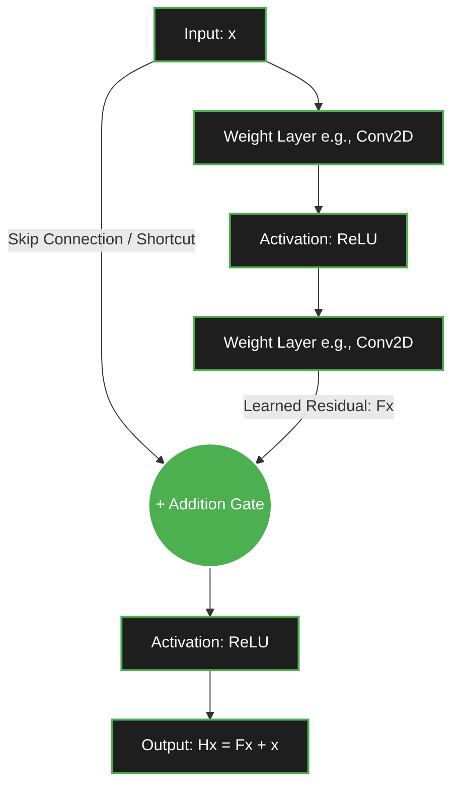

what is residuals and **residual learning** and **residual mapping**:.?? 

#  Understanding Residuals and Residual Learning

> [!info] Note Overview
> This note covers the foundational concepts of **Residuals**, **Residual Mapping**, and **Residual Learning**, which form the backbone of the ResNet (Residual Network) architecture. This concept is arguably one of the most important innovations in modern deep learning, heavily utilized not just in Computer Vision (CNNs), but also in modern NLP models like Transformers.

---

## 1. Essential Background Knowledge
Before diving into residuals, it is critical to understand *why* this concept was invented. You must remember two major roadblocks that occur when training very deep neural networks (e.g., networks with 50, 100, or 1000 layers).

### The Vanishing Gradient Problem
In standard feed-forward networks, gradients are calculated using the Chain Rule during backpropagation. As errors propagate backward from the output to the input layers, they are repeatedly multiplied by weight matrices and derivatives of activation functions. If these numbers are small (less than 1), the gradients shrink exponentially until they "vanish" to zero. **Result:** The early layers stop learning.

### The Degradation Problem (Crucial Concept)
Even if we fix vanishing gradients using techniques like Batch Normalization and proper weight initialization, deep networks suffer from the **Degradation Problem**. 
* **The Theory:** A deep network should perform *at least as well* as a shallow one. If you take a 20-layer network and add 30 layers to it, the model could theoretically just learn the "Identity Function" (passing the input exactly as it is) for those 30 extra layers.
* **The Reality:** Empirically, as network depth increases, accuracy gets saturated and then rapidly degrades. **This is not caused by overfitting** (training error actually *increases* alongside test error). It happens because modern optimization algorithms (like SGD or Adam) struggle incredibly hard to learn the identity function from a complex stack of non-linear layers.

> [!tip] What students often miss
> Students frequently confuse the Degradation Problem with Overfitting. Remember: **Overfitting** means training error is low and test error is high. **Degradation** means both training and test errors are high. The network simply becomes mathematically harder to optimize.

---

## 2. The Concept of a Residual

To solve the degradation problem, researchers redefined what the network actually learns. But first, what is a residual?

### In Mathematics and Statistics
Traditionally, a **residual** is defined as the difference between an observed (true) value and an estimated (predicted) value. It is the "error" or the "leftover" part that your model failed to capture.

$$ \text{Residual} = \text{True Value} - \text{Predicted Value} $$

*Example:* If the true house price is $10$, and your model predicts $8$, the residual is $2$.

### In Deep Learning (The ResNet Shift)
Deep learning borrows this conceptual framework but applies it structurally to the *transformations* inside the network. Instead of a residual being an "error," it represents the **difference between the input data and the desired underlying mapping**.

---

## 3. Residual Mapping vs. Underlying Mapping

To understand Residual Learning, we must define two different functions: the Underlying Mapping $H(x)$ and the Residual Mapping $F(x)$.

### The Old Way: Learning the Underlying Mapping $H(x)$
In a traditional neural network, you pass an input $x$ into a stack of layers. You want these layers to figure out a complex transformation, which we call $H(x)$. 
The network tries to learn this entire, heavy mapping directly from scratch.
$$ \text{Network Output} = H(x) $$

### The New Way: Learning the Residual Mapping $F(x)$
Researchers realized: *What if, instead of forcing the layers to learn the entire complex transformation $H(x)$, we just ask them to learn the DIFFERENCE between the input $x$ and the output $H(x)$?*

We define this difference as the **Residual Mapping**, $F(x)$:
$$ F(x) = H(x) - x $$

Using basic algebra, we can rearrange this formula to see what the final output of our network block should be:
$$ H(x) = F(x) + x $$

Instead of mapping $x \rightarrow H(x)$, the network now maps $x \rightarrow F(x)$. The original input $x$ is simply added back to the learned residual $F(x)$ at the very end.

---

## 4. Residual Learning & Skip Connections

**Residual Learning** is the training strategy where a neural network is explicitly designed to learn $F(x)$ rather than $H(x)$. 

To implement this mathematically in code, we use a structural mechanism called a **Skip Connection** (also known as a Shortcut Connection).

### How Skip Connections Work
A skip connection literally takes the input $x$, bypasses (skips) one or more convolutional layers, and adds it directly to the output of those layers.

> [!warning] Critical Detail: Element-wise Addition
> The addition performed at the `+` gate is **element-wise**. This means the dimensions of $F(x)$ and $x$ MUST be perfectly identical. 
> *What happens if the dimensions change?* (e.g., the convolution layer reduces the spatial size or increases the channel count). 
> **Solution:** A $1 \times 1$ Convolution is applied to the skip connection path to strictly project the input $x$ into the correct shape before the addition occurs.

---

## 5. Why Residual Learning Solves the Problems

Why did this simple addition $F(x) + x$ allow researchers to suddenly train 152-layer networks (ResNet-152) and win every Computer Vision competition? 

### A. The "Zero" Solution (Fixing Degradation)
Remember the Degradation Problem? We wanted extra layers in deep networks to just learn the "Identity Function" if they weren't needed. 
* **Without Residuals:** Learning $H(x) = x$ requires a complex matrix of weights to perfectly mirror the input. Neural networks are incredibly bad at doing this through non-linear activations like ReLU.
* **With Residuals:** The output is $H(x) = F(x) + x$. If the optimal transformation is just to pass the input forward (the identity mapping), the network only has to learn to push the weights of $F(x)$ to **$0$**. 
Learning $F(x) = 0$ is trivially easy for an optimizer because it just pushes weights toward zero using L2 Regularization (Weight Decay). 

### B. Smooth Gradient Flow (Fixing Vanishing Gradients)
Skip connections act as an "express highway" for gradients during backpropagation. 
Let's look at the derivative of the output with respect to the input:
$$ \frac{\partial H}{\partial x} = \frac{\partial (F(x) + x)}{\partial x} = \frac{\partial F}{\partial x} + 1 $$

That **$+ 1$** is pure magic. Even if the gradients passing through the complex layers ($\frac{\partial F}{\partial x}$) become infinitely small (vanish), the $+ 1$ ensures that a gradient of at least $1$ is safely propagated backward to the earlier layers. Early layers *always* get a strong signal to learn from.

---

## 6. An Intuitive Analogy

To cement this conceptually, consider the following real-world scenario:

Imagine you are an artist who drew a sketch of a landscape ($x$). You hand it to a master painter (the neural network) to create a perfect, polished masterpiece ($H(x)$).

* **Option A (Traditional Deep Learning):** You give the painter a blank canvas. They must look at your sketch, throw it away, and try to perfectly redraw the landscape from scratch, while also making it a masterpiece. This takes immense effort, and they might mess up the underlying proportions.
* **Option B (Residual Learning):** You hand the sketch directly to the master painter on a semi-transparent canvas. The painter *only* needs to paint over the flaws, add shading, and make small corrections ($F(x)$). Their corrections are then combined with your original sketch ($F(x) + x$) to form the masterpiece. 

Residual learning is simply: **"Learn the corrections, do not relearn the foundation."**

---

## 7. Summary and Cheat Sheet

For quick recall and exam/interview preparation, memorize this table:

| Term | Definition / Role in Neural Networks | Formula |
| :--- | :--- | :--- |
| **Residual** | The difference between the desired mapping and the original input. | $H(x) - x$ |
| **Underlying Mapping** | The complete, final transformation we actually want to achieve. | $H(x)$ |
| **Residual Mapping** | The specific correction/adjustment the intermediate layers learn. | $F(x) = H(x) - x$ |
| **Skip Connection** | The structural architecture (the wire bypassing layers) that performs the addition operation. | N/A |
| **Final Output** | The combination of the learned correction and the bypassed original input. | $H(x) = F(x) + x$ |

> [!tip] Ultimate Takeaway
> Without skip connections, networks deeper than ~30 layers suffer severely from degradation. With skip connections, networks can easily exceed 100+ layers (ResNet-101, ResNet-152), enjoying stable gradients and highly efficient optimization. This single mathematical addition changed Deep Learning forever.