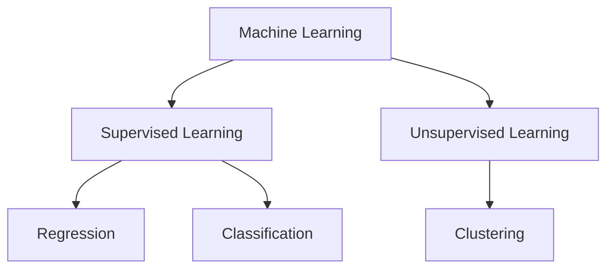

# 2. Types of Learning

Machine Learning is generally categorized based on the nature of the data available during training.

## 2.1. Supervised Learning (Apprentissage Supervisé)

In supervised learning, the model is trained on a **labeled dataset**.

### Key Characteristics
*   **Input ($X$):** The descriptors are known.
*   **Output ($Y$):** The labels (tags/classes) are **known**.
*   **Goal:** The algorithm learns a mapping function $f$ such that $Y = f(X)$. It tries to predict $Y$ given a new $X$.

### Common Algorithms
The notes highlight several specific algorithms used in supervised learning:
1.  **Linear Regression:** Predicting continuous values using a line.
2.  **Non-Linear Regression:** Predicting continuous values using curves.
3.  **ANN (Artificial Neural Networks):**
    *   *Important Note:* ANNs are considered the **base of modern AI**. They are versatile and can be used for **both** Regression and Classification tasks.
4.  **SVM (Support Vector Machines):** Powerful for classification.
5.  **KNN ($k$-Nearest Neighbors):** A simple distance-based algorithm.

---

## 2.2. Unsupervised Learning (Apprentissage Non Supervisé)

In unsupervised learning, the model is trained on an **unlabeled dataset**.

### Key Characteristics
*   **Input ($X$):** The descriptors are present.
*   **Output ($Y$):** There are **NO labels**. The "correct answer" is unknown.
*   **Goal:** Discovery of structure. The algorithm tries to find patterns, groupings, or relationships within the data $X$ itself.
*   **Process:** We give the model $X$, and *it* proposes the $Y$ (the grouping).

### Common Algorithms
*   **$k$-Means:** An algorithm for **Clustering** (Regroupement). It groups similar data points together.

---

## 2.3. Concrete Example: Medical Diagnosis

To visualize the difference, consider a medical table containing patient data.

| Descriptors ($X$) | | | Label ($Y$) |
| :--- | :---: | :---: | :--- |
| **Sugar Level** | **Iron Level** | ... | **Disease Type** |
| High | Low | ... | *Sick (Type A)* |
| Normal | Normal | ... | *Healthy* |
| High | High | ... | *Sick (Type B)* |

### How the approaches differ:

1.  **Supervised View:**
    *   You feed the computer the **Sugar**, **Iron**, AND the **Disease Type**.
    *   The computer learns: *"If Sugar is High and Iron is Low, the output should be Type A."*
    *   Later, you give it a patient without a diagnosis, and it predicts the disease.

2.  **Unsupervised View:**
    *   You feed the computer **ONLY** the **Sugar** and **Iron** levels. You hide the Disease Type column.
    *   The computer analyzes the data and says: *"I noticed that Patient 1 and Patient 3 have very similar strange blood levels. I will put them in 'Group 1'. Patient 2 looks different, so they go in 'Group 2'."*
    *   It discovers the groups, but it doesn't know the *name* of the disease.

> [!WARNING] Common Mistake
> Students often confuse **Clustering** (Unsupervised) with **Classification** (Supervised).
> *   **Classification:** You know the classes beforehand (Dog vs Cat).
> *   **Clustering:** You don't know the classes; you just group similar things (Group A vs Group B).