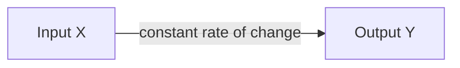

# 3. Introduction to Regression

**Chapter 01** focuses on Regression. Regression is a type of Supervised Learning where the output variable ($Y$) is **continuous** (a number), rather than a category.

## 3.1. Linear Regression

Linear regression attempts to model the relationship between two variables by fitting a linear equation to observed data.

### Characteristics
*   **Constant Variation:** The variation between two terms is constant.
*   **The Arithmetic Progression:** If you look at the sequence of values, the difference is fixed ($r$).
    *   Math Model: $U_n = U_0 + n \cdot r$
    *   Example Sequence: $10, 20, 30, 40, 50 \dots$ (Here, $r = 10$).
*   **Equation:** The classic line equation.
    $$y = ax + b$$
    *   $a$: Slope (gradient)
    *   $b$: Intercept (bias)

---

## 3.2. Non-Linear Regression

Non-linear regression is required when the data does not follow a straight line. The rate of change is not constant.

### Characteristics
*   **Changing Variation:** The difference between terms changes (it might square, double, etc.).
*   **The Geometric/Exponential Progression:**
    *   Math Model: $U_n = U_0 \cdot q^n$
    *   Example Sequence: $2, 4, 8, 16, 32 \dots$ (Here, we are multiplying by 2, not adding).
*   **Equation:** Polynomial or higher-order functions.
    $$y = a_0 + a_1x + a_2x^2 + a_3x^3 \dots$$

### Visualizing the Difference

| Linear | Non-Linear |
| :---: | :---: |
| Straight Line | Curve (Parabola, Hyperbola, etc.) |
| Simple relationship | Complex relationship |
| $f(x) = ax+b$ | $f(x) = ax^2 + bx + c$ |

> [!NOTE] Mathematical Background
> *   **Arithmetic Sequence ($U_n = U_0 + nr$):** Correlates to Linear Regression. The "step" is always the same.
> *   **Geometric Sequence ($U_n = U_0 \cdot q^n$):** Correlates to Non-Linear behavior. The "step" grows larger as $n$ increases.

### Why does this matter?
If your data looks like a curve (e.g., bacterial growth, stock market explosion), using a **Linear** model ($y=ax+b$) will result in high errors (Underfitting). You must choose a **Non-Linear** model (like a polynomial) to fit the data correctly.