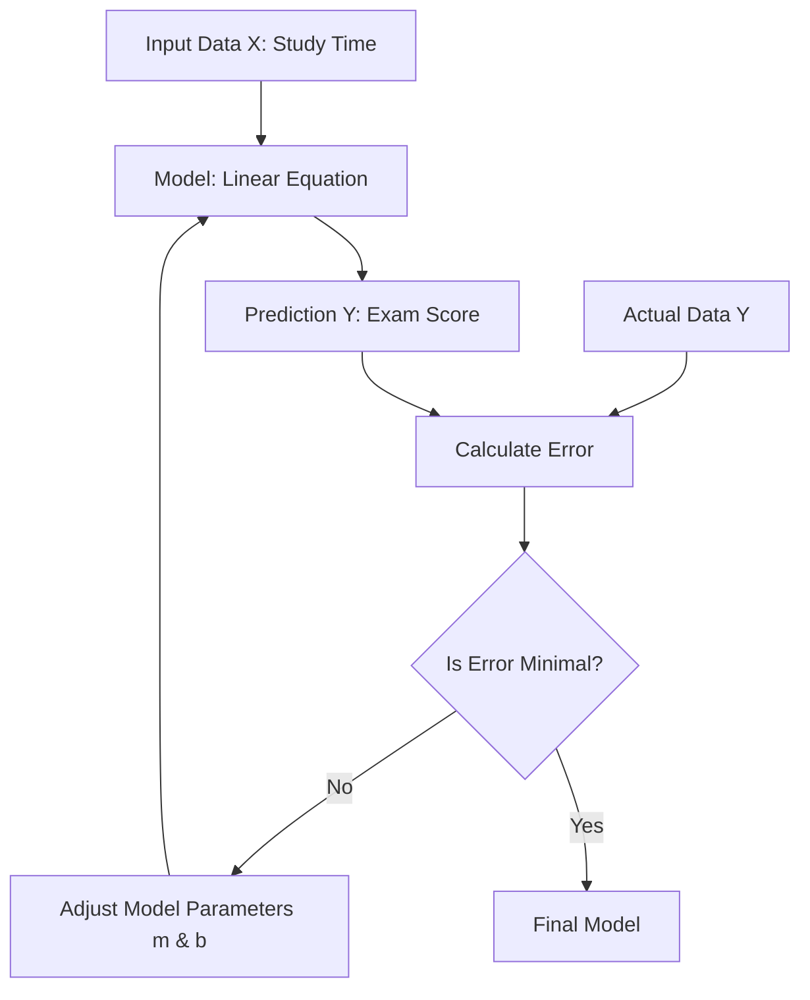

# 1. Linear Regression from Scratch

## 1. Introduction and Concept

**Linear Regression** is a fundamental algorithm in supervised machine learning used for **regression tasks**. A regression task involves predicting a continuous numerical output (dependent variable) based on one or more input variables (independent variables).

### The Scenario: Study Time vs. Exam Score
To understand the logic, consider a dataset of students. We have two pieces of data for each student:
1.  **Study Time ($x$):** The number of hours a student studied (Input).
2.  **Exam Score ($y$):** The final score achieved on the test (Output).

**Goal:** We want to find a relationship between study time and exam score so that if we know how long a new student studied, we can predict their score.

### Visualizing the Data
If we plot these data points on a 2D Cartesian coordinate system:
*   The **X-axis** represents Study Time.
*   The **Y-axis** represents Exam Score.

We will likely see a trend: as study time increases, the score generally increases. However, the points won't form a perfect straight line; there will be noise and outliers (e.g., a student who studied 0 hours but got a high score, or a student who studied 100 hours but failed).

**The Objective of Linear Regression:** To draw a single straight line through these data points that fits the data **"best."** "Best" is defined mathematically as minimizing the error between the line's predictions and the actual data points.



---

## 2. Theoretical Foundation: The Linear Model

Mathematically, a straight line is defined by the linear equation:

$$y = mx + b$$

Where:
*   **$y$**: The dependent variable (Prediction / Score).
*   **$x$**: The independent variable (Input / Study Time).
*   **$m$**: The **Slope** (or Weight). It determines the steepness of the line. In machine learning, this represents the importance of the input feature.
*   **$b$**: The **Y-Intercept** (or Bias). It determines where the line crosses the Y-axis when $x = 0$. It allows the line to shift up or down.

### The Optimization Challenge
Since we cannot change the input data ($x$) or the actual outcomes ($y$), our goal is to **tweak $m$ and $b$** until the line fits the points as closely as possible.

---

## 3. The Error Function (Cost Function)

To "minimize error," we first need to define what "error" is mathematically. We use the **Mean Squared Error (MSE)**.

### Why not just distance?
If we simply take the difference $(y_{actual} - y_{predicted})$, some errors will be positive (point above the line) and some negative (point below the line). If we sum them, they might cancel each other out, making a terrible line look perfect (e.g., +10 error and -10 error sum to 0).

### Why Squared Error?
1.  **Eliminates Negatives:** Squaring ensures all error values are positive.
2.  **Penalizes Large Errors:** Squaring disproportionately punishes outliers. An error of 10 becomes 100, while an error of 2 becomes 4. This forces the model to care more about points that are very far away.
3.  **Differentiable:** The square function is smooth and convex, making it easy to use calculus to find the minimum.

### The Formula
For a single point $i$, the error is the difference between the actual value $y_i$ and the predicted value $\hat{y}_i$:
$$Error_i = y_i - \hat{y}_i$$
Substituting the line equation:
$$Error_i = y_i - (mx_i + b)$$

**The Total Error ($E$):**
We sum the squared errors for all $n$ data points and divide by $n$ to get the mean.

$$E = \frac{1}{n} \sum_{i=0}^{n} (y_i - (mx_i + b))^2$$

*   $n$: Total number of data points.
*   $\sum$: Summation from the first point ($i=0$) to the last ($n$).

---

## 4. Optimization Strategy: Gradient Descent

We have an error function $E$ that depends on two variables: $m$ and $b$. We want to find the specific values of $m$ and $b$ that result in the smallest possible $E$.

Imagine the Error Function as a **valley**.
*   The height of the landscape is the Error $E$.
*   The coordinates are $m$ and $b$.
*   We start at a random point on a hill (random $m$ and $b$).
*   We want to walk down to the lowest point of the valley (minimum error).

**Gradient Descent** is the algorithm for "walking down the hill." It calculates the steepest direction downwards and takes a step in that direction.

### The Gradient
The gradient is a vector containing the **partial derivatives** of the error function with respect to the parameters ($m$ and $b$).
*   $\frac{\partial E}{\partial m}$: How does the error change if we wiggle $m$ slightly?
*   $\frac{\partial E}{\partial b}$: How does the error change if we wiggle $b$ slightly?

If the derivative is positive, the error increases as the parameter increases (so we should decrease the parameter). If negative, the error decreases as the parameter increases (so we should increase the parameter). Therefore, we always move in the **opposite** direction of the gradient.

---

## 5. Calculus Deep Dive: Deriving the Gradients

This is the most rigorous part. We must derive the formulas for $\frac{\partial E}{\partial m}$ and $\frac{\partial E}{\partial b}$ using the **Chain Rule**.

**The Error Function:**
$$E = \frac{1}{n} \sum (y_i - (mx_i + b))^2$$

### A. Derivative with respect to $m$ ($\frac{\partial E}{\partial m}$)

We treat $b, x, y$ as constants and differentiate with respect to $m$.

1.  **Apply Power Rule (Chain Rule Outer):**
    Bring the exponent 2 down.
    $$ \dots = \frac{1}{n} \sum 2(y_i - (mx_i + b))^{2-1} \cdot \frac{\partial}{\partial m}(Inner)$$

2.  **Differentiate the Inner Function:**
    The inner function is $y_i - mx_i - b$.
    *   Derivative of $y_i$ (constant wrt $m$) is 0.
    *   Derivative of $-b$ (constant wrt $m$) is 0.
    *   Derivative of $-mx_i$ with respect to $m$ is **$-x_i$**.

3.  **Combine:**
    $$ \frac{\partial E}{\partial m} = \frac{1}{n} \sum 2(y_i - (mx_i + b)) \cdot (-x_i) $$

4.  **Simplify:**
    Move the negative sign and the 2 to the front.
    $$ \frac{\partial E}{\partial m} = -\frac{2}{n} \sum x_i(y_i - (mx_i + b)) $$

### B. Derivative with respect to $b$ ($\frac{\partial E}{\partial b}$)

We treat $m, x, y$ as constants and differentiate with respect to $b$.

1.  **Apply Power Rule (Chain Rule Outer):**
    $$ \dots = \frac{1}{n} \sum 2(y_i - (mx_i + b)) \cdot \frac{\partial}{\partial b}(Inner)$$

2.  **Differentiate the Inner Function:**
    The inner function is $y_i - mx_i - b$.
    *   Derivative of $y_i$ is 0.
    *   Derivative of $-mx_i$ is 0.
    *   Derivative of $-b$ with respect to $b$ is **$-1$**.

3.  **Combine:**
    $$ \frac{\partial E}{\partial b} = \frac{1}{n} \sum 2(y_i - (mx_i + b)) \cdot (-1) $$

4.  **Simplify:**
    $$ \frac{\partial E}{\partial b} = -\frac{2}{n} \sum (y_i - (mx_i + b)) $$

---

## 6. The Update Rules

Now that we have the gradients (slope of the error landscape), we update our current $m$ and $b$ to move downhill. We use a **Learning Rate ($L$)** to control the size of the step we take.

**Update Formula for $m$:**
$$m_{new} = m_{current} - L \times \frac{\partial E}{\partial m}$$

**Update Formula for $b$:**
$$b_{new} = b_{current} - L \times \frac{\partial E}{\partial b}$$

> **Important Concept:** We subtract because the gradient points uphill (direction of steepest ascent). To minimize error, we go opposite to the gradient.

---

## 7. Python Implementation

We will implement this without using Scikit-Learn's linear regression model. We use `pandas` for data handling and `matplotlib` for visualization.

### 7.1 Setup and Dependencies

```python
import pandas as pd
import matplotlib.pyplot as plt

# Load dataset (assuming a CSV file with 'study_time' and 'score' columns)
data = pd.read_csv('data.csv') 

# Visualize the raw data
plt.scatter(data.study_time, data.score)
plt.show()
```

### 7.2 The Loss Function (Optional)
This function calculates the MSE. We don't technically need to run this during training (since the gradient descent math implies it), but it's useful to verify that error is actually decreasing.

```python
def loss_function(m, b, points):
    total_error = 0
    # Iterate through every point in the dataset
    for i in range(len(points)):
        x = points.iloc[i].study_time
        y = points.iloc[i].score
        # Calculate Squared Error for this point: (Actual - Predicted)^2
        total_error += (y - (m * x + b)) ** 2
    
    # Return Mean Squared Error
    return total_error / float(len(points))
```

### 7.3 Gradient Descent Implementation
This is the core training loop. It calculates the derivatives and updates the weights.

```python
def gradient_descent(m_now, b_now, points, L):
    # Initialize gradients to 0
    m_gradient = 0
    b_gradient = 0
    
    n = len(points)
    
    # Iterate through all data points to calculate the sum part of the derivative formulas
    for i in range(n):
        x = points.iloc[i].study_time
        y = points.iloc[i].score
        
        # Formula: -(2/n) * x * (y - (mx + b))
        # Note: We divide by n later or accumulate it here. 
        # The implementation below effectively sums terms and divides by n at the end (conceptually)
        # However, typically we sum first then divide. Let's follow the video's mathematical structure strictly:
        
        # Accumulate the gradients using the partial derivative formulas derived earlier
        m_gradient += -(2/n) * x * (y - (m_now * x + b_now))
        b_gradient += -(2/n) * (y - (m_now * x + b_now))
        
    # Update m and b using the learning rate
    m_new = m_now - (m_gradient * L)
    b_new = b_now - (b_gradient * L)
    
    return m_new, b_new
```

### 7.4 Running the Training Loop
We need to define hyperparameters:
1.  **Epochs:** How many times we iterate through the dataset.
2.  **Learning Rate ($L$):** How big the steps are.

```python
# Initial values
m = 0
b = 0
L = 0.0001 # Learning Rate (Small to prevent overshooting)
epochs = 1000 # Number of iterations

# Training Loop
for i in range(epochs):
    if i % 50 == 0:
        print(f"Epoch: {i}") # Progress tracker
    
    # Perform one step of gradient descent
    m, b = gradient_descent(m, b, data, L)

print(f"Final m: {m}, Final b: {b}")
```

### 7.5 Visualization of the Result
Plot the original scatter plot and draw the calculated line $y = mx+b$ over it.

```python
# 1. Plot the actual data points (Scatter)
plt.scatter(data.study_time, data.score, color="black")

# 2. Plot the regression line
# We create a range of X values (e.g., min to max study time)
# For every X, we calculate Y using our new m and b
x_range = list(range(20, 80)) # Range depends on your data spread
plt.plot(x_range, [m * x + b for x in x_range], color="red")

plt.show()
```

---

## 8. Critical Analysis & Tips

### Understanding the Learning Rate ($L$)
*   **If $L$ is too small:** The model will learn very slowly. It might take millions of epochs to reach the minimum error.
*   **If $L$ is too large:** The model might **overshoot**. Imagine stepping across the valley to the other side, higher up than before. The error will explode to infinity (divergence) instead of converging to zero.
*   **Tip:** Standard values are $0.01, 0.001, 0.0001$. If you get "NaN" (Not a Number) errors, your learning rate is likely too high.

### Outliers
*   **Sensitivity:** Since we square the error $(y-\hat{y})^2$, outliers have a massive impact. A single point far away can drag the regression line significantly towards it.
*   **Fix:** If data has many outliers, Mean Absolute Error (MAE) might be preferred over MSE, or outliers should be filtered out before training.

### Feature Scaling (Important Background Knowledge)
In the video, the data values (20-80 range) were raw. In professional machine learning:
*   Gradient Descent works best when input features are on a similar scale (e.g., 0 to 1).
*   **Normalization/Standardization** helps the gradient descent converge faster and cleaner. Without it, the error landscape looks like a very long, narrow valley, making navigation difficult.

### Epochs vs. Convergence
*   We essentially guessed `1000` epochs.
*   In sophisticated implementations, we stop the loop when the change in error between epochs is smaller than a threshold (e.g., $0.00001$), indicating we have reached the bottom of the valley (convergence).

---

## 9. Summary of Key Formulas

| Concept | Mathematical Formula |
| :--- | :--- |
| **Linear Equation** | $y = mx + b$ |
| **Mean Squared Error** | $E = \frac{1}{n} \sum (y_i - (mx_i + b))^2$ |
| **Gradient (Slope) wrt $m$** | $\frac{\partial E}{\partial m} = -\frac{2}{n} \sum x_i(y_i - (mx_i + b))$ |
| **Gradient (Bias) wrt $b$** | $\frac{\partial E}{\partial b} = -\frac{2}{n} \sum (y_i - (mx_i + b))$ |
| **Update Rule** | $Parameter_{new} = Parameter_{old} - L \cdot Gradient$ |