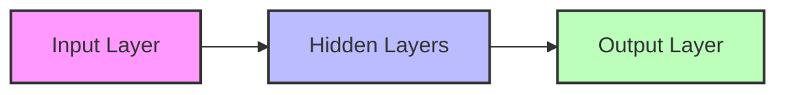
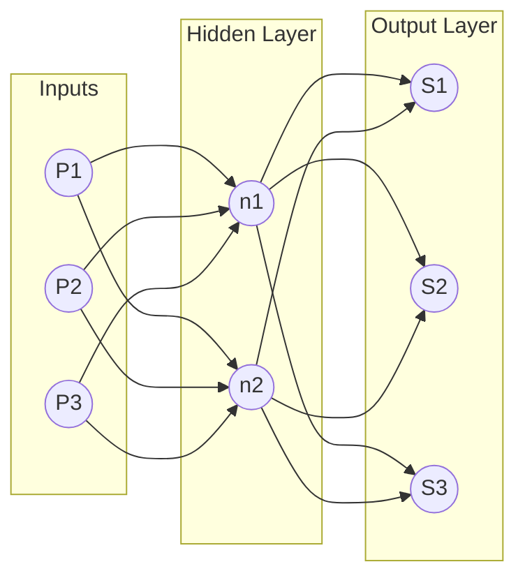

Based on the provided PDF, the "Second Chapter" covers **Artificial Neural Networks (ANN)**. This includes the fundamental theory of neurons, the Multi-Layer Perceptron (MLP), the Exam Exercise, Backpropagation/Gradient Descent, and finally, ANN for Classification.

Here are the detailed Obsidian notes for this section.

---

# 2.1. Artificial Neural Network Fundamentals

This note covers the building block of Deep Learning: the Artificial Neuron (also called the Perceptron). It explains how biological inspiration translates into mathematical formulas.

## 1. The Formal Neuron
An Artificial Neural Network (ANN) is a computational model inspired by the human brain. It consists of layers of artificial neurons that process data and learn patterns automatically.

### The Biological vs. Mathematical Analogy
*   **Biological:** A neuron receives electrical signals via dendrites, processes them in the cell body (soma), and if the signal is strong enough, fires an output through the axon.
*   **Mathematical:** The "Formal Neuron" is a parametric algebraic function. It acts on input values to compute an output value.

### The Mathematical Formula
The output $y$ of a single neuron is calculated as:

$$ y = f\left(\sum_{i=1}^{n} w_i \cdot P_i + b\right) $$

#### Components Breakdown:
1.  **$P_i$ (Inputs):** These are the raw data points (e.g., pixel values of an image) or outputs from a previous layer.
2.  **$W_i$ (Weights):**
    *   Determine the **importance** of each input.
    *   A high weight means that specific input strongly influences the output.
    *   *Learning* essentially means adjusting these $W$ values.
3.  **$\Sigma$ (Weighted Sum):** The linear combination of inputs and weights.
    *   Formula: $n = (P_1 \cdot W_1) + (P_2 \cdot W_2) + \dots + (P_R \cdot W_R)$.
    *   This is often called the **Potential ($n$)**.
4.  **$b$ (Bias):**
    *   An additional term that allows the activation function to be shifted.
    *   *Tip:* Think of bias as the intercept $b$ in the line equation $y = ax + b$. Without it, the line must always pass through the origin $(0,0)$, which limits flexibility.
5.  **$f$ (Activation Function):** Defines the final output. It introduces non-linearity (explained below).
6.  **$y$ (Output):** The final result passed to the next layer.

### Vector Notation
To make calculations efficient (especially in programming), we use vectors:
*   Input Vector $P = [P_1, P_2, \dots, P_R]^T$
*   Weight Vector $W = [W_1, W_2, \dots, W_R]$
*   Potential $n = W \cdot P + b$

---

## 2. Activation Functions
The **Activation Function** (or Transfer Function) decides the output based on the potential $n$. Its most critical role is introducing **non-linearity**, allowing the network to learn complex curves rather than just straight lines.

### A. Linear Function
*   **Formula:** $f(n) = \lambda \cdot n$ (or just $f(n) = n$)
*   **Graph:** A straight diagonal line.
*   **Use Case:** Rarely used in hidden layers because stacking linear functions just creates another linear function. Used sometimes in the output layer for regression.

### B. Step Function (Threshold)
*   **Formula:**
    $$ f(n) = \begin{cases} \lambda & \text{if } n \geq 0 \\ 0 & \text{if } n < 0 \end{cases} $$
*   **Description:** The neuron is either "ON" or "OFF".
*   **Limitation:** Not differentiable at 0, making it hard to use with modern learning algorithms like Gradient Descent.

### C. ReLU (Rectified Linear Unit)
*   **Formula:**
    $$ f(n) = \begin{cases} n & \text{if } n > 0 \\ 0 & \text{if } n \leq 0 \end{cases} $$
*   **Graph:** Flat for negative numbers, linear for positive.
*   **Importance:** The most popular function for hidden layers in Deep Learning today because it is computationally fast and solves the "vanishing gradient" problem.

### D. Sigmoid Function
*   **Formula:** $f(n) = \frac{1}{1 + e^{-\lambda n}}$
*   **Range:** $[0, 1]$
*   **Graph:** An "S" curve.
*   **Use Case:** Good for probability outputs, but computationally expensive due to $e$.

### E. Hyperbolic Tangent (tanh)
*   **Formula:** $f(n) = \tanh(n) = \frac{e^n - e^{-n}}{e^n + e^{-n}}$
*   **Range:** $[-1, 1]$
*   **Graph:** Similar to Sigmoid but centered at 0.
*   **Advantage:** Often converges faster than Sigmoid because the data is centered around zero.

---

# 2.2. Multi-Layer Perceptron (MLP) Architecture

This note explains how single neurons are combined to form a network and the flow of data (Feed Forward).

## 1. Network Architecture
An Artificial Neural Network (ANN) is organized into layers.

1.  **Input Layer:**
    *   Receives raw data (e.g., pixels of an image).
    *   No calculations happen here; it just passes values.
2.  **Hidden Layers:**
    *   Perform calculations and feature extraction.
    *   "Hidden" because the user does not see these values directly.
    *   Deep Learning = Many hidden layers.
3.  **Output Layer:**
    *   Produces the final result (prediction or classification).

### Direction of Flow
*   **Feed-Forward:** Information flows only in one direction: Input $\to$ Output. There are no loops.
*   **Recurrent/Feedback:** Information can loop back. (Not covered in this chapter, but mentioned as a comparison).

## 2. Matrix Notation for MLP
Calculating one neuron at a time is slow. We use matrices to calculate whole layers at once.

If we have a layer with indices $j$ connecting to a layer with indices $i$:
$$ N = W \cdot A_{prev} + B $$
*   $N$: Vector of potentials for the current layer.
*   $W$: Weight matrix.
*   $A_{prev}$: Output (activation) vector from the previous layer.
*   $B$: Bias vector.

---

# 2.3. Detailed Exercise Solution: MLP Calculation

**Context:** This note details the "Exo Examen" (Exam Exercise) found on Page 5 of the PDF. This is a crucial practical example of how a Forward Pass works.

## The Problem Setup
We have an MLP with the following structure:
*   **Input Layer:** 3 Neurons ($P_1, P_2, P_3$).
*   **Hidden Layer:** 2 Neurons ($n_1, n_2$).
    *   Activation Function: **Hyperbolic Tangent (tanh)**.
*   **Output Layer:** 3 Neurons ($S_1, S_2, S_3$).
    *   Activation Function: **Linear** (Identity).

### Diagram Representation

## Step 1: Calculating the Hidden Layer (Layer 1)
We need to calculate the *potential* ($n$) and the *activation* ($a$) for the hidden neurons.

### Notation Reminder
*   $W_{ij}^L$: Weight connecting neuron $j$ of the previous layer to neuron $i$ of layer $L$.
    *   *Note:* The PDF writes $W_{12}^1$ meaning weight to neuron 1 (layer 1) from input 2.
    *   *Be Careful:* Do not confuse the superscript 1 (Layer 1) with an exponent (power of 1).

### The Equations
The potentials for the hidden neurons are calculated as:
$$ n_1^1 = P_1 \cdot W_{11}^1 + P_2 \cdot W_{12}^1 + P_3 \cdot W_{13}^1 + b_1^1 $$
$$ n_2^1 = P_1 \cdot W_{21}^1 + P_2 \cdot W_{22}^1 + P_3 \cdot W_{23}^1 + b_2^1 $$

**Matrix Form:**
$$
\begin{bmatrix} n_1^1 \\ n_2^1 \end{bmatrix} =
\begin{bmatrix} W_{11}^1 & W_{12}^1 & W_{13}^1 \\ W_{21}^1 & W_{22}^1 & W_{23}^1 \end{bmatrix}
\times
\begin{bmatrix} P_1 \\ P_2 \\ P_3 \end{bmatrix}
+
\begin{bmatrix} b_1^1 \\ b_2^1 \end{bmatrix}
$$

### The Activation (Output of Hidden Layer)
The problem states the activation function is **tanh**.
$$ a_1^1 = f(n_1^1) = \frac{e^{n_1} - e^{-n_1}}{e^{n_1} + e^{-n_1}} $$
$$ a_2^1 = f(n_2^1) = \frac{e^{n_2} - e^{-n_2}}{e^{n_2} + e^{-n_2}} $$

These values ($a_1^1, a_2^1$) become the *inputs* for the next layer.

---

## Step 2: Calculating the Output Layer (Layer 2)
Now we compute the final outputs using the activations from the hidden layer.

### The Equations
$$ n_1^2 = a_1^1 \cdot W_{11}^2 + a_2^1 \cdot W_{12}^2 + b_1^2 $$
$$ n_2^2 = a_1^1 \cdot W_{21}^2 + a_2^1 \cdot W_{22}^2 + b_2^2 $$
$$ n_3^2 = a_1^1 \cdot W_{31}^2 + a_2^1 \cdot W_{32}^2 + b_3^2 $$

### The Final Activation
The problem states the output activation function is **Linear**.
Therefore, the final output $S$ is equal to the potential $n$:
$$ S_1 = n_1^2 $$
$$ S_2 = n_2^2 $$
$$ S_3 = n_3^2 $$

> **Important Tip for Exams:**
> Always check the activation function for the *Output* layer. In regression problems, it is often Linear. In classification problems (like determining if an image is a cat or dog), it is often Sigmoid or Softmax. Don't blindly apply Tanh or ReLU to the final layer unless specified.

---

# 2.4. Learning Algorithms and Error Calculation

This note covers the concepts on Page 6 and 7: How the network actually "learns" by measuring error.

## 1. The Goal of Learning
Learning involves updating the weights ($W$) to minimize the difference between what the network predicts and what the true answer is.

*   **$g_i(k)$:** The **Actual/Target** output (the ground truth from your dataset).
*   **$a_i(k)$:** The **Computed/Predicted** output (what your ANN produced).

## 2. Calculating Error
The error for a specific output neuron $i$ on sample $k$ is:
$$ e_i(k) = g_i(k) - a_i(k) $$

### Total Error (Loss Function)
To evaluate the whole network, we calculate the **Mean Squared Error (MSE)**. We square the error to eliminate negative signs and penalize large errors more heavily.
$$ E(k) = \frac{1}{2} \sum_{i=1}^{R} (g_i(k) - a_i(k))^2 $$
*   The $\frac{1}{2}$ is a mathematical convenience that cancels out when we take the derivative later.

## 3. Types of Learning (Updating Weights)
1.  **Incremental Learning (Stochastic):**
    *   Update weights after *every single sample* is presented.
    *   Fast, but the error path is noisy/bumpy.
2.  **Batch Learning:**
    *   Calculate the error for *all K samples* in the dataset first.
    *   Update weights once based on the average error.
    *   Mathematically stable, but requires more memory.
    *   **Epoch:** One complete pass through the entire dataset.

---

# 2.5. Gradient Descent and Backpropagation (The Math)

This is the most technically complex part of the notes (Page 7). It explains *how* we calculate the change in weights ($\Delta W$).

## 1. Gradient Descent Concept
Imagine you are on a mountain (the error function) and want to get to the bottom (zero error).
*   The **Gradient** tells you which way is "up".
*   To minimize error, we go in the **opposite direction** of the gradient.

### The Update Rule
$$ W_{new} = W_{old} + \Delta W $$
$$ \Delta W = -\eta \cdot \frac{\partial E}{\partial W} $$

*   $\eta$ (Eta): **Learning Rate**. Usually a small number between 0 and 1 (e.g., 0.01).
    *   If too big: You overshoot the minimum.
    *   If too small: Learning takes forever.
*   $\frac{\partial E}{\partial W}$: The derivative (gradient) of the error with respect to the weight.

## 2. Derivation of the Delta Rule (Chain Rule)
To find $\Delta W$, we must use the **Chain Rule** of calculus, because the Error $E$ depends on Output $a$, which depends on Potential $n$, which depends on Weight $W$.

$$ \frac{\partial E}{\partial W_{ij}} = \frac{\partial E}{\partial a_i} \cdot \frac{\partial a_i}{\partial n_i} \cdot \frac{\partial n_i}{\partial W_{ij}} $$

Let's break down the derivation provided in the notes (specifically for the Tanh function):

### Step A: Derivative of Error vs Output
Since $E = \frac{1}{2}(g - a)^2$:
$$ \frac{\partial E}{\partial a} = -(g - a) = -e(k) $$

### Step B: Derivative of Output vs Potential (The Activation Derivative)
The notes use $f(n) = \tanh(n)$.
We need the derivative $f'(n)$.
*   Identity: $f'(n) = 1 - f(n)^2$
*   So, $\frac{\partial a}{\partial n} = 1 - a^2$

### Step C: Derivative of Potential vs Weight
Since $n = W \cdot P$:
$$ \frac{\partial n}{\partial W} = P \text{ (the input to that connection)} $$

### Step D: Combining them (The Delta Rule)
Putting it all together for the weight update $\Delta W_{ij}$:

$$ \Delta W_{ij} = \eta \cdot \underbrace{e_i(k)}_{\text{Error}} \cdot \underbrace{(1 - a_i(k)^2)}_{\text{Slope of Tanh}} \cdot \underbrace{P_j(k)}_{\text{Input}} $$

> **Summary:** The change in weight is proportional to the **Error**, the **Derivative of the Activation Function**, and the **Input** that caused it.

---

# 2.6. ANN for Classification (Chapter 02 Content)

This note covers the content starting on Page 8: Applying the math above to classification problems (e.g., Iris Dataset).

## 1. Regression vs. Classification
*   **Regression:** Predicting a continuous number (e.g., Price of a house, temperature). Output layer usually has 1 neuron with Linear activation.
*   **Classification:** Predicting a category (e.g., Is this flower Setosa, Versicolor, or Virginica?).

## 2. One-Hot Encoding
Neural networks work with numbers, not text labels like "Setosa". We convert labels into vectors.
*   **Example (Iris Dataset):**
    *   Iris Setosa $\to [1, 0, 0]$
    *   Iris Versicolor $\to [0, 1, 0]$
    *   Iris Virginica $\to [0, 0, 1]$

This requires the Output Layer to have **3 Neurons** (one for each class).

## 3. The Softmax Function
For multi-class classification, we usually use the **Softmax** activation function in the output layer.
*   It converts raw outputs into **probabilities**.
*   The sum of all outputs will equal 1 ($100\%$).

### Interpretation Example
If the network outputs: $[0.62, 0.23, 0.15]$
*   Neuron 1 (Class 0): 62% probability.
*   Neuron 2 (Class 1): 23% probability.
*   Neuron 3 (Class 2): 15% probability.

**Conclusion:** The network classifies this input as **Class 0**.

## 4. Confusion Matrix (Evaluation)
To test how well the classification works, we compare Predicted vs. Actual values using a matrix.

| | Predicted Yes | Predicted No |
| :--- | :---: | :---: |
| **Actual Yes** | True Positive (TP) | False Negative (FN) |
| **Actual No** | False Positive (FP) | True Negative (TN) |

*   **TP:** Correctly identified positive.
*   **TN:** Correctly identified negative.
*   **FP (Type 1 Error):** Predicted Yes, but it was No.
*   **FN (Type 2 Error):** Predicted No, but it was Yes.