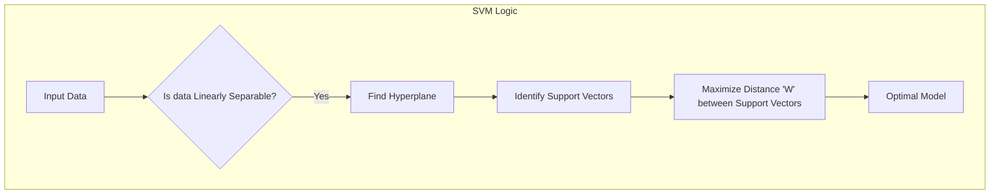
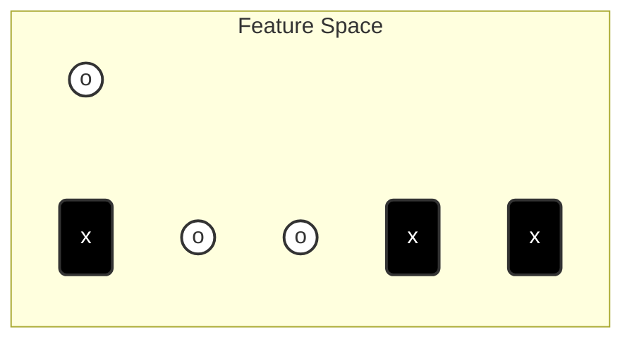

Based on the provided notes (specifically **Page 9**, which covers "Chapter: SVM Support Vector Machine"), here are the detailed, polished Obsidian notes.

I have expanded significantly on the handwritten text to provide the context, background, and "tips" required to fully understand the concepts without needing external resources.

---

### **Folder Structure Suggestion**
For your vault, organize these notes as follows:
*   `03. SVM (Support Vector Machines)/`
    *   `3.1. SVM Fundamentals & Linear Separability.md`
    *   `3.2. The Kernel Trick & Non-Linearity.md`

---

### **File: 3.1. SVM Fundamentals & Linear Separability.md**

```markdown
# 3.1. SVM Fundamentals & Linear Separability

## 1. Introduction to SVM
**Support Vector Machine (SVM)** is a powerful **Supervised Learning** algorithm used for both classification (distinguishing between classes) and regression. In this chapter, we focus primarily on its classification capabilities.

The fundamental goal of SVM is simple but mathematically elegant: **Find the best possible boundary to separate different classes of data.**

### Key Concepts
*   **The Hyperplane:** This is the "line" (in 2D) or "plane" (in 3D+) that separates your data classes.
*   **Support Vectors:** These are the specific data points closest to the hyperplane. They are the "hardest" points to classify. They are called "support" vectors because they literally support or determine the position of the hyperplane.
*   **The Margin:** The distance between the hyperplane and the nearest data point (the support vectors).

> [!TIP] **Why "Support" Vectors?**
> Imagine the dataset is a building. Most data points are just interior decorations—they don't affect the structure. The **Support Vectors** are the load-bearing pillars. If you remove a random data point, the decision boundary usually doesn't change. If you move a Support Vector, the whole boundary shifts.

---

## 2. The Objective: Maximizing the Margin
As depicted in the lecture notes, you might have two classes of data (e.g., circles and crosses). You can draw infinite lines to separate them. **Which one is the best?**

The SVM algorithm selects the hyperplane that **maximizes the distance ($W$)** between the classes.

### The Logic
1.  We want the "street" (the gap between classes) to be as wide as possible.
2.  The wider the margin, the more confident we are in our classification.
3.  A wider margin reduces the risk of **Overfitting**. If the margin is too narrow, the model might be too sensitive to noise in the training data.

### Mathematical Representation (Simplified)
If we have two support vectors on either side of the boundary, let's call the distance from the centerline to the support vector $W_1$ and $W_2$.
*   Ideally, the hyperplane is centered, so **$W_1 = W_2$**.
*   The total margin width is $W_1 + W_2$.
*   **Goal:** Maximize $(W_1 + W_2)$.



---

## 3. Visualizing Linear Separability
In a standard 2D graph (Feature $x_1$ vs Feature $x_2$), if you can draw a straight ruler line to separate the two groups completely, the data is **Linearly Separable**.

### Diagram: The Linear Case
The diagram below represents the top-left drawing from your notes.



*   **$x_1, x_2$**: These are the axes (features).
*   **Hyperplane**: The line splitting the `o` and `x`.
*   **Support Vectors**: The `o` and `x` closest to the line.

> [!WARNING] **Common Misconception**
> Students often think SVM considers *all* data points when calculating the line. It does not. Once the Support Vectors are identified, the rest of the data is mathematically irrelevant to the position of the boundary.

---

```

### **File: 3.2. The Kernel Trick & Non-Linearity.md**

```markdown
# 3.2. The Kernel Trick & Non-Linearity

## 1. The Problem: Non-Linearly Separable Data
In the real world, data is rarely clean enough to be split by a straight line. 

Referencing the bottom-left diagram in your notes:
*   Imagine a dataset where Class A is a cluster in the center ($0,0$) and Class B is a ring of points surrounding Class A.
*   **Problem:** No straight line (linear hyperplane) can separate the inner cluster from the outer ring without making huge errors.

This is called **Non-Linear Data**.

---

## 2. The Solution: Kernel Functions
To solve this, SVM uses a technique called the **Kernel Trick**.

### The Core Idea
If we cannot separate the data in the current dimension (2D), we project (map) the data into a **Higher Dimensional Space** (3D, 4D, or infinite dimensions).

**Analogy:** 
Imagine red and blue dots on a flat sheet of paper. You cannot draw a straight line to separate them. Now, imagine lifting the red dots up into the air (adding a 3rd dimension: height). Now, you can slide a flat sheet of plastic (a 2D plane) between the red dots in the air and the blue dots on the table.

### Visualizing the Transformation
The notes illustrate mapping 2D points into a 3D space:
1.  **Input Space (2D):** Data is mixed and inseparable.
2.  **Feature Space (3D):** Data is "lifted".
3.  **Result:** We can now fit a flat hyperplane to separate them.

```mermaid
flowchart LR
    A[2D Input Space<br/>(Not Separable)] -->|Mapping Function| B[3D Feature Space<br/>(Linearly Separable)]
    B -->|Find Hyperplane| C[Classified Data]
```

---

## 3. The "Kernel Trick" Definition
You might ask: *"Isn't calculating 3D coordinates for millions of data points computationally expensive?"*
Yes, it is. That is why we use the **Kernel Trick**.

**Definition from Notes:**
> The Kernel function computes the **similarity** between two points as if they were mapped to a higher-dimensional space, **without actually doing the mapping.**

### Mathematical Insight
SVM relies on the **Dot Product** of data points to calculate the margin.
*   The Kernel function $K(x_1, x_2)$ allows us to calculate the dot product in the high-dimensional space using only the original 2D data.
*   **Mathematical Magic:** We get the benefit of high dimensions without the cost of calculating the coordinates.

$$K(x, y) = \langle \phi(x), \phi(y) \rangle$$
*Where $\phi$ represents the mapping to high dimensions.*

---

## 4. Types of Kernels
Although not explicitly listed in the notes, these are the standard kernels implied by the concept "Kernel Function":

1.  **Linear Kernel:** Used when data is already separable (as in Note 3.1).
2.  **Polynomial Kernel:** Curves the decision boundary.
3.  **RBF (Radial Basis Function):** (The most common). It creates circular/complex decision boundaries—perfect for the "circle inside a circle" example in your notes.

> [!IMPORTANT] **Exam Reminder**
> If asked "What is the objective of the Kernel function?", the answer is:
> To enhance the dimensionality of data to make it linearly separable, and therefore find the hyperplane to classify them.

### Summary Checklist
*   [ ] **Hyperplane:** The dividing line.
*   [ ] **Support Vectors:** The points that define the line.
*   [ ] **Linearly Separable:** Can be cut by a straight line.
*   [ ] **Kernel Trick:** A mathematical shortcut to separate complex (non-linear) data by calculating similarity in higher dimensions without high computational cost.
```