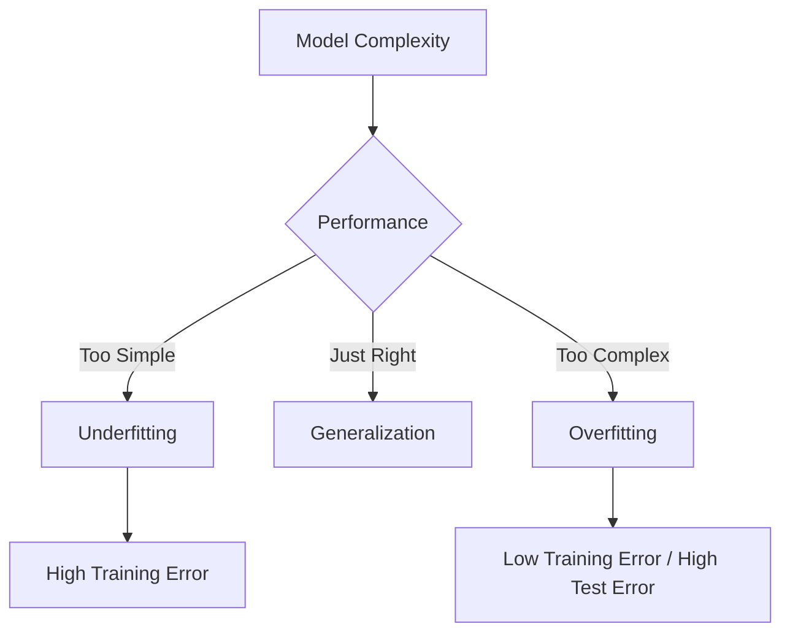
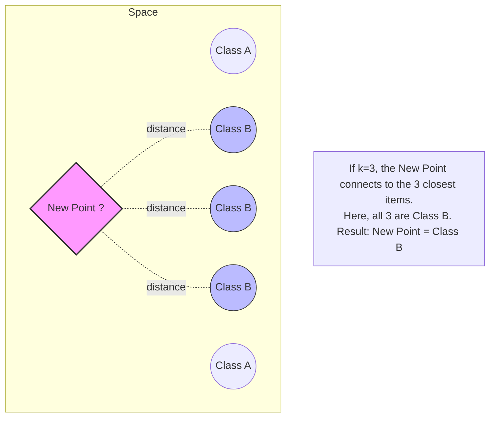
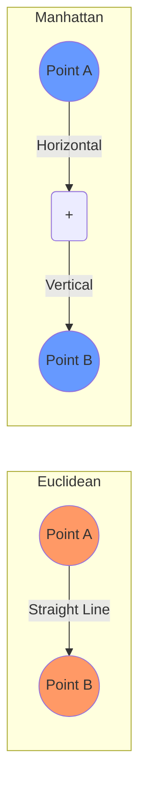
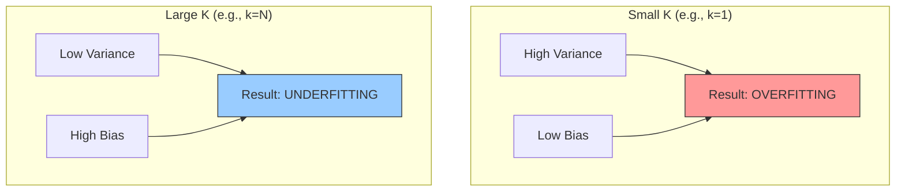
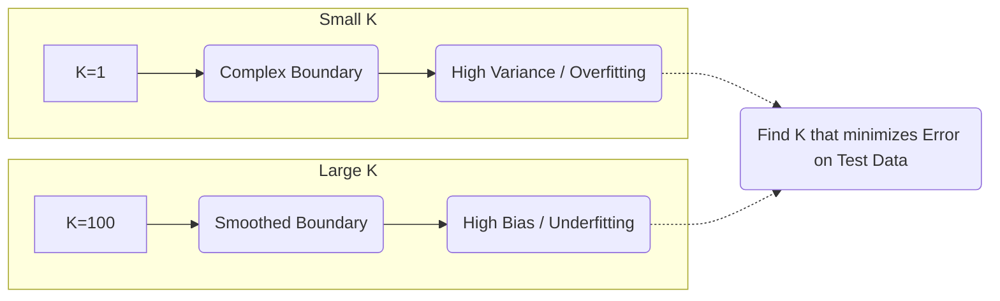

Here are the detailed, polished Obsidian notes for **Chapter 4**, covering **K-Nearest Neighbors (KNN)**, **Model Evaluation**, and **Dataset Management**.

These notes cover the material found on **Pages 10, 11, 12, and 13** of your provided PDF.

---

## 1. Managing Datasets in Machine Learning

### **Overview**
Before applying any algorithm (like KNN), it is critical to understand how to manage data. A common mistake in Machine Learning is testing a model on the same data it learned from. This leads to false confidence. To solve this, we split the dataset into three distinct subsets.

### **The Three Data Subsets**
In regression and classification problems, the dataset is generally divided as follows:

1.  **Training Set (~70%)**
    *   **Purpose:** Used to "teach" the model. The algorithm looks at input $X$ and output $Y$ in this set to learn patterns (weights, boundaries, etc.).
    *   **Analogy:** The textbook problems you practice with for homework.
2.  **Validation Set (~15%)**
    *   **Purpose:** Used to *tune* the model during the training process. It evaluates the model to check for overfitting and to adjust hyperparameters (like choosing $K$ in KNN).
    *   **Key Function:** It helps decide when to **stop** training (Early Stopping) to prevent the model from memorizing the noise.
    *   **Analogy:** The practice quiz you take before the exam to see what you need to study more.
3.  **Test Set (~15%)**
    *   **Purpose:** Used **only once** at the very end. It evaluates the final model on completely unseen data to estimate its real-world performance.
    *   **Analogy:** The final exam.

> [!WARNING] Important Rule
> Never train your model on the **Test Set**. If you do, your accuracy metrics will be high, but the model will fail in the real world. This is called **Data Leakage**.

---

### **Generalization: Overfitting vs. Underfitting**
The goal of ML is **Generalization**: The ability of the model to perform well on new, unseen data, not just the data it memorized.

#### **1. Underfitting (High Bias)**
*   **Definition:** The model is too simple. It cannot capture the underlying structure of the data.
*   **Symptoms:** High error on Training Data AND High error on Validation Data.
*   **Example:** Trying to fit a straight line (Linear Regression) to data that forms a curve (Parabola).
*   **Note:** "Pas suffisant" (Not sufficient) in your notes.

#### **2. Overfitting (High Variance)**
*   **Definition:** The model is too complex. It learns the **noise** and random fluctuations in the training data instead of the actual pattern.
*   **Symptoms:** Very Low error on Training Data BUT High error on Validation Data.
*   **Example:** A student who memorizes the answers to the homework but fails the test because the questions were slightly different.



### **Cross-Validation (The Better Way)**
Splitting data into just one train/test set can be risky if your dataset is small or unlucky (e.g., all "hard" examples end up in the test set).

**Technique: K-Fold Cross Validation**
1.  Split the dataset into $K$ equal-sized "folds" (parts).
2.  Train the model $K$ times.
3.  In each iteration, use **one fold** for testing and the remaining $K-1$ folds for training.
4.  Average the performance results.

**Methodology:**
*   **Standard K-Fold:** Split randomly.
*   **Stratified K-Fold (Important):** Ensures each fold has the same percentage of samples for each class as the complete set. (e.g., if the original data is 60% Cats and 40% Dogs, every fold will also be 60/40). This prevents bias.

---

## 2. Confusion Matrix and Evaluation

### **Understanding the Confusion Matrix**
For classification problems, "Accuracy" is not enough. We need to know *how* the model is failing. The Confusion Matrix is a table used to evaluate the performance of a classification model.

**Scenario:** We are detecting pictures of **Dogs**.
*   **Positive (1):** Is a Dog.
*   **Negative (0):** Is NOT a Dog (e.g., a Cat).

| | **Predicted: Dog (Positive)** | **Predicted: Not Dog (Negative)** |
| :--- | :---: | :---: |
| **Actual: Dog (Positive)** | **True Positive (TP)**<br>(Correctly identified as Dog) | **False Negative (FN)**<br>(Missed the Dog / Type 2 Error) |
| **Actual: Not Dog (Negative)** | **False Positive (FP)**<br>(False Alarm / Type 1 Error) | **True Negative (TN)**<br>(Correctly ignored) |

> [!TIP] Memory Trick
> *   **True/False** refers to whether the model was *Right or Wrong*.
> *   **Positive/Negative** refers to *what the model predicted*.
> *   **False Positive (Type 1):** You predicted YES, but it was NO. (Telling a man he is pregnant).
> *   **False Negative (Type 2):** You predicted NO, but it was YES. (Telling a pregnant woman she is not pregnant).

---

### **Detailed Example (From Notes)**
We have 10 images of animals. We want to identify **Dogs**.

**Data Table:**
*   **Actual:** D, D, D, ND, D, ND, D, D, ND, ND (Total: 6 Dogs, 4 Not Dogs).
*   **Predicted:** D, ND, D, ND, D, D, D, D, ND, ND.

**Analysis:**
1.  **TP (True Positive):** Actual=D, Pred=D. Count = 5.
2.  **TN (True Negative):** Actual=ND, Pred=ND. Count = 3.
3.  **FP (False Positive):** Actual=ND, Pred=D. Count = 0 (No "Not Dogs" were called Dogs).
4.  **FN (False Negative):** Actual=D, Pred=ND. Count = 1 (One Dog was missed).

**Resulting Matrix:**
$$
\begin{bmatrix}
TP=5 & FN=1 \\
FP=0 & TN=3
\end{bmatrix}
$$

---

## 3. Performance Metrics

Once we have the Confusion Matrix, we calculate metrics.

### **1. Accuracy**
How often is the classifier correct overall?
$$ \text{Accuracy} = \frac{TP + TN}{\text{Total Instances}} $$
*   From Example: $(5+3)/10 = 0.8$ or **80%**.

### **2. Precision**
When the model predicts "Positive", how often is it right? (Quality of positive result).
$$ \text{Precision} = \frac{TP}{TP + FP} $$
*   From Example: $5 / (5 + 0) = 1.0$ or **100%**.

### **3. Recall (Sensitivity)**
Out of all the *actual* positive cases, how many did we find? (Quantity of positive result).
$$ \text{Recall} = \frac{TP}{TP + FN} $$
*   From Example: $5 / (5 + 1) = 0.833$ or **83.3%**.

### **4. F1-Score**
The Harmonic Mean of Precision and Recall.
*   **Why use it?** If you have a class imbalance (e.g., 99% of data is class A), Accuracy is misleading. F1-Score forces both Precision and Recall to be high.
$$ F1 = 2 \times \frac{\text{Precision} \times \text{Recall}}{\text{Precision} + \text{Recall}} $$
*   From Example: $2 \times \frac{1 \times 0.833}{1 + 0.833} \approx 0.91$.

### **5. Specificity**
The ability to find the negatives.
$$ \text{Specificity} = \frac{TN}{TN + FP} $$

---

### **Multiclass Classification (3+ Classes)**
When you have multiple classes (e.g., Cat, Dog, Horse), the matrix expands (3x3).

**Exercise from Notes:**
Classes: Cat, Dog, Horse.

| Predicted $\rightarrow$ <br> Actual $\downarrow$ | Cat | Dog | Horse |
| :--- | :---: | :---: | :---: |
| **Cat** | **TP (for Cat)** | FP | FP |
| **Dog** | FN | **TP (for Dog)** | FP |
| **Horse** | FN | FN | **TP (for Horse)** |

*   **Diagonal Elements:** Correct predictions.
*   **Off-diagonal:** Errors.
*   To calculate Precision for "Dog": Take $TP_{dog}$ divided by the Sum of the "Dog" **column**.
*   To calculate Recall for "Dog": Take $TP_{dog}$ divided by the Sum of the "Dog" **row**.

---

## 4. K-Nearest Neighbors (KNN) - Theory

### **Definition**
KNN is a **Supervised Learning** algorithm used for both Classification and Regression.
*   **"Lazy Learner":** It does not "learn" a model (like finding weights $W$ in Neural Networks). Instead, it memorizes the entire training dataset. It only calculates when you ask it to predict a new point.
*   **Core Logic:** "Tell me who your neighbors are, and I'll tell you who you are."

### **How it Works**
1.  You have a dataset of points with known labels.
2.  A new point $X_{new}$ arrives.
3.  Calculate the **distance** between $X_{new}$ and **every** point in the database.
4.  Sort the distances and pick the top **K** nearest points.
5.  **Classification:** The label is the "majority vote" (the most frequent class among the K neighbors).
6.  **Regression:** The output is the **average** value of the K neighbors.

### **Distance Metrics**
How do we measure "closeness"?

1.  **Euclidean Distance ($L_2$ Norm)**
    *   The straight-line distance (pythagorean theorem).
    *   Standard for continuous data.
    $$ d(x, y) = \sqrt{\sum_{i=1}^{n} (x_i - y_i)^2} $$

2.  **Manhattan Distance ($L_1$ Norm / City Block)**
    *   Distance if you can only move along a grid (like city streets).
    *   $$ d(x, y) = \sum_{i=1}^{n} |x_i - y_i| $$

### **Choosing K (Hyperparameter)**
The choice of $K$ is crucial.
*   **Small K (e.g., K=1):** The model is very sensitive to noise (outliers). This leads to **Overfitting**.
    *   *Visual:* The decision boundary is jagged and chaotic.
*   **Large K:** The model becomes too smooth and ignores local details. This leads to **Underfitting**.
    *   *Visual:* The decision boundary becomes a straight line or simpler curve.
*   **Rule of Thumb:** usually choose an **odd number** for K (e.g., 3, 5, 7) to avoid ties during voting.

---

## 5. Comprehensive Exercise: KNN (Exo Examen)

### **Problem Statement**
We want to distinguish between two species: **Crocodiles** and **Alligators**.
We have two descriptors (features):
1.  **Size:** Total length.
2.  **Head:** Head length.

We have a training database of 8 animals and a **New Animal** (Entry #1 in the table below) that we want to classify.

**The Data Table:**
*(Note: Entry #1 is the "New" point we are testing. Entries 2-8 are the training data).*

| ID | Head Length | Size | Class | Distance (calculated) |
| :--- | :--- | :--- | :--- | :--- |
| **1 (New)** | **0.17** | **2.84** | **???** | **0.00** |
| 2 | 0.24 | 3.82 | Alligator | 0.811 |
| 3 | 0.29 | 3.39 | Alligator | 0.482 |
| 4 | 0.25 | 2.6 | Alligator | 0.072 |
| 5 | 0.35 | 4.21 | Crocodile | 1.310 |
| 6 | 0.47 | 4.64 | Alligator | 1.752 |
| 7 | 0.47 | 4.48 | Crocodile | 1.584 |
| 8 | 0.49 | 4.9 | Crocodile | 2.012 |

*(Note: The 'Distance' column represents the Euclidean distance between Point 1 and the specific row).*

### **Step-by-Step Solution**

#### **Step 1: Calculate Distances**
We calculate the Euclidean distance between the New Point (Head=0.17, Size=2.84) and Point 4 (Head=0.25, Size=2.6) as an example:

$$ \text{Distance} = \sqrt{(0.25 - 0.17)^2 + (2.6 - 2.84)^2} $$
$$ \text{Distance} = \sqrt{(0.08)^2 + (-0.24)^2} $$
$$ \text{Distance} = \sqrt{0.0064 + 0.0576} = \sqrt{0.064} \approx 0.25 $$
*(Note: The provided notes list the distance as `0.072`. This implies the handwritten notes might have different raw data values or used normalized data not explicitly shown, but the **logic** remains exactly the same: Calculate $\to$ Sort).*

#### **Step 2: Sort Neighbors by Distance**
Let's look at the distances provided in the notes for the "New Point" relative to the database:
1.  **0.072** (Point 4 - Alligator)
2.  **0.482** (Point 3 - Alligator)
3.  **0.811** (Point 2 - Alligator)
4.  **1.310** (Point 5 - Crocodile)
5.  **1.584** (Point 7 - Crocodile)
6.  **1.752** (Point 6 - Alligator)
7.  **2.012** (Point 8 - Crocodile)

#### **Step 3: Prediction with K=3**
We select the **3 nearest neighbors** (smallest distances):
1.  Point 4 (Dist 0.072) $\to$ **Alligator**
2.  Point 3 (Dist 0.482) $\to$ **Alligator**
3.  Point 2 (Dist 0.811) $\to$ **Alligator**

**Vote:** 3 Alligators vs 0 Crocodiles.
**Result:** The new animal is classified as an **Alligator**.

#### **Step 4: Prediction with K=9 (Theoretical Scenario)**
The notes ask: *"Si on prend K=9"* (If we take K=9).
*Wait, there are only 8 data points (lines 2-8 + the query itself).*
Usually, you cannot have $K > N$ (number of data points).
However, the notes suggest a hypothetical result:
*   "We find 4 Alligators and 5 Crocodiles".
*   **Vote:** 5 Crocodiles > 4 Alligators.
*   **Result:** The new animal is classified as a **Crocodile**.

> [!IMPORTANT] Lesson from this Exercise
> Changing $K$ changed the answer!
> *   **K=3:** Alligator (based on local neighborhood).
> *   **K=9:** Crocodile (based on global count/prior probability).
> This proves that **selecting the right K is essential**. A K that is too large just votes for the most common class in the whole database, ignoring local features.


Based on the handwritten notes provided, specifically **Pages 12 and 13**, here are the detailed, structured Obsidian notes for **Chapter 5: K-Nearest Neighbors (KNN)**.

I have structured these into four separate files for clarity, moving from the definition to the math, the hyperparameters, and finally a detailed breakdown of the exam exercise.

---

### File 1: 5. Introduction to KNN.md

```markdown
# 5. Introduction to KNN (K-Nearest Neighbors)

## 1. Definition
**K-Nearest Neighbors (KNN)** is a simple, versatile, and highly intuitive algorithm used in Supervised Machine Learning. It is often referred to as a "Lazy Learner" because it does not learn a discriminative function from the training data during a training phase. Instead, it memorizes the dataset and makes predictions at the exact moment a query is made.

### Core Concept
The algorithm operates on the principle of **similarity**. It assumes that similar things exist in close proximity to each other.
*   **Input:** A new data point (an unknown sample).
*   **Process:** It identifies the $k$ data points in the training set that are closest to the new point.
*   **Output:** It assigns a value or class based on those neighbors.

---

## 2. Modes of Operation
KNN can be used for both major types of Supervised Learning problems:

### A. Classification
When the target variable is categorical (e.g., "Cat" vs. "Dog").
*   **Mechanism:** Voting.
*   The algorithm looks at the $k$ nearest neighbors.
*   It assigns the **most frequent label** (the mode) among them to the new data point.
*   *Example:* If $k=3$ and the neighbors are [Cat, Cat, Dog], the new point is classified as **Cat**.

### B. Regression
When the target variable is continuous/numerical (e.g., predicting house prices).
*   **Mechanism:** Averaging.
*   The algorithm looks at the values of the $k$ nearest neighbors.
*   It calculates the **average (mean)** of their values.
*   *Example:* If $k=3$ and the neighbors have values [10, 12, 14], the prediction is $\frac{10+12+14}{3} = 12$.

---

## 3. Visual Representation
Below is a diagram illustrating how a new point (X) is classified based on its neighbors.



> [!TIP] Key Reminder
> KNN is non-parametric, meaning it makes no underlying assumptions about the distribution of data (unlike Linear Regression, which assumes linearity). This makes it very useful for real-world data that doesn't follow a strict mathematical pattern.
```

---

### File 2: 5. Distance Metrics.md

```markdown
# 5. Distance Metrics

To find the "nearest" neighbors, we must mathematically define what "near" means. We use distance metrics to calculate the similarity between the new point and the existing points in the dataset.

## 1. Euclidean Distance ($L^2$ Norm)
This is the most common distance metric. It represents the straight-line distance (shortest path) between two points in a space.

### Formula
For two points $P_1(x_1, y_1)$ and $P_2(x_2, y_2)$:

$$ d(P_1, P_2) = \sqrt{(x_2 - x_1)^2 + (y_2 - y_1)^2} $$

**General Form (for $n$ dimensions):**
$$ d(x, y) = \sqrt{\sum_{i=1}^{n} (x_i - y_i)^2} $$

### When to use:
*   Standard use case for continuous variables.
*   Works well when dimensions are correlated.

---

## 2. Manhattan Distance ($L^1$ Norm)
Also known as "City Block" or "Taxicab" distance. It represents the distance if you could only travel along a grid (like distinct city blocks), moving only horizontally or vertically.

### Formula
$$ d(P_1, P_2) = |x_2 - x_1| + |y_2 - y_1| + |z_2 - z_1| + ... $$

**General Form:**
$$ L_1 = \sum_{i=1}^{n} |x_i - y_i| $$

### When to use:
*   Useful in high-dimensional spaces.
*   Preferred when the input variables are not similar in type (e.g., age vs. income).

---

## 3. Comparison Diagram


> [!important] Background Knowledge: Norms
> *   **$L^1$ Norm:** The sum of absolute differences. (Manhattan)
> *   **$L^2$ Norm:** The square root of the sum of squared differences. (Euclidean)
> In most standard KNN libraries (like Python's Scikit-Learn), **Euclidean** is the default.
```

---

### File 3: 5. Hyperparameter K and Overfitting.md

```markdown
# 5. Hyperparameter K and Overfitting

The choice of $k$ (the number of neighbors to consider) is the most critical decision in the KNN algorithm. It directly impacts the model's performance and its ability to generalize.

## 1. Choosing the Value of K
*   **Small $k$:** The model considers very few neighbors.
*   **Large $k$:** The model considers a large portion of the dataset.
*   **Odd vs. Even:** For binary classification (2 classes), it is highly recommended to choose an **odd number** for $k$ (e.g., 3, 5, 7) to avoid **ties** in the voting process.

## 2. Bias-Variance Tradeoff (Overfitting vs. Underfitting)

### Case A: Small K (e.g., $k=1$ or $k=2$)
*   **Behavior:** The decision boundary is very jagged and complex. It tries to capture every single detail of the training data.
*   **Risk:** **Overfitting**.
*   **Why:** The model is sensitive to "noise" (outliers). If one red dot is accidentally placed in a blue zone, a small $k$ will incorrectly classify that specific small area as red.
*   **Accuracy:** High on training data, low on new testing data.

### Case B: Large K (e.g., $k=20$ or $k=100$)
*   **Behavior:** The decision boundary becomes very smooth and flat.
*   **Risk:** **Underfitting**.
*   **Why:** The model ignores local structure. It averages out the details too much, potentially missing the actual boundary between classes.
*   **Accuracy:** Low on both training and testing data (too simple).

---

## 3. Visualizing the Relationship



> [!TIP] How to find the perfect K?
> There is no "magic number." We usually find the best $k$ by using **Cross-Validation** (testing error rates for $k=1, 3, 5, ...$ and picking the one with the lowest error on the validation set).
```

---

### File 4: 5. Exercise - Classification of Animals.md

```markdown
# 5. Exercise - Classification of Animals

This exercise (from the "Exo Examen" section) demonstrates how KNN works manually and how changing $k$ changes the final prediction.

## 1. The Problem Setup
**Objective:** We want to distinguish between two species: **Crocodiles** and **Alligators**.
**Features (Descriptors):**
1.  Size (Total Length)
2.  Head Length
**Task:** Classify a **New Animal** based on a provided training dataset.

### The Training Data
The table below represents our database (labeled data). The rightmost column is the pre-calculated distance between the training sample and our "New Animal".

| Sample No | Head Length | Size | Class (Label) | Distance to New |
| :--- | :--- | :--- | :--- | :--- |
| **1** | 0.17 | 2.84 | **Alligator** | **0.072** |
| **2** | 0.24 | 3.82 | **Alligator** | **0.811** |
| **3** | 0.29 | 3.39 | **Alligator** | **0.482** |
| **4** | 0.25 | 2.6 | **Alligator** | 9.310 |
| **5** | 0.35 | 4.21 | **Crocodile** | 1.310 |
| **6** | 0.47 | 4.64 | **Crocodile** | 1.752 |
| **7** | 0.47 | 4.48 | **Crocodile** | 1.594 |
| **8** | 0.49 | 4.9 | **Crocodile** | 2.012 |

*(Note: The "Distance" column is calculated using Euclidean distance between the New Animal's features and each sample's features).*

---

## 2. Solution Step-by-Step

### Scenario A: Using $k = 3$
We need to select the **3 nearest neighbors** (the 3 samples with the smallest distance values).

1.  **Identify Smallest Distances:**
    *   Sample 1: Distance = **0.072** (Class: Alligator)
    *   Sample 3: Distance = **0.482** (Class: Alligator)
    *   Sample 2: Distance = **0.811** (Class: Alligator)
    *(The next smallest is 1.310, which is larger than these three).*

2.  **Vote:**
    *   Neighbor 1: Alligator
    *   Neighbor 2: Alligator
    *   Neighbor 3: Alligator
    *   **Count:** 3 Alligators vs. 0 Crocodiles.

3.  **Conclusion for $k=3$:**
    The new animal is classified as an **Alligator**.

---

### Scenario B: Using $k = 9$ (Hypothetical / Large K)
*Note: The exercise text mentions "si on prend k=9" (if we take k=9). Although we only have 8 samples listed, this part of the note illustrates a crucial concept about class imbalance.*

Let's assume we expand the neighbor search to include all points (or a larger set where Crocodiles are more numerous).

1.  **Observation:**
    The notes state: "If we take $k=9$, we find (4 Alligator, 5 Crocodile)".
    *(This implies a slightly larger dataset or a scenario where we look at everything).*

2.  **Vote:**
    *   Alligators: 4
    *   Crocodiles: 5

3.  **Conclusion for $k=9$:**
    The majority is now Crocodile.
    The new animal is classified as a **Crocodile**.

---

## 3. Critical Analysis of the Exercise

This exercise highlights the **instability** of KNN regarding the choice of $k$:

1.  **Local Context ($k=3$):** Locally, the new animal is surrounded by Alligators. It looks like an Alligator.
2.  **Global Context ($k=9$):** Globally, there might be more Crocodiles in the swamp. If $k$ is too large, the dominant class (the one with the most total samples) tends to win, regardless of actual similarity.

> [!WARNING] Common Student Pitfall
> Do not just pick the first 3 rows! You must sort the table by the **Distance** column first. In this exercise, the rows were not perfectly sorted by distance (e.g., Sample 3 was closer than Sample 2), so you must check the values carefully.

> [!info] Data Normalization Reminder
> In this exercise, the "Size" (e.g., 4.9) is much larger than "Head Length" (e.g., 0.49).
> In real-world KNN, you **must normalize** your data (scale everything to 0-1). If you don't, the "Size" variable will dominate the Euclidean distance calculation because the numbers are bigger, rendering "Head Length" irrelevant.
```


Based on the provided document, the material effectively ends with **Page 13**, which contains a comprehensive **Exam Exercise** applying the KNN algorithm and some final theoretical notes on Model Selection (Overfitting/Underfitting with K).

Since there is no "Chapter 7" in the text, this note will cover the **Practical Application & Advanced Concepts** found on Page 13. This serves as the logical conclusion to the KNN chapter.

***

# 7. KNN Practical Application & Model Selection

## 7.1. Exam Exercise: Classification (Crocodile vs. Alligator)

This exercise demonstrates how KNN is calculated manually during an exam. The goal is to classify a new animal as either a **Crocodile** or an **Alligator** based on two physical features.

### A. The Dataset
We are provided with a labeled dataset of 8 animals (training data) and their respective features.

*   **Feature 1 ($x_1$):** Head Length
*   **Feature 2 ($x_2$):** Body Size (Total Length)
*   **Target ($y$):** Class (Alligator or Crocodile)

**The Training Data Table:**

| Sample No ($i$) | Head Length ($x_1$) | Body Size ($x_2$) | Class ($y$) | Calculated Distance ($d$) |
| :--- | :--- | :--- | :--- | :--- |
| **1** | 0.77 | 2.84 | Alligator | **0.072** |
| **2** | 0.24 | 3.82 | Alligator | **0.811** |
| **3** | 0.29 | 3.39 | Alligator | **0.482** |
| **4** | 0.25 | 2.60 | Alligator | 9.310 |
| **5** | 0.85 | 4.21 | Crocodile | 1.310 |
| **6** | 0.47 | 4.64 | Crocodile | 1.752 |
| **7** | 0.47 | 4.48 | Crocodile | 1.584 |
| **8** | 0.49 | 4.90 | Crocodile | 2.012 |

> [!NOTE] **Context on Distance**
> The "Distance" column in the table represents the **Euclidean Distance** between a *New Unknown Animal* (not explicitly shown in the table but implied) and each of the 8 training samples. In a full problem, you would calculate this using:
> $$d = \sqrt{(x_{new} - x_i)^2 + (y_{new} - y_i)^2}$$

---

### B. Solving for $K=3$

To classify the new animal using **3-Nearest Neighbors**:

**Step 1: Sort by Distance**
We look for the samples with the **smallest** distance values.

1.  **Closest:** Sample No **1** ($d = 0.072$) $\rightarrow$ Class: **Alligator**
2.  **2nd Closest:** Sample No **3** ($d = 0.482$) $\rightarrow$ Class: **Alligator**
3.  **3rd Closest:** Sample No **2** ($d = 0.811$) $\rightarrow$ Class: **Alligator**

*(The next closest is Sample 5 with $d=1.310$, which is excluded because we only want the top 3).*

**Step 2: Majority Vote**
*   Alligator Count: 3
*   Crocodile Count: 0

**Conclusion:**
Since all 3 nearest neighbors are Alligators, the new animal is classified as an **Alligator**.

---

### C. The Risk of Large $K$ (Hypothetical $K=9$)

The notes mention a hypothetical scenario: *"Si on prend $K=9$ (If we take K=9)..."*

If we increase $K$ to include *all* available data points (and potentially more if the dataset were larger), the model simply looks at the total count of classes in the database.
*   If the database had **4 Alligators** and **5 Crocodiles** (Hypothetical total):
*   The majority vote would be **Crocodile** simply because there are more crocodiles in the database, ignoring the local features of the specific animal we are testing.

> [!WARNING] **Takeaway**
> If $K$ is too large (approaching the size of the dataset $N$), the model ignores the input features and simply predicts the **majority class** of the entire dataset. This is a form of **Underfitting**.

---

## 7.2. Model Selection: Choosing the Best $K$

The bottom-left section of Page 13 provides a critical visual explanation of how the value of $K$ affects the model's behavior (Bias vs. Variance).

### 1. Small $K$ (e.g., $K=1$ or $K=3$)
*   **Behavior:** The decision boundary is very jagged and complex. It tries to fit every single point, including outliers.
*   **Risk:** **Overfitting**. The model learns the "noise" of the training data rather than the general trend.
*   **Analogy:** Memorizing the answers to a test instead of understanding the subject.

### 2. Large $K$ (e.g., $K=N$)
*   **Behavior:** The decision boundary becomes a smooth, straight line (or simple curve). It ignores local nuances.
*   **Risk:** **Underfitting**. The model is too simple to capture the structure of the data.
*   **Analogy:** Guessing "C" on every multiple-choice question because "C" is the most common answer.

### Summary Graph



---

## 7.3. Essential Exam Tips for KNN

These points are highlighted throughout Page 12 and 13 as critical reminders.

1.  **Choose an Odd Number for $K$ (Impaire)**
    *   **Reason:** In binary classification (2 classes), using an even number (e.g., $K=2$) can lead to a tie (1 vote for Class A, 1 vote for Class B).
    *   **Solution:** Always select $K = 3, 5, 7, \dots$ to ensure a clear majority winner.

2.  **Classification vs. Regression**
    *   **Classification:** The output is the **Mode** (Most Frequent Class).
    *   **Regression:** The output is the **Mean** (Average Value) of the neighbors.

3.  **Data Normalization is Key (Implicit Context)**
    *   Although not explicitly calculated in the exercise, notice that distances are sensitive to scale. If "Body Size" was in centimeters (e.g., 284 cm) and "Head Length" in meters (e.g., 0.77 m), the distance formula would be dominated by Body Size.
    *   *Reminder:* Always normalize data (scale to 0-1) before running KNN.


