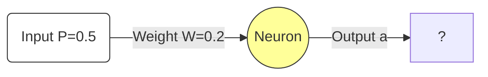

Here is a complete, step-by-step numerical example. This is designed to show you exactly how the formula derived in the previous notes is applied in a real calculation.

We will use the **Tanh (Hyperbolic Tangent)** activation function, as this matches the complex derivation on **Page 7** of your slides.

---

### 6. Gradient Descent - Complete Numerical Example

**Filename:** `6. Gradient Descent - Complete Numerical Example.md`

#### **1. The Scenario**

We have a single neuron with one input. We want to train it for **one single iteration**.

**Initial Parameters:**
*   **Input ($P$):** $0.5$
*   **Initial Weight ($W$):** $0.2$
*   **Target Output ($d$):** $0.8$ (We want the neuron to output 0.8)
*   **Learning Rate ($\eta$):** $0.1$
*   **Activation Function:** $f(n) = \tanh(n)$

**Goal:** Update the weight $W$ so the output gets closer to $0.8$.

---

#### **2. Step 1: The Forward Pass**
First, we must calculate what the neuron *currently* thinks.

1.  **Calculate Net Input ($n$):**
    $$ n = W \times P $$
    $$ n = 0.2 \times 0.5 = 0.1 $$

2.  **Calculate Output ($a$):**
    Apply the activation function ($\tanh$).
    $$ a = \tanh(0.1) $$
    $$ a \approx 0.0996 $$

> [!INFO] **Current Status**
> The network output is **0.0996**.
> The target is **0.8**.
> The network is currently outputting a value that is *too low*. We expect the weight to *increase*.

---

#### **3. Step 2: Calculate Error**
How wrong is the network?

$$ e = \text{Target} - \text{Output} $$
$$ e = 0.8 - 0.0996 = 0.7004 $$

*   **$e \approx 0.7004$**

---

#### **4. Step 3: Calculate the Derivative (Slope)**
We need to know the slope of the Tanh curve at our current position ($n=0.1$).
From our previous derivation note, we know the derivative of Tanh is $(1 - \text{output}^2)$.

$$ f'(n) = 1 - a^2 $$
$$ f'(n) = 1 - (0.0996)^2 $$
$$ f'(n) = 1 - 0.0099 $$
$$ f'(n) = 0.9901 $$

*   **Slope $\approx 0.9901$**

---

#### **5. Step 4: The Backward Pass (Weight Update)**
Now we use the **Grand Formula** derived from the Chain Rule.

**The Formula:**
$$ \Delta W = \eta \cdot e \cdot f'(n) \cdot P $$

**Plug in the numbers:**
1.  **$\eta$ (Learning Rate):** $0.1$
2.  **$e$ (Error):** $0.7004$
3.  **$f'(n)$ (Slope):** $0.9901$
4.  **$P$ (Input):** $0.5$

$$ \Delta W = 0.1 \times 0.7004 \times 0.9901 \times 0.5 $$

**Calculate:**
$$ \Delta W = 0.1 \times 0.3467 $$
$$ \Delta W = 0.0347 $$

*   **The Adjustment ($\Delta W$) is $+0.0347$.**

---

#### **6. Step 5: Final Update**
Apply the change to the old weight.

$$ W_{new} = W_{old} + \Delta W $$
$$ W_{new} = 0.2 + 0.0347 $$
$$ W_{new} = 0.2347 $$

---

#### **7. Verification (Did it work?)**
Let's see if this new weight actually improves the result.
Let's run a "Forward Pass" again with **$W = 0.2347$**.

1.  **New Net Input:** $0.2347 \times 0.5 = 0.11735$
2.  **New Output:** $\tanh(0.11735) \approx 0.1168$

**Comparison:**
*   **Old Output:** $0.0996$
*   **New Output:** $0.1168$
*   **Target:** $0.8$

**Conclusion:** The output moved from $0.0996$ up to $0.1168$. It got closer to the target ($0.8$). The Gradient Descent step was **correct**.