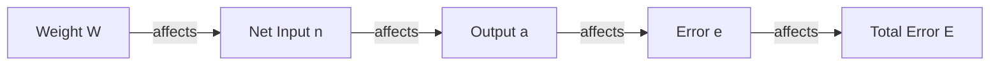

Here are the polished, structured Obsidian notes explaining the mathematics of Gradient Descent, based specifically on **Pages 6 and 7** of your provided material, with additional context to ensure complete understanding.

---

### 1. Gradient Descent Fundamentals

**Filename:** `1. Gradient Descent Fundamentals.md`

#### **1. Introduction**
Gradient Descent is the core optimization algorithm used in Machine Learning (specifically Neural Networks) to "learn."
In the context of the provided slides (Page 1 & 7), "Learning" mathematically means **updating the weights ($W_{ij}$)** of the neural network to minimize the difference between the network's output and the real (expected) output.

#### **2. The Goal: Minimizing Error**
Before understanding the movement (descent), we must understand the landscape (the error function).
*   **$W$ (Weights):** The adjustable parameters of the network.
*   **$E$ (Error):** A function that measures how "wrong" the network is.

The goal is to find the specific set of weights $W$ where $E$ is at its lowest possible point (Global Minimum).

#### **3. Types of Learning Updates**
According to **Page 6**, there are two ways to apply this algorithm:

1.  **Incremental Learning (Stochastic):**
    *   Weights are updated after presenting **one simple** (single data point) at a time.
    *   Formula: $E(k) = \frac{1}{2} e_i^2(k)$
2.  **Batch Learning:**
    *   Weights are updated only after presenting **all $K$ samples** (the whole dataset).
    *   Formula: $E = \frac{1}{K} \sum_{k=1}^{K} E^2(k)$ (Mean Square Error).

> [!TIP] **Student Tip: Why $\frac{1}{2}$?**
> You will often see the error defined as $E = \frac{1}{2}(y - output)^2$.
> Why the $\frac{1}{2}$? It is a mathematical convenience. When we take the derivative of the squared error during Gradient Descent, the power of $2$ comes down and cancels out the $\frac{1}{2}$, making the math cleaner. It does not affect the location of the minimum.

---

### 2. The Weight Update Formula

**Filename:** `2. The Weight Update Formula.md`

This note dissects the fundamental equation found on **Page 7**.

#### **1. The General Update Equation**
To teach the network, we adjust the weights from the current iteration ($k$) to the next iteration ($k+1$).

$$ W_{ij}(k+1) = W_{ij}(k) + \Delta W_{ij}(k) $$

**Dissection:**
*   **$W_{ij}(k+1)$**: The *new* weight value.
*   **$W_{ij}(k)$**: The *old* (current) weight value.
*   **$\Delta W_{ij}(k)$**: The "Delta" or the **change** applied to the weight.

---

#### **2. The Delta Rule ($\Delta W$)**
The magic lies in calculating $\Delta W$. How much do we change the weight, and in which direction?

$$ \Delta W_{ij}(k) = -\eta \cdot \frac{\partial E(k)}{\partial W_{ij}(k)} $$

**Dissection - Part by Part:**

1.  **The Negative Sign ($-$)**:
    *   **Meaning:** We want to go *downhill*.
    *   **Reasoning:** The gradient ($\frac{\partial E}{\partial W}$) points in the direction of the steepest *increase* in error. Since we want to *decrease* error, we subtract the gradient.

2.  **$\eta$ (Eta) - The Learning Rate**:
    *   **Definition:** A scalar value between 0 and 1 ($\eta \in ]0, 1]$).
    *   **Function:** It controls the "step size."
        *   If $\eta$ is too big: You might overstep the minimum and diverge.
        *   If $\eta$ is too small: Learning is very slow.

3.  **$\frac{\partial E(k)}{\partial W_{ij}(k)}$ - The Gradient**:
    *   **Definition:** The partial derivative of the Error with respect to the specific Weight ($W_{ij}$).
    *   **Meaning:** "If I nudge weight $W_{ij}$ slightly, how much does the Total Error change?"

---

### 3. Deriving the Gradient (The Chain Rule)

**Filename:** `3. Deriving the Gradient via Chain Rule.md`

This is the most complex part of **Page 7**, explained step-by-step using the **Chain Rule**. We cannot calculate $\frac{\partial E}{\partial W}$ directly because $E$ doesn't touch $W$ directly. We must go through the layers.

#### **1. The Architecture of Dependencies**
To understand the math, look at the flow of data:
`Input (P) -> Weighted Sum (n) -> Activation Output (a) -> Error (E)`

#### **2. The Chain Rule Formula**
We break the derivative into three linkable parts:

$$ \frac{\partial E}{\partial W_{ij}} = \underbrace{\frac{\partial E}{\partial e_i}}_{\text{Part A}} \cdot \underbrace{\frac{\partial e_i}{\partial a_i} \cdot \frac{\partial a_i}{\partial n_i}}_{\text{Part B}} \cdot \underbrace{\frac{\partial n_i}{\partial W_{ij}}}_{\text{Part C}} $$

*(Note: In the slides, $y_i$ is used effectively as $a_i$ or output output)*.

---

#### **3. Dissecting the Parts**

**Part A: Derivative of Error w.r.t Error Term**
Given $E = \frac{1}{2}e_i^2$:
$$ \frac{\partial E}{\partial e_i} = e_i $$

**Part B: Derivative of Error Term w.r.t Net Input**
*   We know $e_i = (y_{target} - a_{output})$.
*   Therefore, the change in error w.r.t output is $-1$.
*   However, the slides simplify this by looking at the derivative of the output function itself.
*   Let's denote the activation function derivative as $f'(n_i)$.

**Part C: Derivative of Net Input w.r.t Weight**
*   The Net Input is $n_i = \sum (W_{ij} \cdot P_j)$.
*   If we differentiate this sum with respect to **one** specific weight $W_{ij}$, all other terms become zero.
*   We are left with the input associated with that weight: **$P_j$** (Input from previous layer).

---

#### **4. Putting it Together (The Final Formula)**
Combining Parts A, B, and C as shown on Page 7:

$$ \Delta W_{ij}(k) = \eta \cdot \underbrace{e_i(k)}_{\text{Error}} \cdot \underbrace{f'(n_i)}_{\text{Slope}} \cdot \underbrace{P_j(k)}_{\text{Input}} $$

*   **$\eta$:** Learning Rate.
*   **$e_i$:** The error (Target - Output).
*   **$f'(n_i)$:** The derivative of the activation function (gradient of the curve).
*   **$P_j$:** The input value coming into that connection.

> [!INFO] **Background Knowledge: The "Local Gradient"**
> Often, the terms $e_i(k) \cdot f'(n_i)$ are grouped together and called $\delta$ (delta).
> This represents the "responsibility" of that specific neuron for the error.

---

### 4. Worked Example: Tanh Activation

**Filename:** `4. Worked Example - Tanh Activation.md`

**Page 7** provides a specific example using the **Hyperbolic Tangent (tanh)** function. Here is the detailed breakdown of that derivation.

#### **1. The Function**
$$ f(n) = \tanh(n) = \frac{e^{n} - e^{-n}}{e^{n} + e^{-n}} $$

#### **2. The Derivative ($f'(n)$)**
To use Gradient Descent, we need the derivative of this function.
The derivative of $\tanh(n)$ is a known identity:
$$ f'(n) = 1 - (f(n))^2 $$
Or, written using the output variable $a$:
$$ f'(n) = 1 - a^2 $$

> [!WARNING] **The Math in the Slides**
> The slides (Page 7) show a complex fraction derivation:
> $\frac{\partial}{\partial n} (\frac{e^{2n}-1}{e^{2n}+1})$
>
> While mathematically correct, it simplifies to the identity above. The key takeaway for the exam is the result: **$1 - \text{output}^2$**.

#### **3. Final Update Rule for Tanh**
Substituting the Tanh derivative back into our main update formula:

$$ \Delta W_{ij} = \eta \cdot e_i(k) \cdot \underbrace{[1 - a_i(k)^2]}_{\text{Derivative of Tanh}} \cdot P_j(k) $$

**Interpretation:**
1.  Calculate the error ($e_i$).
2.  Calculate how "sensitive" the neuron is at its current activation level ($1 - a^2$).
    *   *Note: If output $a$ is near +1 or -1, the slope is near 0. Learning stops. This is called the "Vanishing Gradient" problem.*
3.  Multiply by the input ($P_j$) that caused this activation.
4.  Scale by learning rate $\eta$.
5.  Add this result to the old weight.

#### **4. Summary of Variables (Page 7 notation)**
*   $i = 1 \dots S$ (Number of output neurons).
*   $j = 1 \dots R$ (Number of inputs/previous neurons).
*   $P_j$: Input vector.
*   $e_i$: Error vector.