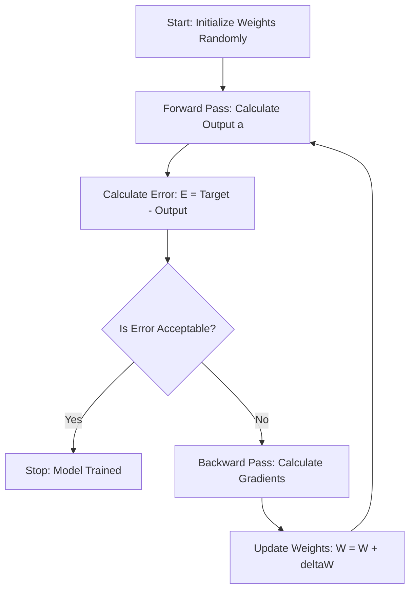
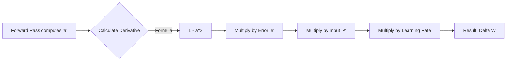

Here are the detailed, structured Obsidian notes covering **Gradient Descent** and **Backpropagation** based on pages 6 and 7 of your provided material, enriched with the context from the earlier pages.

---

### 1. Gradient Descent and Learning Basics

This note explains the fundamental theory behind how a neural network "learns" by minimizing error. It covers the types of learning strategies (Batch vs. Incremental) and the definitions of error.

#### **1. Introduction to Learning**
In the context of Neural Networks (like the Multi-Layer Perceptron - MLP), "Learning" is the process of adjusting the weights ($W$) and biases ($b$) to minimize the difference between the **actual output** predicted by the network and the **desired target output**.

> [!INFO] Key Concept
> The network is not "smart" on its own. The "intelligence" comes from the mathematical algorithm (Gradient Descent) that iteratively updates the weights to reduce error.

#### **2. Forward Calculation (Recall)**
Before we can update weights, we must calculate the current state. Based on Page 6, the calculation flows as follows:
1.  **Net Input ($n$):** The weighted sum of inputs plus bias.
    $$ n_j = \sum (x_i \cdot w_{ij}) + b $$
2.  **Activation ($a$):** The result of passing the net input through an activation function (like Sigmoid or Tanh).
    $$ a_j = f(n_j) $$

#### **3. Calculating Error**
To know how much to adjust the weights, we first quantify how "wrong" the network is.

**Notation:**
*   $t_i$ (or $y_{desired}$): The target value (Truth).
*   $a_i$ (or $y_{out}$): The computed output from the network.
*   $e_i(k)$: The error for a specific neuron $i$ at iteration $k$.

**The Error Formula:**
$$ e_i(k) = t_i(k) - a_i(k) $$

**Total Error (Cost Function):**
To measure the performance of the whole layer or dataset, we usually square the error (to remove negative signs and punish large errors more severely).
$$ E(k) = \frac{1}{2} \sum (t_i - a_i)^2 $$
*(Note: The factor $\frac{1}{2}$ is often added to make the derivative cleaner later on, as $\frac{d}{dx} x^2 = 2x$, which cancels the $\frac{1}{2}$.)*

#### **4. Types of Learning (Weight Update Strategies)**
Page 6 distinguishes between two major approaches to updating weights.

**A. Incremental Learning (Stochastic)**
*   **Method:** The weights are updated **immediately** after presenting **one single sample** (one row of data).
*   **Process:**
    1. Input sample 1 $\rightarrow$ Calculate Error $\rightarrow$ Update Weights.
    2. Input sample 2 $\rightarrow$ Calculate Error $\rightarrow$ Update Weights.
*   **Pros:** Can converge faster for large datasets; escapes local minima easier.
*   **Cons:** The error path is "noisy" (zig-zags).

**B. Batch Learning**
*   **Method:** The weights are updated only after presenting **all $K$ samples** (the entire dataset or a large batch).
*   **Process:**
    1. Calculate error for Sample 1.
    2. Calculate error for Sample 2...
    3. Sum all errors (Mean Square Error).
    4. Update Weights **once** based on the average gradient.
*   **Formula (Mean Square Error - MSE):**
    $$ E = \frac{1}{K} \sum_{k=1}^{K} E(k) $$

#### **5. Visualizing the Process**

---

### 2. Backpropagation and The Chain Rule

This note details the mathematical derivation of the **Delta Rule** used to update weights, specifically focusing on the Chain Rule as presented on Page 7.

#### **1. The Goal of Backpropagation**
We want to change a specific weight $W_{ij}$ to reduce the total Error $E$. To do this, we need to find the **derivative** (gradient) of the Error with respect to that Weight.

$$ \frac{\partial E}{\partial W_{ij}} $$

This value tells us: *"If I increase weight $W_{ij}$ slightly, how does the Error change?"*

#### **2. The Weight Update Formula (Delta Rule)**
The general formula for updating a weight at iteration $k+1$ is:

$$ W_{ij}(k+1) = W_{ij}(k) + \Delta W_{ij}(k) $$

Where the change in weight ($\Delta W$) is defined by the Gradient Descent law:

$$ \Delta W_{ij}(k) = - \eta \cdot \frac{\partial E(k)}{\partial W_{ij}(k)} $$

*   **$\eta$ (Eta):** The **Learning Rate**. A value usually between $[0, 1]$.
    *   If $\eta$ is too small: Learning is very slow.
    *   If $\eta$ is too large: The model might overshoot the minimum and never converge.
*   **Minus Sign $(-)$:** We move in the *opposite* direction of the gradient to *minimize* error.

#### **3. Deriving the Gradient using the Chain Rule**
Since $E$ is not directly a function of $W$ (it goes through the activation $a$ and the net input $n$), we must use the **Chain Rule** to link them.

**The Chain:**
1.  Error $E$ depends on Output $a$.
2.  Output $a$ depends on Net Input $n$.
3.  Net Input $n$ depends on Weight $W$.

**The Derivation (Step-by-Step):**

$$ \frac{\partial E}{\partial W_{ij}} = \underbrace{\frac{\partial E}{\partial a_i}}_{\text{Part 1}} \cdot \underbrace{\frac{\partial a_i}{\partial n_i}}_{\text{Part 2}} \cdot \underbrace{\frac{\partial n_i}{\partial W_{ij}}}_{\text{Part 3}} $$

Let's break down the three parts from the handwritten notes (Page 7):

**Part 1: Change in Error w.r.t Output**
Given $E = \frac{1}{2}(t - a)^2$:
$$ \frac{\partial E}{\partial a_i} = -(t_i - a_i) = -e_i $$
*(Note: The notes simplify this term directly into the standard Delta rule format, treating the error term $e_i$ as the driver).*

**Part 2: Change in Output w.r.t Net Input (Derivative of Activation)**
This depends on the function $f(n)$.
$$ \frac{\partial a_i}{\partial n_i} = f'(n_i) $$

**Part 3: Change in Net Input w.r.t Weight**
Since $n_i = \sum W_{ij} P_j + b$:
$$ \frac{\partial n_i}{\partial W_{ij}} = P_j $$
*(Where $P_j$ is the input from the previous layer connected to this weight).*

#### **4. The Final Update Equation**
Combining the parts:

$$ \Delta W_{ij} = \eta \cdot \underbrace{e_i(k)}_{\text{Error}} \cdot \underbrace{f'(n_i)}_{\text{Slope}} \cdot \underbrace{P_j}_{\text{Input}} $$

> [!TIP] Memory Aid
> To update a weight connecting Neuron A to Neuron B:
> **New Weight = Old Weight + (Learning Rate × Error of B × Derivative of B × Output of A)**

---

### 3. Mathematical Example with Tanh Function

This note focuses on the specific mathematical derivation found on Page 7, where the activation function is the **Hyperbolic Tangent (Tanh)**. This is a common exam question format.

#### **1. The Activation Function: Tanh**
The problem specifies the activation function:
$$ f(n) = \tanh(n) = \frac{e^n - e^{-n}}{e^n + e^{-n}} $$

#### **2. Calculating the Derivative $f'(n)$**
To perform backpropagation, we need the derivative of this function.
Recall the quotient rule: $(\frac{u}{v})' = \frac{u'v - v'u}{v^2}$.

Let $u = e^n - e^{-n}$ and $v = e^n + e^{-n}$.
*   $u' = e^n - (-e^{-n}) = e^n + e^{-n}$
*   $v' = e^n + (-e^{-n}) = e^n - e^{-n}$

Applying the quotient rule:
$$ f'(n) = \frac{(e^n + e^{-n})(e^n + e^{-n}) - (e^n - e^{-n})(e^n - e^{-n})}{(e^n + e^{-n})^2} $$

$$ f'(n) = \frac{(e^n + e^{-n})^2 - (e^n - e^{-n})^2}{(e^n + e^{-n})^2} $$

$$ f'(n) = 1 - \left( \frac{e^n - e^{-n}}{e^n + e^{-n}} \right)^2 $$

**Key Identity:**
Since $f(n) = \frac{e^n - e^{-n}}{e^n + e^{-n}}$, we can simplify the derivative to:
$$ f'(n) = 1 - (f(n))^2 $$
Or in the notation of output $a$:
$$ f'(n) = 1 - a^2 $$

> [!IMPORTANT] Exam Note
> This derivation allows the computer to calculate the gradient extremely fast because it already knows $a$ (the output) from the forward pass. It doesn't need to recalculate exponentials.

#### **3. Applying to the Update Rule**
Using the chain rule established in the previous note, and substituting the specific derivative for Tanh.

**For the Output Layer:**
Let $e_i(k)$ be the error at the output.
The update for weight $W_{ij}$ is:

$$ \Delta W_{ij}(k) = \eta \cdot e_i(k) \cdot (1 - a_i(k)^2) \cdot P_j(k) $$

*   $\eta$: Learning Rate.
*   $e_i$: Difference between target and actual output.
*   $(1 - a_i^2)$: The derivative of Tanh (gradient of the neuron).
*   $P_j$: The input coming into this weight.

#### **4. Numeric Example (Hypothetical reconstruction from Page 7 logic)**
If:
*   Target $t = 1$
*   Output $a = 0.6$
*   Input $P = 0.5$
*   Learning Rate $\eta = 0.1$

**Step 1: Calculate Error**
$e = t - a = 1 - 0.6 = 0.4$

**Step 2: Calculate Derivative (Tanh)**
$f'(n) = 1 - a^2 = 1 - (0.6)^2 = 1 - 0.36 = 0.64$

**Step 3: Calculate Weight Change**
$\Delta W = 0.1 \times 0.4 \times 0.64 \times 0.5$
$\Delta W = 0.0128$

**Step 4: Update Weight**
$W_{new} = W_{old} + 0.0128$

#### **5. Summary Flowchart for Tanh Backprop**

