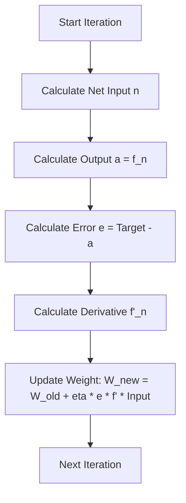

Here are the complete, detailed notes covering the mathematics of Gradient Descent and its derivation as shown in your slides (specifically Pages 6 and 7).

I have structured this to first explain the symbols, then the "Chain Rule" logic (answering your question about "wrt"), and finally the specific derivation for the Tanh function found on the slide.

---

### 1. Mathematical Notation and Symbols

**Filename:** `1. Mathematical Notation and Symbols.md`

Before solving the equations, we must define the "vocabulary" used in **Page 6 and 7**. If you misunderstand a symbol, the math will not make sense.

#### **Variables Definitions**
*   **$W_{ij}$ (Weight):** The strength of the connection between input neuron $j$ and output neuron $i$. This is what the network "learns" by changing.
*   **$k$ (Iteration):** Time step. $W(k)$ is the weight now; $W(k+1)$ is the weight after the update.
*   **$P_j$ (Input Pattern):** The input data entering the neuron (e.g., a pixel value or a feature).
*   **$n_i$ (Net Input):** The weighted sum calculated inside the neuron before activation.
    $$ n_i = \sum (W_{ij} \cdot P_j) + \text{bias} $$
*   **$a_i$ or $y_i$ (Output):** The final result coming out of the neuron after the activation function is applied.
*   **$d_i$ or $g_i$ (Target):** The "desired" or correct answer we want the network to produce.
*   **$e_i$ (Error Signal):** The difference between the Target and the Output.
    $$ e_i = d_i - a_i $$
*   **$\eta$ (Eta - Learning Rate):** A small number (e.g., 0.01) that controls how big our steps are.

---

### 2. The Core Logic: Gradient Descent

**Filename:** `2. The Core Logic - Gradient Descent.md`

#### **1. The Goal**
We want to minimize the **Total Error ($E$)**.
To do this, we must adjust the weights ($W$). The question is: **"In which direction do we move $W$, and by how much?"**

#### **2. The Update Formula**
This is the fundamental equation of learning (Page 7, top left):

$$ W(k+1) = W(k) + \Delta W(k) $$

*   **$W(k)$**: The old weight.
*   **$\Delta W(k)$**: The adjustment (Delta).

#### **3. Calculating Delta ($\Delta W$)**
To find the adjustment, we use the derivative. We want to move *against* the slope of the error.

$$ \Delta W = - \eta \cdot \frac{\partial E}{\partial W} $$

*   **The Negative Sign ($-$)**: Meaning "Go downhill" (minimize error).
*   **$\frac{\partial E}{\partial W}$**: The Gradient. This reads as "The change in Error **with respect to** the change in Weight."

---

### 3. Deriving the Gradient (The Chain Rule)

**Filename:** `3. Deriving the Gradient via Chain Rule.md`

This is the detailed explanation of the complex formulas on **Page 7**.

#### **1. Why use the Chain Rule?**
We want to calculate $\frac{\partial E}{\partial W}$ (Change in Error wrt Weight).
However, $W$ is deep inside the equation.
1.  $W$ affects the Net Input ($n$).
2.  $n$ affects the Output ($a$).
3.  $a$ affects the Error ($E$).

We must multiply the derivatives of these three steps. This is the **Chain Rule**.

#### **2. The Chain Rule Formula**
$$ \frac{\partial E}{\partial W_{ij}} = \frac{\partial E}{\partial a_i} \cdot \frac{\partial a_i}{\partial n_i} \cdot \frac{\partial n_i}{\partial W_{ij}} $$

Let's break down each of the three terms (Links):

#### **Link 1: $\frac{\partial E}{\partial a_i}$ (Error wrt Output)**
*   **Concept:** How much does the total error change if the output changes?
*   **Math:**
    *   Assume $E = \frac{1}{2}(Target - Output)^2$.
    *   The derivative moves the 2 down, canceling the $\frac{1}{2}$.
    *   We are left with $-(Target - Output)$, which is the negative Error ($-e_i$).
*   **Result:** This term represents the **Error Magnitude**.

#### **Link 2: $\frac{\partial a_i}{\partial n_i}$ (Output wrt Net Input)**
*   **Concept:** How much does the output change if the sum inside the neuron changes?
*   **Math:** This depends entirely on the Activation Function used (Sigmoid, Tanh, ReLU).
*   **Result:** This is the slope of the activation function, written as **$f'(n)$**.

#### **Link 3: $\frac{\partial n_i}{\partial W_{ij}}$ (Net Input wrt Weight)**
*   **Concept:** How much does the internal sum change if we tweak one weight?
*   **Math:**
    *   Formula for Net Input: $n_i = W_{i1}P_1 + W_{i2}P_2 + \dots$
    *   If we differentiate with respect to $W_{ij}$, all other terms disappear except the input $P_j$ attached to that weight.
*   **Result:** This is simply the **Input Value ($P_j$)**.

---

### 4. The Final Update Equation

**Filename:** `4. The Final Update Equation.md`

Now we combine the links from the previous note.

$$ \frac{\partial E}{\partial W} = (-e_i) \cdot (f'(n_i)) \cdot (P_j) $$

Substitute this back into our Delta formula ($\Delta W = -\eta \cdot \text{Gradient}$).
The two negative signs cancel out ($-\eta \times -e_i$).

#### **The Grand Formula (Memorize This)**

$$ \Delta W_{ij} = \eta \cdot \underbrace{e_i}_{\text{Error}} \cdot \underbrace{f'(n_i)}_{\text{Slope}} \cdot \underbrace{P_j}_{\text{Input}} $$

**In simple English:**
"To update a weight, multiply the **Learning Rate** by the **Error**, multiply that by the **steepness of the curve**, and multiply that by the **Input** that came through that connection."

---

### 5. Detailed Example: Tanh Function

**Filename:** `5. Detailed Example - Tanh Function.md`

**Page 7** devotes half the page to this specific example. Here is the step-by-step breakdown.

#### **1. The Activation Function**
The Hyperbolic Tangent (Tanh) maps inputs to a range between -1 and 1.
$$ f(n) = \tanh(n) = \frac{e^{n} - e^{-n}}{e^{n} + e^{-n}} $$

#### **2. The Derivative (The Hard Math on Slide 7)**
We need $f'(n)$ for our update formula.
The slide performs a derivation involving exponentials. However, there is a famous trigonometric identity for the derivative of Tanh:

$$ \frac{d}{dn} \tanh(n) = 1 - \tanh^2(n) $$

Since the output of the neuron $a_i = \tanh(n)$, we can substitute:

$$ f'(n) = 1 - a_i^2 $$

> [!NOTE] **Why is this cool?**
> We don't need to do complex calculus during the computer simulation. We just take the current output ($a_i$), square it, and subtract it from 1. That gives us the slope!

#### **3. The Tanh Update Rule**
Substituting $(1 - a_i^2)$ into our Grand Formula:

$$ \Delta W_{ij} = \eta \cdot e_i(k) \cdot \underbrace{[1 - a_i(k)^2]}_{\text{Derivative term}} \cdot P_j(k) $$

#### **4. Slide Walkthrough (Page 7 - Bottom Right)**
The slide writes:
$$ \Delta W_{ij}(k) = 2 \cdot \eta \cdot e_i(k) \dots $$
*Wait, where did the 2 come from?*
Sometimes, the Sigmoid or Tanh definitions vary slightly (e.g., using $2n$ instead of $n$).
*   If $f(n) = \tanh(n)$, derivative is $1 - a^2$.
*   If $f(n) = \tanh(2n)$, derivative is $2(1 - a^2)$.

**Key Takeaway for Exam:**
Look closely at the formula provided in the exam question.
1.  Identify the activation function.
2.  Find its derivative.
3.  Plug it into the slot: $\Delta W = \eta \cdot \text{Error} \cdot \mathbf{Derivative} \cdot \text{Input}$.

