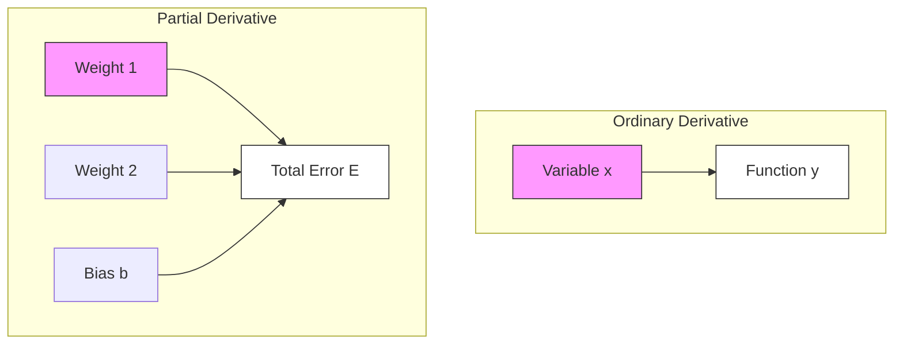

Based on your request, here is a detailed note specifically explaining the mathematical notation found in the Backpropagation chapter. This concept is crucial for understanding **why** the formulas look the way they do on Pages 6 and 7.

---

### 4. Mathematical Foundation: Partial vs. Ordinary Derivatives

This note clarifies the difference between the standard derivative symbol ($d$) and the "curly d" symbol ($\partial$) used in Neural Networks.

#### **1. The Symbols**

*   **$d$ (Ordinary Derivative):** Used when a function depends on **only one** variable.
    *   Example: $y = f(x)$. If $x$ changes, $y$ changes. There is no other factor.
*   **$\partial$ (Partial Derivative):** Used when a function depends on **multiple** variables.
    *   Example: $z = f(x, y)$. The value of $z$ depends on both $x$ and $y$.
    *   Pronounced "Del", "Partial", or "Curly D".

#### **2. Why Neural Networks Use $\partial$**

Look at the Neural Network structure on Page 4 or 5. The Total Error ($E$) of the network doesn't depend on just one weight. It depends on **hundreds or thousands** of weights ($W_{11}, W_{12}, W_{21}...$) and biases ($b_1, b_2...$).

Because the Error is a function of *many* variables, we cannot use a normal derivative. We must use **Partial Derivatives**.

> [!INFO] The Intuitive Meaning
> When we write $\frac{\partial E}{\partial W_{ij}}$, we are asking:
>
> **"If I change *only* this specific weight ($W_{ij}$) by a tiny amount, while holding ALL other weights completely frozen (constant), how much does the Error ($E$) change?"**
>
> This allows us to isolate the "blame" (or contribution) of a single connection without worrying about the rest of the network for that specific calculation.

#### **3. The Calculation Rule (The "Constant" Trick)**

The mechanics of calculating a partial derivative are exactly the same as a normal derivative, with one **critical rule**:

**Rule:** When calculating the partial derivative with respect to one variable (e.g., $x$), treat **all other variables (e.g., $y, z$) as if they are just numbers (constants).**

**Mathematical Example:**
Imagine a function:
$$ f(x, y) = x^2 + 3xy + y^2 $$

**Scenario A: Find $\frac{\partial f}{\partial x}$** (Change in function relative to $x$)
1.  Treat $y$ as a constant (like the number 5).
2.  Derivative of $x^2$ is $2x$.
3.  Derivative of $3xy$: Since $3$ and $y$ are constants, they stay. Derivative of $x$ is 1. Result: $3y$.
4.  Derivative of $y^2$: Since $y$ is a constant, $y^2$ is a constant (like 25). Derivative of a constant is **0**.
    $$ \frac{\partial f}{\partial x} = 2x + 3y $$

**Scenario B: Find $\frac{\partial f}{\partial y}$** (Change in function relative to $y$)
1.  Treat $x$ as a constant.
2.  Derivative of $x^2$ is **0** (it's a constant now).
3.  Derivative of $3xy$: $3x$ is constant. Derivative of $y$ is 1. Result: $3x$.
4.  Derivative of $y^2$ is $2y$.
    $$ \frac{\partial f}{\partial y} = 3x + 2y $$

#### **4. Application to Your Slide (Page 7)**

On Page 7 (and in the crop you sent), you see this term inside the Chain Rule:

$$ \frac{\partial n_i}{\partial W_{ij}} $$

Let's break down why the result is what it is.

**Recall the formula for Net Input ($n_i$):**
$$ n_i = W_{i1} \cdot x_1 + W_{i2} \cdot x_2 + W_{i3} \cdot x_3 + ... + b $$

If we want to find the gradient for Weight 1 ($W_{i1}$):
$$ \frac{\partial n_i}{\partial W_{i1}} $$

1.  We look at the first term $W_{i1} \cdot x_1$. The derivative with respect to $W_{i1}$ is just **$x_1$**.
2.  We look at the second term $W_{i2} \cdot x_2$. Since we are focusing on $W_{i1}$, **$W_{i2}$ is treated as a constant**. The whole term becomes 0.
3.  The bias $b$ is treated as a constant. It becomes 0.

**Result:**
$$ \frac{\partial n_i}{\partial W_{ij}} = x_j \quad (\text{or } P_j \text{ in your notes}) $$

This is why the complicated sum formula disappears and leaves only the specific input connected to that weight.

#### **5. Visualizing the Difference**

*   **Left Side (Ordinary):** One path. Changing $x$ accounts for 100% of the change in $y$.
*   **Right Side (Partial):** Many paths. Changing "Weight 1" only accounts for a *part* of the change in $E$. We use $\partial$ to signify we are ignoring the contributions of Weight 2 and Bias for a moment.

#### **6. Summary for Exam**
*   **Symbol:** $\partial$ means "Partial Derivative".
*   **When to use:** When calculating Error in a Neural Network (because Error depends on many weights).
*   **How to solve:** Pretend every variable except the one you are calculating for is a plain number (constant).
    *   If the term doesn't contain your variable, it becomes **Zero**.
    *   If the term is multiplied by your variable, only the multipliers remain.