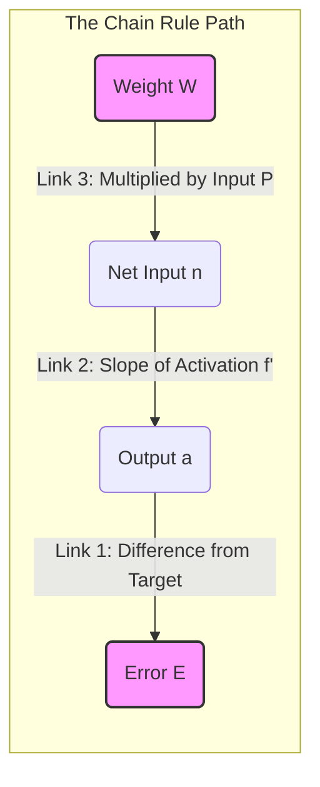

Here is a specific, detailed note to clear up the confusion about "wrt" and the Chain Rule. This is often the biggest stumbling block in understanding neural networks, so we will break it down into plain English before looking at the math.

---

### 5. Understanding the Math Notation (Chain Rule & wrt)

**Filename:** `5. Understanding the Math Notation.md`

#### **1. What does "wrt" mean?**

**"wrt"** stands for **"With Respect To"**.

In calculus and machine learning, we are always measuring **change**. But things depend on many different factors. "With respect to" tells you specifically which factor we are looking at right now.

**Analogy:**
Imagine you are driving a car.
*   If you press the gas pedal harder, the car goes faster.
    *   Math: The change in **Speed** *with respect to* **Gas Pedal Pressure**.
*   If the road goes uphill, the car slows down.
    *   Math: The change in **Speed** *with respect to* **Road Incline**.

In Gradient Descent:
We want to know: "How does the **Error ($E$)** change **with respect to** the **Weight ($W$)**?"
*   Notation: $\frac{\partial E}{\partial W}$
*   Meaning: If I wiggle this weight $W$ just a tiny bit, how much does the Error $E$ go up or down?

---

#### **2. The Chain Rule: The "Blame Game"**

The **Chain Rule** is used when two things are connected, but not directly.

**The Problem:**
You want to know how the **Weight ($W$)** affects the **Error ($E$)**.
But the Weight doesn't touch the Error directly. There are steps in between.

**The Flow of the Network:**
1.  The **Weight ($W$)** determines the strength of the signal entering the neuron (Net Input $n$).
2.  The **Net Input ($n$)** determines what the neuron outputs (Activation $a$).
3.  The **Output ($a$)** is compared to the target to calculate the **Error ($E$)**.

$$ \text{Weight } W \rightarrow \text{Net Input } n \rightarrow \text{Output } a \rightarrow \text{Error } E $$

**The Logic:**
If we want to know the relationship between the first item ($W$) and the last item ($E$), we have to multiply the relationships of every step in between.

**The Formula (In English):**
$$ (\text{Effect of } W \text{ on } E) = (\text{Effect of } W \text{ on } n) \times (\text{Effect of } n \text{ on } a) \times (\text{Effect of } a \text{ on } E) $$

---

#### **3. Dissecting the Formula on Page 7**

Now let's look at the math symbols from your slide again.

$$ \frac{\partial E}{\partial W_{ij}} = \frac{\partial E}{\partial a_i} \cdot \frac{\partial a_i}{\partial n_i} \cdot \frac{\partial n_i}{\partial W_{ij}} $$

*(Note: Sometimes $y$ is used instead of $a$, and $e$ instead of $E$, but the structure is identical).*

Let's break this chain into its three links:

**Link 1: $\frac{\partial E}{\partial a_i}$ (Error wrt Output)**
*   **Question:** If the Output changes, how much does the Error change?
*   **Calculation:** The Error is usually $(Target - Output)$. So if Output goes up, Error goes down.
*   **Result in Slide:** This gives us the term $e_i$ (or strictly $-e_i$, but the negative is handled in the update rule).

**Link 2: $\frac{\partial a_i}{\partial n_i}$ (Output wrt Net Input)**
*   **Question:** If the incoming signal (Net Input) changes, how much does the actual Output change?
*   **Context:** This depends on the **Activation Function** (like Sigmoid, Tanh, or ReLU).
*   **Calculation:** This is the slope (derivative) of the activation curve.
*   **Result in Slide:** This gives us the term $f'(n)$.

**Link 3: $\frac{\partial n_i}{\partial W_{ij}}$ (Net Input wrt Weight)**
*   **Question:** If we change the Weight, how much does the Net Input change?
*   **Calculation:** Since $n = W \cdot P$ (Weight $\times$ Input), the derivative is just the Input $P$.
*   **Result in Slide:** This gives us the term $P_j$ (The input value).

---

#### **4. Summary Diagram**

Here is how the Chain Rule connects the "Start" (Weight) to the "End" (Error).

**Final Conclusion:**
When the slide says:
$$ \Delta W = \eta \cdot e_i \cdot f'(n) \cdot P_j $$
It is simply multiplying the three links of the chain together so we know exactly how to adjust the weight to fix the error.