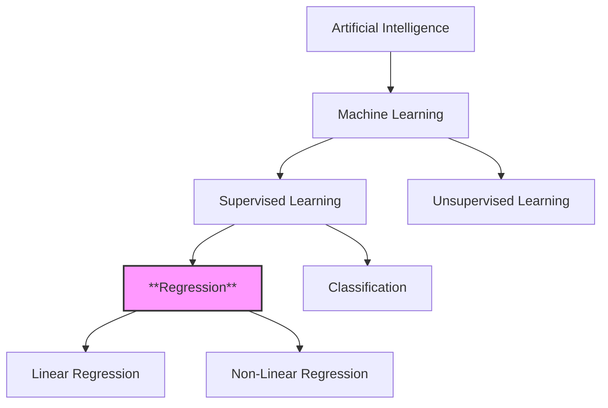
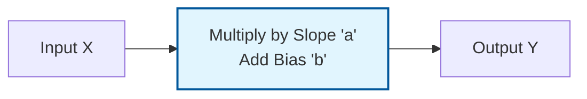
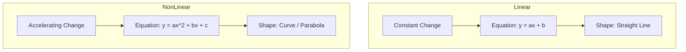

# 1. Regression Fundamentals

## Overview
Regression is a sub-field of **Supervised Machine Learning**. Unlike classification, which predicts a category (e.g., "Sick" or "Healthy"), Regression is used to predict a **continuous numerical value** (e.g., price, temperature, speed, or growth).

### Context in Machine Learning
The source material places Regression clearly within the ML hierarchy:

### The Core Concept: Inputs vs. Outputs
In any regression problem, we are dealing with two main components:
1.  **Vector $X$ (The Input):** Also known as predictors, descriptors, or explanatory variables. This is the data we have.
2.  **Vector $Y$ (The Output):** Also known as the label, target, or correct response. This is the value we want to predict.

> [!INFO] Key Goal
> The goal of regression is to find a mathematical function $f(x)$ such that $f(X) \approx Y$. We want to find the relationship that explains how $Y$ changes when $X$ changes.

---

# 2. Linear Regression

## Definition
Linear Regression attempts to model the relationship between two variables by fitting a linear equation to observed data.

According to your notes, the defining characteristic of linearity is **Constant Variation**.

### The Concept of Constant Variation
In a linear relationship, the "step" or change between two terms is constant. If you increase the input ($x$) by a fixed amount, the output ($y$) increases (or decreases) by a fixed amount.

**Example from Notes (Arithmetic Progression):**
Consider the sequence:
$$10, 20, 30, 40, 50...$$

*   **Observation:** To get from 10 to 20, you add 10. To get from 20 to 30, you add 10.
*   **The Variation ($r$):** The difference is constant ($r = 10$).

### Mathematical Formulation
The notes bridge the gap between distinct mathematical sequences and continuous functions.

#### 1. Sequence Notation (Discrete)
For an arithmetic sequence (a list of numbers with a constant pattern), the formula is:
$$U_n = U_0 + n \cdot r$$
*   $U_n$: The value at step $n$.
*   $U_0$: The starting value (initial term).
*   $n$: The step number.
*   $r$: The constant rate of change (common difference).

**Applying the example:**
$$U_n = 10 + 10n$$
If $n=0$, $U_0 = 10$.
If $n=1$, $U_1 = 20$.

#### 2. Function Notation (Continuous ML Model)
In Machine Learning, we translate this sequence logic into the equation of a line:
$$y = ax + b$$
*   **$y$ (Prediction):** Equivalent to $U_n$.
*   **$x$ (Input Feature):** Equivalent to $n$.
*   **$a$ (Slope/Weight):** Equivalent to $r$. It represents the constant variation.
*   **$b$ (Bias/Intercept):** Equivalent to $U_0$. It represents the starting point when $x=0$.

> [!TIP] Important Reminder
> A linear regression model assumes that the relationship is a **straight line**. It cannot bend. If the real-world data curves, a simple linear model will result in "Underfitting" (it's too simple to capture the pattern).

---

# 3. Non-Linear Regression

## Definition
Non-Linear Regression is required when the data implies that the relationship between $X$ and $Y$ is **not constant**.

According to the notes: **"The variation changes."**
The difference between step 1 and step 2 is not the same as the difference between step 2 and step 3.

### The Concept of Changing Variation
Here, the growth might accelerate or decelerate. You cannot simply "add a fixed number" to get the next value.

**Example from Notes (Geometric Progression):**
Consider the sequence:
$$2, 4, 8, 16, 32...$$

*   **Observation:**
    *   $4 - 2 = 2$
    *   $8 - 4 = 4$
    *   $16 - 8 = 8$
*   **The Variation:** The difference doubles every time. It is not fixed.

### Mathematical Formulation

#### 1. Sequence Notation (Exponential)
For a geometric sequence (where values multiply instead of add), the formula is:
$$U_n = U_0 \cdot q^n$$
*   $U_n$: The value at step $n$.
*   $U_0$: The starting value.
*   $q$: The ratio (factor by which we multiply).

**Applying the example:**
$$U_n = 2 \times 2^n$$
(This describes exponential growth, which is a non-linear shape).

#### 2. Polynomial Function Notation (General ML Model)
In Machine Learning, we handle non-linearity by adding powers to the input features (e.g., squared, cubed).

**The Polynomial Equation:**
$$y = a_0 + a_1x + a_2x^2 + a_3x^3 + ...$$

*   **$x^2$ term:** Creates a parabola (U-shape).
*   **$x^3$ term:** Creates an S-curve shape.

By adding these terms, the line is allowed to curve to fit complex data points.

> [!failure] Common Pitfall
> Students often think "Linear Regression" refers only to straight lines in 2D.
> Actually, "Linear" in Linear Regression technically refers to the *parameters* (weights), but in the context of your slides, the distinction is strictly about the **shape of the output**:
> *   **Linear:** Straight line ($y=ax+b$).
> *   **Non-Linear:** Curves, Exponentials, Parabolas.

### Visual Comparison

---

# 4. Summary: Linear vs. Non-Linear

This table summarizes the key distinctions found on Page 2 of your notes.

| Feature | Linear Regression | Non-Linear Regression |
| :--- | :--- | :--- |
| **Variation** | Constant (The "gap" is always the same) | Changing (The "gap" grows or shrinks) |
| **Math Sequence** | Arithmetic ($U_n = U_0 + n \cdot r$) | Geometric ($U_n = U_0 \cdot q^n$) |
| **Equation Type** | $y = ax + b$ | $y = a_0 + a_1x + a_2x^2 ...$ |
| **Visual Shape** | Straight Line | Curve |
| **Complexity** | Simple, easy to interpret | Complex, fits intricate patterns |

> [!example] Real World Analogies
> *   **Linear:** A taxi fare. It starts at $5.00 (bias) and adds $2.00 for every mile (slope). The cost per mile never changes.
> *   **Non-Linear:** Bacteria growth. 1 becomes 2, 2 becomes 4, 4 becomes 8. The population explosion accelerates over time.

---

# 5. Exercises & Reasoning (Implicit)

While the explicit math exercises are in the Neural Networks section, the regression notes imply a specific exercise in identifying patterns.

**Task:** Identify the type of regression needed for the following data sequence.

**Data A:** `[10, 20, 30, 40]`
1.  **Check Differences:**
    *   $20 - 10 = 10$
    *   $30 - 20 = 10$
    *   $40 - 30 = 10$
2.  **Conclusion:** The difference is constant.
3.  **Model:** Linear Regression ($y = 10x + 10$).

**Data B:** `[2, 4, 8, 16]`
1.  **Check Differences:**
    *   $4 - 2 = 2$
    *   $8 - 4 = 4$
    *   $16 - 8 = 8$
2.  **Conclusion:** The difference is NOT constant (it is changing).
3.  **Model:** Non-Linear Regression (Exponential/Geometric).

> [!note] Critical Takeaway for Exam
> If asked to distinguish between the two, look at the **rate of change**. If the rate of change is stable, use Linear. If the rate of change depends on the current value (e.g., "growth is 10% of current size"), use Non-Linear.