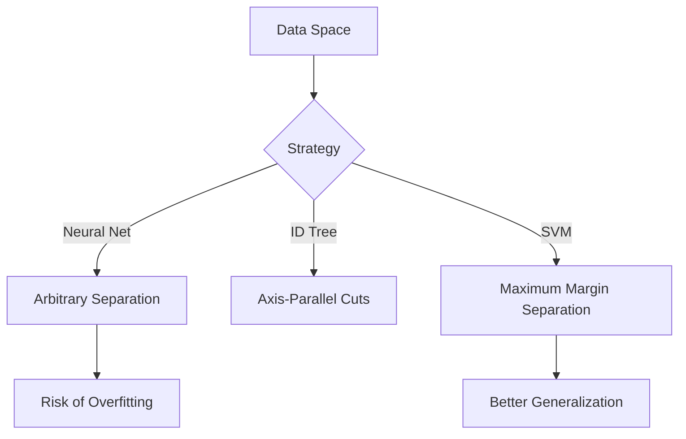

# 1. Introduction and The Widest Street

## 1. Context: The Evolution of Learning
Before diving into Support Vector Machines (SVMs), it is helpful to situate them among other learning algorithms.

| Algorithm | Basic Idea | Limitation |
| :--- | :--- | :--- |
| **Nearest Neighbors** | "Do what your neighbor does." | Can be computationally expensive at runtime; sensitive to noise. |
| **ID Trees** | "Slice the space with axis-parallel cuts." | Greedy approach; doesn't always find the optimal geometric separation. |
| **Neural Networks** | "biologically inspired layering." | Prone to getting stuck in **local maxima**; often considered a "black box." |

**Support Vector Machines** represent a sophisticated mathematical approach to dividing a space. While Neural Networks can draw many arbitrary lines to separate data, SVMs ask a fundamental question: **"Which line is the *best* line?"**

## 2. The Problem Setup
Imagine a 2D space with two classes of data:
*   **Positive Samples (+)**
*   **Negative Samples (-)**

We want to draw a **Decision Boundary** (a line in 2D, a hyperplane in higher dimensions) that separates these samples.

### Comparison of Boundaries
In the diagram below, a Neural Network might draw any of the lines. An SVM specifically looks for the line that creates the greatest separation.



## 3. The Widest Street Approach
Vapnik (the creator of SVMs) formulated the "Widest Street" intuition.

Instead of just drawing a thin line, imagine drawing a **street** (or a highway) between the positive and negative samples.
1.  ** The Median:** The center line of the street is our actual **Decision Boundary**.
2.  **The Gutters:** The edges of the street touch the nearest positive and negative samples.
3.  **The Goal:** Make the street **as wide as possible**.

### Why the Widest Street?
If you place a decision boundary excessively close to the negative samples (even if it separates the training data perfectly), it is statistically dangerous. New, unseen data (test data) might fall slightly on the wrong side.
*   A **wider margin** implies greater confidence and better generalization to future data.

### Visualizing the Street
Imagine a vector $\vec{w}$ that is perpendicular (normal) to the direction of the street.

```mermaid
graph LR
    subgraph Space
    P1((+))
    P2((+))
    N1((-))
    N2((-))
    
    L1[Left Gutter] --- L2[Median Line] --- L3[Right Gutter]
    end
    
    style P1 fill:#9f9,stroke:#333
    style P2 fill:#9f9,stroke:#333
    style N1 fill:#f99,stroke:#333
    style N2 fill:#f99,stroke:#333
    style L2 stroke-width:4px,stroke:blue
```

*   **Support Vectors:** The specific data points that touch the "gutters" (the edges of the street) are called **Support Vectors**.
*   **Crucial Insight:** The entire solution depends *only* on these Support Vectors. The data points far away from the street do not influence the position of the boundary.