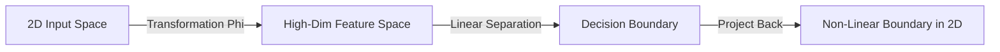

# 5. The Kernel Trick

## 1. Linearly Inseparable Data
What if the data cannot be separated by a straight line? (e.g., the XOR problem, or a ring of positive samples surrounding negative samples).
*   A Standard SVM would fail.
*   We need a non-linear boundary.

## 2. Transforming the Space
The "Kernel Trick" is a method to separate non-linear data without making the math impossible.

**Concept:** Project the data from the current space (Input Space) into a higher-dimensional space (Feature Space).
*   Data that is tangled in 2D might be separable by a flat sheet in 3D.

Let $\Phi(\vec{x})$ be a transformation function that maps $\vec{x}$ to a higher dimension.

## 3. The Power of Dot Products
Usually, calculating in high-dimensional space is computationally expensive (The Curse of Dimensionality).

**However**, remember the "Miracle" from Note 4: **We only need the dot product.**

We do not need to calculate the transformation $\Phi(\vec{x})$ explicitly. We only need a function $K$ (The Kernel Function) that equals the dot product in that high-dimensional space.

$$ K(\vec{u}, \vec{v}) = \Phi(\vec{u}) \cdot \Phi(\vec{v}) $$

We substitute $K(\vec{x}_i, \vec{x}_j)$ into our optimization equation instead of $(\vec{x}_i \cdot \vec{x}_j)$.

## 4. Common Kernels
We don't even need to know what space we are projecting into. We just pick a Kernel function that satisfies certain mathematical properties (Mercer's Theorem).

### A. Polynomial Kernel
$$ K(\vec{u}, \vec{v}) = (\vec{u} \cdot \vec{v} + 1)^n $$
*   Projects data into a space representing all polynomial combinations of the features.
*   $n=2$ allows for curved boundaries (parabolas, circles, etc.).

### B. Radial Basis Function (RBF) / Gaussian Kernel
$$ K(\vec{u}, \vec{v}) = e^{-\frac{||\vec{u} - \vec{v}||^2}{\sigma}} $$
*   **Infinite Dimensions:** This kernel essentially projects data into an infinite-dimensional space.
*   It creates "islands" of support around specific data points.
*   **Interpretation:** It acts like a nearest-neighbor similarity measure but within the strict mathematical framework of the SVM.

## 5. Overfitting vs. Generalization
*   **Low Sigma (RBF):** The kernel wraps tightly around specific data points. High risk of **overfitting** (memorizing the data).
*   **High Sigma (RBF):** Smooth, broader boundaries. Better generalization.

The Kernel Trick allows SVMs to create highly complex, non-linear boundaries while retaining the guarantee of finding the global optimum.
