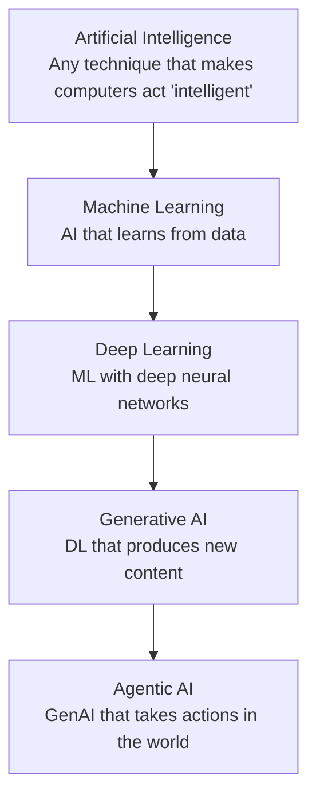

# 02 - AI vs ML vs DL vs GenAI vs Agentic AI

> [!info] TL;DR
> These terms are nested but commonly confused. **AI** is the umbrella. **ML** is AI that learns from data. **DL** is ML with deep neural networks. **GenAI** is DL that produces new content. **Agentic AI** is GenAI that takes actions in the world. Each is a subset of the previous. This note covers the nesting, definitions, common misconceptions, historical timeline, when to use which, and production implications.

## The Nesting

Each inner circle is a specialization of the outer one. All agentic AI is GenAI; all GenAI is DL; all DL is ML; all ML is AI. But not all AI is ML (some is rule-based), not all ML is DL (some is classical), not all DL is GenAI (some is discriminative), and not all GenAI is agentic (some is purely generative).

## Definitions

### Artificial Intelligence (AI)

The broadest term. Any technique that makes a computer act "intelligently" — including symbolic rule systems, expert systems, search algorithms, optimization, and modern ML. A chess program from 1990 is "AI" under this definition. So is a thermostat (in some definitions).

The term was coined by John McCarthy at the 1956 Dartmouth Conference. The original goal was to build machines that could reason, learn, and solve problems like humans.

**Sub-fields of AI** (historical):
- **Symbolic AI** (GOFAI — "Good Old-Fashioned AI"): logic, rules, knowledge representation. Dominant 1950s-1980s.
- **Search and planning**: A*, minimax, constraint satisfaction. Still used in games and robotics.
- **Expert systems**: rule-based systems that encode expert knowledge (MYCIN, DENDRAL).
- **Machine learning**: learning from data (the modern dominant paradigm).
- **Robotics**: embodied AI (often combined with ML).

In practice, in 2026, "AI" almost always means "ML/DL-based AI", but the umbrella term persists. When someone says "AI", they usually mean "ML/DL", but technically the umbrella includes non-ML approaches.

### Machine Learning (ML)

A subset of AI where the system **learns patterns from data** rather than being explicitly programmed. The formal definition (Tom Mitchell, 1997): "A computer program is said to learn from experience E with respect to some class of tasks T and performance measure P, if its performance at tasks in T, as measured by P, improves with experience E."

**Sub-types of ML**:
- **Supervised learning**: learn from (input, output) pairs. Classification, regression.
- **Unsupervised learning**: learn from inputs only. Clustering, dimensionality reduction, density estimation.
- **Reinforcement learning**: learn from reward signals. Game-playing, robotics, control.
- **Semi-supervised learning**: small labeled set + large unlabeled set.
- **Self-supervised learning**: learn from data structure (e.g., next-token prediction). The dominant paradigm for modern LLMs.

**Classical ML algorithms**: linear regression, logistic regression, decision trees, random forests, gradient boosting (XGBoost, LightGBM), SVMs, k-means, PCA. These are still widely used in production — not every problem needs a neural network.

**When to use classical ML**:
- Tabular/structured data.
- Limited training data (<10K samples).
- Interpretability required.
- Low latency / low compute budget.
- Strong baselines exist (XGBoost for tabular).

### Deep Learning (DL)

A subset of ML using **deep neural networks** — networks with many layers. The "deep" refers to depth (number of layers), typically ≥3 hidden layers. DL excels at:
- **Perceptual tasks**: vision (image classification, object detection), speech (ASR).
- **Sequence tasks**: text (NLP), time series, audio.
- **Tasks where feature engineering is hard**: DL learns features automatically.
- **Large-data regimes**: DL outperforms classical ML when data is abundant.

**Key DL architectures**:
- **CNNs** (Convolutional Neural Networks): vision. ResNet, EfficientNet.
- **RNNs/LSTMs**: sequence modeling (pre-Transformer).
- **Transformers**: text, vision, audio, multimodal. The dominant architecture since 2017.
- **Diffusion models**: image, video, audio generation.
- **State space models** (Mamba, etc.): emerging alternative to Transformers.

DL became dominant starting around 2012 (AlexNet for image classification) and accelerated with Transformers (2017). The key drivers: more data, more compute (GPUs), better algorithms (backprop, batch norm, attention).

### Generative AI (GenAI)

A subset of DL focused on **generating new content** — text, images, audio, video, code. The model doesn't just classify or predict; it produces novel outputs.

**GenAI modalities**:
- **Text**: GPT, Llama, Claude, Mistral, Qwen. (LLMs.)
- **Images**: Stable Diffusion, DALL-E, Midjourney, FLUX.
- **Audio (TTS)**: ElevenLabs, OpenAI TTS.
- **Audio (music)**: Suno, Udio.
- **Video**: Sora, Runway, Pika.
- **Code**: Copilot, Codex, StarCoder.
- **3D**: emerging (text-to-3D, image-to-3D).

GenAI exploded with:
- GPT-2/3 (text generation, 2019–2020).
- Stable Diffusion / DALL-E (image generation, 2022).
- ChatGPT (consumer text generation, 2022).
- Sora (video generation, 2024).

**Distinguishing GenAI from discriminative DL**:
- Discriminative DL: input → label (e.g., image classification). The model learns to map inputs to discrete categories.
- GenAI: input (or noise) → new content (e.g., text, image). The model learns the data distribution and can sample from it.

Most pre-2018 DL was discriminative. Most post-2022 DL is generative.

### Agentic AI

A subset of GenAI where the model **takes actions in the world** via tools — calling APIs, running code, browsing the web, controlling software. The model isn't just producing text; it's executing workflows.

**Key characteristics of agentic AI**:
- **Tool use**: the model can call external tools (search, calculator, code execution, APIs).
- **Multi-step reasoning**: the model plans and executes a sequence of steps.
- **Observation**: the model observes the results of its actions and adjusts.
- **Goal-directed**: the model works toward a goal, not just producing a single response.

Agentic AI became prominent in 2023–2024 with frameworks like ReAct, LangChain agents, and AutoGPT, and matured in 2025–2026 with production frameworks like LangGraph, OpenAI Agents SDK, and PydanticAI.

**Sub-types of agentic AI**:
- **Tool-using agents**: single LLM with tools (ReAct pattern).
- **Multi-agent systems**: multiple specialized agents coordinating.
- **Autonomous agents**: long-running agents that operate without continuous human oversight.
- **Human-in-the-loop agents**: agents that pause for human approval at critical points.

See [[15 - AI Agents/MOC|15 AI Agents]] for the full treatment.

## Why the Confusion Matters

These terms are often used interchangeably in marketing and journalism, which causes real confusion:

- A journalist writing "AI is taking jobs" might mean any of the five — very different implications.
- A startup calling itself "an AI company" might just be using an off-the-shelf LLM API.
- A job posting for "AI Engineer" might be ML engineering, LLM application development, or research — completely different skill sets.
- A regulator writing "AI regulation" might be regulating anything from rule-based systems to autonomous agents.

When precision matters (job descriptions, technical docs, contracts, regulations), use the specific term.

### Concrete Example

"The company uses AI for fraud detection."

This could mean:
- A rule-based system (symbolic AI) that flags transactions matching known fraud patterns.
- A gradient boosting model (classical ML) that scores transactions by fraud probability.
- A neural network (DL) that learns fraud patterns from transaction sequences.
- An LLM-based agent (agentic AI) that investigates flagged transactions by calling APIs.

Each is very different in capability, cost, and risk. The vague term "AI" obscures which.

## Common Misconceptions

### "AI = LLMs"
No. LLMs are one type of DL model. Classical ML (XGBoost, random forests) is still the right tool for many tabular-data problems. Computer vision uses CNNs and ViTs, not LLMs. Reinforcement learning powers game-playing AI and robotics.

### "GenAI = LLMs"
No. GenAI includes image generation (Stable Diffusion, DALL-E, Midjourney), audio (ElevenLabs, Suno), video (Sora, Runway), and code (Copilot). LLMs are text GenAI.

### "Agentic AI = autonomous AI"
No. Most production agents are bounded — they execute a specific task within guardrails, not operate autonomously for hours. Truly autonomous agents (Devin, AutoGPT) are still research-grade. See [[01 - Agent vs Workflow vs LLM Application]].

### "DL replaced classical ML"
No. Classical ML is alive and well. For structured/tabular data with limited samples, gradient boosting (XGBoost, LightGBM) usually beats deep learning. DL dominates unstructured data (text, images, audio) and large-data regimes.

### "Bigger model = better"
Not always. A 70B model is better than a 7B model on most benchmarks, but for a specific task, a fine-tuned 7B may outperform a general 70B. And a 1B model fine-tuned for a narrow task may beat both. The right model depends on the task.

### "AI is objective"
No. ML models learn from data, which reflects human biases. Models can be racist, sexist, or otherwise biased. "Objective AI" is a myth; the question is which biases the model has and whether they're acceptable.

### "AI is intelligent"
Depends on the definition of "intelligent". LLMs are very good at pattern matching and text generation, but they don't have understanding, consciousness, or intent in the human sense. "Intelligent" is a loaded term; "capable" is more accurate.

## Historical Timeline (Brief)

| Era                | Dominant Paradigm                       | Example                          |
|--------------------|-----------------------------------------|----------------------------------|
| 1950s–1970s        | Symbolic AI, expert systems             | Logic Theorist, MYCIN            |
| 1980s–1990s        | Classical ML, neural nets (shallow)     | Decision trees, backprop revival |
| 2000s              | Statistical ML                          | SVM, random forests, CRF         |
| 2010s              | Deep learning                           | AlexNet, ResNet, BERT, GPT-2     |
| 2020–2022          | Generative AI                           | GPT-3, Stable Diffusion          |
| 2023–present       | Agentic AI, reasoning models            | ChatGPT, o1, R1, agentic frameworks |

See [[03 - A Brief History of AI]] for the full story.

### Key Milestones

- **1950**: Turing Test proposed.
- **1956**: Dartmouth Conference coins "AI".
- **1958**: Perceptron (Rosenblatt).
- **1986**: Backpropagation (Rumelhart, Hinton, Williams).
- **1997**: Deep Blue beats Kasparov at chess.
- **2012**: AlexNet wins ImageNet (DL era begins).
- **2014**: GANs (Goodfellow).
- **2017**: Transformer paper (Vaswani et al.).
- **2018**: BERT, GPT-1.
- **2020**: GPT-3.
- **2022**: ChatGPT, Stable Diffusion.
- **2023**: GPT-4, Llama 2, agents (ReAct, Reflexion).
- **2024**: Sora, Llama 3, Claude 3.5, reasoning models (o1).
- **2025**: DeepSeek-R1, agentic frameworks mature, Gemini 2.5.
- **2026**: Continued scaling, multimodal-native models, production agents.

## When to Use Which

### Use Symbolic AI (Rules) When:
- The logic is well-understood and can be written as rules.
- Interpretability is critical (regulatory, medical).
- The problem is combinatorial (constraint satisfaction).
- Data is scarce but domain knowledge is rich.

Examples: tax preparation software, medical diagnosis checklists, scheduling.

### Use Classical ML When:
- Data is tabular/structured.
- Limited training data.
- Interpretability required.
- Low latency / low compute budget.

Examples: fraud detection (XGBoost), customer churn (logistic regression), recommendation (collaborative filtering).

### Use Deep Learning When:
- Data is unstructured (text, images, audio).
- Large training data available.
- Performance matters more than interpretability.
- Feature engineering is hard.

Examples: image classification (ResNet), speech recognition (Whisper), translation (Transformer).

### Use GenAI When:
- You need to generate new content.
- The task is creative or open-ended.
- A discriminative model can't capture the output distribution.

Examples: text generation (LLMs), image generation (diffusion), code generation (Copilot), summarization, translation.

### Use Agentic AI When:
- The task requires multiple steps.
- Tool use is needed (search, code execution, APIs).
- The model needs to adapt based on observations.
- A single LLM call is insufficient.

Examples: research agents, coding agents, customer support agents, autonomous task execution.

### Don't Use AI When:
- A simple rule-based system works.
- The problem is well-understood and deterministic.
- The cost of AI exceeds the value.
- The risk of errors is unacceptable.

Not every problem needs AI. Sometimes a SQL query is the right tool.

## Why This Matters for AI

- Using the right term signals you understand the field. Saying "AI" when you mean "LLM" in a technical context is a tell.
- Choosing the right tool requires knowing what category of tool you need. Not every problem needs an LLM; some need a classifier, some need a search engine, some need a rule-based system.
- The progression AI → ML → DL → GenAI → Agentic AI isn't just historical — it's the path most learners follow. You learn classical ML before deep learning before LLMs before agents.
- Understanding the distinctions helps you communicate with stakeholders, who may not know the difference but need to make informed decisions.
- Regulatory and ethical discussions require precision. "AI regulation" that conflates symbolic AI with autonomous agents produces bad policy.

## Production Implications

- **Don't default to LLMs.** For classification on tabular data, gradient boosting is faster, cheaper, and often more accurate.
- **GenAI features are expensive.** Image generation costs ~$0.04 per image; LLM calls cost $0.001–$0.06 per query. Cost adds up fast at scale.
- **Agentic features multiply cost.** An agent that makes 10 LLM calls to answer one user query costs 10× a single-call approach. Make sure the value justifies it.
- **Choose the right tool for the job.** A startup building a recommendation engine should use collaborative filtering, not an LLM. A company automating data entry should use OCR + rules, not a multimodal agent.
- **Mix and match.** Production systems often combine classical ML, DL, GenAI, and agentic AI. The fraud detection system might use XGBoost for scoring + LLM for investigation + rules for known patterns.
- **Skill sets differ.** An ML engineer (classical ML) and an AI engineer (LLMs/agents) have different skills. Hire for the right role.

## Interview Questions

- **Q: What's the difference between AI and ML?**  
  A: AI is the umbrella (any technique for intelligent behavior). ML is a subset where the system learns from data. Not all AI is ML (rule-based systems are AI but not ML).

- **Q: When would you use classical ML instead of deep learning?**  
  A: For tabular data with limited samples, gradient boosting usually beats DL. Classical ML is also better when interpretability is required, compute is limited, or the problem is well-suited to existing algorithms.

- **Q: What makes AI "agentic"?**  
  A: The ability to take actions in the world via tools, observe results, and iterate. A pure LLM is GenAI but not agentic. An LLM with tool use and multi-step reasoning is agentic.

- **Q: Is an LLM "intelligent"?**  
  A: Depends on the definition. LLMs are very capable at pattern matching and text generation, but they don't have understanding, consciousness, or intent. "Capable" is more accurate than "intelligent".

- **Q: Why is "AI regulation" complicated?**  
  A: Because "AI" spans everything from rule-based systems to autonomous agents. Regulating a chess program differently from a self-driving car requires precise definitions. Conflating them produces bad policy.

## See Also

- [[01 - What Is AI Engineering]]
- [[03 - A Brief History of AI]]
- [[04 - The Modern AI Stack]]
- [[05 - AI Engineer Roles]]
- [[15 - AI Agents/Architecture/01 - Agent vs Workflow vs LLM Application|Agent vs Workflow vs LLM Application]]
- [[15 - AI Agents/MOC|15 AI Agents]]
- [[01 - AI Foundations/MOC|AI Foundations MOC]]
