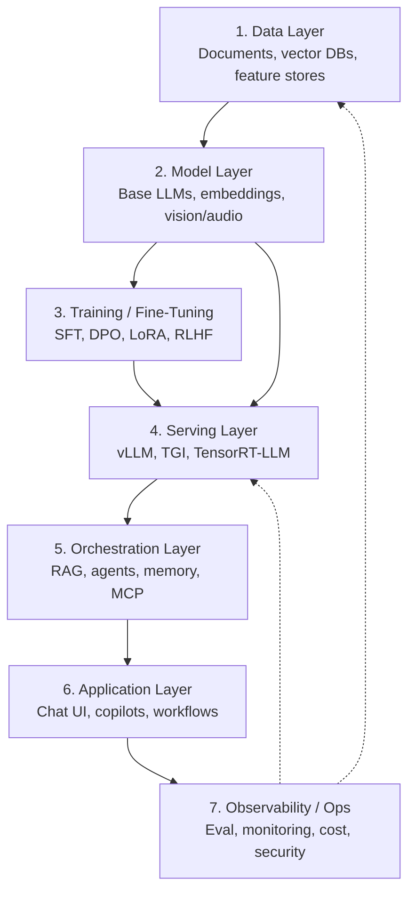

# 04 - The Modern AI Stack

> [!info] TL;DR
> The 2026 AI stack has ~7 layers: data → models → training → serving → orchestration → application → observability. Understanding the layers helps you choose tools, debug problems, and reason about cost. Most AI engineers work across all of them.

## The Stack

## Layer 1 — Data

Everything starts with data. In the LLM era, "data" usually means:

- **Documents** for RAG: PDFs, HTML, code, knowledge bases.
- **Vector embeddings**: pre-computed embeddings of documents, stored in vector DBs (pgvector, Pinecone, Qdrant, Weaviate, Milvus).
- **Training/fine-tuning data**: instruction pairs, preference pairs, domain data.
- **Feature stores**: for hybrid ML/LLM systems that combine classical features with LLM features.

Key concerns: data quality, freshness, deduplication, access control, PII handling. See [[17 - RAG/MOC|17 RAG]] and [[20 - AI Infrastructure/MOC|20 AI Infrastructure]].

## Layer 2 — Models

The pretrained models that power everything:

- **Base LLMs**: Llama 3, Mistral, Qwen, DeepSeek, GPT-4/5, Claude, Gemini.
- **Embedding models**: BGE, E5, GTE, OpenAI text-embedding-3, Cohere.
- **Vision models**: CLIP, SigLIP, SAM, DINOv3.
- **Audio models**: Whisper (speech-to-text), Bark / ElevenLabs (TTS).
- **Image generation**: Stable Diffusion 3, FLUX, DALL-E.
- **Code models**: StarCoder, Code Llama, DeepSeek-Coder.

Most teams **don't train base models** — they consume pretrained ones, either via APIs or self-hosted weights. See [[08 - LLMs/MOC|08 LLMs]] and [[09 - Foundation Models/MOC|09 Foundation Models]].

## Layer 3 — Training / Fine-Tuning

Adapting pretrained models to specific tasks:

- **Continued pretraining**: more pretraining on domain data.
- **SFT (supervised fine-tuning)**: instruction-response pairs.
- **Preference optimization**: DPO, IPO, KTO, or RLHF with PPO.
- **PEFT methods**: LoRA, QLoRA, DoRA.
- **Distillation**: train a smaller model from a larger one's outputs.

See [[11 - Training/MOC|11 Training]] and [[12 - Fine-Tuning/MOC|12 Fine-Tuning]].

## Layer 4 — Serving

Running the model in production:

- **Serving engines**: vLLM, TGI, TensorRT-LLM, Ollama, llama.cpp.
- **Optimizations**: KV cache, PagedAttention, FlashAttention, continuous batching, quantization (INT8/INT4/FP8), speculative decoding.
- **API layers**: OpenAI-compatible APIs, OpenRouter, custom gateways.

This is where AI engineering meets systems engineering. See [[13 - Inference/MOC|13 Inference]].

## Layer 5 — Orchestration

The patterns that make models useful:

- **RAG pipelines**: retrieve → rerank → ground → cite.
- **Agents**: ReAct, planner-executor, multi-agent.
- **Memory**: short-term (context window), long-term (vector DBs, knowledge graphs).
- **Tool use**: function calling, MCP servers.
- **Workflows**: predefined multi-step pipelines.

See [[15 - AI Agents/MOC|15 AI Agents]], [[17 - RAG/MOC|17 RAG]], [[18 - Memory Systems/MOC|18 Memory]], [[19 - MCP/MOC|19 MCP]].

## Layer 6 — Application

The user-facing product:

- **Chat UIs**: ChatGPT, Claude.ai, custom internal tools.
- **Copilots**: GitHub Copilot, Cursor, Cline, Claude Code.
- **Search**: Perplexity, Glean, internal enterprise search.
- **Workflow automation**: customer support bots, code review assistants, document processing.
- **API features**: classification, extraction, summarization embedded in larger apps.

Most "AI engineer" jobs live here — taking orchestration patterns and turning them into product features.

## Layer 7 — Observability / Ops

Running AI in production reliably:

- **Evaluation**: offline (benchmarks), online (A/B tests, LLM-as-judge).
- **Monitoring**: latency, cost, error rates, drift, hallucination.
- **Tracing**: every LLM call, tool call, retrieval in a request.
- **Cost control**: token budgets, model routing, caching.
- **Security**: prompt injection defense, PII redaction, supply chain.
- **LLMOps**: model registries, prompt management, deployment pipelines.

See [[21 - LLMOps and MLOps/MOC|21 LLMOps]] and [[22 - Production AI/MOC|22 Production AI]].

## How the Layers Fit Together

A typical production AI feature involves all seven layers. Example: a "chat with your docs" feature.

1. **Data**: ingest customer PDFs → chunk → embed → store in pgvector.
2. **Models**: use OpenAI text-embedding-3 for embeddings, Llama 3 70B for chat.
3. **Training**: maybe LoRA fine-tune Llama on past support transcripts.
4. **Serving**: serve Llama 70B with vLLM on 2× H100.
5. **Orchestration**: RAG pipeline with hybrid search (BM25 + vector) + cross-encoder reranker.
6. **Application**: web chat UI with source citations.
7. **Observability**: trace every retrieval + LLM call, monitor answer faithfulness, alert on cost spikes.

## Cross-Cutting Concerns

Some concerns cut across all layers:

- **Cost**: token costs at the model layer, GPU costs at serving, infra costs at the orchestration. Track end-to-end cost per user request.
- **Latency**: prefill time + retrieval time + generation time. Each layer contributes.
- **Reliability**: model APIs fail, vector DBs go down, agents loop. Plan for failures at every layer.
- **Security**: every layer can be attacked — prompt injection (orchestration), data leakage (data), model supply chain (model), infra compromise (serving).

## Why This Matters for AI

- The stack is **wide** — no one is an expert in all layers. Pick your depth.
- Most AI engineering bugs come from **layer boundaries**: data has wrong format for the embedding model; orchestration sends too-long context to the model; serving can't handle the load pattern; observability can't trace across layers.
- Choosing tools per layer is consequential — switching serving engines or vector DBs is expensive. Pick carefully based on your workload.

## Production Implications

- **Don't build all layers yourself.** Use managed services for layers you don't want to own (e.g., Pinecone for vectors, OpenAI for models, Datadog for monitoring).
- **Pick the layer where you add value.** Most product differentiation happens at the orchestration and application layers — that's where to invest.
- **Understand the full stack even if you specialize.** A serving-layer bug can manifest as an application-layer failure. You need to know enough to debug across layers.

## See Also

- [[01 - What Is AI Engineering]]
- [[02 - AI vs ML vs DL vs GenAI vs Agentic AI]]
- [[05 - AI Engineer Roles]]
- [[MOC|Master Map of Content]]
- [[01 - AI Foundations/MOC|AI Foundations MOC]]
