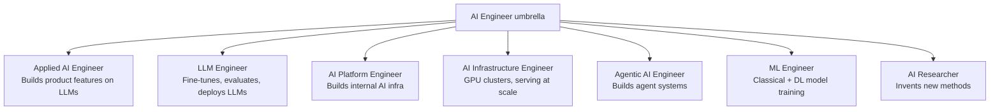

# 05 - AI Engineer Roles

> [!info] TL;DR
> "AI Engineer" is an umbrella title covering several distinct specializations: Applied AI Engineer, LLM Engineer, AI Platform Engineer, AI Infrastructure Engineer, Agentic AI Engineer, ML Engineer, and AI Researcher. Knowing which one you're aiming for focuses your learning.

## The Role Map

## The Specializations

### Applied AI Engineer
**What they do**: Build product features on top of LLMs — chatbots, copilots, RAG systems, classification, extraction, summarization. Glue work between models, data, and product.

**Skills**: Python, prompting, RAG, function calling, basic fine-tuning, evaluation, full-stack awareness.

**Tools**: LangChain/LangGraph, LlamaIndex, OpenAI SDK, vector DBs, HuggingFace.

**Where they work**: Almost every company adding AI features — startups, SaaS, enterprise.

### LLM Engineer
**What they do**: Focus on the LLM itself — choosing models, fine-tuning (LoRA, DPO), evaluating, deploying. Deeper on the model layer than Applied AI Engineer.

**Skills**: All of Applied + LoRA/QLoRA, DPO/RLHF, evaluation design, vLLM/TGI serving, quantization.

**Tools**: HuggingFace Transformers, PEFT, TRL, vLLM, weights & biases.

**Where they work**: AI-focused startups, model labs (Anthropic, OpenAI, Mistral), large enterprises running custom models.

### AI Platform Engineer
**What they do**: Build the internal platform that other AI engineers use — model registries, fine-tuning pipelines, evaluation infra, prompt management, model routing, cost controls.

**Skills**: Distributed systems, Python, ML basics, Kubernetes, infrastructure-as-code, API design.

**Tools**: Kubernetes, Ray, BentoML, MLflow, internal frameworks.

**Where they work**: Larger companies with many AI teams that need shared infrastructure.

### AI Infrastructure Engineer
**What they do**: Operate the GPU clusters and serving infrastructure. Solve problems like: how do we serve 50 concurrent Llama 70B requests on 8 H100s? How do we batch training jobs across nodes?

**Skills**: CUDA, distributed systems, Linux, networking, GPU profiling, deep PyTorch.

**Tools**: vLLM (internals), TensorRT-LLM, Megatron, DeepSpeed, NCCL, Triton.

**Where they work**: AI labs, cloud providers (AWS, GCP, Azure), GPU-as-a-service companies (Together, Modal, Replicate).

### Agentic AI Engineer
**What they do**: Build systems where LLMs take actions via tools — customer support agents, coding assistants, research agents, autonomous workflows.

**Skills**: All of Applied + agent frameworks (LangGraph, OpenAI Agents SDK, PydanticAI, AutoGen), tool design, state management, multi-agent patterns.

**Tools**: LangGraph, OpenAI Agents SDK, PydanticAI, CrewAI, MCP servers, evaluation harnesses.

**Where they work**: Startups building agent products, enterprises automating workflows, AI labs with agent teams.

### ML Engineer
**What they do**: Build models for non-LLM tasks — recommendation systems, fraud detection, forecasting, computer vision, speech. May include LLMs but typically focused on classical + DL.

**Skills**: Classical ML (XGBoost, etc.), DL (CNNs, RNNs, Transformers), feature engineering, model evaluation, deployment.

**Tools**: scikit-learn, XGBoost, PyTorch, TensorFlow, MLflow, SageMaker.

**Where they work**: Tech companies, finance, healthcare, e-commerce, anywhere with structured-data ML.

### AI Researcher
**What they do**: Invent new methods — new architectures, training techniques, alignment methods. Publishes papers; may not ship products.

**Skills**: Math, ML theory, reading and writing papers, PyTorch, experimentation, computational research.

**Tools**: PyTorch, JAX, custom training frameworks, papers with code.

**Where they work**: AI labs (DeepMind, FAIR, OpenAI, Anthropic), academic labs.

## Which Role Should You Aim For?

### If you're a software engineer moving into AI
→ **Applied AI Engineer** is the natural on-ramp. Build on your existing SWE skills, add prompting + RAG + basic fine-tuning.

### If you're an ML engineer moving into LLMs
→ **LLM Engineer**. You already know ML; add the LLM-specific stack (LoRA, DPO, vLLM, eval).

### If you love distributed systems and performance
→ **AI Infrastructure Engineer**. High demand, high pay, but requires deep systems knowledge.

### If you love product and want to build cool stuff
→ **Applied AI Engineer** or **Agentic AI Engineer**. Maximum product impact.

### If you love math and research
→ **AI Researcher**. But note: most research jobs require a PhD or equivalent research experience.

## Skill Matrix (Rough)

| Skill                       | Applied | LLM  | Platform | Infra | Agentic | ML   | Research |
|-----------------------------|---------|------|----------|-------|---------|------|----------|
| Python                      | ●●●     | ●●●  | ●●●      | ●●●   | ●●●     | ●●●  | ●●●      |
| Prompting                   | ●●●     | ●●●  | ●●       | ●     | ●●●     | ●    | ●        |
| RAG pipelines               | ●●●     | ●●   | ●●       | -     | ●●●     | -    | -        |
| Fine-tuning (LoRA/DPO)      | ●●      | ●●●  | ●●       | ●     | ●●      | ●●●  | ●●●      |
| Agent frameworks            | ●●      | ●    | ●●       | -     | ●●●     | -    | -        |
| Distributed systems         | ●       | ●    | ●●●      | ●●●   | ●       | ●    | ●        |
| CUDA / GPU internals        | -       | ●    | ●●       | ●●●   | -       | ●    | ●        |
| Math (LA / prob / calc)     | ●       | ●●   | ●        | ●     | ●       | ●●●  | ●●●      |
| ML theory                   | ●       | ●●   | ●        | ●     | ●       | ●●●  | ●●●      |
| Evaluation design           | ●●●     | ●●●  | ●●       | ●     | ●●●     | ●●●  | ●●       |
| Production / on-call        | ●●●     | ●●   | ●●●      | ●●●   | ●●      | ●●   | -        |

(● = aware, ●● = competent, ●●● = expert.)

## Day-in-the-Life Examples

### Applied AI Engineer at a SaaS startup
- Morning: review eval results from last night's model swap.
- Midday: add a new tool to the support agent (function calling + tests).
- Afternoon: pair with product on a new "summarize thread" feature; build the prompt, the eval set, the cost estimate.

### LLM Engineer at a model lab
- Morning: DPO training run on a new preference dataset.
- Midday: debug why the eval pipeline is producing noisy results.
- Afternoon: read a new paper on a DPO variant; design an experiment to test it.

### AI Infra Engineer at a cloud provider
- Morning: investigate a multi-GPU training crash (NCCL timeout).
- Midday: profile vLLM serving on a new H100 cluster.
- Afternoon: write a kernel-fusion patch for a quantized attention path.

## Why This Matters for AI

- Job titles are inconsistent across companies. Always read the job description, not just the title.
- Specialization pays. "AI Engineer" is generalist; specialists (infra, agentic, LLM) command higher compensation.
- The field is moving fast — today's specialty can become table stakes. Keep breadth while deepening one area.

## Production Implications

- When hiring, be precise about which specialization you need. "AI Engineer" is too vague.
- Most teams need a mix — at least one Applied + one LLM/Infra for a serious AI product.
- Cross-training is valuable: an Applied engineer who understands infra can debug serving issues; an Infra engineer who understands agents can build better serving for them.

## See Also

- [[01 - What Is AI Engineering]]
- [[04 - The Modern AI Stack]]
- [[06 - Map of the Field]]
- [[01 - AI Foundations/MOC|AI Foundations MOC]]
- [[Learning Roadmap]]
