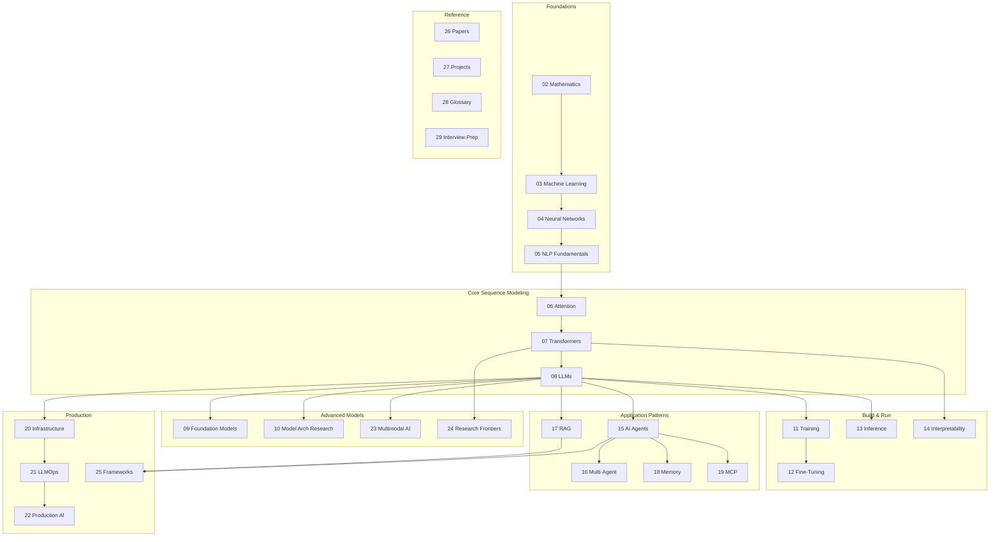

# 06 - Map of the Field

> [!info] TL;DR
> The big picture of how the vault's chapters relate. Read this once to anchor your mental model; come back to it whenever you finish a chapter and want to see where you are.

## The Field at a Glance

## Reading Paths Through the Field

### Path A — The Full Curriculum (Beginner → Researcher)
Start at [[02 - Mathematics/MOC|02 Mathematics]], work your way right and down. ~12–18 months part-time. See [[Learning Roadmap]].

### Path B — The Applied Engineer (Build Products Fast)
1. [[05 - NLP Fundamentals/MOC|05 NLP]] (just tokenization)
2. [[08 - LLMs/MOC|08 LLMs]] (sampling, KV cache)
3. [[13 - Inference/MOC|13 Inference]] (serving)
4. [[17 - RAG/MOC|17 RAG]] (build a RAG pipeline)
5. [[15 - AI Agents/MOC|15 AI Agents]] (add agents)
6. [[19 - MCP/MOC|19 MCP]] (expose tools)
7. [[22 - Production AI/MOC|22 Production AI]] (ship it)

### Path C — The Model Specialist (Train & Tune)
1. [[02 - Mathematics/MOC|02 Mathematics]] (full)
2. [[06 - Attention Mechanisms/MOC|06 Attention]] (full)
3. [[07 - Transformers/MOC|07 Transformers]] (full)
4. [[11 - Training/MOC|11 Training]] (pretraining, scaling laws, distributed)
5. [[12 - Fine-Tuning/MOC|12 Fine-Tuning]] (LoRA, DPO, RLHF)
6. [[13 - Inference/MOC|13 Inference]] (serving what you trained)
7. [[10 - Model Architecture Research/MOC|10 Model Architecture Research]] (per-model deep dives)

### Path D — The Infrastructure Engineer (Run Models at Scale)
1. [[13 - Inference/MOC|13 Inference]] (full)
2. [[20 - AI Infrastructure/MOC|20 AI Infrastructure]] (full)
3. [[21 - LLMOps and MLOps/MOC|21 LLMOps]] (full)
4. [[22 - Production AI/MOC|22 Production AI]] (full)
5. [[25 - Frameworks and Tools/MOC|25 Frameworks]] (serving tools)

### Path E — The Researcher (Frontier)
1. [[02 - Mathematics/MOC|02 Math]] through [[07 - Transformers/MOC|07 Transformers]] (foundations)
2. [[24 - Research Frontiers/MOC|24 Research Frontiers]] (SSMs, hybrids, reasoning)
3. [[10 - Model Architecture Research/MOC|10 Model Architecture Research]] (per-model)
4. [[26 - Papers/MOC|26 Papers]] (read landmark papers)
5. [[14 - Interpretability/MOC|14 Interpretability]] (understand what models learn)

### Path F — The Interview Candidate (Fastest Path to Hired)
1. [[29 - Interview Prep/MOC|29 Interview Prep]]
2. [[28 - Glossary/MOC|28 Glossary]]
3. [[06 - Attention Mechanisms/MOC|06 Attention]] + [[07 - Transformers/MOC|07 Transformers]] (most-asked)
4. [[13 - Inference/MOC|13 Inference]] (KV cache, quantization)
5. [[12 - Fine-Tuning/MOC|12 Fine-Tuning]] (LoRA, DPO)
6. [[17 - RAG/MOC|17 RAG]] + [[15 - AI Agents/MOC|15 AI Agents]]
7. [[22 - Production AI/MOC|22 Production AI]] (system design)

## Chapter Dependency Summary

| Chapter | Depends On                                  | Enables                                   |
|---------|---------------------------------------------|-------------------------------------------|
| 02 Math | (nothing)                                   | 03, 04, 06                                |
| 03 ML   | 02                                          | 04, 11, 12                                |
| 04 NN   | 02, 03                                      | 05, 06                                    |
| 05 NLP  | 04                                          | 06, 08                                    |
| 06 Attn | 04, 05                                      | 07, 08, 13                                |
| 07 Tx   | 06                                          | 08, 09, 10, 13, 14, 23                    |
| 08 LLM  | 07                                          | 11, 12, 13, 15, 17                        |
| 11 Train| 07, 08                                      | 12                                        |
| 12 FT   | 08, 11                                      | (production deployment)                   |
| 13 Inf  | 06, 07, 08                                  | 20, 21, 22                                |
| 15 Agents| 08                                         | 16, 19, 25                                |
| 17 RAG  | 05, 08                                      | 18, 22                                    |

## Cross-Cutting Themes

Some themes appear in multiple chapters — keep them in mind as you traverse the map:

- **Attention** appears in 06 (mechanism), 07 (Transformer), 08 (LLM), 10 (per-model), 13 (KV cache), 24 (linear attention).
- **Memory** appears in 13 (KV cache), 18 (agent memory), 24 (neural memory).
- **Tools** appears in 15 (tool calling), 19 (MCP), 25 (frameworks).
- **Embeddings** appears in 05 (Word2Vec), 08 (token embeddings), 17 (RAG), 18 (memory), 23 (multimodal).
- **Reasoning** appears in 15 (CoT, ReAct), 09 (reasoning models), 24 (test-time compute).
- **Cost** appears in 13 (serving), 21 (LLMOps), 22 (production).

## Why This Matters for AI

- The map gives you a **spatial sense** of the field. When someone mentions "GQA", you know it's in chapter 10/13 (model architecture / inference). When someone says "DPO", you know it's chapter 12.
- The dependency graph tells you **what to learn before what**. Don't read chapter 12 (Fine-Tuning) before chapter 8 (LLMs).
- The reading paths tell you **which chapters matter for your goal**. An applied engineer skips chapter 24 (research frontiers); a researcher skips chapter 21 (LLMOps).

## Production Implications

- When evaluating a candidate's resume, look for breadth across the map. Single-chapter specialists are common; cross-chapter generalists are rare and valuable.
- When hiring, know which chapters your role needs. A "production AI engineer" needs 13 + 20 + 21 + 22; a "research engineer" needs 02 + 06 + 07 + 24 + 26.
- When debugging production issues, the chapter where the symptom appears is often not the chapter where the cause lives. Trace across layers.

## See Also

- [[MOC|Master Map of Content]]
- [[Learning Roadmap]]
- [[Reading Order]]
- [[01 - AI Foundations/MOC|AI Foundations MOC]]
