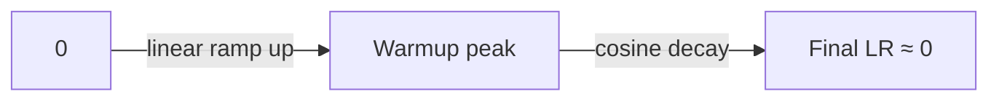

# 14 - Learning Rate Schedules

> [!info] TL;DR
> The learning rate is the single most important hyperparameter. A good schedule: warmup (linear ramp up) → decay (cosine or linear down). This note covers the major schedule shapes, why warmup matters for Transformers, and the "linear scaling rule" for batch size changes.

## Why Schedules Matter

The learning rate (LR) controls how big each parameter update is. The tradeoff:

- **Too high**: training diverges (loss → NaN).
- **Too low**: training is painfully slow.
- **Just right**: fast, stable convergence.

But "just right" changes during training:
- **Early**: gradients are large and noisy; high LR causes divergence.
- **Middle**: stable regime; high LR gives fast progress.
- **Late**: close to a minimum; lower LR enables fine convergence.

A **schedule** varies $\eta_t$ over training to match these regimes.

## The Standard Schedule: Warmup + Cosine Decay

The de facto standard for Transformer training:



1. **Warmup**: linearly increase $\eta_t$ from 0 (or small) to $\eta_{\text{peak}}$ over $T_{\text{warmup}}$ steps.
2. **Cosine decay**: smoothly decrease from $\eta_{\text{peak}}$ to $\eta_{\text{final}}$ (often 0 or 10% of peak) over the remaining $T - T_{\text{warmup}}$ steps.

### Formula

```python
import math

def lr_lambda(step, T_warmup, T_total, eta_peak, eta_final=0.0):
    if step < T_warmup:
        # Linear warmup
        return eta_peak * step / T_warmup
    # Cosine decay
    progress = (step - T_warmup) / (T_total - T_warmup)
    return eta_final + 0.5 * (eta_peak - eta_final) * (1 + math.cos(math.pi * progress))
```

## Why Warmup?

Transformers are unusually sensitive to early-training LR. Without warmup:

- The first gradients are large (random init → big loss → big gradients).
- Adam's bias correction hasn't kicked in yet (steps 1–10).
- The combination can cause loss spikes that destabilize training.

Warmup lets the model "find its footing" — small steps initially, then ramp up once the gradients are reasonable. Typical warmup: 1–5% of total steps (e.g., 2000 warmup out of 100k total).

### Empirical observation

Llama and most modern LLMs use a warmup of ~2000 steps regardless of total length. The exact value matters less than having one.

## Decay Shapes

### Cosine decay (most common)
$$
\eta_t = \eta_{\text{final}} + \frac{1}{2}(\eta_{\text{peak}} - \eta_{\text{final}})\left(1 + \cos\left(\pi \frac{t - T_{\text{warmup}}}{T - T_{\text{warmup}}}\right)\right)
$$

Smooth, well-tested, gives a graceful landing. **The default for modern LLM training.**

### Linear decay
$$
\eta_t = \eta_{\text{peak}} \cdot \max\left(0, 1 - \frac{t - T_{\text{warmup}}}{T - T_{\text{warmup}}}\right)
$$

Simpler than cosine; comparable performance. Used in GPT-3.

### Step decay
Multiply $\eta$ by $\gamma$ (typically 0.1) every $N$ steps. Older; common in CNN training (ResNet, etc.). Rare in LLM training.

### Inverse square root
$$
\eta_t = \eta_{\text{peak}} \cdot \min\left(1, \frac{\sqrt{T_{\text{warmup}}}}{\sqrt{t}}\right)
$$

Used in the original Transformer and some translation models. Doesn't require knowing $T$ in advance — useful when training length is uncertain.

### Constant (no decay)
$\eta_t = \eta_{\text{peak}}$ throughout. Used for very long training where decay would be too aggressive. Common in continued pretraining.

## The Linear Scaling Rule

When you change batch size $B$, scale LR proportionally:

$$
\eta_{\text{new}} = \eta_{\text{old}} \cdot \frac{B_{\text{new}}}{B_{\text{old}}}
$$

This rule works well for moderate batch size changes (2x–8x). For very large batches (>8x), use more conservative scaling (sqrt rule) or specialized optimizers (LARS, LAMB).

### Why it works

Gradient noise variance scales as $1/B$. Doubling $B$ halves gradient noise, so you can take 2x bigger steps. Hence 2x LR.

### Caveat

The rule assumes you also adjust warmup length: longer warmup for larger batches.

## Worked Example: Llama-Style Schedule

For Llama 3 8B (hypothetical numbers):
- Total steps: ~600k
- Warmup: 2000 steps
- Peak LR: 3e-4
- Final LR: 3e-5 (10% of peak)
- Schedule: cosine decay after warmup

```python
def llama_lr(step):
    if step < 2000:
        return 3e-4 * step / 2000
    progress = (step - 2000) / (600_000 - 2000)
    return 3e-5 + 0.5 * (3e-4 - 3e-5) * (1 + math.cos(math.pi * progress))
```

## Choosing Hyperparameters

### Peak LR
- Pretraining: $10^{-4}$ to $3 \times 10^{-4}$ for 7B–70B models.
- Fine-tuning (full): $10^{-5}$ to $10^{-4}$.
- LoRA fine-tuning: $10^{-4}$ to $10^{-3}$ (higher because LoRA params start from zero).
- Always sweep on a small run first.

### Warmup length
- 1–5% of total steps.
- 500–2000 steps for most LLM pretraining.

### Final LR
- 0% to 10% of peak. 10% is the most common (gives a graceful landing without stopping entirely).

### Total steps
- Determined by dataset size and batch size: $T = \text{total tokens} / \text{tokens per step}$.

## Fine-Tuning Schedules

Fine-tuning often uses simpler schedules:

- **Constant LR with warmup**: warm up, then constant. Common for SFT.
- **Linear decay from peak**: no cosine, just linear down. Common for DPO.
- **Cosine**: for longer fine-tunes.

Fine-tuning schedules are usually less critical than pretraining schedules — fine-tunes are short, so the schedule shape doesn't matter as much as the peak LR.

## Restart Schedules

**Warm restarts** (SGDR, Loshchilov & Hutter 2017): periodically reset the LR back to peak (with cosine decay between resets). Helps escape local minima and explore the loss landscape. Rare in LLM training.

## Why This Matters for AI

- The LR schedule is the **single biggest training-stability knob** after the LR itself. Wrong schedule = unstable training or wasted compute.
- Every model card and training report specifies the schedule. Knowing the standard shapes lets you read these reports and replicate results.
- The schedule interacts with batch size, model size, and dataset size. Scaling laws (Chinchilla) tell you how to set these together.

## Production Implications

- **Sweep peak LR** before training. Run a few short (1k steps) trials at $10^{-5}, 10^{-4}, 10^{-3}$ and pick the highest that doesn't diverge.
- **Log the LR every step**. Schedule bugs are silent — your model trains fine but ends up worse than it should.
- **For resuming training**, restore the step count and recompute LR from the schedule. Don't just use the LR from when you stopped.
- **For fine-tuning**, simpler schedules (linear or constant-with-warmup) often work as well as cosine.
- **For distributed training**, the schedule is the same on every rank. Don't accidentally scale LR with the number of GPUs (it's already accounted for in the effective batch size).

## Common Pitfalls

- **No warmup on Transformers** — training often diverges in the first 1000 steps.
- **Decay too fast** — model hasn't converged when LR hits 0.
- **Decay too slow** — model "stalls" at high LR without making progress.
- **Wrong total steps** — if you set $T$ too short, the cosine decay bottoms out early and you waste compute. If too long, you stop training with LR still high.
- **Forgetting to update the schedule when changing batch size** — use the linear scaling rule.
- **Decaying to exactly 0** — leaves the model in a state where it can't make any progress; better to decay to 10% of peak.

## Further Reading

- Loshchilov & Hutter (2017), *SGDR: Stochastic Gradient Descent with Warm Restarts*.
- Goyal et al. (2017), *Accurate, Large Minibatch SGD: Training ImageNet in 1 Hour* — the linear scaling rule.
- Llama 2/3 technical reports — schedule choices in modern LLM training.
- Chinchilla paper (Hoffmann et al. 2022) — how schedule interacts with compute-optimal training.

## See Also

- [[12 - Optimization Essentials]]
- [[13 - Adam Derivation]]
- [[11 - Jacobians and Hessians]]
- [[02 - Mathematics/MOC|Mathematics MOC]]
- [[11 - Training/MOC|Training MOC]] (planned deep dive)

## The MuP (Maximal Update Parameterization) Approach

For hyperparameter transfer across model sizes, **MuP** (Yang et al. 2022) is the principled approach. The key insight: with standard parameterization, the optimal LR changes with model width (because gradient statistics change). MuP scales init and LR in a coordinated way so that the optimal LR for a small model transfers to a large model.

This means you can tune LR on a cheap small model and apply it to an expensive large model — a massive cost saver. MuP is implemented in `mup` package and is increasingly adopted for frontier-scale training.

### Without MuP (standard parameterization)

- 7B model: optimal LR $\eta^* = 3 \times 10^{-4}$
- 70B model: optimal LR $\eta^* = 1 \times 10^{-4}$ (different!)
- You must sweep LR at every scale — expensive.

### With MuP

- Tune on a 100M model: $\eta^* = 3 \times 10^{-4}$.
- Apply same $\eta$ to 7B, 70B, 700B — works.
- Saves weeks of GPU time on LR sweeps at scale.

## WSDS (Warmup-Stable-Decay-Schedule)

A newer schedule family popularized by 2024 papers (Zhai et al., MiniCPM):

1. **Warmup**: linear ramp to $\eta_{\text{peak}}$.
2. **Stable**: constant at $\eta_{\text{peak}}$ for most of training.
3. **Decay**: short decay to near-zero at the end.

The advantage over cosine: you can extend training mid-run without restarting. If you decide to train for 2× more tokens, just extend the stable phase — no schedule disruption. Cosine schedules require knowing $T$ upfront; WSDS doesn't.

Empirically, WSDS matches cosine on quality while being more flexible. Many 2024+ models (MiniCPM, some Qwen variants) use WSDS.

## Empirical LR Recommendations (2024-2025)

| Model            | Size       | Peak LR    | Schedule      | Notes                                  |
|------------------|------------|------------|---------------|----------------------------------------|
| Llama 3          | 8B         | 3e-4       | Cosine        | 15T tokens, 8K → 128K context          |
| Llama 3          | 70B        | 1.5e-4     | Cosine        | 15T tokens                             |
| Llama 3          | 405B       | 8e-5       | Cosine        | 15T tokens                             |
| Mistral 7B       | 7B         | 3e-4       | Cosine        | ~8T tokens                             |
| DeepSeek-V3      | 671B/37B active | 2e-4 (per-token) | Cosine | 14.8T tokens, MoE                     |
| Qwen 2.5         | 7B         | 3e-4       | Cosine        | 18T tokens                             |
| Gemma 2          | 9B         | 1e-3       | Cosine        | 8T tokens                              |
| LoRA fine-tune   | any        | 1e-4 to 3e-4 | Linear decay | Brief (1-3 epochs)                    |
| Full fine-tune   | 7B-70B     | 1e-5 to 5e-5 | Cosine or linear | Brief (1-3 epochs)              |
| DPO fine-tune    | 7B-70B     | 5e-7 to 5e-6 | Linear        | Very low — preference loss is sharp    |

## Worked Example: Schedule Comparison

```python
import math
import matplotlib.pyplot as plt

def cosine_with_warmup(step, total, warmup, peak, final=0.0):
    if step < warmup:
        return peak * step / warmup
    progress = (step - warmup) / (total - warmup)
    return final + 0.5 * (peak - final) * (1 + math.cos(math.pi * progress))

def linear_with_warmup(step, total, warmup, peak, final=0.0):
    if step < warmup:
        return peak * step / warmup
    progress = (step - warmup) / (total - warmup)
    return peak * (1 - progress) + final * progress

def wsds(step, total, warmup, peak, decay_frac=0.2):
    """Warmup-Stable-Decay."""
    if step < warmup:
        return peak * step / warmup
    stable_end = total * (1 - decay_frac)
    if step < stable_end:
        return peak
    # Decay: cosine from peak to 0 over the last `decay_frac` of training
    progress = (step - stable_end) / (total - stable_end)
    return 0.5 * peak * (1 + math.cos(math.pi * progress))

def inv_sqrt(step, total, warmup, peak, final=0.0):
    if step < warmup:
        return peak * step / warmup
    return peak * (warmup / step) ** 0.5

steps = list(range(10000))
plt.figure(figsize=(10, 6))
plt.plot(steps, [cosine_with_warmup(s, 10000, 500, 3e-4) for s in steps], label='Cosine')
plt.plot(steps, [linear_with_warmup(s, 10000, 500, 3e-4) for s in steps], label='Linear')
plt.plot(steps, [wsds(s, 10000, 500, 3e-4) for s in steps], label='WSDS')
plt.plot(steps, [inv_sqrt(s, 10000, 500, 3e-4) for s in steps], label='Inverse sqrt')
plt.xlabel('Step'); plt.ylabel('LR'); plt.legend()
plt.title('LR Schedule Comparison')
```

## Common Failure Modes

| Symptom | Likely cause | Fix |
|---------|--------------|-----|
| Training diverges in first 1000 steps | No warmup; or peak LR too high | Add warmup (1-5% of steps); reduce peak LR |
| Training stalls before convergence | Decay too aggressive; or training too short | Decay to 10% (not 0%); train longer |
| Loss spikes during stable phase | Bad batch; or LR too high | Add gradient clipping; reduce peak LR |
| Resuming training gives worse results | Forgot to restore scheduler step | Save scheduler.state_dict() alongside model and optimizer |
| Quality plateaus mid-training | LR too high for current loss landscape | Try cyclic schedule (warm restarts) |
| Cosine schedule bottoms out too early | $T$ set too short | Extend training; or use WSDS for flexibility |
| Linear scaling rule fails | Batch size change too large (>8×) | Use sqrt scaling; or use LARS/LAMB for very large batches |

## Connection to Other Concepts

- [[02 - Mathematics/Optimization/12 - Optimization Essentials|Optimization Essentials]] — the broader context.
- [[02 - Mathematics/Optimization/13 - Adam Derivation|Adam Derivation]] — the optimizer that uses the LR.
- [[02 - Mathematics/Calculus/11 - Jacobians and Hessians|Jacobians and Hessians]] — curvature and condition number affect optimal LR.
- [[11 - Training/Pretraining/01 - Pretraining Objectives and Scaling Laws|Pretraining Objectives and Scaling Laws]] — compute-optimal LR for a given budget.
- [[11 - Training/Optimization/05 - Loss Spikes and Stability|Loss Spikes and Stability]] — LR-induced instability.
- [[11 - Training/Distributed Training/02 - Distributed Training|Distributed Training]] — LR scaling with batch size.
- [[12 - Fine-Tuning/PEFT/01 - LoRA|LoRA]] — different LR for fine-tuning.
- [[12 - Fine-Tuning/PEFT/02 - QLoRA|QLoRA]] — even lower LR for quantized fine-tuning.
- [[26 - Papers/2024-2026/42 - Scaling Laws (Kaplan and Chinchilla)|Scaling Laws]] — interaction of LR with compute-optimal training.
- [[27 - Projects/Implementations/05 - Build a Tiny LLM Trainer|Build a Tiny LLM Trainer]] — implementing LR schedules.

## Interview Questions

1. **Q: Why does warmup help transformer training?**
   A: Three reasons. (1) **Early gradients are large and noisy** — random init produces high-loss outputs, leading to large gradients. Without warmup, a high LR amplifies these and causes divergence. (2) **Adam's bias correction hasn't kicked in** — at step 1, $\hat{m}$ and $\hat{v}$ are heavily biased toward zero (the bias correction $1/(1 - \beta^t)$ is huge for small $t$). Warmup gives the moments time to stabilize. (3) **Attention scores are near-uniform** — early in training, attention hasn't learned to specialize. Large LR updates can push attention into degenerate patterns. Warmup lets attention stabilize before the model commits.

2. **Q: Compare cosine decay, linear decay, and WSDS.**
   A: **Cosine**: smooth, decays to 10% (typically), gives a graceful landing. The default for most modern LLMs. **Linear**: simpler, comparable performance. Used by GPT-3. **WSDS** (Warmup-Stable-Decay): constant for most of training, then a short decay at the end. Advantage: you can extend training mid-run without restarting the schedule. Matches cosine on quality. Used by MiniCPM and some Qwen variants. For most use cases, cosine is the safe default; WSDS if you need flexibility to extend training.

3. **Q: What is the linear scaling rule and when does it break?**
   A: When you increase batch size by $k$, multiply LR by $k$ (with proportional warmup increase). Works well for moderate changes (2×–8×) because gradient noise variance scales as $1/B$, so doubling $B$ halves noise and you can take 2× bigger steps. Breaks for: (1) very large batches (>8×) — the sqrt rule or LARS/LAMB is needed; (2) small batches (B<8) — noise dominates, scaling doesn't apply; (3) optimizers with adaptive LR (Adam) — the scaling is less clean because Adam normalizes gradients. For LLMs at scale, the rule of thumb is: increase batch size and LR together, validate on a short run, adjust.

4. **Q: What is MuP and why does it matter?**
   A: MuP (Maximal Update Parameterization, Yang et al. 2022) scales init and LR in a coordinated way so that the optimal LR for a small model transfers to a large model. Without MuP, the optimal LR changes with model width (gradient statistics change), so you must sweep LR at every scale — expensive. With MuP, you tune on a cheap 100M model and apply the same LR to 7B, 70B, 700B. Saves weeks of GPU time. Implemented in the `mup` package; increasingly adopted for frontier-scale training.

5. **Q: How do you choose the final LR (the floor the schedule decays to)?**
   A: 10% of peak is the most common choice. 0% is too aggressive — the model can't make progress in the final phase when LR is near zero, wasting compute. 10% gives a graceful landing while still allowing fine-tuning of the final weights. For very long training runs (10T+ tokens), some models use 1% or 5% to allow more late-stage progress. The choice is empirical; sweep {0%, 5%, 10%, 20%} on a short run and pick the best.

6. **Q: How do you resume training correctly after a checkpoint?**
   A: Three things to restore. (1) **Model weights** — load from checkpoint. (2) **Optimizer state** (Adam moments $m, v$ and step $t$) — load from checkpoint. Without this, you lose momentum and bias correction, and the first few steps after resume will be wrong. (3) **Scheduler step** — load from checkpoint and recompute LR from the schedule. Don't just use the LR from when you stopped — the scheduler's internal step counter must match the training step, or the LR will be wrong. Also restore RNG state for reproducibility, and skip already-processed data by advancing the dataloader.

## See Also

- [[12 - Optimization Essentials]]
- [[13 - Adam Derivation]]
- [[11 - Jacobians and Hessians]]
- [[02 - Mathematics/MOC|Mathematics MOC]]
- [[11 - Training/MOC|Training MOC]] (planned deep dive)
