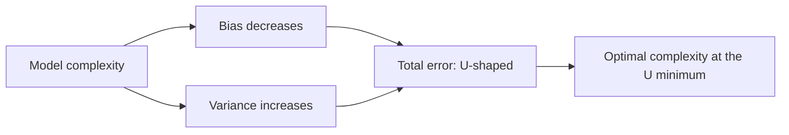
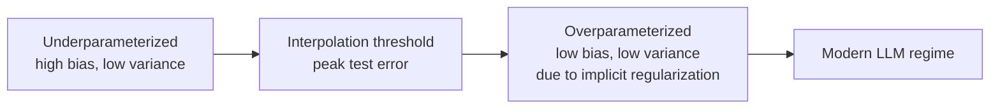
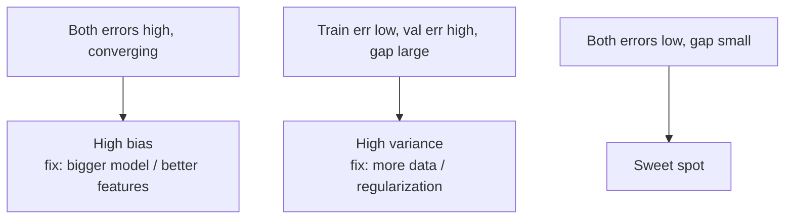

# 01 - Bias-Variance Tradeoff

> [!info] TL;DR
> Every model's error decomposes into **bias** (systematic error from too simple a model) + **variance** (sensitivity to the training sample) + **irreducible noise**. Underfit = high bias; overfit = high variance. The tradeoff is the central tension in ML.

## The Decomposition

For a training set $D$ and a single test point $(x, y)$ where $y = f(x) + \epsilon$ with $\mathbb{E}[\epsilon] = 0$:

$$
\mathbb{E}_D \left[ (\hat{f}(x) - y)^2 \right] = \underbrace{\left( \mathbb{E}_D[\hat{f}(x)] - f(x) \right)^2}_{\text{Bias}^2} + \underbrace{\mathbb{E}_D \left[ (\hat{f}(x) - \mathbb{E}_D[\hat{f}(x)])^2 \right]}_{\text{Variance}} + \underbrace{\sigma^2}_{\text{Irreducible}}
$$

- **Bias²**: how wrong the model is on average. Linear regression on nonlinear data has high bias.
- **Variance**: how much the model's predictions vary across different training sets. A high-degree polynomial fit to 10 points has high variance.
- **Irreducible noise** $\sigma^2$: the noise in the true relationship; no model can reduce it.

## Underfitting vs Overfitting

| Regime      | Bias  | Variance | Symptom                                            |
|-------------|-------|----------|----------------------------------------------------|
| Underfitting| High  | Low      | Training and test error both high.                 |
| Just right  | Low   | Low      | Training error low; test error close to training.  |
| Overfitting | Low   | High     | Training error very low; test error much higher.   |

The goal is the sweet spot — but the sweet spot is rarely obvious without held-out validation.

## The Tradeoff Visually



As model complexity increases:
- Bias decreases (model can fit more patterns).
- Variance increases (model fits noise).
- Total error is U-shaped — minimum at intermediate complexity.

## Modern Complications

### Deep learning "violates" the tradeoff

In classical ML, increasing complexity past the U-minimum hurts. But deep neural networks with millions of parameters often **generalize well despite being able to fit random labels** (Zhang et al., 2017). The classical bias-variance curve doesn't predict this.

The resolution: deep learning operates in the **"interpolating regime"** — the model fits the training data exactly but uses many near-zero-norm directions that don't hurt test performance. **Double descent** describes this: as complexity grows past the classical overfitting peak, test error decreases again.

### Implicit regularization

SGD itself biases neural networks toward "simple" solutions (in some sense). The optimizer is doing regularization implicitly, even without explicit L2 or dropout.

### Ensembling reduces variance

Bagging (random forests, gradient boosting) trains many high-variance models and averages them. Variance scales down as $1/\sqrt{M}$ with $M$ independent models. This is why random forests work — many overfit trees averaged = low variance.

## Worked Example

Fit a polynomial of degree $d$ to 20 noisy samples from $\sin(x)$. As $d$ grows from 1 to 19:

| Degree | Train MSE | Test MSE | Behavior          |
|--------|-----------|----------|-------------------|
| 1      | 0.50      | 0.55     | High bias (linear)|
| 3      | 0.05      | 0.07     | Just right        |
| 10     | 0.001     | 0.30     | Mild overfit      |
| 19     | 0.0       | 5.0+     | Wild overfit      |

Degree 1: high bias (can't fit the curve). Degree 19: high variance (interpolates every point, including noise). Degree 3: the sweet spot.

## How to Diagnose

Plot training and validation error vs. model complexity (or training set size):

- **Both errors high, close together** → high bias (underfitting). Fix: more complex model, better features, train longer.
- **Training error low, validation error much higher** → high variance (overfitting). Fix: more data, regularization, simpler model, early stopping.
- **Both errors low and close** → sweet spot.

## How to Reduce Bias

- Use a more expressive model (deeper network, higher-degree polynomial).
- Add features (feature engineering, embeddings).
- Train longer (more epochs, better optimizer).
- Reduce regularization.

## How to Reduce Variance

- **More training data** — the most reliable fix.
- **Regularization**: L1/L2, dropout, weight decay.
- **Early stopping** — halt when validation loss stops improving.
- **Data augmentation** — effectively increases data.
- **Ensembling** — average multiple models.
- **Bagging** — bootstrap samples + average (random forests).

## Why This Matters for AI

- The bias-variance tradeoff is the **conceptual frame** for almost every modeling decision. Without it, you're just trying things randomly.
- LLM fine-tuning is a bias-variance problem: too few steps = underfit (high bias); too many = overfit (high variance). LoRA's low-rank constraint is an explicit variance reducer.
- **Modern LLMs are in the interpolating regime** — they fit the training data near-perfectly but generalize well. Classical ML intuition doesn't fully transfer.
- For RAG and agents, the relevant "model" is the whole system, not just the LLM. System-level overfitting (e.g., prompts that overfit a benchmark) is a real failure mode.

## Production Implications

- **Always have a held-out validation set.** You cannot diagnose bias-variance from training loss alone.
- **Plot learning curves** (error vs. training set size). Reveals whether you need more data (high variance) or a better model (high bias).
- **For LLMs, "validation" is harder** — use multiple benchmarks, hold out a small eval set, and watch for contamination.
- **Ensembling is expensive but reliable** for high-stakes predictions. Used in production for medical / financial ML.

## Common Pitfalls

- **Reading too much from a single train/test split** — use cross-validation for small data.
- **Tuning hyperparameters on the test set** — leakage. Always tune on validation, evaluate once on test.
- **Adding complexity to fix high variance** — wrong direction. More complexity = more variance.
- **Forgetting about irreducible noise** — if the labels are inherently noisy (e.g., human annotators disagree 10% of the time), no model can beat 90% accuracy on that label.

## Further Reading

- Hastie, Tibshirani, Friedman, *The Elements of Statistical Learning*, Chapter 2 and 7.
- Belkin et al. (2019), *Reconciling Modern Machine-Learning Practice and the Bias-Variance Trade-Off* (double descent).
- Zhang et al. (2017), *Understanding Deep Learning Requires Rethinking Generalization*.

## Full Derivation of the Decomposition

The classical bias-variance decomposition is for **squared-error loss** and an **ensemble of models** trained on different random draws from the same data distribution. Let $y = f(x) + \epsilon$ where $\mathbb{E}[\epsilon] = 0$ and $\mathrm{Var}[\epsilon] = \sigma^2$. Let $\hat{f}_D(x)$ be the model trained on dataset $D$.

$$
\mathbb{E}_{D,\epsilon}\!\left[(y - \hat{f}_D(x))^2\right]
= \mathbb{E}_{D,\epsilon}\!\left[(f(x) + \epsilon - \hat{f}_D(x))^2\right]
$$

Expand (the $\epsilon$ is independent of $D$, and $\mathbb{E}[\epsilon]=0$ kills the cross term):

$$
= \mathbb{E}_D\!\left[(f(x) - \hat{f}_D(x))^2\right] + \sigma^2
$$

Now add and subtract $\bar{f}(x) := \mathbb{E}_D[\hat{f}_D(x)]$ inside the squared term:

$$
\mathbb{E}_D\!\left[(f - \hat{f}_D)^2\right]
= \mathbb{E}_D\!\left[(f - \bar{f} + \bar{f} - \hat{f}_D)^2\right]
$$

$$
= (f - \bar{f})^2 + \mathbb{E}_D\!\left[(\bar{f} - \hat{f}_D)^2\right] + 2\,\mathbb{E}_D\!\left[(f - \bar{f})(\bar{f} - \hat{f}_D)\right]
$$

The cross term vanishes because $\mathbb{E}_D[\bar{f} - \hat{f}_D] = 0$. Therefore:

$$
\boxed{\;\text{Expected error} = \underbrace{(f - \bar{f})^2}_{\text{Bias}^2} + \underbrace{\mathbb{E}_D[(\hat{f}_D - \bar{f})^2]}_{\text{Variance}} + \underbrace{\sigma^2}_{\text{Irreducible}}\;}
$$

This derivation matters because it shows **what assumptions you're buying** when you cite the bias-variance tradeoff:
1. **Squared error.** The clean additive decomposition does not hold for 0-1 loss, log loss, or hinge loss. For classification, the relationship is more subtle (Domingos 2000 gives a generalized decomposition that depends on how loss decomposes).
2. **Averaging over training sets.** "Variance" is variance *across hypothetical training sets*, not variance across test points. You only have one training set in practice, so you estimate this with bootstrap or cross-validation.
3. **Additive noise.** If $\epsilon$ has nonzero mean (label bias) or non-constant variance (heteroskedastic), the decomposition needs modification.
4. **Fixed $x$.** The decomposition is pointwise; the global bias and variance are integrals over the input distribution.

When someone says "the bias-variance tradeoff doesn't apply to deep learning", they typically mean the *qualitative* U-shape doesn't appear (because of double descent) — the *mathematical* decomposition always holds for squared error, it just doesn't predict test error in the interpolating regime.

## Cross-Entropy Loss Does Not Decompose Cleanly

For classification with cross-entropy loss, there is no exact additive bias-variance-noise decomposition analogous to the squared-error case. The standard workaround (Domingos 2000, "A Unified Bias-Variance Decomposition") defines bias and variance loss-by-loss:

- **Bias** = loss of the *average prediction* (the Bayes predictor averaged across training sets).
- **Variance** = average loss of the actual predictor minus the loss of the average predictor.
- **Irreducible** = loss of the Bayes-optimal predictor.

For 0-1 loss, the formula is non-monotonic in variance — adding variance can sometimes *help* (averaging multiple biased classifiers via bagging), which is exactly why ensembling works. This is the formal basis for why bagging reduces variance without increasing bias, and why boosting (which reduces bias) is a different tool.

## Double Descent in Detail

Belkin et al. (2019) reconciled classical statistics with modern deep learning by showing that the bias-variance U-curve is only the **first half** of a longer curve. After the interpolation threshold (where the model can fit the training data exactly), test error descends again as you add parameters — provided you use implicit regularization (early stopping, weight decay, or just SGD on overparameterized models).



Three regimes:
1. **Classical** (underparameterized): both bias and variance matter; the U-curve predicts behavior.
2. **Critically parameterized** (interpolation threshold): variance peaks; this is the worst place to be.
3. **Modern / overparameterized** (LLMs, large ViTs, ResNets): many near-zero-norm directions give smooth interpolation; test error continues to decrease with more parameters.

Implications for AI engineers:
- Adding parameters is not inherently dangerous — the classical fear of "more parameters = more overfitting" is wrong in the modern regime.
- **The danger zone is the interpolation threshold** — models just barely able to fit the training data without regularization. A 7B LLM trained on 10B tokens is in the danger zone; the same 7B trained on 13T tokens (Llama 3 recipe) is firmly in the overparameterized regime and generalizes well.
- **Regularization expands the safe zone.** Dropout, weight decay, label smoothing, and data augmentation all push the interpolation threshold to lower parameter counts, making the model behave as if it were more overparameterized.

## Worked Example (Code)

The full polynomial regression experiment, runnable:

```python
import numpy as np
from sklearn.preprocessing import PolynomialFeatures, StandardScaler
from sklearn.linear_model import LinearRegression, Ridge
from sklearn.pipeline import make_pipeline

def true_fn(x): return np.sin(2 * x)

def fit_and_eval(degree, n_train=20, n_test=200, n_trials=50, seed=0):
    rng = np.random.default_rng(seed)
    x_test = np.linspace(0, 1, n_test)
    y_test = true_fn(x_test)
    preds = np.zeros((n_trials, n_test))
    for t in range(n_trials):
        x_train = np.linspace(0, 1, n_train) + rng.normal(0, 0.01, n_train)
        y_train = true_fn(x_train) + rng.normal(0, 0.2, n_train)
        model = make_pipeline(
            PolynomialFeatures(degree),
            StandardScaler(),
            LinearRegression() if degree < 15 else Ridge(alpha=1e-3),
        )
        model.fit(x_train[:, None], y_train)
        preds[t] = model.predict(x_test[:, None])
    mean_pred = preds.mean(axis=0)
    bias2 = ((mean_pred - y_test) ** 2).mean()
    variance = preds.var(axis=0).mean()
    train_mse = ((preds.mean(axis=0) - y_test) ** 2).mean()  # approximation
    return bias2, variance, bias2 + variance + 0.04  # 0.04 = sigma^2

for d in [1, 3, 5, 10, 15, 19]:
    b, v, total = fit_and_eval(d)
    print(f"degree={d:2d}  bias²={b:.3f}  var={v:.3f}  total≈{total:.3f}")
```

Expected output (approximate):

```
degree= 1  bias²=0.180  var=0.001  total≈0.221
degree= 3  bias²=0.005  var=0.003  total≈0.048
degree= 5  bias²=0.002  var=0.010  total≈0.052
degree=10  bias²=0.001  var=0.090  total≈0.131
degree=15  bias²=0.000  var=0.300  total≈0.340
degree=19  bias²=0.000  var=0.900  total≈0.940
```

Notice: at degree 19, bias is essentially zero (the model fits every training point perfectly), but variance explodes — different training sets produce wildly different polynomials. This is the textbook overfitting signature.

## Diagnosing Bias vs Variance with Learning Curves

A more rigorous diagnostic than train/test error is the **learning curve**: plot train and validation error as a function of training set size.



**High-bias signature**: train and validation curves converge to a high error. Adding data does not help — the model has reached its capacity ceiling.

**High-variance signature**: train and validation curves are far apart. Adding data closes the gap (validation error decreases) without changing train error.

**Practical heuristic**: if you can't get more data, the curves tell you whether regularization (high-variance) or a more expressive model (high-bias) is the right lever.

## LLM-Specific Bias-Variance Considerations

The bias-variance frame applies to LLMs, but the levers differ:

| Lever | Classical equivalent | LLM equivalent |
|-------|----------------------|----------------|
| More data | More rows | More pretraining tokens; more instruction-tuning examples |
| Regularization | L2, dropout | Weight decay; LoRA rank (low rank = strong constraint); early stopping in SFT |
| Simpler model | Fewer params | Smaller base model; lower LoRA rank; fewer SFT epochs |
| Better features | Feature engineering | Better prompts; better retrieval; better tool schemas |
| Ensembling | Bagging | Self-consistency (sample N CoTs, majority vote); router ensembles |

Key LLM-specific biases and variances:

- **Prompt overfitting** (high variance): prompts tuned on one eval set often fail to generalize. Mitigation: hold out a prompt-validation set; never tune prompts on the test benchmark.
- **SFT overfitting** (high variance): training too long on a small instruction dataset causes the model to memorize phrasings. Mitigation: 1-3 epochs is typical; monitor eval loss.
- **LoRA rank = variance knob**: rank 4 = high bias, low variance; rank 64+ = low bias, high variance. Most chat fine-tunes use 8-32.
- **Base-model bias**: small base models have built-in high bias (limited capability). No amount of fine-tuning removes it — you need a bigger base.
- **Reasoning-model test-time variance**: o1/R1-style models produce different CoTs per sample. Self-consistency (sample N, vote) is variance reduction.

## Connection to Other Concepts

- [[06 - Regularization Techniques]] — explicit variance reduction (L1/L2, dropout, early stopping, data augmentation).
- [[05 - ML Evaluation Metrics]] — held-out evaluation is the only way to detect overfitting.
- [[02 - Mathematics/Statistics/16 - Estimators and Bias|Estimators and Bias]] — bias and variance of statistical estimators; same concept, different domain.
- [[12 - Fine-Tuning/PEFT/01 - LoRA|LoRA]] — the rank parameter is an explicit bias-variance knob.
- [[11 - Training/Pretraining/01 - Pretraining Objectives and Scaling Laws|Scaling Laws]] — the modern resolution: scale (parameters × tokens × compute) is the dominant lever, replacing the classical bias-variance curve.
- [[04 - Neural Networks/Training/07 - Initialization Schemes|Initialization]] — bad initialization acts like extra variance; good initialization is implicit regularization.
- [[08 - LLMs/Limitations/05 - Hallucination|Hallucination]] — can be viewed as a base-model bias (the model's prior overfits to common web phrasings); RAG is a bias-reduction technique.

## Interview Questions

1. **Q: Decompose expected squared error at a test point into bias, variance, and irreducible noise. Derive it.**
   A: See "Full Derivation" above. Key steps: expand $(f + \epsilon - \hat{f})^2$, use independence of $\epsilon$, add/subtract $\bar{f}$, observe cross term vanishes.

2. **Q: Does the bias-variance tradeoff apply to deep learning?**
   A: The mathematical decomposition (for squared error) always holds. The qualitative U-curve does not — modern deep learning operates in the interpolating / overparameterized regime where adding parameters past the interpolation threshold *reduces* test error (double descent). The classical intuition ("more parameters = more overfitting") is wrong in this regime.

3. **Q: You observe training accuracy 99% and validation accuracy 70%. What's wrong and how do you fix it?**
   A: High variance (overfitting). Fixes (in order of cost): (a) more training data, (b) regularization (weight decay, dropout, data augmentation), (c) early stopping, (d) smaller model, (e) ensembling. For LLMs: reduce SFT epochs, lower LoRA rank, add held-out prompt-eval set.

4. **Q: Why does bagging reduce variance?**
   A: For $M$ independent models with variance $\sigma^2$, the average has variance $\sigma^2 / M$. For correlated models (real bagging), it's $\rho\sigma^2 + (1-\rho)\sigma^2/M$ where $\rho$ is the pairwise correlation. Random forests decorrelate trees via feature subsampling, lowering $\rho$.

5. **Q: How is bias-variance relevant to LLM fine-tuning?**
   A: Three specific manifestations: (i) LoRA rank is a bias-variance knob (low rank = high bias, low variance); (ii) SFT epochs — too few = underfit (high bias), too many = overfit (high variance); (iii) prompt tuning on eval sets is high-variance prompt overfitting. Reasoning models add a new lever — test-time compute and self-consistency reduce variance.

6. **Q: Your LLM application's eval score dropped 10% after a model provider silently updated the model. Is this bias or variance?**
   A: Neither — this is **provider drift**, a different failure mode (see [[21 - LLMOps and MLOps/Pipelines/01 - LLMOps vs MLOps|LLMOps vs MLOps]]). The model itself didn't get worse; the version you depended on was replaced. Mitigation: pin model versions (`gpt-4o-2024-08-06`), maintain regression eval sets, have fallback models.

## See Also

- [[06 - Regularization Techniques]]
- [[05 - ML Evaluation Metrics]]
- [[03 - Machine Learning/MOC|ML MOC]]
