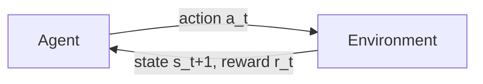

# 07 - MDPs and Bellman Equations

> [!info] TL;DR
> Reinforcement learning (RL) is learning by trial and error to maximize long-term reward. The formal framework is the **Markov Decision Process (MDP)**: states, actions, transitions, rewards. The Bellman equations define the value functions every RL algorithm tries to estimate.

## The RL Setup

An agent interacts with an environment over discrete time:

At each step $t$:
1. Agent observes state $s_t$.
2. Agent chooses action $a_t$ (via its policy).
3. Environment transitions to $s_{t+1}$ and emits reward $r_t$.
4. Repeat.

The agent's goal: maximize expected cumulative discounted reward:

$$
\mathbb{E}\left[ \sum_{t=0}^{\infty} \gamma^t r_t \right]
$$

where $\gamma \in [0, 1)$ is the **discount factor** (rewards sooner are worth more).

## Markov Decision Process (MDP)

Formally, an MDP is a tuple $(\mathcal{S}, \mathcal{A}, P, R, \gamma)$:

- $\mathcal{S}$: set of states.
- $\mathcal{A}$: set of actions.
- $P(s' \mid s, a)$: transition probability — probability of going to $s'$ from $s$ via action $a$.
- $R(s, a)$ (or $R(s, a, s')$): reward function.
- $\gamma$: discount factor.

The **Markov property**: the future depends only on the current state, not history. $P(s_{t+1} \mid s_t, a_t, s_{t-1}, a_{t-1}, \ldots) = P(s_{t+1} \mid s_t, a_t)$.

This is a strong assumption — many real environments are not strictly Markov. RL algorithms handle non-Markov environments by either augmenting the state with history (RNN, transformer) or accepting the approximation.

## Policies

A **policy** $\pi$ maps states to actions:
- **Deterministic**: $\pi(s) = a$.
- **Stochastic**: $\pi(a \mid s)$ = probability of taking action $a$ in state $s$.

The policy is what the agent learns. Everything else (transitions, rewards) is fixed by the environment.

## Value Functions

The **state-value function** $V^\pi(s)$: expected return starting from $s$ and following $\pi$:

$$
V^\pi(s) = \mathbb{E}_\pi \left[ \sum_{t=0}^{\infty} \gamma^t r_t \mid s_0 = s \right]
$$

The **action-value function** $Q^\pi(s, a)$: expected return starting from $s$, taking action $a$, then following $\pi$:

$$
Q^\pi(s, a) = \mathbb{E}_\pi \left[ \sum_{t=0}^{\infty} \gamma^t r_t \mid s_0 = s, a_0 = a \right]
$$

## The Bellman Equations

The recursive structure of value functions. The value of a state = immediate reward + discounted value of the next state.

### Bellman Expectation Equation (for a fixed policy)

$$
V^\pi(s) = \sum_a \pi(a \mid s) \sum_{s'} P(s' \mid s, a) \left[ R(s, a) + \gamma V^\pi(s') \right]
$$

$$
Q^\pi(s, a) = \sum_{s'} P(s' \mid s, a) \left[ R(s, a) + \gamma \sum_{a'} \pi(a' \mid s') Q^\pi(s', a') \right]
$$

These equations say: "the value of state $s$ under policy $\pi$ is the average immediate reward plus the discounted average value of the next state."

### Bellman Optimality Equation (for the best policy)

$$
V^*(s) = \max_a \sum_{s'} P(s' \mid s, a) \left[ R(s, a) + \gamma V^*(s') \right]
$$

$$
Q^*(s, a) = \sum_{s'} P(s' \mid s, a) \left[ R(s, a) + \gamma \max_{a'} Q^*(s', a') \right]
$$

The optimal value satisfies the Bellman equation **with max instead of average**. Solving this gives the optimal policy:

$$
\pi^*(s) = \arg\max_a Q^*(s, a)
$$

## Why the Bellman Equations Matter

1. **They define what we're computing.** Every RL algorithm estimates $V$, $Q$, or $\pi$ — all defined via Bellman equations.
2. **They give us update rules.** Temporal-difference (TD) learning uses the Bellman equation as a target: $Q(s, a) \leftarrow Q(s, a) + \alpha [r + \gamma \max_{a'} Q(s', a') - Q(s, a)]$.
3. **They reveal the structure of the problem.** Value functions decompose the long-term return into immediate reward + future value, making the problem tractable.

## Solving MDPs: Three Approaches

### 1. Value-based (Q-learning, DQN)
Learn $Q^*$, derive $\pi^*$ greedily. See [[08 - Q-Learning and DQN]].

### 2. Policy-based (Policy gradients, REINFORCE)
Directly parameterize $\pi_\theta$ and optimize $\theta$ via gradient ascent on expected return. See [[09 - Policy Gradients and Actor Critic]].

### 3. Actor-Critic (A2C, A3C, PPO)
Learn both a policy ("actor") and a value function ("critic"). The critic reduces variance of policy gradient estimates. **PPO is in this family** — see [[10 - PPO Deep Treatment]].

## The Role of $\gamma$

- $\gamma = 0$: myopic — only care about immediate reward.
- $\gamma \to 1$: far-sighted — care about all future rewards equally.
- $\gamma = 0.99$: typical for many RL tasks.
- $\gamma < 1$ ensures infinite-horizon returns are finite (geometric series).

Lower $\gamma$ = easier credit assignment but more myopic. Higher $\gamma$ = harder credit assignment but more far-sighted.

## Exploration vs Exploitation

The fundamental tension in RL:
- **Exploit**: take the action that currently looks best.
- **Explore**: try actions to learn more about them.

If you always exploit, you might miss better actions. If you always explore, you never accumulate reward. Common strategies:
- **$\epsilon$-greedy**: with probability $\epsilon$, take a random action; otherwise, greedy.
- **Softmax / Boltzmann**: sample actions proportional to their value.
- **UCB**: prefer actions with high uncertainty (optimism in face of uncertainty).

## Why This Matters for AI

- **RLHF is RL.** The PPO algorithm that aligns LLMs is built on this MDP formalism. The "state" is the prompt + partial generation, the "action" is the next token, the "reward" comes from the reward model.
- **Game-playing AI** (AlphaGo, AlphaZero, OpenAI Five) is pure RL on MDPs.
- **Robotics** uses RL for control.
- **Recommendation systems** can be framed as RL (state = user history, action = recommended item, reward = engagement).

## Production Implications

- RL is **much harder than supervised learning**. Sample efficiency is poor, training is unstable, evaluation is nontrivial.
- For most production AI, you'll use **offline RL** (train on logged data) or **RLHF** (which is closer to imitation learning with a twist) rather than online RL.
- The MDP formalism is a useful **modeling tool** even when you're not doing RL — it forces you to articulate states, actions, rewards.

## Common Pitfalls

- **Forgetting the Markov assumption** — if your state doesn't contain enough information, the agent can't act optimally.
- **Wrong reward design** — agents will exploit reward bugs (e.g., a cleaning robot that creates mess to clean up).
- **Discount factor too high** — credit assignment becomes very hard.
- **No exploration** — agent gets stuck in a local optimum.

## Further Reading

- Sutton & Barto, *Reinforcement Learning: An Introduction* — the canonical textbook.
- Silver's RL course (DeepMind): https://www.davidsilver.uk/teaching/
- OpenAI Spinning Up: https://spinningup.openai.com/

## See Also

- [[08 - Q-Learning and DQN]]
- [[09 - Policy Gradients and Actor Critic]]
- [[10 - PPO Deep Treatment]]
- [[03 - Machine Learning/MOC|ML MOC]]
- [[12 - Fine-Tuning/RLHF/RLHF with PPO|RLHF]] (planned) — where this matters for LLMs
