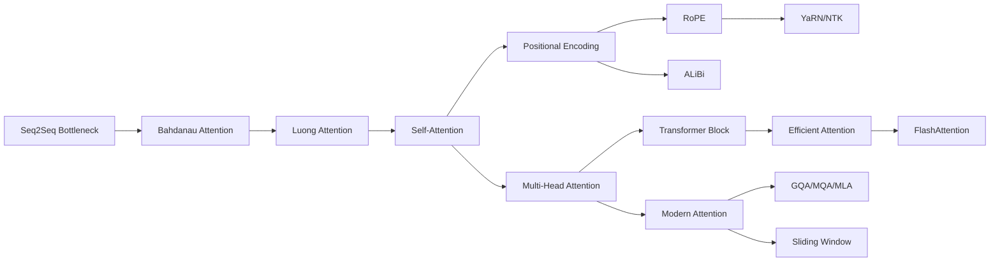

# 06 — Attention Mechanisms MOC

> [!info] Attention is the most important concept in modern AI. This chapter covers the complete attention roadmap in learning order: from Bahdanau's origins, through self-attention and multi-head attention, to modern efficient and long-context variants.

## Reading Order

| #   | Note                                              | Sub-domain          | Purpose                                            |
|-----|---------------------------------------------------|---------------------|----------------------------------------------------|
| 01  | [[01 - Origins of Attention]]                     | Origins             | The Seq2Seq bottleneck attention was invented to fix. |
| 02  | [[02 - Bahdanau Attention]]                       | Origins             | Additive attention; the original.                  |
| 03  | [[03 - Luong Attention]]                          | Origins             | Multiplicative attention; Transformer's ancestor.  |
| 04  | [[04 - Self-Attention]]                           | Self-Attention      | **The big idea.** Scaled dot-product, full derivation. |
| 05  | [[05 - Multi-Head Attention]]                     | Multi-Head          | Why multiple heads; head specialization.           |
| 06  | [[06 - Positional Encoding Overview]]             | Positional Info     | Survey of all positional encodings.                |
| 07  | [[07 - Sinusoidal and Learned Positional]]        | Positional Info     | The two earliest encodings.                        |
| 08  | [[08 - RoPE]]                                     | Positional Info     | **The modern default.** Deep treatment.            |
| 09  | [[09 - ALiBi]]                                    | Positional Info     | Linear bias; true extrapolation.                   |
| 10  | [[10 - YaRN and NTK-aware Scaling]]               | Positional Info     | Extending RoPE to longer contexts.                 |
| 11  | [[11 - FlashAttention]]                           | Efficient Attention | **The IO-aware exact attention.** Critical.        |
| 12  | [[12 - Sparse Attention]]                         | Efficient Attention | Longformer, BigBird; structured sparsity.          |
| 13  | [[13 - Linear Attention]]                         | Efficient Attention | Performer, Linformer; linear-time approximations.  |
| 14  | [[14 - GQA MQA MLA]]                              | Modern Attention    | **The biggest inference lever.** Llama/DeepSeek.   |
| 15  | [[15 - Sliding Window Attention]]                 | Modern Attention    | Mistral/Gemma; constant-memory cache.              |

## Sub-Domains

- [[06 - Attention Mechanisms/Origins/01 - Origins of Attention|Origins]] — notes 01–03
- [[06 - Attention Mechanisms/Self-Attention/04 - Self-Attention|Self-Attention]] — note 04
- [[06 - Attention Mechanisms/Multi-Head Attention/05 - Multi-Head Attention|Multi-Head Attention]] — note 05
- [[06 - Attention Mechanisms/MOC|Positional Information]] — notes 06–10
- [[06 - Attention Mechanisms/MOC|Efficient Attention]] — notes 11–13
- [[06 - Attention Mechanisms/Modern Attention/14 - GQA MQA MLA|Modern Attention]] — notes 14–15
- [[24 - Research Frontiers/Long-Context/07 - Long-Context Architectures|Long-Context Attention]] — (planned for iteration 3)
- [[23 - Multimodal AI/Fusion Architectures/06 - Cross-Modal Attention|Cross-Attention]] — (planned for iteration 3)

## The Big Picture

## See Also

- [[07 - Transformers/MOC|07 Transformers]] — attention is the core component
- [[08 - LLMs/MOC|08 LLMs]] — modern LLMs use all these attention variants
- [[13 - Inference/MOC|13 Inference]] — KV cache is attention's memory
- [[02 - Mathematics/MOC|02 Mathematics]] — the math behind attention
