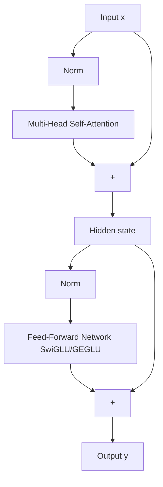

# Transformer Block

> [!info] TL;DR
> A Transformer block is the repeatable unit of a Transformer. It has two sublayers: (1) multi-head self-attention and (2) a feed-forward network. Each sublayer is wrapped in a residual connection and a normalization. Stack $N$ of these (typically 6–80+) and you have a Transformer.

## Architecture

A single Transformer block (modern pre-norm form, as in GPT-2, Llama, etc.):



In equations (pre-norm):

$$
\mathbf{h} = \mathbf{x} + \text{MHA}(\text{Norm}(\mathbf{x}))
$$

$$
\mathbf{y} = \mathbf{h} + \text{FFN}(\text{Norm}(\mathbf{h}))
$$

A full Transformer is $N$ stacked blocks:

$$
\mathbf{h}_0 = \text{Embed}(\text{tokens}) + \text{PositionalEncoding}
$$

$$
\mathbf{h}_l = \text{Block}_l(\mathbf{h}_{l-1}) \quad \text{for } l = 1, \ldots, N
$$

$$
\text{output} = \text{Head}(\mathbf{h}_N)
$$

## The Two Sublayers

### 1. Multi-Head Self-Attention (MHA)

 lets each token attend to all other tokens (or, with causal masking, all previous tokens). It's the "routing" or "communication" sublayer — it lets information flow across positions. See [[Multi-Head Attention]] and [[Self-Attention]].

### 2. Feed-Forward Network (FFN)

The FFN is applied **position-wise** (independently to each token's vector). It's the "computation" sublayer — it transforms each token's representation. The standard form:

$$
\text{FFN}(\mathbf{x}) = \mathbf{W}_2 \, \sigma(\mathbf{W}_1 \mathbf{x} + \mathbf{b}_1) + \mathbf{b}_2
$$

where $\sigma$ is an activation (ReLU in the original Transformer, GELU in BERT/GPT-2, SwiGLU in Llama/Mistral). See [[Activation Functions]].

The hidden dimension is typically 4× the model dimension. So a 4096-dim model has a 16384-dim FFN hidden layer — this is where most of the parameters live.

### Why two sublayers?

- MHA alone is **linear** in V (for fixed attention weights) — without the FFN's nonlinearity, the model couldn't compute complex functions per token.
- FFN alone has no cross-token communication — without MHA, the model couldn't share information across positions.
- Together, they cover both needs: MHA routes information, FFN computes per-token transformations.

## Residual Connections

Each sublayer is wrapped in a residual (skip) connection:

$$
\mathbf{y} = \mathbf{x} + \text{Sublayer}(\text{Norm}(\mathbf{x}))
$$

This means the input $\mathbf{x}$ is added directly to the sublayer's output. Residuals:

- **Stabilize training** of deep networks by giving gradients a shortcut path.
- **Let the model learn incremental updates** — the sublayer learns the *delta* from the input, not the full output.
- **Enable very deep networks** — without residuals, networks beyond ~10 layers are untrainable due to vanishing gradients.

See [[Residual Connections]].

## Normalization

Each sublayer's input is normalized (LayerNorm or RMSNorm) before being processed. See [[Normalization Layers]] and [[Pre-Norm vs Post-Norm]].

## Worked Implementation

```python
import torch
import torch.nn as nn

class TransformerBlock(nn.Module):
    def __init__(self, d_model, n_heads, d_ff, norm_eps=1e-5):
        super().__init__()
        self.norm1 = nn.RMSNorm(d_model, eps=norm_eps)  # modern Llama-style
        self.attn  = MultiHeadAttention(d_model, n_heads)
        self.norm2 = nn.RMSNorm(d_model, eps=norm_eps)
        self.ffn   = SwiGLUFFN(d_model, d_ff)
    
    def forward(self, x, mask=None):
        # Pre-norm residual
        x = x + self.attn(self.norm1(x), mask=mask)[0]
        x = x + self.ffn(self.norm2(x))
        return x

class Transformer(nn.Module):
    def __init__(self, vocab, d_model, n_heads, d_ff, n_layers, max_len):
        super().__init__()
        self.tok_emb = nn.Embedding(vocab, d_model)
        self.pos_emb = RoPE(d_model, max_len)  # modern default
        self.blocks  = nn.ModuleList([
            TransformerBlock(d_model, n_heads, d_ff) for _ in range(n_layers)
        ])
        self.norm_f  = nn.RMSNorm(d_model)
        self.head    = nn.Linear(d_model, vocab, bias=False)
    
    def forward(self, tokens):
        x = self.tok_emb(tokens)
        # RoPE applied inside attention, not here
        for block in self.blocks:
            x = block(x)
        x = self.norm_f(x)
        return self.head(x)
```

## Variants

### Encoder block (BERT)

- Bidirectional attention (no causal mask).
- Designed for representation learning (MLM).
- Output is a per-token contextual embedding.

### Decoder block (GPT, Llama)

- Causal attention (mask the future).
- Designed for autoregressive generation.
- Output is the next-token logits.

### Encoder-decoder block (T5, BART)

- Encoder: bidirectional, processes the source.
- Decoder: causal over target, plus cross-attention to encoder output.
- The cross-attention sublayer is a third sublayer (after self-attention and FFN).

See planned notes [[BERT]], [[GPT Family]], [[T5]].

## Hyperparameter Choices

| Hyperparameter      | Original (Vaswani) | GPT-2 small | Llama 2 7B | Llama 3 8B |
|---------------------|--------------------|-------------|------------|------------|
| `d_model`           | 512                | 768         | 4096       | 4096       |
| `n_heads`           | 8                  | 12          | 32         | 32         |
| `d_k` (head dim)    | 64                 | 64          | 128        | 128        |
| `d_ff` (FFN hidden) | 2048               | 3072        | 11008      | 14336      |
| `n_layers`          | 6                  | 12          | 32         | 32         |
| Norm                | LayerNorm (post)   | LayerNorm (pre) | RMSNorm (pre) | RMSNorm (pre) |
| Activation          | ReLU               | GELU        | SwiGLU     | SwiGLU     |
| Positional          | Sinusoidal         | Learned abs | RoPE       | RoPE       |
| Attention           | MHA                | MHA         | GQA        | GQA        |

## Why This Matters for AI

- The Transformer block is the **universal building block** of modern AI. Vision Transformers, audio Transformers, code Transformers, multimodal Transformers, diffusion Transformers — they're all stackings of this same block with minor variations.
- Understanding the block lets you:
  - Read model configs (`n_layers`, `n_heads`, `d_model`, `d_ff`).
  - Compute parameter counts and FLOPs estimates.
  - Identify which architectural choices distinguish model families.
  - Debug training issues (e.g., norm placement matters for stability).

## Production Implications

- **Parameter count** scales as $\approx 12 N d^2$ for an $N$-layer, $d$-dim decoder-only model (where $d \gg d_k$). The 4× FFN expansion is the dominant contributor.
- **Inference FLOPs per token** scale as $\approx 2 \cdot \text{params}$ for a forward pass (1 MAC = 2 FLOPs). A 7B model ≈ 14 GFLOPs per token.
- **Memory at inference** = parameters + KV cache. KV cache grows with context length; see [[KV Cache Mechanics]].
- **Block-level parallelism** is limited (each block depends on the previous). Pipeline parallelism splits blocks across GPUs.

## Common Pitfalls

- **Forgetting the final norm** — most modern models have a final LayerNorm/RMSNorm after the last block. Forgetting it causes subtle quality loss.
- **Wrong mask** — using a bidirectional mask in a decoder (or vice versa) breaks everything.
- **Forgetting causal mask in FFN** — FFN is position-wise, so it's always "causal" by construction. But if you accidentally let future tokens influence the FFN input (e.g., through wrong norm placement), you've broken causality.
- **Weight tying without scaling** — when sharing input/output embeddings, multiply the output by $\sqrt{d_{\text{model}}}$ (or use no scaling, depending on the paper).

## Further Reading

- Vaswani et al. (2017), *Attention Is All You Need* — the original.
- Xiong et al. (2020), *On Layer Normalization in the Transformer Architecture* — pre-norm vs post-norm.
- Llama 2 paper — modern default recipe (RMSNorm, SwiGLU, RoPE, GQA).
- Karpathy's nanoGPT — minimal clean implementation.

## See Also

- [[Self-Attention]] · [[Multi-Head Attention]]
- [[Residual Connections]] · [[Pre-Norm vs Post-Norm]] · [[Normalization Layers]]
- [[06 - Attention Mechanisms/MOC|Attention Mechanisms MOC]]
- [[08 - LLMs/MOC|LLMs MOC]]
