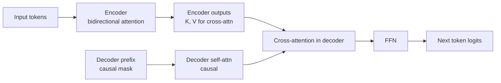

# 12 - T5 and BART

> [!info] TL;DR
> T5 (Raffel et al. 2019) and BART (Lewis et al. 2019) are **encoder-decoder** Transformers — distinct from BERT (encoder-only) and GPT (decoder-only). T5 frames every NLP task as "text-to-text"; BART uses a denoising autoencoder objective. Largely superseded by decoder-only LLMs, but still used in translation and summarization.

## Why Encoder-Decoder?

| Architecture       | Best for                            | Examples              |
|--------------------|-------------------------------------|-----------------------|
| Encoder-only       | Classification, NER, embeddings     | BERT, RoBERTa         |
| Decoder-only       | Generation, chat, code              | GPT, Llama, Mistral   |
| Encoder-decoder    | Translation, summarization          | T5, BART, Whisper     |

Encoder-decoder shines when:
- The input and output have different lengths and structures (translation).
- The input needs full bidirectional context (summarization needs to read the whole document).
- You want a separate "encoding" phase (Whisper encodes audio, then decodes text).

For most modern tasks, decoder-only LLMs (Llama, GPT) match or beat encoder-decoder. But T5/BART-style models survive in niches.

## T5 (Text-to-Text Transfer Transformer)

### The text-to-text framing

T5 frames every NLP task as "text in → text out":

- Translation: `"translate English to French: Hello" → "Bonjour"`
- Summarization: `"summarize: <article>" → "<summary>"`
- Classification: `"question: ...? context: ..." → "yes"/"no"`
- Regression: `"...": "0.7"`

Same model, same training, same loss — just different task prefixes. This unification was elegant and influential.

### Pretraining: Span Corruption

T5 was pretrained with **span corruption** — mask random spans (multiple consecutive tokens) and predict them:

```
Input:  Thank you for <X> me to your <Y> party
Target: <X> inviting <Y> birthday
```

The model learns to fill in arbitrary-length spans. Different from BERT's single-token masking.

### T5 variants

- **T5-small/base/large/3B/11B**: different scales.
- **mT5**: multilingual version, trained on 101 languages.
- **FLAN-T5**: instruction-tuned T5; one of the first instruction-tuned open models.
- **UL2**: a successor that unifies multiple pretraining objectives.

## BART (Bidirectional and Auto-Regressive Transformers)

BART uses a standard seq2seq Transformer (encoder + decoder) with a **denoising autoencoder** pretraining objective:

1. Corrupt the input (token masking, sentence shuffling, token deletion, document rotation).
2. Reconstruct the original.

BART's corruptions are more aggressive than T5's span corruption — it includes sentence-level and document-level corruption.

BART was SOTA for summarization when released (2019) and is still used in production summarization systems.

## When to Use T5/BART vs Decoder-Only LLMs

| Use case                          | Best choice                          |
|-----------------------------------|--------------------------------------|
| General chat / instruction-following | Decoder-only LLM (Llama 3, GPT-4) |
| Translation (production)          | Specialized MT model or LLM          |
| Summarization (high-volume)       | BART or T5 (smaller, faster than LLM)|
| Multilingual NLP                  | mT5 / multilingual LLM               |
| Speech-to-text                    | Whisper (encoder-decoder)            |
| General-purpose NLP with one model | Decoder-only LLM (more flexible)    |

For most 2026 use cases, **decoder-only LLMs** are the default. T5/BART are used when:
- You need a smaller, specialized model (BART for summarization).
- Latency / cost matters more than flexibility.
- You're working with the original T5 ecosystem (FLAN-T5 is still popular).

## Worked Example (FLAN-T5)

```python
from transformers import T5ForConditionalGeneration, T5Tokenizer

model_id = "google/flan-t5-base"
tokenizer = T5Tokenizer.from_pretrained(model_id)
model = T5ForConditionalGeneration.from_pretrained(model_id)

input_text = "Translate to French: Hello, how are you?"
inputs = tokenizer(input_text, return_tensors="pt")
outputs = model.generate(**inputs, max_new_tokens=50)
print(tokenizer.decode(outputs[0], skip_special_tokens=True))
# "Bonjour, comment allez-vous?"
```

## Why This Matters for AI

- Encoder-decoder is the **third major Transformer architecture**. Understanding it completes the picture.
- T5's text-to-text framing influenced modern instruction-tuning (every task → text generation).
- BART-style denoising autoencoders are the conceptual ancestor of diffusion models for text (rare but emerging).
- For **speech** (Whisper) and some **multimodal** models, encoder-decoder is still the right architecture.

## Production Implications

- For **summarization at scale**, BART-large or T5-large can be more cost-effective than a 7B LLM.
- For **translation**, specialized MT models (NLLB, mBART) often beat general LLMs on quality and cost.
- **FLAN-T5** is still a solid choice for a small, instruction-tuned model that runs on a single GPU.
- For most new applications, start with a decoder-only LLM. Move to T5/BART only if cost/latency demands it.

## Common Pitfalls

- **Using encoder-decoder for chat** — possible but awkward; the encoder doesn't help for autoregressive chat.
- **Forgetting that T5 needs task prefixes** — without `"translate: "`, the model doesn't know what to do.
- **Wrong max length** — T5's default is 512; long documents need explicit truncation or a long-context variant.
- **Comparing T5/BART to modern LLMs on quality** — the LLMs usually win. Use T5/BART for cost, not quality.

## Further Reading

- Raffel et al. (2019), *Exploring the Limits of Transfer Learning with a Unified Text-to-Text Transformer* (T5).
- Lewis et al. (2019), *BART: Denoising Sequence-to-Sequence Pre-training for Natural Language Generation, Translation, and Comprehension*.
- Xue et al. (2021), *mT5*.

## Information Flow in Encoder-Decoder (Detailed)

The encoder-decoder architecture has a fundamentally different information flow than decoder-only:



Key differences from decoder-only:
1. **Encoder is bidirectional** — every input token attends to every other input token. This is critical for tasks like summarization, where the entire input must be understood before any output is generated.
2. **Cross-attention is unidirectional** — decoder tokens attend to encoder outputs, but encoder never sees decoder tokens. This is what makes the architecture "translation-like": read the input fully, then write the output.
3. **KV cache is split** — the encoder's KV cache (computed once) is separate from the decoder's KV cache (grows during generation). The encoder's KV cache is shared across all decoder steps.

## T5 Span Corruption in Detail

T5's pretraining objective is more sophisticated than BERT's MLM:

```
Original:    "The quick brown fox jumps over the lazy dog"
Corrupted:   "The quick <X> jumps over the <Y>"
Target:      "<X> brown fox <Y> lazy dog"
```

The sentinel tokens `<X>`, `<Y>` are unique tokens added to the vocabulary. The model learns to predict the *spans* (one or more tokens) that were masked, separated by sentinels. This teaches:
- **Multi-token prediction** (unlike BERT's single-token MLM).
- **Span boundaries** — the model must figure out where a span ends.
- **Generation** — the target is a sequence, not a single token, so the model learns autoregressive generation.

Hyperparameters:
- Corruption rate: 15% of tokens (same as BERT).
- Average span length: 3 tokens (geometric distribution).
- Sentinel tokens: 100 unique sentinels (`<extra_id_0>` to `<extra_id_99>`).

T5's choice of span corruption (vs BERT's MLM, GPT's CLM) was empirical — they tried multiple objectives and span corruption won. Later work (UL2) showed that mixing objectives (a "mixture of denoisers") gives even better results.

## BART's Denoising Autoencoder in Detail

BART's pretraining is more aggressive than T5's. Multiple corruption types are combined:

| Corruption              | Description                                          | Why                                            |
|-------------------------|------------------------------------------------------|------------------------------------------------|
| Token masking           | Random tokens replaced with `<mask>`                 | Like BERT — basic denoising                    |
| Token deletion          | Random tokens removed entirely                       | Model learns length                            |
| Text infilling          | Spans replaced with a single `<mask>`                | Like T5, but single-mask for variable length   |
| Sentence permutation    | Sentences shuffled                                   | Document-level coherence                       |
| Document rotation       | Pick a random split point, swap halves               | Encourages finding the start of the document   |

The model must reconstruct the **original** text (not just fill in spans). This is harder than T5 — the model must track sentence order, length, and content simultaneously.

BART's pretraining is closer to the "general sequence-to-sequence" task than T5's span corruption. This is why BART excels at summarization (where the output is a coherent reconstruction of the input) and translation (after fine-tuning).

## Cross-Attention Mechanism (Detailed)

In encoder-decoder models, the decoder has two attention layers per block:
1. **Self-attention** (causal): decoder attends to its own prefix.
2. **Cross-attention** (full): decoder attends to encoder outputs.

```python
class DecoderBlock(nn.Module):
    def forward(self, x_dec, enc_out, dec_mask, enc_mask=None):
        # Self-attention (causal)
        x = x_dec + self.self_attn(
            self.q_norm(x_dec), self.k_norm(x_dec), self.v_norm(x_dec),
            attn_mask=dec_mask,
        )
        x = self.self_attn_norm(x)

        # Cross-attention (decoder queries, encoder keys/values)
        x = x + self.cross_attn(
            self.q_norm(x),         # queries from decoder
            self.k_norm(enc_out),   # keys from encoder
            self.v_norm(enc_out),   # values from encoder
            attn_mask=enc_mask,
        )
        x = self.cross_attn_norm(x)
        x = x + self.ffn(x)
        return self.ffn_norm(x)
```

The cross-attention KV cache (encoder outputs) is computed once during the prefill and reused for every generated token. This is why encoder-decoder models are efficient when the input is fixed and the output is short — you pay the encoder cost once.

## Why Decoder-Only Won (and When Encoder-Decoder Still Wins)

The trend 2018-2026 has been toward decoder-only, for several reasons:

1. **Simplicity**: one architecture, one set of weights, no cross-attention to manage.
2. **Scaling**: decoder-only scales predictably with parameter count and tokens (Chinchilla). Encoder-decoder scaling is less studied.
3. **In-context learning**: decoder-only models learn ICL spontaneously; encoder-decoder models need explicit fine-tuning for ICL.
4. **Unified training**: a single causal LM objective suffices for pretraining; no need to design a separate corruption objective.
5. **Modern LLM recipes** (Llama 3, DeepSeek) all use decoder-only.

**Where encoder-decoder still wins:**
- **Speech recognition (Whisper)**: input is audio (encoded once), output is text (autoregressive). The encoder is a log-mel spectrogram Transformer; the decoder cross-attends to it.
- **Translation at production scale**: specialized MT models (NLLB, mBART) are smaller, faster, and often higher-quality than general LLMs for translation.
- **Summarization at scale**: BART-large can outperform a 7B decoder-only LLM for high-throughput summarization with strict latency constraints.
- **Scientific sequence modeling**: protein sequences (ProtTrans), molecule generation — these have asymmetric input/output structures.
- **Code infilling** (FIM — fill-in-the-middle): some encoder-decoder formulations are natural for this.

## Full Worked Example: Summarization with BART

```python
from transformers import BartForConditionalGeneration, BartTokenizer

model_id = "facebook/bart-large-cnn"
tokenizer = BartTokenizer.from_pretrained(model_id)
model = BartForConditionalGeneration.from_pretrained(model_id)

article = """
The tower is 324 metres (1,063 ft) tall, about the same height as an 81-storey building,
and is the tallest structure in Paris. Its base is square, measuring 125 metres (410 ft)
on each side. During its construction, the Eiffel Tower surpassed the Washington Monument
to become the tallest man-made structure in the world, a title it held for 41 years until
the Chrysler Building in New York City was finished in 1930.
"""

# Tokenize (encoder input)
inputs = tokenizer(article, max_length=1024, truncation=True, return_tensors="pt")

# Generate (decoder)
summary_ids = model.generate(
    inputs["input_ids"],
    num_beams=4,
    max_length=150,
    min_length=50,
    length_penalty=2.0,
    early_stopping=True,
    no_repeat_ngram_size=3,
)
print(tokenizer.decode(summary_ids[0], skip_special_tokens=True))
# "The Eiffel Tower is 324 metres tall..."
```

Notable generation kwargs:
- `num_beams=4`: beam search (better than greedy for summarization).
- `length_penalty=2.0`: encourage longer summaries (BART tends to be terse).
- `no_repeat_ngram_size=3`: prevent repetitive summaries.

## Comparison Table: T5 Family vs BART Family vs Decoder-Only

| Aspect                     | T5 family                | BART family              | Decoder-only (Llama, GPT) |
|----------------------------|--------------------------|--------------------------|---------------------------|
| Architecture               | Encoder-decoder          | Encoder-decoder          | Decoder only              |
| Pretraining objective      | Span corruption          | Denoising autoencoder    | Causal LM                 |
| Bidirectional input        | Yes (encoder)            | Yes (encoder)            | No                        |
| Generation                 | Yes                      | Yes                      | Yes                       |
| Best at                    | Translation, multitask   | Summarization            | Chat, code, reasoning     |
| In-context learning        | Limited                  | Limited                  | Strong                    |
| Scales cleanly             | Yes                      | Yes                      | Yes (better studied)      |
| Served by                  | TGI, vLLM (partial)      | TGI, vLLM (partial)      | vLLM, TGI, TRT-LLM, SGLang |
| Modern usage               | Specialized tasks        | Specialized tasks        | Default for new apps      |
| Notable variants           | FLAN-T5, mT5, UL2        | BART-large, mBART        | Llama, Qwen, DeepSeek     |

## Production Patterns for T5/BART

If you're deploying T5/BART in 2026:
1. **Use specialized servers**: TGI supports T5/BART; vLLM has partial support. Full-featured encoder-decoder serving is less mature than decoder-only.
2. **Pin the model version**: T5/BART weights are stable, but the transformers library API changes. Pin both.
3. **Quantize carefully**: T5/BART quantize well to INT8 with bitsandbytes. INT4 quantization (GPTQ) is less reliable for encoder-decoder — test thoroughly.
4. **For multilingual**: NLLB-200 (200 languages) and mT5 are still the best open options for broad multilingual coverage.
5. **For summarization**: BART-large-cnn is a strong baseline. Consider fine-tuning on your domain — generic summarization doesn't transfer perfectly to legal, medical, or scientific text.

## Connection to Other Concepts

- [[07 - Transformers/Encoder Models/07 - BERT|BERT]] — encoder-only, the bidirectional baseline T5 builds on.
- [[07 - Transformers/Decoder Models/09 - GPT Family Evolution|GPT Family]] — decoder-only, the architecture that displaced T5/BART.
- [[07 - Transformers/Architecture/01 - Transformer Block|Transformer Block]] — the building block.
- [[07 - Transformers/Architecture/02 - Pre-Norm vs Post-Norm|Pre-Norm]] — T5 uses simplified RMSNorm-like in later variants.
- [[11 - Training/Pretraining/01 - Pretraining Objectives and Scaling Laws|Pretraining Objectives]] — span corruption is one of several objectives.
- [[23 - Multimodal AI/Audio/04 - Whisper|Whisper]] — modern encoder-decoder for speech.
- [[13 - Inference/Serving/04 - vLLM and Continuous Batching|vLLM]] — serving; encoder-decoder support is partial.

## Interview Questions

1. **Q: What is span corruption, and how does it differ from BERT's MLM?**
   A: T5's span corruption masks consecutive spans of tokens (avg length 3) and predicts the entire span, separated by unique sentinel tokens. BERT's MLM masks individual tokens (15% of tokens, with 80% replace, 10% random, 10% keep). Span corruption teaches multi-token generation; MLM teaches single-token prediction. T5's objective is closer to the generation task; BERT's is closer to representation learning.

2. **Q: When does encoder-decoder beat decoder-only?**
   A: Three cases: (1) Input is fundamentally different from output (audio → text in Whisper), (2) input needs full bidirectional context (long documents for summarization), (3) you need a small specialized model with high throughput (BART-large for summarization is ~5× faster than a 7B LLM). For general-purpose chat, code, and reasoning, decoder-only is the default.

3. **Q: Why does decoder-only dominate modern LLMs?**
   A: Five reasons: simpler architecture, cleaner scaling laws, spontaneous in-context learning, unified causal LM training objective, and the network effect (most serving frameworks, fine-tuning recipes, and research are decoder-only first). The architectural advantage is small; the ecosystem advantage is large.

4. **Q: What is cross-attention, and how is it different from self-attention?**
   A: Self-attention has Q, K, V all from the same sequence. Cross-attention has Q from one sequence (decoder) and K, V from another (encoder). The encoder is computed once; the decoder cross-attends to it at every layer. This is what enables translation-like "read input fully, then write output."

5. **Q: How would you choose between FLAN-T5, BART-large-cnn, and a 7B decoder-only LLM for a high-volume summarization task?**
   A: Start with FLAN-T5-large or BART-large-cnn if latency and cost are critical (they're ~5-10× cheaper per request than a 7B). Move to a 7B LLM only if (a) you need broader capabilities beyond summarization, (b) you need abstractive summarization that captures subtle semantics, or (c) you have a fine-tuning pipeline that can adapt the 7B to your domain. For pure summarization throughput, encoder-decoder still wins.

6. **Q: Why is T5's "text-to-text" framing historically important?**
   A: T5 was the first major model to frame *every* NLP task as text-to-text, unifying classification, translation, summarization, and even regression under one objective. This framing influenced instruction tuning (FLAN, InstructGPT), where every task is "instruction → response" — the same idea generalized. Modern LLMs are direct descendants of T5's text-to-text framing.

## See Also

- [[07 - BERT]]
- [[09 - GPT Family Evolution]]
- [[01 - Transformer Block]]
- [[07 - Transformers/MOC|Transformers MOC]]