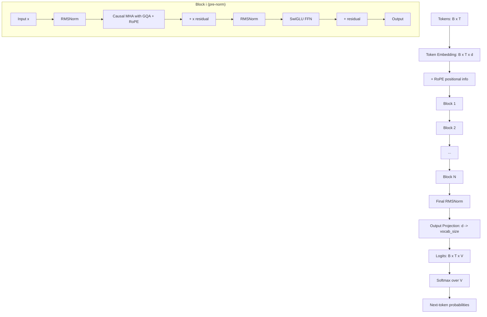

# 01 - Decoder-Only Architecture

> [!info] TL;DR
> Modern LLMs (GPT, Llama, Mistral, Qwen, DeepSeek) are **decoder-only** Transformers — they use causal self-attention and predict the next token. Simpler than encoder-decoder and more flexible; the dominant architecture for general-purpose LLMs in 2026. This note covers the architecture in depth, the causal mask, training and inference mechanics, why decoder-only beat encoder-decoder, the modern component recipe, parameter and FLOPs accounting, common implementation bugs, and production considerations.

## The Architecture

A decoder-only LLM is a stack of Transformer blocks with **causal** self-attention:

```
Tokens → Embeddings + RoPE → [Block 1] → [Block 2] → ... → [Block N] → Final Norm → Output Projection → Logits
                                                                                  ↓
                                                                              Next-token probs
```

Each block is the standard pre-norm Transformer block:
- RMSNorm → Causal MHA (with GQA) → Residual.
- RMSNorm → SwiGLU FFN → Residual.

The only difference from a bidirectional encoder: the **causal mask** in attention. Each token can only attend to itself and previous tokens (no peeking at the future).

### Detailed Block Diagram



## The Causal Mask

The causal mask is the defining feature of a decoder-only model. In attention, the score matrix $\mathbf{Q}\mathbf{K}^T$ has shape $(T, T)$ where $T$ is sequence length. Without a mask, every query attends to every key — bidirectional attention.

The causal mask sets the upper-triangle of this matrix to $-\infty$ before softmax:

```python
# scores: (B, H, T, T)
mask = torch.triu(torch.ones(T, T, dtype=torch.bool), diagonal=1)
scores = scores.masked_fill(mask, float('-inf'))
attn_weights = F.softmax(scores, dim=-1)
```

After softmax, the upper-triangle entries become 0 — query at position $i$ attends only to keys at positions $\leq i$.

### Why Causal Masking Matters

The causal mask enforces **autoregressive** generation: the model can only use past tokens to predict the next one. This is essential for:

1. **Generation**: at inference time, we generate one token at a time. The model must be able to compute $p(x_t | x_{<t})$ without seeing $x_{>t}$.
2. **Training efficiency**: with the causal mask, a single forward pass produces predictions for all positions simultaneously (each position's prediction uses only past tokens). This is $O(T)$ training instead of $O(T^2)$ (one forward pass per position).
3. **Correctness**: without the mask, the model would learn to "cheat" by copying future tokens, producing artificially low training loss but useless models.

### Variants of Causal Masking

- **Full causal** (standard): token $i$ attends to tokens $0..i$. Used by all modern decoder-only LLMs.
- **Prefix-LM**: tokens in a "prefix" range attend bidirectionally; tokens after attend causally. Used by some encoder-decoder hybrids (T5-style with prefix). Less common in 2026.
- **Bidirectional** (encoder-only): no mask. Used by BERT-style models. Can't generate.
- **Block-causal**: tokens attend within blocks, plus possibly a few "global" tokens. Used by Longformer-style models for long contexts.

## Training Objective: Next-Token Prediction

The model is trained to predict the next token given the previous tokens:

$$
\mathcal{L} = -\frac{1}{T} \sum_{t=1}^{T} \log p_\theta(x_t \mid x_{<t})
$$

This is **causal language modeling** (CLM), also called autoregressive language modeling. The same forward pass produces predictions for all positions simultaneously (each position's prediction uses only previous tokens, thanks to the causal mask).

### Cross-Entropy Loss in Code

```python
# logits: (B, T, V), input_ids: (B, T)
shift_logits = logits[..., :-1, :].contiguous()  # predict tokens 1..T-1
shift_labels = input_ids[..., 1:].contiguous()   # from tokens 0..T-2
loss = F.cross_entropy(
    shift_logits.view(-1, V),
    shift_labels.view(-1),
    ignore_index=-100,  # ignore padding / masked positions
)
```

The shift by 1 is critical: position $t$'s logits predict token $t+1$. Forgetting the shift means the model predicts the current token from itself (trivial identity, loss → 0 but model is useless).

### Why This Loss Works

The cross-entropy loss maximizes the log-likelihood of the training data under the model. By the chain rule of probability:

$$
p(x_1, x_2, \ldots, x_T) = \prod_{t=1}^T p(x_t | x_{<t})
$$

So minimizing $\mathcal{L}$ maximizes the probability the model assigns to the training sequence. This is maximum likelihood estimation — the standard training objective for generative models.

### Connection to Compression

Cross-entropy is directly related to **compression**: the negative log-likelihood is the number of bits needed to encode the data under the model's distribution. A model with lower cross-entropy compresses the data better. This is why LLM benchmarks report "bits per character" (BPC) or "perplexity" — they're compression metrics.

## Inference: Autoregressive Generation

To generate text:

1. **Prefill**: process the prompt → get logits for the next token. This is compute-bound (large matrix multiplications).
2. **Sample**: sample (or argmax) the next token from the logits.
3. **Append**: add the new token to the sequence.
4. **Decode**: re-run forward pass for the new token only (using KV cache for efficiency — see [[02 - KV Cache Mechanics]]). This is memory-bound.
5. **Repeat** until `[EOS]` or max length.

The KV cache makes decode $O(1)$ per token (after prefill) instead of $O(n)$. Without it, generating 1000 tokens would require 1000 forward passes, each over a growing context.

### Prefill vs. Decode: Compute Profile

| Phase    | Tokens processed | Compute per token | Bottleneck |
|----------|------------------|-------------------|------------|
| Prefill  | All prompt tokens (parallel) | $O(d^2)$ per token | Compute-bound |
| Decode   | 1 token at a time | $O(d^2)$ per layer, but small batch | Memory-bound (KV cache reads) |

This asymmetry drives inference optimization:
- **Continuous batching** (see [[06 - Continuous Batching Deep Dive]]) interleaves prefill and decode across requests.
- **Speculative decoding** (see [[05 - Speculative Decoding]]) uses a small draft model to predict multiple tokens, then verifies in one prefill-style pass.
- **Chunked prefill** splits long prompts into chunks to avoid stalling decode requests.

## Why Decoder-Only Won

| Architecture       | Pros                                    | Cons                                  |
|--------------------|-----------------------------------------|---------------------------------------|
| Encoder-only       | Great for classification, NER           | Can't generate                        |
| Encoder-decoder    | Good for translation, summarization     | More parameters; less flexible        |
| **Decoder-only**   | Simple, flexible, generates, all tasks  | Bidirectional context weaker (causal) |

Decoder-only wins on **flexibility** and **scaling**:
- One architecture handles chat, code, reasoning, translation, summarization.
- Scales predictably with parameters, data, compute (scaling laws).
- Simpler to train (one objective) and serve (one forward pass pattern).
- Better at in-context learning and instruction following — the key capabilities for general-purpose LLMs.

The bidirectional-context disadvantage is mostly overcome by scale — a 70B decoder-only model beats a 350M encoder-decoder on translation despite the architectural "disadvantage."

### Empirical Evidence

- **GPT-3 (2020)**: showed decoder-only at 175B beats fine-tuned encoder-decoder on most NLP tasks, just with few-shot prompting.
- **Chinchilla (2022)**: confirmed compute-optimal scaling for decoder-only.
- **Llama (2023)**: open-weights decoder-only matched GPT-3 at 65B, democratizing the architecture.
- **2024-2026**: every frontier model (GPT-4, Claude, Gemini, Llama 3, Qwen, DeepSeek) is decoder-only (or has a decoder-only core for text generation).

Encoder-decoder survives in niche applications:
- **Translation** (some specialized MT models still use encoder-decoder).
- **Speech-to-text** (Whisper is encoder-decoder).
- **Encoder-only** survives for embedding models and classification (BERT-style).

## The Modern Recipe (2024+)

The architectural choices that are now universal in open-source LLMs:

| Component | Choice | Why |
|-----------|--------|-----|
| Norm | RMSNorm (pre-norm) | Simpler than LayerNorm; no mean subtraction; pre-norm for stable training |
| Attention | GQA (grouped-query) | KV cache is smaller than MHA, faster than MQA |
| Positional | RoPE (with YaRN/NTK for extension) | Relative positions; extrapolates better than learned |
| FFN | SwiGLU | Better than ReLU/GELU; gating improves expressivity |
| Bias | No bias in linear layers | Simplifies kernels; small quality gain |
| Dropout | No dropout in pretraining | Regularization via data scale instead |
| Embeddings | Tied or untied | Untied slightly better; tied saves params |
| Final norm | RMSNorm after last block | Stabilizes output |
| Activation | SiLU (Swish) in SwiGLU | Smooth, non-saturating |
| Init | Standard init (e.g., 0.02 std) | Avoids early instability |

This recipe was popularized by Llama (2023) and is essentially universal in 2026 open-source LLMs.

### Concrete Hyperparameters (Llama 3 8B as example)

| Hyperparameter | Value |
|----------------|-------|
| Hidden size $d$ | 4096 |
| Layers | 32 |
| Attention heads | 32 |
| KV heads (GQA) | 8 |
| Head dim | 128 |
| FFN inner dim | 14336 (SwiGLU, ~3.5× expansion) |
| Vocab size | 128256 |
| Context length | 8192 (extendable to 1M with YaRN) |
| RoPE base | 500000 |
| Norm epsilon | 1e-5 |
| Total params | ~8.03B |

## Parameter and FLOPs Accounting

### Parameter Count

For a decoder-only LLM with:
- $d$: hidden size
- $L$: number of layers
- $V$: vocabulary size
- $h$: number of attention heads
- $d_{ff}$: FFN inner size (typically $4d$ or $\frac{2}{3} \cdot 4d$ for SwiGLU)
- $n_{kv}$: number of KV heads (GQA)

**Per-layer parameters**:
- Attention QKV: $d \cdot (d + 2 n_{kv} d_h)$ where $d_h = d / h$.
- Attention output: $d^2$.
- FFN (SwiGLU): $3 \cdot d \cdot d_{ff}$ (three matrices: gate, up, down).
- Norms: $2d$ (two RMSNorm layers).

**Total**:
- Embedding: $V \cdot d$ (untied) or shared with output.
- Layers: $L \cdot (\text{per-layer params})$.
- Final norm: $d$.
- Output projection: $V \cdot d$ (untied).

For Llama 3 8B: $\approx 8.03 \times 10^9$ parameters.

### FLOPs per Forward Pass

For sequence length $T$ and batch size $B$:

- **Attention (per layer)**: $O(B \cdot T^2 \cdot d)$ for the score computation + $O(B \cdot T^2 \cdot d)$ for the value combination. Total: $\approx 4 B T d^2 + 2 B T^2 d$ per layer (the $T^2$ term dominates for long contexts).
- **FFN (per layer)**: $O(B \cdot T \cdot d \cdot d_{ff})$. For SwiGLU with $d_{ff} \approx 4d$: $\approx 8 B T d^2$ per layer.
- **Total per layer**: $\approx 12 B T d^2 + 2 B T^2 d$.
- **Total forward**: $L \cdot (12 B T d^2 + 2 B T^2 d)$.
- **Total training** (forward + backward): $\approx 3 \times$ forward.

For Llama 3 8B at $T = 8192$, $B = 1$: forward $\approx 2.6 \times 10^{13}$ FLOPs (26 TFLOPs). At H100's ~700 TFLOPs (BF16), that's ~37ms per token — matches observed prefill latency.

### Rule of Thumb

For decoder-only LLMs, the **parameter count** and **FLOPs per token** are roughly:

$$
\text{FLOPs per token} \approx 6 \cdot N
$$

where $N$ is the parameter count (2 for forward, 3 for forward+backward, 6 for training step). For Llama 3 8B: $6 \cdot 8 \times 10^9 = 4.8 \times 10^{10}$ FLOPs per token. Training on 15T tokens: $7.2 \times 10^{22}$ FLOPs — matches published compute for similar-scale models.

## Worked Example (Forward Pass)

```python
import torch
import torch.nn as nn
import torch.nn.functional as F

class DecoderBlock(nn.Module):
    def __init__(self, d, h, n_kv, d_ff, eps=1e-5):
        super().__init__()
        self.norm1 = RMSNorm(d, eps)
        self.attn = GQA(d, h, n_kv)
        self.norm2 = RMSNorm(d, eps)
        self.ffn = SwiGLU(d, d_ff)
    
    def forward(self, x, freqs_cis, mask=None):
        x = x + self.attn(self.norm1(x), freqs_cis, mask)
        x = x + self.ffn(self.norm2(x))
        return x

class DecoderOnlyLLM(nn.Module):
    def __init__(self, vocab_size, d, L, h, n_kv, d_ff, max_seq_len):
        super().__init__()
        self.token_emb = nn.Embedding(vocab_size, d)
        self.layers = nn.ModuleList([
            DecoderBlock(d, h, n_kv, d_ff) for _ in range(L)
        ])
        self.norm = RMSNorm(d)
        self.output = nn.Linear(d, vocab_size, bias=False)
        # RoPE precomputed frequencies
        self.register_buffer('freqs_cis', precompute_rope(d // h, max_seq_len))
    
    def forward(self, input_ids):
        B, T = input_ids.shape
        x = self.token_emb(input_ids)  # (B, T, d)
        
        # Causal mask
        mask = torch.triu(
            torch.full((T, T), float('-inf'), device=x.device),
            diagonal=1
        )
        
        # Slice RoPE freqs for this sequence length
        freqs_cis = self.freqs_cis[:T]
        
        for layer in self.layers:
            x = layer(x, freqs_cis, mask)
        
        x = self.norm(x)
        logits = self.output(x)  # (B, T, V)
        return logits

# Loss
def compute_loss(model, input_ids):
    logits = model(input_ids)
    shift_logits = logits[..., :-1, :].contiguous()
    shift_labels = input_ids[..., 1:].contiguous()
    return F.cross_entropy(
        shift_logits.view(-1, shift_logits.size(-1)),
        shift_labels.view(-1),
        ignore_index=-100,
    )
```

## Why This Matters for AI

- Decoder-only is **the** LLM architecture. Every model you interact with (GPT-4, Claude, Llama, Mistral) is decoder-only.
- The simplicity (one architecture, one objective) is what made scaling laws discoverable and predictable.
- Understanding the causal mask is essential for understanding why LLMs can't "look ahead" and why prompting strategies (chain-of-thought, in-context examples) work the way they do.
- The prefill/decode asymmetry drives all inference optimization decisions (KV cache, continuous batching, speculative decoding).
- The parameter count and FLOPs estimates above let you reason about training and inference cost before you build.

## Production Implications

- For most applications, **use a decoder-only LLM**. Don't reach for encoder-decoder unless you have a specific reason (e.g., a specialized MT model, or Whisper for ASR).
- **Causal masking is essential** — a bug in the mask (e.g., forgetting it) leaks future information and breaks training. The model trains to near-zero loss but produces gibberish.
- **Inference cost** is dominated by the prefill (initial prompt processing) and the per-token decode cost. See [[13 - Inference/MOC|13 Inference]] for optimization.
- **Training cost** is dominated by data size and model size. Chinchilla scaling laws guide the compute-optimal tradeoff: ~20 tokens per parameter.
- **Context length matters**: longer context = more capable (more in-context examples, longer conversations) but more expensive (KV cache grows linearly, attention grows quadratically without FlashAttention).
- **MoE variants** (Mixtral, DeepSeek-V3) keep the decoder-only architecture but replace the FFN with a mixture of experts. Same training and inference patterns, but with sparse activation per token.

## Common Pitfalls

- **Forgetting the causal mask** — training appears to work (loss → 0) but the model learns to copy future tokens. The symptom: model produces gibberish at inference.
- **Wrong shift in loss computation** — shift logits and labels by 1; otherwise you predict the current token from itself. Symptom: loss is suspiciously low; model is trivial.
- **Mixing encoder and decoder patterns** — don't use bidirectional attention in a decoder model. The mask is essential.
- **Forgetting the final norm** — most modern models have one; omitting causes quality degradation. Symptom: logits have weird magnitudes; training is unstable.
- **RoPE applied to wrong tensors** — RoPE rotates Q and K, not V. Applying to V doesn't break correctness but wastes compute.
- **GQA head count mismatch** — if `n_kv` doesn't divide `h`, the broadcast fails. Use head_dim = $d / h$ and ensure $h / n_{kv}$ is an integer.
- **Embedding/output tying bugs** — if you tie weights, ensure the embedding and output projection share storage, not just initial values. Use `model.output.weight = model.token_emb.weight`.
- **Context length extension** — extending beyond training context length requires RoPE scaling (YaRN, NTK) or fine-tuning. Just using a longer context at inference produces garbage.
- **KV cache shape mismatch** — the cache must match the model's head structure (especially with GQA). Off-by-one in head counts produces silent corruption.
- **Numerical issues with FP16** — the final logits projection can overflow in FP16 for large vocabularies. Use FP32 for the final projection, or apply logit clipping.

## Comparison to Encoder and Encoder-Decoder

### Encoder-Only (BERT, RoBERTa, DeBERTa)

- **Attention**: bidirectional (no mask).
- **Objective**: masked language modeling (predict masked tokens).
- **Use cases**: classification, NER, embeddings, retrieval.
- **Cannot generate** text naturally.

### Encoder-Decoder (T5, BART, Whisper)

- **Encoder**: bidirectional attention over input.
- **Decoder**: causal attention over output, with cross-attention to encoder.
- **Objective**: seq2seq (predict target sequence given source).
- **Use cases**: translation, summarization, speech-to-text.
- **More parameters** for same capability, but specialized for seq2seq.

### Decoder-Only (GPT, Llama, Mistral, Qwen, DeepSeek)

- **Attention**: causal self-attention.
- **Objective**: next-token prediction.
- **Use cases**: everything (chat, code, reasoning, translation, summarization).
- **Simplest architecture; most flexible**.

## Interview Questions

- **Q: Why is the causal mask necessary?**  
  A: Without it, the model can "see" future tokens during training, learning to copy them rather than predict. This produces artificially low training loss but a useless model. The mask enforces autoregressive generation.

- **Q: How does the causal mask enable efficient training?**  
  A: With the mask, a single forward pass produces predictions for all positions simultaneously. Position $t$'s prediction uses only tokens $0..t-1$ (no leakage). This is $O(T)$ training instead of $O(T^2)$ (one forward pass per position).

- **Q: Why did decoder-only beat encoder-decoder?**  
  A: Decoder-only is simpler (one stack instead of two), more flexible (one architecture for all tasks), and scales better (predictable scaling laws). Encoder-decoder's bidirectional advantage is overcome by scale — a 70B decoder-only beats a 350M encoder-decoder on translation.

- **Q: What's the prefill/decode asymmetry, and why does it matter?**  
  A: Prefill processes all prompt tokens in parallel (compute-bound); decode generates one token at a time (memory-bound). This asymmetry drives inference optimization: continuous batching interleaves them, speculative decoding uses prefill-style verification, chunked prefill avoids stalling decode.

- **Q: Estimate the FLOPs for one forward pass of Llama 3 8B at sequence length 8192.**  
  A: Rough rule: $6 \cdot N$ FLOPs per token for training, $2 \cdot N$ for forward-only. For Llama 3 8B at 8192 tokens: $2 \cdot 8 \times 10^9 \cdot 8192 \approx 1.3 \times 10^{14}$ FLOPs (130 TFLOPs). At H100 ~700 TFLOPs (BF16), that's ~186ms — matches observed prefill latency.

- **Q: Why does GQA reduce KV cache size?**  
  A: With MHA, each of $h$ heads has its own K and V — KV cache is $2 \cdot h \cdot d_h \cdot T$ per layer. With GQA, $n_{kv} < h$ heads have K and V; the remaining heads share. KV cache is $2 \cdot n_{kv} \cdot d_h \cdot T$. For Llama 3 8B with $h=32$, $n_{kv}=8$, the cache is 4× smaller.

## Further Reading

- Radford et al. (2018), *Improving Language Understanding by Generative Pre-Training* (GPT-1).
- Brown et al. (2020), *Language Models are Few-Shot Learners* (GPT-3).
- Touvron et al. (2023), *Llama 2: Open Foundation and Fine-Tuned Chat Models*.
- Touvron et al. (2023), *Llama: Open and Efficient Foundation Language Models*.
- Hoffmann et al. (2022), *Training Compute-Optimal Large Language Models* (Chinchilla scaling laws).
- Kaplan et al. (2020), *Scaling Laws for Neural Language Models*.

## See Also

- [[02 - KV Cache Mechanics]]
- [[03 - Sampling Strategies]]
- [[07 - Transformers/Decoder Models/09 - GPT Family Evolution|GPT Family Evolution]]
- [[07 - Transformers/Architecture/01 - Transformer Block|Transformer Block]]
- [[04 - Self-Attention]] — the core attention mechanism
- [[14 - GQA MQA MLA]] — modern attention variants
- [[08 - RoPE]] — positional encoding
- [[05 - Feed-Forward Network Deep]] — FFN details
- [[04 - Normalization Layers]] — RMSNorm vs LayerNorm
- [[08 - LLMs/MOC|LLMs MOC]]
