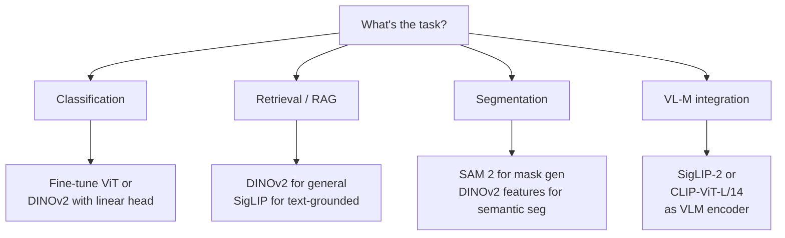

# 01 - Vision Foundation Models

> [!info] TL;DR
> Vision foundation models (ViT, CLIP, DINOv2, SigLIP, SAM) are pretrained on massive image corpora and produce general-purpose image representations. They power image classification, retrieval, segmentation, and form the vision encoder in multimodal LLMs.

## The Major Vision Foundation Models

### ViT (Vision Transformer)
Standard Transformer encoder applied to image patches. The backbone for most modern vision models. See [[07 - Transformers/Variants/13 - Vision Transformer ViT|ViT]].

### CLIP (Radford et al. 2021)
Two encoders (image + text) trained contrastively to align image and text embeddings. Powers image search, zero-shot classification, and is the vision encoder for many multimodal LLMs (LLaVA).

**Architecture**: ViT image encoder + Transformer text encoder. Trained on 400M image-text pairs.

**Capabilities**:
- Zero-shot image classification: "a photo of a [class]" → classify without training.
- Image retrieval: find images matching a text query.
- Image embeddings for downstream tasks.

### DINOv2 / DINOv3 (Meta, 2023–2024)
Self-supervised ViT — no labels needed. Produces general-purpose image embeddings that work across tasks (classification, segmentation, retrieval).

**Architecture**: ViT trained with self-distillation + image-level contrastive loss.

**Capabilities**: excellent frozen features for downstream vision tasks; segment anything with linear probes.

### SigLIP (Google, 2023)
Improved CLIP with sigmoid loss (instead of softmax with a global batch). Scales better, trains on smaller batches, achieves better retrieval.

Standard vision encoder for Gemma and many modern multimodal models.

### SAM / SAM 2 (Meta, 2023–2024)
Segment Anything Model. Given an image (and optional point/box prompt), produces a segmentation mask.

SAM 2 extends to video. Foundation for segmentation tasks.

## How Vision Foundation Models Are Used

### Standalone
- Image classification: fine-tune on a specific dataset.
- Image retrieval: embed and search.
- Segmentation: SAM for mask generation.

### In Multimodal LLMs
LLaVA, Qwen-VL, GPT-4V, Gemini, Claude — all use a vision foundation model (usually CLIP-family or SigLIP) as the image encoder. Images are encoded into "tokens" that the LLM attends to.

```
Image → ViT/CLIP encoder → image tokens → projector → LLM token space
```

## Worked Example (CLIP Zero-Shot)

```python
from transformers import CLIPModel, CLIPProcessor
from PIL import Image

model = CLIPModel.from_pretrained("openai/clip-vit-base-patch32")
processor = CLIPProcessor.from_pretrained("openai/clip-vit-base-patch32")

image = Image.open("photo.jpg")
texts = ["a cat", "a dog", "a car", "a tree"]

inputs = processor(text=texts, images=image, return_tensors="pt", padding=True)
outputs = model(**inputs)
logits = outputs.logits_per_image  # (1, 4)
predicted = texts[logits.argmax()]
```

## Why This Matters for AI

- Vision foundation models are the **standard vision encoders** in 2026. Building a custom CNN from scratch is rare.
- For multimodal LLMs, the choice of vision encoder is a major architectural decision affecting quality and efficiency.
- For RAG with images (PDFs, screenshots, diagrams), these models produce the embeddings.

## Production Implications

- **For image classification**, fine-tune a pretrained ViT or CLIP. HuggingFace `timm` has hundreds of variants.
- **For image retrieval / RAG**, use DINOv2 or SigLIP for general-purpose embeddings.
- **For multimodal LLMs**, pick a model with a strong vision encoder (LLaVA-NeXT, Qwen-VL, Claude 3.5+).
- **Quantization**: ViT models quantize well to INT8 with minimal loss.

## Detailed Comparison of Major Vision Encoders

| Model           | Year | Training Signal                              | Embedding Type        | Best Use Case                          |
|-----------------|------|----------------------------------------------|-----------------------|----------------------------------------|
| ViT             | 2020 | Supervised (ImageNet, JFT-300M)              | Per-patch             | Classification fine-tune               |
| CLIP            | 2021 | Contrastive (image, text)                    | Image-level           | Zero-shot classification, retrieval    |
| DINO            | 2021 | Self-distillation                            | Patch + image-level   | Self-supervised representation         |
| MAE             | 2022 | Masked autoencoder                           | Per-patch             | Pretraining for fine-tune              |
| DINOv2          | 2023 | Self-distillation + image-level contrastive  | Patch + image-level   | Frozen features for downstream tasks   |
| SigLIP          | 2023 | Sigmoid loss (image, text)                   | Image-level           | Open-vocabulary detection, retrieval   |
| SigLIP-2        | 2024 | SigLIP + multi-crop + adapted precision      | Image-level           | SOTA open image-text alignment         |
| SAM / SAM 2     | 2023-24 | Prompted segmentation                     | Mask                  | Interactive segmentation               |
| EVA-02          | 2023 | CLIP-init + weak supervision                 | Image-level + patch   | Strong open vision encoder             |
| NaViT           | 2023 | CLIP-style + variable resolution             | Image-level           | Real-world variable-resolution images  |

## CLIP Training Objective in Detail

CLIP uses an **InfoNCE** contrastive loss. For a batch of $N$ image-text pairs, CLIP computes:
1. Image embeddings $\mathbf{I} = [I_1, I_2, \dots, I_N]$ via the image encoder.
2. Text embeddings $\mathbf{T} = [T_1, T_2, \dots, T_N]$ via the text encoder.
3. A similarity matrix $S_{ij} = \cos(I_i, T_j) / \tau$ where $\tau$ is a learned temperature.
4. Loss = cross-entropy over rows (image-to-text) + cross-entropy over columns (text-to-image):

$$
\mathcal{L} = -\frac{1}{2N} \sum_{i=1}^N \left[ \log \frac{\exp(S_{ii})}{\sum_j \exp(S_{ij})} + \log \frac{\exp(S_{ii})}{\sum_j \exp(S_{ji})} \right]
$$

The key engineering detail: the batch size must be **large** (CLIP used 32K). The contrastive signal depends on having many "distractors" in each batch — small batches give weak signal. This is why CLIP-style training is expensive.

**SigLIP** replaces the softmax-based InfoNCE with **independent sigmoid losses per pair**: for each $(I_i, T_j)$, predict whether they match (binary cross-entropy). This decouples the loss from the batch size, allowing smaller batches and larger vocabularies. Empirically, SigLIP achieves better retrieval at the same scale.

## DINOv2 Self-Supervised Training (Detailed)

DINOv2 combines three losses:
1. **Self-distillation (DINO)**: the model is its own teacher. Two augmented views of an image are passed through student and teacher networks; their outputs are aligned. The teacher is an EMA of the student.
2. **Image-level contrastive (iBot)**: similar to CLIP but on two augmented views of the same image. Pushes apart different images, pulls together augmented views.
3. **Patch-level contrastive**: same as iBot but at the patch level, teaching local features.

The result: a vision encoder that produces features useful for *any* downstream task — classification, segmentation, retrieval — without task-specific fine-tuning. DINOv2-large achieves ~86% linear probe on ImageNet without any labels, comparable to supervised ViT.

The "frozen features" property is why DINOv2 is the default choice for vision RAG: you can embed any image into a 1024-dim vector that captures semantics, and similarity search works well without fine-tuning.

## How to Choose a Vision Encoder

A decision tree for picking a vision encoder:



Concrete recommendations:
- **General-purpose image embeddings for RAG**: DINOv2-large (1024-dim) or SigLIP-large (768-dim).
- **Zero-shot classification**: SigLIP-2 or OpenCLIP ViT-bigG.
- **Multimodal LLM encoder**: SigLIP-SO/14@384 (LLaVA-NeXT) or SigLIP-2-so400m (Qwen2-VL).
- **Interactive segmentation**: SAM 2 (with point/box prompts).
- **Semantic segmentation (per-pixel labels)**: fine-tune DINOv2 or use Mask2Former with a ViT backbone.
- **Document understanding**: Qwen2-VL or Donut (OCR-free document understanding).

## Production Worked Example: Building an Image Embedding Service

```python
import torch
from transformers import AutoModel, AutoImageProcessor
from PIL import Image
import faiss
import numpy as np

class ImageEmbeddingService:
    def __init__(self, model_id="facebook/dinov2-large", device="cuda"):
        self.model = AutoModel.from_pretrained(model_id).to(device).eval()
        self.processor = AutoImageProcessor.from_pretrained(model_id)
        self.device = device
        # Index for retrieval (1024-dim, cosine similarity)
        self.index = faiss.IndexFlatIP(1024)
        self.metadata = []

    @torch.no_grad()
    def embed(self, image: Image.Image) -> np.ndarray:
        inputs = self.processor(images=image, return_tensors="pt").to(self.device)
        outputs = self.model(**inputs)
        # DINOv2: use the CLS token (last_hidden_state[:, 0])
        emb = outputs.last_hidden_state[:, 0]
        emb = torch.nn.functional.normalize(emb, dim=-1)
        return emb.cpu().numpy().squeeze()

    def add_to_index(self, image: Image.Image, metadata: dict):
        emb = self.embed(image).reshape(1, -1)
        self.index.add(emb.astype(np.float32))
        self.metadata.append(metadata)

    def search(self, query_image: Image.Image, k: int = 5):
        emb = self.embed(query_image).reshape(1, -1).astype(np.float32)
        scores, indices = self.index.search(emb, k)
        return [(self.metadata[i], float(s)) for s, i in zip(scores[0], indices[0])]

# Usage
service = ImageEmbeddingService()
for img_path in image_paths:
    img = Image.open(img_path).convert("RGB")
    service.add_to_index(img, {"path": img_path})
results = service.search(Image.open("query.jpg").convert("RGB"), k=5)
```

Production considerations:
- **Batching**: embed batches of images (8-32) for 5-10× throughput.
- **GPU memory**: DINOv2-large is 300M params, ~1.2GB in fp16. Fits comfortably on a single GPU.
- **Quantization**: INT8 quantization costs ~1% recall at 4× memory savings.
- **Index choice**: FAISS IndexFlatIP for <100K images; IVF-PQ for millions; HNSW for online updates.

## SAM 2 Architecture (Brief)

SAM 2 (Segment Anything Model 2, Meta 2024) extends SAM to video. Key components:
- **Image encoder**: ViT-H (frozen after pretraining).
- **Prompt encoder**: encodes points, boxes, or text prompts into token embeddings.
- **Memory bank**: stores features from previous frames for video continuity.
- **Mask decoder**: lightweight Transformer that fuses image features, prompt tokens, and memory to produce masks.

For static images, SAM 2 behaves like SAM. For video, the memory bank allows tracking objects across frames with no per-frame annotation.

## Connection to Other Concepts

- [[07 - Transformers/Variants/13 - Vision Transformer ViT|ViT]] — the underlying architecture for most vision foundation models.
- [[23 - Multimodal AI/Vision-Language/02 - CLIP|CLIP]] — detailed CLIP note.
- [[23 - Multimodal AI/Vision-Language/03 - LLaVA|LLaVA]] — uses CLIP/SigLIP as vision encoder.
- [[23 - Multimodal AI/Diffusion/05 - DiT and FLUX|DiT/FLUX]] — vision foundation models for generation.
- [[17 - RAG/MOC|RAG]] — image embeddings for multimodal retrieval.
- [[09 - Foundation Models/Embedding Models/02 - Embedding Models for Retrieval|Embedding Models for Retrieval]] — text-side equivalents.

## Interview Questions

1. **Q: What's the difference between CLIP and DINOv2 for image retrieval?**
   A: CLIP aligns images with text in a shared space — embeddings are "text-aware." DINOv2 produces pure vision embeddings (no text supervision) that capture visual semantics. For text-to-image retrieval, CLIP/SigLIP. For image-to-image retrieval, DINOv2 is generally better (it captures visual similarity, not just text-aligned similarity).

2. **Q: Why does SigLIP beat CLIP at the same scale?**
   A: CLIP uses a softmax-based InfoNCE loss, which requires large batches (32K+) to provide enough "distractors" for the contrastive signal. SigLIP replaces this with independent per-pair sigmoid losses, decoupling the loss from batch size. This allows training on smaller batches, larger vocabularies, and more diverse data. Empirically, SigLIP achieves better retrieval at the same parameter count.

3. **Q: When would you use SAM vs DINOv2 for segmentation?**
   A: SAM produces *instance* masks given a prompt (point, box, or text) — it's interactive and produces exact boundaries. DINOv2 features need a downstream segmentation head (like Mask2Former) trained on labeled masks. For zero-shot interactive segmentation, SAM. For training a semantic segmentation model, DINOv2 + a fine-tuned head.

4. **Q: How do you embed a 1024×1024 image for retrieval with a 224-trained ViT?**
   A: Two options: (1) resize to 224×224 (loses fine detail), or (2) tile into 4×4 sub-images, embed each, and pool. Option 2 is what most production systems do for high-res retrieval. NaViT and SigLIP-2 support variable resolution natively, avoiding this tradeoff.

5. **Q: What's the cost of using a vision foundation model in production?**
   A: DINOv2-large: ~1.2GB GPU memory, ~30ms per image on A100. CLIP-ViT-L/14: similar. SAM 2: ~2.5GB, ~80ms per image. For high-throughput serving, batch 16-32 images. Cost: ~$0.0001-0.001 per image on cloud GPUs (assuming 30-50% utilization).

6. **Q: Why is CLIP's contrastive loss called InfoNCE?**
   A: It's the Noise-Contrastive Estimation (NCE) loss applied to mutual information estimation. The loss lower-bounds the mutual information between image and text embeddings. By maximizing this lower bound, CLIP learns a representation where image-text pairs that semantically match have high similarity. The "Info" prefix comes from the information-theoretic interpretation.

## See Also

- [[07 - Transformers/Variants/13 - Vision Transformer ViT|ViT]]
- [[23 - Multimodal AI/MOC|Multimodal AI MOC]]
- [[09 - Foundation Models/MOC|Foundation Models MOC]]