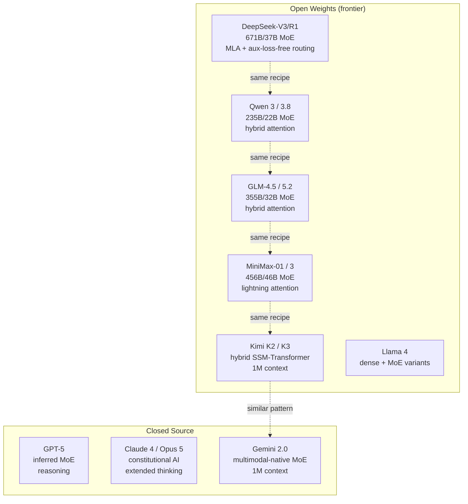

# 10 — 2026 Frontier Model Synthesis

> [!info] TL;DR
> The 2026 frontier LLM landscape has converged on a recognizable architectural recipe: **MoE capacity + hybrid attention + reasoning training + multimodal fusion + long context + spec decoding**. Every frontier lab (DeepSeek, Qwen, GLM, MiniMax, Kimi, Anthropic, Google, OpenAI) is shipping variants of this recipe. This note synthesizes what's converged, what's still diverging, and what is genuinely novel in 2026.

## The Converged 2026 Frontier Recipe

By mid-2026, the following components are standard across frontier models:

| Component                | 2026 Default                                       | Who Uses It                                                       |
|--------------------------|----------------------------------------------------|-------------------------------------------------------------------|
| Attention                | Hybrid linear + full attention, 7:1 ratio         | MiniMax-01, Kimi K2, GLM-4.5, Qwen 3 (and expected in K3, 3.8, MiniMax 3) |
| Sparse capacity          | MoE with 8–256 experts, 2–8 active                  | DeepSeek-V3, Qwen 3, GLM-4.5, MiniMax-01, Mixtral, Gemini 1.5/2.0 |
| Positional encoding      | RoPE with YaRN or NTK-aware scaling                  | Llama 3, Mistral, Qwen, DeepSeek, GLM                              |
| Normalization            | RMSNorm (pre-norm)                                  | All modern LLMs                                                   |
| Activation               | SwiGLU                                              | All modern LLMs                                                   |
| Long context             | 256K–1M tokens                                       | Kimi K2 (1M), MiniMax-01 (1M), Gemini 1.5/2.0 (1M), Claude 4 (200K-1M) |
| Reasoning                | RL on verifiable rewards (GRPO)                      | DeepSeek-R1, Kimi K1.5, Qwen 3-Thinking, MiniMax-M1, GLM-Z1, o1, Claude thinking |
| Multimodal fusion        | Native multimodal (early fusion)                    | Gemini (since 1.0), Claude 4 (inferred), GPT-4o (inferred); expected in Qwen 3.8, MiniMax 3 |
| Inference acceleration   | EAGLE-2/EAGLE-3 spec decoding, FP8                   | vLLM, TensorRT-LLM, SGLang (all major serving engines)             |

The convergence is striking: the 2024 "Llama-style" recipe (GQA + RoPE + SwiGLU + RMSNorm + pre-norm) has been extended with sparse capacity (MoE) and hybrid attention. By 2026, every frontier model follows roughly this pattern.

## What's Still Diverging

### Specific Linear-Attention Variant
Different labs use different linear-attention formulations:
- **MiniMax-01**: lightning attention (custom kernel-friendly formulation).
- **Kimi K2**: hybrid SSM-Transformer (Mamba-style selective scan variant).
- **GLM-4.5**: hybrid attention with sparse pattern (specific variant in technical report).
- **Qwen 3**: hybrid attention with sparse/linear layers (specific variant in technical report).

It's unclear which formulation will win. Each has tradeoffs in kernel efficiency, training stability, and quality. Mamba-2's SSD framework provides a theoretical unification, but production implementations differ.

### MoE Granularity
Different labs use very different expert configurations:
- **Mixtral 8x22B**: 8 experts, 2 active — coarse-grained.
- **Mixtral 8x7B**: 8 experts, 2 active — coarse-grained.
- **DeepSeek-V3**: 256 experts, 8 active — fine-grained.
- **Qwen 3 235B**: 94 experts, 8 active — medium-grained.
- **GLM-4.5**: ~128 experts (estimated from 355B/32B ratio).
- **MiniMax-01**: 32 experts, 2 active — coarse-grained.

Fine-grained MoE (DeepSeek-style, 100+ experts) gives better specialization but more routing overhead. Coarse-grained (Mixtral-style, 8 experts) is simpler but less specialized. The 2026 trend is toward fine-grained.

### Open vs Closed
- **Open weights**: DeepSeek-V3/R1, Qwen 3, GLM-4.5, MiniMax-01, Kimi K2, Llama 3/4, Mistral, Gemma.
- **Closed/API-only**: GPT-4/5, Claude 3.5/4/5, Gemini 1.5/2.0.

The open-weights ecosystem has caught up to the closed ecosystem on most benchmarks. By 2026, the quality gap is small enough that production decisions often hinge on cost, latency, and self-hosting requirements rather than capability.

### Reasoning Architecture
- **Visible CoT** (user sees the reasoning trace): DeepSeek-R1, Kimi K1.5, Claude 3.7+ extended thinking.
- **Hidden CoT** (reasoning is internal): OpenAI o1/o3, GPT-5 (inferred).
- **No CoT** (standard inference): Llama 3, Mistral, Gemma.

The visible-vs-hidden debate is unresolved. Visible CoT allows debugging and trust-building; hidden CoT protects IP and avoids prompt injection via the reasoning trace.

## What's Genuinely Novel in 2026

### 1. Test-Time-Learning Architectures (Titans)
Titans (Google, 2024) introduced a persistent neural memory module updated via gradient descent at inference. This is genuinely beyond attention (no persistent state) and SSMs (fixed-size state). Whether Titans-style architectures reach production in 2026 frontier models is an open question.

See [[26 - Papers/2024-2026/46 - Titans 2024]].

### 2. Speculative Decoding as Default
By 2026, speculative decoding (EAGLE-2/EAGLE-3) is no longer optional in production serving — it's the default. Major serving engines (vLLM, TensorRT-LLM, SGLang) ship with EAGLE-2/EAGLE-3 support out of the box. This represents a major shift from 2023 when spec decoding was research-grade.

See [[26 - Papers/Efficient Attention/49 - Medusa and EAGLE 2024]].

### 3. Multimodal-Native Becomes Default
Gemini pioneered native multimodal (text+image+audio+video from training start). By 2026, GPT-4o, Claude 4 (inferred), and likely Qwen 3.8 / MiniMax 3 follow this pattern. Stitched multimodal (LLaVA-style: separate vision encoder + projector + LLM) is increasingly seen as legacy.

See [[23 - Multimodal AI/Vision-Language/01 - Multimodal AI Overview]].

### 4. Hybrid Attention Goes Mainstream
In 2024, hybrid attention was niche (Jamba, H3, Mamba-2). By 2026, every major open-weights frontier model (Kimi K2, MiniMax-01, GLM-4.5, Qwen 3) uses some form of hybrid attention. Pure softmax attention is becoming the exception, not the rule, at frontier scale.

See [[24 - Research Frontiers/Hybrid Architectures/03 - RWKV and RetNet]] and [[24 - Research Frontiers/State Space Models/01 - SSMs Mamba and Frontiers]].

### 5. FP8 Training
Hopper (H100) GPUs added FP8 support. By 2026, FP8 training is standard for frontier-scale pretraining (DeepSeek-V3 was among the first to use FP8 extensively). FP8 reduces memory and doubles throughput vs BF16.

See [[11 - Training/Optimization/04 - Mixed Precision Training]].

### 6. RL on Verifiable Rewards as Default for Reasoning
DeepSeek-R1 (Jan 2025) demonstrated that RL on verifiable rewards (math correctness, code tests) produces reasoning capability emergently. By 2026, every frontier reasoning model uses some variant of this recipe. The earlier PPO + reward-model approach (InstructGPT, original GPT-4) is fading.

See [[26 - Papers/2024-2026/12 - DeepSeek-R1 2025]] and [[26 - Papers/Alignment/50 - Process Reward Models 2023]].

## The 2026 Frontier Architecture Map

## Architectural Verification Status (Summary)

| Model          | Architecture Disclosed? | Source                                          |
|----------------|-------------------------|-------------------------------------------------|
| DeepSeek-V3/R1 | Yes (full)              | Technical report                                |
| Qwen 3         | Yes (partial)           | Technical report + model card                   |
| GLM-4.5        | Yes (partial)           | Technical report                                |
| MiniMax-01      | Yes (full)              | Technical report                                |
| Kimi K2        | Yes (full)              | Technical report (Kimi Linear)                   |
| Llama 3/4       | Yes (full)              | Technical report + model card                   |
| Mistral        | Yes (full)              | Blog posts + model card                         |
| Gemma          | Yes (full)              | Technical report + model card                   |
| GPT-4 / GPT-5   | No                      | Strong inference only                           |
| Claude 4 / Opus 5| No                     | Strong inference only                           |
| Gemini 1.5/2.0 | Partial                 | Technical report (partial disclosure)           |
| Fable 5        | No                      | Insufficient public evidence                    |
| Mythos         | No                      | Insufficient public evidence                    |

## Why This Synthesis Matters

1. **Architectural convergence is real** — by 2026, the open-weights frontier has converged on a recognizable recipe. This is different from 2023 when there was genuine architectural diversity (Mistral vs Llama vs Qwen had meaningful differences; today they share most components).

2. **The remaining divergence is in implementation** — linear-attention variant, MoE granularity, attention schedule, and reasoning training method. These are implementation details, not architectural revolutions.

3. **Closed-source models are increasingly hard to differentiate** — without architectural disclosure, we can only infer that GPT-5, Claude 5, and Gemini 2.0 use some variant of the converged recipe. The actual differences may be small.

4. **The next architectural revolution is unclear** — beyond Titans (test-time learning) and continued hybrid-attention refinement, there's no clear "next big thing" in 2026. The field may be entering a period of consolidation rather than revolution.

## Connection to Other Concepts

- [[10 - Model Architecture Research/MOC]] — parent chapter.
- [[10 - Model Architecture Research/Open Source/01 - DeepSeek Architecture]] — reference open-weights MoE.
- [[10 - Model Architecture Research/Open Source/05 - Qwen Family Architecture]] — Chinese open-weights MoE.
- [[10 - Model Architecture Research/Open Source/07 - GLM 5.2 Architecture]] — Chinese open-weights MoE.
- [[10 - Model Architecture Research/Open Source/08 - Qwen 3.8 Architecture]] — 2026 Chinese open-weights MoE.
- [[10 - Model Architecture Research/Open Source/09 - MiniMax 3 Architecture]] — 2026 hybrid attention.
- [[10 - Model Architecture Research/Closed Source/07 - GPT-4 Inferred Architecture]] — closed-source inference.
- [[10 - Model Architecture Research/Closed Source/08 - Claude Architecture]] — closed-source inference.
- [[10 - Model Architecture Research/Closed Source/09 - Gemini Architecture]] — partially disclosed.
- [[10 - Model Architecture Research/Closed Source/10 - Fable 5 Architecture]] — unverifiable.
- [[10 - Model Architecture Research/Closed Source/11 - Kimi K3 Architecture]] — 2026 hybrid + reasoning.
- [[10 - Model Architecture Research/Closed Source/12 - Opus 5 Architecture]] — 2026 closed-source.
- [[10 - Model Architecture Research/Closed Source/13 - Mythos Architecture]] — unverifiable.
- [[24 - Research Frontiers/MOC]] — research context.
- [[00 - Vault Management/Research Queue]] — open research items.

## See Also

- [[10 - Model Architecture Research/MOC|Model Architecture Research MOC]]
- [[00 - Vault Management/Research Queue]]
