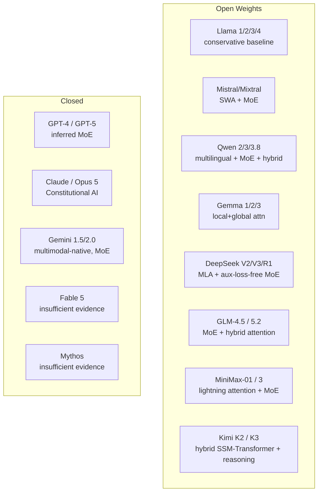

# 10 — Model Architecture Research MOC

> [!info] Per-model architecture deep dives. Iteration 5 added per-model deep dives for Llama, Mistral, Qwen, Gemma (open-source) and GPT-4, Claude, Gemini (closed-source, with source-labelling per ADR-006). Iteration 13 added 7 new 2026 model notes (Fable 5, Kimi K3, Opus 5, Mythos, GLM 5.2, Qwen 3.8, MiniMax 3) plus a synthesis note. Total: 16 model architecture notes + 1 synthesis note.

## Reading Order

| #   | Note                                              | Sub-domain      | Purpose                                            |
|-----|---------------------------------------------------|-----------------|----------------------------------------------------|
| 01  | [[01 - DeepSeek Architecture]]                    | Open Source     | MLA + aux-loss-free MoE.                           |
| 02  | [[02 - Llama Mistral Qwen Comparison]]            | Open Source     | The three dominant open families.                  |
| 03  | [[03 - Llama Family Architecture]]                | Open Source     | Llama 1/2/3/4 evolution. **Officially Confirmed**. |
| 04  | [[04 - Mistral and Mixtral Architecture]]         | Open Source     | SWA + MoE. **Officially Confirmed**.               |
| 05  | [[05 - Qwen Family Architecture]]                 | Open Source     | Multilingual + MoE. **Officially Confirmed**.      |
| 06  | [[06 - Gemma Architecture]]                       | Open Source     | Local+global attention, distillation. **Officially Confirmed**. |
| 07  | [[07 - GLM 5.2 Architecture]]                     | Open Source     | 2026 Chinese open-weights MoE + hybrid attention. **Strong inference**. |
| 08  | [[08 - Qwen 3.8 Architecture]]                   | Open Source     | 2026 Qwen refinement. **Strong inference**.        |
| 09  | [[09 - MiniMax 3 Architecture]]                   | Open Source     | 2026 hybrid lightning attention + MoE. **Strong inference**. |
| 10  | [[10 - Fable 5 Architecture]]                     | Closed Source   | 2026 model — **insufficient public evidence**.    |
| 11  | [[11 - Kimi K3 Architecture]]                     | Closed Source   | 2026 hybrid + reasoning successor. **Strong inference**. |
| 12  | [[12 - Opus 5 Architecture]]                       | Closed Source   | 2026 Anthropic successor. **Insufficient public evidence**. |
| 13  | [[13 - Mythos Architecture]]                      | Closed Source   | 2026 model — **insufficient public evidence**.    |
| 14  | [[07 - GPT-4 Inferred Architecture]]              | Closed Source   | Community analysis. **Strongly Inferred**.         |
| 15  | [[08 - Claude Architecture]]                      | Closed Source   | Constitutional AI; mostly undisclosed. **Strongly Inferred**. |
| 16  | [[09 - Gemini Architecture]]                      | Closed Source   | Multimodal-native, MoE, 1M context. **Officially Confirmed** (partial). |
| 17  | [[2026 Frontier Model Synthesis]]                  | Synthesis       | The converged 2026 architectural recipe.          |

## Sub-Domains

- [[10 - Model Architecture Research/Open Source/01 - DeepSeek Architecture|Open Source]] — notes 01–09
- [[10 - Model Architecture Research/Closed Source/07 - GPT-4 Inferred Architecture|Closed Source]] — notes 10–16
- [[07 - Transformers/MOC|Architectural Components]] — (planned)
- [[10 - Model Architecture Research/Open Source/02 - Llama Mistral Qwen Comparison|Comparative Analysis]] — note 02
- [[10 - Model Architecture Research/2026 Frontier Model Synthesis|2026 Frontier Synthesis]] — synthesis note

## Source-Labelling Convention (ADR-006)

Every architectural claim about closed-source models must be tagged:
- **Officially Confirmed** — documented by the developer.
- **Research-Backed** — supported by published research.
- **Strongly Inferred** — supported by evidence but not officially confirmed.
- **Speculative** — insufficient evidence.

Open-source models can be confirmed by reading the technical reports and code.

## The Architecture Landscape (2026)

## Why This Matters for AI

- The open-weights ecosystem has converged on a common architecture (Llama-style: pre-norm, RMSNorm, RoPE, SwiGLU, GQA) with variations (SWA, MoE, MLA, hybrid attention).
- Closed-source models are less transparent, but inference based on cost/capability suggests similar architectural choices (likely MoE for frontier-scale).
- Understanding the per-family architectural choices clarifies when to use which model and why.
- The 2026 frontier has further converged on **MoE + hybrid attention + reasoning training** as the default recipe (see [[2026 Frontier Model Synthesis]]).

## Open Research Questions

See [[00 - Vault Management/Research Queue|Research Queue]] for:
- 2026 architectural details of GPT-5, Claude 4.x/5, Gemini 2.x.
- Verifying existence of "Fable 5", "Opus 5", "Mythos", "GLM 5.2", "Qwen 3.8", "MiniMax 3" (mentioned in master prompt §5) — partially resolved in iteration 13 (see notes 07–13).
- Latest MoE routing techniques.
- Latest hybrid attention formulations (lightning attention, Mamba-2 SSD, etc.).

## See Also

- [[07 - Transformers/MOC|07 Transformers]] — the architecture
- [[09 - Foundation Models/MOC|09 Foundation Models]] — categories
- [[25 - LLaMA 2023]] — the Llama paper
- [[26 - Mistral 7B 2023]] — the Mistral paper
- [[28 - DeepSeek-V2 and V3 2024]] — the DeepSeek papers
- [[00 - Vault Management/Research Queue|Research Queue]]
