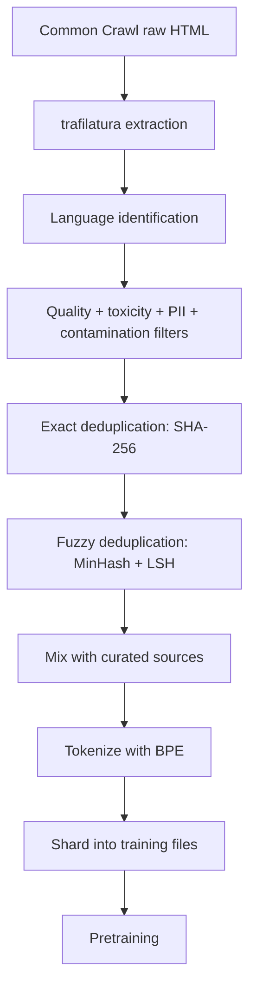

# 03 — Data Pipelines and Deduplication

> [!info] TL;DR
> Pretraining data quality is the single biggest determinant of LLM quality. A 7B model trained on 2T tokens of well-curated, deduplicated, filtered data outperforms a 70B model trained on 5T tokens of raw web scrape. The data pipeline has four stages: **collection** (gather raw text), **extraction** (strip HTML, boilerplate, navigation), **filtering** (remove low-quality, toxic, or non-text content), and **deduplication** (remove near-duplicate documents). Each stage has well-established best practices and tooling. Skipping any stage — especially deduplication — silently degrades model quality.

## Why Data Pipelines Matter

The Chinchilla scaling laws (Hoffmann et al., 2022) showed that for compute-optimal training, you need ~20 tokens per parameter. A 70B model needs 1.4T tokens. But this assumes the tokens are high-quality. If the data contains duplicates, low-quality text, or irrelevant content, the effective compute-per-quality-token drops dramatically.

Empirical studies have shown:

- **Deduplication** alone can improve benchmark performance by 5-15% (Lee et al., 2022).
- **Quality filtering** (keeping only high-quality text) can improve performance by 10-20%.
- **Toxic content filtering** reduces harmful generations without hurting general capability.
- **Code and math upweighting** improves reasoning even on non-code/math tasks.

A common saying in LLM training: "garbage in, garbage out, but at scale." The same scaling laws that make data quality matter for small models make it critical for large models — every issue is multiplied by the data scale.

## Stage 1: Collection

### Sources

Pretraining data comes from:

- **Web crawls**: Common Crawl (the dominant source, ~5TB raw text per crawl), CC-Stories (filtered story-like content).
- **Curated corpora**: Wikipedia, GitHub (code), arXiv (scientific papers), StackExchange (Q&A), PubMed (medical).
- **Books**: Books3 (controversial — copyright issues), Project Gutenberg (public domain).
- **News**: Common Crawl includes news; some teams license additional news corpora.
- **Proprietary data**: licensed data from publishers, internal data, synthetic data.

The mix matters. Llama 3's pretraining mix is roughly 50% web, 20% code, 17% books, 5% scientific, 8% other. The exact mix is a hyperparameter tuned via ablations.

### Formats

Raw data comes in many formats: HTML, PDF, JSON, XML, plain text. The pipeline must normalize to a common format (typically JSONL with `text`, `source`, `timestamp`, `url` fields).

### Volume vs. Quality Trade-off

More data is better only if it's high-quality. A 1T-token corpus of well-filtered data beats a 5T-token corpus of mixed quality. The "quality per token" metric matters more than raw token count.

## Stage 2: Extraction

### HTML Stripping

Web pages contain text mixed with navigation, ads, boilerplate, and formatting. Extraction removes the noise and keeps the content.

Tools:

- **trafilatura**: a Python library for web content extraction. Good balance of speed and quality.
- **resiliparse**: a fast C-based HTML parser and content extractor.
- **boilerpipe**: an older Java-based tool; less maintained.
- **Newspaper3k**: news-focused extractor.

The extraction step must preserve structure (paragraphs, headings, lists) while removing noise. Aggressive extraction (treating everything as one text blob) loses structure; conservative extraction (keeping all HTML) keeps noise.

### PDF Extraction

PDFs are a major source of scientific and technical content but are notoriously hard to parse. Tools:

- **GROBID**: a machine-learning-based PDF parser, good for scientific papers.
- **PyMuPDF (fitz)**: fast PDF text extraction.
- **pdfplumber**: more accurate but slower.
- **Nougat** (Meta, 2023): a neural PDF parser that handles formulas and tables. Better than rule-based tools for scientific PDFs.

PDF extraction quality varies wildly. For pretraining, expect to lose ~10-20% of PDF content to extraction failures.

### Boilerplate Removal

Even after HTML stripping, pages contain boilerplate: cookie notices, navigation menus, related-content links. Boilerplate detection uses:

- **Density-based**: text density (characters per line) identifies content vs. boilerplate.
- **Structural**: HTML structure (main content vs. sidebar) identifies content.
- **ML-based**: trained classifiers identify content blocks.

### Language Identification

Use **fastText's language identification model** to tag each document with its language. Documents below a confidence threshold (e.g., 0.7) are discarded. This is essential for multilingual models — you don't want English-training to be polluted by misclassified non-English text.

## Stage 3: Filtering

### Quality Filters

Quality filtering removes low-quality text. Approaches:

- **Perplexity filtering**: use a small LM (e.g., a 1B model trained on Wikipedia) to score documents. High perplexity = low quality. Keep documents with perplexity below a threshold.
- **Heuristic filters**: word count, average word length, ratio of stopwords, ratio of digits, presence of obscenities. These are crude but fast.
- **Classifier-based**: train a binary classifier on (high-quality, low-quality) document pairs. Apply to filter the corpus.

The CCNet pipeline (Wenzek et al., 2020) is the standard reference for quality filtering. It uses a 5-gram KenLM model trained on Wikipedia to score documents.

### Toxic Content Filtering

Toxic content (hate speech, violence, adult content) should be filtered for safety. Tools:

- **Toxic-BERT**: a classifier fine-tuned on the Jigsaw toxicity dataset.
- **List-based**: regex matching against word lists (crude but fast).
- **Block-list URLs**: filter content from known-bad domains.

Be careful: aggressive toxic filtering can remove legitimate content (medical text about violence, historical accounts of war). Tune thresholds carefully.

### Personally Identifiable Information (PII)

PII (SSNs, phone numbers, email addresses, credit card numbers) should be redacted:

- **Regex-based**: patterns for common PII formats.
- **NER-based**: named entity recognition for names, addresses, organizations.
- **Differential privacy**: add noise to rare n-grams (advanced; rarely used in pretraining).

### Contamination Filtering

Benchmark contamination (training data containing test set questions) inflates benchmark scores. Filter:

- Exact-match: remove documents containing exact benchmark questions.
- N-gram match: remove documents with high n-gram overlap with benchmarks.
- Fuzzy match: remove documents with high fuzzy similarity.

This is essential for credible benchmark numbers. Models trained on contaminated data look better than they are.

## Stage 4: Deduplication

### Why Deduplication Matters

Web data is highly duplicative:

- **Exact duplicates**: the same document appears at multiple URLs (mirrors, copies).
- **Near-duplicates**: the same document with minor edits (typos fixed, formatting changed).
- **Template-based**: boilerplate pages generated from templates (e.g., e-commerce product pages).
- **Cross-source**: Wikipedia content is copied into many other sources.

Without deduplication, the model sees the same content multiple times and overfits to it. This wastes training compute and produces biased models.

Lee et al. (2022) showed that deduplication improves benchmark performance by 5-15% across model sizes. The effect is largest for models trained on more data — duplicates compound with scale.

### Exact Deduplication

Exact deduplication removes documents with identical content. Implementation:

1. Compute a hash (e.g., SHA-256) of each document's normalized text.
2. Keep only the first document with each hash.

This is fast and catches exact duplicates. Tools: Apache Spark's `dropDuplicates`, custom hash-based deduplication.

### Fuzzy (Near-Duplicate) Deduplication

Fuzzy deduplication removes documents that are similar but not identical. Approaches:

- **MinHash + LSH** (Locality-Sensitive Hashing): the standard approach. Compute MinHash signatures for each document; use LSH to find candidate pairs; verify with Jaccard similarity.
- **SimHash**: an alternative LSH technique. Compute a 64-bit fingerprint; documents with small Hamming distance are near-duplicates.
- **Embedding-based**: encode documents as embeddings; cluster; remove within-cluster duplicates. More expensive but catches semantic duplicates.

MinHash + LSH is the production standard. It scales to trillion-token corpora efficiently. The standard reference implementation is in the DCLM (DataCombiner) and CommonCatalog pipelines.

### Document-Level vs. Paragraph-Level Deduplication

- **Document-level**: remove duplicate documents. Catches mirror pages, copied articles.
- **Paragraph-level**: remove duplicate paragraphs within and across documents. Catches boilerplate paragraphs (e.g., "About the author" sections copied across many sites).

Production pipelines do both: document-level first (cheaper), then paragraph-level on the deduplicated set.

### Deduplication at Training Time

Even after offline deduplication, online (in-batch) deduplication helps: ensure that no two documents in the same batch are too similar. This prevents the model from memorizing specific phrasings. Implementation: maintain a rolling window of recent documents; reject new documents with high similarity to any in the window.

## The Production Pipeline

A modern pretraining data pipeline looks like:

Each stage is parallelized across hundreds of CPU machines. The full pipeline for a 5T-token corpus takes days to weeks on a cluster of 100+ machines.

## Tools and Frameworks

- **CCNet**: Facebook Research's pipeline for Common Crawl processing. Reference implementation for quality filtering.
- **DCLM (DataCombiner)**: a modular pipeline from the DataComp-LM project. Modern, well-tested.
- **CommonCatalog**: a catalog of processed Common Crawl snapshots.
- **Datatrool**: HuggingFace's data processing library. Good for smaller-scale pipelines.
- **Spark**: distributed processing for the deduplication step.
- **Ray**: alternative distributed framework; some pipelines use Ray instead of Spark.

## Practical Recommendations

- **Don't skip deduplication.** It's the single highest-ROI data processing step.
- **Use perplexity filtering** for quality. A 1B model trained on Wikipedia is sufficient.
- **Filter benchmarks aggressively.** Contamination is the most common cause of inflated benchmark numbers.
- **Version your data.** Track which documents came from which sources, processed by which pipeline version. Reproducibility requires this.
- **Build a held-out evaluation set** from your data. Sample 1000 documents after each stage; manually inspect. This catches pipeline regressions early.
- **Mix sources deliberately.** Web data is broad but noisy; curated data is high-quality but narrow. The mix is a key hyperparameter.

## See Also

- [[01 - Pretraining Objectives and Scaling Laws]] — what to do with the data
- [[02 - Distributed Training]] — how to train on it
- [[04 - Mixed Precision Training]] — numerical considerations
- [[05 - Loss Spikes and Stability]] — what happens when data is bad
- [[06 - Embedding Model Training]] — data pipelines for embedding models
- [[11 - Training/MOC|11 Training MOC]]

## Interview Questions

1. **Q: Why is deduplication the single highest-ROI data processing step?**
   A: Web data is highly duplicative (mirrors, copies, templates). Without dedup, the model sees the same content multiple times and overfits to it. Lee et al. (2022) showed dedup improves benchmark performance by 5-15%. It's cheap (MinHash+LSH) and has the highest quality-per-compute ratio of any data processing step.

2. **Q: How does MinHash + LSH work for fuzzy deduplication?**
   A: MinHash computes a signature (e.g., 128 hashes) for each document by hashing its n-grams and keeping the minimum. LSH (Locality-Sensitive Hashing) buckets documents with similar signatures. Candidate pairs are verified with Jaccard similarity. This scales to trillion-token corpora efficiently — O(n) per document, not O(n²) pairwise.

3. **Q: What is perplexity filtering and why does it work?**
   A: Use a small LM (e.g., 1B trained on Wikipedia) to score each document. High perplexity = low quality (the document is surprising/unusual). Keep documents below a threshold. This works because Wikipedia is high-quality text; documents that are "surprising" to a Wikipedia-trained model are likely low-quality (spam, gibberish, boilerplate).

4. **Q: How do you handle benchmark contamination in training data?**
   A: Three approaches: (1) exact-match — remove documents containing exact benchmark questions; (2) n-gram match — remove documents with high n-gram overlap with benchmarks; (3) fuzzy match — remove documents with high fuzzy similarity. This is essential for credible benchmark numbers.

5. **Q: What is the ideal data mix for LLM pretraining?**
   A: Llama 3's mix is roughly 50% web, 20% code, 17% books, 5% scientific, 8% other. Code and math upweighting improves reasoning even on non-code/math tasks. The mix is a hyperparameter tuned via ablations. Too much web → broad but noisy; too much curated → high-quality but narrow.

6. **Q: How does data quality interact with scaling laws?**
   A: Chinchilla's 20 tokens/parameter ratio assumes high-quality data. If data contains duplicates or low-quality text, the effective compute-per-quality-token drops. A 7B model on 2T well-curated tokens outperforms a 70B model on 5T raw web scrape. Quality matters more than quantity.

## Connection to Other Concepts

- [[26 - Papers/2024-2026/42 - Scaling Laws (Kaplan and Chinchilla)|Scaling Laws]] — data quality affects compute-optimal training.
- [[11 - Training/Pretraining/01 - Pretraining Objectives and Scaling Laws|Pretraining Objectives]] — what the data is used for.
- [[11 - Training/Optimization/05 - Loss Spikes and Stability|Loss Spikes]] — bad data causes spikes.
- [[05 - NLP Fundamentals/Tokenization/01 - Tokenization Overview|Tokenization Overview]] — tokenization is applied after data processing.
- [[22 - Production AI/Security/05 - PII and Data Leakage|PII and Data Leakage]] — PII filtering in data pipelines.
